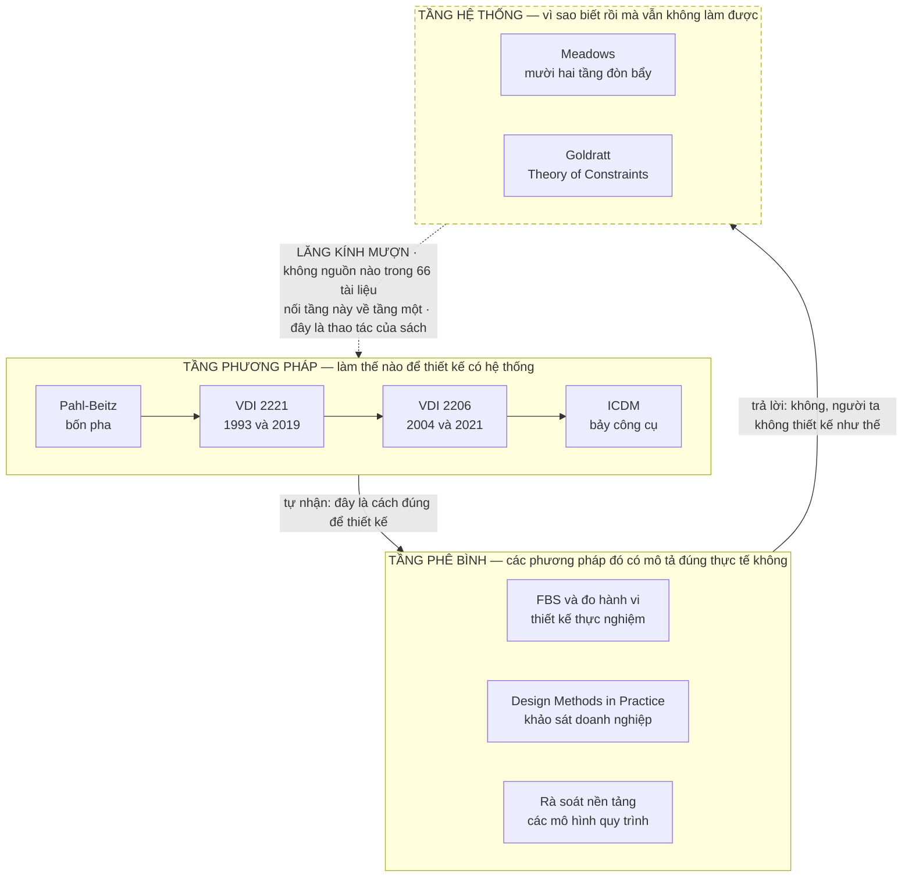
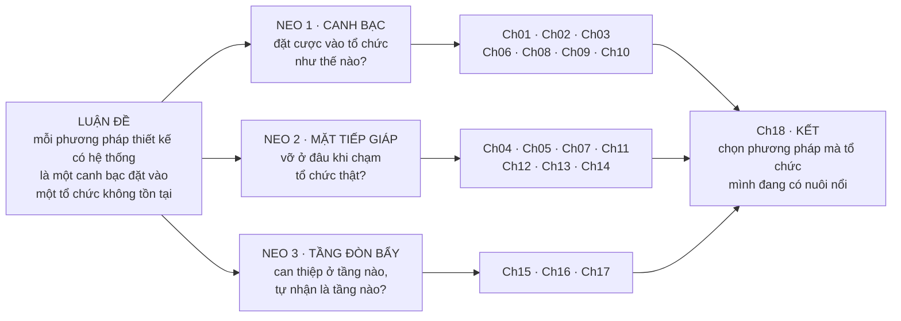

# Chương 01 — Một quy trình không bao giờ chạy như trên giấy

Có một mẫu hình mà bất kỳ ai từng ban hành quy trình thiết kế trong một tổ chức thật đều đã sống qua ít
nhất một lần: quy trình đúng về kỹ thuật, được chọn cẩn thận, được đào tạo tử tế — và sáu tháng sau,
không ai còn dùng. Không phải vì nó sai. Kiểm lại từng bước thì từng bước đều đứng vững. Nó chết vì một
lý do khác hẳn, và cái lý do đó không nằm trong tài liệu quy trình, không nằm trong tiêu chuẩn, không
nằm ở bất kỳ chỗ nào mà một kỹ sư được huấn luyện để tìm. Chương này đặt tên cho lý do đó. Thiếu nó,
phần còn lại của cuốn sách chỉ là một chuyến tham quan có trật tự qua bốn thế hệ phương pháp — người đọc
khép sách lại biết chuyện gì đã xảy ra, không biết mình nên làm gì.

Đây là chương mở, nên không có chương trước để nối về. Thứ nó nối tới thì có: **Chương 02** nhận từ đây
nhiệm vụ dựng bộ từ vựng chung — hệ thống kỹ thuật, ba dòng chảy, trục quy định ↔ mô tả — vì từ chương
này trở đi cuốn sách sẽ dùng những từ đó như thể đã thoả thuận. **Chương 13** nhận từ đây một món nợ
lớn hơn: năm giả định tổ chức chỉ được điểm mặt ở đây, và được mở ra đầy đủ, kèm bằng chứng từng cái,
ở chương trung tâm của cuốn sách.

Ba thứ người đọc mang đi được khỏi chương này. Thứ nhất: một mẫu hình đủ sắc để nhận ra ngay lần sau
gặp lại, kèm bằng chứng rằng nó không phải giai thoại của riêng ai — năm khối tài liệu độc lập về niên
đại, ngôn ngữ và trường phái đã liệt kê ra gần như cùng một danh sách. Thứ hai: ba neo mà mọi chương
sau đều nối về, và bảng chỉ rõ chương nào nối về neo nào. Thứ ba, và đây là thứ ít sách nào đưa: **giới
hạn chứng cứ của chính cuốn sách này**, viết đầy đủ, đặt ở nơi người đọc còn tỉnh táo để cân nhắc.

---

## Cái chết của một quy trình, kể theo trình tự đã lặp đủ nhiều lần để thành mẫu hình

Trình tự thường như sau.

Một tổ chức nhận ra thiết kế của mình phụ thuộc quá nhiều vào một vài cái đầu. Quyết định lặp lại được
thì ít, quyết định phải hỏi lại người cũ thì nhiều. Có người đề xuất áp một phương pháp có hệ thống —
Pahl-Beitz, hoặc VDI 2221, hoặc một biến thể nội bộ nào đó. Đề xuất được duyệt. Có mẫu biểu, có buổi
đào tạo, có một dự án thí điểm được chọn vì nó "sạch". Dự án thí điểm chạy tốt. Tài liệu đẹp hơn hẳn.
Quy trình được ban hành cho toàn bộ.

Rồi ba việc xảy ra, gần như luôn theo thứ tự này.

**Việc thứ nhất — bước trừu tượng bị nuốt trước.** Phân rã chức năng, trừu tượng hoá bài toán về dạng
trung lập với giải pháp, dựng ma trận hình thái: đây là những bước tốn thời gian nhất và có ít nhất để
trình ra trong một cuộc họp tiến độ. Chúng biến mất đầu tiên. Không ai ra lệnh bỏ. Chúng chỉ bị làm
sau, rồi làm cho có, rồi thôi.

**Việc thứ hai — tài liệu tách khỏi thiết kế.** Bản vẽ vẫn ra, sản phẩm vẫn chạy, nhưng hồ sơ quy trình
được viết lùi lại sau khi quyết định đã chốt. Nó không còn ghi lý do; nó ghi biện minh. Đây là điểm mà
một quy trình chết mà chưa ai nhận ra, vì mọi chỉ số tuân thủ vẫn xanh.

**Việc thứ ba — quy trình trở thành thứ dành cho người mới.** Kỹ sư có kinh nghiệm được ngầm miễn trừ,
vì họ nhanh hơn khi không theo. Người mới thì bám chặt, vì đó là chỗ trú an toàn khi có sự cố. Đến đây
quy trình đã hoàn tất việc đổi chức năng: từ công cụ tư duy thành công cụ phòng vệ trách nhiệm.

Không bước nào trong ba bước trên là lỗi kỹ thuật của phương pháp. Cả ba đều là **phản ứng của tổ chức**
trước một đòi hỏi mà phương pháp đặt ra nhưng không viết thành lời.

Nguồn ghi lại đúng chuỗi này, dù mỗi nguồn chỉ thấy một khúc. Về khúc thứ nhất, tài liệu tuyến Pahl-Beitz
mô tả điều kiện hỏng là *thiếu thời gian và thiếu tiền*: khi doanh nghiệp bị bóp về nguồn lực, các bước
tuần tự buộc phải bị bóp méo, lược bỏ hoặc gộp lại, và các phiên thảo luận người dùng bị thay bằng ý
kiến chuyên gia chủ quan. Về khúc thứ ba, cùng tuyến tài liệu ghi một quan sát sắc hơn nhiều so với vẻ
ngoài của nó: hệ thống chỉ chạy trơn khi có **quản lý dự án dày dạn dám lược bỏ bước**, còn trong tổ
chức nhiều kỹ sư trẻ, nỗi sợ trách nhiệm khi thất bại khiến họ bám cứng vào việc làm tối đa tài liệu.

Đọc câu đó cho kỹ. Nó nói rằng phương pháp chỉ hoạt động khi có người **đủ thẩm quyền để không tuân
thủ nó**. Một phương pháp mà điều kiện vận hành là sự vi phạm có chọn lọc thì nó không phải là quy
trình theo nghĩa nó tự nhận. Nó là một khung mà chất lượng đầu ra phụ thuộc vào phán đoán của người
cầm khung — đúng cái thứ mà việc hệ thống hoá được đặt ra để thay thế.

---

## Năm khối tài liệu, hỏi cùng một câu, trả về gần như cùng một danh sách

Nếu mẫu hình trên chỉ là kinh nghiệm cá nhân thì nó không đáng dựng thành một cuốn sách. Bằng chứng
rằng nó không phải kinh nghiệm cá nhân đến từ một phép thử có thể mô tả lại được.

Năm truy vấn xuyên suốt chạy trên **năm notebook khác nhau**, mỗi notebook chứa một khối tài liệu riêng,
không notebook nào thấy câu trả lời của notebook kia. Cả năm nhận cùng một câu hỏi: *phương pháp này giả
định gì về tổ chức áp dụng nó, và giả định đó hỏng khi nào*. Năm khối tài liệu này khác nhau về niên đại
(1977 đến 2021), về ngôn ngữ gốc (Đức, Anh, Tây Ban Nha), về trường phái (quy định, phê bình, tư duy hệ
thống) và về ngành (cơ khí thuần, cơ điện tử, hệ thống thực-ảo).

Chúng trả về danh sách gần trùng khớp.

| Khối tài liệu | Giả định về tổ chức | Điều kiện hỏng mà chính khối đó nêu |
|---|---|---|
| Pahl-Beitz, toàn văn — nguồn [1] | Hợp tác liên ngành phá bỏ ranh giới phòng ban; đồng thuận văn hoá tuyệt đối giữa kỹ sư và quản lý; hạ tầng quản lý dữ liệu kỹ thuật mạnh | Cấu trúc "silo" hành chính; áp lực thời gian cực hạn; đứt gãy văn hoá đồng thuận khi quản lý mất kiên nhẫn đòi bản vẽ ngay; hạ tầng số hoá yếu |
| Tuyến công cụ và phê bình Pahl-Beitz — [29], [31], [36], [42], [43] | Tổ chức thuần nhất và duy lý; ràng buộc tài nguyên được nới lỏng đủ để chạy tuần tự trọn vẹn | Thiếu thời gian và tiền; chính trị nội bộ và lợi ích cục bộ; nổ tổ hợp làm tê liệt việc chấm chọn; kỹ sư trẻ sợ trách nhiệm nên làm tối đa tài liệu |
| Tuyến VDI 2221 — [2], [12], [13], [15] | Nguồn lực dồi dào cho pha trừu tượng đầu dự án; nhân sự thành thạo tư duy hệ thống; kỷ luật quy trình cực cao và thuật ngữ thống nhất giữa các phòng ban | Doanh nghiệp vừa và nhỏ; hành vi nhận thức tự nhiên của kỹ sư (nhảy sang giải pháp vật lý rất sớm); điểm gãy khi bàn giao cho nhà thầu phụ |
| Tuyến VDI 2206 — [19], [20], [23], [26] | Kỹ thuật đồng thời và giao tiếp thông suốt liên phòng ban; kỹ sư đa ngành dùng chung một ngôn ngữ mô hình hoá; ngân sách và hạ tầng đủ cho PLM tích hợp | Cát cứ thông tin giữa các miền kỹ thuật; khoảng trống liên thông công cụ khiến dữ liệu mô hình không ánh xạ được sang bản vẽ; gánh nặng quản lý với doanh nghiệp nhỏ |
| Tuyến tư duy hệ thống — [59]–[65] | Luồng thông tin lưu chuyển tự do và phản hồi lỗi được tôn trọng; lãnh đạo sẵn sàng buông bỏ kiểm soát | Văn hoá trừng phạt kích hoạt phòng vệ bản ngã, thông tin bị bóp méo; lãnh đạo coi tính không dự đoán được là mối đe doạ tới quyền lực |

Sự trùng khớp này là dữ kiện trung tâm của cuốn sách. Không phải vì nó chứng minh phương pháp nào đúng —
nó không chứng minh điều đó — mà vì nó cho thấy **các nhà phương pháp luận đều biết**. Họ viết giả định
của mình ra, hoặc để nó lộ ra đủ rõ cho người đọc kỹ nhìn thấy. Vấn đề không phải là giả định bị giấu.
Vấn đề là giả định được ghi ở chỗ không ai đọc trước khi quyết định áp dụng, và không phương pháp nào
biến việc kiểm giả định thành một bước bắt buộc của chính nó.

Từ đó ra thuật ngữ đầu tiên của cuốn sách. **Canh bạc tổ chức** là tập giả định ngầm mà một phương pháp
đặt vào tổ chức áp dụng nó. Mọi phương pháp đều có một canh bạc. Không phương pháp nào trong corpus này
bắt người dùng đọc canh bạc trước khi đặt cược.

Hai chỗ trong tài liệu cho thấy cái giá của việc không đọc.

Chỗ thứ nhất là một phép đo hiếm hoi về khoảng cách giữa quy trình chính thức và việc thật. Nghiên cứu
trong tuyến phê bình ghi rằng một tỷ lệ lớn dự án của công ty khảo sát — `"...revealed that a large number
of the company's projects (roughly 30%) were results of other initiatives than the formal technology
planning."` — sinh ra từ những sáng kiến **ngoài** quy hoạch công nghệ chính thức [43]. Ba trong mười dự
án đi vòng qua hệ thống mà tổ chức tin là nơi dự án được sinh ra.

Chỗ thứ hai là một giới hạn được nói thẳng bằng con số. Về ma trận đánh giá, nguồn tuyến ICDM ghi
`"A matrix of more than 20x20 or 15x25 is impractical to handle because it consumes too much time."` [36].
Đây là lời của chính người xây công cụ, nói rằng công cụ có trần vận hành. Trần đó không nằm ở toán học;
nó nằm ở sức chịu đựng của một nhóm người trong một phòng họp.

---

## Điều mà chính nguồn quy định nhất trong corpus đã tự viết ra

Nếu chỉ có phe phê bình nói rằng phương pháp không chạy như trên giấy thì đó là một cuộc cãi vã giữa hai
trường phái, và người đọc có quyền chọn phe. Chuyện đáng kể hơn nhiều: **phe quy định đã tự viết ra điều
đó, trong chính văn bản quy định nhất của mình.**

Pha cụ thể hoá của Pahl-Beitz thường được trích như một quy trình có số bước cố định. Mở toàn văn bản
tiếng Anh lần ba, mục *Steps of Embodiment Design*, thì câu **liền trước** danh sách viết:

> `"Because of this, it is not always possible to draw up a strict plan for the embodiment design phase.
> However, it is possible to suggest a general approach with main working steps, see Figure 7.1."` [1]

Và ngay trong cùng mục, hai câu bổ trợ:

> `"Unlike conceptual design, embodiment design involves a large number of corrective steps in which
> analysis and synthesis constantly alternate and complement each other."` [1]

> `"In the embodiment phase, unlike the conceptual phase, it is not necessary to lay down special methods
> for every individual step, however the following recommendations might prove useful."` [1]

Cái thường được đọc thành *quy trình bắt buộc* vốn được viết ra như *gợi ý*, kèm lời phủ nhận rằng không
thể lập kế hoạch chặt cho pha này. Khoảng cách giữa hai cách đọc đó không do tác giả tạo ra. Nó do tổ
chức tạo ra, vì tổ chức cần một thứ có thể kiểm tra tuân thủ, mà một gợi ý thì không kiểm được.

Đây là bằng chứng nội tại mạnh nhất cho luận đề của cuốn sách, và Chương 03 sẽ mở nó ra đầy đủ. Ở đây nó
làm một việc hẹp hơn: cho thấy mặt tiếp giáp không phải là chỗ tổ chức hiểu sai phương pháp. Mặt tiếp
giáp là chỗ tổ chức **cần một thứ khác** với thứ phương pháp đưa ra, và lặng lẽ chuyển hoá nó.

> **Đào sâu: hội tụ của năm truy vấn không phải là năm bằng chứng độc lập**
>
> Bảng ở mục trên trông giống năm nhân chứng riêng biệt cùng khai một lời. Nó không hẳn vậy, và chỗ nó
> không hẳn vậy phải nói ra ngay chứ không để đến khi có người bắt được.
>
> Năm khối tài liệu là độc lập — khác notebook, khác nguồn, không khối nào thấy câu trả lời của khối kia.
> Nhưng **cùng một mô hình ngôn ngữ đã đọc cả năm và viết ra cả năm câu trả lời**. Một mô hình có thiên
> hướng diễn đạt sẽ tạo ra sự giống nhau ở lớp từ ngữ mà không có sự giống nhau ở lớp bằng chứng. Đó là
> một cơ chế tạo trùng khớp giả, và nó không thể loại trừ bằng cách chạy thêm truy vấn.
>
> Cách xử lý đã chốt: mỗi giả định trong Chương 13 phải truy được về **trích dẫn nguyên văn trong tài
> liệu gốc**, không chỉ về câu tổng hợp. Giả định nào không truy được sẽ bị hạ xuống phụ lục và đánh dấu
> chưa kiểm. Bảng ở chương này giữ nguyên vai trò của nó — dấu hiệu đủ mạnh để đi tìm, chưa phải kết luận.
>
> Ghi thêm một chi tiết cùng loại, vì nó nói lên đặc tính của công cụ. Trên toàn bộ 37 truy vấn của dự
> án, metadata xuất xứ của công cụ **bỏ sót 62 trên 173 lượt nguồn** — nghĩa là công cụ nhiều lần dùng
> một tài liệu mà không khai rằng đã dùng. Mọi khai báo nguồn trong vật liệu làm việc vì thế lấy hợp của
> metadata và kết quả quét tên tệp trong thân bài. Không có bước đó thì mỗi trích dẫn trong cuốn sách này
> có xác suất trỏ sai nguồn mà vẫn trông chỉn chu.

---

## Corpus của cuốn sách: ba tầng, và tầng thứ ba là thứ đi mượn

Sáu mươi sáu tài liệu của cuốn sách này rơi vào ba tầng, và mỗi tầng trả lời một câu khác nhau.

Tầng phương pháp là phả hệ chính: mỗi thế hệ mở rộng thế hệ trước ở đúng chỗ nó gãy. Tầng phê bình đặt
câu hỏi liệu phả hệ đó có mô tả đúng cách con người thật sự thiết kế, và trả lời là không. Tầng hệ thống
trả lời câu mà **không tầng nào trong hai tầng kia tự trả lời được**: vì sao biết rồi mà vẫn không làm
được.

Meadows xếp hạng mười hai điểm đòn bẩy — `"Chapter 6 presents Meadows' 12-point leverage hierarchy—the
practical culmination of systems thinking."` [62] — đặt hệ hình tư duy ở tầng L2 gần đỉnh và thông số bề
nổi ở L12 đáy bảng, rồi ghi một quan sát định lượng về chỗ nỗ lực thực tế đổ vào:

> `"Probably 90—no 95, no 99 percent—of our attention goes to parameters, but there's not a lot of
> leverage in them."` [62]

Bản phân tích Theory of Constraints trong corpus tự xếp chính nó, và tự ghi điều kiện hỏng của mình:
`"Mental model resistance L2 (Paradigm) Implementation fails if paradigm unchanged"` [65].

Đặt hai thứ cạnh nhau thì ra vế thứ hai của luận đề: phổ biến một quy trình thiết kế mới trong khi hệ
hình tổ chức không đổi chính là can thiệp ở tầng thấp nhất, và nó sẽ trượt.

**Và đúng ở câu vừa rồi cuốn sách này làm một việc mà không nguồn nào của nó làm.** Chỗ đó phải được
khai báo, không phải ở phụ lục.

---

## Ba khai báo về giới hạn chứng cứ của cuốn sách này

Cuốn sách sắp dành mười bảy chương để hỏi các phương pháp khác rằng chúng đặt cược vào giả định nào mà
không viết ra. Một cuốn sách làm việc đó mà bản thân có giả định không khai báo thì tự phá luận điểm
của chính mình trước khi luận điểm kịp đứng. Ba khai báo dưới đây vì thế không phải lời xin lỗi. Chúng
là phép thử: cùng một tiêu chuẩn mà cuốn sách sắp dùng để chấm người khác, áp lên chính nó trước, ở
trang đầu, khi người đọc còn đủ tỉnh táo để quyết định có tin hay không.

Ba khai báo này viết đầy đủ **duy nhất ở đây**. Các chương sau nhắc lại khi dùng, không lặp toàn văn.

### Khai báo 1 — Khung ba tầng là tổng hợp của cuốn sách, không phải phát hiện của nguồn nào

Không một nguồn nào trong 66 tài liệu đặt Meadows cạnh Pahl-Beitz. Việc xếp corpus thành ba tầng và dùng
tầng thứ ba để giải thích hai tầng kia là thao tác của cuốn sách này. Meadows và Goldratt **không viết
một chữ nào về thiết kế kỹ thuật**.

Ranh giới cứng, áp cho toàn bộ phần còn lại: dùng họ làm **lăng kính** là hợp lệ; dùng họ làm **bằng
chứng về thiết kế kỹ thuật** thì không. Khi Chương 16 xếp từng công cụ thiết kế vào một tầng đòn bẩy,
mọi ô trong bảng đó là suy luận của tác giả trừ những ô có căn cứ trích dẫn ghi kèm — và bảng bắt buộc
có một cột riêng để ghi điều đó. Đây là chỗ dễ vỡ nhất của cuốn sách, và nó vỡ ở Chương 16 chứ không ở
đây.

### Khai báo 2 — Corpus không có toàn văn tiêu chuẩn VDI nào

Cuốn sách nói khá nhiều về VDI 2221 và VDI 2206. Nó chưa từng đọc toàn văn của cả hai.

Thứ gần nhất trong corpus là một **bản trích mẫu song ngữ Đức–Anh của VDI 2221 Blatt 1 (2019), 27.608 ký
tự**, cộng hai mục lục: mục lục VDI 2221 Blatt 1 (12.033 ký tự) và mục lục VDI/VDE 2206 bản tháng 11 năm
2021 (45.238 ký tự). Mọi khẳng định về *nội dung* tiêu chuẩn trong cuốn sách này đi qua tài liệu thứ cấp
— bài báo bình duyệt, chương sách, bài giảng của người tham gia soạn thảo.

Hệ quả người đọc cần cầm theo: khi cuốn sách viết *"tiêu chuẩn ghi rằng…"*, hãy đọc là *"tài liệu thứ cấp
tường thuật rằng tiêu chuẩn ghi rằng…"*, trừ những chỗ trích thẳng bản trích mẫu và có ghi rõ. Đây không
phải chi tiết vụn. Một cuốn sách về tiêu chuẩn mà chưa đọc tiêu chuẩn thì phải nói ra, nếu không nó đang
làm đúng cái việc mà nó buộc tội các tổ chức: trình bày một thứ đã qua nhiều lớp diễn giải như thể là
văn bản gốc.

Có một khoảng trống nữa, ghi cho đủ: mục lục bản dự thảo VDI 2221 Blatt 1 nằm trong corpus mà **không
cụm khai thác nào chạm tới**, kể cả khi đã khoanh riêng để vét. Ghi nhận là trống, không suy diễn.

### Khai báo 3 — Một nguồn chiếm 32% corpus

Toàn văn *Engineering Design: A Systematic Approach* bản tiếng Anh lần ba — nguồn [1] — một mình chiếm
**1.167.487 trên 3.685.452 ký tự** của toàn bộ vật liệu, tức 32%. Nguồn lớn thứ hai chỉ có 118.650 ký tự.

Khi một chương của cuốn sách này trích dày từ [1], có hai cách giải thích và không cách nào loại trừ được
cách kia bằng bản thân số lượt trích: có thể vì [1] đúng, cũng có thể chỉ vì [1] dài. Công cụ tìm kiếm
theo ngữ nghĩa ưu ái nguồn dài một cách có hệ thống — dự án này đo được rằng **8 nguồn chỉ nổi lên khi bị
khoanh riêng**, và một trong tám là nguồn lớn thứ hai toàn corpus.

Xử lý đã chốt: chương nào lệch quá về [1] phải bổ sung đối chứng từ nguồn ngoài, và mọi khẳng định về
*hiệu quả* của phương pháp Pahl-Beitz phải có ít nhất một nguồn không phải [1].

### Khai báo phụ — luật này đã bắt chính luận đề của cuốn sách, và luận đề đã phải sửa

Bản thảo đầu của luận đề viết *"nửa thế kỷ cải tiến phương pháp đã cải thiện tài liệu chứ không
cải thiện người thiết kế"*. Khi chương này được viết, luật "mọi con số phải có nguyên văn" được áp lên
chính câu đó — và nó **trượt**. Không nguồn nào trong sáu mươi sáu tài liệu viết ra con số sáu mươi năm,
và phép tính cũng không đỡ: bản tiếng Đức đầu của *Konstruktionslehre* ra năm 1977, tức bốn mươi chín năm.

**Luận đề đã được sửa thành "nửa thế kỷ"** — con số duy nhất có nguyên văn chống lưng.

Những gì corpus thật sự nói, nguyên văn:

| Mốc | Nguyên văn | Nguồn |
|---|---|---|
| Ý tưởng hệ thống hoá xuất hiện sớm | `"Modern systematic ideas were pioneered by Erkens [1.46] in the 1920s."` | [1] |
| Động lực đẩy tư duy hệ thống đi rộng | `"A period of staff shortages in the 1960s [1.190] created a strong impetus to adopt systematic thinking more widely."` | [1] |
| Tiêu chuẩn VDI đầu tiên về phương pháp | `"The first VDI Standards on methods of product design were published in the 1970s."` | [15] |
| Pahl-Beitz bản tiếng Đức đầu tiên | `"The first German edition of Konstruktionslehre was published in 1977."` | [1] |
| Bề dày phát triển hướng dẫn thiết kế | `"Design guidelines have been developed over the past 50 years."` | [13] |

Phép đếm duy nhất mà một nguồn tự đưa ra là **năm mươi năm**. "Sáu mươi năm" là cách gộp mốc thập
niên 1960 với hiện tại — nghe hợp lý, và chính vì nghe hợp lý nên nó suýt đi thẳng vào bản in.

Chuyện này đáng kể ra không phải vì con số. Mười một năm chênh lệch không đổi lập luận nào. Nó đáng kể
vì **thứ bắt được lỗi không phải là sự cẩn thận, mà là một luật cơ học**: mọi con số phải chỉ ra được
câu nguyên văn của nó, nếu không thì bỏ. Luật đó không quan tâm ai viết ra con số. Một cuốn sách buộc
tội các phương pháp khác mang giả định không khai báo mà lại miễn trừ cho giả định của chính mình thì
đã tự thua ngay ở câu đầu.

Đây cũng là dịp tốt để nói ra luật đó, vì nó chi phối mọi chương sau. **Mọi con số trong cuốn sách này
đều kèm câu trích nguyên văn. Chỗ nào nguồn liệt kê đủ mục mà không tự đếm, cuốn sách viết ra rằng nguồn
không tự đếm, thay vì đếm hộ.** Việc điền con số vào giúp một tài liệu là lỗi khó thấy nhất trong loại
sách này: mọi thứ đều đúng trừ chỗ quan trọng nhất, tức là nguồn có nói thế hay không.

---

## Ba neo, và chương nào nối về đâu

Ba câu hỏi chạy suốt mười tám chương. Mỗi chương nối về ít nhất một, và nối rõ ràng trong văn bản chứ
không để người đọc tự suy.

**Neo 1 — Canh bạc.** *Phương pháp này đặt cược vào tổ chức như thế nào?* Mọi phương pháp đòi hỏi một
loại tổ chức nhất định để chạy được. Câu hỏi này moi đòi hỏi đó ra khỏi mực vô hình.

**Neo 2 — Mặt tiếp giáp.** *Nó vỡ ở đâu khi chạm tổ chức thật, và bằng chứng nào trong nguồn?* "Mặt tiếp
giáp" là thuật ngữ của cuốn sách này, không phải của nguồn nào — chỗ phương pháp chạm tổ chức thật. Vế
thứ hai của câu hỏi quan trọng ngang vế thứ nhất: không có bằng chứng trong nguồn thì đó là ý kiến, và
cuốn sách sẽ ghi là ý kiến.

**Neo 3 — Tầng đòn bẩy.** *Công cụ này can thiệp ở tầng nào, và nó tự nhận là tầng nào?* Khoảng cách
giữa hai câu trả lời đó là thứ giải thích vì sao nhiều cuộc cải tiến quy trình tiêu tốn rất nhiều mà
dịch chuyển rất ít.

Bảng dưới là hợp đồng của cuốn sách với người đọc. Chương nào không nối được về neo đã ghi thì chương
đó viết sai, không phải người đọc đọc sai.

| Phần | Chương | Neo chính | Chương đó trả lời gì |
|---|---|---|---|
| I — Canh bạc | 01 | Canh bạc | Mẫu hình, ba neo, giới hạn chứng cứ của cuốn sách |
| I | 02 | Canh bạc | Thiết kế có hệ thống nghĩa là gì; trục quy định ↔ mô tả |
| II — Bốn thế hệ | 03 | Canh bạc | Pahl-Beitz: bốn pha, và canh bạc đầu tiên |
| II | 04 | Mặt tiếp giáp | VDI 2221:1993 — cái giá của việc thành tiêu chuẩn |
| II | 05 | Mặt tiếp giáp | VDI 2221:2019 — lần nhượng bộ được viết thành văn bản |
| II | 06 | Canh bạc | VDI 2206 — khi hệ thống thành liên ngành |
| II | 07 | Mặt tiếp giáp | VDI 2206:2021 — ba luồng, chữ V không còn là chữ V |
| II | 08 | Canh bạc | ICDM — cắm thước đo vào pha chưa có gì để đo |
| III — Công cụ | 09 | Canh bạc | Sinh giải pháp: hộp đen, cấu trúc chức năng, ma trận hình thái |
| III | 10 | Canh bạc → Tầng đòn bẩy | Chọn phương án: ai được quyền cho điểm |
| III | 11 | Mặt tiếp giáp | Nổ tổ hợp: bài toán cả bốn thế hệ đều phải né |
| IV — Mặt tiếp giáp | 12 | Mặt tiếp giáp | Quy định hay mô tả: người ta có thật sự thiết kế như thế không |
| IV | 13 | Mặt tiếp giáp | **Năm giả định tổ chức, và chỗ chúng vỡ** — chương gánh luận đề |
| IV | 14 | Mặt tiếp giáp | Những chỗ cả bốn thế hệ đều không nhìn tới |
| V — Tầng đòn bẩy | 15 | Tầng đòn bẩy | Mười hai tầng đòn bẩy, và 99% sự chú ý đổ vào đâu |
| V | 16 | Tầng đòn bẩy | Xếp lại toàn bộ công cụ theo tầng đòn bẩy |
| V | 17 | Tầng đòn bẩy | Vì sao phổ biến quy trình mới thường trượt |
| VI — Kết | 18 | Cả ba | Chọn phương pháp cho tổ chức mình đang có |

Một chỗ trong bảng cần nói rõ vì nó là một nhượng bộ về cấu trúc, không phải một lựa chọn sạch. Chương
10 đúng ra thuộc neo *Tầng đòn bẩy* — mọi thang chấm điểm đều là một tuyên bố về ai có quyền cho điểm,
và đó là câu hỏi tầng cao. Nhưng thang đòn bẩy mãi Chương 15 mới được giới thiệu, và đưa nó lên sớm hơn
sẽ bắt người đọc nhận một lăng kính mượn **trước khi** thấy vấn đề mà lăng kính đó giải. Đổi lấy cái gì
thì cũng phải nói: Chương 10 chạy với neo *Canh bạc* cho phần thân và chỉ chuyển sang *Tầng đòn bẩy* ở
phần đối chiếu cuối chương. Con đường không đi — đưa Meadows lên trước Phần III — bị loại vì nó biến
lăng kính thành tiền đề, và một lăng kính chưa được kiếm thì người đọc có mọi lý do để bác.

---

## Áp dụng ở Xưởng

Bối cảnh giả định cho toàn bộ mục này, và cho mười bảy mục cùng tên ở các chương sau: một xưởng cơ khí —
điện tử — phần mềm nhúng, quy mô vài chục người, có phân xưởng và có quản đốc, làm cả sản phẩm mới lẫn
biến thể của sản phẩm cũ.

### 1. Trong tuần tới: chấm một quy trình đang có hiệu lực trên năm giả định, rồi ra một quyết định về nó

Đây là việc làm được trong một buổi, và nó phải kết thúc bằng một quyết định chứ không phải một bản
phân tích. **Vấn đề nó giải:** tổ chức đang mang ít nhất một quy trình mà mọi người nói là đang áp dụng
còn thực tế thì không, và không ai muốn là người nói ra điều đó. **Cách áp:** lấy đúng một quy trình
thiết kế đang có hiệu lực trên giấy, đọc qua từng bước bắt buộc, và với mỗi bước hỏi bước này chỉ chạy
được nếu tổ chức có gì — hợp tác liên ngành thông suốt, đồng thuận giữa kỹ sư và quản lý, kỷ luật quy
trình, nguồn lực cho pha trừu tượng đầu dự án, hay thuật ngữ thống nhất giữa cơ–điện–phần mềm; bước nào
đòi một điều kiện mà xưởng không có thì đánh dấu, rồi cuối buổi chọn một trong ba: **giữ nguyên và cấp
điều kiện còn thiếu** · **cắt may lại cho vừa điều kiện đang có** · **bỏ hẳn bước đó khỏi văn bản**.
**Bẫy:** chọn phương án thứ tư không có trong danh sách — giữ nguyên văn bản và hy vọng lần này người ta
sẽ tuân thủ. Đó chính là can thiệp ở tầng yếu nhất, và Chương 17 sẽ cho thấy vì sao nó trượt.

### 2. Viết canh bạc thành một dòng, ngay đầu mọi quy trình ban hành từ nay

**Vấn đề nó giải:** quy trình được ban hành mà điều kiện vận hành của nó không nằm ở đâu cả, nên khi nó
hỏng thì không ai biết phải sửa cái gì. **Cách áp:** mọi văn bản quy trình mới, trước phần các bước,
thêm đúng một dòng theo mẫu *"Quy trình này chỉ chạy được nếu <điều kiện tổ chức cụ thể>. Nếu điều kiện
đó mất, dừng lại và sửa quy trình, đừng ép tuân thủ."* — điều kiện phải là thứ quan sát được, không phải
khẩu hiệu. **Bẫy:** viết điều kiện chung chung kiểu "cần sự phối hợp tốt giữa các bộ phận"; một điều kiện
không kiểm được thì không bao giờ báo hỏng, và dòng đó trở thành trang trí.

### 3. Đo tỷ lệ việc thật đi vòng qua quy trình chính thức, một lần mỗi quý

**Vấn đề nó giải:** khoảng cách giữa quy trình trên giấy và việc thật là thứ duy nhất dự báo được quy
trình sắp chết, và nó không xuất hiện trong bất kỳ báo cáo tuân thủ nào. **Cách áp:** đếm trong quý vừa
rồi có bao nhiêu công việc thiết kế được khởi động ngoài đường chính thức — đến từ một yêu cầu miệng, một
sáng kiến của phân xưởng, một việc nhỏ mà không ai mở hồ sơ — rồi chia cho tổng số; con số đó không cần
chính xác, nó chỉ cần được đo lại theo cùng một cách vào quý sau để thấy xu hướng. Nguồn trong tuyến phê
bình ghi được `"roughly 30%"` [43] ở doanh nghiệp mà họ khảo sát; đó là mốc để so, không phải ngưỡng để
đạt. **Bẫy:** dùng con số này để kỷ luật người đi đường vòng. Làm thế thì lần đo sau sẽ ra số đẹp và
không còn nghĩa gì — cơ chế phòng vệ bản ngã ghi trong tuyến tư duy hệ thống, `"Failure experience →
Threatens identity → Defense mechanisms → Blame external factors → No model correction"` [63], vận hành
chính xác như vậy.

### 4. Phân biệt "quy trình không mô tả đúng cách người ta làm" với "quy trình vô dụng"

**Vấn đề nó giải:** sau khi đọc phe phê bình, phản ứng tự nhiên là bỏ hết quy trình — và đó là cách nhanh
nhất để mất luôn phần giá trị thật của nó. **Cách áp:** với mỗi bước bị nghi là hình thức, hỏi bước này
tồn tại để **dẫn tư duy** hay để **ghi lại quyết định**; bước dẫn tư duy mà không ai làm theo thật thì
cắt được, còn bước ghi lại quyết định thì giữ kể cả khi nó không mô tả đúng trình tự đã xảy ra — vì giá
trị của nó nằm ở chỗ sáu tháng sau còn truy được vì sao đã chọn thế. **Bẫy:** gộp hai loại vào một cuộc
rà soát; chúng có tiêu chí ngược nhau, và trộn lại thì bao giờ cũng cắt nhầm loại thứ hai vì loại thứ hai
tốn công hơn.

### 5. Trả lời dứt khoát: ai được quyền nói "bước này bỏ được"

**Vấn đề nó giải:** nguồn ghi rằng phương pháp chỉ chạy trơn khi có người dày dạn dám lược bỏ bước, còn
người ít kinh nghiệm thì bám cứng vào việc làm tối đa tài liệu vì sợ trách nhiệm — nghĩa là quyền miễn
trừ đang tồn tại trên thực tế, chỉ không ai đặt tên cho nó. **Cách áp:** viết ra thành văn bản ai có
quyền tuyên bố một bước không áp dụng cho một dự án cụ thể, và bắt kèm một dòng lý do vào hồ sơ dự án;
quyền này nên gắn với vai trò, không gắn với thâm niên, và người dùng quyền phải chịu phần trách nhiệm
đi cùng. **Bẫy:** để quyền miễn trừ tồn tại ngầm. Khi nó ngầm thì người có kinh nghiệm dùng nó một cách
vô hình, người mới không dám dùng và làm tối đa tài liệu, và khoảng cách giữa hai nhóm bị đọc thành
chênh lệch năng lực thay vì chênh lệch quyền.

---

## Sổ kiểm của chương

- **Neo luận đề:** Canh bạc — nối ở mục *Năm khối tài liệu, hỏi cùng một câu* (định nghĩa thuật ngữ
  *canh bạc tổ chức* từ hội tụ năm khối tài liệu) và ở mục *Ba neo, và chương nào nối về đâu* (bảng ánh
  xạ 18 chương). Neo *Mặt tiếp giáp* được giới thiệu ở mục *Điều mà chính nguồn quy định nhất trong
  corpus đã tự viết ra*; neo *Tầng đòn bẩy* được giới thiệu ở mục *Corpus của cuốn sách: ba tầng*.
- **Nguồn đã dùng:** [1], [12], [13], [15], [36], [43], [62], [63], [65]. Nêu theo nhóm trong bảng hội tụ:
  [2], [19], [20], [23], [26], [29], [31], [42], [59]–[61], [64].
- **Con số có nguyên văn:**
  - *roughly 30%* dự án ngoài quy hoạch chính thức — `"...revealed that a large..."` [43]
  - trần ma trận *20x20 hoặc 15x25* — `"A matrix of more..."` [36]
  - *90 — 95 — 99 phần trăm* sự chú ý đổ vào thông số — `"Probably 90—no 95..."` [62]
  - *mười hai* tầng đòn bẩy — `"Chapter 6 presents..."` [62]
  - *L2 · L10* trong TOC — `"Mental model resistance..."` [65]
  - *thập niên 1920* — `"Modern systematic ideas..."` [1]
  - *thập niên 1960* — `"A period of staff..."` [1]
  - *thập niên 1970* tiêu chuẩn VDI đầu tiên — `"The first VDI Standards..."` [15]
  - *1977* bản tiếng Đức đầu tiên — `"The first German edition..."` [1]
  - *50 năm* phát triển hướng dẫn thiết kế — `"Design guidelines have been..."` [13]
  - *mười nhóm nhân tố ngữ cảnh* của Blatt 2 — `"VDI 2221-2 (2019) identifies..."` [12] *(nêu gián tiếp
    qua khai báo 2; mở đầy đủ ở Ch05)*
  - cơ chế phòng vệ bản ngã — `"Failure experience → Threatens..."` [63]
  - phủ nhận kế hoạch chặt cho pha cụ thể hoá — `"Because of this, it is not..."` [1]
- **Con số đã BỎ vì không có nguyên văn:**
  - **"sáu mươi năm"** trong chính luận đề — không nguồn nào viết, và số học cũng không đỡ (1977 →
    2026 là 49 năm). **Luận đề đã được sửa thành "nửa thế kỷ"**, khớp nguyên văn `"over the past 50
    years."` [13]. Quá trình sửa được kể lại ở mục *Khai báo phụ* kèm bảng năm mốc có nguyên văn.
  - **số bước của pha cụ thể hoá Pahl-Beitz** — đã cố ý không nêu con số ở chương này. Nguồn liệt kê đủ
    mục nhưng không tự đếm; chuỗi `fifteen`, `fifteen steps`, `15 steps` đều xuất hiện **0 lần** trên
    1,18 triệu ký tự toàn văn. Con số thuộc về Ch03, kèm câu phủ nhận liền trước danh sách.
  - **58%–90%** trong thí nghiệm điều hoà cabin — không dùng ở chương này; thuộc Ch07 và bắt buộc kèm
    *slightly outperforms* cùng cỡ mẫu 1 xe, 4 người.
  - **số bước của VDI 2221** — không nêu ở chương này để tránh trích rời ngữ cảnh phiên bản; thuộc Ch04.
- **Chỗ là suy luận của tác giả, không phải của nguồn:**
  - Khung ba tầng (phương pháp / phê bình / hệ thống) và việc dùng tầng ba giải thích hai tầng kia — đã
    khai báo đầy đủ ở *Khai báo 1* và vẽ bằng nét đứt trong sơ đồ.
  - Ba neo (Canh bạc · Mặt tiếp giáp · Tầng đòn bẩy) và hai thuật ngữ *canh bạc tổ chức*, *mặt tiếp giáp*
    — thuật ngữ của cuốn sách, không của nguồn nào. Đã nói ra trong thân bài.
  - Trình tự ba bước của cái chết một quy trình (nuốt bước trừu tượng → tài liệu tách khỏi thiết kế →
    quy trình thành thứ dành cho người mới) — cấu trúc do tác giả dựng; từng khúc có căn cứ trong điều
    kiện hỏng mà nguồn nêu, nhưng **không nguồn nào xếp chúng thành một trình tự**.
  - Suy luận rằng "phương pháp chỉ vận hành khi có người đủ thẩm quyền để không tuân thủ nó" — rút ra từ
    quan sát *seasoned vs. novice PMs* trong tuyến Pahl-Beitz; cách diễn giải là của tác giả.
  - Bảng ánh xạ 18 chương × 3 neo — thao tác biên tập của cuốn sách.
  - Cảnh báo rằng hội tụ năm truy vấn có thể là trùng khớp do cùng một mô hình sinh ra — quan sát về
    phương pháp làm việc của dự án, không phải nội dung nguồn.
- **Số dòng:** 480
