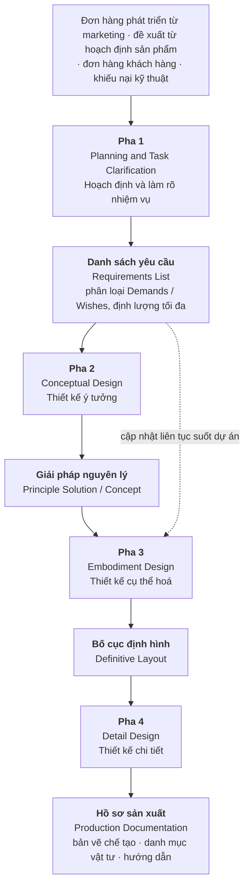
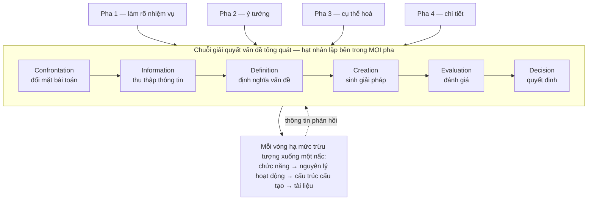
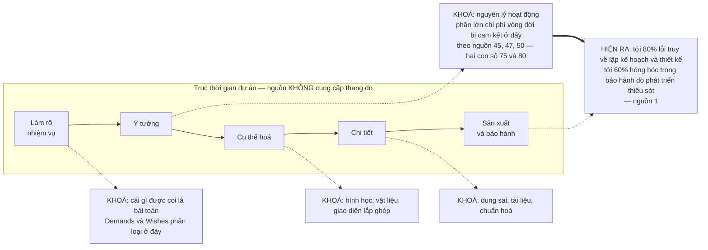

# Chương 03 — Pahl-Beitz: bốn pha và canh bạc đầu tiên

Có một cuốn sách mà gần như mọi bản quy trình thiết kế đang lưu hành trên thế giới đều là hậu duệ của
nó, dù người viết bản quy trình ấy có biết hay không. Cuốn sách đó chia công việc thiết kế thành bốn
pha, đặt vào giữa mỗi pha cùng một hạt nhân giải quyết vấn đề, và tuyên bố một mệnh đề mà cả phả hệ
gần nửa thế kỷ sau vẫn nhắc lại nguyên vẹn: quyết định ở pha sớm định đoạt số phận sản phẩm. Nếu thiếu
bốn pha này thì phần còn lại của cuốn sách không có gì để nói — VDI 2221 chuẩn hoá cái gì, VDI 2206
mở rộng cái gì, ICDM cắm công cụ định lượng vào chỗ nào, tất cả đều tính từ đây.

Chương 02 dựng bộ từ vựng: hệ thống kỹ thuật là một phép biến đổi ba dòng chảy — năng lượng, vật liệu,
tín hiệu; trừu tượng hoá là thao tác đưa bài toán về dạng trung lập với giải pháp; và trục quy định ↔
mô tả chia đôi cả ngành. Chương này áp đúng bộ từ vựng đó vào một đối tượng cụ thể. Bốn pha của
Pahl-Beitz là câu trả lời quy định đầu tiên đủ đầy đặn để người ta có thể dạy nó, in nó thành tiêu
chuẩn quốc gia, và — đây mới là chỗ đáng chú ý — cãi lại nó bằng thực nghiệm.

Ba thứ chương này giao. **Một:** bốn pha với đầu vào, đầu ra và hạt nhân lặp bên trong, đủ để đọc bất
kỳ sơ đồ hậu duệ nào mà không cần tra lại. **Hai:** một phát hiện nội tại — ở đúng chỗ người ta hay
trích Pahl-Beitz như một quy trình bắt buộc, chính hai tác giả viết rằng không thể lập kế hoạch chặt
cho pha đó. **Ba:** danh sách những gì phương pháp này ngầm đặt cược vào tổ chức áp dụng nó, dựng từ
chính lời thừa nhận của hai tác giả cộng với ba tuyến nguồn bên ngoài.

---

## Bốn pha, và cái tên duy nhất phải giải thích

Phép đếm "bốn pha" là một trong số ít phép đếm mà nguồn `[1]` tự viết ra, không phải do người đọc đếm
gạch đầu dòng hộ. Câu nguyên văn:

> `"Of the four phases of the product design process, only the terminology used for the third,
> ‘embodiment design’, requires some explanation."` — nguồn `[1]`, trang 7

Câu này đáng dừng lại hai lần. Lần thứ nhất vì nó xác nhận con số. Lần thứ hai vì nội dung của nó:
trong bốn cái tên, chỉ một cái cần giải thích, và đó là cái tên được vay từ chỗ khác.

> `"The idea to introduce the term embodiment design came from French’s book, Engineering Design:
> The Conceptual Stage, published in 1971."` — nguồn `[1]`

*Embodiment design* — pha cụ thể hoá — là thuật ngữ tiếng Anh được dựng để dịch *Entwerfen*, và nó
xa lạ tới mức bản dịch phải dừng lại xin phép người đọc. Cái tên phải mượn từ một cuốn sách khác, và
đúng cái pha mang tên đi mượn ấy sẽ là chỗ phương pháp tự thú nhận rằng nó không lập được kế hoạch —
xem mục thứ tư của chương này.

Bảng dưới đây là thứ đáng dán lên tường, vì nó là bất biến của cả phả hệ: mỗi pha nhận một loại tài
liệu và trả về một loại tài liệu khác, và ranh giới pha chính là ranh giới đổi loại tài liệu.

| Pha | Đầu vào | Đầu ra | Câu hỏi pha này trả lời |
|---|---|---|---|
| 1 · Task Clarification | Yêu cầu thô, chưa toàn diện | Danh sách yêu cầu, tách Demands và Wishes | *Bài toán thật sự là gì?* |
| 2 · Conceptual Design | Danh sách yêu cầu | Giải pháp nguyên lý | *Sản phẩm sẽ làm việc theo nguyên lý nào?* |
| 3 · Embodiment Design | Giải pháp nguyên lý đã chọn | Bố cục định hình | *Nó có hình dạng, kích thước, vật liệu gì?* |
| 4 · Detail Design | Bố cục định hình | Hồ sơ sản xuất | *Chế tạo nó ra sao?* |

Hai điểm dễ bị đọc sai.

**Danh sách yêu cầu không đóng băng ở cuối Pha 1.** Nguồn mô tả nó như một tài liệu được *gửi lưu hành
nội bộ giữa các phòng ban để lấy phản hồi và cập nhật liên tục*. Cách đọc "chốt yêu cầu rồi mới thiết
kế" là cách đọc của người vẽ lại sơ đồ, không phải của người viết nó. Đây là mầm của một cuộc tranh
luận sẽ nổ ra ở Phần III dưới cái tên **đồng tiến hoá vấn đề–giải pháp**.

**Số bước bên trong mỗi pha không phải là hằng số của nguồn.** Ở Pha 2, nguồn `[1]` mô tả tiến trình
chi tiết theo Chương 6 và Figure 6.1 thành tám hoạt động, trong đó riêng thao tác trừu tượng hoá đã
gồm năm thao tác con; trong khi bản tóm ở Editors' Foreword liệt kê năm bước. Về phép đếm cho Pha 2,
tệp khám phá ghi thẳng: **không có trong nguồn** một câu tiếng Anh nào phát biểu số lượng bước. Cùng
một cuốn sách, hai chỗ, hai cách chia — và không chỗ nào tự đếm. Giữ lấy quan sát này; mục thứ tư của
chương sẽ cho thấy nó không phải sự cẩu thả biên tập mà là một lập trường.

---

## Hạt nhân: chuỗi giải quyết vấn đề tổng quát

Bốn pha không phải là bốn thứ khác nhau. Chúng là cùng một chuỗi thao tác chạy lại bốn lần, mỗi lần ở
một mức cụ thể thấp hơn. Nguồn `[1]` gọi hạt nhân đó là **general problem solving process** và trình
bày nó qua Figure 4.1 theo sáu chặng: Confrontation — Information — Definition — Creation — Evaluation
— Decision.

Con số sáu ở đây là do đếm hình vẽ. Tệp khám phá ghi rõ: **không có trong nguồn** một câu văn nào phát
biểu số bước của chuỗi này; sách chỉ minh hoạ trực quan và mô tả nội dung từng chặng. Tôi viết ra con
số vì nó tiện để nói chuyện, và viết luôn ra rằng nó là con số của tôi, không phải của sách.

Vì sao hạt nhân này quan trọng hơn bốn pha? Ba lý do.

**Nó giải thích vì sao phương pháp co giãn được.** Bốn pha là cách chia thô cho một dự án phát triển
sản phẩm mới. Nhưng chuỗi Confrontation → Decision chạy được ở mọi quy mô: một dự án, một cụm lắp,
một buổi họp thiết kế, một quyết định chọn vật liệu. Ai đã thấy hạt nhân sẽ không còn hỏi "dự án nhỏ
thì bỏ pha nào" — câu hỏi đúng là "vòng lặp này chạy mấy lần và ở mức nào".

**Nó là chỗ nối sang thế hệ sau.** Micro-cycle của VDI 2206 — chu trình giải quyết vấn đề lặp bên
trong khung chữ V — mang đúng cấu trúc này. Hai văn bản cách nhau ba thập niên, thuộc hai ngành khác
nhau, dùng chung một hạt nhân. Điều đó nói rằng phần bền của Pahl-Beitz không nằm ở sơ đồ bốn ô mà
nằm ở vòng lặp bên trong.

**Nó là chỗ phương pháp tự mâu thuẫn với cách nó được đọc.** Một chuỗi có nhánh Evaluation quay lại
Information là một vòng lặp, không phải một đường thẳng. Nhưng thứ được in lại, dạy lại, dán lên tường
phòng thiết kế lại luôn là sơ đồ bốn ô xếp hàng. Vòng lặp bị mất trong quá trình sao chép. Chương 07
sẽ cho thấy chính sự mất mát này là thứ mà phe phê bình đánh vào.

---

## Mệnh đề trung tâm: quyết định sớm định đoạt số phận sản phẩm

Đây là mệnh đề chịu lực của cả phả hệ. Nếu nó sai, toàn bộ lý do tồn tại của thiết kế có hệ thống sụp
theo: chẳng việc gì phải bỏ công vào pha trừu tượng nếu sửa về sau vẫn rẻ.

Nguồn `[1]` phát biểu nó ở dạng định tính, và cẩn thận hơn nhiều so với cách nó thường được trích:

> `"Just as design commits a large proportion of a product’s costs (see Chapter 11), up to 80% of all
> faults can be traced back to insufficient planning, design and development [10.26]."` — nguồn `[1]`, trang 517

> `"Furthermore, up to 60% of all breakdowns that occur within the warranty period are caused by
> incorrect or incomplete product development."` — nguồn `[1]`, trang 517

Chú ý ba chi tiết mà bản trích dẫn phổ thông hay đánh rơi. Thứ nhất, phần nói về chi phí **không có
con số** — nguyên văn là *a large proportion*, và nó trỏ sang Chương 11 chứ không tự khẳng định. Thứ
hai, cả hai con số đều mang chữ **up to** — trần trên, không phải giá trị điển hình. Thứ ba, con số
80% có chú dẫn `[10.26]`: đây là số của một tài liệu khác được Pahl-Beitz dẫn lại, không phải số họ đo.

### Con số chi phí đến từ đâu, và vì sao nó lung lay

Vì đây là một khẳng định về **hiệu quả** — về việc can thiệp sớm thì đáng giá — nó không được phép chỉ
dựa vào `[1]`. Corpus có ba nguồn bên ngoài nói đúng điều này, và ba nguồn ấy không thống nhất với nhau:

| Nguồn | Nguyên văn | Con số | Có dẫn nguồn không |
|---|---|---|---|
| `[45]` | `"Most of the product's performance is determined and more than 75% of its life cycle cost is committed during the conceptual design phase."` | **> 75%** | không, trong chính câu đó |
| `[50]` | `"About 75 % of the life cycle cost is committed in this stage (Blanchard, 1978)."` | **≈ 75%** | Blanchard, 1978 |
| `[47]` | `"It is well known that the conceptual design is the most influential step in the design process of a product or a system and that about 80 % of the life cycle cost is committed in this stage (Blanchard ,1978)."` | **≈ 80%** | Blanchard, 1978 |

Ba tài liệu độc lập, cùng một mệnh đề, và hai con số khác nhau — trong đó **hai tài liệu dẫn cùng một
nguồn năm 1978 nhưng ra hai con số**. Thêm nữa, tài liệu `[47]` mở đầu bằng `"It is well known that"`,
một cụm từ không chứa phép đo nào.

Đây không phải lý do để vứt mệnh đề đi. Nó là lý do để biết mình đang đứng trên cái gì: một mệnh đề
định tính rất mạnh, được ba tuyến tài liệu nhắc lại nhất quán về **chiều** — chi phí bị cam kết sớm —
và không nhất quán về **độ lớn**. Trong corpus này, **không tài liệu nào tự đo con số ấy**. Ai muốn
dùng 75% hay 80% để bảo vệ một đề xuất ngân sách nên biết mình đang chuyền tay một con số 1978 mà
chính người chuyền cũng không thống nhất được là bao nhiêu.

Sơ đồ này là cách đọc đúng của mệnh đề: **chỗ khoá và chỗ lộ ra cách nhau rất xa về thời gian.** Chi
phí bị cam kết ở pha ý tưởng, còn bằng chứng rằng nó đã bị cam kết sai chỉ xuất hiện ở xưởng và trong
thời hạn bảo hành. Đó là một vòng phản hồi có độ trễ dài — và một hệ thống có phản hồi trễ thì con
người trong hệ thống ấy không học được từ hậu quả, vì lúc hậu quả tới thì người ra quyết định đã đi
làm dự án khác.

Nguồn `[1]` bồi thêm một câu chặn đường thoát hiểm quen thuộc — ý tưởng rằng có thể vá một thiết kế
tồi bằng hệ thống quản lý chất lượng:

> `"If the search for suitable principle solutions has not been undertaken rigorously and if the
> appropriate rules, principles and embodiment guidelines have not been applied to their full extent,
> the methods of TQM will not be able to rectify these fundamental deficiencies."` — nguồn `[1]`

Và một câu nữa, về cơ chế: sai lệch đánh giá ở pha ý tưởng có sức phá huỷ khác hẳn sai lệch ở pha sau.

> `"If, because of an unidentified evaluation uncertainty, which is more likely to occur in the
> conceptual than in the embodiment phase, a weak spot should make itself felt later, then the whole
> concept may be put in doubt and all the development work may prove to have been in vain."` — nguồn `[1]`

---

## Mười lăm bước công tác chính — và câu nằm ngay trước chúng

Mục 7.1 của nguồn `[1]` là chỗ được trích nhiều nhất khi người ta muốn chứng minh rằng Pahl-Beitz là
một quy trình. Danh sách ở đó được đánh số liên tục, mục cuối cùng đọc là *"Fix the definitive layout
and pass on to the detail design phase."* Đếm ra mười lăm mục.

Ba tầng sự thật về mười lăm mục ấy, và tầng thứ ba mới là nội dung của chương này.

**Tầng một — danh sách đúng là mười lăm mục.** Kiểm bằng cách mở toàn văn bản in, không hỏi lại công cụ
truy hồi. Đánh số liền mạch từ `1.` đến `15.` trong mục 7.1, kèm sơ đồ Figure 7.1.

**Tầng hai — cuốn sách không bao giờ tự viết ra con số đó.** Đếm chuỗi ký tự trên toàn văn 1.182.358
ký tự:

| Chuỗi tìm | Số lần xuất hiện |
|---|---|
| `fifteen` | **0** |
| `fifteen steps` | **0** |
| `15 steps` | **0** |

Không lần nào. Trên một triệu mốt trăm nghìn ký tự. Cuốn sách liệt kê đủ mười lăm mục và không một lần
nào tự nói rằng có mười lăm mục.

**Tầng ba — và đây là chỗ đáng viết cả một mục — chính hai tác giả phủ nhận rằng đó là một kế hoạch,
ngay ở câu liền trước danh sách:**

> `"Because of this, it is not always possible to draw up a strict plan for the embodiment design
> phase. However, it is possible to suggest a general approach with main working steps, see
> Figure 7.1."` — nguồn `[1]`, mục 7.1

Đọc lại chậm. *Không phải lúc nào cũng có thể lập một kế hoạch chặt cho pha cụ thể hoá. Tuy nhiên, có
thể **gợi ý** một cách tiếp cận tổng quát với các **bước công tác chính**.* Hai chữ *suggest* và
*general* nằm trong chính câu mở đầu danh sách. Cái được đọc thành quy trình vốn được viết ra như một
gợi ý.

Hai câu bổ trợ, một trước và một sau danh sách, nói rõ vì sao:

> `"Unlike conceptual design, embodiment design involves a large number of corrective steps in which
> analysis and synthesis constantly alternate and complement each other."` — nguồn `[1]`

> `"In the embodiment phase, unlike the conceptual phase, it is not necessary to lay down special
> methods for every individual step, however the following recommendations might prove useful."` — nguồn `[1]`

*Recommendations.* *Might prove useful.* Đây là ngôn ngữ của người đưa lời khuyên, không phải ngôn ngữ
của người ban hành thủ tục.

### Vì sao đây là bằng chứng nội tại mạnh nhất của cuốn sách này

Luận đề của cuốn sách nói rằng các phương pháp thiết kế có hệ thống đặt cược vào một tổ chức không tồn
tại. Một phản bác hiển nhiên: đó là lời của người ngoài, của giới phê bình, của những người chưa từng
phải giao một sản phẩm. Phát hiện ở mục 7.1 vô hiệu hoá phản bác đó.

Nguồn `[1]` là tài liệu **quy định nhất** trong toàn corpus và cũng là tài liệu **lớn nhất** — một
mình chiếm 32% khối lượng. Mục 7.1 là chỗ **quy định nhất trong tài liệu quy định nhất**: một danh
sách đánh số, có sơ đồ đi kèm, đúng dạng thức mà người ta cắt ra dán vào sổ tay quy trình nội bộ. Và
chính tại đó, chính hai tác giả viết rằng không phải lúc nào cũng lập được kế hoạch chặt.

Khoảng cách giữa **cái được viết** và **cái được đọc** không phải do phe phê bình phát hiện ra từ bên
ngoài. Nó nằm sẵn trong văn bản gốc, ở dạng một câu đơn, ngay phía trên danh sách mà ai cũng trích.
Sáu mươi năm phổ biến phương pháp đã sao chép danh sách và bỏ lại câu đó.

Điều này nói lên hai thứ. **Về phương pháp:** Pahl-Beitz khiêm tốn hơn nhiều so với danh tiếng của nó.
Cái bị đem ra chấm điểm là một phiên bản cứng hơn bản gốc. **Về cơ chế truyền bá:** thứ sống sót qua
mỗi lần sao chép là thứ *có hình dạng* — danh sách đánh số, sơ đồ ô vuông. Thứ chết đi là các bổ ngữ,
các câu điều kiện, các chữ *not always* và *might*. Một phương pháp đi qua đủ nhiều lần sao chép sẽ
tự cứng lại, không cần ai cố ý làm cứng nó.

### Cuốn sách tự đếm cái gì, và không tự đếm cái gì

Mười lăm không phải trường hợp cá biệt. Đây là bảng đối chiếu giữa những phép đếm mà nguồn `[1]` tự
phát biểu và những phép đếm mà người đọc phải tự làm:

| Đối tượng | Sách có tự phát biểu con số? | Nguyên văn nếu có |
|---|---|---|
| Bốn pha của quy trình thiết kế | **Có** | `"Of the four phases of the product design process…"` |
| Bảy bước công việc cơ bản của VDI 2221 | **Có** | `"…includes seven basic working steps…"` |
| Ba quy tắc cơ bản của pha cụ thể hoá | **Có** | `"In short, by observing these three basic rules, designers can increase their chances of success…"` |
| Hai thủ tục kết hợp điểm kỹ thuật–kinh tế của Baatz | **Có** | `"To that end, Baatz [3.1] has proposed two procedures, namely:"` |
| Số bước của pha làm rõ nhiệm vụ | **Không** | — |
| Số bước của pha ý tưởng | **Không** | — |
| Số bước của chuỗi giải quyết vấn đề tổng quát | **Không** | — |
| **Số bước của pha cụ thể hoá — "15"** | **Không** | — |
| Năm nguyên lý thiết kế cụ thể hoá | **Không** | — |
| Số bước của pha chi tiết | **Không** | — |

Mẫu hình quá rõ để là ngẫu nhiên. Sách đếm những gì nó coi là **cấu trúc** — bốn pha, ba quy tắc, hai
thủ tục, và bảy bước của một tiêu chuẩn khác mà nó đang mô tả. Sách **không** đếm những gì nó coi là
**trình tự công việc**. Việc từ chối đếm là một lập trường về bản chất của thứ đang được liệt kê.

Hệ quả cho người viết quy trình: khi một tài liệu liệt kê đủ mục mà không tự đếm, đừng đếm hộ nó rồi
trích ngược lại như thể nó đã nói. Đó là cách một gợi ý biến thành một thủ tục chỉ trong một lần
diễn giải.

> **Đào sâu: vì sao pha cụ thể hoá không lập kế hoạch chặt được**
>
> Câu phủ nhận ở mục 7.1 không phải sự khiêm tốn xã giao. Nó có lý do kỹ thuật, và nguồn `[1]` nói ra
> ở ba chỗ khác nhau.
>
> **Lý do thứ nhất — bản chất công việc là lặp sửa.** `"…embodiment design involves a large number of
> corrective steps in which analysis and synthesis constantly alternate and complement each other."`
> Phân tích và tổng hợp thay phiên nhau liên tục. Một chuỗi trong đó bước sau có thể buộc quay lại sửa
> bước trước thì không có thứ tự tô-pô cố định — nghĩa là không lập lịch được theo nghĩa chặt.
>
> **Lý do thứ hai — các nguyên lý cụ thể hoá triệt tiêu lẫn nhau.** `"When applying embodiment design
> principles, designers may find that they run counter to certain requirements. Thus, the principle of
> uniform strength may conflict with the demand for minimum costs; the principle of self-help may
> conflict with fail-safe behaviour…"` Nếu bộ luật tự mâu thuẫn thì không tồn tại thuật toán chạy hết
> bộ luật; chỉ tồn tại các thoả hiệp, và thoả hiệp thì phải có người quyết.
>
> **Lý do thứ ba — mức bất định còn quá cao để cho điểm.** `"Numerical values, by contrast, are
> dangerous because they introduce a false sense of certainty."` Chính hai tác giả cảnh báo về việc gán
> số cho cái chưa đo được. Một quy trình chặt thì cần cổng, cổng cần ngưỡng, ngưỡng cần số — và số ở
> pha này chưa đáng tin.
>
> Ba lý do này cộng lại thành một kết luận đơn giản: **thứ không lập kế hoạch chặt được thì cũng không
> kiểm toán chặt được.** Đây là lần đầu tiên trong phả hệ mà một phương pháp tự chỉ ra ranh giới của
> chính nó. Sẽ còn lần nữa, và lần sau nằm trong một văn bản tiêu chuẩn quốc gia — xem Chương 05.

---

## Những gì chính hai tác giả nhận là hỏng

Một cuốn sách quy định mà dành nhiều trang để liệt kê nhược điểm của chính nó là hiện tượng đáng chú
ý. Đây là danh sách rút gọn, tất cả đều từ nguồn `[1]`, tất cả đều là lời tự thú chứ không phải lời
phê bình từ ngoài.

**Trừu tượng hoá cản trở việc tìm giải pháp trực tiếp.** Chính công cụ được ca ngợi nhất — đưa bài toán
về chức năng có giá trị tổng quát — có tác dụng phụ:
`"…using generally valid functions can represent a problem because such an abstract level can sometimes
hinder the direct search for solutions."` Và ở môi trường công nghiệp:
`"In many cases in industry it may not be expedient to build up a function structure from generally
valid subfunctions, because they are, in fact, too general…"`

**Cách tiếp cận theo tiến trình sinh ra không gian giải pháp phình to.**
`"The process-oriented approach largely avoids the potential disadvantages of the problem-oriented
approach. However, more time is required because of the wider, more systematic perspective. This
carries the danger of generating an unnecessarily large solution space."`

**Cấu trúc chức năng không bao giờ thật sự trung lập.**
`"Moreover, it should be remembered that function structures are seldom completely free of physical or
formal presuppositions, which means that the number of possible solutions is inevitably restricted to
some extent."` Mục tiêu *solution-neutral* của Chương 02 là một tiệm cận, không phải một trạng thái
đạt được.

**Điểm số đánh giá mang thành kiến mạnh.**
`"All in all, therefore, the assignment of a value, the selection of a value function and the setting up
of an assessment scheme may involve strong subjective influences. Cases with a clear, or even
experimentally verified, correlation between the values and the parameters are few and far between."`
Đây là lời của chính người đưa ra thang điểm — nguồn `[1]` mô tả hai thang: `"Cost–Benefit Analysis
employs a range from 0 to 10; Guideline VDI 2225 a range from 0 to 4"`.

**Phương pháp gần như không được áp dụng cho phần lớn công việc thiết kế thực tế.**
`"The approach has hardly been introduced at all for adaptive or variant design [12.2, 12.4]. This is
understandable because working with functions and function structures is not the most important task in
these types of design."` Thiết kế thích nghi và thiết kế biến thể chiếm phần lớn khối lượng công việc
ở hầu hết doanh nghiệp cơ khí. Phương pháp tự khai rằng nó không dành cho phần lớn đó.

**Công nghiệp chê thẳng khâu ước lượng chi phí.**
`"The following aspects have been criticised by industry: Procedures for estimating costs are
insufficiently developed."` Đáng chú ý vì mệnh đề trung tâm của chính phương pháp là *chi phí bị khoá
sớm* — mà công cụ để ước lượng chi phí sớm thì nó thừa nhận là chưa đủ.

**Kỹ sư thật gặp khó với biểu diễn trừu tượng.**
`"Abstracting and creating function structures often causes difficulties because of the abstract
representation. Designers are more used to thinking in objects and visual images [12.6]."`

**Và người giỏi thì không làm theo trình tự.** Đây là câu quan trọng nhất trong cả danh sách:

> `"The investigations of Dylla [2.11, 2.12] and Fricke [2.15, 2.16] show that novices educated in
> systematic design tend to follow the process-oriented approach, whereas experienced designers tend to
> follow the problem-oriented approach. Experienced designers apply their wealth of experience, know a
> wide range of possible subsolutions, and are able to represent these solutions quickly. Hence they
> arrive relatively quickly at a concrete result. Then, using a corrective approach, they bring this
> together into an overall solution."` — nguồn `[1]`

Người mới đi theo tiến trình. Người có kinh nghiệm đi theo bài toán. Câu này nằm trong chính cuốn sách
dạy đi theo tiến trình.

### Bằng chứng từ ngoài `[1]`

Vì `[1]` chiếm 32% corpus, mọi khẳng định quan trọng cần đối chứng. Ba tuyến bên ngoài nói cùng một
hướng với lời tự thú trên.

**Tuyến thực nghiệm nhận thức — `[31]`.** Kannengiesser và Gero ánh xạ toàn bộ hoạt động của phương pháp
Pahl-Beitz sang một khung mã hoá nhận thức rồi so với hành vi thật:
`"Mapping all activities defined in PBSA onto the sFBS framework results in 87 elementary steps coded in
terms of FBS design issues…"` và `"This results in a total of 235 steps, as some of the 87 elementary
steps are repeated…"`. Kết luận:

> `"Therefore, it can be concluded that the differences between the model and the empirical data rather
> indicate that PBSA seems to be incomplete as a predictive model of designing since it does not predict
> designers’ early focus on generating solutions."` — nguồn `[31]`

Ràng buộc phải nói kèm: đối tượng đo là **sinh viên cơ khí**, không phải kỹ sư đang hành nghề —
`"The behavioural observations used in this study are based on protocols of 15 design sessions involving
mechanical engineering students after their first year of design education and 31 design sessions of the
students using various concept generation methods."` Tổng cộng `"All 46 design sessions covered an entire
design process from requirements specification to solution description."`, mỗi phiên
`"a specified available time of 45 minutes"`. Bốn mươi lăm phút với sinh viên năm nhất–năm tư không phải
là một dự án công nghiệp. Kết quả này đủ để nói *mô hình không tiên đoán được hành vi*, không đủ để nói
*phương pháp không dùng được*.

**Tuyến khảo sát doanh nghiệp — `[43]`.** Jensen và Andreasen khảo sát việc áp dụng phương pháp thiết kế
tại các doanh nghiệp Đan Mạch qua ba năm học liên tiếp — `"The students, 50 per year, all take a course
in ‘Design Methods’ taught by the authors of this article."`, trong `"the years 2007-2009"`. Phát hiện
lặp đi lặp lại: các bước bị bỏ dưới áp lực thời gian, các bước đầu bị cắt hẳn với khách hàng cũ, và
phương pháp được dùng như một **nghi lễ để giải trình** rằng công việc đã được làm nghiêm túc — chứ
không phải như một đường ray. Đây cũng là khảo sát của sinh viên, không phải kiểm toán độc lập; ghi
nhận đúng mức đó.

**Tuyến đối chiếu phương pháp — `[33]`.** Nghiên cứu so sánh thực hiện `"Duration: 4 weeks Date: Feb 2007
– March 2007"` ghi nhận Pahl-Beitz tập trung vào cấu trúc chức năng và nguyên lý giải pháp trong cơ khí,
và **bỏ hẳn khía cạnh tiếp thị và bán hàng** — trong khi các khung khác bao phủ cả vòng đời thương mại.

Ba tuyến, ba phương pháp thu thập khác nhau, cùng một chiều: **khoảng cách giữa mô hình và hành vi là
có thật, và nó không nhỏ.** Không tuyến nào trong ba tuyến đo được rằng áp dụng phương pháp thì sản
phẩm tốt hơn. Trong toàn corpus, khẳng định *phương pháp có hệ thống cho kết quả tốt hơn* **không có
tài liệu nào đo**. Nguồn `[1]` biện hộ cho nó bằng lập luận, không bằng số liệu đối chứng.

---

## Phương pháp này giả định một tổ chức như thế nào

Mọi chương của Phần II đóng bằng mục này, và đây là lần đầu tiên. Câu hỏi không phải *phương pháp có
đúng không* mà là *nó cần một tổ chức ra sao để đúng*.

Nguồn `[1]` không có một mục nào tên là "giả định về tổ chức". Danh sách dưới đây được dựng bằng cách
đọc ngược: mỗi chỗ phương pháp mô tả một điều kiện vận hành thuận lợi là một giả định; mỗi chỗ nó liệt
kê điều kiện thất bại là mặt sau của cùng giả định đó. Việc dựng ngược này là thao tác của cuốn sách,
không phải mục lục của nguồn.

| # | Canh bạc — điều phương pháp cần mà không đòi | Nó vỡ khi | Dấu hiệu sớm |
|---|---|---|---|
| 1 | **Hợp tác liên ngành thông suốt** giữa thiết kế, chế tạo, mua sắm, marketing; làm việc song song chứ không chuyển giao một chiều | Tổ chức chia ô hành chính, thông tin đi qua biên bản | Phản hồi từ chế tạo chỉ đến sau khi bản vẽ đã phát hành |
| 2 | **Đồng thuận văn hoá giữa kỹ sư và quản lý** — cả hai phía đều được đào tạo và đều đòi hỏi phía kia làm có hệ thống | Một phía mất kiên nhẫn: quản lý đòi bản vẽ ngay, hoặc kỹ sư từ chối học phương pháp | Buổi bảo vệ khái niệm bị thay bằng câu "cứ vẽ ra xem thế nào" |
| 3 | **Đủ thời gian và tiền cho pha trừu tượng đầu dự án** — nơi chưa có gì nhìn thấy được | Áp lực thị trường buộc rút ngắn; các bước bị gộp hoặc bỏ | Pha ý tưởng bị đặt lịch bằng ngày, pha chi tiết bằng tháng |
| 4 | **Hạ tầng quản lý dữ liệu kỹ thuật** để danh sách yêu cầu sống được và cập nhật được suốt dự án | Không có nơi lưu trữ chung; danh sách yêu cầu thành tệp đính kèm email | Hai người cùng dự án làm việc trên hai phiên bản yêu cầu khác nhau |
| 5 | **Người ra quyết định đủ dày dạn để dám cắt bước** | Đội ngũ non hoặc sợ trách nhiệm → bám tối đa vào tài liệu hoá | Hồ sơ đầy đủ hơn mức dự án cần, và không ai đọc |

Giả định 3 và giả định 5 kéo nhau theo chiều ngược nhau, và đó là chỗ đau nhất. Phương pháp cần thời
gian cho pha trừu tượng — nhưng nguồn `[1]` cũng ghi nhận lời phản đối phổ biến:
`"The objection is often raised that applying a systematic approach during the conceptual design phase
takes too much time."` Và câu trả lời của chính hai tác giả không phải là *nhanh hơn*, mà là *không
chậm hơn*:

> `"However, the time normally needed in this phase for concretising ideas into principle solutions, for
> example through rough calculations, developing solutions, and analyses of various layouts, is about the
> same as when a systematic approach is not used, that is, around 60 to 70%."` — nguồn `[1]`, trang 568

Đây là một lời biện hộ khiêm tốn đến mức đáng ngạc nhiên: làm có hệ thống thì tốn **xấp xỉ bằng** làm
không có hệ thống. Không hứa nhanh hơn. Bổ trợ cho nó là con số:
`"From research in industry and universities [6.8], it is known that calculating and representation add
up to 60% of the total time spent on conceptual design."` Phần lớn thời gian pha ý tưởng không dùng để
nghĩ ý tưởng mà để tính thô và vẽ — nghĩa là pha ý tưởng đắt vì bản chất công việc, không vì phương
pháp làm nó đắt.

**Bốn giả định đầu là về cấu trúc tổ chức, giả định thứ năm là về con người.** Và giả định thứ năm là
cái phương pháp không thể tự tạo ra: một quy trình có thể dạy người ta *làm theo*, nhưng không dạy
được người ta *biết khi nào không làm theo*. Chính vì thế mà, theo `[1]`, người mới đi theo tiến trình
còn người có kinh nghiệm đi theo bài toán — phương pháp huấn luyện được nhóm thứ nhất, và nhóm thứ hai
là nhóm mà tổ chức thật sự cần.

Ở đây cần một khai báo, vì phần cuối cuốn sách sẽ khai thác nó. Việc xếp một công cụ thiết kế vào một
**tầng đòn bẩy** theo cách phân hạng của Meadows là thao tác của cuốn sách này; không tài liệu nào
trong 66 nguồn làm việc đó, và Meadows không viết một chữ nào về thiết kế kỹ thuật. Với ràng buộc đó,
quan sát ở đây chỉ dừng ở mức mô tả: bốn pha là một can thiệp vào **luồng công việc và tài liệu**, còn
năm giả định vừa liệt kê nằm ở **văn hoá tổ chức và thẩm quyền quyết định**. Phương pháp can thiệp ở
một chỗ và đặt cược vào một chỗ khác. Phần V sẽ trả lời câu hỏi điều đó có nghĩa gì.

### Nối sang Chương 04

Bốn pha ra đời trong một cuốn sách năm 1977 — `"The first German edition of Konstruktionslehre was
published in 1977."` — và tiếp tục sống qua nhiều lần tái bản, tới bản tiếng Đức thứ chín năm 2021
theo nguồn `[37]`: `"the book p and bites now being in its ninth Edition in German language so we
published the latest edition in 2021"`. Nhưng thứ đưa nó ra khỏi phạm vi một cuốn sách giáo khoa là
một chuyện khác: nhà nước Đức, qua hiệp hội kỹ sư của mình, biến nó thành tiêu chuẩn.

Chính nguồn `[1]` mô tả tiêu chuẩn ấy, và đây là con số nó **tự phát biểu**:

> `"The approach (see Figure 1.9) includes seven basic working steps that accord with the fundamentals of
> technical systems (see Section 2.1) and company strategy (see Chapter 4)."` — nguồn `[1]`, trang 18

Bảy bước. Không phải bốn pha, không phải mười lăm bước. Một cách chia thứ ba, cho cùng một công việc,
trong một văn bản mang thẩm quyền khác hẳn. Chuyện gì xảy ra với một gợi ý khi nó được đóng dấu tiêu
chuẩn quốc gia — mua được gì và trả giá bằng gì — là nội dung Chương 04.

---

## Áp dụng ở Xưởng

Bối cảnh: một xưởng cơ khí — điện tử — phần mềm nhúng, vài chục người, chạy song song nhiều dự án ở
các pha khác nhau.

### 1. Phân loại lại từng bước trong tài liệu quy trình nội bộ thành CỔNG hoặc GỢI Ý — làm trong tuần

Mở tài liệu quy trình thiết kế nội bộ đang lưu hành. Với mỗi bước, gán đúng một trong hai nhãn.
**CỔNG** = có sản phẩm giao nộp cụ thể, có người ký, và không qua thì không được đi tiếp. **GỢI Ý** =
làm thì tốt, không làm thì ghi lý do vào biên bản, không chặn đường. Không có nhãn thứ ba.

Quy tắc quyết định lấy thẳng từ phát hiện của chương: một bước chỉ được là CỔNG nếu nêu được **cái gì
sẽ hỏng nếu bỏ nó** và **ai sẽ biết điều đó**. Nếu không nêu được cả hai thì nó là GỢI Ý, và đang được
thi hành như CỔNG chỉ vì nó nằm trong danh sách đánh số.

Kết quả trong tuần: một tài liệu ngắn hơn hẳn, và một con số — tỷ lệ CỔNG trên tổng số bước. Nếu tỷ lệ
đó gần 100% thì tài liệu đang cứng hơn cả bản gốc mà nó phái sinh từ đó, vốn tự nói `"it is not always
possible to draw up a strict plan"`.

**Bẫy:** đội ngũ sẽ có xu hướng gán CỔNG cho mọi thứ, vì CỔNG nghe có vẻ nghiêm túc hơn. Ra quy định
trước: mỗi CỔNG phải có tên một người ký. Số CỔNG sẽ tự giảm.

### 2. Bắt mọi con số quy trình phải chỉ ra được câu nguồn

**Vấn đề nó giải.** Tài liệu nội bộ tích tụ những con số không ai truy được nguồn — một tỷ lệ phần trăm
chi phí bị khoá ở pha ý tưởng, một phép đếm bước cho pha cụ thể hoá — và chúng được dùng để bảo vệ
quyết định ngân sách.

**Cách áp.** Rà tài liệu nội bộ, với mỗi con số yêu cầu một dòng ghi câu nguồn nguyên văn. Con số không
có câu nguồn thì xoá hẳn, không thay bằng "khoảng" hay "phần lớn" — chuyển mệnh đề về dạng định tính có
ghi chiều: *chi phí bị cam kết sớm, mức độ chưa đo được trong tài liệu ta có*.

**Bẫy.** Người ta sẽ đi tìm một nguồn hợp thức hoá con số đã lỡ viết, thay vì bỏ con số. Dấu hiệu: hai
tài liệu nội bộ cùng dẫn một nguồn mà ra hai con số khác nhau — đúng chuyện đã xảy ra với 75% và 80%
cùng dẫn về một tài liệu năm 1978.

### 3. Tách cổng chi phí khỏi cổng kỹ thuật ở cuối pha ý tưởng

**Vấn đề nó giải.** Đánh giá phương án bằng một điểm số tổng hợp làm chỗ yếu về chi phí bị điểm mạnh về
kỹ thuật che mất, đúng lúc chi phí đang bị khoá.

**Cách áp.** Cuối pha ý tưởng, phương án phải qua hai cổng riêng, hai người ký khác nhau: một cổng kỹ
thuật, một cổng chi phí. Ở cổng chi phí, ước lượng nào chưa đo được thì ghi bằng khoảng và ghi rõ độ
bất định, tuyệt đối không quy thành điểm số — theo đúng cảnh báo `"Numerical values, by contrast, are
dangerous because they introduce a false sense of certainty."`

**Bẫy.** Cổng chi phí biến thành nghi thức nếu người ký nó không có quyền chặn. Nếu cổng chi phí chưa
bao giờ chặn một phương án nào thì nó chưa tồn tại.

### 4. Phân loại nhiệm vụ ba mức ngay ở buổi mở dự án

**Vấn đề nó giải.** Ép toàn bộ chuỗi trừu tượng hoá lên một việc thực chất là thay một cụm chi tiết
trong sản phẩm cũ — lãng phí, và làm đội ngũ mất niềm tin vào phương pháp cho lần sau.

**Cách áp.** Buổi mở dự án chốt một trong ba nhãn: **thiết kế mới** — chạy đủ chuỗi ý tưởng; **thiết kế
thích nghi** — bỏ trừu tượng hoá, vào thẳng bố cục, giữ lại đánh giá phương án; **thiết kế biến thể** —
chỉ kiểm tra ràng buộc và tài liệu. Căn cứ là lời tự khai của chính nguồn: `"The approach has hardly
been introduced at all for adaptive or variant design"`.

**Bẫy.** Nhãn trở thành công cụ đàm phán nội bộ — khai "mới" để xin thêm thời gian, khai "biến thể" để
né rà soát. Chống lại bằng cách buộc nhãn phải kèm một câu: *chức năng nào là mới so với sản phẩm gần
nhất*. Không nêu được chức năng mới thì không phải thiết kế mới.

### 5. Cho người có kinh nghiệm đi lối bài toán, nhưng đòi cấu trúc chức năng dựng ngược

**Vấn đề nó giải.** Quy trình chuẩn đánh vào đúng nhóm giỏi nhất: người có kinh nghiệm làm việc theo
lối bài toán, và mọi ràng buộc tuần tự đều làm họ chậm lại mà không thêm chất lượng.

**Cách áp.** Người có kinh nghiệm được đi thẳng từ bài toán sang phác thảo cụ thể. Đổi lại, sau khi có
phác thảo, họ dựng **ngược** cấu trúc chức năng từ phác thảo đó và trả lời một câu duy nhất: *chức năng
nào ở đây có thể thực hiện bằng một nguyên lý khác hẳn?* Cấu trúc chức năng ở đây không dùng để sinh
giải pháp mà để kiểm tra lối mòn — đúng chức năng mà `[1]` gán cho trừu tượng hoá.

**Bẫy.** Nó thoái hoá thành thủ tục giấy tờ hồi tố, vẽ lại cái đã quyết cho đủ hồ sơ. Dấu hiệu: không
lần nào việc dựng ngược làm thay đổi phác thảo. Nếu sau vài dự án mà chưa lần nào đổi, hãy bỏ hẳn bước
này thay vì duy trì nó như một nghi lễ.

---

## Sổ kiểm của chương

- **Neo luận đề:** *Canh bạc* — nối rõ ở mục "Phương pháp này giả định một tổ chức như thế nào" (bảng
  năm giả định + phân tích xung đột giữa giả định 3 và giả định 5), và nối lần hai ở mục "Vì sao đây là
  bằng chứng nội tại mạnh nhất của cuốn sách này" (khoảng cách giữa cái được viết và cái được đọc).
  Chạm *Mặt tiếp giáp* ở mục "Những gì chính hai tác giả nhận là hỏng" và ở ba tuyến bằng chứng ngoài `[1]`.

- **Nguồn đã dùng:** `[1]`, `[31]`, `[33]`, `[37]`, `[43]`, `[45]`, `[47]`, `[50]`.
  Cân đối nguồn: `[1]` chiếm phần lớn phần mô tả phương pháp — đúng như rủi ro R3 dự báo. **Mọi khẳng
  định về hiệu quả đều đã bắc ra ngoài `[1]`:** mệnh đề chi phí khoá sớm dùng `[45]`, `[47]`, `[50]`;
  khoảng cách mô hình–hành vi dùng `[31]`, `[43]`, `[33]`. Và chương ghi rõ rằng khẳng định *phương pháp
  có hệ thống cho kết quả tốt hơn* **không có tài liệu nào trong corpus đo được**.

- **Con số có nguyên văn:**
  - *bốn pha* — `"Of the four phases…"` `[1]`
  - *bảy bước VDI 2221* — `"…includes seven basic…"` `[1]`
  - *ba quy tắc cơ bản* — `"In short, by…"` `[1]`
  - *hai thủ tục Baatz* — `"To that end, Baatz…"` `[1]`
  - *tới 80% lỗi* — `"Just as design…"` `[1]`
  - *tới 60% hỏng hóc bảo hành* — `"Furthermore, up to…"` `[1]`
  - *60% thời gian tính và vẽ* — `"From research in…"` `[1]`
  - *khoảng 60–70% thời gian, ngang bằng khi không dùng phương pháp* — `"However, the time…"` `[1]`
  - *thang 0–10 và 0–4* — `"The values are…"` `[1]`
  - *năm 1977* — `"The first German…"` `[1]`
  - *bản tiếng Đức thứ chín, 2021* — `"the book p…"` `[37]`
  - *French 1971* — `"The idea to…"` `[1]`
  - *hơn 75% chi phí vòng đời* — `"Most of the…"` `[45]`
  - *khoảng 75%* — `"About 75 %…"` `[50]`
  - *khoảng 80%* — `"It is well…"` `[47]`
  - *87 bước cơ bản và 235 bước mô phỏng* — `"Mapping all activities…"` / `"This results in…"` `[31]`
  - *15 + 31 = 46 phiên, 45 phút mỗi phiên* — `"The behavioural observations…"` / `"All 46 design…"` /
    `"a specified available…"` `[31]`
  - *50 sinh viên mỗi năm, 2007–2009* — `"The students, 50…"` / `"the years 2007-2009"` `[43]`
  - *4 tuần, tháng 2–3 năm 2007* — `"Duration: 4 weeks…"` `[33]`
  - *`fifteen` = 0, `fifteen steps` = 0, `15 steps` = 0 trên 1.182.358 ký tự* — kết quả đếm chuỗi trên
    toàn văn `[1]`, ghi ở `_cau_hoi_mo_DA_GIAI.md` mục Q1

- **Con số đã BỎ vì không có nguyên văn:**
  - **Phép đếm "15" gắn với chữ "quy trình" cho pha cụ thể hoá** — cách nói đó bị loại hẳn khỏi chương;
    thay bằng *"mười lăm bước công tác chính"* kèm nguyên văn câu phủ nhận. Đây là nội dung chính của
    chương chứ không phải một chỗ thiếu.
  - *Số bước pha 1, pha 2, pha 4, và số bước của chuỗi giải quyết vấn đề tổng quát* — nguồn không tự
    phát biểu; chương nói ra điều đó thay vì điền số.
  - *"Năm nguyên lý thiết kế cụ thể hoá"* — không có nguyên văn phát biểu con số; không dùng.
  - *Tỷ lệ dự án sinh ra ngoài quy trình chính thức trong khảo sát `[43]`* và *số bước của quy trình
    thương hiệu bị bỏ qua trong cùng khảo sát* — chỉ có cụm từ tiếng Anh rời, không có câu nguyên văn
    trọn vẹn trong tệp khám phá → bỏ con số, giữ lại cơ chế.
  - *Bất kỳ con số nào về hiệu quả của việc áp dụng phương pháp* — không tồn tại trong corpus.

- **Chỗ là suy luận của tác giả, không phải của nguồn:**
  1. **Đọc ngược lời tự thú thành bảng năm giả định tổ chức.** Nguồn `[1]` không có mục nào tên "giả
     định về tổ chức"; bảng là thao tác dựng ngược của cuốn sách. Đã nói ra trong văn bản.
  2. **Mẫu hình "sách đếm cấu trúc, không đếm trình tự công việc".** Bảng đối chiếu là dữ liệu; cách
     giải thích mẫu hình đó là lập trường về bản chất của thứ được liệt kê là suy luận của tôi.
  3. **Cơ chế "sao chép làm cứng phương pháp"** — rằng thứ có hình dạng sống sót còn bổ ngữ chết đi.
     Suy luận, không nguồn nào phát biểu.
  4. **Đặt micro-cycle của VDI 2206 cạnh chuỗi giải quyết vấn đề của Pahl-Beitz như "cùng một hạt
     nhân"** — đối chiếu của cuốn sách, không nguồn nào đặt hai thứ này cạnh nhau.
  5. **Đọc độ trễ giữa chỗ khoá chi phí và chỗ lộ hậu quả thành một vòng phản hồi trễ dài.** Ngôn ngữ
     hệ thống, áp lên dữ liệu của `[1]`; ranh giới Meadows/Goldratt đã được khai báo trong văn bản.
  6. **Toàn bộ mục *Áp dụng ở Xưởng*** — không nguồn nào đề xuất các biện pháp này.

- **Cổng an ninh:** mục *Áp dụng ở Xưởng* không chứa tên riêng, mã sản phẩm, tên dự án, tên đơn vị, tên
  người, tên khách hàng, số liệu vận hành, tên nhà cung cấp hay lịch giao hàng; bối cảnh nêu ở mức
  "xưởng cơ khí — điện tử — phần mềm nhúng, vài chục người". Không nêu lĩnh vực hoạt động đặc thù.

- **Sơ đồ mermaid:** 3 — bốn pha với đầu vào/đầu ra · chuỗi giải quyết vấn đề làm hạt nhân lặp · độ trễ
  giữa chỗ chi phí bị khoá và chỗ hậu quả lộ ra.

- **Số dòng:** 637
