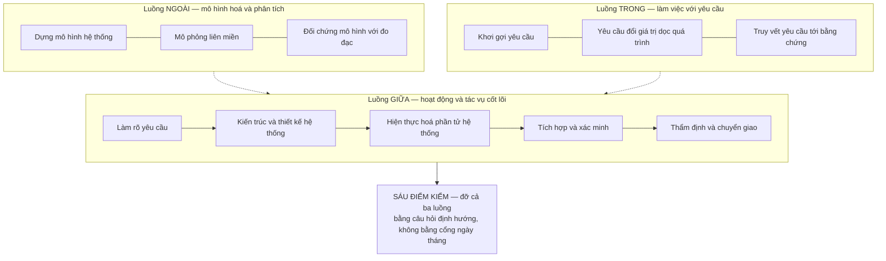
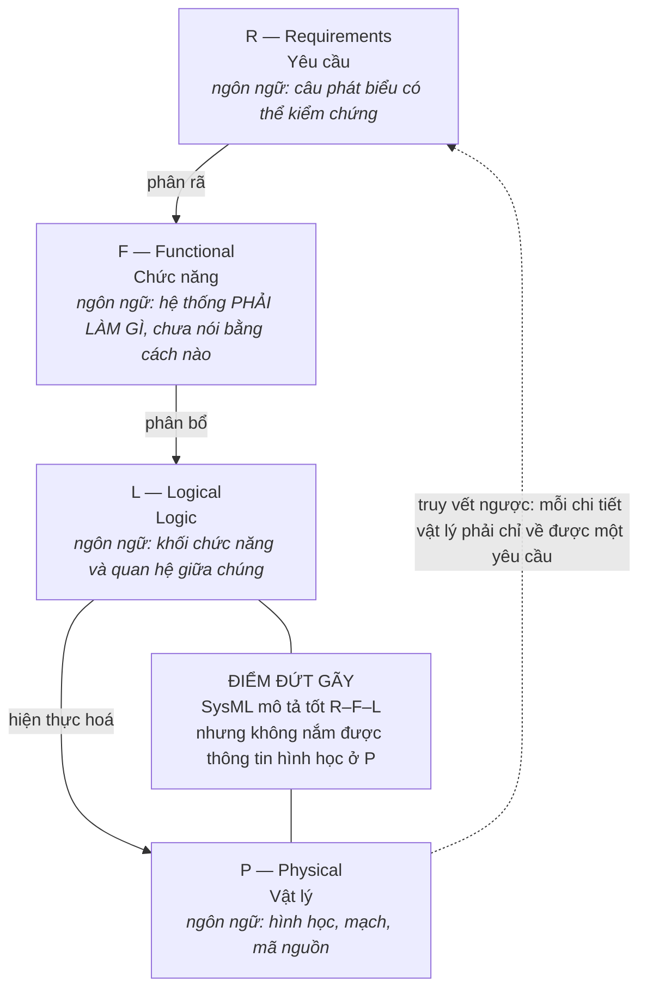
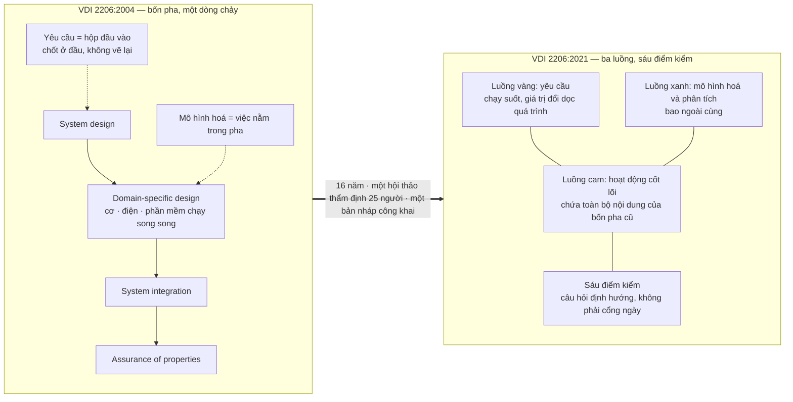

# Chương 07 — VDI 2206:2021: ba luồng, và chữ V không còn là chữ V

Hình chữ V là thứ dễ nhớ nhất mà ngành thiết kế hệ thống từng sản xuất ra. Vẽ được trên khăn giấy, giải
thích được trong ba mươi giây, treo được lên tường phòng thiết kế. Và đó chính là vấn đề. Bản VDI 2206
ban hành tháng 11 năm 2021 **không còn vẽ một chữ V hai nhánh nữa** — nó vẽ ba luồng chạy song song
suốt chiều dài quá trình. Hình vẽ mà gần như mọi kỹ sư đang mang trong đầu, và gần như mọi slide đào tạo
nội bộ đang dùng, đã thôi mô tả đúng chính cái tiêu chuẩn mang tên nó. Cái hỏng khi bỏ qua chuyện này
không phải là sai một thuật ngữ. Nó là: một tổ chức tiếp tục vận hành một lịch trình cổng nghiệm thu
theo giai đoạn, gọi tên nó là VDI 2206, và tin rằng mình đang làm đúng chuẩn.

Chương 06 kể bản 2004: chữ V hai nhánh, bốn pha, thiết kế chuyên ngành chạy song song sau khi kiến trúc
hệ thống được chốt, và canh bạc lớn nhất của nó — rằng kỹ sư cơ khí, kỹ sư điện tử và người viết phần
mềm sẽ nói chung được một ngôn ngữ mô hình hoá. Chương này kể chuyện gì xảy ra khi chính uỷ ban soạn
thảo quay lại nhìn canh bạc đó sau mười sáu năm, thấy nó chưa được ăn, và viết lại. Bản 2021 không phải
một bản cập nhật thuật ngữ. Nó là một chuỗi nhượng bộ — mỗi nhượng bộ trả lời đúng một chỗ mà bản 2004
đã vỡ khi chạm tổ chức thật.

Ba thứ mang về được từ chương này. **Một:** đọc được cấu trúc ba luồng và biết vì sao luồng yêu cầu phải
tách ra chạy riêng — đây là câu trả lời cho một chế độ hỏng cụ thể, không phải trang trí đồ hoạ. **Hai:**
nắm được câu bác bỏ mạnh nhất mà chính các tác giả tiêu chuẩn viết ra — V-Model là *logic tác vụ kỹ
thuật*, độc lập với hình thức tổ chức dự án, và tương thích với Agile — cùng với lý do vì sao một câu
như thế không đủ sức sửa cái mà hình vẽ đã dạy sai trong hai mươi năm. **Ba:** thấy được giả định ngầm
đắt nhất của bản 2021, thứ mà không tiêu chuẩn nào viết thành điều khoản: rằng mô hình ảo đủ đáng tin
để ra quyết định trên đó.

Một lưu ý về chứng cứ, nhắc lại điều đã khai báo ở Chương 01: **corpus của cuốn sách này không có toàn
văn tiêu chuẩn VDI 2206 nào** — bản 2004 lẫn bản 2021. Thứ gần nhất là một trang mục lục của bản
`VDI/VDE 2206` và một tập bài báo bình duyệt, trong đó có bài do chính nhóm soạn thảo viết ra để công bố
và thẩm định mô hình mới. Mọi khẳng định dưới đây về *nội dung* tiêu chuẩn đều đi qua tài liệu thứ cấp,
và chỗ nào tài liệu thứ cấp là tiếng nói của người soạn thảo thì chương này ghi rõ.

---

## Mười sáu năm giữa hai bản, và những gì xảy ra trong đó

Trình tự thời gian ở đây đáng đọc, vì nó cho thấy bản 2021 không rơi từ trên trời xuống mà là kết quả
của một quá trình có ngày tháng, có nơi chốn, có người phản biện.

| Mốc | Nguyên văn | Nguồn |
|---|---|---|
| 1969 — chữ *mechatronics* ra đời | `"In 1969, the Japanese president of YASKAWA Electronic Corporation, Ko Kikuchi, introduced the term “mechatronics”"` | [23] |
| 1993 / 1995 — chữ V ra đời, và nó ra đời cho **phần mềm** | `"The original idea of a V-Model for engineering processes was created 1995 by Bröhl and Dröschel in the application field of Software Development"` · `"The V-shaped model is a well-established design process, first introduced by Brohle and Droschl in 1993 for software engineering..."` | [23] · [26] |
| 2004 — VDI 2206 bản đầu | `"The first release of the VDI Guideline 2206 “Design methodology for mechatronic systems” of the German Association of Engineers (VDI), was published in 2004."` | [23] |
| 2016 — lập ban soát xét | `"Since 2016, a new version of the VDI (German Association of Engineers) Guideline 2206 has been developed by the Technical Committee VDI GMA 4.10 “Interdisciplinary Product Creation”."` | [23] |
| 2018 — đem ra hội nghị để bị vặn | `"Within the validation workshop held at the 15th International DESIGN Conference on May 21st, 2018 at Dubrovnik, Croatia, the current state of work was discussed with 25 international participants from industry and science."` | [23] |
| 6/2020 — bản nháp công khai | `"In June 2020, the New V-Model was published as a “VDI Green Print”."` | [23] |
| 11/2021 — bản chính thức | `"© Verein Deutscher Ingenieure e.V., Düsseldorf 2021"` · `"November 2021"` | [19] |

Hai chi tiết trong bảng này đáng dừng lại.

**Chữ V không sinh ra cho cơ khí, cũng không sinh ra cho cơ điện tử.** Nó sinh ra trong công nghiệp phần
mềm rồi được mượn sang. Một hình vẽ mượn từ ngành khác mang theo giả định của ngành đó — trong phần mềm,
đối tượng thiết kế không có khối lượng, không có dung sai lắp ghép, không có chi phí khuôn. Chương 06 đã
nói vì sao cơ điện tử làm hỏng phương pháp cơ khí thuần. Ở đây là chiều ngược lại, và nó ít được nói tới
hơn: **phương pháp cơ điện tử được vay từ một ngành mà vật lý không tính tiền.**

**Bốn năm giữa lúc lập ban và lúc đem ra vặn công khai.** Con số 25 người dự hội thảo thẩm định là con số
nhỏ, và nguyên văn nói rõ đó là 25 người *"from industry and science"*. Một tiêu chuẩn quốc gia được đối
chất bởi 25 người trong một buổi — không phải để chê, mà để biết đúng trọng lượng chứng cứ đứng sau nó.
Đây là quy trình đồng thuận chuyên gia, không phải quy trình đo đạc.

---

## Ba luồng: cái gì thay chỗ hai nhánh

Câu định nghĩa nằm nguyên văn ở đây, và nó ngắn đến mức đáng ngạc nhiên so với hệ quả của nó:

> `"The new V-model basically consists of three strands. The central strand in orange describes the core
> activities and tasks. The inner, yellow strand describes the handling and the work with requirements.
> The outer, blue strand represents the modeling and analysis activities."` — [23]

Ba luồng, không phải hai nhánh. Cái từng là *toàn bộ* mô hình 2004 — chuỗi từ thiết kế hệ thống, qua
thiết kế chuyên ngành, tới tích hợp và đảm bảo thuộc tính — nay co lại thành **một** luồng: luồng cam ở
giữa. Hai luồng còn lại không phải là pha, không phải là bước, không có điểm bắt đầu và điểm kết thúc
trong dòng chảy. Chúng chạy **suốt chiều dài**, song song với luồng cam, từ đầu đến cuối.

**Vì sao yêu cầu phải tách ra thành một luồng riêng.** Câu trả lời nằm nguyên văn, và nó là một chẩn đoán
về chế độ hỏng chứ không phải một lựa chọn thẩm mỹ:

> `"In engineering practice however, requirements and their values change along the product development
> process. As a consequence, requirements elicitation and management is illustrated by a separate
> strand..."` — [23]

Đọc kỹ cấu trúc câu: *trong thực hành kỹ thuật, tuy nhiên…* — chữ *however* đứng đối lập với cái gì? Với
cách bản cũ vẽ. Bản 2004 đặt yêu cầu ở đầu nhánh trái như một chiếc hộp đầu vào: chốt xong thì đi tiếp.
Đó là hình vẽ, và hình vẽ đó sai so với thực hành. Uỷ ban không sửa bằng một chú thích dưới hình. Họ đổi
tô-pô của hình.

Đây là **mặt tiếp giáp** ở dạng thuần khiết nhất mà cuốn sách này gặp: một tiêu chuẩn kỹ thuật đổi cấu
trúc đồ hoạ của chính nó vì cấu trúc cũ dạy tổ chức một thói quen sai. Không phải vì lý thuyết cũ sai —
lý thuyết vẫn nói rằng yêu cầu có thể đổi. Mà vì **hình vẽ nói to hơn văn bản**, và tổ chức học theo hình.

**Luồng xanh, mô hình hoá và phân tích, nằm ở vòng ngoài cùng.** Vị trí này có nghĩa: mô hình không phải
một việc làm ở một pha nào đó, mà là môi trường bao quanh toàn bộ quá trình. Đây cũng chính là chỗ chương
này sẽ quay lại ở phần cuối, vì nó chở theo giả định đắt nhất của cả bản 2021.

**Sáu điểm kiểm thay chỗ cổng giai đoạn.**

> `"The three strands that represent the main tasks and activities in the New V-Model are backed by a
> structure of six checkpoints... Two exemplary checkpoints at the specification and for the integration
> are provided in Tables 1 and 2."` — [23]

Chữ *backed by* — được đỡ bởi — không phải *divided by*. Khác biệt là toàn bộ vấn đề. Cổng giai đoạn
kiểu stage-gate chia dòng chảy thành khúc và đặt ở mỗi mối nối một quyền phủ quyết theo lịch. Điểm kiểm
kiểu này không chia gì cả; nó là một bộ câu hỏi định hướng để hỏi *thông tin đã đủ chưa*. Và vật liệu
khai thác ghi rõ một điều quan trọng: **tiêu chuẩn không quy định thang điểm số học nào** để chấm độ chín
của thiết kế — không có thang 1–5, không có thang 1–10. Sáu điểm kiểm vận hành bằng câu hỏi, không bằng
điểm. Chương 10 sẽ cho thấy vì sao lựa chọn đó không hề trung tính: mọi thang chấm là một tuyên bố về ai
được quyền cho điểm, và **không có thang** cũng là một tuyên bố như vậy.

### Một phép đếm không có trong nguồn — và vì sao phải nói ra

Vật liệu khai thác dựng lại luồng cam thành năm hoạt động nối tiếp, có đầu vào và đầu ra cho từng cái:
làm rõ yêu cầu · kiến trúc và thiết kế hệ thống · hiện thực hoá phần tử hệ thống · tích hợp và xác minh
hệ thống · thẩm định và chuyển giao. Danh sách đó dùng được, và sơ đồ ở trên dùng nó.

Nhưng **không có câu nguyên văn nào trong vật liệu đếm chúng bằng chữ.** Con số năm là kết quả của việc
đếm gạch đầu dòng, không phải là con số mà nguồn tự viết ra. Chương 03 đã gặp đúng lớp bẫy này ở danh
sách các bước công tác của pha cụ thể hoá Pahl-Beitz, nơi văn bản liệt kê đủ mục mà sách không bao giờ
tự viết con số, và câu liền trước danh sách lại phủ nhận rằng đó là một kế hoạch chặt. Ở đây rủi ro nhẹ
hơn — không có câu phủ nhận nào — nhưng luật giữ nguyên: viết *"quy trình năm bước của VDI 2206:2021"*
là gán cho tiêu chuẩn một phép đếm mà chứng cứ trong tay không có. Viết *"năm hoạt động được nêu tên
trong tài liệu thứ cấp"* thì đúng.

Điều tương tự áp cho chu trình vi mô. Vật liệu ghi thẳng rằng số bước cụ thể của micro-cycle **không có
trong nguồn** — các tài liệu chỉ nói tới *"general problem-solving cycle as a micro-cycle"* mà không
liệt kê con số. Chương 06 làm việc với chu trình vi mô; chương này chỉ ghi lại giới hạn chứng cứ.

---

## "Logic tác vụ, không phải lịch trình dự án" — và vì sao câu đó không cứu được

Đây là câu quan trọng nhất của cả chương, và nó do chính những người soạn thảo mô hình mới viết ra:

> `"The inherent concern logic of the V-Model represents the logical sequence of tasks. Its key advantage
> lies in staying independent from the chosen form of project organization. This way, the V-Model can be
> applied in classically managed projects as well as in agile projects."` — [23]

Ba mệnh đề, mỗi mệnh đề bác một thứ.

**Mệnh đề một: chữ V biểu diễn trình tự *logic của tác vụ*.** Không phải trình tự thời gian. Sự khác nhau
giữa hai thứ này là sự khác nhau giữa *phụ thuộc* và *lịch*. "Không thể xác minh một đặc tả chưa được
viết" là một phụ thuộc — nó đúng vĩnh viễn, không phụ thuộc vào việc bạn viết đặc tả vào tuần nào. "Đặc
tả xong tháng Ba, xác minh tháng Chín" là một lịch — nó là quyết định quản trị, và tiêu chuẩn không nói
gì về nó.

**Mệnh đề hai: độc lập với hình thức tổ chức dự án.** Đây là lời từ chối thẩm quyền. Tiêu chuẩn tự tuyên
bố nó không có ý kiến về việc bạn chia dự án thành bao nhiêu giai đoạn, họp bao nhiêu lần, ký duyệt ở
đâu. Nó chỉ nói: những tác vụ này phụ thuộc lẫn nhau theo cách này.

**Mệnh đề ba: dùng được trong dự án quản lý cổ điển lẫn dự án agile.** Câu này bác thẳng cách hiểu phổ
biến nhất về chữ V — *"V là thác nước có thêm kiểm thử"*. Nếu chữ V là logic tác vụ thì nó không mâu
thuẫn với sprint, vì sprint sắp xếp lại **lịch** chứ không sắp xếp lại **phụ thuộc**. Một đội agile chạy
mười vòng lặp vẫn phải, trong mỗi vòng, biết mình đang xác minh cái gì so với cái gì. Chữ V nói đúng
điều đó và không nói gì hơn.

Vậy là cách hiểu "V = thác nước" là lỗi của người đọc, không phải của tiêu chuẩn. Kết luận đó đúng về
mặt văn bản — và gần như vô dụng về mặt thực hành. Vì đây là chỗ mặt tiếp giáp cắt vào:

> `"It is important to note that this representation shows only one flow through the ''V'' shaped process,
> which does not represent the iterative nature of real development cycles."` — [19]

Một hình vẽ chỉ ra được **một** dòng chảy. Người đọc nhìn thấy một dòng chảy. Rồi có một câu văn xuôi ở
đâu đó trong tài liệu nói rằng thực tế nó lặp. Câu văn thua. Nó thua vì hình vẽ được photocopy vào slide
đào tạo, được vẽ lại lên bảng trắng, được nhớ sau ba năm; còn câu văn nằm ở trang 12 của một tài liệu mà
phần lớn người dùng chưa bao giờ mở.

**Đây là luận điểm chịu lực của chương này.** Một tiêu chuẩn có thể tuyên bố ý định của mình bằng văn bản
rõ ràng đến mức không thể hiểu nhầm, và vẫn bị hiểu nhầm một cách hệ thống trong hai mươi năm, vì thứ
thật sự truyền đi trong tổ chức không phải là văn bản mà là **hình vẽ**. Cái tổ chức tiếp nhận không phải
cái tiêu chuẩn nói. Đó chính xác là điều mà neo *mặt tiếp giáp* mô tả — và ở đây có bằng chứng nội tại:
uỷ ban không chọn cách viết thêm một chú thích. Họ **đổi hình**. Việc đổi hình là lời thú nhận rằng chú
thích đã không có tác dụng.

Và họ còn đổi thêm một thứ nữa, thứ này bất ngờ hơn nhiều.

> `"First, the wish to include the human beings with their skills, competencies, convictions and emotions
> was discussed and taken up in the workshop. In the final version it is represented by coupling the
> V-Model with the Holistic Product Lifecycle (HPLC) Model..."` — [23]

Một tiêu chuẩn kỹ thuật hệ thống, sản phẩm của một uỷ ban kỹ thuật Đức, buộc phải ghép nối với một mô
hình vòng đời khác **để chứa được kỹ năng, năng lực, niềm tin và cảm xúc của con người**. Chữ
*convictions* và *emotions* nằm trong nguyên văn. Điều này không xuất hiện trong bản 2004.

Nói cách khác: khi ngồi lại sau mười sáu năm để tìm xem bản cũ hỏng ở đâu, thứ đầu tiên — nguyên văn ghi
*"First"* — mà hội thảo nêu ra không phải là một thiếu sót kỹ thuật. Nó là **con người trong tổ chức**.
Luận đề của cuốn sách này nói rằng phương pháp thiết kế hỏng ở mặt tiếp giáp với tổ chức. Ở đây, chính
nhóm soạn thảo tiêu chuẩn đã đi đến kết luận đó bằng con đường của họ, và xử lý nó bằng cách gắn thêm
một mô hình bên ngoài phạm vi kỹ thuật của mình.

---

## RFLP: bốn mức, và cái giá của mỗi lần chuyển mức

Nhánh trái của chữ V — nay là nửa trên của luồng cam — được chi tiết hoá bằng một phương pháp phái sinh:

> `"The Requirement-Functional-Logical-Physical (RFLP) approach is a specific V-model derived method,
> particularly adapted to mechatronic systems design and formed of four phases (requirement, functional,
> logical, physical) which are each supported by different technical tools aiding the designers."` — [20]

Bốn mức, và nguyên văn có chữ *four*. Chú ý vế cuối của câu: mỗi mức **được hỗ trợ bởi những công cụ kỹ
thuật khác nhau**. Đó không phải một chi tiết phụ. Đó là chỗ chi phí nằm.

Trình tự R → F → L → P là trình tự **trì hoãn cam kết**: không chốt hình học trước khi chốt logic, không
chốt logic trước khi chốt chức năng. Lợi ích rõ ràng — mỗi lần chốt sớm một mức là một lần khoá mất
không gian giải pháp. Chương 11 sẽ cho thấy cái giá của việc trì hoãn: nổ tổ hợp.

Nhưng cái giá gần hơn nằm ở chỗ khác, và nguồn nói thẳng ra:

> `"SysML is not really suitable to describe solution principles, since they contain, besides physical
> effects, geometric information on the arrangement and relations of the solution principle elements;
> SysML currently does not include an efficient possibility for capturing such information."` — [27]

SysML là ngôn ngữ được khuyến nghị cho nhánh trái, cho MBSE, cho toàn bộ ba mức R–F–L. Và nó **không có
cách hiệu quả để nắm bắt thông tin hình học**. Nguyên lý giải pháp trong cơ khí không chỉ là hiệu ứng vật
lý; nó là hiệu ứng vật lý *cộng với* cách bố trí trong không gian. Cái gì nằm cạnh cái gì, cái gì chắn
tầm nhìn của cái gì, cái gì giãn nở về phía nào khi nóng.

Hệ quả thực hành: giữa mức L và mức P có một đường nối mà **không công cụ nào trong chuỗi đi qua được**.
Mô hình kiến trúc hệ thống nằm trong một công cụ; hình học nằm trong một công cụ khác; và cái đi giữa hai
công cụ đó là một con người đọc bên này rồi gõ lại bên kia. Đây không phải suy đoán — nguồn ghi lại đúng
tình trạng đó ở một nghiên cứu áp bản mới lên hệ điều khiển PLC:

> `"However, the data flow needs to be further detailed and automated to be more efficient."` — [20]

Và còn một khoảng trống nữa, khoảng trống này thì tiêu chuẩn không hề đụng tới:

> `"The results show that the management of knowledge related to component/system interfaces is not
> addressed neither in the state of practice nor the state of the art."` — [20]

Đọc kỹ: *không được xử lý trong cả thực hành lẫn trạng thái nghệ thuật*. Tiêu chuẩn dạy rất kỹ cách
**chia** hệ thống thành mô-đun và cách định nghĩa ranh giới giao diện. Nó không nói gì về việc **giữ lại
tri thức phát sinh tại các ranh giới đó** — vì sao dung sai này được chọn, vì sao tín hiệu này được đảo
mức, ai đã thử cách khác và hỏng thế nào. Tri thức đó là tri thức ẩn, nó nằm trong đầu hai người đã ngồi
với nhau một buổi chiều, và khi một trong hai người đổi việc thì nó biến mất. Chương 13 sẽ mở lại đúng
chủ đề này ở quy mô của cả năm phương pháp.

---

> **Đào sâu: Một con số đi đường xa**
>
> *Mục này tự chứa. Bỏ qua được mà không mất mạch chương — và nó được viết ra chính vì lý do đó.*
>
> Trong tập tài liệu về V-Model liên ngành có một ví dụ áp dụng: hệ thống điều hoà khoang xe hơi thiết kế
> lại theo hướng lấy người dùng làm trung tâm. Đại lượng đo được nêu đích danh là **nhu cầu năng lượng
> điện**, và mức giảm đo được là **58% đến 90%**:
>
> `"in the experiments the novel cabin climate control system decreased the electrical energy demand by 58% to 90%."` — [18]
>
> Con số này rất dễ đi vào một slide. Nó cũng rất dễ đi vào slide **mà không mang theo ba thứ đi kèm nó
> trong chính đoạn văn gốc.**
>
> **Thứ nhất — câu liền trước.** Ngay trước câu về năng lượng, bài báo tự tổng kết kết quả chung:
>
> `"The prototypical implementation of the new design slightly outperforms state-of-the-art air conditioning."`
>
> *Slightly* — nhỉnh hơn đôi chút. Đánh giá tổng thể được thực hiện trên chín hạng mục yêu cầu: tiện nghi
> nhiệt, an toàn, chi phí, chất lượng không khí, âm học, tương tác người dùng, tác động môi trường, tích
> hợp lên xe, và năng lượng. Con số 58–90% là kết quả của **một** hạng mục trong chín.
>
> **Thứ hai — câu liền sau.** `"Challenges include the cost, size and mass of the prototypical design."`
> Chi phí, kích thước, khối lượng — ba thứ quyết định việc một thiết kế có lên được xe sản xuất hay không.
>
> **Thứ ba — cỡ mẫu.** Nguyên văn: `"applied to a research vehicle and four representative users."` **Một
> xe nghiên cứu, bốn người dùng đại diện.** Số lần đo, số kịch bản, và điều kiện biên — nhiệt độ môi
> trường, tải nhiệt, thời lượng chạy — **không có trong nguồn**. Không phải chúng tôi chưa tìm; chúng
> không được ghi ra.
>
> Trích "58–90%" mà bỏ chữ *slightly*, bỏ câu về chi phí và khối lượng, và bỏ cỡ mẫu n = 1 xe / 4 người
> là **xuyên tạc nguồn**, dù từng chữ trích ra đều đúng nguyên văn. Đây là lớp lỗi khó bắt nhất trong
> việc dùng chứng cứ: không phải trích sai, mà là **trích đúng và cắt mất câu bên cạnh**.
>
> Con số này là **giai thoại minh hoạ, không phải luận cứ chịu lực**. Nếu nó biến mất khỏi chương này,
> không luận điểm nào ở trên yếu đi. Nó nằm đây để làm một việc khác: khi lần tới có người đưa cho bạn
> một con số ấn tượng về hiệu quả của một phương pháp thiết kế, câu hỏi đầu tiên không phải "nguồn đâu"
> — mà là **"câu bên cạnh nói gì, và đo trên bao nhiêu mẫu"**.

---

## Giả định về độ tin cậy của mô hình ảo

Luồng xanh — mô hình hoá và phân tích — bao ngoài toàn bộ hai luồng kia. Vị trí đồ hoạ đó mã hoá một
tham vọng: quyết định được đẩy ngược lên thượng nguồn, ra trước khi có vật thật, dựa trên mô hình.

Vật liệu khai thác có một ví dụ đúng dạng đó: một cánh tay sạc cho robot kiểm tra đường ray, phát triển
theo hướng thay thử-sai vật lý bằng mô phỏng số:

> `"...the process has been based on virtual models of the product and on virtual simulations of its
> operation, rather than on the realization of time-consuming and expensive physical models and tests..."` — [18]

Đây là mệnh đề đánh đổi rõ ràng: mô hình ảo thay cho mô hình vật lý, vì mô hình vật lý tốn thời gian và
tốn tiền. Không ai cãi vế sau. Vế trước mới là chỗ có giả định.

**Một quyết định ra trên mô hình chỉ tốt bằng mô hình đó.** Và câu hỏi "mô hình này đủ tin đến mức nào để
ra quyết định X" là câu hỏi mà **không nguồn nào trong tập tài liệu này trả lời bằng số**. Không có
ngưỡng sai lệch cho phép, không có thủ tục đối chứng bắt buộc, không có phân loại quyết định theo mức rủi
ro mô hình. Tiêu chuẩn đặt luồng mô hình hoá ở vòng ngoài cùng — nghĩa là mọi thứ đều tựa lên nó — rồi
không quy định độ tin cậy của thứ mà mọi thứ tựa lên. *Đây là ghi nhận về giới hạn chứng cứ trong tay,
không phải khẳng định rằng tiêu chuẩn im lặng về chủ đề này; corpus không có toàn văn để kiểm.*

Cần nói rõ một điều để tránh dựng bù nhìn: bản thân tiêu chuẩn không đề nghị bỏ thử nghiệm vật lý. Luồng
cam kết thúc bằng thẩm định — đối chiếu với người dùng thật. Vấn đề không nằm ở chỗ tiêu chuẩn nói gì.
Nó nằm ở chỗ **một tổ chức đọc tiêu chuẩn này sẽ nghe thấy gì**. Và thứ dễ nghe thấy nhất trong một cấu
trúc đặt mô hình hoá ở vòng ngoài cùng, giữa một ngành đang bán công cụ mô phỏng, là: *mô phỏng nhiều lên
thì làm mẫu ít đi*.

Bằng chứng phản biện mạnh nhất trong tập tài liệu là một nghiên cứu hồi cứu về hai quá trình phát triển
cơ điện tử thật trong công nghiệp ô tô:

> `"During both processes a series of prominent problems could be observed; the solution for these
> problems found in the development processes are sometimes not in line with recommended procedures in
> literature concerning mechatronic product development."` — [20]

Giải pháp thật sự gỡ được vấn đề **không nằm trong quy trình mà sách vở khuyến nghị**. Câu này không nói
quy trình sai. Nó nói một điều khó chịu hơn: quy trình và cái thật sự chạy được là hai tập hợp giao nhau
chứ không lồng nhau. Một tổ chức tuân thủ quy trình đến chữ cuối cùng vẫn có thể trượt, và một tổ chức
làm khác quy trình vẫn có thể ra sản phẩm tốt.

---

## 2004 đặt cạnh 2021

Bản 2004, nguyên văn — và đây là một trong ít chỗ vật liệu khai thác giữ được câu gốc tiếng Pháp:

> `"Elle divise le processus de conception en quatre phases majeures appelées « system design »,
> « domain-specific design », « system integration » and « assurance of properties », Figure 1.14
> (Bathelt et al., 2005)."` — [20]

Bảng đối chiếu:

| Chiều so sánh | 2004 | 2021 | Cái gì đã đổi và vì sao |
|---|---|---|---|
| Cấu trúc đồ hoạ | Bốn pha trên một chữ V hai nhánh | Ba luồng song song, luồng giữa chở nội dung của chữ V cũ | Hình cũ dạy sai: chỉ ra được một dòng chảy, không ra được tính lặp |
| Yêu cầu | Hộp đầu vào ở đầu nhánh trái | Luồng riêng chạy suốt chiều dài | `"requirements and their values change along the product development process"` |
| Mô hình hoá | Hoạt động nằm bên trong các pha | Luồng riêng ở vòng ngoài cùng | Chuyển trọng tâm sang MBSE và đánh giá ảo |
| Kiểm soát tiến độ | Ngầm theo pha | Sáu điểm kiểm bằng câu hỏi định hướng | Không có thang điểm số học — *không có trong nguồn* |
| Con người trong tổ chức | Không có trong phạm vi | Ghép với mô hình HPLC | `"skills, competencies, convictions and emotions"` |
| Đối tượng thiết kế | Hệ cơ điện tử | Thêm CPS — biên hệ thống động, liên kết chéo | `"dynamic system boundaries and cross-linkages between their elements"` |

Về vế cuối, nguyên văn định nghĩa CPS đáng đọc nguyên khối, vì nó cho thấy vì sao một tiêu chuẩn cơ điện
tử không thể đứng yên:

> `"These systems are characterized by dynamic system boundaries and cross-linkages between their
> elements... Systems like these, which have the capabilities to communicate with each other, collect and
> distribute information or are able to autonomously adapt their behavior based on information available
> across different systems, are termed as Cyber Physical Systems (CPS)... or Cybertronic Systems (CTS)"` — [22]

**Biên hệ thống động.** Đó là câu giết chết mô hình bốn pha. Cả bốn pha của bản 2004 đều giả định một
đường biên đứng yên: thiết kế hệ thống vẽ ra cái hộp, thiết kế chuyên ngành lấp đầy hộp, tích hợp ráp
hộp, đảm bảo thuộc tính nghiệm thu hộp. Nếu cái hộp tự đổi hình dạng trong lúc vận hành — vì nó nói
chuyện với hệ thống khác, vì nó tự điều chỉnh hành vi theo thông tin bên ngoài — thì "đảm bảo thuộc
tính" đo cái gì?

Và điều **không** đổi giữa hai bản cũng đáng ghi lại. Cả hai bản vẫn giữ nguyên bốn ý tưởng nền mà mọi
mô hình quy trình được cho là phải có:

> `"Haberfellner et al. identified four essential basic ideas each procedure model should include. These
> principles are: (1) starting from the rough and going to the details (2) consideration of alternative
> solutions (3) divide the process into chronological steps (4) use a formal guideline (problem-solving
> cycle)"` — [22]

Ý tưởng số (1) — từ thô đến chi tiết — chính là nguyên tắc trừu tượng hoá mà Chương 02 đã đặt làm điểm
chung hiếm hoi giữa phe quy định và phe phê bình. Ý tưởng (2) — xét các phương án thay thế — là toàn bộ
nội dung của Chương 09 và Chương 10. Bốn mươi năm phương pháp luận, hai bản tiêu chuẩn cách nhau mười
sáu năm, và hạt nhân không nhúc nhích.

---

## Phương pháp này giả định một tổ chức như thế nào

Đây là mục đóng chung của cả Phần II. Với bản 2021, danh sách giả định dài hơn bản 2004 chứ không ngắn
đi — mỗi nhượng bộ về mặt mô hình lại đòi thêm một thứ ở tổ chức.

**Một — một hạ tầng công cụ có bản quyền và có người vận hành.** Ba luồng chạy song song chỉ là một hình
vẽ nếu không có nơi để ba luồng đó *sống*. Luồng yêu cầu chạy suốt chiều dài nghĩa là phải có một hệ quản
lý yêu cầu có phiên bản, có truy vết. Luồng mô hình hoá ở vòng ngoài nghĩa là phải có nền tảng PLM/SysLM
để mô hình không nằm rải trên ổ đĩa cá nhân. Đây không phải phần mềm miễn phí, và chi phí lớn hơn giá
giấy phép nhiều lần: nó cần người quản trị, cần quy ước đặt tên, cần kỷ luật nhập liệu hàng ngày.

**Hai — kỹ sư ba miền dùng chung được một ngôn ngữ mô hình hoá.** Bản 2004 đã đặt cược vào điều này và
Chương 06 đã gọi tên canh bạc đó. Bản 2021 **tăng tiền cược**: MBSE và SysML không còn là tuỳ chọn cho
đội nào thích, mà là môi trường mặc định của nhánh trái. Bằng chứng rằng canh bạc này chưa được ăn nằm
ngay trong tập tài liệu:

> `"However, the lack of a common interface language has made the information exchange in concurrent
> engineering difficult."` — [25]

Và bản thân ngôn ngữ được đề cử cũng có lỗ thủng đã dẫn ở trên: SysML không nắm được hình học. Nghĩa là
ngay cả khi tổ chức đầu tư đủ để mọi người học chung một ngôn ngữ, ngôn ngữ đó vẫn không phủ hết miền cơ
khí.

**Ba — kỹ sư đủ kinh nghiệm để tự chọn công cụ trong một kho công cụ lớn.** Đây là giả định ít được nói
tới nhất và có bằng chứng phản bác thẳng thắn nhất:

> `"Inspite of the wide spectrum of research activities and industrial developments in the mechatronic
> field it seems to be difficult for the design engineer in practice - in particular for the still
> unexperienced one - to select the suitable procedures, methods and tools for his design task."` — [26]

Tiêu chuẩn càng phong phú thì càng đòi người dùng phải giỏi sẵn để dùng được nó. Đây là một vòng phản hồi
ngược: thứ được thiết kế để giúp kỹ sư ít kinh nghiệm làm đúng lại đòi hỏi kinh nghiệm để dùng đúng.
Chương 12 sẽ mở lại nghịch lý này ở tầm cả phả hệ phương pháp.

**Bốn — mô hình ảo đủ đáng tin để ra quyết định.** Đã bàn ở trên. Giả định này không được viết ra ở đâu
cả, và chính vì thế nó không bao giờ được kiểm.

**Năm — có ai đó giữ tri thức giao diện.** Tiêu chuẩn chỉ cách chia mô-đun và định nghĩa ranh giới. Nó
không chỉ cách giữ lại lý do đằng sau từng ranh giới, và nguồn ghi rõ rằng **cả thực hành lẫn nghiên cứu
đều chưa xử lý chuyện này**. Tổ chức nào không tự dựng thói quen ghi lại, tổ chức đó sẽ trả tiền hai lần
cho cùng một bài học.

**Sáu — phạm vi vòng đời được thừa nhận là một phần, không phải toàn bộ.** Điều này thì nguồn nói rất
thẳng, và nó đặt VDI 2206 vào đúng chỗ trong phả hệ:

> `"Prior methods as developed by Pahl and Beitz..., Product Lifecycle Management (PLM)...,
> Model-based Systems Engineering (MBSE)... and the VDI 2206... only have parts of the lifecycle in
> scope."` — [19]

Gộp lại, bản 2021 vẽ chân dung một tổ chức: có ngân sách hạ tầng số dài hạn, có đội kỹ sư đa ngành đã
qua đào tạo chung một ngôn ngữ mô hình hoá, có người chuyên trách giữ yêu cầu và giữ mô hình, và có đủ
người nhiều kinh nghiệm để dẫn những người ít kinh nghiệm qua một kho phương pháp lớn. Đó là chân dung
của một hãng công nghiệp lớn ở Đức. **Nó không phải chân dung của phần lớn tổ chức sẽ đọc tiêu chuẩn
này** — và đó là canh bạc, hiểu theo đúng nghĩa mà Chương 01 đã đặt ra.

Điều đáng ghi nhận: bản 2021 tiến gần hơn bản 2004 tới việc thừa nhận điều đó. Việc ghép HPLC vào để chứa
con người, việc thay cổng giai đoạn bằng câu hỏi định hướng, việc tuyên bố độc lập với hình thức tổ chức
dự án — cả ba đều là những bước lùi khỏi tham vọng quy định cứng. Cùng một hướng đi mà Chương 05 đã thấy
ở VDI 2221 bản 2019 khi tiêu chuẩn tách đôi và đưa cắt may quy trình vào thành nội dung chính thức. Hai
tiêu chuẩn khác nhau, hai uỷ ban khác nhau, cùng một kết luận: khung cứng không sống được, phải trả bớt
quyền quyết định về cho người áp dụng.

Chương 08 rẽ sang một tuyến khác hẳn — ICDM đi theo hướng ngược lại, cắm thêm thước đo định lượng vào
đúng pha ý tưởng, pha mà chưa có gì để đo. Đặt nó cạnh bản 2021 thì thấy hai câu trả lời đối nghịch cho
cùng một vấn đề, và mỗi câu trả lời gửi một hoá đơn khác nhau tới tổ chức.

---

## Áp dụng ở Xưởng

*Bối cảnh chung cho cả năm mục: một xưởng cơ khí — điện tử — phần mềm nhúng, vài chục người, làm sản phẩm
tích hợp cả ba miền. Không có nền tảng PLM thương mại, không có giấy phép công cụ MBSE, và không có người
chuyên trách quản lý yêu cầu.*

### 1. Tuần tới: chỉ định người giữ luồng yêu cầu cho một sản phẩm đang chạy

> `"In engineering practice however, requirements and their values change along the product development
> process. As a consequence, requirements elicitation and management is illustrated by a separate
> strand..."` — [23]

**Quyết định cụ thể ra được trong tuần tới:** chọn **một** sản phẩm đang ở giữa chừng, chỉ định **một**
người giữ danh sách yêu cầu của nó, và đổi cách ghi từ "bản đặc tả chốt ở đầu kỳ" sang "sổ có phiên bản,
mỗi dòng thay đổi ghi ba thứ: đổi cái gì, ai yêu cầu đổi, vì sao". Không cần công cụ mới — một tệp bảng
tính có lịch sử sửa đổi là đủ để bắt đầu. Cái được mua bằng quyết định này không phải là tài liệu đẹp
hơn; nó là khả năng trả lời câu hỏi *"con số này từ đâu ra"* sáu tháng sau, khi người nêu ra nó không còn
nhớ.

Đây là mảnh rẻ nhất của bản 2021 và là mảnh có tỷ lệ lợi ích trên chi phí cao nhất, vì nó không đòi hạ
tầng gì cả — chỉ đòi một cái tên gắn vào một trách nhiệm.

### 2. Đọc lại chữ V đang treo trên tường như logic tác vụ, không như lịch

> `"The inherent concern logic of the V-Model represents the logical sequence of tasks. Its key advantage
> lies in staying independent from the chosen form of project organization."` — [23]

**Vấn đề nó giải:** đội đang chờ "xong pha thiết kế" mới bắt đầu nghĩ đến kiểm chứng, vì hình vẽ đặt kiểm
chứng ở nhánh phải và nhánh phải trông như là "về sau".

**Cách áp:** với mỗi tác vụ trên nhánh trái, viết ngay bên cạnh nó tác vụ đối xứng ở nhánh phải sẽ kiểm
nó, và trả lời hai câu — *kiểm bằng cách nào* và *kiểm khi nào có đủ điều kiện để kiểm*. Câu thứ hai
không phải một ngày trên lịch; nó là một điều kiện. Chữ V nói phụ thuộc, không nói ngày.

**Bẫy:** đổi cách đọc mà không đổi hình vẽ thì sáu tháng sau đội quay lại đọc theo lịch, vì hình vẽ vẫn
treo ở đó và hình vẽ nói to hơn buổi họp.

### 3. Dựng điểm kiểm bằng câu hỏi, không bằng ngày

> `"The three strands that represent the main tasks and activities in the New V-Model are backed by a
> structure of six checkpoints."` — [23]

**Vấn đề nó giải:** cổng nghiệm thu theo ngày biến thành thủ tục — đến hạn thì họp, họp thì ký, ký xong
vấn đề vẫn còn nguyên và lộ ra ở khâu tích hợp.

**Cách áp:** mỗi điểm kiểm là một danh sách câu hỏi về *độ đầy đủ của thông tin*, dạng "đến đây, ta đã
biết gì mà lúc trước chưa biết, và cái gì vẫn chưa biết". Không cho điểm số — tiêu chuẩn không quy định
thang điểm nào, và việc gán một thang tự chế sẽ tạo ra ảo giác đo lường ở chỗ chỉ có phán đoán.

**Bẫy:** danh sách câu hỏi trôi dần thành danh sách hạng mục cần ký. Dấu hiệu sớm: không buổi kiểm nào
kết thúc bằng "chưa đủ, quay lại".

### 4. Mở một sổ giao diện, vì tiêu chuẩn để trống đúng chỗ đó

> `"The results show that the management of knowledge related to component/system interfaces is not
> addressed neither in the state of practice nor the state of the art."` — [20]

**Vấn đề nó giải:** lý do đằng sau mỗi thoả thuận giữa hai miền kỹ thuật nằm trong đầu hai người, và biến
mất khi một trong hai đổi việc hoặc đơn giản là quên.

**Cách áp:** mỗi giao diện giữa hai miền — cơ với điện, điện với phần mềm — được một dòng trong sổ: hai
bên là ai, cam kết là gì, **vì sao chọn giá trị đó**, và đã thử phương án nào khác mà hỏng. Dòng cuối là
dòng có giá trị nhất và là dòng hay bị bỏ nhất.

**Bẫy:** sổ này chỉ sống nếu nó được mở ra lúc *tranh cãi*, không phải lúc *tổng kết*. Sổ chỉ ghi vào
cuối dự án là sổ chết.

### 5. Đặt hạn mức tin cậy cho mô hình trước khi ra quyết định trên mô hình

> `"...the process has been based on virtual models of the product and on virtual simulations of its
> operation, rather than on the realization of time-consuming and expensive physical models and tests..."` — [18]

**Vấn đề nó giải:** một kết quả mô phỏng được dùng để bỏ qua một lần làm mẫu, và không ai ghi lại rằng
quyết định đó đã được ra trên cơ sở nào.

**Cách áp:** mỗi lần một quyết định thay thế thử nghiệm vật lý bằng mô phỏng, ghi một dòng: mô hình này
đã từng được đối chứng với đo đạc thật ở đâu, sai lệch bao nhiêu, và trong dải điều kiện nào. Chưa có
đối chứng nào thì ghi thẳng là chưa có — dòng đó chính là dữ liệu, và nó sẽ được đọc lại khi có sự cố.

**Bẫy:** mô hình đúng trong dải đã đối chứng rồi được dùng ngoài dải đó mà không ai để ý, vì kết quả vẫn
hiện ra thành một con số trông rất tự tin.

---

## Sổ kiểm của chương

- **Neo luận đề:** *Mặt tiếp giáp*. Nối rõ ở ba chỗ trong văn bản: (a) mục *"Logic tác vụ, không phải lịch
  trình dự án"* — luận điểm chịu lực rằng tổ chức tiếp nhận **hình vẽ** chứ không tiếp nhận **văn bản**,
  và việc uỷ ban chọn đổi hình thay vì viết thêm chú thích là bằng chứng nội tại rằng chú thích đã không
  ăn; (b) đoạn về ghép nối HPLC — nguyên văn ghi *"First"* cho thấy thứ đầu tiên hội thảo nêu ra khi soát
  xét không phải thiếu sót kỹ thuật mà là con người trong tổ chức; (c) toàn bộ mục *"Phương pháp này giả
  định một tổ chức như thế nào"* với sáu giả định, mỗi giả định kèm bằng chứng phản bác từ nguồn.
- **Nguồn đã dùng:** [18], [19], [20], [22], [23], [25], [26], [27]. Không dùng [1] — chương này không
  chạm nguồn chiếm 32% corpus, nên rủi ro R3 bằng không ở đây.
- **Con số có nguyên văn:**
  - *ba luồng* — `"The new V-model basically consists of three strands..."` [23]
  - *sáu điểm kiểm* — `"...are backed by a structure of six checkpoints."` [23]
  - *bốn mức RFLP* — `"...formed of four phases (requirement, functional, logical, physical)..."` [20]
  - *bốn pha bản 2004* — `"Elle divise le processus de conception en quatre phases majeures..."` [20]
  - *bốn ý tưởng nền Haberfellner* — `"Haberfellner et al. identified four essential basic ideas..."` [22]
  - *1969* — `"In 1969, the Japanese president of YASKAWA..."` [23]
  - *1993 / 1995* — `"The original idea of a V-Model for engineering processes was created 1995..."` [23]
    và `"The V-shaped model is a well-established design process, first introduced by Brohle and Droschl
    in 1993..."` [26]
  - *2004* — `"The first release of the VDI Guideline 2206..."` [23]
  - *2016* — `"Since 2016, a new version of the VDI... Technical Committee VDI GMA 4.10..."` [23]
  - *2018, 25 người dự* — `"Within the validation workshop held at the 15th International DESIGN
    Conference on May 21st, 2018 at Dubrovnik, Croatia..."` [23]
  - *6/2020* — `"In June 2020, the New V-Model was published as a “VDI Green Print”."` [23]
  - *11/2021* — `"© Verein Deutscher Ingenieure e.V., Düsseldorf 2021"` và `"November 2021"` [19]
  - *58%–90%, chín hạng mục, n = 1 xe + 4 người* — `"in the experiments the novel cabin climate control
    system decreased the electrical energy demand by 58% to 90%."` [18]. **Dùng trong khung Đào sâu, kèm
    đủ ba thứ ràng buộc:** đại lượng gọi đích danh là *nhu cầu năng lượng điện*; câu liền trước
    `"The prototypical implementation of the new design slightly outperforms state-of-the-art air
    conditioning"`; câu liền sau `"Challenges include the cost, size and mass of the prototypical design."`;
    cỡ mẫu `"applied to a research vehicle and four representative users."`; và ghi rõ điều kiện biên
    **không có trong nguồn**. Khung này tự chứa — bỏ hẳn thì không luận điểm nào của chương yếu đi.
- **Con số đã BỎ vì không có nguyên văn:**
  - **"Năm bước của luồng cam"** — vật liệu khai thác liệt kê năm hoạt động có tên, nhưng **không có câu
    nguyên văn nào đếm chúng**. Chương nêu tên năm hoạt động và **nói thẳng ra rằng phép đếm là của người
    đọc, không của nguồn** (mục *"Một phép đếm không có trong nguồn"*).
  - **Số bước của chu trình vi mô** — vật liệu ghi rõ *không có trong nguồn*. Chương ghi lại điều đó thay
    vì điền số.
  - **Thang điểm chấm độ chín thiết kế** — *không có trong nguồn*. Chương dùng chính sự vắng mặt này làm
    nội dung ở mục sáu điểm kiểm và ở *Áp dụng ở Xưởng* mục 3.
  - **95,97% / 52,49% (case study máy dập)** và **các con số trong công thức tháo dỡ `t_s`, `P`** — có
    nguyên văn nhưng **không dùng**: chúng đo kết quả của một ứng dụng cụ thể, không nói gì về mặt tiếp
    giáp giữa phương pháp và tổ chức. Bỏ vì không liên quan, không phải vì thiếu chứng cứ.
  - **Sáu biến thể V-Model / mười một đặc tính so sánh** — có nguyên văn `"For comparison of the six
    different interpretations of the V-model, eleven characteristic properties were identified..."` [18],
    nhưng **không dùng** để giữ chương khỏi trượt thành khảo sát học thuật.
- **Chỗ là suy luận của tác giả, không phải của nguồn:**
  - Luận điểm rằng **hình vẽ truyền đi mạnh hơn văn bản trong tổ chức**, và rằng việc uỷ ban đổi tô-pô
    hình vẽ là lời thú nhận rằng chú thích văn xuôi đã không có tác dụng. Nguồn cung cấp hai mảnh —
    tuyên bố "logic tác vụ" [23] và ghi nhận rằng hình chỉ ra được một dòng chảy [19] — nhưng **việc ghép
    hai mảnh thành một chẩn đoán về tổ chức là thao tác của cuốn sách này**.
  - Nhận định rằng chữ V **được vay từ phần mềm, một ngành mà vật lý không tính tiền**. Nguồn chỉ nói nó
    ra đời trong lĩnh vực phát triển phần mềm; phần diễn giải là của tác giả.
  - Nhận định rằng một tổ chức đọc cấu trúc "mô hình hoá ở vòng ngoài cùng" sẽ **nghe thấy** *mô phỏng
    nhiều lên thì làm mẫu ít đi*. Đây là suy luận về hành vi tổ chức, không nguồn nào khẳng định.
  - Việc đọc *"backed by"* (đỡ bởi) đối lập với *"divided by"* (chia bởi) như một lựa chọn có chủ ý của
    người soạn thảo. Nguyên văn chỉ có chữ *backed by*; phần đối lập là của tác giả.
  - Kết luận rằng bản 2021 và VDI 2221:2019 **cùng đi một hướng lùi khỏi tham vọng quy định cứng**. Hai
    tiêu chuẩn, hai uỷ ban, không nguồn nào đặt chúng cạnh nhau — phép đối chiếu là của cuốn sách.
  - Toàn bộ mục *Áp dụng ở Xưởng*: mọi đề xuất là chuyển hoá của tác giả, không nguồn nào khuyến nghị.
- **Cổng an ninh (LUẬT 5):** mục *Áp dụng ở Xưởng* không chứa tên riêng, mã sản phẩm, tên dự án, tên đơn
  vị, tên người, tên nhà cung cấp, số liệu vận hành, hay bất kỳ chỉ dấu lĩnh vực nào. Bối cảnh viết ở mức
  loại tình huống: *xưởng cơ khí — điện tử — phần mềm nhúng, vài chục người*.
- **Số dòng:** 643
