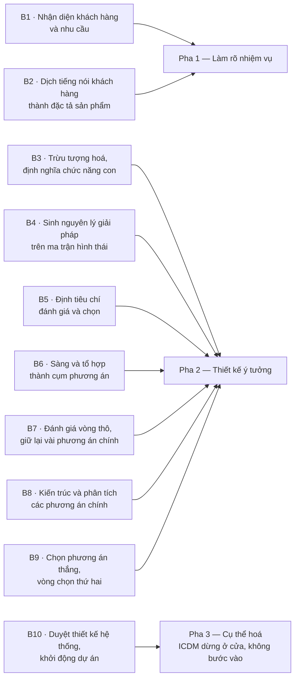
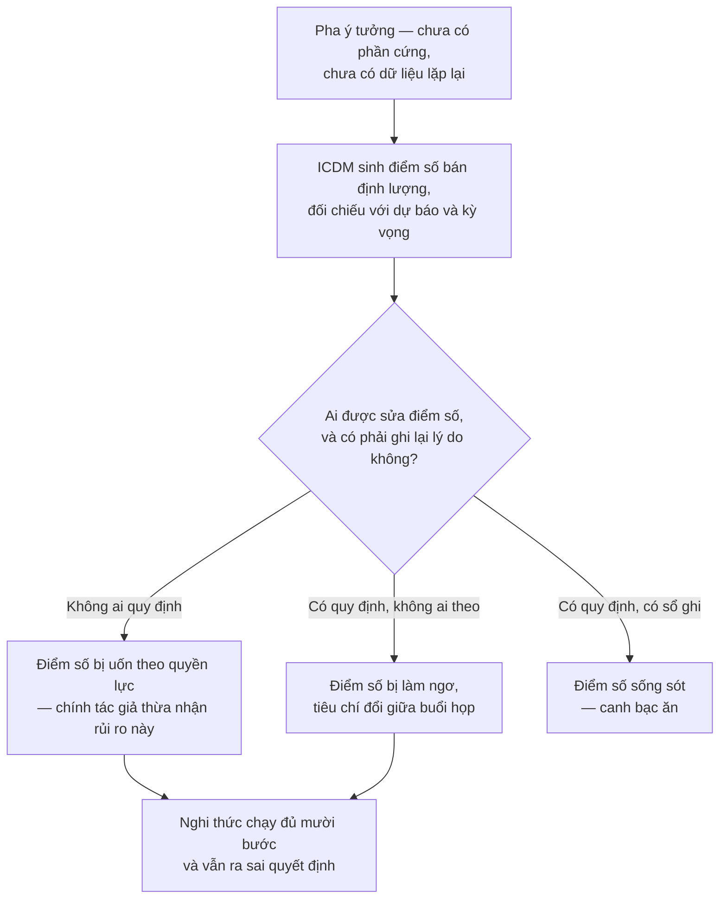

# Chương 08 — ICDM: cắm thước đo vào pha chưa có gì để đo

Pha ý tưởng là pha khoá phần lớn tiền của cả vòng đời sản phẩm, và cũng là pha có ít số liệu nhất để
biện minh cho việc khoá. Đó không phải nghịch lý tu từ — đó là điều kiện làm việc thật của mọi kỹ sư
trưởng. Anh phải chọn giữa ba nguyên lý giải pháp khi chưa có mẫu nào, chưa có bảng kê vật tư nào, chưa
có một lần thử nào; rồi phải đứng trước ban lãnh đạo giải thích vì sao chọn cái thứ hai. Thiếu một cách
gắn con số vào khoảnh khắc đó, quyết định đắt nhất của dự án được ra bằng thứ có sẵn duy nhất: uy tín cá
nhân của người nói to nhất trong phòng. ICDM sinh ra để giải đúng chỗ này.

Nó không đề nghị thay bốn pha của Pahl-Beitz. Nó tự khai là bản mở rộng của chính bốn pha ấy —
`"The systematic method for conceptual design of a new product has been introduced as a comprehensive
design tool by Pahl and Beitz in 1977 and improved since."` [46] — và toàn bộ sức nặng của nó dồn vào
một pha duy nhất trong bốn pha mà Chương 03 đã dựng: pha thiết kế ý tưởng. Amihud Hari và Menachem P.
Weiss phát triển nó tại Technion: `"ICDM is the Integrated, Customer Driven, Conceptual Design Method,
that has been developed in the Technion, Israel during 1996 and 2001."` [49]. Giữa mốc 1977 và mốc 1996
ấy, có người quay lại đúng pha yếu nhất của phương pháp gốc và nong nó ra.

Chương này trả lời đúng hai câu, không hơn. **Một:** ICDM giả định một tổ chức như thế nào — canh bạc
riêng của nó là gì, khi nó đòi một tổ chức chịu chấm điểm chính mình lúc chưa có gì để đo. **Hai:** nó
ngồi ở tầng đòn bẩy nào — chương này chỉ nêu vấn đề, Chương 16 mới xếp hạng cùng mọi công cụ khác.
Chương này **không** dạy cách dùng bảy công cụ của ICDM. Lý do ở ngay mục dưới.

## Chương này cố ý ngắn, và đây là lý do

Có nguyên một cuốn sách khác về ICDM: dự án `icdm-hari-weiss`, 126.578 từ, đã xuất bản. Bảy công cụ nằm
ở đó — công thức, thang điểm, biểu mẫu, ca áp dụng. Viết lại chúng ở đây thì được một chương dài và một
cuốn sách kém: người đọc trả tiền hai lần cho cùng một nội dung, còn luận đề của cuốn này bị nhấn chìm
dưới bảng biểu.

Đường không đi: bản nháp đầu tiên định dành mỗi công cụ một mục có ví dụ chạy được. Nó bị cắt vì một lý
do đo được — độ dài. Trần độ dài của chương này là **một cảm biến**, không phải một gợi ý về văn phong.
Nếu bản thảo phình quá trần, chẩn đoán gần như chắc chắn không phải "viết hơi dài" mà là "đã bắt đầu
viết lại cuốn kia". Cách xử lý đúng khi đó là cắt, không phải nới trần.

Cái còn lại sau khi cắt là thứ cuốn kia **không** làm: đặt ICDM cạnh Pahl-Beitz, VDI 2221 và VDI 2206
rồi hỏi cùng một câu đã hỏi ba phương pháp trước — phương pháp này đặt cược vào tổ chức nào. Bảy công cụ
ở đây chỉ được nêu tên và nêu chỗ chúng cắt vào quy trình. Muốn chi tiết, đọc `icdm-hari-weiss`.

## Mười bước ngồi lên bốn pha ở đâu

ICDM có đúng mười bước: `"The procedure of ICDM consists of 10 steps..."` [54]; và ở một chỗ khác các tác
giả gọi thẳng bản chất của nó — `"Finally, an integration of these techniques, supplemented by a few
additional analysis tools, was formed into a 10 step comprehensive prescriptive method – the ICDM -
Integrated, Customer Driven, Conceptual Design Method (Hari and Weiss, 1996)."` [47]. Chữ *prescriptive*
là do chính tác giả chọn. Ghi lại, vì Chương 12 sẽ dùng nó.

Mười bước ấy không trải đều lên bốn pha. Chúng dồn cục:

Bảy trên mười bước nằm gọn trong pha hai. Hai bước đầu ngồi ở pha một. Bước cuối là một cái cửa, không
phải một việc: nó chốt hồ sơ tại mốc duyệt thiết kế hệ thống rồi bàn giao cho pha cụ thể hoá — và ICDM
không nói gì thêm về pha ấy.

Điều này đáng chú ý vì bản thân Pahl-Beitz đã phân rã pha ý tưởng thành bảy bước:
`"The process consists of seven steps (Pahl, et al., 2007)."` [48]. Bảy bước ở đây là bảy bước của riêng
pha ý tưởng, không phải bảy bước toàn quy trình của VDI 2221:1993 ở Chương 04; hai con số bằng nhau và
không liên quan gì nhau. Vậy ICDM lấy bảy bước định tính và bơm thành chín bước định lượng cộng một cửa
duyệt. Đó là toàn bộ phép biến đổi.

| Pha Pahl-Beitz | ICDM làm gì ở đây |
|---|---|
| Pha 1 — Làm rõ nhiệm vụ | Nong ra hai bước, thay danh sách yêu cầu bằng một chuỗi chấm điểm được |
| Pha 2 — Thiết kế ý tưởng | Nong ra bảy bước, gắn thước đo vào mọi khớp nối, hai vòng chọn thay vì một |
| Pha 3 — Cụ thể hoá | Không chạm. Bước 10 giao hồ sơ rồi dừng |
| Pha 4 — Thiết kế chi tiết | Không chạm |

Đọc bảng này theo chiều dọc thì thấy hình dạng thật của ICDM: không phải một phương pháp thiết kế đối
thủ, mà **một cái kính lúp đặt lên đúng một pha**. Nó thừa nhận ba pha kia của Pahl-Beitz nguyên vẹn.
Mọi thứ nó đòi hỏi, nó đòi trong khoảng thời gian trước khi có bản vẽ đầu tiên.

## Bảy công cụ — chỉ tên, và chỗ chúng cắt vào

| Công cụ | Cắt vào đâu |
|---|---|
| **EQFD** | Bước 2 — chỗ tiếng nói khách hàng biến thành đặc tả, tức đúng đường ranh pha 1 sang pha 2 |
| **TVDT** | Cũng bước 2, nhưng ở lát mỏng nhất của nó: khoảnh khắc một giá trị mục tiêu bị chốt thành số |
| **DSO** | Bước 6 — chỗ ma trận hình thái nổ tổ hợp và buộc phải sàng |
| **CFMA** | Bước 8 — kéo phân tích chế độ hỏng lên trước khi có linh kiện nào để hỏng |
| **CDTC** | Bước 8 — kéo dự toán chi phí lên trước khi có bảng kê vật tư nào để cộng |
| **RTA** | Bước 8 — kéo tiến độ và rủi ro lên trước khi có kế hoạch nào để trượt |
| **Robustool** | Bước 8 — chấm mức chịu đựng của phương án trước khi có mẫu nào để thử |

Trên bảy công cụ này còn một tầng đo nữa — DQM chấm chất lượng của chính quá trình thiết kế, CSR quy đổi
mức hài lòng khách hàng thành hàm số. Chúng không phải công cụ thiết kế; chúng là thước đo đặt lên người
đang thiết kế. Giữ phân biệt đó, vì mục sau xoay quanh nó.

Công thức, thang điểm, biểu mẫu và ca áp dụng của cả bảy: `icdm-hari-weiss`. Chương này dừng ở đây.

## Canh bạc: một tổ chức chịu chấm điểm khi chưa có gì để đo

Ba phương pháp ở các chương trước đặt cược vào những thứ khá quen: hợp tác liên ngành thông suốt, kỷ
luật quy trình, đủ tiền cho pha trừu tượng. ICDM đặt cược vào một thứ khác hẳn, và khó hơn nhiều.

Điểm số của nó **không có vật đối chiếu bên ngoài**. Ở nhà máy, tỷ lệ phế phẩm là một sự thật: đếm được,
lặp lại được, không ai cãi. Ở pha ý tưởng thì không có gì như thế, và chính các tác giả viết ra điều đó
bằng một câu thẳng thắn đến mức hiếm gặp trong văn liệu phương pháp:
`"We can compare design process data only against forecasts or expectations. These metrics are
subjective and subjected to personal influence, power and pressure."` [46].

Đọc kỹ vế cuối. *Power and pressure* — quyền lực và áp lực. Tác giả của một phương pháp định lượng nói
rằng con số của chính mình chịu tác động của quyền lực. Vậy canh bạc là: ICDM giả định một tổ chức mà ở
đó một con số do đội thiết kế sinh ra sống sót được qua một cuộc họp có mặt cấp trên. Không phải giả
định về năng lực kỹ thuật. Giả định về quan hệ quyền lực.

Bốn giả định con nữa xếp ngay dưới nó, mỗi cái có nguyên văn của chính tác giả.

**Giả định về văn hoá, không phải về công cụ.** Hệ đo DQM chỉ chạy nếu cả doanh nghiệp đã sống bằng QFD:
`"However, a practical application of deployments in DQM requires comprehensive implementation of QFD
across the organization as a way of living for all the product development teams."` [46]. Cụm *way of
living* không phải cách nói hoa mỹ — nó là điều kiện tiên quyết. Một xưởng muốn dùng ICDM ở một dự án
đơn lẻ đã vi phạm điều kiện này ngay từ ngày đầu.

**Giả định rằng đội chấp nhận hằng số do người khác đặt.** Thuật toán của Robustool chạy trên các hằng
số `a = 3`, `b = 0.2`, `x0 = 10`, và tác giả không giấu nguồn gốc của chúng:
`"The above parameters can be modified by the user in order to fit to his/hers project and needs. The
numbers and equations are arbitrary, and were found to be appropriate for this case."` [56]. Kèm theo là
một câu tự hạ thấp nữa: `"This score is by no means considered as binding... the table is considered as
a guide only."` [56]. Một điểm số không ràng buộc rơi vào một tổ chức quen coi mọi điểm số là ràng buộc
thì biến thành vũ khí; rơi vào một tổ chức coi nó là chỉ dẫn thì làm đúng việc của nó. Phương pháp không
có cách nào biết nó vừa rơi vào tổ chức nào.

**Giả định rằng mức chấp nhận rủi ro là thứ đội thiết kế được phép chọn.** RTA nén tiến độ bằng cách
chạy song song các việc khi khoảng trống tri thức chưa khép, và tác giả nói thẳng cái giá:
`"As shown, the ability to reduce times and to work simultaneously is a function of the willingness to
take risks."` [55]. Đó là một quyết định quản trị, không phải một quyết định kỹ thuật. ICDM trao cho kỹ
sư một cái núm vặn mà quyền vặn thuộc về người khác — và không bước nào trong mười bước quy định ai vặn.

**Giả định rằng đội sẽ bác con số bằng tay khi con số sai.** Thuật toán sàng tổ hợp không kiểm tương
thích chéo, và kết quả đo được là:
`"In each of our experimental projects, two or more unacceptable combinations were includeded in the
solutions suggested by the algorithms."` [57]. *Trong mọi dự án thử nghiệm.* Phương pháp cần những kỹ sư
sẵn sàng gạt kết quả máy tính đi.

Đặt giả định đầu và giả định cuối cạnh nhau thì lộ ra chỗ căng nhất của ICDM. Giả định đầu cần những
người **bảo vệ con số trước quyền lực**. Giả định cuối cần chính những người đó **bác con số bằng trực
giác**. Hai khí chất khác nhau, đòi hỏi trong cùng một phòng, cùng một tuần, đôi khi cùng một cuộc họp.
Không tài liệu nào trong cụm ICDM nói cách phân biệt lúc nào cần khí chất nào — và việc chỉ ra sự căng
này là thao tác của cuốn sách này, không phải phát hiện của nguồn.

Nhánh giữa không phải giả thuyết. Một thí nghiệm trên người thiết kế chuyên nghiệp đo đúng nó:
`"Previous research has shown that structured methods are often not used properly or at all in design
practice. ... The experiment involved sixteen professional designers... furthermore, some internal
conflicts appeared between different concept evaluation tasks."` [44]. Mười sáu người — cỡ mẫu nhỏ, phải
nói ra khi trích. Nhưng kết quả trùng với thứ ai từng ngồi họp chọn phương án đều đã thấy: tiêu chí đánh
giá bị đổi giữa chừng, bởi chính những người vừa đồng ý với nó nửa giờ trước.

> **Đào sâu: hai con số cho cùng một mệnh đề, cùng một nguồn gốc**
>
> Mệnh đề trung tâm biện minh cho toàn bộ ICDM là *pha ý tưởng khoá phần lớn chi phí vòng đời*. Trong
> cụm tài liệu này nó xuất hiện với **hai** con số khác nhau. Một:
> `"Most of the product's performance is determined and more than 75% of its life cycle cost is
> committed during the conceptual design phase."` [45]. Hai:
> `"about 80 % of the life cycle cost is committed in this stage (Blanchard ,1978)."` [47].
>
> Chênh nhau năm điểm phần trăm thì không nghiêm trọng. Nghiêm trọng là chỗ khác: cả hai đều truy về
> **cùng một tài liệu năm 1978** — bản thứ hai ghi rõ Blanchard 1978, và một bài khác trong cụm cũng
> ghi `"About 75 % of the life cycle cost is committed in this stage (Blanchard, 1978)."` [50]. Cùng
> một nguồn gốc, được trích ở hai giá trị, trong các bài của cùng một trường phái.
>
> Không ai gian dối ở đây. Nhưng con số nền móng của một phương pháp định lượng đã trôi qua bốn thập
> niên trích dẫn lại nhau mà không ai đo lại. Khi dùng nó để thuyết phục ban lãnh đạo rằng phải đầu tư
> vào pha ý tưởng, hãy nói "một ước lượng từ 1978, được trích ở 75% và 80% tuỳ tài liệu" — chứ đừng nói
> "75%" như một phép đo.

Còn một chi tiết nữa, nhỏ mà nói lên nhiều: cuốn sách giáo khoa gốc của ICDM chưa từng được viết. Cụm
tài liệu ghi lại lý do phương pháp này không lan ra ngoài vài nơi — `"except in Australia, probably
because a basic book has not been written"` [44], [46]. Một phương pháp *prescriptive* toàn diện, mười
bước, bảy công cụ, hai mươi năm nghiên cứu — và cửa ngõ phổ biến của nó là hội thảo cùng giáo trình đại
học. Điều đó không nói gì về chất lượng kỹ thuật của ICDM. Nó nói rất nhiều về việc một phương pháp cần
gì để đi được vào tổ chức khác, và Chương 17 sẽ quay lại đúng điểm này.

## Giả định nằm dưới cả bốn: rằng cái nền mô tả đúng người thiết kế

ICDM giữ nguyên ba pha còn lại của Pahl-Beitz, và giữ luôn mô hình tuyến tính làm nền cho chúng. Mô hình
ấy dự báo rằng các vấn đề về cấu trúc vật lý và hành vi của cấu trúc chỉ nổi lên ở các pha sau. Một phân
tích giao thức đo được điều ngược lại:
`"While PBSA predicts that these design issues will not occur until later during designing, for the
second-year students the opposite was the case: They produced structure issues and structure behaviour
issues very early on in their design sessions."` [53].

Đối tượng đo là sinh viên năm hai, không phải kỹ sư dày dạn — phải nói ra, vì đó là giới hạn thật của
bằng chứng. Nhưng tác giả chặn sẵn lối thoát quen thuộc, rằng "mô hình có vòng lặp nên vẫn đúng":
`"Even if iterations in PBSA (which Pahl and Beitz do not exclude) were to be taken into account
(including intra- and inter-stage iterations), there would still be no early occurrence of structure
issues and structure behaviour issues in their model."` [53].

Hệ quả cho ICDM lớn hơn cho Pahl-Beitz. Pahl-Beitz mô tả một trình tự; ICDM **chấm điểm** việc đi theo
trình tự đó. Nếu cái đầu người thiết kế nhảy sang cấu trúc vật lý ngay từ buổi đầu, thì bước trừu tượng
hoá thành chức năng con trước khi nghĩ về vật không phải là mô tả cái đang xảy ra — nó là một mệnh lệnh
chống lại cái đang xảy ra. Và khi có thước đo gắn vào, điểm số cao mang hai nghĩa không phân biệt được từ
bên ngoài: phương án tốt, hoặc đội đã học được cách điền bảng.

Đó là canh bạc thứ hai, chồng lên canh bạc thứ nhất. Canh bạc thứ nhất đặt cược vào quan hệ quyền lực
trong phòng họp. Canh bạc thứ hai đặt cược rằng cái nền mà phương pháp đứng lên mô tả đúng cách người
thiết kế thật sự làm việc. Chương 12 mở lại đúng trục này dưới tên gọi của nó: *quy định* so với *mô tả*.

## Tầng đòn bẩy: nêu vấn đề, chưa xếp hạng

Chương 15 mới dựng thang đo tầng đòn bẩy đầy đủ và Chương 16 mới xếp toàn bộ công cụ lên đó. Ở đây chỉ
cần đặt câu hỏi cho đúng, vì ICDM là ca sạch nhất trong cả cuốn để đặt nó.

**ICDM tự nhận nó can thiệp ở đâu?** Tự nhận rất cao. Nó đòi đổi cách tổ chức nghĩ về chuyện đo lường
thiết kế — đòi QFD thành *way of living* cho mọi đội phát triển sản phẩm. Đó là một yêu cầu ở tầng hệ
hình tư duy, gửi tới toàn doanh nghiệp.

**Nó thật sự giao ra cái gì?** Giao ra tham số. Ma trận nhu cầu bị chặn ở
`"15-20 system level needs (rows)"` và `"20 – 25 product characteristics (columns)"` [46], sau khi tác
giả ghi nhận `"A matrix of more than 20x20 or 15x25 is impractical to handle because it consumes too
much time."` [46]; tiêu chí lọc vòng thô phải phủ `"at least 70% of the customer satisfaction"` còn vòng
tinh `"at least 95% of the customer satisfaction"` [47]; dự toán chi phí sớm sai trong dải
`"within 20% of the final actual unit manufacturing cost"` [50]; và ba hằng số của Robustool thì tác giả
gọi thẳng là *arbitrary* [56]. Đây là những con số cụ thể, chỉnh được bằng một cuộc họp — tức đúng loại
can thiệp yếu nhất trên thang Meadows.

Khoảng cách giữa hai điều trên là toàn bộ vấn đề. Việc ánh xạ công cụ thiết kế vào thang đòn bẩy là
**thao tác của cuốn sách này**; Meadows không viết một chữ nào về thiết kế kỹ thuật, và không nguồn nào
trong 66 tài liệu đặt hai thứ cạnh nhau. Nhưng chênh lệch tự-nhận so với thật thì không cần Meadows mới
thấy — nó nằm ngay trong hai câu của cùng một tác giả, cách nhau vài trang.

Còn một giới hạn tác giả tự vạch, đáng ghi vì nó thu hẹp phạm vi rất nhiều: RTA vô dụng với dự án lặp
lại đã biết trước công việc — `"A classical repetitive project, like the construction of a building can
be planned and presented in a network of known activities, with the time required to complete each
activity evaluated at reasonable precision and variance levels."` [55]. ICDM chỉ có nghĩa khi thứ đang
làm là mới. Với việc làm lại lần thứ mười, nó là chi phí thuần.

## Chỗ ICDM đứng trong hàng

Đặt bốn canh bạc cạnh nhau thì thấy ICDM không đòi thêm cùng loại với ba phương pháp trước — nó đòi một
loại khác. Bảng dưới là **tổng hợp của cuốn sách này**, dựng từ danh sách giả định mà Chương 13 sẽ mở ra
đầy đủ; không nguồn nào trong 66 tài liệu xếp bảng này.

| Phương pháp | Đòi ở tổ chức thứ gì trước tiên |
|---|---|
| Pahl-Beitz (Ch03) | Kỷ luật đi qua pha trừu tượng, và tiền để ở lại pha đó đủ lâu |
| VDI 2221:1993 (Ch04) | Chịu để một tiêu chuẩn bên ngoài định nghĩa trình tự làm việc bên trong |
| VDI 2206 (Ch06–07) | Thuật ngữ chung giữa cơ, điện và phần mềm, và niềm tin vào mô hình ảo |
| ICDM (Ch08) | **Chịu chấm điểm chính mình khi chưa có gì để đo — và để con số ấy sống** |

Ba dòng đầu là những đòi hỏi về nguồn lực và kỷ luật. Dòng cuối là một đòi hỏi về quyền lực. Đó là lý do
ICDM khó lan hơn cả ba, dù về kỹ thuật nó là cái được suy nghĩ kỹ nhất cho pha mà nó nhắm vào.

## Áp dụng ở Xưởng

Bối cảnh: một xưởng cơ khí — điện tử — phần mềm nhúng vài chục người, đang có vài sản phẩm ở pha ý tưởng
với ràng buộc nội địa hoá. Không đủ người để chạy cả mười bước, và không nên chạy.

### 1. Chốt trong tuần này: ai được sửa một điểm số, và sửa thì ghi ở đâu

Quyết định này ra được ngay, không cần công cụ nào, không cần đào tạo ai. Trước khi xưởng chấm điểm bất
kỳ phương án nào, viết ra một trang: điểm số của một phương án chỉ được sửa bởi người đã đặt ra nó hoặc
bởi người chủ trì thiết kế; mọi lần sửa ghi một dòng gồm ngày, ô bị sửa, giá trị cũ, lý do. Không cần
phần mềm, một tệp bảng tính là đủ. **Vấn đề nó giải:** chính tác giả ICDM thừa nhận điểm số ở pha ý
tưởng chịu tác động của quyền lực và áp lực; luật này không xoá được áp lực nhưng bắt nó để lại dấu vết.
**Bẫy:** nếu người chủ trì thiết kế cũng là người duyệt ngân sách thì luật vô hiệu ngay hôm ký — khi đó
phải tách hai vai, hoặc đừng chấm điểm và nói thẳng rằng quyết định này ra bằng phán đoán.

### 2. Chọn đúng một công cụ định lượng cho pha ý tưởng, không phải bảy

**Vấn đề nó giải:** bảy công cụ đòi một tổ chức đã sống bằng văn hoá đo lường; một xưởng vài chục người
áp cả bảy sẽ dựng đủ nghi thức mà không đội nào tin con số nào. **Cách áp:** chọn một công cụ theo chỗ
đau nhất — hay trượt tiến độ thì lấy công cụ rủi ro–tiến độ, hay vỡ giá thành thì lấy công cụ dự toán
sớm — chạy nó ở hai dự án liên tiếp rồi mới bàn đến công cụ thứ hai. **Bẫy:** chọn công cụ theo cái dễ
học nhất thay vì theo chỗ đau nhất, rồi kết luận "phương pháp này không hợp với xưởng mình".

### 3. Chặn kích thước bảng nhu cầu trước khi mở nó ra

**Vấn đề nó giải:** bảng đối chiếu nhu cầu khách hàng phình đến mức không ai phân tích nổi đánh đổi, rồi
bị bỏ giữa chừng — đúng điều ICDM ghi nhận khi vượt cỡ 20×20 hoặc 15×25. **Cách áp:** đặt trần số hàng
và số cột **trước** buổi làm việc đầu tiên và dán nó lên bảng; thứ không lọt vào trần thì không biến mất
mà xuống một danh sách chờ có ghi ngày. **Bẫy:** cắt hàng cho vừa trần mà không ghi lại cái đã cắt —
tháng sau một nhóm khách hàng biến mất khỏi hồ sơ và không ai nhớ ai đã bỏ họ đi.

### 4. Tách cấu phần chưa có bằng chứng khả thi ra khỏi kế hoạch dự án

**Vấn đề nó giải:** một cấu phần chưa ai chứng minh là chạy được thì số vòng lặp cần thiết là bất khả dự
báo, và ICDM nêu thẳng rằng loại cấu phần này phải chạy như một đề tài nghiên cứu riêng trước khi dự án
bắt đầu. **Cách áp:** trước khi lên tiến độ, đi qua danh mục cấu phần và gắn nhãn cho từng cái — *đã
từng làm* / *đã có người khác làm* / *chưa ai chứng minh chạy được*; nhãn thứ ba bị gỡ khỏi đường găng
và cấp một mốc riêng chỉ để chứng minh khả thi. **Bẫy:** gắn nhãn sau khi đã hứa ngày giao hàng — lúc đó
cái nhãn chỉ còn là lời giải thích cho việc trễ.

### 5. Mở sổ ghi những chỗ con số sai và đội đã bác nó bằng tay

**Vấn đề nó giải:** thuật toán sàng tổ hợp của ICDM sinh ra tổ hợp không dùng được trong **mọi** dự án
thử nghiệm mà chính tác giả chạy; nếu không ai ghi lại chuyện đội đã bác gì và vì sao, thì lần sau con
số thắng mặc định vì không có bằng chứng ngược. **Cách áp:** một dòng mỗi lần — phương án bị bảng điểm
xếp cao mà đội bác, kèm lý do kỹ thuật; đọc lại sổ đó ở đầu mỗi dự án mới. **Bẫy:** sổ này rất dễ biến
thành nơi hợp thức hoá mọi lần phá luật; chốt chặn là mỗi dòng phải nêu một lý do **kỹ thuật** kiểm
được, không phải một sở thích.

---
## Sổ kiểm của chương

- **Neo luận đề:** *Canh bạc* — nối rõ ở mục "Canh bạc: một tổ chức chịu chấm điểm khi chưa có gì để đo",
  từ đoạn mở mục đến đoạn khép về hai khí chất mâu thuẫn. Neo *Tầng đòn bẩy* chỉ được **nêu vấn đề** ở
  mục áp chót, đúng phân công của Chương 16.
- **Nối ngược đích danh:** Chương 03 (bốn pha Pahl-Beitz) ở đoạn mở thứ hai và ở mục "Mười bước ngồi lên
  bốn pha ở đâu"; Chương 04 (bảy bước VDI 2221:1993, phân biệt với bảy bước pha ý tưởng); Chương 12
  (*prescriptive*); Chương 15 và 16 (thang đòn bẩy); Chương 17 (vì sao phương pháp không lan).
- **Nguồn đã dùng:** [44], [45], [46], [47], [48], [49], [50], [53], [54], [55], [56], [57].
- **Ngữ cảnh đã trích kèm theo Luật 2:** cỡ mẫu `sixteen professional designers` [44] và đối tượng
  `second-year students` [53] đều được nói ra ngay tại chỗ trích, không để trần con số; và câu chặn lối
  thoát "mô hình có vòng lặp nên vẫn đúng" [53] được trích liền sau, vì bỏ nó đi thì bằng chứng bị đọc
  nhẹ hơn thực tế.
- **Con số có nguyên văn:**
  - `1977` — "The systematic method…" [46]
  - `1996`, `2001` — "ICDM is the…" [49]
  - `75%` — "Most of the product's…" [45]; biến thể "About 75 %…" [50]
  - `80%` — "about 80 % of…" [47]
  - `10` bước — "The procedure of…" [54]; "Finally, an integration…" [47]
  - `seven` bước pha ý tưởng của Pahl-Beitz — "The process consists…" [48]
  - `15-20` hàng, `20 – 25` cột — "15-20 system level…" [46]
  - `20x20`, `15x25` — "A matrix of…" [46]
  - `70%`, `95%` — "This criteria group…" / "Group B includes…" [47]
  - `20%` sai số dự toán — "it was found…" [50]
  - `a = 3`, `b = 0.2`, `x0 = 10` — "The above parameters…" [56]
  - `sixteen` người thiết kế — "The experiment involved…" [44]
  - `two or more` tổ hợp lỗi — "In each of…" [57]
  - `126.578` từ (cuốn `icdm-hari-weiss`) — **không phải số của nguồn**; là số liệu dự án lấy từ
    `Phase2-Positioning.md` và `Phase3-Outline.md`, đã ghi rõ trong văn bản là nói về cuốn sách anh em.
- **Con số đã BỎ vì không có nguyên văn:**
  - Ngưỡng hành động `SFD > 100` của CFMA — tệp khám phá chỉ có bản tiếng Việt, không có câu tiếng Anh
    chứa số 100. Bỏ hẳn, không viết "khoảng 100".
  - `6` giai đoạn CDTC và giới hạn `9` mục của bảng tính — phần "9" có nguyên văn, nhưng là chi tiết
    cách dùng công cụ, thuộc phạm vi cuốn `icdm-hari-weiss`. Bỏ theo ràng buộc R5, không theo Luật 1.
  - `4` cấp thang khoảng trống tri thức Bonen — dùng ở mục *Áp dụng* dưới dạng mô tả không số ("chưa ai
    chứng minh chạy được"), vì con số cấp độ chỉ có nghĩa khi giải thích cả thang, tức lại là cách dùng.
- **Chỗ là suy luận của tác giả, không phải của nguồn:**
  - Mâu thuẫn giữa "đội phải bảo vệ con số trước quyền lực" và "đội phải bác con số bằng trực giác" —
    hai giả định đều có nguyên văn, nhưng việc đặt chúng cạnh nhau và gọi đó là chỗ căng của phương pháp
    là thao tác của cuốn sách này. Đã ghi rõ trong văn bản.
  - Ánh xạ ICDM vào thang đòn bẩy Meadows — thao tác của cuốn sách, đã khai báo tại mục "Tầng đòn bẩy",
    theo Luật 4 và khai báo số 1 của Chương 01.
  - Đọc "cuốn sách gốc chưa từng được viết" như một dữ kiện về khả năng lan của phương pháp — nguồn chỉ
    nêu sự việc, cách diễn giải là của cuốn sách này.
  - Bảng "Pha nào ICDM nong ra" và cả hai sơ đồ mermaid — do tác giả dựng từ danh sách mười bước; không
    nguồn nào trong cụm vẽ ánh xạ mười-bước-lên-bốn-pha.
  - Bảng "Chỗ ICDM đứng trong hàng" — tổng hợp của cuốn sách, đã khai báo ngay trên bảng; ba dòng đầu
    lấy từ danh sách hội tụ mà Chương 13 dựng, không phải từ cụm tài liệu ICDM.
  - Đọc bằng chứng phản bác mô hình tuyến tính của Pahl-Beitz [53] như một rủi ro **của ICDM** — nguồn
    nói về Pahl-Beitz, việc chuyển hệ quả sang ICDM (vì ICDM chấm điểm việc tuân trình tự ấy) là suy
    luận của cuốn sách này.
- **Cổng an ninh (Luật 5):** mục *Áp dụng ở Xưởng* không có tên riêng, mã sản phẩm, tên dự án, tên đơn
  vị, tên người, số liệu vận hành; không nêu lĩnh vực.
- **Ràng buộc R5 (không trùng cuốn `icdm-hari-weiss`):** bảy công cụ chỉ được **nêu tên** trong một bảng
  bảy dòng, mỗi dòng một câu nói nó cắt vào bước nào. Không công thức, không thang điểm, không biểu mẫu,
  không quy trình thực thi, không ca áp dụng.
- **Số dòng:** 375
