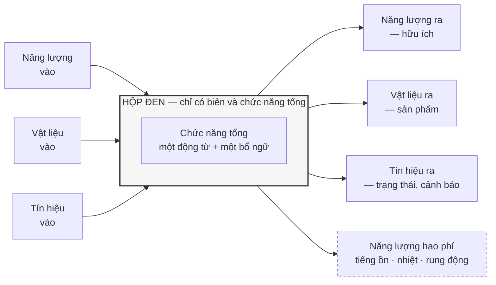
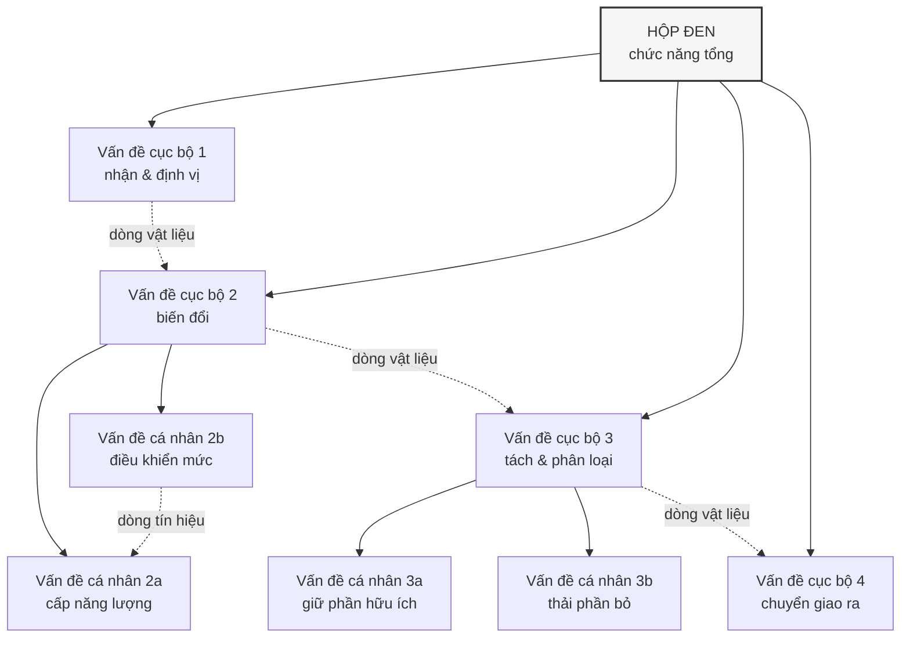
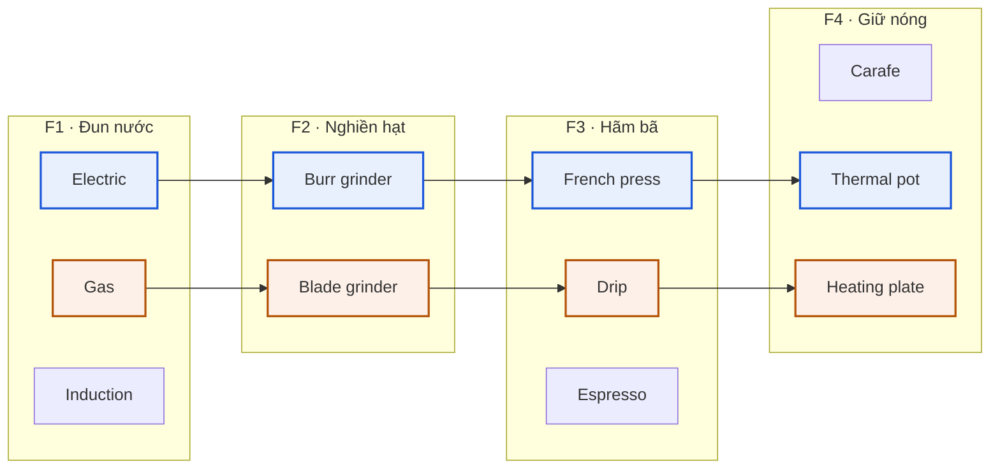

# Chương 09 — Sinh giải pháp: hộp đen, cấu trúc chức năng, ma trận hình thái

Mọi phương pháp trong Phần II đều nói cho ta biết có những pha nào, pha nào đứng trước pha nào, và sản
phẩm bàn giao của mỗi pha là gì. Không phương pháp nào trong số đó nói **các phương án ở đâu ra**. Giữa
pha ý tưởng có một lỗ thủng đúng ở tâm: đến một lúc nào đó phải có người đẻ ra nhiều hơn một câu trả lời,
nếu không thì toàn bộ bộ máy chấm điểm phía sau chỉ là nghi lễ — chọn một trong một. Ba công cụ lấp lỗ
thủng đó, và chúng luôn đi thành chuỗi: hộp đen, cấu trúc chức năng, ma trận hình thái. Thiếu chúng, cái
gọi là "chọn phương án" chỉ còn là hợp lý hoá cho phương án duy nhất mà người có kinh nghiệm nhất trong
phòng đã nghĩ ra từ đầu.

Chương 08 để lại đúng chỗ trống này. ICDM cắm thước đo vào pha chưa có gì để đo, và canh bạc của nó là
một tổ chức chịu chấm điểm khi vật để chấm còn chưa thành hình. Nhưng thước đo giả định có vật. Chương 08
không trả lời — và không có nhiệm vụ trả lời — câu hỏi vật ấy từ đâu tới. Phần III bắt đầu từ đó, và bắt
đầu bằng cụm công cụ đứng ngay thượng nguồn của mọi thang chấm: cụm sinh giải pháp.

Chương này để lại ba thứ. Thứ nhất: vì sao trật tự hộp đen → cấu trúc chức năng → ma trận hình thái
**không đảo được**, và cái gì hỏng cụ thể khi có người đảo nó. Thứ hai: giới hạn của từng công cụ, bằng
đúng chữ của chính các tác giả viết ra chúng — không phải bằng lời phê bình từ bên ngoài. Thứ ba, và là
lý do chương này mở Phần III: **đòi hỏi ngầm**. Cả ba công cụ đều buộc người dùng phân rã được *chức năng*
trước khi biết *giải pháp*. Bằng chứng thực nghiệm nằm ngay trong sách gốc nói rằng kỹ sư có kinh nghiệm
thật sự không nghĩ theo chiều đó. Đó là canh bạc riêng của cụm công cụ này, và nó là nền cho Chương 12.

---

## Ba công cụ là một chuỗi, không phải một bộ đồ nghề

Cách trình bày thông thường xếp ba công cụ này thành danh sách: đây là hộp đen, đây là cấu trúc chức
năng, đây là ma trận hình thái, dùng cái nào tuỳ bài toán. Cách đó sai ở một điểm kiểm chứng được:
**đầu ra của công cụ trước là đầu vào bắt buộc của công cụ sau.** Không phải theo nghĩa "nên có", mà theo
nghĩa nếu thiếu thì công cụ sau không có gì để chạy.

Nguồn duy nhất trong tài liệu làm việc mô tả cả ba công cụ theo trục đầu vào — đầu ra là một bài giảng
tiếng Tây Ban Nha về phương pháp luận VDI 2221 `[17]`. Bài giảng ấy xếp chuỗi như sau:

| Công cụ | Đầu vào | Đầu ra | Đầu ra này đi đâu |
|---|---|---|---|
| **Hộp đen** | Yêu cầu cốt lõi từ khách hàng; tài nguyên sẵn có | Sơ đồ khối thể hiện chuyển hoá tổng thể của năng lượng, vật liệu, tín hiệu | Vào cấu trúc chức năng |
| **Cấu trúc chức năng** | Sơ đồ hộp đen tổng thể | Sơ đồ các khối chức năng cục bộ được liên kết | Vào ma trận hình thái |
| **Ma trận hình thái** | Sơ đồ cấu trúc chức năng | Ma trận đầy đủ + các bản phác thảo tay của khái niệm giải pháp | Vào pha thiết kế sơ bộ, tức Chương 10 |

Đọc ngược bảng này thì thấy ràng buộc: ma trận hình thái không nhận đầu vào nào khác ngoài cấu trúc chức
năng. Thiếu nó, cột trái của ma trận sẽ được điền bằng thứ khác — và thứ khác ấy, gần như luôn luôn, là
**danh sách bộ phận**. Đó là chế độ hỏng cụ thể nhất của cả cụm, và ta sẽ quay lại nó ở mục riêng.

Sơ đồ trên là hộp đen theo mô tả của `[17]`: một khối chữ nhật đại diện cho biên hệ thống, các dòng đi
vào, các dòng đi ra, và — điểm mà phần lớn người vẽ bỏ quên — **các dòng ra hao phí**. Nguồn nói thẳng
rằng dòng hao phí không phải trường hợp ngoại lệ mà là thuộc tính của mọi máy:
`"toda máquina me genera ruido me genera calor que genera vibración que son tipos de energía de hecho es
la energía que se transforman en ruido en calor en vibración"` `[17]`. Tiếng ồn, nhiệt và rung động là
năng lượng, và chúng đi ra khỏi biên dù ta có vẽ chúng hay không.

**Một điều phải nói rõ về con số ba.** Cách gọi quen thuộc — "hộp đen ba dòng chảy" — không xuất hiện
trong nguồn dưới dạng một câu phát biểu con số. Cái nguồn thật sự nói là:
`"en los tres casos hay una energía que iniesta hay un material o probeta en este caso que ingresa a mi
caja negra y hay una señal"` `[17]` — nguồn gọi tên từng dòng một, năng lượng, vật liệu, tín hiệu, chứ
không tuyên bố "có ba loại dòng". Khác biệt này nghe vụn vặt nhưng nó chính là ranh giới giữa *cái nguồn
nói* và *cái người đọc gán vào nguồn*. Chương này giữ ranh giới đó ở mọi chỗ có con số.

**Và một khoảng trống phải khai báo.** Bốn tài liệu học thuật tiếng Anh về cụm công cụ này trong tài liệu
làm việc — `[29]`, `[32]`, `[38]`, `[39]` — **không có một dòng nào về hộp đen**. Không định nghĩa, không
quy trình, không phê bình. Toàn bộ vật liệu về hộp đen trong chương này đến từ một bài giảng tiếng Tây Ban
Nha. Đó không phải lỗ hổng của việc khai thác; đó là một dữ kiện về chính công cụ: hộp đen sống trong
giáo trình và bài giảng, không sống trong văn liệu bình duyệt. Một công cụ không ai viết bài phê bình về
nó là một công cụ không ai kiểm chứng nó.

---

## Cấu trúc chức năng: mở hộp ra, và cái giá của việc mở

Hộp đen cố tình không cho biết bên trong có gì. Cấu trúc chức năng là thao tác mở nó ra — nhưng mở ra
thành *chức năng*, chưa phải thành *bộ phận*. `[17]` mô tả thao tác này thành ba động tác: phân rã vấn
đề tổng thể thành các **vấn đề cục bộ** (*problemas parciales*); tiếp tục chia nhỏ vấn đề cục bộ thành
**vấn đề cá nhân** (*problemas individuales*) nếu cần; rồi thiết lập liên kết tuần tự hoặc song song
giữa các khối để dòng năng lượng, vật liệu, tín hiệu lưu thông được từ đầu vào đến đầu ra.

Động tác thứ ba mới là động tác khó, và cũng là chỗ một sơ đồ chức năng tự bộc lộ nó đúng hay sai. Nếu có
một khối nhận vật liệu vào mà không có dòng vật liệu nào ra, sơ đồ sai. Nếu có một dòng tín hiệu xuất
hiện giữa sơ đồ mà không truy được về đầu vào nào, sơ đồ sai. Đây là tính chất hiếm của công cụ này:
**nó tự kiểm được**, không cần chuyên gia bên ngoài.

Hai mức trong sơ đồ — cục bộ rồi cá nhân — là hai mức mà `[17]` mô tả, không phải mức tôi tự đặt ra. Ví
dụ mà bài giảng dùng là một máy thu hoạch khoai tây, và nguồn xác nhận số lượng khối cục bộ trong ví dụ
đó bằng câu `"seis soluciones parciales en este caso"` `[17]`. Sáu, cho một máy nông nghiệp. Con số ấy
đáng ghi lại vì nó sẽ va vào một khuyến nghị khác ở mục sau.

Phía tài liệu tiếng Anh, cùng thao tác này mang tên **functional analysis** và được trình bày gọn hơn:
xác định các chức năng chính của sản phẩm, rồi chẻ mỗi chức năng chính thành các chức năng con `[32]`.
Ví dụ kinh điển là cây chức năng của bình pha cà phê kiểu Pháp: *Pha cà phê* chẻ thành cân hạt, nghiền
hạt, trộn hạt với nước trong bình chứa, tách bã khỏi cà phê, rót ra phục vụ. Mục đích được nói thẳng —
để đội thiết kế tập trung vào yêu cầu chức năng thiết yếu **thay vì bị giới hạn sớm bởi các bộ phận vật
lý cụ thể**.

Đến đây công cụ nghe rất ổn. Rồi chính các tài liệu ấy nói ra hai giới hạn, và cả hai đều nằm ở tầng
người dùng chứ không ở tầng kỹ thuật.

Giới hạn thứ nhất là **không có cơ chế bảo đảm đầy đủ**:
`"However, function analysis does not guarantee that all the relevant (sub) functions are identified."`
`[38]`. Đọc kỹ chữ *guarantee*. Không ai hứa. Cấu trúc chức năng là một cái lưới, và không có mệnh đề nào
trong phương pháp nói rằng lưới ấy kín. Một chức năng bị bỏ sót ở đây sẽ không xuất hiện ở ma trận hình
thái, sẽ không được sinh giải pháp, sẽ không được chấm điểm — và sẽ xuất hiện trở lại ở pha cụ thể hoá
dưới dạng một bộ phận phát sinh không ai lên kế hoạch.

Giới hạn thứ hai nặng hơn, vì nó nói về người chứ không về công cụ:
`"In addition to this, it is known that designers have had difficulties identifying the sub-functions in
the first place."` `[29]`. Cụm *in the first place* mới là chỗ đau: khó khăn không nằm ở bước tổ hợp hay
bước chấm điểm, nó nằm ngay ở động tác đầu tiên — động tác mà toàn bộ chuỗi phụ thuộc vào.

Và sách gốc của Pahl-Beitz `[1]` nói ra nguyên nhân, bằng ngôn ngữ tâm lý học nhận thức:
`"Abstracting and creating function structures often causes difficulties because of the abstract
representation. Designers are more used to thinking in objects and visual images [12.6]."` Kỹ sư quen
nghĩ bằng vật thể và hình ảnh. Cấu trúc chức năng đòi họ nghĩ bằng động từ. Đây là một trong ba trích dẫn
làm nên trục của chương này, và cả ba đều đến từ cùng một cuốn — điều mà tôi phải nói ra: nguồn `[1]` là
toàn văn sách Pahl-Beitz và nó một mình chiếm phần lớn nhất của toàn bộ tài liệu làm việc. Trích dày từ
nó có thể vì nó đúng, cũng có thể chỉ vì nó dài. Ở chỗ này, may mắn là ba nguồn độc lập khác — `[29]`,
`[38]`, `[39]` — nói cùng một điều bằng chữ khác.

---

## Ma trận hình thái: nơi tổ hợp thay chỗ cho sáng tạo

Công cụ thứ ba biến cấu trúc chức năng thành một bảng: chức năng con nằm một trục, các cơ cấu vật lý có
thể đảm nhiệm chức năng đó nằm trục kia. Phương pháp do Zwicky đặt ra —
`"Morphological charts were developed by Zwicky (1967) who was an astrophysicist..."` `[29]` — và điều
đáng chú ý ngay từ dòng tiểu sử ấy là nó **không sinh ra trong ngành thiết kế cơ khí**. Nó là một công
cụ khảo sát không gian khả năng, được ngành thiết kế mượn về.

Tài liệu làm việc chứa **ba quy trình khác nhau** cho cùng một công cụ, và chúng khác nhau ở chỗ có ý
nghĩa.

**Quy trình A — sinh ý tưởng** (Tiwari và cộng sự): `Step 1: DECOMPOSITION` liệt kê chức năng con ·
`Step 2: GENERATION` tìm giải pháp cho từng chức năng con · `Step 3: COMBINATION` khám phá các tổ hợp và
tìm một tổ hợp hợp với phát biểu bài toán `[38]`.

**Quy trình B — dựng ma trận đầy đủ** (Roozenburg & Eekels, qua Delft Design Guide): phát biểu bài toán
chính xác nhất có thể · nhận diện mọi tham số có thể xuất hiện trong giải pháp, tức các chức năng và chức
năng con · dựng ma trận với tham số làm cột · điền hàng bằng các thành phần thuộc tham số đó · dùng chiến
lược đánh giá để giới hạn số giải pháp nguyên lý · tạo giải pháp nguyên lý bằng cách ghép **ít nhất một
thành phần từ mỗi tham số** · phân tích và đánh giá mọi giải pháp theo tiêu chí thiết kế và chọn ra một
số hữu hạn giải pháp nguyên lý · phát triển chi tiết các giải pháp đã chọn ở phần còn lại của quy trình
`[38]`.

**Quy trình C — chạy ngược để phân tích sản phẩm có sẵn** (Hülagü & Timur): `Step 1: COLLECT EXISTING
PRODUCTS` · `Step 2: MAKE A LIST OF SUB-FUNCTIONS` · `Step 3: PLACE EXISTING PRODUCTS` `[29]`. Ở chế độ
này ma trận không sinh ra gì cả — nó chụp lại không gian thiết kế mà thị trường đã lấp.

**Không nguồn nào tự đếm số bước của quy trình nào.** Điều này đáng viết ra vì nó là cái bẫy dễ sập nhất
khi viết về phương pháp luận. Tài liệu chỉ in ra `Step 1`, `Step 2`, `Step 3`, hoặc đánh số từ 1 đến 8,
rồi dừng. Không có câu tiếng Anh nào trong tài liệu làm việc viết "phương pháp gồm ba bước" hay "gồm tám
bước". Người viết tự đếm gạch đầu dòng rồi trích như thể tác giả đã nói — đó là cách một con số không tồn
tại được sinh ra và sống mãi trong văn liệu thứ cấp. Ở đây: quy trình A có ba mục được đánh nhãn `Step`,
quy trình B có tám mục được đánh số, và **tác giả không phát biểu con số nào**.

Bảng dưới là cấu trúc ma trận của một hệ pha cà phê, theo minh hoạ trong `[32]`:

| Chức năng con | Phương án 1 | Phương án 2 | Phương án 3 |
|---|---|---|---|
| Đun nước | Electric | Gas | Induction |
| Nghiền hạt | Blade grinder | Burr grinder | — |
| Hãm bã | Drip brewing | French press | Espresso machine |
| Giữ nóng | Carafe | Thermal pot | Heating plate |
| Rót ra | Manual | Automatic | — |

Một lộ trình cắt ngang bảng — Electric + Burr grinder + French press + Thermal pot + Automatic — cho ra
một khái niệm giải pháp hoàn chỉnh. Toàn bộ cơ chế của công cụ nằm ở đó, và nó đơn giản đến mức đáng ngờ.

Hai lộ trình tô màu là hai khái niệm giải pháp. Bảng bốn hàng, mỗi hàng hai đến ba ô, đã cho vài chục lộ
trình. Bốn hàng là ví dụ giáo trình. Bài toán thật không có bốn hàng.

### Con số mà công cụ tự tạo ra cho chính nó

Đây là chỗ ma trận hình thái tự đào hố. Tài liệu đưa hai phép đếm, và cả hai đều có nguyên văn.

Phép đếm lý thuyết: `"However, the larger the morphological matrix, the larger the amount of possible
solutions (theoretically, a 10 x 10 matrix yields 10,000,000,000 solutions), which takes much time to
evaluate and choose from."` `[38]`. Mười tỷ. Câu bao quanh con số cũng quan trọng như con số: nguồn
không khoe con số ấy, nguồn dùng nó để cảnh báo.

Phép đếm trên một ma trận thật, không phải ma trận giả định: `"For example, the given morphological
chart, the one above for human-powered land vehicles has 57,238,272 different combinations therefore
numerically, this many different human-powered land vehicles can be derived from this morphological
chart."` `[29]` — 57.238.272 tổ hợp, từ một biểu đồ đã in trong một cẩm nang thiết kế được dạy trong
trường. Không phải ví dụ dựng lên để doạ người đọc; là ví dụ mẫu của chính giáo trình.

Nguồn tự rút ra hệ quả: `"While this method eliminates the risk of missing novel solutions with the many
combinations, the overwhelming number of possible combinations makes it impossible to scan all
combinations, therefore, the number of sub-functions should be limited."` `[29]`. Vế đầu là lời khen —
phương pháp loại bỏ rủi ro bỏ sót giải pháp mới lạ. Vế sau huỷ luôn lời khen: vì không quét hết được, nên
phải giới hạn số chức năng con. Nghĩa là **cái tính chất làm nên giá trị của công cụ chính là cái phải bị
cắt bỏ để công cụ dùng được**.

Và con số cắt bỏ được nói ra rất gọn: `"Ideally, there should be no more than 10."` `[39]`. Không quá
mười chức năng.

Đặt cạnh nhau thì thấy khoảng hở. Máy thu hoạch khoai tây trong bài giảng có `"seis soluciones parciales
en este caso"` `[17]` — sáu, nằm dưới trần mười, ổn. Nhưng với một hệ có cả cơ khí, điện tử và phần mềm
nhúng thì sáu chức năng cục bộ là con số của một bản vẽ minh hoạ, không phải của một hệ thật. Trần mười
không phải giới hạn của bài toán; nó là giới hạn của **cái đầu người ngồi chấm**. Công cụ đang bắt bài
toán co lại cho vừa năng lực xử lý của tổ chức, rồi gọi kết quả là phân rã.

Tôi dừng chuỗi lập luận này ở đây một cách có chủ ý. Nổ tổ hợp không phải bệnh riêng của ma trận hình
thái — cả bốn thế hệ phương pháp trong cuốn sách này đều phải né nó, mỗi thế hệ né một kiểu và hy sinh
một thứ khác nhau; đó là toàn bộ nội dung Chương 11. Ở đây chỉ cần giữ lấy một điều: con số nổ tổ hợp
**do chính công cụ sinh ra**, không do bài toán, và nó xuất hiện ngay khi công cụ được dùng đúng cách.

### Bốn giới hạn còn lại, bằng chữ của nguồn

`"Generating a morphological chart can be tedious and may result in a lot of solutions which may not be
relevant or practical."` `[39]` — tẻ nhạt, và sinh ra nhiều giải pháp vô dụng. Một công cụ tẻ nhạt là một
công cụ sẽ bị bỏ giữa chừng khi lịch dự án siết lại.

`"Attention should be paid to both the soft and hard aspects of the design mix, but it can be difficult
to include 'stylistic' options."` `[39]` — khó nhét yếu tố kiểu dáng vào. Với sản phẩm công nghiệp thì
đây là giới hạn nhẹ; với sản phẩm có người dùng cuối cầm nắm thì nó cắt mất một nửa bài toán.

`"You may be tempted to choose the 'safe' combinations of components. Challenge yourself by making
counter-intuitive combinations of components."` `[38]` — công cụ mở ra hàng chục triệu lộ trình rồi người
dùng đi đúng lộ trình họ đã đi lần trước. Cái giá dựng ma trận vẫn phải trả đủ; cái lợi thì không thu.

Và giới hạn nặng nhất về mặt kỹ thuật:
`"Traditional design methods generally do not encourage multifunctioning design. For example,
morphological charts imply that all the individual subfunctions should have their own individual
function carrier because separate boxes are allocated for each subfunction."` `[29]`. Mỗi chức năng con
một ô riêng ⇒ mỗi chức năng con một bộ phận mang chức năng riêng. Ma trận hình thái, do chính hình học
của nó, **chống lại thiết kế tích hợp đa năng**. Một chi tiết đảm nhiệm ba chức năng — thứ mà mọi thiết
kế trưởng thành đều hướng tới, và cũng là thứ mà tự nhiên làm suốt — không có chỗ biểu diễn trong bảng.
Người dùng ma trận nghiêm túc sẽ tự đẩy mình về phía thiết kế nhiều bộ phận hơn mức cần.

---

> **Đào sâu: khay trà, 345 tấm bảng, và một ma trận chạy ngược**
>
> Công cụ sinh ý tưởng có thể chạy ngược thành công cụ phân tích. Nghiên cứu của Hülagü và Timur, công bố
> `"February 2024"` `[29]`, làm đúng điều đó trên một tập dữ liệu bất thường.
>
> Bối cảnh: một bài tập thiết kế lại khay trà, `"It was a one-day exercise..."`, tổ chức trong
> `"spring semester of the 2016- 2017 academic year."` tại Đại học Kỹ thuật Istanbul. Sinh viên đến từ
> năm khoa — `"There are five departments in this faculty. These departments are Architecture, Industrial
> Design, Interior Architecture, Landscape Architecture, and Urban and Regional Planning."` — làm việc
> theo nhóm `"Each group included 3-4 students..."`. Ràng buộc duy nhất trong đề bài:
> `"Trays designed by students had a limit of carrying 2 cups as a minimum in the design brief."`
>
> Quy mô: `"This use is demonstrated through a study, using the outputs of a foundation course in design,
> which involves more than 300 students' designs."` và cụ thể hơn:
> `"Solutions corresponding to these sub-functions have been noted down looking at 345 design
> presentation boards done by students."` Hơn ba trăm thiết kế, 345 tấm bảng trình bày được đọc và mã
> hoá.
>
> Kết quả là một ma trận hình thái của khay trà mà **không ai thiết kế trước** — nó được rút ra từ cái
> sinh viên đã làm. Các hàng gồm: vật liệu; số lớp bề mặt đỡ cốc, với
> `"Number of layers in this study are 1, 2, 3, 4 and alterable."`; cạnh khay, với
> `"In this study, students designed 3 different solutions for the sides of the tray."`; điểm đánh dấu vị
> trí cốc; số cốc mang được; loại tay cầm; cách cầm nắm; hình dạng; cách lắp ráp; tính đa năng.
>
> Giá trị của chế độ chạy ngược: nó cho ra bản đồ **không gian thiết kế đã bị lấp** — cái gì đã có trên
> thị trường, đối thủ đứng ở ô nào, ô nào còn trống. Và vì đầu ra là một bảng có cấu trúc, nó dùng được
> làm đầu vào máy đọc; nguồn ghi nhận tiền lệ `"Hsiao and Huang (2002) has used morphological charts as
> input to neural networks."` `[29]`.
>
> **Nhưng phải đọc cỡ mẫu cho đúng.** Đây là sinh viên năm thứ nhất của một khoa kiến trúc, trong một bài
> tập một ngày, với một dữ liệu chỉ tồn tại vì `"Data was gathered from an experimental course syllabus
> that was only applicable for two years in Istanbul Technical University."` Không phải đội kỹ sư, không
> phải sản phẩm thương mại, không phải ràng buộc chi phí. Con số 345 rất ấn tượng và rất thật; nó chỉ
> không nói gì về việc chế độ chạy ngược có hoạt động trên một hệ cơ điện tử hay không.
>
> Điều đáng mang đi từ nghiên cứu này không phải con số, mà là một quan sát phụ: dù sinh viên năm nhất
> chưa học chuyên ngành sâu, giải pháp của họ vẫn bị định hình bởi tư duy chuyên ngành của khoa họ đang
> theo, một cách vô thức. Nếu ba học kỳ đại cương đã đủ để đóng khuôn không gian giải pháp, thì mười lăm
> năm làm nghề đã đóng khuôn đến mức nào.

---

## Vì sao trật tự không đảo được

Ba công cụ, ba lần đảo có thể xảy ra, ba chế độ hỏng khác nhau.

**Đảo lần một: bỏ hộp đen, vẽ thẳng cấu trúc chức năng.** Hậu quả là biên hệ thống không bao giờ được
chốt. Không có hộp đen thì không có câu trả lời cho *cái gì nằm trong phạm vi thiết kế và cái gì là môi
trường*. Đội sẽ tranh cãi về nguồn cấp điện có thuộc sản phẩm không, ở tuần thứ chín, khi đã vẽ xong ba
cụm. Và các dòng ra hao phí — tiếng ồn, nhiệt, rung động mà `[17]` nói là thuộc tính của mọi máy — sẽ
không có ai nhận trách nhiệm, vì chúng không xuất hiện trong bất kỳ khối chức năng nào.

**Đảo lần hai: bỏ cấu trúc chức năng, điền thẳng cột trái của ma trận.** Đây là kiểu đảo phổ biến nhất và
là kiểu tốn kém nhất, vì nó **trông giống như đang làm đúng**. Bảng vẫn có cột trái, vẫn có các hàng
phương án, vẫn có lộ trình tổ hợp. Chỉ có điều cột trái chứa tên bộ phận chứ không chứa tên chức năng.
Tài liệu đưa ra đúng ví dụ để phân biệt: viết `warning indicator` chứ đừng viết `bell` `[39]`. *Chuông*
là một giải pháp; *báo động cho người dùng* là một chức năng. Khi cột trái đã ghi `chuông`, mọi hàng
phương án phía sau chỉ còn là các loại chuông — và toàn bộ không gian giải pháp của việc báo động bằng
ánh sáng, bằng rung, bằng ngắt máy, đã bị đóng lại **trước khi ma trận được điền ô đầu tiên**. Ma trận
vẫn sinh ra hàng nghìn tổ hợp. Chúng chỉ là hàng nghìn biến thể của một quyết định đã chốt.

Cùng tài liệu nói thêm một điều kiện: các chức năng con phải **loại trừ lẫn nhau** (*mutually exclusive*)
`[39]`. Danh sách bộ phận thì gần như không bao giờ loại trừ lẫn nhau — bộ phận chồng lấn chức năng là
chuyện thường. Đây là dấu hiệu sớm dùng được ngay: nếu hai hàng trong cột trái có thể cùng do một chi
tiết đảm nhiệm, cột trái đang là danh sách bộ phận.

**Đảo lần ba: dựng ma trận trước khi bài toán được định nghĩa.** Đây là kiểu đảo được biện hộ nhiều nhất
— "cứ brainstorm ra ma trận rồi bài toán sẽ rõ dần". Nguồn bác thẳng:
`"These charts are used mainly by design engineers, because, in order to be able to divide a problem to
its sub-functions, the problem should be defined, even well-defined (Rittel and Webber, 1973) (Rittel,
1972) rather than ill-defined. Therefore, this method is not suitable to be used in the fuzzy front end
of the design process."` `[29]`. Và một nguồn khác thu hẹp phạm vi áp dụng thêm lần nữa:
`"Not all design problems are suitable for using the morphological method. The morphological chart has
been successful in particular for design problems in the field of engineering design."` `[38]`.

Nghịch lý ở đây đáng dừng lại một nhịp. Ma trận hình thái được dạy như công cụ của pha ý tưởng — pha sớm
nhất, mơ hồ nhất. Nhưng chính nguồn nói nó **không dùng được ở fuzzy front end**, vì nó đòi bài toán đã
*well-defined*. Công cụ của pha sớm đòi pha sớm phải kết thúc trước đã. Còn cái làm bài toán từ
*ill-defined* thành *well-defined* thì nằm ở pha làm rõ nhiệm vụ, và không công cụ nào ở đây giúp được.

| Đảo trật tự | Cái mất | Dấu hiệu nhận ra sớm |
|---|---|---|
| Bỏ hộp đen | Biên hệ thống, và toàn bộ dòng ra hao phí | Có tranh cãi "cái này có thuộc mình không" sau khi đã vẽ chi tiết |
| Bỏ cấu trúc chức năng | Không gian giải pháp — đóng trước khi mở | Cột trái ma trận có tên bộ phận; hai hàng có thể do một chi tiết đảm nhiệm |
| Dựng ma trận quá sớm | Chính bài toán | Không viết nổi phát biểu bài toán trong ba câu mà không dùng tên linh kiện |

---

## Trực giác so với suy lý: catalogue phục vụ ai

Pahl-Beitz chia các phương pháp tìm giải pháp thành hai nhánh: **trực giác** (*intuitive*) và **suy lý**
(*discursive*). Nhánh trực giác gồm những thứ như brainstorming — dựa vào liên tưởng, không kiểm soát
được đường đi, đánh cược vào số lượng. Nhánh suy lý gồm sơ đồ phân loại, catalogue thiết kế, và ma trận
hình thái — dựa vào phân tích, đi từng bước, kiểm soát được đường đi. Cả ba công cụ của chương này đều
nằm ở nhánh suy lý.

Khác biệt giữa hai nhánh lộ ra rõ nhất ở cách chúng được cấp phát nguồn lực. Phương pháp trực giác được
cho một cái đồng hồ: `"A session should not generally last for more than 30 to 45 minutes."` `[1]` — quá
thời gian đó thì ý tưởng bắt đầu lặp. Phương pháp suy lý không được cho đồng hồ; nó được cho một cái
bảng, và bảng thì không tự dừng.

Về nhánh suy lý, `[1]` nói thẳng chỗ nó vấp:
`"Discursive solution methods such as classification schemes and morphological matrices initially cause
some difficulties because the appropriate but abstract classifying criteria and their characteristics
are not, or not fully, recognised."` Khó khăn không nằm ở chỗ điền ô. Nó nằm ở chỗ **chọn tiêu chí phân
loại** — tức là quyết định các hàng của bảng là gì. Một lần nữa, vẫn là bước đầu tiên.

Và đây là chỗ catalogue thiết kế bước vào. Catalogue tồn tại để trả lời đúng câu hỏi mà nhánh suy lý bỏ
lửng: nếu chức năng con là *dẫn hướng chuyển động thẳng*, thì đã có sẵn những nguyên lý nào? Catalogue
là bộ nhớ tập thể của ngành, đóng gói thành tra cứu được. Nó phục vụ người chưa có kho giải pháp trong
đầu — người mới, người vào ngành khác, đội làm sản phẩm ngoài miền quen thuộc.

**Và ở đây tài liệu làm việc để lại một khoảng trống phải khai báo.** Bốn nguồn học thuật tiếng Anh của
cụm này — `[29]`, `[32]`, `[38]`, `[39]` — **không có một dòng nào về catalogue thiết kế**: không định
nghĩa, không quy trình, không phê bình, không con số. Thứ duy nhất còn lại là catalogue trong bài giảng
tiếng Tây Ban Nha `[17]`, và nghĩa của nó ở đó đã khác hẳn: tra bảng thông số nhà sản xuất để chọn xi
lanh, bu-lông, ổ bi có sẵn thay vì tự thiết kế chi tiết phi tiêu chuẩn, rồi đưa mã linh kiện vào danh
sách vật tư — `"es recomendable siempre revisar las bases de los concursos revisar fichas revisar
catálogos"` `[17]`.

Khoảng trống này tự nó là một phát hiện, và nó là **suy luận của tôi chứ không phải của nguồn nào**:
*catalogue thiết kế* theo nghĩa phương pháp luận — kho nguyên lý tác dụng, tra theo chức năng — hầu như
biến mất khỏi văn liệu đang lưu hành, trong khi *catalogue nhà cung cấp* — tra theo mã hàng — thì sống
khoẻ. Cái sống sót là cái gắn với một giao dịch mua bán. Cái chết đi là cái đòi một người ngồi phân loại
nguyên lý mà không ai trả tiền cho việc đó.

**Khi nào catalogue thành cái nạng.** Khi nó được tra *trước* khi cấu trúc chức năng được vẽ. Lúc đó
catalogue không mở rộng không gian giải pháp, nó thay thế bước phân rã: người thiết kế nhìn thấy một cơ
cấu quen trong catalogue, đặt nó vào, rồi viết ngược ra một "chức năng" vừa khít cơ cấu ấy. Kết quả là
một cấu trúc chức năng được sinh ra từ giải pháp, chứ không phải ngược lại — và không cách nào phân biệt
được nó với một cấu trúc chức năng làm đúng, chỉ bằng cách nhìn vào tài liệu.

Đó chính là hành vi mà mục tiếp theo phải xử lý, và nó không phải hành vi của người lười.

---

## Đòi hỏi ngầm: phân rã chức năng trước khi biết giải pháp

Đây là chỗ câu đề của Phần III trở thành một mệnh đề kiểm chứng được, không còn là một câu hay.

Đòi hỏi **công khai** của cụm ba công cụ này được in ngay trong quy trình: hãy vẽ hộp đen, hãy phân rã
chức năng, hãy điền ma trận, đừng viết tên linh kiện vào cột trái, đừng quá mười chức năng. Ai cũng đọc
được. Ai cũng đồng ý.

Đòi hỏi **ngầm** không được in ở đâu cả: người dùng phải có khả năng — và phải được phép — **phân rã
chức năng trước khi biết giải pháp**. Toàn bộ chuỗi đứng trên giả định đó. Hộp đen đòi ta mô tả cái chưa
biết bằng đường biên của nó. Cấu trúc chức năng đòi ta chẻ nhỏ cái chưa biết thành các động từ. Ma trận
đòi ta liệt kê chức năng ở cột trái **trước khi** biết cái gì sẽ nằm ở các ô. Ba lần, cùng một đòi hỏi.

Và sách gốc của chính Pahl-Beitz chứa bằng chứng thực nghiệm nói rằng kỹ sư giỏi không làm như thế:

> `"The investigations of Dylla [2.11, 2.12] and Fricke [2.15, 2.16] show that novices educated in
> systematic design tend to follow the process-oriented approach, whereas experienced designers tend to
> follow the problem-oriented approach. Experienced designers apply their wealth of experience, know a
> wide range of possible subsolutions, and are able to represent these solutions quickly. Hence they
> arrive relatively quickly at a concrete result. Then, using a corrective approach, they bring this
> together into an overall solution."` `[1]`

Đọc chậm câu này. Người **mới**, được đào tạo bằng thiết kế hệ thống, đi theo hướng quy trình. Người **có
kinh nghiệm** đi theo hướng bài toán: họ có sẵn kho giải pháp con trong đầu, họ biểu diễn nhanh, họ tới
kết quả cụ thể tương đối nhanh, rồi mới dùng cách tiếp cận hiệu chỉnh để ghép thành giải pháp tổng thể.
Nghĩa là: **thấy giải pháp trước, hợp lý hoá ngược thành chức năng sau.**

Đây không phải lời phê bình từ một tác giả đối lập. Nó nằm trong chính cuốn sách dựng nên phương pháp,
và nó nói rằng đối tượng mà phương pháp mô tả đúng nhất là **người mới**, còn người có kinh nghiệm thì
làm khác.

Bằng chứng thứ hai đánh vào một giả định khác của cùng cụm công cụ — giả định các chức năng con độc lập:

> `"Börekçi (2018) investigated its effectiveness in terms of design divergence. ... This research was
> done with 50 grad students. They have found out that the participants tend to create solutions to more
> than one sub-function at once and continue exploring solutions for sub-functions they have already
> moved away from; this means that for the participant, the components of a product (in this case a
> coffee maker) were not independent, rather interdependent."` `[29]`

Năm mươi học viên cao học. Họ giải nhiều chức năng con cùng lúc, và họ quay lại các chức năng đã đi qua.
Không ai đi theo hàng. Kết luận của nghiên cứu nói thẳng: với người tham gia, các thành phần của sản phẩm
**không độc lập mà phụ thuộc lẫn nhau**. Nhưng ma trận hình thái chỉ hoạt động được nếu chúng độc lập —
đó là điều kiện để việc ghép tự do từ mỗi hàng cho ra một tổ hợp có nghĩa.

Một nghiên cứu khác cùng tuyến đo cách người ta thật sự điền bảng:
`"The paper presents the findings of a review carried out on twelve morphological charts completed in
groups, containing a total of 686 sub-solution sketches made for a pool of 21 sub-functions."` `[29]`.
Cái rút ra không phải một quy luật, mà một danh sách các yếu tố phi tuyến chi phối việc điền bảng: mức
chuẩn bị trước, động lực nhóm, ranh giới giữa các chức năng con, quan hệ giữa các bộ phận. Không yếu tố
nào trong số đó có mặt trong mô hình lý thuyết của công cụ.

Và bằng chứng thứ ba giải thích vì sao đòi hỏi ngầm này càng nặng với người càng giỏi:
`"Frankenberger [12.5] observed in his research that experience does have a large positive effect but
can also have a negative effect when that experience leads to inflexibility and fixation."` `[1]`. Kinh
nghiệm là thứ làm cho người ta thấy giải pháp trước, và cũng là thứ khoá họ lại ở giải pháp đó.

**Canh bạc, phát biểu chính xác.** Cụm ba công cụ này đặt cược rằng tổ chức áp dụng nó có những người
chịu — và được phép — làm việc ở mức trừu tượng trong một khoảng thời gian mà chưa có bản vẽ nào ra đời.
Cược ấy thắng ở trường đại học, nơi người học chưa có kho giải pháp nên không có gì để nhảy cóc tới. Nó
thua ở một tổ chức kỹ thuật trưởng thành, nơi người giỏi nhất trong phòng đã có câu trả lời trong đầu ở
phút thứ mười, và nơi việc bắt người ấy ngồi vẽ động từ trong hai ngày trông giống hệt như lãng phí. Đó
là mặt tiếp giáp thật, và nó không nằm ở chỗ công cụ sai kỹ thuật.

Còn một điều nữa phải nói ra, vì nó là thao tác của cuốn sách này chứ không của nguồn nào: xếp cụm công
cụ này vào một tầng đòn bẩy là việc tôi làm, không nguồn nào trong tài liệu làm việc làm việc đó. Đặt vào
khung ấy thì thấy — cụm hộp đen–chức năng–ma trận can thiệp vào **luồng thông tin và thủ tục** của đội
thiết kế, một tầng tương đối thấp; trong khi thứ quyết định nó chạy hay không lại là **hệ hình về việc
kỹ sư giỏi làm việc thế nào**, một tầng cao hơn hẳn. Đó là lý do phổ biến ba công cụ này bằng cách dạy
quy trình gần như luôn trượt. Lập luận đầy đủ nằm ở Phần V.

Chương 12 sẽ nhận lại đúng chỗ này và hỏi thẳng câu mà chương này chỉ chuẩn bị nền: nếu người có kinh
nghiệm không thiết kế theo cách phương pháp mô tả, thì phương pháp đang **quy định** hay đang **mô tả** —
và nếu là quy định, nó quy định cho ai.

---

> **Đào sâu: hai cách sống chung với đòi hỏi ngầm**
>
> Đòi hỏi ngầm không xử lý được bằng cách nhắc nhở kỹ hơn. Có hai cách sống chung, và chúng loại trừ
> nhau.
>
> **Cách một — chấp nhận trật tự ngược, rồi bắt nó lộ ra.** Cho người có kinh nghiệm nói giải pháp của họ
> trước, ghi lại nguyên văn, rồi bắt buộc một động tác: từ giải pháp đó, viết ngược ra chức năng mà nó
> đang phục vụ, và chỉ chức năng thôi. Cái viết ngược đó trở thành một hàng của cột trái. Việc này giữ
> được tốc độ của kinh nghiệm mà vẫn buộc chức năng phải được phát biểu tách khỏi cơ cấu. Cái giá: cột
> trái sẽ nghiêng về những chức năng mà kho kinh nghiệm sẵn có phủ được, và các chức năng không ai nghĩ
> ra giải pháp sẽ không bao giờ được viết ra. Đúng cái mà `[38]` đã cảnh báo — không có gì bảo đảm mọi
> chức năng liên quan được nhận diện.
>
> **Cách hai — tách người.** Người vẽ cấu trúc chức năng không phải người sẽ đề xuất giải pháp. Cách này
> giữ được tính trong sạch của bước phân rã, và nó là cách duy nhất thật sự chặn được việc hợp lý hoá
> ngược. Cái giá thì đắt và rất cụ thể: nó tốn hai người thay vì một, nó tạo thêm một mặt bàn giao ở đúng
> chỗ mơ hồ nhất của dự án, và người vẽ chức năng — vì không chịu trách nhiệm về giải pháp — có thể vẽ ra
> những chức năng không ai làm nổi.
>
> Không có cách thứ ba. Và cách hai chỉ khả thi khi tổ chức đủ người — đó chính là chỗ đòi hỏi ngầm biến
> thành một con số biên chế, tức là biến thành thứ mà cấp quyết định quy trình phải ký.

---

## Cụm công cụ này đòi tổ chức có gì

Gom lại thành bảng, đối chiếu hai cột: cái quy trình nói ra, và cái quy trình cần mà không nói.

| Công cụ | Đòi hỏi công khai (in trong quy trình) | Đòi hỏi ngầm (không in ở đâu) |
|---|---|---|
| **Hộp đen** | Vẽ biên, liệt kê dòng vào, dòng ra, kể cả dòng hao phí | Một người có thẩm quyền chốt **biên hệ thống** — tức chốt cái gì không thuộc trách nhiệm của đội |
| **Cấu trúc chức năng** | Phân rã thành vấn đề cục bộ rồi cá nhân; nối các dòng cho thông | Một người chịu **ngồi ở mức trừu tượng** vài ngày và một cấp trên chấp nhận rằng vài ngày đó không ra bản vẽ nào |
| **Ma trận hình thái** | Cột trái là chức năng, không quá mười; mỗi hàng vài phương án; ghép ít nhất một ô mỗi hàng | Một quy ước về **ai được quyền nói "ta biết đáp án rồi"**, và ở thời điểm nào lời đó được tính |
| **Catalogue** | Tra trước khi tự thiết kế chi tiết phi tiêu chuẩn | Một kho tra cứu **theo chức năng**, không phải theo mã hàng — thứ mà tài liệu hiện hành gần như không còn |

Cột phải là mực vô hình. Không cột nào trong đó xuất hiện trong bất kỳ sơ đồ quy trình nào, và cả bốn đều
là điều kiện đủ để cụm công cụ chạy.

Về khoản thời gian ở hàng thứ hai, có hai con số đáng đặt lên bàn khi ai đó nói pha trừu tượng quá tốn.
Sách gốc đo rằng thời gian dành cho việc cụ thể hoá ý tưởng thành giải pháp nguyên lý **gần như không đổi
dù có dùng phương pháp hệ thống hay không**: `"However, the time normally needed in this phase for
concretising ideas into principle solutions, for example through rough calculations, developing
solutions, and analyses of various layouts, is about the same as when a systematic approach is not used,
that is, around 60 to 70%."` `[1]`. Và trong tổng thời gian của pha ý tưởng,
`"From research in industry and universities [6.8], it is known that calculating and representation add
up to 60% of the total time spent on conceptual design."` `[1]`. Tính toán và biểu diễn chiếm phần lớn.
Phần trừu tượng — hộp đen, cấu trúc chức năng — không phải phần ăn thời gian. Nó chỉ là phần **trông
giống như** ăn thời gian, vì nó là phần duy nhất không sinh ra hình vẽ nào để cho người khác xem.

Cuối cùng, một ràng buộc số lượng để chuyển sang Chương 10. Hai nguồn nói hai con số về việc phải rút
xuống bao nhiêu phương án trước khi chấm điểm. Bài giảng tiếng Tây Ban Nha khuyên chọn năm đến bảy khái
niệm để vẽ phác thảo tay `[17]` — nguyên văn transcript là
`"Lo preferible es es tener unos 56 máximo no tampoco 2 eso sería muy poco pero que sea de cinco para
cinco para siete"`, trong đó cụm "56" là lỗi nhận giọng của "5 o 6"; đây là transcript bài giảng, không
phải văn bản viết, và phải đọc với đúng độ tin cậy của một transcript. Tài liệu tiếng Anh đặt sàn thay vì
trần: `"Carefully analyse and evaluate all solutions with regard to (a part of) the criteria (design
requirements), and choose a limited number of principal solutions (at least 3)."` `[38]`.

Ít nhất ba, khoảng năm đến bảy là dễ chịu. Đó là số phương án bước qua cửa sang Chương 10 — nơi chúng bị
chấm bằng biểu đồ kỹ thuật–kinh tế, ma trận Pugh và phân tích giá trị sử dụng. Chương 10 sẽ cho thấy mọi
thang chấm đều là một tuyên bố về **ai được quyền cho điểm**; chương này vừa cho thấy trước câu hỏi ấy
còn một câu sớm hơn — ai được quyền quyết định **cột trái của bảng là gì**. Người nắm cột trái đã định
đoạt xong không gian giải pháp trước khi bất kỳ ai kịp cho điểm.

---

## Áp dụng ở Xưởng

Bối cảnh: một xưởng cơ khí — điện tử — phần mềm nhúng, vài chục người, làm sản phẩm kỹ thuật theo dự án,
có ràng buộc nội địa hoá.

### 1. Tuần tới: chạy phép thử cột trái trên một bảng đang có

Lấy ma trận hình thái gần nhất mà đội đã dựng cho một sản phẩm đang ở pha ý tưởng. Chỉ đọc **cột trái**,
không đọc các ô. Với từng hàng, hỏi đúng hai câu: (a) dòng này có phải một *động từ + bổ ngữ* không, hay
nó là tên một cơ cấu? (b) có hai hàng nào mà một chi tiết duy nhất có thể đảm nhiệm cả hai không? Câu (a)
bắt lỗi `bell` thay cho `warning indicator`; câu (b) bắt lỗi vi phạm điều kiện loại trừ lẫn nhau. Đếm số
hàng hỏng. Nếu quá một phần ba cột trái hỏng, bảng ấy không phải ma trận hình thái — nó là danh sách vật
tư đã được sắp thành lưới, và mọi tổ hợp sinh ra từ nó đều là biến thể của một quyết định đã chốt từ
trước. Quyết định ra được ngay trong tuần: dựng lại cột trái từ cấu trúc chức năng, hoặc thừa nhận rằng
dự án này đã chốt kiến trúc và thôi gọi việc đang làm là sinh giải pháp. Cả hai đều tốt hơn hiện trạng.

### 2. Bắt dòng ra hao phí thành một hàng có chủ

**Vấn đề nó giải:** tiếng ồn, nhiệt và rung động là năng lượng đi ra khỏi biên hệ thống, nhưng vì chúng
không phải chức năng mong muốn nên không ai nhận, và chúng quay lại ở pha thử nghiệm dưới dạng sự cố.
**Cách áp:** trong sơ đồ hộp đen, bắt buộc vẽ nhánh dòng ra hao phí bằng nét đứt, và mỗi nhánh phải có
tên một người chịu trách nhiệm; nhánh nào không có tên thì sơ đồ chưa được duyệt.
**Bẫy:** đội sẽ vẽ đủ ba nhánh cho có rồi ghi cùng một tên vào cả ba — dấu hiệu là người đó không có mặt
trong buổi vẽ.

### 3. Tách người vẽ chức năng khỏi người đề xuất giải pháp — có giới hạn

**Vấn đề nó giải:** người có kinh nghiệm nhất trong phòng thấy giải pháp trước rồi viết ngược ra chức
năng vừa khít giải pháp ấy, và không ai phân biệt được kết quả đó với một phân rã làm đúng.
**Cách áp:** với sản phẩm ở miền quen thuộc, dùng cách hợp lý hoá có kiểm soát — người kinh nghiệm nói
giải pháp trước, rồi bắt buộc viết ngược ra chức năng và chỉ chức năng được vào cột trái; với sản phẩm ở
miền mới, tách hẳn hai vai và chấp nhận tốn thêm một người.
**Bẫy:** áp cách tách vai cho mọi dự án sẽ chết vì biên chế trước khi kịp chứng minh giá trị — nó chỉ
đáng cho dự án mà kho kinh nghiệm sẵn có không phủ được.

### 4. Đặt trần chức năng, và ghi lại cái bị cắt

**Vấn đề nó giải:** một hệ có cả cơ khí, điện tử và phần mềm nhúng dễ dàng đẻ ra hơn mười chức năng con,
và khi vượt trần thì đội hoặc là bỏ dở bảng, hoặc là gộp bừa các chức năng cho vừa.
**Cách áp:** giữ trần `"Ideally, there should be no more than 10."` `[39]` cho **một bảng**, và khi vượt
thì tách thành nhiều bảng theo cụm chức năng thay vì gộp hàng; mỗi lần gộp hoặc cắt phải ghi một dòng vào
nhật ký thiết kế nêu cái gì bị cắt và vì sao.
**Bẫy:** nhật ký ấy sẽ trống sau ba tuần nếu không ai đọc nó ở buổi duyệt — dòng ghi phải là đầu vào bắt
buộc của buổi duyệt phương án, không phải tài liệu lưu trữ.

### 5. Dựng ma trận chạy ngược cho một chủng loại sản phẩm đang cân nhắc

**Vấn đề nó giải:** trước khi bỏ tiền vào một chủng loại mới, đội không có bản đồ cho biết thị trường đã
lấp những ô nào và ô nào còn trống, nên tranh luận về cơ hội diễn ra bằng ý kiến chứ không bằng bảng.
**Cách áp:** chạy quy trình `COLLECT EXISTING PRODUCTS` → `MAKE A LIST OF SUB-FUNCTIONS` →
`PLACE EXISTING PRODUCTS` `[29]` trên các sản phẩm hiện có mà đội tiếp cận được, rồi đọc bảng theo cột để
tìm ô trống; đầu ra là một bảng, nên nó dùng lại được làm cột trái cho ma trận sinh giải pháp sau này.
**Bẫy:** ô trống trong bảng thường trống vì một lý do kỹ thuật hoặc kinh tế mà chưa ai viết ra, chứ không
vì chưa ai nghĩ tới — mỗi ô trống được nhắm tới phải kèm một câu giải thích vì sao nó còn trống, trước
khi nó được gọi là cơ hội.

---

## Sổ kiểm của chương

- **Neo luận đề:** *Canh bạc* — phát biểu chính thức ở mục "Đòi hỏi ngầm", đoạn bắt đầu bằng "**Canh bạc,
  phát biểu chính xác**": cụm công cụ đặt cược rằng tổ chức có người chịu và được phép làm việc ở mức trừu
  tượng khi chưa có bản vẽ nào ra đời; cược ấy thắng ở trường học và thua ở tổ chức kỹ thuật trưởng thành.
  Neo phụ *Mặt tiếp giáp* xuất hiện ở mục "Vì sao trật tự không đảo được" (ba chế độ hỏng cụ thể) và ở
  bảng "Cụm công cụ này đòi tổ chức có gì". Neo *Tầng đòn bẩy* chỉ được chạm một đoạn, có khai báo rằng
  ánh xạ sang tầng đòn bẩy là thao tác của cuốn sách, không của nguồn nào.

- **Nguồn đã dùng:** `[1]`, `[17]`, `[29]`, `[32]`, `[38]`, `[39]`.
  `[17]` là nguồn **duy nhất** cho hộp đen và catalogue — bài giảng tiếng Tây Ban Nha, transcript.
  `[1]` gánh ba trích dẫn trục (Dylla & Fricke, Frankenberger, khó khăn trừu tượng hoá) + ba con số thời
  gian; đã nhắc lại khai báo R3 trong thân bài, kèm ghi nhận rằng `[29]`, `[38]`, `[39]` nói cùng điều.

- **Con số có nguyên văn:**
  - 1967 (Zwicky) — `"Morphological charts were developed…"` `[29]`
  - 10.000.000.000 (ma trận 10×10) — `"However, the larger…"` `[38]` *(trích cả câu bao quanh: nguồn dùng
    con số để cảnh báo, không để khoe)*
  - 57.238.272 (xe chạy sức người) — `"For example, the given…"` `[29]`
  - không quá 10 chức năng — `"Ideally, there should…"` `[39]`
  - ít nhất 3 giải pháp nguyên lý — `"Carefully analyse and…"` `[38]`
  - 6 chức năng cục bộ (máy thu hoạch khoai tây) — `"seis soluciones parciales…"` `[17]`
  - 5–7 phác thảo tay — `"Lo preferible es…"` `[17]` *(đã ghi rõ "56" là lỗi nhận giọng của "5 o 6" và
    đã ghi rõ đây là transcript bài giảng)*
  - *Nghiên cứu khay trà `[29]`:* hơn 300 thiết kế — `"This use is…"` · 345 tấm bảng —
    `"Solutions corresponding to…"` · 5 khoa — `"There are five…"` · 3–4 sinh viên/nhóm —
    `"Each group included…"` · 2 cốc tối thiểu — `"Trays designed by…"` · số lớp 1, 2, 3, 4 và alterable —
    `"Number of layers…"` · 3 giải pháp cạnh khay — `"In this study…"` · 1 ngày — `"It was a…"` ·
    năm học 2016–2017 — `"spring semester of…"` · 2 năm — `"Data was gathered…"` · tháng 2/2024 —
    `"February 2024"`
  - 50 học viên cao học — `"Börekçi (2018) investigated…"` `[29]`
  - 12 bảng / 686 phác thảo / 21 chức năng con — `"The paper presents…"` `[29]`
  - 60–70% (thời gian cụ thể hoá) — `"However, the time…"` `[1]` · 60% (tính toán + biểu diễn) —
    `"From research in…"` `[1]` · 30–45 phút (phiên brainstorming) — `"A session should…"` `[1]`

- **Con số đã BỎ vì không có nguyên văn:**
  - **"Hộp đen ba dòng chảy"** — con số 3 không có phát biểu trực tiếp trong nguồn. Đã viết ra rằng nguồn
    gọi tên từng dòng (`"en los tres casos hay una energía…"`) chứ không tuyên bố có ba loại dòng, và đã
    dùng chính khoảng trống đó làm nội dung.
  - **Số bước của cả ba quy trình ma trận hình thái** (A: 3 · B: 8 · C: 3) — không nguồn nào tự đếm. Đã
    viết ra rằng tài liệu chỉ in `Step 1/2/3` hoặc đánh số 1–8 mà không phát biểu tổng số, và dùng nó làm
    ví dụ về cách một con số không tồn tại được sinh ra trong văn liệu thứ cấp.
  - Có nguyên văn nhưng **cố ý không dùng**: thang 0–3 và ngưỡng 0,8 / 0,7 / 0,6 của đánh giá kỹ thuật–
    kinh tế `[17]` (vật liệu của Chương 10, đưa vào đây sẽ giẫm chân); khối thép 200 kg và máy CNC
    50.000 USD `[17]` (ví dụ minh hoạ trong bài giảng, không phục vụ lập luận nào).

- **Chỗ là suy luận của tác giả, không phải của nguồn:**
  1. **Ba công cụ là một chuỗi không đảo được.** Bảng đầu vào–đầu ra là của `[17]`; kết luận "trật tự
     không đảo được" và ba chế độ hỏng khi đảo là suy luận của tôi, ghép từ các trích dẫn rời.
  2. **Trần mười chức năng là giới hạn của người chấm, không của bài toán.** Nguồn chỉ nói con số; câu
     diễn giải là của tôi.
  3. **Catalogue thiết kế chết, catalogue nhà cung cấp sống.** Đã ghi rõ trong thân bài. Bằng chứng chỉ
     là sự vắng mặt — một dạng bằng chứng yếu, và tôi đã nói ra điều đó.
  4. **Ánh xạ cụm công cụ sang tầng đòn bẩy.** Đã khai báo ngay trong đoạn liên quan.
  5. **Hai cách sống chung với đòi hỏi ngầm** (hộp Đào sâu thứ hai) và toàn bộ mục *Áp dụng ở Xưởng* —
     không nguồn nào đề xuất chúng; chúng là thao tác chuyển giao của cuốn sách.

- **Cổng an ninh (LUẬT 5):** mục *Áp dụng ở Xưởng* không chứa tên riêng, mã sản phẩm, tên dự án, tên đơn
  vị, tên người, tên khách hàng; không sản lượng, giá, nhà cung cấp, lịch giao hàng; bối cảnh viết ở mức
  "xưởng cơ khí — điện tử — phần mềm nhúng, vài chục người". Đã quét lại bằng bộ dò của `_source_manifest.md`
  (mã sản phẩm, tên đơn vị, từ khoá lĩnh vực, dấu hiệu ngữ cảnh người dùng): **0 lượt khớp**.

- **Số dòng:** 701.
