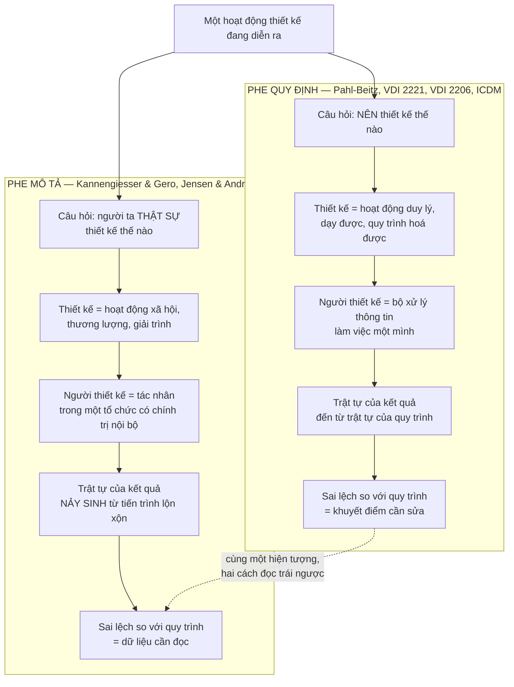
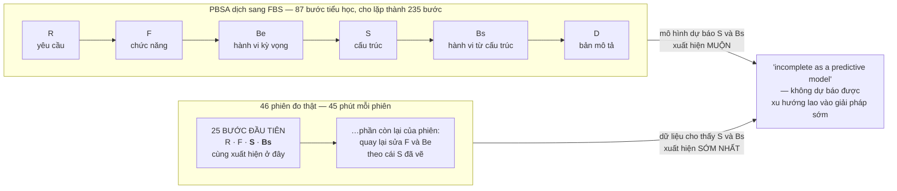

# Chương 12 — Quy định hay mô tả: người ta có thật sự thiết kế như thế không?

Mười một chương vừa rồi mô tả các phương pháp bằng chính lời của chúng: bốn pha, bảy bước, chữ V hai
nhánh, mười nhóm nhân tố ngữ cảnh, bảy công cụ. Không chương nào hỏi câu hiển nhiên nhất — có ai làm
đúng như thế không. Thiếu câu hỏi đó, cuốn sách chỉ còn là một danh mục lời khuyên xếp theo niên đại,
và người đọc đã tự nhận ra đội mình không làm theo trình tự ấy sẽ chỉ có hai cách giải thích, cả hai
đều sai: *đội mình vô kỷ luật*, hoặc *phương pháp này là chuyện hàn lâm*. Chương này đưa cách giải
thích thứ ba, có bằng chứng đo được.

Chương 11 — *Nổ tổ hợp: bài toán mà cả bốn thế hệ đều phải né* — kết ở chỗ bốn thế hệ phương pháp cùng
va vào một bài toán tổ hợp và mỗi thế hệ né theo một kiểu, mỗi kiểu hy sinh một thứ. Nhưng đó vẫn là
phê bình từ bên trong: đo phương pháp bằng chính thước của phương pháp — nó có giải nổi bài toán nó tự
đặt ra không. Từ chương này thước đo đổi. Ta không hỏi phương pháp có nhất quán với chính nó không, mà
hỏi nó có khớp với con người thật đang làm việc trong tổ chức thật không. Đây là chỗ **mặt tiếp giáp**
lộ ra lần đầu bằng dữ liệu chứ không bằng lập luận: khoảng cách giữa văn bản phương pháp và hành vi
thực tế đã có người đem ra đo, và số đo đó nằm trong corpus.

Hết chương, ba thứ nằm trong tay. Một: phát biểu chính xác được bằng chứng thực nghiệm chứng minh cái
gì và **không** chứng minh cái gì, kèm nguyên văn từng câu — vì chỗ này bị trích sai nhiều hơn bất kỳ
chỗ nào khác trong ngành. Hai: một phân biệt sắc giữa *"không mô tả đúng thực tế"* và *"vô dụng"*, kèm
lý do vì sao toàn bộ Phần V và Chương 18 sụp nếu người đọc trộn hai thứ đó làm một. Ba: một bộ câu hỏi
lâm sàng chạy được ngay trên bất kỳ phương pháp nào xưởng mình đang áp.

---

## Hai câu hỏi bị nhập làm một

*Quy định* (prescriptive) và *mô tả* (descriptive) trả lời hai câu khác nhau. Quy định: **nên** thiết
kế thế nào. Mô tả: người ta **thật sự** thiết kế thế nào. Một mô hình quy định tốt có thể mô tả sai
hoàn toàn hành vi thực tế mà vẫn là mô hình quy định tốt — cũng như một quy tắc giao thông không hỏng
đi vì có người vượt đèn đỏ.

Vấn đề bắt đầu khi hai câu bị nhập làm một. Pahl-Beitz được xây từ kinh nghiệm thực hành của chuyên
gia, đóng gói thành sách, rồi được dạy như một chuỗi bắt buộc. Đến lượt người học ra xưởng, họ mang
theo một niềm tin không ai viết ra: rằng cuốn sách vừa nói *nên làm thế nào* vừa nói *người giỏi làm
thế nào*. Từ đó, mọi sai lệch so với sách đều bị đọc thành khuyết điểm của người, không phải giới hạn
của mô hình.

Bản thân tuyến phê bình không phủ nhận vị thế của mô hình. Kannengiesser & Gero mô tả PBSA bằng đúng
những chữ này:

> `"One of the most detailed and widely referenced prescriptive models of designing is the 'Systematic
> Approach' developed by Pahl & Beitz (Reference Pahl and Beitz 2007), which was first published in
> German in 1977."`
> — `[31]`

*Chi tiết nhất* và *được viện dẫn rộng rãi nhất*. Người sắp bác bỏ khả năng tiên đoán của một mô hình
mở đầu bằng cách xác nhận nó là mô hình quy định mạnh nhất trong ngành. Đó không phải phép lịch sự học
thuật — đó là điều kiện của phép thử. Đem mô hình yếu ra đo thì kết quả không nói lên gì; đem mô hình
mạnh nhất ra đo, kết quả mới có nghĩa cho cả họ mô hình.

Hai cột này không bác nhau ở dữ kiện. Chúng bác nhau ở chỗ **đọc sai lệch thành cái gì**. Cột trái đọc
sai lệch là lỗi phải sửa. Cột phải đọc sai lệch là thông tin về tổ chức. Toàn bộ chương này nằm ở chỗ
chọn cách đọc — và chỗ đó không phải chuyện triết học, nó quyết định anh làm gì vào sáng thứ Hai khi
thấy đội mình bỏ qua bước ba.

---

## Phép thử: đem mô hình quy định ra đo như một mô hình tiên đoán

Điều đáng học ở Kannengiesser & Gero không phải kết luận. Là cách họ biến một cuộc cãi vã triết học
thành một phép đo. Bài công bố trên *Design Science*:

> `"Published online by Cambridge University Press: 04 December 2017"` — `[31]`

**Bước một — dịch mô hình quy định sang ngôn ngữ đo được.** Họ dùng lược đồ FBS (Function–Behaviour–
Structure), một hệ phân loại nhận thức:

> `"It consists of six design issues: requirements, function, expected behaviour, behaviour derived from
> structure (or, shorthand, structure behaviour), structure, and description."` — `[31]`

Sáu loại đó — yêu cầu (R), chức năng (F), hành vi kỳ vọng (Be), hành vi suy từ cấu trúc (Bs), cấu trúc
(S), bản mô tả (D) — là bảng mã. Mỗi phát ngôn, mỗi nét vẽ của người thiết kế được gán vào đúng một
loại. Cùng bảng mã đó gán được cho cả **văn bản phương pháp** lẫn **băng ghi hình người thật**. Đó là
mấu chốt: một khi hai thứ nói cùng một ngôn ngữ thì chúng so được với nhau.

**Bước hai — trải PBSA ra thành chuỗi.**

> `"Mapping all activities defined in PBSA onto the sFBS framework results in 87 elementary steps coded
> in terms of FBS design issues (Kannengiesser & Gero [Reference Kannengiesser and Gero 2015])."` — `[31]`

> `"This results in a total of 235 steps, as some of the 87 elementary steps are repeated (once or
> twice, depending on the phase they belong to)."` — `[31]`

Tám mươi bảy bước tiểu học; cho lặp theo kịch bản thông thường thì thành 235 bước. Đây là **PBSA dưới
dạng một dự báo**: nếu người ta làm đúng sách, chuỗi hành vi của họ sẽ có hình dạng này.

**Bước ba — đo người thật.**

> `"The behavioural observations used in this study are based on protocols of 15 design sessions
> involving mechanical engineering students after their first year of design education and 31 design
> sessions of the students using various concept generation methods."` — `[31]`

> `"All 46 design sessions covered an entire design process from requirements specification to solution
> description."` — `[31]`

> `"Each team used the same room and were given the same instructions that included a specified
> available time of 45 minutes."` — `[31]`

**Đọc kỹ cỡ mẫu trước khi đọc kết luận.** Bốn mươi sáu phiên. Người tham gia là **sinh viên kỹ thuật cơ
khí sau năm đầu học thiết kế** — nguyên văn ghi vậy, không ghi kỹ sư đang hành nghề. Mỗi phiên **45
phút**. Nhiệm vụ là các bài thiết kế thiết bị hỗ trợ người khuyết tật và người bệnh: dụng cụ mở cửa sổ
kẹt, dụng cụ mở cửa cho bệnh nhân đột quỵ, bộ trợ lực vượt vỉa hè cho xe lăn, hệ bồn tắm hỗ trợ điều
dưỡng. Một dự án cơ điện tử mười tám tháng với sáu phòng ban không nằm trong tập dữ liệu này, và không
câu nào trong nguồn tuyên bố nó nằm trong đó.

**Bước bốn — thước đo.** Với mỗi loại vấn đề thiết kế, dựng đồ thị xuất hiện tích luỹ theo bước:

$$c=\sum_{i=1}^{n}x_{i}$$

trong đó `x_i` bằng 1 nếu bước thứ *i* được gán mã là loại đang xét, bằng 0 nếu không. Bốn tiêu chí đọc
đồ thị: **xuất hiện sớm** (loại đó có ló ra ngay đoạn đầu không), **tính liên tục** (hệ số góc cuối
tiến trình còn dương không), **tính tuyến tính** (nỗ lực nhận thức có rải đều không), và **hệ số góc**
(tốc độ sinh ra vấn đề loại đó). Ngưỡng của tiêu chí đầu tiên được ghi bằng nguyên văn:

> `"'Yes' if the first occurrence of the design issue is within the first 25 design steps..."` — `[31]`

**Kết quả.** Đồ thị của người thật không trùng đồ thị của mô hình, và chỗ lệch nằm đúng một nơi: cấu
trúc vật lý (S) và hành vi suy từ cấu trúc (Bs) xuất hiện **trong 25 bước đầu tiên** ở người thật,
trong khi chuỗi 235 bước dựng từ PBSA đẩy chúng về sau. Nghĩa là: người thiết kế vẽ ra một cái máy cụ
thể gần như ngay lập tức, trước khi cấu trúc chức năng kịp hình thành đầy đủ. Kết luận của bài, nguyên
văn:

> `"Therefore, it can be concluded that the differences between the model and the empirical data rather
> indicate that PBSA seems to be incomplete as a predictive model of designing since it does not predict
> designers' early focus on generating solutions."` — `[31]`

Và chẩn đoán về mặt kiến trúc quy trình:

> `"On the other hand, the 'phase-based' character of PBSA clearly favours a 'waterfall' view where
> iterations are to occur only within a phase..."` — `[31]`

Chỗ này đáng dừng lại một nhịp, vì nó là một trong hai lần cuốn sách này có **số đo** thay vì lập luận.
Bốn mươi sáu phiên sinh viên trong phòng lab 45 phút không phải là bằng chứng về ngành công nghiệp.
Nhưng nó là bằng chứng đủ mạnh cho một mệnh đề hẹp và cụ thể: **chuỗi trừu-tượng-xuống-cụ-thể không
phải là mô tả đúng trình tự nhận thức, ít nhất ở nhóm người và loại bài toán đã đo.** Ai muốn nới mệnh
đề đó rộng hơn phải mang dữ liệu khác đến.

> **Đào sâu: bốn thước đo, và vì sao chúng quan trọng hơn kết luận**
>
> Trước bài này, tranh luận quy định–mô tả chạy bằng giai thoại. Ai cũng có một câu chuyện về đội thiết
> kế nhảy thẳng vào giải pháp, và ai cũng có một câu chuyện ngược lại. Giai thoại không cộng dồn được.
>
> Bốn thước đo phá thế bế tắc đó bằng cách hỏi những câu **trả lời được bằng có/không trên một đồ thị**:
> loại vấn đề này có ló ra trong ngưỡng bước đầu không; đến cuối phiên nó còn sinh thêm không; nỗ lực
> rải đều hay dồn cục; sinh nhanh hay chậm. Bốn câu đó không phụ thuộc vào việc người quan sát tin phe
> nào. Hai nhóm nghiên cứu bất đồng về diễn giải vẫn đo ra cùng một con số.
>
> Đây là bài học chuyển giao được, và nó không dính gì đến FBS: **muốn cãi nhau có ích về quy trình,
> phải quy tranh luận về một đại lượng đếm được trên bản ghi.** Một xưởng làm được điều tương đương mà
> không cần thiết bị gì — mở nhật ký thiết kế của một dự án đã xong, đánh dấu ngày đầu tiên xuất hiện
> một bản phác hình học cụ thể, so với ngày chốt danh sách yêu cầu. Nếu bản phác đến trước, hình dạng
> quy trình thật của xưởng đã hiện ra, và nó không phải hình dạng trong sổ tay.
>
> Một chi tiết phải nói rõ: tiêu chí *tính tuyến tính* trong bài được chấm bằng hệ số xác định của hồi
> quy trên đồ thị tích luỹ. Vật liệu khai thác có ghi ngưỡng cụ thể, nhưng **không kèm câu nguyên văn**
> cho ngưỡng đó — nên con số ấy không xuất hiện trong chương này. Luật của cuốn sách: không có nguyên
> văn thì bỏ, không ước lượng.

---

## Đo bằng một cái thước hoàn toàn khác: phương pháp trong đời sống doanh nghiệp

Kannengiesser & Gero đo cái đầu người thiết kế. Jensen & Andreasen đo cái khác hẳn: **số phận của một
phương pháp sau khi nó bước vào một doanh nghiệp thật.** Bài của họ mang đúng cái tên nói lên tham
vọng — *Design Methods in Practice — Beyond the Systematic Approach of Pahl & Beitz*.

Trường phái họ dùng là **ethnomethodology**, xuất phát từ Harold Garfinkel:

> `"Garfinkel, H. 'Studies in Ethnomethodology', Englewood Cliffs, NJ, Prentice-Hall, 1967."` — `[43]`

Trường phái này không nghiên cứu trật tự xã hội bằng cách hỏi người ta về quy tắc. Nó phá quy tắc rồi
xem cái gì lộ ra. Thí nghiệm gốc của Garfinkel:

> `"In one case, he asked 49 students to visit their parents, and to act like strangers from 15 minutes
> to an hour."` — `[43]`

> `"The students were instructed to be very polite, to avoid being personal, and to speak only when
> spoken to."` — `[43]`

Bốn mươi chín sinh viên về nhà đóng vai người lạ với chính bố mẹ mình, từ mười lăm phút đến một tiếng.
Phản ứng bối rối và giận dữ của bố mẹ chính là dữ liệu: nó làm hiện ra tập giả định ngầm mà không ai
phát biểu bao giờ vì không ai thấy cần phát biểu. Chuyển sang thiết kế, phép loại suy chạy thẳng: quy
trình mà một xưởng **nói** rằng mình theo là quy tắc được phát biểu; quy trình thật lộ ra ở chỗ quy
tắc bị phá mà không ai thấy có vấn đề gì.

Dữ liệu thực địa của họ:

> `"The students, 50 per year, all take a course in 'Design Methods' taught by the authors of this
> article."` — `[43]`

> `"We dedicate this paper to the students who followed our course in Design Methods at the Technical
> University of Denmark in the the years 2007-2009."` — `[43]`

Năm mươi sinh viên mỗi năm, trong ba năm 2007–2009, đi vào doanh nghiệp Đan Mạch và phỏng vấn xem một
phương pháp thiết kế cụ thể **thật sự** được dùng thế nào. **Cần nói rõ đây là loại bằng chứng gì:** báo
cáo thực địa do sinh viên thu thập trong khuôn khổ một môn học, tổng hợp bởi chính hai người dạy môn
đó. Không phải nghiên cứu đối chứng, không có nhóm so sánh. Nó mạnh ở bề rộng và ở chỗ nó chạm được
thứ mà thí nghiệm phòng lab không chạm tới — chính trị nội bộ, áp lực ngân sách, khách hàng cũ. Nó yếu
ở chỗ mọi nghiên cứu định tính đều yếu: người quan sát chọn cái gì đáng ghi.

Bộ khung phỏng vấn họ giao cho sinh viên đáng chép lại nguyên vẹn, vì nó dùng được ngay. Nguồn liệt kê
ra các câu hỏi nhưng **không tự đếm tổng số** — nên chương này chép từng câu chứ không nêu con số:

| Câu hỏi lâm sàng (nguyên văn) | Cái nó bóc ra |
|---|---|
| `"What – exactly – is the method?"` | Khoảng cách giữa tên gọi và nội dung thật |
| `"What is the method supposed 'to do'? Where? To what? For whom?"` | Ai là người hưởng lợi thật — thường không phải người thực hiện |
| `"How is the method used?"` | Trình tự thật, kể cả bước bị đảo và bước bị bỏ |
| `"What context or agenda is the method a part of?"` | Chương trình nghị sự mà phương pháp đang phục vụ |
| `"How is the method interpreted – and by whom?"` | Ai có quyền diễn giải khi có tranh cãi |
| `"What are the expected and the surprising results and consequences of the method?"` | Hệ quả ngoài ý muốn — chỗ giàu thông tin nhất |

Câu hỏi thứ tư và thứ năm là hai câu không sổ tay quy trình nào đặt ra. Chúng giả định rằng một phương
pháp **nằm trong một chương trình nghị sự** và **cần người diễn giải** — hai giả định mà phe quy định
không có chỗ chứa.

### Ba biến dạng đo được trong doanh nghiệp

**Bước bị đổi, bị bỏ, bị bóp.**

> `"Many other cases from our students indicate that the steps of methods are routinely changed, skipped,
> or squeezed as a result of various pressures such as lack of time and money."` — `[43]`

Chữ đáng chú ý là *routinely* — thường lệ, không phải ngoại lệ. Một công ty thiết kế quảng cáo tuyên bố
áp dụng quy trình tuần tự:

> `"One group of students studied a 12-step sequential method used by a design firm to develop a complete
> branding package..."` — `[43]`

Thực tế: phần lớn các bước bị bỏ dưới áp lực thời gian, khách hàng chỉ trả tiền cho vài bước, và với
khách cũ thì các bước đầu bị cắt sạch. Quy trình mười hai bước vẫn tồn tại — trên hồ sơ chào hàng.

**Mục tiêu trôi.**

> `"In sum, our students have found that the goals of methods are neither given, singular, nor timeless."`
> — `[43]`

Không cho sẵn, không đơn nhất, không bất biến. Một phương pháp bắt đầu đời mình để lấy phản hồi kỹ
thuật trên mẫu thử, kết thúc đời mình như công cụ marketing hoặc như đòn bẩy giành ngân sách. Không ai
ra quyết định đổi mục tiêu; nó trôi.

**Việc thật sinh ra ngoài quy trình.**

> `"...revealed that a large number of the company's projects (roughly 30%) were results of other
> initiatives than the formal technology planning."` — `[43]`

Trong một công ty kỹ thuật lớn, khoảng ba mươi phần trăm số dự án ra đời **ngoài** hệ thống quy hoạch
công nghệ chính thức — các kỹ sư tự dàn xếp với nhau chỗ gặp nhau giữa lực kéo thị trường và lực đẩy
công nghệ. Cần đọc kèm ngữ cảnh: đây là một công ty, trong một nghiên cứu tình huống, không phải tỷ lệ
của ngành. Nhưng nó chỉ ra một khả năng mà mọi sơ đồ quy trình đều không có ô để vẽ: **một phần đáng kể
công việc thật đi vào tổ chức qua cửa không nằm trên sơ đồ.**

### Và biến dạng thứ tư, biến dạng đắt nhất

> `"These methods-users would often attempt to live up to the maximum requirements despite the nature of
> the specific project. Only seasoned project managers seemed to 'dare' to use the flexibility of the
> method."` — `[43]`

Kỹ sư trẻ và người kiểm soát tài chính bám lấy mức yêu cầu **tối đa** của phương pháp, bất kể dự án lớn
nhỏ. Chỉ quản lý dự án dày dạn mới *dám* dùng tính linh hoạt vốn có sẵn trong chính phương pháp. Chữ
`'dare'` được tác giả đặt trong ngoặc kép — họ biết họ đang mô tả một hành vi né trách nhiệm chứ không
phải một lựa chọn kỹ thuật.

Đây là **mặt tiếp giáp ở dạng thuần khiết nhất**. Phương pháp không hỏng. Nó cho phép cắt may, văn bản
nói rõ là cho phép. Cái hỏng là chỗ nó chạm tổ chức: trong một tổ chức mà thất bại bị truy trách nhiệm
cá nhân, quyền cắt may là một quyền không ai dám dùng, vì dùng nó nghĩa là ký tên vào chỗ có thể bị
quy lỗi. Tính linh hoạt viết trong sách và tính linh hoạt dùng được trong đời là hai thứ khác nhau, và
cái phân cách chúng không phải kỹ thuật — là cách tổ chức xử lý người mắc lỗi.

### Lỗi gốc, theo cách phe phê bình phát biểu

> `"It appears to us that Pahl & Beitz have confused the result of design method and the process of using
> a design methods."` — `[43]`

> `"Pahl & Beitz's error, we suggest, is their implicit assumption that neat processes must logically
> precede neat results."` — `[43]`

Nhầm **kết quả** với **quy trình**. Bản vẽ chế tạo cuối cùng gọn gàng, logic, đánh số mạch lạc — điều
đó đúng. Từ đó suy ra rằng tiến trình tư duy sinh ra nó cũng phải gọn gàng và tuyến tính — điều đó
không theo sau. Sự ngăn nắp của kết quả là thứ **nảy sinh** từ một tiến trình lộn xộn, chứ không phải
bằng chứng rằng tiến trình đã ngăn nắp. Ai từng viết một tài liệu kỹ thuật đều biết cảm giác này: bản
cuối đọc như thể tác giả biết trước mình sẽ đi đâu.

Và hệ quả kiến trúc của lỗi gốc đó:

> `"This starting point, we suggest, makes it exceedingly hard for Pahl & Beitz to see method use as a
> social, political or organizational process and it makes it almost impossible to imagine that the goals
> of methods-related activities can be any other than getting the information right."` — `[43]`

Vì PBSA khởi hành từ hình ảnh người thiết kế như một bộ xử lý thông tin đơn lẻ, nó **gần như không thể
hình dung** rằng mục tiêu của một hoạt động phương pháp có thể là cái gì khác ngoài *lấy đúng thông
tin*. Trong khi trong đời thật, mục tiêu thường là: cân bằng quyền lực giữa hai phòng, tạo hồ sơ giải
trình cho lần soát xét sau, hoặc chứng minh với cấp trên rằng công việc đã được làm một cách đàng
hoàng. Từ đó ra phát hiện phản trực giác nhất của tuyến này: kỹ sư nhiều khi dùng phương pháp như một
**nghi lễ** — dấu hiệu công khai rằng công việc đã được làm nghiêm túc — ngay cả khi họ liên tục đi
chệch, làm ngược bước, bỏ hẳn giai đoạn.

Đọc câu đó thành lời chê là đọc hỏng. Một nghi lễ giải trình không phải là thứ vô ích. Nó là **cơ chế
tạo lòng tin giữa các bên không kiểm chứng được công việc của nhau** — và mọi tổ chức đều cần cơ chế
đó. Vấn đề duy nhất là khi ta tưởng mình đang trả tiền cho chất lượng kỹ thuật trong khi thứ mình mua
là lòng tin. Cả hai đều đáng mua. Trộn hai thứ thì không định giá được thứ nào.

---

## Motte, và một chỗ mỏng phải khai

Tuyến phê bình trong tài liệu tổng hợp của dự án được kể tên là Kannengiesser & Gero, **Motte**, Jensen
& Andreasen. Hai cái tên đầu và cuối có tài liệu gốc trong danh mục 66 nguồn, và mọi câu trích trong
chương này truy được về đúng tệp. **Motte thì không.** Danh mục không có tài liệu nào của tác giả này;
tên ông chỉ xuất hiện trong lớp tổng hợp, tức là trong câu văn do mô hình sinh ra khi mô tả bối cảnh
học thuật, không phải trong một tài liệu đọc được.

Cho nên chương này nêu tên Motte như một thành viên của tuyến phê bình và **dừng ở đó** — không gán cho
ông một luận điểm nào, không trích một câu nào. Ai cần lập luận của Motte phải đi tìm bản gốc ở ngoài
cuốn sách này.

Đây là loại khoảng trống phải nói ra chứ không lấp bằng văn hay. Một cuốn sách buộc tội các phương pháp
khác là mang giả định không khai báo thì không được phép có chỗ nào tự mình làm đúng điều đó.

Chỗ mỏng ấy được bù một phần bởi hai nguồn khác trong corpus, thuộc nhánh tiêu chuẩn chứ không thuộc
nhánh phê bình — và chính vì thế chúng có giá trị đối chứng. Nguồn thứ nhất, bài đối chiếu quan điểm
giảng dạy giữa VDI 2221 và Axiomatic Design:

> `"A key criticism revolves around the limited acceptance and applicability of prescriptive design
> methods in industrial settings. Criticisms include the high time investment, abstraction constraints,
> creativity limitations, inflexibility, overly rigid regulations, overemphasis on logical sequences and
> complex processes, and the focus on new designs rather than variant or adaptation designs."` — `[2]`

Đây là danh sách phê bình do chính phía tiêu chuẩn ghi lại: tốn thời gian, ràng buộc trừu tượng hoá,
hạn chế sáng tạo, thiếu linh hoạt, quy định quá cứng, nhấn quá mạnh vào trình tự logic, và — điểm hay bị
bỏ qua — **tập trung vào thiết kế mới trong khi phần lớn công việc thật là thiết kế biến thể và thiết kế
thích ứng**. Nguồn thứ hai, bài của Sauer và cộng sự trình bày tại hội nghị ICED 2003:

> `"In practice, often a mix of intuitive and experience-based behaviour can be found. To understand why
> designers in industry do not often use methods, a more detailed look at their situation is necessary.
> Design work in industry is marked by a lot of restrictions, e.g. lack of resources and high time
> pressure."` — `[14]`

Câu thứ hai đáng chú ý ở cấu trúc của nó. Nó không hỏi *làm sao bắt kỹ sư dùng phương pháp*. Nó hỏi
*vì sao kỹ sư trong công nghiệp không hay dùng phương pháp*, rồi trả lời bằng hoàn cảnh làm việc chứ
không bằng phẩm chất con người. Bài này đăng năm 2003 — trước bài Kannengiesser & Gero mười bốn năm và
trước bài Jensen & Andreasen. Nhận thức về mặt tiếp giáp không phải phát hiện mới của phe phê bình; nó
đã nằm sẵn trong tài liệu của chính phe làm tiêu chuẩn, chỉ chưa ai gom lại.

> **Đào sâu: cùng một corpus, hai câu trả lời trái nhau — và vì sao đó là chuyện của người đọc, không
> phải chuyện của nguồn**
>
> Vật liệu của chương này đến từ hai cụm truy vấn chạy trên hai notebook khác nhau. Cụm thứ nhất, với
> bốn tài liệu thuộc nhánh Pahl-Beitz đang hoạt động, trả về toàn bộ phép thử tiên đoán: 87 bước, 46
> phiên, kết luận *incomplete*.
>
> Cụm thứ hai, chạy trên notebook tiêu chuẩn với hai tài liệu đang hoạt động, được hỏi đúng câu ấy và
> trả lời rằng **không có bất kỳ dữ liệu hay nghiên cứu thực nghiệm nào** về khả năng tiên đoán trong
> phạm vi nguồn của nó. Câu trả lời đó đúng — bài Kannengiesser & Gero không nằm trong hai tài liệu ấy.
>
> Hai câu trả lời trái ngược, cùng một hệ thống, cùng một câu hỏi, cách nhau vài phút. Khác biệt duy
> nhất là **tài liệu nào đang được bật**. Bài học không phải là hệ thống không đáng tin — mà là *phạm
> vi tài liệu đang hoạt động là một tham số của kết luận*, và tham số ấy hầu như không bao giờ được ghi
> lại cùng kết luận.
>
> Điều tương tự xảy ra trong mọi cuộc soát xét thiết kế. Câu *"không có bằng chứng nào cho thấy phương
> án này rung"* có nghĩa hoàn toàn khác nhau tuỳ vào việc hồ sơ trên bàn gồm những gì. Ai chủ trì soát
> xét mà không ghi lại **danh mục tài liệu đã mở** thì không thể phân biệt *chưa ai đo* với *đo rồi
> nhưng hồ sơ không có mặt ở đây*. Đó là hai kết luận đắt khác nhau rất xa.

---

## Nhắc lại phát hiện Q1: nguồn quy định nhất đã tự thừa nhận điều này

Chương 3 dừng lại ở một chi tiết dễ lướt qua. Nhắc lại vắn tắt, vì nó là chỗ nối mạnh nhất trong toàn
cuốn sách.

Danh sách các bước công tác của pha *embodiment design* trong Pahl-Beitz — chỗ hay được trích nhất, và
hay được trình bày như một quy trình bắt buộc nhất — có câu đứng ngay **trước** nó:

> `"Because of this, it is not always possible to draw up a strict plan for the embodiment design phase.
> However, it is possible to suggest a general approach with main working steps, see Figure 7.1."` — `[1]`

Và hai câu bổ trợ, một trước một sau danh sách:

> `"Unlike conceptual design, embodiment design involves a large number of corrective steps in which
> analysis and synthesis constantly alternate and complement each other."` — `[1]`

> `"In the embodiment phase, unlike the conceptual phase, it is not necessary to lay down special methods
> for every individual step, however the following recommendations might prove useful."` — `[1]`

*Không phải lúc nào cũng lập được kế hoạch chặt.* *Rất nhiều bước hiệu chỉnh trong đó phân tích và tổng
hợp liên tục xen kẽ.* *Không cần định ra phương pháp riêng cho từng bước.* Ba câu, cùng một tác giả,
cùng một trang, ngay cạnh cái danh sách mà người đời đọc thành quy trình.

Thêm một chỗ nữa cùng loại, lần này về công cụ đánh giá:

> `"They believe that during the conceptual phase, in which the level of information is fairly low because
> of the relative lack of embodiment, weighting is not generally advisable and they suggest ignoring
> low-weighted characteristics for the time being..."` — `[33]`

Chính Pahl và Beitz **khuyên không nên** gán trọng số ở pha ý tưởng, vì lượng thông tin lúc đó quá thấp
để chấm cho chính xác. Một tác giả cẩn thận đến mức đó không phải người tin rằng mọi thứ đều quy trình
hoá được.

Còn một tầng nữa, và tầng này là kết quả đo của chính dự án làm ra cuốn sách. Toàn văn bản in tiếng
Anh thứ ba của Pahl-Beitz được trích ra hơn 1,18 triệu ký tự và đếm cơ học: chuỗi `fifteen` xuất hiện
**0 lần**; `fifteen steps` **0 lần**; `15 steps` **0 lần**. Danh sách đúng là mười lăm mục, đánh số từ
`1.` đến `15.` — nhưng **cuốn sách chưa một lần tự gọi nó là mười lăm bước.** Con số ấy do người đọc
điền vào, rồi lưu truyền như thể tác giả đã viết ra.

Đó là điều đáng để lâu trong đầu. Phe phê bình bỏ ba năm thực địa và 46 phiên ghi hình để chứng minh
rằng chuỗi tuyến tính không mô tả đúng thực tế — trong khi **nguồn quy định nhất của cả ngành đã tự
viết ra điều gần như y hệt, ở đúng chỗ dễ tra nhất.** Chỗ hỏng không nằm trong văn bản. Nó nằm ở đoạn
đường từ văn bản đến tổ chức: một xưởng cần thứ kiểm toán được, một chương trình đào tạo cần thứ chấm
điểm được, một hợp đồng cần thứ nghiệm thu được — và cả ba đều biến một **gợi ý** thành một **đường
ray**, không ai phải quyết định gì cả. Đây chính là mặt tiếp giáp: phương pháp không vỡ vì nội dung
của nó, nó vỡ vì cái mà tổ chức cần nó trở thành.

*(Vật liệu đoạn này đến từ nguồn `[1]` — tài liệu một mình chiếm 32% corpus. Ở đây nó được dùng để đối
chứng với chính cách nó thường bị viện dẫn, nên trọng lượng lệch của nó không làm hỏng lập luận: câu
trích càng đến từ nguồn quy định nhất thì càng chặt.)*

---

## Phân biệt quyết định toàn bộ phần còn lại của sách

Đây là mục quan trọng nhất của chương, và có thể là của cả Phần IV. Nếu người đọc rời chương này với
kết luận *"vậy phương pháp có hệ thống là vô ích"*, thì cả Phần V lẫn Chương 18 mất nghĩa, và cuốn sách
tự phá chính nó.

**Mệnh đề mà bằng chứng ở trên chứng minh là mệnh đề hẹp:** các mô hình quy định không mô tả đúng trình
tự nhận thức và không sống sót nguyên vẹn khi đi vào tổ chức. **Mệnh đề mà nó không chứng minh, và
không nhắm tới:** rằng dùng chúng không đem lại lợi ích gì.

Trộn hai mệnh đề là một lỗi loại — cùng loại với việc bác một bản đồ vì không ai đi đúng lộ trình vẽ
trên đó.

### Bốn lý do lấy thẳng từ nguồn

**Một — chữ mà tác giả chọn là *incomplete*, không phải *wrong*.** Kannengiesser & Gero viết `"seems to
be incomplete as a predictive model of designing"`, và nêu ngay phạm vi của chỗ thiếu: `"since it does
not predict designers' early focus on generating solutions"`. *Chưa hoàn thiện ở một khía cạnh xác
định*. Họ không viết mô hình sai, không viết nên bỏ. Cắt chữ *incomplete* và cụm mệnh đề *since* để lấy
mỗi ý "thực nghiệm bác bỏ Pahl-Beitz" là xuyên tạc nguồn — dù mỗi chữ trích ra đều đúng nguyên văn.

**Hai — phe phê bình xã hội học không đề xuất bỏ phương pháp, họ đề xuất đổi cách hiểu nó.** Kết luận
của tuyến ethnomethodology là phương pháp không phải một **đường ray** mà là một **nguồn lực** được huy
động linh hoạt trong từng ngữ cảnh cục bộ, để ra quyết định và để giải trình quyết định. Nguồn lực thì
vẫn phải có. Không ai đề nghị bỏ nó đi — đề nghị là thôi giả vờ rằng nó là đường ray.

**Ba — chính các "biến dạng" là bằng chứng rằng phương pháp đang có tác dụng.** Công ty bỏ phần lớn
mười hai bước vẫn **giữ** bộ mười hai bước: nó là ngôn ngữ chung với khách hàng, là cấu trúc để tính
tiền, là bộ khung để nói cho nhau biết đang ở đâu. Một thứ vô dụng thì không ai viện dẫn. Việc bị viện
dẫn liên tục trong khi bị vi phạm liên tục là dấu hiệu của một thứ đang **làm việc khác** với việc nó
tự nhận — chứ không phải dấu hiệu của một thứ không làm gì.

**Bốn — cái được ghi nhận là hỏng, là sự cứng nhắc, không phải bản thân phương pháp.** Chế độ hỏng đắt
nhất mà nghiên cứu thực địa bắt được là *over-documentation*: người dùng cố đáp ứng mức yêu cầu tối đa
bất kể tính chất dự án, và chỉ quản lý dày dạn mới dám dùng tính linh hoạt. Nạn nhân ở đây là **tính
linh hoạt vốn có sẵn trong phương pháp**. Bỏ phương pháp không chữa được bệnh này; nó chỉ chuyển bệnh
sang chỗ khác, vì cái sinh ra bệnh là cơ chế truy trách nhiệm của tổ chức chứ không phải cuốn sổ tay.

### Bảng phân định

| Bằng chứng trong chương này chứng minh | Bằng chứng trong chương này KHÔNG chứng minh |
|---|---|
| Người thiết kế lao vào cấu trúc vật lý rất sớm — trong 25 bước đầu ở tập dữ liệu đã đo | Rằng lao vào giải pháp sớm cho ra kết quả tốt hơn hay tệ hơn. Không nguồn nào đo chất lượng đầu ra |
| PBSA *incomplete* với tư cách mô hình tiên đoán, ở đúng khía cạnh xu hướng sinh giải pháp sớm | Rằng PBSA hỏng với tư cách mô hình quy định. Đó là hai vai khác nhau |
| Các bước bị đổi, bỏ, bóp một cách thường lệ dưới áp lực thời gian và tiền | Rằng việc đổi/bỏ/bóp ấy làm sản phẩm xấu đi. Nghiên cứu ghi nhận hiện tượng, không chấm hậu quả |
| Mục tiêu của phương pháp trôi: không cho sẵn, không đơn nhất, không bất biến | Rằng mục tiêu trôi luôn là chuyện xấu. Nhiều lần trôi là thích nghi đúng |
| Trong một công ty được khảo sát, khoảng 30% dự án sinh ngoài quy hoạch chính thức | Rằng tỷ lệ đó đúng cho ngành, cho nước khác, hay cho xưởng của người đọc |
| Sự cứng nhắc trong thi hành gây lãng phí tài liệu hoá | Rằng bỏ hẳn quy trình sẽ đỡ lãng phí hơn. Không nguồn nào so hai chế độ đó |

Cột phải quan trọng hơn cột trái. Cột trái là thứ ai cũng trích. Cột phải là thứ giữ cho cột trái không
bị nống lên thành khẩu hiệu.

### Cần bằng chứng gì mới kết luận được "vô dụng"

Một khẳng định mà không dữ liệu nào bác được thì không phải khẳng định. Vậy phải thấy gì mới nói được
rằng một phương pháp có hệ thống là vô dụng?

Ít nhất ba thứ. **Một:** so sánh có đối chứng giữa đội áp phương pháp và đội không áp, trên cùng loại
bài toán, chấm bằng chất lượng sản phẩm giao được, không chấm bằng độ dày hồ sơ. **Hai:** cho thấy phần
việc mà phương pháp đang gánh — ngôn ngữ chung, cấu trúc giải trình, chỗ tạm dừng để soát xét — hoặc
không cần thiết, hoặc có thứ khác gánh rẻ hơn. **Ba:** cho thấy chi phí áp đặt lớn hơn giá trị điều
phối, đo trên nhiều dự án chứ không phải một.

**Không có thứ nào trong ba thứ đó nằm trong 66 tài liệu của cuốn sách này.** Không nguồn nào so sánh
kết quả giữa đội có phương pháp và đội không. Tuyến phê bình đo *khoảng cách giữa văn bản và hành vi*
— đó là một đại lượng hoàn toàn khác với *giá trị của việc có văn bản*. Ai muốn nói phương pháp vô dụng
thì đang nói vượt quá dữ liệu, y hệt như người nói nó là quy trình bắt buộc.

Hai cách đọc cùng một bằng chứng, và chỗ chúng dẫn tới:

| | **Đọc hư vô** — *"vậy thì bỏ phương pháp đi"* | **Đọc đúng phạm vi** — *"mô hình quy định không phải mô hình tiên đoán, chúng khác vai"* |
|---|---|---|
| Câu hỏi tiếp theo | Không còn câu nào. Đã có phán quyết | *Phương pháp này gánh việc gì thật, và tổ chức mình nuôi nổi việc đó không* |
| Cái mất ngay | Ngôn ngữ chung giữa các phòng; chỗ dừng để soát xét | Không mất gì — chỉ mất niềm tin rằng văn bản mô tả hành vi |
| Phần còn lại của sách | Chương 13, Phần V, Chương 18 hết nghĩa: không còn cái gì để chọn | Chương 13 gọi tên năm giả định tổ chức; Phần V xếp công cụ theo tầng đòn bẩy; Chương 18 chọn theo tổ chức mình đang có |

Cột trái là ngõ cụt mà chương này tồn tại để chặn.

### Phát biểu gọn để mang đi

Một phương pháp quy định được chấm bằng **cái nó tạo ra**, không bằng **độ khớp với hành vi tự nhiên**.
Chấm nó bằng độ khớp là chấm nhầm thước. Nhưng độ khớp vẫn là số đo có giá trị — nó cho biết **cái giá
phải trả để duy trì phương pháp**: lệch càng lớn thì càng tốn kỷ luật, tốn đào tạo, tốn cưỡng chế để
giữ cho người ta đi theo. Và tiền ấy trả bằng ngân sách tổ chức, không bằng lý lẽ kỹ thuật.

Đó là lý do vì sao chương này không kết thúc bằng một phán quyết mà bằng một câu hỏi mới: **tổ chức
nào nuôi nổi khoảng lệch đó, và tổ chức nào không.** Chương 13 trả lời bằng cách gọi tên năm giả định
mà cả bốn thế hệ phương pháp cùng đặt lên tổ chức áp dụng chúng — chuyển từ *"mô hình mô tả sai thực
tế"* sang *"mô hình giả định sai về tổ chức"*. Chỗ thứ hai mới là chỗ đắt tiền.

---

## Áp dụng ở Xưởng

Bối cảnh: một xưởng cơ khí — điện tử — phần mềm nhúng, vài chục người, làm nhiều dòng sản phẩm song
song ở các pha khác nhau.

### 1. Cho phép pha ý tưởng gối lên pha làm rõ nhiệm vụ — ở đúng một dự án, quyết trong tuần này

> `"...it does not predict designers' early focus on generating solutions."`

**Quyết định cụ thể.** Chọn **một** dự án đang ở đầu chu trình. Sửa đúng một dòng trong kế hoạch pha:
bỏ điều kiện *"chốt xong danh sách yêu cầu mới được vẽ phương án"*, thay bằng *"được vẽ phương án ngay
từ tuần đầu, với điều kiện mỗi phương án phải kèm câu trả lời cho câu hỏi nó đang giải chức năng nào"*.
Không đổi gì khác, không đổi ở các dự án còn lại. Ra quyết định này mất một cuộc họp mười lăm phút và
một dòng sửa trong kế hoạch.

**Vì sao đây là quyết định chứ không phải nới lỏng kỷ luật.** Đội vẫn đang vẽ phương án sớm — bằng
chứng thực nghiệm nói họ làm thế, và ai từng đứng cạnh bàn vẽ đều biết họ làm thế. Điều duy nhất mà
quy định cũ tạo ra là bản phác ấy không được ghi vào hồ sơ, nên nó không bị soát xét, không bị đối
chứng với chức năng, và không ai học được gì từ nó. Quyết định này không thêm hành vi mới; nó cho hành
vi vốn có một chỗ đứng hợp lệ để kiểm được.

**Cách biết mình đúng hay sai sau sáu tuần.** So hai thứ trên dự án đó với các dự án còn lại: số phương
án bị loại **có ghi lý do**, và số lần danh sách yêu cầu được sửa vì một phương án làm lộ ra yêu cầu
thiếu. Cả hai tăng là đúng hướng. Nếu số phương án tăng mà lý do loại thì trống, đây đã thành cái cớ để
bỏ qua bước làm rõ nhiệm vụ — quay lại quy định cũ, và ghi lại vì sao.

### 2. Chạy sáu câu hỏi lâm sàng lên một phương pháp xưởng đang áp

> `"What context or agenda is the method a part of?"` · `"How is the method interpreted – and by whom?"`

**Vấn đề nó giải.** Không ai trong xưởng biết chắc một quy trình đang được thi hành thế nào, vì người
viết quy trình và người thi hành nó không bao giờ ngồi cùng một buổi để đối chiếu từng bước.

**Cách áp.** Chọn một quy trình đang dùng — soát xét thiết kế, danh sách yêu cầu, biên bản thử nghiệm.
Phỏng vấn riêng ba người: người viết ra nó, người phải làm theo, và người nhận đầu ra. Sáu câu, đúng
thứ tự trong bảng ở trên. Ghi lại chỗ ba câu trả lời lệch nhau — đó là bản đồ quy trình thật.

**Bẫy.** Hỏi trong cuộc họp chung thì thu được quy trình trên giấy, vì không ai nói ra chỗ mình vẫn bỏ
bước khi có người phụ trách ngồi đó. Phải hỏi riêng, và phải nói trước rằng câu trả lời không dùng để
đánh giá cá nhân.

### 3. Đặt tên người đọc cho từng tài liệu bắt buộc

> `"These methods-users would often attempt to live up to the maximum requirements despite the nature of
> the specific project."`

**Vấn đề nó giải.** Tài liệu sinh ra để phòng thân chứ không để ai đọc — chế độ hỏng đắt nhất mà nghiên
cứu thực địa ghi nhận, và là chế độ hỏng khó thấy nhất vì mọi chỉ số đều xanh.

**Cách áp.** Lập bảng mọi tài liệu bắt buộc trong một chu trình dự án, mỗi dòng ba cột: tên tài liệu ·
**người đọc đích danh** · quyết định mà người đó ra sau khi đọc. Dòng nào để trống cột hai hoặc cột ba
thì chuyển sang trạng thái *làm khi được yêu cầu*, không mặc định bắt buộc.

**Bẫy.** Người quản lý ký duyệt không phải người đọc — ký là hành vi giải trình, không phải hành vi ra
quyết định. Nếu để tên người ký vào cột hai thì bảng này biến thành công cụ hợp thức hoá đúng thứ nó
định bắt.

### 4. Đếm tỷ lệ việc thật đi vào xưởng ngoài đường chính thức

> `"...a large number of the company's projects (roughly 30%) were results of other initiatives than the
> formal technology planning."`

**Vấn đề nó giải.** Sơ đồ quy trình chỉ vẽ đường vào chính thức, nên mọi cải tiến quy trình đều nhắm vào
phần công việc đi qua cửa đó — và bỏ trắng phần đi cửa khác, dù phần ấy có thể không nhỏ.

**Cách áp.** Lấy toàn bộ công việc khởi động trong bốn quý gần nhất. Chia hai cột: sinh từ kế hoạch
chính thức, và sinh từ nơi khác — kỹ sư tự đề xuất, khách hàng hỏi thẳng người kỹ thuật, một thử nghiệm
lẻ nở ra thành dự án. Con số **của xưởng mình**, không mượn con số của nghiên cứu nào. Nếu cột hai lớn,
đường vào không chính thức ấy cần một cửa hợp lệ, không cần bị dẹp.

**Bẫy.** Đếm xong rồi siết cho mọi việc phải đi cửa chính. Ba mươi phần trăm ấy tồn tại vì cửa chính
chậm hoặc hẹp; siết cửa phụ mà không sửa cửa chính thì việc không biến mất, nó chỉ chìm xuống chỗ không
ai nhìn thấy.

### 5. Ra luật cho chính việc bỏ bước

> `"In sum, our students have found that the goals of methods are neither given, singular, nor timeless."`

**Vấn đề nó giải.** Sau khi đọc chương này, người đọc dễ dùng nó làm giấy phép bỏ mọi bước thấy phiền —
đúng cái ngõ cụt mà mục phân biệt ở trên tồn tại để chặn.

**Cách áp.** Một luật, một dòng: mọi đề xuất bỏ hoặc gộp một bước quy trình phải trả lời hai câu bằng
văn bản — *bước này đang điều phối cái gì giữa ai với ai*, và *sau khi bỏ thì ai gánh việc điều phối
đó*. Không trả lời được câu hai thì chưa bỏ. Đây không phải thủ tục hành chính; nó là chỗ duy nhất buộc
người đề xuất phân biệt giữa *bước vô ích* và *bước phiền nhưng đang giữ hai phòng nói cùng ngôn ngữ*.

**Bẫy.** Áp luật này lên tài liệu ở mục 3 thì mâu thuẫn: mục 3 bỏ tài liệu không có người đọc, mục 5
đòi biện minh trước khi bỏ. Không mâu thuẫn nếu tách đúng: **tài liệu** không có người đọc thì bỏ ngay;
**bước điều phối** giữa hai bộ phận thì phải qua hai câu hỏi. Nhầm hai loại thì hoặc bỏ mất chỗ nối
giữa các phòng, hoặc giữ lại cả núi giấy chết.

---

## Sổ kiểm của chương

- **Neo luận đề:** *Mặt tiếp giáp*. Nối rõ ở ba chỗ trong văn bản: (a) mục *biến dạng thứ tư* — quyền
  cắt may có trong văn bản nhưng không dùng được trong tổ chức truy trách nhiệm cá nhân, phương pháp
  không hỏng ở nội dung mà hỏng ở chỗ chạm tổ chức; (b) cuối mục *Nhắc lại phát hiện Q1* — gợi ý biến
  thành đường ray vì xưởng cần thứ kiểm toán được, đào tạo cần thứ chấm điểm được, hợp đồng cần thứ
  nghiệm thu được; (c) đoạn kết mục phân biệt — độ lệch giữa mô hình và hành vi chính là **giá phải trả
  để duy trì phương pháp**, và giá đó trả bằng ngân sách tổ chức.
- **Nguồn đã dùng:** `[1]`, `[2]`, `[14]`, `[31]`, `[33]`, `[43]`.
- **Con số có nguyên văn** (con số — ba chữ đầu của câu trích — nguồn):
  1977 bản tiếng Đức đầu — `"One of the..."` `[31]` · 04/12/2017 ngày công bố — `"Published online by..."`
  `[31]` · sáu loại vấn đề FBS — `"It consists of..."` `[31]` · 87 bước tiểu học — `"Mapping all
  activities..."` `[31]` · 235 bước sau khi cho lặp — `"This results in..."` `[31]` · 15 phiên + 31
  phiên — `"The behavioural observations..."` `[31]` · 46 phiên tổng — `"All 46 design..."` `[31]` ·
  45 phút mỗi phiên — `"Each team used..."` `[31]` · ngưỡng 25 bước đầu — `"'Yes' if the..."` `[31]` ·
  1967 Garfinkel — `"Garfinkel, H. 'Studies..."` `[43]` · 49 sinh viên, 15 phút đến một giờ — `"In one
  case,..."` `[43]` · 50 sinh viên mỗi năm — `"The students, 50..."` `[43]` · 2007–2009 — `"We dedicate
  this..."` `[43]` · khoảng 30% dự án ngoài quy hoạch — `"...revealed that a..."` `[43]` · quy trình
  tuần tự 12 bước — `"One group of..."` `[43]` · 2003 hội nghị ICED — `"INTERNATIONAL CONFERENCE ON..."`
  `[14]` · danh sách embodiment kèm câu phủ nhận kế hoạch chặt — `"Because of this,..."` `[1]`.
  Hai con số **không** phải của nguồn mà là số đo của chính dự án, chương ghi rõ điều đó: `fifteen` /
  `fifteen steps` / `15 steps` = **0 lần** trên toàn văn 1,18 triệu ký tự của `[1]` (phép đếm cơ học,
  ghi ở `_cau_hoi_mo_DA_GIAI.md` mục Q1); và 32% tỷ trọng corpus của `[1]` (khai báo sẵn có, nhắc lại
  theo Luật 8).
- **Con số đã BỎ vì không có nguyên văn:** ngưỡng hệ số xác định cho tiêu chí *tính tuyến tính* — vật
  liệu ghi số nhưng không kèm câu tiếng Anh, đã bỏ và **nói ra việc bỏ** trong hộp *Đào sâu* thứ nhất ·
  số kịch bản thực nghiệm — chương chỉ kể tên bốn loại bài toán, không nêu số · số thế giới và số quy
  trình con của sFBS — vật liệu ghi rõ *không có trong nguồn*, đã bỏ hẳn · tổng số câu hỏi phỏng vấn
  lâm sàng — nguồn liệt kê nhưng không tự đếm, chương chép nguyên văn từng câu và nói rõ điều đó · ba
  đặc tính ethnomethodology (accountability / reflexivity / indexicality) — chỉ có ở lớp tổng hợp, đã
  bỏ · chi tiết "sinh viên năm 2–4" — nguyên văn chỉ ghi `"mechanical engineering students after their
  first year of design education"`, chương dùng đúng nguyên văn.
- **Chỗ là suy luận của tác giả, không phải của nguồn:** thuật ngữ **mặt tiếp giáp** (của cuốn sách,
  không nguồn nào dùng) · cơ chế *"gợi ý biến thành đường ray vì kiểm toán, đào tạo và hợp đồng đều cần
  thứ nghiệm thu được"* — `[1]` chỉ cho câu phủ nhận kế hoạch chặt, không nguồn nào giải thích cơ chế ·
  lập luận *nghi lễ giải trình là cơ chế tạo lòng tin và có giá trị riêng* — nguồn ghi nhận hành vi, không
  định giá nó · ba tiêu chí *"cần bằng chứng gì mới kết luận vô dụng"* — hoàn toàn do tác giả đặt, không
  nguồn nào nêu điều kiện bác bỏ · toàn bộ bảng *chứng minh / không chứng minh* — cột trái truy được về
  nguyên văn, cột phải là suy luận về giới hạn của bằng chứng · năm mục *Áp dụng ở Xưởng* · việc nêu tên
  **Motte** mà không trích câu nào — đã khai báo ngay trong thân bài.
- **Số dòng:** 697
