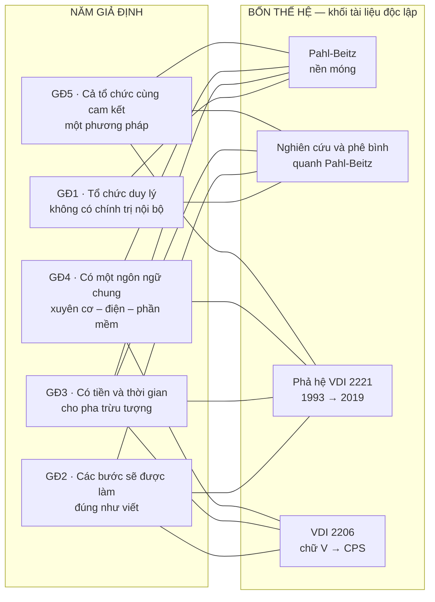
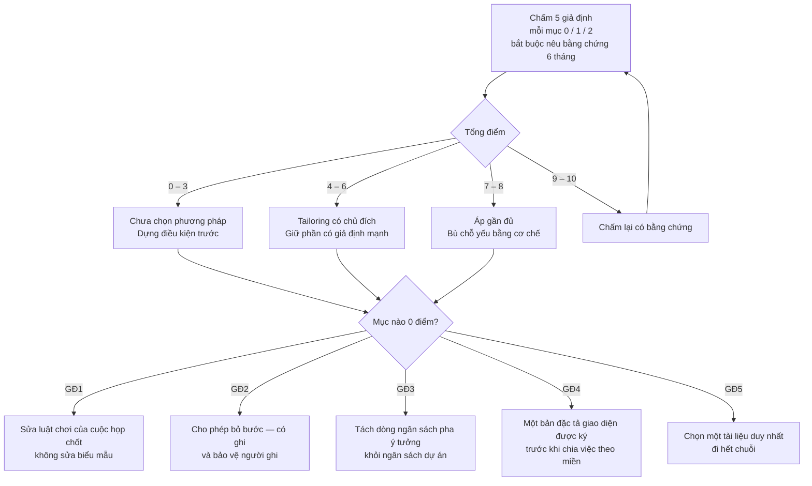

# Chương 13 — Năm giả định tổ chức, và chỗ chúng vỡ

Một phương pháp thiết kế không chỉ mô tả việc phải làm. Nó còn mô tả — im lặng, không bao giờ thành một
mục trong mục lục — cái tổ chức sẽ làm việc đó. Nó giả định ai ngồi cùng phòng, ai chịu nghe ai, ai có
quyền nói "chưa đủ thông tin để chốt", tiền và thời gian ở đâu ra cho một pha mà cuối pha vẫn chưa có
bản vẽ nào. Tập giả định ấy không nằm trong tiêu chuẩn, không nằm trong sách giáo khoa, không có ô nào
trong biểu mẫu để điền. Nó là **canh bạc tổ chức**: thứ mà phương pháp đặt cược mà không viết ra. Khi
canh bạc thua, cái đổ vỡ không phải là một công thức — mà là toàn bộ quy trình, và người ta sẽ đi tìm
nguyên nhân trong công thức.

Chương 12 đã đóng một cánh cửa và mở một cánh khác. Nó cho thấy các mô hình quy định **không mô tả đúng**
cách con người thật sự thiết kế: kỹ sư lão luyện nhảy thẳng vào giải pháp vật lý, bài toán và giải pháp
đồng tiến hoá, chuỗi tuyến tính từ trừu tượng xuống cụ thể là một thứ tự trên giấy chứ không phải thứ tự
trong đầu. Và Chương 12 kết bằng phân biệt quyết định toàn bộ phần còn lại của cuốn sách: *mô tả sai* không
đồng nghĩa với *vô dụng*. Một bản đồ không phải là con đường, nhưng vẫn dẫn được đường. Chương này bước
sang chỗ khác hẳn. Không hỏi phương pháp có mô tả đúng người thiết kế không, mà hỏi: **nó đòi hỏi một tổ
chức như thế nào, và cái tổ chức đó có tồn tại không.** Mô tả sai thì người ta vẫn dùng được. Giả định sai
thì không dùng được — và người ta thường không biết vì sao.

Chương này cho ba thứ. Một là **năm giả định tổ chức** mà cả bốn thế hệ phương pháp đều đặt, mỗi giả định
kèm điều kiện hỏng cụ thể và một câu trích nguyên văn từ tài liệu gốc — không có câu trích thì không vào
thân chương. Hai là một **tường trình về cách bằng chứng này được tạo ra**, kèm chỗ nó yếu: năm khối tài
liệu độc lập trả về danh sách gần trùng khớp, nhưng cả năm đều do cùng một mô hình ngôn ngữ đọc và diễn
đạt, và điều đó buộc phải kiểm chéo bằng nguyên văn chứ không được tin ở sự trùng khớp. Ba là một **bảng
tự chấm** để người đọc chấm chính tổ chức mình trên năm giả định, ra một điểm số, và đọc điểm số đó thành
một quyết định về việc nên áp phương pháp nào.

---

## Bằng chứng này được tạo ra thế nào, và nó yếu ở đâu

Phần lớn cuốn sách này đọc tài liệu theo chủ đề: bốn pha ở đây, bảy bước ở kia, ma trận hình thái ở chỗ
khác. Chương này đến từ một phép thử khác hẳn, và cách nó được tạo ra là một phần của bằng chứng — nên
phải nói ra trước khi nói kết quả.

Corpus của cuốn sách gồm **66 tài liệu duy nhất nằm trên bảy notebook**. Bảy khối đó khác nhau về niên đại
(từ sách nền móng thập niên 1970 đến bài báo tiêu chuẩn năm 2021), khác nhau về ngôn ngữ (Anh, Đức, Tây Ban
Nha), khác nhau về trường phái (phe quy định của tiêu chuẩn Đức, phe phê bình của nhóm nghiên cứu nhận thức
và nhóm dân tộc học kỹ thuật, phe công cụ định lượng của tuyến ICDM). Trên **năm** trong bảy notebook đó,
một truy vấn duy nhất được chạy — cùng một câu hỏi, chạy độc lập, không notebook nào thấy câu trả lời của
notebook kia:

> *Phương pháp trong khối tài liệu này giả định gì về tổ chức áp dụng nó, và giả định đó hỏng khi nào?*

Năm câu trả lời trở về. Chúng gần trùng khớp. Cả năm đều liệt kê ra một tập giả định cùng loại — hợp tác
liên ngành thông suốt, đồng thuận giữa kỹ sư và cấp quản lý, kỷ luật quy trình, nguồn lực dồi dào cho pha
trừu tượng đầu dự án, ngôn ngữ và thuật ngữ thống nhất giữa các miền kỹ thuật. Và cả năm đều liệt kê một
tập điều kiện hỏng cùng loại: doanh nghiệp vừa và nhỏ thiếu tiền thiếu thời gian, chính trị nội bộ và lợi
ích cục bộ, cát cứ thông tin giữa các miền, điểm gãy khi dự án rời khỏi phòng thiết kế.

Sự trùng khớp đó không phải do người viết ghép lại. Nó là thứ xuất hiện khi hỏi cùng một câu vào năm khối
tài liệu không biết nhau. **Đó là lý do chương này tồn tại.** Nhưng đây cũng là chỗ phải dừng lại và nói
thẳng một điều mà nếu giấu đi thì cả chương mất giá trị.

**Năm nguồn độc lập, nhưng chỉ một cái đầu đọc chúng.** Năm truy vấn chạy trên năm khối tài liệu khác nhau,
đúng. Không khối nào thấy câu trả lời của khối kia, cũng đúng. Nhưng cả năm câu trả lời đều do **cùng một
mô hình ngôn ngữ** sinh ra. Một mô hình như thế có thói quen diễn đạt riêng: gặp câu hỏi "phương pháp này
giả định gì về tổ chức", nó có sẵn một khuôn để trả lời — hợp tác, cam kết, nguồn lực, văn hoá — và cái
khuôn đó sẽ hiện ra dù tài liệu bên dưới nói gì. Nếu vậy thì cái hội tụ ta quan sát được không phải là hội
tụ của **tài liệu**. Nó là hội tụ của **cái khuôn**. Và một cuốn sách buộc tội các phương pháp khác là có
giả định không khai báo mà lại xây chương trung tâm của mình trên một giả định không khai báo, thì tự phá
chính mình.

Nên chương này áp một luật kiểm cứng, tự áp lên mình:

> **Một giả định chỉ được vào thân chương nếu truy được về ít nhất một câu trích nguyên văn tiếng Anh
> hoặc tiếng Đức trong tài liệu gốc — một câu do tác giả nguồn viết ra, không phải câu tổng hợp.**
> Không truy được thì xuống phụ lục cuối chương, đánh dấu rõ là chưa kiểm.

Luật này không kiểm được mọi thứ. Nó không loại trừ khả năng mô hình chọn đúng những câu hợp với khuôn có
sẵn và bỏ qua những câu ngược lại. Nhưng nó chuyển gánh nặng: từ *"cả năm đều nói vậy"* sang *"đây là câu
mà chính tác giả nguồn đã viết"*. Câu thứ hai kiểm chứng được bằng cách mở tài liệu ra đọc; câu thứ nhất
thì không.

**Kết quả của phép kiểm, nói trước cho gọn:** năm giả định, **cả năm truy được nguyên văn**. Ba mệnh đề
khác — đều nằm trong danh sách mà năm truy vấn trả về, đều nghe rất hợp lý — **không truy được**, và nằm ở
phụ lục cuối chương. Chúng ở đó vì chúng có thể đúng; chúng không ở trong thân bài vì cuốn sách này không
có quyền nói chúng đúng.

Các câu trích kiểm chứng không chỉ lấy từ tệp xuyên suốt. Chúng được lấy trên **cả chín tệp khám phá** của
dự án — kể cả những cụm truy vấn khác, chạy trước, cho mục đích khác. Đó là một chỗ mạnh: khi một giả định
do truy vấn xuyên suốt nêu ra lại tìm thấy câu bảo chứng nằm trong một cụm truy vấn hoàn toàn khác, chạy vì
lý do khác, thì khả năng nó là sản phẩm của cái khuôn diễn đạt giảm đi đáng kể.

### Notebook thứ năm không được phép làm chứng

Còn một chỗ nữa phải nói, và nói ra thì chương yếu đi trên giấy nhưng đứng vững hơn trên thực tế.

Trong năm notebook được hỏi, chỉ **bốn** chứa tài liệu về phương pháp thiết kế kỹ thuật: khối sách nền móng
Pahl-Beitz, khối nghiên cứu quanh Pahl-Beitz, khối phả hệ VDI 2221, khối VDI 2206 và chữ V. Notebook thứ
năm chứa các bản phân tích Meadows và Goldratt — tư duy hệ thống và Theory of Constraints. Nó cũng trả về
một danh sách giả định tổ chức, cũng kèm điều kiện hỏng, cũng có nguyên văn cho từng mục. Nhưng đối tượng
của nó là **phương pháp can thiệp hệ thống**, không phải phương pháp thiết kế kỹ thuật.

Cuốn sách này có một ranh giới cứng, khai báo ở Chương 01 và nhắc lại ở đầu Phần V: **Meadows và Goldratt
không viết một chữ nào về thiết kế kỹ thuật.** Dùng họ làm lăng kính thì hợp lệ; dùng họ làm bằng chứng về
thiết kế kỹ thuật thì không. Áp đúng ranh giới đó vào đây, notebook thứ năm chỉ được tính là **hội tụ về
hình thức** — nó cho thấy rằng khi hỏi một khối tài liệu phương pháp luận bất kỳ câu hỏi này, cái trả về
có dạng "một tập giả định về văn hoá, quyền lực và nguồn lực, cộng một tập điều kiện hỏng bắt nguồn từ hệ
hình tư duy". Nó **không** được tính là bằng chứng rằng phương pháp thiết kế kỹ thuật đặt giả định nào.

Nên con số thật của sự hội tụ trong chương này là **bốn khối tài liệu độc lập về thiết kế kỹ thuật**, không
phải năm — và bốn khối đó cũng chính là bốn thế hệ đã kể ở Phần II. Ma trận dưới đây dựng trên bốn cột đó.

Đọc sơ đồ này theo đúng nghĩa đen của nó: một cạnh nghĩa là **khối tài liệu đó nêu giả định đó**, không
phải khối đó chứng minh nó. Ba điều rút ra ngay:

**Giả định 3 — nguồn lực cho pha trừu tượng — là giả định duy nhất cả bốn khối cùng nêu.** Nếu phải chọn
một chỗ để chấm một tổ chức trước khi quyết định áp phương pháp nào, chỗ đó là đây.

**Giả định 1 chỉ nổi lên ở hai khối, và cả hai đều thuộc tuyến Pahl-Beitz.** Điều đó không có nghĩa VDI
2221 và VDI 2206 không đặt giả định ấy — có nghĩa là tài liệu của hai tuyến kia **không bàn tới nó**. Sự
im lặng của một tiêu chuẩn về chính trị nội bộ không phải là bằng chứng rằng chính trị nội bộ không tồn
tại. Đó là bằng chứng rằng tiêu chuẩn không có chỗ nào để nói về nó.

**Giả định 4 vắng mặt ở khối phê bình.** Cũng dễ hiểu: tuyến phê bình nghiên cứu hành vi của người thiết
kế, không nghiên cứu giao diện giữa các miền kỹ thuật. Mỗi khối tài liệu chỉ nhìn thấy phần của thế giới
mà nó được dựng để nhìn.

| # | Giả định | Bốn khối nêu | Nguyên văn truy được | Vào thân chương |
|---|---|---|---|---|
| GĐ1 | Tổ chức duy lý, không chính trị nội bộ | 2/4 | ✅ | có |
| GĐ2 | Các bước sẽ được làm đúng như viết | 3/4 | ✅ | có |
| GĐ3 | Có tiền và thời gian cho pha trừu tượng | 4/4 | ✅ | có |
| GĐ4 | Một ngôn ngữ chung xuyên miền | 3/4 | ✅ | có |
| GĐ5 | Cả tổ chức cùng cam kết một phương pháp | 3/4 | ✅ | có |
| — | *Hạ tầng số hoá mạnh* | 2/4 | ❌ | phụ lục |
| — | *Đồng thuận tuyệt đối kỹ sư ↔ quản lý* | 1/4 | ❌ | phụ lục |
| — | *Nhân sự trình độ cao đồng đều* | 2/4 | ❌ | phụ lục |

---

## Giả định 1 — Tổ chức là một cỗ máy xử lý thông tin, không có chính trị nội bộ

### Nội dung giả định

Phương pháp thiết kế có hệ thống coi tổ chức áp dụng nó là một bộ máy xử lý thông tin. Đầu vào là nhu cầu
thị trường, đầu ra là tài liệu chế tạo, và mọi thứ ở giữa là các phép biến đổi thông tin do những tác nhân
duy lý thực hiện. Trong bộ máy đó, một cuộc họp đánh giá phương án là một phép lọc thông tin. Một ma trận
hình thái là một cấu trúc lưu trữ. Một bảng chấm điểm là một hàm số. Mục tiêu duy nhất mà mọi hoạt động
phục vụ là **làm cho thông tin đúng**.

Từ giả định đó suy ra hàng loạt hệ quả mà không phương pháp nào viết ra vì chúng quá hiển nhiên trong khung
tư duy ấy: các phòng ban không có xung đột lợi ích; ngân sách không phải là thứ phải giành; không ai dùng
một công cụ thiết kế để làm việc gì khác ngoài thiết kế; và một quyết định kỹ thuật tồi sẽ bị bác bỏ vì nó
tồi, chứ không được thông qua vì người đề xuất nó ngồi ở đâu.

### Điều kiện hỏng

Giả định này hỏng ở ba chỗ cụ thể, và cả ba đều đo được:

**Khi công cụ bị dùng cho mục tiêu khác mục tiêu ghi trên nhãn.** Một ma trận hình thái được dựng không
phải để mở rộng không gian giải pháp mà để chứng minh với ban giám đốc rằng nhóm đã "làm bài bản". Một
ngân hàng ý tưởng được lập không phải để tích luỹ giải pháp mà để giành ngân sách. Một buổi thử nghiệm với
người dùng được tổ chức không phải để lấy phản hồi mà để chụp ảnh làm truyền thông. Công cụ vẫn chạy, biểu
mẫu vẫn đầy, và không dòng nào trong quy trình cho phép phát hiện rằng nó đang phục vụ một mục tiêu khác.

**Khi công việc thật diễn ra ngoài quy trình chính thức.** Dự án không bắt đầu từ nơi sơ đồ nói nó bắt đầu.
Nó bắt đầu từ một cuộc trò chuyện hành lang, một quan hệ khách hàng cũ, một sáng kiến của người có đủ ảnh
hưởng để đẩy nó đi. Quy trình chính thức được lắp vào sau, hồi tố, để hợp thức hoá.

**Khi phương pháp trở thành công cụ đàm phán quyền lực.** Bảng chấm điểm không quyết định phương án — nó ghi
lại một quyết định đã được thoả thuận ở nơi khác, bằng một ngôn ngữ trông có vẻ khách quan. Trọng số được
điều chỉnh cho tới khi kết quả ra đúng cái người ta cần.

### Bằng chứng trong nguồn

Câu trích quan trọng nhất của cả chương này nằm trong công trình dân tộc học kỹ thuật thực hiện tại Đan Mạch
với sinh viên đi phỏng vấn doanh nghiệp thật. Nó không nói rằng Pahl-Beitz sai. Nó nói một điều nặng hơn:
**điểm xuất phát của Pahl-Beitz khiến việc nhìn thấy vấn đề trở nên gần như bất khả**.

> `"This starting point, we suggest, makes it exceedingly hard for Pahl & Beitz to see method use as a
> social, political or organizational process and it makes it almost impossible to imagine that the goals
> of methods-related activities can be any other than getting the information right."` — [43]

Đọc kỹ ba chữ cuối: *getting the information right*. Đó chính là nội dung của giả định, do người phê bình
gọi tên. Và mệnh đề *"almost impossible to imagine"* nói rằng đây không phải một thiếu sót có thể vá bằng
cách thêm một mục vào quy trình. Nó nằm ở điểm xuất phát.

Nhóm nghiên cứu này không suy diễn từ ghế bành. Cơ sở thực nghiệm của họ được nêu nguyên văn:

> `"The students, 50 per year, all take a course in ‘Design Methods’ taught by the authors of this
> article."` — [43]

> `"We dedicate this paper to the students who followed our course in Design Methods at the Technical
> University of Denmark in the the years 2007-2009."` — [43]

Từ khối quan sát đó ra hai phát hiện đóng đinh giả định. Thứ nhất, **mục tiêu của một phương pháp không cố
định**:

> `"In sum, our students have found that the goals of methods are neither given, singular, nor timeless."`
> — [43]

Ba tính từ đó phá đúng ba trụ của giả định duy lý: mục tiêu không **cho sẵn** (nó được thương lượng), không
**đơn nhất** (nhiều mục tiêu chạy song song trong cùng một hoạt động), không **bất biến theo thời gian** (nó
đổi giữa chừng). Thứ hai, một phép đo về tỷ lệ công việc thật nằm ngoài quy trình:

> `"...revealed that a large number of the company’s projects (roughly 30%) were results of other
> initiatives than the formal technology planning."` — [43]

Con số này có nguyên văn, và cần đọc kèm chữ `roughly` của chính nguồn — nó là một ước lượng, không phải một
phép đếm chính xác. Nhưng độ lớn thì rõ: gần một phần ba danh mục dự án của một công ty đến từ chỗ khác chỗ
mà quy trình hoạch định công nghệ chính thức nói nó đến. Nếu quy trình chính thức không sinh ra một phần ba
công việc, thì cái sinh ra một phần ba ấy là gì? Nguồn không trả lời. Nhưng nó không thể là bộ máy xử lý
thông tin duy lý mà phương pháp giả định, vì bộ máy ấy chỉ có một cửa vào.

Về phía tuyến Pahl-Beitz, chính tài liệu nền móng cũng chạm vào rìa của vấn đề — không phải về chính trị,
mà về sự chủ quan mà giả định duy lý loại trừ:

> `"All in all, therefore, the assignment of a value, the selection of a value function and the setting up
> of an assessment scheme may involve strong subjective influences. Cases with a clear, or even
> experimentally verified, correlation between the values and the parameters are few and far between."`
> — [1]

Các tác giả gốc tự nói ra điều này. Họ nhìn thấy tính chủ quan, và họ xử lý nó như một vấn đề kỹ thuật của
phép đo — cần thang tốt hơn, thận trọng hơn với con số. Cái họ không xử lý là khả năng tính chủ quan ấy có
**hướng**: nó nghiêng về phía người có quyền, chứ không phân tán ngẫu nhiên quanh giá trị đúng.

---

## Giả định 2 — Các bước sẽ được làm đúng như viết

### Nội dung giả định

Mọi phương pháp trong bốn thế hệ đều mô tả một trình tự: bước này trước, bước kia sau, đầu ra của bước
trước là đầu vào của bước sau. Trình tự ấy chỉ mang lại thứ nó hứa nếu nó được thực hiện. Phương pháp giả
định rằng tổ chức có đủ **kỷ luật quy trình** để làm điều đó — không phải kỷ luật kiểu quân đội, mà kỷ luật
kiểu nghề nghiệp: khi tài liệu nói làm cấu trúc chức năng trước khi tìm giải pháp, người ta làm cấu trúc
chức năng trước.

Giả định này ẩn hơn các giả định khác vì nó trông giống một yêu cầu về ý chí. Thực ra nó là một yêu cầu về
tổ chức: ai được phép bỏ bước, dựa trên căn cứ nào, và cái gì bảo vệ người bỏ bước khi dự án hỏng.

### Điều kiện hỏng

Giả định này có **hai chế độ hỏng ngược chiều nhau**, và đó là điều làm nó nguy hiểm — vì một tổ chức sửa
chế độ hỏng này thường rơi thẳng vào chế độ hỏng kia.

**Chế độ hỏng thứ nhất — bước bị bóp, bị đảo, bị bỏ.** Dưới áp lực thời gian và tiền, trình tự bị biến dạng
tuỳ tiện. Không ai quyết định bỏ; nó chỉ đơn giản là không xảy ra. Buổi làm việc với người dùng bị thay bằng
ý kiến một chuyên gia. Pha sinh giải pháp bị thu lại thành chọn giữa hai phương án đã có sẵn trong đầu.

**Chế độ hỏng thứ hai — làm đủ mọi bước để tự bảo vệ.** Ngược hẳn lại: người thực hiện làm tối đa mọi yêu
cầu tài liệu hoá, bất kể dự án lớn hay nhỏ, không phải vì tin vào phương pháp mà vì sợ trách nhiệm. Quy trình
biến thành áo giáp. Chỉ người đủ thâm niên mới dám dùng phần linh hoạt mà chính phương pháp cho phép.

Hai chế độ này cùng vi phạm một giả định. Ở cả hai, cái quyết định việc bước nào được làm **không phải là
tính chất của bài toán thiết kế** — mà là áp lực bên ngoài ở chế độ một, và vị thế cá nhân ở chế độ hai.

### Bằng chứng trong nguồn

Chế độ hỏng thứ nhất, nguyên văn:

> `"Many other cases from our students indicate that the steps of methods are routinely changed, skipped,
> or squeezed as a result of various pressures such as lack of time and money."` — [43]

Chữ đáng chú ý là `routinely`. Không phải ngoại lệ, không phải sự cố — thường lệ.

Chế độ hỏng thứ hai, cũng nguyên văn, cũng cùng nguồn:

> `"These methods-users would often attempt to live up to the maximum requirements despite the nature of
> the specific project. Only seasoned project managers seemed to ‘dare’ to use the flexibility of the
> method."` — [43]

Dấu nháy quanh chữ `‘dare’` là của chính tác giả nguồn. Nó nói rằng việc dùng đúng phần linh hoạt mà phương
pháp cho phép được cảm nhận như một hành vi liều lĩnh. Đó là một sự kiện tổ chức, không phải sự kiện kỹ
thuật.

Và có một phép đo độc lập, đến từ một cụm truy vấn hoàn toàn khác — cụm về công cụ đánh giá và chọn phương
án — cho thấy cùng hiện tượng ở nhóm nhà thiết kế chuyên nghiệp:

> `"Previous research has shown that structured methods are often not used properly or at all in design
> practice. ... The experiment involved sixteen professional designers and utilized mixed methods...
> furthermore, some internal conflicts appeared between different concept evaluation tasks. These findings
> put designers’ ability to make rational and good concept decisions under some doubt."` — [44]

Cỡ mẫu là **mười sáu** người, nguyên văn `sixteen professional designers`. Đó là một thực nghiệm nhỏ và
phải đọc như một thực nghiệm nhỏ. Nhưng hai mệnh đề trong đó đáng giá: `not used properly or at all` — không
dùng đúng, hoặc không dùng gì cả; và `internal conflicts appeared between different concept evaluation
tasks` — các nhiệm vụ đánh giá xung đột lẫn nhau ngay bên trong cùng một quy trình.

Về phía tiêu chuẩn, chính phả hệ VDI 2221 đã ghi nhận rằng chỉ dẫn ngày càng khó thực hiện đúng, vì bản thân
chỉ dẫn đã rời khỏi mức hành động được:

> `"The instructions have changed from statements that can be immediately put into action or thought to
> instruction on an abstract level, which need to be adapted to the current situation of the designer."`
> — [13]

Câu này quan trọng vì nó chỉ ra rằng "làm đúng như viết" đã trở thành một mệnh lệnh không thi hành được: cái
được viết ra không còn là hành động, mà là một mức trừu tượng cần **được diễn dịch lại** cho từng tình huống.
Kỷ luật quy trình khi đó không còn nghĩa là tuân thủ; nó đòi hỏi năng lực diễn dịch. Và năng lực diễn dịch
phân bố không đều trong một tổ chức — đó chính là cách hai chế độ hỏng sinh ra.

> **Đào sâu: hai chế độ hỏng ngược chiều, một giả định**
>
> Có một cái bẫy quản trị nằm ngay đây, và nó lặp lại đủ nhiều để đáng được đặt tên.
>
> Một tổ chức phát hiện mình đang ở chế độ hỏng thứ nhất — bước bị bỏ, tài liệu thiếu, không truy được vì
> sao chọn phương án này. Phản ứng tự nhiên là siết: thêm biểu mẫu bắt buộc, thêm chữ ký, thêm cổng kiểm
> tra sự tồn tại của tài liệu. Sau vài tháng, tài liệu đầy đủ. Và tổ chức đã dịch chuyển trọn vẹn sang chế
> độ hỏng thứ hai: mọi người làm tối đa để tự bảo vệ, biểu mẫu được điền sau khi quyết định đã xong, và
> phần linh hoạt của phương pháp — phần đắt nhất, phần chỉ dùng được bởi người có phán đoán — chết hẳn.
>
> Rồi tổ chức phát hiện quy trình đã thành thủ tục, phản ứng tự nhiên là nới. Và nó quay về chế độ một.
>
> Vòng lặp này không kết thúc bằng cách chỉnh mức siết, vì mức siết không phải là biến điều khiển. Biến
> điều khiển là câu hỏi: **ai được phép bỏ một bước, và cái gì bảo vệ người đó khi dự án hỏng.** Chừng nào
> câu trả lời còn là "chỉ người thâm niên, và không gì bảo vệ cả", thì mọi mức siết đều rơi vào một trong
> hai chế độ. Cần một cơ chế: bỏ bước phải được ghi lại **kèm lý do và kèm tên**, và việc ghi đó phải làm
> người ghi an toàn hơn chứ không nguy hiểm hơn. Đó là can thiệp vào luật chơi, không phải vào biểu mẫu —
> Chương 16 sẽ cho một cách gọi tên chính xác hơn cho sự khác biệt này.

---

## Giả định 3 — Có tiền và thời gian cho một pha chưa đẻ ra bản vẽ nào

### Nội dung giả định

Đây là giả định duy nhất mà **cả bốn khối tài liệu độc lập đều nêu**, và là giả định đắt nhất.

Toàn bộ giá trị của thiết kế có hệ thống dồn vào phần đầu. Làm rõ nhiệm vụ, trừu tượng hoá, dựng cấu trúc
chức năng, mở rộng không gian giải pháp, đánh giá và chốt nguyên lý — đó là chỗ mà quyết định khoá số phận
sản phẩm khi chi phí bỏ ra còn thấp nhất. Nhưng đó cũng là pha mà cuối pha, cái duy nhất cầm được trên tay
là giấy. Không nguyên mẫu, không bản vẽ chế tạo, không thứ gì cho khách hàng xem.

Phương pháp giả định rằng tổ chức chịu trả tiền cho khoảng thời gian đó, và chịu để nó kéo dài đúng bằng
thời gian nó cần.

### Điều kiện hỏng

**Khi tổ chức không có đệm.** Doanh nghiệp vừa và nhỏ không có ngân sách cho một pha mà đầu ra là giấy.
Không phải vì họ không hiểu giá trị; vì dòng tiền không cho phép.

**Khi phần lớn công việc thật không phải thiết kế mới.** Thiết kế thích nghi và thiết kế biến thể chiếm phần
lớn khối lượng thực tế trong công nghiệp cơ khí. Với loại việc đó, chuỗi trừu tượng hoá đầy đủ không tạo ra
giá trị tương ứng — nó là thủ tục.

**Khi cái giá được trả nhưng không được nhận về.** Đây là chế độ hỏng tinh vi nhất: tổ chức chịu bỏ thời
gian cho pha ý tưởng, nhưng dùng nó để mở rộng không gian giải pháp quá mức cần thiết, rồi không có công cụ
để đóng lại. Tiền đã tiêu, giấy đã đầy, quyết định vẫn chưa ra.

### Bằng chứng trong nguồn

Chính các tác giả gốc nêu ra lời phản đối này trước cả người phê bình:

> `"The objection is often raised that applying a systematic approach during the conceptual design phase
> takes too much time."` — [1]

Và họ thừa nhận thẳng cái giá của con đường mà chính họ khuyến nghị:

> `"The process-oriented approach largely avoids the potential disadvantages of the problem-oriented
> approach. However, more time is required because of the wider, more systematic perspective. This carries
> the danger of generating an unnecessarily large solution space."` — [1]

Đây là chế độ hỏng thứ ba, do chính tác giả nguồn mô tả: `an unnecessarily large solution space` — không
gian giải pháp phình to không cần thiết.

Về mặt định lượng, nguồn nền móng đưa ra một con số cần đọc rất cẩn thận, vì nó thường bị trích ngược:

> `"However, the time normally needed in this phase for concretising ideas into principle solutions, for
> example through rough calculations, developing solutions, and analyses of various layouts, is about the
> same as when a systematic approach is not used, that is, around 60 to 70%."` — [1]

Con số **60 đến 70%** là nguyên văn. Nhưng câu này đang lập luận theo chiều **bênh vực** phương pháp: nó nói
rằng phần cụ thể hoá ý tưởng tốn chừng ấy thời gian *dù có dùng phương pháp hệ thống hay không*. Trích nó
như bằng chứng rằng phương pháp hệ thống ngốn 60–70% thời gian là xuyên tạc nguồn, dù từng chữ đều đúng.
Cái nó thật sự nói là: phần đắt nhất của pha ý tưởng không phải phần có hệ thống — phần có hệ thống là phần
thêm vào bên trên.

Về chỗ phương pháp **không áp dụng được**, tác giả gốc nói thẳng, và đây là một trong những câu trung thực
nhất trong toàn corpus:

> `"The approach has hardly been introduced at all for adaptive or variant design [12.2, 12.4]. This is
> understandable because working with functions and function structures is not the most important task in
> these types of design."` — [1]

Từ phía nghiên cứu về việc tiếp nhận trong công nghiệp, danh sách phê bình được liệt kê nguyên văn:

> `"A key criticism revolves around the limited acceptance and applicability of prescriptive design methods
> in industrial settings. Criticisms include the high time investment, abstraction constraints, creativity
> limitations, inflexibility, overly rigid regulations, overemphasis on logical sequences and complex
> processes, and the focus on new designs rather than variant or adaptation designs."` — [2]

Và một câu mô tả điều kiện làm việc thật, ngắn và không cần bình luận:

> `"In practice, often a mix of intuitive and experience-based behaviour can be found. To understand why
> designers in industry do not often use methods, a more detailed look at their situation is necessary.
> Design work in industry is marked by a lot of restrictions, e.g. lack of resources and high time
> pressure."` — [14]

Bốn khối, bốn tuyến, cùng một kết luận: **pha trừu tượng là thứ phải mua, và phần lớn tổ chức không đủ tiền
mua nó ở mức mà phương pháp giả định.**

---

## Giả định 4 — Có một ngôn ngữ chung xuyên cơ, điện và phần mềm

### Nội dung giả định

Từ thế hệ cơ điện tử trở đi, phương pháp không còn giả định một người thiết kế mà giả định một **đội liên
miền**. Chữ V phân rã hệ thống thành các đơn vị kiểm chứng được, giao xuống cho chuyên gia từng miền, rồi
lắp lại ở nhánh phải. Toàn bộ kiến trúc ấy đứng trên một giả định: các miền **nói được với nhau** — có một
ngôn ngữ mô tả chung đủ giàu để một yêu cầu viết ở mức hệ thống đến được tay người viết firmware mà không
mất nghĩa, và để một ràng buộc hình học đến được tay người thiết kế mạch mà không phải dịch bằng miệng.

Giả định này không nói về thiện chí. Nó nói về **hạ tầng ngữ nghĩa**: thuật ngữ thống nhất, mô hình chung,
và một chỗ để tri thức về giao diện được lưu lại.

### Điều kiện hỏng

**Khi không có ngôn ngữ giao diện chung, kỹ thuật đồng thời biến thành kỹ thuật tuần tự có họp.** Các nhóm
vẫn ngồi cùng phòng, vẫn có lịch họp, nhưng thông tin không chảy — nó được thuật lại. Lỗi tích hợp xuất hiện
muộn, ở chỗ đắt nhất.

**Khi công cụ của từng miền không nối được với nhau.** Mô hình hệ thống không mang thông tin hình học; bản
vẽ cơ khí không mang hành vi động; dữ liệu đi giữa hai bên bằng tay, và phiên bản lệch nhau một cách âm thầm.

**Khi tri thức về giao diện không có chỗ trú.** Thứ đắt nhất trong một hệ liên miền là hiểu biết về chỗ hai
miền chạm nhau — vì sao ngưỡng này là ngưỡng này, vì sao thứ tự khởi động phải là thứ tự này. Tri thức ấy
nằm trong đầu vài người và rời khỏi tổ chức cùng họ.

### Bằng chứng trong nguồn

Câu trực diện nhất, từ tài liệu về quy trình thiết kế theo VDI 2206:

> `"However, the lack of a common interface language has made the information exchange in concurrent
> engineering difficult."` — [25]

Đây là giả định được gọi tên bằng chính chế độ hỏng của nó: thiếu ngôn ngữ giao diện chung thì trao đổi
thông tin trong kỹ thuật đồng thời trở nên khó khăn. Nếu ngôn ngữ chung không phải là điều kiện, câu này
vô nghĩa.

Về chỗ tri thức giao diện không có nơi trú, một nghiên cứu áp dụng tiêu chuẩn lên hệ điều khiển công nghiệp
kết luận thẳng — và đáng chú ý là nó nói cả **thực hành** lẫn **học thuật** đều bỏ trống:

> `"The results show that the management of knowledge related to component/system interfaces is not
> addressed neither in the state of practice nor the state of the art."` — [20]

Về chỗ công cụ không nối được, giới hạn được nêu rất cụ thể — ngôn ngữ mô hình hoá được khuyến nghị ở nhánh
trái không biểu diễn được thông tin hình học, tức là không biểu diễn được đúng thứ mà kỹ sư cơ khí làm việc
hằng ngày:

> `"SysML is not really suitable to describe solution principles, since they contain, besides physical
> effects, geometric information on the arrangement and relations of the solution principle elements;
> SysML currently does not include an efficient possibility for capturing such information."` — [27]

Và về mức độ tự động hoá thật của dòng dữ liệu liên miền, một câu ngắn nói hết:

> `"However, the data flow needs to be further detailed and automated to be more efficient."` — [20]

Đọc trong ngữ cảnh: đây là kết luận của một nghiên cứu **áp dụng** tiêu chuẩn, không phải của một người phê
bình từ bên ngoài. Nghĩa là chính người dùng tiêu chuẩn báo cáo rằng phần hạ tầng mà tiêu chuẩn dựa vào chưa
tồn tại ở mức tiêu chuẩn cần.

Cần một ghi chú về ranh giới ở đây, vì Chương 06 và 07 đã kể chuyện này ở tầng kỹ thuật. Điều Chương 13 thêm
vào không phải là "công cụ chưa đủ tốt" — đó là chuyện thời gian sẽ giải quyết. Điều nó thêm vào là: **phương
pháp đã được ban hành và được dạy như thể hạ tầng ấy đã có.** Khoảng cách giữa thời điểm một phương pháp giả
định một điều kiện và thời điểm điều kiện ấy tồn tại — đó là mặt tiếp giáp, và đó là chỗ tổ chức trả tiền.

---

## Giả định 5 — Cả tổ chức cùng cam kết một phương pháp

### Nội dung giả định

Giả định cuối cùng là giả định mà không phương pháp nào tự nhận, nhưng cả bốn thế hệ đều cần: rằng phương
pháp được áp dụng ở **quy mô tổ chức**, không phải ở quy mô một người hay một nhóm. Danh sách yêu cầu chỉ
có nghĩa nếu người tiếp nhận nó cũng đọc nó như một danh sách yêu cầu. Cổng đánh giá chỉ có nghĩa nếu người
ngồi cổng chấp nhận rằng cổng có quyền nói không. Truy vết chỉ có nghĩa nếu cả chuỗi cùng truy vết.

Đây là chỗ phả hệ tiêu chuẩn hoá lộ ra rõ nhất, vì nó có một sự dịch chuyển được ghi lại thành văn bản: đối
tượng mà hướng dẫn thiết kế nói chuyện đã đổi — từ **cá nhân nhà thiết kế** sang **doanh nghiệp**.

### Điều kiện hỏng

**Khi phương pháp được áp một nửa.** Nhóm thiết kế làm đúng, nhóm mua sắm không, nhóm chế tạo không. Kết quả
tệ hơn cả không áp: chi phí quy trình đã trả đủ, lợi ích không thu được vì lợi ích nằm ở chỗ nối.

**Khi cấp trên đòi đầu ra của một pha trước khi pha đó xong.** Kỹ sư đang ở pha trừu tượng, quản lý đòi bản
vẽ. Không ai làm sai điều gì; hai bên đang dùng hai đồng hồ khác nhau.

**Khi tiêu chuẩn được viết cho một tổ chức mà tổ chức phải tự diễn dịch, nhưng không ai được giao việc diễn
dịch.** Bản 2019 của VDI 2221 giao thẳng việc cắt may quy trình cho doanh nghiệp — mười nhóm nhân tố ngữ
cảnh, doanh nghiệp tự cấu hình. Đó là một nhượng bộ thông minh, đã kể ở Chương 05. Nhưng nó chuyển một khối
công việc mới sang phía tổ chức, và nếu không ai được giao khối việc ấy thì tiêu chuẩn không được áp dụng —
nó được để đó.

### Bằng chứng trong nguồn

Sự dịch chuyển đối tượng, nguyên văn, từ chính công trình theo dõi lịch sử phát triển hướng dẫn VDI:

> `"The direction of the guidelines has changed from a personal support for individuals (Kesselring)
> towards a general procedure for a company addressing organization and content (VDI 2221)."` — [13]

Câu này là bằng chứng trực tiếp cho nội dung giả định: đối tượng nhận hướng dẫn không còn là *individuals*
mà là *a company*. Từ thời điểm đó trở đi, hướng dẫn thiết kế đòi một cam kết cấp tổ chức, và nó đòi điều đó
mà không có cơ chế nào để kiểm tra rằng cam kết ấy tồn tại.

Chính nhóm tác giả ấy dự báo hậu quả, và dự báo bằng một câu rất thẳng:

> `"So, most of the identified changes might cause acceptance and application problems of design methods in
> industry."` — [13]

> `"These insights give, on the one hand, explanations for the still reserved application and acceptance of
> design guidelines..."` — [13]

Chữ `still reserved` — vẫn dè dặt. Đây không phải người phê bình từ ngoài; đây là tuyến nghiên cứu về chính
tiêu chuẩn ấy, ghi nhận rằng công nghiệp vẫn giữ khoảng cách.

Từ tuyến ICDM — thế hệ công cụ định lượng, cách phả hệ VDI khá xa — cùng một đòi hỏi được phát biểu còn
mạnh hơn, lần này bởi chính người xây công cụ:

> `"However, a practical application of deployments in DQM requires comprehensive implementation of QFD
> across the organization as a way of living for all the product development teams."` — [46]

Ba cụm trong câu này đáng đọc chậm: `across the organization` — toàn tổ chức, không phải một nhóm; `as a way
of living` — như một nếp sống, không phải một dự án triển khai; `for all the product development teams` —
mọi đội, không trừ đội nào. Đây là hoá đơn tổ chức của một công cụ đo lường chất lượng thiết kế, do chính
tác giả công cụ viết ra. Rất ít tổ chức đọc hoá đơn này trước khi mua.

Và điều kiện hỏng ở chỗ nối — khi dự án rời khỏi phạm vi trách nhiệm của phòng thiết kế — cũng có nguyên văn:

> `"With the project leaving the responsibility area of design, potentially even being handed over to
> suppliers, this process step is especially critical regarding the fluency of knowledge – only the minimum
> of documentation directly required may be transferred."` — [10]

Cụm cuối là chỗ đau: `only the minimum of documentation directly required may be transferred`. Cái đi qua
ranh giới tổ chức là **mức tối thiểu bắt buộc**, không phải cái cần thiết. Lý do đằng sau mọi quyết định —
thứ tài sản mà cả bốn thế hệ đều dạy phải giữ — dừng lại ở biên giới. Chương 14 sẽ mở rộng đúng điểm gãy
này, cùng với hai điểm mù khác mà không thế hệ nào nhìn tới.

---

## Bảng tự chấm — chấm tổ chức của mình, không chấm phương pháp

Năm giả định trên là năm câu hỏi về một tổ chức cụ thể. Bảng dưới đây để trả lời năm câu đó bằng bằng chứng
quan sát được, không bằng cảm nhận. Quy tắc chấm: **chỉ cho điểm khi nêu được một sự kiện cụ thể trong sáu
tháng gần nhất**. Không nêu được thì chấm 0, kể cả khi tin rằng tổ chức mình vẫn ổn ở mục đó.

| # | Giả định | 0 điểm — hỏng | 1 điểm — mong manh | 2 điểm — đứng được | Bằng chứng phải nêu |
|---|---|---|---|---|---|
| 1 | Không có chính trị nội bộ chi phối quyết định kỹ thuật | Có ít nhất một quyết định lớn gần đây được chốt ở nơi khác rồi mới hợp thức hoá bằng bảng chấm | Xảy ra nhưng hiếm, và có người dám nói ra | Bảng chấm từng lật ngược một phương án mà cấp trên ưa thích | Tên phiên họp, ngày, phương án bị lật |
| 2 | Các bước được làm đúng như viết | Không truy được vì sao phương án hiện tại được chọn | Truy được với vài dự án lớn, không truy được với phần còn lại | Mọi dự án đều truy được, và **việc bỏ bước được ghi kèm lý do** | Một hồ sơ quyết định mở ra đọc được |
| 3 | Có tiền và thời gian cho pha trừu tượng | Pha ý tưởng bị nén vào dưới một tuần cho mọi loại dự án | Có ngân sách nhưng bị cắt đầu tiên khi lịch trượt | Có dòng ngân sách riêng, và từng có dự án được kéo dài pha ý tưởng | Con số ngày công thật của pha ý tưởng, dự án gần nhất |
| 4 | Có ngôn ngữ chung xuyên cơ – điện – phần mềm | Mỗi miền có từ điển riêng; giao diện được thoả thuận bằng miệng | Có tài liệu giao diện nhưng cập nhật sau khi đã thay đổi | Có bản đặc tả giao diện được ký, và **lỗi tích hợp gần nhất truy được về một dòng trong đó** | Bản đặc tả giao diện, và ngày cập nhật gần nhất |
| 5 | Cả tổ chức cùng cam kết một phương pháp | Chỉ nhóm thiết kế áp; các nhóm khác không biết quy trình | Hai đến ba nhóm áp, phần còn lại không | Chuỗi từ yêu cầu đến chế tạo dùng chung một bộ tài liệu | Một tài liệu đi hết chuỗi mà không bị dịch lại |

**Cách đọc tổng điểm.** Thang 0–10.

- **0–3 — không phương pháp nào trong bốn thế hệ chạy được ở dạng nguyên bản.** Áp bất kỳ cái nào cũng ra
  hai chế độ hỏng ở Giả định 2. Việc cần làm không phải chọn phương pháp; là dựng một điều kiện trước đã —
  rẻ và nhanh nhất là mục 2.
- **4–6 — chạy được phần, và biết rõ phần nào.** Vùng mà **tailoring** có nghĩa: giữ phần dựa trên giả định
  đang mạnh, bỏ phần dựa trên giả định đang yếu, ghi rõ đã bỏ gì.
- **7–8 — gần đủ; chỗ yếu còn lại phải bù bằng cơ chế.** Bù bằng lời nhắc thì không ăn.
- **9–10 — hoặc đã đầu tư nhiều năm, hoặc vừa chấm bằng cảm nhận.** Chấm lại, lần này bắt buộc nêu bằng chứng.

Một lưu ý về chính bảng này, để giữ đúng luật mà chương đã tự áp. **Thang điểm 0–1–2, các ngưỡng 3/6/8, và
việc gán mỗi giả định một hành động sửa — toàn bộ là thao tác của cuốn sách này.** Không nguồn nào trong 66
tài liệu đề xuất một bảng chấm như vậy. Cái đến từ nguồn là **năm giả định và các điều kiện hỏng**; cái đến
từ cuốn sách là cách biến chúng thành một phép đo. Ai dùng bảng này nên biết mình đang dùng cái gì.

---

## Phụ lục — Giả định chưa truy được nguồn nguyên văn

Ba mệnh đề dưới đây nằm trong danh sách mà các truy vấn trả về. Chúng nghe hợp lý, chúng khớp với kinh nghiệm,
và ít nhất một trong ba gần như chắc chắn đúng. **Không mệnh đề nào trong ba truy được về một câu do tác giả
nguồn viết ra.** Chúng được ghi lại ở đây, tách hẳn khỏi thân chương, đánh dấu là chưa kiểm — vì luật của
chương này là như vậy, và vì việc ghi lại một mệnh đề chưa kiểm ở đúng chỗ của nó có giá trị hơn là im lặng
bỏ đi.

**PL-1 — Tổ chức phải có hạ tầng quản lý dữ liệu kỹ thuật mạnh.** Mệnh đề: phương pháp giả định tổ chức sở
hữu hệ thống quản lý dữ liệu và vòng đời sản phẩm đủ mạnh để lưu, chia sẻ và cập nhật liên tục khối tài liệu
thiết kế; thiếu nó thì danh sách yêu cầu và catalogue thiết kế thất lạc, dòng thông tin mất nhất quán.
*Trạng thái:* hai khối tài liệu nêu mệnh đề này, nhưng câu trích duy nhất tìm được ở gần đó nói về **phạm vi
vòng đời mà các phương pháp bao phủ** — `"...only have parts of the lifecycle in scope."` [19] — chứ không
nói rằng phương pháp **giả định** tổ chức phải có hạ tầng ấy. Khoảng cách giữa hai mệnh đề đó là thật, và
chương này không bắc cầu qua nó.

**PL-2 — Phải có đồng thuận văn hoá tuyệt đối giữa kỹ sư và cấp quản lý, cả hai đều được đào tạo bài bản và
cùng đòi hỏi phía kia áp dụng phương pháp.** Mệnh đề: chỉ một phía cam kết thì phương pháp chết — kỹ sư làm
hệ thống mà quản lý mất kiên nhẫn đòi bản vẽ, hoặc quản lý đòi báo cáo hệ thống mà kỹ sư thiết kế theo thói
quen cũ. *Trạng thái:* đây là bản mạnh của Giả định 5, và nó **không** có nguyên văn. Cái có nguyên văn là
bản yếu hơn: đối tượng của hướng dẫn đã đổi từ cá nhân sang doanh nghiệp [13], và một công cụ định lượng
đòi triển khai toàn tổ chức [46]. Từ hai câu đó suy ra "đồng thuận văn hoá tuyệt đối, cả hai phía được đào
tạo bài bản" là một bước dài hơn mức bằng chứng cho phép. Bản mạnh ở lại đây.

**PL-3 — Đội ngũ nhân sự phải có trình độ chuyên môn cao và đồng đều.** Mệnh đề: phương pháp giả định người
thực hiện thành thạo tư duy hệ thống và công cụ mô hình hoá phức tạp; tổ chức có nhiều kỹ sư trẻ thì phương
pháp trượt. *Trạng thái:* có nhiều câu nguyên văn quanh chủ đề này — người mới học đi theo lối tuần tự còn
người lão luyện đi theo lối giải quyết vấn đề [1]; kỹ sư ít kinh nghiệm khó chọn được công cụ phù hợp [26];
chỉ người thâm niên mới dám dùng phần linh hoạt [43]. Nhưng cả ba đều nói về **hành vi khác nhau theo kinh
nghiệm**, không câu nào nói rằng phương pháp **đòi hỏi** một mặt bằng trình độ cao và đồng đều. Sự khác biệt
này không phải chẻ chữ: mệnh đề đầu là quan sát, mệnh đề sau là điều kiện áp dụng, và chỉ mệnh đề sau mới
dùng để loại một phương pháp ra khỏi danh sách chọn.

Một nhận xét chung. Cả ba mục trượt đều thuộc loại **giả định về năng lực** — hạ tầng, đào tạo, trình độ;
cả năm mục vào được thân chương đều thuộc loại **giả định về quan hệ** — quyền lực, kỷ luật, nguồn lực,
ngôn ngữ, cam kết. Có thể là ngẫu nhiên của corpus; cũng có thể vì quan hệ tổ chức là thứ tác giả nguồn
quan sát được từ ngoài còn năng lực thì không. Chương này không đủ vật liệu để phân biệt, và ghi nhận là
chưa phân biệt được.

> **Đào sâu: nếu hội tụ chỉ là thói quen diễn đạt, ta phải thấy gì?**
>
> Luật kiểm nguyên văn của chương này là một cái lưới, và mọi cái lưới đều có mắt. Nên đáng dựng thêm một
> phép thử bác bỏ: **giả sử sự hội tụ hoàn toàn là sản phẩm của cái khuôn diễn đạt, chứ không phải của tài
> liệu — khi đó dữ liệu sẽ trông thế nào?**
>
> Ba dấu hiệu phải thấy. Thứ nhất, **ma trận sẽ đầy**: nếu cái khuôn sinh ra danh sách, mọi khối tài liệu
> sẽ nêu mọi giả định, vì cái khuôn không biết khối nào bàn gì. Thứ hai, **các câu nguyên văn sẽ tập trung
> ở một hai nguồn dễ trích**, vì cái khuôn sẽ đi tìm chỗ dễ nhất để bảo chứng cho cái nó đã viết. Thứ ba,
> **sẽ không có mệnh đề nào trượt**: nếu chỉ cần cái khuôn là đủ, thì mọi mục trong danh sách đều tìm được
> một câu nào đó ghép vào.
>
> Dữ liệu thật cho ba câu trả lời ngược lại. Ma trận **không** đầy — 2/4, 3/4, 4/4, 3/4, 3/4, và chỗ trống
> nằm đúng nơi có lý do nội dung để trống (tuyến phê bình không bàn giao diện liên miền; tuyến tiêu chuẩn
> không bàn chính trị nội bộ). Các câu nguyên văn **rải trên tám nguồn khác nhau**, thuộc bốn tuyến, và
> nguồn nặng nhất của corpus chỉ bảo chứng cho hai trong năm giả định. Và **ba mệnh đề đã trượt** — chúng
> nằm ở phụ lục ngay trên.
>
> Phép thử này không chứng minh sự hội tụ là thật. Nó chỉ nói rằng ba dấu hiệu dễ thấy nhất của một hội tụ
> giả **không** xuất hiện. Đó là mức bảo đảm cao nhất mà vật liệu này cho phép, và cuốn sách không nhận
> nhiều hơn mức đó.

---

## Áp dụng ở Xưởng

Bối cảnh cho cả năm mục: một xưởng cơ khí — điện tử — phần mềm nhúng, vài chục người, vài phân xưởng, chạy
song song nhiều sản phẩm ở các pha khác nhau. Đây là loại tổ chức mà cả năm giả định đều **không** đứng
vững ở dạng phương pháp giả định — và đó là tình huống bình thường, không phải bệnh lý.

### 1. Chấm bảng năm giả định trong một buổi, tuần tới, và công bố tổng điểm

Đây là quyết định ra được trong tuần: dành **một buổi** — không hơn — cùng những người thật sự nắm quy trình
để chấm năm mục của bảng trên. Luật của buổi đó chỉ có một: **mỗi điểm phải kèm một sự kiện có thật trong
sáu tháng gần nhất**, nêu được ngày và nêu được tên hồ sơ. Không nêu được thì mục đó **0 điểm**, kể cả khi
cả phòng đều tin là ổn.

Kết quả không phải một báo cáo. Kết quả là **một con số và một mục yếu nhất**, được công bố cho cả những
phân xưởng không dự họp. Việc công bố quan trọng ngang việc chấm: một điểm số biết mà không ai nói ra thì
không đổi được hành vi của ai.

Cái buổi đó sẽ đắt hơn vẻ ngoài của nó, vì mục 1 và mục 5 buộc phải nói ra những chuyện mà bình thường không
ai nói. Nếu buổi họp trôi qua êm ả và ra 8 điểm, thì nó đã hỏng và cần chấm lại với người khác chủ trì.

### 2. Ghi việc bỏ bước, và bảo vệ người ghi

**Vấn đề nó giải.** Giả định 2 hỏng ở cả hai chiều — bước bị bỏ âm thầm, hoặc mọi bước bị làm đủ để tự vệ —
và cả hai chiều đều bắt nguồn từ chỗ **không ai được phép bỏ bước một cách công khai**.

**Cách áp.** Thêm đúng một dòng vào hồ sơ dự án: *bước nào đã bỏ, vì sao, ai quyết*. Đi kèm một luật thành
văn: người ghi dòng đó **không bị quy trách nhiệm vì đã ghi** — nếu dự án hỏng ở đúng chỗ ấy, cái bị xem
xét là quyết định, không phải hành vi ghi lại. Không có vế thứ hai thì vế thứ nhất không ai dùng.

**Bẫy.** Biến dòng ghi ấy thành một biểu mẫu cần chữ ký phê duyệt. Lúc đó nó không còn là cơ chế minh bạch;
nó thành một cổng nữa, và người ta sẽ quay lại bỏ bước âm thầm — nhanh hơn trước, vì giờ đã có bằng chứng
rằng xin phép thì mất thời gian.

### 3. Tách dòng ngân sách của pha ý tưởng khỏi ngân sách dự án

**Vấn đề nó giải.** Giả định 3 là giả định duy nhất cả bốn thế hệ cùng đặt, và ở một xưởng vài chục người
nó hỏng theo cách đơn giản nhất: pha ý tưởng là thứ bị cắt đầu tiên khi lịch trượt, vì nó là thứ duy nhất
chưa có đầu ra cầm được.

**Cách áp.** Cấp ngân sách pha ý tưởng như một dòng riêng, chốt trước khi dự án bắt đầu, và **không cho phép
điều chuyển sang các pha sau**. Đầu ra của dòng đó không phải bản vẽ mà là một hồ sơ quyết định: các nguyên
lý đã xét, cái bị loại và vì sao. Với dự án thích nghi hoặc biến thể, dòng này để bằng gần không — chính
tác giả nền móng đã viết rằng phương pháp hầu như không được đưa vào loại việc đó, và ép nó vào là tạo thủ
tục chứ không tạo giá trị.

**Bẫy.** Đặt dòng ngân sách nhưng vẫn đo tiến độ pha ý tưởng bằng số bản vẽ đã ra. Khi đó dòng ngân sách vẫn
tồn tại trên giấy còn pha ý tưởng vẫn bị nén, và tổ chức tưởng mình đã sửa xong.

### 4. Một bản đặc tả giao diện được ký, trước khi chia việc theo miền

**Vấn đề nó giải.** Giả định 4 hỏng ở chỗ nối giữa cơ, điện và phần mềm — nơi tri thức đắt nhất nằm trong
đầu vài người và không có chỗ trú, đúng như nguồn ghi nhận rằng quản lý tri thức giao diện không được xử lý
ở cả thực hành lẫn học thuật.

**Cách áp.** Trước khi chia việc theo miền, dựng **một bản đặc tả giao diện duy nhất** cho sản phẩm: mỗi
giao diện một dòng, ghi đại lượng đi qua, ngưỡng, và **lý do ngưỡng là ngưỡng đó**. Ba miền cùng ký. Từ đó
mọi thay đổi giao diện phải sửa bản này trước rồi mới sửa thiết kế — không phải sau. Bản này là hạ tầng ngữ
nghĩa tối thiểu mà một xưởng vài chục người đủ sức nuôi; những hệ mô hình hoá đầy đủ thì không.

**Bẫy.** Ghi ngưỡng mà không ghi lý do. Một bảng ngưỡng không có lý do sẽ bị đóng băng vì không ai dám sửa,
hoặc bị sửa tuỳ tiện vì không ai biết sửa thì hỏng cái gì.

### 5. Chọn một tài liệu duy nhất đi hết chuỗi, và cấm dịch lại

**Vấn đề nó giải.** Giả định 5 hỏng khi phương pháp được áp một nửa: nhóm thiết kế làm đúng, các nhóm khác
không, và toàn bộ lợi ích — vốn nằm ở chỗ nối — biến mất trong khi chi phí quy trình đã trả đủ. Ở ranh giới
ra ngoài tổ chức, nguồn ghi rất rõ rằng chỉ **mức tối thiểu bắt buộc** đi qua được.

**Cách áp.** Chọn **một** tài liệu — thực tế thì danh sách yêu cầu là ứng viên tốt nhất — và bắt nó đi suốt
từ đầu vào của thiết kế đến tay người chế tạo và người thử nghiệm, **không được dịch lại thành phiên bản
khác cho từng nhóm**. Nhóm nào cần thêm thông tin thì thêm vào chính tài liệu đó. Cách kiểm rất rẻ: hỏi
người ở cuối chuỗi xem họ đang cầm bản nào và bản đó ghi ngày nào.

**Bẫy.** Chọn tài liệu quá nặng để làm tài liệu đi suốt chuỗi. Nó sẽ bị các nhóm cuối bỏ qua và thay bằng
bản tóm tắt riêng — và tổ chức lại có hai nguồn sự thật, đúng cái mà việc này định xoá.

---

## Sổ kiểm của chương

- **Neo luận đề:** *Mặt tiếp giáp*. Nối rõ ở đoạn mở thứ nhất (tập giả định không viết ra = canh bạc tổ chức),
  ở mục *Bằng chứng này được tạo ra thế nào* (hội tụ bốn khối độc lập về chỗ phương pháp chạm tổ chức), và ở
  mục **Giả định 4** (khoảng cách giữa lúc phương pháp giả định một điều kiện và lúc điều kiện ấy tồn tại —
  đó là mặt tiếp giáp, và đó là chỗ tổ chức trả tiền). Neo phụ *Canh bạc* xuất hiện ở đoạn mở và ở bảng tự chấm.
- **Nối ngược:** Chương 12 đích danh ở đoạn mở thứ hai — chuyển từ *"phương pháp mô tả sai người thiết kế"*
  sang *"phương pháp giả định sai tổ chức"*, và giữ nguyên phân biệt *mô tả sai ≠ vô dụng* mà Ch12 đã dựng.
  Nhắc Ch05 (mười nhóm nhân tố ngữ cảnh) ở Giả định 5; nhắc Ch06/Ch07 ở Giả định 4; nhắc Ch01 (ba khai báo)
  ở mục ranh giới notebook thứ năm.
- **Nối xuôi:** Chương 14 ở cuối Giả định 5 (điểm gãy khi dự án rời phòng thiết kế, cùng hai điểm mù khác);
  Chương 16 ở cuối *Đào sâu* thứ nhất (cách gọi tên chính xác hơn cho khác biệt giữa sửa luật chơi và sửa biểu mẫu).
- **Số giả định truy được nguyên văn: 5/5.** Đẩy xuống phụ lục: **3** (PL-1 hạ tầng số hoá · PL-2 đồng thuận văn hoá tuyệt đối · PL-3 trình độ nhân sự cao và đồng đều).
- **Nguồn đã dùng:** [1], [2], [10], [13], [14], [19], [20], [25], [26], [27], [43], [44], [46].
- **Con số có nguyên văn:**
  - `roughly 30%` dự án ngoài hoạch định chính thức — *"...revealed that a large…"* [43]
  - `around 60 to 70%` thời gian cụ thể hoá ý tưởng — *"However, the time normally…"* [1], trích kèm vế
    `"is about the same as when a systematic approach is not used"` theo LUẬT 2, vì bỏ vế đó là đảo ngược ý nguồn
  - `sixteen professional designers` — *"Previous research has shown…"* [44]
  - `50 per year` sinh viên khoá Design Methods — *"The students, 50 per…"* [43]
  - `2007-2009` thời gian nghiên cứu thực địa — *"We dedicate this paper…"* [43]
  - `ten groups of contextual factors` nhắc lại từ Ch05, không trích lại nguyên văn trong chương này
  - Tỷ lệ ma trận 2/4, 3/4, 4/4 — **phép đếm của cuốn sách trên bốn khối tài liệu**, không phải con số của nguồn;
    đã ghi rõ trong bảng và trong *Đào sâu* thứ hai
- **Con số đã BỎ vì không có nguyên văn hoặc vì mâu thuẫn trong corpus:** độ dài Weißdruck của VDI 2221
  (corpus có **hai** con số khác nhau cho cùng một văn bản: `42 pages` và `a 52-page text`) · năm công bố
  thực nghiệm mười sáu nhà thiết kế (tệp khám phá nêu một năm trong văn tổng hợp, câu nguyên văn không chứa
  năm đó — đã bỏ năm, giữ cỡ mẫu) · số doanh nghiệp trong nghiên cứu thực địa Đan Mạch (nguồn chỉ nêu số
  sinh viên mỗi năm; không suy ra)
- **Chỗ là suy luận của tác giả, không phải của nguồn:**
  1. Việc gom năm giả định thành đúng năm mục và đặt tên cho chúng — không nguồn nào đưa ra danh sách này.
  2. Toàn bộ **bảng tự chấm**: thang 0–1–2, các ngưỡng 3/6/8, và ánh xạ mỗi giả định sang một hành động sửa.
     Đã khai báo ngay dưới bảng.
  3. Luận điểm *"hai chế độ hỏng ngược chiều cùng vi phạm một giả định, và tổ chức dao động giữa chúng"* —
     hai chế độ hỏng đều có nguyên văn [43], nhưng việc nối chúng thành một vòng lặp là của cuốn sách.
  4. Phép thử bác bỏ ở *Đào sâu* thứ hai (ba dấu hiệu của một hội tụ giả) — hoàn toàn là thao tác của cuốn sách.
  5. Nhận xét rằng năm giả định vào thân chương đều thuộc loại *quan hệ* còn ba mệnh đề ở phụ lục đều thuộc
     loại *năng lực* — quan sát của cuốn sách trên chính vật liệu của nó, đã ghi rõ là chưa phân biệt được
     nguyên nhân.
  6. Ranh giới loại notebook thứ năm (Meadows/Goldratt) ra khỏi vai trò bằng chứng — áp dụng LUẬT 4 của dự án,
     không phải phát biểu của nguồn nào.
- **Cổng an ninh LUẬT 5:** mục *Áp dụng ở Xưởng* không chứa tên riêng, mã sản phẩm, tên dự án, tên đơn vị,
  tên người, số liệu vận hành, tên nhà cung cấp, hay bất kỳ chỉ dấu lĩnh vực nào. Bối cảnh viết ở mức
  "xưởng cơ khí — điện tử — phần mềm nhúng, vài chục người".
- **Số dòng:** 800
