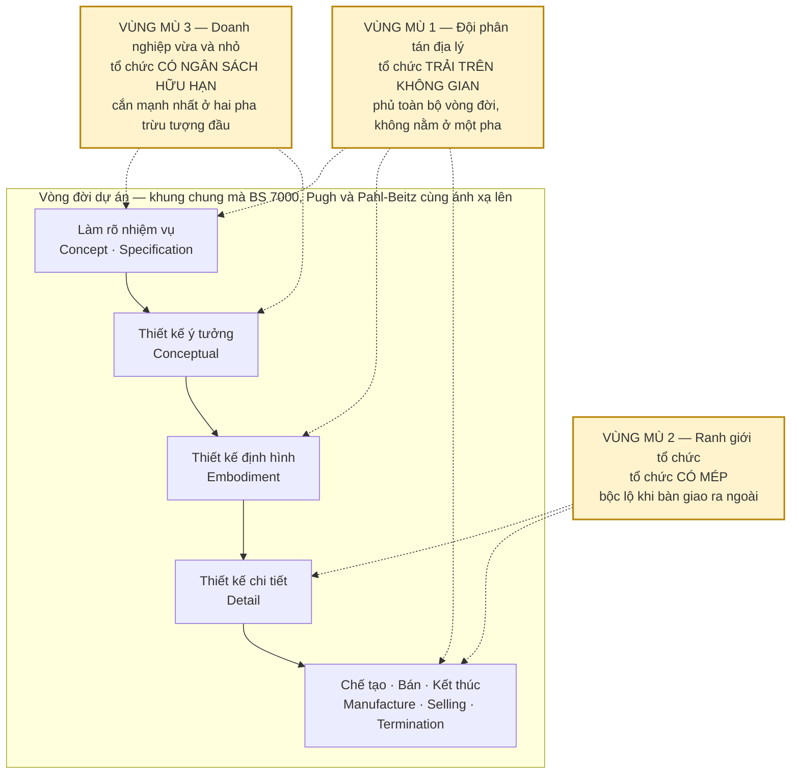
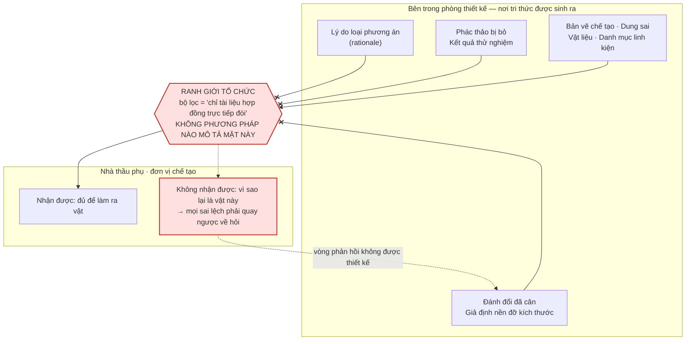

# Chương 14 — Những chỗ cả bốn thế hệ đều không nhìn tới

Một sai lầm có thể sửa được, vì ai đó đã viết nó ra. Một vùng mù thì không — nó không nằm trong văn bản
để mà cãi lại. Khi một phương pháp không nói gì về một điều kiện, người áp dụng không đọc ra chỗ trống
đó; anh ta đọc ra rằng điều kiện ấy không quan trọng. Đây là cơ chế hỏng nguy hiểm nhất trong cả cuốn
sách này, vì nó không để lại dấu vết: dự án trượt, và không ai truy được về phương pháp, bởi phương pháp
chưa từng hứa gì ở chỗ đó. Cái mất khi thiếu chương này là người đọc thừa kế **trường nhìn của phương
pháp** như thể đó là trường nhìn của bài toán mình.

Chương 13 dựng năm giả định tổ chức mà cả bốn thế hệ cùng đặt, và với mỗi giả định là một điều kiện hỏng
kèm bằng chứng. Đó là chỗ phương pháp **đặt cược sai**: nó phát biểu một điều về tổ chức, điều đó có thể
kiểm được, và trong nhiều tổ chức nó sai. Chương này khác hẳn về chất. Đây là chỗ phương pháp **không đặt
cược gì cả** — không phát biểu sai, mà không phát biểu. Chương 13 cho anh một danh sách để tự chấm điểm;
chương này cho anh một danh sách những ô mà bảng chấm điểm không có cột.

Ba kết quả cụ thể. Thứ nhất, ba vùng mù được định vị chính xác trên vòng đời dự án, không phải liệt kê
rời rạc — chúng nằm đúng ở những chỗ tổ chức có hình học, có mép, và có ngân sách. Thứ hai, với mỗi vùng
mù là một câu nguyên văn trong đó chính nguồn thừa nhận chỗ trống, **kèm câu bên cạnh làm nhỏ lời thừa
nhận ấy lại** — vì bằng chứng về vùng mù trong corpus này mỏng hơn nhiều so với vẻ ngoài của nó, và nói
ra điều đó là một phần của lập luận chứ không phải nhượng bộ. Thứ ba, với mỗi vùng mù là một câu dạng
*nếu tổ chức anh có đặc điểm này thì đây là điều phải tự bù* — vì một danh sách thiếu sót không kèm việc
phải làm chỉ là lời càu nhàu có chú thích.

---

## Ba vùng mù không nằm rải rác

Cách nhanh nhất để hiểu sai chương này là đọc nó như một danh mục lỗi ngẫu nhiên. Ba chỗ trống dưới đây
không rơi vào những vị trí bất kỳ. Chúng rơi vào đúng ba thuộc tính mà một tổ chức thật có và một bài
toán thiết kế thì không: tổ chức **trải trên không gian**, tổ chức **có mép**, và tổ chức **có ngân sách
hữu hạn**. Phương pháp mô hình hoá bài toán, không mô hình hoá thứ đang giải bài toán — nên nó không có
biến nào cho cả ba.

Khung vòng đời trong sơ đồ không phải do sách này dựng. Nó là bản đối chiếu của Amit Inamdar, người ánh
xạ ba phương pháp lên cùng một trục vòng đời sản phẩm và tìm ra chỗ chúng chồng nhau. Bảng dưới đây rút
gọn bản ánh xạ ấy để thấy điều đáng nói: cả ba đều chạy hết vòng đời, **và cả ba đều dừng ở cùng một
chỗ** — kết thúc sản phẩm — mà không chỗ nào có một bước tên là *người thiết kế ngồi ở đâu* hay *bàn giao
cho ai*.

| Vòng đời | BS 7000 Part 2 | Total Design (Pugh) | PBSA (Pahl-Beitz) |
|---|---|---|---|
| Khởi phát | Concept Phase | Market investigation / user need | Planning and Clarifying the Task |
| Chốt yêu cầu | Feasibility Phase | Specification phase (Dynamic PDS) | Requirements List |
| Sinh giải pháp | — | Conceptual design | Conceptual phase |
| Cụ thể hoá | Implementation — Development stage | Detail design (CDS) | Embodiment → Detail phase |
| Ra khỏi phòng thiết kế | Implementation — Manufacturing stage | Manufacture phase | Tài liệu chế tạo |
| Sau khi bán | Selling and Use Phase · Termination Phase | Selling phase | *(không có)* |

Đây cũng là chỗ để nói ngay một giới hạn của chính chương này. Tài liệu đối chiếu ấy tự khai thời lượng
của nó: `"Duration: 4 weeks Date: Feb 2007 – March 2007"` [33]. Bốn tuần. Câu nguyên văn quan trọng nhất
của mục kế tiếp đến từ tài liệu này, và nó là một câu trong một bản đối chiếu bốn tuần — không phải kết
luận của một nghiên cứu thực nghiệm. Tôi trích nó vì nó là bằng chứng trực tiếp duy nhất trong corpus cho
điều đang bàn, và tôi ghi rõ nó nặng bao nhiêu.

---

## Vùng mù thứ nhất — đội không ngồi cùng phòng

Câu nguyên văn:

> `"But their common thing is that these models of the design process fail to explicitly consider the
> impact of design being conducted by team members who are geographically dispersed."` [33]

Đọc kỹ chữ **`fail to explicitly consider`**. Không phải "xử lý sơ sài", không phải "giả định ngầm là
cùng chỗ". Là *không xét đến một cách tường minh*. Ba phương pháp bị nêu tên trong đoạn đó là BS 7000,
Total Design của Pugh, và Pahl-Beitz — nguồn viết `"these models"`, **nó không viết ra một con số nào**,
nên tôi cũng không viết. Ba tên ấy đi kèm ba mục tài liệu tham chiếu ngay sau câu trích:
`"BS 7000, Part 2, 1997, Design management systems: Guide to managing the design of manufactured
products"`, `"Pugh, S., 1990 Total Design: integrated methods for successful product engineering,
Addison-Wesley"`, và `"Pahl, G. and Beitz, W., 1996, Engineering Design: A Systematic Approach, 2nd ed.,
Springer-Verlag, London-New York"` [33].

Bây giờ là câu bên cạnh, và nó làm lời thừa nhận nhỏ lại đáng kể. Câu **ngay trước** câu trích là
`"Pahl & Beitz approach is based on the historical background to modern systematic design thinking in
Germany, describing a systematic approach to engineering design."` — một câu tóm tắt trung tính. Và ngay
**sau** câu trích là danh mục tham chiếu. Nghĩa là: nguồn duy nhất trong toàn bộ corpus nêu tên vùng mù
này nêu nó trong **đúng một câu**, đặt nó ở chỗ chuyển tiếp sang danh mục, rồi đi tiếp. Không có phân
tích, không có hệ quả, không có đề xuất bù. Sự mỏng của bằng chứng chính là bằng chứng: nếu đây là một
vấn đề mà ngành đã tiêu hoá xong, nó đã không nằm ở dòng cuối cùng của một đoạn tổng kết.

Vì sao chỗ trống này lại tồn tại được lâu đến vậy? Vì mọi bước trong mọi phương pháp đều được viết bằng
những động từ **giả định cuộc trò chuyện là miễn phí**: thảo luận, đánh giá, thương lượng, đối chiếu,
chốt. Ma trận hình thái chỉ chạy được khi vài người cùng nhìn một tấm bảng và cùng chỉ tay. Bảng lựa chọn
với các chỉ số `(+)`, `(-)`, `(?)`, `(!)` chỉ có nghĩa khi cái `(?)` được một người khác trong phòng trả
lời trong mười giây. Khi cuộc trò chuyện phải xếp lịch, đi qua múi giờ, hoặc đi qua một kênh viết, giá
của nó nhảy lên vài bậc — và **không phương pháp nào có ô để ghi giá đó**.

Cần nói một chi tiết để không bị bắt bẻ. Chữ `"distributed"` có xuất hiện ở tuyến VDI 2206 trong corpus,
nhưng ở đó nó là `"integrating distributed components"` — linh kiện phân tán qua các nhánh chuyên ngành
của chữ V, không phải người phân tán qua không gian. Hai thứ trùng chữ mà không trùng nghĩa. Với VDI 2206
và với ICDM, corpus **không có câu tương đương** nào về đội phân tán địa lý; tôi không suy ra rằng chúng
cũng bỏ qua, tôi ghi rằng ở đây không có bằng chứng.

Còn một đối chứng nữa phải đưa ra, vì bỏ nó đi là gian. VDI 2221 Blatt 2 bản 2019 chính là cơ chế
*tailoring* — cắt may quy trình theo bối cảnh doanh nghiệp — và nó có một danh sách nhân tố ngữ cảnh:
`"VDI 2221-2 (2019) identifies a total of ten groups of contextual factors which are of particular
importance for process design."` [12]. Nếu phân tán địa lý nằm trong mười nhóm ấy thì vùng mù này đã được
vá ở thế hệ 2019. Corpus **không liệt kê đủ mười nhóm**. Thứ duy nhất liệt kê được là năm nhóm mà một mô
hình thứ cấp chọn kế thừa — `"Five of these ten factors are addressed in the proposed PRS model."` [12] —
và năm nhóm đó là *Customer*, *Supplier*, *Project management*, *Expectations of development results*,
*Development order*. Phân tán địa lý không nằm trong năm nhóm được nêu tên. Về năm nhóm còn lại thì
**không có trong nguồn**, và tôi dừng ở đó thay vì đoán.

> **Nếu đội thiết kế của anh không ngồi chung một phòng — dù là hai xưởng cách nhau ba mươi cây số, hay
> một người làm phần mềm nhúng ở nhà — thì đây là điều phải tự bù: mọi bước trong quy trình mà động từ
> của nó là "thảo luận", "đánh giá", "chốt" đều phải được gán thêm một cột *ai có mặt* và một cột *quyết
> định này chờ được bao lâu trước khi nó tự chốt theo mặc định*. Phương pháp sẽ không nhắc anh làm việc
> đó, vì nó không biết là có việc đó.**

---

## Vùng mù thứ hai — chỗ quy trình đứt ở ranh giới tổ chức

Vùng mù thứ nhất nói về hình học của tổ chức. Vùng mù này nói về **mép** của nó. Và ở đây corpus mạnh hơn
hẳn — có cả cơ chế lẫn nguyên văn.

> `"With the project leaving the responsibility area of design, potentially even being handed over to
> suppliers, this process step is especially critical regarding the fluency of knowledge – only the
> minimum of documentation directly required may be transferred."` [10]

Cụm đáng giá nhất là **`only the minimum of documentation directly required`**. Đó không phải mô tả một
sự cẩu thả; đó là mô tả một **cơ chế lọc**. Cái đi qua ranh giới là cái hợp đồng đòi. Bản vẽ chế tạo,
dung sai, vật liệu, danh mục linh kiện — hợp đồng đòi, nên chúng đi qua. Lý do vì sao dung sai ấy là con
số ấy, ba phương án đã bị loại và bị loại vì cái gì, giả định nền nào đang đỡ cho kích thước ấy — hợp
đồng không đòi, nên chúng ở lại.

Cơ chế này không bắt đầu ở lúc bàn giao. Nó bắt đầu sớm hơn nhiều, ở chính pha ý tưởng, và cùng một
nguồn nói ra:

> `"With the highly creative, but also deciding character of this process step, there is also a high
> amount of knowledge leaving the process at this stage. Many ideas get evaluated and discarded, tests
> are done, requirements are traded off and sketches discussed. If not intentionally and systematically
> kept, this may lead to a huge knowledge loss for the design department."` [10]

Hai câu trích ghép lại thành một chuỗi hỏng đầy đủ: tri thức rò ở pha ý tưởng nếu không ai chủ động giữ,
rồi phần còn sống sót lại bị lọc lần thứ hai ở ranh giới tổ chức bởi một bộ lọc mà tiêu chí là hợp đồng.
Cụm điều kiện `"If not intentionally and systematically kept"` là chỗ đắt nhất — nguồn nói thẳng rằng
việc giữ tri thức phải là một hành động **cố ý và có hệ thống**, tức là nó không tự xảy ra như hệ quả của
việc chạy đúng quy trình.

Và đây là chỗ chốt của cả mục: không phải nhà thầu phụ vô hình trong các phương pháp. Ngược lại. Trong
bản ánh xạ BS 7000, pha *Implementation* ghi rõ đầu vào có sự tham gia của nhà cung ứng công nghệ [33].
Trong VDI 2221 Blatt 2 bản 2019, *Supplier* là một trong năm nhân tố ngữ cảnh được nêu tên [12]. Nhà
cung ứng có mặt — **nhưng luôn với tư cách một đầu vào hoặc một tham số cấu hình, không bao giờ với tư
cách một mặt tiếp giáp có chế độ hỏng riêng.** Không phương pháp nào trong corpus mô tả *cái gì đi qua
được mép, cái gì không, và chuyện gì xảy ra với cái không đi qua được*. Đó chính xác là định nghĩa của
vùng mù: đối tượng được nhắc tên, quan hệ với nó thì không.

Chỗ trống này còn được xác nhận từ một góc khác, và lần này là lời buộc tội thẳng vào tiêu chuẩn:

> `"Existing standards describe the content and generation of requirements documents but not their
> integration in the product development process."` [12]

Tiêu chuẩn mô tả **tài liệu**, không mô tả **việc tài liệu ấy sống thế nào trong dòng công việc**. Một
tài liệu yêu cầu hoàn hảo về hình thức vẫn có thể chưa từng được ai bên kia mép đọc.

> **Nếu bất kỳ phần nào của sản phẩm được làm bởi một tổ chức không phải tổ chức của anh — gia công
> ngoài, mua cụm, thuê thiết kế mạch — thì đây là điều phải tự bù: dựng một thứ mà không phương pháp nào
> yêu cầu, là bản ghi *vì sao* đi kèm bản vẽ, và một vòng phản hồi có tên người chịu trách nhiệm ở cả hai
> phía. Kiểm bằng một câu hỏi duy nhất: khi bên kia gặp một chỗ không làm được đúng bản vẽ, họ sửa hay
> họ hỏi? Nếu câu trả lời là "họ sửa", mép của anh đang rò và quy trình không có chỗ nào báo điều đó.**

---

## Vùng mù thứ ba — nơi giả định nguồn lực sụp hoàn toàn

Hai vùng mù trên là chỗ phương pháp không nhìn tới một đặc điểm của tổ chức. Vùng mù này khác: phương
pháp **có nhìn**, nhưng nhìn thấy một loại tổ chức duy nhất — loại đủ tiền và đủ thời gian cho pha trừu
tượng đầu dự án. Với doanh nghiệp vừa và nhỏ, giả định đó không suy yếu, nó sụp.

Corpus có một câu tổng kết phê bình rất đặc, và nó đáng được trích trọn vì mỗi mệnh đề là một chỗ đau
khác nhau:

> `"A key criticism revolves around the limited acceptance and applicability of prescriptive design
> methods in industrial settings. Criticisms include the high time investment, abstraction constraints,
> creativity limitations, inflexibility, overly rigid regulations, overemphasis on logical sequences and
> complex processes, and the focus on new designs rather than variant or adaptation designs."` [2]

Mệnh đề cuối là mệnh đề giết. **`the focus on new designs rather than variant or adaptation designs`** —
phương pháp quy định được tối ưu cho thiết kế mới hoàn toàn, trong khi phần lớn công việc thật của một
xưởng nhỏ là biến thể và cải tiến. Nghĩa là không phải xưởng nhỏ *không đủ sức* chạy phương pháp; mà là
phương pháp được chỉnh cho một loại việc mà xưởng nhỏ hiếm khi làm. Đó là một cáo buộc nặng hơn nhiều so
với "thiếu nguồn lực".

Điều kiện thực địa thì được nói bằng một câu gọn hơn:

> `"In practice, often a mix of intuitive and experience-based behaviour can be found. To understand why
> designers in industry do not often use methods, a more detailed look at their situation is necessary.
> Design work in industry is marked by a lot of restrictions, e.g. lack of resources and high time
> pressure."` [14]

Chú ý cách nguồn đặt câu hỏi: không phải *làm sao bắt kỹ sư dùng phương pháp*, mà là *vì sao họ không
dùng* — và câu trả lời được tìm ở **hoàn cảnh của họ**, không ở kỷ luật của họ. Đây là một trong số ít
chỗ trong toàn corpus mà một tài liệu phương pháp luận chịu đặt câu hỏi theo chiều đó.

Bây giờ đến chỗ phải nói ra vì luật của cuốn sách này bắt phải nói. **Không nguồn nào trong corpus tự đếm
về doanh nghiệp vừa và nhỏ.** Không có tỷ lệ áp dụng, không có số dự án khảo sát, không có ngưỡng quy mô
nhân sự nào để phân định. Tệp khám phá của tuyến VDI 2221 ghi thẳng rằng các con số liên quan đến SME
`không có trong nguồn` thô của lượt truy xuất đó. Vậy nên chương này không đưa ra con số nào cho vùng mù
thứ ba — và bản thân sự vắng mặt ấy là một dữ kiện: một điều kiện hỏng được cả mấy tuyến tài liệu độc lập
nêu tên mà không tuyến nào chịu đo. Cái gì không được đo thì không được vá.

Có một xoắn ốc cuối cùng, và nó tàn nhẫn. Cơ chế *tailoring* tồn tại chính là để cho phép lược bớt. Nhưng
nghiên cứu thực địa lại thấy điều này:

> `"These methods-users would often attempt to live up to the maximum requirements despite the nature of
> the specific project. Only seasoned project managers seemed to ‘dare’ to use the flexibility of the
> method."` [43]

Chữ **`dare`** nằm trong ngoặc kép trong chính nguồn. Lược bớt một bước không phải là quyết định kỹ
thuật, nó là hành vi **nhận rủi ro cá nhân**: người lược bước là người sẽ bị hỏi tại sao khi có sự cố.
Ghép câu này với hoàn cảnh của xưởng nhỏ cho ra một suy luận — và tôi ghi rõ **đây là suy luận của tôi,
không nguồn nào nói câu này**: quyền linh hoạt được trao cho người dày dạn, mà xưởng nhỏ lại chính là nơi
người dày dạn khan hiếm nhất. Kết quả là tổ chức cần lược nhiều nhất lại là tổ chức có ít người dám lược
nhất. Cơ chế cứu được thiết kế cho họ, nhưng chìa khoá lại nằm ở chỗ họ không với tới.

> **Nếu tổ chức của anh không có một người nào đủ thâm niên để dám ký vào việc bỏ bớt một bước — thì đây
> là điều phải tự bù: đừng chờ cá nhân dám, hãy làm cho việc lược trở thành quyết định của tổ chức. Viết
> ra trước, một lần, cho cả xưởng: loại dự án nào chạy bao nhiêu bước, ai ký, và khi bỏ bước thì bằng
> chứng nào thay thế. Lược có văn bản thì không ai phải "dám" cả.**

---

> **Đào sâu: ba vùng mù này thật ra là một**
>
> Chúng khác nhau ở bề mặt và giống nhau ở gốc. Phương pháp thiết kế mô hình hoá **nhiệm vụ thiết kế** —
> yêu cầu, chức năng, nguyên lý, cấu trúc. Nó không mô hình hoá **thực thể đang thực hiện nhiệm vụ ấy**.
> Ba vùng mù chỉ là ba thuộc tính của thực thể đó: nó trải trên không gian (phân tán), nó có mép (thầu
> phụ), nó có ngân sách hữu hạn (xưởng nhỏ). Ba thuộc tính, không biến nào.
>
> Đây cũng là chỗ phân biệt sạch nhất giữa chương này và Chương 13. Năm giả định của Chương 13 là những
> **phát biểu về tổ chức** — sai, nhưng có mặt trong mô hình, nên kiểm được, cãi được, và về nguyên tắc
> là sửa được bằng cách thay giả định. Ba vùng mù ở đây không phải phát biểu sai; chúng là **biến không
> tồn tại**. Không thể sửa một biến không có. Chỉ có thể thêm nó vào từ bên ngoài — và "từ bên ngoài" ở
> đây nghĩa là: bởi anh, thủ công, không có ai nhắc.
>
> Hệ quả thực hành: đừng đi tìm chỗ vá trong phương pháp cho ba việc này. Không có chỗ vá. Chúng phải
> thành một lớp riêng, chạy song song, do người chịu trách nhiệm quy trình dựng lấy.

---

## Cách soi vùng mù của bất kỳ phương pháp nào

Ba vùng mù trên là ba vùng mù của bốn thế hệ đã bàn trong sách. Nhưng thao tác tìm ra chúng chuyển giao
được, và nó gọn hơn người ta tưởng — ba câu hỏi, đặt vào bất kỳ tài liệu quy trình nào, kể cả quy trình
do chính anh viết.

| Câu hỏi soi | Tìm gì trong văn bản | Vùng mù nó lộ ra |
|---|---|---|
| Động từ của mỗi bước giả định ai có mặt? | "thảo luận", "đánh giá", "chốt" mà không nói ai, ở đâu | Hình học của tổ chức |
| Bước nào đi qua một mép tổ chức, và tài liệu nói gì về mép đó? | Chỗ chuyển giao chỉ được mô tả bằng *đầu ra là gì*, không bằng *ai nhận và nhận đủ không* | Mép của tổ chức |
| Bước nào tốn nhiều nhất, và tài liệu có nói được phép bỏ nó không? | Có cơ chế lược nhưng không có tiêu chí lược, hoặc tiêu chí phụ thuộc "kinh nghiệm" | Ngân sách của tổ chức |

Ba câu hỏi này đều có cùng một hình dạng: chúng không hỏi *quy trình nói gì*, chúng hỏi *quy trình giả
định cái gì đã có sẵn để nó nói được như thế*. Bất kỳ thứ gì một quy trình coi là miễn phí đều là một
vùng mù tiềm năng, và trong tổ chức thật, ba thứ đắt nhất luôn là: sự có mặt của người, việc đi qua một
ranh giới, và thời gian ở pha chưa ra vật.

---

## Chỗ cuốn sách rẽ hướng

Bốn phần đầu của cuốn sách này đều đứng bên trong ngành: phương pháp nói gì, phiên bản sau sửa gì của
phiên bản trước, tuyến phê bình bác lại điều gì. Ba vùng mù vừa rồi là chỗ xa nhất mà cách đọc từ bên
trong ấy đi được. Nó trả lời được *phương pháp không nhìn tới cái gì*. Nó không trả lời được câu tiếp
theo, câu quan trọng hơn: **vì sao biết rồi mà vẫn không đổi được gì.**

Bằng chứng cho câu hỏi ấy đã nằm rải khắp bốn phần này. Người ta biết bước tuần tự bị đảo và bị bỏ dưới
áp lực — `"Many other cases from our students indicate that the steps of methods are routinely changed,
skipped, or squeezed as a result of various pressures such as lack of time and money."` [43]. Người ta
biết chỉ người dày dạn mới dám dùng tính linh hoạt. Người ta biết tri thức rò ở mép. Biết đủ cả, và mỗi
thế hệ tiêu chuẩn mới lại tiếp tục cải tiến **tài liệu**.

Phần V mượn một lăng kính từ ngoài ngành để trả lời câu đó. Mượn thì phải khai ngay ở đây: **hai tác giả
sắp được dùng làm lăng kính không viết một chữ nào về thiết kế kỹ thuật**, và việc đặt họ cạnh Pahl-Beitz
là thao tác của cuốn sách này, không phải phát hiện của bất kỳ nguồn nào trong corpus. Đó là canh bạc lớn
nhất mà cuốn sách tự đặt, và chương mở đầu Phần V sẽ khai lại nó lần nữa trước khi dùng.

---

## Áp dụng ở Xưởng

Bối cảnh: một xưởng cơ khí — điện tử — phần mềm nhúng, vài chục người, chạy nhiều dự án song song, có
việc gia công ngoài và có người làm việc không cùng một địa điểm. Năm việc dưới đây không lấy từ phương
pháp nào, vì đúng như cả chương vừa lập luận, phương pháp không có chỗ cho chúng.

**1. Chấm ba vùng mù cho danh mục dự án đang chạy — làm được trong tuần tới.** Đây là quyết định cụ thể,
và nó chỉ tốn một buổi. Lấy danh sách dự án đang chạy, dựng một bảng ba cột đúng theo ba thuộc tính của
chương này: dự án này có người thiết kế không ngồi chung chỗ không · dự án này có phần nào đi qua một tổ
chức khác không · dự án này có ai đủ thẩm quyền ký việc bỏ bước không. Chỉ điền có/không, không chấm
điểm, không viết nhận xét. Quyết định phải ra ngay cuối buổi là: **dự án nào có cả ba ô "có" thì tuần sau
được gán một lớp bù thủ công trước khi chạy tiếp bất kỳ pha nào**. Giá trị của việc này nằm ở chỗ nó biến
ba vùng mù từ khái niệm thành một danh sách tên dự án — và một danh sách tên thì có người phải trả lời.

**2. Cột "ai có mặt" gắn vào mọi cổng quyết định.** *Vấn đề nó giải:* quyết định thiết kế bị trôi vô hạn
vì người cần có mặt thì không có mặt, và không chỗ nào trong quy trình ghi lại rằng nó đang trôi. *Cách
áp:* mỗi cổng quyết định trong quy trình nội bộ được thêm đúng hai ô — *ai bắt buộc có mặt* và *hạn chờ,
sau hạn thì quyết định tự chốt theo phương án mặc định đã ghi sẵn*; ô mặc định phải được điền **trước
khi** bắt đầu chờ, không phải sau. *Bẫy:* nếu phương án mặc định được điền lúc hết hạn thì cơ chế này trở
thành cỗ máy hợp thức hoá việc bỏ qua người vắng mặt, tệ hơn là không có nó.

**3. Bản ghi "vì sao" đi kèm mọi bộ bản vẽ ra khỏi xưởng.** *Vấn đề nó giải:* bên nhận gia công có đủ
thông tin để làm ra vật nhưng không có thông tin để biết chỗ nào được phép xê dịch, nên khi vướng thì họ
tự sửa thay vì hỏi. *Cách áp:* kèm mỗi bộ bản vẽ một trang duy nhất liệt kê các kích thước và dung sai
**không được phép đổi** kèm một dòng lý do cho mỗi cái, cộng một tên người trực tiếp trả lời khi bên kia
vướng; một trang, không nhiều hơn, vì cái dài hơn một trang thì không ai đọc ở phía bên kia mép. *Bẫy:*
viết lý do dạng "theo thiết kế" hoặc "theo tính toán" thì trang ấy vô dụng — lý do phải nói ra **hậu quả
nếu đổi**, đó mới là thứ khiến người kia dừng tay và gọi điện.

**4. Bảng quy trình rút gọn theo loại dự án, ký một lần ở cấp xưởng.** *Vấn đề nó giải:* dưới áp lực thời
gian, các bước bị bỏ tuỳ tiện từng dự án một, và vì không ai được phép bỏ nên không ai ghi lại là đã bỏ.
*Cách áp:* phân dự án thành vài loại theo mức độ mới của thiết kế — biến thể, cải tiến, mới hoàn toàn —
rồi viết ra một lần cho cả xưởng loại nào chạy những bước nào, ai ký, và khi bỏ một bước thì bằng chứng
nào được chấp nhận để thay; văn bản này ký ở cấp xưởng, không phải cấp dự án. *Bẫy:* nếu bảng này chỉ ghi
*được bỏ bước nào* mà không ghi *bằng chứng nào thay thế*, nó sẽ được dùng làm giấy phép bỏ bước chứ
không phải công cụ cắt may.

**5. Một buổi soi vùng mù cho chính quy trình nội bộ, mỗi quý.** *Vấn đề nó giải:* quy trình do xưởng tự
viết cũng thừa hưởng đúng những vùng mù của các phương pháp mà nó tham khảo, và không có cơ chế nào lộ ra
điều đó. *Cách áp:* mỗi quý, lấy chính ba câu hỏi soi ở bảng phía trên đặt vào tài liệu quy trình nội bộ,
và chỉ tìm những chỗ tài liệu **coi một thứ là miễn phí** — sự có mặt của người, việc đi qua một ranh
giới, thời gian ở pha chưa ra vật. *Bẫy:* buổi này rất dễ biến thành buổi viết thêm quy trình; nếu đầu ra
của nó là tài liệu dày hơn thay vì một danh sách ngắn những chỗ đang được coi là miễn phí, thì nó đã
trượt thành đúng cái bệnh over-documentation mà chương này vừa mô tả.

---

## Sổ kiểm của chương

- **Neo luận đề:** *Mặt tiếp giáp*. Nối rõ ở ba chỗ: mục "Ba vùng mù không nằm rải rác" (ba vùng mù là ba
  thuộc tính của tổ chức mà phương pháp không có biến); mục vùng mù thứ hai (ranh giới tổ chức là mặt
  tiếp giáp theo nghĩa đen — nhà cung ứng có mặt như đầu vào/tham số, không bao giờ như một mặt có chế độ
  hỏng riêng); và hộp *Đào sâu* (phân biệt "phát biểu sai" của Ch13 với "biến không tồn tại" của Ch14).
- **Nguồn đã dùng:** [2], [10], [12], [14], [33], [43].
- **Con số có nguyên văn:**
  - Bốn tuần, tháng 2–3/2007 (thời lượng bản đối chiếu Inamdar) — `"Duration: 4 weeks…"` [33]
  - BS 7000 Part 2, năm 1997 — `"BS 7000, Part…"` [33]
  - Pugh, năm 1990 — `"Pugh, S., 1990…"` [33]
  - Pahl & Beitz bản tiếng Anh thứ 2, năm 1996 — `"Pahl, G. and…"` [33]
  - Mười nhóm nhân tố ngữ cảnh của VDI 2221-2 (2019) — `"VDI 2221-2 (2019)…"` [12]
  - Năm trong mười nhân tố được mô hình PRS kế thừa — `"Five of these…"` [12]
- **Con số đã BỎ vì không có nguyên văn:**
  - **"Ba mô hình"** trong câu về đội phân tán địa lý. Nguồn viết `"these models"` và **không viết con số
    nào**; ba tên chỉ suy ra được từ ba mục tham chiếu đi liền sau. Chương gọi tên ba phương pháp nhưng
    không trình bày "ba" như phép đếm của nguồn.
  - **Mọi con số về doanh nghiệp vừa và nhỏ.** Tệp khám phá tuyến VDI 2221 ghi rõ các giá trị định lượng
    về SME `không có trong nguồn` thô. Chương viết ra sự vắng mặt này thay vì lấp nó, và biến nó thành
    một luận điểm (điều kiện hỏng được nêu tên mà không được đo).
  - **Danh sách đầy đủ mười nhóm nhân tố ngữ cảnh của VDI 2221-2.** Corpus chỉ liệt kê được năm nhóm mà
    mô hình PRS kế thừa. Chương ghi "không có trong nguồn" cho năm nhóm còn lại thay vì suy đoán rằng
    phân tán địa lý không nằm trong đó.
- **Chỗ là suy luận của tác giả, không phải của nguồn:**
  - Việc xếp ba thiếu sót thành **ba thuộc tính của tổ chức** (trải trên không gian · có mép · có ngân
    sách hữu hạn) là thao tác của cuốn sách. Không nguồn nào nhóm chúng lại.
  - Suy luận rằng **xưởng nhỏ là nơi vừa cần lược bước nhiều nhất vừa khan hiếm người dày dạn dám lược
    nhất** — ghép câu `"Only seasoned project managers seemed to 'dare'…"` [43] với hoàn cảnh SME. Đã ghi
    rõ trong thân bài rằng đây là suy luận, không nguồn nào phát biểu.
  - Lập luận rằng **sự mỏng của bằng chứng chính là bằng chứng** (vùng mù phân tán địa lý chỉ được nêu
    trong một câu, đặt sát danh mục tham chiếu) là diễn giải của tác giả về vị trí câu văn trong nguồn.
  - Phân biệt `"integrating distributed components"` của tuyến VDI 2206 với "đội phân tán địa lý" là đối
    chiếu của tác giả; corpus không đặt hai cụm này cạnh nhau.
  - Bảng **ba câu hỏi soi vùng mù** là công cụ do chương này dựng, không lấy từ nguồn nào.
  - Toàn bộ mục *Áp dụng ở Xưởng* là đề xuất của tác giả, không nguồn nào mô tả các biện pháp này.
- **Số dòng:** 422
