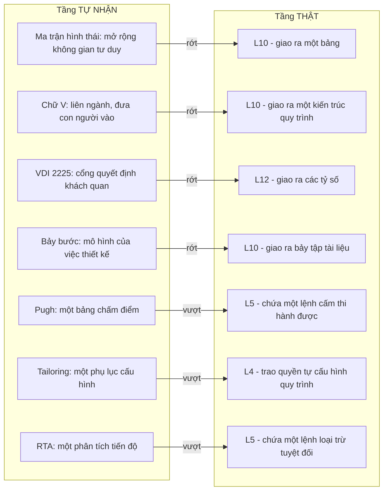

# Chương 16 — Xếp lại toàn bộ công cụ theo tầng đòn bẩy

Đến đây bạn đang cầm hai thứ rời nhau. Một cái thang mười hai bậc mượn từ ngoài ngành, và một đống công
cụ thiết kế tích luỹ qua nửa thế kỷ. Chưa ai đặt đống công cụ lên cái thang. Nếu không đặt, thì cái thang
chỉ là một ẩn dụ đẹp, và đống công cụ vẫn được chọn theo cách cũ — theo cái nào quen tay, cái nào có sẵn
biểu mẫu, cái nào vừa được nhắc trong một khoá đào tạo. Cái hỏng khi thiếu chương này rất cụ thể: một xưởng
có ngân sách cho đúng một cuộc cải tiến quy trình mỗi năm sẽ tiêu nó vào thứ trông giống cải tiến nhất chứ
không phải thứ dịch chuyển được nhiều nhất, và sẽ mất mười hai tháng để biết mình chọn sai.

Chương 15 đã dựng thang. Nó cho bạn mười hai bậc từ L12 đến L1, quy ước số nhỏ là đòn bẩy lớn, và một câu
đo lượng chú ý thực tế đổ vào đáy bảng. Nó cũng nói rõ rằng thang ấy là đồ mượn: Meadows viết về hệ thống
xã hội và sinh thái, Goldratt viết về nhà máy, không ai trong hai người viết một chữ nào về thiết kế kỹ
thuật. Chương 16 làm đúng một việc mà Chương 15 cố tình chưa làm — đặt từng công cụ thiết kế lên từng bậc.
Và vì đó là việc chưa nguồn nào làm, chương này phải mở bằng một lời khai chứ không phải bằng một bảng.

Ba thứ bạn cầm được khi đóng chương. Thứ nhất: một bảng xếp mười bốn công cụ vào mười hai tầng, kèm cột
ghi rõ căn cứ của từng ô — và bạn sẽ thấy phần lớn căn cứ ấy là suy luận của tôi, không phải của tài liệu.
Thứ hai: một phép thử một câu để tự xếp bất kỳ công cụ mới nào bạn gặp sau này, kể cả công cụ không có
trong cuốn sách này. Thứ ba: một thứ tự đầu tư khi tiền và người có hạn, kèm danh sách những thứ nên hoãn
và lý do hoãn.

---

## Bảng này là công trình của cuốn sách, không phải tổng hợp từ tài liệu

Phải nói thẳng trước khi bạn nhìn thấy một ô nào.

Không một tài liệu nào trong sáu mươi sáu nguồn của corpus ánh xạ một công cụ thiết kế vào một tầng đòn bẩy
Meadows. Không có bài báo nào viết "ma trận hình thái là can thiệp L10". Không có tiêu chuẩn nào tự định vị
mình trên thang mười hai bậc. Toàn bộ việc ghép cột trái với cột phải trong bảng sắp tới là **thao tác của
cuốn sách này**. Nếu bạn cầm bảng đi trích cho người khác, hãy trích kèm câu này, nếu không bạn đang gán
cho tài liệu gốc một khẳng định mà nó không đưa ra.

Có đúng **một ngoại lệ**, và nó nằm ngoài họ công cụ thiết kế. Bản phân tích TOC trong corpus tự xếp chính
nó: `"TOC emerges as primarily an L10-level intervention methodology (physical structure) that gains
transformational power when integrated with higher-leverage thinking (L1-L5)."` [65]. Đó là ô duy nhất
trong bảng có căn cứ nguyên văn. Mười ba ô còn lại là suy luận. Tôi để TOC trong bảng chính là cố ý — nó
là hàng đối chứng, cho thấy một ô *có* căn cứ trông khác thế nào so với một ô không có.

### Lời khai thứ hai — cái thang cũng là đồ đọc qua lớp thứ cấp

Chương 15 đã ghi điều này và chương 16 phải ghi lại, vì ở đây ranh giới căng hơn hẳn.

Corpus **không chứa sách của Meadows, cũng không chứa sách của Goldratt.** Cái nó chứa là tám tệp phân
tích viết *về* hai cuốn ấy. *Thinking in Systems* và *The Goal* chỉ xuất hiện dưới dạng dòng thư mục tham
khảo bên trong các tệp phân tích đó. Hệ quả trực tiếp: mọi câu tôi trích trong chương này bằng tiếng Anh
để định nghĩa các tầng — kể cả câu định nghĩa L5, kể cả câu về 99% sự chú ý, kể cả câu xếp TOC ở L10 — là
nguyên văn **của tài liệu phân tích**, không phải nguyên văn của Meadows hay Goldratt.

Cộng hai lời khai lại thì chuỗi suy diễn của chương này có ba mắt, và bạn nên nhìn thấy cả ba trước khi
đọc bảng:

**thang đo (tài liệu thứ cấp) → ánh xạ vào công cụ (suy luận của tôi) → kết luận về công cụ thiết kế
(tài liệu sơ cấp).**

Hai lớp suy diễn chồng lên nhau. Chuỗi ấy vẫn dùng được — nó cho ra một cách sắp xếp mà không cách nào
khác trong corpus cho ra — nhưng nó là một *cách nhìn*, không phải một *phép đo*. Ai trình bày bảng dưới
đây như số liệu là đang bịa thêm một mắt xích mà chuỗi này không có.

### Bốn phép thử tôi dùng để xếp

Suy luận không có nghĩa là tuỳ tiện. Đây là bốn câu hỏi tôi áp đều cho cả mười bốn công cụ, theo đúng thứ
tự này, và tầng nào có câu trả lời "có" ở vị trí cao nhất thì công cụ ngồi ở tầng đó.

**Phép thử 1 — Công cụ giao ra cái gì?** Lấy đúng dòng "đầu ra" mà nguồn tự viết cho công cụ ấy, không diễn
giải. Nếu đầu ra là một tài liệu, một bảng, một bản vẽ, một sơ đồ — thì công cụ đang thay đổi cấu trúc của
hồ sơ, tức là `"L10: Stock-and-Flow Structures—Physical Architecture"` [62], chứ chưa chạm gì cao hơn. Nếu
đầu ra là một con số hoặc một ngưỡng, đó là `"L12: Numbers—Constants and Parameters"` [62].

**Phép thử 2 — Công cụ có CẤM cái gì không?** Đây là phép thử quan trọng nhất và nó tách bảng làm hai nửa.
Tầng năm của Meadows là `"L5: Rules—Incentives, Constraints, Decision Criteria"` [62]. Một biểu mẫu gợi ý
bạn nên làm gì thì không phải luật. Một câu văn nói rằng bạn *không được* làm một việc cụ thể, và câu ấy
được viết vào quy trình, thì đó là luật. Công cụ nào chứa một lệnh cấm khả thi hành, công cụ đó ngồi ở L5.

**Phép thử 3 — Ai biết thêm cái gì, vào lúc nào?** Nếu công cụ chuyển một mẩu thông tin đến chỗ trước đó
không có nó — đặc biệt là đến *sớm hơn* — thì nó đang can thiệp ở `"L6: Information Flows—Who Knows What
When"` [62], và nếu việc chuyển sớm ấy rút ngắn một vòng phản hồi thì nó chạm cả `"L9: Delays—Feedback Loop
Timing"` [62].

**Phép thử 4 — Công cụ có đụng vào định nghĩa "thế nào là thắng" không?** Nếu nó quyết định trước rằng
phương án tốt là phương án đạt gì, và định nghĩa ấy ràng buộc mọi quyết định phía sau, thì đó là
`"L3: Goals—System Purpose"` [62].

Không công cụ nào trong corpus vượt qua được L3. Không cái nào chạm `"L2: Paradigms—Mental Models"` [62].
Đó cũng là một phát hiện, và nó là phát hiện quan trọng nhất của chương.

### Cái tôi cố ý không làm

Tôi không xếp công cụ theo **mức độ hữu ích**. Một công cụ L12 có thể cực kỳ hữu ích và một công cụ L5 có
thể vô dụng nếu không ai thi hành. Thang đòn bẩy đo *chỗ can thiệp*, không đo *chất lượng can thiệp*. Nhầm
hai thứ này là cách nhanh nhất để biến chương này thành một bảng xếp hạng tốt–xấu, mà nó không phải.

Tôi cũng không viết lại bảy công cụ ICDM ở đây. Chúng đã có nguyên một cuốn sách riêng. Việc của chương
này chỉ là hỏi: mỗi cái ngồi ở tầng nào, và nó tự nhận là tầng nào.

> **Đào sâu: "bảy công cụ ICDM" — con số này không đến từ nguồn**
>
> Bảng thuật ngữ của cuốn sách gọi `EQFD · CFMA · DSO · CDTC · RTA · Robustool · DQM · CSR` là bảy công cụ
> ICDM. Tám cái tên, bảy công cụ. Tôi đã tìm trong corpus một câu đếm chúng và **không tìm được**. Nguồn có
> câu đếm số bước của phương pháp: `"The procedure of ICDM consists of 10 steps..."` [54], và câu ấy được
> lặp ở một tài liệu khác dưới dạng `"a 10 step comprehensive prescriptive method"` [47]. Nhưng không câu
> nào đếm số công cụ.
>
> Vì vậy trong bảng dưới đây tôi liệt kê từng cái theo tên riêng thay vì gộp thành "bảy công cụ". Cách này
> vừa trung thực với nguồn, vừa tốt hơn cho mục đích của chương: gộp chúng lại thì không xếp tầng được, vì
> chúng nằm rải trên bốn tầng khác nhau — và chính sự nằm rải ấy là điều đáng nói nhất về ICDM.

---

## Bảng xếp hạng — mười bốn công cụ trên mười hai tầng

Cột **Tầng thật** là kết luận của tôi. Cột **Tầng tự nhận** là tầng mà chính tài liệu về công cụ ấy ngụ ý
khi nó tự giới thiệu — cũng là suy luận của tôi, đọc từ cách nguồn mô tả mục đích công cụ. Cột **Căn cứ
ánh xạ** ghi đúng một trong hai thứ: câu nguyên văn từ nguồn, hoặc dòng chữ *suy luận của tác giả*.

| # | Công cụ | Tầng thật | Tầng tự nhận | Căn cứ ánh xạ |
|---|---|---|---|---|
| 1 | Ma trận hình thái *(morphological chart)* | **L10**, chạm rìa L6 khi dùng ngược để phân tích sản phẩm có sẵn | ~L2 — mở rộng cách nghĩ, phá khung giải pháp quen | **Suy luận của tác giả.** Phép thử 1: đầu ra nguồn mô tả là một ma trận cộng danh sách bản phác thảo tay. Không có lệnh cấm nào trong công cụ |
| 2 | Ma trận Pugh | **L5**, cạnh L6 | ~L12 — một bảng chấm điểm cho ra một thứ hạng | **Suy luận của tác giả**, dựa trên một lệnh cấm nguyên văn trong nguồn: `"the average marks of the concepts could not be used"` [57] |
| 3 | Biểu đồ kỹ thuật–kinh tế VDI 2225 · *Nutzwertanalyse* | **L12** | ~L5/L3 — cổng quyết định khách quan, hồ sơ kiểm toán được | **Suy luận của tác giả.** Phép thử 1: đầu ra là toạ độ hai trục và các tỷ số; trọng số được chốt *trước* và *ngoài* công cụ |
| 4 | Chữ V — VDI 2206 *(2004 hai nhánh; 2021 ba luồng)* | **L10** | ~L2/L4 — sáng tạo sản phẩm liên ngành, đưa con người vào quy trình | **Suy luận của tác giả.** Nguồn tự nhận cách trình bày này không tả được vòng lặp: `"...does not represent the iterative nature of real development cycles."` [19] |
| 5 | Quy trình bảy bước VDI 2221:1993 | **L10** | ~L2 — mô hình của việc thiết kế, *Modell der Produktentwicklung* | **Suy luận của tác giả.** Phép thử 1: bảy bước sinh ra bảy sản phẩm tài liệu, từ mô hình chức năng đến bộ hồ sơ kỹ thuật |
| 6 | Tailoring — VDI 2221 Blatt 2 (2019) | **L4** — cao nhất trong toàn bộ họ công cụ thiết kế | ~L10 — hướng dẫn cấu hình quy trình, một phụ lục kỹ thuật | **Suy luận của tác giả.** Đối chiếu định nghĩa L4 nguyên văn `"The power to add, change, evolve, or self-organize system structure"` [62] với việc Blatt 2 trao cho doanh nghiệp quyền tự cấu hình quy trình theo mười nhóm nhân tố |
| 7 | EQFD + TVDT | **L6**, có một chốt L12 kẹp kích thước ma trận | ~L3 — lấy khách hàng làm mục tiêu của hệ thống | **Suy luận của tác giả.** Phép thử 3: công cụ chuyển tiếng nói khách hàng thành đặc tính sản phẩm và bắt hai phía ngồi lại chốt giá trị mục tiêu |
| 8 | CFMA | **L6 + L9** | ~L10 — một bảng FMEA làm sớm hơn | **Suy luận của tác giả**, dựa trên chính câu hỏi số năm của công cụ: `"...as early as possible in the design process"` [46] — chuyển thông tin và rút ngắn độ trễ |
| 9 | CDTC | **L12**, hé một cửa sang L3 qua *requirement challenging* | ~L3 — chi phí trở thành mục tiêu thiết kế | **Suy luận của tác giả.** Phép thử 1: đầu ra là một ước lượng chi phí có sai số, và công cụ tự giới hạn `"up to 9 of the most significant requirements"` [50] |
| 10 | RTA | **L5 + L9** | ~L10/L12 — một phân tích tiến độ và rủi ro | **Suy luận của tác giả**, dựa trên một lệnh cấm nguyên văn: `"...therefore no project can include a level-4 component."` [55] |
| 11 | Robustool | **thiết kế ở L5, bị chính tác giả hạ xuống L10** | ~L10 — một bảng hướng dẫn | **Suy luận của tác giả.** Hai câu nguyên văn đối nhau: câu hỏi nhóm A loại thẳng linh kiện độc nguồn [56], nhưng `"This score is by no means considered as binding... the table is considered as a guide only."` [56] |
| 12 | DSO | **L5 khi tuyên bố, L10 khi chạy** | ~L10 — một bước sắp xếp lại ma trận hình thái | **Suy luận của tác giả.** Luật ưu tiên cặp điểm là tiêu chí quyết định; nhưng nguồn tự thú thuật toán hỏng: `"In each of our experimental projects, two or more unacceptable combinations were includeded in the solutions suggested by the algorithms."` [57] |
| 13 | DQM / CSR | **L3** | ~L12 — một chỉ số đo chất lượng thiết kế | **Suy luận của tác giả.** Phép thử 4: công cụ định nghĩa "thắng" bằng số trước khi thiết kế tồn tại; và tác giả tự nhận nó cần một điều kiện L2 để sống — `"...requires comprehensive implementation of QFD across the organization as a way of living..."` [46] |
| 14 | TOC — năm bước tập trung *(hàng đối chứng)* | **L10** | L10 — trùng nhau | **Nguyên văn từ nguồn:** `"TOC emerges as primarily an L10-level intervention methodology (physical structure) that gains transformational power when integrated with higher-leverage thinking (L1-L5)."` [65] |

**Kết quả đếm, không làm tròn cho đẹp: 1 ô có căn cứ nguyên văn từ nguồn, 13 ô là suy luận của tác giả.**

Đó là con số thật và tôi không định che nó. Một cuốn sách buộc tội các phương pháp khác là giả định không
khai báo mà lại giấu giả định của chính mình thì tự phá luận điểm của nó ở đúng chỗ nó mạnh nhất. Nếu bạn
bác được một trong mười ba ô ấy, bảng vẫn đứng — vì bảng không dựa vào việc từng ô đúng, nó dựa vào việc
bốn phép thử được áp đều cho cả mười bốn hàng. Cái tôi bán ở đây là *phép thử*, không phải là *bảng*.

```mermaid
flowchart LR
  subgraph G4["L3 · Mục tiêu"]
    A1["DQM / CSR"]
  end
  subgraph G3["L5 - L4 · Luật và quyền tự tổ chức"]
    B1["Tailoring VDI 2221 Blatt 2 · L4"]
    B2["Ma trận Pugh · L5"]
    B3["RTA · L5"]
    B4["Robustool · L5 bị hạ xuống L10"]
    B5["DSO · L5 tuyên bố, L10 khi chạy"]
  end
  subgraph G2["L9 - L6 · Thông tin và độ trễ"]
    C1["EQFD + TVDT · L6"]
    C2["CFMA · L6 + L9"]
  end
  subgraph G1["L12 - L10 · Cấu trúc và thông số"]
    D1["Ma trận hình thái · L10"]
    D2["Chữ V, VDI 2206 · L10"]
    D3["Bảy bước VDI 2221:1993 · L10"]
    D4["TOC năm bước · L10, nguồn tự xếp"]
    D5["Biểu đồ kỹ thuật-kinh tế VDI 2225 · L12"]
    D6["CDTC · L12"]
  end
  G1 -->|"đòn bẩy tăng"| G2 -->|"đòn bẩy tăng"| G3 -->|"đòn bẩy tăng"| G4
```

Nhìn hình này thì thấy ngay hình dạng của vấn đề. Sáu trong mười bốn công cụ nằm ở hai tầng đáy. Ba công
cụ duy nhất được thiết kế như luật đều đến từ ICDM và Pugh, chứ không đến từ tiêu chuẩn. Và cả họ tiêu
chuẩn Đức — VDI 2221 bản 1993, VDI 2206 cả hai bản — nằm gọn ở L10.

---

## Chênh lệch giữa tầng thật và tầng tự nhận

Đây là phát hiện của chương, và nó không nằm ở cột "tầng thật". Nó nằm ở khoảng cách giữa hai cột.

Gần như mọi công cụ trong bảng đều tự giới thiệu bằng ngôn ngữ của một tầng cao hơn tầng nó thật sự ngồi.
Ma trận hình thái được giới thiệu như thứ phá khung tư duy. Chữ V được giới thiệu như thứ làm cho ba miền
cơ–điện–phần mềm nói chuyện được với nhau. VDI 2225 được giới thiệu như cổng quyết định khách quan. Cả ba
đều đúng về mục đích và đều sai về cơ chế: cái chúng thật sự thay đổi là hình dạng của hồ sơ, không phải
hình dạng của cách nghĩ.

Hai hướng lệch, và chúng dạy hai bài khác nhau.

### Hướng thứ nhất — tự nhận cao hơn tầng thật

Bốn công cụ rớt: ma trận hình thái, chữ V, bảy bước VDI 2221, biểu đồ VDI 2225. Cộng thêm CDTC và EQFD ở
mức nhẹ hơn. Đây là đa số bảng.

Trường hợp sạch nhất là **chữ V bản 2021**. Uỷ ban soạn thảo nói ra rất rõ điều họ muốn:
`"First, the wish to include the human beings with their skills, competencies, convictions and emotions
was discussed and taken up in the workshop. In the final version it is represented by coupling the V-Model
with the Holistic Product Lifecycle (HPLC) Model..."` [23]. Đọc câu ấy hai lần. Vế đầu là một mong muốn ở
tầng hệ hình — kỹ năng, xác tín, cảm xúc của con người trong tổ chức. Vế sau là cơ chế họ chọn để thực
hiện mong muốn ấy: **ghép thêm một mô hình nữa**. Một vấn đề L2 được trả lời bằng một câu trả lời L10.
Bản 2021 còn thêm `"The new V-model basically consists of three strands."` và
`"...are backed by a structure of six checkpoints."` [23] — ba luồng và sáu điểm kiểm, tức là thêm cấu
trúc. Một điểm kiểm chỉ trở thành luật nếu nó *dừng được* dự án; corpus không cho biết sáu điểm kiểm này
có quyền dừng hay không, nên tôi không xếp chúng vào L5.

Trường hợp thứ hai là **bảy bước VDI 2221:1993**. Nguồn ghi
`"The design process as presented by the VDI 2221 standard is based on 7 stages..."` [7], và bảy bước ấy
sinh ra một chuỗi sản phẩm tài liệu. Tiêu chuẩn tự gọi mình là *Modell der Produktentwicklung* — mô hình
của việc phát triển sản phẩm. Nhưng chính corpus mang bằng chứng thực nghiệm bác lại tư cách mô hình ấy:
`"While PBSA predicts that these design issues will not occur until later during designing, for the
second-year students the opposite was the case: They produced structure issues and structure behaviour
issues very early on in their design sessions."` [53]. Và một tài liệu khác trong corpus rút ra đúng kết
luận mà chương này cần: `"Empirical findings suggest that the Systematic Approach predicts some but
notably not all of student design issue behavior. This observation does not constitute a failure of the
VDI model. Rather, it emphasizes a crucial philosophical distinction: design, as a human activity,
inherently involves non-linear cognitive processes, often characterized by intuitive heuristics and
spontaneous breakthroughs that deviate from a strict, sequential flow."` [41]. Nói cách khác: tiêu chuẩn
không phải mô hình của tư duy, nó là cấu trúc để quản lý và để lại dấu vết kiểm toán. Đó chính xác là mô
tả của một can thiệp L10.

Trường hợp thứ ba là **ma trận hình thái**, và nó đau hơn vì công cụ này được dạy như thứ giải phóng tư
duy. Nguồn nói ba điều làm sụp tuyên bố ấy. Một, người thiết kế né tổ hợp lạ:
`"You may be tempted to choose the 'safe' combinations of components."` [38]. Hai, giả định nền của công
cụ — các chức năng con độc lập với nhau — bị bác bằng thực nghiệm: người tham gia
`"tend to create solutions to more than one sub-function at once and continue exploring solutions for
sub-functions they have already moved away from; this means that for the participant, the components of a
product... were not independent, rather interdependent."` [29]. Ba, công cụ không dùng được ở chỗ nó được
kỳ vọng nhất: `"...this method is not suitable to be used in the fuzzy front end of the design process."`
[29]. Một công cụ đòi bài toán đã được định nghĩa rõ trước khi dùng thì không thể là công cụ mở khung tư
duy — nó là công cụ *ghi lại* một khung đã có.

Bổ sung một chi tiết mà tôi thấy quan trọng: bùng nổ tổ hợp không phải là bằng chứng về sức mạnh của công
cụ, nó là bằng chứng về việc công cụ chuyển gánh nặng chứ không giải nó. Nguồn ghi
`"(theoretically, a 10 x 10 matrix yields 10,000,000,000 solutions), which takes much time to evaluate and
choose from."` [38], và một biểu đồ thật cho phương tiện chạy bằng sức người có `"57,238,272 different
combinations"` [29]. Cách chữa mà nguồn đưa ra là một thông số: `"Ideally, there should be no more than
10."` [39]. Chữa một vấn đề cấu trúc bằng một con số trần — đó là L12 chữa cho L10.

Trường hợp thứ tư, **biểu đồ kỹ thuật–kinh tế VDI 2225**, là ca rơi xa nhất — từ chỗ tự nhận là cổng
quyết định xuống tận L12. Hãy nhìn chính bộ máy của nó. Thang chấm chạy từ không đến ba, và điểm bốn bị
giữ lại cho một thứ không tồn tại: `"le doy una serie de puntajes del 0 al 3 el 4 no porque el 4 se
considera o se reserva solamente para las soluciones ideales y las soluciones ideales no existen solamente
va del 0 al 3"` [17]. Rồi tổng điểm được chia cho điểm của phương án lý tưởng để ra một tỷ số, và tỷ số ấy
được đọc theo ba ngưỡng: `"si yo tengo 0.8 para arriba es una muy buena solución de hecho es la máxima...
si obtengo 0.7 o por ahí la solución es buena... si mi solución es de 0.6 a menos mi solución es
deficiente"` [17]. Từ đầu đến cuối, đầu ra của công cụ là các con số và các ngưỡng — đúng định nghĩa
`"L12: Numbers—Constants and Parameters"` [62].

Nhưng đó chưa phải điều đáng nói. Điều đáng nói là **chỗ đòn bẩy thật của VDI 2225 nằm ngoài VDI 2225**.
Trọng số của từng tiêu chí — nhân hệ số cho an toàn, cho chi phí, cho khả năng chế tạo — được chốt trước
khi chấm, trong một cuộc thương lượng giữa quản lý, kinh doanh và kỹ thuật. Corpus nói thẳng rằng nếu ba
bên ấy không thống nhất được trước, cả cổng quyết định tê liệt. Cuộc thương lượng đó là nơi tiêu chí quyết
định được đặt ra, tức L5; có khi còn chạm L3 nếu nó đụng vào định nghĩa thế nào là một sản phẩm tốt. Biểu
đồ chỉ nhận kết quả của cuộc thương lượng ấy làm đầu vào rồi in ra biên lai. Một tổ chức đầu tư vào việc
huấn luyện người chấm biểu đồ, mà không đầu tư vào việc chốt trọng số cho tử tế, đang đánh bóng biên lai.

Trường hợp thứ năm, **EQFD**, cho thấy một biến thể khác: công cụ chạm L6 thật, nhưng cách nó tự bảo vệ
lại là một thông số. Vấn đề mà tác giả thừa nhận là ma trận phình ra ngoài tầm xử lý:
`"A matrix of more than 20x20 or 15x25 is impractical to handle because it consumes too much time. This
makes it difficult for the team to analyze all customers' needs in depth and formulate all correlations
and tradeoffs."` [46]. Và cách chữa là đặt trần: `"15-20 system level needs (rows), and if necessary also
trimmed customer needs hierarchy tree. 20 – 25 product characteristics (columns), these being the most
important, difficult, or controversial decisions."` [46]. Đúng cùng một mẫu hình đã thấy ở ma trận hình
thái với câu `"Ideally, there should be no more than 10."` [39]: khi một công cụ cấu trúc vỡ vì quy mô,
cách chữa quen thuộc của cả họ phương pháp này là gắn một con số trần lên nó. L12 vá cho L10, lặp lại ở
hai trường phái cách nhau ba thập kỷ và không biết nhau.

### Hướng thứ hai — tự nhận thấp hơn tầng thật, và đây mới là chỗ có tiền

Ba công cụ vượt: Pugh, RTA, tailoring 2019. Cộng Robustool và DSO ở dạng nửa vời. Chúng ít hơn, kín tiếng
hơn, và đáng mua hơn hẳn.

**Ma trận Pugh** tự giới thiệu như một bảng chấm điểm. Nhưng nó chứa một câu cấm, và câu cấm ấy là toàn bộ
sức mạnh của nó: `"In this method the marks given to each combination are relative to the datum. That is
why the average marks of the concepts could not be used."` [57]. Câu ấy chặn đúng thao tác mà một tổ chức
dưới áp lực sẽ làm — gộp các cột lại, lấy trung bình, ra một con số duy nhất để trình lên. Cấm lấy trung
bình nghĩa là buộc người ta phải nhìn từng dấu cộng và từng dấu trừ, tức là buộc cuộc tranh luận xảy ra
thay vì bị nuốt vào một con số. Đó là tiêu chí quyết định, tức L5. Công cụ này còn có một cạnh L6: nguồn
mô tả cách chạy đúng là mỗi thành viên chấm độc lập trước rồi mới họp —
`"each team member separately create the pew chart and the scoring and then you compare until the results
or all team members are on the same page and agree"` [34]. Chấm độc lập trước khi họp là một can thiệp vào
luồng thông tin: nó ngăn ý kiến của người có quyền lớn nhất lan sang mọi người trước khi họ kịp có ý kiến
riêng.

**RTA** tự giới thiệu như một phân tích tiến độ. Nhưng nó chứa một lệnh loại trừ tuyệt đối:
`"According to Bonen, at level 4, an unknown number of development cycles is required to move down to
level 3, therefore no project can include a level-4 component. Such components are covered under a separate
research effort before the project starts."` [55]. Đây là một luật, không phải một khuyến nghị. Nó nói:
cấu phần nào chưa có bằng chứng khả thi thì không được nằm trong kế hoạch dự án, phải tách ra thành đề tài
nghiên cứu riêng chạy trước. Một xưởng thi hành đúng câu này sẽ tránh được cả một họ tai nạn tiến độ, và
chi phí thi hành nó bằng đúng chi phí viết một dòng vào quy trình.

**Tailoring, VDI 2221 Blatt 2 (2019)** là ô tôi tự tin nhất trong bảng và cũng là ô gây tranh cãi nhất.
Bản 2019 xác định `"a total of ten groups of contextual factors which are of particular importance for
process design."` [12] và cung cấp `"an orientation aid in the form of five representative case examples."`
[16]. Đọc như một phụ lục cấu hình thì nó là L10. Nhưng đọc kỹ điều nó *cho phép*: nó trao cho doanh nghiệp
quyền tự viết lại quy trình phát triển của chính mình theo bối cảnh của mình. Đối chiếu với định nghĩa
nguyên văn của tầng bốn — `"The power to add, change, evolve, or self-organize system structure"` [62] —
thì đó đúng là quyền tự tổ chức lại cấu trúc. Thứ đòn bẩy cao nhất mà toàn bộ nửa thế kỷ phương pháp
luận đưa ra được, được đóng gói như một tờ hướng dẫn cấu hình đi kèm.

**Robustool** là ca lạ nhất: một công cụ tự thu hồi đòn bẩy của chính nó. Câu hỏi nhóm A của nó loại thẳng
mọi linh kiện độc nguồn, kèm cảnh báo rằng một linh kiện như thế bị ngừng sản xuất là đủ để đẩy cả dự án
`"Back to Square One"` [56] — đó là cấu trúc của một luật. Rồi cùng tài liệu ấy viết:
`"This score is by no means considered as binding. An experienced designer will always strive to achieve a
better robustness evaluation, and the table is considered as a guide only."` [56]. Và các hằng số của mô
hình thì `"a = 3, b = 0.2, x0 = 10... The numbers and equations are arbitrary, and were found to be
appropriate for this case."` [56]. Một luật tự tuyên bố không ràng buộc thì không còn là luật. Công cụ này
tụt từ L5 xuống L10 bằng chính lời tác giả — và đó là bài học chuyển giao được: **đòn bẩy của một công cụ
nằm ở chỗ nó có ràng buộc hay không, không nằm ở chỗ nó tinh vi hay không.**

**DSO** hỏng theo kiểu khác. Luật sắp xếp của nó là thật: cặp điểm nào chứa 0 hoặc 2 về chất lượng thì bị
loại, và thứ tự ưu tiên đảo chiều tuỳ dự án ưu tiên hiệu năng hay ưu tiên thời gian ra thị trường —
`"A new product is being developed in a case where the TTM - time to market is very crucial. Here the risks
must be minimized on behalf of performance, and therefore no solution principles with the mark less than
(*;5) will be chosen."` [57]. Đó là một tiêu chí quyết định tường minh, tức L5. Nhưng khi chạy thật thì
thuật toán không giữ nổi: `"In each of our experimental projects, two or more unacceptable combinations
were includeded in the solutions suggested by the algorithms."` [57]. Con người phải vào sửa tay, và mỗi
lần con người sửa tay là luật mất hiệu lực một lần. L5 trên giấy, L10 khi chạy.

### Bằng chứng rằng khoảng cách này không phải chuyện lý thuyết

Nếu công cụ L10 thật sự đổi được cách nghĩ thì sau vài chục năm phổ biến, người thiết kế phải dùng chúng
đúng cách. Corpus nói ngược lại. Một thực nghiệm trong đó
`"The experiment involved sixteen professional designers and utilized mixed methods... furthermore, some
internal conflicts appeared between different concept evaluation tasks. These findings put designers'
ability to make rational and good concept decisions under some doubt."` [44] — kèm câu mở đầu thẳng thừng:
`"Previous research has shown that structured methods are often not used properly or at all in design
practice."` [44].

Và ở phía tiêu chuẩn cơ điện tử, một nghiên cứu công nghiệp ghi rằng cách giải quyết thật sự làm sản phẩm
thành công thường nằm ngoài quy trình được khuyến nghị: `"the solution for these problems found in the
development processes are sometimes not in line with recommended procedures in literature concerning
mechatronic product development."` [20].

Đó là mặt tiếp giáp, đo được, bằng chính lời của corpus. Công cụ can thiệp ở L10 thay đổi hồ sơ của tổ
chức và để nguyên hành vi của nó.

> **Đào sâu: ranh giới thật giữa L5 và L10 chỉ là một câu văn**
>
> Hai công cụ có thể giống hệt nhau trên giấy mà ngồi ở hai tầng khác nhau, và thứ phân biệt chúng nhỏ đến
> mức dễ bỏ qua: **có hay không một câu cấm khả thi hành**.
>
> Lấy đúng ma trận Pugh làm ví dụ. Ở xưởng A, bảng Pugh được dùng và cuối buổi ai đó gộp các cột lại lấy
> trung bình để báo cáo cho gọn. Ở xưởng B, quy trình ghi một dòng: *cấm tính điểm trung bình của các
> phương án; mọi phương án phải được trình bằng danh sách dấu cộng và dấu trừ*. Cùng một công cụ, cùng một
> biểu mẫu, cùng một thời lượng họp. Xưởng A đang can thiệp ở L12 — họ tạo ra một con số. Xưởng B đang can
> thiệp ở L5 — họ đã đặt một tiêu chí quyết định mà không ai được lách.
>
> Ba điều kiện để một câu cấm thật sự là L5, rút từ cách các lệnh cấm trong corpus được viết:
>
> 1. **Cấm một hành vi cụ thể, không cấm một thái độ.** "Không được lấy trung bình" là cấm được. "Phải
>    khách quan" thì không.
> 2. **Có người phát hiện được vi phạm mà không cần điều tra.** Nhìn vào bản trình là biết có cột trung
>    bình hay không.
> 3. **Người vi phạm chịu một hậu quả nào đó, dù nhỏ.** Bản trình bị trả lại là đủ. Không hậu quả thì câu
>    cấm chỉ là lời khuyên, và công cụ tụt về L10 — đúng như Robustool đã tự làm với chính nó.
>
> Hệ quả trực tiếp: bạn có thể **nâng tầng của một công cụ có sẵn mà không đổi công cụ**. Đó là cách rẻ
> nhất để mua đòn bẩy trong cả cuốn sách này. Nó không đòi phần mềm mới, không đòi đào tạo lại, không đòi
> ai đồng ý về triết lý. Nó đòi một câu văn và một người chịu trả lại bản trình.

---

## Hệ quả hành động — đầu tư vào đâu khi nguồn lực có hạn

Bảng ở trên chỉ có giá trị nếu nó đổi được thứ tự chi tiền. Đây là thứ tự tôi rút ra, kèm lý do và kèm
cảnh báo.

### Thứ tự

**Mua trước — luật rẻ, tầng cao.** Ba lệnh cấm đã có sẵn nguyên văn trong corpus, mỗi cái là một câu, mỗi
cái ngồi ở L5, và chi phí triển khai của cả ba cộng lại là một buổi sửa quy trình:

- cấm lấy điểm trung bình khi so sánh phương án [57];
- cấm đưa vào kế hoạch dự án bất kỳ cấu phần nào chưa có bằng chứng khả thi, phải tách ra chạy riêng
  trước [55];
- buộc bộ tiêu chí dùng ở vòng lọc thô phải phủ được phần lớn trọng số hài lòng khách hàng trước khi được
  dùng để loại ai — nguyên văn ICDM đặt ngưỡng `"at least 70% of the customer satisfaction"` cho vòng đầu
  và `"at least 95%"` cho vòng chọn cuối [47].

Ba câu này không cần bạn tin vào ICDM, không cần bạn triển khai QFD, không cần bạn mua gì. Chúng là luật
tách rời khỏi phương pháp sinh ra chúng.

**Mua thứ hai — quyền, không phải công cụ.** Tailoring ở L4 là thứ đắt giá nhất trong bảng và nó không mất
tiền, vì nó là một *quyền* chứ không phải một sản phẩm. Nhưng nó có một điều kiện cứng: phải tồn tại một
người có thẩm quyền sửa quy trình và người ấy phải dùng thẩm quyền đó. Nếu quy trình ở xưởng bạn là thứ
không ai được đụng vào, tailoring là chữ chết trên giấy và bạn đang ở L10 dù có in bao nhiêu bản Blatt 2.

**Hoãn — cấu trúc đắt, tầng thấp.** Triển khai đầy đủ chữ V, hoặc dựng cả chồng EQFD–TVDT–DQM, là những
việc tốn nhiều tháng và ngồi ở L10 hoặc phụ thuộc vào một điều kiện bạn chưa có. Chính tác giả DQM viết
rằng nó cần `"comprehensive implementation of QFD across the organization as a way of living for all the
product development teams."` [46] — nghĩa là một công cụ L3 đòi một tiền đề L2 làm nền. Mua công cụ trước
khi có tiền đề là mua một cái vỏ.

Và ngay cả khi có tiền đề, tác giả vẫn tự nhận điểm yếu: `"We can compare design process data only against
forecasts or expectations. These metrics are subjective and subjected to personal influence, power and
pressure."` [46]. Một chỉ số định nghĩa "thắng" mà chịu tác động của quyền lực thì nó vẫn định nghĩa
"thắng" — chỉ là do người có quyền định nghĩa.

**Đừng mua bằng đòn bẩy đi vay.** Công cụ không mang tầng của nó theo. Tổ chức mới là thứ mang. Cùng một
bảng Pugh, ở nơi thi hành lệnh cấm thì là L5, ở nơi không thi hành thì là L12. Khi ai đó chào bạn một
phương pháp và nói nó sẽ thay đổi cách đội ngũ tư duy, hãy hỏi đúng một câu: **nó cấm cái gì, và ai bắt
được người vi phạm?** Không trả lời được thì đó là một tài liệu, và tài liệu ngồi ở L10.

### Ba cảnh báo, từ chính tuyến tài liệu dựng nên thang

Chương này dễ bị đọc thành "cứ nhắm tầng cao mà can thiệp". Chính tuyến tài liệu dựng nên thang cấm cách
đọc đó — và nhắc lại lời khai ở đầu chương, ba câu dưới đây là nguyên văn của tài liệu phân tích, không
phải của Meadows.

Cảnh báo thứ nhất, về hướng: `"People deeply involved in a system often know intuitively where to find
leverage points, more often than not they push the change in the wrong direction."` [62]. Người trong cuộc
cảm được chỗ đòn bẩy nhưng thường đẩy ngược. Biết tầng không có nghĩa là biết chiều.

Cảnh báo thứ hai, về L10: `"Physical structure is crucial in a system, but is rarely a leverage point,
because changing it is rarely quick or simple."` [62]. Cấu trúc vẫn tối quan trọng — nó chỉ hiếm khi là
*điểm đòn bẩy*, vì đổi nó vừa chậm vừa đắt. Đừng đọc bảng này thành "công cụ L10 là công cụ vô dụng". Đọc
nó thành "công cụ L10 là công cụ bạn phải trả giá đầy đủ mới có, nên đừng dùng nó để giải bài toán mà một
câu cấm giải được".

Cảnh báo thứ ba, và là cảnh báo nghiêm khắc nhất với chính kế hoạch ở trên:
`"Balancing Loop: Systems resist changes at high leverage points more than low ones— "societies often rub
out truly enlightened beings.""` [62]. Sức kháng cự tỷ lệ với độ cao của điểm can thiệp. Ba lệnh cấm ở L5
sẽ bị chống lại mạnh hơn hẳn một biểu mẫu mới ở L10 — chính vì chúng có tác dụng. Ai định thi hành chúng
phải chuẩn bị cho việc đó, và phải chọn lệnh cấm nào đáng trả giá kháng cự.

Đây cũng là lý do chương này dừng ở L3 và không đi tiếp. Không công cụ nào trong sáu mươi sáu nguồn chạm
tới `"L2: Paradigms—Mental Models"` [62], và tôi không định giả vờ rằng có. Câu hỏi *làm gì khi vấn đề nằm
ở L2* là câu hỏi của Chương 17: vì sao một cuộc phổ biến quy trình mới thường trượt, dấu hiệu sớm nào cho
biết nó đang trượt, và can thiệp thay thế nào có thật. Corpus đã đặt sẵn câu trả lời ở đó dưới dạng một
điều kiện hỏng viết bằng chính ngôn ngữ của thang này — và chúng ta sẽ mở nó ra ở chương sau.

---

## Áp dụng ở Xưởng

Bối cảnh: một xưởng cơ khí — điện tử — phần mềm nhúng, vài chục người, làm nhiều dòng sản phẩm song song,
mỗi năm chỉ đủ sức cho một cuộc sửa quy trình có ý nghĩa.

### 1. Tuần tới: viết đúng một câu cấm vào biên bản chọn phương án

**Quyết định.** Chọn một trong ba lệnh cấm ở mục trên và viết nó thành một dòng trong mẫu biên bản chọn
phương án, có hiệu lực từ cuộc họp chọn phương án gần nhất. Đề xuất mặc định: **cấm trình phương án bằng
một điểm tổng duy nhất; mọi phương án phải trình bằng danh sách hơn và kém so với phương án mốc.**

**Vì sao là việc của tuần này.** Nó không cần ngân sách, không cần phần mềm, không cần ai học gì mới. Cả
chi phí nằm ở việc sửa một biểu mẫu và nói ra trong một cuộc họp.

**Ba điều kiện phải có, nếu thiếu một thì đừng làm.** Câu cấm nhắm vào một hành vi nhìn thấy được; có người
được giao quyền trả lại bản trình vi phạm; và người ấy trả lại thật một lần trong tháng đầu. Thiếu điều
kiện thứ ba thì bạn vừa tạo ra một lời khuyên, không phải một luật — và bạn đã tự hạ mình xuống đúng chỗ
Robustool đứng.

**Bẫy.** Viết câu cấm rồi miễn trừ cho trường hợp gấp. Miễn trừ lần đầu là lần cuối cùng câu cấm còn hiệu
lực.

### 2. Xếp tầng cho chính bộ công cụ đang dùng, trước khi mua thêm cái nào

**Vấn đề nó giải.** Xưởng nào cũng có một chồng biểu mẫu tích luỹ qua các đời, không ai biết cái nào đang
thật sự chặn được cái gì, nên mỗi lần có vấn đề thì phản xạ là thêm một biểu mẫu nữa.

**Cách áp.** Liệt kê mọi biểu mẫu và quy trình thiết kế đang có hiệu lực. Với mỗi cái, chạy phép thử 2:
**nó cấm cái gì?** Cái nào không trả lời được thì đánh dấu L10 và ghi rõ nó chỉ đang tạo hồ sơ. Việc này
mất một buổi và cho ra một bức tranh mà chưa ai trong xưởng từng nhìn thấy.

**Bẫy.** Kết luận rằng mọi thứ L10 đều nên bỏ. Hồ sơ có giá trị riêng của nó — bằng chứng, bàn giao, kiểm
toán. Đánh dấu L10 là để biết *không nên trông đợi gì* ở nó, không phải để xoá nó.

### 3. Dùng tailoring như một quyền đã có sẵn, không phải một dự án phải xin

**Vấn đề nó giải.** Quy trình chung áp đều lên mọi dòng sản phẩm, khiến sản phẩm đơn giản phải gánh thủ
tục của sản phẩm phức tạp, và người ta bắt đầu lách quy trình một cách im lặng.

**Cách áp.** Chọn hai loại dự án khác nhau rõ rệt về độ mới và độ rủi ro. Với mỗi loại, quyết định **bỏ
hẳn** bước nào và **giữ chặt** bước nào, rồi ghi thành hai cấu hình quy trình có tên riêng. Điểm mấu chốt
là phải có bỏ thật — cấu hình nào cũng giữ đủ mọi bước thì đó không phải tailoring, đó là dán nhãn.

**Bẫy.** Để việc cấu hình rơi vào tay từng trưởng dự án theo từng lần. Khi ấy nó không còn là quyền tự tổ
chức của hệ thống nữa mà thành sự tuỳ tiện của cá nhân, và bạn mất luôn khả năng biết cái gì đang chạy.

### 4. Đặt lệnh loại trừ cho cấu phần chưa có bằng chứng khả thi

**Vấn đề nó giải.** Dự án nhận vào một cấu phần mà chưa ai chứng minh được là chạy được, tiến độ được lập
như thể nó sẽ chạy, và cả kế hoạch trượt theo đúng một cấu phần đó.

**Cách áp.** Một dòng trong quy trình mở dự án: cấu phần nào chưa có bằng chứng khả thi thì không được nằm
trong đường găng của dự án; nó phải được tách thành một việc nghiên cứu riêng chạy trước, có mốc kết thúc
riêng, và dự án chỉ nhận nó khi có kết quả. Đây là nguyên tắc RTA, viết lại bằng lời của xưởng.

**Bẫy.** Định nghĩa "bằng chứng khả thi" bằng ý kiến chuyên gia thay vì bằng một phép thử vật lý đã chạy.
Nếu bằng chứng là một câu nói tự tin, lệnh loại trừ này sẽ không bao giờ kích hoạt.

### 5. Ghi lại mỗi lần một công cụ tụt tầng, và tại sao

**Vấn đề nó giải.** Công cụ không tụt tầng trong một ngày. Nó tụt qua từng ngoại lệ nhỏ được chấp nhận, và
đến khi ai đó nhận ra thì không còn dấu vết nào cho biết chuyện bắt đầu từ đâu.

**Cách áp.** Giữ một trang duy nhất, ghi mỗi dòng một sự kiện: câu cấm nào bị miễn trừ, ngày nào, ai quyết,
lý do gì. Không phân tích, không đánh giá — chỉ ghi. Đọc lại nó mỗi quý một lần, cùng lúc với việc rà lại
bảng xếp tầng ở mục 2.

**Bẫy.** Biến trang này thành công cụ quy trách nhiệm. Ngay khi nó mang mùi kỷ luật, người ta ngừng ghi, và
bạn mất đúng thứ duy nhất cho biết hệ thống đang trôi về đâu.

---

## Sổ kiểm của chương

- **Neo luận đề:** *Tầng đòn bẩy*. Nối rõ ở ba chỗ — mục *Bảng xếp hạng* đặt từng công cụ vào một tầng cụ
  thể; mục *Chênh lệch giữa tầng thật và tầng tự nhận* trả lời trực tiếp vế thứ hai của neo ("nó tự nhận là
  tầng nào"); mục *Hệ quả hành động* rút thứ tự đầu tư từ thang. Chạm neo *Mặt tiếp giáp* ở tiểu mục "Bằng
  chứng rằng khoảng cách này không phải chuyện lý thuyết".

- **Nối chương:** ngược về **Ch15** đích danh ở đoạn mở thứ hai ("Chương 15 đã dựng thang… Chương 16 làm
  đúng một việc mà Chương 15 cố tình chưa làm"). Xuôi tới **Ch17** đích danh ở đoạn cuối mục *Hệ quả hành
  động* ("Câu hỏi *làm gì khi vấn đề nằm ở L2* là câu hỏi của Chương 17…").

- **Nguồn đã dùng:** [7], [12], [16], [17], [19], [20], [23], [29], [34], [38], [39], [41], [44], [46],
  [47], [50], [53], [54], [55], [56], [57], [62], [65]. Không dòng nào lấy từ nguồn [1] — chương này nằm
  ngoài vùng rủi ro R3.

- **Con số có nguyên văn:**
  - 12 tầng — `"Chapter 6 presents Meadows' 12-point…"` [62]
  - TOC ở L10 — `"TOC emerges as primarily…"` [65]
  - 10 nhóm nhân tố ngữ cảnh (2019) — `"VDI 2221-2 (2019) identifies a total of ten…"` [12]
  - 5 ví dụ điển hình (2019) — `"the standard provides not only…"` [16]
  - 7 bước VDI 2221 — `"The design process as presented…"` [7]
  - 3 luồng và 6 điểm kiểm (2021) — `"The new V-model basically consists…"` / `"The three strands that…"` [23]
  - 70% và 95% phủ trọng số — `"Group A is used for…"` [47]
  - tối đa 9 yêu cầu, CDTC — `"The tool displays up to…"` [50]
  - hằng số a = 3, b = 0.2, x0 = 10 và chữ *arbitrary* — `"where: a = 3, b = 0.2…"` [56]
  - ma trận 10 x 10 cho 10.000.000.000 giải pháp — `"(theoretically, a 10 x 10 matrix…"` [38]
  - 57.238.272 tổ hợp — `"For example, the given morphological chart…"` [29]
  - trần không quá 10 chức năng — `"Ideally, there should be no more than 10."` [39]
  - cấp 4 không được vào dự án — `"According to Bonen, at level 4…"` [55]
  - ít nhất hai tổ hợp lỗi mỗi dự án thử nghiệm — `"In each of our experimental projects…"` [57]
  - mười sáu nhà thiết kế chuyên nghiệp — `"The experiment involved sixteen…"` [44]
  - 10 bước ICDM — `"The procedure of ICDM consists of…"` [54] và `"a 10 step comprehensive…"` [47]
  - thang 0–3 và điểm 4 dành riêng cho phương án lý tưởng — `"le doy una serie de puntajes del 0 al 3…"` [17]
  - ba ngưỡng 0.8 / 0.7 / 0.6 — `"si yo tengo 0.8 para arriba…"` [17]
  - trần 20x20 hoặc 15x25 và trần 15–20 hàng / 20–25 cột của EQFD — `"A matrix of more than 20x20…"` /
    `"15-20 system level needs (rows)…"` [46]

- **Con số đã BỎ vì không có nguyên văn:**
  - **Năm 2013 của thực nghiệm mười sáu nhà thiết kế.** Tệp khám phá gọi tên năm trong phần diễn giải,
    nhưng câu trích nguyên văn kèm theo không chứa năm. Đã bỏ năm, giữ phép đếm.
  - **"Bảy công cụ ICDM".** Bảng thuật ngữ của sách gọi vậy với tám cái tên; không câu nào trong corpus đếm
    số công cụ. Đã viết ra sự thiếu vắng này thành một hộp *Đào sâu* thay vì dùng con số bảy.
  - **Tỷ lệ phần trăm công cụ nằm ở mỗi tầng.** Tính được từ bảng, nhưng đó là phép đếm trên chính bảng của
    tôi chứ không phải của nguồn, nên chỉ mô tả bằng lời ("sáu trong mười bốn"), không quy ra phần trăm.
  - **Sáu điểm kiểm của chữ V có quyền dừng dự án hay không.** Corpus không nói. Đã ghi rõ là không xếp
    chúng vào L5 vì thiếu dữ kiện, thay vì đoán.

- **Chỗ là suy luận của tác giả, không phải của nguồn:**
  - **Toàn bộ việc ánh xạ công cụ thiết kế vào tầng Meadows.** 13 trong 14 hàng của bảng. Đã khai báo ở
    mục mở đầu chương và ghi lại trong từng ô của cột *Căn cứ ánh xạ*.
  - **Bốn phép thử xếp tầng.** Do tôi đặt ra; không nguồn nào đưa ra tiêu chí ánh xạ.
  - **Cột *Tầng tự nhận*.** Suy từ cách mỗi tài liệu tự mô tả mục đích công cụ; không tài liệu nào tự tuyên
    bố một tầng.
  - **Cách đọc chữ V bản 2021 như "trả lời một vấn đề L2 bằng cơ chế L10".** Câu trích về kỹ năng, xác tín
    và cảm xúc là nguyên văn; cách đọc nó là của tôi.
  - **Xếp tailoring ở L4.** Ô gây tranh cãi nhất trong bảng, hoàn toàn là suy luận đối chiếu định nghĩa.
  - **Ba điều kiện để một câu cấm là L5** trong hộp *Đào sâu*. Rút từ cách các lệnh cấm trong corpus được
    viết, không phải từ một khung do nguồn đưa ra.
  - **Toàn bộ mục *Áp dụng ở Xưởng*.** Chuyển dịch sang bối cảnh vận hành, không có trong nguồn nào.

- **Khai báo N-10 (lớp thứ cấp):** đã khai trong thân chương ở tiểu mục *Lời khai thứ hai*, không đẩy
  xuống sổ kiểm. Corpus không chứa sách Meadows lẫn Goldratt; mọi trích dẫn tiếng Anh về thang đòn bẩy
  trong chương này — [62], [65] — là nguyên văn của tài liệu phân tích viết *về* hai cuốn đó. Chuỗi suy
  diễn ba mắt đã được vẽ ra trong thân bài.

- **Khai báo N-04 (tỷ lệ ô suy luận):** con số 1/13 được nói ngay dưới bảng trong thân chương, in đậm,
  không giấu xuống sổ kiểm.

- **Cổng an ninh (LUẬT 5):** mục *Áp dụng ở Xưởng* đã rà — không tên sản phẩm, không mã dự án, không tên
  đơn vị hay người, không sản lượng, giá, nhà cung cấp hay lịch giao hàng; bối cảnh viết ở mức "xưởng cơ
  khí — điện tử — phần mềm nhúng, vài chục người", không nêu lĩnh vực.

- **Sơ đồ:** 2 — *bảng công cụ × tầng đòn bẩy* và *khoảng cách tầng-thật so với tầng-tự-nhận*.

- **Ô có căn cứ từ nguồn so với ô là suy luận:** **1 / 13.**

- **Số dòng:** 608 (trong ngưỡng 550–700 của Ch16 theo `Phase3-Outline.md`).
