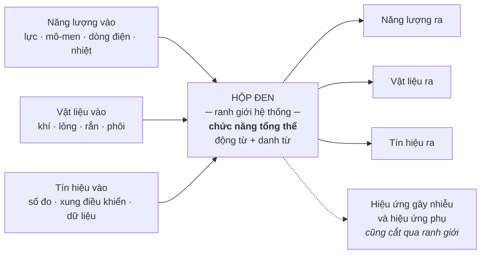
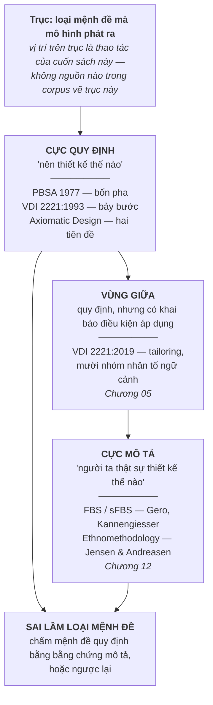

# Chương 02 — Thiết kế có hệ thống nghĩa là gì

Hai kỹ sư ngồi cùng bàn, cùng nhìn một bản vẽ, và bất đồng suốt một tiếng đồng hồ mà không ai nhận
ra họ đang nói về hai thứ khác nhau. Một người nói *quy trình này sai vì chẳng ai làm thế cả*.
Người kia nói *quy trình này đúng, và đó chính là lý do phải có nó*. Cả hai đều đúng, và cuộc cãi
vã không có lối thoát, vì hai câu ấy không mâu thuẫn — chúng thuộc hai loại mệnh đề khác nhau.
Không có bộ từ vựng để tách hai loại mệnh đề đó ra, phần còn lại của cuốn sách này sẽ đọc như một
chuỗi đả kích: Pahl-Beitz bị bắt lỗi, VDI bị bắt lỗi, ICDM bị bắt lỗi. Đó không phải điều đang xảy
ra, và một cuốn sách bị đọc nhầm như vậy sẽ mất người đọc ngay ở Phần IV.

Chương 01 đã đặt mẫu hình: một phương pháp đúng về kỹ thuật vẫn không sống được trong tổ chức, và
ba neo — canh bạc, mặt tiếp giáp, tầng đòn bẩy — mà mọi chương sau phải nối về. Nó cũng đã khai
ba giới hạn chứng cứ của chính cuốn sách trước khi đưa ra bất kỳ khẳng định nào. Chương này làm
phần việc còn thiếu: dựng bộ từ vựng để những khẳng định ấy có chỗ đứng. Không có bộ từ vựng, neo
*canh bạc* chỉ là một hình ảnh đẹp; có nó rồi, canh bạc trở thành thứ chỉ được ra bằng ngón tay.

Ba thứ đi ra khỏi chương này. **Một:** mọi đối tượng thiết kế là một phép biến đổi ba dòng chảy —
năng lượng, vật liệu, tín hiệu — và cách đọc đó quyết định anh đặt ranh giới hệ thống ở đâu.
**Hai:** trừu tượng hoá là điểm chung hiếm hoi mà cả phe quy định lẫn phe phê bình đều không cãi,
và lý do họ không cãi không phải vì nó dễ chịu mà vì nó là thuốc duy nhất chống lối mòn tư duy.
**Ba:** trục *quy định ↔ mô tả* — hai loại mệnh đề, hai loại bằng chứng, và một loại sai lầm rất
đắt khi lẫn lộn chúng. Chương 12 sẽ mở trục này ra hết cỡ; ở đây chỉ định nghĩa, đủ chặt để dùng.

---

## Một vật thể kỹ thuật là một phép biến đổi, không phải một hình khối

Đây là mệnh đề nền của toàn bộ phả hệ, và nó phản trực giác đúng ở chỗ kỹ sư ít ngờ nhất. Khi nghĩ
về một sản phẩm, cái hiện lên trong đầu là hình khối: vỏ, trục, mạch, khung. Thuyết hệ thống kỹ
thuật bảo rằng hình khối là thứ cuối cùng được quyết định, không phải thứ đầu tiên. Thứ đầu tiên
là **cái gì đi vào, cái gì đi ra, và biến đổi nào xảy ra ở giữa**.

Một thực thể kỹ thuật — dù là tổ hợp máy lớn hay một chi tiết — được coi là một hệ thống nối với
môi trường qua các dòng đầu vào và đầu ra cắt qua **ranh giới hệ thống** (*system boundary*). Bản
chất của mọi quá trình kỹ thuật là truyền dẫn và biến đổi ba đại lượng, và chỉ ba:

- **Năng lượng** — cơ, nhiệt, điện, hoá, quang; lực, mô-men, dòng điện.
- **Vật liệu** — khí, lỏng, rắn; phôi, chi tiết gia công, bán thành phẩm, thành phẩm.
- **Tín hiệu** — số đo, hiển thị, xung điều khiển, dữ liệu, thông tin.

Nguồn không trình bày ba dòng chảy như ba trường hợp loại trừ nhau. Nó nói ngược lại:
`"In most mechanical engineering applications, a combination of all three types of conversion is
usually involved..."` [1]. Đây là câu quan trọng hơn vẻ ngoài của nó. Nó có nghĩa: câu hỏi hữu ích
không phải *sản phẩm này thuộc dòng nào* mà là *dòng nào là dòng chính*, vì hai dòng còn lại luôn
có mặt ở vai trò phụ trợ. Bỏ qua sự phân biệt chính–phụ này là cách nhanh nhất để một cấu trúc
chức năng phình ra gấp ba mà không thêm được thông tin nào.

Hộp đen này là công cụ, không phải minh hoạ. Nó buộc người thiết kế phát biểu chức năng tổng thể
**trước khi** biết cơ cấu, ở dạng động từ cộng danh từ — *tăng áp suất*, *truyền mô-men*, *giảm
tốc độ* — một biểu diễn trừu tượng độc lập với giải pháp vật lý cụ thể [1]. Chương 09 sẽ dùng lại
chính hộp đen này làm bước đầu của chuỗi sinh giải pháp, và ở đó sẽ thấy rõ vì sao thứ tự hộp đen
→ cấu trúc chức năng → ma trận hình thái không đảo được.

Chỗ đáng chú ý trong sơ đồ là mũi tên đứt nét. Ranh giới hệ thống không chỉ cho các dòng mong muốn
đi qua. Nó cũng là đường mà nhiễu và hiệu ứng phụ đi qua, theo cả hai chiều. Vẽ hộp đen mà chỉ vẽ
sáu mũi tên liền nét là đã ngầm giả định một môi trường sạch — giả định gần như luôn sai, và sai
đúng vào lúc sản phẩm rời khỏi phòng thí nghiệm.

### Dòng chính quyết định anh đang thiết kế loại gì

Pahl-Beitz phân loại hệ thống kỹ thuật theo dòng chảy chính, không theo ngành và không theo kích
thước:

| Dòng chính | Loại hệ thống | Hệ quả cho cách đánh giá |
|---|---|---|
| Năng lượng | *Machines* — máy móc | Tiêu chí hiệu suất, tổn hao, tải trọng dẫn dắt |
| Vật liệu | *Apparatus* — thiết bị công nghệ | Tiêu chí lưu lượng, độ tinh khiết, thời gian lưu dẫn dắt |
| Tín hiệu | *Devices* — dụng cụ, thiết bị đo | Tiêu chí độ phân giải, độ trễ, nhiễu dẫn dắt |

Cột thứ ba là suy luận của cuốn sách, không phải của nguồn — nguồn chỉ phân loại ba nhóm theo dòng
chính [1]. Nhưng suy luận ấy là chỗ bảng này có ích. Một sản phẩm có dòng chính là **tín hiệu**
nhưng được chấm bằng bộ tiêu chí của một sản phẩm dòng năng lượng sẽ liên tục thắng ở những chỗ
không ai cần và thua ở chỗ quyết định. Đó là chế độ hỏng thường trực ở những đội vừa chuyển từ cơ
khí thuần sang cơ–điện–phần mềm, và nó hỏng ở tầng từ vựng chứ không phải ở tầng kỹ thuật. Chương
10 sẽ quay lại đây khi bàn về việc ai được quyền cho điểm và thang điểm nói gì về người lập ra nó.

Và nguồn cũng không nói rằng mọi sản phẩm đều có đúng một dòng chính — **Chương 06 sẽ gặp loại sản
phẩm không có**, nơi một chức năng chạy xuyên ba miền và không thuộc miền nào. Ép một nhãn duy nhất
lên loại sản phẩm ấy là một chế độ hỏng riêng, ngược chiều với chế độ hỏng vừa mô tả: không phải
gán sai nhãn, mà là gán nhãn ở chỗ lẽ ra không nên gán.

Còn một câu hỏi mà mục này mở ra rồi bỏ lửng, và nó là câu hỏi tổ chức chứ không phải câu hỏi kỹ
thuật: **ai có quyền vẽ ranh giới hệ thống?** Nguồn `[1]` mô tả ranh giới như một thao tác phân
tích, như thể nó tự hiện ra khi nhìn đúng. Trong một tổ chức thật thì nó là một quyết định có
người ký: kéo ranh giới rộng ra là nhận thêm việc và thêm trách nhiệm, thu hẹp lại là đẩy phần khó
sang chỗ khác dưới danh nghĩa "ngoài phạm vi". Corpus không có tài liệu nào nói ai ký. Chương 13
quay lại đúng chỗ trống này.

> ⚠ **Cảnh báo thuật ngữ.** *Ba dòng chảy* của thuyết hệ thống kỹ thuật (năng lượng, vật liệu, tín
> hiệu) **không phải** *ba luồng song song* của VDI 2206 bản 2021. Hai thứ trùng nhau ở con số ba
> và không trùng gì khác. Chương 07 dùng cụm thứ hai; cuốn sách này luôn ghi rõ năm khi nói về VDI
> 2206. Đối chiếu này là của sách, không nguồn nào đặt hai cụm cạnh nhau để cảnh báo.

### Bốn mức: từ chức năng xuống hình khối

Ba dòng chảy chỉ là tầng trên cùng. Bên dưới nó, thuyết hệ thống kỹ thuật xếp bốn mối quan hệ
tương tác thành một chuỗi hạ dần độ trừu tượng [1]:

| Mức | Tên gốc | Nội dung | Câu hỏi nó trả lời |
|---|---|---|---|
| 1 | *Functional interrelationship* | Chức năng tổng thể → chức năng con, nối bằng logic Boolean | Sản phẩm **phải làm gì** |
| 2 | *Working interrelationship* | Hiệu ứng vật lý + đặc tính hình học và vật liệu tại vị trí làm việc | Nó **làm bằng cách nào** |
| 3 | *Constructional interrelationship* | Chi tiết, mối nối, cụm lắp ráp, ràng buộc sản xuất và vận chuyển | Nó **được dựng ra sao** |
| 4 | *System interrelationship* | Quan hệ với người dùng và môi trường | Nó **sống ở đâu**, và bị nhiễu gì |

Mức 2 là chỗ đáng dừng lại. Nguyên lý hoạt động không phải một ý tưởng; nó là **một hiệu ứng vật
lý cộng một hình học cụ thể**. Định luật ma sát Coulomb chưa phải nguyên lý hoạt động. Định luật
ma sát Coulomb tác dụng lên một cặp bề mặt có loại, hình dạng, vị trí, kích thước và số lượng xác
định — đó mới là nguyên lý hoạt động [1]. Phân biệt này là thứ Chương 09 sẽ dựa vào để giải thích
vì sao một ma trận hình thái điền bằng danh từ sản phẩm luôn cho ra kết quả nghèo hơn một ma trận
điền bằng nguyên lý: danh từ sản phẩm đã gói sẵn cả hiệu ứng lẫn hình học vào một cục không tháo
ra được, nên nó không tổ hợp được với gì.

Mức 4 mang một chi tiết mà phần lớn người đọc lướt qua: hệ thống chịu cả **hiệu ứng gây nhiễu** và
**hiệu ứng phụ không mong muốn**, bên cạnh hiệu ứng mong muốn, hiệu ứng đầu vào và hiệu ứng phản
hồi [1]. Nghĩa là mô hình gốc đã dành chỗ cho cái ngoài ý muốn ngay từ đầu. Điều này quan trọng
khi Phần IV chất vấn phương pháp: các tác giả không hề bỏ quên tính bất định của thế giới vật lý.
Cái họ bỏ quên nằm ở chỗ khác — ở tổ chức — và Chương 13 sẽ đếm đủ năm chỗ.

---

## Trừu tượng hoá: chỗ duy nhất cả hai phe bắt tay nhau

Trừu tượng hoá là bước đầu của pha ý tưởng: gạt bỏ định kiến cá nhân, bỏ qua yêu cầu không chạm
tới chức năng chính, chuyển dữ liệu định lượng thành định tính, khái quát hoá, rồi phát biểu bài
toán ở dạng **trung lập với giải pháp** (*solution-neutral*) [1].

Một ghi chú về phép đếm, và nó là ghi chú kiểu mẫu cho cả cuốn sách. Danh sách vừa nêu gồm năm ý.
Nguồn **không** viết ra rằng có năm bước. Tệp khai thác ghi thẳng rằng con số năm *hoàn toàn là do
tự tổng hợp bằng cách đếm các gạch đầu dòng*, và văn bản gốc không có khẳng định trực tiếp nào về
số lượng ấy. Vậy nên câu đúng là *"kỹ thuật trừu tượng hoá gồm những thao tác sau"*, không phải
*"quy trình trừu tượng hoá năm bước"*. Cùng lớp bẫy đó áp cho chuỗi cụ thể hoá, nơi văn bản đánh
số một danh sách mà không câu nào đếm — **Chương 03 mở ca đó ra đầy đủ**, kèm câu mà chính hai tác
giả viết ngay trước danh sách để phủ nhận rằng đó là một kế hoạch — và cho các quy tắc cơ bản của
pha cụ thể hoá. Đọc
kỹ ba trường hợp này thì thấy một mẫu hình: **các tác giả đánh số công việc, họ không tuyên bố số
lượng.** Người đọc sau đó tuyên bố hộ, và con số ấy đi vào giáo trình, rồi đi vào slide đào tạo,
rồi đi vào quy trình nội bộ — nơi nó trở thành một danh mục phải tick đủ.

### Vì sao phe quy định cần trừu tượng hoá

Phía quy định cần nó vì nó là cơ chế duy nhất mở rộng không gian giải pháp một cách có kỷ luật.
Phát biểu *"thiết kế cơ cấu đẩy dùng lò xo thép"* đã đóng khung xong bài toán trước khi tìm kiếm
bắt đầu. Phát biểu *"tích trữ và giải phóng năng lượng cơ học đột ngột"* để ngỏ lò xo, khí nén,
thuỷ lực, điện từ. Chênh lệch giữa hai phát biểu không phải chênh lệch về văn phong — nó là chênh
lệch về **số phương án tồn tại**. Phát biểu thứ nhất không loại bỏ ba phương án kia bằng lập luận;
nó loại bỏ chúng bằng cách khiến chúng không bao giờ được nghĩ tới.

### Vì sao phe phê bình cũng không bác nó

Tuyến phê bình đánh gần như mọi thứ khác của phương pháp hệ thống: tính tuyến
tính, giả định thác nước, sự mù mịt trước chính trị nội bộ, gánh nặng tài liệu. Nhưng không tuyến
nào trong corpus này lập luận rằng *người thiết kế nên bỏ trừu tượng hoá đi*. Lý do nằm ở một câu
mà chính Pahl-Beitz viết ra, về kinh nghiệm:

> `"Frankenberger [12.5] observed in his research that experience does have a large positive
> effect but can also have a negative effect when that experience leads to inflexibility and
> fixation."` [1]

Kinh nghiệm làm kỹ sư nhanh hơn và đồng thời làm kỹ sư cứng hơn. Càng nhiều giải pháp mẫu trong
đầu, xác suất một bài toán mới bị đọc thành một bài toán cũ càng cao. **Lối mòn tư duy (fixation)
là bệnh nghề nghiệp của người giỏi, không phải của người kém** — và đó chính là lý do không ai bác
được thuốc chữa nó. Trừu tượng hoá là thao tác duy nhất trong cả phả hệ nhắm thẳng vào chỗ này: nó
cắt liên kết giữa phát biểu bài toán và kho giải pháp cũ, ép người thiết kế đọc lại bài toán bằng
mắt của người chưa từng giải nó.

Sự đồng thuận này cho một quy tắc làm việc: **khi hai phe đối lập cùng
không đụng tới một công cụ, công cụ đó nhiều khả năng là phần cứng nhất của phương pháp.** Quy tắc
ấy là suy luận từ sự vắng mặt của lời phê bình, không nguồn nào phát biểu nó; nhưng nó cho một
cách xếp ưu tiên rất thực dụng khi phải cắt bớt quy trình. Chương 12 và Chương 13 sẽ dỡ gần hết
những phần còn lại của phương pháp; trừu tượng hoá đứng nguyên qua cả hai.

> **Đào sâu: cái giá của trừu tượng hoá, do chính tác giả ghi**
>
> Pahl-Beitz không bán trừu tượng hoá như thuốc bổ. Họ liệt kê giá của nó, và giá không rẻ.
> **Danh sách tự thú ấy có nhà chính ở Chương 03**, mục *Những gì chính hai tác giả nhận là hỏng*,
> nơi nó được trích trọn vẹn và đọc như bằng chứng nội tại. Ở đây chỉ cần một câu gốc và một bảng
> gọn, vì mục này bàn về **công cụ** chứ không bàn về lời tự thú.
>
> Câu gốc, vì nó chứa cả hai mặt trong một câu:
> `"A comparison between the functional representations in Figures 2.5 and 2.8 shows that the
> description that uses generally valid functions has a higher level of abstraction. For this
> reason, it leaves open all possible solutions and makes a systematic approach easier. However,
> using generally valid functions can represent a problem because such an abstract level can
> sometimes hin-der the direct search for solutions."` [1]
>
> Mức trừu tượng cao mở ngỏ mọi giải pháp **và** có thể chặn đường tìm giải pháp trực tiếp — cùng
> một thuộc tính, hai chiều tác dụng. Bốn khoản giá mà nguồn `[1]` ghi ra:
>
> | Giá | Nội dung | Nguyên văn in ở |
> |---|---|---|
> | Trừu tượng quá tay | chức năng có giá trị tổng quát nhiều khi quá chung để dẫn sang giải pháp, nhất là trong công nghiệp | Ch03 |
> | Trung lập với giải pháp là lý tưởng không đạt được | cấu trúc chức năng hiếm khi sạch tiền giả định vật lý; số giải pháp vẫn bị thu hẹp | Ch03 |
> | Người thật thấy nó khó chịu | kỹ sư quen nghĩ bằng vật thể và hình ảnh hơn bằng chức năng trừu tượng | Ch03 |
> | Thời gian | cách tiếp cận theo tiến trình đòi nhiều thời gian hơn và dễ làm phình không gian giải pháp | Ch03; con số 60% thì ở ngay dưới đây |
>
> Khoản thứ hai đáng dừng lại: định kiến không bị xoá, nó bị đẩy xuống chỗ khó nhìn thấy hơn. Ai
> tin rằng cấu trúc chức năng của mình hoàn toàn sạch định kiến thì đã mắc đúng cái bẫy mà công cụ
> này định gỡ. Và một câu nữa thuộc riêng mục này, vì nó nói về **công cụ** chứ không về trừu
> tượng hoá:
> `"Discursive solution methods such as classification schemes and morphological matrices
> initially cause some difficulties because the appropriate but abstract classifying criteria and
> their characteristics are not, or not fully, recognised."` [1]
>
> Bốn khoản trên đều nằm trong chính cuốn sách bị phê bình. Đó là dữ kiện đáng giữ lấy: **phần lớn
> lời buộc tội nặng nhất đối với phương pháp hệ thống đã có sẵn trong sách gốc.** Điều tuyến phê
> bình về sau bổ sung không phải là các nhược điểm kỹ thuật ấy — mà là cái nằm ở mặt tiếp giáp với
> tổ chức, thứ mà sách gốc không có công cụ để nhìn. Ai đọc Phần IV như một bản cáo trạng mới đã
> bỏ lỡ điều đó.

Một con số hay bị trích lẻ ở chỗ này, và nó là ca mẫu cho việc trích đủ ngữ cảnh. Có câu:
`"From research in industry and universities [6.8], it is known that calculating and
representation add up to 60% of the total time spent on conceptual design."` [1] — nghe như bằng
chứng rằng pha ý tưởng tốn kém khủng khiếp. Nhưng cùng nguồn còn một câu nữa, và câu ấy làm con số
nhỏ lại: `"However, the time normally needed in this phase for concretising ideas into principle
solutions, for example through rough calculations, developing solutions, and analyses of various
layouts, is about the same as when a systematic approach is not used, that is, around 60 to
70%."` [1]. Đọc cả hai thì kết luận đảo chiều: tỷ lệ ấy **xấp xỉ bằng nhau dù có dùng phương pháp
hệ thống hay không**. Trích câu đầu mà bỏ câu sau là xuyên tạc nguồn bằng chính chữ của nguồn — và
đó là kiểu xuyên tạc khó bắt nhất, vì từng chữ đều kiểm tra được.

---

## Quy định và mô tả: hai loại mệnh đề, hai loại bằng chứng

Định nghĩa, ngắn, và dùng nguyên như thế suốt cuốn sách:

- **Quy định** (*prescriptive*) — mệnh đề nói **nên** thiết kế thế nào. Nó là chỉ dẫn hành động.
  Kiểm chứng nó bằng câu hỏi *làm theo thì có ra kết quả tốt hơn không*.
- **Mô tả** (*descriptive*) — mệnh đề nói người ta **thật sự** thiết kế thế nào. Nó là báo cáo
  quan sát. Kiểm chứng nó bằng câu hỏi *quan sát có khớp không*.

PBSA thuộc phe thứ nhất, và nguồn phê bình gọi tên nó rõ ràng:
`"One of the most detailed and widely referenced prescriptive models of designing is the
'Systematic Approach' developed by Pahl & Beitz (Reference Pahl and Beitz 2007), which was first
published in German in 1977."` [31]. Cùng nguồn ghi bốn pha bằng một câu tự đếm — khác với trường
hợp năm bước ở trên, chỗ này con số nằm trong nguyên văn:
`"Pahl and Beitz' Systematic Approach (in this paper referred to as PBSA) describes engineering
design as a sequence of four phases: (1) Task Clarification, (2) Conceptual Design, (3) Embodiment
Design, and (4) Detail Design."` [31].

Việc xếp các trường phái lên một trục là **thao tác của cuốn sách này**. Không tài liệu nào trong
corpus vẽ trục ấy; nguồn [2] có nói VDI 2221 và Axiomatic Design được xếp vào nhóm quy định, phần
còn lại — đặc biệt là sự tồn tại của một vùng giữa — là tổng hợp. Ghi rõ ở đây để không chỗ nào
sau này trình bày sơ đồ trên như phát hiện của nguồn.

### Bằng chứng của phe mô tả, và điều nó thật sự chứng minh

Kannengiesser & Gero làm một việc gọn: lấy PBSA, ánh xạ toàn bộ hoạt động của nó lên khung nhận
thức sFBS, rồi so đường cong tích luỹ của mô hình với đường cong đo được từ người thật.

Số liệu, tất cả đều có nguyên văn [31]:

`"Mapping all activities defined in PBSA onto the sFBS framework results in 87 elementary steps
coded in terms of FBS design issues..."` và `"This results in a total of 235 steps, as some of the
87 elementary steps are repeated..."` — mô hình lý thuyết quy về **87 bước tiểu học**, chạy lặp
thành **235 bước**.

`"The behavioural observations used in this study are based on protocols of 15 design sessions...
and 31 design sessions of the students using various concept generation methods."` cùng
`"All 46 design sessions covered an entire design process from requirements specification to
solution description."` — **46 phiên** thiết kế, gộp từ 15 và 31.

`"Each team used the same room and were given the same instructions that included a specified
available time of 45 minutes."` — **45 phút** mỗi phiên, cùng phòng, cùng chỉ dẫn.

`"'Yes' if the first occurrence of the design issue is within the first 25 design steps..."` —
ngưỡng đo "xuất hiện sớm" là **25 bước đầu**.

Đối tượng là sinh viên cơ khí sau năm thứ nhất, làm bài trong 45 phút — không phải kỹ sư công
nghiệp trong một dự án thật. Đó là giới hạn của thí nghiệm, và nó phải được nói ra cùng lúc với
kết luận:

> `"Therefore, it can be concluded that the differences between the model and the empirical data
> rather indicate that PBSA seems to be incomplete as a predictive model of designing since it
> does not predict designers' early focus on generating solutions."` [31]

Người thật nhảy vào cấu trúc vật lý ngay trong hai mươi lăm bước đầu. Mô hình bảo rằng cấu trúc
chỉ nên xuất hiện sau. Thêm một câu nữa về hình dạng của mô hình:
`"On the other hand, the 'phase-based' character of PBSA clearly favours a 'waterfall' view where
iterations are to occur only within a phase..."` [31] — vòng lặp được phép chạy trong pha, không
được phép chạy xuyên pha.

Kết luận trên nói PBSA **chưa hoàn thiện với tư cách
một mô hình tiên đoán**. Nó không nói PBSA là một mô hình quy định tồi. Đó là hai mệnh đề khác
nhau về hai loại mô hình khác nhau, và bằng chứng cho cái này không phải bằng chứng cho cái kia.
Một biển báo cấm vượt đèn đỏ không bị bác bỏ bởi số liệu đếm được bao nhiêu người vượt đèn đỏ.

Nhưng — và đây là chỗ phe mô tả có lý — số liệu ấy **không vô nghĩa**. Nếu tuyệt đại đa số người
vượt đèn đỏ thì biển báo đang hỏng ở một tầng khác: không sai về nội dung, mà sai ở giả định rằng
chỉ cần treo biển là đủ. Chuyển đúng câu này sang thiết kế thì ra luận đề của cuốn sách. Bốn mươi
sáu phiên thiết kế không chứng minh Pahl-Beitz sai. Chúng chứng minh rằng **Pahl-Beitz đã đặt cược
vào một hành vi mà con người không tự nhiên có** — và đó là canh bạc, đúng nghĩa đen của neo thứ
nhất. Cách đọc này là diễn giải của sách; nguồn [31] chỉ dừng ở chữ *incomplete*. Chương 12 sẽ
khai thác đủ cả tuyến bằng chứng; ở đây chỉ cần giữ lấy sự phân biệt.

### Khi ranh giới hai loại mệnh đề nhoè đi

Tuyến ethnomethodology đẩy xa hơn: họ nói ranh giới ấy trên thực tế khó vạch. Một cẩm nang quy
định trôi quá xa khỏi vận hành hàng ngày thì phản tác dụng, vì người dùng không đọc nó như đường
ray mà như một **nguồn lực** huy động để giải trình quyết định. Lời buộc tội nặng nhất của họ:

> `"It appears to us that Pahl & Beitz have confused the result of design method and the process
> of using a design methods."` và `"Pahl & Beitz's error, we suggest, is their implicit assumption
> that neat processes must logically precede neat results."` [43]

Bản vẽ cuối cùng gọn gàng. Từ đó suy ra tiến trình dẫn tới nó cũng phải gọn gàng — đó là bước nhảy
mà Jensen & Andreasen gọi là sai lầm. Trật tự của sản phẩm cuối là thứ **nảy sinh** từ một tiến
trình lộn xộn, chứ không phải dấu vết của một tiến trình ngăn nắp. Cần công bằng với hai tác giả
gốc ở đây: đây là một cách đọc, được rút từ khảo sát học viên cao học tại một trường, chứ không
phải một định lý. Nhưng nó chỉ đúng chỗ đau, và chỗ đau ấy là câu tiếp theo:

> `"This starting point, we suggest, makes it exceedingly hard for Pahl & Beitz to see method use
> as a social, political or organizational process and it makes it almost impossible to imagine
> that the goals of methods-related activities can be any other than getting the information
> right."` [43]

Coi người thiết kế là một bộ xử lý thông tin thì mọi vấn đề của phương pháp đều quy về *thông tin
chưa đủ đúng*. Cách đọc ấy không có chỗ cho câu hỏi *ai được lợi khi bước này được làm đầy đủ*.
Mặt tiếp giáp với tổ chức nằm chính ở khoảng trống đó, và Phần IV được dựng lên để lấp nó.

---

## Vì sao trục này là canh bạc chứ không phải chuyện học thuật

Một phương pháp quy định phát ra mệnh đề *nên làm thế này*. Mệnh đề đó chỉ có hiệu lực nếu tổ chức
đủ điều kiện làm theo. Vậy nên **mỗi phương pháp quy định đã ngầm mô tả một tổ chức** — tổ chức mà
trong đó lời khuyên ấy thi hành được. Đó là canh bạc: không ai viết bản mô tả tổ chức ấy ra, nhưng
nó tồn tại, và nó là điều kiện tiên quyết.

Canh bạc ấy được thanh toán thế nào ngoài đời:

**Quy trình bị bẻ dưới áp lực.** `"Many other cases from our students indicate that the steps of
methods are routinely changed, skipped, or squeezed as a result of various pressures such as lack
of time and money."` [43] — bị đổi, bị bỏ, bị bóp. Không phải đôi khi, mà **thường lệ**.

**Quy trình chính thức không phải nơi công việc sinh ra.** `"...revealed that a large number of the
company's projects (roughly 30%) were results of other initiatives than the formal technology
planning."` [43] — **khoảng 30%** dự án của một công ty kỹ thuật lớn đến từ ngoài quy trình hoạch
định chính thức. Đây là con số về **một** công ty trong một khảo sát học viên, không phải hằng số
ngành; nhắc lại điều đó vì nó là con số duy nhất trong corpus đo được khoảng cách giữa quy trình
giấy và quy trình thật, và một con số duy nhất rất dễ bị nâng lên thành quy luật.

**Tài liệu hoá quá mức là hành vi phòng thân, không phải hành vi kỷ luật.**
`"These methods-users would often attempt to live up to the maximum requirements despite the
nature of the specific project. Only seasoned project managers seemed to 'dare' to use the
flexibility of the method."` [43] — kỹ sư trẻ làm đủ mọi yêu cầu tài liệu bất kể quy mô dự án, vì
làm đủ thì không bị đổ lỗi. Chỉ người dày dạn mới **dám** cắt. Chữ *dare* nằm trong nguyên văn, và
nó tố cáo rằng tính linh hoạt của phương pháp trên giấy là một quyền mà thực tế phải có thâm niên
mới dùng được. Một quy trình có điều khoản linh hoạt mà không ai dám dùng thì trên thực tế là một
quy trình cứng — bất kể văn bản viết gì.

Cộng lại: phương pháp quy định giả định một tổ chức có thời gian, có tiền, và có cơ chế bảo vệ
người dám bỏ bước. Ba giả định, không cái nào được viết ra. Từ phía công nghiệp, nguồn [2] tổng
kết đúng danh sách phản đối này:

> `"A key criticism revolves around the limited acceptance and applicability of prescriptive
> design methods in industrial settings. Criticisms include the high time investment, abstraction
> constraints, creativity limitations, inflexibility, overly rigid regulations, overemphasis on
> logical sequences and complex processes, and the focus on new designs rather than variant or
> adaptation designs."` [2]

Và từ phía hành vi: `"In practice, often a mix of intuitive and experience-based behaviour can be
found... Design work in industry is marked by a lot of restrictions, e.g. lack of resources and
high time pressure."` [14] Đáng chú ý là mục cuối trong danh sách của [2]: phương pháp quy định
tập trung vào **thiết kế mới** chứ không vào thiết kế biến thể hay cải tiến. Phần lớn công việc
thật của một xưởng vừa là biến thể và cải tiến. Nghĩa là canh bạc còn có một vế nữa: nó cược rằng
loại công việc mà nó phục vụ chiếm phần đáng kể trong khối lượng thật.

Chương 13 sẽ dựng năm giả định tổ chức thành một bảng người đọc tự chấm được. Ở đây chỉ cần thấy
cơ chế: **loại mệnh đề quyết định loại giả định.** Mệnh đề quy định luôn kéo theo một giả định tổ
chức; mệnh đề mô tả thì không. Đó là lý do trục này không phải chuyện phân loại học thuật mà là
một công cụ chẩn đoán — và nó chẩn đoán được ngay trong tuần, xem mục cuối chương.

Lăng kính tầng đòn bẩy mà Phần V dùng để giải thích *vì sao biết rồi mà vẫn không làm được* đến từ
ngoài ngành thiết kế, và việc ghép nó vào đây là thao tác của cuốn sách này — Chương 01 đã khai
báo, và mỗi chương dùng tới nó sẽ nhắc lại một câu.

---

## Bộ từ vựng làm việc, và chỗ mỗi mục được dùng lại

Chương này cố ý không giới thiệu thêm khái niệm nào ngoài bảng dưới. Mỗi dòng đều có ít nhất một
chương sau dùng lại; dòng nào không có đã bị cắt khỏi bản thảo.

| Khái niệm | Nghĩa dùng trong sách | Dùng lại ở |
|---|---|---|
| Ba dòng chảy — năng lượng, vật liệu, tín hiệu | Đối tượng thiết kế là phép biến đổi ba dòng, thường đồng thời cả ba | Ch03, Ch09 |
| Ranh giới hệ thống · hộp đen | Đường cắt quyết định cái gì nằm trong bài toán | Ch09, Ch11 |
| Dòng chính | Dòng quyết định loại hệ thống và bộ tiêu chí đánh giá | Ch09, Ch10 |
| Chức năng tổng thể · cấu trúc chức năng | Biểu diễn động từ + danh từ, độc lập với giải pháp vật lý | Ch03, Ch09 |
| Nguyên lý hoạt động | Hiệu ứng vật lý **cộng** hình học và vật liệu tại vị trí làm việc | Ch09, Ch10 |
| Trừu tượng hoá · trung lập với giải pháp | Cắt liên kết giữa phát biểu bài toán và kho giải pháp cũ | Ch03, Ch09, Ch12 |
| Lối mòn tư duy (*fixation*) | Tác dụng phụ của kinh nghiệm; lý do tồn tại của trừu tượng hoá | Ch09, Ch12 |
| **Quy định** (*prescriptive*) | Mệnh đề *nên thiết kế thế nào* | Ch04, Ch05, Ch12 |
| **Mô tả** (*descriptive*) | Mệnh đề *người ta thật sự thiết kế thế nào* | Ch12, Ch13 |
| FBS · sFBS | Khung nhận thức của phe mô tả, dùng để đo hành vi thật | Ch12 |
| Sai lầm loại mệnh đề | Chấm mệnh đề quy định bằng bằng chứng mô tả, hoặc ngược lại | Ch12, Ch14 |
| Canh bạc tổ chức | Tập giả định ngầm mà mệnh đề quy định đặt vào tổ chức | Ch13, Ch18 |

Ba thứ **không** được định nghĩa ở đây dù chương này chạm tới: ma trận hình thái (*morphological
chart*, Ch09), nổ tổ hợp (Ch11), và tailoring (Ch05). Chúng có nhà riêng, và định nghĩa hai lần là
cách nhanh nhất để hai định nghĩa lệch nhau.

---

## Áp dụng ở Xưởng

Bối cảnh giả định suốt cuốn sách: một xưởng cơ khí — điện tử — phần mềm nhúng, quy mô vài chục
người, làm cả phát triển sản phẩm mới lẫn cải tiến biến thể.

### 1. Viết lại một phát biểu bài toán đang chạy, trong tuần này

Chọn **một** nhiệm vụ thiết kế đang mở. Lấy phát biểu bài toán hiện có — thường nằm ở dòng đầu của
tờ giao việc — và kiểm một điều duy nhất: **nó có chứa tên cơ cấu, tên vật liệu, hay tên một giải
pháp không?** Nếu có, viết lại thành một câu động từ cộng danh từ, không tên gì cả, rồi đặt hai
phát biểu cạnh nhau trong cuộc họp gần nhất và hỏi: *phát biểu thứ hai mở ra phương án nào mà phát
biểu thứ nhất đã đóng?*

Hết tuần có hai kết quả, và cả hai đều dùng được. Hoặc không phương án mới nào xuất hiện — bài
toán thật sự đã bị ràng buộc, và giờ điều đó được **biết** thay vì được đoán, nên pha ý tưởng có
thể rút ngắn một cách có căn cứ. Hoặc có phương án mới xuất hiện, nghĩa là không gian giải pháp
vừa bị thu hẹp bởi một câu chữ chứ không phải bởi một ràng buộc kỹ thuật. Đây là bài kiểm fixation
rẻ nhất tồn tại, nó chạy xong trong một buổi, và nó không đòi ai phải học phương pháp nào.

### 2. Dán nhãn dòng chính cho từng sản phẩm trong danh mục

**Vấn đề nó giải:** các cuộc họp đánh giá thiết kế mang theo bộ tiêu chí quen thuộc của xưởng thay
vì bộ tiêu chí mà sản phẩm cần, nên một sản phẩm dòng tín hiệu bị chấm như sản phẩm dòng năng
lượng và thua ở đúng chỗ quyết định.

**Cách áp:** mỗi sản phẩm trong danh mục nhận đúng **một** nhãn dòng chính — năng lượng, vật liệu,
hay tín hiệu — ghi ngay đầu hồ sơ; bộ tiêu chí đánh giá của sản phẩm đó phải bắt đầu từ nhãn ấy.

**Bẫy:** nhãn được gán theo phòng ban phụ trách chứ không theo dòng chảy thật — một sản phẩm do
nhóm cơ khí chủ trì vẫn có thể có dòng chính là tín hiệu, và gán nhầm sẽ khoá bộ tiêu chí sai suốt
vòng đời.

### 3. Tách hai loại câu hỏi trong biên bản đánh giá thiết kế

**Vấn đề nó giải:** biên bản trộn lẫn *đội đã làm gì* với *đội nên làm gì tiếp*, nên phần mô tả bị
đọc thành lời khiển trách và người dự họp bắt đầu báo cáo cái đáng lẽ phải làm thay vì cái đã làm.

**Cách áp:** biên bản chia đôi cột — cột **mô tả** ghi diễn biến quan sát được, cột **quy định**
ghi việc phải làm và người chịu trách nhiệm; không câu nào được nằm ở cả hai cột.

**Bẫy:** cột mô tả bị dùng làm căn cứ đánh giá nhân sự — xảy ra một lần thôi là từ đó về sau cột
ấy chỉ còn chứa những gì an toàn để ghi, và công cụ chết mà không ai báo tử.

### 4. Đặt trần thời gian cho pha trừu tượng hoá, và tuyên bố rõ nó là trần

**Vấn đề nó giải:** pha trừu tượng hoá không có tiêu chí dừng tự nhiên — luôn còn một mức tổng
quát hơn để leo lên — nên nó hoặc bị bỏ hẳn vì sợ tốn, hoặc nuốt mất phần thời gian dành cho tính
toán khả thi, là phần thật sự quyết định concept đứng hay đổ.

**Cách áp:** ấn định một trần thời gian cho bước phát biểu bài toán trung lập và dựng cấu trúc
chức năng, nói rõ đó là trần chứ không phải định mức, và khi chạm trần thì chốt bản đang có rồi đi
tiếp.

**Bẫy:** trần bị hiểu thành mục tiêu, và đội tiêu hết trần mỗi lần, kể cả với bài toán biến thể mà
cấu trúc chức năng đã có sẵn nguyên vẹn từ dự án trước.

### 5. Ghi lại chỗ quy trình bị bỏ bước, tách khỏi việc quy trách nhiệm

**Vấn đề nó giải:** không ai trong xưởng biết quy trình thật khác quy trình trên giấy ở chỗ nào,
nên mọi cải tiến quy trình đều sửa vào bản giấy — bản không được thi hành.

**Cách áp:** mỗi dự án đóng lại kèm một dòng duy nhất — bước nào của quy trình đã bị bỏ, bị gộp,
hoặc bị làm ngược thứ tự, và vì áp lực gì; không cần lý do chính đáng, chỉ cần sự thật. Sau vài dự
án, những bước bị bỏ lặp đi lặp lại chính là chỗ quy trình giấy đang đòi một tổ chức không tồn tại.

**Bẫy:** dòng ghi đó bị đưa vào hồ sơ đánh giá cá nhân. Nguồn đã đo được chế độ hỏng này — người
ta làm đủ mọi yêu cầu tài liệu để khỏi bị đổ lỗi, và chỉ ai đủ thâm niên mới dám cắt bước. Nếu
việc ghi lại chỗ bỏ bước trở thành bằng chứng chống lại người ghi, xưởng sẽ có một sổ ghi rất đẹp
và không một dòng nào đúng.

---

## Sổ kiểm của chương

- **Neo luận đề:** **Canh bạc**. Nối rõ ở mục *Vì sao trục này là canh bạc chứ không phải chuyện
  học thuật* — mệnh đề quy định luôn kéo theo một giả định tổ chức không được viết ra; và ở đoạn
  đóng mục *Bằng chứng của phe mô tả* — 46 phiên thiết kế không chứng minh Pahl-Beitz sai, chúng
  chứng minh Pahl-Beitz đặt cược vào một hành vi mà con người không tự nhiên có.
- **Nguồn đã dùng:** [1] (c1, mục `systems`), [31], [43], [2], [14] (c7, mục `pahlbeitz` và
  `vdi2221-res`).
- **Con số có nguyên văn:**
  - *ba kiểu biến đổi* — `"In most mechanical…"` [1]
  - *bốn pha* — `"Pahl and Beitz'…"` [31]
  - *1977* — `"One of the most…"` [31]
  - *60% thời gian pha ý tưởng* — `"From research in…"` [1], kèm câu làm nó nhỏ lại
    `"However, the time…"` [1] (khoảng 60–70%, xấp xỉ bằng khi không dùng phương pháp hệ thống)
  - *87 bước tiểu học* — `"Mapping all activities…"` [31]
  - *235 bước* — `"This results in…"` [31]
  - *15 + 31 = 46 phiên* — `"The behavioural observations…"` và `"All 46 design…"` [31]
  - *45 phút* — `"Each team used…"` [31]
  - *25 bước đầu* — `"'Yes' if the…"` [31]
  - *khoảng 30% dự án ngoài quy trình chính thức* — `"…revealed that a…"` [43], đã ghi kèm cỡ mẫu
    là một công ty trong một khảo sát học viên
- **Con số đã BỎ vì không có nguyên văn:**
  - *năm bước trừu tượng hoá* — tệp khai thác ghi rõ con số này do tự đếm gạch đầu dòng; chương
    viết *"gồm những thao tác sau"*, không đánh số, và nói thẳng rằng nguồn không tự đếm
  - *mười lăm bước cụ thể hoá* — chương này **không nêu con số**, chỉ nhắc ca đó như ví dụ về lớp
    bẫy và trỏ sang Ch03, nơi con số đi kèm câu phủ nhận nguyên văn của chính hai tác giả
  - *ba quy tắc cơ bản của pha cụ thể hoá* — cùng lý do; chương viết "các quy tắc cơ bản", bỏ số
  - *sáu bước quy trình giải quyết vấn đề tổng quát* — không có câu đếm trong nguồn, đã bỏ hẳn
  - *năm loại hiệu ứng ở mức 4* — nguồn liệt kê đủ tên nhưng không có câu đếm; chương gọi tên
    từng loại, không viết con số
  - *sáu vấn đề thiết kế của FBS* — có nguyên văn, nhưng chương không cần con số này; FBS chỉ được
    nhắc ở mức tên gọi, con số để dành Ch12
- **Chỗ là suy luận của tác giả, không phải của nguồn:**
  - Trục *quy định ↔ mô tả* cùng vị trí các trường phái — đã khai báo ngay dưới sơ đồ. Nguồn [2]
    chỉ nói VDI 2221 và Axiomatic Design thuộc nhóm quy định; việc dựng thành một trục có vùng
    giữa là thao tác của sách.
  - Quy tắc *"khi hai phe đối lập cùng không đụng tới một công cụ, công cụ đó là phần cứng nhất
    của phương pháp"* — suy luận từ sự vắng mặt của lời phê bình; không nguồn nào phát biểu, đã
    ghi rõ trong văn bản.
  - Cách đọc *"46 phiên chứng minh canh bạc, không chứng minh sai"* — diễn giải của sách; nguồn
    [31] chỉ kết luận PBSA *incomplete as a predictive model*, và điều này đã được nói ra tại chỗ.
  - Cột *"hệ quả cho cách đánh giá"* trong bảng dòng chính — suy luận của tác giả; nguồn [1] chỉ
    phân loại *machines / apparatus / devices* theo dòng chính.
  - Cảnh báo thuật ngữ *ba dòng chảy ≠ ba luồng VDI 2206:2021* — đối chiếu của sách, lấy từ
    glossary Phase 2; không nguồn nào đặt hai cụm cạnh nhau.
  - Suy luận rằng *"một quy trình có điều khoản linh hoạt mà không ai dám dùng thì trên thực tế là
    quy trình cứng"* — của tác giả, dựng trên nguyên văn chữ *dare* ở [43].
  - Cả năm mục *Áp dụng ở Xưởng* — không nguồn nào trong corpus nói về xưởng; đây là chuyển giao
    của tác giả.
- **Khối bằng chứng nhường cho chương khác (khử trùng lặp P6):** danh sách tự thú của Pahl-Beitz về
  trừu tượng hoá **có nhà chính ở Chương 03**; ô *Đào sâu* của chương này giữ một câu gốc, gom bốn
  khoản giá vào bảng và trỏ sang. Ngược lại, khối thực nghiệm sFBS của `[31]` và cặp câu về 60% thời
  gian pha ý tưởng **có nhà chính ở đây**; Chương 03 chỉ giữ kết luận và trỏ về.

- **Số dòng:** 559
