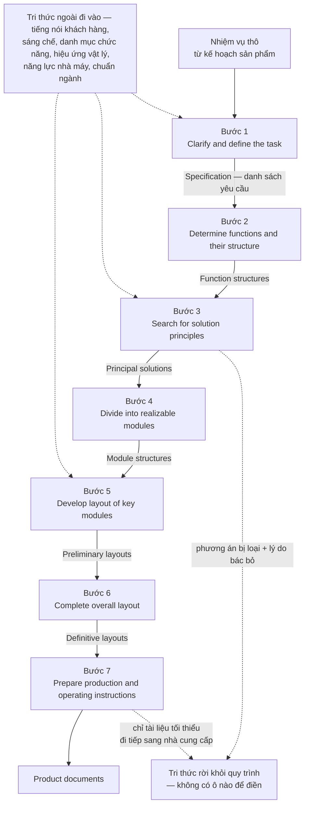
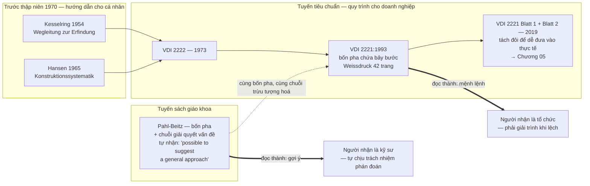

# Chương 04 — VDI 2221:1993: bảy bước và cái giá của việc thành tiêu chuẩn

Một phương pháp và một tiêu chuẩn là hai loại vật khác nhau, dù chữ in ra có thể giống hệt. Phương pháp
nói *nếu anh làm thế này thì thường sẽ tốt hơn*. Tiêu chuẩn nói *đây là cách làm*. Khoảng cách giữa hai
câu đó không nằm trong nội dung kỹ thuật — nội dung có thể trùng nhau từng chữ — mà nằm ở chỗ ai phải
giải trình khi không làm theo. Chương này kể chuyện một phương pháp đi qua khoảng cách đó, và tính giá
của chuyến đi. Nếu thiếu chương này, người đọc sẽ tiếp tục tranh luận về việc *bảy bước có đúng không*,
trong khi câu hỏi đáng tiền là *bảy bước, một khi đã thành văn bản có số hiệu, làm gì với tổ chức đang
dùng nó*.

Chương 03 để lại một mảnh bằng chứng mà chương này phải nhặt lên ngay. Pahl-Beitz — nguồn quy định nhất
trong toàn corpus — tự viết ở ngay câu liền trước danh sách công tác của pha cụ thể hoá rằng
`"it is not always possible to draw up a strict plan for the embodiment design phase. However, it is
possible to suggest a general approach with main working steps"` [1]. *Suggest.* Gợi ý. Vậy mà cùng một
chuỗi tư duy ấy về sau trở thành một hướng dẫn quốc gia được trích ở khắp nơi dưới dạng
`"The design process as presented by the VDI 2221 standard is based on 7 stages..."` [7]. Chỗ nối giữa
hai câu đó là toàn bộ nội dung của chương này: **thứ được viết ra như một gợi ý đã được đọc thành một
mệnh lệnh, và cơ chế làm việc chuyển đổi đó chính là hành vi chuẩn hoá.**

Ba thứ người đọc mang đi được. Thứ nhất, bản đồ bảy bước kèm ánh xạ đầu vào–đầu ra của từng bước — dùng
được ngay như danh mục bàn giao giữa các phòng. Thứ hai, một bảng kê sòng phẳng về việc chuẩn hoá **mua
được** cái gì: ngôn ngữ chung giữa các phòng ban, khả năng truy vết, và khả năng đào tạo được người mới.
Thứ ba, hoá đơn cho những thứ đó — trả bằng việc mất chỗ đứng chính đáng cho phán đoán cá nhân, và bằng
một giả định về kỷ luật quy trình mà phần lớn tổ chức không có.

---

## Trước khi có số hiệu: từ Kesselring 1954 đến VDI 2221

Tiêu chuẩn không rơi từ trên trời. Nó là kết tủa của một chuỗi hướng dẫn cá nhân, và chuỗi đó có ngày
tháng rõ ràng trong nguồn.

| Mốc | Cái ra đời | Nguyên văn |
|---|---|---|
| 1954 | Kesselring, *Wegleitung zur Erfindung* | `"The first guideline for inventions was developed by Fritz Kesselring [Kesselring, 1954] in 1954."` [13] |
| 1965 | Hansen, *Konstruktionssystematik* | `"The second guideline was proposed by Hansen [Hansen 1965] in 1965 in the book “Konstruktionssystematik”."` [13] |
| 1973 | VDI 2222 | `"In 1973 the guideline VDI 2222 Design engineering methodics Conceptioning of industrial products was set up on the proposals of Kesselring and Hansen by the VDI (Association of German engineers)"` [13] |
| thập niên 1970 | Loạt tiêu chuẩn VDI đầu tiên về phương pháp thiết kế | `"The first VDI Standards on methods of product design were published in the 1970s."` [15] |

Chuỗi này có một hình dạng, và nguồn tự nói ra hình dạng đó bằng một câu duy nhất đáng chép lại nguyên văn:

> `"The direction of the guidelines has changed from a personal support for individuals (Kesselring)
> towards a general procedure for a company addressing organization and content (VDI 2221)."` [13]

Câu này không nói phương pháp trở nên đúng hơn. Nó nói **đối tượng phục vụ đã đổi**: từ
*một cá nhân* sang *một doanh nghiệp*, và thứ được đề cập không còn là tư duy nữa mà là *tổ chức và nội
dung*. Bài báo lịch sử này đo quãng đường ấy bằng một câu khác: `"Design guidelines have been developed
over the past 50 years."` [13] — năm mươi năm, tính đến thời điểm bài viết.

Và đây là hệ quả kỹ thuật của việc đổi đối tượng phục vụ, cũng nguyên văn:

> `"The instructions have changed from statements that can be immediately put into action or thought to
> instruction on an abstract level, which need to be adapted to the current situation of the designer."` [13]

Chỉ dẫn đi từ *làm được ngay* sang *trừu tượng, cần được người thiết kế tự thích nghi vào tình huống của
mình*. Ghi nhớ vế sau. Nó là hạt giống của toàn bộ Chương 05 — cái mà bản 2019 sẽ gọi tên là *tailoring*
và viết hẳn thành một tập riêng, thì ở đây đã tồn tại từ lâu dưới dạng một khoản nợ không ai ghi sổ: việc
thích nghi được giao cho người dùng, nhưng không có trang nào chỉ cách thích nghi.

> **Con số không có nguyên văn: năm ban hành bản đầu tiên.** Cụm khai thác của chương này ghi thẳng
> *"không có trong nguồn"* cho năm ban hành phiên bản VDI 2221 đầu tiên. Thứ duy nhất trích được là mẩu
> `"Engl. version 1987"` [10]. Bản 1993 thì có nguyên văn, nhưng gián tiếp — nó xuất hiện trong một câu
> của tài liệu khác đang xếp loại nó:
> `"procedural models with a prescriptive notion are of particular interest, i.e. guidelines such as the
> VDI 2221 (1993)"` [12]. Vậy nên tiêu đề chương ghi **1993** và dừng ở đó. Không có năm 1986 trong cuốn
> sách này, vì không có câu nào trong 66 tài liệu nói ra nó. Một cuốn sách buộc tội các phương pháp khác
> là giả định không khai báo thì không được phép điền số vào chỗ trống của chính mình.

---

## Bảy bước, và thứ mà mỗi bước phải giao ra

Trọng tâm của bản 1993 là một chuỗi bảy bước. Nguyên văn của phép đếm:

> `"The design process as presented by the VDI 2221 standard is based on 7 stages, the first and the most
> important is the one that refers to the design requirements..."` [7]

Cái đuôi câu quay lại ám cả chương: bước đầu tiên được chính tài liệu tổng quan gọi là
**quan trọng nhất**. Một quy trình tự tuyên bố rằng sức nặng của nó dồn vào bước đầu tiên là một quy
trình đang đặt cược rất lớn vào chất lượng của thứ đi vào cửa.

Điều đáng giá hơn danh sách tên bước là **ánh xạ đầu vào–đầu ra**: mỗi bước ăn cái gì và bắt buộc phải
nhả ra cái gì. Đây mới là thứ chuyển giao được sang một xưởng thật, vì nó biến một quy trình thành một
chuỗi vật phẩm bàn giao — mà vật phẩm thì kiểm được, còn "mức độ hoàn thành của một bước" thì không.

| # | Bước | Đầu vào | Đầu ra | Bị bỏ khi nào |
|---|---|---|---|---|
| 1 | *Clarify and define the task* | Nhiệm vụ thô từ khách hàng hoặc bộ phận kế hoạch sản phẩm | Bản đặc tả / danh sách yêu cầu (*Specification*) | Hiếm khi bỏ hẳn, nhưng hay bị rút thành một cuộc họp không để lại vật phẩm |
| 2 | *Determine functions and their structure* | Bản đặc tả từ bước 1 | Cấu trúc chức năng (*Function structures*) | **Bị cắt sớm nhất** — đầu ra là một sơ đồ, không phải vật cầm được (xem *Giả định 3*) |
| 3 | *Search for solution principles and their combinations* | Cấu trúc chức năng từ bước 2 | Giải pháp nguyên lý (*Principal solutions*) | **Cắt cùng bước 2** — khi bước 2 bị bỏ thì bước 3 không còn đầu vào và đội nhảy thẳng sang bố cục |
| 4 | *Divide into realizable modules* | Giải pháp nguyên lý từ bước 3 | Cấu trúc mô-đun (*Module structures*) | Ít khi bỏ, nhưng hay được làm ngầm trong đầu một người thay vì thành văn bản |
| 5 | *Develop layout of key modules* | Cấu trúc mô-đun từ bước 4 | Bản vẽ bố cục sơ bộ (*Preliminary layouts*) | Gần như không bao giờ bỏ — đầu ra là bản vẽ, thứ tổ chức nhìn thấy được |
| 6 | *Complete overall layout* | Bố cục sơ bộ từ bước 5 | Bố cục xác định (*Definitive layouts*) | Không bỏ, nhưng đây là chỗ hậu quả của việc bỏ bước 2–3 mới lộ ra |
| 7 | *Prepare production and operating instructions* | Bố cục xác định từ bước 6 | Hồ sơ tài liệu sản phẩm (*Product documents*) | **Bị bóp khi hết thời gian** — bước cuối luôn là bước gánh phần trễ của cả dự án |

Hai đường đứt nét đi vào ô bên phải không phải trang trí. Chúng là hai phát hiện có nguyên văn của
Vielhaber, và mục *Đào sâu* phía dưới sẽ mổ chúng.

> **Khai báo bắt buộc về nguồn của bảng trên.** Corpus **không có toàn văn tiêu chuẩn VDI nào** — nhắc
> lại khai báo thứ hai của Chương 01. Tên bảy bước và luồng đầu vào–đầu ra ở đây đến từ tài liệu thứ cấp:
> phép đếm bảy bước từ một bản tổng quan [7], ánh xạ đầu vào–đầu ra dựng lại theo phân tích dòng chảy tri
> thức của Vielhaber [10], tên bốn pha từ bài lịch sử hướng dẫn [13]. Chính tệp khai thác ghi rõ rằng
> phần văn bản mô tả chi tiết luồng đầu vào–đầu ra của từng bước 1–7 là **không có trong nguồn** ở lượt
> truy vấn chỉ dùng bốn tài liệu. Nói cách khác: cái mà giới kỹ thuật quốc tế biết về tiêu chuẩn này,
> phần lớn là biết qua người khác kể lại. Đó là một dữ kiện về **mặt tiếp giáp**, không phải một lời xin
> lỗi về phương pháp làm sách — một tiêu chuẩn bán theo bản in, được lan truyền chủ yếu qua bản tóm tắt
> của người thứ ba, sẽ bị hiểu theo cách của người thứ ba.

---

## Bốn pha chứa bảy bước — và vì sao bố cục ấy là một tuyên bố về quyền lực

Bảy bước không đứng một mình. Chúng nằm trong bốn pha, và bốn pha ấy là bốn pha của Chương 03, không sai
một chữ:

> `"The guideline encompasses the four main design phases: clarification of the task, conceptual design,
> embodiment design and detail design."` [13]

Một nguồn độc lập khác, mô tả một dự án áp dụng thật, nhắc lại đúng bốn cái tên đó:

> `"The 3D printer is designed using the VDI 2221 methodology, which encompasses four key phases: task
> clarification, conceptual design, embodiment design, and detailed design."` [6]

Đây là điểm khớp quan trọng nhất của cả phả hệ. VDI 2221 **không phát minh ra một phương pháp mới**. Nó
lấy khung bốn pha đã có và cấp cho khung ấy một số hiệu.

Bố cục *bốn pha chứa bảy bước* trông như một chi tiết trình bày. Nó không phải. Hai lớp ấy phục vụ hai
đối tượng khác nhau: **pha** là ngôn ngữ của quản lý — mốc, ngân sách, cổng duyệt; **bước** là ngôn ngữ
của kỹ sư — việc phải làm, vật phẩm phải nộp. Đặt bước bên trong pha là đặt công việc kỹ thuật bên trong
một khung kiểm soát. Đó chính là điều mà câu trích ở trên gọi là *"a general procedure for a company
addressing organization and content"*. Cái được chuẩn hoá không phải là cách nghĩ của người thiết kế; cái
được chuẩn hoá là **cách tổ chức nhìn vào việc thiết kế**.

> **Ánh xạ bước → pha là cách đọc của cuốn sách này, không phải nguyên văn của nguồn.** Nguồn nói *bốn
> pha*, nguồn nói *bảy bước*, nhưng **không có câu nào trong corpus chỉ định bước nào thuộc pha nào**.
> Chỗ ghép duy nhất mà văn bản cho phép là ghép theo tên: bước 1 mang đúng tên pha thứ nhất
> (*clarification of the task*); đầu ra của bước 3 là *principal solutions* — đúng sản phẩm của
> *conceptual design*; bước 5 và 6 nói *layout*, tức *embodiment*; bước 7 giao *product documents*, tức
> *detail design*. Ghép theo tên thì được. Ghép theo số thứ tự rồi trình bày như sơ đồ gốc của tiêu chuẩn
> thì không, và cuốn sách này không làm.

---

## Chuẩn hoá mua được cái gì

Dễ chê một tiêu chuẩn. Khó hơn, và cần thiết hơn, là nói rõ nó mua được gì — vì nếu không có gì để mua
thì đã không ai chịu trả giá lâu đến thế.

**Thứ nhất: một ngôn ngữ chung giữa các phòng ban.** Khi *cấu trúc chức năng* và *giải pháp nguyên lý*
là danh từ có định nghĩa trong một văn bản có số hiệu, hai phòng khác nhau tranh luận được về cùng một
vật. Trước đó họ tranh luận về hai vật khác nhau mà tưởng là một. Giá trị này không đo được bằng bản vẽ;
nó đo được bằng số cuộc họp không phải họp lại.

**Thứ hai: khả năng truy vết.** Bảng đầu vào–đầu ra phía trên chính là bộ xương của truy vết. Mỗi bước có
một vật phẩm đầu ra được đặt tên, nên câu hỏi *"yêu cầu này biến đi đâu"* có chỗ để trả lời. Chương 06 sẽ
cho thấy tuyến VDI 2206 nâng đúng năng lực này lên thành nhánh kiểm chứng đối xứng của chữ V — truy vết
không còn là tác dụng phụ nữa mà thành nửa kiến trúc.

**Thứ ba: đào tạo được.** Đây là món mua được rõ ràng nhất, và trớ trêu thay bằng chứng mạnh nhất lại nằm
ở những dự án nhỏ, xa nước Đức: corpus có **hai dự án chạy trọn bộ khung và công bố số đo** [3] [6] — một
thiết bị ngưng tụ nước từ không khí và một máy in 3D làm từ nhựa chai tái chế, cả hai do đội ít kinh
nghiệm thực hiện và cả hai giao ra sản phẩm vật lý chạy được. Ô *Đào sâu* ở cuối chương trình các con số
và đọc kỹ xem chúng chứng minh cái gì.

**Thứ tư: một vài công cụ nhỏ nhưng dạy được ngay.** Tài liệu tổng quan mô tả một quy trình phân tích
chức năng năm bước — mô tả sản phẩm, phân tích chức năng có hệ thống bởi đội đa ngành, tổ chức phân cấp,
đặc trưng hoá, ưu tiên hoá:

> `"After a description of the product (step 1), the functions are systematically analysed (step 2) by a
> team of experts from different disciplines. Step 3 is the hierarchical organisation of the different
> functions, while step 4 characterises all functions. The final step prioritises these functions."` [9]

Và một cặp ví dụ dạy được trong ba mươi giây, đáng dán lên tường phòng thiết kế:

> `"A good example for a purely functional requirement is: “The floor must be able to carry payload
> (maximum load 32 t)”. A bad example (as it is already solution oriented) in this context would be:
> “The floor structure is an aluminium honeycomb design capable to withstand a maximum load of 32 t”."` [9]

Bốn món hàng thật — và cần nói ra một bất đối xứng về bằng chứng, vì chính chương này đang lập luật
rằng mọi khẳng định phải chỉ ra chỗ đứng của nó. **Chỉ món thứ ba có số đo trong corpus.** Ngôn ngữ
chung, truy vết, và mấy công cụ nhỏ đều đứng bằng lập luận: không tài liệu nào trong 66 tài liệu đo
được rằng có tiêu chuẩn thì số cuộc họp phải họp lại giảm đi, hay yêu cầu ít thất lạc hơn. Đó là một
dữ kiện về corpus, không phải một lời chê tiêu chuẩn — nhưng ai định dùng ba món kia để bảo vệ một
đề xuất áp chuẩn thì nên biết mình đang cầm lập luận, không cầm số liệu.

Hoá đơn thì ngược lại: nó có bằng chứng.

---

## Và trả giá bằng cái gì

### Giá thứ nhất: một gợi ý bị đọc thành một mệnh lệnh

Đây là chỗ nối quan trọng nhất giữa Chương 03 và chương này, nên nó được viết thẳng ra thay vì để người
đọc tự suy.

Pahl-Beitz, ở đúng chỗ mà giới kỹ thuật hay trích như một quy trình bắt buộc, tự phủ nhận rằng đó là một
quy trình: `"it is not always possible to draw up a strict plan for the embodiment design phase. However,
it is possible to suggest a general approach with main working steps"` [1]. Và cũng chính sách ấy nói
thêm về pha cụ thể hoá rằng `"it is not necessary to lay down special methods for every individual step,
however the following recommendations might prove useful"` [1]. *Recommendations.* Tác giả biết rất rõ
giới hạn của thứ mình viết ra, và đã ghi giới hạn ấy vào ngay cạnh danh sách.

Rồi hành vi chuẩn hoá diễn ra. Cái được viết dưới dạng *suggest a general approach* trở thành cái được
trích dưới dạng *the design process ... is based on 7 stages* [7]. Tài liệu xếp loại học thuật gọi thẳng
tên chủng loại của nó: `"procedural models with a prescriptive notion ... such as the VDI 2221 (1993)"`
[12]. *Prescriptive.* Quy định. Không còn ai đi kèm để nhắc rằng câu gốc có chữ *not always possible*.

Đây không phải lỗi của ban soạn thảo. Đó là **thuộc tính của thể loại**. Một văn bản có số hiệu tồn tại
để được viện dẫn; mà đã viện dẫn thì phải viện dẫn được cái gì đó dứt khoát. Một tiêu chuẩn ghi *"tuỳ
tình huống, có thể không lập được kế hoạch chặt"* thì không ai viện dẫn nổi, và cũng không ai kiểm toán
nổi. **Chuẩn hoá không thêm sự chắc chắn vào tri thức — nó lột phần bất định ra khỏi cách trình bày tri
thức, rồi giao phần đã lột cho tổ chức tự gánh mà không nói ra.**

Cái giá trả ngay lập tức: người kỹ sư mất chỗ đứng chính đáng để nói *bước này dự án tôi không cần*. Anh
ta vẫn bỏ bước — thực tế luôn bỏ — nhưng bây giờ bỏ trong im lặng, không ghi vào đâu cả. Phán đoán không
biến mất khi bị cấm; nó chỉ chuyển xuống hoạt động ngầm, nơi không ai học được từ nó và không ai chịu
trách nhiệm về nó. Đó là một tổn thất kép: tổ chức vừa mất phán đoán khỏi hồ sơ, vừa mất luôn cơ hội
phát hiện rằng quy trình của mình sai chỗ nào.

### Giá thứ hai: chỉ dẫn trừu tượng hoá, và công nghiệp đáp lại bằng sự dè dặt

Bài lịch sử hướng dẫn không nói bóng gió. Nó đo, rồi kết luận:

> `"The advice in the Weißdruck of the guideline contains more results of research than practical hints
> for thinking and acting."` [13]

Có số kèm theo. Tập chú giải *Weißdruck* của VDI 2221 `"encompasses 42 pages."` [13] — trong khi tập
tương ứng của VDI 2222 trước đó là `"a 52-page text with detailed information about the guideline,
examples of the application of the guidelines and relevant literature."` [13]. Bản mới ngắn hơn bản cũ,
và phần còn lại được phân bổ khác đi: riêng chủ đề tích hợp CAD `"takes up a third of the description in
the Weißdruck."` [13] Một phần ba tập chú giải dành cho công cụ, trong một tài liệu mà chính bài phê bình
nói là thiếu gợi ý thực hành cho việc *nghĩ* và *làm*.

Kết quả tiếp nhận, nguyên văn, hai câu:

> `"These insights give, on the one hand, explanations for the still reserved application and acceptance
> of design guidelines..."` [13]

> `"So, most of the identified changes might cause acceptance and application problems of design methods
> in industry."` [13]

Chú ý cấu trúc câu thứ hai: *might cause*. Bài báo không tuyên bố đã đo được mức độ từ chối trong công
nghiệp; nó lập luận từ đặc điểm văn bản sang khả năng bị từ chối. Cuốn sách này dùng nó đúng ở mức đó,
không hơn — và ghi vào Sổ kiểm rằng không có con số nào về tỷ lệ áp dụng.

### Giá thứ ba: tiêu chuẩn mô tả tài liệu, không mô tả cách tài liệu sống trong tổ chức

Đây là câu chẩn đoán sắc nhất trong cả cụm, và nó ngắn:

> `"Existing standards describe the content and generation of requirements documents but not their
> integration in the product development process."` [12]

Một tiêu chuẩn nói *bản đặc tả phải có gì* nhưng không nói *bản đặc tả ấy đi qua tay ai, bị ai sửa, khoá
lại lúc nào, ai được mở khoá*. Chỗ trống đó không trung tính. Trong một tổ chức có kỷ luật quy trình cao,
nó được lấp bằng tập quán tốt. Trong một tổ chức không có, nó được lấp bằng người nào nói to nhất.

Hệ quả trực tiếp là ảo giác về danh sách yêu cầu tĩnh:

> `"A shortcoming of most design process models is that they often create the impression that once the
> initial requirements list has been created, this task is completed – even though they usually try to
> emphasise the need to constantly revise and refine the requirements..."` [12]

Vế sau dấu gạch mới là chỗ nặng — *even though they usually try to emphasise*. Tài liệu **có** nhắc phải liên tục
soát lại yêu cầu. Nhưng hình dạng của sơ đồ nói to hơn phần chữ: một hộp ở đầu chuỗi, một mũi tên đi ra,
không mũi tên nào quay lại. Người ta làm theo hình, không làm theo chú thích. Đây là một mẫu hình đáng
mang theo suốt cuốn sách: **khi hình vẽ và lời cảnh báo mâu thuẫn nhau, hình vẽ thắng.**

Và bài báo nói thêm vì sao việc chốt sớm là bất khả về mặt nhận thức: `"Consistency as well as conflicting
design goals can be difficult to assess due to missing solution principles or details at this early
stage."` [12] Ở bước được chính nguồn gọi là *quan trọng nhất*, người thiết kế chưa có đủ giải pháp trong
tay để phát hiện ra rằng hai yêu cầu của mình mâu thuẫn nhau. Bước 1 vừa gánh trọng lượng lớn nhất, vừa
được thực hiện trong điều kiện thiếu thông tin nhất.

### Giá thứ tư: có nguyên một loại dự án mà khung này không phục vụ

Cụm khai thác ghi một vùng không áp dụng được: **thiết kế biến thể và cải tiến nhỏ**. Khung bảy bước tối
ưu cho thiết kế mới hoàn toàn, nơi việc leo lên mức trừu tượng chức năng thật sự sinh ra phương án khác.
Với một dự án chỉ đổi một phần nhỏ của sản phẩm cũ, bắt kỹ sư dựng lại cấu trúc chức năng từ đầu là mua
thêm độ trễ mà không mua thêm phương án nào.

Điều đáng nói là **văn bản không tự khai vùng loại trừ này** — nó được rút ra từ tuyến phê bình. Một tiêu
chuẩn không tự viết ra biên giới áp dụng của mình thì mặc định sẽ được áp cho mọi thứ, và sẽ bị đổ lỗi ở
đúng những chỗ nó chưa bao giờ nhận việc. Đây là một dạng thiệt hại đặc thù của chuẩn hoá: phương pháp
gốc dạng sách giáo khoa có cả một chương bàn về việc khi nào dùng cái gì; tiêu chuẩn nén nội dung ấy ra
khỏi văn bản để giữ tính dứt khoát, rồi mất luôn phần miễn trừ trách nhiệm.

Mặt kia phải nói cho đủ, nếu không mục này thành một bài công kích chuẩn hoá. Có những tổ chức mà
**phán đoán ngầm chính là vấn đề** — nơi "kinh nghiệm" là tên gọi khác của thói quen không ai kiểm
được, và mỗi dự án chạy theo một cách tuỳ người phụ trách. Với những tổ chức ấy, một quy trình cứng là
cách rẻ nhất để chặn phán đoán ngầm lại, và cái giá vừa mô tả là cái giá đáng trả. Câu hỏi không phải
*cứng hay mềm thì tốt hơn* mà là *tổ chức này đang thừa cái nào*.

---

> **Đào sâu: tri thức — thứ tiêu chuẩn không đếm được**
>
> Vielhaber soi VDI 2221 bằng một lăng kính mà bản thân tiêu chuẩn không có: dòng chảy tri thức. Kết quả
> là ba phát hiện, mỗi cái có nguyên văn.
>
> **Một — tiêu chuẩn hầu như không nói về tri thức.** `"Looking in detail inside VDI 2221 and its
> subsidiary guidelines 2222 and 2223, knowledge is explicitly mentioned twice..."` [10]. Hai lần. Trong
> một hướng dẫn mà toàn bộ sản phẩm đầu ra là tri thức được mã hoá thành hình vẽ và văn bản. Lý do nằm ở
> mục tiêu tự khai của nó: `"It is thereby laid out to fulfill one predominant goal: getting a product
> idea realized."` [10] Một mục tiêu duy nhất — đưa được ý tưởng thành sản phẩm. Mọi thứ không phục vụ
> mục tiêu ấy đều là phế phẩm, kể cả tri thức.
>
> **Hai — thất thoát tri thức tập trung đúng ở bước sáng tạo nhất.**
> `"With the highly creative, but also deciding character of this process step, there is also a high
> amount of knowledge leaving the process at this stage. Many ideas get evaluated and discarded, tests
> are done, requirements are traded off and sketches discussed. If not intentionally and systematically
> kept, this may lead to a huge knowledge loss for the design department."` [10]
> Bước 3 sinh ra hai thứ: một giải pháp nguyên lý được chọn, và một đống lớn phương án bị loại kèm lý do
> bác bỏ. Tiêu chuẩn định nghĩa đầu ra là thứ nhất. Thứ hai không có ô nào để điền, nên nó rơi ra ngoài.
> Chú ý điều kiện trong câu trích — *if not intentionally and systematically kept*. Nguồn không nói tri
> thức chắc chắn mất; nguồn nói nó mất **trừ khi có người cố ý giữ**, mà tiêu chuẩn thì không giao việc
> ấy cho ai.
>
> **Ba — nghịch lý quyết định trên tri thức bán phần.**
> `"...it gets obvious that the main decision point when selecting the solution principle is based on
> partial knowledge, only. All knowledge gained afterwards through detailing, prototyping or realization
> (hatched area in the diagram) is either lost for this respective decision or may lead to revisiting
> that decision, later on."` [10]
> Đây là phiên bản có bằng chứng của mệnh đề mà Chương 03 phát biểu bằng lời của Pahl-Beitz: quyết định
> sớm định đoạt số phận sản phẩm. Vielhaber thêm vế thứ hai, cay hơn: quyết định sớm ấy được ra bằng
> lượng tri thức ít nhất trong cả dự án, và mọi tri thức thu được sau đó **hoặc mất, hoặc buộc phải quay
> lại mở quyết định cũ**. Chuỗi bảy bước một chiều không có chỗ cho vế thứ hai — nó không có mũi tên
> ngược. Chữ V của Chương 06 sinh ra một phần vì điều này.
>
> Và điểm gãy cuối cùng, ở ranh giới tổ chức: `"With the project leaving the responsibility area of
> design, potentially even being handed over to suppliers, this process step is especially critical
> regarding the fluency of knowledge – only the minimum of documentation directly required may be
> transferred."` [10] Bước 7 giao *product documents*. Đúng đủ để chế tạo, và chỉ đúng đủ để chế tạo.
> Lý do đằng sau mỗi kích thước ở lại trong phòng thiết kế, hoặc không ở lại đâu cả.

---

> **Đào sâu: hai dự án áp dụng, và thứ chúng thật sự chứng minh**
>
> Corpus có hai dự án chạy trọn khung VDI 2221 và công bố số đo. Chúng là bằng chứng tốt — miễn là đọc
> đúng thứ chúng chứng minh.
>
> Thiết bị ngưng tụ nước cho ra `"6 ml of water within 1 hour of testing"` [3]. Sáu mililít một giờ. Bài
> báo mô tả kết quả này bằng chữ `"functions successfully"` — và đó là cách nói chính xác, vì cái được
> chứng minh là **thiết bị chạy**, không phải thiết bị giải quyết được bài toán khan hiếm nước mà chính
> bài báo nêu ở phần mở đầu. Cạnh nó là hai hệ số an toàn tính giải tích: `1.45` cho khung thép và
> `2.57379` cho trục nhôm [3]. Năm chữ số sau dấu phẩy trên một hệ số an toàn của một chi tiết chưa từng
> qua thử tải là một sự chính xác không có nội dung — và nó là dấu vết đặc trưng của việc chạy quy trình
> đúng thủ tục: mỗi bước có một ô phải điền, ô nào cũng được điền, kể cả khi con số điền vào không có cơ
> sở vật lý để chính xác đến thế.
>
> Máy in 3D làm từ nhựa tái chế đạt `"nozzle temperatures up to 270°C and bed temperatures up to 80°C"`
> với `"a total production cost of Rp 3,657,000.00."` [6]
>
> Cả hai chứng minh cùng một điều, và đó là điều đáng giá nhất về chuẩn hoá: **một khung được viết đủ rõ
> để một đội không nhiều kinh nghiệm chạy hết được từ đầu tới cuối và giao ra sản phẩm vật lý.** Đó chính
> là món "đào tạo được" trong bảng hàng ở trên. Cái chúng **không** chứng minh là khung này làm ra thiết
> kế tốt hơn — không dự án nào trong hai có nhóm đối chứng chạy theo cách khác. Chuẩn hoá bảo đảm sàn,
> không bảo đảm trần.

---

## Phương pháp này giả định một tổ chức như thế nào

Mọi chương của phần này đóng bằng cùng một câu hỏi. Với VDI 2221:1993, câu trả lời gồm bốn giả định, và
giả định thứ tư là giả định chịu lực.

**Giả định 1 — có một cửa vào duy nhất và sạch.** Bước 1 nhận *nhiệm vụ từ bộ phận kế hoạch sản phẩm*.
Tức là tổ chức phải có một bộ phận như thế, và bộ phận ấy phải nói được thành lời nó muốn gì trước khi
thiết kế bắt đầu. Ở phần lớn xưởng vừa và nhỏ, nhiệm vụ đến từ một cuộc gọi, và nội dung thật của nó chỉ
lộ ra ở tuần thứ sáu.

**Giả định 2 — kỷ luật quy trình đủ cao để bước sau chịu đợi bước trước.** Chuỗi bảy bước chỉ có nghĩa
nếu đầu ra của bước n thật sự là đầu vào của bước n+1. Nếu tổ chức cho phép nhảy thẳng từ bước 1 sang
bước 5 — và tổ chức nào cũng cho phép, dưới áp lực lịch giao — thì bảy bước không còn là quy trình nữa;
nó là một danh sách hồi cứu điền vào lúc nghiệm thu.

**Giả định 3 — có tiền và có thời gian cho pha trừu tượng.** Bước 2 và bước 3 không sinh ra vật gì cầm
được. Chúng sinh ra cấu trúc chức năng và giải pháp nguyên lý. Một tổ chức đo tiến độ bằng số bản vẽ sẽ
đọc hai bước này là hai tuần không có sản lượng, và sẽ cắt chúng trước tiên khi lịch căng.

**Giả định 4 — và đây là canh bạc thật: thuật ngữ thống nhất giữa cơ, điện và phần mềm.** Vật liệu khai
thác nói ra giả định này bằng chính lời của nó: tổ chức phải có *tính kỷ luật quy trình cực cao* và một
*hệ thống ngôn ngữ/thuật ngữ thống nhất giữa các phòng ban (cơ khí, điện, phần mềm)* để truy vết được yêu
cầu dọc theo quy trình [2] [13] [15].

Đây là giả định lặng lẽ nhất và đắt nhất, vì nó không nằm trong bước nào cả — nó là điều kiện để **mọi**
bước hoạt động. Toàn bộ giá trị của bảy bước nằm ở chỗ đầu ra của bước này đọc được ở bước sau. Mà đầu ra
là văn bản. Văn bản chỉ chuyển giao được khi hai bên gán cùng một nghĩa cho cùng một từ.

Thử một từ duy nhất: **"mô-đun"**. Bước 4 yêu cầu *divide into realizable modules*. Với phòng cơ khí,
mô-đun là một cụm lắp ráp tháo rời được; ranh giới của nó là mặt bích và bu-lông. Với phòng điện, mô-đun
là một bo mạch; ranh giới là đầu nối và giao thức. Với phòng phần mềm, mô-đun là một đơn vị biên dịch;
ranh giới là hàm gọi được — không có khối lượng, không có thể tích, không có nhiệt. Ba định nghĩa này
không sai cái nào. Chúng chỉ **cắt hệ thống theo ba mặt phẳng khác nhau**. Bước 4 nói *hãy chia*, và giả
định rằng chỉ có một cách chia.

Chuyện xảy ra khi giả định này không đúng thì không ồn ào. Không ai cãi nhau. Ba phòng đều hoàn thành
bước 4 đúng hạn, mỗi phòng nộp một sơ đồ mô-đun hợp lệ theo nghĩa của mình, và ba sơ đồ không chồng khít.
Sai lệch không lộ ra ở bước 4. Nó lộ ra ở bước 6, khi bố cục tổng thể phải nhét ba cách chia vào một cái
vỏ; hoặc muộn hơn nữa ở bước 7, khi hồ sơ sản xuất phải nói rõ ai chịu trách nhiệm cho khoảng trống giữa
ba ranh giới. Chi phí sửa ở đó lớn hơn ở bước 4 nhiều lần — và Chương 03 đã cho biết vì sao: quyết định
sớm khoá chi phí muộn.

Đáng chú ý hơn nữa: **quy trình không có cảm biến cho lỗi này.** Bảy bước kiểm được rằng vật phẩm đã nộp,
không kiểm được rằng ba vật phẩm nói cùng một thứ tiếng. Cổng duyệt của pha đọc *"bước 4 đã hoàn thành"*
và đóng dấu — vì trên giấy nó đã hoàn thành thật.

Đó là **mặt tiếp giáp** của chương này. VDI 2221 không hỏng vì bảy bước sai. Nó hỏng ở chỗ nó cần một thứ
mà nó không cung cấp và cũng không kiểm tra: một từ điển chung. Tiêu chuẩn ban hành *quy trình*, nhưng
thứ quyết định quy trình có chạy hay không là *ngữ nghĩa*. Và ngữ nghĩa thì thuộc về tổ chức, không thuộc
về văn bản.

Có một bằng chứng gián tiếp nhưng mạnh cho điều này: chính VDI đã phải quay lại. Bản 2019 tách tiêu chuẩn
làm hai, và nguyên văn lý do tách là `"It was divided into two parts to make it easier to put into
practice:"` [15] — chia đôi *để dễ đưa vào thực tế hơn*. Một tiêu chuẩn phải tự sửa kiến trúc của mình để
dễ áp dụng hơn là một tiêu chuẩn thừa nhận rằng kiến trúc cũ khó áp dụng. Chương 05 đọc kỹ lời thú nhận
ấy và đo xem nó nhượng bộ tới đâu — vì tách đôi một văn bản là hành động ở tầng văn bản, còn vấn đề vừa
mô tả ở trên nằm ở tầng tổ chức, và hai tầng ấy không tự động chạm nhau.

---

## Áp dụng ở Xưởng

Bối cảnh: một xưởng cơ khí — điện tử — phần mềm nhúng, quy mô vài chục người, làm sản phẩm kỹ thuật theo
đơn đặt hàng và theo hướng phát triển riêng.

### 1. Tuần tới: ký một từ điển hai mươi dòng cho ba miền

Quyết định ra được trong tuần: triệu tập ba người — một cơ khí, một điện tử, một phần mềm — trong chín
mươi phút, mỗi người mang theo mười từ họ dùng hằng ngày khi bàn giao. Chốt tại chỗ một bảng khoảng hai
mươi dòng: **từ · nghĩa cho cơ · nghĩa cho điện · nghĩa cho phần mềm · nghĩa được chọn cho toàn xưởng**.
Bắt đầu bằng bốn từ chắc chắn lệch nghĩa: *mô-đun*, *giao diện*, *phiên bản*, *hoàn thành*. Ký, treo lên,
và ràng buộc duy nhất là: từ nay biên bản bàn giao dùng nghĩa đã chốt.

Đây là món rẻ nhất và nhanh nhất trong cả chương, và nó tấn công đúng giả định chịu lực vừa phân tích ở
trên. Nó cũng can thiệp ở một tầng cao hơn hẳn việc ban hành thêm một quy trình — điểm này sẽ được nói
lại bằng ngôn ngữ đòn bẩy ở phần cuối sách; ánh xạ từ công cụ thiết kế sang tầng đòn bẩy là thao tác của
cuốn sách này, không nguồn nào trong 66 tài liệu làm việc đó.

### 2. Đóng dấu đầu ra, đừng đóng dấu bước

**Vấn đề nó giải:** dự án báo "đã xong bước 3" mà không ai kiểm được là xong cái gì, nên cuộc họp nghiệm
thu biến thành cuộc tranh luận về mức độ hoàn thành.
**Cách áp:** lấy đúng cột "Đầu ra" trong bảng bảy bước làm danh mục nghiệm thu — bước 2 xong nghĩa là có
một cấu trúc chức năng ai cũng đọc được; bước 3 xong nghĩa là có giải pháp nguyên lý được chọn **kèm
danh sách phương án bị loại**. Không có vật phẩm thì bước chưa xong, bất kể đã tiêu bao nhiêu ngày công.
**Bẫy:** đầu ra biến thành thủ tục giấy — người ta viết vật phẩm ra sau khi đã làm xong việc theo cách
khác, chỉ để qua cửa. Chống bằng cách đòi vật phẩm **trước** cuộc họp, không phải trong biên bản họp.

### 3. Mở một sổ phương án bị loại

**Vấn đề nó giải:** mỗi vòng thiết kế đốt hàng chục ý tưởng cùng lý do bác bỏ chúng; sáu tháng sau, một
người khác đề xuất lại đúng ý tưởng đã bị bác và cả đội thử lại từ đầu.
**Cách áp:** một tệp duy nhất cho mỗi sản phẩm, mỗi dòng ba cột — *phương án · lý do loại · ai loại và
ngày nào*. Điền tại chỗ ở bước 3 và bước 4, không điền hồi cứu. Đây chính là dòng tri thức mà Vielhaber
mô tả là rời khỏi quy trình `"if not intentionally and systematically kept"` [10] — nguồn nói rõ nó chỉ
mất khi không có ai cố ý giữ, nên việc cần làm là **giao trách nhiệm giữ cho một người có tên**.
**Bẫy:** sổ này chết trong hai tuần nếu người viết không phải người ra quyết định — người ghi chép sẽ ghi
kết luận mà bỏ lý do, mà lý do mới là phần có giá trị.

### 4. Viết yêu cầu thuần chức năng ở cửa vào

**Vấn đề nó giải:** yêu cầu đến từ khách hàng thường đã cài sẵn giải pháp, và cài sẵn từ trước khi có ai
kịp hỏi vì sao — thế là toàn bộ không gian phương án bị đóng lại trước cả bước 3.
**Cách áp:** dùng thẳng cặp ví dụ nguyên văn của [9] làm thước soát: *"The floor must be able to carry
payload (maximum load 32 t)"* là yêu cầu tốt; *"The floor structure is an aluminium honeycomb design
capable to withstand a maximum load of 32 t"* là yêu cầu xấu vì nó đã chỉ định giải pháp. Mỗi dòng trong
bản đặc tả bị hỏi một câu: *dòng này nói cái phải đạt, hay nói cách đạt?*
**Bẫy:** làm quá tay thành ra xoá luôn các ràng buộc thật — khi khách hàng đã có sẵn dây chuyền cho một
loại vật liệu thì "phải dùng vật liệu đó" là ràng buộc chính đáng, không phải giải pháp cài sẵn. Phân
biệt bằng cách hỏi *ai chịu thiệt nếu bỏ dòng này*.

### 5. Khai báo trước dự án nào không chạy đủ bảy bước

**Vấn đề nó giải:** ép một dự án cải tiến biến thể đi lại từ cấu trúc chức năng chỉ mua thêm độ trễ, nên
đội sẽ lặng lẽ bỏ bước — và một khi đã quen bỏ bước trong im lặng thì họ cũng bỏ ở dự án cần bước ấy.
**Cách áp:** ngay khi mở dự án, phân loại *thiết kế mới* hay *thiết kế biến thể*; với loại thứ hai thì
ghi thẳng vào hồ sơ mở dự án những bước được rút gọn cùng lý do rút. Rút có khai báo là quyết định kỹ
thuật; rút không khai báo là nợ. Đây là *tailoring* làm bằng tay, mười mấy năm trước khi tiêu chuẩn cho
phép làm điều đó — và Chương 05 sẽ cho thấy cơ quan tiêu chuẩn cuối cùng cũng đi tới đúng kết luận này.
**Bẫy:** cái nhãn "biến thể" trở thành cửa thoát mặc định vì nó rẻ hơn — chống bằng một tiêu chí cứng
định trước, ví dụ mọi dự án chạm tới ranh giới giữa hai miền kỹ thuật đều bị coi là thiết kế mới, bất kể
tỷ lệ kế thừa.

---

## Sổ kiểm của chương

- **Neo luận đề:** **Mặt tiếp giáp** — nối rõ ở mục *Phương pháp này giả định một tổ chức như thế nào*
  (giả định 4: thuật ngữ thống nhất giữa cơ–điện–phần mềm; ca "mô-đun" ba nghĩa; sai lệch lộ ở bước 6–7
  chứ không ở bước 4; quy trình không có cảm biến cho lỗi này) và ở mục *Và trả giá bằng cái gì*, giá thứ
  ba — tiêu chuẩn mô tả tài liệu, không mô tả cách tài liệu sống trong tổ chức. Chạm neo **Canh bạc** ở
  bốn giả định tổ chức.
- **Nguồn đã dùng:** [1], [2], [3], [6], [7], [9], [10], [12], [13], [15]
- **Con số có nguyên văn:**
  - 7 bước — `"The design process as..."` [7]
  - 4 pha — `"The guideline encompasses the..."` [13]; đối chứng `"The 3D printer is..."` [6]
  - 1954 Kesselring — `"The first guideline for..."` [13]
  - 1965 Hansen — `"The second guideline was..."` [13]
  - 1973 VDI 2222 — `"In 1973 the..."` [13]
  - thập niên 1970 — `"The first VDI..."` [15]
  - 50 năm — `"Design guidelines have been..."` [13]
  - 1993 (bản đang bàn) — `"procedural models with a..."` [12]
  - 42 trang Weißdruck VDI 2221 — `"The Weißdruck encompasses 42..."` [13]
  - 52 trang Weißdruck VDI 2222 — `"Additional advice for the..."` [13]
  - một phần ba dành cho CAD — `"This aspect takes up..."` [13]
  - tri thức được nhắc hai lần — `"Looking in detail inside..."` [10]
  - 5 bước phân tích chức năng — `"After a description of..."` [9]
  - 32 t (ví dụ yêu cầu tốt/xấu) — `"A good example for..."` [9]
  - hệ số an toàn 1.45 — `"Based on ASTM A36..."` [3]
  - hệ số an toàn 2.57379 — `"Based on the turbine..."` [3]
  - 6 ml / 1 giờ — `"This device functions successfully..."` [3]
  - 270°C / 80°C — `"This machine achieves nozzle..."` [6]
  - Rp 3.657.000 — `"...with a total production..."` [6]
  - tách làm hai phần (2019) — `"It was divided into..."` [15]
- **Con số đã BỎ vì không có nguyên văn:**
  - **Năm ban hành bản VDI 2221 đầu tiên (1986).** Tệp khai thác ghi thẳng *"không có trong nguồn"*; thứ
    duy nhất trích được là `"Engl. version 1987"` [10]. Việc thiếu này đã được **viết vào thân chương**
    thay vì lấp bằng ước lượng, đúng LUẬT 1.
  - **Phân bổ bước vào pha** (ví dụ "pha II gồm bước 2 và 3"). Nguồn nói bốn pha, nói bảy bước, nhưng
    không câu nào chỉ định phân bổ. Đã bỏ mọi phép gán theo số thứ tự.
  - **Tỷ lệ doanh nghiệp áp dụng hoặc từ chối VDI 2221.** Tệp khai thác xác nhận không có câu định lượng
    nào về SME. Chương chỉ dùng `"still reserved application and acceptance"` và `"might cause"` [13] ở
    đúng mức độ của chúng, và nói ra rằng đó là lập luận chứ không phải đo đạc.
  - **Tỷ lệ phần trăm kế thừa trong "thiết kế biến thể".** Không nguồn nào cho ngưỡng; mục *Áp dụng ở
    Xưởng* số 5 vì thế không nêu con số nào.
- **Chỗ là suy luận của tác giả, không phải của nguồn:**
  1. **Ánh xạ bước → pha theo tên** (bước 1 ↔ *clarification of the task*, bước 3 ↔ *conceptual design*,
     bước 5–6 ↔ *embodiment*, bước 7 ↔ *detail design*). Đã khai báo tại chỗ trong ô trích dẫn.
  2. **Mệnh đề "chuẩn hoá lột phần bất định ra khỏi cách trình bày tri thức rồi giao cho tổ chức tự
     gánh"** — đọc ra từ việc đặt câu `"possible to suggest"` [1] cạnh câu `"is based on 7 stages"` [7]
     và nhãn `"prescriptive notion"` [12]. Không nguồn nào phát biểu mệnh đề này.
  3. **Ca "mô-đun ba nghĩa"** (cơ/điện/phần mềm cắt hệ thống theo ba mặt phẳng khác nhau) là ví dụ do tác
     giả dựng để cụ thể hoá giả định thuật ngữ thống nhất mà nguồn chỉ phát biểu ở mức tổng quát.
  4. **Bố cục "pha là ngôn ngữ quản lý, bước là ngôn ngữ kỹ sư"** — cách đọc của sách, dựa trên câu
     `"a general procedure for a company addressing organization and content"` [13].
  5. **"Khi hình vẽ và lời cảnh báo mâu thuẫn nhau, hình vẽ thắng"** — khái quát của tác giả từ câu
     *even though they usually try to emphasise* [12].
  6. **Nhận xét rằng năm chữ số thập phân trên hệ số an toàn chưa qua thử tải là "chính xác không có nội
     dung"** — phán đoán kỹ thuật của tác giả, không phải bình luận của [3].
  7. **"Chuẩn hoá bảo đảm sàn, không bảo đảm trần"** — kết luận của sách rút từ việc hai case study không
     có nhóm đối chứng.
  8. Câu về **tầng đòn bẩy** ở *Áp dụng ở Xưởng* mục 1: ánh xạ công cụ thiết kế sang tầng đòn bẩy là thao
     tác của cuốn sách này; không nguồn nào trong 66 tài liệu đặt Meadows cạnh VDI 2221.
- **Cổng an ninh (LUẬT 5):** mục *Áp dụng ở Xưởng* không chứa tên riêng, mã sản phẩm, tên dự án, tên đơn
  vị, tên người, số liệu vận hành, hay từ khoá lĩnh vực. Bối cảnh viết ở mức "xưởng cơ khí — điện tử —
  phần mềm nhúng, vài chục người".
- **Khối bằng chứng có nhà chính ở chương này (khử trùng lặp P6):** phả hệ 1954 / 1965 / 1973 /
  thập niên 1970; cụm Weißdruck 42 trang / 52 trang / một phần ba dành cho CAD; bốn câu Vielhaber về
  dòng chảy tri thức. Chương 05 dùng lại các mốc ấy nhưng chỉ ở dạng một dòng kèm số hiệu, không trích
  lại khối. Ngược lại, ba câu mục 7.1 của Pahl-Beitz có nhà chính ở Chương 03; chương này chỉ trỏ về.

- **Số dòng:** 600
