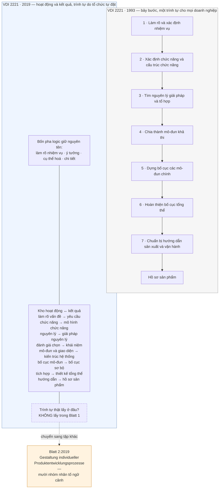
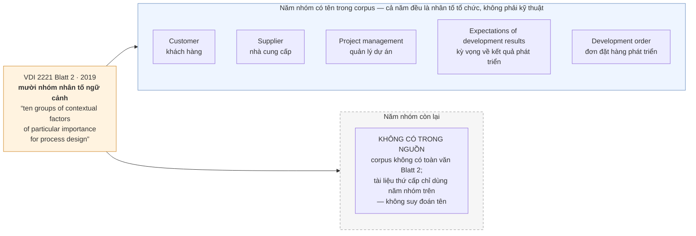

# Chương 05 — VDI 2221:2019: lần nhượng bộ được viết thành văn bản

Có một loại bằng chứng mà không tuyến phê bình nào mua được: bị cáo tự khai. Suốt hai mươi sáu năm, phe phê bình
nói rằng khung bảy bước của VDI 2221 quá cứng, quá trừu tượng, không sống được trong một doanh nghiệp thật.
Phe quy định trả lời rằng đó là lỗi của người áp dụng, không phải lỗi của tiêu chuẩn. Rồi năm 2019, chính
cơ quan ban hành tiêu chuẩn cắt văn bản của mình làm đôi, bỏ chuỗi bảy bước đánh số ra khỏi vai trò khung
bắt buộc, và dựng hẳn một tập riêng chỉ để dạy doanh nghiệp cách **không** làm theo khung. Nếu bỏ qua chương
này, phần còn lại của cuốn sách sẽ đọc như một cuộc công kích từ bên ngoài. Đọc chương này rồi thì thấy khác:
lời buộc tội nặng nhất đối với khung cứng nằm trong chính văn bản kế nhiệm của nó.

Chương 04 đã dựng xong hiện trường. Bảy bước, bốn pha, ánh xạ đầu vào–đầu ra sạch sẽ, và cái giá phải trả
để một phương pháp trở thành tiêu chuẩn quốc gia: nó phải giả định rằng có một tổ chức đủ kỷ luật để chạy
theo thứ tự đã in. Chương này kể chuyện gì xảy ra khi giả định đó bị chính người viết nó rút lại. Neo của
chương là **mặt tiếp giáp** — không phải vì tôi tìm được thêm một nghiên cứu chê tiêu chuẩn, mà vì lần này
chỗ vỡ được ghi vào chính văn bản tiêu chuẩn, dưới dạng một cấu trúc mới sinh ra để vá nó.

Ba thứ lấy được từ chương này. Một, hiểu **vì sao phải tách đôi** một tiêu chuẩn đang chạy — và vì sao lý do
mà văn bản đưa ra để giải thích việc tách chính là lời thú nhận. Hai, nắm cơ chế thay thế: **mười nhóm nhân
tố ngữ cảnh** thay chỗ cho chuỗi bước bắt buộc, và biết đích xác corpus này biết tên năm nhóm nào, không
biết tên năm nhóm nào. Ba, đọc được bản 2019 như một **canh bạc mới** chứ không phải như dấu chấm hết cho
canh bạc — vì gánh nặng chỉ đổi chỗ, từ "tổ chức phải theo được quy trình" sang "tổ chức phải tự biết mình
đang ở bối cảnh nào".

Một lời nhắc trước khi đi tiếp, đã khai ở Chương 01 và áp cho toàn chương này: **corpus của cuốn sách không
có toàn văn tiêu chuẩn VDI nào**. Thứ gần nhất là một bản trích mẫu song ngữ Đức–Anh của Blatt 1 bản 2019
và hai trang mục lục. Mọi khẳng định về nội dung bên trong Blatt 2 trong chương này đều đi qua **tài liệu
thứ cấp** — chủ yếu là một bài báo bình duyệt của hai tác giả công nghiệp. Chỗ nào tài liệu thứ cấp không
nói, chương này ghi thẳng là không nói, chứ không điền vào giúp.

---

## Tách một tiêu chuẩn làm đôi là một hành động thú nhận

Bản trích mẫu Blatt 1:2019 giải thích việc tách bằng đúng một câu:

> `"It was divided into two parts to make it easier to put into practice:"`
> — nguồn `[15]`, bản trích mẫu song ngữ VDI 2221 Blatt 1:2019

Câu này không nói "để rõ ràng hơn về mặt học thuật", không nói "để cập nhật thuật ngữ", không nói "để phù
hợp với số hoá". Nó nói: *để dễ đưa vào thực hành hơn*. Một tiêu chuẩn chỉ cần viết câu đó khi có người
đã báo rằng bản trước **khó** đưa vào thực hành. Lý do được nêu ra để biện minh cho việc tách chính là
lời buộc tội đối với cấu trúc cũ, phát ngôn bởi bên có thẩm quyền cao nhất để bác nó.

Hình dạng của lần tách:

| | **Blatt 1 (2019-11)** | **Blatt 2 (2019-11)** |
|---|---|---|
| Tên tiếng Đức | *Entwicklung technischer Produkte — Modell der Produktentwicklung* | *Entwicklung technischer Produkte und Systeme — Gestaltung individueller Produktentwicklungsprozesse* |
| Trả lời câu hỏi | Phát triển sản phẩm **là gì** | Doanh nghiệp **cắt may** quy trình cho mình thế nào |

*Cắt may* — **tailoring** trong nguyên bản — là việc doanh nghiệp tự dựng quy trình phát triển riêng của
mình từ một bộ nhân tố ngữ cảnh, thay vì nhận một trình tự in sẵn rồi làm theo. Chương 02 hẹn định nghĩa
này ở đây; từ dòng này trở đi, mỗi lần chương viết *cắt may* là viết về thao tác ấy.
| Đối tượng mô tả | Mô hình tổng quát | Nhân tố ngữ cảnh của một tổ chức cụ thể |

Nguyên văn của hai tên tập, kèm năm ban hành, có trong nguồn:

> `"VDI 2221-1 (2019), VDI 2221 Blatt 1: 2019-11 Entwicklung technischer Produkte - Modell der
> Produktentwicklung, Beuth, Berlin"` / `"VDI 2221-2 (2019), VDI 2221 Blatt 2: 2019-11 Entwicklung
> technischer Produkte und Systeme - Gestaltung individueller Produktentwicklungsprozesse, Beuth, Berlin"`
> — nguồn `[12]`

Đọc hai cái tên cạnh nhau thì thấy một sự dịch chuyển về **chủ ngữ**. Blatt 1 nói về *sản phẩm* —
"mô hình phát triển sản phẩm". Blatt 2 nói về *quy trình của từng tổ chức* — "thiết kế các quy trình phát
triển sản phẩm cá biệt". Chữ *individueller* làm toàn bộ công việc nặng nhọc ở đây. Bản 1993 có đúng một
quy trình cho mọi doanh nghiệp. Bản 2019 dành hẳn một tập để nói rằng quy trình đúng là quy trình cá biệt.

**Vì sao đây không phải một thay đổi biên tập.** Một tiêu chuẩn tồn tại để loại bỏ tính cá biệt — đó là
định nghĩa của việc chuẩn hoá. Khi cơ quan chuẩn hoá xuất bản một tập hướng dẫn cách làm ra quy trình
**không giống ai**, nó đang chuẩn hoá đúng cái việc thoát khỏi chuẩn. Cấu trúc mới thừa nhận rằng thứ có
thể chuẩn hoá được là *cách suy nghĩ về bối cảnh*, không phải *trình tự công việc*.

Bản trích mẫu cũng trích được mục lục của Blatt 1, và bố cục ấy nói thêm một điều:

| Mục | Trang |
|---|---|
| `"1 Anwendungsbereich"` — phạm vi áp dụng | 3 |
| `"2 Begriffe"` — thuật ngữ | 4 |
| `"3 Grundlagen der Produktentwicklung"` — nền tảng phát triển sản phẩm | 11 |
| `"4 Modell der Produktentwicklung"` — mô hình phát triển sản phẩm | 23 |

— nguồn `[15]`, bốn dòng mục lục đầu

Mô hình phát triển sản phẩm — thứ mang tên tập — bắt đầu ở trang 23. Trước nó là phạm vi áp dụng, thuật
ngữ, và nền tảng. *Đây là suy luận của tôi từ số trang trong mục lục, không phải phát biểu của nguồn:*
phần lớn văn bản đứng trước mô hình là phần dựng ngôn ngữ chung, không phải phần chỉ việc. Điều đó khớp
với nhận xét lịch sử ở mục sau, rằng hướng dẫn thiết kế đã trôi dần từ chỉ dẫn hành động sang chỉ dẫn ở
mức trừu tượng.

---

## Bảy bước rời khỏi vai trò khung, và cái thay chỗ không còn tên là "bước"

Bản 1993 mà Chương 04 đã mổ có một câu định danh sạch sẽ:

> `"The design process as presented by the VDI 2221 standard is based on 7 stages..."`
> — nguồn `[7]`

Bốn pha logic thì không đổi qua hai bản:

> `"The guideline encompasses the four main design phases: clarification of the task, conceptual design,
> embodiment design and detail design."`
> — nguồn `[13]`

Cái đổi nằm ở tầng dưới bốn pha. Ở bản 2019, tài liệu thứ cấp mô tả nội dung không còn là một chuỗi
*stages* đánh số bắt buộc, mà là một tập **hoạt động** kèm **kết quả** tương ứng, đặt trong bốn pha logic
cũ. Danh sách hoạt động, theo cách trình bày của Göhlich và cộng sự:

| # | Hoạt động | Kết quả tương ứng |
|---|---|---|
| — | Clarifying and specifying the problem or task | Requirements |
| — | Determining functions and their structures | Function models |
| — | Search for solution principles and their structures | Principle solutions |
| — | Evaluate and select solution concepts | Solution concept |
| — | Structure into modules, definition of interfaces | System architecture |
| — | Develop layout of modules | Preliminary layouts |
| — | Integration of modules | Overall design |
| — | Prepare production and operating instructions | Product documentation |

**Cột số hiệu để trống là cố ý, và đây là chỗ phải nói rõ.** Tệp khai thác ghi thẳng rằng thông tin đếm số
lượng cụ thể — "tám hoạt động cốt lõi", "tám kết quả đầu ra" — dưới dạng câu văn **không có trong nguồn**.
Danh sách có đủ tám dòng. Không câu nào trong vật liệu đang có tự viết ra con số tám. Nên chương này liệt
kê danh sách và **không** gọi nó là "khung tám bước". Đây đúng lớp bẫy mà Chương 03 đã gặp với danh sách
cụ thể hoá của Pahl-Beitz: văn bản liệt kê đủ, người đọc điền con số vào giúp, rồi trích như thể nguồn nói
vậy.

Việc để trống cột số hiệu không chỉ là kỷ luật trích dẫn. Nó **đúng về mặt nội dung**. Điểm của bản 2019
là các mục này không còn buộc chạy theo thứ tự; đánh số cho chúng là dựng lại đúng cái vừa bị tháo. So
sánh hai cột trong sơ đồ dưới đây theo hướng đó: bên trái là một dây chuyền, bên phải là một kho hoạt
động cộng với một cơ chế chọn nằm ở tập khác.

Mũi tên đứt nét là toàn bộ nội dung của chương. Ở bản 1993, câu hỏi *"làm việc gì trước, việc gì sau"* có
câu trả lời in sẵn trong tiêu chuẩn. Ở bản 2019, câu hỏi ấy bị đẩy ra khỏi tập mô hình và giao cho một tập
khác — một tập không trả lời thay, mà đưa cho tổ chức một bộ nhân tố để tự trả lời.

---

## Mười nhóm nhân tố ngữ cảnh — và năm nhóm mà corpus này không biết tên

Đây là mệnh đề định lượng chịu lực của chương, và nó có nguyên văn:

> `"VDI 2221-2 (2019) identifies a total of ten groups of contextual factors which are of particular
> importance for process design."`
> — nguồn `[12]`

Mười **nhóm** nhân tố, không phải mười nhân tố — cách đếm đó tự nó đã nói rằng bên trong mỗi nhóm còn có
nhiều thứ nữa. Và tài liệu thứ cấp chỉ đặt tên cho năm nhóm, vì bài báo đó chỉ dùng năm:

> `"Five of these ten factors are addressed in the proposed PRS model."`
> — nguồn `[12]`

Năm nhóm được đặt tên: **Customer** · **Supplier** · **Project management** · **Expectations of development
results** · **Development order**.

**Năm nhóm còn lại: không có trong nguồn.** Không phải "tôi chưa tìm ra", mà là vật liệu khai thác không
chứa tên chúng, và cuốn sách này không có toàn văn Blatt 2 để tra. Viết ra đây thay vì lặng lẽ bỏ qua, vì
ba lý do. Thứ nhất, luật của cuốn sách: con số nào không có nguyên văn thì không được xuất hiện, và tên
nào không có trong nguồn thì không được đoán. Thứ hai, một danh sách năm-trên-mười **nhìn** như một danh
sách đầy đủ nếu không ghi chú — đúng cơ chế đã suýt làm hỏng ba lần ở dự án anh em. Thứ ba, và quan trọng
nhất về mặt nội dung: **chỗ trống ấy là bằng chứng cho luận điểm của chương**. Cái mà một bài báo công
nghiệp thấy cần dùng lại là năm nhóm chạm trực tiếp vào quan hệ hợp đồng và tổ chức — khách hàng, nhà cung
cấp, quản lý dự án, kỳ vọng kết quả, đơn hàng phát triển. Không một nhóm nào trong năm nhóm được đặt tên
là nhân tố **kỹ thuật**.

**Cơ chế thay thế, phát biểu gọn.** Bản 1993 nói: *đây là trình tự, hãy theo*. Bản 2019 nói: *đây là các
nhóm nhân tố quyết định trình tự nào đúng cho anh, hãy tự dựng lấy trình tự*. Đó là chuyển từ một mệnh
lệnh sang một hàm số — và tổ chức phải tự cung cấp tham số đầu vào.

Cần nói thêm cho công bằng với nguồn: **corpus này không có mô tả quy trình cắt may từng bước của Blatt 2**.
Tệp khai thác ghi rõ rằng khi truy vấn thu hẹp phạm vi, toàn bộ chi tiết tailoring của Blatt 2 là *không có
trong nguồn* vì tài liệu đó bị loại khỏi phạm vi. Cái chắc chắn có, và đủ để chương này đứng: sự tồn tại
của Blatt 2, tên đầy đủ của nó, mục đích của nó, và phép đếm mười nhóm. Cái không có: tên năm nhóm còn lại,
thủ tục áp dụng, và tiêu chí biết khi nào cắt may xong.

---

> **Đào sâu: năm ví dụ điển hình, hay là dấu vết của một cuộc thua**
>
> Trang mục lục của tiêu chuẩn cho một chi tiết dễ lướt qua:
>
> > `"the standard provides not only systematic instructions for action, but also an orientation aid in
> > the form of five representative case examples."`
> > — nguồn `[16]`
>
> Một tiêu chuẩn đóng gói kèm **năm ví dụ điển hình** làm *orientation aid* — trợ giúp định hướng. Từ ngữ
> ấy thừa nhận rằng chỉ dẫn hệ thống, tự nó, không đủ để người đọc biết mình đang ở đâu.
>
> Đặt cạnh chẩn đoán lịch sử của Jänsch và Birkhofer thì thấy một đường thẳng:
>
> > `"The instructions have changed from statements that can be immediately put into action or thought to
> > instruction on an abstract level, which need to be adapted to the current situation of the designer."`
> > — nguồn `[13]`
>
> Chỉ dẫn trôi lên mức trừu tượng, nên phải bù bằng ví dụ để kéo người đọc trở lại mặt đất. **Chương 04
> đã đo hiện tượng ấy bằng con số** — bản *Weißdruck* của VDI 2221 mỏng hơn bản của tiêu chuẩn nó thay
> thế, và một phần ba nội dung còn lại dành cho tích hợp CAD chứ không cho cách nghĩ `[13]`.
>
> Đặt hai thứ cạnh nhau thì năm ví dụ điển hình của Blatt 2 đọc ra khác hẳn: hướng dẫn đã ngắn đi và
> trừu tượng lên, phần cụ thể còn lại thì nói về công cụ. Ví dụ điển hình là câu trả lời cho tình trạng
> đó — và là dấu vết của cuộc thua trước đó.

---

## Ai nhượng bộ ai: đọc lại phả hệ 1954 → 2019

Nhượng bộ chỉ có nghĩa khi biết hai phe là ai. **Phả hệ đã dựng đầy đủ ở Chương 04** — Kesselring 1954,
Hansen 1965, VDI 2222 năm 1973, rồi loạt tiêu chuẩn VDI thập niên 1970, mỗi mốc kèm nguyên văn `[13]`
`[15]`. Ở đây chỉ cần hai mốc mới mà Chương 04 chưa dùng:

| Năm | Sự kiện | Nguyên văn |
|---|---|---|
| khoảng 1990 | Giới khoa học bắt đầu đưa đề xuất mới vào | `"Since about 1990, suggestions have been coming from the scientific field too."` `[15]` |
| 2019 | Blatt 1 và Blatt 2 cùng ban hành, tháng 11 | `"VDI 2221 Blatt 1: 2019-11 …"` / `"VDI 2221 Blatt 2: 2019-11 …"` `[12]` |

Và một câu của cùng bài báo lịch sử, câu mô tả **hướng đi** của cả dải — Chương 04 trích nó để nói về
việc thành tiêu chuẩn, ở đây nó phải đọc lại theo chiều ngược:

> `"The direction of the guidelines has changed from a personal support for individuals (Kesselring)
> towards a general procedure for a company addressing organization and content (VDI 2221)."`
> — nguồn `[13]`

Từ **hỗ trợ cá nhân** sang **thủ tục chung cho một công ty**. Điểm xuất phát năm 1954 là một người thiết
kế đang bí; điểm đến năm 1993 là một sơ đồ tổ chức. Bản 2019 không quay lại điểm xuất phát — nó không trả
lại các câu hỏi gợi mở cho cá nhân. Nó đi tiếp một nấc nữa theo cùng hướng: từ *thủ tục chung cho một công
ty* sang *thủ tục mà mỗi công ty tự dựng*. Đối tượng được phục vụ vẫn là tổ chức, không phải người thiết kế.

**Vậy ai nhượng bộ ai.** Phe quy định nhượng bộ phe phê bình đúng một điểm, và điểm ấy lớn: *không tồn tại
một trình tự đúng cho mọi tổ chức*. Hơn hai thập niên phê bình đòi đúng câu đó. Nhưng nhượng bộ dừng ngay ở đó.
Phe phê bình còn một luận điểm nữa, nặng hơn — rằng con người **không** thiết kế theo lối tuyến tính từ
trừu tượng xuống cụ thể, nên mọi mô hình quy định đều mô tả sai hoạt động thật. Bản 2019 không đụng vào
luận điểm đó. Nó giữ nguyên bốn pha, giữ nguyên tên các hoạt động, giữ nguyên chuỗi kết quả từ *requirements*
tới *product documentation*. Nó chỉ tháo cái khớp nối cứng giữa chúng.

Bên phê bình ghi nhận đúng mức độ ấy, và câu ghi nhận cũng nên đọc kỹ:

> `"Some of these shortcomings have been addressed during the revision of the VDI 2221-1 (2019) guideline
> incorporating much of the research on design processes conducted over the last decades."`
> — nguồn `[12]`

`"Some of these shortcomings"` — **một số**. Đây là đánh giá của hai tác giả `[12]` — hai người trong công
nghiệp, tiểu sử của họ được nêu ở mục sau — trong một bài báo
bình duyệt, không phải phát biểu của VDI. Bản thân từ *some* là phần thông tin: người trong ngành ghi nhận
tiến bộ mà không ghi nhận là đã xong. Trích câu này mà bỏ chữ *some* là biến một lời khen dè dặt thành một
chứng nhận, và đó là kiểu xuyên tạc không cần sai một chữ nào.

---

## Chỗ nhượng bộ không chạm tới

Ba khiếm khuyết mà bản 2019 để nguyên. Cả ba đều có nguyên văn trong corpus, và cả ba sẽ trở lại ở Phần IV.

**Một — quyết định lớn nhất vẫn ra ở lúc biết ít nhất.** Vielhaber mô tả chỗ này bằng một câu không thể
tránh:

> `"...it gets obvious that the main decision point when selecting the solution principle is based on
> partial knowledge, only. All knowledge gained afterwards through detailing, prototyping or realization
> (hatched area in the diagram) is either lost for this respective decision or may lead to revisiting that
> decision, later on."`
> — nguồn `[10]`

Tháo thứ tự bắt buộc không sửa được điều này. Dù tổ chức tự dựng trình tự riêng, điểm chọn nguyên lý giải
pháp vẫn nằm trước khi có tri thức từ chi tiết hoá và chế thử. Cắt may quy trình không tạo ra tri thức
sớm hơn.

**Hai — danh sách yêu cầu vẫn được đọc như một việc làm xong.** Chương 04 trích trọn câu của `[12]` về
chế độ hỏng này: các mô hình tạo ấn tượng rằng lập xong danh sách yêu cầu là xong việc, *dù chúng thường
có dặn phải liên tục soát lại*. Điều đáng ghi ở đây là bản 2019 **giữ nguyên hình dạng đó**: *Requirements*
vẫn là kết quả đứng đầu bảng, và hình dạng của mô hình dạy mạnh hơn lời dặn trong mô hình.

**Ba — cách tài liệu nhập vào công việc thật vẫn bỏ trống.** Cũng đã trích ở Chương 04: các tiêu chuẩn mô
tả nội dung và cách sinh ra tài liệu yêu cầu nhưng không mô tả cách tích hợp chúng vào quá trình phát
triển `[12]`; và ở điểm bàn giao ra ngoài phòng thiết kế — nhất là khi giao cho nhà cung cấp — chỉ phần
tài liệu tối thiểu bắt buộc đi qua được `[10]`. Bản 2019 không chạm tới cả hai chỗ này.

Ba khiếm khuyết này có một điểm chung: **không cái nào là khiếm khuyết của trình tự**. Chúng là khiếm
khuyết ở chỗ phương pháp chạm vào tổ chức — thời điểm ra quyết định, cách tài liệu được đối xử, cái gì đi
qua được ranh giới đơn vị. Bản 2019 sửa trình tự. Ba chỗ này nằm ngoài tầm với của việc sửa trình tự.

---

## Phương pháp này giả định một tổ chức như thế nào

Bản 1993 giả định một tổ chức **có kỷ luật theo trình tự**: đủ người, đủ thời gian, đủ quyền lực quản lý
để chạy bảy bước theo đúng thứ tự in ra, kể cả khi áp lực giao hàng nói ngược lại. Đó là canh bạc mà
Chương 04 đã mổ.

Bản 2019 tháo canh bạc đó ra và đặt vào một canh bạc khác, và canh bạc mới **nặng hơn** ở đúng chỗ ít ai
nhìn. Nó giả định một tổ chức **tự biết bối cảnh của mình**. Muốn dùng được Blatt 2, tổ chức phải trả lời
đúng về mười nhóm nhân tố ngữ cảnh của chính nó: quan hệ với khách hàng thật sự là gì, nhà cung cấp nắm
những gì, quản lý dự án đang vận hành theo cơ chế nào, kỳ vọng về kết quả phát triển được ai đặt ra và có
được viết xuống không, đơn đặt hàng phát triển thật sự ràng buộc điều gì.

Đây không phải một bài kiểm tra dễ hơn bài cũ. Nó là một bài kiểm tra **khác loại**.

| | **Bản 1993** | **Bản 2019** |
|---|---|---|
| Đòi tổ chức điều gì | Tuân thủ một trình tự đã in | Mô tả đúng bối cảnh của chính mình |
| Sai thì lộ ra khi nào | Sớm — ai cũng thấy bước bị bỏ | Muộn — quy trình vẫn chạy, chỉ là chạy trên mô tả sai |
| Ai chịu trách nhiệm khi hỏng | Người không theo quy trình | *Không ai được chỉ định* |

*Dòng thứ ba là suy luận của tôi, không phải của nguồn:* corpus không có mô tả cơ chế trách nhiệm nào cho
Blatt 2 — không có câu nào nói ai ký duyệt một quy trình đã cắt may, hay ai trả lời khi nó sai. Chỗ trống
ấy có thể là chỗ trống của corpus chứ không của tiêu chuẩn; nhưng khi một quy trình do chính đơn vị dựng
ra thì câu hỏi *ai chịu trách nhiệm* đổi bản chất, và không tài liệu nào trong 66 tài liệu trả lời.
| Có tiêu chí biết mình đúng không | Có — đối chiếu với bảy bước | **Không có trong nguồn** cho corpus này |

Dòng thứ hai là dòng đắt nhất. Không theo được bảy bước thì tổ chức biết ngay, vì có một chuẩn ngoài để
đối chiếu.

Một ca ở mức loại tình huống, để luận điểm này không đứng bằng lập luận thuần. Một đơn vị làm hàng loạt
nhỏ, biến thể nhiều, khách hàng cũ — nhưng tự chấm mình vào ô *phát triển sản phẩm mới* khi điền bộ nhân
tố ngữ cảnh, vì đó là ô nghe đúng với cách đơn vị muốn được nhìn nhận. Quy trình cắt may ra từ ô ấy sẽ đòi
một pha ý tưởng đầy đủ cho từng biến thể, và đơn vị sẽ bỏ pha ấy ở **mọi** dự án vì nó vô lý với công việc
thật. Sau một năm, hồ sơ cho thấy một quy trình được ban hành và không bao giờ chạy — đúng mẫu hình của
Chương 01, nhưng lần này sinh ra từ một bản tự chẩn đoán sai chứ không từ một tiêu chuẩn áp từ ngoài. Không
có bước nào bị bỏ để mà đếm; cái sai nằm ở ô đã tick từ đầu.

Còn tự mô tả sai bối cảnh của mình thì không có gì báo động: quy trình cắt may xong vẫn trông
hợp lý, vẫn có tài liệu, vẫn có người ký. Nó chỉ hỏng ở chỗ nó bỏ qua một nhân tố mà tổ chức không nhìn
thấy vì tổ chức chưa bao giờ nhìn thấy nhân tố đó. **Cắt may quy trình theo một bản tự chẩn đoán sai thì
cho ra một quy trình sai một cách có hệ thống, và trông chính đáng hơn hẳn quy trình cứng bị bỏ bước.**

Có một lý do cụ thể để nghi ngờ năng lực tự chẩn đoán ấy, và nó nằm ngay trong danh sách năm nhóm được đặt
tên. Cả năm — khách hàng, nhà cung cấp, quản lý dự án, kỳ vọng kết quả, đơn hàng phát triển — đều là những
thứ **không thuộc quyền của phòng thiết kế**. Người được giao đọc tiêu chuẩn thiết kế thường là kỹ sư
trưởng. Người biết thật về đơn hàng phát triển và kỳ vọng kết quả thường ngồi ở chỗ khác trong tổ chức, và
thường không đọc VDI 2221. Bản 2019 giao một bài tập cho một vai, mà dữ liệu để làm bài lại nằm trong tay
những vai khác. *Đây là suy luận của tôi từ danh sách năm nhóm, không phải phát biểu của nguồn nào.*

Bằng chứng gián tiếp cho việc bài tập này khó: chính bài báo dùng mười nhóm ấy chỉ tích hợp được **năm**
— `"Five of these ten factors are addressed in the proposed PRS model."` Đó là hai tác giả với hai mươi mốt
năm phát triển xe hơi và mười hai năm ngành đường sắt sau lưng —
`"Before joining the Technische Universität Berlin, the first author worked in the passenger car development
of Mercedes-Benz and Smart vehicles for 21 years."` và `"Before joining the Ruhr Universität Bochum, the
second author worked in the rail industry with Bombardier Transportation for 12 years in an international
context."` `[12]` Nếu họ chỉ đưa được một nửa số nhóm vào một mô hình quy trình, thì con số mà một tổ chức
vài chục người đưa vào được là bao nhiêu — *câu này tôi đặt ra, nguồn không trả lời.*

Đó cũng là lý do vì sao chương này không dừng ở chỗ câu chuyện đang hay. Bản 2019 là một cải tiến thật, đo
được, và nó sửa đúng cái mà phê bình đã đòi suốt quãng ấy. Nhưng cải tiến ấy chuyển gánh nặng chứ không gỡ
gánh nặng: từ *anh có theo nổi quy trình của chúng tôi không* sang *anh có biết anh là ai không*. Cả hai đều
là canh bạc đặt vào tổ chức. Cái sau chỉ khó bắt quả tang hơn.

> **Câu hỏi mang sang Phần IV:** nhượng bộ này có làm phương pháp sống được trong tổ chức thật không? Muốn
> trả lời thì phải rời khỏi lịch sử tiêu chuẩn và hỏi một câu khác hẳn: người ta có thật sự thiết kế theo
> lối mà cả bản 1993 lẫn bản 2019 mô tả không? Chương 12 mở đúng cuộc tranh luận mà chương này là kết quả
> — tuyến quy định đối đầu tuyến mô tả — và ở đó, việc tháo thứ tự bắt buộc sẽ hiện ra như một bước lùi
> chưa đủ xa.

---

## Áp dụng ở Xưởng

Bối cảnh giả định cho cả năm mục: một xưởng cơ khí — điện tử — phần mềm nhúng, quy mô vài chục người, làm
sản phẩm kỹ thuật theo dự án, có cả việc thiết kế mới lẫn việc làm biến thể từ nền cũ.

### 1. **Bản tự khai bối cảnh** — một buổi 90 phút, làm được trong tuần tới

Ngồi xuống với năm nhóm nhân tố có tên trong nguồn — khách hàng, nhà cung cấp, quản lý dự án, kỳ vọng về
kết quả phát triển, đơn đặt hàng phát triển — và viết một trang duy nhất trả lời cho **một** dự án đang
chạy: với dự án này, mỗi nhóm nhân tố đang ở trạng thái nào, và ai trong xưởng là người **biết thật** về
nhóm đó. Quyết định cụ thể phải ra ở cuối buổi: nhóm nào không có người biết thật thì mở một việc đi hỏi,
có tên người và có hạn.

Đây là phần rẻ nhất và có đòn bẩy cao nhất của cả Blatt 2, và nó không cần mua tiêu chuẩn để làm. Cái đắt
không phải bộ nhân tố — cái đắt là thói quen viết bối cảnh xuống trước khi chọn quy trình.

Trang này chỉ có giá trị khi nó **ngắn và bị phản bác được**. Một trang, mỗi nhóm hai đến ba dòng, có tên
người chịu trách nhiệm câu trả lời. Đưa cho một người ngoài phòng thiết kế đọc — nếu họ không cãi được câu
nào thì gần như chắc chắn nó đang viết bằng ngôn ngữ tổng quát đến mức không sai được, và một bản tự chẩn
đoán không thể sai là một bản tự chẩn đoán vô dụng.

### 2. **Tách bảng quy trình khỏi bảng bối cảnh**

- **Vấn đề nó giải:** khi quy trình chuẩn và ngoại lệ nằm chung một tài liệu, mọi lần cắt bước đều trông
  như vi phạm, nên người ta cắt lặng lẽ và không ai ghi lại lý do.
- **Cách áp:** làm đúng động tác mà VDI đã làm năm 2019 — một tài liệu mô tả các hoạt động và kết quả cần
  có, một tài liệu riêng ghi bối cảnh nào thì bỏ hoạt động nào. Cắt bước theo tài liệu thứ hai là hành vi
  hợp lệ, có ghi vết; cắt bước không viện dẫn tài liệu thứ hai thì không.
- **Bẫy:** tài liệu thứ hai biến thành nơi hợp thức hoá mọi lần cắt sau khi đã cắt. Chốt chặn duy nhất
  hoạt động được: bối cảnh phải viết **trước** khi dự án bắt đầu, không viết vào lúc rà soát.

### 3. **Đặt tên hoạt động theo kết quả, không theo số thứ tự**

- **Vấn đề nó giải:** gọi "bước 3" thì cả xưởng ngầm hiểu là phải xong bước 2, kể cả khi bước 2 đang chờ
  một câu trả lời từ khách hàng và bước 3 chạy được ngay.
- **Cách áp:** mỗi hoạt động mang tên kết quả mà nó đẻ ra — *mô hình chức năng*, *giải pháp nguyên lý*,
  *kiến trúc hệ thống*, *bố cục sơ bộ*. Bảng theo dõi dự án liệt kê **kết quả đã có** và **kết quả còn
  thiếu**, không liệt kê bước đã qua. Đây chính là hình dạng mà bản 2019 chuyển sang.
- **Bẫy:** bỏ số thứ tự mà không thay bằng ràng buộc phụ thuộc thì sẽ có người bắt đầu bố cục khi chưa có
  giải pháp nguyên lý. Phải ghi rõ kết quả nào là đầu vào bắt buộc của kết quả nào — tháo **thứ tự**, giữ
  **phụ thuộc**.

### 4. **Một hồ sơ riêng cho phương án bị loại**

- **Vấn đề nó giải:** tri thức rời khỏi tổ chức đúng lúc dày nhất — `"Many ideas get evaluated and
  discarded, tests are done, requirements are traded off and sketches discussed. If not intentionally and
  systematically kept, this may lead to a huge knowledge loss for the design department."` `[10]`
- **Cách áp:** mỗi lần chọn phương án, ghi nửa trang cho phương án **bị loại**: nó là gì, bị loại vì tiêu
  chí nào, và điều kiện nào thay đổi thì nên xét lại. Nửa trang đó nằm cùng chỗ với bản chọn, không nằm
  trong thư mục cá nhân của người thiết kế.
- **Bẫy:** viết lý do loại bằng ngôn ngữ kết luận — "không khả thi", "không kinh tế". Lý do loại phải nêu
  **ngưỡng** đã dùng, vì ngưỡng là thứ có thể đổi; kết luận thì không.

### 5. **Điểm bàn giao ra ngoài phòng thiết kế được coi là một mặt tiếp giáp, không phải một mốc**

- **Vấn đề nó giải:** chỗ mất tri thức nặng nhất là chỗ dự án rời phòng thiết kế —
  `"only the minimum of documentation directly required may be transferred."` `[10]` Bộ hồ sơ đúng chuẩn
  vẫn có thể đi qua mà không mang theo lý do đằng sau nó.
- **Cách áp:** ở mỗi lần bàn giao ra xưởng chế tạo hoặc ra nhà cung cấp, kèm một trang trả lời ba câu:
  ba quyết định nào không được đổi và vì sao; ba chỗ nào có thể đổi nếu chế tạo khó; ai là người trả lời
  khi có mâu thuẫn. Trang này đi cùng hồ sơ, không thay hồ sơ.
- **Bẫy:** biến trang đó thành biểu mẫu ký cho đủ. Dấu hiệu nó đã chết: ba câu trả lời giống hệt nhau qua
  nhiều dự án khác nhau. Khi đó nên bỏ hẳn, vì một biểu mẫu chết còn tệ hơn không có, nó tạo cảm giác chỗ
  ấy đã được canh.

---
## Sổ kiểm của chương

- **Neo luận đề:** *Mặt tiếp giáp*. Nối rõ ở ba chỗ: mục **"Chỗ nhượng bộ không chạm tới"** — ba khiếm
  khuyết còn lại đều nằm ở chỗ phương pháp chạm tổ chức, không nằm ở trình tự; mục **"Phương pháp này giả
  định một tổ chức như thế nào"** — bảng đối chiếu 1993/2019 với dòng *"sai thì lộ ra khi nào"*; và mục
  **"Mười nhóm nhân tố ngữ cảnh"** — cả năm nhóm có tên đều là nhân tố tổ chức, không có nhân tố kỹ thuật.
  Nối ngược đích danh về Ch04 ở đoạn mở thứ hai và ở đầu mục *"Phương pháp này giả định…"*. Nối tới Ch12
  ở khối câu hỏi chuyển tiếp cuối chương; nhắc Ch03 ở mục về danh sách hoạt động.

- **Nguồn đã dùng:** `[7]`, `[10]`, `[12]`, `[13]`, `[15]`, `[16]` — tất cả nằm trong dòng "Nguồn:" của các
  mục đã lấy vật liệu trong `c2-vdi2221-1986-2019_Exploration.md`.

- **Con số có nguyên văn:**
  - *bảy bước, bản 1993* — `"The design process as…"` `[7]`
  - *bốn pha logic* — `"The guideline encompasses the four…"` `[13]`
  - *tách làm hai phần, 2019* — `"It was divided into…"` `[15]`
  - *năm ban hành Blatt 1 và Blatt 2 là 2019-11* — `"VDI 2221-1 (2019), VDI 2221 Blatt 1…"` `[12]`
  - *mười nhóm nhân tố ngữ cảnh* — `"VDI 2221-2 (2019) identifies a total…"` `[12]`
  - *năm nhóm được mô hình PRS dùng* — `"Five of these ten…"` `[12]`
  - *năm ví dụ điển hình kèm theo tiêu chuẩn* — `"the standard provides not only…"` `[16]`
  - *khoảng 1990 — đề xuất từ giới khoa học* — `"Since about 1990…"` `[15]`
  - *(các mốc 1954 Kesselring · 1965 Hansen · 1973 VDI 2222 · thập niên 1970 · 50 năm phát triển hướng
    dẫn · một phần ba phần mô tả dành cho CAD — nguyên văn in ở **Chương 04**; chương này chỉ nhắc lại
    bằng một dòng kèm số hiệu, không trích lại)*
  - *21 năm Mercedes-Benz · 12 năm Bombardier* — `"Before joining the Technische…"` / `"Before joining the
    Ruhr…"` `[12]`
  - *"some of these shortcomings" — mức độ được ghi nhận* — `"Some of these shortcomings…"` `[12]`

- **Con số đã BỎ vì không có nguyên văn:**
  - **"tám hoạt động" và "tám kết quả" của bản 2019.** Tệp khám phá ghi thẳng rằng phép đếm này *không có
    trong nguồn* dưới dạng câu văn. Chương liệt kê danh sách, để trống cột số hiệu, và nói ra lý do trong
    thân bài. Cùng lớp bẫy với danh sách cụ thể hoá ở Ch03.
  - **Tên năm nhóm nhân tố ngữ cảnh còn lại.** Không có trong nguồn — đã viết ra trong thân bài và đưa vào
    sơ đồ thứ hai như một ô có nội dung, không xoá đi cho gọn.
  - **Năm ban hành bản VDI 2221 đầu tiên (1986).** Tệp khám phá trả `"không có trong nguồn"`; chỉ trích được
    `"Engl. version 1987"`. Chương không nhắc mốc 1986.
  - **Quy trình cắt may từng bước của Blatt 2, số trang Blatt 2, tiêu chí kết thúc cắt may.** Không có trong
    nguồn — đã ghi rõ giới hạn này ở cuối mục về mười nhóm nhân tố.
  - **Mọi số liệu về doanh nghiệp vừa và nhỏ.** Tệp khám phá xác nhận không có câu định lượng nào; chương
    không đưa ra khẳng định định lượng nào về quy mô doanh nghiệp.

- **Chỗ là suy luận của tác giả, không phải của nguồn:**
  1. Đọc câu `"It was divided into two parts to make it easier to put into practice:"` như một **lời thú
     nhận** rằng bản trước khó đưa vào thực hành. Nguồn nêu lý do tách; việc gọi đó là nhượng bộ là thao tác
     của cuốn sách này.
  2. Nhận xét rằng mô hình phát triển sản phẩm bắt đầu ở trang 23 của Blatt 1, sau phạm vi–thuật ngữ–nền
     tảng, và đọc điều đó như dấu hiệu văn bản nghiêng về dựng ngôn ngữ hơn chỉ việc. Suy ra từ số trang
     trong mục lục được trích nguyên văn; đã ghi rõ tại chỗ.
  3. Nhận xét rằng **cả năm nhóm nhân tố có tên đều là nhân tố tổ chức, không có nhân tố kỹ thuật** — nguồn
     liệt kê tên, việc phân loại là của tôi.
  4. Lập luận rằng năm nhóm ấy nằm ngoài quyền của phòng thiết kế, nên bài tập tự chẩn đoán được giao cho
     một vai không nắm dữ liệu. Đã ghi rõ trong thân bài là suy luận.
  5. Bảng đối chiếu *"sai thì lộ ra khi nào"* và mệnh đề rằng một quy trình cắt may trên bản tự chẩn đoán
     sai thì **trông chính đáng hơn** một quy trình cứng bị bỏ bước. Không nguồn nào phát biểu điều này.
  6. Câu hỏi *một tổ chức vài chục người đưa vào được bao nhiêu nhóm* — đặt ra trong sách, nguồn không trả
     lời; đã ghi rõ tại chỗ.
  7. Toàn bộ mục *Áp dụng ở Xưởng*: chuyển giao từ vật liệu nguồn sang bối cảnh vận hành, không nguồn nào
     đề xuất các động tác này.

- **Cổng an ninh (LUẬT 5):** mục *Áp dụng ở Xưởng* không có tên sản phẩm, mã dự án, tên đơn vị, tên người,
  tên khách hàng hay nhà cung cấp; không có sản lượng, giá, lịch giao hàng; không nêu lĩnh vực. Bối cảnh
  viết ở mức *"xưởng cơ khí — điện tử — phần mềm nhúng, vài chục người"*.

- **Ba khai báo (LUẬT 8):** khai báo số 2 — *corpus không có toàn văn tiêu chuẩn VDI nào* — được nhắc lại
  ở đoạn mở thứ tư và áp dụng cụ thể hai lần trong thân bài. Khai báo 1 và 3 không dùng trong chương này.

- **Khối bằng chứng nhường cho Chương 04 (khử trùng lặp P6):** bảng phả hệ 1954 / 1965 / 1973 / thập
  niên 1970, cụm Weißdruck 42 trang / 52 trang / một phần ba CAD, và ba trong bốn câu Vielhaber. Chương
  này giữ hai mốc mới (khoảng 1990 · 2019), giữ trọn khối trích cho khiếm khuyết **Một** vì nó nặng
  nhất, và rút hai khiếm khuyết còn lại xuống một dòng kèm số hiệu. Không bằng chứng nào bị mất; ước
  chừng 45 dòng vật liệu kể lại đã cắt.

- **Số dòng:** 548
