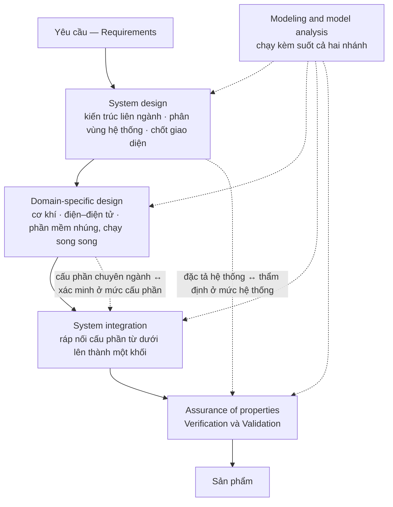
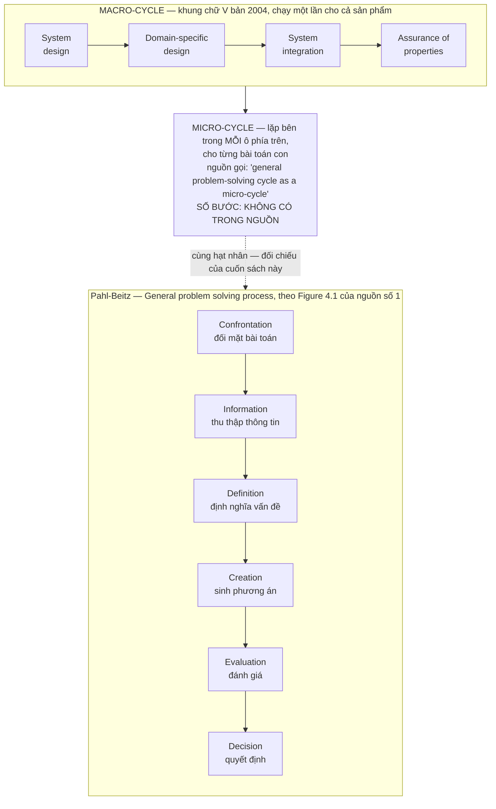

# Chương 06 — VDI 2206: khi hệ thống thành liên ngành

Một phương pháp thiết kế cơ khí giả định rằng sản phẩm phân rã sạch. Chia máy thành cụm, chia cụm thành
chi tiết, giao mỗi mảnh cho một người, ráp lại thì được máy. Giả định đó đứng vững chừng nào mọi mảnh còn
làm bằng cùng một thứ vật liệu tư duy. Khi trong cùng một sản phẩm có một cụm cơ khí, một bo mạch và một
khối phần mềm nhúng, nó gãy — không phải vì các mảnh khó, mà vì chúng **không cắt theo cùng một đường**.
Chức năng nằm ở phần mềm, hỏng ở cơ khí, và biểu hiện ra ở mạch. Không có sơ đồ phân rã nào của phe cơ khí
chứa nổi một đối tượng như thế. Thiếu câu trả lời cho tình huống này, tổ chức làm cái nó luôn làm: mỗi miền
chạy riêng theo phương pháp của mình, và toàn bộ độ phức tạp liên ngành bị đẩy dồn về khâu cuối cùng, nơi
nó xuất hiện dưới cái tên khiêm tốn là "lỗi tích hợp".

Chương 05 kể lại một cuộc nhượng bộ: chính cơ quan tiêu chuẩn Đức, sau hai mươi sáu năm, tách VDI 2221 làm
đôi và thay khung bảy bước bắt buộc bằng mười nhóm nhân tố ngữ cảnh để người dùng tự cắt may. Đó là câu trả
lời cho một loại áp lực — quy trình quá cứng so với nguồn lực của tổ chức thật. Chương này kể câu trả lời cho
một loại áp lực khác hẳn, và đến sớm hơn: không phải quy trình quá cứng, mà **đối tượng thiết kế đã đổi
bản chất**. VDI 2221 nới lỏng dọc theo một trục sẵn có. VDI 2206 phải dựng một trục thứ hai.

Ba thứ lấy được từ chương này. Thứ nhất, cấu trúc hai nhánh đối xứng của chữ V bản 2004, và chính xác nó
mua được cái gì mà một danh sách bước tuyến tính không mua được. Thứ hai, quan hệ macro-cycle và
micro-cycle — khung lớn chạy một lần, chu trình nhỏ lặp bên trong từng ô — và một phát hiện khi đặt chu
trình nhỏ ấy cạnh chuỗi giải quyết vấn đề tổng quát của Pahl-Beitz ở Chương 03. Thứ ba, canh bạc mà bản
2004 đặt cược: rằng kỹ sư của ba miền nói chung một ngôn ngữ mô hình hoá. Nguồn trong tay cho biết khá rõ
canh bạc đó thua ở đâu.

**Một ràng buộc chứng cứ phải nói trước.** Corpus của cuốn sách này không có toàn văn tiêu chuẩn VDI nào —
đã khai báo ở Chương 01. Mọi khẳng định dưới đây về *nội dung* VDI 2206 đi qua tài liệu thứ cấp: bài báo
bình duyệt, chương sách, mục lục tiêu chuẩn, tài liệu giảng dạy. Khi hai tài liệu thứ cấp nói khác nhau,
chương này ghi cả hai thay vì chọn một.

---

## Ba miền, ba nhịp đồng hồ

Thuật ngữ *mechatronics* không sinh ra trong một viện nghiên cứu thiết kế. Nó sinh ra trong một công ty
điện tử: `"In 1969, the Japanese president of YASKAWA Electronic Corporation, Ko Kikuchi, introduced the
term “mechatronics”"` [23]. Từ 1969 đến 2004 — ba mươi lăm năm — mới có một tiêu chuẩn thiết kế mang tên
nó. Khoảng cách ấy là khoảng thời gian ngành thiết kế cần để thừa nhận rằng một sản phẩm gồm ba miền
không phải là ba sản phẩm đặt cạnh nhau.

Vì sao phương pháp cơ khí thuần không mở rộng được, có thể nói gọn trong hai mệnh đề.

**Ba miền tiến hoá với nhịp khác nhau.** Một chi tiết cơ khí, khi đã cắt gọt xong, thay đổi với chi phí
gần như cấm đoán. Một bo mạch thay đổi được, với chi phí một vòng chế bản. Một khối phần mềm thay đổi
trong buổi chiều. Đặt ba thứ có nhịp thay đổi lệch nhau hàng bậc độ lớn vào cùng một kế hoạch tuyến tính
thì bao giờ cũng có một miền phải đứng đợi, và bao giờ cũng có một miền bị dùng làm chỗ hấp thụ mọi sai
lệch của hai miền kia — trong thực tế, luôn là phần mềm.

**Ba miền không phân rã sạch theo miền.** Đây mới là mệnh đề nặng hơn. Phân rã cơ khí là phân rã theo
không gian: cụm này ở đây, cụm kia ở kia. Phân rã phần mềm là phân rã theo trách nhiệm logic, không có
toạ độ. Một chức năng cơ điện tử bất kỳ — giữ vị trí, bù nhiệt, chống rung — chạy xuyên qua cả ba miền
và **không thuộc miền nào**. Cắt theo miền là cắt ngang giữa thân một chức năng.

Hệ quả trực tiếp: khi ba miền cắt theo ba đường khác nhau, thứ quyết định sản phẩm chạy hay không chạy
không nằm trong bất kỳ miền nào, mà nằm ở **mặt cắt giữa chúng**. Và mặt cắt thì không có chủ.

Chính nguồn thừa nhận rằng tình trạng này đè lên người kỹ sư chứ không được tiêu chuẩn gỡ hộ:

> `"Inspite of the wide spectrum of research activities and industrial developments in the mechatronic
> field it seems to be difficult for the design engineer in practice - in particular for the still
> unexperienced one - to select the suitable procedures, methods and tools for his design task."` [26]

Câu này đáng đọc kỹ, vì nó không nói phương pháp thiếu. Nó nói phương pháp **thừa** — thừa đến mức việc
chọn trở thành bài toán riêng, và bài toán ấy rơi xuống đầu người ít kinh nghiệm nhất. Đó là mô tả một
tổ chức, không phải mô tả một kỹ thuật.

| | Cơ khí | Điện — điện tử | Phần mềm nhúng |
|---|---|---|---|
| Vật mang thiết kế | hình học, dung sai | sơ đồ mạch, bố trí bản in | mã nguồn, cấu hình |
| Nhịp đổi một vòng | dài nhất | trung gian | ngắn nhất |
| Trục phân rã | không gian | mạng liên kết | trách nhiệm logic |
| Sai lệch biểu hiện ở đâu | ngay tại chỗ | thường ở nơi khác | thường ở miền khác |

> Bảng trên là **thao tác đối chiếu của cuốn sách này**, dựng từ mô tả định tính về ba miền trong nguồn
> [24] và [25], không phải bảng có sẵn trong tài liệu nào. Không có con số trong bảng vì nguồn không cho
> con số nào về nhịp thay đổi của ba miền — theo LUẬT 1, chỗ nào không có nguyên văn thì để trống, không
> điền ước lượng vào.

Nói cách khác: bài toán mà VDI 2206 nhận không phải "làm sao thiết kế cho tốt hơn". Là **làm sao đặt được
một trục điều phối lên trên ba miền vốn không chia sẻ trục nào**.

---

## Chữ V bản 2004 trả lời thế nào

Câu trả lời năm 2004 không phải là thêm bước. Là **gập danh sách bước lại làm đôi**, cho nửa sau đối diện
nửa trước.

Bản đầu tiên ra đời năm 2004: `"The first release of the VDI Guideline 2206 “Design methodology for
mechatronic systems” of the German Association of Engineers (VDI), was published in 2004."` [23] — một
nguồn thứ hai xác nhận cùng mốc: `"For this purpose, the standard VDI 2206 was published in 2004."` [21].

Hình chữ V không do VDI phát minh; nó nhập từ ngành phần mềm. Và ở đây corpus tự mâu thuẫn về niên đại,
nên phải ghi cả hai:

> `"The V-shaped model is a well-established design process, first introduced by Brohle and Droschl in
> 1993 for software engineering..."` [26]

> `"The original idea of a V-Model for engineering processes was created 1995 by Bröhl and Dröschel in
> the application field of Software Development"` [23]

Cùng hai cái tên, hai năm khác nhau, hai tài liệu thứ cấp bình duyệt. Chương này không phân xử được, và
cũng không cần: điều đáng giữ là **chữ V đến từ phần mềm trước khi đến với cơ điện tử**. Miền có nhịp
nhanh nhất là miền đầu tiên phải nghĩ ra cách gắn kiểm chứng vào từng mức phân rã, vì nó là miền đầu tiên
mà "ráp xong rồi thử" trở nên vô nghĩa.

Bản 2004 chia quá trình phát triển thành bốn pha:

> `"Elle divise le processus de conception en quatre phases majeures appelées « system design »,
> « domain-specific design », « system integration » and « assurance of properties », Figure 1.14
> (Bathelt et al., 2005)."` [20]

Hai mũi tên nét đứt nằm ngang là toàn bộ ý tưởng. Nhánh trái đi xuống là **phân rã**; nhánh phải đi lên là
**tích hợp**; và mỗi mức phân rã bên trái được **ghép cặp trước** với mức kiểm chứng đối diện bên phải.
Ghép cặp trước, nghĩa là lúc viết đặc tả hệ thống thì đã phải viết luôn cách sẽ chứng minh hệ thống đạt
đặc tả ấy. Đó là điều một danh sách bước tuyến tính không làm được: trong danh sách tuyến tính, kiểm chứng
là bước cuối, và bước cuối bao giờ cũng là bước bị cắt khi hết thời gian.

Hai câu hỏi ở đáy nhánh phải được nguồn giảng dạy phát biểu gọn đến mức nên trích thẳng:

> Xác minh — `"Is a correct product being developed?"`
> Thẩm định — `"Is the right product being developed?"` [24]

Một chữ khác nhau, *a* và *the*, và đó là ranh giới giữa "làm đúng cách" với "làm đúng thứ". Một sản phẩm
qua được vế đầu mà trượt vế sau là một sản phẩm được chế tạo hoàn hảo cho một bài toán không ai có.

Còn ô `Modeling and model analysis` không phải một pha, mà là một hoạt động chạy kèm — dùng để
`"predict how a system will behave before it is built"` [24]. Vai trò của nó trong bản 2004 là làm cho
nhánh phải khởi động **trước khi có vật thể**. Đây là hạt giống của toàn bộ tuyến MBSE mà Chương 07 sẽ kể,
và cũng là chỗ bản 2004 gieo một giả định mà lúc gieo chưa ai gọi tên: rằng mô hình đủ tin để thay vật.

Cần ghi thêm rằng bản 2004 không phải cách duy nhất chia việc, kể cả trong chính corpus này. Một tài liệu
mô tả quy trình cơ điện tử theo ba pha khác hẳn: `"The mechatronic design process consists of three
phases: modeling and simulation, prototyping, and deployment."` [25]. Cùng một đối tượng, hai cách cắt.
Điều đó nhắc rằng bốn pha của bản 2004 là **một lựa chọn**, không phải một sự thật của tự nhiên — và
Chương 07 sẽ cho thấy chính VDI về sau bỏ cách cắt này.

### Điều bản thân tài liệu nói về hình vẽ của mình

Trước khi ai kịp phê bình chữ V là tuyến tính, tài liệu trong corpus đã tự ghi điều đó:

> `"It is important to note that this representation shows only one flow through the ''V'' shaped process,
> which does not represent the iterative nature of real development cycles."` [19]

Đây là ca giống hệt ca mười lăm bước cụ thể hoá ở Chương 03: văn bản vẽ ra một dòng chảy, tự nói rằng
dòng chảy ấy không mô tả đúng thực tế lặp, rồi người đọc vẫn đọc thành lịch trình. **Chế độ hỏng không nằm
ở tài liệu. Nằm ở đường từ tài liệu sang tổ chức.** Một tổ chức cần một hình để dán lên tường họp; hình
được dán là hình một chiều; lời cảnh báo đi kèm thì không dán được lên tường.

---

## Macro-cycle và micro-cycle

Chữ V trong đoạn trên là **macro-cycle**: khung toàn cục, chạy cho cả sản phẩm, từ yêu cầu đến bàn giao.
Nhưng khung ấy không nói người kỹ sư làm gì trong một ngày làm việc. Bên trong mỗi ô của chữ V còn một
vòng nhỏ hơn, lặp: **micro-cycle** — chu trình giải quyết vấn đề hình thức, áp cho bất kỳ bài toán con
nào, ở bất kỳ ô nào.

Đây là chỗ phải dừng lại vì một lý do chứng cứ.

> **LUẬT 1 áp ở đây.** Bảng thuật ngữ của chính cuốn sách này ghi micro-cycle là "chu trình giải quyết
> vấn đề **5 bước**". Vật liệu khai thác **không đỡ nổi con số đó**. Nguyên văn ghi trong tệp khám phá:
> *"Số bước cụ thể của chu trình vi mô: **không có trong nguồn**"* — tài liệu chỉ gọi tên nó là
> `"general micro level general problem-solving iteration"` và `"general problem-solving cycle as a
> micro-cycle"`, không liệt kê số bước bằng số ở bất kỳ chỗ nào trong văn bản trích xuất. Vậy nên chương
> này **bỏ con số 5**. Không viết "khoảng năm bước", không viết "nhiều bước". Cái có trong nguồn là *có
> một chu trình giải quyết vấn đề hình thức lặp ở tầng vi mô*; cái không có trong nguồn là *nó gồm mấy
> bước*. Ghi đúng như vậy.

Cái mà nguồn **có** cho, và cho khá chắc, là lý do micro-cycle phải tồn tại. Nó đến từ một danh sách bốn
nguyên lý mà bất kỳ mô hình quy trình nào cũng phải chứa:

> `"Haberfellner et al. identified four essential basic ideas each procedure model should include. These
> principles are: (1) starting from the rough and going to the details (2) consideration of alternative
> solutions (3) divide the process into chronological steps (4) use a formal guideline (problem-solving
> cycle)"` [22]

Bốn nguyên lý này là bộ khung để đọc mọi thứ trong Phần II của cuốn sách. Ba nguyên lý đầu là chuyện của
**macro**: đi từ thô đến tinh, luôn giữ nhiều phương án, chia thành các bước có thứ tự thời gian. Nguyên
lý thứ tư là chuyện của **micro**, và nó được gọi thẳng ra bằng tên: *problem-solving cycle*.

Quan hệ lồng nhau này giải thích một nghịch lý mà người đọc tiêu chuẩn hay vấp: vì sao một khung trông
tuyến tính lại được tác giả của nó gọi là lặp. Vì cái lặp không nằm ở tầng macro. **Macro chạy một lần;
micro chạy hàng trăm lần bên trong.** Hình vẽ chỉ vẽ được tầng macro, nên hình vẽ trông tuyến tính — và
lời cảnh báo `"does not represent the iterative nature"` ở mục trước chính là câu tài liệu nói về khoảng
cách giữa hai tầng ấy.

---

## Hạt nhân dùng chung: từ 1977 đến 2004, cùng một lõi

Đặt micro-cycle của VDI 2206 cạnh chuỗi giải quyết vấn đề tổng quát của Pahl-Beitz ở Chương 03 thì thấy
một điều đáng khai thác: **hai văn bản, hai trường phái, một bản ra năm 1977 và một bản ra năm 2004,
cùng đặt một hạt nhân giống nhau vào đúng cùng một vị trí trong kiến trúc phương pháp của mình.**

Phải nói ngay rằng đối chiếu này là **thao tác của cuốn sách này**. Không tài liệu nào trong corpus đặt
hai thứ cạnh nhau; đây là việc chương này làm, không phải phát hiện chương này trích lại.

| | **Pahl-Beitz** — General problem solving process | **VDI 2206:2004** — micro-cycle / problem-solving cycle |
|---|---|---|
| Vị trí trong kiến trúc | hạt nhân lặp bên trong cả bốn pha thiết kế | hạt nhân lặp bên trong mỗi ô của macro-cycle |
| Vai trò được giao | đưa một bài toán con bất kỳ từ mù mờ đến một quyết định | như trên — nguyên lý thứ tư của Haberfellner: `"use a formal guideline (problem-solving cycle)"` [22] |
| Các bước có tên trong nguồn | Confrontation · Information · Definition · Creation · Evaluation · Decision (Figure 4.1, [1]) | **không có** — nguồn chỉ gọi tên chu trình, không liệt kê bước |
| Số bước có nguyên văn không | **KHÔNG.** Sách vẽ Figure 4.1 và mô tả nội dung nhưng **không có câu văn nào đếm số bước** — nên chỗ kiểm chứng được là tên và thứ tự các bước, chỗ không kiểm chứng được là phép đếm | **KHÔNG.** Tệp khám phá ghi thẳng *"không có trong nguồn"* — kiểm chứng được sự tồn tại và vị trí của chu trình, không kiểm chứng được phép đếm lẫn danh sách bước |

Bảng này nhìn có vẻ nghèo hơn bảng mà người ta hay thấy trong sách giáo trình — nơi cột trái ghi "6 bước"
và cột phải ghi "5 bước" và hai con số được so sánh trang trọng. Bảng nghèo hơn vì nó chỉ chứa những gì
nguồn thật sự nói. Và chính chỗ nghèo đi ấy là chỗ có nội dung:

**Cả hai tiêu chuẩn đều không tự đếm bước của hạt nhân mình.** Cả hai đều vẽ nó ra thành hình, đặt tên
từng ô, rồi để người đọc tự cộng. Con số "sáu bước Pahl-Beitz" và con số "năm bước micro-cycle" đều là
sản phẩm của người đọc, được lưu truyền lại thành thứ trông như trích dẫn. Chương 03 đã gặp đúng hiện
tượng này ở danh sách mười lăm bước cụ thể hoá, nơi bản gốc còn viết hẳn một câu phủ nhận rằng đó là một
kế hoạch, ngay trước danh sách `[1]`. Ba lần cùng một lớp bẫy, trong ba chỗ khác nhau của cùng một phả hệ.

Có thể rút ra một quy tắc đọc, và nó đắt hơn bảng đối chiếu ở trên: **khi một phương pháp được lưu truyền
bằng con số bước, con số ấy gần như luôn do người truyền thêm vào.** Cái tác giả viết ra là một hình vẽ
và một danh sách; cái đến tay tổ chức là một con số. Con số dễ nhớ, dễ dạy, dễ đưa vào quy trình nội bộ,
dễ biến thành ô đánh dấu — và trong quá trình ấy, tính chất *gợi ý* của bản gốc bị mất sạch, chỉ còn lại
tính chất *bắt buộc* mà bản gốc không hề đòi.

Còn phần đứng vững của phát hiện thì đứng khá vững: **hạt nhân là bất biến, giàn giáo pha mới là biến.**
Pahl-Beitz dựng bốn pha quanh hạt nhân ấy. VDI 2221 dựng bảy bước. VDI 2206 gập nó thành hai nhánh đối
xứng. Ba giàn giáo khác nhau cho ba bài toán khác nhau, và không giàn giáo nào động vào cái lõi. Ai đã
làm chủ cái lõi thì đổi giàn giáo là chuyện cấu hình lại, không phải học lại nghề.

> **Đào sâu: chữ V không phải một hình, mà là sáu**
>
> Điều làm cho chữ V dễ nói chuyện qua nhau: nó không có một cách đọc. Một nghiên cứu hệ thống hoá trong
> corpus đã phải dựng bộ tiêu chí để phân biệt các bản đọc khác nhau của cùng một hình:
>
> `"For comparison of the six different interpretations of the V-model, eleven characteristic properties
> were identified to analyse the differences."` [18]
>
> Sáu cách hiểu, mười một đặc tính để phân biệt — cả hai con số đều có nguyên văn. Danh sách sáu cách hiểu
> và mười một đặc tính ấy gồm những gì thì **không có trong vật liệu khai thác**, nên chương này không
> liệt kê ra.
>
> Điều đáng lấy không phải danh sách, mà là hệ quả vận hành: khi hai kỹ sư nói "chúng ta làm theo chữ V",
> xác suất họ đang nói về hai thứ khác nhau là không nhỏ, và **hình vẽ trên tường không phân biệt được
> cho họ**. Một tổ chức muốn dùng chữ V nên viết ra bằng lời cái nó hiểu ở nhánh phải: kiểm chứng ở mấy
> mức, ai ký, kiểm bằng vật hay bằng mô hình. Hình vẽ không mang được những thông tin ấy — và những
> thông tin ấy mới là chỗ hai đội gãy nhau.

---

## Chỗ chữ V 2004 chạm tổ chức thật

Thiết kế của bản 2004 hợp lý về mặt kỹ thuật. Nguồn cũng không phê bình nó về mặt kỹ thuật. Toàn bộ phê
bình trong corpus rơi vào một chỗ duy nhất: **mặt cắt giữa các miền — chính chỗ mà chữ V sinh ra để phục
vụ.**

**Không có ngôn ngữ chung ở giao diện.** Đây là câu quan trọng nhất của cả chương:

> `"However, the lack of a common interface language has made the information exchange in concurrent
> engineering difficult."` [25]

Chữ V đòi ba miền làm việc **đồng thời** sau khi kiến trúc được chốt. Đồng thời chỉ có nghĩa nếu ba miền
trao đổi được thông tin ở giao diện. Nguồn ghi rằng thứ để trao đổi ấy thiếu. Không phải thiếu công cụ,
mà thiếu **ngôn ngữ**.

**Tri thức ở giao diện không được ai quản.** Và không chỉ thiếu trong thực hành, mà thiếu cả trong lý thuyết:

> `"The results show that the management of knowledge related to component/system interfaces is not
> addressed neither in the state of practice nor the state of the art."` [20]

Tiêu chuẩn dạy cách **chia** hệ thống thành mô-đun và vạch ranh giới giao diện. Nó không dạy cách giữ lại
những gì học được **tại** những ranh giới ấy. Mà đó chính là nơi tri thức đắt nhất của một dự án cơ điện
tử nằm: vì sao đặt ngưỡng ở đó, vì sao bỏ cách nối kia, cái gì đã cháy lần trước. Toàn bộ khối tri thức
đó nằm trong đầu vài người và ra khỏi tổ chức cùng họ.

**Dòng dữ liệu giữa ba miền vẫn là dòng thủ công.** Nghiên cứu áp bản hướng dẫn lên hệ điều khiển công
nghiệp kết luận gọn:

> `"However, the data flow needs to be further detailed and automated to be more efficient."` [20]

**Và các dự án thành công thì thường không đi theo sách.** Đây là bằng chứng khó chịu nhất trong nhóm:

> `"During both processes a series of prominent problems could be observed; the solution for these
> problems found in the development processes are sometimes not in line with recommended procedures in
> literature concerning mechatronic product development."` [20]

Một khảo sát hồi cứu hai quy trình phát triển thật, và điều quan sát được là các giải pháp thật sự gỡ được
vấn đề **đôi khi nằm ngoài hoặc ngược với** quy trình mà sách vở cơ điện tử khuyến nghị. Lưu ý chữ
*sometimes* trong nguyên văn — nguồn không nói "luôn luôn", và trích mà bỏ chữ ấy là làm câu này mạnh hơn
nó thật. Nhưng ngay ở mức *đôi khi*, nó đã đủ đặt một câu hỏi khó: nếu chỗ gỡ được vấn đề nằm ngoài quy
trình, thì quy trình đang ghi lại thực hành tốt, hay đang ghi lại thực hành **kể lại được**?

**Còn một chỗ vỡ mà nguồn không ghi nhận, và sự vắng mặt ấy đáng nói ra.** Mệnh đề thứ nhất của chương
này là ba miền chạy ba nhịp đồng hồ khác nhau. Nhưng toàn bộ danh sách chỗ vỡ mà corpus mô tả đều quy về
**ngôn ngữ** — thiếu ngôn ngữ chung, thiếu quản lý tri thức giao diện, dòng dữ liệu thủ công. Không tài
liệu nào trong corpus mô tả một chế độ hỏng do **lệch nhịp**: không có câu nào nói rằng dự án hỏng vì
phần mềm đổi mười vòng trong lúc cơ khí đổi một vòng. Có thể vì lệch nhịp khó đo hơn hẳn ngôn ngữ; có thể
vì nó bị quy sang tên khác khi báo cáo. Cuốn sách này giữ mệnh đề lệch nhịp — mục *Áp dụng ở Xưởng* số 4
dựng hẳn một biện pháp trên nó — nhưng phải nói rõ rằng nó đứng bằng bảng ba miền và suy luận, không bằng
một ca hỏng nào được nguồn ghi lại.

**Điểm mù cuối cùng, để dành cho Chương 07.** Ngôn ngữ được đề cử làm ngôn ngữ chung ấy — SysML — lại
không mang được thứ mà miền cơ khí sống bằng:

> `"SysML is not really suitable to describe solution principles, since they contain, besides physical
> effects, geometric information on the arrangement and relations of the solution principle elements;
> SysML currently does not include an efficient possibility for capturing such information."` [27]

Nguyên lý làm việc trong đầu người kỹ sư cơ khí là hình học: cái này nằm cạnh cái kia, quay quanh trục
này, chạm nhau ở mặt kia. Ngôn ngữ mô hình hoá được cả ngành hướng tới thì không có chỗ chứa hình học.
Nghĩa là ngay cả khi tổ chức làm đúng mọi lời khuyên — đầu tư công cụ, đào tạo người, dựng mô hình hệ
thống — thì miền cơ khí vẫn phải nhập tay sang CAD. Chương 07 sẽ cho thấy bản 2021 đối mặt với chuyện
này như thế nào.

---

## Phương pháp này giả định một tổ chức như thế nào

Gạt hết chi tiết kỹ thuật đi thì bản 2004 đặt cược vào bốn điều. **Hai trong bốn có bằng chứng trực tiếp
trong nguồn; hai còn lại — điều thứ hai và điều thứ tư — là suy luận dựng ngược của cuốn sách này.** Cột
*Bằng chứng trong nguồn* của bảng cuối mục ghi rõ ô nào là ô nào, vì một bảng đẹp dễ làm ô yếu trông
giống ô mạnh.

**Một — kỹ sư của ba miền nói chung một ngôn ngữ mô hình hoá.** Đây là canh bạc trung tâm. Nguồn **không**
phát biểu giả định này trực tiếp — không có câu nào trong vật liệu nói rằng tổ chức phải có kỹ sư đa ngành
dùng chung một ngôn ngữ mô hình hoá bán chính quy; đó là cách cuốn sách này dựng ngược giả định. Cái nguồn
ghi thẳng là **kịch bản đổ vỡ** của nó: `lack of common interface language` [25]. Toàn bộ giá trị của chữ V nằm ở hai mũi tên ngang nối trái với
phải. Hai mũi tên ấy là **hai cuộc trò chuyện**, không phải hai hộp tài liệu. Không có ngôn ngữ chung thì
mũi tên vẫn được vẽ, cuộc trò chuyện thì không diễn ra, và chữ V trở thành cái mà nguồn gọi là thủ tục
đối phó.

**Hai — hệ thống cộng gộp được.** Rằng có thể chia hệ thống thành các đơn vị kiểm thử độc lập, giao cho
ba miền, rồi ráp lại ở nhánh phải thì chạy trơn **chỉ bằng cách kiểm soát tốt thông số tại giao diện**.
Giả định này đúng khi tương tác giữa các miền đi hết qua giao diện đã khai báo. Nó sai với đúng loại
tương tác mà cơ điện tử sinh ra nhiều nhất: nhiệt, rung, nhiễu, trễ — những thứ đi vòng qua giao diện chứ
không đi qua nó. Nhưng bỏ hẳn giả định ấy thì cũng **không còn cách chia việc nào**: không có cộng gộp
thì không có mô-đun, không có mô-đun thì không có nhánh trái chữ V, và ba miền phải làm mọi thứ cùng lúc
với nhau. Đây là một đánh đổi, không phải một sai lầm — cái sai chỉ xuất hiện khi tổ chức quên rằng mình
đã đánh đổi và coi kết quả ráp lại là chuyện đương nhiên.

**Ba — mô hình đủ tin để thay vật.** Ô `Modeling and model analysis` chỉ có giá trị nếu dự báo của nó
đúng. Bản 2004 không đưa ra tiêu chí nào để biết một mô hình đã đủ tin hay chưa — trong corpus không có
thang điểm nào cho việc đó; tệp khám phá ghi thẳng rằng thang điểm định lượng cho VDI 2206
**không có trong nguồn**. Tổ chức phải tự quyết, và tổ chức thường quyết theo hạn giao hàng.

**Bốn — có người sở hữu mặt cắt.** Ba giả định trên chỉ đứng được nếu trong tổ chức có một vai trò mà
công việc *là* giao diện, không phải một miền. Chữ V vẽ ra vai trò ấy nhưng không cấp cho nó thẩm quyền,
và không văn bản nào cấp được điều đó. Nguồn cho thấy hậu quả khi vai trò ấy trống: tri thức giao diện
`"is not addressed neither in the state of practice nor the state of the art"` [20].

Bảng dưới đây, và cột giữa phải đọc kỹ hơn hai cột kia:

| Giả định | Bằng chứng trong nguồn | Hỏng khi |
|---|---|---|
| Chung một ngôn ngữ mô hình hoá | `"lack of common interface language..."` [25] | ba miền dùng ba bộ công cụ và ba bộ từ vựng |
| Hệ thống cộng gộp được qua giao diện khai báo | *không có nguyên văn — suy luận từ cấu trúc nhánh phải của chữ V* | tương tác đi vòng qua giao diện: nhiệt, rung, nhiễu, trễ |
| Mô hình đủ tin để thay vật | `"predict how a system will behave before it is built"` [24] | không có tiêu chí độ tin, và hạn giao hàng quyết thay |
| Có người sở hữu mặt cắt | `"...not addressed neither in the state of practice nor the state of the art"` [20] | tổ chức xếp người theo miền, không xếp theo giao diện |

Ba giả định đầu là kỹ thuật và có thể mua bằng tiền: công cụ, đào tạo, hạ tầng. Giả định thứ tư thì không
mua được — nó là một câu hỏi về **sơ đồ tổ chức và quyền quyết định**, và nó nằm ở tầng cao hơn hẳn ba
cái kia. Việc xếp bốn giả định này theo tầng đòn bẩy là **thao tác của cuốn sách này**, không nguồn nào
trong corpus làm việc đó; Phần V sẽ làm cho tử tế. Ở đây chỉ cần giữ lại một điều: **chữ V là một can
thiệp vào cách công việc được chia, còn thứ quyết định nó sống hay chết là cách con người được chia.** Và
tiêu chuẩn không có thẩm quyền trên cái thứ hai.

Đó cũng là lý do đáng đọc tiếp Chương 07. Bản 2021 không sửa hình chữ V cho đẹp hơn. Nó tháo hình chữ V
ra và dựng lại thành ba luồng song song, thêm một luồng riêng cho yêu cầu vì `"requirements and their
values change along the product development process"` [23], và — chi tiết khó tin nhất — ghép tiêu chuẩn
kỹ thuật với một mô hình chứa cả `"skills, competencies, convictions and emotions"` của con người trong
tổ chức [23]. Ban soạn thảo mới bắt đầu làm việc từ 2016 [23]. Nói cách khác: mười hai năm sau bản 2004,
những người viết tiêu chuẩn cũng đi tới đúng kết luận mà chương này vừa dựng lại — chỗ vỡ không nằm ở kỹ
thuật.

---

## Áp dụng ở Xưởng

Bối cảnh giả định cho cả năm mục: một xưởng cơ khí — điện tử — phần mềm nhúng, quy mô vài chục người, có
sản phẩm chứa cả ba miền, và không có nguồn lực để dựng hạ tầng mô hình hoá đầy đủ.

### 1. Trong tuần tới: viết ra hai câu kiểm chứng cho một đặc tả đang mở

> Đội có đang viết đặc tả cho một cụm liên ngành mà chưa ai viết ra cách sẽ chứng minh cụm ấy đạt đặc tả
> không?

Chọn **một** đặc tả đang mở trong tuần này — một cụm có cả cơ khí lẫn điều khiển. Với nó, viết đúng hai
câu, mỗi câu một dòng: câu xác minh (*đo cái gì, bằng thiết bị nào, ngưỡng đậu là bao nhiêu*) và câu thẩm
định (*ai là người dùng, họ làm động tác gì, dấu hiệu nào cho biết sản phẩm đúng thứ họ cần*). Dán hai
câu ấy vào **cùng tệp đặc tả**, không để ở tệp kế hoạch thử riêng. Đây là mũi tên nét đứt của chữ V, thu
nhỏ xuống mức một cụm — và là bài kiểm tra rẻ nhất cho biết đặc tả đã đủ rõ chưa: đặc tả nào không viết
nổi câu xác minh thì đặc tả ấy chưa phải đặc tả.

**Bẫy:** viết câu xác minh thì dễ, câu thẩm định thì hay bị biến thành câu xác minh thứ hai. Nếu cả
hai câu đều đo bằng thiết bị và không câu nào có mặt người dùng, mục này đã trượt.

### 2. Đặt tên cho mặt cắt, và cấp cho nó một người

> Ai chịu trách nhiệm về chỗ giữa hai miền, khi mỗi miền đều đã làm đúng phần của mình?

Với mỗi sản phẩm liên ngành đang chạy, liệt kê các mặt cắt cơ–điện, điện–phần mềm, cơ–phần mềm, rồi ghi
tên **một** người cho mỗi mặt cắt. Người ấy không cần biết cả hai miền sâu như người trong miền; việc của
họ là giữ một tệp duy nhất ghi những gì đã chốt ở mặt cắt đó và lý do. Nguồn ghi rằng tri thức giao diện
không được quản ở cả thực hành lẫn lý thuyết [20] — nghĩa là không ai làm hộ được việc này, phải tự dựng.

**Bẫy:** nếu tên ghi cho mọi mặt cắt đều là cùng một người — thường là người giỏi nhất xưởng — thì
đã không tạo ra vai trò, chỉ vừa ghi lại chỗ nghẽn đang có.

### 3. Chốt một từ điển giao diện trước khi chốt kiến trúc

> Ba miền có đang dùng ba cái tên cho cùng một tín hiệu không?

Trước khi rẽ nhánh xuống thiết kế chuyên ngành, ngồi lại một buổi và chốt cách gọi tên các đại lượng đi
qua giao diện: tên, đơn vị, dấu, dải, chu kỳ, hành vi khi mất tín hiệu. Ghi vào một bảng duy nhất mà cả
ba miền cùng sửa. Đây là bản nhỏ nhất của thứ mà nguồn gọi là *common interface language* [25], và là
phần duy nhất của canh bạc bản 2004 mà một xưởng vài chục người mua được bằng một buổi họp thay vì bằng
hạ tầng.

**Bẫy:** bảng này chết ngay khi có hai bản. Nếu bảng được xuất ra rồi mỗi miền giữ một bản chép,
sau ba tuần ba bản sẽ khác nhau và không ai biết bản nào đúng.

### 4. Tách nhịp: đóng băng cơ khí trước, để phần mềm chạy tiếp

> Có phải phần mềm đang phải chờ cơ khí, rồi sau đó phải gánh mọi sai lệch mà cơ khí để lại?

Ba miền có nhịp thay đổi lệch nhau, nên đừng bắt chúng đi cùng một nhịp. Chốt hình học và giao diện cơ
khí sớm và đóng băng, giữ bo mạch ở mức có thể sửa một vòng, và để phần mềm lặp tự do trên nền đã đóng
băng ấy. Điều kiện là mục 3 phải xong trước: đóng băng chỉ có nghĩa khi cái được đóng băng đã được viết
ra bằng ngôn ngữ cả ba miền đọc được.

**Bẫy:** đóng băng cơ khí trước khi phần mềm chạy thử lần nào là cách chắc chắn nhất để biến phần
mềm thành nơi chứa mọi khoản nợ thiết kế — đúng chế độ hỏng mà mục này định tránh.

### 5. Ghi lại chỗ đội đi ngược quy trình, đừng chỉ ghi chỗ đội tuân thủ

> Lần gần nhất một vấn đề khó được gỡ, cách gỡ có nằm trong quy trình nội bộ không?

Mỗi lần một vấn đề liên ngành được gỡ theo cách **không có trong quy trình**, ghi lại ba dòng: vấn đề,
cách gỡ thật, và vì sao quy trình không dùng được. Sau vài tháng, tập ghi chép này là dữ liệu thật để sửa
quy trình. Nguồn ghi rằng trong hai quy trình phát triển được khảo sát, giải pháp thật sự gỡ được vấn đề
*đôi khi* không đi theo khuyến nghị của tài liệu [20] — nếu điều đó đúng trong công nghiệp ô tô thì khó
mà sai ở một xưởng vài chục người.

**Bẫy:** tập ghi chép này chỉ sống nếu ghi mà không bị phạt. Nếu người ghi hiểu rằng ghi là tự khai
đã làm sai quy trình, sổ sẽ trắng, và cái trắng ấy sẽ bị đọc nhầm thành tuân thủ tốt.

---

## Sổ kiểm của chương

- **Neo luận đề:** **Canh bạc** — nối rõ ở mục *Phương pháp này giả định một tổ chức như thế nào*: bốn
  giả định (ngôn ngữ mô hình hoá chung · hệ thống cộng gộp được · mô hình đủ tin để thay vật · có người
  sở hữu mặt cắt), mỗi giả định kèm bằng chứng nguồn và điều kiện hỏng. Chạm **Mặt tiếp giáp** ở mục
  *Chỗ chữ V 2004 chạm tổ chức thật*. Chạm **Tầng đòn bẩy** đúng một đoạn, có khai báo là thao tác của
  sách, đẩy chi tiết sang Phần V — theo LUẬT 4.
- **Nguồn đã dùng:** [1], [18], [19], [20], [21], [22], [23], [24], [25], [26], [27].
  Không trích [1] ngoài đúng một chỗ — bảng đối chiếu hạt nhân — để tránh R3 (nguồn [1] chiếm 32% corpus).
- **Con số có nguyên văn:**
  - `1969` (ra đời thuật ngữ mechatronics) — `"In 1969, the Japanese..."` [23]
  - `1993` (V-model phần mềm, bản đọc thứ nhất) — `"The V-shaped model is..."` [26]
  - `1995` (V-model phần mềm, bản đọc thứ hai) — `"The original idea of..."` [23]
  - `2004` (ban hành bản đầu) — `"The first release of..."` [23] và `"For this purpose, the..."` [21]
  - `bốn pha` bản 2004 — `"Elle divise le processus..."` [20]
  - `ba pha` của một cách cắt khác — `"The mechatronic design process consists..."` [25]
  - `bốn nguyên lý` Haberfellner — `"Haberfellner et al. identified..."` [22]
  - `sáu cách hiểu / mười một đặc tính` — `"For comparison of the..."` [18]
  - `2016` (khởi động ban soạn thảo mới) — `"Since 2016, a new..."` [23]
- **Con số đã BỎ vì không có nguyên văn:**
  - **`5 bước` của micro-cycle.** Bảng thuật ngữ ở `Phase2-Positioning.md` và dàn ý Ch06 đều ghi con số
    này; tệp khám phá `c3` ghi thẳng *"Số bước cụ thể của chu trình vi mô: không có trong nguồn"*. Đã bỏ
    con số, giữ lại sự tồn tại và vị trí của chu trình, và **viết ra rằng nguồn không tự đếm** — thành
    một mục nội dung của chương chứ không phải một chỗ trống.
  - **`6 bước` của chuỗi giải quyết vấn đề Pahl-Beitz.** Tên sáu bước có trong Figure 4.1 của [1]; câu
    văn đếm số bước thì không có. Bảng đối chiếu ghi rõ điều này ở hai hàng riêng.
  - Danh sách `sáu cách hiểu chữ V` và `mười một đặc tính` — hai con số có nguyên văn, nhưng nội dung
    danh sách không có trong vật liệu khai thác nên không liệt kê.
  - Mọi con số về nhịp thay đổi của ba miền trong bảng so sánh miền — nguồn không cho, ô để trống định tính.
  - Con số `58%–90%` không dùng ở chương này; thuộc Ch07 và kèm ba ràng buộc riêng.
- **Chỗ là suy luận của tác giả, không phải của nguồn:**
  - **Giả định 1 và giả định 2 của bảng bốn giả định** — nguồn ghi kịch bản đổ vỡ (`lack of common
    interface language` `[25]`) chứ không ghi giả định; và giả định "hệ thống cộng gộp được" thì không có
    nguyên văn nào đỡ, ô bằng chứng của nó ghi rõ là suy luận từ cấu trúc nhánh phải.
  - **Mệnh đề lệch nhịp giữa ba miền như một chế độ hỏng** — corpus không mô tả ca hỏng nào quy về lệch
    nhịp; chương nói ra điều đó tại chỗ.
  - Bảng ba miền (vật mang thiết kế · nhịp đổi · trục phân rã · nơi sai lệch biểu hiện) — đối chiếu của
    sách, dựng từ mô tả định tính trong [24] và [25]. Đã khai báo ngay dưới bảng.
  - Việc đặt micro-cycle của VDI 2206 cạnh chuỗi giải quyết vấn đề của Pahl-Beitz — không nguồn nào làm.
    Đã khai báo ngay trước bảng đối chiếu.
  - Quy tắc đọc *"con số bước gần như luôn do người truyền thêm vào"* — quy nạp của sách từ ba ca quan
    sát được trong corpus (mười lăm bước cụ thể hoá ở Ch03, sáu bước hạt nhân P&B, micro-cycle 2206).
  - Giả định thứ tư — *có người sở hữu mặt cắt* — là cách diễn đạt của sách. Nguồn cho hậu quả khi vai
    trò ấy trống [20], không cho chính vai trò.
  - Việc xếp bốn giả định theo tầng đòn bẩy — thao tác của sách, đã khai báo, chi tiết đẩy sang Phần V.
  - Mệnh đề *"phần mềm luôn là miền hấp thụ sai lệch"* — quan sát của tác giả, không có trong nguồn.
- **Cổng an ninh (LUẬT 5):** mục *Áp dụng ở Xưởng* không chứa tên riêng, mã sản phẩm, tên dự án, tên đơn
  vị, tên người, số liệu vận hành, tên nhà cung cấp, hay lĩnh vực quốc phòng. Bối cảnh viết ở mức loại
  tình huống: "xưởng cơ khí — điện tử — phần mềm nhúng, vài chục người".
- **Nối chương:** ngược về **Ch05** đích danh (đoạn mở, và mục *Ba miền, ba nhịp đồng hồ*) và về **Ch03**
  đích danh (bảng đối chiếu hạt nhân, ca mười lăm bước); xuôi tới **Ch07** đích danh ở ba chỗ (ô
  *Modeling and model analysis*, điểm mù hình học của SysML, và đoạn đóng mục giả định tổ chức).
- **Số dòng:** 536
