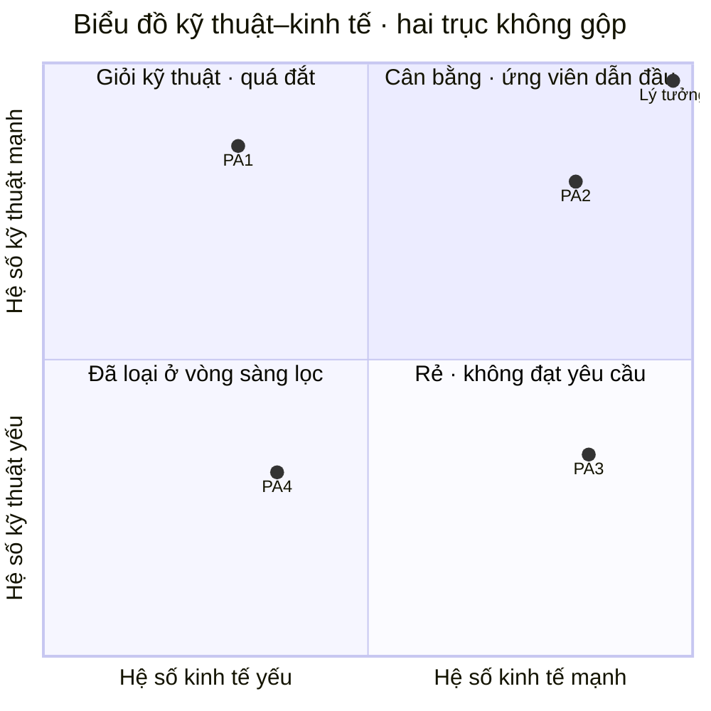
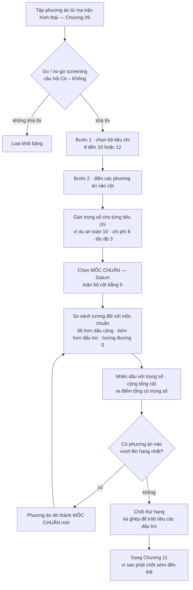
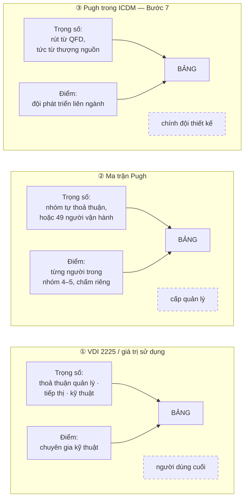

# Chương 10 — Chọn phương án: VDI 2225, Pugh, và giá trị sử dụng

Một bảng chấm điểm không đo phương án. Nó đo phương án *qua một người*. Cùng bốn ý tưởng, cùng tám tiêu
chí, đưa cho hai nhóm khác nhau thì ra hai thứ hạng khác nhau — và không có nhóm nào tính sai. Cái khác
nhau nằm ở chỗ mà bảng chấm không có ô nào để ghi: ai cầm bút, người đó biết gì, và người đó chịu trách
nhiệm trước ai. Bỏ qua chỗ đó thì phần còn lại của chương này chỉ là số học. Toàn bộ giá trị của một
phương pháp lựa chọn nằm ở chỗ nó *quy định ngầm* ai đủ tư cách cho điểm, và ba phương pháp trong chương
này quy định ba câu trả lời hoàn toàn khác nhau.

Chương 09 đã sinh ra phương án. Chuỗi hộp đen → cấu trúc chức năng → ma trận hình thái kết thúc bằng một
tập tổ hợp, và chương đó dừng đúng ở chỗ tập tổ hợp trở nên lớn hơn khả năng nhìn của một người. Bây giờ
phải chọn. Điều đáng chú ý là cả ba công cụ chọn trong chương này đều **không** được thiết kế để tìm
phương án tốt nhất. Chúng được thiết kế để tạo ra một *hồ sơ về việc đã chọn* — và đó là một sự khác biệt
mà tài liệu tiêu chuẩn không bao giờ nói thẳng, nhưng một trong hai nguồn của chương này thì có.

Ba kết quả cụ thể. Thứ nhất: biết mỗi công cụ đo cái gì và **không** đo cái gì — biểu đồ kỹ thuật–kinh tế
của VDI 2225 giữ hai điểm số tách rời và từ chối gộp chúng theo một cách duy nhất; phân tích giá trị sử
dụng gộp tất cả vào một con số; ma trận Pugh vứt bỏ hoàn toàn giá trị tuyệt đối. Thứ hai: đọc được một
thang chấm như một bản mô tả công việc — mỗi dải điểm là một tuyên bố về trình độ và tư cách của người
được phép chấm. Thứ ba: một quy tắc chọn công cụ theo trạng thái thông tin của dự án, đủ cụ thể để áp
ngay ở cuộc họp duyệt ý tưởng gần nhất.

## Ba công cụ hỏi ba câu hỏi khác nhau

Chúng thường bị xếp chung một rổ "phương pháp đánh giá phương án". Xếp như vậy là bỏ mất điều quan trọng
nhất: chúng không cùng trả lời một câu hỏi.

| | Câu hỏi nó trả lời | Cần biết trước cái gì | Kết quả tồn tại ở đâu |
|---|---|---|---|
| **Biểu đồ kỹ thuật–kinh tế** (VDI 2225) | Phương án này đứng ở đâu so với **cái lý tưởng**, trên hai trục riêng biệt? | Thế nào là lý tưởng, và chi phí chế tạo ước tính | Trong hồ sơ — số sống sau cuộc họp |
| **Phân tích giá trị sử dụng** (*Nutzwertanalyse*) | Gộp tất cả lại, phương án nào có **giá trị hữu dụng tổng** cao nhất? | Trọng số đã thống nhất, thang điểm mịn | Trong hồ sơ — một con số duy nhất |
| **Ma trận Pugh** | Phương án này **tốt hơn hay tệ hơn** một phương án mốc cụ thể? | Một mốc chuẩn mà cả nhóm chấp nhận | Trong phòng họp — kết luận không tách rời cuộc tranh luận |

Cột thứ hai là cột đắt tiền. Hai công cụ đầu đòi hỏi người chấm phải **biết trước** một thứ tuyệt đối:
điểm lý tưởng, hoặc trọng số đã được thoả thuận giữa các bộ phận. Pugh không đòi gì như vậy — nó chỉ đòi
một mốc so sánh. Đó là công cụ rẻ nhất về mặt tri thức và đắt nhất về mặt thời gian họp.

Cột thứ ba mới là cột quyết định số phận của công cụ trong một tổ chức thật. Con số của VDI 2225 và của
phân tích giá trị sử dụng **sống sót sau cuộc họp**: nó vào hồ sơ, nó đi lên cấp trên, nó được viện dẫn
hai năm sau khi không còn ai nhớ cuộc thảo luận. Kết luận của Pugh thì không — nó chỉ có nghĩa cùng với
cái mốc đã chọn và cái nhóm đã ngồi. Chuyển một bảng Pugh sang phòng khác là chuyển một vỏ rỗng.

### Nguồn nói được gì và im ở đâu

Trước khi đi tiếp, một điều phải nói ra vì nó định hình toàn bộ chương. Cụm tài liệu ICDM trong kho —
năm tài liệu độc lập về phương pháp thiết kế ý tưởng — **không chứa một chữ nào** về VDI 2225 kỹ thuật–kinh
tế hay về phân tích giá trị sử dụng. Tệp khai thác ghi thẳng: *"không có bất kỳ thông tin nào về công cụ
'VDI 2225 kỹ thuật-kinh tế' … hay 'phân tích giá trị sử dụng' … trong nguồn"*. Vật liệu về hai công cụ đó
đến từ hai nguồn khác: `[41]` và `[1]`.

Sự im lặng này không phải lỗ hổng tra cứu. Nó là dữ liệu. Một trường phái phương pháp luận hoàn chỉnh, có
mười bước và một bộ công cụ định lượng riêng, xây toàn bộ khâu lựa chọn của mình mà không cần đến hai công cụ mà trường
phái Đức coi là chuẩn mực. Phần đối chiếu cuối chương quay lại chuyện này.

Và như đã khai báo ở Chương 01: kho tài liệu **không có toàn văn tiêu chuẩn VDI nào**. Mọi điều chương này
nói về nội dung VDI 2225 đều đi qua tài liệu thứ cấp — `[41]` là một bài tổng thuật, `[1]` là sách
Pahl-Beitz trích dẫn lại hướng dẫn. Không chỗ nào trong chương này được đọc như trích tiêu chuẩn gốc.

## Biểu đồ kỹ thuật–kinh tế: hai điểm số từ chối gộp

Đây là công cụ có lịch sử dài nhất trong ba công cụ, và cũng là công cụ bị hiểu sai nhiều nhất — vì phần
lớn người dùng gộp hai trục lại thành một điểm số ngay khi có thể, tức là làm đúng cái việc mà cấu trúc
của nó được dựng ra để ngăn.

Gốc của nó nằm ở phương pháp xấp xỉ liên tiếp của Kesselring. Nguồn `[1]` ghi:
`"Kesselring [1.98] first explained the basis of his method of successive approximations in 1942 (for a
summary see [1.96, 1.97] and VDI Guideline 2225 [1.195])."` Chính câu này nối thẳng Kesselring với VDI
2225. Nguồn `[41]` nhắc tới một mốc muộn hơn — `"Fritz Kesselring's 1954 \"Guideline for invention,\""` —
nhưng câu trích ghi được trong tệp khai thác chỉ nêu tên tài liệu 1954, không nêu quan hệ của nó với thang
điểm. Hai mốc, hai nguồn, và chương này không gộp chúng thành một câu chuyện liền mạch vì nguồn không cho
phép.

Cấu trúc của công cụ thì rõ. Nó tính **hai** hệ số xếp hạng độc lập.

**Hệ số kỹ thuật.** Từng tiêu chí được chấm điểm rồi chuẩn hoá về một tỷ lệ so với điểm tối đa. Nguồn
`[1]` cho công thức ở cả dạng có trọng số và không trọng số, và kèm một ràng buộc mà mọi bảng tính đều vi
phạm ít nhất một lần: `"The sum of the weighting factors for any one level must always be equal to
\sum w_i = 1.0."` Trọng số không phải là điểm quan trọng gán tuỳ ý từ 1 đến 10 rồi thôi — chúng là một
phân hoạch. Cho thêm cho tiêu chí này thì phải lấy bớt của tiêu chí kia. Đó là một ràng buộc về *tổ chức*
được nguỵ trang thành một ràng buộc về *số học*: nó buộc các bên phải thực sự đánh đổi thay vì cùng nhau
tuyên bố mọi thứ đều quan trọng.

**Hệ số kinh tế.** Nó không phải điểm chấm. Nó là một tỷ số chi phí — chi phí so sánh tiêu chuẩn chia cho
chi phí chế tạo ước tính của phương án — và chỗ chọn mẫu số mới là chỗ có chính sách.
Nguồn `[1]` viết: `"It is possible to put, say, Co = 0.7 \times Cadmissible or Co = 0.7 \times Cminimum
for the cheapest variant."` Chú ý chữ `say` — đây là một gợi ý, không phải một quy định. Hệ số 0,7 là một
lựa chọn chính sách của người lập bảng, và nó dịch chuyển toàn bộ trục kinh tế.

**Gộp hai hệ số.** Nguồn `[1]` ghi rằng Baatz đề xuất **hai** cách, và có nguyên văn cho phép đếm này:
`"To that end, Baatz [3.1] has proposed two procedures, namely:"` — trung bình cộng, và trung bình nhân
(căn bậc hai của tích). Hai cách cho hai kết quả khác nhau ở đúng một tình huống: khi phương án lệch nặng
về một phía. Trung bình cộng cho một phương án kỹ thuật xuất sắc mà đắt kinh khủng đi qua; trung bình nhân
thì kéo nó xuống.

Việc nguồn đưa ra hai cách gộp thay vì một là điểm đáng học nhất của công cụ này. Nó thừa nhận rằng
**không có phép gộp đúng** — chỉ có phép gộp phản ánh một chính sách. Chọn trung bình nhân là tuyên bố
"chúng tôi không mua giải pháp lệch". Chọn trung bình cộng là tuyên bố ngược lại. Phép chọn đó thuộc về
người quyết định chiến lược sản phẩm, không thuộc về người lập bảng tính — nhưng trong thực tế nó gần như
luôn được quyết bởi người lập bảng tính, âm thầm, ở một ô công thức.

Đọc sơ đồ theo *khoảng cách tới góc lý tưởng* thì hai phương án lệch ngược chiều nhau ra cùng một điểm
số — và chúng cần hai hành động khác hẳn. Đọc theo *phía lệch* thì chỉ dẫn hiện ra: PA1 nằm trên cao bên
trái là một bài toán chi phí, giao cho khâu công nghệ chế tạo; PA3 nằm thấp bên phải là một bài toán kỹ
thuật, giao cho khâu thiết kế. Gộp hai trục thành một số là xoá mất chỉ dẫn đó.

**Khai báo:** kho tài liệu cho hệ số kỹ thuật, hệ số kinh tế, và hai công thức gộp. Tệp khai thác
**không** ghi lại câu nào mô tả một đồ thị hai trục. Việc đặt hai hệ số lên hai trục và đọc theo phía lệch
là cách trình bày của cuốn sách này, không phải câu chữ của nguồn.

> **Đào sâu: hệ số 0,7 là một quyết định quản trị đội lốt tham số**
>
> Chi phí so sánh `Co` đứng ở tử số của hệ số kinh tế. Đặt nó bằng 0,7 lần chi phí cho phép tối đa nghĩa
> là: một phương án chạm đúng trần chi phí cho phép sẽ chỉ được 0,7 điểm kinh tế — tức là bị phạt, dù nó
> hoàn toàn hợp lệ. Đặt nó bằng 0,7 lần chi phí của phương án rẻ nhất thì mốc chuẩn trôi theo tập phương
> án đang xét: thêm một ý tưởng rẻ vào bảng là hạ điểm kinh tế của tất cả những phương án còn lại, mà
> không phương án nào trong số đó thay đổi gì.
>
> Hai cách đặt mốc dẫn tới hai hành vi tổ chức khác nhau. Cách thứ nhất neo vào **ngân sách** — bảng chấm
> trở thành công cụ giữ trần chi phí. Cách thứ hai neo vào **cạnh tranh nội bộ giữa các ý tưởng** — bảng
> chấm trở thành công cụ ép giá. Nguồn nêu cả hai và không chọn, dùng chữ `say` để đánh dấu rằng đây là ví
> dụ minh hoạ. Trong một xưởng, chỗ này phải được chọn *một lần, ở cấp có thẩm quyền về giá thành*, rồi cố
> định — nếu để mỗi kỹ sư tự đặt mốc cho bảng của mình thì điểm kinh tế giữa các dự án không so sánh được
> với nhau, mà không ai phát hiện ra vì mọi bảng đều "đúng công thức".

## Phân tích giá trị sử dụng: thang mịn và lời tự nhận về người chấm

*Nutzwertanalyse* — phân tích giá trị sử dụng — đi cùng dòng dõi với VDI 2225 nhưng chọn khác ở hai chỗ:
nó gộp tất cả vào một con số, và nó dùng một thang mịn hơn nhiều.

Nguồn `[41]` mô tả nó qua **ba thành phần cấu trúc**: *Weighted Parameters* — các tiêu chí rút từ tài liệu
đặc tả kỹ thuật *Pflichtenheft* kèm trọng số; *Value Scale* — thang điểm chuẩn hoá; và *Balanced Value
Profile* — tổng điểm có trọng số cho ra giá trị hữu dụng tổng thể.

Điều `[41]` **không** cho: dải điểm cụ thể của *Value Scale*. Tệp khai thác ghi rõ dải điểm và ý nghĩa từng
nấc **"không có trong nguồn"** đối với tài liệu đó — nó nêu tên công cụ mà không liệt kê giá trị. Cũng
không có chuỗi bước đánh số của quy trình VDI 2225: tệp khai thác ghi rằng quy trình dạng Step 1, Step 2 …
**"không có trong nguồn"**. Ai muốn triển khai VDI 2225 theo đúng thứ tự các bước của tiêu chuẩn thì tài
liệu này không đáp ứng được, và nói ra điều đó tốt hơn là dựng lại một chuỗi bước rồi trình bày như của
tiêu chuẩn.

Dải điểm thì có, nhưng ở nguồn khác. `[1]` viết: `"The values are expressed by points. Cost–Benefit
Analysis employs a range from 0 to 10; Guideline VDI 2225 a range from 0 to 4 (see Figure 3.31)."`

Hai thang, và độ mịn khác nhau hơn hai lần rưỡi. Ý nghĩa từng nấc thì `[1]` trình bày trong một hình
(Figure 3.31) chứ không trong câu văn xuôi — tệp khai thác ghi nhận đúng như vậy và chép lại các mục của
bảng:

| Điểm | Phân tích giá trị sử dụng | VDI 2225 |
|---|---|---|
| 0 | absolutely useless solution | unsatisfactory |
| 1 | very inadequate solution | just tolerable |
| 2 | weak solution | adequate |
| 3 | tolerable solution | good |
| 4 | adequate solution | very good (ideal) |
| 5–10 | satisfactory → good with few drawbacks → good → very good → exceeding the requirement → ideal | *(không tồn tại)* |

Bảng này là chỗ luận điểm của chương bắt đầu lộ ra, và nó lộ ra ở một chi tiết dễ lướt qua: **cùng một
điểm số mang hai nghĩa trái ngược.** Điểm 2 là `weak solution` trên thang giá trị sử dụng nhưng là
`adequate` theo VDI 2225. Điểm 4 là `adequate solution` — hạng trung — trên thang mười nấc, nhưng là
`very good (ideal)` — kịch trần — trên thang năm nấc. Một bảng chấm không ghi rõ mình dùng thang nào là
một bảng chấm không đọc được, và trong một tổ chức có cả hai truyền thống thì nhầm lẫn này không cần ai
cố ý cũng xảy ra.

Sâu hơn: **thang mười nấc là một lời tự nhận về năng lực phân biệt của người chấm.** Đặt ra nấc 6
`good with few drawbacks` và nấc 7 `good` là khẳng định rằng người cầm bút phân biệt được hai trạng thái
đó — và phân biệt được một cách nhất quán, giữa các phương án, giữa các buổi chấm, giữa các người chấm
khác nhau. Thang năm nấc của VDI 2225 không khẳng định điều đó. Nó chỉ đòi người chấm phân biệt được
"không đạt / tạm chấp nhận / đủ / tốt / lý tưởng", và nó gọi thẳng nấc trên cùng là `ideal` — tức là nó
buộc người chấm phải có sẵn trong đầu một hình dung về cái lý tưởng để so.

Đó là hai canh bạc khác nhau đặt vào hai loại người khác nhau. Thang mịn cược rằng tổ chức có chuyên gia
phân biệt được sắc thái. Thang thô cược rằng tổ chức có một chuẩn mực chung về cái lý tưởng. Tổ chức nào
không có cái nào trong hai thứ đó thì cả hai thang đều sinh ra số đẹp và vô nghĩa.

## Ma trận Pugh: bỏ giá trị tuyệt đối, giữ lại cuộc họp

Pugh đi hướng ngược lại. Nó không hỏi phương án tốt đến mức nào. Nó chỉ hỏi: so với **cái này**, tốt hơn
hay tệ hơn?

Nguồn `[34]` — một bài giảng về chọn phương án bằng biểu đồ Pugh — mô tả quy trình gồm một bước sàng lọc
đứng trước và **năm bước** lập bảng. Nguyên văn cho phép đếm: `"in principle these are the five steps that
you need to take"`. Bước sàng lọc đứng trước là *go/no-go screening*, trả lời Có/Không:
`"we will start with a go no go screening that's a first step to remove some of uh perhaps not very
practical concepts"`.

Hai bước đầu có tên gốc trong nguồn: `"step number one choosing uh a set of criteria which they all go in
the first column here"` và `"step number two you have already generated some concepts so comp concept
number one goes in column one …"`. Ba bước còn lại thì tệp khai thác ghi rõ tên gọi riêng của chúng
**"không có trong nguồn"** — văn bản mô tả hành động mà không đặt tên "Step number three". Ba hành động đó
là: gán trọng số, chọn mốc chuẩn, và so sánh rồi cộng điểm có trọng số. Chương này không đặt tên cho chúng
thay nguồn.

Số lượng tiêu chí: `"it can be 8 to 10 or 12 criteria the more would be better"`. Đây là một khuyến nghị
đi ngược trực giác tinh gọn — nhiều tiêu chí hơn thì tốt hơn — và lý do nằm ở bản chất so sánh tương đối:
mỗi tiêu chí chỉ sinh ra một dấu, nên chi phí thêm một tiêu chí rất thấp, trong khi thiếu tiêu chí thì một
điểm yếu quan trọng biến mất khỏi bảng hoàn toàn.

Cái mốc chuẩn — *datum* — là toàn bộ công cụ. Nguồn `[34]` mô tả nó gọn: `"the DATM has the rank zero it
is our let's say base line right"`. Cả cột của nó bằng 0. Mọi phương án khác chỉ tồn tại như một độ lệch
so với nó.

Ví dụ trong nguồn là cơ cấu nâng của xe nâng, với `"for simplicity let's assume we have four concepts for
for the lifting"`. Trọng số lấy từ khảo sát: `"I tested this and I asked 49 people that ranked this for
me"`, và `"according to these 49 experts the safety was the most important criteria"` — an toàn 10, chi
phí 8, tốc độ 3, theo `"I'll give safety 10 and maybe cost eight … speed three and so on"`. Kết quả tính
ra: `"if I do the math for the second column it's going to be minus 28 and for the last one minus 21"`.

Hai con số âm đó nói lên một điều mà bảng có trọng số tuyệt đối không nói được: mốc chuẩn vẫn đang thắng.
Không phương án mới nào đủ tốt để thay thế cái đang có. Đó là một kết luận có giá trị hành động ngay —
và nó xuất hiện tự nhiên trong Pugh, trong khi ở một bảng điểm tuyệt đối, phương án tốt nhất trong tập
luôn được điểm cao nhất và luôn trông như một người thắng cuộc, kể cả khi cả tập đều tệ hơn hiện trạng.

### Quy tắc cấm tính trung bình

Đây là chi tiết quan trọng nhất của Pugh và là chi tiết bị vi phạm nhiều nhất. Nguồn `[57]` viết:
`"In this method the marks given to each combination are relative to the datum. That is why the average
marks of the concepts could not be used."`

Về mặt số học thì lý do hiển nhiên: điểm đo từ một gốc do người chọn, nên trung bình của chúng không mang
nghĩa gì. Về mặt tổ chức thì lệnh cấm này có sức nặng lớn hơn nhiều. **Nó chặn con đường uỷ thác.** Không
gộp được thành một con số nghĩa là không gửi được lên cấp trên như một kết luận độc lập, không so được với
bảng của dự án khác, không lưu vào hồ sơ như một phán quyết. Kết luận của Pugh chỉ tồn tại kèm cái mốc và
kèm cuộc tranh luận đã sinh ra nó.

Nguồn `[34]` mô tả cách vận hành đúng: từng người lập bảng riêng, `"let's say you have a team of four or
five working on a project"`, chấm độc lập, rồi ngồi lại đối chiếu chỗ lệch và lặp cho đến khi đồng thuận.
Chỗ **lệch điểm giữa các thành viên** mới là sản phẩm của phương pháp — nó chỉ đúng chỗ hai người hiểu
khác nhau về cùng một phương án. Bảng Pugh là cái cớ có cấu trúc để cuộc trao đổi đó xảy ra. Nếu một người
lập bảng rồi gửi email cho cả nhóm duyệt, phương pháp đã bị vô hiệu hoàn toàn trong khi tài liệu đầu ra
trông y hệt.

> **Đào sâu: vòng lặp dịch mốc chuẩn không có điều kiện dừng**
>
> Nguồn `[34]` nêu quy tắc lặp: `"if after ranking you found out that one of other another concept let's
> say the screw concept just as an example became rank number one then it's going to take the place of the
> DATM is that one is going to be the DATM and you compare the rest with that one"`. Phương án vươn lên
> hạng nhất trở thành mốc chuẩn mới, và toàn bộ bảng phải chấm lại từ đầu.
>
> Quy tắc này không kèm điều kiện dừng. Nếu nhóm liên tục đổi ý, hoặc nếu có hai tiêu chí xung đột không
> dung hoà được, vòng lặp có thể chạy vô hạn — mỗi vòng đều hợp lệ về mặt phương pháp, và không vòng nào
> sai. Đây là một chế độ hỏng đặc trưng của công cụ dựa vào so sánh tương đối: không có mốc tuyệt đối thì
> cũng không có tiêu chí để biết khi nào đã đủ tốt.
>
> Trong thực tế, điều kiện dừng phải đến từ **bên ngoài phương pháp**: hết thời gian, hoặc cấp có thẩm
> quyền tuyên bố dừng. Nghĩa là ở đúng chỗ quan trọng nhất — khi nào thôi tìm — Pugh không tự trả lời
> được và phải mượn quyền lực của tổ chức. Chương 11 sẽ cho thấy đây không phải khiếm khuyết riêng của
> Pugh mà là chỗ cả bốn thế hệ phương pháp đều phải né.

## Ai được quyền cho điểm

Đến đây có thể phát biểu luận điểm trung tâm của chương một cách chính xác. **Mỗi thang chấm là một tuyên
bố ngầm về ai đủ tư cách cầm bút.** Chọn thang không phải chọn phép tính — nó là chọn người, và qua đó là
chọn xem quyền quyết định thật sự nằm ở đâu trong tổ chức.

Ba công cụ trong chương này lấy điểm và trọng số từ ba nguồn quyền lực khác nhau, và cả ba đều không viết
chuyện đó ra thành một dòng nào trong bảng.

| Công cụ | Trọng số đến từ đâu | Điểm đến từ đâu | Ai bị loại khỏi bàn |
|---|---|---|---|
| **VDI 2225 / giá trị sử dụng** | Thoả thuận trước giữa quản lý, tiếp thị, kỹ thuật; tiêu chí rút từ *Pflichtenheft* | Chuyên gia kỹ thuật chấm so với cái lý tưởng | Người dùng cuối — họ vào qua tài liệu đặc tả, không vào trực tiếp |
| **Ma trận Pugh** (theo `[34]`) | Nhóm tự thoả thuận, hoặc khảo sát người dùng — ví dụ trong nguồn dùng khảo sát **49 người** đã vận hành thiết bị | Từng thành viên trong nhóm 4–5 người, chấm độc lập rồi hội ý | Cấp quản lý — họ không có ô nào trong bảng, và không nhận được con số để phủ quyết |
| **Pugh trong ICDM** (Bước 7) | Trọng số rút từ QFD, tức là từ tiếng nói khách hàng | Đội phát triển sản phẩm liên ngành, theo nhóm tiêu chí đã định trước | Chính đội thiết kế — họ không được tự chọn tiêu chí, tiêu chí đến từ thượng nguồn |

Ba dòng này là ba cấu hình quyền lực. Trong dòng đầu, quyền nằm ở cuộc thương lượng trọng số diễn ra
**trước khi** có phương án nào để chấm — ai thắng ở đó thì thắng luôn cuộc chấm điểm, mà không cần dự cuộc
chấm điểm. Tệp khai thác ghi đúng chế độ hỏng này: nếu ban quản lý, tiếp thị và kỹ thuật không thống nhất
được tầm quan trọng tương đối của các tiêu chí *trước* khi đánh giá thì cả cổng quyết định bị tê liệt hoặc
trở nên vô nghĩa.

Trong dòng thứ hai, quyền nằm trong phòng họp và không ra khỏi đó — chính vì thế lệnh cấm tính trung bình
mới quan trọng đến vậy. Trong dòng thứ ba, quyền đã bị dời ra ngoài cả hai chỗ: nó nằm ở bảng QFD, tức là
ở người đã thu thập và diễn giải tiếng nói khách hàng, có thể từ nhiều tháng trước.

Chi tiết **49 người** trong ví dụ của `[34]` là chỗ đắt nhất. Người giảng không lấy trọng số từ nhóm thiết
kế mà đi hỏi những người đã thật sự vận hành thiết bị, và kết quả là an toàn vượt lên đứng đầu. Một nhóm
kỹ sư ngồi trong phòng khó cho an toàn trọng số 10 và tốc độ trọng số 3 — nhóm kỹ sư đánh giá cao thứ mà
họ cải thiện được bằng thiết kế. Đây là suy luận của cuốn sách; nguồn chỉ ghi rằng trọng số đến từ 49
người vận hành. Nhưng dữ kiện thì đứng vững: đổi người cầm bút thì đổi thứ hạng, dù không đổi một dòng
công thức nào.

Ba nút nét đứt không có cạnh nào nối vào bảng, và chúng là nội dung của sơ đồ. Mỗi cấu hình đẩy một bên
ra khỏi khung — người dùng cuối, cấp quản lý, hay chính đội thiết kế — và bên bị đẩy ra không xuất hiện
ở bất kỳ dòng nào của bảng điểm. Nhìn ba dải cạnh nhau thì thấy: chúng không phải ba biến thể của cùng
một phép tính, chúng là ba câu trả lời khác nhau cho câu hỏi ai không được ngồi ở bàn.

Đó là toàn bộ luận điểm, gói trong một ví dụ.

### Canh bạc mà mỗi công cụ đang đặt

Cả ba công cụ đều đặt cược vào một tổ chức có tính chất nhất định, và không công cụ nào ghi điều kiện đó
lên đầu bảng.

**VDI 2225 và phân tích giá trị sử dụng cược rằng tổ chức đạt được đồng thuận liên phòng ban trước khi
mở bảng.** Đây là canh bạc nặng nhất trong ba. Nó đòi ba bộ phận có lợi ích khác nhau — quản lý lo tiền,
tiếp thị lo bán được, kỹ thuật lo làm được — ngồi lại và chốt một bộ trọng số cộng lại bằng 1,0, tức là
chốt một tuyên bố công khai rằng cái gì quan trọng hơn cái gì. Ở doanh nghiệp có bộ phận rõ ràng và một
tài liệu *Pflichtenheft* được cả ba tôn trọng, canh bạc này thắng. Ở nơi trọng số được điền vào sau khi
phương án ưa thích đã lộ diện, công cụ vẫn chạy trơn tru và cho ra một hồ sơ đẹp — nó không có cơ chế nào
phát hiện được thứ tự đã bị đảo.

**Pugh cược rằng tổ chức có một nhóm nhỏ chịu ngồi họp nhiều lần.** Bốn hoặc năm người, mỗi người chấm
riêng, rồi họp đối chiếu, rồi lặp. Ở nơi có nhóm liên ngành ổn định thì rẻ. Ở nơi mỗi người thuộc một
phòng khác nhau và lịch họp phải xin ba ngày trước, canh bạc này thua — và nó thua theo cách âm thầm
nhất: bảng vẫn được lập, bởi một người, và mọi thứ trông vẫn đúng quy trình.

**Cả ba cược rằng ước lượng chi phí ở pha ý tưởng là đáng tin.** Hệ số kinh tế cần chi phí chế tạo ước
tính của một thứ chưa có bản vẽ. Không nguồn nào trong cụm này bàn về sai số của ước lượng đó.

### Cái mà công cụ đo được lại là cái nó không định đo

Nguồn `[41]` đưa ra một kết luận thẳng thắn đến bất ngờ về mục đích thật của cả gia đình công cụ này. Các
nghiên cứu thực nghiệm dùng phân tích giao thức với lược đồ mã hoá FBS cho thấy mô hình quy định không mô
tả đúng cách nhà thiết kế thật sự nghĩ:
`"Empirical findings suggest that the Systematic Approach predicts some but notably not all of student
design issue behavior. This observation does not constitute a failure of the VDI model. Rather, it
emphasizes a crucial philosophical distinction: design, as a human activity, inherently involves
non-linear cognitive processes, often characterized by intuitive heuristics and spontaneous breakthroughs
that deviate from a strict, sequential flow."`

Và về vai trò thật của VDI 2225, `[41]` định vị nó là
`"a dedicated companion standard for one of the most high-risk steps in the development cycle: objective
concept evaluation and selection."` Tệp khai thác rút ra kết luận rằng giá trị lớn nhất của các tiêu chuẩn
này không phải dạy kỹ sư *phải nghĩ thế nào*, mà là dựng một cấu trúc để quản lý quy trình, kiểm soát chất
lượng đầu ra và tạo hồ sơ kỹ thuật kiểm toán được — một lá chắn pháp lý và tài sản trí tuệ, chứng minh
rằng quyết định dựa trên phân tích định lượng chứ không phải ý kiến chủ quan.

Thứ tự thông thường bị đảo ở đây: một bảng chấm không tạo ra quyết định đúng, nó tạo ra **bằng chứng rằng
quyết định đã được ra một cách có thể bảo vệ được.** Hai thứ đó không xung đột
— nhưng chúng đòi hỏi những thứ khác nhau, và khi thiếu nguồn lực thì cái thứ hai luôn thắng cái thứ nhất,
vì chỉ cái thứ hai có người kiểm tra.

Đây là biến thể sắc nhất của luận đề cuốn sách áp vào Phần III: công cụ được bán như một thiết bị hỗ trợ
phán đoán kỹ thuật, nhưng thứ nó thật sự cung cấp cho tổ chức là **khả năng biện minh**. Một tổ chức tiếp
nhận nó vì lý do thứ hai sẽ dùng nó đúng theo lý do thứ hai — điền bảng sau khi đã chọn — và sẽ không thấy
có gì sai, vì đầu ra không phân biệt được.

### Ba thứ không thang nào đo

Nguồn `[34]` nêu một rủi ro nằm hoàn toàn ngoài mọi ô chấm điểm: **độ chín của công nghệ**. Một ý tưởng có
thể được chấm rất cao ở mọi tiêu chí kỹ thuật và vẫn chết vì nền công nghệ chưa tới. Ba ví dụ, cả ba đều
có nguyên văn:

- `"it took almost four centuries until human flight became mature and available"`
- `"or the example of radar it took 15 years uh until it became available to be used in practice in modernday life"`
- `"the AI and machine learning which is available now initiated before 1990 and uh it took uh two decades until we have available powerful computing hardware that we can implement"`

Bốn thế kỷ, mười lăm năm, hai thập kỷ. Không con số nào trong ba con số này lọt được vào một ô của bảng
chấm, vì bảng chấm hỏi "phương án này tốt đến đâu" chứ không hỏi "khi nào thì làm được". Chỗ duy nhất
trong quy trình bắt được nó là bước sàng lọc *go/no-go* đứng **trước** bảng — một câu hỏi Có/Không, không
trọng số, không điểm. Đưa độ chín công nghệ thành một tiêu chí có trọng số là sai lầm kinh điển: một
phương án bất khả thi về thời gian sẽ được điểm thấp ở đúng một cột và vẫn có thể thắng nhờ các cột khác.

Thứ hai, **chi phí vòng đời bị chốt ngay tại pha này**. Corpus cho hai con số khác nhau cho cùng một
khẳng định, cùng quy về một tài liệu năm 1978; Chương 11 đưa cả hai nguyên văn và bàn vì sao độ vênh ấy
tự nó là thông tin, vì ở đó con số là vế thứ hai của nghịch lý thông tin. Cái cần ở đây chỉ là chiều của
mệnh đề: phần lớn tiền của cả vòng đời bị khoá ở pha có ít thông tin nhất. Bảng chấm là chỗ khoá diễn ra,
và nó không có ô nào cảnh báo điều đó.

Thứ ba, **không thang nào đo chính nó**. Không công cụ nào trong ba công cụ có bước kiểm tra xem bộ trọng
số có được thiết lập trước khi phương án lộ diện hay không — mà như đã thấy, đó là chỗ cả cấu trúc đứng
hoặc sụp.

## Đối chiếu với thang DSO của ICDM

ICDM giải cùng bài toán bằng một thang khác, và sự khác biệt của nó nói thêm được một điều về luận điểm
của chương.

Thang DSO có **bốn bậc**, và đáy là **0**. Nguyên văn từ `[57]`:
`"So that the ranking scale will actually be a scale of four grades, and will emphasize the differences,
as shown in table 2. Table 2: Ranking scale for solution principles | Mark | Description | 5 | Good to
excellent | 3 | Better than average | 2 | Less than average | 0 | Poor"`.

Năm, ba, hai, không. Không có 4, không có 1. Câu trích tự nói ra lý do — `"will emphasize the differences"`
— thang được thiết kế để **khoét rỗng vùng giữa**, buộc người chấm phải nghiêng hẳn về một phía thay vì
trú ẩn ở nấc an toàn. Và đáy là 0 chứ không phải 1: một nguyên lý giải pháp kém không bị trừ điểm, nó bị
**xoá khỏi phép nhân**.

Điểm rủi ro thì DSO không cho ai phán đoán mức độ cả: nó **đếm số vấn đề gặp phải** rồi quy đổi cơ học
sang điểm. Đây là một cách xử lý câu hỏi "ai được quyền cho điểm" khác hẳn ba công cụ ở trên — nó **dời
phán đoán ra khỏi người chấm và đặt vào quy tắc**. Một thành viên mới vào nghề và một trưởng nhóm hai
mươi năm kinh nghiệm sẽ cho cùng một điểm nếu cùng nhận diện được cùng số vấn đề. Cái giá phải trả cũng
rõ: hai vấn đề nhỏ và hai vấn đề chí tử đều ra cùng một điểm.

Phần còn lại của bộ máy ăn khớp với lựa chọn đó — quy tắc quy đổi, hai nhóm tiêu chí với ngưỡng che phủ
định lượng, cụm tổ hợp mà thuật toán nhắm tới, và chỗ ma trận Pugh được cắm vào. **Chương 11 dựng đủ khối
ấy với nguyên văn từng ngưỡng**, vì ở đó nó chịu lực cho cả một cột trong bảng bốn thế hệ; ở đây chỉ cần
luận điểm. Chi tiết cơ chế và cách dùng nằm ở cuốn `icdm-hari-weiss`. Chương này dừng ở mức đối chiếu.

Điều đối chiếu này cho thấy: bốn thang chấm, bốn cách trả lời câu hỏi ai cầm bút. VDI 2225 giao bút cho
chuyên gia có sẵn chuẩn mực về cái lý tưởng. Phân tích giá trị sử dụng giao cho chuyên gia phân biệt được
sắc thái. Pugh giao cho một nhóm nhỏ chịu tranh luận. DSO cố gắng **không giao cho ai** — nó viết quy tắc
chặt đến mức người chấm gần như chỉ còn việc đối chiếu. Không cách nào trong bốn cách là đúng phổ quát;
mỗi cách là một canh bạc đặt vào một hình thái tổ chức khác nhau, và chọn sai hình thái thì bảng vẫn đầy
số mà quyết định vẫn được ra ở chỗ khác.

Nhưng "không đúng phổ quát" chưa phải một quy tắc chọn, và mở chương đã hứa một quy tắc. Vật liệu để dựng
nó nằm sẵn ở cột *Cần biết trước cái gì* của bảng đầu chương: mỗi công cụ đòi một **trạng thái thông tin**
khác nhau, nên trạng thái thông tin của dự án là thứ chọn công cụ, không phải thói quen của xưởng.

| Dự án đang có gì trong tay | Dùng cái nào | Vì sao |
|---|---|---|
| Chỉ có bản phác, chưa ước lượng được chi phí | **Ma trận Pugh**, mốc chuẩn là hiện trạng | Pugh chỉ đòi biết *hơn hay kém*, đúng thứ duy nhất biết được lúc này |
| Có ước lượng chi phí, nhưng chưa thoả thuận được trọng số giữa các bên | **Biểu đồ kỹ thuật–kinh tế** | Hai trục để riêng thì không cần ai đồng ý về trọng số trước; phía lệch vẫn đọc được |
| Có cả chi phí lẫn trọng số đã ký | **Phân tích giá trị sử dụng** | Thang mịn chỉ có nghĩa khi cả hai đầu vào đã đủ chắc để đỡ nó |
| Kết quả phải gửi lên cấp trên để duyệt | **Không dùng Pugh một mình** | Pugh cho thứ hạng tương đối, không cho con số tuyệt đối để mang ra khỏi phòng — cấp trên không có ô nào trong bảng |

Bảng này là thao tác của cuốn sách; không nguồn nào phát biểu quy tắc chọn theo trạng thái thông tin.
Nó ghép từ cột *Cần biết trước cái gì* và từ chính các câu mà mỗi công cụ tự nói về đầu vào của mình.

Một chỗ hở phải nói ra: cả ba công cụ ở hàng hai và hàng ba đều cược rằng **ước lượng chi phí ở pha ý
tưởng là đáng tin**, và không nguồn nào trong chương này bàn về sai số của ước lượng ấy. Có đúng một câu
trong corpus chạm tới — Chương 08 trích một tuyên bố rằng dự toán sớm nằm `"within 20% of the final
actual unit manufacturing cost"` `[50]`. Nhưng đó là tuyên bố của một phương pháp về chính nó, không phải
một phép đo độc lập, nên nó không đủ để đóng chỗ hở; nó chỉ cho thấy chỗ hở đã được ai đó nhìn thấy.

Chương 15 sẽ cho một cách đo chuyện này chính xác hơn.

Chương 11 quay lại câu hỏi mà cả chương này né: vì sao phải chọn sớm đến thế, khi mà ở pha ý tưởng thì
chính người chấm cũng chưa biết đủ để chấm.

## Áp dụng ở Xưởng

Bối cảnh: một xưởng cơ khí — điện tử — phần mềm nhúng, vài chục người, đang ở pha ý tưởng của một sản phẩm
có ràng buộc nội địa hoá.

### 1. Khoá cột trọng số bằng chữ ký trước khi mở cột điểm

**Quyết định ra được trong tuần tới.** Ở cuộc họp duyệt ý tưởng gần nhất, tách bảng chấm làm hai phiên
tách rời nhau về thời gian. Phiên một: chỉ có cột tiêu chí và cột trọng số, **không một phương án nào được
nêu tên**, tổng trọng số phải bằng 1,0, người chủ trì ký vào bản đó và phát cho cả nhóm. Phiên hai, ít
nhất một ngày sau: điền điểm, và trọng số không được sửa.

**Vấn đề nó giải:** chế độ hỏng phổ biến nhất của bảng có trọng số — trọng số được nắn sau khi phương án
ưa thích đã lộ diện, khiến cả bảng thành một bài biện minh có vẻ định lượng.

**Cách áp:** một tệp bảng tính, hai sheet, sheet trọng số bị khoá ô sau khi ký; ràng buộc tổng bằng 1,0
cài thành công thức kiểm tra hiển thị đỏ khi lệch.

**Bẫy:** nếu người ký trọng số cũng là người chấm điểm thì hai phiên chỉ là hình thức. Người ký phải là
người chịu trách nhiệm về ràng buộc thương mại, không phải người thiết kế.

### 2. Chọn công cụ theo trạng thái thông tin, không theo thói quen

**Vấn đề nó giải:** dùng bảng điểm tuyệt đối ở lúc chưa có ước lượng chi phí đáng tin, tạo ra những con số
chính xác giả.

**Cách áp:** quy tắc một dòng — **chưa có ước lượng chi phí thì dùng Pugh; có rồi thì mới mở hai trục kỹ
thuật–kinh tế.** Pugh chỉ cần biết *hơn hay kém*, và đó là thứ duy nhất biết được khi trong tay chỉ có bản
phác. Bổ sung: **luôn lấy hiện trạng làm mốc chuẩn** — sản phẩm đang bán, hoặc thiết kế đang dùng — để
điểm âm nói thẳng ra rằng chưa có gì đáng thay.

**Bẫy:** mốc chuẩn là một phương án chỉ tồn tại trên giấy thì mọi so sánh đều là so với một thứ tưởng
tượng, và bảng sẽ ưu ái các phương án cùng họ với nó.

### 3. Cấm ô "điểm trung bình" trong mọi bảng Pugh

**Vấn đề nó giải:** hiện tượng bảng Pugh của bốn người bị gộp thành một bảng trung bình để "cho gọn", làm
biến mất đúng thứ duy nhất mà phương pháp sinh ra — **chỗ bốn người chấm lệch nhau**.

**Cách áp:** biểu mẫu bảng Pugh của xưởng không có dòng trung bình; thay vào đó có một mục bắt buộc
**"Các ô có ý kiến trái ngược"**, liệt kê từng ô mà hai thành viên cho dấu ngược nhau, kèm một dòng ghi
lý do của mỗi bên. Mục này là đầu ra chính của cuộc họp, không phải thứ hạng.

**Bẫy:** khi thiếu thời gian, nhóm sẽ để một người lập bảng rồi cả nhóm gật đầu qua thư điện tử. Đầu ra
trông giống hệt bảng làm đúng quy trình, nên không ai phát hiện — cách chặn duy nhất là yêu cầu nộp đủ
số bảng cá nhân trước cuộc họp.

### 4. Ghi vào biên bản: ai cho điểm, với tư cách gì

**Vấn đề nó giải:** sáu tháng sau không ai truy được vì sao tiêu chí này nặng hơn tiêu chí kia, và cuộc
tranh cãi cũ nổ lại từ đầu với những người khác.

**Cách áp:** ngay dưới bảng, ba dòng cố định — **nguồn trọng số** (thoả thuận nội bộ, hay hỏi người vận
hành thực tế), **người chấm và vai trò của họ**, **phép gộp đã chọn** (trung bình cộng hay trung bình
nhân, và vì sao). Ba dòng này quan trọng hơn cả thứ hạng, vì thứ hạng suy ra được từ chúng còn chúng
không suy ra được từ thứ hạng.

**Bẫy:** ghi "cả nhóm thống nhất" vào dòng người chấm là xoá đúng thông tin cần lưu. Phải ghi tên vai trò
cụ thể — thiết kế cơ khí, điện tử, công nghệ chế tạo — vì thứ hạng đổi theo thành phần nhóm.

### 5. Độ chín công nghệ đứng ngoài bảng chấm, ở cổng Có/Không

**Vấn đề nó giải:** một phương án dựa trên linh kiện hoặc công nghệ chưa nội địa hoá được sẽ ăn điểm cao ở
các cột hiệu năng, mất điểm ở một cột duy nhất, và vẫn có thể thắng — rồi chết ở khâu mua hàng.

**Cách áp:** trước khi mở bảng chấm, chạy một danh sách câu hỏi Có/Không: **nguồn cung có thật trong tầm
với không · đã có ai trong nước từng làm cái này chạy chưa · nếu phải chờ thì chờ bao lâu.** Trả lời
"không" ở câu bắt buộc nào thì phương án ra khỏi bảng, không vào bảng với điểm thấp.

**Bẫy:** đội thiết kế sẽ muốn giữ phương án hay nhất lại "để tham khảo". Giữ nó thì nó sẽ thắng — hãy
chuyển nó sang danh sách ý tưởng cho thế hệ sau, có ngày xem lại cụ thể, thay vì để nó nằm trong bảng
đang chấm.

---
## Sổ kiểm của chương

- **Neo luận đề:** *Canh bạc* là neo chính — nối rõ ở mục "Canh bạc mà mỗi công cụ đang đặt" (mỗi thang
  chấm cược vào một hình thái tổ chức: đồng thuận liên phòng ban trước khi mở bảng · nhóm nhỏ chịu họp
  nhiều lần · ước lượng chi phí đáng tin ở pha ý tưởng), và ở mục "Ai được quyền cho điểm". *Mặt tiếp
  giáp* nối phụ ở mục "Cái mà công cụ đo được lại là cái nó không định đo" (công cụ được tiếp nhận vì khả
  năng biện minh, và đầu ra không phân biệt được với dùng đúng). *Tầng đòn bẩy* **không** được giải thích
  trong chương này — thang đòn bẩy Meadows chưa được giới thiệu; chỉ có đúng một câu trỏ sang Chương 15 ở
  cuối mục đối chiếu DSO, không mở rộng.
- **Phân nhà với chương liền kề:** mục đối chiếu DSO của bản nháp đầu dựng lại nguyên khối cơ chế ICDM
  (quy tắc quy đổi rủi ro, ngưỡng 70%/95%, cụm 10–15 tổ hợp, AHP/NGT) — sáu trích ấy làm cột 4 của bảng
  bốn thế hệ ở Chương 11. Đã cắt cơ chế, giữ luận điểm kèm một trích thang điểm, trỏ sang Ch11. Khối
  75%/80% cũng nhường về Ch11, chỉ giữ chiều của mệnh đề. Cụm *"bảy công cụ"* đã bỏ — không nguồn nào đếm
  số công cụ ICDM (xem sổ kiểm Ch08).
- **Bảng *chọn công cụ theo trạng thái thông tin*** là **thao tác của cuốn sách**, ghép từ cột *Cần biết
  trước cái gì* và từ các câu mỗi công cụ tự nói về đầu vào của mình; không nguồn nào phát biểu quy tắc
  này. Nó tồn tại để giao lời hứa thứ ba của mở chương — bản nháp đầu kết bằng phản đề thay vì quy tắc.
- **Nguồn đã dùng:** [1], [34], [41], [45], [47], [50], [54], [57]
  - [1], [41] lấy từ mục *systems — Methodology* của `c1-nen-mong-pahl-beitz_Exploration.md` (dòng
    "Nguồn: [1]") và mục *pahlbeitz* của `c5-danh-gia-chon_Exploration.md` (dòng "Nguồn: [34], [41]").
  - [34], [41] từ ba mục `pahlbeitz` của `c5-danh-gia-chon_Exploration.md`.
  - [45], [47], [54], [57] từ mục *icdm — Methodology chi tiết* của `c5` (dòng "Nguồn: [45], [46], [47],
    [54], [57]"). Nguồn [46] không được trích trong chương này.
- **Con số có nguyên văn:**
  - thang 0–4 của VDI 2225 và 0–10 của phân tích giá trị sử dụng — `"The values are expressed…"` [1]
  - tổng trọng số bằng 1,0 — `"The sum of the…"` [1]
  - hệ số 0,7 cho chi phí so sánh — `"It is possible to…"` [1]
  - **hai** cách gộp của Baatz — `"To that end, Baatz…"` [1]
  - Kesselring 1942 và quan hệ với VDI 2225 — `"Kesselring [1.98] first…"` [1]
  - Kesselring 1954 *Guideline for invention* — `"Fritz Kesselring's 1954…"` [41]
  - **năm** bước của Pugh — `"in principle these…"` [34]
  - bước sàng lọc go/no-go đứng trước — `"we will start…"` [34]
  - tên gốc bước 1 và bước 2 — `"step number one…"`, `"step number two…"` [34]
  - 8–10 hoặc 12 tiêu chí — `"it can be…"` [34]
  - **49** người / **49** chuyên gia khảo sát trọng số — `"I tested this…"`, `"according to these…"` [34]
  - trọng số 10 · 8 · 3 — `"I'll give safety…"` [34]
  - **bốn** phương án trong ví dụ xe nâng — `"for simplicity let's…"` [34]
  - điểm −28 và −21 — `"if I do…"` [34]
  - mốc chuẩn mang hạng 0 — `"the DATM has…"` [34]
  - nhóm **4 hoặc 5** người — `"let's say you…"` [34]
  - bốn thế kỷ / 15 năm / hai thập kỷ, và mốc trước 1990 — `"it took almost…"`, `"or the example…"`,
    `"the AI and…"` [34]
  - cấm tính điểm trung bình vì điểm là tương đối — `"In this method…"` [57]
  - thang DSO **bốn bậc** 5·3·2·0 — `"So that the…"` [57]
  - quy tắc chấm rủi ro theo **ba** cân nhắc, 5/3/2/0 — `"If the solution…"` [57]
  - ngưỡng **70%** nhóm A và **95%** nhóm B — `"This criteria group…"` [47]
  - **10 đến 15** tổ hợp — `"It is the…"` [54]; và **khoảng 15** tổ hợp hợp lệ — `"About 15 valid…"` [54]
  - Pugh 1981 — `"Evaluation tables like…"` [47]
  - AHP 1990 và NGT 1985 — `"Their ratings are…"` [47]
  - **hơn 75%** chi phí vòng đời — `"Most of the…"` [45]; **khoảng 80%**, dẫn Blanchard 1978 —
    `"about 80 %…"` [47] — chương trích **cả hai** và không chọn một con số.
  - kết luận thực nghiệm FBS — `"Empirical findings suggest…"` [41]
  - vai trò của VDI 2225 như tiêu chuẩn đồng hành — `"a dedicated companion…"` [41]
  - vòng lặp dịch mốc chuẩn — `"if after ranking…"` [34]
- **Con số đã BỎ vì không có nguyên văn:**
  - Số bước đánh số của quy trình VDI 2225 — tệp khai thác ghi **"không có trong nguồn"**; chương nói ra
    điều này thay vì dựng lại một chuỗi bước.
  - Dải điểm cụ thể của *Value Scale* theo `[41]` — **"không có trong nguồn"** ở tài liệu đó; dải 0–4 chỉ
    được dùng vì có nguyên văn ở `[1]`, và chương ghi rõ hai nguồn khác nhau.
  - Tên gốc của bước 3, 4, 5 trong Pugh — **"không có trong nguồn"**; chương mô tả hành động, không đặt
    tên thay nguồn.
  - Công thức đại số của Pugh và của *Nutzwertanalyse* — **"không có trong nguồn"** dạng phương trình ở
    `[34]`/`[41]`; chương chỉ mô tả quy tắc số học bằng lời.
  - Ý nghĩa từng nấc điểm dưới dạng câu văn xuôi — nguồn `[1]` trình bày trong Figure 3.31 dạng bảng;
    chương chép lại dạng bảng và ghi rõ điều đó.
  - Sai số của ước lượng chi phí ở pha ý tưởng — không nguồn nào trong cụm bàn tới; chương nêu là khoảng
    trống, không ước lượng.
- **Chỗ là suy luận của tác giả, không phải của nguồn:**
  - Việc đặt hệ số kỹ thuật và hệ số kinh tế lên **hai trục của một đồ thị** và đọc theo *phía lệch*.
    Nguồn cho hai hệ số và hai công thức gộp; tệp khai thác không ghi câu nào mô tả đồ thị hai trục. Đã
    khai báo ngay dưới sơ đồ.
  - Luận điểm trung tâm — mỗi thang chấm là một tuyên bố ngầm về ai được quyền cho điểm — là thao tác của
    cuốn sách. Nguồn cung cấp các mảnh (trọng số từ 49 người vận hành · nhóm 4–5 chấm độc lập · trọng số
    ICDM từ QFD · lệnh cấm tính trung bình) nhưng không nguồn nào phát biểu quy luật này.
  - Đọc lệnh cấm tính trung bình như một cơ chế **chặn con đường uỷ thác** trong tổ chức. Nguồn chỉ nêu
    lý do số học.
  - Đọc thang DSO 5·3·2·0 như cách **dời phán đoán ra khỏi người chấm và đặt vào quy tắc**, đặt đối lập
    với ba công cụ kia. Nguồn nói thang nhằm `"emphasize the differences"`, không nói về phân bổ thẩm quyền.
  - Nhận định rằng hai cách đặt mốc `Co` dẫn tới hai hành vi tổ chức khác nhau (neo ngân sách so với ép
    giá nội bộ). Nguồn chỉ nêu hai công thức, dùng chữ `say`.
  - Suy luận rằng nhóm kỹ sư ngồi trong phòng khó tự cho an toàn trọng số 10 và tốc độ trọng số 3. Nguồn
    ghi kết quả khảo sát 49 người, không so sánh với nhóm thiết kế.
  - Toàn bộ mục *Áp dụng ở Xưởng* — không nguồn nào trong kho bàn về quy trình của một xưởng cụ thể.
- **Số dòng:** 637
