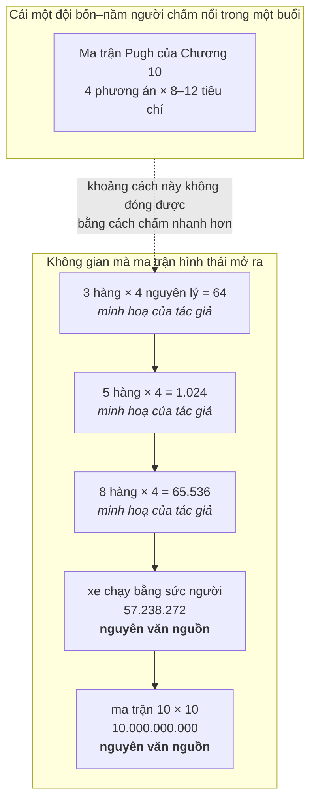
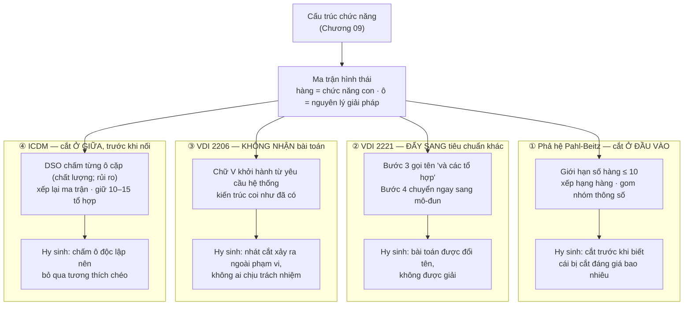

# Chương 11 — Nổ tổ hợp: bài toán mà cả bốn thế hệ đều phải né

Ma trận hình thái mở ra một không gian mà chính người vừa dựng nó không duyệt nổi. Đây không phải khiếm
khuyết của một công cụ lẻ; nó là hệ quả số học của phép phân rã chức năng — thứ mà cả bốn thế hệ trong
Phần II đều lấy làm nền. Thiếu chương này, người đọc khép Phần III với ấn tượng rằng sinh giải pháp rồi
chấm điểm là một dây chuyền liền mạch. Nó không liền. Giữa hai chương trước có một cái hố, và cái rơi vào
hố ấy là phần áp đảo của không gian giải pháp — bị loại bởi những thao tác mà không tiêu chuẩn nào đặt tên,
không ai ký, và không biên bản nào ghi.

**Chương 10** dạy cách chấm: biểu đồ kỹ thuật–kinh tế, ma trận Pugh, phân tích giá trị sử dụng, mỗi thang
đo một thứ và mỗi thang là một tuyên bố về ai được quyền cho điểm. Ca mẫu xuyên suốt chương ấy — bài giảng
về cơ cấu nâng xe nâng — bắt đầu bằng một câu vô hại: `"for simplicity let's assume we have four concepts
for for the lifting"` [34]. Trong một bài giảng, câu đó hợp lý. Nó trở thành vấn đề ngay khi ta hỏi *bốn
phương án ấy từ đâu ra*. Chương 10 trả lời trọn vẹn câu "chấm thế nào" và im lặng tuyệt đối trước câu
"ai đã rút danh sách xuống còn bốn, bằng cái gì, và mất gì". Chương này lấp chỗ im lặng đó.

Ba thứ sẽ được giao, và hai trong ba là của riêng chương này.

**Một:** con số thật của vụ nổ, có nguyên văn trong nguồn — và ghi rõ những con số mà nguồn **không** nêu.

**Hai — trục *vị trí nhát cắt*.** Bốn thế hệ không khác nhau ở chỗ cắt bao nhiêu; cả bốn cắt gần hết.
Chúng khác nhau ở chỗ **đặt lưỡi dao ở đâu trên dây chuyền** — đầu vào, ngoài văn bản, thượng nguồn, hay
ở giữa — và trục đó quyết định một chuyện mà không thang điểm nào chạm tới: nhát cắt có để lại hồ sơ hay
không. Đây là khung phân loại của cuốn sách, không nguồn nào trong corpus dựng nó.

**Ba — nghịch lý thông tin, và cú lật ở cuối.** Chốt muộn thì nổ tổ hợp; chốt sớm thì chốt khi chưa biết
gì. Không phương pháp nào trong corpus thoát ra. Và một trong bốn, khi bị dồn tới đáy, đã viết ra biến
số thật bằng chữ của chính nó: tốc độ dự án là hàm của **mức sẵn sàng chịu rủi ro** của tổ chức. Nghịch
lý không được giải. Nó được **định giá**.

---

## Bốn phương án đến từ đâu

Nguồn có con số. Hai con số, cả hai đều nguyên văn, và chúng nói hai điều khác nhau.

Con số thứ nhất là của một ma trận thật, đã dựng, đã in trong một cẩm nang thiết kế: biểu đồ hình thái cho
xe chạy bằng sức người trong *Delft Design Guide*.

> `"For example, the given morphological chart, the one above for human-powered land vehicles has
> 57,238,272 different combinations therefore numerically, this many different human-powered land vehicles
> can be derived from this morphological chart."` [29]

Năm mươi bảy triệu. Cho một cái xe đạp.

Con số thứ hai là của một ma trận không tồn tại — tác giả nêu nó ra để chỉ tốc độ của phép nhân:

> `"However, the larger the morphological matrix, the larger the amount of possible solutions
> (theoretically, a 10 x 10 matrix yields 10,000,000,000 solutions), which takes much time to evaluate and
> choose from."` [38]

Mười tỷ, từ một bảng vừa lọt màn hình.

**Nguồn không nêu con số cho một dự án cỡ xưởng.** Không tài liệu nào trong cụm khám phá này đưa ra phép
đếm tổ hợp cho một ma trận quy mô "vài chục người, một sản phẩm, một quý". Nên đây là **phép nhân minh hoạ
của tác giả cuốn sách, không phải con số của nguồn**: tám hàng chức năng, mỗi hàng bốn nguyên lý, cho
4⁸ = 65.536 tổ hợp. Tám hàng còn nhỏ hơn ngưỡng nguồn khuyến cáo; bốn nguyên lý mỗi hàng là con số một
buổi động não hai tiếng dễ dàng đạt tới. Sáu mươi lăm nghìn.

Hình dạng của vấn đề nằm ở đó: nó không tăng theo công sức bỏ ra mà tăng theo luỹ thừa của công sức bỏ ra.
Thêm một hàng không cộng thêm vài phương án — nó nhân toàn bộ không gian lên bốn lần. Người kỹ sư thêm
hàng ấy cảm thấy mình vừa làm thêm mười lăm phút.

Sơ đồ đặt hai thứ không cùng đơn vị cạnh nhau có chủ ý. Bên trên là một hàm luỹ thừa. Bên dưới là một
hằng số — hằng số vì lý do sinh học, không vì lý do phương pháp luận. Bài giảng Pugh khuyến nghị
`"it can be 8 to 10 or 12 criteria the more would be better"` [34] cho một bảng, với một nhóm
`"a team of four or five working on a project"` [34], mỗi người chấm độc lập rồi ngồi lại đối chiếu. Nhân
lên — bốn phương án × mười tiêu chí × năm người = hai trăm lượt phán đoán — cho **một** vòng, và vòng ấy
còn phải lặp tới khi cả nhóm đồng thuận. Đó đã là trần thực tế. Phép nhân vừa rồi là của tác giả, ghép ba
con số rời của cùng một nguồn; không nguồn nào tự làm nó.

Nguồn không né tránh chuyện này. Nó nói thẳng, và câu nói thẳng ấy chính là chỗ toàn bộ chương này bắt đầu:

> `"While this method eliminates the risk of missing novel solutions with the many combinations, the
> overwhelming number of possible combinations makes it impossible to scan all combinations, therefore,
> the number of sub-functions should be limited."` [29]

Vế đầu khen: phương pháp này **triệt tiêu rủi ro bỏ sót giải pháp mới**. Vế sau rút lại lời khen — vì
không quét hết được nên **phải giới hạn số chức năng con**. Hai vế, một câu, nối bằng chữ *therefore*. Công cụ được ca ngợi vì không bỏ sót gì, rồi được khuyên dùng theo cách bảo
đảm nó bỏ sót gần hết. Đó không phải mâu thuẫn của người viết — đó là hình dạng thật của bài toán, và mọi
phương pháp sau đây chỉ đang chọn cách sống chung với nó.

Một ca ứng dụng thật trong tệp khám phá VDI 2221 minh hoạ đúng luận điểm này, nhưng không kèm nguyên văn
cho phép đếm nào, nên chương không lấy con số từ đó. Cái đáng nói là mẫu hình: báo cáo ứng dụng ghi *cái
đã chọn* và hiếm khi ghi *cái đã bị cắt cùng lý do* — chính dữ liệu để đo mức nghiêm trọng của vụ nổ lại
là thứ ít được ghi nhất.

---

## Bốn cách né, và cái mỗi cách hy sinh

Không thế hệ nào giải bài toán này. Cả bốn đều né, và chỗ khác nhau nằm ở **vị trí nhát cắt trên dây
chuyền**: cắt ở đầu vào, cắt ở giữa, cắt ở đầu ra, hay đẩy nhát cắt ra ngoài phạm vi của mình.

### Cột 1 — Phả hệ Pahl-Beitz: cắt ở đầu vào

Nhát cắt nằm trước cả khi ma trận được điền xong. Khuyến cáo là một trần cứng:
`"Ideally, there should be no more than 10."` [39] — không quá mười chức năng con. Sau trần ấy là hai chiến
lược rút gọn của tuyến *Delft*: xếp hạng từng hàng rồi chỉ giữ lại các nguyên lý hạng nhất và hạng nhì; và
gom nhóm các thông số theo thứ tự ưu tiên giảm dần rồi đánh giá từng nhóm. Quy trình của Roozenburg &
Eekels — tám mục được đánh số, nhưng nguồn không tự đếm chúng, như Chương 09 đã ghi — đặt việc rút gọn
thành một mục riêng: dùng chiến lược đánh giá để giới hạn số giải pháp nguyên lý, rồi kết ở mục sau đó
bằng một trần dưới: `"choose a limited number of principal solutions
(at least 3)"` [38]. *Ít nhất ba.* Từ năm mươi bảy triệu.

Cần nói rõ: hai chiến lược rút gọn ấy đến từ tuyến Delft và Roozenburg & Eekels, không phải từ chính văn
bản Pahl-Beitz. Chương này gộp chúng vào một cột — thao tác của cuốn sách — vì chúng vận hành trên cùng
một công cụ với cùng một logic: cắt trước, chấm sau.

Hy sinh: nhát cắt xảy ra ở thời điểm tri thức thấp nhất của cả dự án. Người xếp hạng hàng đang xếp hạng
những nguyên lý mà anh ta chưa tính toán, chưa dựng, chưa thử. Và nguồn ghi thẳng rằng bản năng ở thời
điểm ấy đi ngược lại lợi ích: `"You may be tempted to choose the 'safe' combinations of components.
Challenge yourself by making counter-intuitive combinations of components."` [38]. Lời khuyên này chỉ tồn
tại vì hành vi ngược lại là mặc định.

### Cột 2 — VDI 2221: đẩy sang tiêu chuẩn khác

Bảy bước của bản 1993 gọi tên bài toán ở bước 3 — *Search for solution principles and their combinations* —
rồi bước 4 lập tức chuyển sang *Divide into realizable modules*. Giữa hai bước ấy, việc chọn lấy một tổ hợp
trong không gian vừa mở ra không được cấp một bước riêng. Nó được giao cho một tiêu chuẩn khác:

> `"VDI 2225, though often discussed alongside 2221, acts as a dedicated companion standard for one of the
> most high-risk steps in the development cycle: objective concept evaluation and selection."` [41]

Đây là một nước đi tổ chức đẹp: tách khâu rủi ro cao thành tài liệu riêng, thang đo riêng, hồ sơ kiểm toán
riêng. Nhưng VDI 2225 nhận đầu vào là **một danh sách đã ngắn**. Nó chấm cái được đưa cho nó, không nói ai
rút gọn, rút gọn bằng gì, ai chịu trách nhiệm nếu phương án đúng đã bị loại trước khi bảng được mở ra.

Nhắc lại giới hạn chứng cứ đã khai báo ở Chương 01: corpus cuốn sách này **không có toàn văn tiêu chuẩn
VDI nào**. Điều ta biết về VDI 2225 đi qua tài liệu thứ cấp, và tài liệu ấy tự ghi hai lỗ hổng của chính
nó: chuỗi bước đánh số của VDI 2225 **không có trong nguồn**, dải điểm của *Value Scale* cũng **không có
trong nguồn** — chỉ còn tên ba thành phần: *Weighted Parameters*, *Value Scale*, *Balanced Value Profile*
[41]. Một tiêu chuẩn được viện dẫn như lời giải cho khâu rủi ro cao nhất, mà thứ ta cầm được về nó là ba
cái tên và không một nấc thang nào.

Hy sinh: bài toán được đổi tên chứ không được giải. Chuyển "chọn trong năm mươi bảy triệu" thành "chấm điểm
khách quan ba phương án" là một phép biến đổi làm bài toán biến mất khỏi văn bản, không phải khỏi dự án.

### Cột 3 — VDI 2206: không nhận bài toán

Trong toàn bộ khối tài liệu về VDI 2206 mà cuốn sách này làm việc, vụ nổ tổ hợp **không xuất hiện một lần
nào**. Đây là một khẳng định về corpus, không phải về tiêu chuẩn — và với khai báo 2 của Chương 01 thì hai
điều đó không thể nhập làm một. Nhưng hình dạng của khung giải thích vì sao khả năng ấy là hợp lý: chữ V
khởi hành từ yêu cầu hệ thống rồi đi xuống thiết kế hệ thống, thiết kế chuyên ngành, tích hợp, kiểm chứng.
Nó là logic của việc **kiểm chứng một kiến trúc**, không phải logic của việc **chọn một kiến trúc trong
nhiều kiến trúc**. Khi bản 2021 thay hai nhánh bằng ba luồng song song, cái được tăng cường vẫn là năng lực
mô hình hoá và kiểm chứng, không phải năng lực sàng lọc.

Hy sinh: nhát cắt vẫn xảy ra — chỉ là ở thượng nguồn, trước khi tiêu chuẩn bắt đầu, chỗ tiêu chuẩn không
nhìn tới. Trong một dự án cơ điện tử thật, ai đó đã chốt kiến trúc trước ngày đầu tiên của chữ V; người ấy
không có công cụ, không có thang đo, không có ô nào trong quy trình để ghi lý do. Đây đúng là **mặt tiếp
giáp**. Và nghịch lý gần như tàn nhẫn: thế hệ có bộ máy kiểm chứng mạnh nhất lại để quyết định đắt nhất
rơi ra ngoài tầm kiểm chứng.

### Cột 4 — ICDM: cắt ở giữa, trước khi nối

ICDM là thế hệ duy nhất coi vụ nổ tổ hợp là bài toán chính diện và dựng thuật toán cho nó. DSO chấm **từng
ô** trước khi bất kỳ đường nối nào được vẽ, trên một thang bốn bậc mà đáy là 0:

> `"So that the ranking scale will actually be a scale of four grades, and will emphasize the differences,
> as shown in table 2. Table 2: Ranking scale for solution principles | Mark | Description | 5 | Good to
> excellent | 3 | Better than average | 2 | Less than average | 0 | Poor"` [57]

Mỗi ô nhận thêm một điểm rủi ro. Nguồn nêu tên các cân nhắc — khoảng trống tri thức trong R&D, vấn đề
công nghệ hoặc sản xuất đòi vốn mới, vấn đề bảo trì gây bất mãn — rồi quy đổi cơ học, và chính quy tắc
quy đổi cho thấy tập ấy là tập đóng dù nguồn không phát biểu con số nào:
`"If the solution principle does not excite any of the above problems, then there is no anticipated risk and
the mark is 5, if one problem of the above exists, then the mark will be 3, when two exist – the mark will
be 2 and when all exist then the mark will be 0."` [57]. Ma trận rồi được **xếp lại**: cặp điểm tốt dồn
sang trái, mọi ô có điểm 0 hoặc 2 về chất lượng bị loại. Các đường nối được vẽ ưu tiên đi qua phía trái, và
mục tiêu là một cụm nhỏ: `"It is the aim of the synthesis algorithms to pick up a group of 10 to 15
combinations that have the potential to be the best in the group."` [54] — với ghi nhận vận hành
`"About 15 valid combinations are synthesized, for further design activities."` [54].

Sau đó là **hai** vòng lọc chứ không phải một, và hai vòng dùng hai bộ tiêu chí khác nhau — thiết kế này là
đóng góp riêng đáng chú ý nhất của ICDM cho bài toán:

> `"Group A is used for the first evaluation step (Step 7) and includes relatively few (but important)
> criteria that can be used without any further analysis. This criteria group must cover at least 70% of the
> customer satisfaction according to their rating. Group B includes more criteria and covers at least 95% of
> the customer satisfaction. These criteria are used for the final concept selection phase (Step 9)."` [47]

Vòng thô rẻ, chạy trên tiêu chí chấm được ngay; vòng tinh đắt, chỉ chạy trên số ít sống sót. Đây là cách
né tinh vi nhất trong bốn: nó chấp nhận năng lực chấm là hằng số, rồi phân bổ hằng số ấy theo hai mức chi
phí thay vì tiêu hết ở một vòng.

Hy sinh, và chính tác giả ghi ra cả hai. Thứ nhất, thuật toán chấm từng ô độc lập nên không kiểm được tính
tương thích khi các ô chồng lên nhau:

> `"In each of our experimental projects, two or more unacceptable combinations were includeded in the
> solutions suggested by the algorithms. A reason may be the incompatibilities of more than 2 solution
> principles, that were not checked by the methods. These unacceptable combinations were eliminated by the
> teams."` [57]

*In each of our experimental projects.* Không phải đôi khi — mọi lần. Thuật toán dựng ra để thay phán đoán
người vẫn phải trả kết quả về cho phán đoán người dọn. Thứ hai, tiêu chí Nhóm A được định nghĩa là những
tiêu chí *chấm được mà không cần phân tích sâu* — nghĩa là đúng những tiêu chí mà một ý tưởng đột phá sẽ
trông tệ, vì cái hay của nó chỉ lộ ra sau phân tích. Bộ lọc rẻ ở Bước 7 loại theo đúng cái làm nó rẻ.

### Bảng đối chiếu

| | **① Phả hệ Pahl-Beitz** | **② VDI 2221** | **③ VDI 2206** | **④ ICDM** |
|---|---|---|---|---|
| **Nhát cắt đặt ở đâu** | Đầu vào — trước khi ma trận điền xong | Ngoài văn bản — giao cho VDI 2225 | Thượng nguồn — trước khi chữ V bắt đầu | Ở giữa — chấm từng ô trước khi nối đường |
| **Cơ chế cụ thể** | Trần ≤ 10 hàng; xếp hạng hàng; gom nhóm thông số; giữ *at least 3* giải pháp nguyên lý | Bước 3 nêu tên tổ hợp, bước 4 chuyển sang mô-đun; đánh giá là việc của tiêu chuẩn bạn | Không có cơ chế nào trong khối tài liệu của corpus này | DSO cặp điểm (chất lượng; rủi ro) 5/3/2/0 → 10–15 tổ hợp → Pugh Nhóm A ≥ 70% → Nhóm B ≥ 95% |
| **Ai ra nhát cắt** | Chính người vừa dựng ma trận | Không ghi | Không ai — không có ô nào để ghi | PDT, theo quy tắc thành văn |
| **Mua được cái gì** | Một danh sách ba cột nếu người cắt chịu ghi — nhưng không tiêu chuẩn nào đòi | Một hồ sơ chấm điểm kiểm toán được, cho phần bài toán còn lại sau nhát cắt | Không gì. Nhát cắt rơi ra ngoài mọi biểu mẫu | **Hồ sơ đầy đủ của chính nhát cắt**: điểm từng ô, lý do, người chấm, ngày |
| **Hy sinh cái gì** | Cắt ở thời điểm tri thức thấp nhất; bản năng chọn tổ hợp "an toàn" | Bài toán đổi tên chứ không được giải; VDI 2225 chấm cái nó được đưa | Nhát cắt rơi ra ngoài phạm vi trách nhiệm | Chấm ô độc lập nên bỏ qua tương thích chéo; lọc rẻ giết ý tưởng đắt |
| **Tự thừa nhận trong nguồn** | `"...makes it impossible to scan all combinations, therefore, the number of sub-functions should be limited."` [29] | Chuỗi bước và dải điểm của VDI 2225 **không có trong nguồn** [41] | — | `"In each of our experimental projects, two or more unacceptable combinations were includeded..."` [57] |

Bốn cột, một mẫu hình. Không cột nào mở rộng năng lực chấm; cả bốn đều thu hẹp không gian cho vừa năng lực
chấm.

Nhưng bốn cách né **không tương đương**, và dòng *Mua được cái gì* là chỗ chúng tách ra: ICDM để lại hồ
sơ của chính nhát cắt — điểm từng ô, lý do, người chấm — còn VDI 2206 không để lại gì, vì nhát cắt xảy ra
trước ngày đầu tiên của chữ V. **Đó là kết luận có giá trị hành động duy nhất của cả mục:** tiêu chí chọn
giữa các cách né không phải cách nào cắt ít hơn — không cách nào cắt ít hơn — mà **cách nào đặt nhát cắt
ở chỗ có ghi chép**. (Trục "vị trí nhát cắt" là khung phân loại của cuốn sách; không nguồn nào đặt bốn
phương pháp cạnh nhau theo trục này.)

Và bốn cách ấy không phải toàn bộ không gian lời giải: còn một hướng không thế hệ nào thử — **không cắt,
mà đổi thứ được chấm**, chấm cụm chức năng thay vì tổ hợp đầy đủ. Không nguồn nào đỡ hướng đó; ghi ra để
người đọc đừng khép mục này với ấn tượng ngược lại.

> **Đào sâu: hệ quả của việc các hàng không độc lập**
>
> Phép nhân ở đầu chương dựa trên một giả định: mỗi hàng chọn được tự do. Chương 09 đã bác giả định ấy
> bằng chứng cứ — nghiên cứu Börekçi trên học viên cao học, tập biểu đồ hình thái đã được rà, và câu
> nguồn nói thẳng rằng bảng hình thái *ngụ ý* mỗi chức năng con phải có một vật mang riêng. Không dựng
> lại ở đây; nhà của khối chứng cứ đó là mục *Đòi hỏi ngầm* và mục về giới hạn của công cụ ở Chương 09.
>
> Cái Chương 09 dừng lại trước là hệ quả, và hệ quả ấy chỉ hiện ra khi đặt cạnh cột 4 của bảng trên.
> Nếu các hàng phụ thuộc nhau thì con số tổ hợp vừa **quá lớn** — nhiều tổ hợp bất khả thi — vừa **quá
> nhỏ**, vì một bộ phận gánh nhiều chức năng là thứ bảng không biểu diễn nổi. Nghĩa là vụ nổ tổ hợp
> không phải một bài toán đếm sạch sẽ mà thuật toán tốt hơn sẽ dọn được: không gian thật vừa lớn hơn khả
> năng duyệt, vừa **méo so với mô hình dùng để đếm nó**. Đó là lý do sâu xa khiến DSO sinh ra tổ hợp bất
> khả thi trong *mọi* dự án thử nghiệm — nó tối ưu trên một mô hình mà hình dạng bảng đã giả định sai từ
> đầu. Cách đọc này là suy luận của tác giả; nguồn ghi hai sự kiện ở hai chỗ và không nối chúng.

---

## Nghịch lý thông tin

Đến đây bài toán đã lộ hình dạng thật, và nó không phải bài toán đếm.

Giả sử ta trả giá bằng thời gian: giữ ma trận rộng, không cắt hàng nào, đợi tới khi biết đủ để chọn có căn
cứ. Vế thứ nhất chặn đường: **chốt muộn thì nổ tổ hợp**. Con số ở đầu chương là con số đó — không gian
không đứng yên chờ ta biết thêm; mỗi hàng giữ lại nhân nó lên.

Giả sử ta trả giá bằng rủi ro: cắt sớm, chốt sớm, lấy lại quyền kiểm soát. Vế thứ hai còn rắn hơn:
**chốt sớm là chốt khi chưa biết gì**, và cái được chốt lúc ấy lại là cái đắt nhất trong cả vòng đời.

> `"Most of the product's performance is determined and more than 75% of its life cycle cost is committed
> during the conceptual design phase."` [45]

Corpus có một biến thể của cùng khẳng định, con số khác, quy về một nguồn khác:

> `"It is well known that the conceptual design is the most influential step in the design process of a
> product or a system and that about 80 % of the life cycle cost is committed in this stage
> (Blanchard ,1978)."` [47]

Hai tài liệu, hai con số — 75% và 80% — cho cùng một mệnh đề, và chương này ghi cả hai thay vì chọn con số
hợp ý hơn. Độ vênh ấy tự nó là thông tin: đây là *ước lượng lưu truyền* trong ngành, không phải phép đo
lặp lại được, và cả hai câu đều mở bằng ngữ khí của cái đã mặc nhiên thừa nhận — *most of*,
*it is well known*, *about*. Nhưng chiều thì cả hai đồng ý, và chiều mới dựng nên nghịch lý: **pha ta biết
ít nhất là pha ta cam kết nhiều nhất.**

Ghép hai vế thì thấy không có cửa thứ ba. Đợi thêm thì không gian nhân lên nhanh hơn tốc độ ta học được.
Chốt ngay thì ta khoá phần lớn chi phí vòng đời bằng một phán đoán chưa có dữ liệu đỡ. Không phương pháp
nào trong bốn thế hệ thoát ra — vì lối thoát không nằm trong phương pháp.

### Chỗ một phương pháp gọi thẳng tên biến số

Corpus có đúng một chỗ mà nghịch lý này được gọi tên không quanh co, và nó nằm trong công cụ phân tích rủi
ro – thời gian ra thị trường của ICDM:

> `"This packing of simultaneous activities together produces logic links which dictate a minimum requirement
> to start any stage subject to the extent of willingness to risk an attempt at this stage before all the
> information has become available and all KGs and risks as associated with the previous stage have been
> eliminated."` [55]

Và câu rút gọn của chính tài liệu ấy:

> `"As shown, the ability to reduce times and to work simultaneously is a function of the willingness to
> take risks."` [55]

Biến độc lập trong câu thứ hai không phải lượng thông tin, không phải chất lượng công cụ, không phải
độ chín của công nghệ — mà là **mức sẵn sàng chịu rủi ro**, một đại lượng của tổ chức. Một phương pháp bán
định lượng, đầy bảng biểu và thang điểm, khi bị dồn tới đáy đã trả lời rằng tốc độ dự án là hàm của khẩu
vị rủi ro của người đứng đầu. Đó là lời thú nhận trung thực nhất mà bốn thế hệ đưa ra: nghịch lý không
được giải, nó được **định giá**.

Cùng tài liệu ấy ghi một luật cấm cho thấy biên của phương pháp: thang khoảng trống tri thức phân rủi ro
thành bốn cấp, và cấp bốn bị đuổi thẳng ra khỏi kế hoạch dự án.

> `"According to Bonen, at level 4, an unknown number of development cycles is required to move down to
> level 3, therefore no project can include a level-4 component. Such components are covered under a
> separate research effort before the project starts."` [55]

Cái không biết được thì không lập lịch được, và cái không lập lịch được thì phải đẩy ra ngoài dự án. Phương
pháp không nói "chúng tôi xử lý được bất định"; nó nói "bất định cấp bốn thì đừng mang vào đây".

### Cùng nghịch lý, ở thượng nguồn: House of Quality quá rộng

Nếu bài toán thật sự là thiếu thông tin, thì lối ra hiển nhiên là thu thập thông tin sớm hơn và đầy đủ hơn.
Đó chính xác là điều QFD được dựng để làm. Và nó nổ theo đúng kiểu ấy:

> `"A matrix of more than 20x20 or 15x25 is impractical to handle because it consumes too much time. This
> makes it difficult for the team to analyze all customers' needs in depth and formulate all correlations
> and tradeoffs."` [46]

Cách chữa của ICDM cho ma trận này giống hệt cách phả hệ Pahl-Beitz chữa ma trận hình thái — một trần cứng,
đặt bằng tay:

> `"15-20 system level needs (rows), and if necessary also trimmed customer needs hierarchy tree. 20 – 25
> product characteristics (columns), these being the most important, difficult, or controversial
> decisions."` [46]

Cùng một hình dạng bài toán, cùng một cách né, chỉ khác chỗ đặt lưỡi dao: một bên cắt không gian **giải
pháp**, một bên cắt không gian **nhu cầu**. Bảng dùng để *biết* nổ y như bảng dùng để *chọn*.

Tài liệu còn đi xa hơn — nó ghi rằng công cụ thu thập thông tin không sinh ra loại thông tin cần để quyết:

> `"QFD often does not generate the necessary information needed to make the informed critical decisions
> required to produce specifications. It is not suited for performing a sensitivity analysis on the
> consequences of the decisions, it does not incorporate the ability to discuss affordability or
> \"willingness to pay\" issues with the customer and does not contain the provision to produce an
> action-plan and high level verification-plan."` [46]

Đây là chỗ đóng đinh nghịch lý. Ngay cả khi trả toàn bộ chi phí để thu thập đủ, cái thu được vẫn không
phải cái cần để quyết. Nghịch lý thông tin không phải bài toán về *lượng* thông tin mà về **loại**: thứ
cần để chọn giữa các phương án — hệ quả của quyết định, độ nhạy, mức sẵn sàng chi trả — chỉ xuất hiện sau
khi đã chọn. Đó là lý do nửa thế kỷ cải tiến công cụ thu thập không xoá được vấn đề: chúng làm dày thêm
cái ta có, ở đúng chỗ ta không thiếu.

### Vì sao đây là mặt tiếp giáp, không phải bài toán kỹ thuật

Nhát cắt là một hành vi, và hành vi thì có chủ thể. Câu hỏi mà không tiêu chuẩn nào trong bốn thế hệ trả
lời: **ai cắt, và người ấy chịu trách nhiệm gì khi cắt sai?**

Ở một xưởng vài chục người, người cắt thường là người vẽ ma trận, và cũng là người sẽ phải làm ra thứ mình
vừa chọn: vòng phản hồi ngắn, hậu quả về đúng địa chỉ. Ở tổ chức lớn hơn, người cắt thường là người có
quyền chứ không phải người biết, và hậu quả rơi xuống một đội khác, vài quý sau. Không thang đo nào phân
biệt được hai tình huống ấy — cả hai đều sinh ra một bảng điểm trông sạch như nhau, ghi *cái đã chọn* và
không có ô nào cho *cái đã bị loại trước khi bảng được mở*.

Chương 08 đã đưa lời tự thú của chính ICDM về chuyện này — các chỉ số quá trình thiết kế chịu tác động
của *personal influence, power and pressure*, tác giả tự viết chứ không phải lời phê từ ngoài — và đã
dựng nguyên một canh bạc trên câu ấy. Không dựng lại; chỉ cần hệ quả của nó ở đây: vụ nổ tổ hợp là số
học, nhưng nhát cắt dùng để né nó là một **hành vi tổ chức**, do một người có vị trí thực hiện, dưới áp
lực, không để lại hồ sơ.

Chế độ hỏng "Datum dịch chuyển" của ma trận Pugh ở Chương 10 nay đọc ra khác. Ở đó nó là một mẹo tinh
chỉnh; ở đây nó là nghịch lý thu nhỏ — mỗi vòng lặp làm ta biết thêm, và biết thêm thì phải chấm lại từ
đầu. Cái ngăn vòng ấy chạy vô hạn không phải tiêu chí hội tụ nằm trong phương pháp, mà là một người trong
phòng nói "đủ rồi". Cách đọc này là của tác giả; nguồn mô tả thao tác, không rút ra hệ quả đó.

---

## Chỗ cuốn sách đổi giọng

Chương này là bản lề của Phần III: lần đầu tiên câu trả lời không còn là *công cụ này làm gì*, mà là
*không công cụ nào làm được, và cách né lộ ra giả định gì*. Câu hỏi mở đầu Phần IV đến thẳng từ chỗ nó
dừng — nếu mọi phương pháp đều phải cắt bằng tay ở thời điểm tri thức thấp nhất, thì mô tả tuyến tính "từ
trừu tượng xuống cụ thể" mà cả bốn thế hệ dùng làm khung có thật sự mô tả đúng cái người ta làm không? Chương 12 mở tuyến bằng chứng thực nghiệm của phe phê bình — khảo sát thực địa của Jensen & Andreasen
trong *Design Methods in Practice*, đặt cạnh phép thử FBS của Kannengiesser & Gero mà Chương 02 đã đưa —
rồi dựng một phân biệt quyết định phần còn lại của sách: **"phương pháp không mô tả đúng" không đồng
nghĩa với "phương pháp vô dụng"**.

Từ đây hợp đồng đọc đổi: mỗi chương ít trả lời "làm thế nào" hơn và nhiều "cái này đặt cược vào điều gì"
hơn. Ai đọc để lấy quy trình chạy được nên đọc kỹ mục *Áp dụng ở Xưởng* của các chương sau và lướt phần
lập luận. Ai đọc để hiểu vì sao lần trước áp quy trình mới mà không ăn — Phần IV là phần viết cho người đó.

---

## Áp dụng ở Xưởng

Năm mục dưới đây mở bằng chính câu nguyên văn làm nền cho chúng. Bối cảnh: một xưởng cơ khí — điện tử —
phần mềm nhúng, vài chục người, có ít nhất một sản phẩm ở pha ý tưởng.

### 1. Tuần tới: đếm hàng, cắt xuống trần, ghi tên người cắt

> `"Ideally, there should be no more than 10."` [39]

**Quyết định ra được ngay trong tuần tới.** Mở lại ma trận hình thái của sản phẩm đang ở pha ý tưởng. Đếm
số hàng. Nếu quá mười, cắt xuống mười hoặc ít hơn ngay trong buổi — cắt xong thì ghi vào biên bản **ba
cột**: hàng nào bị cắt, ai cắt, một câu lý do. Không cần bảng điểm, không cần họp thêm; cần đúng cái danh
sách ba cột ấy tồn tại.

**Vấn đề nó giải:** nhát cắt vẫn đang xảy ra ở mọi dự án, chỉ là xảy ra âm thầm trong đầu một người.
**Cách áp:** trần là một con số, không phải một cuộc tranh luận — cắt trước, ghi lý do sau, đừng đảo thứ tự
kẻo buổi họp không kết thúc. **Bẫy:** biên bản biến thành thủ tục nếu không ai đọc lại. Đặt lịch mở lại
đúng danh sách ấy vào ngày có kết quả thử nghiệm đầu tiên — đó là ngày duy nhất nó có ích, vì đó là ngày ta
biết đủ để thấy mình đã cắt sai chỗ nào.

### 2. Chấm ô trước khi nối đường

> `"...the mark is 5, if one problem of the above exists, then the mark will be 3, when two exist – the mark
> will be 2 and when all exist then the mark will be 0."` [57]

**Vấn đề nó giải:** khi chấm cả phương án đã ghép, thảo luận trượt về tổng thể và không ai truy được điểm
yếu nằm ở ô nào. **Cách áp:** gán cho mỗi ô một cặp (chất lượng; rủi ro) theo thang bốn bậc **trước khi**
vẽ bất kỳ đường nối nào, dồn cặp điểm tốt sang trái, rồi chỉ vẽ đường qua vùng trái. **Bẫy:** thang có đáy
0 nghĩa là một ô 0 giết cả cột — hãy chắc rằng điểm 0 được gán vì đã hỏi hết các câu hỏi rủi ro trong
bảng, không phải vì người chấm chưa từng làm nguyên lý đó bao giờ.

### 3. Hai vòng lọc, hai bộ tiêu chí, không phải một

> `"Group A ... includes relatively few (but important) criteria that can be used without any further
> analysis ... Group B includes more criteria..."` [47]

**Vấn đề nó giải:** một bộ tiêu chí duy nhất buộc đội hoặc chấm hời hợt tất cả, hoặc chấm sâu vài phương
án rồi hết giờ. **Cách áp:** tách vòng thô — tiêu chí chấm được ngay, không cần tính toán — khỏi vòng tinh
chỉ chạy trên số ít sống sót; viết hai danh sách ra hai chỗ để không ai trộn chúng giữa buổi. **Bẫy:** vòng
thô loại đúng những ý tưởng mà cái hay chỉ lộ ra sau phân tích sâu. Giữ một *danh sách phục sinh* gồm các
phương án bị loại nhưng có người trong đội phản đối, và đọc lại nó trước khi chốt.

### 4. Trước khi mua thêm thông tin, hỏi xem loại thông tin đó có tồn tại không

> `"QFD often does not generate the necessary information needed to make the informed critical decisions
> required to produce specifications. It is not suited for performing a sensitivity analysis on the
> consequences of the decisions..."` [46]

**Vấn đề nó giải:** phản xạ khi một quyết định pha ý tưởng bế tắc là đi thu thập thêm. Phần lớn các vòng
ấy làm dày đúng loại thông tin đang có sẵn, trong khi thứ thiếu là loại chỉ xuất hiện **sau** khi đã chọn:
hệ quả của quyết định, độ nhạy, mức sẵn sàng chi trả.

**Cách áp:** trước khi duyệt bất kỳ hoạt động thu thập nào ở pha ý tưởng, bắt người đề xuất viết một dòng
— *kết quả nào của việc này sẽ làm ta đổi lựa chọn, và đổi sang cái gì*. Không viết được thì đó không phải
thu thập thông tin, đó là hoãn quyết định; chuyển ngân sách sang phép thử vật lý rẻ nhất trên phương án
đang dẫn đầu, vì phép thử sinh ra đúng loại thông tin mà bảng biểu không sinh được.

**Bẫy:** dùng luật này để bác mọi khảo sát. Nó chỉ áp **sau khi** danh sách phương án đã hình thành;
trước đó, thu thập vẫn là cách duy nhất để biết bài toán là gì.

### 5. Gọi tên người sở hữu mức chịu rủi ro, trước khi chồng lấn các pha

> `"As shown, the ability to reduce times and to work simultaneously is a function of the willingness to
> take risks."` [55]

**Vấn đề nó giải:** mọi lịch rút ngắn đều rút bằng cách cho các pha chồng lên nhau. Nguồn nói thẳng rằng
biến số quyết định chồng lấn được bao nhiêu không phải công cụ, không phải dữ liệu, mà là **mức sẵn sàng
chịu rủi ro** — và trong hầu hết xưởng, đại lượng ấy không có chủ: người ép tiến độ và người gánh hậu quả
khi phải làm lại là hai người khác nhau.

**Cách áp:** với mỗi chỗ chồng lấn trên lịch, ghi ba thứ — *khâu nào bắt sớm*, *cái chưa biết lúc bắt là
gì*, và **tên người chấp nhận rủi ro ấy**, người có quyền cấp thêm ngân sách khi phải làm lại. Không điền
được tên thì gỡ chồng lấn hoặc lùi lịch; chồng lấn không chủ chỉ là chuyển rủi ro xuống người không có
quyền từ chối nó.

**Bẫy:** biến dòng ấy thành chữ ký chịu trách nhiệm cá nhân. Khi đó không ai điền tên, chồng lấn biến mất
khỏi hồ sơ và tái xuất ngoài đời — đúng cơ chế mà Chương 12 mô tả dưới tên *quyền cắt may không ai dám
dùng*. Nó ghi **ai được quyền quyết**, không ghi ai sẽ bị quy lỗi.

---

## Sổ kiểm của chương

- **Neo luận đề:** **Mặt tiếp giáp** — mục *Vì sao đây là mặt tiếp giáp, không phải bài toán kỹ thuật*:
  vụ nổ tổ hợp là số học, nhưng nhát cắt dùng để né nó là hành vi tổ chức, có chủ thể, dưới áp lực, không
  hồ sơ; chứng bằng `"subjective and subjected to personal influence, power and pressure"` [46]. Nối phụ ở
  Cột 3 (VDI 2206). Nối ngược đích danh về Ch10 ở đoạn mở thứ hai và cuối mục nghịch lý (Datum dịch
  chuyển); nối xuôi tới Ch12 và Phần IV ở mục *Chỗ cuốn sách đổi giọng*.
- **Nguồn đã dùng:** [29], [34], [38], [39], [41], [44], [45], [46], [47], [54], [55], [57].
- **Con số có nguyên văn:**
  - `57.238.272` tổ hợp — `"For example, the..."` [29]
  - `10.000.000.000` cho ma trận 10 × 10 — `"However, the larger..."` [38]
  - trần `10` chức năng con — `"Ideally, there should..."` [39]
  - `at least 3` giải pháp nguyên lý — `"choose a limited..."` [38]
  - `8 đến 10 hoặc 12` tiêu chí — `"it can be..."` [34]
  - nhóm `4 hoặc 5` người — `"a team of..."` [34]
  - `4` phương án trong ca xe nâng — `"for simplicity let's..."` [34]
  - thang `5 / 3 / 2 / 0` của DSO — `"So that the..."` [57]
  - quy đổi rủi ro theo `3` vấn đề — `"If the solution..."` [57]
  - `10 đến 15` tổ hợp — `"It is the..."` [54]
  - `15` tổ hợp hợp lệ — `"About 15 valid..."` [54]
  - `70%` và `95%` phủ độ hài lòng khách hàng — `"Group A is..."` [47]
  - `75%` chi phí vòng đời — `"Most of the..."` [45]
  - `80%` chi phí vòng đời (Blanchard 1978) — `"It is well..."` [47]
  - `20x20` / `15x25` ngưỡng bất khả thi của QFD — `"A matrix of..."` [46]
  - `15-20` hàng / `20-25` cột của HOQ sửa đổi — `"15-20 system level..."` [46]
  - `2 hoặc nhiều hơn` tổ hợp bất khả thi trong mỗi dự án thử nghiệm — `"In each of..."` [57]
  - cấp `4` của thang Bonen — `"According to Bonen..."` [55]
  - `50` học viên · `12` biểu đồ · `686` phác thảo · `21` chức năng con — `"Börekçi (2018)..."` [29]
  - `sixteen` nhà thiết kế chuyên nghiệp — `"Previous research has..."` [44]
- **Con số đã BỎ vì không có nguyên văn:**
  - Số hàng ma trận và số biến thể trong ca ứng dụng VDI 2221 (thiết bị ngưng tụ nước từ không khí) — tệp
    khám phá mô tả ca này nhưng không kèm nguyên văn cho các phép đếm; đã nói ra thay vì dùng con số.
  - Số tổ hợp của "một ma trận cỡ dự án xưởng" — nguồn không có phép đếm này; đã ghi rõ trong văn bản, và
    mọi con số ở dải đó đều dán nhãn minh hoạ của tác giả.
- **Chỗ là suy luận của tác giả, không phải của nguồn:**
  - Phép nhân minh hoạ `3×4 = 64`, `5×4 = 1.024`, `8 hàng × 4 = 65.536` — dán nhãn *minh hoạ của tác giả*
    ngay trong sơ đồ và trong văn bản.
  - Phép nhân `4 phương án × 10 tiêu chí × 5 người = 200 lượt phán đoán` — ghép ba con số nguyên văn rời
    của [34]; không nguồn nào làm phép nhân này. Đã nói ra trong văn bản.
  - Khung phân loại bốn thế hệ theo **vị trí nhát cắt** (đầu vào / ngoài văn bản / thượng nguồn / ở giữa)
    là thao tác của cuốn sách; không nguồn nào đặt bốn phương pháp cạnh nhau theo trục này.
  - Xếp hai chiến lược rút gọn của tuyến Delft và quy trình Roozenburg & Eekels vào cùng "cột
    Pahl-Beitz" là thao tác gộp của cuốn sách — đã nói rõ trong văn bản.
  - "Vụ nổ tổ hợp không xuất hiện lần nào trong khối tài liệu VDI 2206" là khẳng định về **corpus của cuốn
    sách này**, không phải về tiêu chuẩn — đã nhắc lại khai báo 2 của Chương 01 tại chỗ.
  - Nối "DSO sinh tổ hợp bất khả thi" với "các hàng không độc lập" thành quan hệ nhân quả là suy luận của
    tác giả; nguồn ghi hai sự kiện ở hai chỗ và không nối chúng.
  - Đọc chế độ hỏng "Datum dịch chuyển" như một phiên bản thu nhỏ của nghịch lý thông tin là diễn giải của
    tác giả; nguồn chỉ mô tả thao tác.
- **Phân nhà với chương liền kề:** khối con số nổ tổ hợp (57.238.272 · ma trận 10×10 · `"impossible to
  scan all combinations"`) có **nhà chính thức ở đây**; Chương 09 giữ một con số rồi trỏ sang. Ngược lại,
  khối chứng cứ *các hàng không độc lập* (Börekçi, tập biểu đồ đã rà, `"multifunctioning design"`) có nhà
  ở Chương 09; khung *Đào sâu* của chương này chỉ giữ **hệ quả** và trỏ về. Hai mục *Áp dụng ở Xưởng* của
  bản nháp đầu — trần bảng yêu cầu 20×20/15×25, và cấu phần Bonen cấp 4 — trùng nguyên hai mục của Chương
  08 (cùng nguồn, cùng hành động, cùng bẫy); đã thay bằng hai mục dựng trên vật liệu chưa dùng ở đâu:
  *loại thông tin so với lượng thông tin* [46] và *chủ sở hữu mức chịu rủi ro khi chồng lấn pha* [55].
- **Cổng an ninh (LUẬT 5):** mục *Áp dụng ở Xưởng* không chứa tên riêng, mã sản phẩm, tên dự án, tên đơn
  vị, tên người, số liệu vận hành, hay bất kỳ chỉ dấu lĩnh vực nào. Bối cảnh viết ở mức loại tình huống.
- **Số dòng:** 558
