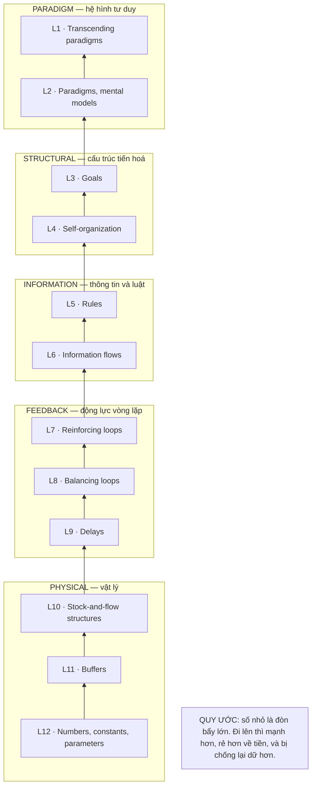
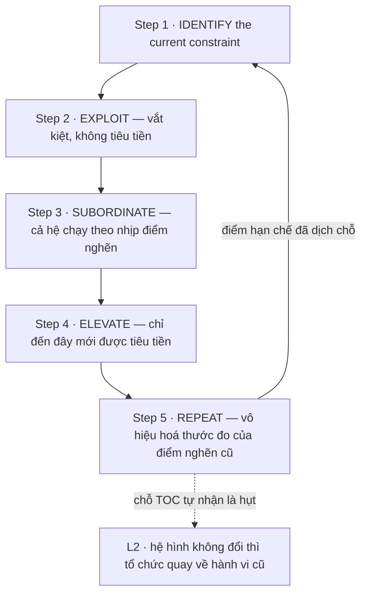

# Chương 15 — Mười hai tầng đòn bẩy, và 99% sự chú ý đổ vào đâu

Bốn phần vừa qua dựng được một chẩn đoán và dừng lại ở đó. Ta biết mỗi phương pháp đặt cược vào tổ chức
nào, biết chỗ nó vỡ khi chạm tổ chức thật, biết cả những chỗ không phương pháp nào buồn nhìn tới. Cái
chẩn đoán ấy vẫn để lại một câu hỏi không trả lời được từ bên trong ngành: **biết rồi thì vì sao vẫn
không sửa được?** Một tổ chức đã đọc đúng chẩn đoán của mình, đã viết ra sổ tay quy trình mới, đã mở lớp
đào tạo, vẫn quay về nếp cũ sau sáu tháng. Thiếu công cụ để trả lời câu đó thì cuốn sách này dừng ở mức
một bản kê khuyết điểm — đúng nhưng vô dụng.

Chương 14 dựng ba vùng mù — đội không ngồi cùng phòng, chỗ quy trình đứt ở ranh giới tổ chức, nơi giả
định nguồn lực sụp hoàn toàn — rồi tự tuyên bố đó là chỗ xa nhất mà cách đọc từ bên trong ngành đi được.
Nó nói được *phương pháp không nhìn tới cái gì*, và dừng lại đúng trước câu kế tiếp: **vì sao biết rồi
mà vẫn không đổi được gì.** Chương ấy cũng đã báo trước rằng Phần V sẽ đi mượn một lăng kính từ ngoài
ngành, và rằng chương mở đầu Phần V phải khai lại việc mượn ấy trước khi dùng. Đây là chương đó, và đây
là chỗ khai.

Hết chương này, ba thứ sẽ nằm trong tay. Một, thang mười hai tầng của Meadows đọc đúng chiều — kể cả cái
quy ước đánh số làm hỏng hầu hết người đọc lần đầu. Hai, năm bước tập trung của TOC và một điều hiếm gặp:
một phương pháp trong corpus **tự khai** nó can thiệp ở tầng nào, kèm luôn danh sách điều kiện hỏng của
chính nó. Ba, khung D-M-I-R — Diagnosis, Modeling, Intervention, Reflection — để chạy chẩn đoán mà không
sa vào việc ngồi xếp hạng cho vui, kèm một bài học về phép đếm mà chính khung ấy dạy ra.

---

## Cái lăng kính này mượn từ đâu, và ai trong đó không nói một chữ nào về thiết kế

**Donella Meadows và Eliyahu Goldratt không viết một chữ nào về thiết kế kỹ thuật.** Không một dòng nào
trong vật liệu của chương này bàn về ma trận hình thái, về pha cụ thể hoá, về chữ V, về danh sách yêu cầu.
Thang mười hai tầng được viết cho chính sách công, cho hệ sinh thái, cho kinh tế; năm bước tập trung được
viết cho nhà máy. Việc đặt chúng cạnh Pahl-Beitz và VDI 2221 là **thao tác của cuốn sách này**, không phải
phát hiện của bất kỳ nguồn nào trong sáu mươi sáu tài liệu.

Nói thẳng ngay đây, không giấu xuống chú thích, vì đây là rủi ro lớn nhất của cuốn sách. Một cuốn sách đi
buộc tội các phương pháp khác là *đặt giả định mà không khai báo* thì không được phép có một giả định
không khai báo nằm ngay giữa phần cuối của mình.

Ranh giới vì thế phải cứng và phải phát biểu được thành câu:

| Được phép | Không được phép |
|---|---|
| Dùng thang tầng làm **lăng kính** để hỏi một công cụ thiết kế: *nó tác động vào cái gì?* | Dùng Meadows làm **bằng chứng** rằng một công cụ thiết kế mạnh hay yếu |
| Nói *"theo cách phân tầng của Meadows, công cụ này chạm vào thông số"* | Nói *"Meadows chứng minh rằng ma trận hình thái là can thiệp tầng thấp"* |
| Mượn danh sách điều kiện hỏng của TOC để soi một cuộc phổ biến quy trình | Trích số liệu nhà máy của TOC như số liệu về hiệu quả thiết kế |

Còn một điều nữa phải nói ra, và nó không nằm trong khai báo chuẩn của cuốn sách. **Corpus không chứa
cuốn sách của Meadows.** Vật liệu của chương này là tám tệp phân tích — tên tệp bắt đầu bằng
`DMIR Analysis` — viết *về* các chương sách đó. Cuốn gốc chỉ xuất hiện dưới dạng một dòng thư mục:
`"*Meadows, D. H. (2008). Thinking in Systems: A Primer*"` [65]. Goldratt cũng vậy:
`"*Goldratt, E. M. (1984). The Goal: A Process of Ongoing Improvement*"` [65].

Hệ quả thực tế: mọi câu trích trong chương này là nguyên văn **của tài liệu phân tích**, không phải nguyên
văn của Meadows hay Goldratt. Khi tài liệu phân tích viết `"Chapter 6 presents Meadows’ 12-point leverage
hierarchy—the practical culmination of systems thinking."` [62], câu đó là lời của người phân tích tóm
lược Meadows. Nó đủ để dùng làm lăng kính. Nó không đủ để tranh cãi về ý định của Meadows. Chương 16 sẽ
căng ranh giới này thêm một nấc, và ở đó nó dễ vỡ hơn nhiều.

Một ghi chú nhỏ về trọng lượng nguồn: cuốn sách này có một nguồn chiếm gần một phần ba corpus, và toàn bộ
Phần II dựa nặng vào nó. Chương này thì không dùng đến nó một dòng nào. Toàn bộ vật liệu đến từ tám tệp
[59]–[66], một cụm hoàn toàn tách biệt. Đó là một điểm mạnh hiếm hoi: chương này không thể bị buộc tội là
lặp lại giọng của nguồn lớn.

---

## Thang mười hai tầng, và quy ước làm hỏng cả Phần V nếu đọc ngược

Trước bảng, một quy ước phải nắm chắc, vì đọc sai chỗ này thì ba chương còn lại của Phần V thành vô nghĩa:

> **SỐ NHỎ = ĐÒN BẨY LỚN.**
> L12 là tầng **yếu nhất**. L2 là tầng **gần mạnh nhất**. Thang chạy từ mười hai xuống một theo chiều
> tăng dần của sức mạnh, không phải giảm dần.

Đây là quy ước ngược với gần như mọi thang xếp hạng mà kỹ sư quen dùng — mức 1 thường là mức thấp nhất,
lớp 1 là lớp cơ sở, ưu tiên 1 là ưu tiên cao nhất nhưng bậc 1 là bậc thấp nhất. Người đọc lướt bảng và
tự động gán "L12 là cao nhất" sẽ rút ra kết luận ngược hoàn toàn: rằng chỉnh thông số là việc mạnh nhất
và đổi hệ hình tư duy là việc vặt. Đó đúng là niềm tin mà cả phần này tồn tại để bác bỏ.

Toàn bộ mười hai tầng, tên gốc nguyên văn, kèm phân nhóm của tài liệu phân tích [62]:

| Mã | Tên gốc nguyên văn | Nhóm can thiệp | Đọc sang ngôn ngữ tổ chức kỹ thuật |
|---|---|---|---|
| **L12** | `"Constants, parameters, numbers (such as subsidies, taxes, standards)"` | PHYSICAL | Hạn mức, định biên, ngân sách pha, dung sai, số ngày cho một cổng |
| **L11** | `"The sizes of buffers and other stabilizing stocks, relative to their flows"` | PHYSICAL | Tồn kho, thời gian dự phòng, số bản vẽ chờ duyệt được phép tồn |
| **L10** | `"The structure of material stocks and flows (such as transport networks, population age structures)"` | PHYSICAL | Bố trí xưởng, chuỗi bàn giao, ai ngồi cạnh ai, thiết bị nào có |
| **L9** | `"The lengths of delays, relative to the rate of system change"` | FEEDBACK | Bao lâu thì biết một quyết định thiết kế là sai |
| **L8** | `"The strength of balancing feedback loops, relative to the impacts they are trying to correct"` | FEEDBACK | Cổng kiểm có răng hay không, phản hồi có đủ mạnh để chặn không |
| **L7** | `"The gain around reinforcing feedback loops"` | FEEDBACK | Nợ kỹ thuật tự nhân lên, danh tiếng tự cộng dồn |
| **L6** | `"The structure of information flows (who does and does not have access to what information)"` | INFORMATION | Ai thấy được số liệu thử nghiệm, thấy lúc nào, thấy trước hay sau khi ký |
| **L5** | `"The rules of the system (such as incentives, punishments, constraints)"` | INFORMATION | Tiêu chí chấm việc, điều kiện qua cổng, cái gì được thưởng |
| **L4** | `"The power to add, change, evolve, or self-organize system structure"` | STRUCTURAL | Ai được quyền sửa chính quy trình, và sửa mà không phải xin ai |
| **L3** | `"The goals of the system"` | STRUCTURAL | Mục tiêu thật của tổ chức, không phải mục tiêu treo trên tường |
| **L2** | `"The mindset or paradigm out of which the system — its goals, structure, rules, delays, parameters — arises"` | PARADIGM | Thiết kế *là gì* trong đầu mọi người ở đây |
| **L1** | `"Transcending paradigms"` | PARADIGM | Biết rằng hệ hình nào cũng chỉ là một hệ hình |

Bản rút gọn cũng có nguyên văn, và đáng ghi lại vì nó ngắn hơn để nhớ: `"L12: Numbers—Constants and
Parameters"`, `"L11: Buffers—Stabilizing Stock Sizes"`, `"L10: Stock-and-Flow Structures—Physical
Architecture"`, `"L9: Delays—Feedback Loop Timing"`, `"L8: Balancing Feedback Loops—Corrective Strength"`,
`"L7: Reinforcing Feedback Loops—Growth/Decay Drivers"`, `"L6: Information Flows—Who Knows What When"`,
`"L5: Rules—Incentives, Constraints, Decision Criteria"`, `"L4: Self-Organization—Power to Evolve"`,
`"L3: Goals—System Purpose"`, `"L2: Paradigms—Mental Models"`, `"L1: Transcending Paradigms—Meta-Awareness"`
[62].

Cột thứ tư của bảng — cột dịch sang ngôn ngữ tổ chức kỹ thuật — **là của tôi, không của nguồn**. Không
tài liệu nào trong tám tệp nhắc tới bản vẽ, cổng kiểm hay nợ kỹ thuật. Cột đó là phép bắc cầu, và nó phải
được đọc như một đề nghị chứ không phải một kết quả.

Ba đặc điểm của thang này quan trọng hơn bản thân danh sách.

**Chi phí đi ngược với sức mạnh.** Đổi một hạn mức tốn tiền và tốn thiết bị. Đổi một luật chấm điểm tốn
một cuộc họp. Đổi hệ hình tư duy không tốn đồng nào — và gần như không ai làm được. Tài liệu ghi thẳng
nghịch lý này ngay ở dòng phân nhóm: L12 được xếp vào nhóm vật lý với ghi chú *"Chi phí cao, khó thay đổi
cấu trúc, tác động thấp"* [62].

**Sức chống cự tăng theo tầng.** `"Balancing Loop: Systems resist changes at high leverage points more
than low ones— “societies often rub out truly enlightened beings.”"` [62]. Với một tổ chức kỹ thuật,
câu này dịch ra thành điều mà ai từng đẩy quy trình mới đều đã gặp: đề xuất đổi biểu mẫu thì được duyệt
trong ngày, đề xuất đổi tiêu chí chấm việc thì mắc kẹt ba tháng, đề xuất đổi định nghĩa "thiết kế xong"
thì không bao giờ lên được lịch họp.

**Càng lên cao càng dễ đẩy sai chiều.** `"People deeply involved in a system often know intuitively where
to find leverage points, more often than not they push the change in the wrong direction."` [62]. Trực
giác chỉ đúng *chỗ*, không đúng *chiều*. Đây là lời cảnh báo nghiêm túc nhất trong toàn bộ vật liệu, và
nó là lý do chương này không kết thúc bằng lời khuyên "hãy luôn can thiệp ở tầng cao".

---

## Câu nói mà chương này lấy tên, và cách đọc nó cho đúng

> `"Probably 90—no 95, no 99 percent—of our attention goes to parameters, but there’s not a lot of
> leverage in them."` [62]

Đây là con số duy nhất trong tiêu đề chương, và nó phải được đọc đúng như nó đã được nói ra.

**Nó là một ước lượng nói miệng, tự sửa hai lần ngay giữa câu.** Chín mươi, rồi chín mươi lăm, rồi chín
mươi chín. Không có phương pháp đo, không có cỡ mẫu, không có định nghĩa thế nào là "sự chú ý". Người
nói đang leo thang một cách tu từ để nhấn mạnh, và cấu trúc câu giữ nguyên vết leo thang đó — dấu gạch
ngang và chữ *no* lặp lại chính là bằng chứng. Trích câu này rồi viết *"nghiên cứu cho thấy 99% nỗ lực
tổ chức rơi vào thông số"* là xuyên tạc, dù từng chữ số đều có trong nguyên văn.

**Phần bù "1%" không có nguyên văn.** Trong tài liệu phân tích có một dòng diễn giải sơ đồ nói rằng
99% chú ý rơi vào L12 *trong khi chỉ 1% chạm tới L1–L11*. Con số 1% đó là phép trừ của người phân tích,
không phải chữ trong câu gốc. Tôi bỏ nó đi và ghi lại việc bỏ ở sổ kiểm cuối chương.

**Vậy còn lại gì dùng được?** Còn lại một khẳng định định tính rất mạnh và rất khó bác: *phần áp đảo của
sự chú ý đổ vào tầng yếu nhất.* Câu vế sau — `"but there’s not a lot of leverage in them"` — mới là phần
mang tải trọng lập luận, và nó không phụ thuộc vào việc con số là 90 hay 99.

Cách dùng đúng của câu này trong một tổ chức kỹ thuật không phải là trích nó ra để doạ ai. Là dùng nó
như một giả thuyết kiểm được: **mở sổ họp của quý vừa rồi, đếm xem bao nhiêu mục thuộc L12.** Nếu tỷ lệ
thấp thì mừng. Nếu cao thì đã có một dữ kiện thật thay cho một câu trích.

```mermaid
flowchart LR
    subgraph NOLUC["Nơi sự chú ý đổ vào — 90, rồi 95, rồi 99 phần trăm"]
        direction TB
        A1["L12 · hạn mức, định biên, ngân sách pha, dung sai"]
        A2["L11 · tồn kho, thời gian dự phòng, hàng chờ duyệt"]
        A3["L10 · bố trí, chuỗi bàn giao, ai ngồi cạnh ai"]
    end
    subgraph DONBAY["Nơi đòn bẩy nằm — theo chính thang đó"]
        direction TB
        B1["L6 · ai biết cái gì, vào lúc nào"]
        B2["L5 · luật chơi, thưởng phạt, tiêu chí chấm việc"]
        B3["L3 · mục tiêu thật, không phải khẩu hiệu treo tường"]
        B4["L2 · thiết kế LÀ GÌ trong đầu mọi người ở đây"]
    end
    NOLUC -->|"khoảng cách này là toàn bộ nội dung của Chương 16"| DONBAY
```

> **Đào sâu: vì sao lời khuyên "cứ nhảy thẳng lên tầng cao" là lời khuyên tồi**
>
> Thang tầng dễ bị đọc thành một mệnh lệnh: bỏ L12 đi, lên L2 mà làm. Chính vật liệu nguồn chặn cách
> đọc đó ở bốn chỗ khác nhau.
>
> **L10 mạnh hơn L12 nhưng hiếm khi dùng được.** `"Physical structure is crucial in a system, but is
> rarely a leverage point, because changing it is rarely quick or simple."` [62]. Một tầng có thể vừa
> quan trọng vừa không phải chỗ để can thiệp — hai tính chất đó độc lập nhau. Đây cũng là chỗ mà mục
> TOC ngay sau đây trở nên gai góc.
>
> **L11 có mặt trái đo được.** `"Too big = inflexibility, slow response"` [62]. Kho đệm lớn hấp thụ
> được biến động nhưng giết mất tốc độ phản ứng. Không tầng nào là "cứ tăng lên thì tốt".
>
> **L9 rất dễ đẩy sai chiều.** `"Be sure you change it in the right direction! The great push to reduce
> information and money-transfer delays in financial markets is just asking for wild gyrations."` [62].
> Bản mô phỏng trong tài liệu cho kết quả phản trực giác đến mức đáng chép lại nguyên: `"Shorten
> perception delay: 5 → 2 days? Result: Worse oscillation! Shorten response delay: 3 → 2 days? Result:
> Much worse oscillation! Lengthen response delay: 3 → 6 days? Result: Damped oscillation!"` [66]. Kéo
> **dài** độ trễ phản ứng lại làm hệ ổn định. Đây là kết quả của một mô hình mô phỏng, không phải đo
> đạc trên tổ chức thật — nhưng nó đủ để phá vỡ trực giác "phản ứng càng nhanh càng tốt".
>
> **Càng lên cao càng bị chống.** Đã dẫn ở trên. Cộng bốn điều lại: thang tầng là công cụ để **xếp thứ
> tự đáng làm**, không phải giấy phép bỏ qua các tầng thấp.

---

## TOC: năm bước tập trung, và một phương pháp tự khai tầng của chính mình

Lăng kính thứ hai đến từ nhà máy chứ không từ chính sách công. Nó hẹp hơn nhiều so với thang tầng, và
chính vì hẹp nên nó dùng được ngay.

Tiền đề của TOC gọn đến mức khó chịu: `"At any time, ONE factor is most limiting."` [60]. Một hệ thống,
tại một thời điểm, có đúng một điểm hạn chế quyết định năng lực đầu ra. Mọi nỗ lực tối ưu ở chỗ khác
không làm hệ nhanh hơn — nó chỉ làm hàng chờ dày lên trước điểm nghẽn.

Năm bước, nguyên văn:

| Bước | Nguyên văn | Đầu vào | Đầu ra |
|---|---|---|---|
| 1 | `"Step 1: IDENTIFY the current constraint"` | Sơ đồ dòng chảy hiện tại, mức tích luỹ hàng chờ, tỷ lệ dùng công suất | Vị trí điểm nghẽn vật lý **hoặc** chính sách đang chặn dòng |
| 2 | `"Step 2: EXPLOIT the constraint"` | Năng lực hiện có của điểm nghẽn, danh sách hao phí phi giá trị | Vắt kiệt điểm nghẽn **mà không tiêu thêm tiền** |
| 3 | `"Step 3: SUBORDINATE everything else"` | Quyết định ở bước 2, năng lực dư của các khâu không nghẽn | Cơ chế Drum–Buffer–Rope: mọi khâu chạy theo nhịp điểm nghẽn |
| 4 | `"Step 4: ELEVATE the constraint"` | Giới hạn còn lại sau bước 2–3, ngân sách đầu tư | Mở rộng năng lực điểm nghẽn bằng tiền và cấu trúc |
| 5 | `"Step 5: REPEAT"` | Dấu hiệu điểm nghẽn đã dịch sang chỗ khác | Vô hiệu hoá thước đo cũ, quay lại bước 1 |

Nguồn: [60] và [65].

Thứ tự này mới là nội dung, không phải danh sách. **Bước 4 nằm sau bước 2 và 3, và điều đó cố ý.** Phản
xạ mặc định của mọi tổ chức khi gặp nghẽn là mua thêm — thêm máy, thêm người, thêm giấy phép phần mềm.
TOC chặn phản xạ đó bằng cách bắt vắt kiệt cái đang có và bắt cả hệ chạy theo nhịp của nó trước đã.
Trong ngôn ngữ tầng: bước 4 là can thiệp L10 tốn tiền, còn bước 2 và 3 là can thiệp L5 — đổi luật vận
hành — gần như không tốn gì.

Bước 5 là bước hay bị cắt nhất và là bước đắt nhất khi cắt. Điểm hạn chế dịch đi thì bộ thước đo dựng
riêng cho điểm hạn chế cũ vẫn ở lại, và từ đó trở đi nó chống lại chính hệ thống. Tên gốc của bước này
nói rõ mục đích: *prevent inertia from becoming the system's constraint* — ngăn quán tính trở thành điểm
hạn chế mới.

Đi kèm năm bước là một cuộc đổi luật kế toán, và đây là phần dễ bị bỏ qua nhất. TOC thay bộ thước đo cũ
bằng ba đại lượng: Throughput là tốc độ hệ tạo ra tiền qua bán hàng, tính bằng doanh thu trừ chi phí thật
sự biến đổi; Investment là tiền nằm trong những thứ định bán; Operating Expense là tiền chi để biến
Investment thành Throughput. Thứ tự ưu tiên đảo ngược hoàn toàn so với kế toán chi phí truyền thống: tăng
Throughput trước, giảm Investment sau, giảm Operating Expense sau cùng [65]. Kế toán chi phí cổ điển làm
đúng ngược lại — cắt chi phí trước tiên.

Đổi thứ tự ưu tiên của thước đo là can thiệp vào **L5 — luật chơi và tiêu chí chấm điểm**. Điều đó có
nghĩa TOC không thuần tuý là một phương pháp vận hành. Nó là một can thiệp L10 mang theo một can thiệp
L5 giấu trong người.

### Chỗ hiếm: một phương pháp tự khai tầng của mình

Đây là câu quan trọng nhất trong toàn bộ vật liệu của chương này:

> `"TOC emerges as primarily an L10-level intervention methodology (physical structure) that gains
> transformational power when integrated with higher-leverage thinking (L1-L5)."` [65]

Chú ý cái gì vừa xảy ra. Một phương pháp — hay chính xác hơn, tài liệu phân tích về nó — **tự đặt mình
lên thang tầng và tự nhận mình ngồi ở tầng mười**. Không tô hồng, không tự nhận là chuyển đổi tổ chức
toàn diện. Kèm theo là điều kiện để nó vượt được trần đó: phải ghép với tư duy ở tầng L1–L5.

Và tài liệu đi xa hơn nữa: nó liệt kê ra chính những chỗ mình hụt.

| Khoảng trống tự khai | Tầng | Nguyên văn |
|---|---|---|
| Lực cản hệ hình | L2 | `"Mental model resistance L2 (Paradigm) Implementation fails if paradigm unchanged"` |
| Mục tiêu có đúng không | L3 | `"Goal appropriateness L3 (Goals) Is “profit” the right goal?"` |
| Chất lượng thông tin | L6 | `"Information quality L6 Garbage in → wrong constraint identified"` |
| Mù trước động học vòng lặp | L7–L8 | `"Feedback loop blindness L7-L8 Doesn’t explicitly model R/B loop dynamics"` |
| Không dựng năng lực nội tại | L4 | `"Self-organization potential L4 Relies on external consultant vs. built capability"` |

Nguồn: [65].

Và bốn chế độ hỏng, cũng tự khai: `"Failure Mode 1: Wrong Constraint Identified"`, `"Failure Mode 2:
Constraint Shifts Unpredictably"`, `"Failure Mode 3: Financial Benefits Don’t Materialize"`,
`"Failure Mode 4: Organization Reverts to Old Behavior"` [65].

Chế độ hỏng thứ tư là chế độ hỏng của mọi cuộc phổ biến quy trình mà Phần II và Phần III đã kể lại bằng
ngôn ngữ khác. Tổ chức chạy đủ năm bước, thấy kết quả, rồi sáu tháng sau quay về nếp cũ — vì tầng L2
chưa bao giờ được chạm tới. Chương 17 sẽ đi hết đường này.

> **Đào sâu: vì sao việc một phương pháp tự khai tầng lại hiếm đến thế**
>
> Đặt cạnh nhau thì thấy ngay sự bất đối xứng. Trong tám tệp của cụm này, TOC được xếp hạng, được ghi
> giới hạn tầng, được liệt kê năm khoảng trống và bốn chế độ hỏng — bằng chữ, trong cùng tài liệu trình
> bày nó.
>
> Không một phương pháp thiết kế nào trong sáu mươi lăm nguồn còn lại làm điều tương tự. Không tiêu
> chuẩn nào viết *"hướng dẫn này chủ yếu can thiệp vào tài liệu và trình tự công việc, và sẽ thất bại
> nếu hệ hình của tổ chức không đổi"*. Phần II đã cho thấy các tiêu chuẩn ghi **cái được chốt** chứ
> không ghi **cái bị bác và vì sao**; đây là dạng mạnh hơn của cùng thói quen ấy — chúng cũng không ghi
> **giới hạn tác dụng của chính mình**.
>
> Cần công bằng: sự bất đối xứng này một phần là do thể loại tài liệu. Tám tệp `DMIR Analysis` là tài
> liệu **phân tích**, viết sau và viết từ bên ngoài; một tiêu chuẩn kỹ thuật là văn bản **quy định**,
> viết từ bên trong và mang chức năng pháp lý. Thể loại thứ hai gần như không bao giờ tự viết giới hạn
> của mình, ở bất kỳ ngành nào.
>
> Nhưng lời bào chữa đó không kéo dài được lâu. Corpus có nguyên một tuyến phê bình — các bài viết *về*
> Pahl-Beitz và VDI, cùng thể loại với tám tệp này. Vậy mà không bài nào trong tuyến ấy đặt câu hỏi
> *"phương pháp này can thiệp ở tầng nào"*. Câu hỏi đó không được hỏi trong ngành thiết kế. Đó chính là
> lý do chương này phải đi mượn, và là công việc của Chương 16.

---

## D-M-I-R: bốn bước, và một chỗ nguồn không tự đếm

Khung chạy chẩn đoán trong vật liệu này gọi là D-M-I-R. Bốn giai đoạn, mỗi tên có nguyên văn riêng:
`"Diagnosis (DST)"`, `"Modeling (SD)"`, `"Intervention (TOC)"`, `"Reflection (ML)"` [59] [65].

Ở đây có một chuyện đáng dừng lại, và nó là bài học phương pháp chứ không phải chuyện vặt về trích dẫn.
**Nguồn không tự gọi khung này là "khung bốn bước".** Tài liệu khai thác ghi rõ điều đó: không có câu
nguyên văn nào khẳng định *"four-stage D-M-I-R"*. Câu gần nhất là
`"...applying four integrated skills: Stock-Flow Mapper, Feedback Loop Detector, Meadows Leverage
Analyzer, and Constraint Finder."` [65] — bốn *kỹ năng*, không phải bốn *giai đoạn*, và tên bốn kỹ năng
đó khác hẳn tên bốn giai đoạn.

Bốn tên giai đoạn có nguyên văn từng cái. Con số bốn thì không. Cách viết đúng vì thế là: *khung D-M-I-R
gồm các giai đoạn Diagnosis, Modeling, Intervention, Reflection — nguồn không ở đâu tự đếm chúng thành
"bốn bước"*. Cách viết sai là *"khung bốn bước D-M-I-R"* rồi trích như thể nguồn nói vậy. Sự khác nhau
giữa hai cách viết đó là toàn bộ khoảng cách giữa một cuốn sách đáng tin và một cuốn sách không.

Nội dung bốn giai đoạn, đọc cho một tổ chức kỹ thuật:

| Giai đoạn | Việc phải làm | Câu hỏi kiểm |
|---|---|---|
| **Diagnosis** | Vẽ ra kho và dòng: cái gì tích lại, cái gì chảy, chảy qua đâu | Cái đang tồn đọng thật sự là cái gì? Bản vẽ chờ duyệt? Quyết định chưa ai dám ký? |
| **Modeling** | Tìm vòng phản hồi: cái gì tự khuếch đại, cái gì tự dập | Hành vi lặp này do ai làm sai, hay do cấu trúc sinh ra? |
| **Intervention** | Chọn tầng, chọn chiều, và chọn đúng **một** chỗ | Can thiệp này chạm tầng nào? Nếu là L12, có gì ở L5–L6 đi kèm không? |
| **Reflection** | Đo lại, và sửa mô hình trong đầu chứ không chỉ sửa thông số | Cái gì trong dự đoán ban đầu đã sai, và tại sao lại tin nó? |

Giai đoạn Reflection là giai đoạn duy nhất chạm tới L2, và cũng là giai đoạn duy nhất luôn bị cắt khi
hết thời gian. Đó không phải trùng hợp — đó chính là hình dạng của vấn đề mà cả Phần V đang mô tả.

---

## Bằng chứng: những lần can thiệp sai tầng, và một lần đúng tầng

Vật liệu nguồn giàu ca thực nghiệm. Tất cả đều ngoài ngành thiết kế; giá trị của chúng là chỉ ra **hình
dạng** của lỗi, không phải cung cấp số liệu về kỹ thuật.

| Ca | Tầng can thiệp | Kết quả | Nguyên văn |
|---|---|---|---|
| Chính sách dân số Romania 1967 | L5 siết luật, không chạm L3/L2 | Tử vong sản phụ tăng gấp ba, trẻ bị bỏ rơi, tỷ lệ sinh về gần mức cũ | `"Example 2: Romanian Population Policy (1967)"` · `"Dangerous illegal abortions tripled maternal mortality; Unwanted children abandoned to orphanages; Birth rate returned to near-previous levels"` [61] |
| Chỉ tiêu kế hoạch hoá gia đình Ấn Độ | L3 đặt sai mục tiêu đại diện | Hệ thống làm đúng chỉ tiêu bằng cách vi phạm bệnh nhân | `"Doctors, in their eagerness to meet their targets, put loops into women without patient approval"` [61] |
| Tín dụng thuế đầu tư | L12 chỉnh thông số, lặp đi lặp lại | Không chứng minh được lợi ích nào | `"Nobody can prove any benefit… which have been granted, altered, and repealed again and again in the last 30 years"` [61] |
| Hạn mức chia lô đất Vermont | L5 đặt ngưỡng cứng | Xuất hiện bất thường nhiều lô nhỉnh hơn ngưỡng | `"Vermont has an extraordinary number of lots just a little over ten acres"` [61] |
| Phun thuốc trừ sâu rừng thông | L12 tác động trực tiếp lên một kho | Diệt cả thiên địch, đẩy hệ vào trạng thái dịch kéo dài | `"Result: "Persistent semi-outbreak conditions"—worse than natural cycles"` [60] |
| Hai chính sách phản hồi động của Carter | L8 thiết kế đúng, nhưng bị L2 chặn | Chết trên chính trường | `"Both policies exemplify L8 (strengthening balancing feedback) with feedback gain proportional to the problem. They failed because: Public mental models (L2) favor static, linear solutions; Politicians optimize for visibility (L12), not effectiveness (L8); Payback periods (L3 goal confusion) favor short-term"` [63] |

Ca cuối cùng đáng đọc kỹ, vì nó không phải chuyện thiết kế dở. Chính sách được ghi nhận là **đúng tầng và
đúng chiều** — tăng cường vòng phản hồi cân bằng, với độ nhạy tỷ lệ thuận với mức nghiêm trọng của vấn đề.
Nó chết vì tầng L2 của công chúng và tầng L12 của giới chính trị. Một can thiệp đúng tầng vẫn thua nếu
tầng cao hơn chống lại nó. Đó là bài học mà một tổ chức kỹ thuật đang định phổ biến quy trình mới cần
mang theo.

Còn một ca đi ngược lại, và nó là ca duy nhất trong vật liệu có cả trước lẫn sau: đạo luật buộc công bố
lượng phát thải độc hại. `"System Before 1986:"` và `"System After TRI (1988):"`, với kết quả
`"Companies voluntarily reduce emissions 40% in 2 years"` và `"Impact: 40% reduction in 2 years; 90%
pledges"` [63]. Không có tiền phạt mới, không có ngưỡng mới — chỉ có việc số liệu trở nên công khai.
Đây là can thiệp L6 thuần tuý.

Cần trung thực về hai điều. **Con số 40% là mức giảm doanh nghiệp tự khai theo cơ chế tự nguyện**, đúng
như chữ *voluntarily* trong nguyên văn; nguồn không nói gì về việc kiểm chứng độc lập. Và ca này là ca
đơn lẻ ở quy mô quốc gia — nó không cho phép kết luận rằng công khai số liệu luôn tạo ra mức giảm tương
tự ở nơi khác.

Ca L6 thứ hai còn nhỏ hơn nhưng sạch hơn về thiết kế thí nghiệm. Hai căn nhà giống hệt nhau, khác nhau
đúng một điểm: vị trí đặt công tơ điện. `"Setup: Two identical houses, same families, same prices"` [60],
kết quả `"Front hall: 30% lower electricity consumption"` [62], cũng được ghi ở tệp khác dưới dạng
`"House B uses one-third less electricity"` [60].

**Cỡ mẫu là hai căn nhà.** Phải viết ra con số đó mỗi lần dẫn ca này, nếu không thì đang dùng một giai
thoại như một nghiên cứu. Cái ca này chứng minh được là *cơ chế tồn tại* — làm cho thông tin nhìn thấy
được ở đúng chỗ ra quyết định thì hành vi đổi, không cần luật, không cần tiền. Cái nó không chứng minh
được là *độ lớn của hiệu ứng*.

Cuối cùng, một nhóm ca về độ trễ, hữu ích cho bất kỳ ai quản lý dự án dài: hệ thống có độ trễ dài thì
dao động theo chu kỳ khớp với độ trễ đó — `"CATTLE CYCLE (7-year period, matching maturation delay)"`,
`"COCOA CYCLE (11-year period)"`, `"PIG CYCLE (4-year period)"` [60]. Chu kỳ không phải do ai làm sai.
Nó là hình dạng mà cấu trúc trễ sinh ra. Một dòng sản phẩm có chu kỳ phát triển ba năm sẽ có chu kỳ
thừa–thiếu năng lực thiết kế xấp xỉ ba năm, và không cuộc họp kiểm điểm nào chữa được điều đó — chỉ đổi
cấu trúc mới chữa được.

---

## Cái thang này dùng để làm gì, và không dùng để làm gì

Chương 16 sẽ lấy đúng thang này và áp lên toàn bộ công cụ đã đi qua trong Phần II và Phần III: ma trận
hình thái, bảng Pugh, VDI 2225, chữ V, bảy bước, và từng công cụ ICDM theo tên riêng — mỗi cái ngồi ở
tầng nào, và quan
trọng hơn, **chênh lệch giữa tầng thật và tầng mà công cụ tự nhận**. Đó là chỗ lăng kính mượn này sinh
ra kết luận mà không nguồn nào trong ngành thiết kế tự nói được.

Cũng là chỗ nó dễ vỡ nhất. Việc gán một công cụ thiết kế vào một tầng Meadows **hoàn toàn là suy luận
của cuốn sách này**. Chương 16 sẽ mang theo một cột *căn cứ ánh xạ* cho từng ô, và mọi ô không có căn cứ
từ nguồn sẽ được ghi rõ là suy luận của tác giả. Nếu cột đó vắng mặt thì chương ấy đã tự cho phép mình
điều mà cả cuốn sách này đang lên án.

Ba điều thang tầng **không** làm được, nói ra ở đây để Chương 16 không phải bào chữa:

Nó không xếp hạng chất lượng công cụ. Một công cụ L12 làm tốt việc L12 vẫn là công cụ tốt. Bảng dung sai
không kém hơn một cuộc đổi hệ hình — chúng làm hai việc khác nhau.

Nó không nói khi nào nên can thiệp. Thang cho biết *sức mạnh*, không cho biết *thời điểm* hay *chiều*.
Câu cảnh báo về việc đẩy sai chiều đã dẫn ở trên áp dụng đầy đủ.

Nó không thay được dữ liệu. Gán tầng cho một công cụ là giả thuyết, không phải phép đo. Kiểm nó bằng
cách đã nói: đếm sổ họp thật của chính mình.

---

## Áp dụng ở Xưởng

Bối cảnh: một xưởng cơ khí — điện tử — phần mềm nhúng, vài chục người, nhiều dòng sản phẩm chạy song song
ở các pha khác nhau.

### 1. Dán nhãn tầng cho ba việc cải tiến quy trình đang mở — và đóng lại việc nào ở L12 mà không có gì đi kèm

> **Quyết định ra được trong tuần này.** Mở sổ họp điều hành, lấy ra ba việc đang mở có tên dạng "cải
> tiến quy trình", "chuẩn hoá", "siết kỷ luật". Cạnh mỗi việc viết một mã L theo bảng ở đầu chương —
> chỉ một mã, chọn cái mà việc đó **thật sự chạm vào**, không phải cái mà nó tự nhận.
>
> Rồi ra quyết định: **việc nào rơi vào L12 hoặc L11 mà không đi kèm một thay đổi ở L5 hoặc L6 thì đóng
> lại hoặc ghép thêm.** Ví dụ điển hình: "rút thời gian duyệt bản vẽ từ năm ngày xuống hai ngày" là
> thuần L12 và sẽ trượt, trừ khi đi kèm một thay đổi L6 — người duyệt được thấy số liệu thử nghiệm
> trước lúc ký, chứ không phải sau.
>
> Việc này mất một giờ. Kết quả không phải là một bản phân tích mà là **một mục bị đóng lại**, và đó
> mới là bằng chứng nó đã chạy.
>
> *Bẫy:* dán nhãn xong rồi để đấy như một bảng đẹp. Không có mục nào bị đóng hay bị ghép thêm thì buổi
> đó là hoạt động phân tích thuần tuý — đúng thứ mà thang tầng xếp vào L12.

### 2. Đọc lại một cuộc siết kỷ luật quy trình đã thất bại

> **Vấn đề nó giải:** tổ chức lặp lại cùng một loại can thiệp thất bại vì lần nào cũng kết luận "tại
> người không tuân thủ".
>
> **Cách áp:** lấy một lần áp quy trình mới đã không ăn, dựng lại nó theo bốn giai đoạn D-M-I-R, và hỏi
> đúng một câu ở giai đoạn Intervention: can thiệp đó chạm tầng nào? Gần như chắc chắn nó nằm ở L12 —
> thêm biểu mẫu, thêm chữ ký, thêm mốc — trong khi thứ chặn nó nằm ở L5, tức là tiêu chí chấm việc vẫn
> thưởng cho tốc độ bàn giao chứ không thưởng cho việc làm đúng trình tự.
>
> **Bẫy:** biến buổi này thành phiên truy trách nhiệm. Nguồn nói thẳng rằng phản ứng loại đó không sửa
> được vấn đề cấu trúc: `"Blaming, disciplining, firing, twisting policy levers harder, hoping for a more favorable
> sequence of driving events, tinkering at the margins—these standard responses will not fix
> structural problems."` [61].

### 3. Trước khi ra thêm một quy định, thử làm cho thông tin nhìn thấy được

> **Vấn đề nó giải:** phản xạ mặc định khi có sự cố lặp lại là viết thêm một quy định, và số quy định
> tăng nhanh hơn mức tuân thủ.
>
> **Cách áp:** với mỗi quy định định ban hành, hỏi trước: có cách nào làm cho hậu quả nhìn thấy được
> **ngay tại chỗ và ngay lúc** người ta ra quyết định không? Đặt số lượt sửa sau xuất xưởng ở nơi người
> ra quyết định thiết kế nhìn thấy hằng ngày là can thiệp L6; ban hành quy định bắt kiểm tra chéo là
> can thiệp L5. Thử L6 trước vì nó rẻ hơn và không tạo ra thứ để lách.
>
> **Bẫy:** trích ca công tơ điện như một lời hứa về độ lớn hiệu quả. Cỡ mẫu là **hai căn nhà**. Ca đó
> chứng minh cơ chế tồn tại, không chứng minh con số.

### 4. Không tiêu tiền cho điểm nghẽn trước khi chạy hết bước hai và bước ba

> **Vấn đề nó giải:** đề xuất mua thiết bị hoặc tuyển thêm người xuất hiện ngay khi một khâu quá tải,
> trước khi có ai kiểm xem khâu đó đã chạy hết công suất chưa.
>
> **Cách áp:** dựng một cổng nhỏ trước mọi đề nghị đầu tư nhằm giải quyết quá tải — hai câu hỏi bắt
> buộc, tương ứng bước 2 và bước 3 của TOC. *Điểm nghẽn này đã hết thời gian chết, hết chờ đầu vào, hết
> làm lại chưa?* Và: *các khâu khác đã chạy theo nhịp của nó chưa, hay vẫn đẩy hàng vào theo nhịp riêng?*
> Chưa trả lời được cả hai thì đề nghị chưa lên bàn.
>
> **Bẫy:** dùng cổng này để trì hoãn vô hạn mọi khoản đầu tư. Bước 4 tồn tại trong danh sách và nó là
> bước hợp lệ — cổng chỉ đặt nó đúng thứ tự, không xoá nó.

### 5. Ghi lại điểm hạn chế đã dịch chỗ, và giết bộ thước đo của điểm hạn chế cũ

> **Vấn đề nó giải:** một khâu từng là nút thắt được ưu tiên đặc biệt; nút thắt đã chuyển sang chỗ khác
> từ lâu nhưng các ưu tiên, chỉ số và thói quen dựng cho nó vẫn còn nguyên và giờ đang cản dòng.
>
> **Cách áp:** mỗi quý, viết ra một câu duy nhất — *điểm hạn chế của xưởng lúc này nằm ở đâu* — rồi so
> với câu của quý trước. Nếu đã dịch chỗ, rà lại các thước đo và luật ưu tiên dựng cho vị trí cũ và bỏ
> đi. Đây chính là bước 5, cái bước hay bị cắt nhất.
>
> **Bẫy:** khai báo hai ba điểm hạn chế cùng lúc cho đỡ mất lòng ai. Tiền đề của TOC là
> `"At any time, ONE factor is most limiting."` [60] — khai ba điểm hạn chế tương đương với không khai
> điểm nào, và mọi khâu lại tiếp tục tối ưu cục bộ như cũ.

---

## Sổ kiểm của chương

- **Neo luận đề:** *Tầng đòn bẩy*. Nối ở ba chỗ: mục thang mười hai tầng dựng thước đo; mục TOC cho ca
  hiếm một phương pháp tự khai tầng của mình và tự khai điều kiện hỏng L2; mục *Cái thang này dùng để
  làm gì* chuyển thước đo sang Chương 16. Neo phụ *Mặt tiếp giáp* xuất hiện ở ca Carter — can thiệp
  đúng tầng vẫn thua khi tầng cao hơn chống lại.
- **Nguồn đã dùng:** [59], [60], [61], [62], [63], [65], [66]. Không dùng [1] — chương này hoàn toàn
  tách khỏi nguồn chiếm 32% corpus.
- **Con số có nguyên văn:**
  - 90 / 95 / 99 phần trăm — `"Probably 90—no 95…"` [62]
  - 12 tầng — `"Chapter 6 presents…"` [62]
  - 5 bước TOC — `"TOC’s Five Focusing Steps are…"` [65]; tên từng bước — `"Step 1: IDENTIFY…"` … `"Step 5: REPEAT"` [60] [65]
  - MỘT điểm hạn chế tại một thời điểm — `"At any time, ONE…"` [60]
  - 1984 Goldratt — `"*Goldratt, E. M. (1984)…"` [65]
  - 2008 Meadows — `"*Meadows, D. H. (2008)…"` [65]
  - 1986 / 1988 / 40% / 2 năm / 90% cam kết — `"System Before 1986:"` · `"Companies voluntarily reduce…"` · `"Impact: 40% reduction…"` [63]
  - 30% và một phần ba, cỡ mẫu 2 nhà — `"Front hall: 30%…"` [62] · `"House B uses…"` [60] · `"Setup: Two identical…"` [60]
  - 1967 Romania, gấp ba — `"Example 2: Romanian…"` · `"Dangerous illegal abortions…"` [61]
  - 30 năm tín dụng thuế — `"Nobody can prove…"` [61]
  - mười mẫu Anh Vermont — `"Vermont has an…"` [61]
  - chu kỳ 7 / 11 / 4 năm — `"CATTLE CYCLE (7-year…"` · `"COCOA CYCLE (11-year…"` · `"PIG CYCLE (4-year…"` [60]
  - độ trễ 5→2, 3→2, 3→6 ngày — `"Shorten perception delay…"` [66]
- **Con số đã BỎ vì không có nguyên văn:**
  - **"1%"** — phần bù của 99%. Là phép trừ trong lời diễn giải sơ đồ của tài liệu phân tích, không có
    trong câu gốc. Đã viết ra việc bỏ, ngay tại mục lấy tên chương.
  - **Công thức thời gian nhân đôi 70 hoặc 72 chia cho tốc độ tăng trưởng** — tệp khai thác trình bày
    dưới dạng công thức, không kèm câu trích. Bỏ.
  - **5% tăng trưởng và 14 năm nhân đôi** — có nguyên văn trong tệp khai thác nhưng thuộc ca tài nguyên
    ngoài phạm vi chương này; bỏ vì không phục vụ lập luận, không vì thiếu nguyên văn.
  - **Công thức thời gian chờ theo tỷ lệ dùng công suất** — trình bày dạng công thức, không có trích
    dẫn. Bỏ.
  - **"Bốn bước" của D-M-I-R** — bốn tên giai đoạn có nguyên văn từng cái, nhưng **nguồn không ở đâu tự
    đếm chúng thành bốn**. Đã viết ra điều này thành một mục riêng thay vì lặng lẽ dùng con số.
- **Chỗ là suy luận của tác giả, không phải của nguồn:**
  1. Toàn bộ việc mượn Meadows và Goldratt làm lăng kính cho thiết kế kỹ thuật. Không nguồn nào làm.
     Đã khai báo ở mục mở đầu chương.
  2. Cột thứ tư của bảng mười hai tầng — bản dịch sang ngôn ngữ tổ chức kỹ thuật. Của tôi hoàn toàn.
  3. Nhận định "đổi thứ tự ưu tiên thước đo của TOC là can thiệp L5" — suy ra từ định nghĩa L5 của
     Meadows và mô tả Throughput Accounting của nguồn; không nguồn nào phát biểu câu này.
  4. Nhận định rằng không phương pháp thiết kế nào trong corpus tự khai tầng của mình — quan sát của
     tôi trên corpus, kèm lời tự phản biện về khác biệt thể loại tài liệu, ở hộp *Đào sâu* thứ hai.
  5. Toàn bộ năm mục *Áp dụng ở Xưởng*. Không ca nào trong nguồn diễn ra ở một xưởng kỹ thuật.
  6. Ánh xạ từng ca thực nghiệm vào một tầng ở bảng bằng chứng — riêng ca Carter là ngoại lệ, tầng L8
     và L2 do chính nguyên văn nêu.
- **Cổng an ninh mục *Áp dụng ở Xưởng*:** không tên riêng, không mã sản phẩm, không tên dự án hay đơn vị,
  không sản lượng, không giá, không nhà cung cấp, không lịch giao hàng, không nêu lĩnh vực. Bối cảnh viết
  ở mức loại hình.
- **Số dòng:** 562 (khoảng quy định cho chương này: 450–600).
