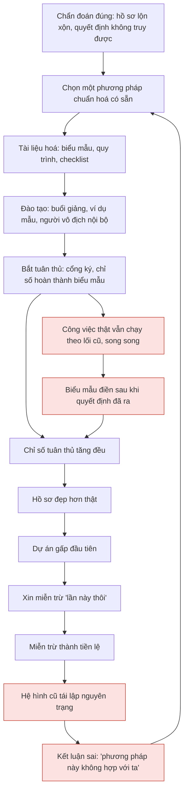
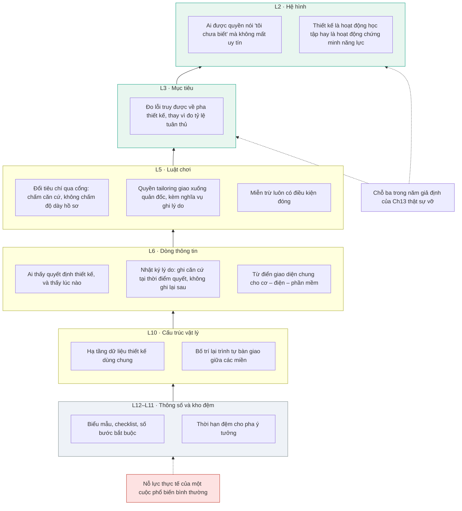

# Chương 17 — Vì sao phổ biến quy trình mới thường trượt

Một tổ chức quyết định áp một phương pháp thiết kế mới. Có ngân sách, có người đứng đầu, có tài liệu, có buổi đào tạo, có biểu mẫu. Sáu tháng sau, hồ sơ đầy đủ hơn hẳn trước đó, và cách người ta thật sự ra quyết định thiết kế không đổi một ly. Đây là chế độ hỏng phổ biến nhất của mọi thứ cuốn sách này đã mô tả — không phải chuyện thiếu quyết tâm, mà là hệ quả tính được từ hai chương trước. Thiếu chương này, người đọc rời cuốn sách với một bảng xếp hạng công cụ mà không biết vì sao chính hành động triển khai bảng ấy lại là thứ dễ trượt nhất.

Chương 16 xếp toàn bộ công cụ — ma trận hình thái, Pugh, VDI 2225, chữ V, bảy bước, và từng công cụ ICDM theo tên riêng — theo tầng đòn bẩy, rồi đo khoảng cách giữa tầng thật với tầng mà công cụ tự nhận. Bảng đó có một ô trống mà Chương 16 cố ý không điền: bản thân **hành động phổ biến** — việc mang một quy trình mới vào một tổ chức đang chạy — nằm ở tầng nào? Đây là chương điền ô đó. Ô ấy khép vòng hai vế của luận đề: vế một nói phương pháp là một **canh bạc đặt vào một tổ chức không tồn tại**, vế hai nói gần như mọi cải tiến can thiệp ở **tầng đòn bẩy thấp**. Hai vế gặp nhau ở đúng một chỗ: cuộc phổ biến.

Ba thứ chương này giao. Thứ nhất, một câu nguyên văn từ corpus — do chính tuyến hệ thống viết về chính nó — nói thẳng rằng triển khai thất bại nếu hệ hình không đổi, kèm đủ ngữ cảnh để không bị đọc quá tay. Thứ hai, ánh xạ **đúng năm giả định của Chương 13** sang tầng đòn bẩy, kèm khai báo chỗ nào là ánh xạ của sách. Thứ ba — phần có giá trị hành động cao nhất — một bộ **dấu hiệu sớm** quan sát được trong vài tuần đầu, trước khi con số tuân thủ kịp đẹp lên và che mất sự thật.

---

## Ranh giới phải nhắc lại trước khi bắt đầu

Meadows và Goldratt không viết một chữ nào về thiết kế kỹ thuật, và không nguồn nào trong sáu mươi sáu tài liệu đặt hai người này cạnh Pahl-Beitz. Việc dùng thang đòn bẩy để giải thích vì sao một cuộc phổ biến quy trình thiết kế trượt là **thao tác của cuốn sách này**, không phải phát hiện của nguồn nào.

Điều đó không làm lập luận vô giá trị; nó xác định giá trị ấy thuộc loại nào. Đây là một **lăng kính** cho phép nhìn thấy cấu trúc của thất bại, không phải **bằng chứng** rằng thất bại đã xảy ra theo đúng cơ chế ấy — bằng chứng về mặt tiếp giáp nằm ở Chương 13 và Chương 14. Kèm một nhắc nhở: quy ước của thang là **số nhỏ = đòn bẩy lớn**. L12 là thông số, yếu nhất; L2 là hệ hình tư duy, gần đỉnh. Đọc nhầm chiều là cách nhanh nhất để rút ra kết luận ngược hẳn.

---

## Một cuộc phổ biến nhìn từ bên trong

Cuộc phổ biến nào cũng bắt đầu bằng một chẩn đoán đúng: hồ sơ thiết kế lộn xộn, quyết định không truy được về căn cứ, lỗi lặp lại ở sản phẩm sau đúng như sản phẩm trước. Chẩn đoán đúng dẫn tới một can thiệp có vẻ hiển nhiên — có sẵn một phương pháp chuẩn hoá viết ra cho đúng vấn đề đó, mang về, dạy, và bắt tuân thủ.

Đường đi từ đó gần như không đổi giữa các tổ chức.

Ba chỗ đáng dừng lại trên sơ đồ này.

**Nhánh phải là nhánh quyết định, và nó chạy im lặng.** Công việc thật không dừng lại chờ quy trình mới; biểu mẫu được điền **sau** khi quyết định đã ra. Từ ngoài nhìn vào, hai nhánh không phân biệt được — cả hai đều sinh ra hồ sơ đầy đủ đúng hạn, và chỉ số tuân thủ đo sự tồn tại của tài liệu chứ không đo trình tự sinh ra nó. **Vòng lặp dưới cùng thì tự khép, và nó là vòng giết cuộc phổ biến**: kết luận "phương pháp này không hợp với ta" đẩy tổ chức quay lại bước chọn phương pháp, lần sau chọn cái khác, trượt ở đúng chỗ cũ. Nhiều tổ chức có một nghĩa địa phương pháp không phải vì chọn sai bốn lần, mà vì cả bốn lần đều can thiệp ở cùng một tầng.

**Điểm gãy không phải dự án gấp.** Dự án gấp chỉ là chỗ vết nứt lộ ra; vết nứt đã có từ bước bắt tuân thủ, khi thứ được đo là sự tồn tại của biểu mẫu chứ không phải thứ tự các bước tư duy. Meadows mô tả đúng cơ chế: `"Blaming, disciplining, firing, twisting policy levers harder... tinkering at the margins—these standard responses will not fix structural problems."` [61] Siết chặt tuân thủ khi thấy trượt chính là "twisting policy levers harder".

---

## Câu mà corpus tự viết về chính mình

Bản phân tích Theory of Constraints trong corpus làm một việc hiếm: nó tự chấm tầng đòn bẩy của chính phương pháp nó trình bày, rồi liệt kê những chỗ phương pháp ấy mù. Tự chấm tầng:

> `"TOC emerges as primarily an L10-level intervention methodology (physical structure) that gains transformational power when integrated with higher-leverage thinking (L1-L5)."` [65]

Và trong bảng khoảng trống, dòng đầu tiên:

> `"Mental model resistance L2 (Paradigm) Implementation fails if paradigm unchanged"` [65]

Đây là câu mà cả Phần V dẫn tới, nên phải trích đủ ngữ cảnh, không chỉ đủ chữ.

**Ngữ cảnh thứ nhất: đây là một dòng bảng, không phải một câu văn.** Ba mảnh — tên khoảng trống, mã tầng, hệ quả — nằm trên cùng một hàng của bảng *Gaps Identified*, cùng khuôn với bốn dòng còn lại (`"Information quality L6 Garbage in → wrong constraint identified"` [65]). Trích ra thành một dòng liền, nó đọc hùng hồn hơn bản gốc. Đọc cả bảng thì rõ: đây là danh mục điểm mù của một phương pháp, do người phân tích phương pháp ấy lập, không phải một định luật.

**Ngữ cảnh thứ hai: nó nói về TOC, không nói về Pahl-Beitz.** Chủ ngữ ẩn của "Implementation" là việc triển khai năm bước tập trung trong một tổ chức sản xuất. Việc mở rộng câu này sang việc triển khai một phương pháp thiết kế là **suy luận của cuốn sách**. Cơ sở của phép mở rộng: cả hai đều là việc mang một quy trình chuẩn hoá vào một tổ chức đang chạy, và cả hai đều đụng cùng một lớp — lớp người phải đổi cách nghĩ để quy trình có nghĩa. Cơ sở đó hợp lý, và nó vẫn là suy luận.

**Ngữ cảnh thứ ba, và nó làm câu trích mạnh lên chứ không yếu đi:** cùng tài liệu liệt kê bốn chế độ hỏng của TOC, và chế độ thứ tư nói lại đúng điều ấy bằng ngôn ngữ hành vi:

| Chế độ hỏng | Nguyên văn [65] | Đọc sang ngôn ngữ phổ biến quy trình |
|---|---|---|
| 1 | `"Failure Mode 1: Wrong Constraint Identified"` | Phổ biến quy trình để chữa một ràng buộc không phải ràng buộc thật |
| 2 | `"Failure Mode 2: Constraint Shifts Unpredictably"` | Quy trình vừa cài xong thì chỗ nghẽn đã dời sang khâu khác |
| 3 | `"Failure Mode 3: Financial Benefits Don't Materialize"` | Hồ sơ đẹp lên, chi phí và lỗi bảo hành không đổi |
| 4 | `"Failure Mode 4: Organization Reverts to Old Behavior"` | Sau đợt cao điểm, mọi người quay về lối cũ nguyên vẹn |

Chế độ 4 là vòng lặp dưới cùng của sơ đồ trên, và nguồn ghi lý do của nó là hệ hình chưa dịch chuyển. Đó là mảnh bằng chứng gần nhất mà corpus có cho luận điểm của chương này — và nó là bằng chứng về **triển khai TOC**, không phải về triển khai một phương pháp thiết kế.

---

## Câu hỏi bị bỏ qua: ràng buộc thật nằm ở đâu

Trước khi hỏi cuộc phổ biến can thiệp ở tầng nào, có một câu hỏi đến trước mà hầu như không cuộc phổ biến nào đặt: **chỗ nghẽn thật của tổ chức này có phải là thiếu quy trình không?** Tuyến Goldratt đặt câu hỏi ấy thành bước đầu tiên và không cho phép bỏ qua — `"Step 1: IDENTIFY the current constraint"`, `"Step 2: EXPLOIT the constraint"`, `"Step 3: SUBORDINATE everything else"`, `"Step 4: ELEVATE the constraint"`, `"Step 5: REPEAT"` [60,65] — trên nền một mệnh đề: `"At any time, ONE factor is most limiting."` [60]

Một cuộc phổ biến bình thường bắt đầu ở bước 4 — nâng cấp năng lực bằng cách đầu tư vào một quy trình mới — mà chưa làm bước 1. Nó **giả định** rằng ràng buộc là năng lực quy trình. Đôi khi đúng; thường thì chỗ nghẽn thật nằm ở nơi khác, và nguồn xếp chính chế độ hỏng này ở đầu bảng: `"Failure Mode 1: Wrong Constraint Identified"` [65].

Bốn ứng viên cho vị trí ràng buộc thật, tất cả quan sát được trước khi phổ biến:

| Ràng buộc thật có thể là | Triệu chứng phân biệt | Nếu đúng thì phổ biến quy trình sẽ |
|---|---|---|
| Năng lực quy trình — không ai biết làm có hệ thống | Người có kinh nghiệm cũng ra quyết định không nhất quán giữa hai dự án tương tự | Ăn — đây là ca cuộc phổ biến đúng thuốc |
| Năng lực người — thiếu người đủ trình ở một miền | Một miền luôn là khâu chậm nhất bất kể quy trình nào | Thêm thủ tục lên đúng khâu đang nghẽn, làm chậm hơn |
| Thông tin — quyết định ra khi chưa có dữ liệu cần | Quyết định phải làm lại sau khi số đo thật về | Không đổi gì; chỉ ghi đầy đủ hơn cùng những quyết định thiếu căn cứ |
| Mục tiêu — tổ chức đang thưởng cho tốc độ ra hàng | Ai chạy tắt được khen, ai làm kỹ bị coi là chậm | Bị vô hiệu trong một quý, vì nó chống lại cái đang được thưởng |

Cột giữa và cột phải là suy luận của tôi; nguồn chỉ cung cấp mệnh đề về ràng buộc duy nhất và danh sách chế độ hỏng. Ba dòng dưới cùng có chung một tính chất: **cuộc phổ biến vẫn sẽ tạo ra chỉ số tuân thủ đẹp trong cả ba trường hợp.** Đó là lý do bước 1 không bỏ được — bỏ nó thì mọi phản hồi sau đó đều không cho biết mình đang ở trường hợp nào.

---

## Phổ biến quy trình là can thiệp ở tầng nào

Đặt một cuộc phổ biến điển hình lên thang mười hai tầng:

| Hoạt động trong cuộc phổ biến | Nó thay đổi cái gì | Tầng | Định nghĩa tầng trong nguồn |
|---|---|---|---|
| Viết biểu mẫu, checklist, mẫu hồ sơ | Số lượng và định dạng tài liệu | **L12** | Meadows định nghĩa L12 là `"Constants, parameters, numbers"` [62] |
| Quy định số bước bắt buộc, số cổng ký | Tham số của quy trình | **L12** | — |
| Đặt thời hạn đệm cho pha ý tưởng | Kích thước kho đệm | **L11** | `"L11: Buffers—Stabilizing Stock Sizes"` [62] |
| Đổi trình tự bàn giao giữa các bộ phận | Cấu trúc dòng chảy vật lý của công việc | **L10** | `"L10: Stock-and-Flow Structures—Physical Architecture"` [62] |
| Buổi đào tạo, tài liệu hướng dẫn | Ai biết cái gì | **L6** | `"L6: Information Flows—Who Knows What When"` [62] |
| Đổi tiêu chí qua cổng, đổi cái được thưởng | Luật chơi | **L5** | `"L5: Rules—Incentives, Constraints, Decision Criteria"` [62] |
| Đổi thứ mà dự án bị chấm điểm | Mục tiêu thật của hệ thống | **L3** | `"L3: Goals—System Purpose"` [62] |
| Đổi niềm tin về *thiết kế là gì* | Hệ hình | **L2** | `"L2: Paradigms—Mental Models"` [62] |

Toàn bộ cột "Tầng" là **thao tác của cuốn sách**: nguồn cho định nghĩa từng tầng, việc gán hoạt động vào tầng là của tôi.

Bảng cho thấy điều mà một cuộc phổ biến bình thường không tự thấy: **nó không nằm ở một tầng, nó rải từ L12 đến L2** — nhưng khối lượng thì không rải đều. Ngân sách, thời gian và sự chú ý dồn vào bốn dòng đầu; dòng L2 thường không có ai được giao và không có cách đo.

Đây là bản sao chính xác của điều Meadows mô tả ở quy mô chung — câu 90 / 95 / 99 phần trăm mà Chương 15 đã mổ kỹ, kể cả chỗ nó tự sửa số ba lần và vì thế không dùng được như một thống kê. Và có một câu nữa làm cuộc phổ biến khó hơn chứ không dễ hơn:

> `"People deeply involved in a system often know intuitively where to find leverage points, more often than not they push the change in the wrong direction."` [62]

Người tổ chức cuộc phổ biến thường **biết** vấn đề nằm ở cách nghĩ chứ không ở biểu mẫu. Họ vẫn làm biểu mẫu, vì biểu mẫu là thứ làm được trong quý này, đo được, báo cáo được. Đó không phải sự ngu ngốc; đó là cấu trúc khuyến khích đang làm đúng việc của nó.

Cùng khoảng cách ấy đã xuất hiện ở Chương 16, ở cấp công cụ: cái mà một công cụ **tự nhận** cao hơn hẳn tầng nó thật sự vận hành. Cuộc phổ biến lặp lại đúng mẫu hình đó ở một cấp cao hơn. Nghĩa là khoảng cách tầng-thật / tầng-tự-nhận không phải khuyết tật của từng công cụ riêng lẻ mà là khuyết tật của cả lớp can thiệp: **thứ đo được thì nông, thứ sâu thì không đo được, và ngân sách luôn chảy về phía đo được.**

> **Đào sâu: vì sao càng can thiệp sâu càng bị đẩy ra**
>
> Tầng L2 không chỉ khó chạm; nó **chủ động kháng cự**. Meadows ghi điều đó như một vòng phản hồi cân bằng — `"Balancing Loop: Systems resist changes at high leverage points more than low ones— "societies often rub out truly enlightened beings.""` [62] — một mệnh đề định tính, không phải một quan hệ đo được. Hệ quả thực hành thì rõ: can thiệp ở L12 nhận được sự hợp tác lịch sự và chỉ số đẹp trong hai tuần; can thiệp ở L2 nhận được sự chống đối lập tức từ đúng những người có quyền chấm dứt cuộc phổ biến. Nghĩa là phản hồi ngắn hạn **hướng người tổ chức đi sai đường một cách có hệ thống** — ai điều chỉnh theo phản hồi sớm sẽ trôi dần về phía L12. Đó là gradient của địa hình, không phải yếu đuối cá nhân.
>
> Hệ quả cho việc lập kế hoạch: một cuộc phổ biến gặp **quá ít** phản đối trong tháng đầu không phải tin tốt — đó là dấu hiệu nó chưa chạm tới chỗ nào có đòn bẩy.

## Năm giả định tổ chức, đọc lại bằng thang đòn bẩy

Chương 13 dựng năm giả định mà cả bốn thế hệ phương pháp cùng đặt vào tổ chức áp dụng. Con số năm là **phép gộp của cuốn sách** từ chỗ hội tụ của **bốn khối tài liệu độc lập về thiết kế kỹ thuật** — khối thứ năm là tuyến Meadows/Goldratt, và Chương 13 đã loại nó khỏi vai bằng chứng theo đúng ranh giới của Phần V. Không nguồn nào trong corpus viết ra con số ấy, và không nguồn nào lập danh sách đó. Chương này không dựng lại bằng chứng cho từng giả định; nó hỏi một câu khác: mỗi giả định **vỡ ở tầng nào**, vì tầng vỡ quyết định cách chữa.

Năm mục dưới đây là **đúng năm mục đã vào thân Chương 13**, theo đúng thứ tự và đúng tên gọi ở đó, kèm chính câu bảo chứng mà Chương 13 dùng. Ba mệnh đề bị Chương 13 đẩy xuống phụ lục vì không truy được nguyên văn — **PL-1**, **PL-2**, **PL-3** ở phụ lục chương ấy — **không** có mặt ở bảng này và không được gán tầng. Gán tầng đòn bẩy cho một mệnh đề chưa có nguyên văn là cấp cho nó đúng thứ tư cách mà chương gánh luận đề đã từ chối cấp.

| # | Giả định (Ch13) | Câu bảo chứng, và điều kiện hỏng | Tầng vỡ | Vì sao gán tầng đó |
|---|---|---|---|---|
| **GĐ1** | Tổ chức là một cỗ máy xử lý thông tin, không có chính trị nội bộ | `"...makes it exceedingly hard for Pahl & Beitz to see method use as a social, political or organizational process and it makes it almost impossible to imagine that the goals of methods-related activities can be any other than getting the information right."` [43] | **L3** | Phương pháp hình dung một hệ thống chỉ có một mục tiêu: *làm cho thông tin đúng*. Tổ chức thật còn đuổi theo những mục tiêu khác — quyền, công trạng, an toàn cá nhân. Chỗ vỡ nằm ở **mục tiêu thật của hệ thống**, không ở dòng thông tin |
| **GĐ2** | Các bước sẽ được làm đúng như viết | `"...the steps of methods are routinely changed, skipped, or squeezed as a result of various pressures such as lack of time and money."` [43]; kỹ sư nhảy sang giải pháp vật lý cụ thể rất sớm, trình tự bị bỏ qua ngầm [8,10,12,13,14,15,16] | **L2** | Chữ `routinely` của nguồn nói rằng đây là thường lệ, không phải sự cố. Đó là hành vi nhận thức tự nhiên, không phải sự vô kỷ luật — chữa bằng luật là chữa sai tầng |
| **GĐ3** | Có tiền và thời gian cho một pha chưa đẻ ra bản vẽ nào | `"The objection is often raised that applying a systematic approach during the conceptual design phase takes too much time."` [1]; rào cản tài chính và áp lực thương mại hoá ở doanh nghiệp vừa và nhỏ [43] | **L3** | Mục tiêu thật của hệ thống là *ra hàng trước đối thủ*. Pha trừu tượng thua vì nó không được mục tiêu ấy tính điểm — không vì có ai phản đối nó |
| **GĐ4** | Có một ngôn ngữ chung xuyên cơ, điện và phần mềm | `"However, the lack of a common interface language has made the information exchange in concurrent engineering difficult."` [25] | **L6** | Vỡ ở chỗ *ai biết cái gì lúc nào*, không ở chỗ thiếu biểu mẫu. Nửa hạ tầng của nó — dữ liệu không ánh xạ tự động giữa các miền, phải nhập tay, sai lệch phiên bản — vỡ thấp hơn, ở **L10**, và đó là chỗ hiếm hoi mua được bằng tiền |
| **GĐ5** | Cả tổ chức cùng cam kết một phương pháp | `"The direction of the guidelines has changed from a personal support for individuals (Kesselring) towards a general procedure for a company addressing organization and content (VDI 2221)."` [13]; ở ranh giới bàn giao chỉ `"the minimum of documentation directly required may be transferred"` [10] | **L5** | Hướng dẫn đã đổi đối tượng từ cá nhân sang doanh nghiệp mà không kèm cơ chế kiểm tra rằng cam kết ấy có thật. Cái quyết định một nhóm ngoài phòng thiết kế có dùng nó hay không là **luật chơi** — ai bị bắt buộc, cái gì được thưởng |

Cột "Tầng vỡ" là ánh xạ của cuốn sách. Nguồn mô tả điều kiện hỏng và cho câu bảo chứng ở cột giữa; việc gán chúng vào thang Meadows không có trong nguồn nào.

Bảng này đọc được theo hai chiều, và chiều thứ hai mới là chiều có ích.

**Chiều thứ nhất, hiển nhiên:** ba trong năm giả định vỡ ở tầng L2 hoặc L3 — GĐ2 ở L2, GĐ1 và GĐ3 ở L3 — tức tầng mà một cuộc phổ biến bình thường không chạm tới. Đó là lý do phổ biến trượt. Một lưu ý về chính phép đếm ấy: "ba trong năm" đếm trên **ánh xạ ở cột bên phải**, tức trên phân loại của tôi, không trên một dữ kiện của nguồn. Nguồn cho điều kiện hỏng; nó không cho tầng.

**Chiều thứ hai, có ích hơn:** hai giả định còn lại **không** vỡ ở tầng cao. GĐ4 vỡ ở L6, GĐ5 vỡ ở L5 — và nửa hạ tầng của GĐ4 còn vỡ thấp hơn nữa, ở L10. Với hai giả định này, can thiệp bằng tài liệu, bằng hạ tầng, bằng một luật chơi viết ra được **là đúng tầng** — và sẽ ăn. Kết luận "mọi thứ đều là chuyện hệ hình" sai không kém kết luận "chỉ cần đủ biểu mẫu". Meadows cảnh báo đúng chỗ này khi nói về L10:

> `"Physical structure is crucial in a system, but is rarely a leverage point, because changing it is rarely quick or simple."` [62]

Câu này thường bị đọc thành "đừng động vào cấu trúc vật lý". Nó không nói vậy. Nó nói cấu trúc vật lý **quan trọng** nhưng **hiếm khi là điểm đòn bẩy** vì đổi nó chậm và tốn — nghĩa là: khi đã xác định đúng rằng chỗ vỡ nằm ở L10, hãy đổi nó, và hãy tính trước rằng nó sẽ chậm và tốn. Với hạ tầng dữ liệu thiết kế, "chậm và tốn" là mô tả đúng, không phải lý do bỏ cuộc.

---

## Ba nguyên mẫu bẫy mà cuộc phổ biến hay rơi vào

Tuyến Meadows liệt kê tám bẫy cấu trúc, và câu nguồn dùng để giới thiệu chúng cũng là câu cảnh báo cách dùng chúng:

> `"The power isn't in memorizing the eight archetypes—it's in developing the perceptual shift that allows you to see structure generating behavior rather than individuals causing problems."` [61]

Giá trị nằm ở chỗ chuyển góc nhìn, không ở chỗ thuộc danh sách. Ba trong tám bẫy có hình dạng nhận ra được trong một cuộc phổ biến quy trình. Việc gán chúng vào bối cảnh này là **thao tác của cuốn sách** — nguồn mô tả các bẫy ở quy mô chính sách công và tổ chức nói chung, không nói gì về thiết kế kỹ thuật.

| Nguyên mẫu [61] | Hình dạng của nó trong một cuộc phổ biến | Lối thoát theo nguồn |
|---|---|---|
| `"Policy Resistance"` | Càng siết tuân thủ, đội càng giỏi tạo hồ sơ hợp lệ mà không đổi cách làm. Nỗ lực hai bên đều cao, trạng thái không đổi | L3 — hợp nhất mục tiêu, thay vì mỗi bên kéo một hướng |
| `"Shifting the Burden"` | Mỗi lần thiết kế hỏng, phản ứng là thêm một bước kiểm; năng lực phán đoán của người thiết kế teo dần vì đã có bước kiểm lo | L2/L4 — dựng năng lực nội tại thay vì phụ thuộc giải pháp triệu chứng |
| `"Rule Beating"` | Đội tuân thủ đúng chữ, sai tinh thần: điền biểu mẫu sau khi quyết định đã ra, chia dự án nhỏ để né cổng | L5 — thiết kế lại luật để tinh thần của nó *chính là* con đường dễ nhất |

Hai chỗ đáng nói thêm. **Shifting the Burden là bẫy đắt nhất, và nó trông giống thành công**: mỗi bước kiểm thêm vào đều có lý do chính đáng vì nó ra đời sau một sự cố thật, nhưng nó bắt lỗi mà người thiết kế lẽ ra phải tự bắt, nên người thiết kế thôi tự bắt. Sau vài vòng, quy trình dày lên còn năng lực phán đoán mỏng đi, và tổ chức không bỏ bớt được bước nào nữa vì bây giờ nó phụ thuộc thật.

**Rule Beating thì không phải vấn đề đạo đức.** Nguồn ghi rõ phản xạ siết thực thi chỉ làm bẫy sâu thêm: `"Try to stamp out the self-organizing response by strengthening the rules or their enforcement... usually gives rise to still greater system distortion... That's the way further into the trap"` [61]. Khi thấy đội điền biểu mẫu sau khi quyết định đã ra, kết luận đúng là "luật đang thưởng cho sự tồn tại của biểu mẫu". Sửa ở L5, không sửa ở chỗ nhắc nhở. Bẫy thứ tám, `"Seeking Wrong Goal"`, không đứng riêng vì nó đã nằm sẵn trong cả ba: cả ba đều bắt đầu từ việc hệ thống đo tuân thủ thay vì đo chất lượng quyết định — `"Specify indicators and goals that reflect the real welfare of the system"` [61].

---

## Dấu hiệu sớm — nhận ra một cuộc phổ biến đang trượt

Đây là phần đáng mang ra khỏi chương. Vấn đề của việc phát hiện trượt là **độ trễ**: chỉ số tuân thủ đẹp lên trước, sự thật lộ ra sau — thường sau sáu tháng đến một chu kỳ sản phẩm, khi chi phí chìm đã đủ lớn để không ai muốn gọi tên nó. Nên tín hiệu cần tìm không phải là số, mà là **điều kiện hỏng đang hiện diện** — bốn điều kiện mà tuyến hệ thống ghi ra như những chỗ phương pháp của chính nó sụp đổ. Mỗi cái đều quan sát được sớm và đều có một câu hỏi kiểm tra ngắn.

### Dấu hiệu 1 — Văn hoá trừng phạt: lỗi bị dùng làm bằng chứng

Giả định bị phá: thông tin lưu chuyển tự do và phản hồi lỗi được tôn trọng (L6). Cơ chế phá:

> `"EGO DEFENSE (Weak Balancing)... Failure experience → Threatens identity → Defense mechanisms → Blame external factors → No model correction..."` [63]

Khi một lỗi thiết kế bị coi là bằng chứng để quy trách nhiệm, người ta không ngừng phạm lỗi — người ta ngừng **báo cáo** lỗi. Đầu vào của mọi công cụ trong Chương 16 bị bóp méo ngay từ chỗ nhập liệu, và mọi phân tích sau đó chạy trên dữ liệu sai. Nguồn gọi hệ quả này là `"Garbage in → wrong constraint identified"` [65].

Meadows còn chỉ ra chỗ sâu hơn của cùng cơ chế: `"There is a systematic tendency on the part of human beings to avoid accountability for their own decisions. That's why there are so many missing feedback loops."` [62] Vòng phản hồi không chỉ bị chặn; nó **chưa bao giờ được nối** vì không ai muốn nối.

**Câu hỏi kiểm tra:** lần gần nhất một quyết định thiết kế sai được ghi vào hồ sơ *kèm tên người quyết định và lý do lúc đó*, mà không có ai chịu hậu quả về mặt nghề nghiệp — là bao giờ? Nếu không nhớ được một lần nào, dấu hiệu này đang bật.

Điều kiện ngược, cũng từ nguồn: `"Error-embracing is the condition for learning."` [63]

### Dấu hiệu 2 — Lãnh đạo không buông kiểm soát

Giả định bị phá: tổ chức sẵn sàng để các phân hệ tự tổ chức (L4). Cơ chế phá, nguyên văn:

> `"Encouraging variability and experimentation and diversity means 'losing control.' Let a thousand flowers bloom and anything could happen! Who wants that?"` [62]

Trong một cuộc phổ biến, dấu hiệu này có hình dạng rất cụ thể: quy trình mới được phát ra **cùng lúc** với yêu cầu rằng mọi đội áp dụng **giống hệt nhau**, và mọi sai khác phải xin phép. Đó là dấu hiệu người tổ chức đang dùng cuộc phổ biến để tăng tính đồng nhất chứ không để tăng chất lượng quyết định — hai mục tiêu khác nhau, và Chương 5 đã cho thấy chính VDI 2221 bản 2019 chọn mục tiêu thứ hai khi đưa **tailoring** vào trung tâm.

Ép đồng nhất còn kích hoạt một bẫy có tên: `"Try to stamp out the self-organizing response by strengthening the rules or their enforcement... usually gives rise to still greater system distortion... That's the way further into the trap"` [61].

**Câu hỏi kiểm tra:** một quản đốc có được phép bỏ một bước của quy trình mới cho một dự án cụ thể, tự quyết, và chỉ ghi lại lý do — hay phải xin phê duyệt? Nếu phải xin, dấu hiệu này đang bật.

### Dấu hiệu 3 — Cát cứ thông tin giữa các miền kỹ thuật

Giả định bị phá: **GĐ4 — có một ngôn ngữ chung xuyên cơ, điện và phần mềm** (L6). Nguồn mô tả nó ở tuyến cơ điện tử: khi kỹ sư phần cứng và phần mềm không có ngôn ngữ giao diện chung, việc áp chữ V trở thành *"một thủ tục giấy tờ mang tính đối phó"*.

Dấu hiệu này khó thấy vì nó **không có triệu chứng tiêu cực ở giai đoạn đầu**. Mỗi miền vẫn giao đúng hạn phần của mình. Vấn đề chỉ hiện ra ở lần tích hợp đầu tiên, tức là muộn — và đến lúc đó nó sẽ được gọi tên là "lỗi tích hợp", không phải "phổ biến trượt".

**Câu hỏi kiểm tra:** lấy một thuật ngữ giao diện bất kỳ trong tài liệu quy trình mới, hỏi riêng một người bên cơ khí và một người bên phần mềm xem nó nghĩa là gì. Nếu hai câu trả lời khác nhau mà cả hai đều tự tin, dấu hiệu này đang bật. Đây là phép thử làm được trong một buổi chiều.

### Dấu hiệu 4 — Áp lực ngắn hạn và cái được nhìn thấy

Giả định bị phá: **GĐ3 — có tiền và thời gian cho một pha chưa đẻ ra bản vẽ nào** (L3). Nguồn ghi cơ chế này ở một ví dụ ngoài ngành, nhưng cấu trúc thì trùng khít:

> `"Both policies exemplify L8 (strengthening balancing feedback) with feedback gain proportional to the problem. They failed because: Public mental models (L2) favor static, linear solutions; Politicians optimize for visibility (L12), not effectiveness (L8); Payback periods (L3 goal confusion) favor short-term"` [63]

Ba dòng lý do ấy dịch sang bối cảnh một xưởng thiết kế gần như nguyên vẹn: mô hình tâm trí ưa giải pháp tĩnh và tuyến tính; người ra quyết định tối ưu cho thứ **nhìn thấy được** chứ không cho thứ **hiệu quả**; và chu kỳ hoàn vốn ưu tiên ngắn hạn. Pha trừu tượng đầu dự án thua ở cả ba: nó không tạo ra vật thể nhìn thấy được, giá trị của nó chỉ hiện ra ở cuối, và nó là thứ đầu tiên bị cắt khi lịch siết.

Corpus có một con số đo được đúng hiện tượng "công việc thật chạy ngoài quy trình chính thức": trong một doanh nghiệp được nghiên cứu, `"...revealed that a large number of the company's projects (roughly 30%) were results of other initiatives than the formal technology planning."` [43] Chữ *roughly* là của nguồn, và đây là **một** doanh nghiệp, không phải một mẫu khảo sát. Trích nó như tỷ lệ chung là sai. Trích nó như bằng chứng rằng hiện tượng có thật và đã được đo ít nhất một lần thì đúng — và với người đang tổ chức một cuộc phổ biến, đó là câu hỏi cần đặt về chính tổ chức mình: bao nhiêu phần công việc đang đi ngoài quy trình chính thức, và ai biết con số đó?

**Câu hỏi kiểm tra:** trong quý vừa rồi, có dự án nào được cho miễn trừ khỏi quy trình mới không? Nếu có, miễn trừ ấy có thời hạn và điều kiện đóng, hay chỉ là một lần cho qua? Miễn trừ không có điều kiện đóng là tiền lệ, và tiền lệ là bước áp chót của vòng lặp dưới cùng trên sơ đồ đầu chương.

### Bảng gộp — bốn dấu hiệu

| Dấu hiệu | Quan sát ở đâu | Tầng đang vỡ | Nhìn thấy được sau | Nếu bỏ qua thì lộ ra dưới tên gì |
|---|---|---|---|---|
| Lỗi bị dùng làm bằng chứng | Hồ sơ quyết định sai gần nhất | L6 → L2 | 2–4 tuần | "Dữ liệu đầu vào không đáng tin" |
| Ép đồng nhất, không cho tailoring | Quyền bỏ bước của quản đốc | L4 | 2–4 tuần | "Quy trình quá nặng" |
| Hai miền hiểu khác nhau cùng một từ | Phỏng vấn chéo một thuật ngữ giao diện | L6 | 1 buổi | "Lỗi tích hợp" |
| Miễn trừ không có điều kiện đóng | Danh sách miễn trừ quý | L3 | 1 quý | "Phương pháp không hợp với ta" |

Cột "Tầng đang vỡ" là ánh xạ của sách. Cột "Nhìn thấy được sau" là ước lượng thực hành của tôi, không có căn cứ đo trong nguồn nào — nó ở đây vì thứ tự tương đối giữa bốn dòng, không vì trị số tuyệt đối.

---

> **Đào sâu: vì sao chỉ số tuân thủ không bao giờ báo động kịp**
>
> Tuyến hệ thống có một thang đo mức nhận thức — thang tảng băng — giải thích vì sao bảng theo dõi của một cuộc phổ biến luôn báo bình an cho tới lúc quá muộn:
>
> `"EVENTS... What happened?... Very Low [predictive power]... BEHAVIOR... What patterns over time?... STRUCTURE... What stocks, flows, feedback?... High [predictive power]"` [60]
>
> Chỉ số tuân thủ là **sự kiện**: biểu mẫu đã nộp, cổng đã ký — nguồn xếp mức này ở *very low predictive power*. Muốn dự báo được thì phải lên mức cấu trúc, và bốn dấu hiệu ở mục trên chính là bốn phép đọc ở mức đó. Đây là lý do chúng không phải con số. Hệ quả thực hành: khi thấy dấu hiệu trượt, tăng tần suất họp kiểm điểm chỉ làm dày thêm mức sự kiện; cách khác là giữ nguyên nhịp nhưng đổi **thứ được nhìn**. Ít họp hơn, đọc sâu hơn.

## Điểm can thiệp thay thế

Chẩn đoán mà không có lối thoát thì chỉ là lời càu nhàu có cấu trúc. Sơ đồ dưới đây xếp các điểm can thiệp thay thế theo tầng, đọc từ dưới lên: tầng càng cao thì càng ít tiền và càng nhiều can đảm.

Sơ đồ này là **thao tác của cuốn sách**: nguồn cho định nghĩa các tầng và vài ví dụ can thiệp ngoài ngành thiết kế; việc điền nội dung từng ô bằng hành động cụ thể trong một xưởng thiết kế là của tôi.

Ba điều đọc ra được từ nó.

**Một.** Khoảng cách giữa mũi tên đỏ và hai ô xanh là toàn bộ luận đề của cuốn sách, vẽ trên một trang: nỗ lực đổ vào đáy, chỗ quyết định nằm ở đỉnh.

**Hai.** L5 là tầng thoả hiệp tốt nhất cho một tổ chức chưa dám chạm L2. Ba ô trong đó đều làm được bằng một văn bản, đều đo được, và cả ba đều **kéo theo** áp lực lên L3 và L2 mà không phải tuyên bố điều đó — cách vào hệ hình bằng cửa sau. Cả ba nằm ở mục 2, 3 và 4 của *Áp dụng ở Xưởng*.

**Ba.** Ô L3 chỉ có một dòng, và đó là dòng đắt nhất trong sơ đồ: đổi thước đo là chấp nhận hai quý số xấu. Cách làm cụ thể nằm ở mục 5 của *Áp dụng ở Xưởng*.

Meadows tóm chỗ đến của cả đường đi này trong một dòng: `"Core Paradigm Shift: From "predict and control" → "dance with systems""` [63] — đẹp và mơ hồ ngang nhau. Phần dịch nó thành hành động cụ thể là việc của Chương 18. Chương này chỉ giao một tiền đề: **cuộc phổ biến không phải bước cuối sau khi chọn phương pháp; nó là một phần của tiêu chí chọn.** Một phương pháp mà tổ chức không phổ biến nổi thì với tổ chức ấy là phương pháp sai, không phải phương pháp tốt hơn đang bị triển khai kém.

---

## Áp dụng ở Xưởng

Bối cảnh giả định cho cả năm mục: một xưởng cơ khí — điện tử — phần mềm nhúng, vài chục người, có phân xưởng và quản đốc, đang muốn áp một quy trình thiết kế có hệ thống. Mỗi mục mở bằng một câu nguyên văn từ nguồn, rồi đến việc phải làm.

### 1. Chạy phép thử từ điển giao diện trong tuần này

> `"However, the lack of a common interface language has made the information exchange in concurrent engineering difficult."` [25]

**Quyết định ra được trong tuần tới:** chọn năm thuật ngữ giao diện đang dùng trong tài liệu thiết kế hiện hành — những từ mà cả phần cơ, phần điện và phần mềm đều phải hiểu giống nhau. Hỏi riêng ba người, mỗi miền một người, viết định nghĩa của họ ra giấy, không cho xem của nhau. Đối chiếu.

**Vấn đề nó giải:** cho biết ngay trong tuần liệu GĐ4 có đứng trong xưởng mình hay không, trước khi đổ công vào một quy trình dựa trên nó.

**Cách áp:** một buổi chiều, ba người, năm từ, giấy và bút. Kết quả không cần báo cáo; nó chỉ cần được người quyết định quy trình nhìn thấy tận mắt. **Bẫy:** chọn năm từ dễ. Nếu cả ba trả lời giống nhau thì hoặc xưởng đang rất tốt, hoặc từ chọn quá hiển nhiên — hãy chọn từ mà mỗi miền đều nghĩ là "thuộc về mình".

### 2. Đổi tiêu chí qua cổng từ độ dày sang căn cứ

> `"Blaming, disciplining, firing, twisting policy levers harder... these standard responses will not fix structural problems."` [61]

**Vấn đề nó giải:** khi hồ sơ đủ mà quyết định vẫn tuỳ tiện, phản xạ tự nhiên là siết yêu cầu tài liệu — đúng thứ nguồn liệt kê là vô hiệu. Đổi tiêu chí cổng chuyển can thiệp từ L12 lên L5.

**Cách áp:** ở mỗi cổng, bỏ câu hỏi "đủ tài liệu chưa", thay bằng ba câu hỏi cố định: phương án nào **không** được chọn, ai quyết, và căn cứ lúc đó là gì. Hồ sơ đạt khi ba câu trả lời được, kể cả khi hồ sơ mỏng. **Bẫy:** ba câu hỏi ấy sẽ bị trả lời hình thức nếu người chủ trì cổng không đọc thật — và một cổng do người không đọc chủ trì thì tệ hơn không có cổng, vì nó cấp giấy chứng nhận sai.

### 3. Giao quyền tailoring xuống quản đốc, kèm nghĩa vụ ghi lý do

> `"Encouraging variability and experimentation and diversity means 'losing control.' Let a thousand flowers bloom and anything could happen! Who wants that?"` [62]

**Vấn đề nó giải:** ép mọi phân xưởng chạy quy trình giống hệt nhau làm quy trình chết ở phân xưởng có bối cảnh khác — và làm mọi người học cách xin miễn trừ thay vì học cách cắt may.

**Cách áp:** quản đốc được bỏ hoặc gộp bước cho một dự án cụ thể, tự quyết, không xin phép; đổi lại phải ghi một dòng lý do vào nhật ký thiết kế. Tổng hợp sau một quý cho biết bước nào đang bị bỏ ở mọi nơi — đó là bước cần sửa, không phải người cần nhắc. **Bẫy:** nếu dòng lý do bị dùng để đánh giá quản đốc, nó sẽ thành dòng vô nghĩa trong hai tháng. Nhật ký này phải nằm ngoài hệ thống đánh giá nhân sự, và điều đó phải được nói ra thành lời.

### 4. Buộc mọi miễn trừ có điều kiện đóng

> `"Failure Mode 4: Organization Reverts to Old Behavior"` [65]

**Vấn đề nó giải:** miễn trừ "lần này thôi" là cơ chế qua đó hệ hình cũ tái lập mà không ai phải tuyên bố từ bỏ quy trình mới. Nó là bước áp chót của vòng lặp trượt.

**Cách áp:** mỗi miễn trừ ghi kèm hai thứ — điều kiện để nó hết hiệu lực, và tên người sẽ kiểm điều kiện đó. Không có hai thứ ấy thì đó không phải miễn trừ mà là sửa quy trình, và sửa quy trình thì phải sửa công khai. **Bẫy:** điều kiện đóng dạng thời gian ("hết quý này") sẽ tự gia hạn; điều kiện dạng sự kiện ("khi hạ tầng dữ liệu dùng chung chạy") mới có chỗ để đóng thật.

### 5. Đổi thứ được đo, và chấp nhận hai quý số xấu

> `"Probably 90—no 95, no 99 percent—of our attention goes to parameters, but there's not a lot of leverage in them."` [62]

**Vấn đề nó giải:** chừng nào thứ được báo cáo lên trên còn là tỷ lệ tuân thủ, mọi nỗ lực trong xưởng sẽ trôi về L12 bất kể ai muốn gì. Đổi thước đo là can thiệp ở L3, và là can thiệp sâu nhất mà một người quyết định quy trình có thể tự làm.

**Cách áp:** thay chỉ số "tỷ lệ hồ sơ hoàn thành đúng hạn" bằng "số lỗi phát hiện ở giai đoạn sau mà truy được về một quyết định ở pha thiết kế", và công bố trước rằng con số này sẽ **tăng** trong hai quý đầu — vì trước đó nó không được ghi — và rằng việc nó tăng là dấu hiệu thước đo đang chạy.

**Bẫy:** nếu không công bố trước điều đó, quý đầu tiên có số xấu sẽ được đọc là bằng chứng quy trình mới làm hỏng việc — và cuộc phổ biến chết đúng ở chỗ nó bắt đầu có tác dụng.

---

## Sổ kiểm của chương

- **Nguồn đã dùng:** [1], [8], [10], [12], [13], [14], [15], [16], [18], [19], [20], [22], [23], [25], [26], [27], [43], [60], [61], [62], [63], [65]
- **Tập năm giả định:** chương trích **đúng năm mục đã vào thân Chương 13**, đúng thứ tự và đúng tên gọi, kèm chính câu bảo chứng của Ch13 ([43], [43], [1], [25], [13]+[10]). Ba mệnh đề ở phụ lục Ch13 **không** xuất hiện trong thân bài và **không** được gán tầng. Bản nháp trước dùng danh sách hội tụ thô và đã kéo một trong ba lên gán L2; chỗ đó đã bỏ.
- **Con số có nguyên văn:** 90 / 95 / 99 phần trăm [62] — đã ghi rõ là ước lượng tu từ tự sửa ba lần · 30% dự án ngoài quy hoạch [43] — cỡ mẫu **một** doanh nghiệp, chữ *roughly* là của nguồn · bảy mã tầng L12/L11/L10/L6/L5/L3/L2 [62] · bốn chế độ hỏng TOC và năm dòng bảng khoảng trống TOC [65] · năm bước tập trung [60,65] cùng mệnh đề nền `"At any time, ONE..."` [60] · ba tên bẫy và `"Seeking Wrong Goal"` [61].
- **Con số đã BỎ vì không có nguyên văn:** con số **năm** trong "năm giả định" — phép gộp của cuốn sách, Chương 13 là chương chủ · không đưa tỷ lệ nào về "bao nhiêu phần trăm cuộc phổ biến thất bại" · cột *Nhìn thấy được sau* (1 buổi / 2–4 tuần / 1 quý) không có căn cứ đo trong nguồn, đã ghi chú ngay dưới bảng.
- **Chỗ là suy luận của tác giả, không phải của nguồn:**
  - Toàn bộ cột *Tầng* trong bảng ánh xạ hoạt động → tầng đòn bẩy, và toàn bộ cột *Tầng vỡ* trong bảng năm giả định — kể cả phép đếm "ba trong năm", đã khai ngay tại chỗ.
  - Việc mở rộng câu `"Mental model resistance L2 (Paradigm) Implementation fails if paradigm unchanged"` từ ngữ cảnh triển khai TOC sang ngữ cảnh phổ biến một phương pháp thiết kế — đã nêu cơ sở và gọi tên là suy luận ngay tại chỗ.
  - Nội dung từng ô của sơ đồ *Điểm can thiệp thay thế*; sơ đồ *đường đi của một cuộc phổ biến trượt*; nhận định "phản hồi ngắn hạn hướng người tổ chức đi sai đường một cách có hệ thống" [62]; cột triệu chứng và cột hệ quả của bảng bốn ứng viên *ràng buộc thật* — nguồn chỉ cho mệnh đề ràng buộc duy nhất [60] và danh sách chế độ hỏng [65].
  - Việc gán ba nguyên mẫu bẫy vào bối cảnh phổ biến quy trình thiết kế; bốn *câu hỏi kiểm tra*; toàn bộ năm mục *Áp dụng ở Xưởng*.
- **Nối chương:** nối ngược đích danh về Ch16 (đoạn mở thứ hai; đoạn đối chiếu tầng-thật / tầng-tự-nhận) và về Ch13 (bảng năm giả định); nhắc Ch15 ở mục ranh giới, Ch5 ở dấu hiệu 2; nối xuôi tới Ch18 ở cuối mục *Điểm can thiệp thay thế*.
- **Sơ đồ:** 2 — *đường đi của một cuộc phổ biến trượt* (TD, có vòng lặp khép) và *điểm can thiệp thay thế theo tầng đòn bẩy* (BT, sáu tầng).
- **Cổng an ninh:** năm mục *Áp dụng ở Xưởng* không chứa tên riêng, mã sản phẩm, tên dự án, tên đơn vị, tên người, số liệu vận hành hay tên nhà cung cấp.