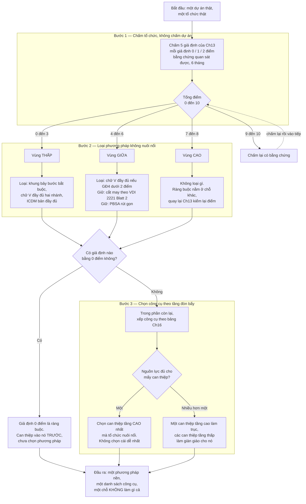
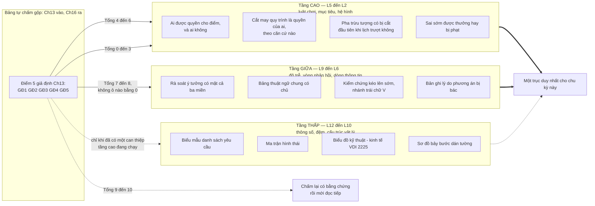

# Chương 18 — Chọn phương pháp cho tổ chức mình đang có

> *Không phải chọn phương pháp tốt nhất. Là chọn phương pháp mà tổ chức mình đang có nuôi nổi.*
> — đề từ Phần VI

Mười bảy chương vừa rồi dựng lên một bài toán mà không chương nào tự đóng được: bốn thế hệ phương pháp,
mỗi thế hệ đúng về kỹ thuật, mỗi thế hệ đặt một canh bạc khác nhau vào tổ chức áp dụng nó, và một
tổ chức thật chỉ trả nổi một phần các canh bạc đó. Người đọc đến đây biết đủ để chẩn đoán và vẫn chưa
biết đủ để chọn. Cái hỏng khi thiếu chương này rất cụ thể: người đọc gấp sách lại, thấy phương pháp nào
cũng có lý, rồi làm đúng điều mà Chương 17 vừa mô tả là đường trượt — lấy phương pháp mạnh nhất mình
đọc được, ban hành nó thành quy trình bắt buộc, và đo kết quả bằng số biểu mẫu được điền.

Chương 17 giải thích vì sao cuộc phổ biến đó trượt: ban hành một quy trình mới trong khi hệ hình tổ chức
không đổi là can thiệp ở tầng thấp nhất của thang Meadows, và corpus có sẵn câu mô tả đúng chế độ hỏng
này — `"Mental model resistance L2 (Paradigm) Implementation fails if paradigm unchanged"`. Chương 17
dừng ở chỗ chẩn đoán và ở danh sách dấu hiệu sớm. Nó không nói phải chọn cái gì thay vào. Chương này
nhận đúng chỗ đó: biến chẩn đoán của Chương 17 thành một thủ tục chọn, chạy được, có đầu vào là tổ chức
đang có chứ không phải tổ chức mong muốn.

Ba kết quả cụ thể. **Một:** một quy trình quyết định ba bước — chấm tổ chức trên năm giả định của
Chương 13, loại các phương pháp mà tổ chức không nuôi nổi, rồi trong phần còn lại chọn công cụ theo bảng
tầng đòn bẩy của Chương 16 — kèm bảng chấm điểm có mốc quan sát được, không phải mốc cảm tính.
**Hai:** một bản kê thẳng những gì cuốn sách này không trả lời được, và vì sao — corpus, phương pháp
khai thác, và ranh giới của lăng kính mượn. **Ba:** một danh sách việc phải làm tiếp, mỗi việc ghi rõ
cần dữ liệu gì, đo thế nào, và kết quả nào sẽ bác bỏ khẳng định tương ứng trong sách.

---

## Ba câu hỏi, và vì sao thứ tự không đảo được

Thủ tục dưới đây có ba bước. Thứ tự của chúng không phải sở thích trình bày.

Bước một hỏi *tổ chức này nuôi nổi cái gì*. Bước hai hỏi *phương pháp nào rơi ra ngoài*. Bước ba hỏi
*trong phần còn lại, tiền và sự chú ý nên đổ vào đâu*.

Đảo bước hai lên trước bước một thì bài toán quay về đúng chỗ cũ: chọn phương pháp theo phẩm chất nội
tại của nó, rồi mới hỏi tổ chức có theo nổi không — và câu trả lời cho câu hỏi thứ hai luôn là "sẽ cố",
vì nó được hỏi sau khi đã cam kết. Đảo bước ba lên trước bước hai thì tệ hơn: đầu tư vào tầng đòn bẩy
cao của một phương pháp mà tổ chức không nuôi nổi là cách tốn kém nhất để hỏng, vì can thiệp tầng cao
tiêu tốn vốn chính trị của người ra quyết định, và vốn đó chỉ tiêu được một lần.

Có một điều thủ tục này **không** làm: nó không xếp hạng bốn thế hệ phương pháp theo chất lượng. Không
phương pháp nào trong Phần II sai. Xếp hạng duy nhất mà chương này thừa nhận là xếp hạng theo **giá
nuôi** — và giá nuôi là một tính chất của cặp *phương pháp × tổ chức*, không phải của riêng phương pháp.

Ô cuối cùng đáng nói riêng. Đầu ra của thủ tục này luôn gồm một mục **không làm gì cả** — tên các công
cụ mà tổ chức sẽ chủ động bỏ qua trong chu kỳ này. Một quy trình chọn không sinh ra danh sách loại bỏ
thì nó chưa chọn, nó chỉ xếp hạng ưu tiên, và xếp hạng ưu tiên là cách quen thuộc để nói có với tất cả.

---

## Bước 1 — Chấm tổ chức trên năm giả định

Năm giả định đến từ Chương 13, dựng từ hội tụ của **bốn khối tài liệu độc lập về thiết kế kỹ thuật** —
khối thứ năm là tuyến Meadows/Goldratt và Chương 13 đã loại nó khỏi vai bằng chứng. Năm mục ấy, đúng thứ
tự và đúng tên gọi của Chương 13: tổ chức là một cỗ máy xử lý thông tin, không có chính trị nội bộ · các
bước sẽ được làm đúng như viết · có tiền và thời gian cho một pha chưa đẻ ra bản vẽ nào · có một ngôn ngữ
chung xuyên cơ, điện và phần mềm · cả tổ chức cùng cam kết một phương pháp.

Ba mệnh đề mà Chương 13 đẩy xuống phụ lục vì không truy được nguyên văn — PL-1, PL-2, PL-3 — **không**
có ô nào trong bảng dưới đây. Một công cụ quyết định không được chấm bằng tiêu chí mà chính cuốn sách
chứa nó đã tuyên bố là chưa đủ bằng chứng để đứng.

Bảng dưới đây khác bảng của Chương 13 ở một điểm: mỗi mức điểm neo vào một **quan sát**, không vào một
đánh giá. Lý do nằm trong chính corpus. Nguồn tuyến Pahl-Beitz mô tả một chế độ hỏng gắn với người ít
kinh nghiệm: tổ chức nhiều kỹ sư trẻ thì nỗi sợ trách nhiệm biến thành bám chặt vào tài liệu tối đa,
và hệ thống chỉ chạy trơn khi có người quản lý dày dạn dám lược bỏ. Một thang chấm bằng cảm nhận sẽ bị
chính chế độ hỏng đó bẻ cong: người sợ trách nhiệm cho điểm cao để khỏi phải giải thích điểm thấp.

| # | Giả định (Ch13) | 0 điểm — quan sát được | 1 điểm | 2 điểm |
|---|---|---|---|---|
| **GĐ1** | Tổ chức là cỗ máy xử lý thông tin, không có chính trị nội bộ | Có ít nhất một quyết định lớn gần đây được chốt ở nơi khác rồi mới hợp thức hoá bằng bảng chấm | Chuyện đó xảy ra nhưng hiếm, và có người dám nói ra trong phòng | Bảng chấm từng **lật ngược** một phương án mà cấp trên ưa thích, và nêu được phiên họp nào |
| **GĐ2** | Các bước sẽ được làm đúng như viết | Không truy được vì sao phương án hiện tại được chọn | Truy được với vài dự án lớn, không truy được với phần còn lại | Mọi dự án đều truy được, và **việc bỏ bước được ghi kèm lý do** |
| **GĐ3** | Có tiền và thời gian cho một pha chưa đẻ ra bản vẽ nào | Dự án gần nhất đi thẳng vào CAD trong tuần đầu tiên | Có pha trừu tượng nhưng bị cắt đầu tiên khi lịch trượt | Có dòng ngân sách riêng, và từng có dự án được kéo dài pha ý tưởng |
| **GĐ4** | Có một ngôn ngữ chung xuyên cơ, điện và phần mềm | Ba miền dùng ba cách gọi khác nhau cho cùng một giao diện, và không ai coi đó là vấn đề | Có tài liệu giao diện nhưng cập nhật sau khi đã thay đổi | Có bản đặc tả giao diện được ký, và **lỗi tích hợp gần nhất truy được về một dòng trong đó** |
| **GĐ5** | Cả tổ chức cùng cam kết một phương pháp | Chỉ nhóm thiết kế áp; các nhóm khác không biết quy trình | Hai đến ba nhóm áp, phần còn lại không | Chuỗi từ yêu cầu đến chế tạo dùng chung một bộ tài liệu, và nêu được một tài liệu đã đi hết chuỗi mà không bị dịch lại |

**Quy tắc chấm.** Chấm tổ chức, không chấm dự án tốt nhất của tổ chức. Chấm bằng bằng chứng của **sáu
tháng gần nhất** — cùng cửa sổ với Chương 13, để một điểm số chấm ở đó mang sang đây vẫn so được — không
bằng ý định của quý tới. Người chấm phải là người có thể bị điểm thấp làm cho khó xử; nếu người chấm
không mất gì khi cho điểm thấp thì bảng này thành một bài tập.

**Đọc kết quả.** Tổng từ 0 đến 10, và bốn vạch chia dùng chung với Chương 13: **0–3** chưa chọn phương
pháp, dựng điều kiện trước · **4–6** vùng tailoring có chủ đích · **7–8** áp gần đủ, bù chỗ yếu bằng cơ
chế · **9–10** hoặc đã đầu tư nhiều năm, hoặc vừa chấm bằng cảm nhận — chấm lại, lần này bắt buộc nêu
bằng chứng. Nhưng con số tổng vẫn ít quan trọng hơn **ô nào bằng 0**: một tổ chức 7 điểm với GĐ4 bằng 0
nguy hiểm hơn một tổ chức 5 điểm rải đều, vì giả định bằng 0 là ràng buộc, và mọi đầu tư vào bốn giả
định còn lại đều chảy qua nó mà mất.

> **Đào sâu: vì sao bảng này không có cột "phương pháp phù hợp nhất"**
>
> Một bảng chấm tổ chức tự nhiên muốn kết thúc bằng cột "vậy nên dùng phương pháp X". Bảng này cố ý
> không có cột đó, vì hai lý do.
>
> Thứ nhất, ánh xạ từ điểm số sang phương pháp là ánh xạ nhiều-nhiều. Một tổ chức 4 điểm có thể nuôi
> được VDI 2221 bản 2019 dưới dạng cắt may, hoặc nuôi được Pahl-Beitz rút gọn ở đúng pha ý tưởng, hoặc
> nuôi được cả hai theo hai dự án khác nhau. Ép nó thành một-một là dựng lại đúng thứ mà Chương 5 mô tả
> là cuộc nhượng bộ: chính cơ quan tiêu chuẩn đã bỏ khung bắt buộc để chuyển sang **tailoring** theo các
> nhân tố ngữ cảnh — `"VDI 2221-2 (2019) identifies a total of ten groups of contextual factors which
> are of particular importance for process design."` Một bảng tra cứu một-một sẽ đi ngược lại kết luận
> của chính tiêu chuẩn mà cuốn sách vừa dùng làm bằng chứng.
>
> Thứ hai, cột đó sẽ được đọc như thẩm quyền. Bảng chấm là công cụ chẩn đoán; danh sách phương pháp là
> quyết định. Trộn hai thứ vào một bảng là trao quyết định cho một bảng biểu — và Chương 10 đã cho thấy
> mọi thang chấm đều là một tuyên bố về **ai được quyền cho điểm**. Bảng này tuyên bố: quyền quyết định
> ở lại với người, bảng chỉ giao đầu vào.

---

## Bước 2 — Loại phương pháp mà tổ chức không nuôi nổi

Mỗi phương pháp tựa nặng nhất lên một hoặc hai giả định. Bảng dưới đây ghi giả định trụ, và ghi cái gì
xảy ra khi giả định trụ ở mức 0 hoặc 1.

Cột "giả định trụ" là **suy luận của tác giả**, dựng từ mục *"phương pháp này giả định một tổ chức như
thế nào"* ở cuối mỗi chương Phần II. Không nguồn nào trong 66 tài liệu xếp hạng các giả định theo mức
tựa nặng.

| Phương pháp | Chương | Giả định trụ | Khi trụ ở 0 hoặc 1 điểm, chế độ hỏng quan sát được |
|---|---|---|---|
| **PBSA** bốn pha đầy đủ | Ch03 | GĐ3 · GĐ1 | Pha ý tưởng bị cắt đầu tiên khi lịch trượt; đội quay về chọn giữa vài ý tưởng có sẵn. Nguồn ghi chế độ này dưới tên thiếu thời gian và kinh phí — và ghi cả cái nền của nó, rằng phương pháp không hình dung nổi việc dùng phương pháp là một quá trình có chính trị |
| **VDI 2221:1993** bảy bước | Ch04 | GĐ2 · GĐ4 | Bảy bước thành bảy tập hồ sơ lập sau khi đã quyết. Nguồn xác nhận khung `"is based on 7 stages"`; điều nguồn không hứa là hồ sơ ấy dẫn được quyết định |
| **VDI 2221:2019** cắt may | Ch05 | GĐ5 · GĐ2 | Cắt may mà không có cam kết cấp tổ chức thì thành cắt bỏ: người có quyền cắt luôn cắt phần mình không hiểu giá trị. Chính nguồn ghi rằng hướng dẫn đã đổi đối tượng từ cá nhân sang doanh nghiệp |
| **VDI 2206** chữ V, hai nhánh hoặc ba luồng | Ch06 · Ch07 | GĐ4 · GĐ2 | Cát cứ giữa phần cứng và phần mềm biến chữ V thành thủ tục giấy tờ đối phó; nguồn gọi chế độ này là thiếu `"lack of common interface language"` |
| **ICDM** bản đầy đủ | Ch08 | GĐ5 · GĐ2 | Chấm điểm khi chưa có gì để đo cần một tổ chức chịu được điểm thấp công khai. Không có cam kết cấp tổ chức thì thang điểm bị thương lượng ngược |

**Luật loại.** Nếu giả định trụ của một phương pháp ở mức 0, phương pháp đó bị loại **ở dạng đầy đủ**
cho chu kỳ này. Không loại vĩnh viễn, và không loại các mảnh rời của nó — cấu trúc chức năng vẫn dùng
được ở một tổ chức không nuôi nổi cả bốn pha.

Đây là chỗ dễ hiểu sai nhất. Loại một phương pháp không có nghĩa là kết luận nó dở. Nó có nghĩa là:
tổ chức này, ở trạng thái này, sẽ trả tiền cho bộ khung mà không nhận được cái mà bộ khung hứa. Chương 12
đã dựng sẵn phân biệt này: *"phương pháp không mô tả đúng"* khác *"phương pháp vô dụng"*. Ở đây phân biệt
song song: *"tổ chức không nuôi nổi"* khác *"phương pháp không đáng"*.

Và có một trường hợp mà thủ tục dừng lại, không đi tiếp bước 3. Nếu có giả định nào bằng 0, giả định đó
là ràng buộc theo đúng nghĩa của TOC — corpus tự xếp TOC là can thiệp `"primarily an L10-level
intervention methodology (physical structure)"`. Can thiệp vào ràng buộc trước, chọn phương pháp sau.
Chọn phương pháp trước rồi hy vọng nó kéo ràng buộc lên là đúng thứ tự đã trượt ở Chương 17.

---

## Bước 3 — Trong phần còn lại, chọn theo tầng đòn bẩy

Chương 16 xếp toàn bộ công cụ vào thang Meadows. Nhắc lại một lần ranh giới, vì bước này dựa hoàn toàn
vào nó: **việc ánh xạ công cụ thiết kế vào tầng đòn bẩy Meadows là thao tác của cuốn sách này.** Meadows
và Goldratt không viết một chữ nào về thiết kế kỹ thuật. Bảng Ch16 có cột *căn cứ ánh xạ* chính vì thế.

Điều bảng Ch16 cho thấy, và bước này khai thác: phần lớn công cụ trong bốn thế hệ nằm ở tầng thấp —
biểu mẫu, thông số, cấu trúc vật lý của quy trình. Và phần lớn nỗ lực phổ biến quy trình cũng đổ vào
đúng tầng đó. Meadows đo được sự lệch này bằng một câu:
`"Probably 90—no 95, no 99 percent—of our attention goes to parameters, but there's not a lot of
leverage in them."`

Câu đó nói về hệ thống nói chung, không nói về thiết kế kỹ thuật. Nhưng nó mô tả chính xác cái mà một
tổ chức làm khi nó quyết định "năm nay ta sẽ áp dụng quy trình thiết kế có hệ thống" và biến quyết định
ấy thành một bộ biểu mẫu mới.

Ba điều sơ đồ này nói, và cả ba đều ngược trực giác.

**Điểm càng thấp thì càng phải can thiệp tầng cao, không phải tầng thấp.** Trực giác nói ngược lại: tổ
chức yếu thì cho nó công cụ đơn giản trước. Nhưng công cụ đơn giản ở tầng thấp là biểu mẫu, và một tổ
chức có GĐ2 bằng 0 sẽ điền biểu mẫu sau khi đã quyết. Thêm biểu mẫu vào chỗ ấy là đổ công sức vào đúng
tầng mà Meadows đo được là gần như không có đòn bẩy.

**Chỉ tổ chức điểm cao mới nên đầu tư vào tầng giữa.** Vòng phản hồi và dòng thông tin cần một nền: cần
người dự đúng buổi, cần thuật ngữ chung để phản hồi có nghĩa. Đó chính là GĐ4 và GĐ5. Xây vòng phản hồi
trên nền không có GĐ5 thì vòng ấy chạy rỗng — nó sinh ra cuộc họp, không sinh ra thông tin.

**Đường nét đứt xuống tầng thấp không phải là cấm.** Công cụ tầng thấp có giá trị thật — nhưng như giàn
giáo cho một can thiệp tầng cao đang chạy, không như can thiệp độc lập. Ma trận hình thái dùng để mở
rộng không gian giải pháp thì hữu ích; ma trận hình thái ban hành thành bắt buộc trong một tổ chức mà
không ai được quyền bác ý tưởng của cấp trên thì chỉ tạo ra thêm ô trống được điền.

**Luật một trục.** Đầu ra của bước 3 là **một** can thiệp trục cho một chu kỳ. Không phải ba. Lý do
không nằm ở nguồn lực mà nằm ở khả năng đọc kết quả: chạy ba can thiệp cùng lúc thì khi có chuyển biến,
không ai biết cái nào tạo ra nó, và tổ chức học được không gì cả. Chương 17 gọi đây là chỗ một cuộc phổ
biến mất khả năng tự hiệu chỉnh — nó vẫn có thể thành công, nhưng nó không thể biết vì sao, nên nó không
lặp lại được lần sau.

---

## Chạy thử: ba tổ chức dựng sẵn, ba đầu ra khác nhau

Ba trường hợp dưới đây là **tình huống dựng để minh hoạ thủ tục**, không phải tổ chức đã quan sát. Chúng
kiểm được một thứ và chỉ một thứ: thủ tục có sinh ra ba đầu ra khác nhau từ ba đầu vào khác nhau hay
không. Một thủ tục quyết định luôn trả về cùng một lời khuyên thì nó không phải thủ tục, nó là một sở
thích được viết dài ra.

**Trường hợp A — tổng 3, và hai ô bằng 0.**
GĐ1=0 · GĐ2=1 · GĐ3=0 · GĐ4=1 · GĐ5=1. Hai ô bằng 0, nên thủ tục dừng ở bước 2 và không đi tiếp. Ràng
buộc phải chọn giữa GĐ1 và GĐ3. Chọn GĐ1, vì GĐ3 phụ thuộc GĐ1: pha trừu tượng chỉ có ngân sách riêng
khi quyết định kỹ thuật thật sự được ra trong pha ấy. Ở một tổ chức mà phương án đã chốt trước cuộc họp
rồi mới hợp thức hoá bằng bảng chấm, pha ý tưởng là một thủ tục — và không ai trả tiền cho một thủ tục.
Can thiệp trục: đổi luật chơi của cuộc họp chốt phương án — ai được quyền lật một phương án mà cấp trên
ưa thích, và điều gì xảy ra với người lật. Một luật chơi, tầng cao. Không ban hành phương pháp nào trong
chu kỳ này.

**Trường hợp B — tổng 6, không ô nào bằng 0, ô thấp nhất là GĐ4.**
GĐ1=2 · GĐ2=1 · GĐ3=1 · GĐ4=1 · GĐ5=1. Thủ tục đi hết ba bước. Bước 2 loại chữ V đầy đủ hai nhánh vì
GĐ4 dưới 2. Bước 3, với tổng trong vùng 4 đến 6, là vùng **tailoring có chủ đích**: giữ phần dựa trên
giả định đang mạnh, bỏ phần dựa trên giả định đang yếu, ghi rõ đã bỏ gì. GĐ1 bằng 2 là một tài sản —
bảng chấm của tổ chức này đã từng lật ngược một phương án mà cấp trên ưa thích, nghĩa là cuộc họp chốt
phương án thật sự quyết. Can thiệp trục: gắn nghĩa vụ ghi lý do vào chính cuộc họp ấy — mọi phương án bị
bác phải để lại một dòng căn cứ trong hồ sơ, viết tại thời điểm bác. Đó là kéo GĐ2 lên bằng hạ tầng đã
có, không phải dựng một hạ tầng mới.

**Trường hợp C — tổng 8, và một ô bằng 0.**
GĐ1=2 · GĐ2=2 · GĐ3=2 · GĐ4=0 · GĐ5=2. Vùng 7–8, nhưng có ô bằng 0 nên thủ tục vẫn dừng ở bước 2 —
luật ô bằng 0 không có ngoại lệ cho điểm tổng cao. Đây là trường hợp mà bảng tổng điểm sẽ nói sai nếu
đọc một mình: tổ chức này đủ mạnh để chạy bất kỳ phương pháp nào trong Phần II, và sẽ vẫn vấp, vì ba
miền gọi cùng một giao diện bằng ba cái tên. Can thiệp trục: một bản đặc tả giao diện có chủ, có ngày
ký, và có nghĩa vụ truy lỗi tích hợp về một dòng trong nó — một can thiệp tầng giữa, không phải tầng
cao, và đó là ngoại lệ hợp lệ duy nhất của luật "điểm thấp thì can thiệp tầng cao", vì ở đây điểm không thấp.

| | A | B | C |
|---|---|---|---|
| Tổng | 3 | 6 | 8 |
| Ô bằng 0 | GĐ1, GĐ3 | không có | GĐ4 |
| Thủ tục dừng ở | Bước 2 | đi hết Bước 3 | Bước 2 |
| Phương pháp bị loại ở dạng đầy đủ | tất cả | chữ V hai nhánh | không loại gì |
| Can thiệp trục | luật chơi của cuộc họp chốt phương án | nghĩa vụ ghi lý do phương án bị bác | bản đặc tả giao diện có chủ |
| Tầng của can thiệp trục | cao | cao | giữa |

Điều đáng chú ý nằm ở dòng cuối. Ba đầu vào khác nhau cho ba can thiệp khác nhau, ở hai tầng khác nhau,
và chỉ một trong ba trường hợp đi tới được bước chọn công cụ. Đó là hành vi đúng của thủ tục này: phần
lớn tổ chức, phần lớn thời gian, chưa ở chỗ chọn phương pháp — họ ở chỗ dọn điều kiện để việc chọn có
nghĩa. Trực giác ngược lại, và trực giác ngược lại chính là điều Chương 17 mô tả.

> **Đào sâu: thủ tục này chịu được sai đến đâu**
>
> Một thủ tục quyết định phải nói ra chỗ nó hỏng, nếu không nó lại phạm đúng cái tội mà cả cuốn sách
> đang buộc cho các phương pháp khác.
>
> **Nó chịu được sai một điểm.** Chấm GĐ2 là 1 thay vì 2 hầu như không đổi đầu ra, vì đầu ra được lái
> bởi ô bằng 0 và bởi vùng điểm rộng, không bởi giá trị chính xác của từng ô.
>
> **Nó không chịu được sai ở ranh giới 0 và 1.** Toàn bộ luật dừng ở bước 2 treo trên phân biệt này.
> Đó là lý do mốc 0 điểm trong bảng ở Bước 1 luôn là một quan sát dạng *không tìm được* hoặc
> *không có buổi nào* — dạng mệnh đề mà người chấm chứng minh sai được bằng cách chìa ra một tệp.
>
> **Nó hỏng hoàn toàn nếu người chấm và người hưởng lợi từ điểm số là một người.** Không có cơ chế nào
> trong thủ tục chặn điều đó. Đây là giả định tổ chức của chính thủ tục này — nó cũng là một canh bạc,
> và nó đặt cược đúng vào **GĐ1**. Một tổ chức mà quyết định lớn được chốt ở nơi khác rồi mới hợp thức
> hoá bằng bảng chấm sẽ chấm sai chính ô GĐ1. Vòng lặp ấy có thật, và chương này không gỡ được nó từ
> bên trong; nó chỉ gỡ được bằng một người chấm từ bên ngoài.

---

## Những gì cuốn sách này không trả lời được

Bốn khoảng trống, không sắp xếp cho dễ nghe. Các con số kiểm kê corpus dùng dưới đây — số tài liệu, số ký tự, tỷ lệ, trung vị — là **phép đo của chính dự án này trên vật liệu của nó**, không phải con số của nguồn nào.

**Corpus không có toàn văn tiêu chuẩn VDI nào.** Thứ gần nhất là bản trích mẫu VDI 2221 Blatt 1 (2019)
song ngữ Đức — Anh, 27.608 ký tự, cộng hai mục lục. Mọi khẳng định trong Chương 4, 5, 6, 7 về *nội dung*
tiêu chuẩn đi qua tài liệu thứ cấp: bài bình luận, bài dạy học, bài ứng dụng. Điều đó có nghĩa cụ thể:
khi sách viết bản 2019 nhận diện mười nhóm nhân tố ngữ cảnh, câu ấy dựa trên một bài báo mô tả tiêu
chuẩn, không dựa trên tiêu chuẩn. Bài báo có thể đếm sai, hoặc đếm theo bản dự thảo. Sách không kiểm
được điều đó từ bên trong corpus.

**Một nguồn chiếm 32% corpus.** Toàn văn *Engineering Design: A Systematic Approach* bản 3 — 1.167.487
trên 3.685.452 ký tự thân bài. Chương 3 trích dày nhất từ nguồn này. Khi một chương trích nhiều từ nó,
có hai cách giải thích cùng khớp dữ liệu: nó đúng, hoặc nó dài. Cuốn sách không có cách phân biệt hai
cách giải thích ấy bằng vật liệu sẵn có.

**Khung ba tầng là tổng hợp của cuốn sách này.** Không nguồn nào trong 66 tài liệu đặt Meadows cạnh
Pahl-Beitz. Việc xếp corpus thành tầng phương pháp, tầng phê bình, tầng hệ thống, rồi dùng tầng ba để
giải thích hai tầng kia, là thao tác của sách. Toàn bộ Phần V, và bước 3 của chương này, đứng trên thao
tác đó. Nếu thao tác ấy sai thì Phần V sai, và bước 3 sai theo. Chương 1 khai báo điều này ở ngay phần
mở chứ không giấu xuống phụ lục, vì một cuốn sách buộc tội các phương pháp khác là có giả định không
khai báo mà bản thân nó lại có một giả định không khai báo thì tự phá luận điểm của chính mình.

**Năm giả định hội tụ từ bốn khối tài liệu độc lập, nhưng qua cùng một bộ máy đọc.** Năm truy vấn chạy
trên năm notebook khác nhau, không notebook nào thấy câu trả lời của notebook kia — nhưng notebook thứ
năm là tuyến Meadows/Goldratt, và Chương 13 đã loại nó khỏi vai bằng chứng, nên con số dùng được là
**bốn**. Sự hội tụ là thật ở mức đó.
Nhưng cả bốn câu trả lời do cùng một mô hình sinh ra, và một mô hình có thể hội tụ vì tài liệu hội tụ,
cũng có thể hội tụ vì chính nó có xu hướng trả lời như vậy. Chương 13 xử lý bằng cách buộc mỗi giả định
truy về trích dẫn nguyên văn trong tài liệu gốc. Cái mà cách xử lý ấy **không** loại trừ được: khả năng
mô hình đã chọn ra đúng những đoạn khớp với câu hỏi, trong những tài liệu có đủ đoạn để chọn.

Bốn câu hỏi còn treo, ghi nguyên trạng.

**Pha cụ thể hoá của Pahl-Beitz có phải mười lăm bước.** Sách đánh số 1 đến 15 ở mục 7.1, và không bao
giờ viết ra chữ *"fifteen"*. Câu liền trước danh sách nói `"it is not always possible to draw up a strict
plan for the embodiment design phase"`. Cuốn sách này viết *"mười lăm bước công tác chính, kèm chính lời
tác giả rằng không thể lập kế hoạch chặt cho pha này"* — nghĩa là nó đếm, và nó nói ra rằng chính nó
đếm. Cái chưa giải quyết: không biết tác giả có coi danh sách ấy là một phép đếm hay không.

**Bảy bước của VDI 2221 là bảy hay khác.** Trích nguyên văn có: `"The design process as presented by the
VDI 2221 standard is based on 7 stages..."` — nhưng câu ấy nằm trong một tài liệu tổng quan, không nằm
trong tiêu chuẩn. Bản 2019 thay khung. Đối chiếu trực tiếp chưa làm được, vì lý do ở khoảng trống thứ nhất.

**Con số cải thiện trong thí nghiệm điều hoà cabin.** Có trích nguyên văn, nhưng câu liền trước nói bản
mẫu chỉ `"slightly outperforms"` hệ thống hiện hành, và cỡ mẫu là một xe với bốn người dùng. Điều kiện
đo chưa truy về bài gốc. Chương 7 không dùng con số này — và cuốn sách này cũng không viết nó ra ở đây.

**Nguồn [5] chưa cụm nào chạm tới.** Mục lục bản dự thảo VDI 2221 Blatt 1, 3.395 ký tự. Đã khoanh riêng
ở vòng vét mà vẫn không nổi lên. Ghi nhận là trống, không suy diễn về nội dung của nó.

Một điều nữa, thuộc loại khác và có lẽ quan trọng hơn cả bốn khoảng trống trên. Tám nguồn chỉ nổi lên
khi bị khoanh hẹp, trong đó có nguồn lớn thứ hai toàn corpus. Trung vị nhóm chỉ-vét 23.057 ký tự so với
nhóm nổi rộng 32.964 — quá gần để kích thước là lời giải thích. Thứ chung của cả tám: mỗi cái đều có một
nguồn láng giềng mạnh hơn trong cùng phạm vi. Nghĩa là **độ phủ của cuốn sách này là một hàm của cách
đặt câu hỏi, không chỉ của cái có trong corpus.** Điều đó áp cho mọi khẳng định dạng "corpus không nói
gì về X" — kể cả những khẳng định mà chương này vừa dùng.

---

## Việc phải làm tiếp

Sáu việc. Mỗi việc ghi: cần dữ liệu gì, đo thế nào, và kết quả nào sẽ **bác bỏ** một khẳng định trong sách.

**1. Mua toàn văn VDI 2221 Blatt 1 và Blatt 2 bản 2019, và VDI/VDE 2206 bản 11/2021.**
*Dữ liệu:* văn bản tiêu chuẩn, không phải bài báo về tiêu chuẩn.
*Đo:* đếm nhóm nhân tố ngữ cảnh trong Blatt 2; đếm luồng trong mô hình 2206 bản 2021; đối chiếu từng
khẳng định của Chương 4, 5, 6, 7 với văn bản.
*Bác bỏ nếu:* số nhóm nhân tố ngữ cảnh khác mười; hoặc mô hình 2206 bản 2021 không phải ba luồng song
song. Cả hai khẳng định này hiện đứng trên tài liệu thứ cấp.

**2. Mở PDF gốc Pahl-Beitz, mục 7.1, đọc câu dẫn và câu kết của danh sách bước cụ thể hoá.**
*Dữ liệu:* hai câu bao quanh danh sách, và toàn bộ mục 7.1.
*Đo:* tìm chuỗi *"fifteen"*, *"15 steps"*, *"the following steps"* trong bán kính hai trang.
*Bác bỏ nếu:* tác giả có gọi ra một phép đếm ở chỗ khác — khi đó cách diễn đạt thận trọng của Chương 3
là thận trọng thừa, và bài học rút ra ở đó phải sửa.

**3. Truy bài gốc của thí nghiệm điều hoà cabin.**
*Dữ liệu:* phương pháp đo, điều kiện biên, cỡ mẫu, hệ quy chiếu so sánh.
*Đo:* đọc mục phương pháp và mục giới hạn của bài gốc.
*Bác bỏ nếu:* điều kiện đo đủ chặt để con số dùng được — khi đó việc Chương 7 bỏ nó là bỏ nhầm, và quy
tắc "không có nguyên văn đủ ngữ cảnh thì bỏ" cần thêm một điều khoản cho trường hợp truy được về sau.

**4. Chấm bảng năm giả định trên các tổ chức thật, rồi theo dõi mười hai tháng.**
Đây là việc quan trọng nhất trong sáu việc, vì nó là chỗ duy nhất biến cuốn sách từ suy luận thành
khẳng định kiểm chứng được.
*Dữ liệu:* điểm GĐ1 đến GĐ5 chấm tại thời điểm khởi động dự án, chấm bởi người không biết kết quả sau;
và một biến kết quả xác định trước — chẳng hạn số lần thay đổi kiến trúc sau khi đã sang pha cụ thể hoá.
*Đo:* tương quan giữa tổng điểm với biến kết quả, và riêng giữa "có ô bằng 0" với biến kết quả.
*Bác bỏ nếu:* các tổ chức có ô bằng 0 không khác biệt với các tổ chức rải đều cùng tổng điểm. Khi đó
luật "ô bằng 0 là ràng buộc" — trục của bước 2 — không đứng được.
*Cỡ mẫu tối thiểu để nói được gì:* chưa biết. Đó cũng là một việc phải làm, và phải làm trước.

**5. Chấm mù bảng ánh xạ công cụ vào tầng đòn bẩy của Chương 16.**
*Dữ liệu:* danh sách công cụ, đưa cho người biết Meadows nhưng chưa đọc cuốn sách này, kèm định nghĩa
mười hai tầng, không kèm ánh xạ của sách.
*Đo:* độ đồng thuận giữa những người chấm độc lập với nhau, và độ lệch của họ so với bảng của sách.
*Bác bỏ nếu:* những người chấm độc lập không đồng thuận với nhau. Khi đó bảng Ch16 không phải là một
ánh xạ mà là một ý kiến, và bước 3 của chương này mất căn cứ — dù nó vẫn có thể còn giá trị như một
cách sắp xếp suy nghĩ, và cần được gọi đúng tên như vậy.

**6. Chạy lại vòng khai thác bằng khoanh hẹp, cho tám nguồn bị láng giềng chèn ép và cho nguồn [5].**
*Dữ liệu:* câu trả lời cho cùng bộ truy vấn, nhưng phạm vi khoanh về từng nguồn một.
*Đo:* so nội dung mới nổi lên với nội dung đã dùng trong Phần II và Phần III.
*Bác bỏ nếu:* có mâu thuẫn thực chất — nghĩa là một nguồn bị chèn ép nói ngược lại điều mà nguồn láng
giềng mạnh hơn đã nói, và sách đã lấy phía láng giềng mạnh mà không biết là có phía kia.

Ba việc đầu là việc tra cứu, làm được trong vài tuần. Việc thứ tư là việc nhiều năm. Việc thứ năm và
thứ sáu ở giữa. Không việc nào trong sáu việc cần thêm một lý thuyết mới — tất cả đều cần dữ liệu thay
cho suy luận, và đó là thứ cuốn sách này thiếu nhất.

---

## Áp dụng ở Xưởng

### 1. Tuần tới: chấm bảng năm giả định, một lần, và không bàn phương pháp trong cùng buổi

Bối cảnh: một xưởng cơ khí — điện tử — phần mềm nhúng, vài chục người, đang chạy vài sản phẩm ở các pha
khác nhau. Quyết định ra được ngay trong tuần: **dành chín mươi phút chấm GĐ1 đến GĐ5 cho chính xưởng,
bằng bằng chứng sáu tháng gần nhất, và không kèm bất kỳ đề xuất phương pháp nào trong cùng buổi đó.**

Cách làm: người chấm là người ra quyết định thiết kế, không phải người làm tài liệu. Mỗi ô phải chỉ ra
được một bằng chứng quan sát được — một bản ghi, một ngày tháng, một tệp; không chỉ ra được thì ô đó
bằng 0. Đầu ra của buổi là năm con số và một danh sách bằng chứng, không phải một kế hoạch.

Vì sao tách khỏi việc đề xuất phương pháp: nếu buổi chấm và buổi đề xuất là một, điểm số sẽ được chấm
sao cho nó biện minh cho đề xuất đã có sẵn trong đầu. Tách ra một tuần là đủ để phá liên kết đó.

### 2. Đọc ô bằng 0 trước khi đọc tổng điểm

**Vấn đề nó giải:** xưởng có tổng điểm khá nhưng vẫn vấp đi vấp lại ở cùng một chỗ, và không ai chỉ ra
được chỗ ấy vì tổng điểm che nó.

**Cách áp:** xếp năm ô theo thứ tự tăng dần, lấy ô thấp nhất làm ràng buộc của chu kỳ, và viết ra một
câu duy nhất mô tả *cái gì sẽ khác đi nếu ô đó lên một điểm*. Không viết nổi câu đó thì ô ấy chưa phải
ràng buộc thật — chấm lại.

**Bẫy:** ô thấp nhất thường là ô thuộc thẩm quyền của chính người chấm, nên nó bị nâng lên một cách vô
thức. Đối chiếu chéo: để một người khác chấm riêng ô ấy, rồi so hai kết quả.

### 3. Chọn một trục, và viết ra bốn thứ sẽ không làm

**Vấn đề nó giải:** mỗi lần cải tiến quy trình, xưởng khởi động ba đến bốn việc cùng lúc, và sáu tháng
sau không ai biết việc nào có tác dụng.

**Cách áp:** một can thiệp trục cho một chu kỳ, kèm danh sách bốn công cụ **sẽ không dùng** trong chu kỳ
này — ghi tên cụ thể, dán cùng chỗ với can thiệp trục. Danh sách không-làm quan trọng ngang danh sách
làm, vì nó là thứ duy nhất chống lại việc nói có với tất cả.

**Bẫy:** danh sách không-làm bị đọc thành "chưa làm, sẽ làm sau", rồi lặng lẽ được làm sớm bởi người
nhiệt tình nhất. Ghi kèm ngày rà soát lại, và cho đến ngày đó thì không mở lại.

### 4. Trước khi ban hành bất kỳ biểu mẫu nào, hỏi nó ở tầng nào

**Vấn đề nó giải:** cải tiến quy trình mặc định có hình dạng một biểu mẫu mới, vì biểu mẫu là thứ dễ ban
hành nhất và dễ đếm nhất.

**Cách áp:** với mỗi biểu mẫu hoặc bước quy trình sắp ban hành, trả lời hai câu — *nó thay đổi thông số,
hay thay đổi ai được quyền quyết định gì?* và *nếu không ai điền nó trong ba tháng, có gì hỏng không?*
Câu thứ hai không có câu trả lời cụ thể thì đừng ban hành.

**Bẫy:** một can thiệp tầng cao được đóng gói trong hình dạng biểu mẫu vẫn là can thiệp tầng cao — đừng
loại nhầm. Phân biệt bằng câu hỏi thứ nhất, không bằng hình dạng của tài liệu.

### 5. Chấm lại sau sáu tháng, bằng cùng bảng và cùng người chấm

**Vấn đề nó giải:** không có cách nào biết một can thiệp có tác dụng hay không nếu không đo lại bằng
cùng một thước.

**Cách áp:** cùng bảng, cùng mốc quan sát, cùng người chấm; ghi điểm lần đầu vào một phong bì kín cho
đến khi chấm xong lần hai. So từng ô, không so tổng.

**Bẫy:** thước bị sửa giữa chừng cho "hợp lý hơn", và mọi so sánh mất giá trị. Nếu thấy thước cần sửa
thì chấm hai lần — một lần bằng thước cũ để giữ chuỗi so sánh, một lần bằng thước mới để bắt đầu chuỗi mới.

---

## Kết

Cuốn sách này bắt đầu bằng một quan sát quen đến mức ít ai còn coi là vấn đề: quy trình không bao giờ
chạy như trên giấy. Mười tám chương sau, quan sát ấy có một hình dạng cụ thể hơn — mỗi phương pháp thiết
kế có hệ thống đặt cược vào một tập giả định về tổ chức, các giả định ấy hiếm khi được viết ra, và tổ
chức thật chỉ trả nổi một phần trong số đó.

Điều mà thủ tục ba bước ở chương này thêm vào chỉ là một thứ: **các giả định đó chấm được.** Không chính
xác, không có thang chuẩn, và chưa qua kiểm chứng thực nghiệm nào — việc số bốn trong danh sách trên còn
chưa ai làm. Nhưng chấm được, bằng bằng chứng quan sát được, bởi người có thể bị điểm thấp làm cho khó xử.

Đó là chỗ khác nhau giữa một cuốn sách phương pháp luận và một công cụ quyết định. Cuốn sách nói cái gì
đúng. Công cụ nói cái gì đang có. Chương 17 cho thấy khoảng cách giữa hai thứ ấy chính là chỗ các cuộc
phổ biến quy trình trượt. Chương này không xoá được khoảng cách đó. Nó chỉ đề nghị đo nó trước khi bước qua.

---
## Sổ kiểm của chương
- **Neo luận đề:** cả ba. *Canh bạc* — mục "Bước 2" xếp mỗi phương pháp theo giả định trụ mà nó đặt cược.
  *Mặt tiếp giáp* — bảng chấm ở mục "Bước 1" đo đúng chỗ phương pháp chạm tổ chức; mục "Những gì cuốn
  sách này không trả lời được" khai chỗ bằng chứng mỏng. *Tầng đòn bẩy* — toàn bộ mục "Bước 3" và sơ đồ
  bảng tự chấm gộp.
- **Nối ngược đích danh về Ch17:** đoạn mở thứ nhất và thứ hai; cuối mục "Bước 2"; luật một trục ở cuối
  mục "Bước 3"; đoạn cuối mục "Kết".
- **Nguồn đã dùng:** [1], [7], [12], [62], [65] — qua các trích nguyên văn dẫn lại từ Ch03, Ch04, Ch05,
  Ch07, Ch15, Ch16, Ch17. Chương này là chương tổng hợp, không mở vật liệu nguồn mới.
- **Con số có nguyên văn:**
  - *bảy bước VDI 2221* — `"The design process as presented..."` [7]
  - *mười nhóm nhân tố ngữ cảnh* — `"VDI 2221-2 (2019) identifies..."` [12]
  - *90 / 95 / 99 phần trăm sự chú ý* — `"Probably 90—no 95..."` [62]
  - *TOC ở tầng L10* — `"TOC emerges as primarily..."` [65]
  - *hệ hình L2 và điều kiện hỏng* — `"Mental model resistance L2..."` [65]
  - *không thể lập kế hoạch chặt cho pha cụ thể hoá* — `"it is not always possible..."` [1]
  - *bản mẫu chỉ nhỉnh hơn chút ít* — `"slightly outperforms"` — dẫn kèm để nêu lý do BỎ con số của thí
    nghiệm điều hoà cabin
- **Con số của bản kê corpus, không phải của nguồn** (số liệu kiểm kê của chính dự án; văn bản đã ghi rõ
  chúng là con số của cuốn sách): 66 tài liệu · 3.685.452 ký tự thân bài · 1.167.487 ký tự nguồn [1] =
  32% · 27.608 ký tự bản trích mẫu · 3.395 ký tự nguồn [5] · trung vị 23.057 so với 32.964 · tám nguồn
  chỉ nổi lên khi khoanh hẹp.
- **Con số đã BỎ vì không có nguyên văn đủ ngữ cảnh:** con số cải thiện của thí nghiệm điều hoà cabin —
  bỏ hẳn khỏi thân bài, và biến lý do bỏ thành nội dung ở mục "Việc phải làm tiếp" số 3. Cỡ mẫu tối
  thiểu cho việc số 4 — không có nguồn, viết thẳng là "chưa biết".
- **Chỗ là suy luận của tác giả, không phải của nguồn:**
  - Toàn bộ thủ tục ba bước và thứ tự bắt buộc của nó.
  - Thang 0/1/2 và các mốc quan sát trong bảng chấm GĐ1 đến GĐ5.
  - Cột "giả định trụ" trong bảng bước 2 — đã ghi rõ ngay dưới bảng trong thân bài.
  - Luật "ô bằng 0 là ràng buộc" và luật "một trục cho một chu kỳ".
  - Cả ba trường hợp A, B, C ở mục "Chạy thử" — **tình huống dựng để minh hoạ**, không phải tổ chức đã
    quan sát; văn bản ghi rõ điều này ngay câu đầu của mục.
  - Mục "Đào sâu: thủ tục này chịu được sai đến đâu" — kể cả phần thừa nhận rằng thủ tục này cũng đặt
    một canh bạc tổ chức của riêng nó, vào GĐ1.
  - Ánh xạ công cụ vào tầng đòn bẩy dùng ở bước 3 — kế thừa từ Ch16, và nhắc lại ranh giới
    Meadows/Goldratt ngay đầu mục "Bước 3".
  - Sáu việc phải làm tiếp, kèm điều kiện bác bỏ của từng việc.
- **Số dòng:** 540
