# Phương pháp thiết kế hệ thống công nghệ
*Canh bạc tổ chức — từ Pahl-Beitz đến hệ thống thực-ảo, soi bằng thang đòn bẩy*

Bản thảo M1 · 2026-08-21 · 18 chương, 6 phần

---


# Phần I — Canh bạc

> *Không quy trình nào chạy như trên giấy. Câu hỏi không phải vì sao, mà là: cái gì đã được đặt cược mà không ai viết ra?*


# Chương 01 — Một quy trình không bao giờ chạy như trên giấy

Có một mẫu hình mà bất kỳ ai từng ban hành quy trình thiết kế trong một tổ chức thật đều đã sống qua ít
nhất một lần: quy trình đúng về kỹ thuật, được chọn cẩn thận, được đào tạo tử tế — và sáu tháng sau,
không ai còn dùng. Không phải vì nó sai. Kiểm lại từng bước thì từng bước đều đứng vững. Nó chết vì một
lý do khác hẳn, và cái lý do đó không nằm trong tài liệu quy trình, không nằm trong tiêu chuẩn, không
nằm ở bất kỳ chỗ nào mà một kỹ sư được huấn luyện để tìm. Chương này đặt tên cho lý do đó. Thiếu nó,
phần còn lại của cuốn sách chỉ là một chuyến tham quan có trật tự qua bốn thế hệ phương pháp — người đọc
khép sách lại biết chuyện gì đã xảy ra, không biết mình nên làm gì.

**Chương 02** nhận từ đây
nhiệm vụ dựng bộ từ vựng chung — hệ thống kỹ thuật, ba dòng chảy, trục quy định ↔ mô tả — vì từ chương
này trở đi cuốn sách sẽ dùng những từ đó như thể đã thoả thuận. **Chương 13** nhận từ đây một món nợ
lớn hơn: năm giả định tổ chức chỉ được điểm mặt ở đây, và được mở ra đầy đủ, kèm bằng chứng từng cái,
ở chương trung tâm của cuốn sách.

Ba thứ người đọc mang đi được khỏi chương này. Thứ nhất: một mẫu hình đủ sắc để nhận ra ngay lần sau
gặp lại, kèm bằng chứng rằng nó không phải giai thoại của riêng ai — bốn khối tài liệu độc lập về niên
đại, ngôn ngữ và trường phái đã liệt kê ra gần như cùng một danh sách. Thứ hai: ba neo mà mọi chương
sau đều nối về, và bảng chỉ rõ chương nào nối về neo nào. Thứ ba, và đây là thứ ít sách nào đưa: **giới
hạn chứng cứ của chính cuốn sách này**, viết đầy đủ, đặt ở nơi người đọc còn tỉnh táo để cân nhắc.

---

## Cái chết của một quy trình, kể theo trình tự đã lặp đủ nhiều lần để thành mẫu hình

Một tổ chức nhận ra thiết kế của mình phụ thuộc quá nhiều vào một vài cái đầu. Quyết định lặp lại được
thì ít, quyết định phải hỏi lại người cũ thì nhiều. Có người đề xuất áp một phương pháp có hệ thống —
Pahl-Beitz, hoặc VDI 2221, hoặc một biến thể nội bộ nào đó. Đề xuất được duyệt. Có mẫu biểu, có buổi
đào tạo, có một dự án thí điểm được chọn vì nó "sạch". Dự án thí điểm chạy tốt. Tài liệu đẹp hơn hẳn.
Quy trình được ban hành cho toàn bộ.

Rồi ba việc xảy ra, gần như luôn theo thứ tự này.

**Việc thứ nhất — bước trừu tượng bị nuốt trước.** Phân rã chức năng, trừu tượng hoá bài toán về dạng
trung lập với giải pháp, dựng ma trận hình thái: đây là những bước tốn thời gian nhất và có ít nhất để
trình ra trong một cuộc họp tiến độ. Chúng biến mất đầu tiên. Không ai ra lệnh bỏ. Chúng chỉ bị làm
sau, rồi làm cho có, rồi thôi.

**Việc thứ hai — tài liệu tách khỏi thiết kế.** Bản vẽ vẫn ra, sản phẩm vẫn chạy, nhưng hồ sơ quy trình
được viết lùi lại sau khi quyết định đã chốt. Nó không còn ghi lý do; nó ghi biện minh. Đây là điểm mà
một quy trình chết mà chưa ai nhận ra, vì mọi chỉ số tuân thủ vẫn xanh.

**Việc thứ ba — quy trình trở thành thứ dành cho người mới.** Kỹ sư có kinh nghiệm được ngầm miễn trừ,
vì họ nhanh hơn khi không theo. Người mới thì bám chặt, vì đó là chỗ trú an toàn khi có sự cố. Đến đây
quy trình đã hoàn tất việc đổi chức năng: từ công cụ tư duy thành công cụ phòng vệ trách nhiệm.

Không bước nào trong ba bước trên là lỗi kỹ thuật của phương pháp. Cả ba đều là **phản ứng của tổ chức**
trước một đòi hỏi mà phương pháp đặt ra nhưng không viết thành lời.

Nguồn ghi lại đúng chuỗi này, dù mỗi nguồn chỉ thấy một khúc. Về khúc thứ nhất, tài liệu tuyến Pahl-Beitz
mô tả điều kiện hỏng là *thiếu thời gian và thiếu tiền*: khi doanh nghiệp bị bóp về nguồn lực, các bước
tuần tự buộc phải bị bóp méo, lược bỏ hoặc gộp lại, và các phiên thảo luận người dùng bị thay bằng ý
kiến chuyên gia chủ quan. Về khúc thứ ba, cùng tuyến tài liệu ghi một quan sát sắc hơn nhiều so với vẻ
ngoài của nó: hệ thống chỉ chạy trơn khi có **quản lý dự án dày dạn dám lược bỏ bước**, còn trong tổ
chức nhiều kỹ sư trẻ, nỗi sợ trách nhiệm khi thất bại khiến họ bám cứng vào việc làm tối đa tài liệu.

Đọc câu đó cho kỹ. Nó nói rằng phương pháp chỉ hoạt động khi có người **đủ thẩm quyền để không tuân
thủ nó**. Một phương pháp mà điều kiện vận hành là sự vi phạm có chọn lọc thì nó không phải là quy
trình theo nghĩa nó tự nhận. Nó là một khung mà chất lượng đầu ra phụ thuộc vào phán đoán của người
cầm khung — đúng cái thứ mà việc hệ thống hoá được đặt ra để thay thế.

---

## Bốn khối tài liệu, hỏi cùng một câu, trả về gần như cùng một danh sách

Nếu mẫu hình trên chỉ là kinh nghiệm cá nhân thì nó không đáng dựng thành một cuốn sách. Bằng chứng
rằng nó không phải kinh nghiệm cá nhân đến từ một phép thử có thể mô tả lại được.

Năm truy vấn xuyên suốt chạy trên **năm notebook khác nhau**, mỗi notebook chứa một khối tài liệu riêng,
không notebook nào thấy câu trả lời của notebook kia. Cả năm nhận cùng một câu hỏi: *phương pháp này giả
định gì về tổ chức áp dụng nó, và giả định đó hỏng khi nào*.

Nhưng chỉ **bốn** trong năm khối được tính là bằng chứng, và chỗ này phải nói ra trước khi trình bảng.
Khối thứ năm — tuyến tư duy hệ thống, Meadows và Goldratt — cuốn sách dùng làm **lăng kính đọc**, không
làm bằng chứng về thiết kế kỹ thuật; nó không nói về phương pháp thiết kế nào cả. Không thể vừa loại một
tuyến khỏi vai bằng chứng ở Phần V vừa đếm nó vào bằng chứng ở đây. Vậy con số thật là **bốn khối tài
liệu độc lập**, cộng một lăng kính; hàng thứ năm của bảng dưới đây in ra để người đọc thấy lăng kính nói
gì, và nó **không** nằm trong phép đếm.

Bốn khối được tính khác nhau về niên đại (1977 đến 2021), về ngôn ngữ gốc (Đức, Anh, Tây Ban Nha), về
trường phái (quy định, phê bình) và về ngành (cơ khí thuần, cơ điện tử, hệ thống thực-ảo).

Chúng trả về danh sách gần trùng khớp.

| Khối tài liệu | Giả định về tổ chức | Điều kiện hỏng mà chính khối đó nêu |
|---|---|---|
| Pahl-Beitz, toàn văn — nguồn [1] | Hợp tác liên ngành phá bỏ ranh giới phòng ban; đồng thuận văn hoá tuyệt đối giữa kỹ sư và quản lý; hạ tầng quản lý dữ liệu kỹ thuật mạnh | Cấu trúc "silo" hành chính; áp lực thời gian cực hạn; đứt gãy văn hoá đồng thuận khi quản lý mất kiên nhẫn đòi bản vẽ ngay; hạ tầng số hoá yếu |
| Tuyến công cụ và phê bình Pahl-Beitz — [29], [31], [36], [42], [43] | Tổ chức thuần nhất và duy lý; ràng buộc tài nguyên được nới lỏng đủ để chạy tuần tự trọn vẹn | Thiếu thời gian và tiền; chính trị nội bộ và lợi ích cục bộ; nổ tổ hợp làm tê liệt việc chấm chọn; kỹ sư trẻ sợ trách nhiệm nên làm tối đa tài liệu |
| Tuyến VDI 2221 — [2], [12], [13], [15] | Nguồn lực dồi dào cho pha trừu tượng đầu dự án; nhân sự thành thạo tư duy hệ thống; kỷ luật quy trình cực cao và thuật ngữ thống nhất giữa các phòng ban | Doanh nghiệp vừa và nhỏ; hành vi nhận thức tự nhiên của kỹ sư (nhảy sang giải pháp vật lý rất sớm); điểm gãy khi bàn giao cho nhà thầu phụ |
| Tuyến VDI 2206 — [19], [20], [23], [26] | Kỹ thuật đồng thời và giao tiếp thông suốt liên phòng ban; kỹ sư đa ngành dùng chung một ngôn ngữ mô hình hoá; ngân sách và hạ tầng đủ cho PLM tích hợp | Cát cứ thông tin giữa các miền kỹ thuật; khoảng trống liên thông công cụ khiến dữ liệu mô hình không ánh xạ được sang bản vẽ; gánh nặng quản lý với doanh nghiệp nhỏ |
| *(lăng kính, không tính vào bốn)* Tuyến tư duy hệ thống — [59]–[65] | Luồng thông tin lưu chuyển tự do và phản hồi lỗi được tôn trọng; lãnh đạo sẵn sàng buông bỏ kiểm soát | Văn hoá trừng phạt kích hoạt phòng vệ bản ngã, thông tin bị bóp méo; lãnh đạo coi tính không dự đoán được là mối đe doạ tới quyền lực |

Sự trùng khớp này là dữ kiện trung tâm của cuốn sách. Không phải vì nó chứng minh phương pháp nào đúng —
nó không chứng minh điều đó — mà vì nó cho thấy **các nhà phương pháp luận đều biết**. Họ viết giả định
của mình ra, hoặc để nó lộ ra đủ rõ cho người đọc kỹ nhìn thấy. Vấn đề không phải là giả định bị giấu.
Vấn đề là giả định được ghi ở chỗ không ai đọc trước khi quyết định áp dụng, và không phương pháp nào
biến việc kiểm giả định thành một bước bắt buộc của chính nó.

Từ đó ra thuật ngữ đầu tiên của cuốn sách. **Canh bạc tổ chức** là tập giả định ngầm mà một phương pháp
đặt vào tổ chức áp dụng nó. Mọi phương pháp đều có một canh bạc. Không phương pháp nào trong corpus này
bắt người dùng đọc canh bạc trước khi đặt cược.

Hai chỗ trong tài liệu cho thấy cái giá của việc không đọc.

Chỗ thứ nhất là một phép đo hiếm hoi về khoảng cách giữa quy trình chính thức và việc thật. Nghiên cứu
trong tuyến phê bình ghi rằng một tỷ lệ lớn dự án của công ty khảo sát — `"...revealed that a large number
of the company's projects (roughly 30%) were results of other initiatives than the formal technology
planning."` — sinh ra từ những sáng kiến **ngoài** quy hoạch công nghệ chính thức [43]. Ba trong mười dự
án đi vòng qua hệ thống mà tổ chức tin là nơi dự án được sinh ra.

Chỗ thứ hai là một giới hạn được nói thẳng bằng con số. Về ma trận đánh giá, một bài mở rộng phương
pháp Pahl-Beitz [36] ghi
`"A matrix of more than 20x20 or 15x25 is impractical to handle because it consumes too much time."` [36].
Đây là lời của chính người xây công cụ, nói rằng công cụ có trần vận hành. Trần đó không nằm ở toán học;
nó nằm ở sức chịu đựng của một nhóm người trong một phòng họp.

---

## Điều mà chính nguồn quy định nhất trong corpus đã tự viết ra

Nếu chỉ có phe phê bình nói rằng phương pháp không chạy như trên giấy thì đó là một cuộc cãi vã giữa hai
trường phái, và người đọc có quyền chọn phe. Chuyện đáng kể hơn nhiều: **phe quy định đã tự viết ra điều
đó, trong chính văn bản quy định nhất của mình.**

Pha cụ thể hoá của Pahl-Beitz thường được trích như một quy trình có số bước cố định. Mở toàn văn bản
tiếng Anh lần ba, mục *Steps of Embodiment Design*, thì câu **liền trước** danh sách viết:

> `"Because of this, it is not always possible to draw up a strict plan for the embodiment design phase.
> However, it is possible to suggest a general approach with main working steps, see Figure 7.1."` [1]

Và ngay trong cùng mục, hai câu bổ trợ:

> `"Unlike conceptual design, embodiment design involves a large number of corrective steps in which
> analysis and synthesis constantly alternate and complement each other."` [1]

> `"In the embodiment phase, unlike the conceptual phase, it is not necessary to lay down special methods
> for every individual step, however the following recommendations might prove useful."` [1]

Cái thường được đọc thành *quy trình bắt buộc* vốn được viết ra như *gợi ý*, kèm lời phủ nhận rằng không
thể lập kế hoạch chặt cho pha này. Khoảng cách giữa hai cách đọc đó không do tác giả tạo ra. Nó do tổ
chức tạo ra, vì tổ chức cần một thứ có thể kiểm tra tuân thủ, mà một gợi ý thì không kiểm được.

Đây là bằng chứng nội tại mạnh nhất cho luận đề của cuốn sách, và Chương 03 sẽ mở nó ra đầy đủ. Ở đây nó
làm một việc hẹp hơn: cho thấy mặt tiếp giáp không phải là chỗ tổ chức hiểu sai phương pháp. Mặt tiếp
giáp là chỗ tổ chức **cần một thứ khác** với thứ phương pháp đưa ra, và lặng lẽ chuyển hoá nó.

> **Đào sâu: hội tụ của bốn truy vấn không phải là bốn bằng chứng độc lập**
>
> Bảng ở mục trên trông giống một hàng nhân chứng riêng biệt cùng khai một lời. Nó không hẳn vậy, và chỗ
> nó không hẳn vậy phải nói ra ngay chứ không để đến khi có người bắt được.
>
> Bốn khối tài liệu là độc lập với nhau — khác notebook, khác nguồn, không khối nào thấy câu trả lời của
> khối kia. Nhưng **cùng một mô hình ngôn ngữ đã đọc cả bốn và viết ra cả bốn câu trả lời**. Một mô hình có thiên
> hướng diễn đạt sẽ tạo ra sự giống nhau ở lớp từ ngữ mà không có sự giống nhau ở lớp bằng chứng. Đó là
> một cơ chế tạo trùng khớp giả, và nó không thể loại trừ bằng cách chạy thêm truy vấn.
>
> Đây cũng là chỗ con số **năm** rụng xuống thành **bốn**. Bản đầu của mục này đếm cả tuyến tư duy hệ
> thống vào hội tụ. Nhưng cuốn sách đã tự đặt luật rằng tuyến ấy chỉ là lăng kính, không là bằng chứng
> về thiết kế kỹ thuật — và một luật chỉ có giá trị khi nó cũng cắt vào chỗ chống lưng cho luận đề.
>
> Cách xử lý đã chốt: mỗi giả định trong Chương 13 phải truy được về **trích dẫn nguyên văn trong tài
> liệu gốc**, không chỉ về câu tổng hợp. Giả định nào không truy được sẽ bị hạ xuống phụ lục và đánh dấu
> chưa kiểm. Bảng ở chương này giữ nguyên vai trò của nó — dấu hiệu đủ mạnh để đi tìm, chưa phải kết luận.

---

## Corpus của cuốn sách: ba tầng, và tầng thứ ba là thứ đi mượn

66 tài liệu của cuốn sách này rơi vào ba tầng, và mỗi tầng trả lời một câu khác nhau.

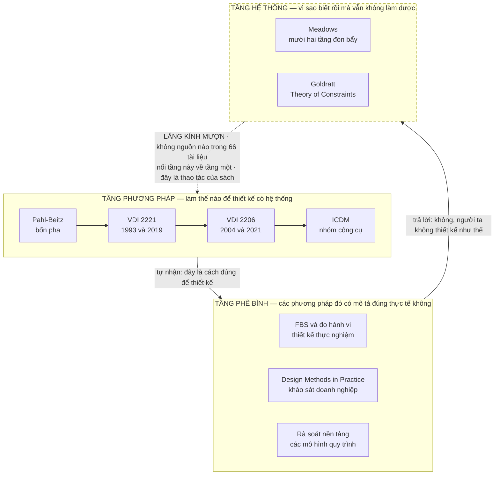

Tầng phương pháp là phả hệ chính: mỗi thế hệ mở rộng thế hệ trước ở đúng chỗ nó gãy. Tầng phê bình đặt
câu hỏi liệu phả hệ đó có mô tả đúng cách con người thật sự thiết kế, và trả lời là không. Tầng hệ thống
trả lời câu mà **không tầng nào trong hai tầng kia tự trả lời được**: vì sao biết rồi mà vẫn không làm
được.

Meadows xếp hạng mười hai điểm đòn bẩy — `"Chapter 6 presents Meadows' 12-point leverage hierarchy—the
practical culmination of systems thinking."` [62] — đặt hệ hình tư duy ở tầng L2 gần đỉnh và thông số bề
nổi ở L12 đáy bảng, rồi ghi một quan sát định lượng về chỗ nỗ lực thực tế đổ vào:

> `"Probably 90—no 95, no 99 percent—of our attention goes to parameters, but there's not a lot of
> leverage in them."` [62]

Bản phân tích Theory of Constraints trong corpus tự xếp chính nó, và tự ghi điều kiện hỏng của mình:
`"Mental model resistance L2 (Paradigm) Implementation fails if paradigm unchanged"` [65].

Đặt hai thứ cạnh nhau thì ra vế thứ hai của luận đề: phổ biến một quy trình thiết kế mới trong khi hệ
hình tổ chức không đổi chính là can thiệp ở tầng thấp nhất, và nó sẽ trượt.

**Và đúng ở câu vừa rồi cuốn sách này làm một việc mà không nguồn nào của nó làm.** Chỗ đó phải được
khai báo, không phải ở phụ lục.

---

## Ba khai báo về giới hạn chứng cứ của cuốn sách này

Cuốn sách sắp dành mười bảy chương để hỏi các phương pháp khác rằng chúng đặt cược vào giả định nào mà
không viết ra. Một cuốn sách làm việc đó mà bản thân có giả định không khai báo thì tự phá luận điểm
của chính mình trước khi luận điểm kịp đứng. Ba khai báo dưới đây là phép thử. Chúng
là phép thử: cùng một tiêu chuẩn mà cuốn sách sắp dùng để chấm người khác, áp lên chính nó trước, ở
trang đầu, khi người đọc còn đủ tỉnh táo để quyết định có tin hay không.

Ba khai báo này viết đầy đủ **duy nhất ở đây**. Các chương sau nhắc lại khi dùng, không lặp toàn văn.

### Khai báo 1 — Khung ba tầng là tổng hợp của cuốn sách, không phải phát hiện của nguồn nào

Không một nguồn nào trong 66 tài liệu đặt Meadows cạnh Pahl-Beitz. Việc xếp corpus thành ba tầng và dùng
tầng thứ ba để giải thích hai tầng kia là thao tác của cuốn sách này. Meadows và Goldratt **không viết
một chữ nào về thiết kế kỹ thuật**.

Ranh giới cứng, áp cho toàn bộ phần còn lại: dùng họ làm **lăng kính** là hợp lệ; dùng họ làm **bằng
chứng về thiết kế kỹ thuật** thì không. Khi Chương 16 xếp từng công cụ thiết kế vào một tầng đòn bẩy,
mọi ô trong bảng đó là suy luận của tác giả trừ những ô có căn cứ trích dẫn ghi kèm — và bảng bắt buộc
có một cột riêng để ghi điều đó. Đây là chỗ dễ vỡ nhất của cuốn sách, và nó vỡ ở Chương 16 chứ không ở
đây.

### Khai báo 2 — Corpus không có toàn văn tiêu chuẩn VDI nào

Cuốn sách nói khá nhiều về VDI 2221 và VDI 2206. Nó chưa từng đọc toàn văn của cả hai.

Thứ gần nhất trong corpus là một **bản trích mẫu song ngữ Đức–Anh của VDI 2221 Blatt 1 (2019), 27.608 ký
tự**, cộng hai mục lục: mục lục VDI 2221 Blatt 1 (12.033 ký tự) và mục lục VDI/VDE 2206 bản tháng 11 năm
2021 (45.238 ký tự). Mọi khẳng định về *nội dung* tiêu chuẩn trong cuốn sách này đi qua tài liệu thứ cấp
— bài báo bình duyệt, chương sách, bài giảng của người tham gia soạn thảo.

Hệ quả người đọc cần cầm theo: khi cuốn sách viết *"tiêu chuẩn ghi rằng…"*, hãy đọc là *"tài liệu thứ cấp
tường thuật rằng tiêu chuẩn ghi rằng…"*, trừ những chỗ trích thẳng bản trích mẫu và có ghi rõ. Đây không
phải chi tiết vụn. Một cuốn sách về tiêu chuẩn mà chưa đọc tiêu chuẩn thì phải nói ra, nếu không nó đang
làm đúng cái việc mà nó buộc tội các tổ chức: trình bày một thứ đã qua nhiều lớp diễn giải như thể là
văn bản gốc.

Có một khoảng trống nữa, ghi cho đủ: mục lục bản dự thảo VDI 2221 Blatt 1 nằm trong corpus mà **không
cụm khai thác nào chạm tới**, kể cả khi đã khoanh riêng để vét. Ghi nhận là trống, không suy diễn.

### Khai báo 3 — Một nguồn chiếm 32% corpus

Toàn văn *Engineering Design: A Systematic Approach* bản tiếng Anh lần ba — nguồn [1] — một mình chiếm
**1.167.487 trên 3.685.452 ký tự** của toàn bộ vật liệu, tức 32%. Nguồn lớn thứ hai chỉ có 118.650 ký tự.

Khi một chương của cuốn sách này trích dày từ [1], có hai cách giải thích và không cách nào loại trừ được
cách kia bằng bản thân số lượt trích: có thể vì [1] đúng, cũng có thể chỉ vì [1] dài. Công cụ tìm kiếm
theo ngữ nghĩa ưu ái nguồn dài một cách có hệ thống — dự án này đo được rằng **8 nguồn chỉ nổi lên khi bị
khoanh riêng**, và một trong tám là nguồn lớn thứ hai toàn corpus.

Xử lý đã chốt: chương nào lệch quá về [1] phải bổ sung đối chứng từ nguồn ngoài, và mọi khẳng định về
*hiệu quả* của phương pháp Pahl-Beitz phải có ít nhất một nguồn không phải [1].

Một chi tiết cùng lớp, thuộc về đúng chỗ này vì nó cũng là thiên lệch truy hồi. Trên toàn bộ 37 truy vấn
của dự án, metadata xuất xứ của công cụ **bỏ sót 62 trên 173 lượt nguồn** — nghĩa là công cụ nhiều lần
dùng một tài liệu mà không khai rằng đã dùng. Ba con số ấy đo bằng cách đối chiếu danh sách nguồn mà công
cụ tự khai cho mỗi truy vấn với kết quả quét tên tệp xuất hiện trong chính thân bài câu trả lời; chênh
lệch giữa hai danh sách là phần bỏ sót. Mọi khai báo nguồn trong vật liệu làm việc vì thế lấy **hợp** của
hai danh sách. Không có bước đó thì mỗi trích dẫn trong cuốn sách này có xác suất trỏ sai nguồn mà vẫn
trông chỉn chu.

### Khai báo phụ — luật này đã bắt chính luận đề của cuốn sách, và luận đề đã phải sửa

Bản thảo đầu của luận đề viết *"sáu mươi năm cải tiến phương pháp đã cải thiện tài liệu chứ không
cải thiện người thiết kế"*. Khi chương này được viết, luật "mọi con số phải có nguyên văn" được áp lên
chính câu đó — và nó **trượt**. Không nguồn nào trong 66 tài liệu viết ra con số sáu mươi năm,
và phép tính cũng không đỡ: bản tiếng Đức đầu của *Konstruktionslehre* ra năm 1977, tức bốn mươi chín năm.

**Luận đề đã được sửa thành "nửa thế kỷ"** — con số duy nhất có nguyên văn chống lưng.

Những gì corpus thật sự nói, nguyên văn:

| Mốc | Nguyên văn | Nguồn |
|---|---|---|
| Ý tưởng hệ thống hoá xuất hiện sớm | `"Modern systematic ideas were pioneered by Erkens [1.46] in the 1920s."` | [1] |
| Động lực đẩy tư duy hệ thống đi rộng | `"A period of staff shortages in the 1960s [1.190] created a strong impetus to adopt systematic thinking more widely."` | [1] |
| Tiêu chuẩn VDI đầu tiên về phương pháp | `"The first VDI Standards on methods of product design were published in the 1970s."` | [15] |
| Pahl-Beitz bản tiếng Đức đầu tiên | `"The first German edition of Konstruktionslehre was published in 1977."` | [1] |
| Bề dày phát triển hướng dẫn thiết kế | `"Design guidelines have been developed over the past 50 years."` | [13] |

Phép đếm duy nhất mà một nguồn tự đưa ra là **năm mươi năm**. "Sáu mươi năm" là cách gộp mốc thập
niên 1960 với hiện tại — nghe hợp lý, và chính vì nghe hợp lý nên nó suýt đi thẳng vào bản in.

Chuyện này đáng kể ra không phải vì con số. Mười một năm chênh lệch không đổi lập luận nào. Nó đáng kể
vì **thứ bắt được lỗi không phải là sự cẩn thận, mà là một luật cơ học**: mọi con số phải chỉ ra được
câu nguyên văn của nó, nếu không thì bỏ. Luật đó không quan tâm ai viết ra con số. Một cuốn sách buộc
tội các phương pháp khác mang giả định không khai báo mà lại miễn trừ cho giả định của chính mình thì
đã tự thua ngay ở câu đầu.

Đây cũng là dịp tốt để nói ra luật đó, vì nó chi phối mọi chương sau. **Mọi con số trong cuốn sách này
đều kèm câu trích nguyên văn. Chỗ nào nguồn liệt kê đủ mục mà không tự đếm, cuốn sách viết ra rằng nguồn
không tự đếm, thay vì đếm hộ.** Việc điền con số vào giúp một tài liệu là lỗi khó thấy nhất trong loại
sách này: mọi thứ đều đúng trừ chỗ quan trọng nhất, tức là nguồn có nói thế hay không.

---

## Ba neo, và chương nào nối về đâu

Ba câu hỏi chạy suốt mười tám chương. Mỗi chương nối về ít nhất một, và nối rõ ràng trong văn bản chứ
không để người đọc tự suy.

**Neo 1 — Canh bạc.** *Phương pháp này đặt cược vào tổ chức như thế nào?* Mọi phương pháp đòi hỏi một
loại tổ chức nhất định để chạy được. Câu hỏi này moi đòi hỏi đó ra khỏi mực vô hình.

**Neo 2 — Mặt tiếp giáp.** *Nó vỡ ở đâu khi chạm tổ chức thật, và bằng chứng nào trong nguồn?* "Mặt tiếp
giáp" là thuật ngữ của cuốn sách này, không phải của nguồn nào — chỗ phương pháp chạm tổ chức thật. Vế
thứ hai của câu hỏi quan trọng ngang vế thứ nhất: không có bằng chứng trong nguồn thì đó là ý kiến, và
cuốn sách sẽ ghi là ý kiến.

**Neo 3 — Tầng đòn bẩy.** *Công cụ này can thiệp ở tầng nào, và nó tự nhận là tầng nào?* Khoảng cách
giữa hai câu trả lời đó là thứ giải thích vì sao nhiều cuộc cải tiến quy trình tiêu tốn rất nhiều mà
dịch chuyển rất ít.

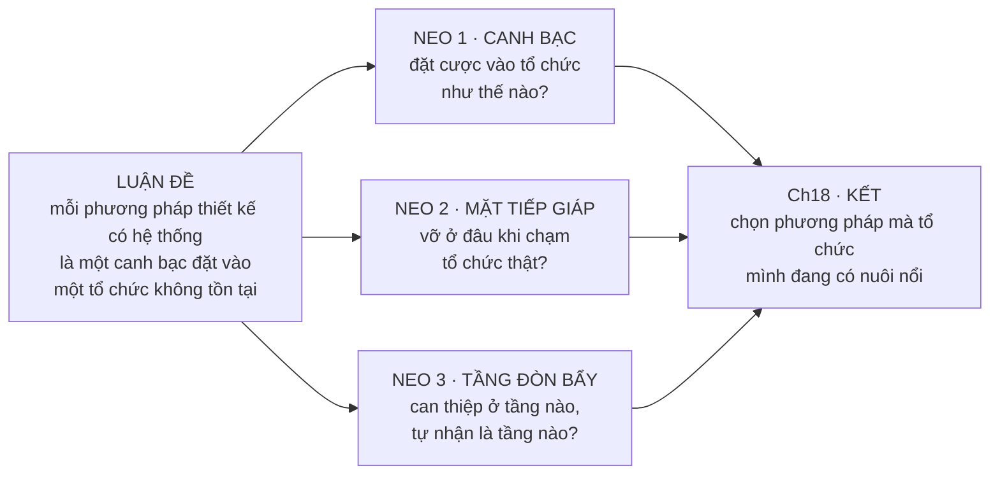

Bảng dưới là hợp đồng của cuốn sách với người đọc. Chương nào không nối được về neo đã ghi thì chương
đó viết sai, không phải người đọc đọc sai.

| Phần | Chương | Neo chính | Chương đó trả lời gì |
|---|---|---|---|
| I — Canh bạc | 01 | Canh bạc | Mẫu hình, ba neo, giới hạn chứng cứ của cuốn sách |
| I | 02 | Canh bạc | Thiết kế có hệ thống nghĩa là gì; trục quy định ↔ mô tả |
| II — Bốn thế hệ | 03 | Canh bạc | Pahl-Beitz: bốn pha, và canh bạc đầu tiên |
| II | 04 | Mặt tiếp giáp | VDI 2221:1993 — cái giá của việc thành tiêu chuẩn |
| II | 05 | Mặt tiếp giáp | VDI 2221:2019 — lần nhượng bộ được viết thành văn bản |
| II | 06 | Canh bạc | VDI 2206 — khi hệ thống thành liên ngành |
| II | 07 | Mặt tiếp giáp | VDI 2206:2021 — ba luồng, chữ V không còn là chữ V |
| II | 08 | Canh bạc | ICDM — cắm thước đo vào pha chưa có gì để đo |
| III — Công cụ | 09 | Canh bạc | Sinh giải pháp: hộp đen, cấu trúc chức năng, ma trận hình thái |
| III | 10 | Canh bạc → Tầng đòn bẩy | Chọn phương án: ai được quyền cho điểm |
| III | 11 | Mặt tiếp giáp | Nổ tổ hợp: bài toán cả bốn thế hệ đều phải né |
| IV — Mặt tiếp giáp | 12 | Mặt tiếp giáp | Quy định hay mô tả: người ta có thật sự thiết kế như thế không |
| IV | 13 | Mặt tiếp giáp | **Năm giả định tổ chức, và chỗ chúng vỡ** — chương gánh luận đề |
| IV | 14 | Mặt tiếp giáp | Những chỗ cả bốn thế hệ đều không nhìn tới |
| V — Tầng đòn bẩy | 15 | Tầng đòn bẩy | Mười hai tầng đòn bẩy, và 99% sự chú ý đổ vào đâu |
| V | 16 | Tầng đòn bẩy | Xếp lại toàn bộ công cụ theo tầng đòn bẩy |
| V | 17 | Tầng đòn bẩy | Vì sao phổ biến quy trình mới thường trượt |
| VI — Kết | 18 | Cả ba | Chọn phương pháp cho tổ chức mình đang có |

Một chỗ trong bảng cần nói rõ vì nó là một nhượng bộ về cấu trúc, không phải một lựa chọn sạch. Chương
10 đúng ra thuộc neo *Tầng đòn bẩy* — mọi thang chấm điểm đều là một tuyên bố về ai có quyền cho điểm,
và đó là câu hỏi tầng cao. Nhưng thang đòn bẩy mãi Chương 15 mới được giới thiệu, và đưa nó lên sớm hơn
sẽ bắt người đọc nhận một lăng kính mượn **trước khi** thấy vấn đề mà lăng kính đó giải. Đổi lấy cái gì
thì cũng phải nói: Chương 10 chạy với neo *Canh bạc* cho phần thân và chỉ chuyển sang *Tầng đòn bẩy* ở
phần đối chiếu cuối chương. Con đường không đi — đưa Meadows lên trước Phần III — bị loại vì nó biến
lăng kính thành tiền đề, và một lăng kính chưa được kiếm thì người đọc có mọi lý do để bác.

---

## Áp dụng ở Xưởng

Bối cảnh giả định cho toàn bộ mục này, và cho mười bảy mục cùng tên ở các chương sau: một xưởng cơ khí —
điện tử — phần mềm nhúng, quy mô vài chục người, có phân xưởng và có quản đốc, làm cả sản phẩm mới lẫn
biến thể của sản phẩm cũ.

### 1. Trong tuần tới: chấm một quy trình đang có hiệu lực trên năm giả định, rồi ra một quyết định về nó

Đây là việc làm được trong một buổi, và nó phải kết thúc bằng một quyết định chứ không phải một bản
phân tích. **Vấn đề nó giải:** tổ chức đang mang ít nhất một quy trình mà mọi người nói là đang áp dụng
còn thực tế thì không, và không ai muốn là người nói ra điều đó. **Cách áp:** lấy đúng một quy trình
thiết kế đang có hiệu lực trên giấy, đọc qua từng bước bắt buộc, và với mỗi bước hỏi bước này chỉ chạy
được nếu tổ chức có gì — hợp tác liên ngành thông suốt, đồng thuận giữa kỹ sư và quản lý, kỷ luật quy
trình, nguồn lực cho pha trừu tượng đầu dự án, hay thuật ngữ thống nhất giữa cơ–điện–phần mềm; bước nào
đòi một điều kiện mà xưởng không có thì đánh dấu, rồi cuối buổi chọn một trong ba: **giữ nguyên và cấp
điều kiện còn thiếu** · **cắt may lại cho vừa điều kiện đang có** · **bỏ hẳn bước đó khỏi văn bản**.
**Bẫy:** chọn phương án thứ tư không có trong danh sách — giữ nguyên văn bản và hy vọng lần này người ta
sẽ tuân thủ. Đó chính là can thiệp ở tầng yếu nhất, và Chương 17 sẽ cho thấy vì sao nó trượt.

### 2. Viết canh bạc thành một dòng, ngay đầu mọi quy trình ban hành từ nay

**Vấn đề nó giải:** quy trình được ban hành mà điều kiện vận hành của nó không nằm ở đâu cả, nên khi nó
hỏng thì không ai biết phải sửa cái gì. **Cách áp:** mọi văn bản quy trình mới, trước phần các bước,
thêm đúng một dòng theo mẫu *"Quy trình này chỉ chạy được nếu <điều kiện tổ chức cụ thể>. Nếu điều kiện
đó mất, dừng lại và sửa quy trình, đừng ép tuân thủ."* — điều kiện phải là thứ quan sát được, không phải
khẩu hiệu. **Bẫy:** viết điều kiện chung chung kiểu "cần sự phối hợp tốt giữa các bộ phận"; một điều kiện
không kiểm được thì không bao giờ báo hỏng, và dòng đó trở thành trang trí.

### 3. Đo tỷ lệ việc thật đi vòng qua quy trình chính thức, một lần mỗi quý

**Vấn đề nó giải:** khoảng cách giữa quy trình trên giấy và việc thật là thứ duy nhất dự báo được quy
trình sắp chết, và nó không xuất hiện trong bất kỳ báo cáo tuân thủ nào. **Cách áp:** đếm trong quý vừa
rồi có bao nhiêu công việc thiết kế được khởi động ngoài đường chính thức — đến từ một yêu cầu miệng, một
sáng kiến của phân xưởng, một việc nhỏ mà không ai mở hồ sơ — rồi chia cho tổng số; con số đó không cần
chính xác, nó chỉ cần được đo lại theo cùng một cách vào quý sau để thấy xu hướng. Nguồn trong tuyến phê
bình ghi được `"roughly 30%"` [43] ở doanh nghiệp mà họ khảo sát; đó là mốc để so, không phải ngưỡng để
đạt. **Bẫy:** dùng con số này để kỷ luật người đi đường vòng. Làm thế thì lần đo sau sẽ ra số đẹp và
không còn nghĩa gì — cơ chế phòng vệ bản ngã ghi trong tuyến tư duy hệ thống, `"Failure experience →
Threatens identity → Defense mechanisms → Blame external factors → No model correction"` [63], vận hành
chính xác như vậy.

### 4. Phân biệt "quy trình không mô tả đúng cách người ta làm" với "quy trình vô dụng"

**Vấn đề nó giải:** sau khi đọc phe phê bình, phản ứng tự nhiên là bỏ hết quy trình — và đó là cách nhanh
nhất để mất luôn phần giá trị thật của nó. **Cách áp:** với mỗi bước bị nghi là hình thức, hỏi bước này
tồn tại để **dẫn tư duy** hay để **ghi lại quyết định**; bước dẫn tư duy mà không ai làm theo thật thì
cắt được, còn bước ghi lại quyết định thì giữ kể cả khi nó không mô tả đúng trình tự đã xảy ra — vì giá
trị của nó nằm ở chỗ sáu tháng sau còn truy được vì sao đã chọn thế. **Bẫy:** gộp hai loại vào một cuộc
rà soát; chúng có tiêu chí ngược nhau, và trộn lại thì bao giờ cũng cắt nhầm loại thứ hai vì loại thứ hai
tốn công hơn.

### 5. Trả lời dứt khoát: ai được quyền nói "bước này bỏ được"

**Vấn đề nó giải:** nguồn ghi rằng phương pháp chỉ chạy trơn khi có người dày dạn dám lược bỏ bước, còn
người ít kinh nghiệm thì bám cứng vào việc làm tối đa tài liệu vì sợ trách nhiệm — nghĩa là quyền miễn
trừ đang tồn tại trên thực tế, chỉ không ai đặt tên cho nó. **Cách áp:** viết ra thành văn bản ai có
quyền tuyên bố một bước không áp dụng cho một dự án cụ thể, và bắt kèm một dòng lý do vào hồ sơ dự án;
quyền này nên gắn với vai trò, không gắn với thâm niên, và người dùng quyền phải chịu phần trách nhiệm
đi cùng. **Bẫy:** để quyền miễn trừ tồn tại ngầm. Khi nó ngầm thì người có kinh nghiệm dùng nó một cách
vô hình, người mới không dám dùng và làm tối đa tài liệu, và khoảng cách giữa hai nhóm bị đọc thành
chênh lệch năng lực thay vì chênh lệch quyền.


# Chương 02 — Thiết kế có hệ thống nghĩa là gì

Hai kỹ sư ngồi cùng bàn, cùng nhìn một bản vẽ, và bất đồng suốt một tiếng đồng hồ mà không ai nhận
ra họ đang nói về hai thứ khác nhau. Một người nói *quy trình này sai vì chẳng ai làm thế cả*.
Người kia nói *quy trình này đúng, và đó chính là lý do phải có nó*. Cả hai đều đúng, và cuộc cãi
vã không có lối thoát, vì hai câu ấy không mâu thuẫn — chúng thuộc hai loại mệnh đề khác nhau.
Không có bộ từ vựng để tách hai loại mệnh đề đó ra, phần còn lại của cuốn sách này sẽ đọc như một
chuỗi đả kích: Pahl-Beitz bị bắt lỗi, VDI bị bắt lỗi, ICDM bị bắt lỗi. Đó không phải điều đang xảy
ra, và một cuốn sách bị đọc nhầm như vậy sẽ mất người đọc ngay ở Phần IV.

Chương 01 đã đặt mẫu hình: một phương pháp đúng về kỹ thuật vẫn không sống được trong tổ chức, và
ba neo — canh bạc, mặt tiếp giáp, tầng đòn bẩy — mà mọi chương sau phải nối về. Nó cũng đã khai
ba giới hạn chứng cứ của chính cuốn sách trước khi đưa ra bất kỳ khẳng định nào. Chương này làm
phần việc còn thiếu: dựng bộ từ vựng để những khẳng định ấy có chỗ đứng. Không có bộ từ vựng, neo
*canh bạc* chỉ là một hình ảnh đẹp; có nó rồi, canh bạc trở thành thứ chỉ được ra bằng ngón tay.

Ba thứ đi ra khỏi chương này. **Một:** mọi đối tượng thiết kế là một phép biến đổi ba dòng chảy —
năng lượng, vật liệu, tín hiệu — và cách đọc đó quyết định anh đặt ranh giới hệ thống ở đâu.
**Hai:** trừu tượng hoá là điểm chung hiếm hoi mà cả phe quy định lẫn phe phê bình đều không cãi,
và lý do họ không cãi không phải vì nó dễ chịu mà vì nó là thuốc duy nhất chống lối mòn tư duy.
**Ba:** trục *quy định ↔ mô tả* — hai loại mệnh đề, hai loại bằng chứng, và một loại sai lầm rất
đắt khi lẫn lộn chúng. Chương 12 sẽ mở trục này ra hết cỡ; ở đây chỉ định nghĩa, đủ chặt để dùng.

---

## Một vật thể kỹ thuật là một phép biến đổi, không phải một hình khối

Đây là mệnh đề nền của toàn bộ phả hệ, và nó phản trực giác đúng ở chỗ kỹ sư ít ngờ nhất. Khi nghĩ
về một sản phẩm, cái hiện lên trong đầu là hình khối: vỏ, trục, mạch, khung. Thuyết hệ thống kỹ
thuật bảo rằng hình khối là thứ cuối cùng được quyết định, không phải thứ đầu tiên. Thứ đầu tiên
là **cái gì đi vào, cái gì đi ra, và biến đổi nào xảy ra ở giữa**.

Một thực thể kỹ thuật — dù là tổ hợp máy lớn hay một chi tiết — được coi là một hệ thống nối với
môi trường qua các dòng đầu vào và đầu ra cắt qua **ranh giới hệ thống** (*system boundary*). Bản
chất của mọi quá trình kỹ thuật là truyền dẫn và biến đổi ba đại lượng, và chỉ ba:

- **Năng lượng** — cơ, nhiệt, điện, hoá, quang; lực, mô-men, dòng điện.
- **Vật liệu** — khí, lỏng, rắn; phôi, chi tiết gia công, bán thành phẩm, thành phẩm.
- **Tín hiệu** — số đo, hiển thị, xung điều khiển, dữ liệu, thông tin.

Nguồn không trình bày ba dòng chảy như ba trường hợp loại trừ nhau. Nó nói ngược lại:
`"In most mechanical engineering applications, a combination of all three types of conversion is
usually involved..."` [1]. Đây là câu quan trọng hơn vẻ ngoài của nó. Nó có nghĩa: câu hỏi hữu ích
không phải *sản phẩm này thuộc dòng nào* mà là *dòng nào là dòng chính*, vì hai dòng còn lại luôn
có mặt ở vai trò phụ trợ. Bỏ qua sự phân biệt chính–phụ này là cách nhanh nhất để một cấu trúc
chức năng phình ra gấp ba mà không thêm được thông tin nào.

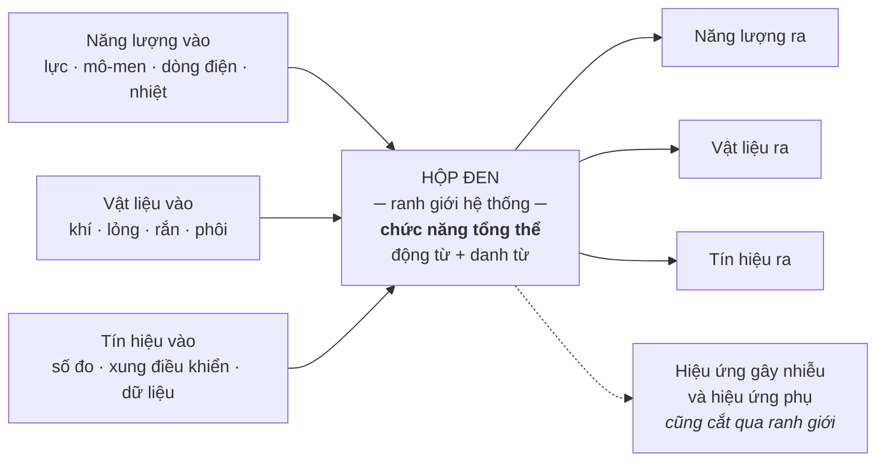

Hộp đen này là công cụ, không phải minh hoạ. Nó buộc người thiết kế phát biểu chức năng tổng thể
**trước khi** biết cơ cấu, ở dạng động từ cộng danh từ — *tăng áp suất*, *truyền mô-men*, *giảm
tốc độ* — một biểu diễn trừu tượng độc lập với giải pháp vật lý cụ thể [1]. Chương 09 sẽ dùng lại
chính hộp đen này làm bước đầu của chuỗi sinh giải pháp, và ở đó sẽ thấy rõ vì sao thứ tự hộp đen
→ cấu trúc chức năng → ma trận hình thái không đảo được.

Chỗ đáng chú ý trong sơ đồ là mũi tên đứt nét. Ranh giới hệ thống không chỉ cho các dòng mong muốn
đi qua. Nó cũng là đường mà nhiễu và hiệu ứng phụ đi qua, theo cả hai chiều. Vẽ hộp đen mà chỉ vẽ
sáu mũi tên liền nét là đã ngầm giả định một môi trường sạch — giả định gần như luôn sai, và sai
đúng vào lúc sản phẩm rời khỏi phòng thí nghiệm.

### Dòng chính quyết định anh đang thiết kế loại gì

Pahl-Beitz phân loại hệ thống kỹ thuật theo dòng chảy chính, không theo ngành và không theo kích
thước:

| Dòng chính | Loại hệ thống | Hệ quả cho cách đánh giá |
|---|---|---|
| Năng lượng | *Machines* — máy móc | Tiêu chí hiệu suất, tổn hao, tải trọng dẫn dắt |
| Vật liệu | *Apparatus* — thiết bị công nghệ | Tiêu chí lưu lượng, độ tinh khiết, thời gian lưu dẫn dắt |
| Tín hiệu | *Devices* — dụng cụ, thiết bị đo | Tiêu chí độ phân giải, độ trễ, nhiễu dẫn dắt |

Cột thứ ba là suy luận của cuốn sách, không phải của nguồn — nguồn chỉ phân loại ba nhóm theo dòng
chính [1]. Nhưng suy luận ấy là chỗ bảng này có ích. Một sản phẩm có dòng chính là **tín hiệu**
nhưng được chấm bằng bộ tiêu chí của một sản phẩm dòng năng lượng sẽ liên tục thắng ở những chỗ
không ai cần và thua ở chỗ quyết định. Đó là chế độ hỏng thường trực ở những đội vừa chuyển từ cơ
khí thuần sang cơ–điện–phần mềm, và nó hỏng ở tầng từ vựng chứ không phải ở tầng kỹ thuật. Chương
10 sẽ quay lại đây khi bàn về việc ai được quyền cho điểm và thang điểm nói gì về người lập ra nó.

Và nguồn cũng không nói rằng mọi sản phẩm đều có đúng một dòng chính — **Chương 06 sẽ gặp loại sản
phẩm không có**, nơi một chức năng chạy xuyên ba miền và không thuộc miền nào. Ép một nhãn duy nhất
lên loại sản phẩm ấy là một chế độ hỏng riêng, ngược chiều với chế độ hỏng vừa mô tả: không phải
gán sai nhãn, mà là gán nhãn ở chỗ lẽ ra không nên gán.

Còn một câu hỏi mà mục này mở ra rồi bỏ lửng, và nó là câu hỏi tổ chức chứ không phải câu hỏi kỹ
thuật: **ai có quyền vẽ ranh giới hệ thống?** Nguồn `[1]` mô tả ranh giới như một thao tác phân
tích, như thể nó tự hiện ra khi nhìn đúng. Trong một tổ chức thật thì nó là một quyết định có
người ký: kéo ranh giới rộng ra là nhận thêm việc và thêm trách nhiệm, thu hẹp lại là đẩy phần khó
sang chỗ khác dưới danh nghĩa "ngoài phạm vi". Corpus không có tài liệu nào nói ai ký. Chương 13
quay lại đúng chỗ trống này.

> ⚠ **Cảnh báo thuật ngữ.** *Ba dòng chảy* của thuyết hệ thống kỹ thuật (năng lượng, vật liệu, tín
> hiệu) **không phải** *ba luồng song song* của VDI 2206 bản 2021. Hai thứ trùng nhau ở con số ba
> và không trùng gì khác. Chương 07 dùng cụm thứ hai; cuốn sách này luôn ghi rõ năm khi nói về VDI
> 2206. Đối chiếu này là của sách, không nguồn nào đặt hai cụm cạnh nhau để cảnh báo.

### Bốn mức: từ chức năng xuống hình khối

Ba dòng chảy chỉ là tầng trên cùng. Bên dưới nó, thuyết hệ thống kỹ thuật xếp bốn mối quan hệ
tương tác thành một chuỗi hạ dần độ trừu tượng [1]:

| Mức | Tên gốc | Nội dung | Câu hỏi nó trả lời |
|---|---|---|---|
| 1 | *Functional interrelationship* | Chức năng tổng thể → chức năng con, nối bằng logic Boolean | Sản phẩm **phải làm gì** |
| 2 | *Working interrelationship* | Hiệu ứng vật lý + đặc tính hình học và vật liệu tại vị trí làm việc | Nó **làm bằng cách nào** |
| 3 | *Constructional interrelationship* | Chi tiết, mối nối, cụm lắp ráp, ràng buộc sản xuất và vận chuyển | Nó **được dựng ra sao** |
| 4 | *System interrelationship* | Quan hệ với người dùng và môi trường | Nó **sống ở đâu**, và bị nhiễu gì |

Mức 2 là chỗ đáng dừng lại. Nguyên lý hoạt động không phải một ý tưởng; nó là **một hiệu ứng vật
lý cộng một hình học cụ thể**. Định luật ma sát Coulomb chưa phải nguyên lý hoạt động. Định luật
ma sát Coulomb tác dụng lên một cặp bề mặt có loại, hình dạng, vị trí, kích thước và số lượng xác
định — đó mới là nguyên lý hoạt động [1]. Phân biệt này là thứ Chương 09 sẽ dựa vào để giải thích
vì sao một ma trận hình thái điền bằng danh từ sản phẩm luôn cho ra kết quả nghèo hơn một ma trận
điền bằng nguyên lý: danh từ sản phẩm đã gói sẵn cả hiệu ứng lẫn hình học vào một cục không tháo
ra được, nên nó không tổ hợp được với gì.

Mức 4 mang một chi tiết mà phần lớn người đọc lướt qua: hệ thống chịu cả **hiệu ứng gây nhiễu** và
**hiệu ứng phụ không mong muốn**, bên cạnh hiệu ứng mong muốn, hiệu ứng đầu vào và hiệu ứng phản
hồi [1]. Nghĩa là mô hình gốc đã dành chỗ cho cái ngoài ý muốn ngay từ đầu. Điều này quan trọng
khi Phần IV chất vấn phương pháp: các tác giả không hề bỏ quên tính bất định của thế giới vật lý.
Cái họ bỏ quên nằm ở chỗ khác — ở tổ chức — và Chương 13 sẽ đếm đủ năm chỗ.

---

## Trừu tượng hoá: chỗ duy nhất cả hai phe bắt tay nhau

Trừu tượng hoá là bước đầu của pha ý tưởng: gạt bỏ định kiến cá nhân, bỏ qua yêu cầu không chạm
tới chức năng chính, chuyển dữ liệu định lượng thành định tính, khái quát hoá, rồi phát biểu bài
toán ở dạng **trung lập với giải pháp** (*solution-neutral*) [1].

Một ghi chú về phép đếm, và nó là ghi chú kiểu mẫu cho cả cuốn sách. Danh sách vừa nêu gồm năm ý.
Nguồn **không** viết ra rằng có năm bước. Tệp khai thác ghi thẳng rằng con số năm *hoàn toàn là do
tự tổng hợp bằng cách đếm các gạch đầu dòng*, và văn bản gốc không có khẳng định trực tiếp nào về
số lượng ấy. Vậy nên câu đúng là *"kỹ thuật trừu tượng hoá gồm những thao tác sau"*, không phải
*"quy trình trừu tượng hoá năm bước"*. Cùng lớp bẫy đó áp cho chuỗi cụ thể hoá, nơi văn bản đánh
số một danh sách mà không câu nào đếm — **Chương 03 mở ca đó ra đầy đủ**, kèm câu mà chính hai tác
giả viết ngay trước danh sách để phủ nhận rằng đó là một kế hoạch — và cho các quy tắc cơ bản của
pha cụ thể hoá. Đọc
kỹ ba trường hợp này thì thấy một mẫu hình: **các tác giả đánh số công việc, họ không tuyên bố số
lượng.** Người đọc sau đó tuyên bố hộ, và con số ấy đi vào giáo trình, rồi đi vào slide đào tạo,
rồi đi vào quy trình nội bộ — nơi nó trở thành một danh mục phải tick đủ.

### Vì sao phe quy định cần trừu tượng hoá

Phía quy định cần nó vì nó là cơ chế duy nhất mở rộng không gian giải pháp một cách có kỷ luật.
Phát biểu *"thiết kế cơ cấu đẩy dùng lò xo thép"* đã đóng khung xong bài toán trước khi tìm kiếm
bắt đầu. Phát biểu *"tích trữ và giải phóng năng lượng cơ học đột ngột"* để ngỏ lò xo, khí nén,
thuỷ lực, điện từ. Chênh lệch giữa hai phát biểu không phải chênh lệch về văn phong — nó là chênh
lệch về **số phương án tồn tại**. Phát biểu thứ nhất không loại bỏ ba phương án kia bằng lập luận;
nó loại bỏ chúng bằng cách khiến chúng không bao giờ được nghĩ tới.

### Vì sao phe phê bình cũng không bác nó

Tuyến phê bình đánh gần như mọi thứ khác của phương pháp hệ thống: tính tuyến
tính, giả định thác nước, sự mù mịt trước chính trị nội bộ, gánh nặng tài liệu. Nhưng không tuyến
nào trong corpus này lập luận rằng *người thiết kế nên bỏ trừu tượng hoá đi*. Lý do nằm ở một câu
mà chính Pahl-Beitz viết ra, về kinh nghiệm:

> `"Frankenberger [12.5] observed in his research that experience does have a large positive
> effect but can also have a negative effect when that experience leads to inflexibility and
> fixation."` [1]

Kinh nghiệm làm kỹ sư nhanh hơn và đồng thời làm kỹ sư cứng hơn. Càng nhiều giải pháp mẫu trong
đầu, xác suất một bài toán mới bị đọc thành một bài toán cũ càng cao. **Lối mòn tư duy (fixation)
là bệnh nghề nghiệp của người giỏi, không phải của người kém** — và đó chính là lý do không ai bác
được thuốc chữa nó. Trừu tượng hoá là thao tác duy nhất trong cả phả hệ nhắm thẳng vào chỗ này: nó
cắt liên kết giữa phát biểu bài toán và kho giải pháp cũ, ép người thiết kế đọc lại bài toán bằng
mắt của người chưa từng giải nó.

Sự đồng thuận này cho một quy tắc làm việc: **khi hai phe đối lập cùng
không đụng tới một công cụ, công cụ đó nhiều khả năng là phần cứng nhất của phương pháp.** Quy tắc
ấy là suy luận từ sự vắng mặt của lời phê bình, không nguồn nào phát biểu nó; nhưng nó cho một
cách xếp ưu tiên rất thực dụng khi phải cắt bớt quy trình. Chương 12 và Chương 13 sẽ dỡ gần hết
những phần còn lại của phương pháp; trừu tượng hoá đứng nguyên qua cả hai.

> **Đào sâu: cái giá của trừu tượng hoá, do chính tác giả ghi**
>
> Pahl-Beitz không bán trừu tượng hoá như thuốc bổ. Họ liệt kê giá của nó, và giá không rẻ.
> **Danh sách tự thú ấy có nhà chính ở Chương 03**, mục *Những gì chính hai tác giả nhận là hỏng*,
> nơi nó được trích trọn vẹn và đọc như bằng chứng nội tại. Ở đây chỉ cần một câu gốc và một bảng
> gọn, vì mục này bàn về **công cụ** chứ không bàn về lời tự thú.
>
> Câu gốc, vì nó chứa cả hai mặt trong một câu:
> `"A comparison between the functional representations in Figures 2.5 and 2.8 shows that the
> description that uses generally valid functions has a higher level of abstraction. For this
> reason, it leaves open all possible solutions and makes a systematic approach easier. However,
> using generally valid functions can represent a problem because such an abstract level can
> sometimes hin-der the direct search for solutions."` [1]
>
> Mức trừu tượng cao mở ngỏ mọi giải pháp **và** có thể chặn đường tìm giải pháp trực tiếp — cùng
> một thuộc tính, hai chiều tác dụng. Bốn khoản giá mà nguồn `[1]` ghi ra:
>
> | Giá | Nội dung | Nguyên văn in ở |
> |---|---|---|
> | Trừu tượng quá tay | chức năng có giá trị tổng quát nhiều khi quá chung để dẫn sang giải pháp, nhất là trong công nghiệp | Ch03 |
> | Trung lập với giải pháp là lý tưởng không đạt được | cấu trúc chức năng hiếm khi sạch tiền giả định vật lý; số giải pháp vẫn bị thu hẹp | Ch03 |
> | Người thật thấy nó khó chịu | kỹ sư quen nghĩ bằng vật thể và hình ảnh hơn bằng chức năng trừu tượng | Ch03 |
> | Thời gian | cách tiếp cận theo tiến trình đòi nhiều thời gian hơn và dễ làm phình không gian giải pháp | Ch03; con số 60% thì ở ngay dưới đây |
>
> Khoản thứ hai đáng dừng lại: định kiến không bị xoá, nó bị đẩy xuống chỗ khó nhìn thấy hơn. Ai
> tin rằng cấu trúc chức năng của mình hoàn toàn sạch định kiến thì đã mắc đúng cái bẫy mà công cụ
> này định gỡ. Và một câu nữa thuộc riêng mục này, vì nó nói về **công cụ** chứ không về trừu
> tượng hoá:
> `"Discursive solution methods such as classification schemes and morphological matrices
> initially cause some difficulties because the appropriate but abstract classifying criteria and
> their characteristics are not, or not fully, recognised."` [1]
>
> Bốn khoản trên đều nằm trong chính cuốn sách bị phê bình. Đó là dữ kiện đáng giữ lấy: **phần lớn
> lời buộc tội nặng nhất đối với phương pháp hệ thống đã có sẵn trong sách gốc.** Điều tuyến phê
> bình về sau bổ sung không phải là các nhược điểm kỹ thuật ấy — mà là cái nằm ở mặt tiếp giáp với
> tổ chức, thứ mà sách gốc không có công cụ để nhìn. Ai đọc Phần IV như một bản cáo trạng mới đã
> bỏ lỡ điều đó.

Một con số hay bị trích lẻ ở chỗ này, và nó là ca mẫu cho việc trích đủ ngữ cảnh. Có câu:
`"From research in industry and universities [6.8], it is known that calculating and
representation add up to 60% of the total time spent on conceptual design."` [1] — nghe như bằng
chứng rằng pha ý tưởng tốn kém khủng khiếp. Nhưng cùng nguồn còn một câu nữa, và câu ấy làm con số
nhỏ lại: `"However, the time normally needed in this phase for concretising ideas into principle
solutions, for example through rough calculations, developing solutions, and analyses of various
layouts, is about the same as when a systematic approach is not used, that is, around 60 to
70%."` [1]. Đọc cả hai thì kết luận đảo chiều: tỷ lệ ấy **xấp xỉ bằng nhau dù có dùng phương pháp
hệ thống hay không**. Trích câu đầu mà bỏ câu sau là xuyên tạc nguồn bằng chính chữ của nguồn — và
đó là kiểu xuyên tạc khó bắt nhất, vì từng chữ đều kiểm tra được.

---

## Quy định và mô tả: hai loại mệnh đề, hai loại bằng chứng

Định nghĩa, ngắn, và dùng nguyên như thế suốt cuốn sách:

- **Quy định** (*prescriptive*) — mệnh đề nói **nên** thiết kế thế nào. Nó là chỉ dẫn hành động.
  Kiểm chứng nó bằng câu hỏi *làm theo thì có ra kết quả tốt hơn không*.
- **Mô tả** (*descriptive*) — mệnh đề nói người ta **thật sự** thiết kế thế nào. Nó là báo cáo
  quan sát. Kiểm chứng nó bằng câu hỏi *quan sát có khớp không*.

PBSA thuộc phe thứ nhất, và nguồn phê bình gọi tên nó rõ ràng:
`"One of the most detailed and widely referenced prescriptive models of designing is the
'Systematic Approach' developed by Pahl & Beitz (Reference Pahl and Beitz 2007), which was first
published in German in 1977."` [31]. Cùng nguồn ghi bốn pha bằng một câu tự đếm — khác với trường
hợp năm bước ở trên, chỗ này con số nằm trong nguyên văn:
`"Pahl and Beitz' Systematic Approach (in this paper referred to as PBSA) describes engineering
design as a sequence of four phases: (1) Task Clarification, (2) Conceptual Design, (3) Embodiment
Design, and (4) Detail Design."` [31].

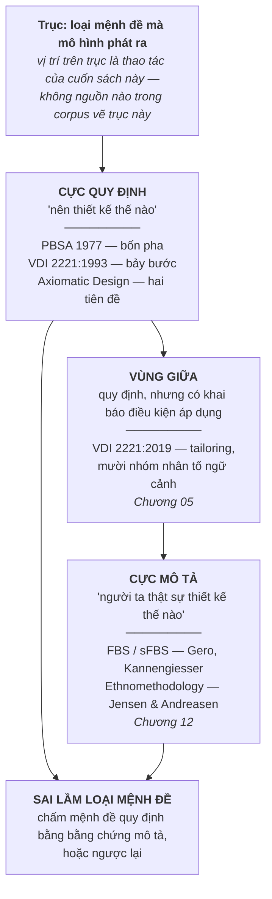

Việc xếp các trường phái lên một trục là **thao tác của cuốn sách này**. Không tài liệu nào trong
corpus vẽ trục ấy; nguồn [2] có nói VDI 2221 và Axiomatic Design được xếp vào nhóm quy định, phần
còn lại — đặc biệt là sự tồn tại của một vùng giữa — là tổng hợp. Ghi rõ ở đây để không chỗ nào
sau này trình bày sơ đồ trên như phát hiện của nguồn.

### Bằng chứng của phe mô tả, và điều nó thật sự chứng minh

Kannengiesser & Gero làm một việc gọn: lấy PBSA, ánh xạ toàn bộ hoạt động của nó lên khung nhận
thức sFBS, rồi so đường cong tích luỹ của mô hình với đường cong đo được từ người thật.

Số liệu, tất cả đều có nguyên văn [31]:

`"Mapping all activities defined in PBSA onto the sFBS framework results in 87 elementary steps
coded in terms of FBS design issues..."` và `"This results in a total of 235 steps, as some of the
87 elementary steps are repeated..."` — mô hình lý thuyết quy về **87 bước tiểu học**, chạy lặp
thành **235 bước**.

`"The behavioural observations used in this study are based on protocols of 15 design sessions...
and 31 design sessions of the students using various concept generation methods."` cùng
`"All 46 design sessions covered an entire design process from requirements specification to
solution description."` — **46 phiên** thiết kế, gộp từ 15 và 31.

`"Each team used the same room and were given the same instructions that included a specified
available time of 45 minutes."` — **45 phút** mỗi phiên, cùng phòng, cùng chỉ dẫn.

`"'Yes' if the first occurrence of the design issue is within the first 25 design steps..."` —
ngưỡng đo "xuất hiện sớm" là **25 bước đầu**.

Đối tượng là sinh viên cơ khí sau năm thứ nhất, làm bài trong 45 phút — không phải kỹ sư công
nghiệp trong một dự án thật. Đó là giới hạn của thí nghiệm, và nó phải được nói ra cùng lúc với
kết luận:

> `"Therefore, it can be concluded that the differences between the model and the empirical data
> rather indicate that PBSA seems to be incomplete as a predictive model of designing since it
> does not predict designers' early focus on generating solutions."` [31]

Người thật nhảy vào cấu trúc vật lý ngay trong hai mươi lăm bước đầu. Mô hình bảo rằng cấu trúc
chỉ nên xuất hiện sau. Thêm một câu nữa về hình dạng của mô hình:
`"On the other hand, the 'phase-based' character of PBSA clearly favours a 'waterfall' view where
iterations are to occur only within a phase..."` [31] — vòng lặp được phép chạy trong pha, không
được phép chạy xuyên pha.

Kết luận trên nói PBSA **chưa hoàn thiện với tư cách
một mô hình tiên đoán**. Nó không nói PBSA là một mô hình quy định tồi. Đó là hai mệnh đề khác
nhau về hai loại mô hình khác nhau, và bằng chứng cho cái này không phải bằng chứng cho cái kia.
Một biển báo cấm vượt đèn đỏ không bị bác bỏ bởi số liệu đếm được bao nhiêu người vượt đèn đỏ.

Nhưng — và đây là chỗ phe mô tả có lý — số liệu ấy **không vô nghĩa**. Nếu tuyệt đại đa số người
vượt đèn đỏ thì biển báo đang hỏng ở một tầng khác: không sai về nội dung, mà sai ở giả định rằng
chỉ cần treo biển là đủ. Chuyển đúng câu này sang thiết kế thì ra luận đề của cuốn sách. Bốn mươi
sáu phiên thiết kế không chứng minh Pahl-Beitz sai. Chúng chứng minh rằng **Pahl-Beitz đã đặt cược
vào một hành vi mà con người không tự nhiên có** — và đó là canh bạc, đúng nghĩa đen của neo thứ
nhất. Cách đọc này là diễn giải của sách; nguồn [31] chỉ dừng ở chữ *incomplete*. Chương 12 sẽ
khai thác đủ cả tuyến bằng chứng; ở đây chỉ cần giữ lấy sự phân biệt.

### Khi ranh giới hai loại mệnh đề nhoè đi

Tuyến ethnomethodology đẩy xa hơn: họ nói ranh giới ấy trên thực tế khó vạch. Một cẩm nang quy
định trôi quá xa khỏi vận hành hàng ngày thì phản tác dụng, vì người dùng không đọc nó như đường
ray mà như một **nguồn lực** huy động để giải trình quyết định. Lời buộc tội nặng nhất của họ:

> `"It appears to us that Pahl & Beitz have confused the result of design method and the process
> of using a design methods."` và `"Pahl & Beitz's error, we suggest, is their implicit assumption
> that neat processes must logically precede neat results."` [43]

Bản vẽ cuối cùng gọn gàng. Từ đó suy ra tiến trình dẫn tới nó cũng phải gọn gàng — đó là bước nhảy
mà Jensen & Andreasen gọi là sai lầm. Trật tự của sản phẩm cuối là thứ **nảy sinh** từ một tiến
trình lộn xộn, chứ không phải dấu vết của một tiến trình ngăn nắp. Cần công bằng với hai tác giả
gốc ở đây: đây là một cách đọc, được rút từ khảo sát học viên cao học tại một trường, chứ không
phải một định lý. Nhưng nó chỉ đúng chỗ đau, và chỗ đau ấy là câu tiếp theo:

> `"This starting point, we suggest, makes it exceedingly hard for Pahl & Beitz to see method use
> as a social, political or organizational process and it makes it almost impossible to imagine
> that the goals of methods-related activities can be any other than getting the information
> right."` [43]

Coi người thiết kế là một bộ xử lý thông tin thì mọi vấn đề của phương pháp đều quy về *thông tin
chưa đủ đúng*. Cách đọc ấy không có chỗ cho câu hỏi *ai được lợi khi bước này được làm đầy đủ*.
Mặt tiếp giáp với tổ chức nằm chính ở khoảng trống đó, và Phần IV được dựng lên để lấp nó.

---

## Vì sao trục này là canh bạc chứ không phải chuyện học thuật

Một phương pháp quy định phát ra mệnh đề *nên làm thế này*. Mệnh đề đó chỉ có hiệu lực nếu tổ chức
đủ điều kiện làm theo. Vậy nên **mỗi phương pháp quy định đã ngầm mô tả một tổ chức** — tổ chức mà
trong đó lời khuyên ấy thi hành được. Đó là canh bạc: không ai viết bản mô tả tổ chức ấy ra, nhưng
nó tồn tại, và nó là điều kiện tiên quyết.

Canh bạc ấy được thanh toán thế nào ngoài đời:

**Quy trình bị bẻ dưới áp lực.** `"Many other cases from our students indicate that the steps of
methods are routinely changed, skipped, or squeezed as a result of various pressures such as lack
of time and money."` [43] — bị đổi, bị bỏ, bị bóp. Không phải đôi khi, mà **thường lệ**.

**Quy trình chính thức không phải nơi công việc sinh ra.** `"...revealed that a large number of the
company's projects (roughly 30%) were results of other initiatives than the formal technology
planning."` [43] — **khoảng 30%** dự án của một công ty kỹ thuật lớn đến từ ngoài quy trình hoạch
định chính thức. Đây là con số về **một** công ty trong một khảo sát học viên, không phải hằng số
ngành; nhắc lại điều đó vì nó là con số duy nhất trong corpus đo được khoảng cách giữa quy trình
giấy và quy trình thật, và một con số duy nhất rất dễ bị nâng lên thành quy luật.

**Tài liệu hoá quá mức là hành vi phòng thân, không phải hành vi kỷ luật.**
`"These methods-users would often attempt to live up to the maximum requirements despite the
nature of the specific project. Only seasoned project managers seemed to 'dare' to use the
flexibility of the method."` [43] — kỹ sư trẻ làm đủ mọi yêu cầu tài liệu bất kể quy mô dự án, vì
làm đủ thì không bị đổ lỗi. Chỉ người dày dạn mới **dám** cắt. Chữ *dare* nằm trong nguyên văn, và
nó tố cáo rằng tính linh hoạt của phương pháp trên giấy là một quyền mà thực tế phải có thâm niên
mới dùng được. Một quy trình có điều khoản linh hoạt mà không ai dám dùng thì trên thực tế là một
quy trình cứng — bất kể văn bản viết gì.

Cộng lại: phương pháp quy định giả định một tổ chức có thời gian, có tiền, và có cơ chế bảo vệ
người dám bỏ bước. Ba giả định, không cái nào được viết ra. Từ phía công nghiệp, nguồn [2] tổng
kết đúng danh sách phản đối này:

> `"A key criticism revolves around the limited acceptance and applicability of prescriptive
> design methods in industrial settings. Criticisms include the high time investment, abstraction
> constraints, creativity limitations, inflexibility, overly rigid regulations, overemphasis on
> logical sequences and complex processes, and the focus on new designs rather than variant or
> adaptation designs."` [2]

Và từ phía hành vi: `"In practice, often a mix of intuitive and experience-based behaviour can be
found... Design work in industry is marked by a lot of restrictions, e.g. lack of resources and
high time pressure."` [14] Đáng chú ý là mục cuối trong danh sách của [2]: phương pháp quy định
tập trung vào **thiết kế mới** chứ không vào thiết kế biến thể hay cải tiến. Phần lớn công việc
thật của một xưởng vừa là biến thể và cải tiến. Nghĩa là canh bạc còn có một vế nữa: nó cược rằng
loại công việc mà nó phục vụ chiếm phần đáng kể trong khối lượng thật.

Chương 13 sẽ dựng năm giả định tổ chức thành một bảng người đọc tự chấm được. Ở đây chỉ cần thấy
cơ chế: **loại mệnh đề quyết định loại giả định.** Mệnh đề quy định luôn kéo theo một giả định tổ
chức; mệnh đề mô tả thì không. Đó là lý do trục này không phải chuyện phân loại học thuật mà là
một công cụ chẩn đoán — và nó chẩn đoán được ngay trong tuần, xem mục cuối chương.

Lăng kính tầng đòn bẩy mà Phần V dùng để giải thích *vì sao biết rồi mà vẫn không làm được* đến từ
ngoài ngành thiết kế, và việc ghép nó vào đây là thao tác của cuốn sách này — Chương 01 đã khai
báo, và mỗi chương dùng tới nó sẽ nhắc lại một câu.

---

## Bộ từ vựng làm việc, và chỗ mỗi mục được dùng lại

Chương này cố ý không giới thiệu thêm khái niệm nào ngoài bảng dưới. Mỗi dòng đều có ít nhất một
chương sau dùng lại; dòng nào không có đã bị cắt khỏi bản thảo.

| Khái niệm | Nghĩa dùng trong sách | Dùng lại ở |
|---|---|---|
| Ba dòng chảy — năng lượng, vật liệu, tín hiệu | Đối tượng thiết kế là phép biến đổi ba dòng, thường đồng thời cả ba | Ch03, Ch09 |
| Ranh giới hệ thống · hộp đen | Đường cắt quyết định cái gì nằm trong bài toán | Ch09, Ch11 |
| Dòng chính | Dòng quyết định loại hệ thống và bộ tiêu chí đánh giá | Ch09, Ch10 |
| Chức năng tổng thể · cấu trúc chức năng | Biểu diễn động từ + danh từ, độc lập với giải pháp vật lý | Ch03, Ch09 |
| Nguyên lý hoạt động | Hiệu ứng vật lý **cộng** hình học và vật liệu tại vị trí làm việc | Ch09, Ch10 |
| Trừu tượng hoá · trung lập với giải pháp | Cắt liên kết giữa phát biểu bài toán và kho giải pháp cũ | Ch03, Ch09, Ch12 |
| Lối mòn tư duy (*fixation*) | Tác dụng phụ của kinh nghiệm; lý do tồn tại của trừu tượng hoá | Ch09, Ch12 |
| **Quy định** (*prescriptive*) | Mệnh đề *nên thiết kế thế nào* | Ch04, Ch05, Ch12 |
| **Mô tả** (*descriptive*) | Mệnh đề *người ta thật sự thiết kế thế nào* | Ch12, Ch13 |
| FBS · sFBS | Khung nhận thức của phe mô tả, dùng để đo hành vi thật | Ch12 |
| Sai lầm loại mệnh đề | Chấm mệnh đề quy định bằng bằng chứng mô tả, hoặc ngược lại | Ch12, Ch14 |
| Canh bạc tổ chức | Tập giả định ngầm mà mệnh đề quy định đặt vào tổ chức | Ch13, Ch18 |

Ba thứ **không** được định nghĩa ở đây dù chương này chạm tới: ma trận hình thái (*morphological
chart*, Ch09), nổ tổ hợp (Ch11), và tailoring (Ch05). Chúng có nhà riêng, và định nghĩa hai lần là
cách nhanh nhất để hai định nghĩa lệch nhau.

---

## Áp dụng ở Xưởng

Bối cảnh giả định suốt cuốn sách: một xưởng cơ khí — điện tử — phần mềm nhúng, quy mô vài chục
người, làm cả phát triển sản phẩm mới lẫn cải tiến biến thể.

### 1. Viết lại một phát biểu bài toán đang chạy, trong tuần này

Chọn **một** nhiệm vụ thiết kế đang mở. Lấy phát biểu bài toán hiện có — thường nằm ở dòng đầu của
tờ giao việc — và kiểm một điều duy nhất: **nó có chứa tên cơ cấu, tên vật liệu, hay tên một giải
pháp không?** Nếu có, viết lại thành một câu động từ cộng danh từ, không tên gì cả, rồi đặt hai
phát biểu cạnh nhau trong cuộc họp gần nhất và hỏi: *phát biểu thứ hai mở ra phương án nào mà phát
biểu thứ nhất đã đóng?*

Hết tuần có hai kết quả, và cả hai đều dùng được. Hoặc không phương án mới nào xuất hiện — bài
toán thật sự đã bị ràng buộc, và giờ điều đó được **biết** thay vì được đoán, nên pha ý tưởng có
thể rút ngắn một cách có căn cứ. Hoặc có phương án mới xuất hiện, nghĩa là không gian giải pháp
vừa bị thu hẹp bởi một câu chữ chứ không phải bởi một ràng buộc kỹ thuật. Đây là bài kiểm fixation
rẻ nhất tồn tại, nó chạy xong trong một buổi, và nó không đòi ai phải học phương pháp nào.

### 2. Dán nhãn dòng chính cho từng sản phẩm trong danh mục

**Vấn đề nó giải:** các cuộc họp đánh giá thiết kế mang theo bộ tiêu chí quen thuộc của xưởng thay
vì bộ tiêu chí mà sản phẩm cần, nên một sản phẩm dòng tín hiệu bị chấm như sản phẩm dòng năng
lượng và thua ở đúng chỗ quyết định.

**Cách áp:** mỗi sản phẩm trong danh mục nhận đúng **một** nhãn dòng chính — năng lượng, vật liệu,
hay tín hiệu — ghi ngay đầu hồ sơ; bộ tiêu chí đánh giá của sản phẩm đó phải bắt đầu từ nhãn ấy.

**Bẫy:** nhãn được gán theo phòng ban phụ trách chứ không theo dòng chảy thật — một sản phẩm do
nhóm cơ khí chủ trì vẫn có thể có dòng chính là tín hiệu, và gán nhầm sẽ khoá bộ tiêu chí sai suốt
vòng đời.

### 3. Tách hai loại câu hỏi trong biên bản đánh giá thiết kế

**Vấn đề nó giải:** biên bản trộn lẫn *đội đã làm gì* với *đội nên làm gì tiếp*, nên phần mô tả bị
đọc thành lời khiển trách và người dự họp bắt đầu báo cáo cái đáng lẽ phải làm thay vì cái đã làm.

**Cách áp:** biên bản chia đôi cột — cột **mô tả** ghi diễn biến quan sát được, cột **quy định**
ghi việc phải làm và người chịu trách nhiệm; không câu nào được nằm ở cả hai cột.

**Bẫy:** cột mô tả bị dùng làm căn cứ đánh giá nhân sự — xảy ra một lần thôi là từ đó về sau cột
ấy chỉ còn chứa những gì an toàn để ghi, và công cụ chết mà không ai báo tử.

### 4. Đặt trần thời gian cho pha trừu tượng hoá, và tuyên bố rõ nó là trần

**Vấn đề nó giải:** pha trừu tượng hoá không có tiêu chí dừng tự nhiên — luôn còn một mức tổng
quát hơn để leo lên — nên nó hoặc bị bỏ hẳn vì sợ tốn, hoặc nuốt mất phần thời gian dành cho tính
toán khả thi, là phần thật sự quyết định concept đứng hay đổ.

**Cách áp:** ấn định một trần thời gian cho bước phát biểu bài toán trung lập và dựng cấu trúc
chức năng, nói rõ đó là trần chứ không phải định mức, và khi chạm trần thì chốt bản đang có rồi đi
tiếp.

**Bẫy:** trần bị hiểu thành mục tiêu, và đội tiêu hết trần mỗi lần, kể cả với bài toán biến thể mà
cấu trúc chức năng đã có sẵn nguyên vẹn từ dự án trước.

### 5. Ghi lại chỗ quy trình bị bỏ bước, tách khỏi việc quy trách nhiệm

**Vấn đề nó giải:** không ai trong xưởng biết quy trình thật khác quy trình trên giấy ở chỗ nào,
nên mọi cải tiến quy trình đều sửa vào bản giấy — bản không được thi hành.

**Cách áp:** mỗi dự án đóng lại kèm một dòng duy nhất — bước nào của quy trình đã bị bỏ, bị gộp,
hoặc bị làm ngược thứ tự, và vì áp lực gì; không cần lý do chính đáng, chỉ cần sự thật. Sau vài dự
án, những bước bị bỏ lặp đi lặp lại chính là chỗ quy trình giấy đang đòi một tổ chức không tồn tại.

**Bẫy:** dòng ghi đó bị đưa vào hồ sơ đánh giá cá nhân. Nguồn đã đo được chế độ hỏng này — người
ta làm đủ mọi yêu cầu tài liệu để khỏi bị đổ lỗi, và chỉ ai đủ thâm niên mới dám cắt bước. Nếu
việc ghi lại chỗ bỏ bước trở thành bằng chứng chống lại người ghi, xưởng sẽ có một sổ ghi rất đẹp
và không một dòng nào đúng.


# Phần II — Bốn thế hệ

> *Mỗi thế hệ mở rộng thế hệ trước ở đúng chỗ nó gãy — và đặt một canh bạc mới ở chỗ khác.*


# Chương 03 — Pahl-Beitz: bốn pha và canh bạc đầu tiên

Có một cuốn sách mà gần như mọi bản quy trình thiết kế đang lưu hành trên thế giới đều là hậu duệ của
nó, dù người viết bản quy trình ấy có biết hay không. Cuốn sách đó chia công việc thiết kế thành bốn
pha, đặt vào giữa mỗi pha cùng một hạt nhân giải quyết vấn đề, và tuyên bố một mệnh đề mà cả phả hệ
gần nửa thế kỷ sau vẫn nhắc lại nguyên vẹn: quyết định ở pha sớm định đoạt số phận sản phẩm. Nếu thiếu
bốn pha này thì phần còn lại của cuốn sách không có gì để nói — VDI 2221 chuẩn hoá cái gì, VDI 2206
mở rộng cái gì, ICDM cắm công cụ định lượng vào chỗ nào, tất cả đều tính từ đây.

Chương 02 dựng bộ từ vựng: hệ thống kỹ thuật là một phép biến đổi ba dòng chảy — năng lượng, vật liệu,
tín hiệu; trừu tượng hoá là thao tác đưa bài toán về dạng trung lập với giải pháp; và trục quy định ↔
mô tả chia đôi cả ngành. Chương này áp đúng bộ từ vựng đó vào một đối tượng cụ thể. Bốn pha của
Pahl-Beitz là câu trả lời quy định đầu tiên đủ đầy đặn để người ta có thể dạy nó, in nó thành tiêu
chuẩn quốc gia, và — đây mới là chỗ đáng chú ý — cãi lại nó bằng thực nghiệm.

Ba thứ chương này giao. **Một:** bốn pha với đầu vào, đầu ra và hạt nhân lặp bên trong, đủ để đọc bất
kỳ sơ đồ hậu duệ nào mà không cần tra lại. **Hai:** một phát hiện nội tại — ở đúng chỗ người ta hay
trích Pahl-Beitz như một quy trình bắt buộc, chính hai tác giả viết rằng không thể lập kế hoạch chặt
cho pha đó. **Ba:** danh sách những gì phương pháp này ngầm đặt cược vào tổ chức áp dụng nó, dựng từ
chính lời thừa nhận của hai tác giả cộng với ba tuyến nguồn bên ngoài.

---

## Bốn pha, và cái tên duy nhất phải giải thích

Phép đếm "bốn pha" là một trong số ít phép đếm mà nguồn `[1]` tự viết ra, không phải do người đọc đếm
gạch đầu dòng hộ. Câu nguyên văn:

> `"Of the four phases of the product design process, only the terminology used for the third,
> ‘embodiment design’, requires some explanation."` — nguồn `[1]`, trang 7

Câu này đáng dừng lại hai lần. Lần thứ nhất vì nó xác nhận con số. Lần thứ hai vì nội dung của nó:
trong bốn cái tên, chỉ một cái cần giải thích, và đó là cái tên được vay từ chỗ khác.

> `"The idea to introduce the term embodiment design came from French’s book, Engineering Design:
> The Conceptual Stage, published in 1971."` — nguồn `[1]`

*Embodiment design* — pha cụ thể hoá — là thuật ngữ tiếng Anh được dựng để dịch *Entwerfen*, và nó
xa lạ tới mức bản dịch phải dừng lại xin phép người đọc. Cái tên phải mượn từ một cuốn sách khác, và
đúng cái pha mang tên đi mượn ấy sẽ là chỗ phương pháp tự thú nhận rằng nó không lập được kế hoạch —
xem mục thứ tư của chương này.

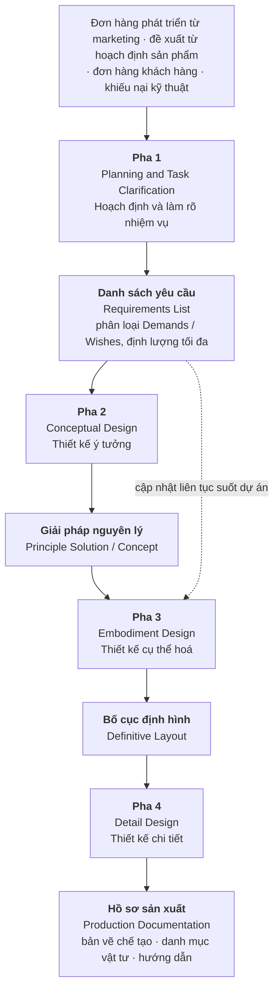

Bảng dưới đây là thứ đáng dán lên tường, vì nó là bất biến của cả phả hệ: mỗi pha nhận một loại tài
liệu và trả về một loại tài liệu khác, và ranh giới pha chính là ranh giới đổi loại tài liệu.

| Pha | Đầu vào | Đầu ra | Câu hỏi pha này trả lời |
|---|---|---|---|
| 1 · Task Clarification | Yêu cầu thô, chưa toàn diện | Danh sách yêu cầu, tách Demands và Wishes | *Bài toán thật sự là gì?* |
| 2 · Conceptual Design | Danh sách yêu cầu | Giải pháp nguyên lý | *Sản phẩm sẽ làm việc theo nguyên lý nào?* |
| 3 · Embodiment Design | Giải pháp nguyên lý đã chọn | Bố cục định hình | *Nó có hình dạng, kích thước, vật liệu gì?* |
| 4 · Detail Design | Bố cục định hình | Hồ sơ sản xuất | *Chế tạo nó ra sao?* |

Hai điểm dễ bị đọc sai.

**Danh sách yêu cầu không đóng băng ở cuối Pha 1.** Nguồn mô tả nó như một tài liệu được *gửi lưu hành
nội bộ giữa các phòng ban để lấy phản hồi và cập nhật liên tục*. Cách đọc "chốt yêu cầu rồi mới thiết
kế" là cách đọc của người vẽ lại sơ đồ, không phải của người viết nó. Đây là mầm của một cuộc tranh
luận sẽ nổ ra ở Phần III dưới cái tên **đồng tiến hoá vấn đề–giải pháp**.

**Số bước bên trong mỗi pha không phải là hằng số của nguồn.** Ở Pha 2, nguồn `[1]` mô tả tiến trình
chi tiết theo Chương 6 và Figure 6.1 thành tám hoạt động, trong đó riêng thao tác trừu tượng hoá đã
gồm năm thao tác con; trong khi bản tóm ở Editors' Foreword liệt kê năm bước. Về phép đếm cho Pha 2,
tệp khám phá ghi thẳng: **không có trong nguồn** một câu tiếng Anh nào phát biểu số lượng bước. Cùng
một cuốn sách, hai chỗ, hai cách chia — và không chỗ nào tự đếm. Giữ lấy quan sát này; mục thứ tư của
chương sẽ cho thấy nó không phải sự cẩu thả biên tập mà là một lập trường.

---

## Hạt nhân: chuỗi giải quyết vấn đề tổng quát

Bốn pha không phải là bốn thứ khác nhau. Chúng là cùng một chuỗi thao tác chạy lại bốn lần, mỗi lần ở
một mức cụ thể thấp hơn. Nguồn `[1]` gọi hạt nhân đó là **general problem solving process** và trình
bày nó qua Figure 4.1 theo sáu chặng: Confrontation — Information — Definition — Creation — Evaluation
— Decision.

Con số sáu ở đây là do đếm hình vẽ. Tệp khám phá ghi rõ: **không có trong nguồn** một câu văn nào phát
biểu số bước của chuỗi này; sách chỉ minh hoạ trực quan và mô tả nội dung từng chặng. Tôi viết ra con
số vì nó tiện để nói chuyện, và viết luôn ra rằng nó là con số của tôi, không phải của sách.

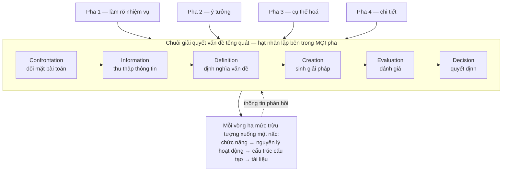

Vì sao hạt nhân này quan trọng hơn bốn pha? Ba lý do.

**Nó giải thích vì sao phương pháp co giãn được.** Bốn pha là cách chia thô cho một dự án phát triển
sản phẩm mới. Nhưng chuỗi Confrontation → Decision chạy được ở mọi quy mô: một dự án, một cụm lắp,
một buổi họp thiết kế, một quyết định chọn vật liệu. Ai đã thấy hạt nhân sẽ không còn hỏi "dự án nhỏ
thì bỏ pha nào" — câu hỏi đúng là "vòng lặp này chạy mấy lần và ở mức nào".

**Nó là chỗ nối sang thế hệ sau.** Micro-cycle của VDI 2206 — chu trình giải quyết vấn đề lặp bên
trong khung chữ V — mang đúng cấu trúc này. Hai văn bản cách nhau ba thập niên, thuộc hai ngành khác
nhau, dùng chung một hạt nhân. Điều đó nói rằng phần bền của Pahl-Beitz không nằm ở sơ đồ bốn ô mà
nằm ở vòng lặp bên trong.

**Nó là chỗ phương pháp tự mâu thuẫn với cách nó được đọc.** Một chuỗi có nhánh Evaluation quay lại
Information là một vòng lặp, không phải một đường thẳng. Nhưng thứ được in lại, dạy lại, dán lên tường
phòng thiết kế lại luôn là sơ đồ bốn ô xếp hàng. Vòng lặp bị mất trong quá trình sao chép. Chương 07
sẽ cho thấy chính sự mất mát này là thứ mà phe phê bình đánh vào.

---

## Mệnh đề trung tâm: quyết định sớm định đoạt số phận sản phẩm

Đây là mệnh đề chịu lực của cả phả hệ. Nếu nó sai, toàn bộ lý do tồn tại của thiết kế có hệ thống sụp
theo: chẳng việc gì phải bỏ công vào pha trừu tượng nếu sửa về sau vẫn rẻ.

Nguồn `[1]` phát biểu nó ở dạng định tính, và cẩn thận hơn nhiều so với cách nó thường được trích:

> `"Just as design commits a large proportion of a product’s costs (see Chapter 11), up to 80% of all
> faults can be traced back to insufficient planning, design and development [10.26]."` — nguồn `[1]`, trang 517

> `"Furthermore, up to 60% of all breakdowns that occur within the warranty period are caused by
> incorrect or incomplete product development."` — nguồn `[1]`, trang 517

Chú ý ba chi tiết mà bản trích dẫn phổ thông hay đánh rơi. Thứ nhất, phần nói về chi phí **không có
con số** — nguyên văn là *a large proportion*, và nó trỏ sang Chương 11 chứ không tự khẳng định. Thứ
hai, cả hai con số đều mang chữ **up to** — trần trên, không phải giá trị điển hình. Thứ ba, con số
80% có chú dẫn `[10.26]`: đây là số của một tài liệu khác được Pahl-Beitz dẫn lại, không phải số họ đo.

### Con số chi phí đến từ đâu, và vì sao nó lung lay

Vì đây là một khẳng định về **hiệu quả** — về việc can thiệp sớm thì đáng giá — nó không được phép chỉ
dựa vào `[1]`. Corpus có ba bài ngoài `[1]` nói đúng điều này — nhưng phải nói ngay một điều mà danh
mục nguồn cho thấy: cả ba đều nằm trong **cùng một nhóm, tuyến ICDM của Hari & Weiss**. Chúng đối chứng
cho `[1]`, chúng **không** đối chứng cho nhau. Và ngay trong cùng một tuyến, chúng đã không thống nhất:

| Nguồn | Nguyên văn | Con số | Có dẫn nguồn không |
|---|---|---|---|
| `[45]` | `"Most of the product's performance is determined and more than 75% of its life cycle cost is committed during the conceptual design phase."` | **> 75%** | không, trong chính câu đó |
| `[50]` | `"About 75 % of the life cycle cost is committed in this stage (Blanchard, 1978)."` | **≈ 75%** | Blanchard, 1978 |
| `[47]` | `"It is well known that the conceptual design is the most influential step in the design process of a product or a system and that about 80 % of the life cycle cost is committed in this stage (Blanchard ,1978)."` | **≈ 80%** | Blanchard, 1978 |

Ba bài **trong cùng một tuyến tài liệu**, cùng một mệnh đề, và hai con số khác nhau — trong đó **hai
bài dẫn cùng một nguồn năm 1978 nhưng ra hai con số**. Việc chúng cùng nhà làm mâu thuẫn ấy nặng hơn
chứ không nhẹ đi: nếu ba tuyến độc lập lệch nhau thì còn đổ được cho khác phương pháp đo, nhưng đây là
cùng một trường phái chuyền tay một con số và đánh rơi nó ở giữa đường. Thêm nữa, tài liệu `[47]` mở đầu bằng `"It is well known that"`,
một cụm từ không chứa phép đo nào.

Đây không phải lý do để vứt mệnh đề đi. Nó là lý do để biết mình đang đứng trên cái gì: một mệnh đề
định tính rất mạnh, được nhắc lại nhất quán về **chiều** — chi phí bị cam kết sớm — và không nhất
quán về **độ lớn**. Hai giới hạn phải nói kèm. Thứ nhất, trong corpus này **không tài liệu nào tự đo
con số ấy**; tất cả đều trích lại. Thứ hai, corpus **không có nguồn nào ngoài tuyến ICDM** đo mệnh đề
chi phí bị khoá sớm — nên mệnh đề này chưa từng được đối chứng chéo giữa hai trường phái độc lập. Ai muốn
dùng 75% hay 80% để bảo vệ một đề xuất ngân sách nên biết mình đang chuyền tay một con số 1978 mà
chính người chuyền cũng không thống nhất được là bao nhiêu.

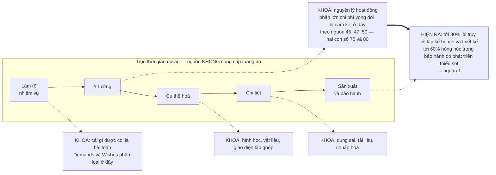

Sơ đồ này là cách đọc đúng của mệnh đề: **chỗ khoá và chỗ lộ ra cách nhau rất xa về thời gian.** Chi
phí bị cam kết ở pha ý tưởng, còn bằng chứng rằng nó đã bị cam kết sai chỉ xuất hiện ở xưởng và trong
thời hạn bảo hành. Đó là một vòng phản hồi có độ trễ dài — và một hệ thống có phản hồi trễ thì con
người trong hệ thống ấy không học được từ hậu quả, vì lúc hậu quả tới thì người ra quyết định đã đi
làm dự án khác.

Nguồn `[1]` bồi thêm một câu chặn đường thoát hiểm quen thuộc — ý tưởng rằng có thể vá một thiết kế
tồi bằng hệ thống quản lý chất lượng:

> `"If the search for suitable principle solutions has not been undertaken rigorously and if the
> appropriate rules, principles and embodiment guidelines have not been applied to their full extent,
> the methods of TQM will not be able to rectify these fundamental deficiencies."` — nguồn `[1]`

Và một câu nữa, về cơ chế: sai lệch đánh giá ở pha ý tưởng có sức phá huỷ khác hẳn sai lệch ở pha sau.

> `"If, because of an unidentified evaluation uncertainty, which is more likely to occur in the
> conceptual than in the embodiment phase, a weak spot should make itself felt later, then the whole
> concept may be put in doubt and all the development work may prove to have been in vain."` — nguồn `[1]`

Câu này thường được đọc thành một lời hô hào đầu tư nhiều hơn vào pha sớm. Nó cũng nói mặt kia, và mặt
kia ít được nhắc: nếu quyết định sớm khoá được nhiều thứ đến thế thì **một quyết định sớm sai cũng khoá
đúng chừng ấy**, và nó khoá ở chỗ khó tháo nhất. Bất định đánh giá, theo chính câu trên, dễ xảy ra ở pha
ý tưởng hơn pha cụ thể hoá. Vậy hệ quả hành động không phải là *dồn thêm nguồn lực vào pha sớm* mà là
*giữ cho quyết định pha sớm còn tháo ra được lâu nhất có thể*. Đó là hai chiến lược khác hẳn nhau, và
nguồn `[1]` không phân xử giữa chúng.

---

## Mười lăm bước công tác chính — và câu nằm ngay trước chúng

Mục 7.1 của nguồn `[1]` là chỗ được trích nhiều nhất khi người ta muốn chứng minh rằng Pahl-Beitz là
một quy trình. Danh sách ở đó được đánh số liên tục, mục cuối cùng đọc là *"Fix the definitive layout
and pass on to the detail design phase."* Đếm ra mười lăm mục.

Ba tầng sự thật về mười lăm mục ấy, và tầng thứ ba mới là nội dung của chương này.

**Tầng một — danh sách đúng là mười lăm mục.** Kiểm bằng cách mở toàn văn bản in, không hỏi lại công cụ
truy hồi. Đánh số liền mạch từ `1.` đến `15.` trong mục 7.1, kèm sơ đồ Figure 7.1.

**Tầng hai — cuốn sách không bao giờ tự viết ra con số đó.** Phép đếm chạy trên toàn bộ văn bản trích
ra được của `[1]` — **1.167.487 ký tự**, đúng con số mà danh mục nguồn của dự án ghi cho tài liệu này
(số ký tự văn bản máy đọc được, không phải số ký tự của bản in giấy):

| Chuỗi tìm | Số lần xuất hiện |
|---|---|
| `fifteen` | **0** |
| `fifteen steps` | **0** |
| `15 steps` | **0** |

Không lần nào. Trên hơn một triệu một trăm nghìn ký tự. Cuốn sách liệt kê đủ mười lăm mục và không một lần
nào tự nói rằng có mười lăm mục.

**Tầng ba — và đây là chỗ đáng viết cả một mục — chính hai tác giả phủ nhận rằng đó là một kế hoạch,
ngay ở câu liền trước danh sách:**

> `"Because of this, it is not always possible to draw up a strict plan for the embodiment design
> phase. However, it is possible to suggest a general approach with main working steps, see
> Figure 7.1."` — nguồn `[1]`, mục 7.1

*Không phải lúc nào cũng có thể lập một kế hoạch chặt cho pha cụ thể hoá. Tuy nhiên, có
thể **gợi ý** một cách tiếp cận tổng quát với các **bước công tác chính**.* Hai chữ *suggest* và
*general* nằm trong chính câu mở đầu danh sách. Cái được đọc thành quy trình vốn được viết ra như một
gợi ý.

Hai câu bổ trợ, một trước và một sau danh sách, nói rõ vì sao:

> `"Unlike conceptual design, embodiment design involves a large number of corrective steps in which
> analysis and synthesis constantly alternate and complement each other."` — nguồn `[1]`

> `"In the embodiment phase, unlike the conceptual phase, it is not necessary to lay down special
> methods for every individual step, however the following recommendations might prove useful."` — nguồn `[1]`

*Recommendations.* *Might prove useful.* Đây là ngôn ngữ của người đưa lời khuyên, không phải ngôn ngữ
của người ban hành thủ tục.

### Vì sao đây là bằng chứng nội tại mạnh nhất của cuốn sách này

Luận đề của cuốn sách nói rằng các phương pháp thiết kế có hệ thống đặt cược vào một tổ chức không tồn
tại. Một phản bác hiển nhiên: đó là lời của người ngoài, của giới phê bình, của những người chưa từng
phải giao một sản phẩm. Phát hiện ở mục 7.1 vô hiệu hoá phản bác đó.

Nguồn `[1]` là tài liệu **quy định nhất** trong toàn corpus và cũng là tài liệu **lớn nhất** — một
mình chiếm 32% khối lượng. Mục 7.1 là chỗ **quy định nhất trong tài liệu quy định nhất**: một danh
sách đánh số, có sơ đồ đi kèm, đúng dạng thức mà người ta cắt ra dán vào sổ tay quy trình nội bộ. Và
chính tại đó, chính hai tác giả viết rằng không phải lúc nào cũng lập được kế hoạch chặt.

Khoảng cách giữa **cái được viết** và **cái được đọc** không phải do phe phê bình phát hiện ra từ bên
ngoài. Nó nằm sẵn trong văn bản gốc, ở dạng một câu đơn, ngay phía trên danh sách mà ai cũng trích.
Nửa thế kỷ phổ biến phương pháp đã sao chép danh sách và bỏ lại câu đó.

Điều này nói lên hai thứ. **Về phương pháp:** Pahl-Beitz khiêm tốn hơn nhiều so với danh tiếng của nó.
Cái bị đem ra chấm điểm là một phiên bản cứng hơn bản gốc. **Về cơ chế truyền bá:** thứ sống sót qua
mỗi lần sao chép là thứ *có hình dạng* — danh sách đánh số, sơ đồ ô vuông. Thứ chết đi là các bổ ngữ,
các câu điều kiện, các chữ *not always* và *might*. Một phương pháp đi qua đủ nhiều lần sao chép sẽ
tự cứng lại, không cần ai cố ý làm cứng nó.

### Cuốn sách tự đếm cái gì, và không tự đếm cái gì

Mười lăm không phải trường hợp cá biệt. Đây là bảng đối chiếu giữa những phép đếm mà nguồn `[1]` tự
phát biểu và những phép đếm mà người đọc phải tự làm:

| Đối tượng | Sách có tự phát biểu con số? | Nguyên văn nếu có |
|---|---|---|
| Bốn pha của quy trình thiết kế | **Có** | `"Of the four phases of the product design process…"` |
| Bảy bước công việc cơ bản của VDI 2221 | **Có** | `"…includes seven basic working steps…"` |
| Ba quy tắc cơ bản của pha cụ thể hoá | **Có** | `"In short, by observing these three basic rules, designers can increase their chances of success…"` |
| Hai thủ tục kết hợp điểm kỹ thuật–kinh tế của Baatz | **Có** | `"To that end, Baatz [3.1] has proposed two procedures, namely:"` |
| Số bước của pha làm rõ nhiệm vụ | **Không** | — |
| Số bước của pha ý tưởng | **Không** | — |
| Số bước của chuỗi giải quyết vấn đề tổng quát | **Không** | — |
| **Số bước của pha cụ thể hoá — "15"** | **Không** | — |
| Năm nguyên lý thiết kế cụ thể hoá | **Không** | — |
| Số bước của pha chi tiết | **Không** | — |

Sách đếm những gì nó coi là **cấu trúc** — bốn pha, ba quy tắc, hai
thủ tục, và bảy bước của một tiêu chuẩn khác mà nó đang mô tả. Sách **không** đếm những gì nó coi là
**trình tự công việc**. Việc từ chối đếm là một lập trường về bản chất của thứ đang được liệt kê.

Hệ quả cho người viết quy trình: khi một tài liệu liệt kê đủ mục mà không tự đếm, đừng đếm hộ nó rồi
trích ngược lại như thể nó đã nói. Đó là cách một gợi ý biến thành một thủ tục chỉ trong một lần
diễn giải.

> **Đào sâu: vì sao pha cụ thể hoá không lập kế hoạch chặt được**
>
> Câu phủ nhận ở mục 7.1 không phải sự khiêm tốn xã giao. Nó có lý do kỹ thuật, và nguồn `[1]` nói ra
> ở ba chỗ khác nhau.
>
> **Lý do thứ nhất — bản chất công việc là lặp sửa.** `"…embodiment design involves a large number of
> corrective steps in which analysis and synthesis constantly alternate and complement each other."`
> Phân tích và tổng hợp thay phiên nhau liên tục. Một chuỗi trong đó bước sau có thể buộc quay lại sửa
> bước trước thì không có thứ tự tô-pô cố định — nghĩa là không lập lịch được theo nghĩa chặt.
>
> **Lý do thứ hai — các nguyên lý cụ thể hoá triệt tiêu lẫn nhau.** `"When applying embodiment design
> principles, designers may find that they run counter to certain requirements. Thus, the principle of
> uniform strength may conflict with the demand for minimum costs; the principle of self-help may
> conflict with fail-safe behaviour…"` Nếu bộ luật tự mâu thuẫn thì không tồn tại thuật toán chạy hết
> bộ luật; chỉ tồn tại các thoả hiệp, và thoả hiệp thì phải có người quyết.
>
> **Lý do thứ ba — mức bất định còn quá cao để cho điểm.** `"Numerical values, by contrast, are
> dangerous because they introduce a false sense of certainty."` Chính hai tác giả cảnh báo về việc gán
> số cho cái chưa đo được. Một quy trình chặt thì cần cổng, cổng cần ngưỡng, ngưỡng cần số — và số ở
> pha này chưa đáng tin.
>
> Ba lý do này cộng lại thành một kết luận đơn giản: **thứ không lập kế hoạch chặt được thì cũng không
> kiểm toán chặt được.** Đây là lần đầu tiên trong phả hệ mà một phương pháp tự chỉ ra ranh giới của
> chính nó. Sẽ còn lần nữa, và lần sau nằm trong một văn bản tiêu chuẩn quốc gia — xem Chương 05.

---

## Những gì chính hai tác giả nhận là hỏng

Một cuốn sách quy định mà dành nhiều trang để liệt kê nhược điểm của chính nó là hiện tượng đáng chú
ý. Đây là danh sách rút gọn, tất cả đều từ nguồn `[1]`, tất cả đều là lời tự thú chứ không phải lời
phê bình từ ngoài.

**Trừu tượng hoá cản trở việc tìm giải pháp trực tiếp.** Chính công cụ được ca ngợi nhất — đưa bài toán
về chức năng có giá trị tổng quát — có tác dụng phụ:
`"…using generally valid functions can represent a problem because such an abstract level can sometimes
hinder the direct search for solutions."` Và ở môi trường công nghiệp:
`"In many cases in industry it may not be expedient to build up a function structure from generally
valid subfunctions, because they are, in fact, too general…"`

**Cách tiếp cận theo tiến trình sinh ra không gian giải pháp phình to.**
`"The process-oriented approach largely avoids the potential disadvantages of the problem-oriented
approach. However, more time is required because of the wider, more systematic perspective. This
carries the danger of generating an unnecessarily large solution space."`

**Cấu trúc chức năng không bao giờ thật sự trung lập.**
`"Moreover, it should be remembered that function structures are seldom completely free of physical or
formal presuppositions, which means that the number of possible solutions is inevitably restricted to
some extent."` Mục tiêu *solution-neutral* của Chương 02 là một tiệm cận, không phải một trạng thái
đạt được.

**Điểm số đánh giá mang thành kiến mạnh.**
`"All in all, therefore, the assignment of a value, the selection of a value function and the setting up
of an assessment scheme may involve strong subjective influences. Cases with a clear, or even
experimentally verified, correlation between the values and the parameters are few and far between."`
Đây là lời của chính người đưa ra thang điểm — nguồn `[1]` mô tả hai thang: `"Cost–Benefit Analysis
employs a range from 0 to 10; Guideline VDI 2225 a range from 0 to 4"`.

**Phương pháp gần như không được áp dụng cho phần lớn công việc thiết kế thực tế.**
`"The approach has hardly been introduced at all for adaptive or variant design [12.2, 12.4]. This is
understandable because working with functions and function structures is not the most important task in
these types of design."` Thiết kế thích nghi và thiết kế biến thể chiếm phần lớn khối lượng công việc
ở hầu hết doanh nghiệp cơ khí. Phương pháp tự khai rằng nó không dành cho phần lớn đó.

**Công nghiệp chê thẳng khâu ước lượng chi phí.**
`"The following aspects have been criticised by industry: Procedures for estimating costs are
insufficiently developed."` Đáng chú ý vì mệnh đề trung tâm của chính phương pháp là *chi phí bị khoá
sớm* — mà công cụ để ước lượng chi phí sớm thì nó thừa nhận là chưa đủ.

**Kỹ sư thật gặp khó với biểu diễn trừu tượng.**
`"Abstracting and creating function structures often causes difficulties because of the abstract
representation. Designers are more used to thinking in objects and visual images [12.6]."`

**Và người giỏi thì không làm theo trình tự.** Đây là câu quan trọng nhất trong cả danh sách:

> `"The investigations of Dylla [2.11, 2.12] and Fricke [2.15, 2.16] show that novices educated in
> systematic design tend to follow the process-oriented approach, whereas experienced designers tend to
> follow the problem-oriented approach. Experienced designers apply their wealth of experience, know a
> wide range of possible subsolutions, and are able to represent these solutions quickly. Hence they
> arrive relatively quickly at a concrete result. Then, using a corrective approach, they bring this
> together into an overall solution."` — nguồn `[1]`

Người mới đi theo tiến trình. Người có kinh nghiệm đi theo bài toán. Câu này nằm trong chính cuốn sách
dạy đi theo tiến trình.

### Bằng chứng từ ngoài `[1]`

Vì `[1]` chiếm 32% corpus, mọi khẳng định quan trọng cần đối chứng. Ba tuyến bên ngoài nói cùng một
hướng với lời tự thú trên.

**Tuyến thực nghiệm nhận thức — `[31]`.** Kannengiesser và Gero ánh xạ toàn bộ hoạt động của phương pháp
Pahl-Beitz sang một khung mã hoá nhận thức rồi so với hành vi thật. **Chương 02 trình bày trọn bộ số liệu
của thực nghiệm ấy** — số bước ánh xạ được, số phiên quan sát, thời lượng mỗi phiên — nên ở đây chỉ cần
kết luận của nó:

> `"Therefore, it can be concluded that the differences between the model and the empirical data rather
> indicate that PBSA seems to be incomplete as a predictive model of designing since it does not predict
> designers’ early focus on generating solutions."` — nguồn `[31]`

Ràng buộc phải nói kèm, và đây là chỗ chương này dùng nó để **hạ mức** kết luận: đối tượng đo là **sinh
viên cơ khí sau năm thứ nhất**, không phải kỹ sư đang hành nghề, và mỗi phiên làm bài trong một quãng
thời gian ấn định ngắn `[31]`. Đó không phải một dự án công nghiệp. Kết quả này đủ để nói *mô hình không
tiên đoán được hành vi*, không đủ để nói *phương pháp không dùng được*.

**Tuyến khảo sát doanh nghiệp — `[43]`.** Jensen và Andreasen khảo sát việc áp dụng phương pháp thiết kế
tại các doanh nghiệp Đan Mạch qua ba năm học liên tiếp — `"The students, 50 per year, all take a course
in ‘Design Methods’ taught by the authors of this article."`, trong `"the years 2007-2009"`. Phát hiện
lặp đi lặp lại: các bước bị bỏ dưới áp lực thời gian, các bước đầu bị cắt hẳn với khách hàng cũ, và
phương pháp được dùng như một **nghi lễ để giải trình** rằng công việc đã được làm nghiêm túc — chứ
không phải như một đường ray. Đây cũng là khảo sát của sinh viên, không phải kiểm toán độc lập; ghi
nhận đúng mức đó.

**Tuyến đối chiếu phương pháp — `[33]`.** Nghiên cứu so sánh thực hiện `"Duration: 4 weeks Date: Feb 2007
– March 2007"` ghi nhận Pahl-Beitz tập trung vào cấu trúc chức năng và nguyên lý giải pháp trong cơ khí,
và **bỏ hẳn khía cạnh tiếp thị và bán hàng** — trong khi các khung khác bao phủ cả vòng đời thương mại.

Ba tuyến, ba phương pháp thu thập khác nhau, cùng một chiều: **khoảng cách giữa mô hình và hành vi là
có thật, và nó không nhỏ.** Một ràng buộc dùng chung phải nói lại đúng lúc gộp kết luận, vì đây là chỗ
nó hay bị đánh rơi: **hai trong ba tuyến đo trên sinh viên**, không trên kỹ sư đang hành nghề. Không tuyến nào trong ba tuyến đo được rằng áp dụng phương pháp thì sản
phẩm tốt hơn. Trong toàn corpus, khẳng định *phương pháp có hệ thống cho kết quả tốt hơn* **không có
tài liệu nào đo**. Nguồn `[1]` biện hộ cho nó bằng lập luận, không bằng số liệu đối chứng.

---

## Phương pháp này giả định một tổ chức như thế nào

Mọi chương của Phần II đóng bằng mục này, và đây là lần đầu tiên. Câu hỏi không phải *phương pháp có
đúng không* mà là *nó cần một tổ chức ra sao để đúng*.

Nguồn `[1]` không có một mục nào tên là "giả định về tổ chức". Danh sách dưới đây được dựng bằng cách
đọc ngược: mỗi chỗ phương pháp mô tả một điều kiện vận hành thuận lợi là một giả định; mỗi chỗ nó liệt
kê điều kiện thất bại là mặt sau của cùng giả định đó. Việc dựng ngược này là thao tác của cuốn sách,
không phải mục lục của nguồn.

| # | Canh bạc — điều phương pháp cần mà không đòi | Nguyên văn đỡ giả định này | Nó vỡ khi | Dấu hiệu sớm |
|---|---|---|---|---|
| 1 | **Hợp tác liên ngành thông suốt** giữa thiết kế, chế tạo, mua sắm, marketing; làm việc song song chứ không chuyển giao một chiều | *suy luận dựng ngược — không có nguyên văn* | Tổ chức chia ô hành chính, thông tin đi qua biên bản | Phản hồi từ chế tạo chỉ đến sau khi bản vẽ đã phát hành |
| 2 | **Đồng thuận văn hoá giữa kỹ sư và quản lý** — cả hai phía đều được đào tạo và đều đòi hỏi phía kia làm có hệ thống | *suy luận dựng ngược — không có nguyên văn* | Một phía mất kiên nhẫn: quản lý đòi bản vẽ ngay, hoặc kỹ sư từ chối học phương pháp | Buổi bảo vệ khái niệm bị thay bằng câu "cứ vẽ ra xem thế nào" |
| 3 | **Đủ thời gian và tiền cho pha trừu tượng đầu dự án** — nơi chưa có gì nhìn thấy được | `"The objection is often raised that applying a systematic approach during the conceptual design phase takes too much time."` `[1]` — nguồn ghi nhận sức ép, không ghi cách chống | Áp lực thị trường buộc rút ngắn; các bước bị gộp hoặc bỏ | Pha ý tưởng bị đặt lịch bằng ngày, pha chi tiết bằng tháng |
| 4 | **Hạ tầng quản lý dữ liệu kỹ thuật** để danh sách yêu cầu sống được và cập nhật được suốt dự án | *suy luận dựng ngược — không có nguyên văn* | Không có nơi lưu trữ chung; danh sách yêu cầu thành tệp đính kèm email | Hai người cùng dự án làm việc trên hai phiên bản yêu cầu khác nhau |
| 5 | **Người ra quyết định đủ dày dạn để dám cắt bước** | `"…novices educated in systematic design tend to follow the process-oriented approach, whereas experienced designers tend to follow the problem-oriented approach."` `[1]` | Đội ngũ non hoặc sợ trách nhiệm → bám tối đa vào tài liệu hoá | Hồ sơ đầy đủ hơn mức dự án cần, và không ai đọc |

**Ba trên năm ô của cột thứ hai để trống, và đó là kết quả chứ không phải việc chưa làm xong.** Nguồn
`[1]` không có mục nào tên *giả định về tổ chức*; cả bảng là thao tác dựng ngược của cuốn sách. Hai ô
còn lại có nguyên văn, nhưng đó là những câu nguồn viết khi đang nói chuyện khác và tình cờ chạm tới. Ba ô
trống nặng ngang hai ô kia mà chỉ đứng bằng suy luận — và người đọc có quyền biết ô nào là ô nào.

Giả định 3 và giả định 5 kéo nhau theo chiều ngược nhau, và đó là chỗ đau nhất. Phương pháp cần thời
gian cho pha trừu tượng — nhưng nguồn `[1]` cũng ghi nhận lời phản đối phổ biến rằng làm có hệ thống ở
pha ý tưởng thì mất quá nhiều thời gian. Câu trả lời của chính hai tác giả không phải là *nhanh hơn* mà
là *không chậm hơn*: thời gian bỏ ra xấp xỉ bằng khi không dùng phương pháp. **Chương 02 in cả hai câu
nguyên văn** và đọc chúng như ca mẫu về việc phải trích đủ ngữ cảnh `[1]`.

Đây là một lời biện hộ khiêm tốn đến mức đáng ngạc nhiên. Không hứa nhanh hơn, chỉ hứa không chậm hơn —
và với một tổ chức đang định cắt lịch pha ý tưởng thì đó không phải lời hứa nó muốn nghe.

**Bốn giả định đầu là về cấu trúc tổ chức, giả định thứ năm là về con người.** Và giả định thứ năm là
cái phương pháp không thể tự tạo ra: một quy trình có thể dạy người ta *làm theo*, nhưng không dạy
được người ta *biết khi nào không làm theo*. Chính vì thế mà, theo `[1]`, người mới đi theo tiến trình
còn người có kinh nghiệm đi theo bài toán — phương pháp huấn luyện được nhóm thứ nhất, và nhóm thứ hai
là nhóm mà tổ chức thật sự cần.

Ở đây cần một khai báo, vì phần cuối cuốn sách sẽ khai thác nó. Việc xếp một công cụ thiết kế vào một
**tầng đòn bẩy** theo cách phân hạng của Meadows là thao tác của cuốn sách này; không tài liệu nào
trong 66 nguồn làm việc đó, và Meadows không viết một chữ nào về thiết kế kỹ thuật. Với ràng buộc đó,
quan sát ở đây chỉ dừng ở mức mô tả: bốn pha là một can thiệp vào **luồng công việc và tài liệu**, còn
năm giả định vừa liệt kê nằm ở **văn hoá tổ chức và thẩm quyền quyết định**. Phương pháp can thiệp ở
một chỗ và đặt cược vào một chỗ khác. Phần V sẽ trả lời câu hỏi điều đó có nghĩa gì.

### Nối sang Chương 04

Bốn pha ra đời trong một cuốn sách năm 1977 — `"The first German edition of Konstruktionslehre was
published in 1977."` — và tiếp tục sống qua nhiều lần tái bản, tới bản tiếng Đức thứ chín năm 2021
theo nguồn `[37]` — lời Kilian Gericke trong một bài giảng, trích từ bản gỡ băng tự động, nên `p and
bites` ở đây là máy nghe nhầm *Pahl and Beitz* chứ không phải lỗi đánh máy: `"the book p and bites now
being in its ninth Edition in German language so we published the latest edition in 2021"`. Nhưng thứ đưa nó ra khỏi phạm vi một cuốn sách giáo khoa là
một chuyện khác: nhà nước Đức, qua hiệp hội kỹ sư của mình, biến nó thành tiêu chuẩn.

Chính nguồn `[1]` mô tả tiêu chuẩn ấy, và đây là con số nó **tự phát biểu**:

> `"The approach (see Figure 1.9) includes seven basic working steps that accord with the fundamentals of
> technical systems (see Section 2.1) and company strategy (see Chapter 4)."` — nguồn `[1]`, trang 18

Bảy bước. Không phải bốn pha, không phải mười lăm bước. Một cách chia thứ ba, cho cùng một công việc,
trong một văn bản mang thẩm quyền khác hẳn. Chuyện gì xảy ra với một gợi ý khi nó được đóng dấu tiêu
chuẩn quốc gia — mua được gì và trả giá bằng gì — là nội dung Chương 04.

---

## Áp dụng ở Xưởng

Bối cảnh: một xưởng cơ khí — điện tử — phần mềm nhúng, vài chục người, chạy song song nhiều dự án ở
các pha khác nhau.

### 1. Phân loại lại từng bước trong tài liệu quy trình nội bộ thành CỔNG hoặc GỢI Ý — làm trong tuần

Mở tài liệu quy trình thiết kế nội bộ đang lưu hành. Với mỗi bước, gán đúng một trong hai nhãn.
**CỔNG** = có sản phẩm giao nộp cụ thể, có người ký, và không qua thì không được đi tiếp. **GỢI Ý** =
làm thì tốt, không làm thì ghi lý do vào biên bản, không chặn đường. Không có nhãn thứ ba.

Quy tắc quyết định lấy thẳng từ phát hiện của chương: một bước chỉ được là CỔNG nếu nêu được **cái gì
sẽ hỏng nếu bỏ nó** và **ai sẽ biết điều đó**. Nếu không nêu được cả hai thì nó là GỢI Ý, và đang được
thi hành như CỔNG chỉ vì nó nằm trong danh sách đánh số.

Kết quả trong tuần: một tài liệu ngắn hơn hẳn, và một con số — tỷ lệ CỔNG trên tổng số bước. Nếu tỷ lệ
đó gần 100% thì tài liệu đang cứng hơn cả bản gốc mà nó phái sinh từ đó, vốn tự nói `"it is not always
possible to draw up a strict plan"`.

**Bẫy:** đội ngũ sẽ có xu hướng gán CỔNG cho mọi thứ, vì CỔNG nghe có vẻ nghiêm túc hơn. Ra quy định
trước: mỗi CỔNG phải có tên một người ký. Số CỔNG sẽ tự giảm.

### 2. Bắt mọi con số quy trình phải chỉ ra được câu nguồn

**Vấn đề nó giải.** Tài liệu nội bộ tích tụ những con số không ai truy được nguồn — một tỷ lệ phần trăm
chi phí bị khoá ở pha ý tưởng, một phép đếm bước cho pha cụ thể hoá — và chúng được dùng để bảo vệ
quyết định ngân sách.

**Cách áp.** Rà tài liệu nội bộ, với mỗi con số yêu cầu một dòng ghi câu nguồn nguyên văn. Con số không
có câu nguồn thì xoá hẳn, không thay bằng "khoảng" hay "phần lớn" — chuyển mệnh đề về dạng định tính có
ghi chiều: *chi phí bị cam kết sớm, mức độ chưa đo được trong tài liệu ta có*.

**Bẫy.** Người ta sẽ đi tìm một nguồn hợp thức hoá con số đã lỡ viết, thay vì bỏ con số. Dấu hiệu: hai
tài liệu nội bộ cùng dẫn một nguồn mà ra hai con số khác nhau — đúng chuyện đã xảy ra với 75% và 80%
cùng dẫn về một tài liệu năm 1978.

### 3. Tách cổng chi phí khỏi cổng kỹ thuật ở cuối pha ý tưởng

**Vấn đề nó giải.** Đánh giá phương án bằng một điểm số tổng hợp làm chỗ yếu về chi phí bị điểm mạnh về
kỹ thuật che mất, đúng lúc chi phí đang bị khoá.

**Cách áp.** Cuối pha ý tưởng, phương án phải qua hai cổng riêng, hai người ký khác nhau: một cổng kỹ
thuật, một cổng chi phí. Ở cổng chi phí, ước lượng nào chưa đo được thì ghi bằng khoảng và ghi rõ độ
bất định, tuyệt đối không quy thành điểm số — theo đúng cảnh báo `"Numerical values, by contrast, are
dangerous because they introduce a false sense of certainty."`

**Bẫy.** Cổng chi phí biến thành nghi thức nếu người ký nó không có quyền chặn. Nếu cổng chi phí chưa
bao giờ chặn một phương án nào thì nó chưa tồn tại.

### 4. Phân loại nhiệm vụ ba mức ngay ở buổi mở dự án

**Vấn đề nó giải.** Ép toàn bộ chuỗi trừu tượng hoá lên một việc thực chất là thay một cụm chi tiết
trong sản phẩm cũ — lãng phí, và làm đội ngũ mất niềm tin vào phương pháp cho lần sau.

**Cách áp.** Buổi mở dự án chốt một trong ba nhãn: **thiết kế mới** — chạy đủ chuỗi ý tưởng; **thiết kế
thích nghi** — bỏ trừu tượng hoá, vào thẳng bố cục, giữ lại đánh giá phương án; **thiết kế biến thể** —
chỉ kiểm tra ràng buộc và tài liệu. Căn cứ là lời tự khai của chính nguồn: `"The approach has hardly
been introduced at all for adaptive or variant design"`.

**Bẫy.** Nhãn trở thành công cụ đàm phán nội bộ — khai "mới" để xin thêm thời gian, khai "biến thể" để
né rà soát. Chống lại bằng cách buộc nhãn phải kèm một câu: *chức năng nào là mới so với sản phẩm gần
nhất*. Không nêu được chức năng mới thì không phải thiết kế mới.

### 5. Cho người có kinh nghiệm đi lối bài toán, nhưng đòi cấu trúc chức năng dựng ngược

**Vấn đề nó giải.** Quy trình chuẩn đánh vào đúng nhóm giỏi nhất: người có kinh nghiệm làm việc theo
lối bài toán, và mọi ràng buộc tuần tự đều làm họ chậm lại mà không thêm chất lượng.

**Cách áp.** Người có kinh nghiệm được đi thẳng từ bài toán sang phác thảo cụ thể. Đổi lại, sau khi có
phác thảo, họ dựng **ngược** cấu trúc chức năng từ phác thảo đó và trả lời một câu duy nhất: *chức năng
nào ở đây có thể thực hiện bằng một nguyên lý khác hẳn?* Cấu trúc chức năng ở đây không dùng để sinh
giải pháp mà để kiểm tra lối mòn — đúng chức năng mà `[1]` gán cho trừu tượng hoá.

**Bẫy.** Nó thoái hoá thành thủ tục giấy tờ hồi tố, vẽ lại cái đã quyết cho đủ hồ sơ. Dấu hiệu: không
lần nào việc dựng ngược làm thay đổi phác thảo. Nếu sau vài dự án mà chưa lần nào đổi, hãy bỏ hẳn bước
này thay vì duy trì nó như một nghi lễ.


# Chương 04 — VDI 2221:1993: bảy bước và cái giá của việc thành tiêu chuẩn

Một phương pháp và một tiêu chuẩn là hai loại vật khác nhau, dù chữ in ra có thể giống hệt. Phương pháp
nói *nếu anh làm thế này thì thường sẽ tốt hơn*. Tiêu chuẩn nói *đây là cách làm*. Khoảng cách giữa hai
câu đó không nằm trong nội dung kỹ thuật — nội dung có thể trùng nhau từng chữ — mà nằm ở chỗ ai phải
giải trình khi không làm theo. Chương này kể chuyện một phương pháp đi qua khoảng cách đó, và tính giá
của chuyến đi. Nếu thiếu chương này, người đọc sẽ tiếp tục tranh luận về việc *bảy bước có đúng không*,
trong khi câu hỏi đáng tiền là *bảy bước, một khi đã thành văn bản có số hiệu, làm gì với tổ chức đang
dùng nó*.

Chương 03 để lại một mảnh bằng chứng mà chương này phải nhặt lên ngay. Pahl-Beitz — nguồn quy định nhất
trong toàn corpus — tự viết ở ngay câu liền trước danh sách công tác của pha cụ thể hoá rằng
`"it is not always possible to draw up a strict plan for the embodiment design phase. However, it is
possible to suggest a general approach with main working steps"` [1]. *Suggest.* Gợi ý. Vậy mà cùng một
chuỗi tư duy ấy về sau trở thành một hướng dẫn quốc gia được trích ở khắp nơi dưới dạng
`"The design process as presented by the VDI 2221 standard is based on 7 stages..."` [7]. Chỗ nối giữa
hai câu đó là toàn bộ nội dung của chương này: **thứ được viết ra như một gợi ý đã được đọc thành một
mệnh lệnh, và cơ chế làm việc chuyển đổi đó chính là hành vi chuẩn hoá.**

Ba thứ người đọc mang đi được. Thứ nhất, bản đồ bảy bước kèm ánh xạ đầu vào–đầu ra của từng bước — dùng
được ngay như danh mục bàn giao giữa các phòng. Thứ hai, một bảng kê sòng phẳng về việc chuẩn hoá **mua
được** cái gì: ngôn ngữ chung giữa các phòng ban, khả năng truy vết, và khả năng đào tạo được người mới.
Thứ ba, hoá đơn cho những thứ đó — trả bằng việc mất chỗ đứng chính đáng cho phán đoán cá nhân, và bằng
một giả định về kỷ luật quy trình mà phần lớn tổ chức không có.

---

## Trước khi có số hiệu: từ Kesselring 1954 đến VDI 2221

Tiêu chuẩn không rơi từ trên trời. Nó là kết tủa của một chuỗi hướng dẫn cá nhân, và chuỗi đó có ngày
tháng rõ ràng trong nguồn.

| Mốc | Cái ra đời | Nguyên văn |
|---|---|---|
| 1954 | Kesselring, *Wegleitung zur Erfindung* | `"The first guideline for inventions was developed by Fritz Kesselring [Kesselring, 1954] in 1954."` [13] |
| 1965 | Hansen, *Konstruktionssystematik* | `"The second guideline was proposed by Hansen [Hansen 1965] in 1965 in the book “Konstruktionssystematik”."` [13] |
| 1973 | VDI 2222 | `"In 1973 the guideline VDI 2222 Design engineering methodics Conceptioning of industrial products was set up on the proposals of Kesselring and Hansen by the VDI (Association of German engineers)"` [13] |
| thập niên 1970 | Loạt tiêu chuẩn VDI đầu tiên về phương pháp thiết kế | `"The first VDI Standards on methods of product design were published in the 1970s."` [15] |

Chuỗi này có một hình dạng, và nguồn tự nói ra hình dạng đó bằng một câu duy nhất đáng chép lại nguyên văn:

> `"The direction of the guidelines has changed from a personal support for individuals (Kesselring)
> towards a general procedure for a company addressing organization and content (VDI 2221)."` [13]

Câu này không nói phương pháp trở nên đúng hơn. Nó nói **đối tượng phục vụ đã đổi**: từ
*một cá nhân* sang *một doanh nghiệp*, và thứ được đề cập không còn là tư duy nữa mà là *tổ chức và nội
dung*. Bài báo lịch sử này đo quãng đường ấy bằng một câu khác: `"Design guidelines have been developed
over the past 50 years."` [13] — năm mươi năm, tính đến thời điểm bài viết.

Và đây là hệ quả kỹ thuật của việc đổi đối tượng phục vụ, cũng nguyên văn:

> `"The instructions have changed from statements that can be immediately put into action or thought to
> instruction on an abstract level, which need to be adapted to the current situation of the designer."` [13]

Chỉ dẫn đi từ *làm được ngay* sang *trừu tượng, cần được người thiết kế tự thích nghi vào tình huống của
mình*. Ghi nhớ vế sau. Nó là hạt giống của toàn bộ Chương 05 — cái mà bản 2019 sẽ gọi tên là *tailoring*
và viết hẳn thành một tập riêng, thì ở đây đã tồn tại từ lâu dưới dạng một khoản nợ không ai ghi sổ: việc
thích nghi được giao cho người dùng, nhưng không có trang nào chỉ cách thích nghi.

> **Con số không có nguyên văn: năm ban hành bản đầu tiên.** Cụm khai thác của chương này ghi thẳng
> *"không có trong nguồn"* cho năm ban hành phiên bản VDI 2221 đầu tiên. Thứ duy nhất trích được là mẩu
> `"Engl. version 1987"` [10]. Bản 1993 thì có nguyên văn, nhưng gián tiếp — nó xuất hiện trong một câu
> của tài liệu khác đang xếp loại nó:
> `"procedural models with a prescriptive notion are of particular interest, i.e. guidelines such as the
> VDI 2221 (1993)"` [12]. Vậy nên tiêu đề chương ghi **1993** và dừng ở đó. Không có năm 1986 trong cuốn
> sách này, vì không có câu nào trong 66 tài liệu nói ra nó. Một cuốn sách buộc tội các phương pháp khác
> là giả định không khai báo thì không được phép điền số vào chỗ trống của chính mình.

---

## Bảy bước, và thứ mà mỗi bước phải giao ra

Trọng tâm của bản 1993 là một chuỗi bảy bước. Nguyên văn của phép đếm:

> `"The design process as presented by the VDI 2221 standard is based on 7 stages, the first and the most
> important is the one that refers to the design requirements..."` [7]

Cái đuôi câu quay lại ám cả chương: bước đầu tiên được chính tài liệu tổng quan gọi là
**quan trọng nhất**. Một quy trình tự tuyên bố rằng sức nặng của nó dồn vào bước đầu tiên là một quy
trình đang đặt cược rất lớn vào chất lượng của thứ đi vào cửa.

Điều đáng giá hơn danh sách tên bước là **ánh xạ đầu vào–đầu ra**: mỗi bước ăn cái gì và bắt buộc phải
nhả ra cái gì. Đây mới là thứ chuyển giao được sang một xưởng thật, vì nó biến một quy trình thành một
chuỗi vật phẩm bàn giao — mà vật phẩm thì kiểm được, còn "mức độ hoàn thành của một bước" thì không.

| # | Bước | Đầu vào | Đầu ra | Bị bỏ khi nào |
|---|---|---|---|---|
| 1 | *Clarify and define the task* | Nhiệm vụ thô từ khách hàng hoặc bộ phận kế hoạch sản phẩm | Bản đặc tả / danh sách yêu cầu (*Specification*) | Hiếm khi bỏ hẳn, nhưng hay bị rút thành một cuộc họp không để lại vật phẩm |
| 2 | *Determine functions and their structure* | Bản đặc tả từ bước 1 | Cấu trúc chức năng (*Function structures*) | **Bị cắt sớm nhất** — đầu ra là một sơ đồ, không phải vật cầm được (xem *Giả định 3*) |
| 3 | *Search for solution principles and their combinations* | Cấu trúc chức năng từ bước 2 | Giải pháp nguyên lý (*Principal solutions*) | **Cắt cùng bước 2** — khi bước 2 bị bỏ thì bước 3 không còn đầu vào và đội nhảy thẳng sang bố cục |
| 4 | *Divide into realizable modules* | Giải pháp nguyên lý từ bước 3 | Cấu trúc mô-đun (*Module structures*) | Ít khi bỏ, nhưng hay được làm ngầm trong đầu một người thay vì thành văn bản |
| 5 | *Develop layout of key modules* | Cấu trúc mô-đun từ bước 4 | Bản vẽ bố cục sơ bộ (*Preliminary layouts*) | Gần như không bao giờ bỏ — đầu ra là bản vẽ, thứ tổ chức nhìn thấy được |
| 6 | *Complete overall layout* | Bố cục sơ bộ từ bước 5 | Bố cục xác định (*Definitive layouts*) | Không bỏ, nhưng đây là chỗ hậu quả của việc bỏ bước 2–3 mới lộ ra |
| 7 | *Prepare production and operating instructions* | Bố cục xác định từ bước 6 | Hồ sơ tài liệu sản phẩm (*Product documents*) | **Bị bóp khi hết thời gian** — bước cuối luôn là bước gánh phần trễ của cả dự án |

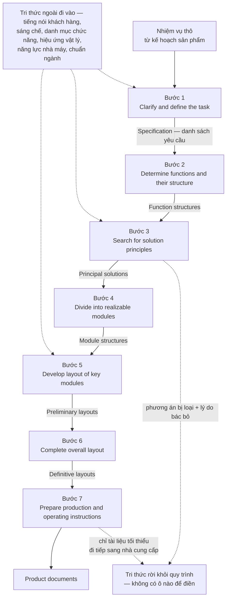

Hai đường đứt nét đi vào ô bên phải không phải trang trí. Chúng là hai phát hiện có nguyên văn của
Vielhaber, và mục *Đào sâu* phía dưới sẽ mổ chúng.

> **Khai báo bắt buộc về nguồn của bảng trên.** Corpus **không có toàn văn tiêu chuẩn VDI nào** — nhắc
> lại khai báo thứ hai của Chương 01. Tên bảy bước và luồng đầu vào–đầu ra ở đây đến từ tài liệu thứ cấp:
> phép đếm bảy bước từ một bản tổng quan [7], ánh xạ đầu vào–đầu ra dựng lại theo phân tích dòng chảy tri
> thức của Vielhaber [10], tên bốn pha từ bài lịch sử hướng dẫn [13]. Chính tệp khai thác ghi rõ rằng
> phần văn bản mô tả chi tiết luồng đầu vào–đầu ra của từng bước 1–7 là **không có trong nguồn** ở lượt
> truy vấn chỉ dùng bốn tài liệu. Nói cách khác: cái mà giới kỹ thuật quốc tế biết về tiêu chuẩn này,
> phần lớn là biết qua người khác kể lại. Đó là một dữ kiện về **mặt tiếp giáp**, không phải một lời xin
> lỗi về phương pháp làm sách — một tiêu chuẩn bán theo bản in, được lan truyền chủ yếu qua bản tóm tắt
> của người thứ ba, sẽ bị hiểu theo cách của người thứ ba.

---

## Bốn pha chứa bảy bước — và vì sao bố cục ấy là một tuyên bố về quyền lực

Bảy bước không đứng một mình. Chúng nằm trong bốn pha, và bốn pha ấy là bốn pha của Chương 03, không sai
một chữ:

> `"The guideline encompasses the four main design phases: clarification of the task, conceptual design,
> embodiment design and detail design."` [13]

Một nguồn độc lập khác, mô tả một dự án áp dụng thật, nhắc lại đúng bốn cái tên đó:

> `"The 3D printer is designed using the VDI 2221 methodology, which encompasses four key phases: task
> clarification, conceptual design, embodiment design, and detailed design."` [6]

Đây là điểm khớp quan trọng nhất của cả phả hệ. VDI 2221 **không phát minh ra một phương pháp mới**. Nó
lấy khung bốn pha đã có và cấp cho khung ấy một số hiệu.

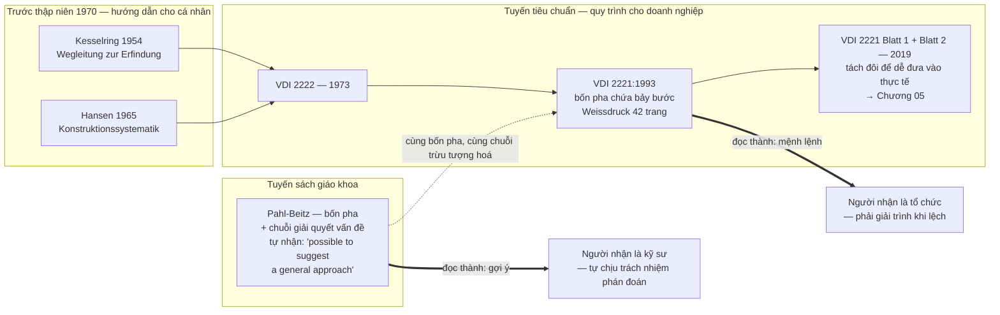

Bố cục *bốn pha chứa bảy bước* trông như một chi tiết trình bày. Nó không phải. Hai lớp ấy phục vụ hai
đối tượng khác nhau: **pha** là ngôn ngữ của quản lý — mốc, ngân sách, cổng duyệt; **bước** là ngôn ngữ
của kỹ sư — việc phải làm, vật phẩm phải nộp. Đặt bước bên trong pha là đặt công việc kỹ thuật bên trong
một khung kiểm soát. Đó chính là điều mà câu trích ở trên gọi là *"a general procedure for a company
addressing organization and content"*. Cái được chuẩn hoá không phải là cách nghĩ của người thiết kế; cái
được chuẩn hoá là **cách tổ chức nhìn vào việc thiết kế**.

> **Ánh xạ bước → pha là cách đọc của cuốn sách này, không phải nguyên văn của nguồn.** Nguồn nói *bốn
> pha*, nguồn nói *bảy bước*, nhưng **không có câu nào trong corpus chỉ định bước nào thuộc pha nào**.
> Chỗ ghép duy nhất mà văn bản cho phép là ghép theo tên: bước 1 mang đúng tên pha thứ nhất
> (*clarification of the task*); đầu ra của bước 3 là *principal solutions* — đúng sản phẩm của
> *conceptual design*; bước 5 và 6 nói *layout*, tức *embodiment*; bước 7 giao *product documents*, tức
> *detail design*. Ghép theo tên thì được. Ghép theo số thứ tự rồi trình bày như sơ đồ gốc của tiêu chuẩn
> thì không, và cuốn sách này không làm.

---

## Chuẩn hoá mua được cái gì

Dễ chê một tiêu chuẩn. Khó hơn, và cần thiết hơn, là nói rõ nó mua được gì — vì nếu không có gì để mua
thì đã không ai chịu trả giá lâu đến thế.

**Thứ nhất: một ngôn ngữ chung giữa các phòng ban.** Khi *cấu trúc chức năng* và *giải pháp nguyên lý*
là danh từ có định nghĩa trong một văn bản có số hiệu, hai phòng khác nhau tranh luận được về cùng một
vật. Trước đó họ tranh luận về hai vật khác nhau mà tưởng là một. Giá trị này không đo được bằng bản vẽ;
nó đo được bằng số cuộc họp không phải họp lại.

**Thứ hai: khả năng truy vết.** Bảng đầu vào–đầu ra phía trên chính là bộ xương của truy vết. Mỗi bước có
một vật phẩm đầu ra được đặt tên, nên câu hỏi *"yêu cầu này biến đi đâu"* có chỗ để trả lời. Chương 06 sẽ
cho thấy tuyến VDI 2206 nâng đúng năng lực này lên thành nhánh kiểm chứng đối xứng của chữ V — truy vết
không còn là tác dụng phụ nữa mà thành nửa kiến trúc.

**Thứ ba: đào tạo được.** Đây là món mua được rõ ràng nhất, và trớ trêu thay bằng chứng mạnh nhất lại nằm
ở những dự án nhỏ, xa nước Đức: corpus có **hai dự án chạy trọn bộ khung và công bố số đo** [3] [6] — một
thiết bị ngưng tụ nước từ không khí và một máy in 3D làm từ nhựa chai tái chế, cả hai do đội ít kinh
nghiệm thực hiện và cả hai giao ra sản phẩm vật lý chạy được. Ô *Đào sâu* ở cuối chương trình các con số
và đọc kỹ xem chúng chứng minh cái gì.

**Thứ tư: một vài công cụ nhỏ nhưng dạy được ngay.** Tài liệu tổng quan mô tả một quy trình phân tích
chức năng năm bước — mô tả sản phẩm, phân tích chức năng có hệ thống bởi đội đa ngành, tổ chức phân cấp,
đặc trưng hoá, ưu tiên hoá:

> `"After a description of the product (step 1), the functions are systematically analysed (step 2) by a
> team of experts from different disciplines. Step 3 is the hierarchical organisation of the different
> functions, while step 4 characterises all functions. The final step prioritises these functions."` [9]

Và một cặp ví dụ dạy được trong ba mươi giây, đáng dán lên tường phòng thiết kế:

> `"A good example for a purely functional requirement is: “The floor must be able to carry payload
> (maximum load 32 t)”. A bad example (as it is already solution oriented) in this context would be:
> “The floor structure is an aluminium honeycomb design capable to withstand a maximum load of 32 t”."` [9]

Bốn món hàng thật — và cần nói ra một bất đối xứng về bằng chứng, vì chính chương này đang lập luật
rằng mọi khẳng định phải chỉ ra chỗ đứng của nó. **Chỉ món thứ ba có số đo trong corpus.** Ngôn ngữ
chung, truy vết, và mấy công cụ nhỏ đều đứng bằng lập luận: không tài liệu nào trong 66 tài liệu đo
được rằng có tiêu chuẩn thì số cuộc họp phải họp lại giảm đi, hay yêu cầu ít thất lạc hơn. Đó là một
dữ kiện về corpus, không phải một lời chê tiêu chuẩn — nhưng ai định dùng ba món kia để bảo vệ một
đề xuất áp chuẩn thì nên biết mình đang cầm lập luận, không cầm số liệu.

Hoá đơn thì ngược lại: nó có bằng chứng.

---

## Và trả giá bằng cái gì

### Giá thứ nhất: một gợi ý bị đọc thành một mệnh lệnh

Đây là chỗ nối quan trọng nhất giữa Chương 03 và chương này, nên nó được viết thẳng ra thay vì để người
đọc tự suy.

Pahl-Beitz, ở đúng chỗ mà giới kỹ thuật hay trích như một quy trình bắt buộc, tự phủ nhận rằng đó là một
quy trình: `"it is not always possible to draw up a strict plan for the embodiment design phase. However,
it is possible to suggest a general approach with main working steps"` [1]. Và cũng chính sách ấy nói
thêm về pha cụ thể hoá rằng `"it is not necessary to lay down special methods for every individual step,
however the following recommendations might prove useful"` [1]. *Recommendations.* Tác giả biết rất rõ
giới hạn của thứ mình viết ra, và đã ghi giới hạn ấy vào ngay cạnh danh sách.

Rồi hành vi chuẩn hoá diễn ra. Cái được viết dưới dạng *suggest a general approach* trở thành cái được
trích dưới dạng *the design process ... is based on 7 stages* [7]. Tài liệu xếp loại học thuật gọi thẳng
tên chủng loại của nó: `"procedural models with a prescriptive notion ... such as the VDI 2221 (1993)"`
[12]. *Prescriptive.* Quy định. Không còn ai đi kèm để nhắc rằng câu gốc có chữ *not always possible*.

Đây không phải lỗi của ban soạn thảo. Đó là **thuộc tính của thể loại**. Một văn bản có số hiệu tồn tại
để được viện dẫn; mà đã viện dẫn thì phải viện dẫn được cái gì đó dứt khoát. Một tiêu chuẩn ghi *"tuỳ
tình huống, có thể không lập được kế hoạch chặt"* thì không ai viện dẫn nổi, và cũng không ai kiểm toán
nổi. **Chuẩn hoá không thêm sự chắc chắn vào tri thức — nó lột phần bất định ra khỏi cách trình bày tri
thức, rồi giao phần đã lột cho tổ chức tự gánh mà không nói ra.**

Cái giá trả ngay lập tức: người kỹ sư mất chỗ đứng chính đáng để nói *bước này dự án tôi không cần*. Anh
ta vẫn bỏ bước — thực tế luôn bỏ — nhưng bây giờ bỏ trong im lặng, không ghi vào đâu cả. Phán đoán không
biến mất khi bị cấm; nó chỉ chuyển xuống hoạt động ngầm, nơi không ai học được từ nó và không ai chịu
trách nhiệm về nó. Đó là một tổn thất kép: tổ chức vừa mất phán đoán khỏi hồ sơ, vừa mất luôn cơ hội
phát hiện rằng quy trình của mình sai chỗ nào.

### Giá thứ hai: chỉ dẫn trừu tượng hoá, và công nghiệp đáp lại bằng sự dè dặt

Bài lịch sử hướng dẫn không nói bóng gió. Nó đo, rồi kết luận:

> `"The advice in the Weißdruck of the guideline contains more results of research than practical hints
> for thinking and acting."` [13]

Có số kèm theo. Tập chú giải *Weißdruck* của VDI 2221 `"encompasses 42 pages."` [13] — trong khi tập
tương ứng của VDI 2222 trước đó là `"a 52-page text with detailed information about the guideline,
examples of the application of the guidelines and relevant literature."` [13]. Bản mới ngắn hơn bản cũ,
và phần còn lại được phân bổ khác đi: riêng chủ đề tích hợp CAD `"takes up a third of the description in
the Weißdruck."` [13] Một phần ba tập chú giải dành cho công cụ, trong một tài liệu mà chính bài phê bình
nói là thiếu gợi ý thực hành cho việc *nghĩ* và *làm*.

Kết quả tiếp nhận, nguyên văn, hai câu:

> `"These insights give, on the one hand, explanations for the still reserved application and acceptance
> of design guidelines..."` [13]

> `"So, most of the identified changes might cause acceptance and application problems of design methods
> in industry."` [13]

Chú ý cấu trúc câu thứ hai: *might cause*. Bài báo không tuyên bố đã đo được mức độ từ chối trong công
nghiệp; nó lập luận từ đặc điểm văn bản sang khả năng bị từ chối. Cuốn sách này dùng nó đúng ở mức đó,
không hơn — và ghi vào Sổ kiểm rằng không có con số nào về tỷ lệ áp dụng.

### Giá thứ ba: tiêu chuẩn mô tả tài liệu, không mô tả cách tài liệu sống trong tổ chức

Đây là câu chẩn đoán sắc nhất trong cả cụm, và nó ngắn:

> `"Existing standards describe the content and generation of requirements documents but not their
> integration in the product development process."` [12]

Một tiêu chuẩn nói *bản đặc tả phải có gì* nhưng không nói *bản đặc tả ấy đi qua tay ai, bị ai sửa, khoá
lại lúc nào, ai được mở khoá*. Chỗ trống đó không trung tính. Trong một tổ chức có kỷ luật quy trình cao,
nó được lấp bằng tập quán tốt. Trong một tổ chức không có, nó được lấp bằng người nào nói to nhất.

Hệ quả trực tiếp là ảo giác về danh sách yêu cầu tĩnh:

> `"A shortcoming of most design process models is that they often create the impression that once the
> initial requirements list has been created, this task is completed – even though they usually try to
> emphasise the need to constantly revise and refine the requirements..."` [12]

Vế sau dấu gạch mới là chỗ nặng — *even though they usually try to emphasise*. Tài liệu **có** nhắc phải liên tục
soát lại yêu cầu. Nhưng hình dạng của sơ đồ nói to hơn phần chữ: một hộp ở đầu chuỗi, một mũi tên đi ra,
không mũi tên nào quay lại. Người ta làm theo hình, không làm theo chú thích. Đây là một mẫu hình đáng
mang theo suốt cuốn sách: **khi hình vẽ và lời cảnh báo mâu thuẫn nhau, hình vẽ thắng.**

Và bài báo nói thêm vì sao việc chốt sớm là bất khả về mặt nhận thức: `"Consistency as well as conflicting
design goals can be difficult to assess due to missing solution principles or details at this early
stage."` [12] Ở bước được chính nguồn gọi là *quan trọng nhất*, người thiết kế chưa có đủ giải pháp trong
tay để phát hiện ra rằng hai yêu cầu của mình mâu thuẫn nhau. Bước 1 vừa gánh trọng lượng lớn nhất, vừa
được thực hiện trong điều kiện thiếu thông tin nhất.

### Giá thứ tư: có nguyên một loại dự án mà khung này không phục vụ

Cụm khai thác ghi một vùng không áp dụng được: **thiết kế biến thể và cải tiến nhỏ**. Khung bảy bước tối
ưu cho thiết kế mới hoàn toàn, nơi việc leo lên mức trừu tượng chức năng thật sự sinh ra phương án khác.
Với một dự án chỉ đổi một phần nhỏ của sản phẩm cũ, bắt kỹ sư dựng lại cấu trúc chức năng từ đầu là mua
thêm độ trễ mà không mua thêm phương án nào.

Điều đáng nói là **văn bản không tự khai vùng loại trừ này** — nó được rút ra từ tuyến phê bình. Một tiêu
chuẩn không tự viết ra biên giới áp dụng của mình thì mặc định sẽ được áp cho mọi thứ, và sẽ bị đổ lỗi ở
đúng những chỗ nó chưa bao giờ nhận việc. Đây là một dạng thiệt hại đặc thù của chuẩn hoá: phương pháp
gốc dạng sách giáo khoa có cả một chương bàn về việc khi nào dùng cái gì; tiêu chuẩn nén nội dung ấy ra
khỏi văn bản để giữ tính dứt khoát, rồi mất luôn phần miễn trừ trách nhiệm.

Mặt kia phải nói cho đủ, nếu không mục này thành một bài công kích chuẩn hoá. Có những tổ chức mà
**phán đoán ngầm chính là vấn đề** — nơi "kinh nghiệm" là tên gọi khác của thói quen không ai kiểm
được, và mỗi dự án chạy theo một cách tuỳ người phụ trách. Với những tổ chức ấy, một quy trình cứng là
cách rẻ nhất để chặn phán đoán ngầm lại, và cái giá vừa mô tả là cái giá đáng trả. Câu hỏi không phải
*cứng hay mềm thì tốt hơn* mà là *tổ chức này đang thừa cái nào*.

---

> **Đào sâu: tri thức — thứ tiêu chuẩn không đếm được**
>
> Vielhaber soi VDI 2221 bằng một lăng kính mà bản thân tiêu chuẩn không có: dòng chảy tri thức. Kết quả
> là ba phát hiện, mỗi cái có nguyên văn.
>
> **Một — tiêu chuẩn hầu như không nói về tri thức.** `"Looking in detail inside VDI 2221 and its
> subsidiary guidelines 2222 and 2223, knowledge is explicitly mentioned twice..."` [10]. Hai lần. Trong
> một hướng dẫn mà toàn bộ sản phẩm đầu ra là tri thức được mã hoá thành hình vẽ và văn bản. Lý do nằm ở
> mục tiêu tự khai của nó: `"It is thereby laid out to fulfill one predominant goal: getting a product
> idea realized."` [10] Một mục tiêu duy nhất — đưa được ý tưởng thành sản phẩm. Mọi thứ không phục vụ
> mục tiêu ấy đều là phế phẩm, kể cả tri thức.
>
> **Hai — thất thoát tri thức tập trung đúng ở bước sáng tạo nhất.**
> `"With the highly creative, but also deciding character of this process step, there is also a high
> amount of knowledge leaving the process at this stage. Many ideas get evaluated and discarded, tests
> are done, requirements are traded off and sketches discussed. If not intentionally and systematically
> kept, this may lead to a huge knowledge loss for the design department."` [10]
> Bước 3 sinh ra hai thứ: một giải pháp nguyên lý được chọn, và một đống lớn phương án bị loại kèm lý do
> bác bỏ. Tiêu chuẩn định nghĩa đầu ra là thứ nhất. Thứ hai không có ô nào để điền, nên nó rơi ra ngoài.
> Chú ý điều kiện trong câu trích — *if not intentionally and systematically kept*. Nguồn không nói tri
> thức chắc chắn mất; nguồn nói nó mất **trừ khi có người cố ý giữ**, mà tiêu chuẩn thì không giao việc
> ấy cho ai.
>
> **Ba — nghịch lý quyết định trên tri thức bán phần.**
> `"...it gets obvious that the main decision point when selecting the solution principle is based on
> partial knowledge, only. All knowledge gained afterwards through detailing, prototyping or realization
> (hatched area in the diagram) is either lost for this respective decision or may lead to revisiting
> that decision, later on."` [10]
> Đây là phiên bản có bằng chứng của mệnh đề mà Chương 03 phát biểu bằng lời của Pahl-Beitz: quyết định
> sớm định đoạt số phận sản phẩm. Vielhaber thêm vế thứ hai, cay hơn: quyết định sớm ấy được ra bằng
> lượng tri thức ít nhất trong cả dự án, và mọi tri thức thu được sau đó **hoặc mất, hoặc buộc phải quay
> lại mở quyết định cũ**. Chuỗi bảy bước một chiều không có chỗ cho vế thứ hai — nó không có mũi tên
> ngược. Chữ V của Chương 06 sinh ra một phần vì điều này.
>
> Và điểm gãy cuối cùng, ở ranh giới tổ chức: `"With the project leaving the responsibility area of
> design, potentially even being handed over to suppliers, this process step is especially critical
> regarding the fluency of knowledge – only the minimum of documentation directly required may be
> transferred."` [10] Bước 7 giao *product documents*. Đúng đủ để chế tạo, và chỉ đúng đủ để chế tạo.
> Lý do đằng sau mỗi kích thước ở lại trong phòng thiết kế, hoặc không ở lại đâu cả.

---

> **Đào sâu: hai dự án áp dụng, và thứ chúng thật sự chứng minh**
>
> Corpus có hai dự án chạy trọn khung VDI 2221 và công bố số đo. Chúng là bằng chứng tốt — miễn là đọc
> đúng thứ chúng chứng minh.
>
> Thiết bị ngưng tụ nước cho ra `"6 ml of water within 1 hour of testing"` [3]. Sáu mililít một giờ. Bài
> báo mô tả kết quả này bằng chữ `"functions successfully"` — và đó là cách nói chính xác, vì cái được
> chứng minh là **thiết bị chạy**, không phải thiết bị giải quyết được bài toán khan hiếm nước mà chính
> bài báo nêu ở phần mở đầu. Cạnh nó là hai hệ số an toàn tính giải tích: `1.45` cho khung thép và
> `2.57379` cho trục nhôm [3]. Năm chữ số sau dấu phẩy trên một hệ số an toàn của một chi tiết chưa từng
> qua thử tải là một sự chính xác không có nội dung — và nó là dấu vết đặc trưng của việc chạy quy trình
> đúng thủ tục: mỗi bước có một ô phải điền, ô nào cũng được điền, kể cả khi con số điền vào không có cơ
> sở vật lý để chính xác đến thế.
>
> Máy in 3D làm từ nhựa tái chế đạt `"nozzle temperatures up to 270°C and bed temperatures up to 80°C"`
> với `"a total production cost of Rp 3,657,000.00."` [6]
>
> Cả hai chứng minh cùng một điều, và đó là điều đáng giá nhất về chuẩn hoá: **một khung được viết đủ rõ
> để một đội không nhiều kinh nghiệm chạy hết được từ đầu tới cuối và giao ra sản phẩm vật lý.** Đó chính
> là món "đào tạo được" trong bảng hàng ở trên. Cái chúng **không** chứng minh là khung này làm ra thiết
> kế tốt hơn — không dự án nào trong hai có nhóm đối chứng chạy theo cách khác. Chuẩn hoá bảo đảm sàn,
> không bảo đảm trần.

---

## Phương pháp này giả định một tổ chức như thế nào

Mọi chương của phần này đóng bằng cùng một câu hỏi. Với VDI 2221:1993, câu trả lời gồm bốn giả định, và
giả định thứ tư là giả định chịu lực.

**Giả định 1 — có một cửa vào duy nhất và sạch.** Bước 1 nhận *nhiệm vụ từ bộ phận kế hoạch sản phẩm*.
Tức là tổ chức phải có một bộ phận như thế, và bộ phận ấy phải nói được thành lời nó muốn gì trước khi
thiết kế bắt đầu. Ở phần lớn xưởng vừa và nhỏ, nhiệm vụ đến từ một cuộc gọi, và nội dung thật của nó chỉ
lộ ra ở tuần thứ sáu.

**Giả định 2 — kỷ luật quy trình đủ cao để bước sau chịu đợi bước trước.** Chuỗi bảy bước chỉ có nghĩa
nếu đầu ra của bước n thật sự là đầu vào của bước n+1. Nếu tổ chức cho phép nhảy thẳng từ bước 1 sang
bước 5 — và tổ chức nào cũng cho phép, dưới áp lực lịch giao — thì bảy bước không còn là quy trình nữa;
nó là một danh sách hồi cứu điền vào lúc nghiệm thu.

**Giả định 3 — có tiền và có thời gian cho pha trừu tượng.** Bước 2 và bước 3 không sinh ra vật gì cầm
được. Chúng sinh ra cấu trúc chức năng và giải pháp nguyên lý. Một tổ chức đo tiến độ bằng số bản vẽ sẽ
đọc hai bước này là hai tuần không có sản lượng, và sẽ cắt chúng trước tiên khi lịch căng.

**Giả định 4 — và đây là canh bạc thật: thuật ngữ thống nhất giữa cơ, điện và phần mềm.** Vật liệu khai
thác nói ra giả định này bằng chính lời của nó: tổ chức phải có *tính kỷ luật quy trình cực cao* và một
*hệ thống ngôn ngữ/thuật ngữ thống nhất giữa các phòng ban (cơ khí, điện, phần mềm)* để truy vết được yêu
cầu dọc theo quy trình [2] [13] [15].

Đây là giả định lặng lẽ nhất và đắt nhất, vì nó không nằm trong bước nào cả — nó là điều kiện để **mọi**
bước hoạt động. Toàn bộ giá trị của bảy bước nằm ở chỗ đầu ra của bước này đọc được ở bước sau. Mà đầu ra
là văn bản. Văn bản chỉ chuyển giao được khi hai bên gán cùng một nghĩa cho cùng một từ.

Thử một từ duy nhất: **"mô-đun"**. Bước 4 yêu cầu *divide into realizable modules*. Với phòng cơ khí,
mô-đun là một cụm lắp ráp tháo rời được; ranh giới của nó là mặt bích và bu-lông. Với phòng điện, mô-đun
là một bo mạch; ranh giới là đầu nối và giao thức. Với phòng phần mềm, mô-đun là một đơn vị biên dịch;
ranh giới là hàm gọi được — không có khối lượng, không có thể tích, không có nhiệt. Ba định nghĩa này
không sai cái nào. Chúng chỉ **cắt hệ thống theo ba mặt phẳng khác nhau**. Bước 4 nói *hãy chia*, và giả
định rằng chỉ có một cách chia.

Chuyện xảy ra khi giả định này không đúng thì không ồn ào. Không ai cãi nhau. Ba phòng đều hoàn thành
bước 4 đúng hạn, mỗi phòng nộp một sơ đồ mô-đun hợp lệ theo nghĩa của mình, và ba sơ đồ không chồng khít.
Sai lệch không lộ ra ở bước 4. Nó lộ ra ở bước 6, khi bố cục tổng thể phải nhét ba cách chia vào một cái
vỏ; hoặc muộn hơn nữa ở bước 7, khi hồ sơ sản xuất phải nói rõ ai chịu trách nhiệm cho khoảng trống giữa
ba ranh giới. Chi phí sửa ở đó lớn hơn ở bước 4 nhiều lần — và Chương 03 đã cho biết vì sao: quyết định
sớm khoá chi phí muộn.

Đáng chú ý hơn nữa: **quy trình không có cảm biến cho lỗi này.** Bảy bước kiểm được rằng vật phẩm đã nộp,
không kiểm được rằng ba vật phẩm nói cùng một thứ tiếng. Cổng duyệt của pha đọc *"bước 4 đã hoàn thành"*
và đóng dấu — vì trên giấy nó đã hoàn thành thật.

Đó là **mặt tiếp giáp** của chương này. VDI 2221 không hỏng vì bảy bước sai. Nó hỏng ở chỗ nó cần một thứ
mà nó không cung cấp và cũng không kiểm tra: một từ điển chung. Tiêu chuẩn ban hành *quy trình*, nhưng
thứ quyết định quy trình có chạy hay không là *ngữ nghĩa*. Và ngữ nghĩa thì thuộc về tổ chức, không thuộc
về văn bản.

Có một bằng chứng gián tiếp nhưng mạnh cho điều này: chính VDI đã phải quay lại. Bản 2019 tách tiêu chuẩn
làm hai, và nguyên văn lý do tách là `"It was divided into two parts to make it easier to put into
practice:"` [15] — chia đôi *để dễ đưa vào thực tế hơn*. Một tiêu chuẩn phải tự sửa kiến trúc của mình để
dễ áp dụng hơn là một tiêu chuẩn thừa nhận rằng kiến trúc cũ khó áp dụng. Chương 05 đọc kỹ lời thú nhận
ấy và đo xem nó nhượng bộ tới đâu — vì tách đôi một văn bản là hành động ở tầng văn bản, còn vấn đề vừa
mô tả ở trên nằm ở tầng tổ chức, và hai tầng ấy không tự động chạm nhau.

---

## Áp dụng ở Xưởng

Bối cảnh: một xưởng cơ khí — điện tử — phần mềm nhúng, quy mô vài chục người, làm sản phẩm kỹ thuật theo
đơn đặt hàng và theo hướng phát triển riêng.

### 1. Tuần tới: ký một từ điển hai mươi dòng cho ba miền

Quyết định ra được trong tuần: triệu tập ba người — một cơ khí, một điện tử, một phần mềm — trong chín
mươi phút, mỗi người mang theo mười từ họ dùng hằng ngày khi bàn giao. Chốt tại chỗ một bảng khoảng hai
mươi dòng: **từ · nghĩa cho cơ · nghĩa cho điện · nghĩa cho phần mềm · nghĩa được chọn cho toàn xưởng**.
Bắt đầu bằng bốn từ chắc chắn lệch nghĩa: *mô-đun*, *giao diện*, *phiên bản*, *hoàn thành*. Ký, treo lên,
và ràng buộc duy nhất là: từ nay biên bản bàn giao dùng nghĩa đã chốt.

Đây là món rẻ nhất và nhanh nhất trong cả chương, và nó tấn công đúng giả định chịu lực vừa phân tích ở
trên. Nó cũng can thiệp ở một tầng cao hơn hẳn việc ban hành thêm một quy trình — điểm này sẽ được nói
lại bằng ngôn ngữ đòn bẩy ở phần cuối sách; ánh xạ từ công cụ thiết kế sang tầng đòn bẩy là thao tác của
cuốn sách này, không nguồn nào trong 66 tài liệu làm việc đó.

### 2. Đóng dấu đầu ra, đừng đóng dấu bước

**Vấn đề nó giải:** dự án báo "đã xong bước 3" mà không ai kiểm được là xong cái gì, nên cuộc họp nghiệm
thu biến thành cuộc tranh luận về mức độ hoàn thành.
**Cách áp:** lấy đúng cột "Đầu ra" trong bảng bảy bước làm danh mục nghiệm thu — bước 2 xong nghĩa là có
một cấu trúc chức năng ai cũng đọc được; bước 3 xong nghĩa là có giải pháp nguyên lý được chọn **kèm
danh sách phương án bị loại**. Không có vật phẩm thì bước chưa xong, bất kể đã tiêu bao nhiêu ngày công.
**Bẫy:** đầu ra biến thành thủ tục giấy — người ta viết vật phẩm ra sau khi đã làm xong việc theo cách
khác, chỉ để qua cửa. Chống bằng cách đòi vật phẩm **trước** cuộc họp, không phải trong biên bản họp.

### 3. Mở một sổ phương án bị loại

**Vấn đề nó giải:** mỗi vòng thiết kế đốt hàng chục ý tưởng cùng lý do bác bỏ chúng; sáu tháng sau, một
người khác đề xuất lại đúng ý tưởng đã bị bác và cả đội thử lại từ đầu.
**Cách áp:** một tệp duy nhất cho mỗi sản phẩm, mỗi dòng ba cột — *phương án · lý do loại · ai loại và
ngày nào*. Điền tại chỗ ở bước 3 và bước 4, không điền hồi cứu. Đây chính là dòng tri thức mà Vielhaber
mô tả là rời khỏi quy trình `"if not intentionally and systematically kept"` [10] — nguồn nói rõ nó chỉ
mất khi không có ai cố ý giữ, nên việc cần làm là **giao trách nhiệm giữ cho một người có tên**.
**Bẫy:** sổ này chết trong hai tuần nếu người viết không phải người ra quyết định — người ghi chép sẽ ghi
kết luận mà bỏ lý do, mà lý do mới là phần có giá trị.

### 4. Viết yêu cầu thuần chức năng ở cửa vào

**Vấn đề nó giải:** yêu cầu đến từ khách hàng thường đã cài sẵn giải pháp, và cài sẵn từ trước khi có ai
kịp hỏi vì sao — thế là toàn bộ không gian phương án bị đóng lại trước cả bước 3.
**Cách áp:** dùng thẳng cặp ví dụ nguyên văn của [9] làm thước soát: *"The floor must be able to carry
payload (maximum load 32 t)"* là yêu cầu tốt; *"The floor structure is an aluminium honeycomb design
capable to withstand a maximum load of 32 t"* là yêu cầu xấu vì nó đã chỉ định giải pháp. Mỗi dòng trong
bản đặc tả bị hỏi một câu: *dòng này nói cái phải đạt, hay nói cách đạt?*
**Bẫy:** làm quá tay thành ra xoá luôn các ràng buộc thật — khi khách hàng đã có sẵn dây chuyền cho một
loại vật liệu thì "phải dùng vật liệu đó" là ràng buộc chính đáng, không phải giải pháp cài sẵn. Phân
biệt bằng cách hỏi *ai chịu thiệt nếu bỏ dòng này*.

### 5. Khai báo trước dự án nào không chạy đủ bảy bước

**Vấn đề nó giải:** ép một dự án cải tiến biến thể đi lại từ cấu trúc chức năng chỉ mua thêm độ trễ, nên
đội sẽ lặng lẽ bỏ bước — và một khi đã quen bỏ bước trong im lặng thì họ cũng bỏ ở dự án cần bước ấy.
**Cách áp:** ngay khi mở dự án, phân loại *thiết kế mới* hay *thiết kế biến thể*; với loại thứ hai thì
ghi thẳng vào hồ sơ mở dự án những bước được rút gọn cùng lý do rút. Rút có khai báo là quyết định kỹ
thuật; rút không khai báo là nợ. Đây là *tailoring* làm bằng tay, mười mấy năm trước khi tiêu chuẩn cho
phép làm điều đó — và Chương 05 sẽ cho thấy cơ quan tiêu chuẩn cuối cùng cũng đi tới đúng kết luận này.
**Bẫy:** cái nhãn "biến thể" trở thành cửa thoát mặc định vì nó rẻ hơn — chống bằng một tiêu chí cứng
định trước, ví dụ mọi dự án chạm tới ranh giới giữa hai miền kỹ thuật đều bị coi là thiết kế mới, bất kể
tỷ lệ kế thừa.


# Chương 05 — VDI 2221:2019: lần nhượng bộ được viết thành văn bản

Có một loại bằng chứng mà không tuyến phê bình nào mua được: bị cáo tự khai. Suốt hai mươi sáu năm, phe phê bình
nói rằng khung bảy bước của VDI 2221 quá cứng, quá trừu tượng, không sống được trong một doanh nghiệp thật.
Phe quy định trả lời rằng đó là lỗi của người áp dụng, không phải lỗi của tiêu chuẩn. Rồi năm 2019, chính
cơ quan ban hành tiêu chuẩn cắt văn bản của mình làm đôi, bỏ chuỗi bảy bước đánh số ra khỏi vai trò khung
bắt buộc, và dựng hẳn một tập riêng chỉ để dạy doanh nghiệp cách **không** làm theo khung. Nếu bỏ qua chương
này, phần còn lại của cuốn sách sẽ đọc như một cuộc công kích từ bên ngoài. Đọc chương này rồi thì thấy khác:
lời buộc tội nặng nhất đối với khung cứng nằm trong chính văn bản kế nhiệm của nó.

Chương 04 đã dựng xong hiện trường. Bảy bước, bốn pha, ánh xạ đầu vào–đầu ra sạch sẽ, và cái giá phải trả
để một phương pháp trở thành tiêu chuẩn quốc gia: nó phải giả định rằng có một tổ chức đủ kỷ luật để chạy
theo thứ tự đã in. Chương này kể chuyện gì xảy ra khi giả định đó bị chính người viết nó rút lại. Neo của
chương là **mặt tiếp giáp** — không phải vì tôi tìm được thêm một nghiên cứu chê tiêu chuẩn, mà vì lần này
chỗ vỡ được ghi vào chính văn bản tiêu chuẩn, dưới dạng một cấu trúc mới sinh ra để vá nó.

Ba thứ lấy được từ chương này. Một, hiểu **vì sao phải tách đôi** một tiêu chuẩn đang chạy — và vì sao lý do
mà văn bản đưa ra để giải thích việc tách chính là lời thú nhận. Hai, nắm cơ chế thay thế: **mười nhóm nhân
tố ngữ cảnh** thay chỗ cho chuỗi bước bắt buộc, và biết đích xác corpus này biết tên năm nhóm nào, không
biết tên năm nhóm nào. Ba, đọc được bản 2019 như một **canh bạc mới** chứ không phải như dấu chấm hết cho
canh bạc — vì gánh nặng chỉ đổi chỗ, từ "tổ chức phải theo được quy trình" sang "tổ chức phải tự biết mình
đang ở bối cảnh nào".

Một lời nhắc trước khi đi tiếp, đã khai ở Chương 01 và áp cho toàn chương này: **corpus của cuốn sách không
có toàn văn tiêu chuẩn VDI nào**. Thứ gần nhất là một bản trích mẫu song ngữ Đức–Anh của Blatt 1 bản 2019
và hai trang mục lục. Mọi khẳng định về nội dung bên trong Blatt 2 trong chương này đều đi qua **tài liệu
thứ cấp** — chủ yếu là một bài báo bình duyệt của hai tác giả công nghiệp. Chỗ nào tài liệu thứ cấp không
nói, chương này ghi thẳng là không nói, chứ không điền vào giúp.

---

## Tách một tiêu chuẩn làm đôi là một hành động thú nhận

Bản trích mẫu Blatt 1:2019 giải thích việc tách bằng đúng một câu:

> `"It was divided into two parts to make it easier to put into practice:"`
> — nguồn `[15]`, bản trích mẫu song ngữ VDI 2221 Blatt 1:2019

Câu này không nói "để rõ ràng hơn về mặt học thuật", không nói "để cập nhật thuật ngữ", không nói "để phù
hợp với số hoá". Nó nói: *để dễ đưa vào thực hành hơn*. Một tiêu chuẩn chỉ cần viết câu đó khi có người
đã báo rằng bản trước **khó** đưa vào thực hành. Lý do được nêu ra để biện minh cho việc tách chính là
lời buộc tội đối với cấu trúc cũ, phát ngôn bởi bên có thẩm quyền cao nhất để bác nó.

Hình dạng của lần tách:

| | **Blatt 1 (2019-11)** | **Blatt 2 (2019-11)** |
|---|---|---|
| Tên tiếng Đức | *Entwicklung technischer Produkte — Modell der Produktentwicklung* | *Entwicklung technischer Produkte und Systeme — Gestaltung individueller Produktentwicklungsprozesse* |
| Trả lời câu hỏi | Phát triển sản phẩm **là gì** | Doanh nghiệp **cắt may** quy trình cho mình thế nào |

*Cắt may* — **tailoring** trong nguyên bản — là việc doanh nghiệp tự dựng quy trình phát triển riêng của
mình từ một bộ nhân tố ngữ cảnh, thay vì nhận một trình tự in sẵn rồi làm theo. Chương 02 hẹn định nghĩa
này ở đây; từ dòng này trở đi, mỗi lần chương viết *cắt may* là viết về thao tác ấy.
| Đối tượng mô tả | Mô hình tổng quát | Nhân tố ngữ cảnh của một tổ chức cụ thể |

Nguyên văn của hai tên tập, kèm năm ban hành, có trong nguồn:

> `"VDI 2221-1 (2019), VDI 2221 Blatt 1: 2019-11 Entwicklung technischer Produkte - Modell der
> Produktentwicklung, Beuth, Berlin"` / `"VDI 2221-2 (2019), VDI 2221 Blatt 2: 2019-11 Entwicklung
> technischer Produkte und Systeme - Gestaltung individueller Produktentwicklungsprozesse, Beuth, Berlin"`
> — nguồn `[12]`

Đọc hai cái tên cạnh nhau thì thấy một sự dịch chuyển về **chủ ngữ**. Blatt 1 nói về *sản phẩm* —
"mô hình phát triển sản phẩm". Blatt 2 nói về *quy trình của từng tổ chức* — "thiết kế các quy trình phát
triển sản phẩm cá biệt". Chữ *individueller* làm toàn bộ công việc nặng nhọc ở đây. Bản 1993 có đúng một
quy trình cho mọi doanh nghiệp. Bản 2019 dành hẳn một tập để nói rằng quy trình đúng là quy trình cá biệt.

**Vì sao đây không phải một thay đổi biên tập.** Một tiêu chuẩn tồn tại để loại bỏ tính cá biệt — đó là
định nghĩa của việc chuẩn hoá. Khi cơ quan chuẩn hoá xuất bản một tập hướng dẫn cách làm ra quy trình
**không giống ai**, nó đang chuẩn hoá đúng cái việc thoát khỏi chuẩn. Cấu trúc mới thừa nhận rằng thứ có
thể chuẩn hoá được là *cách suy nghĩ về bối cảnh*, không phải *trình tự công việc*.

Bản trích mẫu cũng trích được mục lục của Blatt 1, và bố cục ấy nói thêm một điều:

| Mục | Trang |
|---|---|
| `"1 Anwendungsbereich"` — phạm vi áp dụng | 3 |
| `"2 Begriffe"` — thuật ngữ | 4 |
| `"3 Grundlagen der Produktentwicklung"` — nền tảng phát triển sản phẩm | 11 |
| `"4 Modell der Produktentwicklung"` — mô hình phát triển sản phẩm | 23 |

— nguồn `[15]`, bốn dòng mục lục đầu

Mô hình phát triển sản phẩm — thứ mang tên tập — bắt đầu ở trang 23. Trước nó là phạm vi áp dụng, thuật
ngữ, và nền tảng. *Đây là suy luận của tôi từ số trang trong mục lục, không phải phát biểu của nguồn:*
phần lớn văn bản đứng trước mô hình là phần dựng ngôn ngữ chung, không phải phần chỉ việc. Điều đó khớp
với nhận xét lịch sử ở mục sau, rằng hướng dẫn thiết kế đã trôi dần từ chỉ dẫn hành động sang chỉ dẫn ở
mức trừu tượng.

---

## Bảy bước rời khỏi vai trò khung, và cái thay chỗ không còn tên là "bước"

Bản 1993 mà Chương 04 đã mổ có một câu định danh sạch sẽ:

> `"The design process as presented by the VDI 2221 standard is based on 7 stages..."`
> — nguồn `[7]`

Bốn pha logic thì không đổi qua hai bản:

> `"The guideline encompasses the four main design phases: clarification of the task, conceptual design,
> embodiment design and detail design."`
> — nguồn `[13]`

Cái đổi nằm ở tầng dưới bốn pha. Ở bản 2019, tài liệu thứ cấp mô tả nội dung không còn là một chuỗi
*stages* đánh số bắt buộc, mà là một tập **hoạt động** kèm **kết quả** tương ứng, đặt trong bốn pha logic
cũ. Danh sách hoạt động, theo cách trình bày của Göhlich và cộng sự:

| # | Hoạt động | Kết quả tương ứng |
|---|---|---|
| — | Clarifying and specifying the problem or task | Requirements |
| — | Determining functions and their structures | Function models |
| — | Search for solution principles and their structures | Principle solutions |
| — | Evaluate and select solution concepts | Solution concept |
| — | Structure into modules, definition of interfaces | System architecture |
| — | Develop layout of modules | Preliminary layouts |
| — | Integration of modules | Overall design |
| — | Prepare production and operating instructions | Product documentation |

**Cột số hiệu để trống là cố ý, và đây là chỗ phải nói rõ.** Tệp khai thác ghi thẳng rằng thông tin đếm số
lượng cụ thể — "tám hoạt động cốt lõi", "tám kết quả đầu ra" — dưới dạng câu văn **không có trong nguồn**.
Danh sách có đủ tám dòng. Không câu nào trong vật liệu đang có tự viết ra con số tám. Nên chương này liệt
kê danh sách và **không** gọi nó là "khung tám bước". Đây đúng lớp bẫy mà Chương 03 đã gặp với danh sách
cụ thể hoá của Pahl-Beitz: văn bản liệt kê đủ, người đọc điền con số vào giúp, rồi trích như thể nguồn nói
vậy.

Việc để trống cột số hiệu không chỉ là kỷ luật trích dẫn. Nó **đúng về mặt nội dung**. Điểm của bản 2019
là các mục này không còn buộc chạy theo thứ tự; đánh số cho chúng là dựng lại đúng cái vừa bị tháo. So
sánh hai cột trong sơ đồ dưới đây theo hướng đó: bên trái là một dây chuyền, bên phải là một kho hoạt
động cộng với một cơ chế chọn nằm ở tập khác.

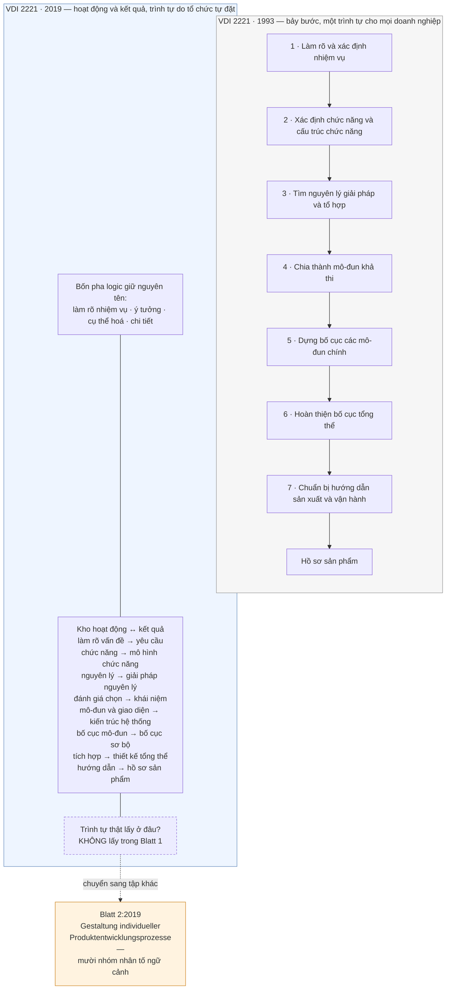

Mũi tên đứt nét là toàn bộ nội dung của chương. Ở bản 1993, câu hỏi *"làm việc gì trước, việc gì sau"* có
câu trả lời in sẵn trong tiêu chuẩn. Ở bản 2019, câu hỏi ấy bị đẩy ra khỏi tập mô hình và giao cho một tập
khác — một tập không trả lời thay, mà đưa cho tổ chức một bộ nhân tố để tự trả lời.

---

## Mười nhóm nhân tố ngữ cảnh — và năm nhóm mà corpus này không biết tên

Đây là mệnh đề định lượng chịu lực của chương, và nó có nguyên văn:

> `"VDI 2221-2 (2019) identifies a total of ten groups of contextual factors which are of particular
> importance for process design."`
> — nguồn `[12]`

Mười **nhóm** nhân tố, không phải mười nhân tố — cách đếm đó tự nó đã nói rằng bên trong mỗi nhóm còn có
nhiều thứ nữa. Và tài liệu thứ cấp chỉ đặt tên cho năm nhóm, vì bài báo đó chỉ dùng năm:

> `"Five of these ten factors are addressed in the proposed PRS model."`
> — nguồn `[12]`

Năm nhóm được đặt tên: **Customer** · **Supplier** · **Project management** · **Expectations of development
results** · **Development order**.

**Năm nhóm còn lại: không có trong nguồn.** Không phải "tôi chưa tìm ra", mà là vật liệu khai thác không
chứa tên chúng, và cuốn sách này không có toàn văn Blatt 2 để tra. Viết ra đây thay vì lặng lẽ bỏ qua, vì
ba lý do. Thứ nhất, luật của cuốn sách: con số nào không có nguyên văn thì không được xuất hiện, và tên
nào không có trong nguồn thì không được đoán. Thứ hai, một danh sách năm-trên-mười **nhìn** như một danh
sách đầy đủ nếu không ghi chú — đúng cơ chế đã suýt làm hỏng ba lần ở dự án anh em. Thứ ba, và quan trọng
nhất về mặt nội dung: **chỗ trống ấy là bằng chứng cho luận điểm của chương**. Cái mà một bài báo công
nghiệp thấy cần dùng lại là năm nhóm chạm trực tiếp vào quan hệ hợp đồng và tổ chức — khách hàng, nhà cung
cấp, quản lý dự án, kỳ vọng kết quả, đơn hàng phát triển. Không một nhóm nào trong năm nhóm được đặt tên
là nhân tố **kỹ thuật**.

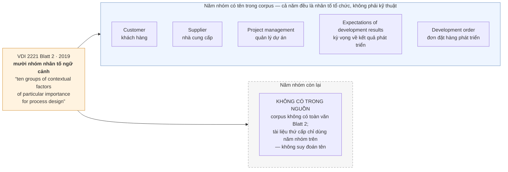

**Cơ chế thay thế, phát biểu gọn.** Bản 1993 nói: *đây là trình tự, hãy theo*. Bản 2019 nói: *đây là các
nhóm nhân tố quyết định trình tự nào đúng cho anh, hãy tự dựng lấy trình tự*. Đó là chuyển từ một mệnh
lệnh sang một hàm số — và tổ chức phải tự cung cấp tham số đầu vào.

Cần nói thêm cho công bằng với nguồn: **corpus này không có mô tả quy trình cắt may từng bước của Blatt 2**.
Tệp khai thác ghi rõ rằng khi truy vấn thu hẹp phạm vi, toàn bộ chi tiết tailoring của Blatt 2 là *không có
trong nguồn* vì tài liệu đó bị loại khỏi phạm vi. Cái chắc chắn có, và đủ để chương này đứng: sự tồn tại
của Blatt 2, tên đầy đủ của nó, mục đích của nó, và phép đếm mười nhóm. Cái không có: tên năm nhóm còn lại,
thủ tục áp dụng, và tiêu chí biết khi nào cắt may xong.

---

> **Đào sâu: năm ví dụ điển hình, hay là dấu vết của một cuộc thua**
>
> Trang mục lục của tiêu chuẩn cho một chi tiết dễ lướt qua:
>
> > `"the standard provides not only systematic instructions for action, but also an orientation aid in
> > the form of five representative case examples."`
> > — nguồn `[16]`
>
> Một tiêu chuẩn đóng gói kèm **năm ví dụ điển hình** làm *orientation aid* — trợ giúp định hướng. Từ ngữ
> ấy thừa nhận rằng chỉ dẫn hệ thống, tự nó, không đủ để người đọc biết mình đang ở đâu.
>
> Đặt cạnh chẩn đoán lịch sử của Jänsch và Birkhofer thì thấy một đường thẳng:
>
> > `"The instructions have changed from statements that can be immediately put into action or thought to
> > instruction on an abstract level, which need to be adapted to the current situation of the designer."`
> > — nguồn `[13]`
>
> Chỉ dẫn trôi lên mức trừu tượng, nên phải bù bằng ví dụ để kéo người đọc trở lại mặt đất. **Chương 04
> đã đo hiện tượng ấy bằng con số** — bản *Weißdruck* của VDI 2221 mỏng hơn bản của tiêu chuẩn nó thay
> thế, và một phần ba nội dung còn lại dành cho tích hợp CAD chứ không cho cách nghĩ `[13]`.
>
> Đặt hai thứ cạnh nhau thì năm ví dụ điển hình của Blatt 2 đọc ra khác hẳn: hướng dẫn đã ngắn đi và
> trừu tượng lên, phần cụ thể còn lại thì nói về công cụ. Ví dụ điển hình là câu trả lời cho tình trạng
> đó — và là dấu vết của cuộc thua trước đó.

---

## Ai nhượng bộ ai: đọc lại phả hệ 1954 → 2019

Nhượng bộ chỉ có nghĩa khi biết hai phe là ai. **Phả hệ đã dựng đầy đủ ở Chương 04** — Kesselring 1954,
Hansen 1965, VDI 2222 năm 1973, rồi loạt tiêu chuẩn VDI thập niên 1970, mỗi mốc kèm nguyên văn `[13]`
`[15]`. Ở đây chỉ cần hai mốc mới mà Chương 04 chưa dùng:

| Năm | Sự kiện | Nguyên văn |
|---|---|---|
| khoảng 1990 | Giới khoa học bắt đầu đưa đề xuất mới vào | `"Since about 1990, suggestions have been coming from the scientific field too."` `[15]` |
| 2019 | Blatt 1 và Blatt 2 cùng ban hành, tháng 11 | `"VDI 2221 Blatt 1: 2019-11 …"` / `"VDI 2221 Blatt 2: 2019-11 …"` `[12]` |

Và một câu của cùng bài báo lịch sử, câu mô tả **hướng đi** của cả dải — Chương 04 trích nó để nói về
việc thành tiêu chuẩn, ở đây nó phải đọc lại theo chiều ngược:

> `"The direction of the guidelines has changed from a personal support for individuals (Kesselring)
> towards a general procedure for a company addressing organization and content (VDI 2221)."`
> — nguồn `[13]`

Từ **hỗ trợ cá nhân** sang **thủ tục chung cho một công ty**. Điểm xuất phát năm 1954 là một người thiết
kế đang bí; điểm đến năm 1993 là một sơ đồ tổ chức. Bản 2019 không quay lại điểm xuất phát — nó không trả
lại các câu hỏi gợi mở cho cá nhân. Nó đi tiếp một nấc nữa theo cùng hướng: từ *thủ tục chung cho một công
ty* sang *thủ tục mà mỗi công ty tự dựng*. Đối tượng được phục vụ vẫn là tổ chức, không phải người thiết kế.

**Vậy ai nhượng bộ ai.** Phe quy định nhượng bộ phe phê bình đúng một điểm, và điểm ấy lớn: *không tồn tại
một trình tự đúng cho mọi tổ chức*. Hơn hai thập niên phê bình đòi đúng câu đó. Nhưng nhượng bộ dừng ngay ở đó.
Phe phê bình còn một luận điểm nữa, nặng hơn — rằng con người **không** thiết kế theo lối tuyến tính từ
trừu tượng xuống cụ thể, nên mọi mô hình quy định đều mô tả sai hoạt động thật. Bản 2019 không đụng vào
luận điểm đó. Nó giữ nguyên bốn pha, giữ nguyên tên các hoạt động, giữ nguyên chuỗi kết quả từ *requirements*
tới *product documentation*. Nó chỉ tháo cái khớp nối cứng giữa chúng.

Bên phê bình ghi nhận đúng mức độ ấy, và câu ghi nhận cũng nên đọc kỹ:

> `"Some of these shortcomings have been addressed during the revision of the VDI 2221-1 (2019) guideline
> incorporating much of the research on design processes conducted over the last decades."`
> — nguồn `[12]`

`"Some of these shortcomings"` — **một số**. Đây là đánh giá của hai tác giả `[12]` — hai người trong công
nghiệp, tiểu sử của họ được nêu ở mục sau — trong một bài báo
bình duyệt, không phải phát biểu của VDI. Bản thân từ *some* là phần thông tin: người trong ngành ghi nhận
tiến bộ mà không ghi nhận là đã xong. Trích câu này mà bỏ chữ *some* là biến một lời khen dè dặt thành một
chứng nhận, và đó là kiểu xuyên tạc không cần sai một chữ nào.

---

## Chỗ nhượng bộ không chạm tới

Ba khiếm khuyết mà bản 2019 để nguyên. Cả ba đều có nguyên văn trong corpus, và cả ba sẽ trở lại ở Phần IV.

**Một — quyết định lớn nhất vẫn ra ở lúc biết ít nhất.** Vielhaber mô tả chỗ này bằng một câu không thể
tránh:

> `"...it gets obvious that the main decision point when selecting the solution principle is based on
> partial knowledge, only. All knowledge gained afterwards through detailing, prototyping or realization
> (hatched area in the diagram) is either lost for this respective decision or may lead to revisiting that
> decision, later on."`
> — nguồn `[10]`

Tháo thứ tự bắt buộc không sửa được điều này. Dù tổ chức tự dựng trình tự riêng, điểm chọn nguyên lý giải
pháp vẫn nằm trước khi có tri thức từ chi tiết hoá và chế thử. Cắt may quy trình không tạo ra tri thức
sớm hơn.

**Hai — danh sách yêu cầu vẫn được đọc như một việc làm xong.** Chương 04 trích trọn câu của `[12]` về
chế độ hỏng này: các mô hình tạo ấn tượng rằng lập xong danh sách yêu cầu là xong việc, *dù chúng thường
có dặn phải liên tục soát lại*. Điều đáng ghi ở đây là bản 2019 **giữ nguyên hình dạng đó**: *Requirements*
vẫn là kết quả đứng đầu bảng, và hình dạng của mô hình dạy mạnh hơn lời dặn trong mô hình.

**Ba — cách tài liệu nhập vào công việc thật vẫn bỏ trống.** Cũng đã trích ở Chương 04: các tiêu chuẩn mô
tả nội dung và cách sinh ra tài liệu yêu cầu nhưng không mô tả cách tích hợp chúng vào quá trình phát
triển `[12]`; và ở điểm bàn giao ra ngoài phòng thiết kế — nhất là khi giao cho nhà cung cấp — chỉ phần
tài liệu tối thiểu bắt buộc đi qua được `[10]`. Bản 2019 không chạm tới cả hai chỗ này.

Ba khiếm khuyết này có một điểm chung: **không cái nào là khiếm khuyết của trình tự**. Chúng là khiếm
khuyết ở chỗ phương pháp chạm vào tổ chức — thời điểm ra quyết định, cách tài liệu được đối xử, cái gì đi
qua được ranh giới đơn vị. Bản 2019 sửa trình tự. Ba chỗ này nằm ngoài tầm với của việc sửa trình tự.

---

## Phương pháp này giả định một tổ chức như thế nào

Bản 1993 giả định một tổ chức **có kỷ luật theo trình tự**: đủ người, đủ thời gian, đủ quyền lực quản lý
để chạy bảy bước theo đúng thứ tự in ra, kể cả khi áp lực giao hàng nói ngược lại. Đó là canh bạc mà
Chương 04 đã mổ.

Bản 2019 tháo canh bạc đó ra và đặt vào một canh bạc khác, và canh bạc mới **nặng hơn** ở đúng chỗ ít ai
nhìn. Nó giả định một tổ chức **tự biết bối cảnh của mình**. Muốn dùng được Blatt 2, tổ chức phải trả lời
đúng về mười nhóm nhân tố ngữ cảnh của chính nó: quan hệ với khách hàng thật sự là gì, nhà cung cấp nắm
những gì, quản lý dự án đang vận hành theo cơ chế nào, kỳ vọng về kết quả phát triển được ai đặt ra và có
được viết xuống không, đơn đặt hàng phát triển thật sự ràng buộc điều gì.

Đây không phải một bài kiểm tra dễ hơn bài cũ. Nó là một bài kiểm tra **khác loại**.

| | **Bản 1993** | **Bản 2019** |
|---|---|---|
| Đòi tổ chức điều gì | Tuân thủ một trình tự đã in | Mô tả đúng bối cảnh của chính mình |
| Sai thì lộ ra khi nào | Sớm — ai cũng thấy bước bị bỏ | Muộn — quy trình vẫn chạy, chỉ là chạy trên mô tả sai |
| Ai chịu trách nhiệm khi hỏng | Người không theo quy trình | *Không ai được chỉ định* |

*Dòng thứ ba là suy luận của tôi, không phải của nguồn:* corpus không có mô tả cơ chế trách nhiệm nào cho
Blatt 2 — không có câu nào nói ai ký duyệt một quy trình đã cắt may, hay ai trả lời khi nó sai. Chỗ trống
ấy có thể là chỗ trống của corpus chứ không của tiêu chuẩn; nhưng khi một quy trình do chính đơn vị dựng
ra thì câu hỏi *ai chịu trách nhiệm* đổi bản chất, và không tài liệu nào trong 66 tài liệu trả lời.
| Có tiêu chí biết mình đúng không | Có — đối chiếu với bảy bước | **Không có trong nguồn** cho corpus này |

Dòng thứ hai là dòng đắt nhất. Không theo được bảy bước thì tổ chức biết ngay, vì có một chuẩn ngoài để
đối chiếu.

Một ca ở mức loại tình huống, để luận điểm này không đứng bằng lập luận thuần. Một đơn vị làm hàng loạt
nhỏ, biến thể nhiều, khách hàng cũ — nhưng tự chấm mình vào ô *phát triển sản phẩm mới* khi điền bộ nhân
tố ngữ cảnh, vì đó là ô nghe đúng với cách đơn vị muốn được nhìn nhận. Quy trình cắt may ra từ ô ấy sẽ đòi
một pha ý tưởng đầy đủ cho từng biến thể, và đơn vị sẽ bỏ pha ấy ở **mọi** dự án vì nó vô lý với công việc
thật. Sau một năm, hồ sơ cho thấy một quy trình được ban hành và không bao giờ chạy — đúng mẫu hình của
Chương 01, nhưng lần này sinh ra từ một bản tự chẩn đoán sai chứ không từ một tiêu chuẩn áp từ ngoài. Không
có bước nào bị bỏ để mà đếm; cái sai nằm ở ô đã tick từ đầu.

Còn tự mô tả sai bối cảnh của mình thì không có gì báo động: quy trình cắt may xong vẫn trông
hợp lý, vẫn có tài liệu, vẫn có người ký. Nó chỉ hỏng ở chỗ nó bỏ qua một nhân tố mà tổ chức không nhìn
thấy vì tổ chức chưa bao giờ nhìn thấy nhân tố đó. **Cắt may quy trình theo một bản tự chẩn đoán sai thì
cho ra một quy trình sai một cách có hệ thống, và trông chính đáng hơn hẳn quy trình cứng bị bỏ bước.**

Có một lý do cụ thể để nghi ngờ năng lực tự chẩn đoán ấy, và nó nằm ngay trong danh sách năm nhóm được đặt
tên. Cả năm — khách hàng, nhà cung cấp, quản lý dự án, kỳ vọng kết quả, đơn hàng phát triển — đều là những
thứ **không thuộc quyền của phòng thiết kế**. Người được giao đọc tiêu chuẩn thiết kế thường là kỹ sư
trưởng. Người biết thật về đơn hàng phát triển và kỳ vọng kết quả thường ngồi ở chỗ khác trong tổ chức, và
thường không đọc VDI 2221. Bản 2019 giao một bài tập cho một vai, mà dữ liệu để làm bài lại nằm trong tay
những vai khác. *Đây là suy luận của tôi từ danh sách năm nhóm, không phải phát biểu của nguồn nào.*

Bằng chứng gián tiếp cho việc bài tập này khó: chính bài báo dùng mười nhóm ấy chỉ tích hợp được **năm**
— `"Five of these ten factors are addressed in the proposed PRS model."` Đó là hai tác giả với hai mươi mốt
năm phát triển xe hơi và mười hai năm ngành đường sắt sau lưng —
`"Before joining the Technische Universität Berlin, the first author worked in the passenger car development
of Mercedes-Benz and Smart vehicles for 21 years."` và `"Before joining the Ruhr Universität Bochum, the
second author worked in the rail industry with Bombardier Transportation for 12 years in an international
context."` `[12]` Nếu họ chỉ đưa được một nửa số nhóm vào một mô hình quy trình, thì con số mà một tổ chức
vài chục người đưa vào được là bao nhiêu — *câu này tôi đặt ra, nguồn không trả lời.*

Đó cũng là lý do vì sao chương này không dừng ở chỗ câu chuyện đang hay. Bản 2019 là một cải tiến thật, đo
được, và nó sửa đúng cái mà phê bình đã đòi suốt quãng ấy. Nhưng cải tiến ấy chuyển gánh nặng chứ không gỡ
gánh nặng: từ *anh có theo nổi quy trình của chúng tôi không* sang *anh có biết anh là ai không*. Cả hai đều
là canh bạc đặt vào tổ chức. Cái sau chỉ khó bắt quả tang hơn.

> **Câu hỏi mang sang Phần IV:** nhượng bộ này có làm phương pháp sống được trong tổ chức thật không? Muốn
> trả lời thì phải rời khỏi lịch sử tiêu chuẩn và hỏi một câu khác hẳn: người ta có thật sự thiết kế theo
> lối mà cả bản 1993 lẫn bản 2019 mô tả không? Chương 12 mở đúng cuộc tranh luận mà chương này là kết quả
> — tuyến quy định đối đầu tuyến mô tả — và ở đó, việc tháo thứ tự bắt buộc sẽ hiện ra như một bước lùi
> chưa đủ xa.

---

## Áp dụng ở Xưởng

Bối cảnh giả định cho cả năm mục: một xưởng cơ khí — điện tử — phần mềm nhúng, quy mô vài chục người, làm
sản phẩm kỹ thuật theo dự án, có cả việc thiết kế mới lẫn việc làm biến thể từ nền cũ.

### 1. **Bản tự khai bối cảnh** — một buổi 90 phút, làm được trong tuần tới

Ngồi xuống với năm nhóm nhân tố có tên trong nguồn — khách hàng, nhà cung cấp, quản lý dự án, kỳ vọng về
kết quả phát triển, đơn đặt hàng phát triển — và viết một trang duy nhất trả lời cho **một** dự án đang
chạy: với dự án này, mỗi nhóm nhân tố đang ở trạng thái nào, và ai trong xưởng là người **biết thật** về
nhóm đó. Quyết định cụ thể phải ra ở cuối buổi: nhóm nào không có người biết thật thì mở một việc đi hỏi,
có tên người và có hạn.

Đây là phần rẻ nhất và có đòn bẩy cao nhất của cả Blatt 2, và nó không cần mua tiêu chuẩn để làm. Cái đắt
không phải bộ nhân tố — cái đắt là thói quen viết bối cảnh xuống trước khi chọn quy trình.

Trang này chỉ có giá trị khi nó **ngắn và bị phản bác được**. Một trang, mỗi nhóm hai đến ba dòng, có tên
người chịu trách nhiệm câu trả lời. Đưa cho một người ngoài phòng thiết kế đọc — nếu họ không cãi được câu
nào thì gần như chắc chắn nó đang viết bằng ngôn ngữ tổng quát đến mức không sai được, và một bản tự chẩn
đoán không thể sai là một bản tự chẩn đoán vô dụng.

### 2. **Tách bảng quy trình khỏi bảng bối cảnh**

- **Vấn đề nó giải:** khi quy trình chuẩn và ngoại lệ nằm chung một tài liệu, mọi lần cắt bước đều trông
  như vi phạm, nên người ta cắt lặng lẽ và không ai ghi lại lý do.
- **Cách áp:** làm đúng động tác mà VDI đã làm năm 2019 — một tài liệu mô tả các hoạt động và kết quả cần
  có, một tài liệu riêng ghi bối cảnh nào thì bỏ hoạt động nào. Cắt bước theo tài liệu thứ hai là hành vi
  hợp lệ, có ghi vết; cắt bước không viện dẫn tài liệu thứ hai thì không.
- **Bẫy:** tài liệu thứ hai biến thành nơi hợp thức hoá mọi lần cắt sau khi đã cắt. Chốt chặn duy nhất
  hoạt động được: bối cảnh phải viết **trước** khi dự án bắt đầu, không viết vào lúc rà soát.

### 3. **Đặt tên hoạt động theo kết quả, không theo số thứ tự**

- **Vấn đề nó giải:** gọi "bước 3" thì cả xưởng ngầm hiểu là phải xong bước 2, kể cả khi bước 2 đang chờ
  một câu trả lời từ khách hàng và bước 3 chạy được ngay.
- **Cách áp:** mỗi hoạt động mang tên kết quả mà nó đẻ ra — *mô hình chức năng*, *giải pháp nguyên lý*,
  *kiến trúc hệ thống*, *bố cục sơ bộ*. Bảng theo dõi dự án liệt kê **kết quả đã có** và **kết quả còn
  thiếu**, không liệt kê bước đã qua. Đây chính là hình dạng mà bản 2019 chuyển sang.
- **Bẫy:** bỏ số thứ tự mà không thay bằng ràng buộc phụ thuộc thì sẽ có người bắt đầu bố cục khi chưa có
  giải pháp nguyên lý. Phải ghi rõ kết quả nào là đầu vào bắt buộc của kết quả nào — tháo **thứ tự**, giữ
  **phụ thuộc**.

### 4. **Một hồ sơ riêng cho phương án bị loại**

- **Vấn đề nó giải:** tri thức rời khỏi tổ chức đúng lúc dày nhất — `"Many ideas get evaluated and
  discarded, tests are done, requirements are traded off and sketches discussed. If not intentionally and
  systematically kept, this may lead to a huge knowledge loss for the design department."` `[10]`
- **Cách áp:** mỗi lần chọn phương án, ghi nửa trang cho phương án **bị loại**: nó là gì, bị loại vì tiêu
  chí nào, và điều kiện nào thay đổi thì nên xét lại. Nửa trang đó nằm cùng chỗ với bản chọn, không nằm
  trong thư mục cá nhân của người thiết kế.
- **Bẫy:** viết lý do loại bằng ngôn ngữ kết luận — "không khả thi", "không kinh tế". Lý do loại phải nêu
  **ngưỡng** đã dùng, vì ngưỡng là thứ có thể đổi; kết luận thì không.

### 5. **Điểm bàn giao ra ngoài phòng thiết kế được coi là một mặt tiếp giáp, không phải một mốc**

- **Vấn đề nó giải:** chỗ mất tri thức nặng nhất là chỗ dự án rời phòng thiết kế —
  `"only the minimum of documentation directly required may be transferred."` `[10]` Bộ hồ sơ đúng chuẩn
  vẫn có thể đi qua mà không mang theo lý do đằng sau nó.
- **Cách áp:** ở mỗi lần bàn giao ra xưởng chế tạo hoặc ra nhà cung cấp, kèm một trang trả lời ba câu:
  ba quyết định nào không được đổi và vì sao; ba chỗ nào có thể đổi nếu chế tạo khó; ai là người trả lời
  khi có mâu thuẫn. Trang này đi cùng hồ sơ, không thay hồ sơ.
- **Bẫy:** biến trang đó thành biểu mẫu ký cho đủ. Dấu hiệu nó đã chết: ba câu trả lời giống hệt nhau qua
  nhiều dự án khác nhau. Khi đó nên bỏ hẳn, vì một biểu mẫu chết còn tệ hơn không có, nó tạo cảm giác chỗ
  ấy đã được canh.


# Chương 06 — VDI 2206: khi hệ thống thành liên ngành

Một phương pháp thiết kế cơ khí giả định rằng sản phẩm phân rã sạch. Chia máy thành cụm, chia cụm thành
chi tiết, giao mỗi mảnh cho một người, ráp lại thì được máy. Giả định đó đứng vững chừng nào mọi mảnh còn
làm bằng cùng một thứ vật liệu tư duy. Khi trong cùng một sản phẩm có một cụm cơ khí, một bo mạch và một
khối phần mềm nhúng, nó gãy — không phải vì các mảnh khó, mà vì chúng **không cắt theo cùng một đường**.
Chức năng nằm ở phần mềm, hỏng ở cơ khí, và biểu hiện ra ở mạch. Không có sơ đồ phân rã nào của phe cơ khí
chứa nổi một đối tượng như thế. Thiếu câu trả lời cho tình huống này, tổ chức làm cái nó luôn làm: mỗi miền
chạy riêng theo phương pháp của mình, và toàn bộ độ phức tạp liên ngành bị đẩy dồn về khâu cuối cùng, nơi
nó xuất hiện dưới cái tên khiêm tốn là "lỗi tích hợp".

Chương 05 kể lại một cuộc nhượng bộ: chính cơ quan tiêu chuẩn Đức, sau hai mươi sáu năm, tách VDI 2221 làm
đôi và thay khung bảy bước bắt buộc bằng mười nhóm nhân tố ngữ cảnh để người dùng tự cắt may. Đó là câu trả
lời cho một loại áp lực — quy trình quá cứng so với nguồn lực của tổ chức thật. Chương này kể câu trả lời cho
một loại áp lực khác hẳn, và đến sớm hơn: không phải quy trình quá cứng, mà **đối tượng thiết kế đã đổi
bản chất**. VDI 2221 nới lỏng dọc theo một trục sẵn có. VDI 2206 phải dựng một trục thứ hai.

Ba thứ lấy được từ chương này. Thứ nhất, cấu trúc hai nhánh đối xứng của chữ V bản 2004, và chính xác nó
mua được cái gì mà một danh sách bước tuyến tính không mua được. Thứ hai, quan hệ macro-cycle và
micro-cycle — khung lớn chạy một lần, chu trình nhỏ lặp bên trong từng ô — và một phát hiện khi đặt chu
trình nhỏ ấy cạnh chuỗi giải quyết vấn đề tổng quát của Pahl-Beitz ở Chương 03. Thứ ba, canh bạc mà bản
2004 đặt cược: rằng kỹ sư của ba miền nói chung một ngôn ngữ mô hình hoá. Nguồn trong tay cho biết khá rõ
canh bạc đó thua ở đâu.

**Một ràng buộc chứng cứ phải nói trước.** Corpus của cuốn sách này không có toàn văn tiêu chuẩn VDI nào —
đã khai báo ở Chương 01. Mọi khẳng định dưới đây về *nội dung* VDI 2206 đi qua tài liệu thứ cấp: bài báo
bình duyệt, chương sách, mục lục tiêu chuẩn, tài liệu giảng dạy. Khi hai tài liệu thứ cấp nói khác nhau,
chương này ghi cả hai thay vì chọn một.

---

## Ba miền, ba nhịp đồng hồ

Thuật ngữ *mechatronics* không sinh ra trong một viện nghiên cứu thiết kế. Nó sinh ra trong một công ty
điện tử: `"In 1969, the Japanese president of YASKAWA Electronic Corporation, Ko Kikuchi, introduced the
term “mechatronics”"` [23]. Từ 1969 đến 2004 — ba mươi lăm năm — mới có một tiêu chuẩn thiết kế mang tên
nó. Khoảng cách ấy là khoảng thời gian ngành thiết kế cần để thừa nhận rằng một sản phẩm gồm ba miền
không phải là ba sản phẩm đặt cạnh nhau.

Vì sao phương pháp cơ khí thuần không mở rộng được, có thể nói gọn trong hai mệnh đề.

**Ba miền tiến hoá với nhịp khác nhau.** Một chi tiết cơ khí, khi đã cắt gọt xong, thay đổi với chi phí
gần như cấm đoán. Một bo mạch thay đổi được, với chi phí một vòng chế bản. Một khối phần mềm thay đổi
trong buổi chiều. Đặt ba thứ có nhịp thay đổi lệch nhau hàng bậc độ lớn vào cùng một kế hoạch tuyến tính
thì bao giờ cũng có một miền phải đứng đợi, và bao giờ cũng có một miền bị dùng làm chỗ hấp thụ mọi sai
lệch của hai miền kia — trong thực tế, luôn là phần mềm.

**Ba miền không phân rã sạch theo miền.** Đây mới là mệnh đề nặng hơn. Phân rã cơ khí là phân rã theo
không gian: cụm này ở đây, cụm kia ở kia. Phân rã phần mềm là phân rã theo trách nhiệm logic, không có
toạ độ. Một chức năng cơ điện tử bất kỳ — giữ vị trí, bù nhiệt, chống rung — chạy xuyên qua cả ba miền
và **không thuộc miền nào**. Cắt theo miền là cắt ngang giữa thân một chức năng.

Hệ quả trực tiếp: khi ba miền cắt theo ba đường khác nhau, thứ quyết định sản phẩm chạy hay không chạy
không nằm trong bất kỳ miền nào, mà nằm ở **mặt cắt giữa chúng**. Và mặt cắt thì không có chủ.

Chính nguồn thừa nhận rằng tình trạng này đè lên người kỹ sư chứ không được tiêu chuẩn gỡ hộ:

> `"Inspite of the wide spectrum of research activities and industrial developments in the mechatronic
> field it seems to be difficult for the design engineer in practice - in particular for the still
> unexperienced one - to select the suitable procedures, methods and tools for his design task."` [26]

Câu này đáng đọc kỹ, vì nó không nói phương pháp thiếu. Nó nói phương pháp **thừa** — thừa đến mức việc
chọn trở thành bài toán riêng, và bài toán ấy rơi xuống đầu người ít kinh nghiệm nhất. Đó là mô tả một
tổ chức, không phải mô tả một kỹ thuật.

| | Cơ khí | Điện — điện tử | Phần mềm nhúng |
|---|---|---|---|
| Vật mang thiết kế | hình học, dung sai | sơ đồ mạch, bố trí bản in | mã nguồn, cấu hình |
| Nhịp đổi một vòng | dài nhất | trung gian | ngắn nhất |
| Trục phân rã | không gian | mạng liên kết | trách nhiệm logic |
| Sai lệch biểu hiện ở đâu | ngay tại chỗ | thường ở nơi khác | thường ở miền khác |

> Bảng trên là **thao tác đối chiếu của cuốn sách này**, dựng từ mô tả định tính về ba miền trong nguồn
> [24] và [25], không phải bảng có sẵn trong tài liệu nào. Không có con số trong bảng vì nguồn không cho
> con số nào về nhịp thay đổi của ba miền — theo LUẬT 1, chỗ nào không có nguyên văn thì để trống, không
> điền ước lượng vào.

Nói cách khác: bài toán mà VDI 2206 nhận không phải "làm sao thiết kế cho tốt hơn". Là **làm sao đặt được
một trục điều phối lên trên ba miền vốn không chia sẻ trục nào**.

---

## Chữ V bản 2004 trả lời thế nào

Câu trả lời năm 2004 không phải là thêm bước. Là **gập danh sách bước lại làm đôi**, cho nửa sau đối diện
nửa trước.

Bản đầu tiên ra đời năm 2004: `"The first release of the VDI Guideline 2206 “Design methodology for
mechatronic systems” of the German Association of Engineers (VDI), was published in 2004."` [23] — một
nguồn thứ hai xác nhận cùng mốc: `"For this purpose, the standard VDI 2206 was published in 2004."` [21].

Hình chữ V không do VDI phát minh; nó nhập từ ngành phần mềm. Và ở đây corpus tự mâu thuẫn về niên đại,
nên phải ghi cả hai:

> `"The V-shaped model is a well-established design process, first introduced by Brohle and Droschl in
> 1993 for software engineering..."` [26]

> `"The original idea of a V-Model for engineering processes was created 1995 by Bröhl and Dröschel in
> the application field of Software Development"` [23]

Cùng hai cái tên, hai năm khác nhau, hai tài liệu thứ cấp bình duyệt. Chương này không phân xử được, và
cũng không cần: điều đáng giữ là **chữ V đến từ phần mềm trước khi đến với cơ điện tử**. Miền có nhịp
nhanh nhất là miền đầu tiên phải nghĩ ra cách gắn kiểm chứng vào từng mức phân rã, vì nó là miền đầu tiên
mà "ráp xong rồi thử" trở nên vô nghĩa.

Bản 2004 chia quá trình phát triển thành bốn pha:

> `"Elle divise le processus de conception en quatre phases majeures appelées « system design »,
> « domain-specific design », « system integration » and « assurance of properties », Figure 1.14
> (Bathelt et al., 2005)."` [20]

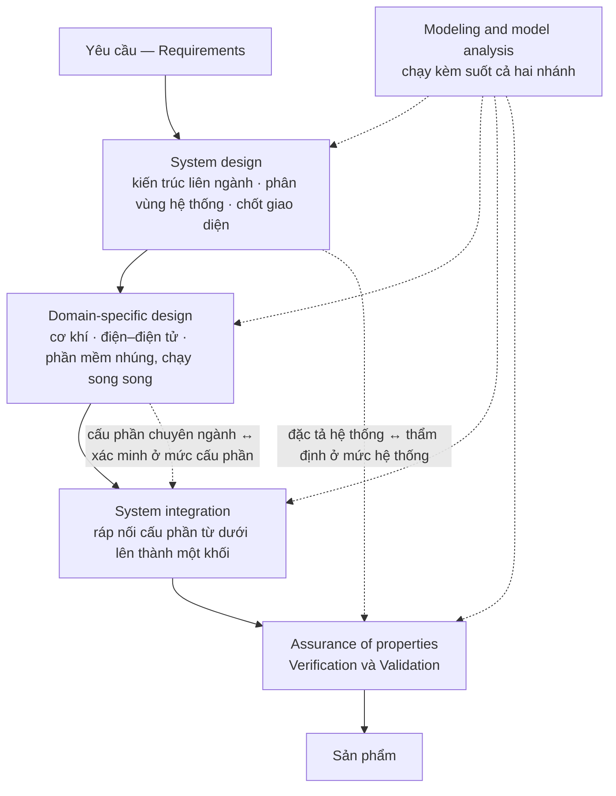

Hai mũi tên nét đứt nằm ngang là toàn bộ ý tưởng. Nhánh trái đi xuống là **phân rã**; nhánh phải đi lên là
**tích hợp**; và mỗi mức phân rã bên trái được **ghép cặp trước** với mức kiểm chứng đối diện bên phải.
Ghép cặp trước, nghĩa là lúc viết đặc tả hệ thống thì đã phải viết luôn cách sẽ chứng minh hệ thống đạt
đặc tả ấy. Đó là điều một danh sách bước tuyến tính không làm được: trong danh sách tuyến tính, kiểm chứng
là bước cuối, và bước cuối bao giờ cũng là bước bị cắt khi hết thời gian.

Hai câu hỏi ở đáy nhánh phải được nguồn giảng dạy phát biểu gọn đến mức nên trích thẳng:

> Xác minh — `"Is a correct product being developed?"`
> Thẩm định — `"Is the right product being developed?"` [24]

Một chữ khác nhau, *a* và *the*, và đó là ranh giới giữa "làm đúng cách" với "làm đúng thứ". Một sản phẩm
qua được vế đầu mà trượt vế sau là một sản phẩm được chế tạo hoàn hảo cho một bài toán không ai có.

Còn ô `Modeling and model analysis` không phải một pha, mà là một hoạt động chạy kèm — dùng để
`"predict how a system will behave before it is built"` [24]. Vai trò của nó trong bản 2004 là làm cho
nhánh phải khởi động **trước khi có vật thể**. Đây là hạt giống của toàn bộ tuyến MBSE mà Chương 07 sẽ kể,
và cũng là chỗ bản 2004 gieo một giả định mà lúc gieo chưa ai gọi tên: rằng mô hình đủ tin để thay vật.

Cần ghi thêm rằng bản 2004 không phải cách duy nhất chia việc, kể cả trong chính corpus này. Một tài liệu
mô tả quy trình cơ điện tử theo ba pha khác hẳn: `"The mechatronic design process consists of three
phases: modeling and simulation, prototyping, and deployment."` [25]. Cùng một đối tượng, hai cách cắt.
Điều đó nhắc rằng bốn pha của bản 2004 là **một lựa chọn**, không phải một sự thật của tự nhiên — và
Chương 07 sẽ cho thấy chính VDI về sau bỏ cách cắt này.

### Điều bản thân tài liệu nói về hình vẽ của mình

Trước khi ai kịp phê bình chữ V là tuyến tính, tài liệu trong corpus đã tự ghi điều đó:

> `"It is important to note that this representation shows only one flow through the ''V'' shaped process,
> which does not represent the iterative nature of real development cycles."` [19]

Đây là ca giống hệt ca mười lăm bước cụ thể hoá ở Chương 03: văn bản vẽ ra một dòng chảy, tự nói rằng
dòng chảy ấy không mô tả đúng thực tế lặp, rồi người đọc vẫn đọc thành lịch trình. **Chế độ hỏng không nằm
ở tài liệu. Nằm ở đường từ tài liệu sang tổ chức.** Một tổ chức cần một hình để dán lên tường họp; hình
được dán là hình một chiều; lời cảnh báo đi kèm thì không dán được lên tường.

---

## Macro-cycle và micro-cycle

Chữ V trong đoạn trên là **macro-cycle**: khung toàn cục, chạy cho cả sản phẩm, từ yêu cầu đến bàn giao.
Nhưng khung ấy không nói người kỹ sư làm gì trong một ngày làm việc. Bên trong mỗi ô của chữ V còn một
vòng nhỏ hơn, lặp: **micro-cycle** — chu trình giải quyết vấn đề hình thức, áp cho bất kỳ bài toán con
nào, ở bất kỳ ô nào.

Đây là chỗ phải dừng lại vì một lý do chứng cứ.

> **LUẬT 1 áp ở đây.** Bảng thuật ngữ của chính cuốn sách này ghi micro-cycle là "chu trình giải quyết
> vấn đề **5 bước**". Vật liệu khai thác **không đỡ nổi con số đó**. Nguyên văn ghi trong tệp khám phá:
> *"Số bước cụ thể của chu trình vi mô: **không có trong nguồn**"* — tài liệu chỉ gọi tên nó là
> `"general micro level general problem-solving iteration"` và `"general problem-solving cycle as a
> micro-cycle"`, không liệt kê số bước bằng số ở bất kỳ chỗ nào trong văn bản trích xuất. Vậy nên chương
> này **bỏ con số 5**. Không viết "khoảng năm bước", không viết "nhiều bước". Cái có trong nguồn là *có
> một chu trình giải quyết vấn đề hình thức lặp ở tầng vi mô*; cái không có trong nguồn là *nó gồm mấy
> bước*. Ghi đúng như vậy.

Cái mà nguồn **có** cho, và cho khá chắc, là lý do micro-cycle phải tồn tại. Nó đến từ một danh sách bốn
nguyên lý mà bất kỳ mô hình quy trình nào cũng phải chứa:

> `"Haberfellner et al. identified four essential basic ideas each procedure model should include. These
> principles are: (1) starting from the rough and going to the details (2) consideration of alternative
> solutions (3) divide the process into chronological steps (4) use a formal guideline (problem-solving
> cycle)"` [22]

Bốn nguyên lý này là bộ khung để đọc mọi thứ trong Phần II của cuốn sách. Ba nguyên lý đầu là chuyện của
**macro**: đi từ thô đến tinh, luôn giữ nhiều phương án, chia thành các bước có thứ tự thời gian. Nguyên
lý thứ tư là chuyện của **micro**, và nó được gọi thẳng ra bằng tên: *problem-solving cycle*.

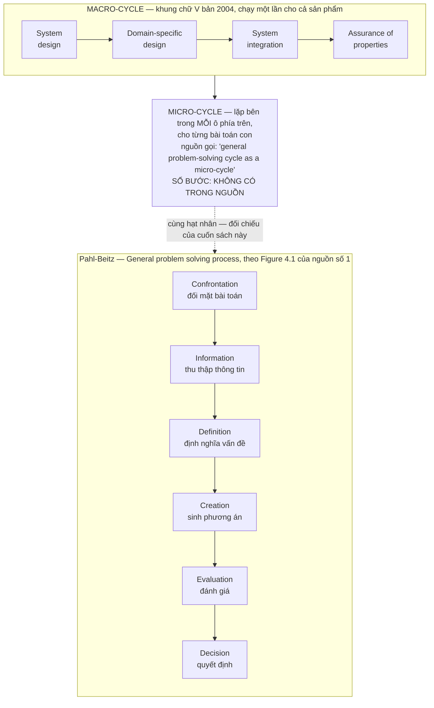

Quan hệ lồng nhau này giải thích một nghịch lý mà người đọc tiêu chuẩn hay vấp: vì sao một khung trông
tuyến tính lại được tác giả của nó gọi là lặp. Vì cái lặp không nằm ở tầng macro. **Macro chạy một lần;
micro chạy hàng trăm lần bên trong.** Hình vẽ chỉ vẽ được tầng macro, nên hình vẽ trông tuyến tính — và
lời cảnh báo `"does not represent the iterative nature"` ở mục trước chính là câu tài liệu nói về khoảng
cách giữa hai tầng ấy.

---

## Hạt nhân dùng chung: từ 1977 đến 2004, cùng một lõi

Đặt micro-cycle của VDI 2206 cạnh chuỗi giải quyết vấn đề tổng quát của Pahl-Beitz ở Chương 03 thì thấy
một điều đáng khai thác: **hai văn bản, hai trường phái, một bản ra năm 1977 và một bản ra năm 2004,
cùng đặt một hạt nhân giống nhau vào đúng cùng một vị trí trong kiến trúc phương pháp của mình.**

Phải nói ngay rằng đối chiếu này là **thao tác của cuốn sách này**. Không tài liệu nào trong corpus đặt
hai thứ cạnh nhau; đây là việc chương này làm, không phải phát hiện chương này trích lại.

| | **Pahl-Beitz** — General problem solving process | **VDI 2206:2004** — micro-cycle / problem-solving cycle |
|---|---|---|
| Vị trí trong kiến trúc | hạt nhân lặp bên trong cả bốn pha thiết kế | hạt nhân lặp bên trong mỗi ô của macro-cycle |
| Vai trò được giao | đưa một bài toán con bất kỳ từ mù mờ đến một quyết định | như trên — nguyên lý thứ tư của Haberfellner: `"use a formal guideline (problem-solving cycle)"` [22] |
| Các bước có tên trong nguồn | Confrontation · Information · Definition · Creation · Evaluation · Decision (Figure 4.1, [1]) | **không có** — nguồn chỉ gọi tên chu trình, không liệt kê bước |
| Số bước có nguyên văn không | **KHÔNG.** Sách vẽ Figure 4.1 và mô tả nội dung nhưng **không có câu văn nào đếm số bước** — nên chỗ kiểm chứng được là tên và thứ tự các bước, chỗ không kiểm chứng được là phép đếm | **KHÔNG.** Tệp khám phá ghi thẳng *"không có trong nguồn"* — kiểm chứng được sự tồn tại và vị trí của chu trình, không kiểm chứng được phép đếm lẫn danh sách bước |

Bảng này nhìn có vẻ nghèo hơn bảng mà người ta hay thấy trong sách giáo trình — nơi cột trái ghi "6 bước"
và cột phải ghi "5 bước" và hai con số được so sánh trang trọng. Bảng nghèo hơn vì nó chỉ chứa những gì
nguồn thật sự nói. Và chính chỗ nghèo đi ấy là chỗ có nội dung:

**Cả hai tiêu chuẩn đều không tự đếm bước của hạt nhân mình.** Cả hai đều vẽ nó ra thành hình, đặt tên
từng ô, rồi để người đọc tự cộng. Con số "sáu bước Pahl-Beitz" và con số "năm bước micro-cycle" đều là
sản phẩm của người đọc, được lưu truyền lại thành thứ trông như trích dẫn. Chương 03 đã gặp đúng hiện
tượng này ở danh sách mười lăm bước cụ thể hoá, nơi bản gốc còn viết hẳn một câu phủ nhận rằng đó là một
kế hoạch, ngay trước danh sách `[1]`. Ba lần cùng một lớp bẫy, trong ba chỗ khác nhau của cùng một phả hệ.

Có thể rút ra một quy tắc đọc, và nó đắt hơn bảng đối chiếu ở trên: **khi một phương pháp được lưu truyền
bằng con số bước, con số ấy gần như luôn do người truyền thêm vào.** Cái tác giả viết ra là một hình vẽ
và một danh sách; cái đến tay tổ chức là một con số. Con số dễ nhớ, dễ dạy, dễ đưa vào quy trình nội bộ,
dễ biến thành ô đánh dấu — và trong quá trình ấy, tính chất *gợi ý* của bản gốc bị mất sạch, chỉ còn lại
tính chất *bắt buộc* mà bản gốc không hề đòi.

Còn phần đứng vững của phát hiện thì đứng khá vững: **hạt nhân là bất biến, giàn giáo pha mới là biến.**
Pahl-Beitz dựng bốn pha quanh hạt nhân ấy. VDI 2221 dựng bảy bước. VDI 2206 gập nó thành hai nhánh đối
xứng. Ba giàn giáo khác nhau cho ba bài toán khác nhau, và không giàn giáo nào động vào cái lõi. Ai đã
làm chủ cái lõi thì đổi giàn giáo là chuyện cấu hình lại, không phải học lại nghề.

> **Đào sâu: chữ V không phải một hình, mà là sáu**
>
> Điều làm cho chữ V dễ nói chuyện qua nhau: nó không có một cách đọc. Một nghiên cứu hệ thống hoá trong
> corpus đã phải dựng bộ tiêu chí để phân biệt các bản đọc khác nhau của cùng một hình:
>
> `"For comparison of the six different interpretations of the V-model, eleven characteristic properties
> were identified to analyse the differences."` [18]
>
> Sáu cách hiểu, mười một đặc tính để phân biệt — cả hai con số đều có nguyên văn. Danh sách sáu cách hiểu
> và mười một đặc tính ấy gồm những gì thì **không có trong vật liệu khai thác**, nên chương này không
> liệt kê ra.
>
> Điều đáng lấy không phải danh sách, mà là hệ quả vận hành: khi hai kỹ sư nói "chúng ta làm theo chữ V",
> xác suất họ đang nói về hai thứ khác nhau là không nhỏ, và **hình vẽ trên tường không phân biệt được
> cho họ**. Một tổ chức muốn dùng chữ V nên viết ra bằng lời cái nó hiểu ở nhánh phải: kiểm chứng ở mấy
> mức, ai ký, kiểm bằng vật hay bằng mô hình. Hình vẽ không mang được những thông tin ấy — và những
> thông tin ấy mới là chỗ hai đội gãy nhau.

---

## Chỗ chữ V 2004 chạm tổ chức thật

Thiết kế của bản 2004 hợp lý về mặt kỹ thuật. Nguồn cũng không phê bình nó về mặt kỹ thuật. Toàn bộ phê
bình trong corpus rơi vào một chỗ duy nhất: **mặt cắt giữa các miền — chính chỗ mà chữ V sinh ra để phục
vụ.**

**Không có ngôn ngữ chung ở giao diện.** Đây là câu quan trọng nhất của cả chương:

> `"However, the lack of a common interface language has made the information exchange in concurrent
> engineering difficult."` [25]

Chữ V đòi ba miền làm việc **đồng thời** sau khi kiến trúc được chốt. Đồng thời chỉ có nghĩa nếu ba miền
trao đổi được thông tin ở giao diện. Nguồn ghi rằng thứ để trao đổi ấy thiếu. Không phải thiếu công cụ,
mà thiếu **ngôn ngữ**.

**Tri thức ở giao diện không được ai quản.** Và không chỉ thiếu trong thực hành, mà thiếu cả trong lý thuyết:

> `"The results show that the management of knowledge related to component/system interfaces is not
> addressed neither in the state of practice nor the state of the art."` [20]

Tiêu chuẩn dạy cách **chia** hệ thống thành mô-đun và vạch ranh giới giao diện. Nó không dạy cách giữ lại
những gì học được **tại** những ranh giới ấy. Mà đó chính là nơi tri thức đắt nhất của một dự án cơ điện
tử nằm: vì sao đặt ngưỡng ở đó, vì sao bỏ cách nối kia, cái gì đã cháy lần trước. Toàn bộ khối tri thức
đó nằm trong đầu vài người và ra khỏi tổ chức cùng họ.

**Dòng dữ liệu giữa ba miền vẫn là dòng thủ công.** Nghiên cứu áp bản hướng dẫn lên hệ điều khiển công
nghiệp kết luận gọn:

> `"However, the data flow needs to be further detailed and automated to be more efficient."` [20]

**Và các dự án thành công thì thường không đi theo sách.** Đây là bằng chứng khó chịu nhất trong nhóm:

> `"During both processes a series of prominent problems could be observed; the solution for these
> problems found in the development processes are sometimes not in line with recommended procedures in
> literature concerning mechatronic product development."` [20]

Một khảo sát hồi cứu hai quy trình phát triển thật, và điều quan sát được là các giải pháp thật sự gỡ được
vấn đề **đôi khi nằm ngoài hoặc ngược với** quy trình mà sách vở cơ điện tử khuyến nghị. Lưu ý chữ
*sometimes* trong nguyên văn — nguồn không nói "luôn luôn", và trích mà bỏ chữ ấy là làm câu này mạnh hơn
nó thật. Nhưng ngay ở mức *đôi khi*, nó đã đủ đặt một câu hỏi khó: nếu chỗ gỡ được vấn đề nằm ngoài quy
trình, thì quy trình đang ghi lại thực hành tốt, hay đang ghi lại thực hành **kể lại được**?

**Còn một chỗ vỡ mà nguồn không ghi nhận, và sự vắng mặt ấy đáng nói ra.** Mệnh đề thứ nhất của chương
này là ba miền chạy ba nhịp đồng hồ khác nhau. Nhưng toàn bộ danh sách chỗ vỡ mà corpus mô tả đều quy về
**ngôn ngữ** — thiếu ngôn ngữ chung, thiếu quản lý tri thức giao diện, dòng dữ liệu thủ công. Không tài
liệu nào trong corpus mô tả một chế độ hỏng do **lệch nhịp**: không có câu nào nói rằng dự án hỏng vì
phần mềm đổi mười vòng trong lúc cơ khí đổi một vòng. Có thể vì lệch nhịp khó đo hơn hẳn ngôn ngữ; có thể
vì nó bị quy sang tên khác khi báo cáo. Cuốn sách này giữ mệnh đề lệch nhịp — mục *Áp dụng ở Xưởng* số 4
dựng hẳn một biện pháp trên nó — nhưng phải nói rõ rằng nó đứng bằng bảng ba miền và suy luận, không bằng
một ca hỏng nào được nguồn ghi lại.

**Điểm mù cuối cùng, để dành cho Chương 07.** Ngôn ngữ được đề cử làm ngôn ngữ chung ấy — SysML — lại
không mang được thứ mà miền cơ khí sống bằng:

> `"SysML is not really suitable to describe solution principles, since they contain, besides physical
> effects, geometric information on the arrangement and relations of the solution principle elements;
> SysML currently does not include an efficient possibility for capturing such information."` [27]

Nguyên lý làm việc trong đầu người kỹ sư cơ khí là hình học: cái này nằm cạnh cái kia, quay quanh trục
này, chạm nhau ở mặt kia. Ngôn ngữ mô hình hoá được cả ngành hướng tới thì không có chỗ chứa hình học.
Nghĩa là ngay cả khi tổ chức làm đúng mọi lời khuyên — đầu tư công cụ, đào tạo người, dựng mô hình hệ
thống — thì miền cơ khí vẫn phải nhập tay sang CAD. Chương 07 sẽ cho thấy bản 2021 đối mặt với chuyện
này như thế nào.

---

## Phương pháp này giả định một tổ chức như thế nào

Gạt hết chi tiết kỹ thuật đi thì bản 2004 đặt cược vào bốn điều. **Hai trong bốn có bằng chứng trực tiếp
trong nguồn; hai còn lại — điều thứ hai và điều thứ tư — là suy luận dựng ngược của cuốn sách này.** Cột
*Bằng chứng trong nguồn* của bảng cuối mục ghi rõ ô nào là ô nào, vì một bảng đẹp dễ làm ô yếu trông
giống ô mạnh.

**Một — kỹ sư của ba miền nói chung một ngôn ngữ mô hình hoá.** Đây là canh bạc trung tâm. Nguồn **không**
phát biểu giả định này trực tiếp — không có câu nào trong vật liệu nói rằng tổ chức phải có kỹ sư đa ngành
dùng chung một ngôn ngữ mô hình hoá bán chính quy; đó là cách cuốn sách này dựng ngược giả định. Cái nguồn
ghi thẳng là **kịch bản đổ vỡ** của nó: `lack of common interface language` [25]. Toàn bộ giá trị của chữ V nằm ở hai mũi tên ngang nối trái với
phải. Hai mũi tên ấy là **hai cuộc trò chuyện**, không phải hai hộp tài liệu. Không có ngôn ngữ chung thì
mũi tên vẫn được vẽ, cuộc trò chuyện thì không diễn ra, và chữ V trở thành cái mà nguồn gọi là thủ tục
đối phó.

**Hai — hệ thống cộng gộp được.** Rằng có thể chia hệ thống thành các đơn vị kiểm thử độc lập, giao cho
ba miền, rồi ráp lại ở nhánh phải thì chạy trơn **chỉ bằng cách kiểm soát tốt thông số tại giao diện**.
Giả định này đúng khi tương tác giữa các miền đi hết qua giao diện đã khai báo. Nó sai với đúng loại
tương tác mà cơ điện tử sinh ra nhiều nhất: nhiệt, rung, nhiễu, trễ — những thứ đi vòng qua giao diện chứ
không đi qua nó. Nhưng bỏ hẳn giả định ấy thì cũng **không còn cách chia việc nào**: không có cộng gộp
thì không có mô-đun, không có mô-đun thì không có nhánh trái chữ V, và ba miền phải làm mọi thứ cùng lúc
với nhau. Đây là một đánh đổi, không phải một sai lầm — cái sai chỉ xuất hiện khi tổ chức quên rằng mình
đã đánh đổi và coi kết quả ráp lại là chuyện đương nhiên.

**Ba — mô hình đủ tin để thay vật.** Ô `Modeling and model analysis` chỉ có giá trị nếu dự báo của nó
đúng. Bản 2004 không đưa ra tiêu chí nào để biết một mô hình đã đủ tin hay chưa — trong corpus không có
thang điểm nào cho việc đó; tệp khám phá ghi thẳng rằng thang điểm định lượng cho VDI 2206
**không có trong nguồn**. Tổ chức phải tự quyết, và tổ chức thường quyết theo hạn giao hàng.

**Bốn — có người sở hữu mặt cắt.** Ba giả định trên chỉ đứng được nếu trong tổ chức có một vai trò mà
công việc *là* giao diện, không phải một miền. Chữ V vẽ ra vai trò ấy nhưng không cấp cho nó thẩm quyền,
và không văn bản nào cấp được điều đó. Nguồn cho thấy hậu quả khi vai trò ấy trống: tri thức giao diện
`"is not addressed neither in the state of practice nor the state of the art"` [20].

Bảng dưới đây, và cột giữa phải đọc kỹ hơn hai cột kia:

| Giả định | Bằng chứng trong nguồn | Hỏng khi |
|---|---|---|
| Chung một ngôn ngữ mô hình hoá | `"lack of common interface language..."` [25] | ba miền dùng ba bộ công cụ và ba bộ từ vựng |
| Hệ thống cộng gộp được qua giao diện khai báo | *không có nguyên văn — suy luận từ cấu trúc nhánh phải của chữ V* | tương tác đi vòng qua giao diện: nhiệt, rung, nhiễu, trễ |
| Mô hình đủ tin để thay vật | `"predict how a system will behave before it is built"` [24] | không có tiêu chí độ tin, và hạn giao hàng quyết thay |
| Có người sở hữu mặt cắt | `"...not addressed neither in the state of practice nor the state of the art"` [20] | tổ chức xếp người theo miền, không xếp theo giao diện |

Ba giả định đầu là kỹ thuật và có thể mua bằng tiền: công cụ, đào tạo, hạ tầng. Giả định thứ tư thì không
mua được — nó là một câu hỏi về **sơ đồ tổ chức và quyền quyết định**, và nó nằm ở tầng cao hơn hẳn ba
cái kia. Việc xếp bốn giả định này theo tầng đòn bẩy là **thao tác của cuốn sách này**, không nguồn nào
trong corpus làm việc đó; Phần V sẽ làm cho tử tế. Ở đây chỉ cần giữ lại một điều: **chữ V là một can
thiệp vào cách công việc được chia, còn thứ quyết định nó sống hay chết là cách con người được chia.** Và
tiêu chuẩn không có thẩm quyền trên cái thứ hai.

Đó cũng là lý do đáng đọc tiếp Chương 07. Bản 2021 không sửa hình chữ V cho đẹp hơn. Nó tháo hình chữ V
ra và dựng lại thành ba luồng song song, thêm một luồng riêng cho yêu cầu vì `"requirements and their
values change along the product development process"` [23], và — chi tiết khó tin nhất — ghép tiêu chuẩn
kỹ thuật với một mô hình chứa cả `"skills, competencies, convictions and emotions"` của con người trong
tổ chức [23]. Ban soạn thảo mới bắt đầu làm việc từ 2016 [23]. Nói cách khác: mười hai năm sau bản 2004,
những người viết tiêu chuẩn cũng đi tới đúng kết luận mà chương này vừa dựng lại — chỗ vỡ không nằm ở kỹ
thuật.

---

## Áp dụng ở Xưởng

Bối cảnh giả định cho cả năm mục: một xưởng cơ khí — điện tử — phần mềm nhúng, quy mô vài chục người, có
sản phẩm chứa cả ba miền, và không có nguồn lực để dựng hạ tầng mô hình hoá đầy đủ.

### 1. Trong tuần tới: viết ra hai câu kiểm chứng cho một đặc tả đang mở

> Đội có đang viết đặc tả cho một cụm liên ngành mà chưa ai viết ra cách sẽ chứng minh cụm ấy đạt đặc tả
> không?

Chọn **một** đặc tả đang mở trong tuần này — một cụm có cả cơ khí lẫn điều khiển. Với nó, viết đúng hai
câu, mỗi câu một dòng: câu xác minh (*đo cái gì, bằng thiết bị nào, ngưỡng đậu là bao nhiêu*) và câu thẩm
định (*ai là người dùng, họ làm động tác gì, dấu hiệu nào cho biết sản phẩm đúng thứ họ cần*). Dán hai
câu ấy vào **cùng tệp đặc tả**, không để ở tệp kế hoạch thử riêng. Đây là mũi tên nét đứt của chữ V, thu
nhỏ xuống mức một cụm — và là bài kiểm tra rẻ nhất cho biết đặc tả đã đủ rõ chưa: đặc tả nào không viết
nổi câu xác minh thì đặc tả ấy chưa phải đặc tả.

**Bẫy:** viết câu xác minh thì dễ, câu thẩm định thì hay bị biến thành câu xác minh thứ hai. Nếu cả
hai câu đều đo bằng thiết bị và không câu nào có mặt người dùng, mục này đã trượt.

### 2. Đặt tên cho mặt cắt, và cấp cho nó một người

> Ai chịu trách nhiệm về chỗ giữa hai miền, khi mỗi miền đều đã làm đúng phần của mình?

Với mỗi sản phẩm liên ngành đang chạy, liệt kê các mặt cắt cơ–điện, điện–phần mềm, cơ–phần mềm, rồi ghi
tên **một** người cho mỗi mặt cắt. Người ấy không cần biết cả hai miền sâu như người trong miền; việc của
họ là giữ một tệp duy nhất ghi những gì đã chốt ở mặt cắt đó và lý do. Nguồn ghi rằng tri thức giao diện
không được quản ở cả thực hành lẫn lý thuyết [20] — nghĩa là không ai làm hộ được việc này, phải tự dựng.

**Bẫy:** nếu tên ghi cho mọi mặt cắt đều là cùng một người — thường là người giỏi nhất xưởng — thì
đã không tạo ra vai trò, chỉ vừa ghi lại chỗ nghẽn đang có.

### 3. Chốt một từ điển giao diện trước khi chốt kiến trúc

> Ba miền có đang dùng ba cái tên cho cùng một tín hiệu không?

Trước khi rẽ nhánh xuống thiết kế chuyên ngành, ngồi lại một buổi và chốt cách gọi tên các đại lượng đi
qua giao diện: tên, đơn vị, dấu, dải, chu kỳ, hành vi khi mất tín hiệu. Ghi vào một bảng duy nhất mà cả
ba miền cùng sửa. Đây là bản nhỏ nhất của thứ mà nguồn gọi là *common interface language* [25], và là
phần duy nhất của canh bạc bản 2004 mà một xưởng vài chục người mua được bằng một buổi họp thay vì bằng
hạ tầng.

**Bẫy:** bảng này chết ngay khi có hai bản. Nếu bảng được xuất ra rồi mỗi miền giữ một bản chép,
sau ba tuần ba bản sẽ khác nhau và không ai biết bản nào đúng.

### 4. Tách nhịp: đóng băng cơ khí trước, để phần mềm chạy tiếp

> Có phải phần mềm đang phải chờ cơ khí, rồi sau đó phải gánh mọi sai lệch mà cơ khí để lại?

Ba miền có nhịp thay đổi lệch nhau, nên đừng bắt chúng đi cùng một nhịp. Chốt hình học và giao diện cơ
khí sớm và đóng băng, giữ bo mạch ở mức có thể sửa một vòng, và để phần mềm lặp tự do trên nền đã đóng
băng ấy. Điều kiện là mục 3 phải xong trước: đóng băng chỉ có nghĩa khi cái được đóng băng đã được viết
ra bằng ngôn ngữ cả ba miền đọc được.

**Bẫy:** đóng băng cơ khí trước khi phần mềm chạy thử lần nào là cách chắc chắn nhất để biến phần
mềm thành nơi chứa mọi khoản nợ thiết kế — đúng chế độ hỏng mà mục này định tránh.

### 5. Ghi lại chỗ đội đi ngược quy trình, đừng chỉ ghi chỗ đội tuân thủ

> Lần gần nhất một vấn đề khó được gỡ, cách gỡ có nằm trong quy trình nội bộ không?

Mỗi lần một vấn đề liên ngành được gỡ theo cách **không có trong quy trình**, ghi lại ba dòng: vấn đề,
cách gỡ thật, và vì sao quy trình không dùng được. Sau vài tháng, tập ghi chép này là dữ liệu thật để sửa
quy trình. Nguồn ghi rằng trong hai quy trình phát triển được khảo sát, giải pháp thật sự gỡ được vấn đề
*đôi khi* không đi theo khuyến nghị của tài liệu [20] — nếu điều đó đúng trong công nghiệp ô tô thì khó
mà sai ở một xưởng vài chục người.

**Bẫy:** tập ghi chép này chỉ sống nếu ghi mà không bị phạt. Nếu người ghi hiểu rằng ghi là tự khai
đã làm sai quy trình, sổ sẽ trắng, và cái trắng ấy sẽ bị đọc nhầm thành tuân thủ tốt.


# Chương 07 — VDI 2206:2021: ba luồng, và chữ V không còn là chữ V

Hình chữ V là thứ dễ nhớ nhất mà ngành thiết kế hệ thống từng sản xuất ra. Vẽ được trên khăn giấy, giải
thích được trong ba mươi giây, treo được lên tường phòng thiết kế. Và đó chính là vấn đề. Bản VDI 2206
ban hành tháng 11 năm 2021 **không còn vẽ một chữ V hai nhánh nữa** — nó vẽ ba luồng chạy song song
suốt chiều dài quá trình. Hình vẽ mà gần như mọi kỹ sư đang mang trong đầu, và gần như mọi slide đào tạo
nội bộ đang dùng, đã thôi mô tả đúng chính cái tiêu chuẩn mang tên nó. Cái hỏng khi bỏ qua chuyện này
không phải là sai một thuật ngữ. Nó là: một tổ chức tiếp tục vận hành một lịch trình cổng nghiệm thu
theo giai đoạn, gọi tên nó là VDI 2206, và tin rằng mình đang làm đúng chuẩn.

Chương 06 kể bản 2004: chữ V hai nhánh, bốn pha, thiết kế chuyên ngành chạy song song sau khi kiến trúc
hệ thống được chốt, và canh bạc lớn nhất của nó — rằng kỹ sư cơ khí, kỹ sư điện tử và người viết phần
mềm sẽ nói chung được một ngôn ngữ mô hình hoá. Chương này kể chuyện gì xảy ra khi chính uỷ ban soạn
thảo quay lại nhìn canh bạc đó sau mười bảy năm, thấy nó chưa được ăn, và viết lại. Bản 2021 không phải
một bản cập nhật thuật ngữ. Nó là một chuỗi nhượng bộ — mỗi nhượng bộ trả lời đúng một chỗ mà bản 2004
đã vỡ khi chạm tổ chức thật.

Ba thứ mang về được từ chương này. **Một:** đọc được cấu trúc ba luồng và biết vì sao luồng yêu cầu phải
tách ra chạy riêng — đây là câu trả lời cho một chế độ hỏng cụ thể, không phải trang trí đồ hoạ. **Hai:**
nắm được câu bác bỏ mạnh nhất mà chính các tác giả tiêu chuẩn viết ra — V-Model là *logic tác vụ kỹ
thuật*, độc lập với hình thức tổ chức dự án, và tương thích với Agile — cùng với lý do vì sao một câu
như thế không đủ sức sửa cái mà hình vẽ đã dạy sai suốt mười bảy năm. **Ba:** thấy được giả định ngầm
đắt nhất của bản 2021, thứ mà không tiêu chuẩn nào viết thành điều khoản: rằng mô hình ảo đủ đáng tin
để ra quyết định trên đó.

Một lưu ý về chứng cứ, nhắc lại điều đã khai báo ở Chương 01: **corpus của cuốn sách này không có toàn
văn tiêu chuẩn VDI 2206 nào** — bản 2004 lẫn bản 2021. Thứ gần nhất là một trang mục lục của bản
`VDI/VDE 2206` và một tập bài báo bình duyệt, trong đó có bài do chính nhóm soạn thảo viết ra để công bố
và thẩm định mô hình mới. Mọi khẳng định dưới đây về *nội dung* tiêu chuẩn đều đi qua tài liệu thứ cấp,
và chỗ nào tài liệu thứ cấp là tiếng nói của người soạn thảo thì chương này ghi rõ.

---

## Mười bảy năm giữa hai bản, và những gì xảy ra trong đó

Nguồn gốc của cả hai chữ — *mechatronics* năm 1969 và chữ V mượn từ công nghiệp phần mềm — đã có nguyên
văn ở Chương 06; không dựng lại. Bảng dưới đây bắt đầu từ chỗ Chương 06 dừng, và giữ đúng một mốc cũ vì
phép trừ ở cuối chương cần nó:

| Mốc | Nguyên văn | Nguồn |
|---|---|---|
| 1993 / 1995 — chữ V ra đời cho **phần mềm** (Chương 06 dựng đủ) | `"The original idea of a V-Model for engineering processes was created 1995 by Bröhl and Dröschel in the application field of Software Development"` | [23] |
| 2004 — VDI 2206 bản đầu | `"The first release of the VDI Guideline 2206 “Design methodology for mechatronic systems” of the German Association of Engineers (VDI), was published in 2004."` | [23] |
| 2016 — lập ban soát xét | `"Since 2016, a new version of the VDI (German Association of Engineers) Guideline 2206 has been developed by the Technical Committee VDI GMA 4.10 “Interdisciplinary Product Creation”."` | [23] |
| 2018 — đem ra hội nghị để bị vặn | `"Within the validation workshop held at the 15th International DESIGN Conference on May 21st, 2018 at Dubrovnik, Croatia, the current state of work was discussed with 25 international participants from industry and science."` | [23] |
| 6/2020 — bản nháp công khai | `"In June 2020, the New V-Model was published as a “VDI Green Print”."` | [23] |
| 11/2021 — bản chính thức | `"© Verein Deutscher Ingenieure e.V., Düsseldorf 2021"` · `"November 2021"` | [19] |

Hai chi tiết trong bảng này chịu lực cho phần sau.

**Chữ V không sinh ra cho cơ khí, cũng không sinh ra cho cơ điện tử.** Nó sinh ra trong công nghiệp phần
mềm rồi được mượn sang. Một hình vẽ mượn từ ngành khác mang theo giả định của ngành đó — trong phần mềm,
đối tượng thiết kế không có khối lượng, không có dung sai lắp ghép, không có chi phí khuôn. Chương 06 đã
nói vì sao cơ điện tử làm hỏng phương pháp cơ khí thuần. Ở đây là chiều ngược lại, và nó ít được nói tới
hơn: **phương pháp cơ điện tử được vay từ một ngành mà vật lý không tính tiền.**

**Bốn năm giữa lúc lập ban và lúc đem ra vặn công khai.** Hai mươi lăm người, trong một buổi,
`"from industry and science"`. Đó là quy mô của một cuộc đối chất chuyên gia, không phải quy mô của một
phép đo — và nó là toàn bộ nền chứng cứ đứng sau một tiêu chuẩn quốc gia.

---

## Ba luồng: cái gì thay chỗ hai nhánh

Câu định nghĩa nằm nguyên văn ở đây, và nó ngắn đến mức đáng ngạc nhiên so với hệ quả của nó:

> `"The new V-model basically consists of three strands. The central strand in orange describes the core
> activities and tasks. The inner, yellow strand describes the handling and the work with requirements.
> The outer, blue strand represents the modeling and analysis activities."` — [23]

Ba luồng, không phải hai nhánh. Cái từng là *toàn bộ* mô hình 2004 — chuỗi từ thiết kế hệ thống, qua
thiết kế chuyên ngành, tới tích hợp và đảm bảo thuộc tính — nay co lại thành **một** luồng: luồng cam ở
giữa. Hai luồng còn lại không phải là pha, không phải là bước, không có điểm bắt đầu và điểm kết thúc
trong dòng chảy. Chúng chạy **suốt chiều dài**, song song với luồng cam, từ đầu đến cuối.

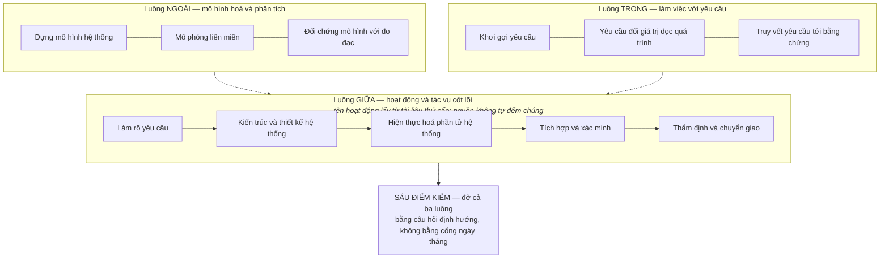

**Vì sao yêu cầu phải tách ra thành một luồng riêng.** Câu trả lời nằm nguyên văn, và nó là một chẩn đoán
về chế độ hỏng chứ không phải một lựa chọn thẩm mỹ:

> `"In engineering practice however, requirements and their values change along the product development
> process. As a consequence, requirements elicitation and management is illustrated by a separate
> strand..."` — [23]

Chữ *however* trong câu ấy đối lập với cái gì? Với
cách bản cũ vẽ. Bản 2004 đặt yêu cầu ở đầu nhánh trái như một chiếc hộp đầu vào: chốt xong thì đi tiếp.
Đó là hình vẽ, và hình vẽ đó sai so với thực hành. Uỷ ban không sửa bằng một chú thích dưới hình. Họ đổi
tô-pô của hình.

Đây là **mặt tiếp giáp** ở dạng thuần khiết nhất mà cuốn sách này gặp: một tiêu chuẩn kỹ thuật đổi cấu
trúc đồ hoạ của chính nó vì cấu trúc cũ dạy tổ chức một thói quen sai. Không phải vì lý thuyết cũ sai —
lý thuyết vẫn nói rằng yêu cầu có thể đổi. Mà vì **hình vẽ nói to hơn văn bản**, và tổ chức học theo hình.

**Luồng xanh, mô hình hoá và phân tích, nằm ở vòng ngoài cùng.** Vị trí này có nghĩa: mô hình không phải
một việc làm ở một pha nào đó, mà là môi trường bao quanh toàn bộ quá trình. Đây cũng chính là chỗ chương
này sẽ quay lại ở phần cuối, vì nó chở theo giả định đắt nhất của cả bản 2021.

**Sáu điểm kiểm thay chỗ cổng giai đoạn.**

> `"The three strands that represent the main tasks and activities in the New V-Model are backed by a
> structure of six checkpoints... Two exemplary checkpoints at the specification and for the integration
> are provided in Tables 1 and 2."` — [23]

Chữ *backed by* — được đỡ bởi — không phải *divided by*. Khác biệt là toàn bộ vấn đề. Cổng giai đoạn
kiểu stage-gate chia dòng chảy thành khúc và đặt ở mỗi mối nối một quyền phủ quyết theo lịch. Điểm kiểm
kiểu này không chia gì cả; nó là một bộ câu hỏi định hướng để hỏi *thông tin đã đủ chưa*. Và vật liệu
khai thác ghi rõ một điều quan trọng: **tiêu chuẩn không quy định thang điểm số học nào** để chấm độ chín
của thiết kế — không có thang 1–5, không có thang 1–10. Sáu điểm kiểm vận hành bằng câu hỏi, không bằng
điểm. Chương 10 sẽ cho thấy vì sao lựa chọn đó không hề trung tính: mọi thang chấm là một tuyên bố về ai
được quyền cho điểm, và **không có thang** cũng là một tuyên bố như vậy.

Đặt hai chế độ cạnh nhau thì khác biệt gói gọn trong một cạnh:

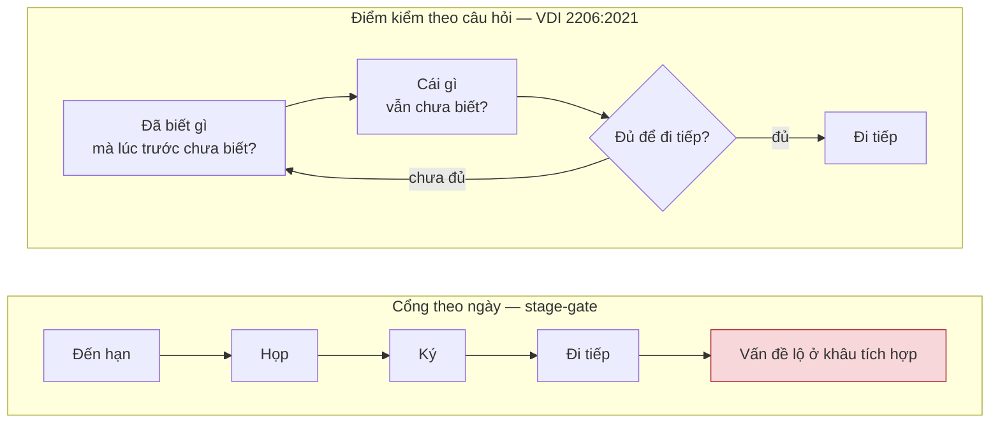

Hình trên không có cạnh nào quay lại; hình dưới có. Đó là toàn bộ luận điểm, và nó nhìn thấy được trong
một giây. Chú thích cần thiết: sơ đồ dưới **không có thang điểm** — vì nguồn không có, không phải vì
chương lược đi.

### Cái giá của việc bỏ hình chữ V

Chương này lập luận rằng tách luồng yêu cầu ra là đúng, vì hình cũ dạy sai. Nhưng nếu hình vẽ mạnh đến
mức tự nó dạy được — luận điểm chịu lực của chương — thì đổi sang một hình khác là một **nhượng bộ có
giá**, không phải một cải tiến thuần. Và cái giá thì cụ thể.

Chữ V có một tài sản mà ba luồng song song không có: nó **mã hoá tính đối xứng xác minh**. Mỗi ô bên
nhánh trái có một ô đối diện bên nhánh phải kiểm nó, và vị trí trên hình nói ra cặp đôi ấy mà không cần
một chữ chú thích nào. Chính mục *Áp dụng ở Xưởng* số 2 của chương này dựa vào đúng tính đối xứng đó để
đưa ra lời khuyên — đọc lại chữ V đang treo trên tường như một bảng ghép cặp *định nghĩa ↔ xác minh*.
Ba dải chạy song song không có cấu trúc ấy: chúng cho thấy cái gì chạy suốt, không cho thấy cái gì kiểm
cái gì.

Vậy hình mới **dễ nhớ kém hơn và dạy được ít hơn** ở đúng một khía cạnh — khía cạnh mà thực hành dùng
nhiều nhất. Uỷ ban đổi hình để chữa một lỗi dạy sai, và trong lúc chữa đã bỏ mất một thứ hình cũ dạy
đúng. Không nguồn nào trong corpus nêu đánh đổi này; đây là suy luận của cuốn sách, và nó không làm yếu
luận điểm chính — nó cho thấy luận điểm chính cắt cả hai chiều.

### Một phép đếm không có trong nguồn — và vì sao phải nói ra

Vật liệu khai thác dựng lại luồng cam thành năm hoạt động nối tiếp, có đầu vào và đầu ra cho từng cái:
làm rõ yêu cầu · kiến trúc và thiết kế hệ thống · hiện thực hoá phần tử hệ thống · tích hợp và xác minh
hệ thống · thẩm định và chuyển giao. Danh sách đó dùng được, và sơ đồ ba luồng ở trên dùng nó — sơ đồ ấy
mang sẵn một nhãn nói rằng tên hoạt động lấy từ tài liệu thứ cấp và nguồn không tự đếm chúng, để người
đọc nhìn hình trước không phải chờ tới đây mới gặp lời đính chính.

Nhưng **không có câu nguyên văn nào trong vật liệu đếm chúng bằng chữ.** Con số năm là kết quả của việc
đếm gạch đầu dòng, không phải là con số mà nguồn tự viết ra. Chương 03 đã gặp đúng lớp bẫy này ở danh
sách các bước công tác của pha cụ thể hoá Pahl-Beitz, nơi văn bản liệt kê đủ mục mà sách không bao giờ
tự viết con số, và câu liền trước danh sách lại phủ nhận rằng đó là một kế hoạch chặt. Ở đây rủi ro nhẹ
hơn — không có câu phủ nhận nào — nhưng luật giữ nguyên: viết *"quy trình năm bước của VDI 2206:2021"*
là gán cho tiêu chuẩn một phép đếm mà chứng cứ trong tay không có. Viết *"năm hoạt động được nêu tên
trong tài liệu thứ cấp"* thì đúng.

Điều tương tự áp cho chu trình vi mô. Vật liệu ghi thẳng rằng số bước cụ thể của micro-cycle **không có
trong nguồn** — các tài liệu chỉ nói tới *"general problem-solving cycle as a micro-cycle"* mà không
liệt kê con số. Chương 06 làm việc với chu trình vi mô; chương này chỉ ghi lại giới hạn chứng cứ.

---

## "Logic tác vụ, không phải lịch trình dự án" — và vì sao câu đó không cứu được

Đây là câu quan trọng nhất của cả chương, và nó do chính những người soạn thảo mô hình mới viết ra:

> `"The inherent concern logic of the V-Model represents the logical sequence of tasks. Its key advantage
> lies in staying independent from the chosen form of project organization. This way, the V-Model can be
> applied in classically managed projects as well as in agile projects."` — [23]

Ba mệnh đề, mỗi mệnh đề bác một thứ.

**Mệnh đề một: chữ V biểu diễn trình tự *logic của tác vụ*.** Không phải trình tự thời gian. Sự khác nhau
giữa hai thứ này là sự khác nhau giữa *phụ thuộc* và *lịch*. "Không thể xác minh một đặc tả chưa được
viết" là một phụ thuộc — nó đúng vĩnh viễn, không phụ thuộc vào việc bạn viết đặc tả vào tuần nào. "Đặc
tả xong tháng Ba, xác minh tháng Chín" là một lịch — nó là quyết định quản trị, và tiêu chuẩn không nói
gì về nó.

**Mệnh đề hai: độc lập với hình thức tổ chức dự án.** Đây là lời từ chối thẩm quyền. Tiêu chuẩn tự tuyên
bố nó không có ý kiến về việc bạn chia dự án thành bao nhiêu giai đoạn, họp bao nhiêu lần, ký duyệt ở
đâu. Nó chỉ nói: những tác vụ này phụ thuộc lẫn nhau theo cách này.

**Mệnh đề ba: dùng được trong dự án quản lý cổ điển lẫn dự án agile.** Câu này bác thẳng cách hiểu phổ
biến nhất về chữ V — *"V là thác nước có thêm kiểm thử"*. Nếu chữ V là logic tác vụ thì nó không mâu
thuẫn với sprint, vì sprint sắp xếp lại **lịch** chứ không sắp xếp lại **phụ thuộc**. Một đội agile chạy
mười vòng lặp vẫn phải, trong mỗi vòng, biết mình đang xác minh cái gì so với cái gì. Chữ V nói đúng
điều đó và không nói gì hơn.

Vậy là cách hiểu "V = thác nước" là lỗi của người đọc, không phải của tiêu chuẩn. Kết luận đó đúng về
mặt văn bản — và gần như vô dụng về mặt thực hành. Vì đây là chỗ mặt tiếp giáp cắt vào:

> `"It is important to note that this representation shows only one flow through the ''V'' shaped process,
> which does not represent the iterative nature of real development cycles."` — [19]

Một hình vẽ chỉ ra được **một** dòng chảy. Người đọc nhìn thấy một dòng chảy. Rồi có một câu văn xuôi ở
đâu đó trong tài liệu nói rằng thực tế nó lặp. Câu văn thua. Nó thua vì hình vẽ được photocopy vào slide
đào tạo, được vẽ lại lên bảng trắng, được nhớ sau ba năm; còn câu văn nằm ở trang 12 của một tài liệu mà
phần lớn người dùng chưa bao giờ mở.

**Đây là luận điểm chịu lực của chương này.** Một tiêu chuẩn có thể tuyên bố ý định của mình bằng văn bản
rõ ràng đến mức không thể hiểu nhầm, và vẫn bị hiểu nhầm một cách hệ thống suốt mười bảy năm giữa hai
bản — 2004 tới 2021, cả hai mốc đều có nguyên văn ở bảng trên — vì thứ
thật sự truyền đi trong tổ chức không phải là văn bản mà là **hình vẽ**. Cái tổ chức tiếp nhận không phải
cái tiêu chuẩn nói. Đó chính xác là điều mà neo *mặt tiếp giáp* mô tả — và ở đây có bằng chứng nội tại:
uỷ ban không chọn cách viết thêm một chú thích. Họ **đổi hình**. Việc đổi hình là lời thú nhận rằng chú
thích đã không có tác dụng.

Và họ còn đổi thêm một thứ nữa, thứ này bất ngờ hơn nhiều.

> `"First, the wish to include the human beings with their skills, competencies, convictions and emotions
> was discussed and taken up in the workshop. In the final version it is represented by coupling the
> V-Model with the Holistic Product Lifecycle (HPLC) Model..."` — [23]

Một tiêu chuẩn kỹ thuật hệ thống, sản phẩm của một uỷ ban kỹ thuật Đức, buộc phải ghép nối với một mô
hình vòng đời khác **để chứa được kỹ năng, năng lực, niềm tin và cảm xúc của con người**. Chữ
*convictions* và *emotions* nằm trong nguyên văn. Điều này không xuất hiện trong bản 2004.

Nói cách khác: khi ngồi lại sau mười bảy năm để tìm xem bản cũ hỏng ở đâu, thứ đầu tiên — nguyên văn ghi
*"First"* — mà hội thảo nêu ra không phải là một thiếu sót kỹ thuật. Nó là **con người trong tổ chức**.
Luận đề của cuốn sách này nói rằng phương pháp thiết kế hỏng ở mặt tiếp giáp với tổ chức. Ở đây, chính
nhóm soạn thảo tiêu chuẩn đã đi đến kết luận đó bằng con đường của họ, và xử lý nó bằng cách gắn thêm
một mô hình bên ngoài phạm vi kỹ thuật của mình.

---

## RFLP: bốn mức, và cái giá của mỗi lần chuyển mức

Nhánh trái của chữ V — nay là nửa trên của luồng cam — được chi tiết hoá bằng một phương pháp phái sinh:

> `"The Requirement-Functional-Logical-Physical (RFLP) approach is a specific V-model derived method,
> particularly adapted to mechatronic systems design and formed of four phases (requirement, functional,
> logical, physical) which are each supported by different technical tools aiding the designers."` — [20]

Bốn mức, và nguyên văn có chữ *four*. Chú ý vế cuối của câu: mỗi mức **được hỗ trợ bởi những công cụ kỹ
thuật khác nhau**. Đó không phải một chi tiết phụ. Đó là chỗ chi phí nằm.

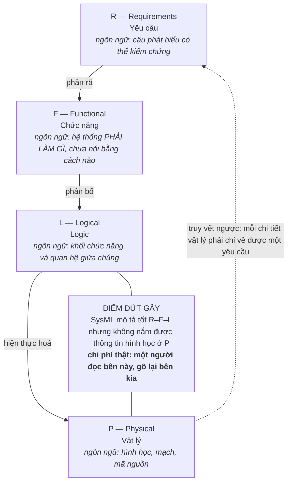

Trình tự R → F → L → P là trình tự **trì hoãn cam kết**: không chốt hình học trước khi chốt logic, không
chốt logic trước khi chốt chức năng. Lợi ích rõ ràng — mỗi lần chốt sớm một mức là một lần khoá mất
không gian giải pháp. Chương 11 sẽ cho thấy cái giá của việc trì hoãn: nổ tổ hợp.

Nhưng cái giá gần hơn nằm ở chỗ khác, và nguồn nói thẳng ra:

> `"SysML is not really suitable to describe solution principles, since they contain, besides physical
> effects, geometric information on the arrangement and relations of the solution principle elements;
> SysML currently does not include an efficient possibility for capturing such information."` — [27]

SysML là ngôn ngữ được khuyến nghị cho nhánh trái, cho MBSE, cho toàn bộ ba mức R–F–L. Và nó **không có
cách hiệu quả để nắm bắt thông tin hình học**. Nguyên lý giải pháp trong cơ khí không chỉ là hiệu ứng vật
lý; nó là hiệu ứng vật lý *cộng với* cách bố trí trong không gian. Cái gì nằm cạnh cái gì, cái gì chắn
tầm nhìn của cái gì, cái gì giãn nở về phía nào khi nóng.

Hệ quả thực hành: giữa mức L và mức P có một đường nối mà **không công cụ nào trong chuỗi đi qua được**.
Mô hình kiến trúc hệ thống nằm trong một công cụ; hình học nằm trong một công cụ khác; và cái đi giữa hai
công cụ đó là một con người đọc bên này rồi gõ lại bên kia. Đây không phải suy đoán — nguồn ghi lại đúng
tình trạng đó ở một nghiên cứu áp bản mới lên hệ điều khiển PLC:

> `"However, the data flow needs to be further detailed and automated to be more efficient."` — [20]

Và còn một khoảng trống nữa, khoảng trống này thì tiêu chuẩn không hề đụng tới:

> `"The results show that the management of knowledge related to component/system interfaces is not
> addressed neither in the state of practice nor the state of the art."` — [20]

*Không được xử lý trong cả thực hành lẫn trạng thái nghệ thuật.* Tiêu chuẩn dạy rất kỹ cách
**chia** hệ thống thành mô-đun và cách định nghĩa ranh giới giao diện. Nó không nói gì về việc **giữ lại
tri thức phát sinh tại các ranh giới đó** — vì sao dung sai này được chọn, vì sao tín hiệu này được đảo
mức, ai đã thử cách khác và hỏng thế nào. Tri thức đó là tri thức ẩn, nó nằm trong đầu hai người đã ngồi
với nhau một buổi chiều, và khi một trong hai người đổi việc thì nó biến mất. Chương 13 sẽ mở lại đúng
chủ đề này ở quy mô của cả năm phương pháp.

---

> **Đào sâu: Một con số đi đường xa**
>
> *Mục này tự chứa. Bỏ qua được mà không mất mạch chương — và nó được viết ra chính vì lý do đó.*
>
> Trong tập tài liệu về V-Model liên ngành có một ví dụ áp dụng: hệ thống điều hoà khoang xe hơi thiết kế
> lại theo hướng lấy người dùng làm trung tâm. Đại lượng đo được nêu đích danh là **nhu cầu năng lượng
> điện**, và mức giảm đo được là **58% đến 90%**:
>
> `"in the experiments the novel cabin climate control system decreased the electrical energy demand by 58% to 90%."` — [18]
>
> Con số này rất dễ đi vào một slide. Nó cũng rất dễ đi vào slide **mà không mang theo ba thứ đi kèm nó
> trong chính đoạn văn gốc.**
>
> **Thứ nhất — câu liền trước.** Ngay trước câu về năng lượng, bài báo tự tổng kết kết quả chung:
>
> `"The prototypical implementation of the new design slightly outperforms state-of-the-art air conditioning."`
>
> *Slightly* — nhỉnh hơn đôi chút. Đánh giá tổng thể được thực hiện trên chín hạng mục yêu cầu: tiện nghi
> nhiệt, an toàn, chi phí, chất lượng không khí, âm học, tương tác người dùng, tác động môi trường, tích
> hợp lên xe, và năng lượng. Con số 58–90% là kết quả của **một** hạng mục trong chín.
>
> **Thứ hai — câu liền sau.** `"Challenges include the cost, size and mass of the prototypical design."`
> Chi phí, kích thước, khối lượng — ba thứ quyết định việc một thiết kế có lên được xe sản xuất hay không.
>
> **Thứ ba — cỡ mẫu.** Nguyên văn: `"applied to a research vehicle and four representative users."` **Một
> xe nghiên cứu, bốn người dùng đại diện.** Số lần đo, số kịch bản, và điều kiện biên — nhiệt độ môi
> trường, tải nhiệt, thời lượng chạy — **không có trong nguồn**. Không phải chưa ai tìm; chúng
> không được ghi ra.
>
> Trích "58–90%" mà bỏ chữ *slightly*, bỏ câu về chi phí và khối lượng, và bỏ cỡ mẫu n = 1 xe / 4 người
> là **xuyên tạc nguồn**, dù từng chữ trích ra đều đúng nguyên văn. Đây là lớp lỗi khó bắt nhất trong
> việc dùng chứng cứ: không phải trích sai, mà là **trích đúng và cắt mất câu bên cạnh**.
>
> Con số này là **giai thoại minh hoạ, không phải luận cứ chịu lực**. Nếu nó biến mất khỏi chương này,
> không luận điểm nào ở trên yếu đi. Nó nằm đây để làm một việc khác: khi lần tới có người đưa cho bạn
> một con số ấn tượng về hiệu quả của một phương pháp thiết kế, câu hỏi đầu tiên không phải "nguồn đâu"
> — mà là **"câu bên cạnh nói gì, và đo trên bao nhiêu mẫu"**.

---

## Giả định về độ tin cậy của mô hình ảo

Luồng xanh — mô hình hoá và phân tích — bao ngoài toàn bộ hai luồng kia. Vị trí đồ hoạ đó mã hoá một
tham vọng: quyết định được đẩy ngược lên thượng nguồn, ra trước khi có vật thật, dựa trên mô hình.

Vật liệu khai thác có một ví dụ đúng dạng đó: một cánh tay sạc cho robot kiểm tra đường ray, phát triển
theo hướng thay thử-sai vật lý bằng mô phỏng số:

> `"...the process has been based on virtual models of the product and on virtual simulations of its
> operation, rather than on the realization of time-consuming and expensive physical models and tests..."` — [18]

Mệnh đề này là một cuộc đánh đổi, và chỉ một vế của nó được kiểm: mô hình vật lý tốn thời gian và tiền —
không ai cãi. Mô hình ảo đủ tin để thay — không ai đo.

**Một quyết định ra trên mô hình chỉ tốt bằng mô hình đó.** Và câu hỏi "mô hình này đủ tin đến mức nào để
ra quyết định X" là câu hỏi mà **không nguồn nào trong tập tài liệu này trả lời bằng số**. Không có
ngưỡng sai lệch cho phép, không có thủ tục đối chứng bắt buộc, không có phân loại quyết định theo mức rủi
ro mô hình. Tiêu chuẩn đặt luồng mô hình hoá ở vòng ngoài cùng — nghĩa là mọi thứ đều tựa lên nó — rồi
không quy định độ tin cậy của thứ mà mọi thứ tựa lên. *Đây là ghi nhận về giới hạn chứng cứ trong tay,
không phải khẳng định rằng tiêu chuẩn im lặng về chủ đề này; corpus không có toàn văn để kiểm.*

Cần nói rõ một điều để tránh dựng bù nhìn: bản thân tiêu chuẩn không đề nghị bỏ thử nghiệm vật lý. Luồng
cam kết thúc bằng thẩm định — đối chiếu với người dùng thật. Vấn đề không nằm ở chỗ tiêu chuẩn nói gì.
Nó nằm ở chỗ **một tổ chức đọc tiêu chuẩn này sẽ nghe thấy gì**. Và thứ dễ nghe thấy nhất trong một cấu
trúc đặt mô hình hoá ở vòng ngoài cùng, giữa một ngành đang bán công cụ mô phỏng, là: *mô phỏng nhiều lên
thì làm mẫu ít đi*.

Bằng chứng phản biện mạnh nhất trong tập tài liệu là một nghiên cứu hồi cứu về hai quá trình phát triển
cơ điện tử thật trong công nghiệp ô tô:

> `"During both processes a series of prominent problems could be observed; the solution for these
> problems found in the development processes are sometimes not in line with recommended procedures in
> literature concerning mechatronic product development."` — [20]

Giải pháp thật sự gỡ được vấn đề **không nằm trong quy trình mà sách vở khuyến nghị**. Câu này không nói
quy trình sai. Nó nói một điều khó chịu hơn: quy trình và cái thật sự chạy được là hai tập hợp giao nhau
chứ không lồng nhau. Một tổ chức tuân thủ quy trình đến chữ cuối cùng vẫn có thể trượt, và một tổ chức
làm khác quy trình vẫn có thể ra sản phẩm tốt.

---

## 2004 đặt cạnh 2021

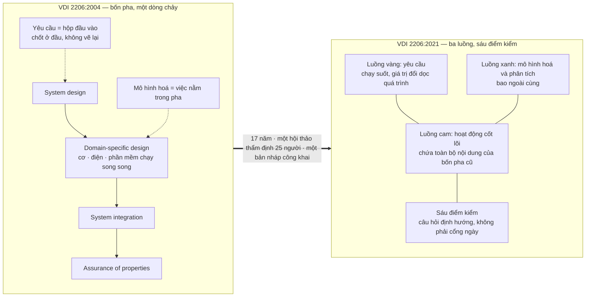

Bốn pha của bản 2004 đã được Chương 06 trích nguyên văn và tháo ra đủ; bảng dưới đây chỉ đặt chúng cạnh
bản mới để đọc chỗ lệch.

| Chiều so sánh | 2004 | 2021 | Cái gì đã đổi và vì sao |
|---|---|---|---|
| Cấu trúc đồ hoạ | Bốn pha trên một chữ V hai nhánh | Ba luồng song song, luồng giữa chở nội dung của chữ V cũ | Hình cũ dạy sai: chỉ ra được một dòng chảy, không ra được tính lặp |
| Yêu cầu | Hộp đầu vào ở đầu nhánh trái | Luồng riêng chạy suốt chiều dài | `"requirements and their values change along the product development process"` |
| Mô hình hoá | Hoạt động nằm bên trong các pha | Luồng riêng ở vòng ngoài cùng | Chuyển trọng tâm sang MBSE và đánh giá ảo |
| Kiểm soát tiến độ | Ngầm theo pha | Sáu điểm kiểm bằng câu hỏi định hướng | Không có thang điểm số học — *không có trong nguồn* |
| Con người trong tổ chức | Không có trong phạm vi | Ghép với mô hình HPLC | `"skills, competencies, convictions and emotions"` |
| Đối tượng thiết kế | Hệ cơ điện tử | Thêm CPS — biên hệ thống động, liên kết chéo | `"dynamic system boundaries and cross-linkages between their elements"` |

Về vế cuối, nguyên văn định nghĩa CPS đáng đọc nguyên khối, vì nó cho thấy vì sao một tiêu chuẩn cơ điện
tử không thể đứng yên:

> `"These systems are characterized by dynamic system boundaries and cross-linkages between their
> elements... Systems like these, which have the capabilities to communicate with each other, collect and
> distribute information or are able to autonomously adapt their behavior based on information available
> across different systems, are termed as Cyber Physical Systems (CPS)... or Cybertronic Systems (CTS)"` — [22]

**Biên hệ thống động.** Đó là câu giết chết mô hình bốn pha. Cả bốn pha của bản 2004 đều giả định một
đường biên đứng yên: thiết kế hệ thống vẽ ra cái hộp, thiết kế chuyên ngành lấp đầy hộp, tích hợp ráp
hộp, đảm bảo thuộc tính nghiệm thu hộp. Nếu cái hộp tự đổi hình dạng trong lúc vận hành — vì nó nói
chuyện với hệ thống khác, vì nó tự điều chỉnh hành vi theo thông tin bên ngoài — thì "đảm bảo thuộc
tính" đo cái gì?

Và điều **không** đổi giữa hai bản mới là chỗ đáng ghi. Bốn ý tưởng nền mà Haberfellner et al. cho rằng
mọi mô hình quy trình phải có — đi từ thô đến chi tiết · xét các phương án thay thế · chia quá trình
thành các bước theo thời gian · dùng một hướng dẫn hình thức — được Chương 06 trích nguyên văn, và cả
hai bản tiêu chuẩn đều giữ nguyên cả bốn.

Ý tưởng số (1) — từ thô đến chi tiết — chính là nguyên tắc trừu tượng hoá mà Chương 02 đã đặt làm điểm
chung hiếm hoi giữa phe quy định và phe phê bình. Ý tưởng (2) — xét các phương án thay thế — là toàn bộ
nội dung của Chương 09 và Chương 10. Bốn mươi năm phương pháp luận, hai bản tiêu chuẩn cách nhau mười
bảy năm, và hạt nhân không nhúc nhích.

---

## Phương pháp này giả định một tổ chức như thế nào

Đây là mục đóng chung của cả Phần II. Với bản 2021, danh sách giả định dài hơn bản 2004 chứ không ngắn
đi — mỗi nhượng bộ về mặt mô hình lại đòi thêm một thứ ở tổ chức.

**Một — một hạ tầng công cụ có bản quyền và có người vận hành.** Ba luồng chạy song song chỉ là một hình
vẽ nếu không có nơi để ba luồng đó *sống*. Luồng yêu cầu chạy suốt chiều dài nghĩa là phải có một hệ quản
lý yêu cầu có phiên bản, có truy vết. Luồng mô hình hoá ở vòng ngoài nghĩa là phải có nền tảng PLM/SysLM
để mô hình không nằm rải trên ổ đĩa cá nhân. Đây không phải phần mềm miễn phí, và chi phí lớn hơn giá
giấy phép nhiều lần: nó cần người quản trị, cần quy ước đặt tên, cần kỷ luật nhập liệu hàng ngày.

**Hai — kỹ sư ba miền dùng chung được một ngôn ngữ mô hình hoá.** Bản 2004 đã đặt cược vào điều này và
Chương 06 đã gọi tên canh bạc đó. Bản 2021 **tăng tiền cược**: MBSE và SysML không còn là tuỳ chọn cho
đội nào thích, mà là môi trường mặc định của nhánh trái. Bằng chứng rằng canh bạc này chưa được ăn nằm
ngay trong tập tài liệu:

> `"However, the lack of a common interface language has made the information exchange in concurrent
> engineering difficult."` — [25]

Và bản thân ngôn ngữ được đề cử cũng có lỗ thủng đã dẫn ở trên: SysML không nắm được hình học. Nghĩa là
ngay cả khi tổ chức đầu tư đủ để mọi người học chung một ngôn ngữ, ngôn ngữ đó vẫn không phủ hết miền cơ
khí.

**Ba — kỹ sư đủ kinh nghiệm để tự chọn công cụ trong một kho công cụ lớn.** Đây là giả định ít được nói
tới nhất và có bằng chứng phản bác thẳng thắn nhất:

> `"Inspite of the wide spectrum of research activities and industrial developments in the mechatronic
> field it seems to be difficult for the design engineer in practice - in particular for the still
> unexperienced one - to select the suitable procedures, methods and tools for his design task."` — [26]

Tiêu chuẩn càng phong phú thì càng đòi người dùng phải giỏi sẵn để dùng được nó. Đây là một vòng phản hồi
ngược: thứ được thiết kế để giúp kỹ sư ít kinh nghiệm làm đúng lại đòi hỏi kinh nghiệm để dùng đúng.
Chương 12 sẽ mở lại nghịch lý này ở tầm cả phả hệ phương pháp.

**Bốn — mô hình ảo đủ đáng tin để ra quyết định.** Đã bàn ở trên. Giả định này không được viết ra ở đâu
cả, và chính vì thế nó không bao giờ được kiểm.

**Năm — có ai đó giữ tri thức giao diện.** Tiêu chuẩn chỉ cách chia mô-đun và định nghĩa ranh giới. Nó
không chỉ cách giữ lại lý do đằng sau từng ranh giới, và nguồn ghi rõ rằng **cả thực hành lẫn nghiên cứu
đều chưa xử lý chuyện này**. Tổ chức nào không tự dựng thói quen ghi lại, tổ chức đó sẽ trả tiền hai lần
cho cùng một bài học.

**Sáu — phạm vi vòng đời được thừa nhận là một phần, không phải toàn bộ.** Điều này thì nguồn nói rất
thẳng, và nó đặt VDI 2206 vào đúng chỗ trong phả hệ:

> `"Prior methods as developed by Pahl and Beitz..., Product Lifecycle Management (PLM)...,
> Model-based Systems Engineering (MBSE)... and the VDI 2206... only have parts of the lifecycle in
> scope."` — [19]

Gộp lại, bản 2021 vẽ chân dung một tổ chức: có ngân sách hạ tầng số dài hạn, có đội kỹ sư đa ngành đã
qua đào tạo chung một ngôn ngữ mô hình hoá, có người chuyên trách giữ yêu cầu và giữ mô hình, và có đủ
người nhiều kinh nghiệm để dẫn những người ít kinh nghiệm qua một kho phương pháp lớn. Đó là chân dung
của một hãng công nghiệp lớn ở Đức. **Nó không phải chân dung của phần lớn tổ chức sẽ đọc tiêu chuẩn
này** — và đó là canh bạc, hiểu theo đúng nghĩa mà Chương 01 đã đặt ra.

Điều đáng ghi nhận: bản 2021 tiến gần hơn bản 2004 tới việc thừa nhận điều đó. Việc ghép HPLC vào để chứa
con người, việc thay cổng giai đoạn bằng câu hỏi định hướng, việc tuyên bố độc lập với hình thức tổ chức
dự án — cả ba đều là những bước lùi khỏi tham vọng quy định cứng. Cùng một hướng đi mà Chương 05 đã thấy
ở VDI 2221 bản 2019 khi tiêu chuẩn tách đôi và đưa cắt may quy trình vào thành nội dung chính thức. Hai
tiêu chuẩn khác nhau, hai uỷ ban khác nhau, cùng một kết luận: khung cứng không sống được, phải trả bớt
quyền quyết định về cho người áp dụng.

Chương 08 rẽ sang một tuyến khác hẳn — ICDM đi theo hướng ngược lại, cắm thêm thước đo định lượng vào
đúng pha ý tưởng, pha mà chưa có gì để đo. Đặt nó cạnh bản 2021 thì thấy hai câu trả lời đối nghịch cho
cùng một vấn đề, và mỗi câu trả lời gửi một hoá đơn khác nhau tới tổ chức.

---

## Áp dụng ở Xưởng

*Bối cảnh chung cho cả năm mục: một xưởng cơ khí — điện tử — phần mềm nhúng, vài chục người, làm sản phẩm
tích hợp cả ba miền. Không có nền tảng PLM thương mại, không có giấy phép công cụ MBSE, và không có người
chuyên trách quản lý yêu cầu.*

### 1. Tuần tới: chỉ định người giữ luồng yêu cầu cho một sản phẩm đang chạy

> `"In engineering practice however, requirements and their values change along the product development
> process. As a consequence, requirements elicitation and management is illustrated by a separate
> strand..."` — [23]

**Quyết định cụ thể ra được trong tuần tới:** chọn **một** sản phẩm đang ở giữa chừng, chỉ định **một**
người giữ danh sách yêu cầu của nó, và đổi cách ghi từ "bản đặc tả chốt ở đầu kỳ" sang "sổ có phiên bản,
mỗi dòng thay đổi ghi ba thứ: đổi cái gì, ai yêu cầu đổi, vì sao". Không cần công cụ mới — một tệp bảng
tính có lịch sử sửa đổi là đủ để bắt đầu. Cái được mua bằng quyết định này không phải là tài liệu đẹp
hơn; nó là khả năng trả lời câu hỏi *"con số này từ đâu ra"* sáu tháng sau, khi người nêu ra nó không còn
nhớ.

Đây là mảnh rẻ nhất của bản 2021 và là mảnh có tỷ lệ lợi ích trên chi phí cao nhất, vì nó không đòi hạ
tầng gì cả — chỉ đòi một cái tên gắn vào một trách nhiệm.

### 2. Đọc lại chữ V đang treo trên tường như logic tác vụ, không như lịch

> `"The inherent concern logic of the V-Model represents the logical sequence of tasks. Its key advantage
> lies in staying independent from the chosen form of project organization."` — [23]

**Vấn đề nó giải:** đội đang chờ "xong pha thiết kế" mới bắt đầu nghĩ đến kiểm chứng, vì hình vẽ đặt kiểm
chứng ở nhánh phải và nhánh phải trông như là "về sau".

**Cách áp:** với mỗi tác vụ trên nhánh trái, viết ngay bên cạnh nó tác vụ đối xứng ở nhánh phải sẽ kiểm
nó, và trả lời hai câu — *kiểm bằng cách nào* và *kiểm khi nào có đủ điều kiện để kiểm*. Câu thứ hai
không phải một ngày trên lịch; nó là một điều kiện. Chữ V nói phụ thuộc, không nói ngày.

**Bẫy:** đổi cách đọc mà không đổi hình vẽ thì sáu tháng sau đội quay lại đọc theo lịch, vì hình vẽ vẫn
treo ở đó và hình vẽ nói to hơn buổi họp.

### 3. Dựng điểm kiểm bằng câu hỏi, không bằng ngày

> `"The three strands that represent the main tasks and activities in the New V-Model are backed by a
> structure of six checkpoints."` — [23]

**Vấn đề nó giải:** cổng nghiệm thu theo ngày biến thành thủ tục — đến hạn thì họp, họp thì ký, ký xong
vấn đề vẫn còn nguyên và lộ ra ở khâu tích hợp.

**Cách áp:** mỗi điểm kiểm là một danh sách câu hỏi về *độ đầy đủ của thông tin*, dạng "đến đây, ta đã
biết gì mà lúc trước chưa biết, và cái gì vẫn chưa biết". Không cho điểm số — tiêu chuẩn không quy định
thang điểm nào, và việc gán một thang tự chế sẽ tạo ra ảo giác đo lường ở chỗ chỉ có phán đoán.

**Bẫy:** danh sách câu hỏi trôi dần thành danh sách hạng mục cần ký. Dấu hiệu sớm: không buổi kiểm nào
kết thúc bằng "chưa đủ, quay lại".

### 4. Mở một sổ giao diện, vì tiêu chuẩn để trống đúng chỗ đó

> `"The results show that the management of knowledge related to component/system interfaces is not
> addressed neither in the state of practice nor the state of the art."` — [20]

**Vấn đề nó giải:** lý do đằng sau mỗi thoả thuận giữa hai miền kỹ thuật nằm trong đầu hai người, và biến
mất khi một trong hai đổi việc hoặc đơn giản là quên.

**Cách áp:** mỗi giao diện giữa hai miền — cơ với điện, điện với phần mềm — được một dòng trong sổ: hai
bên là ai, cam kết là gì, **vì sao chọn giá trị đó**, và đã thử phương án nào khác mà hỏng. Dòng cuối là
dòng có giá trị nhất và là dòng hay bị bỏ nhất.

**Bẫy:** sổ này chỉ sống nếu nó được mở ra lúc *tranh cãi*, không phải lúc *tổng kết*. Sổ chỉ ghi vào
cuối dự án là sổ chết.

### 5. Đặt hạn mức tin cậy cho mô hình trước khi ra quyết định trên mô hình

> `"...the process has been based on virtual models of the product and on virtual simulations of its
> operation, rather than on the realization of time-consuming and expensive physical models and tests..."` — [18]

**Vấn đề nó giải:** một kết quả mô phỏng được dùng để bỏ qua một lần làm mẫu, và không ai ghi lại rằng
quyết định đó đã được ra trên cơ sở nào.

**Cách áp:** mỗi lần một quyết định thay thế thử nghiệm vật lý bằng mô phỏng, ghi một dòng: mô hình này
đã từng được đối chứng với đo đạc thật ở đâu, sai lệch bao nhiêu, và trong dải điều kiện nào. Chưa có
đối chứng nào thì ghi thẳng là chưa có — dòng đó chính là dữ liệu, và nó sẽ được đọc lại khi có sự cố.

**Bẫy:** mô hình đúng trong dải đã đối chứng rồi được dùng ngoài dải đó mà không ai để ý, vì kết quả vẫn
hiện ra thành một con số trông rất tự tin.


# Chương 08 — ICDM: cắm thước đo vào pha chưa có gì để đo

Pha ý tưởng là pha khoá phần lớn tiền của cả vòng đời sản phẩm, và cũng là pha có ít số liệu nhất để
biện minh cho việc khoá. Đó không phải nghịch lý tu từ — đó là điều kiện làm việc thật của mọi kỹ sư
trưởng. Anh phải chọn giữa ba nguyên lý giải pháp khi chưa có mẫu nào, chưa có bảng kê vật tư nào, chưa
có một lần thử nào; rồi phải đứng trước ban lãnh đạo giải thích vì sao chọn cái thứ hai. Thiếu một cách
gắn con số vào khoảnh khắc đó, quyết định đắt nhất của dự án được ra bằng thứ có sẵn duy nhất: uy tín cá
nhân của người nói to nhất trong phòng. ICDM sinh ra để giải đúng chỗ này.

Nó không đề nghị thay bốn pha của Pahl-Beitz. Nó tự khai là bản mở rộng của chính bốn pha ấy —
`"The systematic method for conceptual design of a new product has been introduced as a comprehensive
design tool by Pahl and Beitz in 1977 and improved since."` [46] — và toàn bộ sức nặng của nó dồn vào
một pha duy nhất trong bốn pha mà Chương 03 đã dựng: pha thiết kế ý tưởng. Amihud Hari và Menachem P.
Weiss phát triển nó tại Technion: `"ICDM is the Integrated, Customer Driven, Conceptual Design Method,
that has been developed in the Technion, Israel during 1996 and 2001."` [49]. Giữa mốc 1977 và mốc 1996
ấy, có người quay lại đúng pha yếu nhất của phương pháp gốc và nong nó ra.

Chương này trả lời đúng hai câu, không hơn. **Một:** ICDM giả định một tổ chức như thế nào — canh bạc
riêng của nó là gì, khi nó đòi một tổ chức chịu chấm điểm chính mình lúc chưa có gì để đo. **Hai:** nó
ngồi ở tầng đòn bẩy nào — chương này chỉ nêu vấn đề, Chương 16 mới xếp hạng cùng mọi công cụ khác.
Chương này **không** dạy cách dùng các công cụ của ICDM. Lý do ở ngay mục dưới.

## Chương này cố ý ngắn, và đây là lý do

Có nguyên một cuốn sách khác về ICDM: dự án `icdm-hari-weiss`, 126.578 từ, đã xuất bản. Bộ công cụ nằm
ở đó — công thức, thang điểm, biểu mẫu, ca áp dụng. Viết lại chúng ở đây thì được một chương dài và một
cuốn sách kém: người đọc trả tiền hai lần cho cùng một nội dung, còn luận đề của cuốn này bị nhấn chìm
dưới bảng biểu.

Đường không đi: bản nháp đầu tiên định dành mỗi công cụ một mục có ví dụ chạy được. Nó bị cắt vì một lý
do đo được — độ dài. Trần độ dài của chương này là **một cảm biến**, không phải một gợi ý về văn phong.
Nếu bản thảo phình quá trần, chẩn đoán gần như chắc chắn không phải "viết hơi dài" mà là "đã bắt đầu
viết lại cuốn kia". Cách xử lý đúng khi đó là cắt, không phải nới trần.

Cái còn lại sau khi cắt là thứ cuốn kia **không** làm: đặt ICDM cạnh Pahl-Beitz, VDI 2221 và VDI 2206
rồi hỏi cùng một câu đã hỏi ba phương pháp trước — phương pháp này đặt cược vào tổ chức nào. Các công cụ
ở đây chỉ được nêu tên và nêu chỗ chúng cắt vào quy trình. Muốn chi tiết, đọc `icdm-hari-weiss`.

## Mười bước ngồi lên bốn pha ở đâu

ICDM có đúng mười bước: `"The procedure of ICDM consists of 10 steps..."` [54]; và ở một chỗ khác các tác
giả gọi thẳng bản chất của nó — `"Finally, an integration of these techniques, supplemented by a few
additional analysis tools, was formed into a 10 step comprehensive prescriptive method – the ICDM -
Integrated, Customer Driven, Conceptual Design Method (Hari and Weiss, 1996)."` [47]. Chữ *prescriptive*
là do chính tác giả chọn. Ghi lại, vì Chương 12 sẽ dùng nó.

Mười bước ấy không trải đều lên bốn pha. Chúng dồn cục:

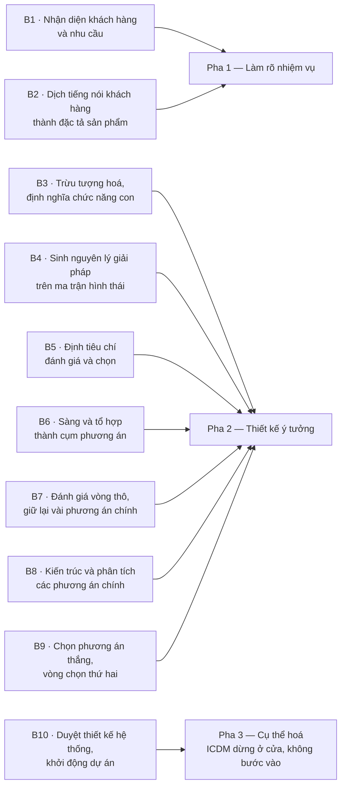

Bảy trên mười bước nằm gọn trong pha hai. Hai bước đầu ngồi ở pha một. Bước cuối là một cái cửa, không
phải một việc: nó chốt hồ sơ tại mốc duyệt thiết kế hệ thống rồi bàn giao cho pha cụ thể hoá — và ICDM
không nói gì thêm về pha ấy.

Điều này đáng chú ý vì bản thân Pahl-Beitz đã phân rã pha ý tưởng thành bảy bước:
`"The process consists of seven steps (Pahl, et al., 2007)."` [48]. Bảy bước ở đây là bảy bước của riêng
pha ý tưởng, không phải bảy bước toàn quy trình của VDI 2221:1993 ở Chương 04; hai con số bằng nhau và
không liên quan gì nhau. Vậy ICDM lấy bảy bước định tính và bơm thành chín bước định lượng cộng một cửa
duyệt. Đó là toàn bộ phép biến đổi.

| Pha Pahl-Beitz | ICDM làm gì ở đây |
|---|---|
| Pha 1 — Làm rõ nhiệm vụ | Nong ra hai bước, thay danh sách yêu cầu bằng một chuỗi chấm điểm được |
| Pha 2 — Thiết kế ý tưởng | Nong ra bảy bước, gắn thước đo vào mọi khớp nối, hai vòng chọn thay vì một |
| Pha 3 — Cụ thể hoá | Không chạm. Bước 10 giao hồ sơ rồi dừng |
| Pha 4 — Thiết kế chi tiết | Không chạm |

Đọc bảng này theo chiều dọc thì thấy hình dạng thật của ICDM: không phải một phương pháp thiết kế đối
thủ, mà **một cái kính lúp đặt lên đúng một pha**. Nó thừa nhận ba pha kia của Pahl-Beitz nguyên vẹn.
Mọi thứ nó đòi hỏi, nó đòi trong khoảng thời gian trước khi có bản vẽ đầu tiên.

## Bộ công cụ — chỉ tên, và chỗ chúng cắt vào

| Công cụ | Cắt vào đâu |
|---|---|
| **EQFD** | Bước 2 — chỗ tiếng nói khách hàng biến thành đặc tả, tức đúng đường ranh pha 1 sang pha 2 |
| **TVDT** | Cũng bước 2, nhưng ở lát mỏng nhất của nó: khoảnh khắc một giá trị mục tiêu bị chốt thành số |
| **DSO** | Bước 6 — chỗ ma trận hình thái nổ tổ hợp và buộc phải sàng |
| **CFMA** | Bước 8 — kéo phân tích chế độ hỏng lên trước khi có linh kiện nào để hỏng |
| **CDTC** | Bước 8 — kéo dự toán chi phí lên trước khi có bảng kê vật tư nào để cộng |
| **RTA** | Bước 8 — kéo tiến độ và rủi ro lên trước khi có kế hoạch nào để trượt |
| **Robustool** | Bước 8 — chấm mức chịu đựng của phương án trước khi có mẫu nào để thử |

Trên các công cụ ở bảng còn một tầng đo nữa — DQM chấm chất lượng của chính quá trình thiết kế, CSR quy
đổi mức hài lòng khách hàng thành hàm số. Chúng không phải công cụ thiết kế; chúng là thước đo đặt lên
người đang thiết kế. Giữ phân biệt đó, vì mục sau xoay quanh nó.

Hai chuyện phải nói ra ở đây, và cả hai đều về cách bảng này được dựng. **Một:** không nguồn nào trong
66 tài liệu tự đếm số công cụ của ICDM — một tệp khám phá kể sáu tên, bảng trên có bảy dòng, và danh
mục thuật ngữ của cuốn sách này có tám. Vì vậy bảng gọi tên từng cái thay vì gộp thành một con số, và
cụm *"bảy công cụ ICDM"* không được dùng như một khẳng định ở đâu trong sách. **Hai:** phép chia giữa *công cụ thiết kế*
(bảng trên) và *thước đo đặt lên người thiết kế* (DQM, CSR) là **thao tác của cuốn sách này**, không
nguồn nào phát biểu nó. Phép chia ấy có ích cho luận điểm ở mục sau — nhưng nó là của người viết, và
người đọc có quyền không nhận.

Công thức, thang điểm, biểu mẫu và ca áp dụng của từng cái: `icdm-hari-weiss`. Chương này dừng ở đây.

## Canh bạc: một tổ chức chịu chấm điểm khi chưa có gì để đo

Ba phương pháp ở các chương trước đặt cược vào những thứ khá quen: hợp tác liên ngành thông suốt, kỷ
luật quy trình, đủ tiền cho pha trừu tượng. ICDM đặt cược vào một thứ khác hẳn, và khó hơn nhiều.

Điểm số của nó **không có vật đối chiếu bên ngoài**. Ở nhà máy, tỷ lệ phế phẩm là một sự thật: đếm được,
lặp lại được, không ai cãi. Ở pha ý tưởng thì không có gì như thế, và chính các tác giả viết ra điều đó
bằng một câu thẳng thắn đến mức hiếm gặp trong văn liệu phương pháp:
`"We can compare design process data only against forecasts or expectations. These metrics are
subjective and subjected to personal influence, power and pressure."` [46].

Vế cuối: *power and pressure*. Tác giả của một phương pháp định lượng viết ra rằng con số của chính
mình chịu tác động của quyền lực. Vậy canh bạc là: ICDM giả định một tổ chức mà ở
đó một con số do đội thiết kế sinh ra sống sót được qua một cuộc họp có mặt cấp trên. Không phải giả
định về năng lực kỹ thuật. Giả định về quan hệ quyền lực.

Bốn giả định con nữa xếp ngay dưới nó, mỗi cái có nguyên văn của chính tác giả.

**Giả định về văn hoá, không phải về công cụ.** Hệ đo DQM chỉ chạy nếu cả doanh nghiệp đã sống bằng QFD:
`"However, a practical application of deployments in DQM requires comprehensive implementation of QFD
across the organization as a way of living for all the product development teams."` [46]. Cụm *way of
living* không phải cách nói hoa mỹ — nó là điều kiện tiên quyết. Một xưởng muốn dùng ICDM ở một dự án
đơn lẻ đã vi phạm điều kiện này ngay từ ngày đầu.

**Giả định rằng đội chấp nhận hằng số do người khác đặt.** Thuật toán của Robustool chạy trên các hằng
số `a = 3`, `b = 0.2`, `x0 = 10`, và tác giả không giấu nguồn gốc của chúng:
`"The above parameters can be modified by the user in order to fit to his/hers project and needs. The
numbers and equations are arbitrary, and were found to be appropriate for this case."` [56]. Kèm theo là
một câu tự hạ thấp nữa: `"This score is by no means considered as binding... the table is considered as
a guide only."` [56]. Một điểm số không ràng buộc rơi vào một tổ chức quen coi mọi điểm số là ràng buộc
thì biến thành vũ khí; rơi vào một tổ chức coi nó là chỉ dẫn thì làm đúng việc của nó. Phương pháp không
có cách nào biết nó vừa rơi vào tổ chức nào.

**Giả định rằng mức chấp nhận rủi ro là thứ đội thiết kế được phép chọn.** RTA nén tiến độ bằng cách
chạy song song các việc khi khoảng trống tri thức chưa khép, và tác giả nói thẳng cái giá:
`"As shown, the ability to reduce times and to work simultaneously is a function of the willingness to
take risks."` [55]. Đó là một quyết định quản trị, không phải một quyết định kỹ thuật. ICDM trao cho kỹ
sư một cái núm vặn mà quyền vặn thuộc về người khác — và không bước nào trong mười bước quy định ai vặn.

**Giả định rằng đội sẽ bác con số bằng tay khi con số sai.** Thuật toán sàng tổ hợp không kiểm tương
thích chéo, và kết quả đo được là:
`"In each of our experimental projects, two or more unacceptable combinations were includeded in the
solutions suggested by the algorithms."` [57]. *Trong mọi dự án thử nghiệm.* Phương pháp cần những kỹ sư
sẵn sàng gạt kết quả máy tính đi.

Đặt giả định đầu và giả định cuối cạnh nhau thì lộ ra chỗ căng nhất của ICDM. Giả định đầu cần những
người **bảo vệ con số trước quyền lực**. Giả định cuối cần chính những người đó **bác con số bằng trực
giác**. Hai khí chất khác nhau, đòi hỏi trong cùng một phòng, cùng một tuần, đôi khi cùng một cuộc họp.
Không tài liệu nào trong cụm ICDM nói cách phân biệt lúc nào cần khí chất nào — và việc chỉ ra sự căng
này là thao tác của cuốn sách này, không phải phát hiện của nguồn.

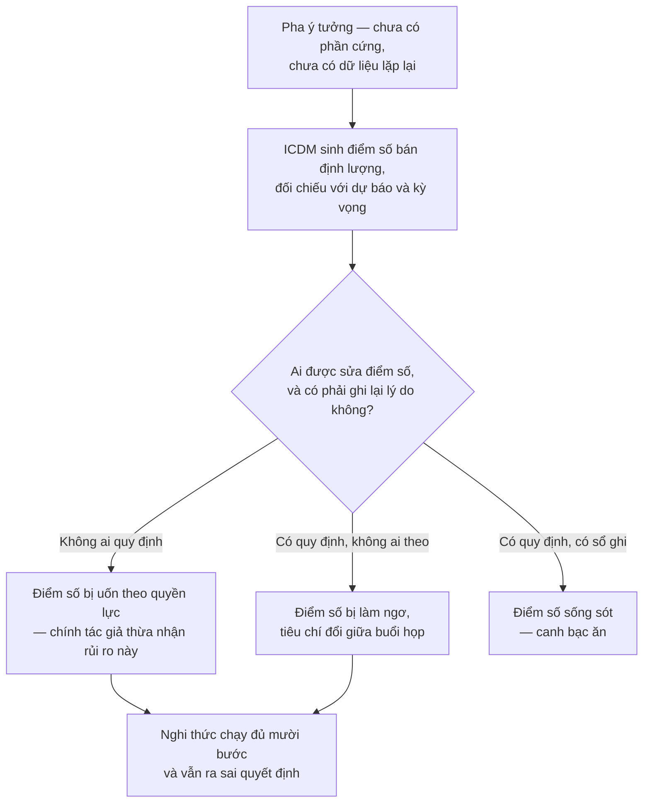

Nhánh giữa không phải giả thuyết. Một thí nghiệm trên người thiết kế chuyên nghiệp đo đúng nó:
`"Previous research has shown that structured methods are often not used properly or at all in design
practice. ... The experiment involved sixteen professional designers... furthermore, some internal
conflicts appeared between different concept evaluation tasks."` [44]. Mười sáu người. Cỡ mẫu ấy không đỡ
nổi một khẳng định về ngành, và nó đủ cho khẳng định hẹp mà chương này dùng: tiêu chí đánh giá bị đổi
giữa chừng, bởi chính những người vừa đồng ý với nó nửa giờ trước.

> **Đào sâu: hai con số cho cùng một mệnh đề, cùng một nguồn gốc**
>
> Mệnh đề trung tâm biện minh cho toàn bộ ICDM là *pha ý tưởng khoá phần lớn chi phí vòng đời*. Trong
> cụm tài liệu này nó xuất hiện với **hai** con số khác nhau. Một:
> `"Most of the product's performance is determined and more than 75% of its life cycle cost is
> committed during the conceptual design phase."` [45]. Hai:
> `"about 80 % of the life cycle cost is committed in this stage (Blanchard ,1978)."` [47].
>
> Chênh nhau năm điểm phần trăm thì không nghiêm trọng. Nghiêm trọng là chỗ khác: cả hai đều truy về
> **cùng một tài liệu năm 1978** — bản thứ hai ghi rõ Blanchard 1978, và một bài khác trong cụm cũng
> ghi `"About 75 % of the life cycle cost is committed in this stage (Blanchard, 1978)."` [50]. Cùng
> một nguồn gốc, được trích ở hai giá trị, trong các bài của cùng một trường phái.
>
> Không ai gian dối ở đây. Nhưng con số nền móng của một phương pháp định lượng đã trôi qua bốn thập
> niên trích dẫn lại nhau mà không ai đo lại. Khi dùng nó để thuyết phục ban lãnh đạo rằng phải đầu tư
> vào pha ý tưởng, hãy nói "một ước lượng từ 1978, được trích ở 75% và 80% tuỳ tài liệu" — chứ đừng nói
> "75%" như một phép đo.

Còn một chi tiết nữa, nhỏ mà nói lên nhiều: cuốn sách giáo khoa gốc của ICDM chưa từng được viết. Cụm
tài liệu ghi lại lý do phương pháp này không lan ra ngoài vài nơi — `"except in Australia, probably
because a basic book has not been written"` [44], [46]. Một phương pháp *prescriptive* toàn diện, mười
bước, một bộ công cụ định lượng đầy đủ, và một chương trình nghiên cứu chạy tại Technion từ **1996 đến
2001** — đúng hai mốc mà chương này đã trích ở đoạn mở, `"during 1996 and 2001"` [49], không phải một
con số tròn nào khác — và cửa ngõ phổ biến của nó là hội thảo cùng giáo trình đại học. Điều đó không nói gì về chất lượng kỹ thuật của ICDM. Nó nói rất nhiều về việc một phương pháp cần
gì để đi được vào tổ chức khác, và Chương 17 sẽ quay lại đúng điểm này.

## Giả định nằm dưới cả bốn: rằng cái nền mô tả đúng người thiết kế

ICDM giữ nguyên ba pha còn lại của Pahl-Beitz, và giữ luôn mô hình tuyến tính làm nền cho chúng. Mô hình
ấy dự báo rằng các vấn đề về cấu trúc vật lý và hành vi của cấu trúc chỉ nổi lên ở các pha sau. Một phân
tích giao thức đo được điều ngược lại:
`"While PBSA predicts that these design issues will not occur until later during designing, for the
second-year students the opposite was the case: They produced structure issues and structure behaviour
issues very early on in their design sessions."` [53].

Đối tượng đo là sinh viên năm hai, không phải kỹ sư dày dạn — phải nói ra, vì đó là giới hạn thật của
bằng chứng. Nhưng tác giả chặn sẵn lối thoát quen thuộc, rằng "mô hình có vòng lặp nên vẫn đúng":
`"Even if iterations in PBSA (which Pahl and Beitz do not exclude) were to be taken into account
(including intra- and inter-stage iterations), there would still be no early occurrence of structure
issues and structure behaviour issues in their model."` [53].

Hệ quả cho ICDM lớn hơn cho Pahl-Beitz. Pahl-Beitz mô tả một trình tự; ICDM **chấm điểm** việc đi theo
trình tự đó. Nếu cái đầu người thiết kế nhảy sang cấu trúc vật lý ngay từ buổi đầu, thì bước trừu tượng
hoá thành chức năng con trước khi nghĩ về vật không phải là mô tả cái đang xảy ra — nó là một mệnh lệnh
chống lại cái đang xảy ra. Và khi có thước đo gắn vào, điểm số cao mang hai nghĩa không phân biệt được từ
bên ngoài: phương án tốt, hoặc đội đã học được cách điền bảng.

Canh bạc thứ hai chồng lên canh bạc thứ nhất, và hai cái không cùng loại: cái thứ nhất cược vào quan hệ
quyền lực trong phòng họp, cái thứ hai cược rằng cái nền mà phương pháp đứng lên mô tả đúng cách người
thiết kế thật sự làm việc. Chương 12 mở lại đúng trục này dưới tên gọi của nó: *quy định* so với *mô tả*.

Cần nói nốt vế còn lại, nếu không ICDM ở chương này trông thuần là chi phí. Canh bạc ăn thì tổ chức
được một thứ mà phán đoán không cho: **một quyết định pha ý tưởng có ngày tháng và có tên người chấm.**
Một điểm số tồi nhưng ghi ra vẫn đọc lại được sau sáu tháng, khi sự cố xảy ra và câu hỏi đầu tiên là
*"lúc đó ta biết gì"*. Phán đoán giỏi mà không dấu vết thì lần sau phải làm lại từ đầu, và không ai
học được gì từ lần trước. Chương 10 nói cùng điều này bằng chữ khác — bảng chấm điểm không tạo ra
quyết định đúng, nó tạo ra bằng chứng rằng quyết định đã được ra một cách có thể bảo vệ được.

## Tầng đòn bẩy: nêu vấn đề, chưa xếp hạng

Chương 15 mới dựng thang đo tầng đòn bẩy đầy đủ và Chương 16 mới xếp toàn bộ công cụ lên đó. Ở đây chỉ
cần đặt câu hỏi cho đúng, vì ICDM là ca sạch nhất trong cả cuốn để đặt nó.

**ICDM tự nhận nó can thiệp ở đâu?** Tự nhận rất cao. Nó đòi đổi cách tổ chức nghĩ về chuyện đo lường
thiết kế — đòi QFD thành *way of living* cho mọi đội phát triển sản phẩm. Đó là một yêu cầu ở tầng hệ
hình tư duy, gửi tới toàn doanh nghiệp.

**Nó thật sự giao ra cái gì?** Giao ra tham số. Ma trận nhu cầu bị chặn ở
`"15-20 system level needs (rows)"` và `"20 – 25 product characteristics (columns)"` [46], sau khi tác
giả ghi nhận `"A matrix of more than 20x20 or 15x25 is impractical to handle because it consumes too
much time."` [46]; tiêu chí lọc vòng thô phải phủ `"at least 70% of the customer satisfaction"` còn vòng
tinh `"at least 95% of the customer satisfaction"` [47]; dự toán chi phí sớm sai trong dải
`"within 20% of the final actual unit manufacturing cost"` [50]; và ba hằng số của Robustool thì tác giả
gọi thẳng là *arbitrary* [56]. Đây là những con số cụ thể, chỉnh được bằng một cuộc họp — tức đúng loại
can thiệp yếu nhất trên thang Meadows.

Khoảng cách giữa hai điều trên là toàn bộ vấn đề. Việc ánh xạ công cụ thiết kế vào thang đòn bẩy là
**thao tác của cuốn sách này**; Meadows không viết một chữ nào về thiết kế kỹ thuật, và không nguồn nào
trong 66 tài liệu đặt hai thứ cạnh nhau. Nhưng chênh lệch tự-nhận so với thật thì không cần Meadows mới
thấy — nó nằm ngay trong hai câu của cùng một tác giả, cách nhau vài trang.

Còn một giới hạn tác giả tự vạch, đáng ghi vì nó thu hẹp phạm vi rất nhiều: RTA vô dụng với dự án lặp
lại đã biết trước công việc — `"A classical repetitive project, like the construction of a building can
be planned and presented in a network of known activities, with the time required to complete each
activity evaluated at reasonable precision and variance levels."` [55]. ICDM chỉ có nghĩa khi thứ đang
làm là mới. Với việc làm lại lần thứ mười, nó là chi phí thuần.

## Chỗ ICDM đứng trong hàng

Đặt bốn canh bạc cạnh nhau thì thấy ICDM không đòi thêm cùng loại với ba phương pháp trước — nó đòi một
loại khác. Bảng dưới là **tổng hợp của cuốn sách này**, dựng từ danh sách giả định mà Chương 13 sẽ mở ra
đầy đủ; không nguồn nào trong 66 tài liệu xếp bảng này.

| Phương pháp | Đòi ở tổ chức thứ gì trước tiên |
|---|---|
| Pahl-Beitz (Ch03) | Kỷ luật đi qua pha trừu tượng, và tiền để ở lại pha đó đủ lâu |
| VDI 2221:1993 (Ch04) | Chịu để một tiêu chuẩn bên ngoài định nghĩa trình tự làm việc bên trong |
| VDI 2206 (Ch06–07) | Thuật ngữ chung giữa cơ, điện và phần mềm, và niềm tin vào mô hình ảo |
| ICDM (Ch08) | **Chịu chấm điểm chính mình khi chưa có gì để đo — và để con số ấy sống** |

Ba dòng đầu là những đòi hỏi về nguồn lực và kỷ luật. Dòng cuối là một đòi hỏi về quyền lực. Đó là lý do
ICDM khó lan hơn cả ba, dù về kỹ thuật nó là cái được suy nghĩ kỹ nhất cho pha mà nó nhắm vào.

## Áp dụng ở Xưởng

Bối cảnh: một xưởng cơ khí — điện tử — phần mềm nhúng vài chục người, đang có vài sản phẩm ở pha ý tưởng
với ràng buộc nội địa hoá. Không đủ người để chạy cả mười bước, và không nên chạy.

### 1. Chốt trong tuần này: ai được sửa một điểm số, và sửa thì ghi ở đâu

Quyết định này ra được ngay, không cần công cụ nào, không cần đào tạo ai. Trước khi xưởng chấm điểm bất
kỳ phương án nào, viết ra một trang: điểm số của một phương án chỉ được sửa bởi người đã đặt ra nó hoặc
bởi người chủ trì thiết kế; mọi lần sửa ghi một dòng gồm ngày, ô bị sửa, giá trị cũ, lý do. Không cần
phần mềm, một tệp bảng tính là đủ. **Vấn đề nó giải:** chính tác giả ICDM thừa nhận điểm số ở pha ý
tưởng chịu tác động của quyền lực và áp lực; luật này không xoá được áp lực nhưng bắt nó để lại dấu vết.
**Bẫy:** nếu người chủ trì thiết kế cũng là người duyệt ngân sách thì luật vô hiệu ngay hôm ký — khi đó
phải tách hai vai, hoặc đừng chấm điểm và nói thẳng rằng quyết định này ra bằng phán đoán.

### 2. Chọn đúng một công cụ định lượng cho pha ý tưởng, không phải cả bộ

**Vấn đề nó giải:** cả bộ công cụ đòi một tổ chức đã sống bằng văn hoá đo lường; một xưởng vài chục
người áp hết một lượt sẽ dựng đủ nghi thức mà không đội nào tin con số nào. **Cách áp:** chọn một công cụ theo chỗ
đau nhất — hay trượt tiến độ thì lấy công cụ rủi ro–tiến độ, hay vỡ giá thành thì lấy công cụ dự toán
sớm — chạy nó ở hai dự án liên tiếp rồi mới bàn đến công cụ thứ hai. **Bẫy:** chọn công cụ theo cái dễ
học nhất thay vì theo chỗ đau nhất, rồi kết luận "phương pháp này không hợp với xưởng mình".

### 3. Chặn kích thước bảng nhu cầu trước khi mở nó ra

**Vấn đề nó giải:** bảng đối chiếu nhu cầu khách hàng phình đến mức không ai phân tích nổi đánh đổi, rồi
bị bỏ giữa chừng — đúng điều ICDM ghi nhận khi vượt cỡ 20×20 hoặc 15×25. **Cách áp:** đặt trần số hàng
và số cột **trước** buổi làm việc đầu tiên và dán nó lên bảng; thứ không lọt vào trần thì không biến mất
mà xuống một danh sách chờ có ghi ngày. **Bẫy:** cắt hàng cho vừa trần mà không ghi lại cái đã cắt —
tháng sau một nhóm khách hàng biến mất khỏi hồ sơ và không ai nhớ ai đã bỏ họ đi.

### 4. Tách cấu phần chưa có bằng chứng khả thi ra khỏi kế hoạch dự án

**Vấn đề nó giải:** một cấu phần chưa ai chứng minh là chạy được thì số vòng lặp cần thiết là bất khả dự
báo, và ICDM nêu thẳng rằng loại cấu phần này phải chạy như một đề tài nghiên cứu riêng trước khi dự án
bắt đầu. **Cách áp:** trước khi lên tiến độ, đi qua danh mục cấu phần và gắn nhãn cho từng cái — *đã
từng làm* / *đã có người khác làm* / *chưa ai chứng minh chạy được*; nhãn thứ ba bị gỡ khỏi đường găng
và cấp một mốc riêng chỉ để chứng minh khả thi. **Bẫy:** gắn nhãn sau khi đã hứa ngày giao hàng — lúc đó
cái nhãn chỉ còn là lời giải thích cho việc trễ.

### 5. Mở sổ ghi những chỗ con số sai và đội đã bác nó bằng tay

**Vấn đề nó giải:** thuật toán sàng tổ hợp của ICDM sinh ra tổ hợp không dùng được trong **mọi** dự án
thử nghiệm mà chính tác giả chạy; nếu không ai ghi lại chuyện đội đã bác gì và vì sao, thì lần sau con
số thắng mặc định vì không có bằng chứng ngược. **Cách áp:** một dòng mỗi lần — phương án bị bảng điểm
xếp cao mà đội bác, kèm lý do kỹ thuật; đọc lại sổ đó ở đầu mỗi dự án mới. **Bẫy:** sổ này rất dễ biến
thành nơi hợp thức hoá mọi lần phá luật; chốt chặn là mỗi dòng phải nêu một lý do **kỹ thuật** kiểm
được, không phải một sở thích.


# Phần III — Công cụ, và điều chúng lặng lẽ đòi hỏi

> *Một công cụ không bao giờ chỉ là một công cụ. Nó là một yêu cầu gửi tới tổ chức, viết bằng mực vô hình.*


# Chương 09 — Sinh giải pháp: hộp đen, cấu trúc chức năng, ma trận hình thái

Mọi phương pháp trong Phần II đều nói cho ta biết có những pha nào, pha nào đứng trước pha nào, và sản
phẩm bàn giao của mỗi pha là gì. Không phương pháp nào trong số đó nói **các phương án ở đâu ra**. Giữa
pha ý tưởng có một lỗ thủng đúng ở tâm: đến một lúc nào đó phải có người đẻ ra nhiều hơn một câu trả lời,
nếu không thì toàn bộ bộ máy chấm điểm phía sau chỉ là nghi lễ — chọn một trong một. Ba công cụ lấp lỗ
thủng đó, và chúng luôn đi thành chuỗi: hộp đen, cấu trúc chức năng, ma trận hình thái. Thiếu chúng, cái
gọi là "chọn phương án" chỉ còn là hợp lý hoá cho phương án duy nhất mà người có kinh nghiệm nhất trong
phòng đã nghĩ ra từ đầu.

Chương 08 để lại đúng chỗ trống này. ICDM cắm thước đo vào pha chưa có gì để đo, và canh bạc của nó là
một tổ chức chịu chấm điểm khi vật để chấm còn chưa thành hình. Nhưng thước đo giả định có vật. Chương 08
không trả lời — và không có nhiệm vụ trả lời — câu hỏi vật ấy từ đâu tới. Phần III bắt đầu từ đó, và bắt
đầu bằng cụm công cụ đứng ngay thượng nguồn của mọi thang chấm: cụm sinh giải pháp.

Chương này để lại ba thứ. Thứ nhất: vì sao trật tự hộp đen → cấu trúc chức năng → ma trận hình thái
**không đảo được**, và cái gì hỏng cụ thể khi có người đảo nó. Thứ hai: giới hạn của từng công cụ, bằng
đúng chữ của chính các tác giả viết ra chúng — không phải bằng lời phê bình từ bên ngoài. Thứ ba, và là
lý do chương này mở Phần III: **đòi hỏi ngầm**. Cả ba công cụ đều buộc người dùng phân rã được *chức năng*
trước khi biết *giải pháp*. Bằng chứng thực nghiệm nằm ngay trong sách gốc nói rằng kỹ sư có kinh nghiệm
thật sự không nghĩ theo chiều đó. Đó là canh bạc riêng của cụm công cụ này, và nó là nền cho Chương 12.

---

## Ba công cụ là một chuỗi, không phải một bộ đồ nghề

Cách trình bày thông thường xếp ba công cụ này thành danh sách: đây là hộp đen, đây là cấu trúc chức
năng, đây là ma trận hình thái, dùng cái nào tuỳ bài toán. Cách đó sai ở một điểm kiểm chứng được:
**đầu ra của công cụ trước là đầu vào bắt buộc của công cụ sau.** Không phải theo nghĩa "nên có", mà theo
nghĩa nếu thiếu thì công cụ sau không có gì để chạy.

Nguồn duy nhất trong tài liệu làm việc mô tả cả ba công cụ theo trục đầu vào — đầu ra là một bài giảng
tiếng Tây Ban Nha về phương pháp luận VDI 2221 `[17]`. Bài giảng ấy xếp chuỗi như sau:

| Công cụ | Đầu vào | Đầu ra | Đầu ra này đi đâu |
|---|---|---|---|
| **Hộp đen** | Yêu cầu cốt lõi từ khách hàng; tài nguyên sẵn có | Sơ đồ khối thể hiện chuyển hoá tổng thể của năng lượng, vật liệu, tín hiệu | Vào cấu trúc chức năng |
| **Cấu trúc chức năng** | Sơ đồ hộp đen tổng thể | Sơ đồ các khối chức năng cục bộ được liên kết | Vào ma trận hình thái |
| **Ma trận hình thái** | Sơ đồ cấu trúc chức năng | Ma trận đầy đủ + các bản phác thảo tay của khái niệm giải pháp | Vào pha thiết kế sơ bộ, tức Chương 10 |

Đọc ngược bảng này thì thấy ràng buộc: ma trận hình thái không nhận đầu vào nào khác ngoài cấu trúc chức
năng. Thiếu nó, cột trái của ma trận sẽ được điền bằng thứ khác — và thứ khác ấy, gần như luôn luôn, là
**danh sách bộ phận**. Đó là chế độ hỏng cụ thể nhất của cả cụm, và ta sẽ quay lại nó ở mục riêng.

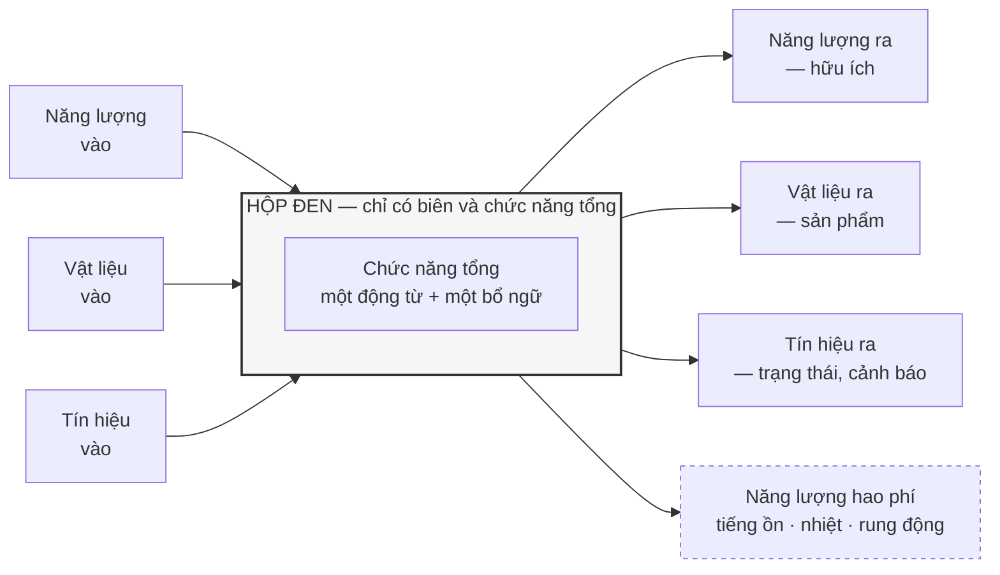

Sơ đồ trên là hộp đen theo mô tả của `[17]`: một khối chữ nhật đại diện cho biên hệ thống, các dòng đi
vào, các dòng đi ra, và — điểm mà phần lớn người vẽ bỏ quên — **các dòng ra hao phí**. Nguồn nói thẳng
rằng dòng hao phí không phải trường hợp ngoại lệ mà là thuộc tính của mọi máy:
`"toda máquina me genera ruido me genera calor que genera vibración que son tipos de energía de hecho es
la energía que se transforman en ruido en calor en vibración"` `[17]`. Tiếng ồn, nhiệt và rung động là
năng lượng, và chúng đi ra khỏi biên dù ta có vẽ chúng hay không.

**Một điều phải nói rõ về con số ba.** Cách gọi quen thuộc — "hộp đen ba dòng chảy" — không xuất hiện
trong nguồn dưới dạng một câu phát biểu con số. Cái nguồn thật sự nói là:
`"en los tres casos hay una energía que iniesta hay un material o probeta en este caso que ingresa a mi
caja negra y hay una señal"` `[17]` — nguồn gọi tên từng dòng một, năng lượng, vật liệu, tín hiệu, chứ
không tuyên bố "có ba loại dòng". Khác biệt này nghe vụn vặt nhưng nó chính là ranh giới giữa *cái nguồn
nói* và *cái người đọc gán vào nguồn*. Chương này giữ ranh giới đó ở mọi chỗ có con số.

**Và một khoảng trống phải khai báo.** Bốn tài liệu học thuật tiếng Anh về cụm công cụ này trong tài liệu
làm việc — `[29]`, `[32]`, `[38]`, `[39]` — **không có một dòng nào về hộp đen**. Không định nghĩa, không
quy trình, không phê bình. Toàn bộ vật liệu về hộp đen trong chương này đến từ một bài giảng tiếng Tây Ban
Nha. Đó không phải lỗ hổng của việc khai thác; đó là một dữ kiện về chính công cụ: hộp đen sống trong
giáo trình và bài giảng, không sống trong văn liệu bình duyệt. Một công cụ không ai viết bài phê bình về
nó là một công cụ không ai kiểm chứng nó.

---

## Cấu trúc chức năng: mở hộp ra, và cái giá của việc mở

Hộp đen cố tình không cho biết bên trong có gì. Cấu trúc chức năng là thao tác mở nó ra — nhưng mở ra
thành *chức năng*, chưa phải thành *bộ phận*. `[17]` mô tả thao tác này thành ba động tác: phân rã vấn
đề tổng thể thành các **vấn đề cục bộ** (*problemas parciales*); tiếp tục chia nhỏ vấn đề cục bộ thành
**vấn đề cá nhân** (*problemas individuales*) nếu cần; rồi thiết lập liên kết tuần tự hoặc song song
giữa các khối để dòng năng lượng, vật liệu, tín hiệu lưu thông được từ đầu vào đến đầu ra.

Động tác thứ ba mới là động tác khó, và cũng là chỗ một sơ đồ chức năng tự bộc lộ nó đúng hay sai. Nếu có
một khối nhận vật liệu vào mà không có dòng vật liệu nào ra, sơ đồ sai. Nếu có một dòng tín hiệu xuất
hiện giữa sơ đồ mà không truy được về đầu vào nào, sơ đồ sai. Đây là tính chất hiếm của công cụ này:
**nó tự kiểm được**, không cần chuyên gia bên ngoài.

```mermaid
flowchart TD
    BB["HỘP ĐEN<br/>chức năng tổng"]
    BB --> P1["Vấn đề cục bộ 1<br/>nhận &amp; định vị"]
    BB --> P2["Vấn đề cục bộ 2<br/>biến đổi"]
    BB --> P3["Vấn đề cục bộ 3<br/>tách &amp; phân loại"]
    BB --> P4["Vấn đề cục bộ 4<br/>chuyển giao ra"]

    P2 --> I1["Vấn đề cá nhân 2a<br/>cấp năng lượng"]
    P2 --> I2["Vấn đề cá nhân 2b<br/>điều khiển mức"]
    P3 --> I3["Vấn đề cá nhân 3a<br/>giữ phần hữu ích"]
    P3 --> I4["Vấn đề cá nhân 3b<br/>thải phần bỏ"]

    P1 -. "dòng vật liệu" .-> P2
    P2 -. "dòng vật liệu" .-> P3
    P3 -. "dòng vật liệu" .-> P4
    I2 -. "dòng tín hiệu" .-> I1

    style BB fill:#f6f6f6,stroke:#333,stroke-width:2px
```

Hai mức trong sơ đồ — cục bộ rồi cá nhân — là hai mức mà `[17]` mô tả, không phải phân tầng do cuốn sách này đặt ra. Ví
dụ mà bài giảng dùng là một máy thu hoạch khoai tây, và nguồn xác nhận số lượng khối cục bộ trong ví dụ
đó bằng câu `"seis soluciones parciales en este caso"` `[17]`. Sáu, cho một máy nông nghiệp. Con số ấy
đáng ghi lại vì nó sẽ va vào một khuyến nghị khác ở mục sau.

Phía tài liệu tiếng Anh, cùng thao tác này mang tên **functional analysis** và được trình bày gọn hơn:
xác định các chức năng chính của sản phẩm, rồi chẻ mỗi chức năng chính thành các chức năng con `[32]`.
Ví dụ kinh điển là cây chức năng của bình pha cà phê kiểu Pháp: *Pha cà phê* chẻ thành cân hạt, nghiền
hạt, trộn hạt với nước trong bình chứa, tách bã khỏi cà phê, rót ra phục vụ. Mục đích được nói thẳng —
để đội thiết kế tập trung vào yêu cầu chức năng thiết yếu **thay vì bị giới hạn sớm bởi các bộ phận vật
lý cụ thể**.

Đến đây công cụ nghe rất ổn. Rồi chính các tài liệu ấy nói ra hai giới hạn, và cả hai đều nằm ở tầng
người dùng chứ không ở tầng kỹ thuật.

Giới hạn thứ nhất là **không có cơ chế bảo đảm đầy đủ**:
`"However, function analysis does not guarantee that all the relevant (sub) functions are identified."`
`[38]`. Đọc kỹ chữ *guarantee*. Không ai hứa. Cấu trúc chức năng là một cái lưới, và không có mệnh đề nào
trong phương pháp nói rằng lưới ấy kín. Một chức năng bị bỏ sót ở đây sẽ không xuất hiện ở ma trận hình
thái, sẽ không được sinh giải pháp, sẽ không được chấm điểm — và sẽ xuất hiện trở lại ở pha cụ thể hoá
dưới dạng một bộ phận phát sinh không ai lên kế hoạch.

Giới hạn thứ hai nặng hơn, vì nó nói về người chứ không về công cụ:
`"In addition to this, it is known that designers have had difficulties identifying the sub-functions in
the first place."` `[29]`. Cụm *in the first place* mới là chỗ đau: khó khăn không nằm ở bước tổ hợp hay
bước chấm điểm, nó nằm ngay ở động tác đầu tiên — động tác mà toàn bộ chuỗi phụ thuộc vào.

Và sách gốc của Pahl-Beitz `[1]` nói ra nguyên nhân, bằng ngôn ngữ tâm lý học nhận thức:
`"Abstracting and creating function structures often causes difficulties because of the abstract
representation. Designers are more used to thinking in objects and visual images [12.6]."` Kỹ sư quen
nghĩ bằng vật thể và hình ảnh. Cấu trúc chức năng đòi họ nghĩ bằng động từ. Đây là một trong ba trích dẫn
làm nên trục của chương này, và cả ba đều đến từ cùng một cuốn — điều đó phải được nói ra: `[1]` là
toàn văn sách Pahl-Beitz, chiếm 32% corpus. Trích dày từ nó có thể vì nó đúng, cũng có thể chỉ vì nó dài. Ở chỗ này, may mắn là ba nguồn độc lập khác — `[29]`,
`[38]`, `[39]` — nói cùng một điều bằng chữ khác.

---

## Ma trận hình thái: nơi tổ hợp thay chỗ cho sáng tạo

Công cụ thứ ba biến cấu trúc chức năng thành một bảng: chức năng con nằm một trục, các cơ cấu vật lý có
thể đảm nhiệm chức năng đó nằm trục kia. Phương pháp do Zwicky đặt ra —
`"Morphological charts were developed by Zwicky (1967) who was an astrophysicist..."` `[29]` — và điều
đáng chú ý ngay từ dòng tiểu sử ấy là nó **không sinh ra trong ngành thiết kế cơ khí**. Nó là một công
cụ khảo sát không gian khả năng, được ngành thiết kế mượn về.

Tài liệu làm việc chứa **ba quy trình khác nhau** cho cùng một công cụ, và chúng khác nhau ở chỗ có ý
nghĩa.

**Quy trình A — sinh ý tưởng** (Tiwari và cộng sự): `Step 1: DECOMPOSITION` liệt kê chức năng con ·
`Step 2: GENERATION` tìm giải pháp cho từng chức năng con · `Step 3: COMBINATION` khám phá các tổ hợp và
tìm một tổ hợp hợp với phát biểu bài toán `[38]`.

**Quy trình B — dựng ma trận đầy đủ** (Roozenburg & Eekels, qua Delft Design Guide): phát biểu bài toán
chính xác nhất có thể · nhận diện mọi tham số có thể xuất hiện trong giải pháp, tức các chức năng và chức
năng con · dựng ma trận với tham số làm cột · điền hàng bằng các thành phần thuộc tham số đó · dùng chiến
lược đánh giá để giới hạn số giải pháp nguyên lý · tạo giải pháp nguyên lý bằng cách ghép **ít nhất một
thành phần từ mỗi tham số** · phân tích và đánh giá mọi giải pháp theo tiêu chí thiết kế và chọn ra một
số hữu hạn giải pháp nguyên lý · phát triển chi tiết các giải pháp đã chọn ở phần còn lại của quy trình
`[38]`.

**Quy trình C — chạy ngược để phân tích sản phẩm có sẵn** (Hülagü & Timur): `Step 1: COLLECT EXISTING
PRODUCTS` · `Step 2: MAKE A LIST OF SUB-FUNCTIONS` · `Step 3: PLACE EXISTING PRODUCTS` `[29]`. Ở chế độ
này ma trận không sinh ra gì cả — nó chụp lại không gian thiết kế mà thị trường đã lấp.

**Không nguồn nào tự đếm số bước của quy trình nào.** Điều này đáng viết ra vì nó là cái bẫy dễ sập nhất
khi viết về phương pháp luận. Tài liệu chỉ in ra `Step 1`, `Step 2`, `Step 3`, hoặc đánh số từ 1 đến 8,
rồi dừng. Không có câu tiếng Anh nào trong tài liệu làm việc viết "phương pháp gồm ba bước" hay "gồm tám
bước". Người viết tự đếm gạch đầu dòng rồi trích như thể tác giả đã nói — đó là cách một con số không tồn
tại được sinh ra và sống mãi trong văn liệu thứ cấp. Ở đây: quy trình A có ba mục được đánh nhãn `Step`,
quy trình B có tám mục được đánh số, và **tác giả không phát biểu con số nào**.

Bảng dưới là cấu trúc ma trận của một hệ pha cà phê, theo minh hoạ trong `[32]`:

| Chức năng con | Phương án 1 | Phương án 2 | Phương án 3 |
|---|---|---|---|
| Đun nước | Electric | Gas | Induction |
| Nghiền hạt | Blade grinder | Burr grinder | — |
| Hãm bã | Drip brewing | French press | Espresso machine |
| Giữ nóng | Carafe | Thermal pot | Heating plate |
| Rót ra | Manual | Automatic | — |

Một lộ trình cắt ngang bảng — Electric + Burr grinder + French press + Thermal pot + Automatic — cho ra
một khái niệm giải pháp hoàn chỉnh. Toàn bộ cơ chế của công cụ nằm ở đó, và nó đơn giản đến mức đáng ngờ.

```mermaid
flowchart LR
    subgraph R1["F1 · Đun nước"]
        A1["Electric"]
        A2["Gas"]
        A3["Induction"]
    end
    subgraph R2["F2 · Nghiền hạt"]
        B1["Blade grinder"]
        B2["Burr grinder"]
    end
    subgraph R3["F3 · Hãm bã"]
        C1["Drip"]
        C2["French press"]
        C3["Espresso"]
    end
    subgraph R4["F4 · Giữ nóng"]
        D1["Carafe"]
        D2["Thermal pot"]
        D3["Heating plate"]
    end

    A1 --> B2 --> C2 --> D2
    A2 --> B1 --> C1 --> D3

    style A1 fill:#e8f0fe,stroke:#1a56db,stroke-width:2px
    style B2 fill:#e8f0fe,stroke:#1a56db,stroke-width:2px
    style C2 fill:#e8f0fe,stroke:#1a56db,stroke-width:2px
    style D2 fill:#e8f0fe,stroke:#1a56db,stroke-width:2px
    style A2 fill:#fdf0e8,stroke:#b45309,stroke-width:2px
    style B1 fill:#fdf0e8,stroke:#b45309,stroke-width:2px
    style C1 fill:#fdf0e8,stroke:#b45309,stroke-width:2px
    style D3 fill:#fdf0e8,stroke:#b45309,stroke-width:2px
```

Hai lộ trình tô màu là hai khái niệm giải pháp. Bảng bốn hàng, mỗi hàng hai đến ba ô, đã cho vài chục lộ
trình. Bốn hàng là ví dụ giáo trình. Mục sau đưa con số của một ma trận thật, đã in trong một cẩm nang đang
được dạy — và nó có tám chữ số.

### Con số mà công cụ tự tạo ra cho chính nó

Đây là chỗ ma trận hình thái tự đào hố, và một con số nói đủ. Không phải con số dựng lên để doạ người
đọc — là ví dụ mẫu của một cẩm nang thiết kế đang được dạy trong trường:

> `"For example, the given morphological chart, the one above for human-powered land vehicles has
> 57,238,272 different combinations..."` `[29]`

Cạnh nó là trần khuyến cáo, nói rất gọn: `"Ideally, there should be no more than 10."` `[39]` — không
quá mười chức năng con.

Hai câu ấy là tất cả những gì chương này cần. Phép đếm lý thuyết cho ma trận 10 × 10, câu nguồn tự rút
hệ quả rằng không quét hết được nên phải giới hạn số chức năng con, và phép phân tích cho thấy **cái
tính chất làm nên giá trị của công cụ chính là cái phải bị cắt bỏ để công cụ dùng được** — tất cả nằm ở
**Chương 11**, nơi chúng chịu lực cho cả một chương chứ không minh hoạ cho một mục. Không dựng lại ở đây.

Đặt hai con số trên cạnh nhau thì thấy khoảng hở. Máy thu hoạch khoai tây trong bài giảng có `"seis soluciones parciales
en este caso"` `[17]` — sáu, nằm dưới trần mười, ổn. Nhưng với một hệ có cả cơ khí, điện tử và phần mềm
nhúng thì sáu chức năng cục bộ là con số của một bản vẽ minh hoạ, không phải của một hệ thật. Trần mười
không phải giới hạn của bài toán; nó là giới hạn của **cái đầu người ngồi chấm**. Công cụ đang bắt bài
toán co lại cho vừa năng lực xử lý của tổ chức, rồi gọi kết quả là phân rã.

Chuỗi lập luận dừng ở đây có chủ ý. Nổ tổ hợp không phải bệnh riêng của ma trận hình thái — cả bốn thế
hệ phương pháp đều phải né nó, mỗi thế hệ né một kiểu và hy sinh một thứ khác nhau; đó là toàn bộ nội
dung Chương 11, và cả câu hỏi *một hệ cơ–điện–phần mềm thì làm gì với trần mười* cũng được trả lời ở đó
chứ không ở đây. Chương này giữ lấy một điều: con số nổ tổ hợp **do chính công cụ sinh ra**, không do
bài toán, và nó xuất hiện ngay khi công cụ được dùng đúng cách.

### Giới hạn nặng nhất, bằng chữ của nguồn

Nguồn ghi thêm ba giới hạn nhẹ hơn, và ba cái đó cùng một loại — chúng nói về *trải nghiệm dùng công
cụ*: dựng bảng thì tẻ nhạt và sinh ra nhiều phương án không dùng được `[39]`, khó nhét yếu tố kiểu dáng
vào `[39]`, và người dùng có xu hướng chọn tổ hợp "an toàn" `[38]` — cái cuối được Chương 11 dùng làm
luận cứ chịu lực cho cột phả hệ Pahl-Beitz, nên nhà của nó ở đó.

Giới hạn thứ tư khác loại: nó không nói về người dùng mà về **hình học của chính công cụ**, và vì thế
không mẹo dùng nào chữa được.
`"Traditional design methods generally do not encourage multifunctioning design. For example,
morphological charts imply that all the individual subfunctions should have their own individual
function carrier because separate boxes are allocated for each subfunction."` `[29]`. Mỗi chức năng con
một ô riêng ⇒ mỗi chức năng con một bộ phận mang chức năng riêng. Ma trận hình thái, do chính hình học
của nó, **chống lại thiết kế tích hợp đa năng**. Một chi tiết đảm nhiệm ba chức năng — thứ mà mọi thiết
kế trưởng thành đều hướng tới, và cũng là thứ mà tự nhiên làm suốt — không có chỗ biểu diễn trong bảng.
Người dùng ma trận nghiêm túc sẽ tự đẩy mình về phía thiết kế nhiều bộ phận hơn mức cần.

---

> **Đào sâu: khay trà, 345 tấm bảng, và một ma trận chạy ngược**
>
> Công cụ sinh ý tưởng có thể chạy ngược thành công cụ phân tích. Nghiên cứu của Hülagü và Timur, công bố
> `"February 2024"` `[29]`, làm đúng điều đó trên một tập dữ liệu bất thường.
>
> Bối cảnh: một bài tập thiết kế lại khay trà, `"It was a one-day exercise..."`, tổ chức trong
> `"spring semester of the 2016- 2017 academic year."` tại Đại học Kỹ thuật Istanbul. Sinh viên đến từ
> năm khoa — `"There are five departments in this faculty. These departments are Architecture, Industrial
> Design, Interior Architecture, Landscape Architecture, and Urban and Regional Planning."` — làm việc
> theo nhóm `"Each group included 3-4 students..."`. Ràng buộc duy nhất trong đề bài:
> `"Trays designed by students had a limit of carrying 2 cups as a minimum in the design brief."`
>
> Quy mô: `"This use is demonstrated through a study, using the outputs of a foundation course in design,
> which involves more than 300 students' designs."` và cụ thể hơn:
> `"Solutions corresponding to these sub-functions have been noted down looking at 345 design
> presentation boards done by students."` Hơn ba trăm thiết kế, 345 tấm bảng trình bày được đọc và mã
> hoá.
>
> Kết quả là một ma trận hình thái của khay trà mà **không ai thiết kế trước** — nó được rút ra từ cái
> sinh viên đã làm. Các hàng gồm: vật liệu; số lớp bề mặt đỡ cốc, với
> `"Number of layers in this study are 1, 2, 3, 4 and alterable."`; cạnh khay, với
> `"In this study, students designed 3 different solutions for the sides of the tray."`; điểm đánh dấu vị
> trí cốc; số cốc mang được; loại tay cầm; cách cầm nắm; hình dạng; cách lắp ráp; tính đa năng.
>
> Giá trị của chế độ chạy ngược: nó cho ra bản đồ **không gian thiết kế đã bị lấp** — cái gì đã có trên
> thị trường, đối thủ đứng ở ô nào, ô nào còn trống. Và vì đầu ra là một bảng có cấu trúc, nó dùng được
> làm đầu vào máy đọc; nguồn ghi nhận tiền lệ `"Hsiao and Huang (2002) has used morphological charts as
> input to neural networks."` `[29]`.
>
> **Nhưng phải đọc cỡ mẫu cho đúng.** Đây là sinh viên năm thứ nhất của một khoa kiến trúc, trong một bài
> tập một ngày, với một dữ liệu chỉ tồn tại vì `"Data was gathered from an experimental course syllabus
> that was only applicable for two years in Istanbul Technical University."` Không phải đội kỹ sư, không
> phải sản phẩm thương mại, không phải ràng buộc chi phí. Con số 345 rất ấn tượng và rất thật; nó chỉ
> không nói gì về việc chế độ chạy ngược có hoạt động trên một hệ cơ điện tử hay không.
>
> Điều đáng mang đi từ nghiên cứu này không phải con số, mà là một quan sát phụ: dù sinh viên năm nhất
> chưa học chuyên ngành sâu, giải pháp của họ vẫn bị định hình bởi tư duy chuyên ngành của khoa họ đang
> theo, một cách vô thức. Nếu ba học kỳ đại cương đã đủ để đóng khuôn không gian giải pháp, thì mười lăm
> năm làm nghề đã đóng khuôn đến mức nào.

---

## Vì sao trật tự không đảo được

Ba công cụ, ba lần đảo có thể xảy ra, ba chế độ hỏng khác nhau.

**Đảo lần một: bỏ hộp đen, vẽ thẳng cấu trúc chức năng.** Hậu quả là biên hệ thống không bao giờ được
chốt. Không có hộp đen thì không có câu trả lời cho *cái gì nằm trong phạm vi thiết kế và cái gì là môi
trường*. Đội sẽ tranh cãi về nguồn cấp điện có thuộc sản phẩm không, ở tuần thứ chín, khi đã vẽ xong ba
cụm. Và các dòng ra hao phí — tiếng ồn, nhiệt, rung động mà `[17]` nói là thuộc tính của mọi máy — sẽ
không có ai nhận trách nhiệm, vì chúng không xuất hiện trong bất kỳ khối chức năng nào.

**Đảo lần hai: bỏ cấu trúc chức năng, điền thẳng cột trái của ma trận.** Đây là kiểu đảo phổ biến nhất và
là kiểu tốn kém nhất, vì nó **trông giống như đang làm đúng**. Bảng vẫn có cột trái, vẫn có các hàng
phương án, vẫn có lộ trình tổ hợp. Chỉ có điều cột trái chứa tên bộ phận chứ không chứa tên chức năng.
Tài liệu đưa ra đúng ví dụ để phân biệt: viết `warning indicator` chứ đừng viết `bell` `[39]`. *Chuông*
là một giải pháp; *báo động cho người dùng* là một chức năng. Khi cột trái đã ghi `chuông`, mọi hàng
phương án phía sau chỉ còn là các loại chuông — và toàn bộ không gian giải pháp của việc báo động bằng
ánh sáng, bằng rung, bằng ngắt máy, đã bị đóng lại **trước khi ma trận được điền ô đầu tiên**. Ma trận
vẫn sinh ra hàng nghìn tổ hợp. Chúng chỉ là hàng nghìn biến thể của một quyết định đã chốt.

Cùng tài liệu nói thêm một điều kiện: các chức năng con phải **loại trừ lẫn nhau** (*mutually exclusive*)
`[39]`. Danh sách bộ phận thì gần như không bao giờ loại trừ lẫn nhau — bộ phận chồng lấn chức năng là
chuyện thường. Đây là dấu hiệu sớm dùng được ngay: nếu hai hàng trong cột trái có thể cùng do một chi
tiết đảm nhiệm, cột trái đang là danh sách bộ phận.

**Đảo lần ba: dựng ma trận trước khi bài toán được định nghĩa.** Đây là kiểu đảo được biện hộ nhiều nhất
— "cứ brainstorm ra ma trận rồi bài toán sẽ rõ dần". Nguồn bác thẳng:
`"These charts are used mainly by design engineers, because, in order to be able to divide a problem to
its sub-functions, the problem should be defined, even well-defined (Rittel and Webber, 1973) (Rittel,
1972) rather than ill-defined. Therefore, this method is not suitable to be used in the fuzzy front end
of the design process."` `[29]`. Và một nguồn khác thu hẹp phạm vi áp dụng thêm lần nữa:
`"Not all design problems are suitable for using the morphological method. The morphological chart has
been successful in particular for design problems in the field of engineering design."` `[38]`.

Ma trận hình thái được dạy như công cụ của pha ý tưởng — pha sớm nhất, mơ hồ nhất. Nhưng chính nguồn nói nó **không dùng được ở fuzzy front end**, vì nó đòi bài toán đã
*well-defined*. Công cụ của pha sớm đòi pha sớm phải kết thúc trước đã. Còn cái làm bài toán từ
*ill-defined* thành *well-defined* thì nằm ở pha làm rõ nhiệm vụ, và không công cụ nào ở đây giúp được.

| Đảo trật tự | Cái mất | Dấu hiệu nhận ra sớm |
|---|---|---|
| Bỏ hộp đen | Biên hệ thống, và toàn bộ dòng ra hao phí | Có tranh cãi "cái này có thuộc mình không" sau khi đã vẽ chi tiết |
| Bỏ cấu trúc chức năng | Không gian giải pháp — đóng trước khi mở | Cột trái ma trận có tên bộ phận; hai hàng có thể do một chi tiết đảm nhiệm |
| Dựng ma trận quá sớm | Chính bài toán | Không viết nổi phát biểu bài toán trong ba câu mà không dùng tên linh kiện |

Còn một câu phải hỏi, nếu không chương này đọc ra thành *trật tự đúng, người làm sai* — đúng cách đọc mà
Chương 12 sẽ bác. Dữ liệu về kỹ sư giàu kinh nghiệm nói họ đi hướng bài toán, ngược trật tự trên, **và
vẫn ra kết quả tốt**. Vậy trật tự này mua gì cho họ mà họ chưa có sẵn? Câu trả lời trung thực là: với một
đội đã có kho giải pháp trong đầu và đã làm chung nhiều năm, cụm ba công cụ có thể không phải công cụ
sinh ý tưởng mà là **chi phí điều phối** — nó viết ra thứ họ vốn đã đồng thuận ngầm, để người thứ tư đọc
được. Đó vẫn là một khoản chi có lý, nhưng nó phải được gọi đúng tên khi quyết định có bắt đội chạy đủ
ba bước hay không. Không nguồn nào trong corpus đặt câu hỏi này; đây là suy luận của cuốn sách.

---

## Trực giác so với suy lý: catalogue phục vụ ai

Pahl-Beitz chia các phương pháp tìm giải pháp thành hai nhánh: **trực giác** (*intuitive*) và **suy lý**
(*discursive*). Nhánh trực giác gồm những thứ như brainstorming — dựa vào liên tưởng, không kiểm soát
được đường đi, đánh cược vào số lượng. Nhánh suy lý gồm sơ đồ phân loại, catalogue thiết kế, và ma trận
hình thái — dựa vào phân tích, đi từng bước, kiểm soát được đường đi. Cả ba công cụ của chương này đều
nằm ở nhánh suy lý.

Khác biệt giữa hai nhánh lộ ra rõ nhất ở cách chúng được cấp phát nguồn lực. Phương pháp trực giác được
cho một cái đồng hồ: `"A session should not generally last for more than 30 to 45 minutes."` `[1]` — quá
thời gian đó thì ý tưởng bắt đầu lặp. Phương pháp suy lý không được cho đồng hồ; nó được cho một cái
bảng, và bảng thì không tự dừng.

Về nhánh suy lý, `[1]` nói thẳng chỗ nó vấp:
`"Discursive solution methods such as classification schemes and morphological matrices initially cause
some difficulties because the appropriate but abstract classifying criteria and their characteristics
are not, or not fully, recognised."` Khó khăn không nằm ở chỗ điền ô. Nó nằm ở chỗ **chọn tiêu chí phân
loại** — tức là quyết định các hàng của bảng là gì. Một lần nữa, vẫn là bước đầu tiên.

Và đây là chỗ catalogue thiết kế bước vào. Catalogue tồn tại để trả lời đúng câu hỏi mà nhánh suy lý bỏ
lửng: nếu chức năng con là *dẫn hướng chuyển động thẳng*, thì đã có sẵn những nguyên lý nào? Catalogue
là bộ nhớ tập thể của ngành, đóng gói thành tra cứu được. Nó phục vụ người chưa có kho giải pháp trong
đầu — người mới, người vào ngành khác, đội làm sản phẩm ngoài miền quen thuộc.

**Và ở đây tài liệu làm việc để lại một khoảng trống phải khai báo.** Bốn nguồn học thuật tiếng Anh của
cụm này — `[29]`, `[32]`, `[38]`, `[39]` — **không có một dòng nào về catalogue thiết kế**: không định
nghĩa, không quy trình, không phê bình, không con số. Thứ duy nhất còn lại là catalogue trong bài giảng
tiếng Tây Ban Nha `[17]`, và nghĩa của nó ở đó đã khác hẳn: tra bảng thông số nhà sản xuất để chọn xi
lanh, bu-lông, ổ bi có sẵn thay vì tự thiết kế chi tiết phi tiêu chuẩn, rồi đưa mã linh kiện vào danh
sách vật tư — `"es recomendable siempre revisar las bases de los concursos revisar fichas revisar
catálogos"` `[17]`.

Khoảng trống này tự nó là một phát hiện, và nó là **suy luận của cuốn sách này chứ không phải của nguồn nào**:
*catalogue thiết kế* theo nghĩa phương pháp luận — kho nguyên lý tác dụng, tra theo chức năng — hầu như
biến mất khỏi văn liệu đang lưu hành, trong khi *catalogue nhà cung cấp* — tra theo mã hàng — thì sống
khoẻ. Cái sống sót là cái gắn với một giao dịch mua bán. Cái chết đi là cái đòi một người ngồi phân loại
nguyên lý mà không ai trả tiền cho việc đó.

**Khi nào catalogue thành cái nạng.** Khi nó được tra *trước* khi cấu trúc chức năng được vẽ. Lúc đó
catalogue không mở rộng không gian giải pháp, nó thay thế bước phân rã: người thiết kế nhìn thấy một cơ
cấu quen trong catalogue, đặt nó vào, rồi viết ngược ra một "chức năng" vừa khít cơ cấu ấy. Kết quả là
một cấu trúc chức năng được sinh ra từ giải pháp, chứ không phải ngược lại — và không cách nào phân biệt
được nó với một cấu trúc chức năng làm đúng, chỉ bằng cách nhìn vào tài liệu.

Đó chính là hành vi mà mục tiếp theo phải xử lý, và nó không phải hành vi của người lười.

---

## Đòi hỏi ngầm: phân rã chức năng trước khi biết giải pháp

Đây là chỗ câu đề của Phần III trở thành một mệnh đề kiểm chứng được, không còn là một câu hay.

Đòi hỏi **công khai** của cụm ba công cụ này được in ngay trong quy trình: hãy vẽ hộp đen, hãy phân rã
chức năng, hãy điền ma trận, đừng viết tên linh kiện vào cột trái, đừng quá mười chức năng. Ai cũng đọc
được. Ai cũng đồng ý.

Đòi hỏi **ngầm** không được in ở đâu cả: người dùng phải có khả năng — và phải được phép — **phân rã
chức năng trước khi biết giải pháp**. Toàn bộ chuỗi đứng trên giả định đó. Hộp đen đòi ta mô tả cái chưa
biết bằng đường biên của nó. Cấu trúc chức năng đòi ta chẻ nhỏ cái chưa biết thành các động từ. Ma trận
đòi ta liệt kê chức năng ở cột trái **trước khi** biết cái gì sẽ nằm ở các ô. Ba lần, cùng một đòi hỏi.

Và sách gốc của chính Pahl-Beitz chứa bằng chứng thực nghiệm nói rằng kỹ sư giỏi không làm như thế:

> `"The investigations of Dylla [2.11, 2.12] and Fricke [2.15, 2.16] show that novices educated in
> systematic design tend to follow the process-oriented approach, whereas experienced designers tend to
> follow the problem-oriented approach. Experienced designers apply their wealth of experience, know a
> wide range of possible subsolutions, and are able to represent these solutions quickly. Hence they
> arrive relatively quickly at a concrete result. Then, using a corrective approach, they bring this
> together into an overall solution."` `[1]`

Đọc chậm câu này. Người **mới**, được đào tạo bằng thiết kế hệ thống, đi theo hướng quy trình. Người **có
kinh nghiệm** đi theo hướng bài toán: họ có sẵn kho giải pháp con trong đầu, họ biểu diễn nhanh, họ tới
kết quả cụ thể tương đối nhanh, rồi mới dùng cách tiếp cận hiệu chỉnh để ghép thành giải pháp tổng thể.
Nghĩa là: **thấy giải pháp trước, hợp lý hoá ngược thành chức năng sau.**

Đây không phải lời phê bình từ một tác giả đối lập. Nó nằm trong chính cuốn sách dựng nên phương pháp,
và nó nói rằng đối tượng mà phương pháp mô tả đúng nhất là **người mới**, còn người có kinh nghiệm thì
làm khác.

Bằng chứng thứ hai đánh vào một giả định khác của cùng cụm công cụ — giả định các chức năng con độc lập:

> `"Börekçi (2018) investigated its effectiveness in terms of design divergence. ... This research was
> done with 50 grad students. They have found out that the participants tend to create solutions to more
> than one sub-function at once and continue exploring solutions for sub-functions they have already
> moved away from; this means that for the participant, the components of a product (in this case a
> coffee maker) were not independent, rather interdependent."` `[29]`

Năm mươi học viên cao học. Họ giải nhiều chức năng con cùng lúc, và họ quay lại các chức năng đã đi qua.
Không ai đi theo hàng. Kết luận của nghiên cứu nói thẳng: với người tham gia, các thành phần của sản phẩm
**không độc lập mà phụ thuộc lẫn nhau**. Nhưng ma trận hình thái chỉ hoạt động được nếu chúng độc lập —
đó là điều kiện để việc ghép tự do từ mỗi hàng cho ra một tổ hợp có nghĩa.

Một nghiên cứu khác cùng tuyến đo cách người ta thật sự điền bảng:
`"The paper presents the findings of a review carried out on twelve morphological charts completed in
groups, containing a total of 686 sub-solution sketches made for a pool of 21 sub-functions."` `[29]`.
Cái rút ra không phải một quy luật, mà một danh sách các yếu tố phi tuyến chi phối việc điền bảng: mức
chuẩn bị trước, động lực nhóm, ranh giới giữa các chức năng con, quan hệ giữa các bộ phận. Không yếu tố
nào trong số đó có mặt trong mô hình lý thuyết của công cụ.

Và bằng chứng thứ ba giải thích vì sao đòi hỏi ngầm này càng nặng với người càng giỏi:
`"Frankenberger [12.5] observed in his research that experience does have a large positive effect but
can also have a negative effect when that experience leads to inflexibility and fixation."` `[1]`. Kinh
nghiệm là thứ làm cho người ta thấy giải pháp trước, và cũng là thứ khoá họ lại ở giải pháp đó.

**Canh bạc, phát biểu chính xác.** Cụm ba công cụ này đặt cược rằng tổ chức áp dụng nó có những người
chịu — và được phép — làm việc ở mức trừu tượng trong một khoảng thời gian mà chưa có bản vẽ nào ra đời.
Cược ấy thắng ở trường đại học, nơi người học chưa có kho giải pháp nên không có gì để nhảy cóc tới. Nó
thua ở một tổ chức kỹ thuật trưởng thành, nơi người giỏi nhất trong phòng đã có câu trả lời trong đầu ở
phút thứ mười, và nơi việc bắt người ấy ngồi vẽ động từ trong hai ngày trông giống hệt như lãng phí. Đó
là mặt tiếp giáp thật, và nó không nằm ở chỗ công cụ sai kỹ thuật.

Còn một điều nữa phải nói ra, vì nó là thao tác của cuốn sách này chứ không của nguồn nào: xếp cụm công
cụ này vào một tầng đòn bẩy là thao tác của cuốn sách này; không nguồn nào trong tài liệu làm việc đó. Đặt vào
khung ấy thì thấy — cụm hộp đen–chức năng–ma trận can thiệp vào **luồng thông tin và thủ tục** của đội
thiết kế, một tầng tương đối thấp; trong khi thứ quyết định nó chạy hay không lại là **hệ hình về việc
kỹ sư giỏi làm việc thế nào**, một tầng cao hơn hẳn. Đó là lý do phổ biến ba công cụ này bằng cách dạy
quy trình gần như luôn trượt. Lập luận đầy đủ nằm ở Phần V.

Chương 12 sẽ nhận lại đúng chỗ này và hỏi thẳng câu mà chương này chỉ chuẩn bị nền: nếu người có kinh
nghiệm không thiết kế theo cách phương pháp mô tả, thì phương pháp đang **quy định** hay đang **mô tả** —
và nếu là quy định, nó quy định cho ai.

---

> **Đào sâu: hai cách sống chung với đòi hỏi ngầm**
>
> Đòi hỏi ngầm không xử lý được bằng cách nhắc nhở kỹ hơn. Có hai cách sống chung, và chúng loại trừ
> nhau.
>
> **Cách một — chấp nhận trật tự ngược, rồi bắt nó lộ ra.** Cho người có kinh nghiệm nói giải pháp của họ
> trước, ghi lại nguyên văn, rồi bắt buộc một động tác: từ giải pháp đó, viết ngược ra chức năng mà nó
> đang phục vụ, và chỉ chức năng thôi. Cái viết ngược đó trở thành một hàng của cột trái. Việc này giữ
> được tốc độ của kinh nghiệm mà vẫn buộc chức năng phải được phát biểu tách khỏi cơ cấu. Cái giá: cột
> trái sẽ nghiêng về những chức năng mà kho kinh nghiệm sẵn có phủ được, và các chức năng không ai nghĩ
> ra giải pháp sẽ không bao giờ được viết ra. Đúng cái mà `[38]` đã cảnh báo — không có gì bảo đảm mọi
> chức năng liên quan được nhận diện.
>
> **Cách hai — tách người.** Người vẽ cấu trúc chức năng không phải người sẽ đề xuất giải pháp. Cách này
> giữ được tính trong sạch của bước phân rã, và nó là cách duy nhất thật sự chặn được việc hợp lý hoá
> ngược. Cái giá thì đắt và rất cụ thể: nó tốn hai người thay vì một, nó tạo thêm một mặt bàn giao ở đúng
> chỗ mơ hồ nhất của dự án, và người vẽ chức năng — vì không chịu trách nhiệm về giải pháp — có thể vẽ ra
> những chức năng không ai làm nổi.
>
> Không có cách thứ ba. Và cách hai chỉ khả thi khi tổ chức đủ người — đó chính là chỗ đòi hỏi ngầm biến
> thành một con số biên chế, tức là biến thành thứ mà cấp quyết định quy trình phải ký.

---

## Cụm công cụ này đòi tổ chức có gì

Gom lại thành bảng, đối chiếu hai cột: cái quy trình nói ra, và cái quy trình cần mà không nói.

| Công cụ | Đòi hỏi công khai (in trong quy trình) | Đòi hỏi ngầm (không in ở đâu) |
|---|---|---|
| **Hộp đen** | Vẽ biên, liệt kê dòng vào, dòng ra, kể cả dòng hao phí | Một người có thẩm quyền chốt **biên hệ thống** — tức chốt cái gì không thuộc trách nhiệm của đội |
| **Cấu trúc chức năng** | Phân rã thành vấn đề cục bộ rồi cá nhân; nối các dòng cho thông | Một người chịu **ngồi ở mức trừu tượng** vài ngày và một cấp trên chấp nhận rằng vài ngày đó không ra bản vẽ nào |
| **Ma trận hình thái** | Cột trái là chức năng, không quá mười; mỗi hàng vài phương án; ghép ít nhất một ô mỗi hàng | Một quy ước về **ai được quyền nói "ta biết đáp án rồi"**, và ở thời điểm nào lời đó được tính |
| **Catalogue** *(phụ lục của cụm ba, không phải công cụ thứ tư)* | Tra trước khi tự thiết kế chi tiết phi tiêu chuẩn | Một kho tra cứu **theo chức năng**, không phải theo mã hàng — thứ mà tài liệu hiện hành gần như không còn |

Cột phải là mực vô hình. Không cột nào trong đó xuất hiện trong bất kỳ sơ đồ quy trình nào, và cả bốn đều
là điều kiện đủ để cụm công cụ chạy. Hàng thứ tư đứng ở đây với tư cách **phụ lục**: catalogue không phải
công cụ thứ tư của chuỗi — nó là kho mà hàng thứ ba tra vào — nhưng nó có đòi hỏi ngầm riêng, và đòi hỏi
ấy là thứ hiếm nhất trong bốn.

Về khoản thời gian ở hàng thứ hai, có hai con số đáng đặt lên bàn khi ai đó nói pha trừu tượng quá tốn.
Sách gốc đo rằng thời gian dành cho việc cụ thể hoá ý tưởng thành giải pháp nguyên lý **gần như không đổi
dù có dùng phương pháp hệ thống hay không**: `"However, the time normally needed in this phase for
concretising ideas into principle solutions, for example through rough calculations, developing
solutions, and analyses of various layouts, is about the same as when a systematic approach is not used,
that is, around 60 to 70%."` `[1]`. Và trong tổng thời gian của pha ý tưởng,
`"From research in industry and universities [6.8], it is known that calculating and representation add
up to 60% of the total time spent on conceptual design."` `[1]`. Tính toán và biểu diễn chiếm phần lớn.
Phần trừu tượng — hộp đen, cấu trúc chức năng — không phải phần ăn thời gian. Nó chỉ là phần **trông
giống như** ăn thời gian, vì nó là phần duy nhất không sinh ra hình vẽ nào để cho người khác xem.

Cuối cùng, một ràng buộc số lượng để chuyển sang Chương 10. Hai nguồn nói hai con số về việc phải rút
xuống bao nhiêu phương án trước khi chấm điểm. Bài giảng tiếng Tây Ban Nha khuyên chọn năm đến bảy khái
niệm để vẽ phác thảo tay `[17]` — nguyên văn transcript là
`"Lo preferible es es tener unos 56 máximo no tampoco 2 eso sería muy poco pero que sea de cinco para
cinco para siete"`, trong đó cụm "56" là lỗi nhận giọng của "5 o 6"; đây là transcript bài giảng, không
phải văn bản viết, và phải đọc với đúng độ tin cậy của một transcript. Tài liệu tiếng Anh đặt sàn thay vì
trần: `"Carefully analyse and evaluate all solutions with regard to (a part of) the criteria (design
requirements), and choose a limited number of principal solutions (at least 3)."` `[38]`.

Ít nhất ba, khoảng năm đến bảy là dễ chịu. Đó là số phương án bước qua cửa sang Chương 10 — nơi chúng bị
chấm bằng biểu đồ kỹ thuật–kinh tế, ma trận Pugh và phân tích giá trị sử dụng. Chương 10 sẽ cho thấy mọi
thang chấm đều là một tuyên bố về **ai được quyền cho điểm**; chương này vừa cho thấy trước câu hỏi ấy
còn một câu sớm hơn — ai được quyền quyết định **cột trái của bảng là gì**. Người nắm cột trái đã định
đoạt xong không gian giải pháp trước khi bất kỳ ai kịp cho điểm.

---

## Áp dụng ở Xưởng

Bối cảnh: một xưởng cơ khí — điện tử — phần mềm nhúng, vài chục người, làm sản phẩm kỹ thuật theo dự án,
có ràng buộc nội địa hoá.

### 1. Tuần tới: chạy phép thử cột trái trên một bảng đang có

Lấy ma trận hình thái gần nhất mà đội đã dựng cho một sản phẩm đang ở pha ý tưởng. Chỉ đọc **cột trái**,
không đọc các ô. Với từng hàng, hỏi đúng hai câu: (a) dòng này có phải một *động từ + bổ ngữ* không, hay
nó là tên một cơ cấu? (b) có hai hàng nào mà một chi tiết duy nhất có thể đảm nhiệm cả hai không? Câu (a)
bắt lỗi `bell` thay cho `warning indicator`; câu (b) bắt lỗi vi phạm điều kiện loại trừ lẫn nhau. Đếm số
hàng hỏng. Nếu quá một phần ba cột trái hỏng, bảng ấy không phải ma trận hình thái — nó là danh sách vật
tư đã được sắp thành lưới, và mọi tổ hợp sinh ra từ nó đều là biến thể của một quyết định đã chốt từ
trước. Quyết định ra được ngay trong tuần: dựng lại cột trái từ cấu trúc chức năng, hoặc thừa nhận rằng
dự án này đã chốt kiến trúc và thôi gọi việc đang làm là sinh giải pháp. Cả hai đều tốt hơn hiện trạng.

### 2. Bắt dòng ra hao phí thành một hàng có chủ

**Vấn đề nó giải:** tiếng ồn, nhiệt và rung động là năng lượng đi ra khỏi biên hệ thống, nhưng vì chúng
không phải chức năng mong muốn nên không ai nhận, và chúng quay lại ở pha thử nghiệm dưới dạng sự cố.
**Cách áp:** trong sơ đồ hộp đen, bắt buộc vẽ nhánh dòng ra hao phí bằng nét đứt, và mỗi nhánh phải có
tên một người chịu trách nhiệm; nhánh nào không có tên thì sơ đồ chưa được duyệt.
**Bẫy:** đội sẽ vẽ đủ ba nhánh cho có rồi ghi cùng một tên vào cả ba — dấu hiệu là người đó không có mặt
trong buổi vẽ.

### 3. Tách người vẽ chức năng khỏi người đề xuất giải pháp — có giới hạn

**Vấn đề nó giải:** người có kinh nghiệm nhất trong phòng thấy giải pháp trước rồi viết ngược ra chức
năng vừa khít giải pháp ấy, và không ai phân biệt được kết quả đó với một phân rã làm đúng.
**Cách áp:** với sản phẩm ở miền quen thuộc, dùng cách hợp lý hoá có kiểm soát — người kinh nghiệm nói
giải pháp trước, rồi bắt buộc viết ngược ra chức năng và chỉ chức năng được vào cột trái; với sản phẩm ở
miền mới, tách hẳn hai vai và chấp nhận tốn thêm một người.
**Bẫy:** áp cách tách vai cho mọi dự án sẽ chết vì biên chế trước khi kịp chứng minh giá trị — nó chỉ
đáng cho dự án mà kho kinh nghiệm sẵn có không phủ được.

### 4. Đặt trần chức năng, và ghi lại cái bị cắt

**Vấn đề nó giải:** một hệ có cả cơ khí, điện tử và phần mềm nhúng dễ dàng đẻ ra hơn mười chức năng con,
và khi vượt trần thì đội hoặc là bỏ dở bảng, hoặc là gộp bừa các chức năng cho vừa.
**Cách áp:** giữ trần `"Ideally, there should be no more than 10."` `[39]` cho **một bảng**, và khi vượt
thì tách thành nhiều bảng theo cụm chức năng thay vì gộp hàng; mỗi lần gộp hoặc cắt phải ghi một dòng vào
nhật ký thiết kế nêu cái gì bị cắt và vì sao.
**Bẫy:** nhật ký ấy sẽ trống sau ba tuần nếu không ai đọc nó ở buổi duyệt — dòng ghi phải là đầu vào bắt
buộc của buổi duyệt phương án, không phải tài liệu lưu trữ.

### 5. Dựng ma trận chạy ngược cho một chủng loại sản phẩm đang cân nhắc

**Vấn đề nó giải:** trước khi bỏ tiền vào một chủng loại mới, đội không có bản đồ cho biết thị trường đã
lấp những ô nào và ô nào còn trống, nên tranh luận về cơ hội diễn ra bằng ý kiến chứ không bằng bảng.
**Cách áp:** chạy quy trình `COLLECT EXISTING PRODUCTS` → `MAKE A LIST OF SUB-FUNCTIONS` →
`PLACE EXISTING PRODUCTS` `[29]` trên các sản phẩm hiện có mà đội tiếp cận được, rồi đọc bảng theo cột để
tìm ô trống; đầu ra là một bảng, nên nó dùng lại được làm cột trái cho ma trận sinh giải pháp sau này.
**Bẫy:** ô trống trong bảng thường trống vì một lý do kỹ thuật hoặc kinh tế mà chưa ai viết ra, chứ không
vì chưa ai nghĩ tới — mỗi ô trống được nhắm tới phải kèm một câu giải thích vì sao nó còn trống, trước
khi nó được gọi là cơ hội.


# Chương 10 — Chọn phương án: VDI 2225, Pugh, và giá trị sử dụng

Một bảng chấm điểm không đo phương án. Nó đo phương án *qua một người*. Cùng bốn ý tưởng, cùng tám tiêu
chí, đưa cho hai nhóm khác nhau thì ra hai thứ hạng khác nhau — và không có nhóm nào tính sai. Cái khác
nhau nằm ở chỗ mà bảng chấm không có ô nào để ghi: ai cầm bút, người đó biết gì, và người đó chịu trách
nhiệm trước ai. Bỏ qua chỗ đó thì phần còn lại của chương này chỉ là số học. Toàn bộ giá trị của một
phương pháp lựa chọn nằm ở chỗ nó *quy định ngầm* ai đủ tư cách cho điểm, và ba phương pháp trong chương
này quy định ba câu trả lời hoàn toàn khác nhau.

Chương 09 đã sinh ra phương án. Chuỗi hộp đen → cấu trúc chức năng → ma trận hình thái kết thúc bằng một
tập tổ hợp, và chương đó dừng đúng ở chỗ tập tổ hợp trở nên lớn hơn khả năng nhìn của một người. Bây giờ
phải chọn. Điều đáng chú ý là cả ba công cụ chọn trong chương này đều **không** được thiết kế để tìm
phương án tốt nhất. Chúng được thiết kế để tạo ra một *hồ sơ về việc đã chọn* — và đó là một sự khác biệt
mà tài liệu tiêu chuẩn không bao giờ nói thẳng, nhưng một trong hai nguồn của chương này thì có.

Ba kết quả cụ thể. Thứ nhất: biết mỗi công cụ đo cái gì và **không** đo cái gì — biểu đồ kỹ thuật–kinh tế
của VDI 2225 giữ hai điểm số tách rời và từ chối gộp chúng theo một cách duy nhất; phân tích giá trị sử
dụng gộp tất cả vào một con số; ma trận Pugh vứt bỏ hoàn toàn giá trị tuyệt đối. Thứ hai: đọc được một
thang chấm như một bản mô tả công việc — mỗi dải điểm là một tuyên bố về trình độ và tư cách của người
được phép chấm. Thứ ba: một quy tắc chọn công cụ theo trạng thái thông tin của dự án, đủ cụ thể để áp
ngay ở cuộc họp duyệt ý tưởng gần nhất.

## Ba công cụ hỏi ba câu hỏi khác nhau

Chúng thường bị xếp chung một rổ "phương pháp đánh giá phương án". Xếp như vậy là bỏ mất điều quan trọng
nhất: chúng không cùng trả lời một câu hỏi.

| | Câu hỏi nó trả lời | Cần biết trước cái gì | Kết quả tồn tại ở đâu |
|---|---|---|---|
| **Biểu đồ kỹ thuật–kinh tế** (VDI 2225) | Phương án này đứng ở đâu so với **cái lý tưởng**, trên hai trục riêng biệt? | Thế nào là lý tưởng, và chi phí chế tạo ước tính | Trong hồ sơ — số sống sau cuộc họp |
| **Phân tích giá trị sử dụng** (*Nutzwertanalyse*) | Gộp tất cả lại, phương án nào có **giá trị hữu dụng tổng** cao nhất? | Trọng số đã thống nhất, thang điểm mịn | Trong hồ sơ — một con số duy nhất |
| **Ma trận Pugh** | Phương án này **tốt hơn hay tệ hơn** một phương án mốc cụ thể? | Một mốc chuẩn mà cả nhóm chấp nhận | Trong phòng họp — kết luận không tách rời cuộc tranh luận |

Cột thứ hai là cột đắt tiền. Hai công cụ đầu đòi hỏi người chấm phải **biết trước** một thứ tuyệt đối:
điểm lý tưởng, hoặc trọng số đã được thoả thuận giữa các bộ phận. Pugh không đòi gì như vậy — nó chỉ đòi
một mốc so sánh. Đó là công cụ rẻ nhất về mặt tri thức và đắt nhất về mặt thời gian họp.

Cột thứ ba mới là cột quyết định số phận của công cụ trong một tổ chức thật. Con số của VDI 2225 và của
phân tích giá trị sử dụng **sống sót sau cuộc họp**: nó vào hồ sơ, nó đi lên cấp trên, nó được viện dẫn
hai năm sau khi không còn ai nhớ cuộc thảo luận. Kết luận của Pugh thì không — nó chỉ có nghĩa cùng với
cái mốc đã chọn và cái nhóm đã ngồi. Chuyển một bảng Pugh sang phòng khác là chuyển một vỏ rỗng.

### Nguồn nói được gì và im ở đâu

Trước khi đi tiếp, một điều phải nói ra vì nó định hình toàn bộ chương. Cụm tài liệu ICDM trong kho —
năm tài liệu độc lập về phương pháp thiết kế ý tưởng — **không chứa một chữ nào** về VDI 2225 kỹ thuật–kinh
tế hay về phân tích giá trị sử dụng. Tệp khai thác ghi thẳng: *"không có bất kỳ thông tin nào về công cụ
'VDI 2225 kỹ thuật-kinh tế' … hay 'phân tích giá trị sử dụng' … trong nguồn"*. Vật liệu về hai công cụ đó
đến từ hai nguồn khác: `[41]` và `[1]`.

Sự im lặng này không phải lỗ hổng tra cứu. Nó là dữ liệu. Một trường phái phương pháp luận hoàn chỉnh, có
mười bước và một bộ công cụ định lượng riêng, xây toàn bộ khâu lựa chọn của mình mà không cần đến hai công cụ mà trường
phái Đức coi là chuẩn mực. Phần đối chiếu cuối chương quay lại chuyện này.

Và như đã khai báo ở Chương 01: kho tài liệu **không có toàn văn tiêu chuẩn VDI nào**. Mọi điều chương này
nói về nội dung VDI 2225 đều đi qua tài liệu thứ cấp — `[41]` là một bài tổng thuật, `[1]` là sách
Pahl-Beitz trích dẫn lại hướng dẫn. Không chỗ nào trong chương này được đọc như trích tiêu chuẩn gốc.

## Biểu đồ kỹ thuật–kinh tế: hai điểm số từ chối gộp

Đây là công cụ có lịch sử dài nhất trong ba công cụ, và cũng là công cụ bị hiểu sai nhiều nhất — vì phần
lớn người dùng gộp hai trục lại thành một điểm số ngay khi có thể, tức là làm đúng cái việc mà cấu trúc
của nó được dựng ra để ngăn.

Gốc của nó nằm ở phương pháp xấp xỉ liên tiếp của Kesselring. Nguồn `[1]` ghi:
`"Kesselring [1.98] first explained the basis of his method of successive approximations in 1942 (for a
summary see [1.96, 1.97] and VDI Guideline 2225 [1.195])."` Chính câu này nối thẳng Kesselring với VDI
2225. Nguồn `[41]` nhắc tới một mốc muộn hơn — `"Fritz Kesselring's 1954 \"Guideline for invention,\""` —
nhưng câu trích ghi được trong tệp khai thác chỉ nêu tên tài liệu 1954, không nêu quan hệ của nó với thang
điểm. Hai mốc, hai nguồn, và chương này không gộp chúng thành một câu chuyện liền mạch vì nguồn không cho
phép.

Cấu trúc của công cụ thì rõ. Nó tính **hai** hệ số xếp hạng độc lập.

**Hệ số kỹ thuật.** Từng tiêu chí được chấm điểm rồi chuẩn hoá về một tỷ lệ so với điểm tối đa. Nguồn
`[1]` cho công thức ở cả dạng có trọng số và không trọng số, và kèm một ràng buộc mà mọi bảng tính đều vi
phạm ít nhất một lần: `"The sum of the weighting factors for any one level must always be equal to
\sum w_i = 1.0."` Trọng số không phải là điểm quan trọng gán tuỳ ý từ 1 đến 10 rồi thôi — chúng là một
phân hoạch. Cho thêm cho tiêu chí này thì phải lấy bớt của tiêu chí kia. Đó là một ràng buộc về *tổ chức*
được nguỵ trang thành một ràng buộc về *số học*: nó buộc các bên phải thực sự đánh đổi thay vì cùng nhau
tuyên bố mọi thứ đều quan trọng.

**Hệ số kinh tế.** Nó không phải điểm chấm. Nó là một tỷ số chi phí — chi phí so sánh tiêu chuẩn chia cho
chi phí chế tạo ước tính của phương án — và chỗ chọn mẫu số mới là chỗ có chính sách.
Nguồn `[1]` viết: `"It is possible to put, say, Co = 0.7 \times Cadmissible or Co = 0.7 \times Cminimum
for the cheapest variant."` Chú ý chữ `say` — đây là một gợi ý, không phải một quy định. Hệ số 0,7 là một
lựa chọn chính sách của người lập bảng, và nó dịch chuyển toàn bộ trục kinh tế.

**Gộp hai hệ số.** Nguồn `[1]` ghi rằng Baatz đề xuất **hai** cách, và có nguyên văn cho phép đếm này:
`"To that end, Baatz [3.1] has proposed two procedures, namely:"` — trung bình cộng, và trung bình nhân
(căn bậc hai của tích). Hai cách cho hai kết quả khác nhau ở đúng một tình huống: khi phương án lệch nặng
về một phía. Trung bình cộng cho một phương án kỹ thuật xuất sắc mà đắt kinh khủng đi qua; trung bình nhân
thì kéo nó xuống.

Việc nguồn đưa ra hai cách gộp thay vì một là điểm đáng học nhất của công cụ này. Nó thừa nhận rằng
**không có phép gộp đúng** — chỉ có phép gộp phản ánh một chính sách. Chọn trung bình nhân là tuyên bố
"chúng tôi không mua giải pháp lệch". Chọn trung bình cộng là tuyên bố ngược lại. Phép chọn đó thuộc về
người quyết định chiến lược sản phẩm, không thuộc về người lập bảng tính — nhưng trong thực tế nó gần như
luôn được quyết bởi người lập bảng tính, âm thầm, ở một ô công thức.

```mermaid
quadrantChart
    title Biểu đồ kỹ thuật–kinh tế · hai trục không gộp
    x-axis "Hệ số kinh tế yếu" --> "Hệ số kinh tế mạnh"
    y-axis "Hệ số kỹ thuật yếu" --> "Hệ số kỹ thuật mạnh"
    quadrant-1 "Cân bằng · ứng viên dẫn đầu"
    quadrant-2 "Giỏi kỹ thuật · quá đắt"
    quadrant-3 "Đã loại ở vòng sàng lọc"
    quadrant-4 "Rẻ · không đạt yêu cầu"
    "PA1": [0.30, 0.86]
    "PA2": [0.82, 0.80]
    "PA3": [0.84, 0.34]
    "PA4": [0.36, 0.31]
    "Lý tưởng": [0.97, 0.97]
```

Đọc sơ đồ theo *khoảng cách tới góc lý tưởng* thì hai phương án lệch ngược chiều nhau ra cùng một điểm
số — và chúng cần hai hành động khác hẳn. Đọc theo *phía lệch* thì chỉ dẫn hiện ra: PA1 nằm trên cao bên
trái là một bài toán chi phí, giao cho khâu công nghệ chế tạo; PA3 nằm thấp bên phải là một bài toán kỹ
thuật, giao cho khâu thiết kế. Gộp hai trục thành một số là xoá mất chỉ dẫn đó.

**Khai báo:** kho tài liệu cho hệ số kỹ thuật, hệ số kinh tế, và hai công thức gộp. Tệp khai thác
**không** ghi lại câu nào mô tả một đồ thị hai trục. Việc đặt hai hệ số lên hai trục và đọc theo phía lệch
là cách trình bày của cuốn sách này, không phải câu chữ của nguồn.

> **Đào sâu: hệ số 0,7 là một quyết định quản trị đội lốt tham số**
>
> Chi phí so sánh `Co` đứng ở tử số của hệ số kinh tế. Đặt nó bằng 0,7 lần chi phí cho phép tối đa nghĩa
> là: một phương án chạm đúng trần chi phí cho phép sẽ chỉ được 0,7 điểm kinh tế — tức là bị phạt, dù nó
> hoàn toàn hợp lệ. Đặt nó bằng 0,7 lần chi phí của phương án rẻ nhất thì mốc chuẩn trôi theo tập phương
> án đang xét: thêm một ý tưởng rẻ vào bảng là hạ điểm kinh tế của tất cả những phương án còn lại, mà
> không phương án nào trong số đó thay đổi gì.
>
> Hai cách đặt mốc dẫn tới hai hành vi tổ chức khác nhau. Cách thứ nhất neo vào **ngân sách** — bảng chấm
> trở thành công cụ giữ trần chi phí. Cách thứ hai neo vào **cạnh tranh nội bộ giữa các ý tưởng** — bảng
> chấm trở thành công cụ ép giá. Nguồn nêu cả hai và không chọn, dùng chữ `say` để đánh dấu rằng đây là ví
> dụ minh hoạ. Trong một xưởng, chỗ này phải được chọn *một lần, ở cấp có thẩm quyền về giá thành*, rồi cố
> định — nếu để mỗi kỹ sư tự đặt mốc cho bảng của mình thì điểm kinh tế giữa các dự án không so sánh được
> với nhau, mà không ai phát hiện ra vì mọi bảng đều "đúng công thức".

## Phân tích giá trị sử dụng: thang mịn và lời tự nhận về người chấm

*Nutzwertanalyse* — phân tích giá trị sử dụng — đi cùng dòng dõi với VDI 2225 nhưng chọn khác ở hai chỗ:
nó gộp tất cả vào một con số, và nó dùng một thang mịn hơn nhiều.

Nguồn `[41]` mô tả nó qua **ba thành phần cấu trúc**: *Weighted Parameters* — các tiêu chí rút từ tài liệu
đặc tả kỹ thuật *Pflichtenheft* kèm trọng số; *Value Scale* — thang điểm chuẩn hoá; và *Balanced Value
Profile* — tổng điểm có trọng số cho ra giá trị hữu dụng tổng thể.

Điều `[41]` **không** cho: dải điểm cụ thể của *Value Scale*. Tệp khai thác ghi rõ dải điểm và ý nghĩa từng
nấc **"không có trong nguồn"** đối với tài liệu đó — nó nêu tên công cụ mà không liệt kê giá trị. Cũng
không có chuỗi bước đánh số của quy trình VDI 2225: tệp khai thác ghi rằng quy trình dạng Step 1, Step 2 …
**"không có trong nguồn"**. Ai muốn triển khai VDI 2225 theo đúng thứ tự các bước của tiêu chuẩn thì tài
liệu này không đáp ứng được, và nói ra điều đó tốt hơn là dựng lại một chuỗi bước rồi trình bày như của
tiêu chuẩn.

Dải điểm thì có, nhưng ở nguồn khác. `[1]` viết: `"The values are expressed by points. Cost–Benefit
Analysis employs a range from 0 to 10; Guideline VDI 2225 a range from 0 to 4 (see Figure 3.31)."`

Hai thang, và độ mịn khác nhau hơn hai lần rưỡi. Ý nghĩa từng nấc thì `[1]` trình bày trong một hình
(Figure 3.31) chứ không trong câu văn xuôi — tệp khai thác ghi nhận đúng như vậy và chép lại các mục của
bảng:

| Điểm | Phân tích giá trị sử dụng | VDI 2225 |
|---|---|---|
| 0 | absolutely useless solution | unsatisfactory |
| 1 | very inadequate solution | just tolerable |
| 2 | weak solution | adequate |
| 3 | tolerable solution | good |
| 4 | adequate solution | very good (ideal) |
| 5–10 | satisfactory → good with few drawbacks → good → very good → exceeding the requirement → ideal | *(không tồn tại)* |

Bảng này là chỗ luận điểm của chương bắt đầu lộ ra, và nó lộ ra ở một chi tiết dễ lướt qua: **cùng một
điểm số mang hai nghĩa trái ngược.** Điểm 2 là `weak solution` trên thang giá trị sử dụng nhưng là
`adequate` theo VDI 2225. Điểm 4 là `adequate solution` — hạng trung — trên thang mười nấc, nhưng là
`very good (ideal)` — kịch trần — trên thang năm nấc. Một bảng chấm không ghi rõ mình dùng thang nào là
một bảng chấm không đọc được, và trong một tổ chức có cả hai truyền thống thì nhầm lẫn này không cần ai
cố ý cũng xảy ra.

Sâu hơn: **thang mười nấc là một lời tự nhận về năng lực phân biệt của người chấm.** Đặt ra nấc 6
`good with few drawbacks` và nấc 7 `good` là khẳng định rằng người cầm bút phân biệt được hai trạng thái
đó — và phân biệt được một cách nhất quán, giữa các phương án, giữa các buổi chấm, giữa các người chấm
khác nhau. Thang năm nấc của VDI 2225 không khẳng định điều đó. Nó chỉ đòi người chấm phân biệt được
"không đạt / tạm chấp nhận / đủ / tốt / lý tưởng", và nó gọi thẳng nấc trên cùng là `ideal` — tức là nó
buộc người chấm phải có sẵn trong đầu một hình dung về cái lý tưởng để so.

Đó là hai canh bạc khác nhau đặt vào hai loại người khác nhau. Thang mịn cược rằng tổ chức có chuyên gia
phân biệt được sắc thái. Thang thô cược rằng tổ chức có một chuẩn mực chung về cái lý tưởng. Tổ chức nào
không có cái nào trong hai thứ đó thì cả hai thang đều sinh ra số đẹp và vô nghĩa.

## Ma trận Pugh: bỏ giá trị tuyệt đối, giữ lại cuộc họp

Pugh đi hướng ngược lại. Nó không hỏi phương án tốt đến mức nào. Nó chỉ hỏi: so với **cái này**, tốt hơn
hay tệ hơn?

Nguồn `[34]` — một bài giảng về chọn phương án bằng biểu đồ Pugh — mô tả quy trình gồm một bước sàng lọc
đứng trước và **năm bước** lập bảng. Nguyên văn cho phép đếm: `"in principle these are the five steps that
you need to take"`. Bước sàng lọc đứng trước là *go/no-go screening*, trả lời Có/Không:
`"we will start with a go no go screening that's a first step to remove some of uh perhaps not very
practical concepts"`.

Hai bước đầu có tên gốc trong nguồn: `"step number one choosing uh a set of criteria which they all go in
the first column here"` và `"step number two you have already generated some concepts so comp concept
number one goes in column one …"`. Ba bước còn lại thì tệp khai thác ghi rõ tên gọi riêng của chúng
**"không có trong nguồn"** — văn bản mô tả hành động mà không đặt tên "Step number three". Ba hành động đó
là: gán trọng số, chọn mốc chuẩn, và so sánh rồi cộng điểm có trọng số. Chương này không đặt tên cho chúng
thay nguồn.

Số lượng tiêu chí: `"it can be 8 to 10 or 12 criteria the more would be better"`. Đây là một khuyến nghị
đi ngược trực giác tinh gọn — nhiều tiêu chí hơn thì tốt hơn — và lý do nằm ở bản chất so sánh tương đối:
mỗi tiêu chí chỉ sinh ra một dấu, nên chi phí thêm một tiêu chí rất thấp, trong khi thiếu tiêu chí thì một
điểm yếu quan trọng biến mất khỏi bảng hoàn toàn.

```mermaid
flowchart TD
    A["Tập phương án từ ma trận hình thái — Chương 09"] --> B{"Go / no-go screening<br/>câu hỏi Có – Không"}
    B -->|"không khả thi"| X["Loại khỏi bảng"]
    B -->|"khả thi"| C["Bước 1 · chọn bộ tiêu chí<br/>8 đến 10 hoặc 12"]
    C --> D["Bước 2 · điền các phương án vào cột"]
    D --> E["Gán trọng số cho từng tiêu chí<br/>ví dụ an toàn 10 · chi phí 8 · tốc độ 3"]
    E --> F["Chọn MỐC CHUẨN — Datum<br/>toàn bộ cột bằng 0"]
    F --> G["So sánh tương đối với mốc chuẩn<br/>tốt hơn dấu cộng · kém hơn dấu trừ · tương đương S"]
    G --> H["Nhân dấu với trọng số · cộng tổng cột<br/>ra điểm tổng có trọng số"]
    H --> I{"Có phương án nào<br/>vượt lên hạng nhất?"}
    I -->|"có"| J["Phương án đó thành MỐC CHUẨN mới"]
    J --> G
    I -->|"không"| K["Chốt thứ hạng<br/>lai ghép để triệt tiêu các dấu trừ"]
    K --> L["Sang Chương 11<br/>vì sao phải chốt sớm đến thế"]
```

Cái mốc chuẩn — *datum* — là toàn bộ công cụ. Nguồn `[34]` mô tả nó gọn: `"the DATM has the rank zero it
is our let's say base line right"`. Cả cột của nó bằng 0. Mọi phương án khác chỉ tồn tại như một độ lệch
so với nó.

Ví dụ trong nguồn là cơ cấu nâng của xe nâng, với `"for simplicity let's assume we have four concepts for
for the lifting"`. Trọng số lấy từ khảo sát: `"I tested this and I asked 49 people that ranked this for
me"`, và `"according to these 49 experts the safety was the most important criteria"` — an toàn 10, chi
phí 8, tốc độ 3, theo `"I'll give safety 10 and maybe cost eight … speed three and so on"`. Kết quả tính
ra: `"if I do the math for the second column it's going to be minus 28 and for the last one minus 21"`.

Hai con số âm đó nói lên một điều mà bảng có trọng số tuyệt đối không nói được: mốc chuẩn vẫn đang thắng.
Không phương án mới nào đủ tốt để thay thế cái đang có. Đó là một kết luận có giá trị hành động ngay —
và nó xuất hiện tự nhiên trong Pugh, trong khi ở một bảng điểm tuyệt đối, phương án tốt nhất trong tập
luôn được điểm cao nhất và luôn trông như một người thắng cuộc, kể cả khi cả tập đều tệ hơn hiện trạng.

### Quy tắc cấm tính trung bình

Đây là chi tiết quan trọng nhất của Pugh và là chi tiết bị vi phạm nhiều nhất. Nguồn `[57]` viết:
`"In this method the marks given to each combination are relative to the datum. That is why the average
marks of the concepts could not be used."`

Về mặt số học thì lý do hiển nhiên: điểm đo từ một gốc do người chọn, nên trung bình của chúng không mang
nghĩa gì. Về mặt tổ chức thì lệnh cấm này có sức nặng lớn hơn nhiều. **Nó chặn con đường uỷ thác.** Không
gộp được thành một con số nghĩa là không gửi được lên cấp trên như một kết luận độc lập, không so được với
bảng của dự án khác, không lưu vào hồ sơ như một phán quyết. Kết luận của Pugh chỉ tồn tại kèm cái mốc và
kèm cuộc tranh luận đã sinh ra nó.

Nguồn `[34]` mô tả cách vận hành đúng: từng người lập bảng riêng, `"let's say you have a team of four or
five working on a project"`, chấm độc lập, rồi ngồi lại đối chiếu chỗ lệch và lặp cho đến khi đồng thuận.
Chỗ **lệch điểm giữa các thành viên** mới là sản phẩm của phương pháp — nó chỉ đúng chỗ hai người hiểu
khác nhau về cùng một phương án. Bảng Pugh là cái cớ có cấu trúc để cuộc trao đổi đó xảy ra. Nếu một người
lập bảng rồi gửi email cho cả nhóm duyệt, phương pháp đã bị vô hiệu hoàn toàn trong khi tài liệu đầu ra
trông y hệt.

> **Đào sâu: vòng lặp dịch mốc chuẩn không có điều kiện dừng**
>
> Nguồn `[34]` nêu quy tắc lặp: `"if after ranking you found out that one of other another concept let's
> say the screw concept just as an example became rank number one then it's going to take the place of the
> DATM is that one is going to be the DATM and you compare the rest with that one"`. Phương án vươn lên
> hạng nhất trở thành mốc chuẩn mới, và toàn bộ bảng phải chấm lại từ đầu.
>
> Quy tắc này không kèm điều kiện dừng. Nếu nhóm liên tục đổi ý, hoặc nếu có hai tiêu chí xung đột không
> dung hoà được, vòng lặp có thể chạy vô hạn — mỗi vòng đều hợp lệ về mặt phương pháp, và không vòng nào
> sai. Đây là một chế độ hỏng đặc trưng của công cụ dựa vào so sánh tương đối: không có mốc tuyệt đối thì
> cũng không có tiêu chí để biết khi nào đã đủ tốt.
>
> Trong thực tế, điều kiện dừng phải đến từ **bên ngoài phương pháp**: hết thời gian, hoặc cấp có thẩm
> quyền tuyên bố dừng. Nghĩa là ở đúng chỗ quan trọng nhất — khi nào thôi tìm — Pugh không tự trả lời
> được và phải mượn quyền lực của tổ chức. Chương 11 sẽ cho thấy đây không phải khiếm khuyết riêng của
> Pugh mà là chỗ cả bốn thế hệ phương pháp đều phải né.

## Ai được quyền cho điểm

Đến đây có thể phát biểu luận điểm trung tâm của chương một cách chính xác. **Mỗi thang chấm là một tuyên
bố ngầm về ai đủ tư cách cầm bút.** Chọn thang không phải chọn phép tính — nó là chọn người, và qua đó là
chọn xem quyền quyết định thật sự nằm ở đâu trong tổ chức.

Ba công cụ trong chương này lấy điểm và trọng số từ ba nguồn quyền lực khác nhau, và cả ba đều không viết
chuyện đó ra thành một dòng nào trong bảng.

| Công cụ | Trọng số đến từ đâu | Điểm đến từ đâu | Ai bị loại khỏi bàn |
|---|---|---|---|
| **VDI 2225 / giá trị sử dụng** | Thoả thuận trước giữa quản lý, tiếp thị, kỹ thuật; tiêu chí rút từ *Pflichtenheft* | Chuyên gia kỹ thuật chấm so với cái lý tưởng | Người dùng cuối — họ vào qua tài liệu đặc tả, không vào trực tiếp |
| **Ma trận Pugh** (theo `[34]`) | Nhóm tự thoả thuận, hoặc khảo sát người dùng — ví dụ trong nguồn dùng khảo sát **49 người** đã vận hành thiết bị | Từng thành viên trong nhóm 4–5 người, chấm độc lập rồi hội ý | Cấp quản lý — họ không có ô nào trong bảng, và không nhận được con số để phủ quyết |
| **Pugh trong ICDM** (Bước 7) | Trọng số rút từ QFD, tức là từ tiếng nói khách hàng | Đội phát triển sản phẩm liên ngành, theo nhóm tiêu chí đã định trước | Chính đội thiết kế — họ không được tự chọn tiêu chí, tiêu chí đến từ thượng nguồn |

Ba dòng này là ba cấu hình quyền lực. Trong dòng đầu, quyền nằm ở cuộc thương lượng trọng số diễn ra
**trước khi** có phương án nào để chấm — ai thắng ở đó thì thắng luôn cuộc chấm điểm, mà không cần dự cuộc
chấm điểm. Tệp khai thác ghi đúng chế độ hỏng này: nếu ban quản lý, tiếp thị và kỹ thuật không thống nhất
được tầm quan trọng tương đối của các tiêu chí *trước* khi đánh giá thì cả cổng quyết định bị tê liệt hoặc
trở nên vô nghĩa.

Trong dòng thứ hai, quyền nằm trong phòng họp và không ra khỏi đó — chính vì thế lệnh cấm tính trung bình
mới quan trọng đến vậy. Trong dòng thứ ba, quyền đã bị dời ra ngoài cả hai chỗ: nó nằm ở bảng QFD, tức là
ở người đã thu thập và diễn giải tiếng nói khách hàng, có thể từ nhiều tháng trước.

Chi tiết **49 người** trong ví dụ của `[34]` là chỗ đắt nhất. Người giảng không lấy trọng số từ nhóm thiết
kế mà đi hỏi những người đã thật sự vận hành thiết bị, và kết quả là an toàn vượt lên đứng đầu. Một nhóm
kỹ sư ngồi trong phòng khó cho an toàn trọng số 10 và tốc độ trọng số 3 — nhóm kỹ sư đánh giá cao thứ mà
họ cải thiện được bằng thiết kế. Đây là suy luận của cuốn sách; nguồn chỉ ghi rằng trọng số đến từ 49
người vận hành. Nhưng dữ kiện thì đứng vững: đổi người cầm bút thì đổi thứ hạng, dù không đổi một dòng
công thức nào.

```mermaid
flowchart LR
    subgraph D1["① VDI 2225 / giá trị sử dụng"]
        direction LR
        W1["Trọng số:<br/>thoả thuận quản lý ·<br/>tiếp thị · kỹ thuật"] --> B1["BẢNG"]
        S1["Điểm:<br/>chuyên gia kỹ thuật"] --> B1
        U1["người dùng cuối"]
    end
    subgraph D2["② Ma trận Pugh"]
        direction LR
        W2["Trọng số:<br/>nhóm tự thoả thuận,<br/>hoặc 49 người vận hành"] --> B2["BẢNG"]
        S2["Điểm:<br/>từng người trong<br/>nhóm 4–5, chấm riêng"] --> B2
        U2["cấp quản lý"]
    end
    subgraph D3["③ Pugh trong ICDM — Bước 7"]
        direction LR
        W3["Trọng số:<br/>rút từ QFD,<br/>tức từ thượng nguồn"] --> B3["BẢNG"]
        S3["Điểm:<br/>đội phát triển liên ngành"] --> B3
        U3["chính đội thiết kế"]
    end

    style U1 stroke-dasharray: 5 5
    style U2 stroke-dasharray: 5 5
    style U3 stroke-dasharray: 5 5
```

Ba nút nét đứt không có cạnh nào nối vào bảng, và chúng là nội dung của sơ đồ. Mỗi cấu hình đẩy một bên
ra khỏi khung — người dùng cuối, cấp quản lý, hay chính đội thiết kế — và bên bị đẩy ra không xuất hiện
ở bất kỳ dòng nào của bảng điểm. Nhìn ba dải cạnh nhau thì thấy: chúng không phải ba biến thể của cùng
một phép tính, chúng là ba câu trả lời khác nhau cho câu hỏi ai không được ngồi ở bàn.

Đó là toàn bộ luận điểm, gói trong một ví dụ.

### Canh bạc mà mỗi công cụ đang đặt

Cả ba công cụ đều đặt cược vào một tổ chức có tính chất nhất định, và không công cụ nào ghi điều kiện đó
lên đầu bảng.

**VDI 2225 và phân tích giá trị sử dụng cược rằng tổ chức đạt được đồng thuận liên phòng ban trước khi
mở bảng.** Đây là canh bạc nặng nhất trong ba. Nó đòi ba bộ phận có lợi ích khác nhau — quản lý lo tiền,
tiếp thị lo bán được, kỹ thuật lo làm được — ngồi lại và chốt một bộ trọng số cộng lại bằng 1,0, tức là
chốt một tuyên bố công khai rằng cái gì quan trọng hơn cái gì. Ở doanh nghiệp có bộ phận rõ ràng và một
tài liệu *Pflichtenheft* được cả ba tôn trọng, canh bạc này thắng. Ở nơi trọng số được điền vào sau khi
phương án ưa thích đã lộ diện, công cụ vẫn chạy trơn tru và cho ra một hồ sơ đẹp — nó không có cơ chế nào
phát hiện được thứ tự đã bị đảo.

**Pugh cược rằng tổ chức có một nhóm nhỏ chịu ngồi họp nhiều lần.** Bốn hoặc năm người, mỗi người chấm
riêng, rồi họp đối chiếu, rồi lặp. Ở nơi có nhóm liên ngành ổn định thì rẻ. Ở nơi mỗi người thuộc một
phòng khác nhau và lịch họp phải xin ba ngày trước, canh bạc này thua — và nó thua theo cách âm thầm
nhất: bảng vẫn được lập, bởi một người, và mọi thứ trông vẫn đúng quy trình.

**Cả ba cược rằng ước lượng chi phí ở pha ý tưởng là đáng tin.** Hệ số kinh tế cần chi phí chế tạo ước
tính của một thứ chưa có bản vẽ. Không nguồn nào trong cụm này bàn về sai số của ước lượng đó.

### Cái mà công cụ đo được lại là cái nó không định đo

Nguồn `[41]` đưa ra một kết luận thẳng thắn đến bất ngờ về mục đích thật của cả gia đình công cụ này. Các
nghiên cứu thực nghiệm dùng phân tích giao thức với lược đồ mã hoá FBS cho thấy mô hình quy định không mô
tả đúng cách nhà thiết kế thật sự nghĩ:
`"Empirical findings suggest that the Systematic Approach predicts some but notably not all of student
design issue behavior. This observation does not constitute a failure of the VDI model. Rather, it
emphasizes a crucial philosophical distinction: design, as a human activity, inherently involves
non-linear cognitive processes, often characterized by intuitive heuristics and spontaneous breakthroughs
that deviate from a strict, sequential flow."`

Và về vai trò thật của VDI 2225, `[41]` định vị nó là
`"a dedicated companion standard for one of the most high-risk steps in the development cycle: objective
concept evaluation and selection."` Tệp khai thác rút ra kết luận rằng giá trị lớn nhất của các tiêu chuẩn
này không phải dạy kỹ sư *phải nghĩ thế nào*, mà là dựng một cấu trúc để quản lý quy trình, kiểm soát chất
lượng đầu ra và tạo hồ sơ kỹ thuật kiểm toán được — một lá chắn pháp lý và tài sản trí tuệ, chứng minh
rằng quyết định dựa trên phân tích định lượng chứ không phải ý kiến chủ quan.

Thứ tự thông thường bị đảo ở đây: một bảng chấm không tạo ra quyết định đúng, nó tạo ra **bằng chứng rằng
quyết định đã được ra một cách có thể bảo vệ được.** Hai thứ đó không xung đột
— nhưng chúng đòi hỏi những thứ khác nhau, và khi thiếu nguồn lực thì cái thứ hai luôn thắng cái thứ nhất,
vì chỉ cái thứ hai có người kiểm tra.

Đây là biến thể sắc nhất của luận đề cuốn sách áp vào Phần III: công cụ được bán như một thiết bị hỗ trợ
phán đoán kỹ thuật, nhưng thứ nó thật sự cung cấp cho tổ chức là **khả năng biện minh**. Một tổ chức tiếp
nhận nó vì lý do thứ hai sẽ dùng nó đúng theo lý do thứ hai — điền bảng sau khi đã chọn — và sẽ không thấy
có gì sai, vì đầu ra không phân biệt được.

### Ba thứ không thang nào đo

Nguồn `[34]` nêu một rủi ro nằm hoàn toàn ngoài mọi ô chấm điểm: **độ chín của công nghệ**. Một ý tưởng có
thể được chấm rất cao ở mọi tiêu chí kỹ thuật và vẫn chết vì nền công nghệ chưa tới. Ba ví dụ, cả ba đều
có nguyên văn:

- `"it took almost four centuries until human flight became mature and available"`
- `"or the example of radar it took 15 years uh until it became available to be used in practice in modernday life"`
- `"the AI and machine learning which is available now initiated before 1990 and uh it took uh two decades until we have available powerful computing hardware that we can implement"`

Bốn thế kỷ, mười lăm năm, hai thập kỷ. Không con số nào trong ba con số này lọt được vào một ô của bảng
chấm, vì bảng chấm hỏi "phương án này tốt đến đâu" chứ không hỏi "khi nào thì làm được". Chỗ duy nhất
trong quy trình bắt được nó là bước sàng lọc *go/no-go* đứng **trước** bảng — một câu hỏi Có/Không, không
trọng số, không điểm. Đưa độ chín công nghệ thành một tiêu chí có trọng số là sai lầm kinh điển: một
phương án bất khả thi về thời gian sẽ được điểm thấp ở đúng một cột và vẫn có thể thắng nhờ các cột khác.

Thứ hai, **chi phí vòng đời bị chốt ngay tại pha này**. Corpus cho hai con số khác nhau cho cùng một
khẳng định, cùng quy về một tài liệu năm 1978; Chương 11 đưa cả hai nguyên văn và bàn vì sao độ vênh ấy
tự nó là thông tin, vì ở đó con số là vế thứ hai của nghịch lý thông tin. Cái cần ở đây chỉ là chiều của
mệnh đề: phần lớn tiền của cả vòng đời bị khoá ở pha có ít thông tin nhất. Bảng chấm là chỗ khoá diễn ra,
và nó không có ô nào cảnh báo điều đó.

Thứ ba, **không thang nào đo chính nó**. Không công cụ nào trong ba công cụ có bước kiểm tra xem bộ trọng
số có được thiết lập trước khi phương án lộ diện hay không — mà như đã thấy, đó là chỗ cả cấu trúc đứng
hoặc sụp.

## Đối chiếu với thang DSO của ICDM

ICDM giải cùng bài toán bằng một thang khác, và sự khác biệt của nó nói thêm được một điều về luận điểm
của chương.

Thang DSO có **bốn bậc**, và đáy là **0**. Nguyên văn từ `[57]`:
`"So that the ranking scale will actually be a scale of four grades, and will emphasize the differences,
as shown in table 2. Table 2: Ranking scale for solution principles | Mark | Description | 5 | Good to
excellent | 3 | Better than average | 2 | Less than average | 0 | Poor"`.

Năm, ba, hai, không. Không có 4, không có 1. Câu trích tự nói ra lý do — `"will emphasize the differences"`
— thang được thiết kế để **khoét rỗng vùng giữa**, buộc người chấm phải nghiêng hẳn về một phía thay vì
trú ẩn ở nấc an toàn. Và đáy là 0 chứ không phải 1: một nguyên lý giải pháp kém không bị trừ điểm, nó bị
**xoá khỏi phép nhân**.

Điểm rủi ro thì DSO không cho ai phán đoán mức độ cả: nó **đếm số vấn đề gặp phải** rồi quy đổi cơ học
sang điểm. Đây là một cách xử lý câu hỏi "ai được quyền cho điểm" khác hẳn ba công cụ ở trên — nó **dời
phán đoán ra khỏi người chấm và đặt vào quy tắc**. Một thành viên mới vào nghề và một trưởng nhóm hai
mươi năm kinh nghiệm sẽ cho cùng một điểm nếu cùng nhận diện được cùng số vấn đề. Cái giá phải trả cũng
rõ: hai vấn đề nhỏ và hai vấn đề chí tử đều ra cùng một điểm.

Phần còn lại của bộ máy ăn khớp với lựa chọn đó — quy tắc quy đổi, hai nhóm tiêu chí với ngưỡng che phủ
định lượng, cụm tổ hợp mà thuật toán nhắm tới, và chỗ ma trận Pugh được cắm vào. **Chương 11 dựng đủ khối
ấy với nguyên văn từng ngưỡng**, vì ở đó nó chịu lực cho cả một cột trong bảng bốn thế hệ; ở đây chỉ cần
luận điểm. Chi tiết cơ chế và cách dùng nằm ở cuốn `icdm-hari-weiss`. Chương này dừng ở mức đối chiếu.

Điều đối chiếu này cho thấy: bốn thang chấm, bốn cách trả lời câu hỏi ai cầm bút. VDI 2225 giao bút cho
chuyên gia có sẵn chuẩn mực về cái lý tưởng. Phân tích giá trị sử dụng giao cho chuyên gia phân biệt được
sắc thái. Pugh giao cho một nhóm nhỏ chịu tranh luận. DSO cố gắng **không giao cho ai** — nó viết quy tắc
chặt đến mức người chấm gần như chỉ còn việc đối chiếu. Không cách nào trong bốn cách là đúng phổ quát;
mỗi cách là một canh bạc đặt vào một hình thái tổ chức khác nhau, và chọn sai hình thái thì bảng vẫn đầy
số mà quyết định vẫn được ra ở chỗ khác.

Nhưng "không đúng phổ quát" chưa phải một quy tắc chọn, và mở chương đã hứa một quy tắc. Vật liệu để dựng
nó nằm sẵn ở cột *Cần biết trước cái gì* của bảng đầu chương: mỗi công cụ đòi một **trạng thái thông tin**
khác nhau, nên trạng thái thông tin của dự án là thứ chọn công cụ, không phải thói quen của xưởng.

| Dự án đang có gì trong tay | Dùng cái nào | Vì sao |
|---|---|---|
| Chỉ có bản phác, chưa ước lượng được chi phí | **Ma trận Pugh**, mốc chuẩn là hiện trạng | Pugh chỉ đòi biết *hơn hay kém*, đúng thứ duy nhất biết được lúc này |
| Có ước lượng chi phí, nhưng chưa thoả thuận được trọng số giữa các bên | **Biểu đồ kỹ thuật–kinh tế** | Hai trục để riêng thì không cần ai đồng ý về trọng số trước; phía lệch vẫn đọc được |
| Có cả chi phí lẫn trọng số đã ký | **Phân tích giá trị sử dụng** | Thang mịn chỉ có nghĩa khi cả hai đầu vào đã đủ chắc để đỡ nó |
| Kết quả phải gửi lên cấp trên để duyệt | **Không dùng Pugh một mình** | Pugh cho thứ hạng tương đối, không cho con số tuyệt đối để mang ra khỏi phòng — cấp trên không có ô nào trong bảng |

Bảng này là thao tác của cuốn sách; không nguồn nào phát biểu quy tắc chọn theo trạng thái thông tin.
Nó ghép từ cột *Cần biết trước cái gì* và từ chính các câu mà mỗi công cụ tự nói về đầu vào của mình.

Một chỗ hở phải nói ra: cả ba công cụ ở hàng hai và hàng ba đều cược rằng **ước lượng chi phí ở pha ý
tưởng là đáng tin**, và không nguồn nào trong chương này bàn về sai số của ước lượng ấy. Có đúng một câu
trong corpus chạm tới — Chương 08 trích một tuyên bố rằng dự toán sớm nằm `"within 20% of the final
actual unit manufacturing cost"` `[50]`. Nhưng đó là tuyên bố của một phương pháp về chính nó, không phải
một phép đo độc lập, nên nó không đủ để đóng chỗ hở; nó chỉ cho thấy chỗ hở đã được ai đó nhìn thấy.

Chương 15 sẽ cho một cách đo chuyện này chính xác hơn.

Chương 11 quay lại câu hỏi mà cả chương này né: vì sao phải chọn sớm đến thế, khi mà ở pha ý tưởng thì
chính người chấm cũng chưa biết đủ để chấm.

## Áp dụng ở Xưởng

Bối cảnh: một xưởng cơ khí — điện tử — phần mềm nhúng, vài chục người, đang ở pha ý tưởng của một sản phẩm
có ràng buộc nội địa hoá.

### 1. Khoá cột trọng số bằng chữ ký trước khi mở cột điểm

**Quyết định ra được trong tuần tới.** Ở cuộc họp duyệt ý tưởng gần nhất, tách bảng chấm làm hai phiên
tách rời nhau về thời gian. Phiên một: chỉ có cột tiêu chí và cột trọng số, **không một phương án nào được
nêu tên**, tổng trọng số phải bằng 1,0, người chủ trì ký vào bản đó và phát cho cả nhóm. Phiên hai, ít
nhất một ngày sau: điền điểm, và trọng số không được sửa.

**Vấn đề nó giải:** chế độ hỏng phổ biến nhất của bảng có trọng số — trọng số được nắn sau khi phương án
ưa thích đã lộ diện, khiến cả bảng thành một bài biện minh có vẻ định lượng.

**Cách áp:** một tệp bảng tính, hai sheet, sheet trọng số bị khoá ô sau khi ký; ràng buộc tổng bằng 1,0
cài thành công thức kiểm tra hiển thị đỏ khi lệch.

**Bẫy:** nếu người ký trọng số cũng là người chấm điểm thì hai phiên chỉ là hình thức. Người ký phải là
người chịu trách nhiệm về ràng buộc thương mại, không phải người thiết kế.

### 2. Chọn công cụ theo trạng thái thông tin, không theo thói quen

**Vấn đề nó giải:** dùng bảng điểm tuyệt đối ở lúc chưa có ước lượng chi phí đáng tin, tạo ra những con số
chính xác giả.

**Cách áp:** quy tắc một dòng — **chưa có ước lượng chi phí thì dùng Pugh; có rồi thì mới mở hai trục kỹ
thuật–kinh tế.** Pugh chỉ cần biết *hơn hay kém*, và đó là thứ duy nhất biết được khi trong tay chỉ có bản
phác. Bổ sung: **luôn lấy hiện trạng làm mốc chuẩn** — sản phẩm đang bán, hoặc thiết kế đang dùng — để
điểm âm nói thẳng ra rằng chưa có gì đáng thay.

**Bẫy:** mốc chuẩn là một phương án chỉ tồn tại trên giấy thì mọi so sánh đều là so với một thứ tưởng
tượng, và bảng sẽ ưu ái các phương án cùng họ với nó.

### 3. Cấm ô "điểm trung bình" trong mọi bảng Pugh

**Vấn đề nó giải:** hiện tượng bảng Pugh của bốn người bị gộp thành một bảng trung bình để "cho gọn", làm
biến mất đúng thứ duy nhất mà phương pháp sinh ra — **chỗ bốn người chấm lệch nhau**.

**Cách áp:** biểu mẫu bảng Pugh của xưởng không có dòng trung bình; thay vào đó có một mục bắt buộc
**"Các ô có ý kiến trái ngược"**, liệt kê từng ô mà hai thành viên cho dấu ngược nhau, kèm một dòng ghi
lý do của mỗi bên. Mục này là đầu ra chính của cuộc họp, không phải thứ hạng.

**Bẫy:** khi thiếu thời gian, nhóm sẽ để một người lập bảng rồi cả nhóm gật đầu qua thư điện tử. Đầu ra
trông giống hệt bảng làm đúng quy trình, nên không ai phát hiện — cách chặn duy nhất là yêu cầu nộp đủ
số bảng cá nhân trước cuộc họp.

### 4. Ghi vào biên bản: ai cho điểm, với tư cách gì

**Vấn đề nó giải:** sáu tháng sau không ai truy được vì sao tiêu chí này nặng hơn tiêu chí kia, và cuộc
tranh cãi cũ nổ lại từ đầu với những người khác.

**Cách áp:** ngay dưới bảng, ba dòng cố định — **nguồn trọng số** (thoả thuận nội bộ, hay hỏi người vận
hành thực tế), **người chấm và vai trò của họ**, **phép gộp đã chọn** (trung bình cộng hay trung bình
nhân, và vì sao). Ba dòng này quan trọng hơn cả thứ hạng, vì thứ hạng suy ra được từ chúng còn chúng
không suy ra được từ thứ hạng.

**Bẫy:** ghi "cả nhóm thống nhất" vào dòng người chấm là xoá đúng thông tin cần lưu. Phải ghi tên vai trò
cụ thể — thiết kế cơ khí, điện tử, công nghệ chế tạo — vì thứ hạng đổi theo thành phần nhóm.

### 5. Độ chín công nghệ đứng ngoài bảng chấm, ở cổng Có/Không

**Vấn đề nó giải:** một phương án dựa trên linh kiện hoặc công nghệ chưa nội địa hoá được sẽ ăn điểm cao ở
các cột hiệu năng, mất điểm ở một cột duy nhất, và vẫn có thể thắng — rồi chết ở khâu mua hàng.

**Cách áp:** trước khi mở bảng chấm, chạy một danh sách câu hỏi Có/Không: **nguồn cung có thật trong tầm
với không · đã có ai trong nước từng làm cái này chạy chưa · nếu phải chờ thì chờ bao lâu.** Trả lời
"không" ở câu bắt buộc nào thì phương án ra khỏi bảng, không vào bảng với điểm thấp.

**Bẫy:** đội thiết kế sẽ muốn giữ phương án hay nhất lại "để tham khảo". Giữ nó thì nó sẽ thắng — hãy
chuyển nó sang danh sách ý tưởng cho thế hệ sau, có ngày xem lại cụ thể, thay vì để nó nằm trong bảng
đang chấm.


# Chương 11 — Nổ tổ hợp: bài toán mà cả bốn thế hệ đều phải né

Ma trận hình thái mở ra một không gian mà chính người vừa dựng nó không duyệt nổi. Đây không phải khiếm
khuyết của một công cụ lẻ; nó là hệ quả số học của phép phân rã chức năng — thứ mà cả bốn thế hệ trong
Phần II đều lấy làm nền. Thiếu chương này, người đọc khép Phần III với ấn tượng rằng sinh giải pháp rồi
chấm điểm là một dây chuyền liền mạch. Nó không liền. Giữa hai chương trước có một cái hố, và cái rơi vào
hố ấy là phần áp đảo của không gian giải pháp — bị loại bởi những thao tác mà không tiêu chuẩn nào đặt tên,
không ai ký, và không biên bản nào ghi.

**Chương 10** dạy cách chấm: biểu đồ kỹ thuật–kinh tế, ma trận Pugh, phân tích giá trị sử dụng, mỗi thang
đo một thứ và mỗi thang là một tuyên bố về ai được quyền cho điểm. Ca mẫu xuyên suốt chương ấy — bài giảng
về cơ cấu nâng xe nâng — bắt đầu bằng một câu vô hại: `"for simplicity let's assume we have four concepts
for for the lifting"` [34]. Trong một bài giảng, câu đó hợp lý. Nó trở thành vấn đề ngay khi ta hỏi *bốn
phương án ấy từ đâu ra*. Chương 10 trả lời trọn vẹn câu "chấm thế nào" và im lặng tuyệt đối trước câu
"ai đã rút danh sách xuống còn bốn, bằng cái gì, và mất gì". Chương này lấp chỗ im lặng đó.

Ba thứ sẽ được giao, và hai trong ba là của riêng chương này.

**Một:** con số thật của vụ nổ, có nguyên văn trong nguồn — và ghi rõ những con số mà nguồn **không** nêu.

**Hai — trục *vị trí nhát cắt*.** Bốn thế hệ không khác nhau ở chỗ cắt bao nhiêu; cả bốn cắt gần hết.
Chúng khác nhau ở chỗ **đặt lưỡi dao ở đâu trên dây chuyền** — đầu vào, ngoài văn bản, thượng nguồn, hay
ở giữa — và trục đó quyết định một chuyện mà không thang điểm nào chạm tới: nhát cắt có để lại hồ sơ hay
không. Đây là khung phân loại của cuốn sách, không nguồn nào trong corpus dựng nó.

**Ba — nghịch lý thông tin, và cú lật ở cuối.** Chốt muộn thì nổ tổ hợp; chốt sớm thì chốt khi chưa biết
gì. Không phương pháp nào trong corpus thoát ra. Và một trong bốn, khi bị dồn tới đáy, đã viết ra biến
số thật bằng chữ của chính nó: tốc độ dự án là hàm của **mức sẵn sàng chịu rủi ro** của tổ chức. Nghịch
lý không được giải. Nó được **định giá**.

---

## Bốn phương án đến từ đâu

Nguồn có con số. Hai con số, cả hai đều nguyên văn, và chúng nói hai điều khác nhau.

Con số thứ nhất là của một ma trận thật, đã dựng, đã in trong một cẩm nang thiết kế: biểu đồ hình thái cho
xe chạy bằng sức người trong *Delft Design Guide*.

> `"For example, the given morphological chart, the one above for human-powered land vehicles has
> 57,238,272 different combinations therefore numerically, this many different human-powered land vehicles
> can be derived from this morphological chart."` [29]

Năm mươi bảy triệu. Cho một cái xe đạp.

Con số thứ hai là của một ma trận không tồn tại — tác giả nêu nó ra để chỉ tốc độ của phép nhân:

> `"However, the larger the morphological matrix, the larger the amount of possible solutions
> (theoretically, a 10 x 10 matrix yields 10,000,000,000 solutions), which takes much time to evaluate and
> choose from."` [38]

Mười tỷ, từ một bảng vừa lọt màn hình.

**Nguồn không nêu con số cho một dự án cỡ xưởng.** Không tài liệu nào trong cụm khám phá này đưa ra phép
đếm tổ hợp cho một ma trận quy mô "vài chục người, một sản phẩm, một quý". Nên đây là **phép nhân minh hoạ
của tác giả cuốn sách, không phải con số của nguồn**: tám hàng chức năng, mỗi hàng bốn nguyên lý, cho
4⁸ = 65.536 tổ hợp. Tám hàng còn nhỏ hơn ngưỡng nguồn khuyến cáo; bốn nguyên lý mỗi hàng là con số một
buổi động não hai tiếng dễ dàng đạt tới. Sáu mươi lăm nghìn.

Hình dạng của vấn đề nằm ở đó: nó không tăng theo công sức bỏ ra mà tăng theo luỹ thừa của công sức bỏ ra.
Thêm một hàng không cộng thêm vài phương án — nó nhân toàn bộ không gian lên bốn lần. Người kỹ sư thêm
hàng ấy cảm thấy mình vừa làm thêm mười lăm phút.

```mermaid
flowchart TB
    subgraph KHONGGIAN["Không gian mà ma trận hình thái mở ra"]
        direction LR
        C1["3 hàng × 4 nguyên lý = 64<br/><i>minh hoạ của tác giả</i>"]
        C2["5 hàng × 4 = 1.024<br/><i>minh hoạ của tác giả</i>"]
        C3["8 hàng × 4 = 65.536<br/><i>minh hoạ của tác giả</i>"]
        C4["xe chạy bằng sức người<br/>57.238.272<br/><b>nguyên văn nguồn</b>"]
        C5["ma trận 10 × 10<br/>10.000.000.000<br/><b>nguyên văn nguồn</b>"]
        C1 --> C2 --> C3 --> C4 --> C5
    end
    subgraph NANGLUC["Cái một đội bốn–năm người chấm nổi trong một buổi"]
        L1["Ma trận Pugh của Chương 10<br/>4 phương án × 8–12 tiêu chí"]
    end
    NANGLUC -. "khoảng cách này không đóng được<br/>bằng cách chấm nhanh hơn" .-> C1
```

Sơ đồ đặt hai thứ không cùng đơn vị cạnh nhau có chủ ý. Bên trên là một hàm luỹ thừa. Bên dưới là một
hằng số — hằng số vì lý do sinh học, không vì lý do phương pháp luận. Bài giảng Pugh khuyến nghị
`"it can be 8 to 10 or 12 criteria the more would be better"` [34] cho một bảng, với một nhóm
`"a team of four or five working on a project"` [34], mỗi người chấm độc lập rồi ngồi lại đối chiếu. Nhân
lên — bốn phương án × mười tiêu chí × năm người = hai trăm lượt phán đoán — cho **một** vòng, và vòng ấy
còn phải lặp tới khi cả nhóm đồng thuận. Đó đã là trần thực tế. Phép nhân vừa rồi là của tác giả, ghép ba
con số rời của cùng một nguồn; không nguồn nào tự làm nó.

Nguồn không né tránh chuyện này. Nó nói thẳng, và câu nói thẳng ấy chính là chỗ toàn bộ chương này bắt đầu:

> `"While this method eliminates the risk of missing novel solutions with the many combinations, the
> overwhelming number of possible combinations makes it impossible to scan all combinations, therefore,
> the number of sub-functions should be limited."` [29]

Vế đầu khen: phương pháp này **triệt tiêu rủi ro bỏ sót giải pháp mới**. Vế sau rút lại lời khen — vì
không quét hết được nên **phải giới hạn số chức năng con**. Hai vế, một câu, nối bằng chữ *therefore*. Công cụ được ca ngợi vì không bỏ sót gì, rồi được khuyên dùng theo cách bảo
đảm nó bỏ sót gần hết. Đó không phải mâu thuẫn của người viết — đó là hình dạng thật của bài toán, và mọi
phương pháp sau đây chỉ đang chọn cách sống chung với nó.

Một ca ứng dụng thật trong tệp khám phá VDI 2221 minh hoạ đúng luận điểm này, nhưng không kèm nguyên văn
cho phép đếm nào, nên chương không lấy con số từ đó. Cái đáng nói là mẫu hình: báo cáo ứng dụng ghi *cái
đã chọn* và hiếm khi ghi *cái đã bị cắt cùng lý do* — chính dữ liệu để đo mức nghiêm trọng của vụ nổ lại
là thứ ít được ghi nhất.

---

## Bốn cách né, và cái mỗi cách hy sinh

Không thế hệ nào giải bài toán này. Cả bốn đều né, và chỗ khác nhau nằm ở **vị trí nhát cắt trên dây
chuyền**: cắt ở đầu vào, cắt ở giữa, cắt ở đầu ra, hay đẩy nhát cắt ra ngoài phạm vi của mình.

```mermaid
flowchart TB
    F["Cấu trúc chức năng<br/>(Chương 09)"] --> M["Ma trận hình thái<br/>hàng = chức năng con · ô = nguyên lý giải pháp"]
    M --> A1
    M --> B1
    M --> C1x
    M --> D1

    subgraph GA["① Phả hệ Pahl-Beitz — cắt Ở ĐẦU VÀO"]
        direction TB
        A1["Giới hạn số hàng ≤ 10<br/>xếp hạng hàng · gom nhóm thông số"] --> A2["Hy sinh: cắt trước khi biết<br/>cái bị cắt đáng giá bao nhiêu"]
    end
    subgraph GB["② VDI 2221 — ĐẨY SANG tiêu chuẩn khác"]
        direction TB
        B1["Bước 3 gọi tên 'và các tổ hợp'<br/>Bước 4 chuyển ngay sang mô-đun"] --> B2["Hy sinh: bài toán được đổi tên,<br/>không được giải"]
    end
    subgraph GC["③ VDI 2206 — KHÔNG NHẬN bài toán"]
        direction TB
        C1x["Chữ V khởi hành từ yêu cầu hệ thống<br/>kiến trúc coi như đã có"] --> C2["Hy sinh: nhát cắt xảy ra ngoài phạm vi,<br/>không ai chịu trách nhiệm"]
    end
    subgraph GD["④ ICDM — cắt Ở GIỮA, trước khi nối"]
        direction TB
        D1["DSO chấm từng ô cặp (chất lượng; rủi ro)<br/>xếp lại ma trận · giữ 10–15 tổ hợp"] --> D2["Hy sinh: chấm ô độc lập nên<br/>bỏ qua tương thích chéo"]
    end
```

### Cột 1 — Phả hệ Pahl-Beitz: cắt ở đầu vào

Nhát cắt nằm trước cả khi ma trận được điền xong. Khuyến cáo là một trần cứng:
`"Ideally, there should be no more than 10."` [39] — không quá mười chức năng con. Sau trần ấy là hai chiến
lược rút gọn của tuyến *Delft*: xếp hạng từng hàng rồi chỉ giữ lại các nguyên lý hạng nhất và hạng nhì; và
gom nhóm các thông số theo thứ tự ưu tiên giảm dần rồi đánh giá từng nhóm. Quy trình của Roozenburg &
Eekels — tám mục được đánh số, nhưng nguồn không tự đếm chúng, như Chương 09 đã ghi — đặt việc rút gọn
thành một mục riêng: dùng chiến lược đánh giá để giới hạn số giải pháp nguyên lý, rồi kết ở mục sau đó
bằng một trần dưới: `"choose a limited number of principal solutions
(at least 3)"` [38]. *Ít nhất ba.* Từ năm mươi bảy triệu.

Cần nói rõ: hai chiến lược rút gọn ấy đến từ tuyến Delft và Roozenburg & Eekels, không phải từ chính văn
bản Pahl-Beitz. Chương này gộp chúng vào một cột — thao tác của cuốn sách — vì chúng vận hành trên cùng
một công cụ với cùng một logic: cắt trước, chấm sau.

Hy sinh: nhát cắt xảy ra ở thời điểm tri thức thấp nhất của cả dự án. Người xếp hạng hàng đang xếp hạng
những nguyên lý mà anh ta chưa tính toán, chưa dựng, chưa thử. Và nguồn ghi thẳng rằng bản năng ở thời
điểm ấy đi ngược lại lợi ích: `"You may be tempted to choose the 'safe' combinations of components.
Challenge yourself by making counter-intuitive combinations of components."` [38]. Lời khuyên này chỉ tồn
tại vì hành vi ngược lại là mặc định.

### Cột 2 — VDI 2221: đẩy sang tiêu chuẩn khác

Bảy bước của bản 1993 gọi tên bài toán ở bước 3 — *Search for solution principles and their combinations* —
rồi bước 4 lập tức chuyển sang *Divide into realizable modules*. Giữa hai bước ấy, việc chọn lấy một tổ hợp
trong không gian vừa mở ra không được cấp một bước riêng. Nó được giao cho một tiêu chuẩn khác:

> `"VDI 2225, though often discussed alongside 2221, acts as a dedicated companion standard for one of the
> most high-risk steps in the development cycle: objective concept evaluation and selection."` [41]

Đây là một nước đi tổ chức đẹp: tách khâu rủi ro cao thành tài liệu riêng, thang đo riêng, hồ sơ kiểm toán
riêng. Nhưng VDI 2225 nhận đầu vào là **một danh sách đã ngắn**. Nó chấm cái được đưa cho nó, không nói ai
rút gọn, rút gọn bằng gì, ai chịu trách nhiệm nếu phương án đúng đã bị loại trước khi bảng được mở ra.

Nhắc lại giới hạn chứng cứ đã khai báo ở Chương 01: corpus cuốn sách này **không có toàn văn tiêu chuẩn
VDI nào**. Điều ta biết về VDI 2225 đi qua tài liệu thứ cấp, và tài liệu ấy tự ghi hai lỗ hổng của chính
nó: chuỗi bước đánh số của VDI 2225 **không có trong nguồn**, dải điểm của *Value Scale* cũng **không có
trong nguồn** — chỉ còn tên ba thành phần: *Weighted Parameters*, *Value Scale*, *Balanced Value Profile*
[41]. Một tiêu chuẩn được viện dẫn như lời giải cho khâu rủi ro cao nhất, mà thứ ta cầm được về nó là ba
cái tên và không một nấc thang nào.

Hy sinh: bài toán được đổi tên chứ không được giải. Chuyển "chọn trong năm mươi bảy triệu" thành "chấm điểm
khách quan ba phương án" là một phép biến đổi làm bài toán biến mất khỏi văn bản, không phải khỏi dự án.

### Cột 3 — VDI 2206: không nhận bài toán

Trong toàn bộ khối tài liệu về VDI 2206 mà cuốn sách này làm việc, vụ nổ tổ hợp **không xuất hiện một lần
nào**. Đây là một khẳng định về corpus, không phải về tiêu chuẩn — và với khai báo 2 của Chương 01 thì hai
điều đó không thể nhập làm một. Nhưng hình dạng của khung giải thích vì sao khả năng ấy là hợp lý: chữ V
khởi hành từ yêu cầu hệ thống rồi đi xuống thiết kế hệ thống, thiết kế chuyên ngành, tích hợp, kiểm chứng.
Nó là logic của việc **kiểm chứng một kiến trúc**, không phải logic của việc **chọn một kiến trúc trong
nhiều kiến trúc**. Khi bản 2021 thay hai nhánh bằng ba luồng song song, cái được tăng cường vẫn là năng lực
mô hình hoá và kiểm chứng, không phải năng lực sàng lọc.

Hy sinh: nhát cắt vẫn xảy ra — chỉ là ở thượng nguồn, trước khi tiêu chuẩn bắt đầu, chỗ tiêu chuẩn không
nhìn tới. Trong một dự án cơ điện tử thật, ai đó đã chốt kiến trúc trước ngày đầu tiên của chữ V; người ấy
không có công cụ, không có thang đo, không có ô nào trong quy trình để ghi lý do. Đây đúng là **mặt tiếp
giáp**. Và nghịch lý gần như tàn nhẫn: thế hệ có bộ máy kiểm chứng mạnh nhất lại để quyết định đắt nhất
rơi ra ngoài tầm kiểm chứng.

### Cột 4 — ICDM: cắt ở giữa, trước khi nối

ICDM là thế hệ duy nhất coi vụ nổ tổ hợp là bài toán chính diện và dựng thuật toán cho nó. DSO chấm **từng
ô** trước khi bất kỳ đường nối nào được vẽ, trên một thang bốn bậc mà đáy là 0:

> `"So that the ranking scale will actually be a scale of four grades, and will emphasize the differences,
> as shown in table 2. Table 2: Ranking scale for solution principles | Mark | Description | 5 | Good to
> excellent | 3 | Better than average | 2 | Less than average | 0 | Poor"` [57]

Mỗi ô nhận thêm một điểm rủi ro. Nguồn nêu tên các cân nhắc — khoảng trống tri thức trong R&D, vấn đề
công nghệ hoặc sản xuất đòi vốn mới, vấn đề bảo trì gây bất mãn — rồi quy đổi cơ học, và chính quy tắc
quy đổi cho thấy tập ấy là tập đóng dù nguồn không phát biểu con số nào:
`"If the solution principle does not excite any of the above problems, then there is no anticipated risk and
the mark is 5, if one problem of the above exists, then the mark will be 3, when two exist – the mark will
be 2 and when all exist then the mark will be 0."` [57]. Ma trận rồi được **xếp lại**: cặp điểm tốt dồn
sang trái, mọi ô có điểm 0 hoặc 2 về chất lượng bị loại. Các đường nối được vẽ ưu tiên đi qua phía trái, và
mục tiêu là một cụm nhỏ: `"It is the aim of the synthesis algorithms to pick up a group of 10 to 15
combinations that have the potential to be the best in the group."` [54] — với ghi nhận vận hành
`"About 15 valid combinations are synthesized, for further design activities."` [54].

Sau đó là **hai** vòng lọc chứ không phải một, và hai vòng dùng hai bộ tiêu chí khác nhau — thiết kế này là
đóng góp riêng đáng chú ý nhất của ICDM cho bài toán:

> `"Group A is used for the first evaluation step (Step 7) and includes relatively few (but important)
> criteria that can be used without any further analysis. This criteria group must cover at least 70% of the
> customer satisfaction according to their rating. Group B includes more criteria and covers at least 95% of
> the customer satisfaction. These criteria are used for the final concept selection phase (Step 9)."` [47]

Vòng thô rẻ, chạy trên tiêu chí chấm được ngay; vòng tinh đắt, chỉ chạy trên số ít sống sót. Đây là cách
né tinh vi nhất trong bốn: nó chấp nhận năng lực chấm là hằng số, rồi phân bổ hằng số ấy theo hai mức chi
phí thay vì tiêu hết ở một vòng.

Hy sinh, và chính tác giả ghi ra cả hai. Thứ nhất, thuật toán chấm từng ô độc lập nên không kiểm được tính
tương thích khi các ô chồng lên nhau:

> `"In each of our experimental projects, two or more unacceptable combinations were includeded in the
> solutions suggested by the algorithms. A reason may be the incompatibilities of more than 2 solution
> principles, that were not checked by the methods. These unacceptable combinations were eliminated by the
> teams."` [57]

*In each of our experimental projects.* Không phải đôi khi — mọi lần. Thuật toán dựng ra để thay phán đoán
người vẫn phải trả kết quả về cho phán đoán người dọn. Thứ hai, tiêu chí Nhóm A được định nghĩa là những
tiêu chí *chấm được mà không cần phân tích sâu* — nghĩa là đúng những tiêu chí mà một ý tưởng đột phá sẽ
trông tệ, vì cái hay của nó chỉ lộ ra sau phân tích. Bộ lọc rẻ ở Bước 7 loại theo đúng cái làm nó rẻ.

### Bảng đối chiếu

| | **① Phả hệ Pahl-Beitz** | **② VDI 2221** | **③ VDI 2206** | **④ ICDM** |
|---|---|---|---|---|
| **Nhát cắt đặt ở đâu** | Đầu vào — trước khi ma trận điền xong | Ngoài văn bản — giao cho VDI 2225 | Thượng nguồn — trước khi chữ V bắt đầu | Ở giữa — chấm từng ô trước khi nối đường |
| **Cơ chế cụ thể** | Trần ≤ 10 hàng; xếp hạng hàng; gom nhóm thông số; giữ *at least 3* giải pháp nguyên lý | Bước 3 nêu tên tổ hợp, bước 4 chuyển sang mô-đun; đánh giá là việc của tiêu chuẩn bạn | Không có cơ chế nào trong khối tài liệu của corpus này | DSO cặp điểm (chất lượng; rủi ro) 5/3/2/0 → 10–15 tổ hợp → Pugh Nhóm A ≥ 70% → Nhóm B ≥ 95% |
| **Ai ra nhát cắt** | Chính người vừa dựng ma trận | Không ghi | Không ai — không có ô nào để ghi | PDT, theo quy tắc thành văn |
| **Mua được cái gì** | Một danh sách ba cột nếu người cắt chịu ghi — nhưng không tiêu chuẩn nào đòi | Một hồ sơ chấm điểm kiểm toán được, cho phần bài toán còn lại sau nhát cắt | Không gì. Nhát cắt rơi ra ngoài mọi biểu mẫu | **Hồ sơ đầy đủ của chính nhát cắt**: điểm từng ô, lý do, người chấm, ngày |
| **Hy sinh cái gì** | Cắt ở thời điểm tri thức thấp nhất; bản năng chọn tổ hợp "an toàn" | Bài toán đổi tên chứ không được giải; VDI 2225 chấm cái nó được đưa | Nhát cắt rơi ra ngoài phạm vi trách nhiệm | Chấm ô độc lập nên bỏ qua tương thích chéo; lọc rẻ giết ý tưởng đắt |
| **Tự thừa nhận trong nguồn** | `"...makes it impossible to scan all combinations, therefore, the number of sub-functions should be limited."` [29] | Chuỗi bước và dải điểm của VDI 2225 **không có trong nguồn** [41] | — | `"In each of our experimental projects, two or more unacceptable combinations were includeded..."` [57] |

Bốn cột, một mẫu hình. Không cột nào mở rộng năng lực chấm; cả bốn đều thu hẹp không gian cho vừa năng lực
chấm.

Nhưng bốn cách né **không tương đương**, và dòng *Mua được cái gì* là chỗ chúng tách ra: ICDM để lại hồ
sơ của chính nhát cắt — điểm từng ô, lý do, người chấm — còn VDI 2206 không để lại gì, vì nhát cắt xảy ra
trước ngày đầu tiên của chữ V. **Đó là kết luận có giá trị hành động duy nhất của cả mục:** tiêu chí chọn
giữa các cách né không phải cách nào cắt ít hơn — không cách nào cắt ít hơn — mà **cách nào đặt nhát cắt
ở chỗ có ghi chép**. (Trục "vị trí nhát cắt" là khung phân loại của cuốn sách; không nguồn nào đặt bốn
phương pháp cạnh nhau theo trục này.)

Và bốn cách ấy không phải toàn bộ không gian lời giải: còn một hướng không thế hệ nào thử — **không cắt,
mà đổi thứ được chấm**, chấm cụm chức năng thay vì tổ hợp đầy đủ. Không nguồn nào đỡ hướng đó; ghi ra để
người đọc đừng khép mục này với ấn tượng ngược lại.

> **Đào sâu: hệ quả của việc các hàng không độc lập**
>
> Phép nhân ở đầu chương dựa trên một giả định: mỗi hàng chọn được tự do. Chương 09 đã bác giả định ấy
> bằng chứng cứ — nghiên cứu Börekçi trên học viên cao học, tập biểu đồ hình thái đã được rà, và câu
> nguồn nói thẳng rằng bảng hình thái *ngụ ý* mỗi chức năng con phải có một vật mang riêng. Không dựng
> lại ở đây; nhà của khối chứng cứ đó là mục *Đòi hỏi ngầm* và mục về giới hạn của công cụ ở Chương 09.
>
> Cái Chương 09 dừng lại trước là hệ quả, và hệ quả ấy chỉ hiện ra khi đặt cạnh cột 4 của bảng trên.
> Nếu các hàng phụ thuộc nhau thì con số tổ hợp vừa **quá lớn** — nhiều tổ hợp bất khả thi — vừa **quá
> nhỏ**, vì một bộ phận gánh nhiều chức năng là thứ bảng không biểu diễn nổi. Nghĩa là vụ nổ tổ hợp
> không phải một bài toán đếm sạch sẽ mà thuật toán tốt hơn sẽ dọn được: không gian thật vừa lớn hơn khả
> năng duyệt, vừa **méo so với mô hình dùng để đếm nó**. Đó là lý do sâu xa khiến DSO sinh ra tổ hợp bất
> khả thi trong *mọi* dự án thử nghiệm — nó tối ưu trên một mô hình mà hình dạng bảng đã giả định sai từ
> đầu. Cách đọc này là suy luận của tác giả; nguồn ghi hai sự kiện ở hai chỗ và không nối chúng.

---

## Nghịch lý thông tin

Đến đây bài toán đã lộ hình dạng thật, và nó không phải bài toán đếm.

Giả sử ta trả giá bằng thời gian: giữ ma trận rộng, không cắt hàng nào, đợi tới khi biết đủ để chọn có căn
cứ. Vế thứ nhất chặn đường: **chốt muộn thì nổ tổ hợp**. Con số ở đầu chương là con số đó — không gian
không đứng yên chờ ta biết thêm; mỗi hàng giữ lại nhân nó lên.

Giả sử ta trả giá bằng rủi ro: cắt sớm, chốt sớm, lấy lại quyền kiểm soát. Vế thứ hai còn rắn hơn:
**chốt sớm là chốt khi chưa biết gì**, và cái được chốt lúc ấy lại là cái đắt nhất trong cả vòng đời.

> `"Most of the product's performance is determined and more than 75% of its life cycle cost is committed
> during the conceptual design phase."` [45]

Corpus có một biến thể của cùng khẳng định, con số khác, quy về một nguồn khác:

> `"It is well known that the conceptual design is the most influential step in the design process of a
> product or a system and that about 80 % of the life cycle cost is committed in this stage
> (Blanchard ,1978)."` [47]

Hai tài liệu, hai con số — 75% và 80% — cho cùng một mệnh đề, và chương này ghi cả hai thay vì chọn con số
hợp ý hơn. Độ vênh ấy tự nó là thông tin: đây là *ước lượng lưu truyền* trong ngành, không phải phép đo
lặp lại được, và cả hai câu đều mở bằng ngữ khí của cái đã mặc nhiên thừa nhận — *most of*,
*it is well known*, *about*. Nhưng chiều thì cả hai đồng ý, và chiều mới dựng nên nghịch lý: **pha ta biết
ít nhất là pha ta cam kết nhiều nhất.**

Ghép hai vế thì thấy không có cửa thứ ba. Đợi thêm thì không gian nhân lên nhanh hơn tốc độ ta học được.
Chốt ngay thì ta khoá phần lớn chi phí vòng đời bằng một phán đoán chưa có dữ liệu đỡ. Không phương pháp
nào trong bốn thế hệ thoát ra — vì lối thoát không nằm trong phương pháp.

### Chỗ một phương pháp gọi thẳng tên biến số

Corpus có đúng một chỗ mà nghịch lý này được gọi tên không quanh co, và nó nằm trong công cụ phân tích rủi
ro – thời gian ra thị trường của ICDM:

> `"This packing of simultaneous activities together produces logic links which dictate a minimum requirement
> to start any stage subject to the extent of willingness to risk an attempt at this stage before all the
> information has become available and all KGs and risks as associated with the previous stage have been
> eliminated."` [55]

Và câu rút gọn của chính tài liệu ấy:

> `"As shown, the ability to reduce times and to work simultaneously is a function of the willingness to
> take risks."` [55]

Biến độc lập trong câu thứ hai không phải lượng thông tin, không phải chất lượng công cụ, không phải
độ chín của công nghệ — mà là **mức sẵn sàng chịu rủi ro**, một đại lượng của tổ chức. Một phương pháp bán
định lượng, đầy bảng biểu và thang điểm, khi bị dồn tới đáy đã trả lời rằng tốc độ dự án là hàm của khẩu
vị rủi ro của người đứng đầu. Đó là lời thú nhận trung thực nhất mà bốn thế hệ đưa ra: nghịch lý không
được giải, nó được **định giá**.

Cùng tài liệu ấy ghi một luật cấm cho thấy biên của phương pháp: thang khoảng trống tri thức phân rủi ro
thành bốn cấp, và cấp bốn bị đuổi thẳng ra khỏi kế hoạch dự án.

> `"According to Bonen, at level 4, an unknown number of development cycles is required to move down to
> level 3, therefore no project can include a level-4 component. Such components are covered under a
> separate research effort before the project starts."` [55]

Cái không biết được thì không lập lịch được, và cái không lập lịch được thì phải đẩy ra ngoài dự án. Phương
pháp không nói "chúng tôi xử lý được bất định"; nó nói "bất định cấp bốn thì đừng mang vào đây".

### Cùng nghịch lý, ở thượng nguồn: House of Quality quá rộng

Nếu bài toán thật sự là thiếu thông tin, thì lối ra hiển nhiên là thu thập thông tin sớm hơn và đầy đủ hơn.
Đó chính xác là điều QFD được dựng để làm. Và nó nổ theo đúng kiểu ấy:

> `"A matrix of more than 20x20 or 15x25 is impractical to handle because it consumes too much time. This
> makes it difficult for the team to analyze all customers' needs in depth and formulate all correlations
> and tradeoffs."` [46]

Cách chữa của ICDM cho ma trận này giống hệt cách phả hệ Pahl-Beitz chữa ma trận hình thái — một trần cứng,
đặt bằng tay:

> `"15-20 system level needs (rows), and if necessary also trimmed customer needs hierarchy tree. 20 – 25
> product characteristics (columns), these being the most important, difficult, or controversial
> decisions."` [46]

Cùng một hình dạng bài toán, cùng một cách né, chỉ khác chỗ đặt lưỡi dao: một bên cắt không gian **giải
pháp**, một bên cắt không gian **nhu cầu**. Bảng dùng để *biết* nổ y như bảng dùng để *chọn*.

Tài liệu còn đi xa hơn — nó ghi rằng công cụ thu thập thông tin không sinh ra loại thông tin cần để quyết:

> `"QFD often does not generate the necessary information needed to make the informed critical decisions
> required to produce specifications. It is not suited for performing a sensitivity analysis on the
> consequences of the decisions, it does not incorporate the ability to discuss affordability or
> \"willingness to pay\" issues with the customer and does not contain the provision to produce an
> action-plan and high level verification-plan."` [46]

Đây là chỗ đóng đinh nghịch lý. Ngay cả khi trả toàn bộ chi phí để thu thập đủ, cái thu được vẫn không
phải cái cần để quyết. Nghịch lý thông tin không phải bài toán về *lượng* thông tin mà về **loại**: thứ
cần để chọn giữa các phương án — hệ quả của quyết định, độ nhạy, mức sẵn sàng chi trả — chỉ xuất hiện sau
khi đã chọn. Đó là lý do nửa thế kỷ cải tiến công cụ thu thập không xoá được vấn đề: chúng làm dày thêm
cái ta có, ở đúng chỗ ta không thiếu.

### Vì sao đây là mặt tiếp giáp, không phải bài toán kỹ thuật

Nhát cắt là một hành vi, và hành vi thì có chủ thể. Câu hỏi mà không tiêu chuẩn nào trong bốn thế hệ trả
lời: **ai cắt, và người ấy chịu trách nhiệm gì khi cắt sai?**

Ở một xưởng vài chục người, người cắt thường là người vẽ ma trận, và cũng là người sẽ phải làm ra thứ mình
vừa chọn: vòng phản hồi ngắn, hậu quả về đúng địa chỉ. Ở tổ chức lớn hơn, người cắt thường là người có
quyền chứ không phải người biết, và hậu quả rơi xuống một đội khác, vài quý sau. Không thang đo nào phân
biệt được hai tình huống ấy — cả hai đều sinh ra một bảng điểm trông sạch như nhau, ghi *cái đã chọn* và
không có ô nào cho *cái đã bị loại trước khi bảng được mở*.

Chương 08 đã đưa lời tự thú của chính ICDM về chuyện này — các chỉ số quá trình thiết kế chịu tác động
của *personal influence, power and pressure*, tác giả tự viết chứ không phải lời phê từ ngoài — và đã
dựng nguyên một canh bạc trên câu ấy. Không dựng lại; chỉ cần hệ quả của nó ở đây: vụ nổ tổ hợp là số
học, nhưng nhát cắt dùng để né nó là một **hành vi tổ chức**, do một người có vị trí thực hiện, dưới áp
lực, không để lại hồ sơ.

Chế độ hỏng "Datum dịch chuyển" của ma trận Pugh ở Chương 10 nay đọc ra khác. Ở đó nó là một mẹo tinh
chỉnh; ở đây nó là nghịch lý thu nhỏ — mỗi vòng lặp làm ta biết thêm, và biết thêm thì phải chấm lại từ
đầu. Cái ngăn vòng ấy chạy vô hạn không phải tiêu chí hội tụ nằm trong phương pháp, mà là một người trong
phòng nói "đủ rồi". Cách đọc này là của tác giả; nguồn mô tả thao tác, không rút ra hệ quả đó.

---

## Chỗ cuốn sách đổi giọng

Chương này là bản lề của Phần III: lần đầu tiên câu trả lời không còn là *công cụ này làm gì*, mà là
*không công cụ nào làm được, và cách né lộ ra giả định gì*. Câu hỏi mở đầu Phần IV đến thẳng từ chỗ nó
dừng — nếu mọi phương pháp đều phải cắt bằng tay ở thời điểm tri thức thấp nhất, thì mô tả tuyến tính "từ
trừu tượng xuống cụ thể" mà cả bốn thế hệ dùng làm khung có thật sự mô tả đúng cái người ta làm không? Chương 12 mở tuyến bằng chứng thực nghiệm của phe phê bình — khảo sát thực địa của Jensen & Andreasen
trong *Design Methods in Practice*, đặt cạnh phép thử FBS của Kannengiesser & Gero mà Chương 02 đã đưa —
rồi dựng một phân biệt quyết định phần còn lại của sách: **"phương pháp không mô tả đúng" không đồng
nghĩa với "phương pháp vô dụng"**.

Từ đây hợp đồng đọc đổi: mỗi chương ít trả lời "làm thế nào" hơn và nhiều "cái này đặt cược vào điều gì"
hơn. Ai đọc để lấy quy trình chạy được nên đọc kỹ mục *Áp dụng ở Xưởng* của các chương sau và lướt phần
lập luận. Ai đọc để hiểu vì sao lần trước áp quy trình mới mà không ăn — Phần IV là phần viết cho người đó.

---

## Áp dụng ở Xưởng

Năm mục dưới đây mở bằng chính câu nguyên văn làm nền cho chúng. Bối cảnh: một xưởng cơ khí — điện tử —
phần mềm nhúng, vài chục người, có ít nhất một sản phẩm ở pha ý tưởng.

### 1. Tuần tới: đếm hàng, cắt xuống trần, ghi tên người cắt

> `"Ideally, there should be no more than 10."` [39]

**Quyết định ra được ngay trong tuần tới.** Mở lại ma trận hình thái của sản phẩm đang ở pha ý tưởng. Đếm
số hàng. Nếu quá mười, cắt xuống mười hoặc ít hơn ngay trong buổi — cắt xong thì ghi vào biên bản **ba
cột**: hàng nào bị cắt, ai cắt, một câu lý do. Không cần bảng điểm, không cần họp thêm; cần đúng cái danh
sách ba cột ấy tồn tại.

**Vấn đề nó giải:** nhát cắt vẫn đang xảy ra ở mọi dự án, chỉ là xảy ra âm thầm trong đầu một người.
**Cách áp:** trần là một con số, không phải một cuộc tranh luận — cắt trước, ghi lý do sau, đừng đảo thứ tự
kẻo buổi họp không kết thúc. **Bẫy:** biên bản biến thành thủ tục nếu không ai đọc lại. Đặt lịch mở lại
đúng danh sách ấy vào ngày có kết quả thử nghiệm đầu tiên — đó là ngày duy nhất nó có ích, vì đó là ngày ta
biết đủ để thấy mình đã cắt sai chỗ nào.

### 2. Chấm ô trước khi nối đường

> `"...the mark is 5, if one problem of the above exists, then the mark will be 3, when two exist – the mark
> will be 2 and when all exist then the mark will be 0."` [57]

**Vấn đề nó giải:** khi chấm cả phương án đã ghép, thảo luận trượt về tổng thể và không ai truy được điểm
yếu nằm ở ô nào. **Cách áp:** gán cho mỗi ô một cặp (chất lượng; rủi ro) theo thang bốn bậc **trước khi**
vẽ bất kỳ đường nối nào, dồn cặp điểm tốt sang trái, rồi chỉ vẽ đường qua vùng trái. **Bẫy:** thang có đáy
0 nghĩa là một ô 0 giết cả cột — hãy chắc rằng điểm 0 được gán vì đã hỏi hết các câu hỏi rủi ro trong
bảng, không phải vì người chấm chưa từng làm nguyên lý đó bao giờ.

### 3. Hai vòng lọc, hai bộ tiêu chí, không phải một

> `"Group A ... includes relatively few (but important) criteria that can be used without any further
> analysis ... Group B includes more criteria..."` [47]

**Vấn đề nó giải:** một bộ tiêu chí duy nhất buộc đội hoặc chấm hời hợt tất cả, hoặc chấm sâu vài phương
án rồi hết giờ. **Cách áp:** tách vòng thô — tiêu chí chấm được ngay, không cần tính toán — khỏi vòng tinh
chỉ chạy trên số ít sống sót; viết hai danh sách ra hai chỗ để không ai trộn chúng giữa buổi. **Bẫy:** vòng
thô loại đúng những ý tưởng mà cái hay chỉ lộ ra sau phân tích sâu. Giữ một *danh sách phục sinh* gồm các
phương án bị loại nhưng có người trong đội phản đối, và đọc lại nó trước khi chốt.

### 4. Trước khi mua thêm thông tin, hỏi xem loại thông tin đó có tồn tại không

> `"QFD often does not generate the necessary information needed to make the informed critical decisions
> required to produce specifications. It is not suited for performing a sensitivity analysis on the
> consequences of the decisions..."` [46]

**Vấn đề nó giải:** phản xạ khi một quyết định pha ý tưởng bế tắc là đi thu thập thêm. Phần lớn các vòng
ấy làm dày đúng loại thông tin đang có sẵn, trong khi thứ thiếu là loại chỉ xuất hiện **sau** khi đã chọn:
hệ quả của quyết định, độ nhạy, mức sẵn sàng chi trả.

**Cách áp:** trước khi duyệt bất kỳ hoạt động thu thập nào ở pha ý tưởng, bắt người đề xuất viết một dòng
— *kết quả nào của việc này sẽ làm ta đổi lựa chọn, và đổi sang cái gì*. Không viết được thì đó không phải
thu thập thông tin, đó là hoãn quyết định; chuyển ngân sách sang phép thử vật lý rẻ nhất trên phương án
đang dẫn đầu, vì phép thử sinh ra đúng loại thông tin mà bảng biểu không sinh được.

**Bẫy:** dùng luật này để bác mọi khảo sát. Nó chỉ áp **sau khi** danh sách phương án đã hình thành;
trước đó, thu thập vẫn là cách duy nhất để biết bài toán là gì.

### 5. Gọi tên người sở hữu mức chịu rủi ro, trước khi chồng lấn các pha

> `"As shown, the ability to reduce times and to work simultaneously is a function of the willingness to
> take risks."` [55]

**Vấn đề nó giải:** mọi lịch rút ngắn đều rút bằng cách cho các pha chồng lên nhau. Nguồn nói thẳng rằng
biến số quyết định chồng lấn được bao nhiêu không phải công cụ, không phải dữ liệu, mà là **mức sẵn sàng
chịu rủi ro** — và trong hầu hết xưởng, đại lượng ấy không có chủ: người ép tiến độ và người gánh hậu quả
khi phải làm lại là hai người khác nhau.

**Cách áp:** với mỗi chỗ chồng lấn trên lịch, ghi ba thứ — *khâu nào bắt sớm*, *cái chưa biết lúc bắt là
gì*, và **tên người chấp nhận rủi ro ấy**, người có quyền cấp thêm ngân sách khi phải làm lại. Không điền
được tên thì gỡ chồng lấn hoặc lùi lịch; chồng lấn không chủ chỉ là chuyển rủi ro xuống người không có
quyền từ chối nó.

**Bẫy:** biến dòng ấy thành chữ ký chịu trách nhiệm cá nhân. Khi đó không ai điền tên, chồng lấn biến mất
khỏi hồ sơ và tái xuất ngoài đời — đúng cơ chế mà Chương 12 mô tả dưới tên *quyền cắt may không ai dám
dùng*. Nó ghi **ai được quyền quyết**, không ghi ai sẽ bị quy lỗi.


# Phần IV — Mặt tiếp giáp

> *Đây là chỗ cuốn sách thôi mô tả và bắt đầu chất vấn. Không phương pháp nào ở Phần II sai. Tất cả đều không đủ.*


# Chương 12 — Quy định hay mô tả: người ta có thật sự thiết kế như thế không?

Mười một chương vừa rồi mô tả các phương pháp bằng chính lời của chúng: bốn pha, bảy bước, chữ V hai
nhánh, mười nhóm nhân tố ngữ cảnh, một bộ công cụ đo mang tên riêng. Không chương nào hỏi câu hiển
nhiên nhất — có ai làm đúng như thế không. Thiếu câu hỏi đó, cuốn sách chỉ còn là một danh mục lời khuyên xếp theo niên đại,
và người đọc đã tự nhận ra đội mình không làm theo trình tự ấy sẽ chỉ có hai cách giải thích, cả hai
đều sai: *đội mình vô kỷ luật*, hoặc *phương pháp này là chuyện hàn lâm*. Chương này đưa cách giải
thích thứ ba, có bằng chứng đo được.

Chương 11 — *Nổ tổ hợp: bài toán mà cả bốn thế hệ đều phải né* — kết ở chỗ bốn thế hệ phương pháp cùng
va vào một bài toán tổ hợp và mỗi thế hệ né theo một kiểu, mỗi kiểu hy sinh một thứ. Nhưng đó vẫn là
phê bình từ bên trong: đo phương pháp bằng chính thước của phương pháp — nó có giải nổi bài toán nó tự
đặt ra không. Từ chương này thước đo đổi. Ta không hỏi phương pháp có nhất quán với chính nó không, mà
hỏi nó có khớp với con người thật đang làm việc trong tổ chức thật không. Chương 02 đã đặt tranh luận
này lên bàn và đưa số đo cốt lõi. Chương này mở cả tuyến bằng chứng — và quan trọng hơn, dựng đường
ranh mà nếu đọc sai thì cả Phần V mất nghĩa.

Hết chương, ba thứ nằm trong tay. Một: phát biểu chính xác được bằng chứng thực nghiệm chứng minh cái
gì và **không** chứng minh cái gì, kèm nguyên văn từng câu — vì chỗ này bị trích sai nhiều hơn bất kỳ
chỗ nào khác trong ngành. Hai: một phân biệt sắc giữa *"không mô tả đúng thực tế"* và *"vô dụng"*, kèm
lý do vì sao toàn bộ Phần V và Chương 18 sụp nếu người đọc trộn hai thứ đó làm một. Ba: một bộ câu hỏi
lâm sàng chạy được ngay trên bất kỳ phương pháp nào xưởng mình đang áp.

---

## Hai câu hỏi bị nhập làm một

*Quy định* (prescriptive) và *mô tả* (descriptive) trả lời hai câu khác nhau. Quy định: **nên** thiết
kế thế nào. Mô tả: người ta **thật sự** thiết kế thế nào. Một mô hình quy định tốt có thể mô tả sai
hoàn toàn hành vi thực tế mà vẫn là mô hình quy định tốt. Hai vai, hai thước đo; Chương 02 đã tách
chúng ra một lần, và chỗ tách ấy là chỗ chương này bắt đầu.

Vấn đề bắt đầu khi hai câu bị nhập làm một. Pahl-Beitz được xây từ kinh nghiệm thực hành của chuyên
gia, đóng gói thành sách, rồi được dạy như một chuỗi bắt buộc. Đến lượt người học ra xưởng, họ mang
theo một niềm tin không ai viết ra: rằng cuốn sách vừa nói *nên làm thế nào* vừa nói *người giỏi làm
thế nào*. Từ đó, mọi sai lệch so với sách đều bị đọc thành khuyết điểm của người, không phải giới hạn
của mô hình.

Bản thân tuyến phê bình không phủ nhận vị thế của mô hình. Kannengiesser & Gero mô tả PBSA bằng đúng
những chữ này:

> `"One of the most detailed and widely referenced prescriptive models of designing is the 'Systematic
> Approach' developed by Pahl & Beitz (Reference Pahl and Beitz 2007), which was first published in
> German in 1977."`
> — `[31]`

*Chi tiết nhất* và *được viện dẫn rộng rãi nhất*. Người sắp bác bỏ khả năng tiên đoán của một mô hình
mở đầu bằng cách xác nhận nó là mô hình quy định mạnh nhất trong ngành. Đó không phải phép lịch sự học
thuật — đó là điều kiện của phép thử. Đem mô hình yếu ra đo thì kết quả không nói lên gì; đem mô hình
mạnh nhất ra đo, kết quả mới có nghĩa cho cả họ mô hình.

```mermaid
flowchart TB
    Q["Một hoạt động thiết kế đang diễn ra"]

    subgraph PQ["PHE QUY ĐỊNH — Pahl-Beitz, VDI 2221, VDI 2206, ICDM"]
        direction TB
        A1["Câu hỏi: NÊN thiết kế thế nào"]
        A2["Thiết kế = hoạt động duy lý,<br/>dạy được, quy trình hoá được"]
        A3["Người thiết kế = bộ xử lý thông tin<br/>làm việc một mình"]
        A4["Trật tự của kết quả<br/>đến từ trật tự của quy trình"]
        A5["Sai lệch so với quy trình<br/>= khuyết điểm cần sửa"]
        A1 --> A2 --> A3 --> A4 --> A5
    end

    subgraph PM["PHE MÔ TẢ — Kannengiesser &amp; Gero, Jensen &amp; Andreasen"]
        direction TB
        B1["Câu hỏi: người ta THẬT SỰ<br/>thiết kế thế nào"]
        B2["Thiết kế = hoạt động xã hội,<br/>thương lượng, giải trình"]
        B3["Người thiết kế = tác nhân<br/>trong một tổ chức có chính trị nội bộ"]
        B4["Trật tự của kết quả<br/>NẢY SINH từ tiến trình lộn xộn"]
        B5["Sai lệch so với quy trình<br/>= dữ liệu cần đọc"]
        B1 --> B2 --> B3 --> B4 --> B5
    end

    Q --> A1
    Q --> B1

    A5 -.->|"cùng một hiện tượng,<br/>hai cách đọc trái ngược"| B5
```

Hai cột này không bác nhau ở dữ kiện. Chúng bác nhau ở chỗ **đọc sai lệch thành cái gì**. Cột trái đọc
sai lệch là lỗi phải sửa. Cột phải đọc sai lệch là thông tin về tổ chức. Toàn bộ chương này nằm ở chỗ
chọn cách đọc — và chỗ đó không phải chuyện triết học, nó quyết định anh làm gì vào sáng thứ Hai khi
thấy đội mình bỏ qua bước ba.

---

## Phép thử đã chạy ở Chương 02 — và cái nó để lại cho chương này

Chương 02 đã đặt phép thử của Kannengiesser & Gero lên bàn cùng toàn bộ số đo: PBSA ánh xạ sang khung
nhận thức sFBS cho ra 87 bước tiểu học, cho lặp thành 235 bước; 46 phiên thiết kế 45 phút của sinh
viên cơ khí được mã hoá bằng đúng bảng mã ấy rồi đem so; cấu trúc vật lý và hành vi suy từ cấu trúc
xuất hiện ngay trong 25 bước đầu ở người thật, trong khi chuỗi dựng từ sách đẩy chúng về sau. Kết luận
nguyên văn là `"seems to be incomplete as a predictive model of designing since it does not predict
designers' early focus on generating solutions"` `[31]`. Chương này không dựng lại phép thử ấy — ai
cần số hiệu và nguyên văn thì quay về mục *Bằng chứng của phe mô tả* ở Chương 02.

Cái Chương 02 chưa làm, và chương này làm, là hai việc. **Việc thứ nhất:** mở tuyến bằng chứng thứ hai
— tuyến xã hội học, đo số phận của một phương pháp sau khi nó bước vào doanh nghiệp thật, bằng một cái
thước không liên quan gì tới phòng lab. **Việc thứ hai, và đây mới là lý do chương tồn tại:** dựng
**ba điều kiện phải thấy trước khi ai đó có quyền kết luận rằng phương pháp có hệ thống là vô dụng**,
rồi kiểm xem có điều kiện nào nằm trong 66 tài liệu hay không; và tách bằng một **bảng chứng minh /
không chứng minh** cái mà bằng chứng nói được khỏi cái nó không nói. Chương 02 không thể có hai thứ
đó — lúc ấy tuyến thực địa chưa mở, mà không có tuyến thực địa thì không có gì để đặt điều kiện lên.

Một điều phải nói ngay, trước khi tuyến thứ hai bắt đầu. Số đo vừa nhắc là một trong hai lần cuốn sách
này có số đo thay vì lập luận — nên phạm vi của nó phải được phát biểu hẹp: bốn mươi sáu phiên sinh
viên trong phòng lab 45 phút không phải bằng chứng về ngành công nghiệp. Nó đủ mạnh cho đúng một mệnh
đề, **chuỗi trừu-tượng-xuống-cụ-thể không mô tả đúng trình tự nhận thức, ít nhất ở nhóm người và loại
bài toán đã đo**, và ai muốn nới mệnh đề đó rộng hơn phải mang dữ liệu khác đến.


> **Đào sâu: các thước đo, và vì sao chúng quan trọng hơn kết luận**
>
> Trước bài này, tranh luận quy định–mô tả chạy bằng giai thoại. Ai cũng có một câu chuyện về đội thiết
> kế nhảy thẳng vào giải pháp, và ai cũng có một câu chuyện ngược lại. Giai thoại không cộng dồn được.
>
> Các thước đo mà bài dùng phá thế bế tắc đó bằng cách hỏi những câu **trả lời được bằng có/không trên một đồ thị**:
> loại vấn đề này có ló ra trong ngưỡng bước đầu không; đến cuối phiên nó còn sinh thêm không; nỗ lực
> rải đều hay dồn cục; sinh nhanh hay chậm. Nguồn liệt kê chúng nhưng không tự đếm, nên chương này
> chép từng thước chứ không nêu con số. Không câu nào phụ thuộc vào việc người quan sát tin phe
> nào. Hai nhóm nghiên cứu bất đồng về diễn giải vẫn đo ra cùng một con số.
>
> Đây là bài học chuyển giao được, và nó không dính gì đến FBS: **muốn cãi nhau có ích về quy trình,
> phải quy tranh luận về một đại lượng đếm được trên bản ghi.** Một xưởng làm được điều tương đương mà
> không cần thiết bị gì — mở nhật ký thiết kế của một dự án đã xong, đánh dấu ngày đầu tiên xuất hiện
> một bản phác hình học cụ thể, so với ngày chốt danh sách yêu cầu. Nếu bản phác đến trước, hình dạng
> quy trình thật của xưởng đã hiện ra, và nó không phải hình dạng trong sổ tay.
>
> Một chi tiết phải nói rõ: tiêu chí *tính tuyến tính* trong bài được chấm bằng hệ số xác định của hồi
> quy trên đồ thị tích luỹ. Vật liệu khai thác có ghi ngưỡng cụ thể, nhưng **không kèm câu nguyên văn**
> cho ngưỡng đó — nên con số ấy không xuất hiện trong chương này. Luật của cuốn sách: không có nguyên
> văn thì bỏ, không ước lượng.

---

## Đo bằng một cái thước hoàn toàn khác: phương pháp trong đời sống doanh nghiệp

Kannengiesser & Gero đo cái đầu người thiết kế. Jensen & Andreasen đo cái khác hẳn: **số phận của một
phương pháp sau khi nó bước vào một doanh nghiệp thật.** Bài của họ mang đúng cái tên nói lên tham
vọng — *Design Methods in Practice — Beyond the Systematic Approach of Pahl & Beitz*.

Trường phái họ dùng là **ethnomethodology**, xuất phát từ Harold Garfinkel:

> `"Garfinkel, H. 'Studies in Ethnomethodology', Englewood Cliffs, NJ, Prentice-Hall, 1967."` — `[43]`

Trường phái này không nghiên cứu trật tự xã hội bằng cách hỏi người ta về quy tắc. Nó phá quy tắc rồi
xem cái gì lộ ra. Thí nghiệm gốc của Garfinkel:

> `"In one case, he asked 49 students to visit their parents, and to act like strangers from 15 minutes
> to an hour."` — `[43]`

> `"The students were instructed to be very polite, to avoid being personal, and to speak only when
> spoken to."` — `[43]`

Bốn mươi chín sinh viên về nhà đóng vai người lạ với chính bố mẹ mình, từ mười lăm phút đến một tiếng.
Phản ứng bối rối và giận dữ của bố mẹ chính là dữ liệu: nó làm hiện ra tập giả định ngầm mà không ai
phát biểu bao giờ vì không ai thấy cần phát biểu. Chuyển sang thiết kế, phép loại suy chạy thẳng: quy
trình mà một xưởng **nói** rằng mình theo là quy tắc được phát biểu; quy trình thật lộ ra ở chỗ quy
tắc bị phá mà không ai thấy có vấn đề gì.

Dữ liệu thực địa của họ:

> `"The students, 50 per year, all take a course in 'Design Methods' taught by the authors of this
> article."` — `[43]`

> `"We dedicate this paper to the students who followed our course in Design Methods at the Technical
> University of Denmark in the the years 2007-2009."` — `[43]`

Năm mươi sinh viên mỗi năm, trong ba năm 2007–2009, đi vào doanh nghiệp Đan Mạch và phỏng vấn xem một
phương pháp thiết kế cụ thể **thật sự** được dùng thế nào. **Cần nói rõ đây là loại bằng chứng gì:** báo
cáo thực địa do sinh viên thu thập trong khuôn khổ một môn học, tổng hợp bởi chính hai người dạy môn
đó. Không phải nghiên cứu đối chứng, không có nhóm so sánh. Nó mạnh ở bề rộng và ở chỗ nó chạm được
thứ mà thí nghiệm phòng lab không chạm tới — chính trị nội bộ, áp lực ngân sách, khách hàng cũ. Nó yếu
ở chỗ mọi nghiên cứu định tính đều yếu: người quan sát chọn cái gì đáng ghi.

Bộ khung phỏng vấn họ giao cho sinh viên đáng chép lại nguyên vẹn, vì nó dùng được ngay. Nguồn liệt kê
ra các câu hỏi nhưng **không tự đếm tổng số** — nên chương này chép từng câu chứ không nêu con số:

| Câu hỏi lâm sàng (nguyên văn) | Cái nó bóc ra |
|---|---|
| `"What – exactly – is the method?"` | Khoảng cách giữa tên gọi và nội dung thật |
| `"What is the method supposed 'to do'? Where? To what? For whom?"` | Ai là người hưởng lợi thật — thường không phải người thực hiện |
| `"How is the method used?"` | Trình tự thật, kể cả bước bị đảo và bước bị bỏ |
| `"What context or agenda is the method a part of?"` | Chương trình nghị sự mà phương pháp đang phục vụ |
| `"How is the method interpreted – and by whom?"` | Ai có quyền diễn giải khi có tranh cãi |
| `"What are the expected and the surprising results and consequences of the method?"` | Hệ quả ngoài ý muốn — chỗ giàu thông tin nhất |

Câu hỏi thứ tư và thứ năm là hai câu không sổ tay quy trình nào đặt ra. Chúng giả định rằng một phương
pháp **nằm trong một chương trình nghị sự** và **cần người diễn giải** — hai giả định mà phe quy định
không có chỗ chứa.

### Ba biến dạng đo được trong doanh nghiệp

**Bước bị đổi, bị bỏ, bị bóp.**

> `"Many other cases from our students indicate that the steps of methods are routinely changed, skipped,
> or squeezed as a result of various pressures such as lack of time and money."` — `[43]`

Chữ đáng chú ý là *routinely* — thường lệ, không phải ngoại lệ. Một công ty thiết kế quảng cáo tuyên bố
áp dụng quy trình tuần tự:

> `"One group of students studied a 12-step sequential method used by a design firm to develop a complete
> branding package..."` — `[43]`

Thực tế: phần lớn các bước bị bỏ dưới áp lực thời gian, khách hàng chỉ trả tiền cho vài bước, và với
khách cũ thì các bước đầu bị cắt sạch. Quy trình mười hai bước vẫn tồn tại — trên hồ sơ chào hàng.

**Mục tiêu trôi.**

> `"In sum, our students have found that the goals of methods are neither given, singular, nor timeless."`
> — `[43]`

Không cho sẵn, không đơn nhất, không bất biến. Một phương pháp bắt đầu đời mình để lấy phản hồi kỹ
thuật trên mẫu thử, kết thúc đời mình như công cụ marketing hoặc như đòn bẩy giành ngân sách. Không ai
ra quyết định đổi mục tiêu; nó trôi.

**Việc thật sinh ra ngoài quy trình.**

> `"...revealed that a large number of the company's projects (roughly 30%) were results of other
> initiatives than the formal technology planning."` — `[43]`

Trong một công ty kỹ thuật lớn, khoảng ba mươi phần trăm số dự án ra đời **ngoài** hệ thống quy hoạch
công nghệ chính thức — các kỹ sư tự dàn xếp với nhau chỗ gặp nhau giữa lực kéo thị trường và lực đẩy
công nghệ. Cần đọc kèm ngữ cảnh: đây là một công ty, trong một nghiên cứu tình huống, không phải tỷ lệ
của ngành. Nhưng nó chỉ ra một khả năng mà mọi sơ đồ quy trình đều không có ô để vẽ: **một phần đáng kể
công việc thật đi vào tổ chức qua cửa không nằm trên sơ đồ.**

### Và biến dạng thứ tư, biến dạng đắt nhất

> `"These methods-users would often attempt to live up to the maximum requirements despite the nature of
> the specific project. Only seasoned project managers seemed to 'dare' to use the flexibility of the
> method."` — `[43]`

Kỹ sư trẻ và người kiểm soát tài chính bám lấy mức yêu cầu **tối đa** của phương pháp, bất kể dự án lớn
nhỏ. Chỉ quản lý dự án dày dạn mới *dám* dùng tính linh hoạt vốn có sẵn trong chính phương pháp. Chữ
`'dare'` được tác giả đặt trong ngoặc kép — họ biết họ đang mô tả một hành vi né trách nhiệm chứ không
phải một lựa chọn kỹ thuật.

Đây là **mặt tiếp giáp ở dạng thuần khiết nhất**. Phương pháp không hỏng. Nó cho phép cắt may, văn bản
nói rõ là cho phép. Cái hỏng là chỗ nó chạm tổ chức: trong một tổ chức mà thất bại bị truy trách nhiệm
cá nhân, quyền cắt may là một quyền không ai dám dùng, vì dùng nó nghĩa là ký tên vào chỗ có thể bị
quy lỗi. Tính linh hoạt viết trong sách và tính linh hoạt dùng được trong đời là hai thứ khác nhau, và
cái phân cách chúng không phải kỹ thuật — là cách tổ chức xử lý người mắc lỗi.

### Lỗi gốc, theo cách phe phê bình phát biểu

Chương 02 đã trích hai câu buộc tội nặng nhất của Jensen & Andreasen — Pahl & Beitz nhầm **kết quả**
của phương pháp với **quy trình dùng** phương pháp, và giả định ngầm rằng tiến trình ngăn nắp phải đi
trước kết quả ngăn nắp — rồi tháo chúng ra đủ. Không dựng lại ở đây. Cái Chương 02 dừng lại ngay
trước là hệ quả kiến trúc của lỗi gốc ấy, và hệ quả đó mới là thứ chương này cần:


> `"This starting point, we suggest, makes it exceedingly hard for Pahl & Beitz to see method use as a
> social, political or organizational process and it makes it almost impossible to imagine that the goals
> of methods-related activities can be any other than getting the information right."` — `[43]`

Vì PBSA khởi hành từ hình ảnh người thiết kế như một bộ xử lý thông tin đơn lẻ, nó **gần như không thể
hình dung** rằng mục tiêu của một hoạt động phương pháp có thể là cái gì khác ngoài *lấy đúng thông
tin*. Trong khi trong đời thật, mục tiêu thường là: cân bằng quyền lực giữa hai phòng, tạo hồ sơ giải
trình cho lần soát xét sau, hoặc chứng minh với cấp trên rằng công việc đã được làm một cách đàng
hoàng. Từ đó ra phát hiện phản trực giác nhất của tuyến này: kỹ sư nhiều khi dùng phương pháp như một
**nghi lễ** — dấu hiệu công khai rằng công việc đã được làm nghiêm túc — ngay cả khi họ liên tục đi
chệch, làm ngược bước, bỏ hẳn giai đoạn.

Đọc câu đó thành lời chê là đọc hỏng. Một nghi lễ giải trình không phải là thứ vô ích. Nó là **cơ chế
tạo lòng tin giữa các bên không kiểm chứng được công việc của nhau** — và mọi tổ chức đều cần cơ chế
đó. Vấn đề duy nhất là khi ta tưởng mình đang trả tiền cho chất lượng kỹ thuật trong khi thứ mình mua
là lòng tin. Cả hai đều đáng mua. Trộn hai thứ thì không định giá được thứ nào.

---

## Motte, và một chỗ mỏng phải khai

Tuyến phê bình trong tài liệu tổng hợp của dự án được kể tên là Kannengiesser & Gero, **Motte**, Jensen
& Andreasen. Hai cái tên đầu và cuối có tài liệu gốc trong danh mục 66 nguồn, và mọi câu trích trong
chương này truy được về đúng tệp. **Motte thì không.** Danh mục không có tài liệu nào của tác giả này;
tên ông chỉ xuất hiện trong lớp tổng hợp, tức là trong câu văn do mô hình sinh ra khi mô tả bối cảnh
học thuật, không phải trong một tài liệu đọc được.

Cho nên chương này nêu tên Motte như một thành viên của tuyến phê bình và **dừng ở đó** — không gán cho
ông một luận điểm nào, không trích một câu nào. Ai cần lập luận của Motte phải đi tìm bản gốc ở ngoài
cuốn sách này.

Đây là loại khoảng trống phải nói ra chứ không lấp bằng văn hay. Một cuốn sách buộc tội các phương pháp
khác là mang giả định không khai báo thì không được phép có chỗ nào tự mình làm đúng điều đó.

Chỗ mỏng ấy được bù một phần bởi hai nguồn khác trong corpus, thuộc nhánh tiêu chuẩn chứ không thuộc
nhánh phê bình — và chính vì thế chúng có giá trị đối chứng. Nguồn thứ nhất, bài đối chiếu quan điểm
giảng dạy giữa VDI 2221 và Axiomatic Design:

> `"A key criticism revolves around the limited acceptance and applicability of prescriptive design
> methods in industrial settings. Criticisms include the high time investment, abstraction constraints,
> creativity limitations, inflexibility, overly rigid regulations, overemphasis on logical sequences and
> complex processes, and the focus on new designs rather than variant or adaptation designs."` — `[2]`

Đây là danh sách phê bình do chính phía tiêu chuẩn ghi lại: tốn thời gian, ràng buộc trừu tượng hoá,
hạn chế sáng tạo, thiếu linh hoạt, quy định quá cứng, nhấn quá mạnh vào trình tự logic, và — điểm hay bị
bỏ qua — **tập trung vào thiết kế mới trong khi phần lớn công việc thật là thiết kế biến thể và thiết kế
thích ứng**. Nguồn thứ hai, bài của Sauer và cộng sự trình bày tại hội nghị ICED 2003:

> `"In practice, often a mix of intuitive and experience-based behaviour can be found. To understand why
> designers in industry do not often use methods, a more detailed look at their situation is necessary.
> Design work in industry is marked by a lot of restrictions, e.g. lack of resources and high time
> pressure."` — `[14]`

Câu thứ hai đáng chú ý ở cấu trúc của nó. Nó không hỏi *làm sao bắt kỹ sư dùng phương pháp*. Nó hỏi
*vì sao kỹ sư trong công nghiệp không hay dùng phương pháp*, rồi trả lời bằng hoàn cảnh làm việc chứ
không bằng phẩm chất con người. Bài này đăng năm 2003 — trước bài Kannengiesser & Gero mười bốn năm và
trước bài Jensen & Andreasen. Nhận thức về mặt tiếp giáp không phải phát hiện mới của phe phê bình; nó
đã nằm sẵn trong tài liệu của chính phe làm tiêu chuẩn, chỉ chưa ai gom lại.

> **Đào sâu: cùng một corpus, hai câu trả lời trái nhau — và vì sao đó là chuyện của người đọc, không
> phải chuyện của nguồn**
>
> Vật liệu của chương này đến từ hai cụm truy vấn chạy trên hai notebook khác nhau. Cụm thứ nhất, với
> bốn tài liệu thuộc nhánh Pahl-Beitz đang hoạt động, trả về toàn bộ phép thử tiên đoán: 87 bước, 46
> phiên, kết luận *incomplete*.
>
> Cụm thứ hai, chạy trên notebook tiêu chuẩn với hai tài liệu đang hoạt động, được hỏi đúng câu ấy và
> trả lời rằng **không có bất kỳ dữ liệu hay nghiên cứu thực nghiệm nào** về khả năng tiên đoán trong
> phạm vi nguồn của nó. Câu trả lời đó đúng — bài Kannengiesser & Gero không nằm trong hai tài liệu ấy.
>
> Hai câu trả lời trái ngược, cùng một hệ thống, cùng một câu hỏi, cách nhau vài phút. Khác biệt duy
> nhất là **tài liệu nào đang được bật**. Bài học không phải là hệ thống không đáng tin — mà là *phạm
> vi tài liệu đang hoạt động là một tham số của kết luận*, và tham số ấy hầu như không bao giờ được ghi
> lại cùng kết luận.
>
> Điều tương tự xảy ra trong mọi cuộc soát xét thiết kế. Câu *"không có bằng chứng nào cho thấy phương
> án này rung"* có nghĩa hoàn toàn khác nhau tuỳ vào việc hồ sơ trên bàn gồm những gì. Ai chủ trì soát
> xét mà không ghi lại **danh mục tài liệu đã mở** thì không thể phân biệt *chưa ai đo* với *đo rồi
> nhưng hồ sơ không có mặt ở đây*. Đó là hai kết luận đắt khác nhau rất xa.

---

## Nhắc lại phát hiện Q1: nguồn quy định nhất đã tự thừa nhận điều này

Chương 3 dừng lại ở một chi tiết dễ lướt qua. Nhắc lại vắn tắt, vì nó là chỗ nối mạnh nhất trong toàn
cuốn sách.

Danh sách các bước công tác của pha *embodiment design* trong Pahl-Beitz — chỗ hay được trích nhất, và
hay được trình bày như một quy trình bắt buộc nhất — có câu đứng ngay **trước** nó:

> `"Because of this, it is not always possible to draw up a strict plan for the embodiment design phase.
> However, it is possible to suggest a general approach with main working steps, see Figure 7.1."` — `[1]`

Và hai câu bổ trợ, một trước một sau danh sách:

> `"Unlike conceptual design, embodiment design involves a large number of corrective steps in which
> analysis and synthesis constantly alternate and complement each other."` — `[1]`

> `"In the embodiment phase, unlike the conceptual phase, it is not necessary to lay down special methods
> for every individual step, however the following recommendations might prove useful."` — `[1]`

*Không phải lúc nào cũng lập được kế hoạch chặt.* *Rất nhiều bước hiệu chỉnh trong đó phân tích và tổng
hợp liên tục xen kẽ.* *Không cần định ra phương pháp riêng cho từng bước.* Ba câu, cùng một tác giả,
cùng một trang, ngay cạnh cái danh sách mà người đời đọc thành quy trình.

Thêm một chỗ nữa cùng loại, lần này về công cụ đánh giá:

> `"They believe that during the conceptual phase, in which the level of information is fairly low because
> of the relative lack of embodiment, weighting is not generally advisable and they suggest ignoring
> low-weighted characteristics for the time being..."` — `[33]`

Chính Pahl và Beitz **khuyên không nên** gán trọng số ở pha ý tưởng, vì lượng thông tin lúc đó quá thấp
để chấm cho chính xác. Một tác giả cẩn thận đến mức đó không phải người tin rằng mọi thứ đều quy trình
hoá được.

Còn một tầng nữa, và tầng này là kết quả đo của chính dự án làm ra cuốn sách. Toàn văn bản in tiếng
Anh thứ ba của Pahl-Beitz được trích ra hơn 1,18 triệu ký tự và đếm cơ học: chuỗi `fifteen` xuất hiện
**0 lần**; `fifteen steps` **0 lần**; `15 steps` **0 lần**. Danh sách đúng là mười lăm mục, đánh số từ
`1.` đến `15.` — nhưng **cuốn sách chưa một lần tự gọi nó là mười lăm bước.** Con số ấy do người đọc
điền vào, rồi lưu truyền như thể tác giả đã viết ra.

Đó là điều đáng để lâu trong đầu. Phe phê bình bỏ ba năm thực địa và 46 phiên ghi hình để chứng minh
rằng chuỗi tuyến tính không mô tả đúng thực tế — trong khi **nguồn quy định nhất của cả ngành đã tự
viết ra điều gần như y hệt, ở đúng chỗ dễ tra nhất.** Chỗ hỏng không nằm trong văn bản. Nó nằm ở đoạn
đường từ văn bản đến tổ chức: một xưởng cần thứ kiểm toán được, một chương trình đào tạo cần thứ chấm
điểm được, một hợp đồng cần thứ nghiệm thu được — và cả ba đều biến một **gợi ý** thành một **đường
ray**, không ai phải quyết định gì cả. Đây chính là mặt tiếp giáp: phương pháp không vỡ vì nội dung
của nó, nó vỡ vì cái mà tổ chức cần nó trở thành.

*(Vật liệu đoạn này đến từ nguồn `[1]` — tài liệu một mình chiếm 32% corpus. Ở đây nó được dùng để đối
chứng với chính cách nó thường bị viện dẫn, nên trọng lượng lệch của nó không làm hỏng lập luận: câu
trích càng đến từ nguồn quy định nhất thì càng chặt.)*

---

## Phân biệt quyết định toàn bộ phần còn lại của sách

Đây là mục quan trọng nhất của chương, và có thể là của cả Phần IV. Nếu người đọc rời chương này với
kết luận *"vậy phương pháp có hệ thống là vô ích"*, thì cả Phần V lẫn Chương 18 mất nghĩa, và cuốn sách
tự phá chính nó.

**Mệnh đề mà bằng chứng ở trên chứng minh là mệnh đề hẹp:** các mô hình quy định không mô tả đúng trình
tự nhận thức và không sống sót nguyên vẹn khi đi vào tổ chức. **Mệnh đề mà nó không chứng minh, và
không nhắm tới:** rằng dùng chúng không đem lại lợi ích gì.

Trộn hai mệnh đề là một lỗi loại — cùng loại với việc bác một bản đồ vì không ai đi đúng lộ trình vẽ
trên đó.

### Bốn lý do lấy thẳng từ nguồn

**Một — chữ mà tác giả chọn là *incomplete*, không phải *wrong*.** Kannengiesser & Gero viết `"seems to
be incomplete as a predictive model of designing"`, và nêu ngay phạm vi của chỗ thiếu: `"since it does
not predict designers' early focus on generating solutions"`. *Chưa hoàn thiện ở một khía cạnh xác
định*. Họ không viết mô hình sai, không viết nên bỏ. Cắt chữ *incomplete* và cụm mệnh đề *since* để lấy
mỗi ý "thực nghiệm bác bỏ Pahl-Beitz" là xuyên tạc nguồn — dù mỗi chữ trích ra đều đúng nguyên văn.

**Hai — phe phê bình xã hội học không đề xuất bỏ phương pháp, họ đề xuất đổi cách hiểu nó.** Kết luận
của tuyến ethnomethodology là phương pháp không phải một **đường ray** mà là một **nguồn lực** được huy
động linh hoạt trong từng ngữ cảnh cục bộ, để ra quyết định và để giải trình quyết định. Nguồn lực thì
vẫn phải có. Không ai đề nghị bỏ nó đi — đề nghị là thôi giả vờ rằng nó là đường ray.

**Ba — chính các "biến dạng" là bằng chứng rằng phương pháp đang có tác dụng.** Công ty bỏ phần lớn
mười hai bước vẫn **giữ** bộ mười hai bước: nó là ngôn ngữ chung với khách hàng, là cấu trúc để tính
tiền, là bộ khung để nói cho nhau biết đang ở đâu. Một thứ vô dụng thì không ai viện dẫn. Việc bị viện
dẫn liên tục trong khi bị vi phạm liên tục là dấu hiệu của một thứ đang **làm việc khác** với việc nó
tự nhận — chứ không phải dấu hiệu của một thứ không làm gì.

**Bốn — cái được ghi nhận là hỏng, là sự cứng nhắc, không phải bản thân phương pháp.** Chế độ hỏng đắt
nhất mà nghiên cứu thực địa bắt được là *over-documentation*: người dùng cố đáp ứng mức yêu cầu tối đa
bất kể tính chất dự án, và chỉ quản lý dày dạn mới dám dùng tính linh hoạt. Nạn nhân ở đây là **tính
linh hoạt vốn có sẵn trong phương pháp**. Bỏ phương pháp không chữa được bệnh này; nó chỉ chuyển bệnh
sang chỗ khác, vì cái sinh ra bệnh là cơ chế truy trách nhiệm của tổ chức chứ không phải cuốn sổ tay.

### Bảng phân định

| Bằng chứng trong chương này chứng minh | Bằng chứng trong chương này KHÔNG chứng minh |
|---|---|
| Người thiết kế lao vào cấu trúc vật lý rất sớm — trong 25 bước đầu ở tập dữ liệu đã đo | Rằng lao vào giải pháp sớm cho ra kết quả tốt hơn hay tệ hơn. Không nguồn nào đo chất lượng đầu ra |
| PBSA *incomplete* với tư cách mô hình tiên đoán, ở đúng khía cạnh xu hướng sinh giải pháp sớm | Rằng PBSA hỏng với tư cách mô hình quy định. Đó là hai vai khác nhau |
| Các bước bị đổi, bỏ, bóp một cách thường lệ dưới áp lực thời gian và tiền | Rằng việc đổi/bỏ/bóp ấy làm sản phẩm xấu đi. Nghiên cứu ghi nhận hiện tượng, không chấm hậu quả |
| Mục tiêu của phương pháp trôi: không cho sẵn, không đơn nhất, không bất biến | Rằng mục tiêu trôi luôn là chuyện xấu. Nhiều lần trôi là thích nghi đúng |
| Trong một công ty được khảo sát, khoảng 30% dự án sinh ngoài quy hoạch chính thức | Rằng tỷ lệ đó đúng cho ngành, cho nước khác, hay cho xưởng của người đọc |
| Sự cứng nhắc trong thi hành gây lãng phí tài liệu hoá | Rằng bỏ hẳn quy trình sẽ đỡ lãng phí hơn. Không nguồn nào so hai chế độ đó |

Cột phải quan trọng hơn cột trái. Cột trái là thứ ai cũng trích. Cột phải là thứ giữ cho cột trái không
bị nống lên thành khẩu hiệu.

### Cần bằng chứng gì mới kết luận được "vô dụng"

Một khẳng định mà không dữ liệu nào bác được thì không phải khẳng định. Vậy phải thấy gì mới nói được
rằng một phương pháp có hệ thống là vô dụng?

Ít nhất ba thứ. **Một:** so sánh có đối chứng giữa đội áp phương pháp và đội không áp, trên cùng loại
bài toán, chấm bằng chất lượng sản phẩm giao được, không chấm bằng độ dày hồ sơ. **Hai:** cho thấy phần
việc mà phương pháp đang gánh — ngôn ngữ chung, cấu trúc giải trình, chỗ tạm dừng để soát xét — hoặc
không cần thiết, hoặc có thứ khác gánh rẻ hơn. **Ba:** cho thấy chi phí áp đặt lớn hơn giá trị điều
phối, đo trên nhiều dự án chứ không phải một.

**Không có thứ nào trong ba thứ đó nằm trong 66 tài liệu của cuốn sách này.** Không nguồn nào so sánh
kết quả giữa đội có phương pháp và đội không. Tuyến phê bình đo *khoảng cách giữa văn bản và hành vi*
— đó là một đại lượng hoàn toàn khác với *giá trị của việc có văn bản*. Ai muốn nói phương pháp vô dụng
thì đang nói vượt quá dữ liệu, y hệt như người nói nó là quy trình bắt buộc.

Hai cách đọc cùng một bằng chứng, và chỗ chúng dẫn tới:

| | **Đọc hư vô** — *"vậy thì bỏ phương pháp đi"* | **Đọc đúng phạm vi** — *"mô hình quy định không phải mô hình tiên đoán, chúng khác vai"* |
|---|---|---|
| Câu hỏi tiếp theo | Không còn câu nào. Đã có phán quyết | *Phương pháp này gánh việc gì thật, và tổ chức mình nuôi nổi việc đó không* |
| Cái mất ngay | Ngôn ngữ chung giữa các phòng; chỗ dừng để soát xét | Không mất gì — chỉ mất niềm tin rằng văn bản mô tả hành vi |
| Phần còn lại của sách | Chương 13, Phần V, Chương 18 hết nghĩa: không còn cái gì để chọn | Chương 13 gọi tên năm giả định tổ chức; Phần V xếp công cụ theo tầng đòn bẩy; Chương 18 chọn theo tổ chức mình đang có |

Cột trái là ngõ cụt mà chương này tồn tại để chặn. Vẽ ra thì thấy ngay vì sao nó là ngõ cụt: một
nhánh còn cạnh đi tiếp, nhánh kia không.

```mermaid
flowchart TD
    E["Bằng chứng: mô hình quy định<br/>không mô tả đúng hành vi thật"]

    E --> HV["<b>Đọc hư vô</b><br/>'vậy thì bỏ phương pháp đi'"]
    E --> PV["<b>Đọc đúng phạm vi</b><br/>'mô hình quy định không phải<br/>mô hình tiên đoán — khác vai'"]

    HV --> CUT["Chương 13 · Phần V · Chương 18<br/>hết nghĩa: không còn cái gì để chọn"]

    PV --> C13["Chương 13<br/>gọi tên năm giả định tổ chức"]
    C13 --> PV5["Phần V<br/>xếp công cụ theo tầng đòn bẩy"]
    PV5 --> C18["Chương 18<br/>chọn theo tổ chức mình đang có"]

    style CUT fill:#d9d9d9,stroke:#666,stroke-dasharray: 4 4
```

Nhánh trái dừng ở một hộp xám không có cạnh nào đi ra. Đó không phải cách vẽ cho đẹp — đó là đúng
hình dạng của cách đọc ấy: sau khi đã có phán quyết thì không còn câu hỏi nào để hỏi tiếp.

### Điều kiện đối xứng: cần thấy gì mới nói một phương pháp đáng giữ

Ba điều kiện ở trên chặn một kết luận. Chúng không thay nó bằng gì, và người phải quyết định tuần sau
có bỏ một quy trình hay không thì cần thứ thay thế, không cần một lệnh cấm. Nên phát biểu vế đối xứng
— cũng chỉ là suy luận của cuốn sách này, không nguồn nào nêu điều kiện theo chiều này:

**Một — phương pháp đang gánh một việc điều phối có thể gọi tên.** Hỏi thẳng: bước này đang giữ cho ai
nói cùng ngôn ngữ với ai. Trả lời được bằng hai cái tên bộ phận thì việc là thật. Trả lời bằng *"để
đúng quy trình"* thì chưa.

**Hai — có người thật đọc đầu ra và ra một quyết định thật sau khi đọc.** Không phải người ký duyệt —
người ra quyết định. Không chỉ được tên thì đầu ra ấy đang tồn tại vì nghi thức chứ không vì nội dung.

**Ba — cái giá duy trì nó nhỏ hơn cái giá của việc không có nó, đo trên nhiều dự án.** Chỗ này đối xứng
đúng với điều kiện thứ ba của vế bác bỏ, và nó cũng không có trong 66 tài liệu — nhưng khác một điểm
quyết định: nó **đo được ở một xưởng cụ thể**, bằng sổ sách của chính xưởng đó, trong một quý.

Điều kiện một và hai trả lời được trong một buổi chiều. Đó là toàn bộ khác biệt giữa vế này và vế bác
bỏ: bác một phương pháp thì cần bằng chứng mà không ai có; giữ một phương pháp thì cần bằng chứng mà
bất kỳ ai cũng đi lấy được, và phần lớn không đi lấy.

### Phát biểu gọn để mang đi

Một phương pháp quy định được chấm bằng **cái nó tạo ra**, không bằng **độ khớp với hành vi tự nhiên**.
Chấm nó bằng độ khớp là chấm nhầm thước. Nhưng độ khớp vẫn là số đo có giá trị — nó cho biết **cái giá
phải trả để duy trì phương pháp**: lệch càng lớn thì càng tốn kỷ luật, tốn đào tạo, tốn cưỡng chế để
giữ cho người ta đi theo. Và tiền ấy trả bằng ngân sách tổ chức, không bằng lý lẽ kỹ thuật.

Đó là lý do vì sao chương này không kết thúc bằng một phán quyết mà bằng một câu hỏi mới: **tổ chức
nào nuôi nổi khoảng lệch đó, và tổ chức nào không.** Chương 13 trả lời bằng cách gọi tên năm giả định
mà cả bốn thế hệ phương pháp cùng đặt lên tổ chức áp dụng chúng — chuyển từ *"mô hình mô tả sai thực
tế"* sang *"mô hình giả định sai về tổ chức"*. Chỗ thứ hai mới là chỗ đắt tiền.

---

## Áp dụng ở Xưởng

Bối cảnh: một xưởng cơ khí — điện tử — phần mềm nhúng, vài chục người, làm nhiều dòng sản phẩm song
song ở các pha khác nhau.

### 1. Cho phép pha ý tưởng gối lên pha làm rõ nhiệm vụ — ở đúng một dự án, quyết trong tuần này

> `"...it does not predict designers' early focus on generating solutions."`

**Quyết định cụ thể.** Chọn **một** dự án đang ở đầu chu trình. Sửa đúng một dòng trong kế hoạch pha:
bỏ điều kiện *"chốt xong danh sách yêu cầu mới được vẽ phương án"*, thay bằng *"được vẽ phương án ngay
từ tuần đầu, với điều kiện mỗi phương án phải kèm câu trả lời cho câu hỏi nó đang giải chức năng nào"*.
Không đổi gì khác, không đổi ở các dự án còn lại. Ra quyết định này mất một cuộc họp mười lăm phút và
một dòng sửa trong kế hoạch.

**Vì sao đây là quyết định chứ không phải nới lỏng kỷ luật.** Đội vẫn đang vẽ phương án sớm — bằng
chứng thực nghiệm nói họ làm thế, và ai từng đứng cạnh bàn vẽ đều biết họ làm thế. Điều duy nhất mà
quy định cũ tạo ra là bản phác ấy không được ghi vào hồ sơ, nên nó không bị soát xét, không bị đối
chứng với chức năng, và không ai học được gì từ nó. Quyết định này không thêm hành vi mới; nó cho hành
vi vốn có một chỗ đứng hợp lệ để kiểm được.

**Cách biết mình đúng hay sai sau sáu tuần.** So hai thứ trên dự án đó với các dự án còn lại: số phương
án bị loại **có ghi lý do**, và số lần danh sách yêu cầu được sửa vì một phương án làm lộ ra yêu cầu
thiếu. Cả hai tăng là đúng hướng. Nếu số phương án tăng mà lý do loại thì trống, đây đã thành cái cớ để
bỏ qua bước làm rõ nhiệm vụ — quay lại quy định cũ, và ghi lại vì sao.

### 2. Chạy bộ câu hỏi lâm sàng lên một phương pháp xưởng đang áp

> `"What context or agenda is the method a part of?"` · `"How is the method interpreted – and by whom?"`

**Vấn đề nó giải.** Không ai trong xưởng biết chắc một quy trình đang được thi hành thế nào, vì người
viết quy trình và người thi hành nó không bao giờ ngồi cùng một buổi để đối chiếu từng bước.

**Cách áp.** Chọn một quy trình đang dùng — soát xét thiết kế, danh sách yêu cầu, biên bản thử nghiệm.
Phỏng vấn riêng ba người: người viết ra nó, người phải làm theo, và người nhận đầu ra. Từng câu, đúng
thứ tự trong bảng ở trên. Ghi lại chỗ ba câu trả lời lệch nhau — đó là bản đồ quy trình thật.

**Bẫy.** Hỏi trong cuộc họp chung thì thu được quy trình trên giấy, vì không ai nói ra chỗ mình vẫn bỏ
bước khi có người phụ trách ngồi đó. Phải hỏi riêng, và phải nói trước rằng câu trả lời không dùng để
đánh giá cá nhân.

### 3. Đặt tên người đọc cho từng tài liệu bắt buộc

> `"These methods-users would often attempt to live up to the maximum requirements despite the nature of
> the specific project."`

**Vấn đề nó giải.** Tài liệu sinh ra để phòng thân chứ không để ai đọc — chế độ hỏng đắt nhất mà nghiên
cứu thực địa ghi nhận, và là chế độ hỏng khó thấy nhất vì mọi chỉ số đều xanh.

**Cách áp.** Lập bảng mọi tài liệu bắt buộc trong một chu trình dự án, mỗi dòng ba cột: tên tài liệu ·
**người đọc đích danh** · quyết định mà người đó ra sau khi đọc. Dòng nào để trống cột hai hoặc cột ba
thì chuyển sang trạng thái *làm khi được yêu cầu*, không mặc định bắt buộc.

**Bẫy.** Người quản lý ký duyệt không phải người đọc — ký là hành vi giải trình, không phải hành vi ra
quyết định. Nếu để tên người ký vào cột hai thì bảng này biến thành công cụ hợp thức hoá đúng thứ nó
định bắt.

### 4. Đếm tỷ lệ việc thật đi vào xưởng ngoài đường chính thức

> `"...a large number of the company's projects (roughly 30%) were results of other initiatives than the
> formal technology planning."`

**Vấn đề nó giải.** Sơ đồ quy trình chỉ vẽ đường vào chính thức, nên mọi cải tiến quy trình đều nhắm vào
phần công việc đi qua cửa đó — và bỏ trắng phần đi cửa khác, dù phần ấy có thể không nhỏ.

**Cách áp.** Lấy toàn bộ công việc khởi động trong bốn quý gần nhất. Chia hai cột: sinh từ kế hoạch
chính thức, và sinh từ nơi khác — kỹ sư tự đề xuất, khách hàng hỏi thẳng người kỹ thuật, một thử nghiệm
lẻ nở ra thành dự án. Con số **của xưởng mình**, không mượn con số của nghiên cứu nào. Nếu cột hai lớn,
đường vào không chính thức ấy cần một cửa hợp lệ, không cần bị dẹp.

**Bẫy.** Đếm xong rồi siết cho mọi việc phải đi cửa chính. Ba mươi phần trăm ấy tồn tại vì cửa chính
chậm hoặc hẹp; siết cửa phụ mà không sửa cửa chính thì việc không biến mất, nó chỉ chìm xuống chỗ không
ai nhìn thấy.

### 5. Ra luật cho chính việc bỏ bước

> `"In sum, our students have found that the goals of methods are neither given, singular, nor timeless."`

**Vấn đề nó giải.** Sau khi đọc chương này, người đọc dễ dùng nó làm giấy phép bỏ mọi bước thấy phiền —
đúng cái ngõ cụt mà mục phân biệt ở trên tồn tại để chặn.

**Cách áp.** Một luật, một dòng: mọi đề xuất bỏ hoặc gộp một bước quy trình phải trả lời hai câu bằng
văn bản — *bước này đang điều phối cái gì giữa ai với ai*, và *sau khi bỏ thì ai gánh việc điều phối
đó*. Không trả lời được câu hai thì chưa bỏ. Đây không phải thủ tục hành chính; nó là chỗ duy nhất buộc
người đề xuất phân biệt giữa *bước vô ích* và *bước phiền nhưng đang giữ hai phòng nói cùng ngôn ngữ*.

**Bẫy.** Áp luật này lên tài liệu ở mục 3 thì mâu thuẫn: mục 3 bỏ tài liệu không có người đọc, mục 5
đòi biện minh trước khi bỏ. Không mâu thuẫn nếu tách đúng: **tài liệu** không có người đọc thì bỏ ngay;
**bước điều phối** giữa hai bộ phận thì phải qua hai câu hỏi. Nhầm hai loại thì hoặc bỏ mất chỗ nối
giữa các phòng, hoặc giữ lại cả núi giấy chết.


# Chương 13 — Năm giả định tổ chức, và chỗ chúng vỡ

Một phương pháp thiết kế không chỉ mô tả việc phải làm. Nó còn mô tả — im lặng, không bao giờ thành một
mục trong mục lục — cái tổ chức sẽ làm việc đó. Nó giả định ai ngồi cùng phòng, ai chịu nghe ai, ai có
quyền nói "chưa đủ thông tin để chốt", tiền và thời gian ở đâu ra cho một pha mà cuối pha vẫn chưa có
bản vẽ nào. Tập giả định ấy không nằm trong tiêu chuẩn, không nằm trong sách giáo khoa, không có ô nào
trong biểu mẫu để điền. Nó là **canh bạc tổ chức**: thứ mà phương pháp đặt cược mà không viết ra. Khi
canh bạc thua, cái đổ vỡ không phải là một công thức — mà là toàn bộ quy trình, và người ta sẽ đi tìm
nguyên nhân trong công thức.

Chương 12 đã đóng một cánh cửa và mở một cánh khác. Nó cho thấy các mô hình quy định **không mô tả đúng**
cách con người thật sự thiết kế: kỹ sư lão luyện nhảy thẳng vào giải pháp vật lý, bài toán và giải pháp
đồng tiến hoá, chuỗi tuyến tính từ trừu tượng xuống cụ thể là một thứ tự trên giấy chứ không phải thứ tự
trong đầu. Và Chương 12 kết bằng phân biệt quyết định toàn bộ phần còn lại của cuốn sách: *mô tả sai* không
đồng nghĩa với *vô dụng*. Một bản đồ không phải là con đường, nhưng vẫn dẫn được đường. Chương này bước
sang chỗ khác hẳn. Không hỏi phương pháp có mô tả đúng người thiết kế không, mà hỏi: **nó đòi hỏi một tổ
chức như thế nào, và cái tổ chức đó có tồn tại không.** Mô tả sai thì người ta vẫn dùng được. Giả định sai
thì không dùng được — và người ta thường không biết vì sao.

Chương này cho ba thứ. Một là **năm giả định tổ chức** mà cả bốn thế hệ phương pháp đều đặt, mỗi giả định
kèm điều kiện hỏng cụ thể và một câu trích nguyên văn từ tài liệu gốc — không có câu trích thì không vào
thân chương. Hai là một **tường trình về cách bằng chứng này được tạo ra**, kèm chỗ nó yếu: bốn khối tài
liệu độc lập trả về danh sách gần trùng khớp, nhưng cả bốn đều do cùng một mô hình ngôn ngữ đọc và diễn
đạt, nên phải kiểm chéo bằng nguyên văn chứ không được tin ở sự trùng khớp. Ba là một **bảng
tự chấm** để người đọc chấm chính tổ chức mình trên năm giả định, ra một điểm số, và đọc điểm số đó thành
một quyết định về việc nên áp phương pháp nào.

---

## Bằng chứng này được tạo ra thế nào, và nó yếu ở đâu

Phần lớn cuốn sách này đọc tài liệu theo chủ đề: bốn pha ở đây, bảy bước ở kia, ma trận hình thái ở chỗ
khác. Chương này đến từ một phép thử khác hẳn, và cách nó được tạo ra là một phần của bằng chứng — nên
phải nói ra trước khi nói kết quả.

Corpus của cuốn sách gồm **66 tài liệu duy nhất nằm trên bảy notebook**, khác nhau về niên đại (từ sách nền
móng thập niên 1970 đến bài báo tiêu chuẩn năm 2021), về ngôn ngữ (Anh, Đức, Tây Ban Nha) và về trường phái
(phe quy định của tiêu chuẩn Đức, phe phê bình của nhóm nhận thức và nhóm dân tộc học kỹ thuật, phe công cụ
định lượng của tuyến ICDM). Trên **năm** trong bảy notebook đó, một truy vấn duy nhất được chạy — cùng một
câu hỏi, chạy độc lập, không notebook nào thấy câu trả lời của notebook kia:

> *Phương pháp trong khối tài liệu này giả định gì về tổ chức áp dụng nó, và giả định đó hỏng khi nào?*

Năm câu trả lời trở về. Chúng gần trùng khớp. Cả năm đều liệt kê ra một tập giả định cùng loại — hợp tác
liên ngành thông suốt, đồng thuận giữa kỹ sư và cấp quản lý, kỷ luật quy trình, nguồn lực dồi dào cho pha
trừu tượng đầu dự án, ngôn ngữ và thuật ngữ thống nhất giữa các miền kỹ thuật. Và cả năm đều liệt kê một
tập điều kiện hỏng cùng loại: doanh nghiệp vừa và nhỏ thiếu tiền thiếu thời gian, chính trị nội bộ và lợi
ích cục bộ, cát cứ thông tin giữa các miền, điểm gãy khi dự án rời khỏi phòng thiết kế.

Sự trùng khớp đó không phải do người viết ghép lại; nó xuất hiện khi hỏi cùng một câu vào năm khối tài liệu
không biết nhau. **Đó là lý do chương này tồn tại.** Nhưng đây cũng là chỗ phải nói thẳng một điều mà nếu
giấu đi thì cả chương mất giá trị.

**Nhiều nguồn độc lập, nhưng chỉ một cái đầu đọc chúng.** Các truy vấn chạy trên những khối tài liệu khác
nhau và không khối nào thấy câu trả lời của khối kia — đúng cả hai. Nhưng mọi câu trả lời đều do **cùng một
mô hình ngôn ngữ** sinh ra, và một mô hình như thế có khuôn diễn đạt riêng: gặp câu hỏi "phương pháp này
giả định gì về tổ chức", nó sẵn một khuôn — hợp tác, cam kết, nguồn lực, văn hoá — và cái khuôn ấy sẽ hiện
ra dù tài liệu bên dưới nói gì. Nếu vậy thì cái hội tụ quan sát được là hội tụ của **cái khuôn**, không
phải của **tài liệu**. Một cuốn sách buộc tội các phương pháp khác là có giả định không khai báo mà lại xây
chương trung tâm của mình trên một giả định không khai báo thì tự phá chính mình.

Nên chương này áp một luật kiểm cứng, tự áp lên mình:

> **Một giả định chỉ được vào thân chương nếu truy được về ít nhất một câu trích nguyên văn tiếng Anh
> hoặc tiếng Đức trong tài liệu gốc — một câu do tác giả nguồn viết ra, không phải câu tổng hợp.**
> Không truy được thì xuống phụ lục cuối chương, đánh dấu rõ là chưa kiểm.

Luật này không kiểm được mọi thứ. Nó không loại trừ khả năng mô hình chọn đúng những câu hợp với khuôn có
sẵn và bỏ qua những câu ngược lại. Nhưng nó chuyển gánh nặng: từ *"cả năm đều nói vậy"* sang *"đây là câu
mà chính tác giả nguồn đã viết"*. Câu thứ hai kiểm chứng được bằng cách mở tài liệu ra đọc; câu thứ nhất
thì không.

**Kết quả của phép kiểm, nói trước cho gọn:** năm giả định, **cả năm truy được ít nhất một câu nguyên
văn**. Phạm vi của phép kiểm hẹp hơn vẻ ngoài và phải nói ngay: nó chứng minh **giả định có mặt trong tài
liệu**, không chứng minh **bốn khối đều nêu nó** — cột đếm 2/4, 3/4, 4/4 ở bảng dưới đến từ truy vấn
xuyên suốt, không từ các câu trích rời. Ba mệnh đề
khác — đều nằm trong danh sách mà năm truy vấn trả về, đều nghe rất hợp lý — **không truy được**, và nằm ở
phụ lục cuối chương. Chúng ở đó vì chúng có thể đúng; chúng không ở trong thân bài vì cuốn sách này không
có quyền nói chúng đúng.

### Notebook thứ năm không được phép làm chứng

Còn một chỗ nữa phải nói, và nói ra thì chương yếu đi trên giấy nhưng đứng vững hơn trên thực tế.

Trong năm notebook được hỏi, chỉ **bốn** chứa tài liệu về phương pháp thiết kế kỹ thuật: khối sách nền móng
Pahl-Beitz, khối nghiên cứu quanh Pahl-Beitz, khối phả hệ VDI 2221, khối VDI 2206 và chữ V. Notebook thứ
năm chứa các bản phân tích Meadows và Goldratt — nó cũng trả về một danh sách giả định tổ chức kèm điều
kiện hỏng và nguyên văn, nhưng đối tượng của nó là **phương pháp can thiệp hệ thống**, không phải phương
pháp thiết kế kỹ thuật.

Cuốn sách có một ranh giới cứng, khai báo ở Chương 01 và nhắc lại ở đầu Phần V: **Meadows và Goldratt
không viết một chữ nào về thiết kế kỹ thuật.** Dùng họ làm lăng kính thì hợp lệ; dùng họ làm bằng chứng về
thiết kế kỹ thuật thì không. Áp ranh giới đó vào đây, notebook thứ năm chỉ được tính là **hội tụ về hình
thức**: hỏi bất kỳ khối tài liệu phương pháp luận nào câu hỏi này thì cái trả về đều có dạng "một tập giả
định về văn hoá, quyền lực và nguồn lực". Nó **không** là bằng chứng rằng phương pháp thiết kế kỹ thuật
đặt giả định nào.

Nên con số thật của sự hội tụ trong chương này là **bốn khối tài liệu độc lập về thiết kế kỹ thuật**, không
phải năm — và bốn khối đó cũng chính là bốn thế hệ đã kể ở Phần II. Ma trận dưới đây dựng trên bốn cột đó.

```mermaid
graph LR
    subgraph GD["NĂM GIẢ ĐỊNH"]
        G1["GĐ1 · Tổ chức duy lý<br/>không có chính trị nội bộ"]
        G2["GĐ2 · Các bước sẽ được làm<br/>đúng như viết"]
        G3["GĐ3 · Có tiền và thời gian<br/>cho pha trừu tượng"]
        G4["GĐ4 · Có một ngôn ngữ chung<br/>xuyên cơ – điện – phần mềm"]
        G5["GĐ5 · Cả tổ chức cùng cam kết<br/>một phương pháp"]
    end
    subgraph TH["BỐN THẾ HỆ — khối tài liệu độc lập"]
        T1["Pahl-Beitz<br/>nền móng"]
        T2["Nghiên cứu và phê bình<br/>quanh Pahl-Beitz"]
        T3["Phả hệ VDI 2221<br/>1993 → 2019"]
        T4["VDI 2206<br/>chữ V → CPS"]
    end
    G1 --- T2
    G1 --- T1
    G2 --- T2
    G2 --- T3
    G2 --- T4
    G3 --- T1
    G3 --- T2
    G3 --- T3
    G3 --- T4
    G4 --- T1
    G4 --- T3
    G4 --- T4
    G5 --- T1
    G5 --- T2
    G5 --- T3
```

Đọc sơ đồ này theo đúng nghĩa đen của nó: một cạnh nghĩa là **khối tài liệu đó nêu giả định đó**, không
phải khối đó chứng minh nó.

Mười lăm cạnh là mười lăm khẳng định, nên phải nói ngay cạnh nào kiểm được. Cột *Khối · nguồn* của bảng
dưới ghi số hiệu `[N]` cho những cạnh có câu nguyên văn **hiện trong chương này**; cạnh không có số hiệu
đến từ câu tổng hợp của truy vấn xuyên suốt, chưa có câu trích rời để chìa ra. Đếm thật: **năm trên mười
lăm cạnh** có số hiệu. Con số ấy bất lợi và phải đứng ở đây, vì mục *Đào sâu* thứ hai dùng chính độ thưa
của ma trận làm bằng chứng — một phép thử bác bỏ không được đứng trên dữ liệu người đọc không kiểm được.

Ba điều rút ra ngay:

**Giả định 3 — nguồn lực cho pha trừu tượng — là giả định duy nhất cả bốn khối cùng nêu.** Nếu phải chọn
một chỗ để chấm một tổ chức trước khi quyết định áp phương pháp nào, chỗ đó là đây.

**Giả định 1 chỉ nổi lên ở hai khối, và cả hai đều thuộc tuyến Pahl-Beitz.** Điều đó không có nghĩa VDI
2221 và VDI 2206 không đặt giả định ấy — có nghĩa là tài liệu của hai tuyến kia **không bàn tới nó**. Sự
im lặng của một tiêu chuẩn về chính trị nội bộ không phải là bằng chứng rằng chính trị nội bộ không tồn
tại. Đó là bằng chứng rằng tiêu chuẩn không có chỗ nào để nói về nó.

**Giả định 4 vắng mặt ở khối phê bình.** Cũng dễ hiểu: tuyến phê bình nghiên cứu hành vi của người thiết
kế, không nghiên cứu giao diện giữa các miền kỹ thuật. Mỗi khối tài liệu chỉ nhìn thấy phần của thế giới
mà nó được dựng để nhìn.

Hai ô trống còn lại đáng ngờ hơn, nên phải nói ra. **Giả định 2 vắng ở khối nền móng** — phản trực giác,
vì Pahl-Beitz là nguyên mẫu của "làm đúng như viết": một giáo trình quy định không có chỗ để nghi ngờ
rằng người ta sẽ làm theo nó, và người nói ra điều ấy là khối phê bình. **Giả định 5 vắng ở khối VDI
2206**: tuyến ấy bàn kiến trúc kỹ thuật, không bàn ai trong doanh nghiệp cam kết cái gì. Cả hai lời giải
thích là suy luận của tôi về sự im lặng, không phải câu của nguồn.

| # | Giả định | Bốn khối nêu | Khối · nguồn — cạnh có nguyên văn trong chương | Nguyên văn truy được | Vào thân chương |
|---|---|---|---|---|---|
| GĐ1 | Tổ chức duy lý, không chính trị nội bộ | 2/4 | T1 `[1]` · T2 `[43]` — **đủ cả hai cạnh** | ✅ | có |
| GĐ2 | Các bước sẽ được làm đúng như viết | 3/4 | T2 `[43]` · T3 `[13]` — cạnh T4 chưa có số hiệu | ✅ | có |
| GĐ3 | Có tiền và thời gian cho pha trừu tượng | 4/4 | T1 `[1]` · T3 `[2]`,`[14]` — cạnh T2 và T4 chưa có số hiệu | ✅ | có |
| GĐ4 | Một ngôn ngữ chung xuyên miền | 3/4 | T4 `[25]`,`[20]`,`[27]` — cạnh T1 và T3 chưa có số hiệu | ✅ | có |
| GĐ5 | Cả tổ chức cùng cam kết một phương pháp | 3/4 | T3 `[13]`,`[10]` — cạnh T1 và T2 chưa có số hiệu | ✅ | có |

Hai câu trích khác dùng trong chương — `[44]` ở Giả định 2, `[46]` ở Giả định 5 — đến từ **tuyến ICDM**,
ngoài bốn khối của ma trận: chúng bảo chứng cho *nội dung* giả định, không cho *cạnh* nào, nên không có
mặt ở cột trên.
| — | *Hạ tầng số hoá mạnh* | 2/4 | ❌ | phụ lục |
| — | *Đồng thuận tuyệt đối kỹ sư ↔ quản lý* | 1/4 | ❌ | phụ lục |
| — | *Nhân sự trình độ cao đồng đều* | 2/4 | ❌ | phụ lục |

---

## Giả định 1 — Tổ chức là một cỗ máy xử lý thông tin, không có chính trị nội bộ

### Nội dung giả định

Phương pháp thiết kế có hệ thống coi tổ chức áp dụng nó là một bộ máy xử lý thông tin. Đầu vào là nhu cầu
thị trường, đầu ra là tài liệu chế tạo, và mọi thứ ở giữa là các phép biến đổi thông tin do những tác nhân
duy lý thực hiện. Trong bộ máy đó, một cuộc họp đánh giá phương án là một phép lọc thông tin. Một ma trận
hình thái là một cấu trúc lưu trữ. Một bảng chấm điểm là một hàm số. Mục tiêu duy nhất mà mọi hoạt động
phục vụ là **làm cho thông tin đúng**.

Từ giả định đó suy ra hàng loạt hệ quả mà không phương pháp nào viết ra vì chúng quá hiển nhiên trong khung
tư duy ấy: các phòng ban không có xung đột lợi ích; ngân sách không phải là thứ phải giành; không ai dùng
một công cụ thiết kế để làm việc gì khác ngoài thiết kế; và một quyết định kỹ thuật tồi sẽ bị bác bỏ vì nó
tồi, chứ không được thông qua vì người đề xuất nó ngồi ở đâu.

### Điều kiện hỏng

Giả định này hỏng ở ba chỗ cụ thể, và cả ba đều đo được:

**Khi công cụ bị dùng cho mục tiêu khác mục tiêu ghi trên nhãn.** Một ma trận hình thái được dựng không
phải để mở rộng không gian giải pháp mà để chứng minh với ban giám đốc rằng nhóm đã "làm bài bản". Một
ngân hàng ý tưởng được lập không phải để tích luỹ giải pháp mà để giành ngân sách. Một buổi thử nghiệm với
người dùng được tổ chức không phải để lấy phản hồi mà để chụp ảnh làm truyền thông. Công cụ vẫn chạy, biểu
mẫu vẫn đầy, và không dòng nào trong quy trình cho phép phát hiện rằng nó đang phục vụ một mục tiêu khác.

**Khi công việc thật diễn ra ngoài quy trình chính thức.** Dự án không bắt đầu từ nơi sơ đồ nói nó bắt đầu.
Nó bắt đầu từ một cuộc trò chuyện hành lang, một quan hệ khách hàng cũ, một sáng kiến của người có đủ ảnh
hưởng để đẩy nó đi. Quy trình chính thức được lắp vào sau, hồi tố, để hợp thức hoá.

**Khi phương pháp trở thành công cụ đàm phán quyền lực.** Bảng chấm điểm không quyết định phương án — nó ghi
lại một quyết định đã được thoả thuận ở nơi khác, bằng một ngôn ngữ trông có vẻ khách quan. Trọng số được
điều chỉnh cho tới khi kết quả ra đúng cái người ta cần.

### Bằng chứng trong nguồn

Câu trích quan trọng nhất của cả chương này nằm trong công trình dân tộc học kỹ thuật thực hiện tại Đan Mạch
với sinh viên đi phỏng vấn doanh nghiệp thật. Nó không nói rằng Pahl-Beitz sai. Nó nói một điều nặng hơn:
**điểm xuất phát của Pahl-Beitz khiến việc nhìn thấy vấn đề trở nên gần như bất khả**.

> `"This starting point, we suggest, makes it exceedingly hard for Pahl & Beitz to see method use as a
> social, political or organizational process and it makes it almost impossible to imagine that the goals
> of methods-related activities can be any other than getting the information right."` — [43]

Đọc kỹ ba chữ cuối: *getting the information right*. Đó chính là nội dung của giả định, do người phê bình
gọi tên. Và mệnh đề *"almost impossible to imagine"* nói rằng đây không phải một thiếu sót có thể vá bằng
cách thêm một mục vào quy trình. Nó nằm ở điểm xuất phát.

Nhóm nghiên cứu này không suy diễn từ ghế bành. Cơ sở thực nghiệm của họ được nêu nguyên văn:

> `"The students, 50 per year, all take a course in ‘Design Methods’ taught by the authors of this
> article."` — [43]

> `"We dedicate this paper to the students who followed our course in Design Methods at the Technical
> University of Denmark in the the years 2007-2009."` — [43]

Từ khối quan sát đó ra hai phát hiện đóng đinh giả định. Thứ nhất, **mục tiêu của một phương pháp không cố
định**:

> `"In sum, our students have found that the goals of methods are neither given, singular, nor timeless."`
> — [43]

Ba tính từ đó phá đúng ba trụ của giả định duy lý: mục tiêu không **cho sẵn** (nó được thương lượng), không
**đơn nhất** (nhiều mục tiêu chạy song song trong cùng một hoạt động), không **bất biến theo thời gian** (nó
đổi giữa chừng). Thứ hai, một phép đo về tỷ lệ công việc thật nằm ngoài quy trình:

> `"...revealed that a large number of the company’s projects (roughly 30%) were results of other
> initiatives than the formal technology planning."` — [43]

Con số này có nguyên văn, và cần đọc kèm chữ `roughly` của chính nguồn — nó là một ước lượng, không phải một
phép đếm chính xác. Nhưng độ lớn thì rõ: gần một phần ba danh mục dự án của một công ty đến từ chỗ khác chỗ
mà quy trình hoạch định công nghệ chính thức nói nó đến. Nếu quy trình chính thức không sinh ra một phần ba
công việc, thì cái sinh ra một phần ba ấy là gì? Nguồn không trả lời. Nhưng nó không thể là bộ máy xử lý
thông tin duy lý mà phương pháp giả định, vì bộ máy ấy chỉ có một cửa vào.

Về phía tuyến Pahl-Beitz, chính tài liệu nền móng cũng chạm vào rìa của vấn đề — không phải về chính trị,
mà về sự chủ quan mà giả định duy lý loại trừ:

> `"All in all, therefore, the assignment of a value, the selection of a value function and the setting up
> of an assessment scheme may involve strong subjective influences. Cases with a clear, or even
> experimentally verified, correlation between the values and the parameters are few and far between."`
> — [1]

Các tác giả gốc tự nói ra điều này. Họ nhìn thấy tính chủ quan, và họ xử lý nó như một vấn đề kỹ thuật của
phép đo — cần thang tốt hơn, thận trọng hơn với con số. Cái họ không xử lý là khả năng tính chủ quan ấy có
**hướng**: nó nghiêng về phía người có quyền, chứ không phân tán ngẫu nhiên quanh giá trị đúng.

---

## Giả định 2 — Các bước sẽ được làm đúng như viết

### Nội dung giả định

Mọi phương pháp trong bốn thế hệ đều mô tả một trình tự: bước này trước, bước kia sau, đầu ra của bước
trước là đầu vào của bước sau. Trình tự ấy chỉ mang lại thứ nó hứa nếu nó được thực hiện. Phương pháp giả
định rằng tổ chức có đủ **kỷ luật quy trình** để làm điều đó — không phải kỷ luật kiểu quân đội, mà kỷ luật
kiểu nghề nghiệp: khi tài liệu nói làm cấu trúc chức năng trước khi tìm giải pháp, người ta làm cấu trúc
chức năng trước.

Giả định này ẩn hơn các giả định khác vì nó trông giống một yêu cầu về ý chí. Thực ra nó là một yêu cầu về
tổ chức: ai được phép bỏ bước, dựa trên căn cứ nào, và cái gì bảo vệ người bỏ bước khi dự án hỏng.

### Điều kiện hỏng

Giả định này có **hai chế độ hỏng ngược chiều nhau**, và đó là điều làm nó nguy hiểm — vì một tổ chức sửa
chế độ hỏng này thường rơi thẳng vào chế độ hỏng kia.

**Chế độ hỏng thứ nhất — bước bị bóp, bị đảo, bị bỏ.** Dưới áp lực thời gian và tiền, trình tự bị biến dạng
tuỳ tiện. Không ai quyết định bỏ; nó chỉ đơn giản là không xảy ra. Buổi làm việc với người dùng bị thay bằng
ý kiến một chuyên gia. Pha sinh giải pháp bị thu lại thành chọn giữa hai phương án đã có sẵn trong đầu.

**Chế độ hỏng thứ hai — làm đủ mọi bước để tự bảo vệ.** Ngược hẳn lại: người thực hiện làm tối đa mọi yêu
cầu tài liệu hoá, bất kể dự án lớn hay nhỏ, không phải vì tin vào phương pháp mà vì sợ trách nhiệm. Quy trình
biến thành áo giáp. Chỉ người đủ thâm niên mới dám dùng phần linh hoạt mà chính phương pháp cho phép.

Hai chế độ này cùng vi phạm một giả định. Ở cả hai, cái quyết định việc bước nào được làm **không phải là
tính chất của bài toán thiết kế** — mà là áp lực bên ngoài ở chế độ một, và vị thế cá nhân ở chế độ hai.

### Bằng chứng trong nguồn

Chế độ hỏng thứ nhất, nguyên văn:

> `"Many other cases from our students indicate that the steps of methods are routinely changed, skipped,
> or squeezed as a result of various pressures such as lack of time and money."` — [43]

Chữ đáng chú ý là `routinely`. Không phải ngoại lệ, không phải sự cố — thường lệ.

Chế độ hỏng thứ hai, cũng nguyên văn, cũng cùng nguồn:

> `"These methods-users would often attempt to live up to the maximum requirements despite the nature of
> the specific project. Only seasoned project managers seemed to ‘dare’ to use the flexibility of the
> method."` — [43]

Dấu nháy quanh chữ `‘dare’` là của chính tác giả nguồn: dùng đúng phần linh hoạt mà phương pháp cho phép
được cảm nhận như một hành vi liều lĩnh. Đó là một sự kiện tổ chức, không phải sự kiện kỹ thuật.

Một phép đo độc lập, từ một cụm truy vấn hoàn toàn khác, cho thấy cùng hiện tượng ở nhà thiết kế chuyên nghiệp:

> `"Previous research has shown that structured methods are often not used properly or at all in design
> practice. ... The experiment involved sixteen professional designers and utilized mixed methods...
> furthermore, some internal conflicts appeared between different concept evaluation tasks. These findings
> put designers’ ability to make rational and good concept decisions under some doubt."` — [44]

Cỡ mẫu là **mười sáu** người, nguyên văn `sixteen professional designers` — một thực nghiệm nhỏ, phải đọc
như một thực nghiệm nhỏ. Nhưng hai mệnh đề trong đó đáng giá: `not used properly or at all`, và
`internal conflicts appeared between different concept evaluation tasks`.

Về phía tiêu chuẩn, chính phả hệ VDI 2221 đã ghi nhận rằng chỉ dẫn ngày càng khó thực hiện đúng, vì bản thân
chỉ dẫn đã rời khỏi mức hành động được:

> `"The instructions have changed from statements that can be immediately put into action or thought to
> instruction on an abstract level, which need to be adapted to the current situation of the designer."`
> — [13]

Câu này quan trọng vì nó cho thấy "làm đúng như viết" đã thành một mệnh lệnh không thi hành được: cái được
viết ra không còn là hành động mà là một mức trừu tượng cần **được diễn dịch lại**. Kỷ luật quy trình khi
đó đòi hỏi năng lực diễn dịch, và năng lực ấy phân bố không đều trong một tổ chức — đó chính là cách hai
chế độ hỏng sinh ra.

> **Đào sâu: hai chế độ hỏng ngược chiều, một giả định**
>
> Có một cái bẫy quản trị nằm ngay đây, và nó lặp lại đủ nhiều để đáng được đặt tên. Một tổ chức phát hiện
> mình đang ở chế độ hỏng thứ nhất — bước bị bỏ, không truy được vì sao chọn phương án này — nên nó siết:
> thêm biểu mẫu, thêm chữ ký, thêm cổng kiểm tra sự tồn tại của tài liệu. Sau vài tháng tài liệu đầy đủ,
> và tổ chức đã dịch chuyển trọn vẹn sang chế độ hỏng thứ hai: mọi người làm tối đa để tự bảo vệ, biểu mẫu
> được điền sau khi quyết định đã xong, và phần linh hoạt của phương pháp chết hẳn. Rồi nó phát hiện quy
> trình đã thành thủ tục, nên nới — và quay về chế độ một.
>
> Vòng lặp này không kết thúc bằng cách chỉnh mức siết, vì mức siết không phải là biến điều khiển. Biến
> điều khiển là câu hỏi: **ai được phép bỏ một bước, và cái gì bảo vệ người đó khi dự án hỏng.** Chừng nào
> câu trả lời còn là "chỉ người thâm niên, và không gì bảo vệ cả", thì mọi mức siết đều rơi vào một trong
> hai chế độ. Cần một cơ chế: bỏ bước phải được ghi lại **kèm lý do và kèm tên**, và việc ghi đó phải làm
> người ghi an toàn hơn chứ không nguy hiểm hơn. Đó là can thiệp vào luật chơi, không phải vào biểu mẫu —
> Chương 16 sẽ cho một cách gọi tên chính xác hơn cho sự khác biệt này.

---

## Giả định 3 — Có tiền và thời gian cho một pha chưa đẻ ra bản vẽ nào

### Nội dung giả định

Đây là giả định duy nhất mà **cả bốn khối tài liệu độc lập đều nêu**, và là giả định đắt nhất.

Toàn bộ giá trị của thiết kế có hệ thống dồn vào phần đầu. Làm rõ nhiệm vụ, trừu tượng hoá, dựng cấu trúc
chức năng, mở rộng không gian giải pháp, đánh giá và chốt nguyên lý — đó là chỗ mà quyết định khoá số phận
sản phẩm khi chi phí bỏ ra còn thấp nhất. Nhưng đó cũng là pha mà cuối pha, cái duy nhất cầm được trên tay
là giấy. Không nguyên mẫu, không bản vẽ chế tạo, không thứ gì cho khách hàng xem.

Phương pháp giả định rằng tổ chức chịu trả tiền cho khoảng thời gian đó, và chịu để nó kéo dài đúng bằng
thời gian nó cần.

### Điều kiện hỏng

**Khi tổ chức không có đệm.** Doanh nghiệp vừa và nhỏ không có ngân sách cho một pha mà đầu ra là giấy.
Không phải vì họ không hiểu giá trị; vì dòng tiền không cho phép.

**Khi phần lớn công việc thật không phải thiết kế mới.** Thiết kế thích nghi và thiết kế biến thể chiếm phần
lớn khối lượng thực tế trong công nghiệp cơ khí. Với loại việc đó, chuỗi trừu tượng hoá đầy đủ không tạo ra
giá trị tương ứng — nó là thủ tục.

**Khi cái giá được trả nhưng không được nhận về.** Đây là chế độ hỏng tinh vi nhất: tổ chức chịu bỏ thời
gian cho pha ý tưởng, nhưng dùng nó để mở rộng không gian giải pháp quá mức cần thiết, rồi không có công cụ
để đóng lại. Tiền đã tiêu, giấy đã đầy, quyết định vẫn chưa ra.

### Bằng chứng trong nguồn

Chính các tác giả gốc nêu ra lời phản đối này trước cả người phê bình:

> `"The objection is often raised that applying a systematic approach during the conceptual design phase
> takes too much time."` — [1]

Và họ thừa nhận thẳng cái giá của con đường mà chính họ khuyến nghị:

> `"The process-oriented approach largely avoids the potential disadvantages of the problem-oriented
> approach. However, more time is required because of the wider, more systematic perspective. This carries
> the danger of generating an unnecessarily large solution space."` — [1]

Đây là chế độ hỏng thứ ba, do chính tác giả nguồn mô tả: `an unnecessarily large solution space` — không
gian giải pháp phình to không cần thiết.

Về mặt định lượng, nguồn nền móng đưa ra một con số cần đọc rất cẩn thận, vì nó thường bị trích ngược:

> `"However, the time normally needed in this phase for concretising ideas into principle solutions, for
> example through rough calculations, developing solutions, and analyses of various layouts, is about the
> same as when a systematic approach is not used, that is, around 60 to 70%."` — [1]

Con số **60 đến 70%** là nguyên văn. Nhưng câu này đang lập luận theo chiều **bênh vực** phương pháp: nó nói
rằng phần cụ thể hoá ý tưởng tốn chừng ấy thời gian *dù có dùng phương pháp hệ thống hay không*. Trích nó
như bằng chứng rằng phương pháp hệ thống ngốn 60–70% thời gian là xuyên tạc nguồn, dù từng chữ đều đúng.
Cái nó thật sự nói là: phần đắt nhất của pha ý tưởng không phải phần có hệ thống — phần có hệ thống là phần
thêm vào bên trên.

Về chỗ phương pháp **không áp dụng được**, tác giả gốc nói thẳng, và đây là một trong những câu trung thực
nhất trong toàn corpus:

> `"The approach has hardly been introduced at all for adaptive or variant design [12.2, 12.4]. This is
> understandable because working with functions and function structures is not the most important task in
> these types of design."` — [1]

Từ phía nghiên cứu về việc tiếp nhận trong công nghiệp, danh sách phê bình được liệt kê nguyên văn:

> `"A key criticism revolves around the limited acceptance and applicability of prescriptive design methods
> in industrial settings. Criticisms include the high time investment, abstraction constraints, creativity
> limitations, inflexibility, overly rigid regulations, overemphasis on logical sequences and complex
> processes, and the focus on new designs rather than variant or adaptation designs."` — [2]

Và một câu mô tả điều kiện làm việc thật, ngắn và không cần bình luận:

> `"In practice, often a mix of intuitive and experience-based behaviour can be found. To understand why
> designers in industry do not often use methods, a more detailed look at their situation is necessary.
> Design work in industry is marked by a lot of restrictions, e.g. lack of resources and high time
> pressure."` — [14]

Hai khối trưng được nguyên văn ở trên — khối nền móng `[1]` và khối phả hệ tiêu chuẩn `[2]`,`[14]`. Hai
khối còn lại nêu giả định này trong truy vấn xuyên suốt nhưng không cho câu trích rời nào, nên ô 4/4 của
ma trận phải đọc theo nghĩa *nêu*, không theo nghĩa *bảo chứng*. Với chừng ấy vật liệu, kết luận là:
**pha trừu tượng là thứ phải mua, và phần lớn tổ chức không đủ tiền mua nó ở mức mà phương pháp giả định.**

---

## Giả định 4 — Có một ngôn ngữ chung xuyên cơ, điện và phần mềm

### Nội dung giả định

Từ thế hệ cơ điện tử trở đi, phương pháp không còn giả định một người thiết kế mà giả định một **đội liên
miền**. Chữ V phân rã hệ thống thành các đơn vị kiểm chứng được, giao xuống cho chuyên gia từng miền, rồi
lắp lại ở nhánh phải. Toàn bộ kiến trúc ấy đứng trên một giả định: các miền **nói được với nhau** — có một
ngôn ngữ mô tả chung đủ giàu để một yêu cầu viết ở mức hệ thống đến được tay người viết firmware mà không
mất nghĩa, và để một ràng buộc hình học đến được tay người thiết kế mạch mà không phải dịch bằng miệng.

Giả định này không nói về thiện chí. Nó nói về **hạ tầng ngữ nghĩa**: thuật ngữ thống nhất, mô hình chung,
và một chỗ để tri thức về giao diện được lưu lại.

### Điều kiện hỏng

**Khi không có ngôn ngữ giao diện chung, kỹ thuật đồng thời biến thành kỹ thuật tuần tự có họp.** Các nhóm
vẫn ngồi cùng phòng, vẫn có lịch họp, nhưng thông tin không chảy — nó được thuật lại. Lỗi tích hợp xuất hiện
muộn, ở chỗ đắt nhất.

**Khi công cụ của từng miền không nối được với nhau.** Mô hình hệ thống không mang thông tin hình học; bản
vẽ cơ khí không mang hành vi động; dữ liệu đi giữa hai bên bằng tay, và phiên bản lệch nhau một cách âm thầm.

**Khi tri thức về giao diện không có chỗ trú.** Thứ đắt nhất trong một hệ liên miền là hiểu biết về chỗ hai
miền chạm nhau — vì sao ngưỡng này là ngưỡng này, vì sao thứ tự khởi động phải là thứ tự này. Tri thức ấy
nằm trong đầu vài người và rời khỏi tổ chức cùng họ.

### Bằng chứng trong nguồn

Câu trực diện nhất, từ tài liệu về quy trình thiết kế theo VDI 2206:

> `"However, the lack of a common interface language has made the information exchange in concurrent
> engineering difficult."` — [25]

Đây là giả định được gọi tên bằng chính chế độ hỏng của nó: thiếu ngôn ngữ giao diện chung thì trao đổi
thông tin trong kỹ thuật đồng thời trở nên khó khăn. Nếu ngôn ngữ chung không phải là điều kiện, câu này
vô nghĩa.

Về chỗ tri thức giao diện không có nơi trú, một nghiên cứu áp dụng tiêu chuẩn lên hệ điều khiển công nghiệp
kết luận thẳng — và đáng chú ý là nó nói cả **thực hành** lẫn **học thuật** đều bỏ trống:

> `"The results show that the management of knowledge related to component/system interfaces is not
> addressed neither in the state of practice nor the state of the art."` — [20]

Về chỗ công cụ không nối được, giới hạn được nêu rất cụ thể — ngôn ngữ mô hình hoá được khuyến nghị ở nhánh
trái không biểu diễn được thông tin hình học, tức là không biểu diễn được đúng thứ mà kỹ sư cơ khí làm việc
hằng ngày:

> `"SysML is not really suitable to describe solution principles, since they contain, besides physical
> effects, geometric information on the arrangement and relations of the solution principle elements;
> SysML currently does not include an efficient possibility for capturing such information."` — [27]

Và về mức độ tự động hoá thật của dòng dữ liệu liên miền, một câu ngắn nói hết:

> `"However, the data flow needs to be further detailed and automated to be more efficient."` — [20]

Đọc trong ngữ cảnh: đây là kết luận của một nghiên cứu **áp dụng** tiêu chuẩn, không phải của một người phê
bình từ bên ngoài. Nghĩa là chính người dùng tiêu chuẩn báo cáo rằng phần hạ tầng mà tiêu chuẩn dựa vào chưa
tồn tại ở mức tiêu chuẩn cần.

Chương 06 và 07 đã kể chuyện này ở tầng kỹ thuật; điều chương này thêm vào không phải "công cụ chưa đủ tốt"
mà là **phương pháp đã được ban hành và được dạy như thể hạ tầng ấy đã có**. Khoảng cách giữa lúc một
phương pháp giả định một điều kiện và lúc điều kiện ấy tồn tại chính là mặt tiếp giáp.

---

## Giả định 5 — Cả tổ chức cùng cam kết một phương pháp

### Nội dung giả định

Giả định cuối cùng là giả định mà không phương pháp nào tự nhận, nhưng cả bốn thế hệ đều cần: rằng phương
pháp được áp dụng ở **quy mô tổ chức**, không phải ở quy mô một người hay một nhóm. Danh sách yêu cầu chỉ
có nghĩa nếu người tiếp nhận nó cũng đọc nó như một danh sách yêu cầu. Cổng đánh giá chỉ có nghĩa nếu người
ngồi cổng chấp nhận rằng cổng có quyền nói không. Truy vết chỉ có nghĩa nếu cả chuỗi cùng truy vết.

Đây là chỗ phả hệ tiêu chuẩn hoá lộ ra rõ nhất, vì nó có một sự dịch chuyển được ghi lại thành văn bản: đối
tượng mà hướng dẫn thiết kế nói chuyện đã đổi — từ **cá nhân nhà thiết kế** sang **doanh nghiệp**.

### Điều kiện hỏng

**Khi phương pháp được áp một nửa.** Nhóm thiết kế làm đúng, nhóm mua sắm không, nhóm chế tạo không. Kết quả
tệ hơn cả không áp: chi phí quy trình đã trả đủ, lợi ích không thu được vì lợi ích nằm ở chỗ nối.

**Khi cấp trên đòi đầu ra của một pha trước khi pha đó xong.** Kỹ sư đang ở pha trừu tượng, quản lý đòi bản
vẽ. Không ai làm sai điều gì; hai bên đang dùng hai đồng hồ khác nhau.

**Khi tiêu chuẩn được viết cho một tổ chức mà tổ chức phải tự diễn dịch, nhưng không ai được giao việc diễn
dịch.** Bản 2019 của VDI 2221 giao thẳng việc cắt may quy trình cho doanh nghiệp — mười nhóm nhân tố ngữ
cảnh, doanh nghiệp tự cấu hình. Đó là một nhượng bộ thông minh, đã kể ở Chương 05. Nhưng nó chuyển một khối
công việc mới sang phía tổ chức, và nếu không ai được giao khối việc ấy thì tiêu chuẩn không được áp dụng —
nó được để đó.

### Bằng chứng trong nguồn

Sự dịch chuyển đối tượng, nguyên văn, từ chính công trình theo dõi lịch sử phát triển hướng dẫn VDI:

> `"The direction of the guidelines has changed from a personal support for individuals (Kesselring)
> towards a general procedure for a company addressing organization and content (VDI 2221)."` — [13]

Câu này là bằng chứng trực tiếp cho nội dung giả định: đối tượng nhận hướng dẫn không còn là *individuals*
mà là *a company*. Từ thời điểm đó trở đi, hướng dẫn thiết kế đòi một cam kết cấp tổ chức, và nó đòi điều đó
mà không có cơ chế nào để kiểm tra rằng cam kết ấy tồn tại.

Chính nhóm tác giả ấy dự báo hậu quả, và dự báo bằng một câu rất thẳng:

> `"So, most of the identified changes might cause acceptance and application problems of design methods in
> industry."` — [13]

> `"These insights give, on the one hand, explanations for the still reserved application and acceptance of
> design guidelines..."` — [13]

Chữ `still reserved` — vẫn dè dặt. Đây không phải người phê bình từ ngoài; đây là tuyến nghiên cứu về chính
tiêu chuẩn ấy, ghi nhận rằng công nghiệp vẫn giữ khoảng cách.

Từ tuyến ICDM — thế hệ công cụ định lượng, cách phả hệ VDI khá xa — cùng một đòi hỏi được phát biểu còn
mạnh hơn, lần này bởi chính người xây công cụ:

> `"However, a practical application of deployments in DQM requires comprehensive implementation of QFD
> across the organization as a way of living for all the product development teams."` — [46]

Ba cụm trong câu này đáng đọc chậm: `across the organization` — toàn tổ chức, không phải một nhóm; `as a way
of living` — như một nếp sống, không phải một dự án triển khai; `for all the product development teams` —
mọi đội, không trừ đội nào. Đây là hoá đơn tổ chức của một công cụ đo lường chất lượng thiết kế, do chính
tác giả công cụ viết ra. Rất ít tổ chức đọc hoá đơn này trước khi mua.

Và điều kiện hỏng ở chỗ nối — khi dự án rời khỏi phạm vi trách nhiệm của phòng thiết kế — cũng có nguyên văn:

> `"With the project leaving the responsibility area of design, potentially even being handed over to
> suppliers, this process step is especially critical regarding the fluency of knowledge – only the minimum
> of documentation directly required may be transferred."` — [10]

Cụm cuối là chỗ đau: `only the minimum of documentation directly required may be transferred`. Cái đi qua
ranh giới tổ chức là **mức tối thiểu bắt buộc**, không phải cái cần thiết. Lý do đằng sau mọi quyết định —
thứ tài sản mà cả bốn thế hệ đều dạy phải giữ — dừng lại ở biên giới. Chương 14 sẽ mở rộng đúng điểm gãy
này, cùng với hai điểm mù khác mà không thế hệ nào nhìn tới.

---

## Bảng tự chấm — chấm tổ chức của mình, không chấm phương pháp

Năm giả định trên là năm câu hỏi về một tổ chức cụ thể. Bảng dưới đây để trả lời năm câu đó bằng bằng chứng
quan sát được, không bằng cảm nhận. Quy tắc chấm: **chỉ cho điểm khi nêu được một sự kiện cụ thể trong sáu
tháng gần nhất**. Không nêu được thì chấm 0, kể cả khi tin rằng tổ chức mình vẫn ổn ở mục đó.

| # | Giả định | 0 điểm — hỏng | 1 điểm — mong manh | 2 điểm — đứng được | Bằng chứng phải nêu |
|---|---|---|---|---|---|
| 1 | Không có chính trị nội bộ chi phối quyết định kỹ thuật | Có ít nhất một quyết định lớn gần đây được chốt ở nơi khác rồi mới hợp thức hoá bằng bảng chấm | Xảy ra nhưng hiếm, và có người dám nói ra | Bảng chấm từng lật ngược một phương án mà cấp trên ưa thích | Tên phiên họp, ngày, phương án bị lật |
| 2 | Các bước được làm đúng như viết | Không truy được vì sao phương án hiện tại được chọn | Truy được với vài dự án lớn, không truy được với phần còn lại | Mọi dự án đều truy được, và **việc bỏ bước được ghi kèm lý do** | Một hồ sơ quyết định mở ra đọc được |
| 3 | Có tiền và thời gian cho pha trừu tượng | Pha ý tưởng bị nén vào dưới một tuần cho mọi loại dự án | Có ngân sách nhưng bị cắt đầu tiên khi lịch trượt | Có dòng ngân sách riêng, và từng có dự án được kéo dài pha ý tưởng | Con số ngày công thật của pha ý tưởng, dự án gần nhất |
| 4 | Có ngôn ngữ chung xuyên cơ – điện – phần mềm | Mỗi miền có từ điển riêng; giao diện được thoả thuận bằng miệng | Có tài liệu giao diện nhưng cập nhật sau khi đã thay đổi | Có bản đặc tả giao diện được ký, và **lỗi tích hợp gần nhất truy được về một dòng trong đó** | Bản đặc tả giao diện, và ngày cập nhật gần nhất |
| 5 | Cả tổ chức cùng cam kết một phương pháp | Chỉ nhóm thiết kế áp; các nhóm khác không biết quy trình | Hai đến ba nhóm áp, phần còn lại không | Chuỗi từ yêu cầu đến chế tạo dùng chung một bộ tài liệu | Một tài liệu đi hết chuỗi mà không bị dịch lại |

**Cách đọc tổng điểm.** Thang 0–10.

- **0–3 — không phương pháp nào trong bốn thế hệ chạy được ở dạng nguyên bản.** Áp bất kỳ cái nào cũng ra
  hai chế độ hỏng ở Giả định 2. Việc cần làm không phải chọn phương pháp; là dựng một điều kiện trước đã —
  rẻ và nhanh nhất là mục 2.
- **4–6 — chạy được phần, và biết rõ phần nào.** Vùng mà **tailoring** có nghĩa: giữ phần dựa trên giả định
  đang mạnh, bỏ phần dựa trên giả định đang yếu, ghi rõ đã bỏ gì.
- **7–8 — gần đủ; chỗ yếu còn lại phải bù bằng cơ chế.** Bù bằng lời nhắc thì không ăn.
- **9–10 — hoặc đã đầu tư nhiều năm, hoặc vừa chấm bằng cảm nhận.** Chấm lại, lần này bắt buộc nêu bằng chứng.

```mermaid
flowchart TD
    A["Chấm 5 giả định<br/>mỗi mục 0 / 1 / 2<br/>bắt buộc nêu bằng chứng 6 tháng"] --> B{"Tổng điểm"}
    B -->|"0 – 3"| C["Chưa chọn phương pháp<br/>Dựng điều kiện trước"]
    B -->|"4 – 6"| D["Tailoring có chủ đích<br/>Giữ phần có giả định mạnh"]
    B -->|"7 – 8"| E["Áp gần đủ<br/>Bù chỗ yếu bằng cơ chế"]
    B -->|"9 – 10"| F["Chấm lại có bằng chứng"]
    C --> G{"Mục nào 0 điểm?"}
    D --> G
    E --> G
    G -->|"GĐ1"| H["Sửa luật chơi của cuộc họp chốt<br/>không sửa biểu mẫu"]
    G -->|"GĐ2"| I["Cho phép bỏ bước — có ghi<br/>và bảo vệ người ghi"]
    G -->|"GĐ3"| J["Tách dòng ngân sách pha ý tưởng<br/>khỏi ngân sách dự án"]
    G -->|"GĐ4"| K["Một bản đặc tả giao diện được ký<br/>trước khi chia việc theo miền"]
    G -->|"GĐ5"| L["Chọn một tài liệu duy nhất<br/>đi hết chuỗi"]
    F --> A
```

Một lưu ý về chính bảng này, để giữ đúng luật mà chương đã tự áp. **Thang 0–1–2, bốn vạch chia, cửa sổ sáu
tháng, và việc gán mỗi giả định một hành động sửa — toàn bộ là thao tác của cuốn sách này.** Cái đến từ
nguồn là **năm giả định và các điều kiện hỏng**; cái đến từ cuốn sách là cách biến chúng thành một phép đo.
Chương 18 dùng lại đúng thang này, đúng bốn vạch chia này và đúng cửa sổ sáu tháng này — nếu một bản nào đó
chia khác, bản đúng là bản ở đây.

---

## Phụ lục — Giả định chưa truy được nguồn nguyên văn

Ba mệnh đề dưới đây nằm trong danh sách mà các truy vấn trả về. Chúng nghe hợp lý, chúng khớp với kinh nghiệm,
và ít nhất một trong ba gần như chắc chắn đúng. **Không mệnh đề nào trong ba truy được về một câu do tác giả
nguồn viết ra.** Chúng được ghi lại ở đây, tách hẳn khỏi thân chương, đánh dấu là chưa kiểm — vì luật của
chương này là như vậy, và vì việc ghi lại một mệnh đề chưa kiểm ở đúng chỗ của nó có giá trị hơn là im lặng
bỏ đi.

**PL-1 — Tổ chức phải có hạ tầng quản lý dữ liệu kỹ thuật mạnh.** Mệnh đề: phương pháp giả định tổ chức có
hệ thống quản lý dữ liệu và vòng đời sản phẩm đủ mạnh để lưu và cập nhật liên tục khối tài liệu thiết kế.
*Trạng thái:* hai khối nêu mệnh đề này, nhưng câu trích duy nhất tìm được ở gần đó nói về **phạm vi vòng
đời mà các phương pháp bao phủ** — `"...only have parts of the lifecycle in scope."` [19] — chứ không nói
rằng phương pháp **giả định** tổ chức phải có hạ tầng ấy. Khoảng cách đó là thật, và chương này không bắc
cầu qua nó.

**PL-2 — Phải có đồng thuận văn hoá tuyệt đối giữa kỹ sư và cấp quản lý, cả hai đều được đào tạo bài bản và
cùng đòi hỏi phía kia áp dụng phương pháp.** Mệnh đề: chỉ một phía cam kết thì phương pháp chết — kỹ sư làm
hệ thống mà quản lý mất kiên nhẫn đòi bản vẽ, hoặc quản lý đòi báo cáo hệ thống mà kỹ sư thiết kế theo thói
quen cũ. *Trạng thái:* đây là bản mạnh của Giả định 5, và nó **không** có nguyên văn. Cái có nguyên văn là
bản yếu hơn: đối tượng của hướng dẫn đã đổi từ cá nhân sang doanh nghiệp [13], và một công cụ định lượng
đòi triển khai toàn tổ chức [46]. Từ hai câu đó suy ra "đồng thuận văn hoá tuyệt đối, cả hai phía được đào
tạo bài bản" là một bước dài hơn mức bằng chứng cho phép. Bản mạnh ở lại đây.

**PL-3 — Đội ngũ nhân sự phải có trình độ chuyên môn cao và đồng đều.** Mệnh đề: phương pháp giả định người
thực hiện thành thạo tư duy hệ thống và công cụ mô hình hoá phức tạp. *Trạng thái:* có nhiều câu nguyên văn
quanh chủ đề này — người mới học đi lối tuần tự còn người lão luyện đi lối giải quyết vấn đề [1]; kỹ sư ít
kinh nghiệm khó chọn công cụ phù hợp [26]; chỉ người thâm niên mới dám dùng phần linh hoạt [43]. Cả ba nói
về **hành vi khác nhau theo kinh nghiệm**, không câu nào nói rằng phương pháp **đòi hỏi** một mặt bằng
trình độ. Khác biệt này không phải chẻ chữ: mệnh đề đầu là quan sát, mệnh đề sau là điều kiện áp dụng, và
chỉ mệnh đề sau mới dùng để loại một phương pháp khỏi danh sách chọn.

Một nhận xét chung. Cả ba mục trượt đều thuộc loại **giả định về năng lực** — hạ tầng, đào tạo, trình độ;
cả năm mục vào được thân chương đều thuộc loại **giả định về quan hệ** — quyền lực, kỷ luật, nguồn lực,
ngôn ngữ, cam kết. Có thể là ngẫu nhiên của corpus, cũng có thể vì quan hệ tổ chức là thứ quan sát được từ
ngoài còn năng lực thì không. Chương này ghi nhận là chưa phân biệt được.

> **Đào sâu: nếu hội tụ chỉ là thói quen diễn đạt, ta phải thấy gì?**
>
> Luật kiểm nguyên văn của chương này là một cái lưới, và mọi cái lưới đều có mắt. Nên đáng dựng thêm một
> phép thử bác bỏ: **giả sử sự hội tụ hoàn toàn là sản phẩm của cái khuôn diễn đạt, chứ không phải của tài
> liệu — khi đó dữ liệu sẽ trông thế nào?**
>
> Bốn dấu hiệu phải thấy. Thứ nhất, **ma trận sẽ đầy**: nếu cái khuôn sinh ra danh sách, mọi khối tài liệu
> sẽ nêu mọi giả định, vì cái khuôn không biết khối nào bàn gì. Thứ hai, **các câu nguyên văn sẽ tập trung
> ở một hai nguồn dễ trích**, vì cái khuôn sẽ đi tìm chỗ dễ nhất để bảo chứng cho cái nó đã viết. Thứ ba,
> **sẽ không có mệnh đề nào trượt**: nếu chỉ cần cái khuôn là đủ, thì mọi mục trong danh sách đều tìm được
> một câu nào đó ghép vào. Thứ tư, **mọi câu bảo chứng sẽ đến từ cùng cụm truy vấn đã sinh ra danh sách** —
> cái khuôn không có lý do đi tìm ở chỗ khác.
>
> Dữ liệu thật cho ba câu trả lời ngược lại. Ma trận **không** đầy — 2/4, 3/4, 4/4, 3/4, 3/4, và chỗ trống
> nằm đúng nơi có lý do nội dung để trống (tuyến phê bình không bàn giao diện liên miền; tuyến tiêu chuẩn
> không bàn chính trị nội bộ). Các câu nguyên văn dùng trong thân bài **rải trên mười một nguồn**, thuộc
> **năm** nhóm tài liệu — trong đó hai câu đến từ tuyến ICDM, tuyến **không** nằm trong bốn khối của ma
> trận, nên nó là một tuyến độc lập nữa chứ không phải một trong bốn. Và nguồn nặng nhất của corpus chỉ
> bảo chứng cho hai trong năm giả định. **Ba mệnh đề đã trượt** — chúng nằm ở phụ lục ngay trên. Và các câu
> bảo chứng rải trên **cả chín tệp khám phá** của dự án, kể cả những cụm truy vấn chạy trước và cho mục đích
> khác: một giả định do truy vấn xuyên suốt nêu ra mà tìm thấy câu bảo chứng trong một cụm hoàn toàn khác
> thì khó là sản phẩm của cái khuôn diễn đạt hơn hẳn.
>
> Phép thử này không chứng minh sự hội tụ là thật. Nó chỉ nói rằng bốn dấu hiệu dễ thấy nhất của một hội tụ
> giả **không** xuất hiện. Đó là mức bảo đảm cao nhất mà vật liệu này cho phép, và cuốn sách không nhận nhiều hơn mức đó.

---

## Áp dụng ở Xưởng

Bối cảnh cho cả năm mục: một xưởng cơ khí — điện tử — phần mềm nhúng, vài chục người, vài phân xưởng, chạy
song song nhiều sản phẩm ở các pha khác nhau. Đây là loại tổ chức mà cả năm giả định đều **không** đứng
vững ở dạng phương pháp giả định — và đó là tình huống bình thường, không phải bệnh lý.

### 1. Chấm bảng năm giả định trong một buổi, tuần tới, và công bố tổng điểm

Đây là quyết định ra được trong tuần: dành **một buổi** — không hơn — cùng những người thật sự nắm quy trình
để chấm năm mục của bảng trên. Luật của buổi đó chỉ có một: **mỗi điểm phải kèm một sự kiện có thật trong
sáu tháng gần nhất**, nêu được ngày và nêu được tên hồ sơ. Không nêu được thì mục đó **0 điểm**, kể cả khi
cả phòng đều tin là ổn.

Kết quả không phải một báo cáo. Kết quả là **một con số và một mục yếu nhất**, được công bố cho cả những
phân xưởng không dự họp. Việc công bố quan trọng ngang việc chấm: một điểm số biết mà không ai nói ra thì
không đổi được hành vi của ai.

Cái buổi đó sẽ đắt hơn vẻ ngoài của nó, vì mục 1 và mục 5 buộc phải nói ra những chuyện mà bình thường không
ai nói. Nếu buổi họp trôi qua êm ả và ra 8 điểm, thì nó đã hỏng và cần chấm lại với người khác chủ trì.

### 2. Ghi việc bỏ bước, và bảo vệ người ghi

**Vấn đề nó giải.** Giả định 2 hỏng ở cả hai chiều — bước bị bỏ âm thầm, hoặc mọi bước bị làm đủ để tự vệ —
và cả hai chiều đều bắt nguồn từ chỗ **không ai được phép bỏ bước một cách công khai**.

**Cách áp.** Thêm đúng một dòng vào hồ sơ dự án: *bước nào đã bỏ, vì sao, ai quyết*. Đi kèm một luật thành
văn: người ghi dòng đó **không bị quy trách nhiệm vì đã ghi** — nếu dự án hỏng ở đúng chỗ ấy, cái bị xem
xét là quyết định, không phải hành vi ghi lại. Không có vế thứ hai thì vế thứ nhất không ai dùng.

**Bẫy.** Biến dòng ghi ấy thành một biểu mẫu cần chữ ký phê duyệt. Lúc đó nó không còn là cơ chế minh bạch;
nó thành một cổng nữa, và người ta sẽ quay lại bỏ bước âm thầm — nhanh hơn trước, vì giờ đã có bằng chứng
rằng xin phép thì mất thời gian.

### 3. Tách dòng ngân sách của pha ý tưởng khỏi ngân sách dự án

**Vấn đề nó giải.** Giả định 3 là giả định duy nhất cả bốn thế hệ cùng đặt, và ở một xưởng vài chục người
nó hỏng theo cách đơn giản nhất: pha ý tưởng là thứ bị cắt đầu tiên khi lịch trượt, vì nó là thứ duy nhất
chưa có đầu ra cầm được.

**Cách áp.** Cấp ngân sách pha ý tưởng như một dòng riêng, chốt trước khi dự án bắt đầu, và **không cho phép
điều chuyển sang các pha sau**. Đầu ra của dòng đó không phải bản vẽ mà là một hồ sơ quyết định: các nguyên
lý đã xét, cái bị loại và vì sao. Với dự án thích nghi hoặc biến thể, dòng này để bằng gần không — chính
tác giả nền móng đã viết rằng phương pháp hầu như không được đưa vào loại việc đó, và ép nó vào là tạo thủ
tục chứ không tạo giá trị.

**Bẫy.** Đặt dòng ngân sách nhưng vẫn đo tiến độ pha ý tưởng bằng số bản vẽ đã ra. Khi đó dòng ngân sách vẫn
tồn tại trên giấy còn pha ý tưởng vẫn bị nén, và tổ chức tưởng mình đã sửa xong.

### 4. Một bản đặc tả giao diện được ký, trước khi chia việc theo miền

**Vấn đề nó giải.** Giả định 4 hỏng ở chỗ nối giữa cơ, điện và phần mềm — nơi tri thức đắt nhất nằm trong
đầu vài người và không có chỗ trú, đúng như nguồn ghi nhận rằng quản lý tri thức giao diện không được xử lý
ở cả thực hành lẫn học thuật.

**Cách áp.** Trước khi chia việc theo miền, dựng **một bản đặc tả giao diện duy nhất** cho sản phẩm: mỗi
giao diện một dòng, ghi đại lượng đi qua, ngưỡng, và **lý do ngưỡng là ngưỡng đó**. Ba miền cùng ký. Từ đó
mọi thay đổi giao diện phải sửa bản này trước rồi mới sửa thiết kế — không phải sau. Bản này là hạ tầng ngữ
nghĩa tối thiểu mà một xưởng vài chục người đủ sức nuôi; những hệ mô hình hoá đầy đủ thì không.

**Bẫy.** Ghi ngưỡng mà không ghi lý do. Một bảng ngưỡng không có lý do sẽ bị đóng băng vì không ai dám sửa,
hoặc bị sửa tuỳ tiện vì không ai biết sửa thì hỏng cái gì.

### 5. Chọn một tài liệu duy nhất đi hết chuỗi, và cấm dịch lại

**Vấn đề nó giải.** Giả định 5 hỏng khi phương pháp được áp một nửa: nhóm thiết kế làm đúng, các nhóm khác
không, và toàn bộ lợi ích — vốn nằm ở chỗ nối — biến mất trong khi chi phí quy trình đã trả đủ. Ở ranh giới
ra ngoài tổ chức, nguồn ghi rất rõ rằng chỉ **mức tối thiểu bắt buộc** đi qua được.

**Cách áp.** Chọn **một** tài liệu — thực tế thì danh sách yêu cầu là ứng viên tốt nhất — và bắt nó đi suốt
từ đầu vào của thiết kế đến tay người chế tạo và người thử nghiệm, **không được dịch lại thành phiên bản
khác cho từng nhóm**. Nhóm nào cần thêm thông tin thì thêm vào chính tài liệu đó. Cách kiểm rất rẻ: hỏi
người ở cuối chuỗi xem họ đang cầm bản nào và bản đó ghi ngày nào.

**Bẫy.** Chọn tài liệu quá nặng để làm tài liệu đi suốt chuỗi. Nó sẽ bị các nhóm cuối bỏ qua và thay bằng
bản tóm tắt riêng — và tổ chức lại có hai nguồn sự thật, đúng cái mà việc này định xoá.


# Chương 14 — Những chỗ cả bốn thế hệ đều không nhìn tới

Một sai lầm có thể sửa được, vì ai đó đã viết nó ra. Một vùng mù thì không — nó không nằm trong văn bản
để mà cãi lại. Khi một phương pháp không nói gì về một điều kiện, người áp dụng không đọc ra chỗ trống
đó; anh ta đọc ra rằng điều kiện ấy không quan trọng. Đây là cơ chế hỏng nguy hiểm nhất trong cả cuốn
sách này, vì nó không để lại dấu vết: dự án trượt, và không ai truy được về phương pháp, bởi phương pháp
chưa từng hứa gì ở chỗ đó. Cái mất khi thiếu chương này là người đọc thừa kế **trường nhìn của phương
pháp** như thể đó là trường nhìn của bài toán mình.

Chương 13 dựng năm giả định tổ chức mà cả bốn thế hệ cùng đặt, và với mỗi giả định là một điều kiện hỏng
kèm bằng chứng. Đó là chỗ phương pháp **đặt cược sai**: nó phát biểu một điều về tổ chức, điều đó có thể
kiểm được, và trong nhiều tổ chức nó sai. Chương này khác hẳn về chất. Đây là chỗ phương pháp **không đặt
cược gì cả** — không phát biểu sai, mà không phát biểu. Chương 13 cho anh một danh sách để tự chấm điểm;
chương này cho anh một danh sách những ô mà bảng chấm điểm không có cột.

Ba kết quả cụ thể. Thứ nhất, ba vùng mù được định vị chính xác trên vòng đời dự án, không phải liệt kê
rời rạc — chúng nằm đúng ở những chỗ tổ chức có hình học, có mép, và có ngân sách. Thứ hai, với mỗi vùng
mù là một câu nguyên văn trong đó chính nguồn thừa nhận chỗ trống, **kèm câu bên cạnh làm nhỏ lời thừa
nhận ấy lại** — vì bằng chứng về vùng mù trong corpus này mỏng hơn nhiều so với vẻ ngoài của nó, và nói
ra điều đó là một phần của lập luận chứ không phải nhượng bộ. Thứ ba, với mỗi vùng mù là một câu dạng
*nếu tổ chức anh có đặc điểm này thì đây là điều phải tự bù* — vì một danh sách thiếu sót không kèm việc
phải làm chỉ là lời càu nhàu có chú thích.

---

## Ba vùng mù không nằm rải rác

Cách nhanh nhất để hiểu sai chương này là đọc nó như một danh mục lỗi ngẫu nhiên. Ba chỗ trống dưới đây
không rơi vào những vị trí bất kỳ. Chúng rơi vào đúng ba thuộc tính mà một tổ chức thật có và một bài
toán thiết kế thì không: tổ chức **trải trên không gian**, tổ chức **có mép**, và tổ chức **có ngân sách
hữu hạn**. Phương pháp mô hình hoá bài toán, không mô hình hoá thứ đang giải bài toán — nên nó không có
biến nào cho cả ba.

```mermaid
flowchart TB
    subgraph LIFE["Vòng đời dự án — khung chung mà BS 7000, Pugh và Pahl-Beitz cùng ánh xạ lên"]
        direction LR
        P1["Làm rõ nhiệm vụ<br/>Concept · Specification"]
        P2["Thiết kế ý tưởng<br/>Conceptual"]
        P3["Thiết kế định hình<br/>Embodiment"]
        P4["Thiết kế chi tiết<br/>Detail"]
        P5["Chế tạo · Bán · Kết thúc<br/>Manufacture · Selling · Termination"]
        P1 --> P2 --> P3 --> P4 --> P5
    end

    B1["VÙNG MÙ 1 — Đội phân tán địa lý<br/>tổ chức TRẢI TRÊN KHÔNG GIAN<br/>phủ toàn bộ vòng đời, không nằm ở một pha"]
    B2["VÙNG MÙ 2 — Ranh giới tổ chức<br/>tổ chức CÓ MÉP<br/>bộc lộ khi bàn giao ra ngoài"]
    B3["VÙNG MÙ 3 — Doanh nghiệp vừa và nhỏ<br/>tổ chức CÓ NGÂN SÁCH HỮU HẠN<br/>cắn mạnh nhất ở hai pha trừu tượng đầu"]

    B1 -.-> P1
    B1 -.-> P3
    B1 -.-> P5
    B2 -.-> P4
    B2 -.-> P5
    B3 -.-> P1
    B3 -.-> P2

    classDef mu fill:#fff3cd,stroke:#b8860b,stroke-width:2px
    class B1,B2,B3 mu
```

Khung vòng đời trong sơ đồ không phải do sách này dựng. Nó là bản đối chiếu của Amit Inamdar, người ánh
xạ ba phương pháp lên cùng một trục vòng đời sản phẩm và tìm ra chỗ chúng chồng nhau. Bảng dưới đây rút
gọn bản ánh xạ ấy để thấy điều đáng nói: cả ba đều chạy hết vòng đời, **và cả ba đều dừng ở cùng một
chỗ** — kết thúc sản phẩm — mà không chỗ nào có một bước tên là *người thiết kế ngồi ở đâu* hay *bàn giao
cho ai*.

| Vòng đời | BS 7000 Part 2 | Total Design (Pugh) | PBSA (Pahl-Beitz) |
|---|---|---|---|
| Khởi phát | Concept Phase | Market investigation / user need | Planning and Clarifying the Task |
| Chốt yêu cầu | Feasibility Phase | Specification phase (Dynamic PDS) | Requirements List |
| Sinh giải pháp | — | Conceptual design | Conceptual phase |
| Cụ thể hoá | Implementation — Development stage | Detail design (CDS) | Embodiment → Detail phase |
| Ra khỏi phòng thiết kế | Implementation — Manufacturing stage | Manufacture phase | Tài liệu chế tạo |
| Sau khi bán | Selling and Use Phase · Termination Phase | Selling phase | *(không có)* |

Đây cũng là chỗ để nói ngay một giới hạn của chính chương này. Tài liệu đối chiếu ấy tự khai thời lượng
của nó: `"Duration: 4 weeks Date: Feb 2007 – March 2007"` [33]. Bốn tuần. Câu nguyên văn quan trọng nhất
của mục kế tiếp đến từ tài liệu này, và nó là một câu trong một bản đối chiếu bốn tuần — không phải kết
luận của một nghiên cứu thực nghiệm. Tôi trích nó vì nó là bằng chứng trực tiếp duy nhất trong corpus cho
điều đang bàn, và tôi ghi rõ nó nặng bao nhiêu.

---

## Vùng mù thứ nhất — đội không ngồi cùng phòng

Câu nguyên văn:

> `"But their common thing is that these models of the design process fail to explicitly consider the
> impact of design being conducted by team members who are geographically dispersed."` [33]

Đọc kỹ chữ **`fail to explicitly consider`**. Không phải "xử lý sơ sài", không phải "giả định ngầm là
cùng chỗ". Là *không xét đến một cách tường minh*. Ba phương pháp bị nêu tên trong đoạn đó là BS 7000,
Total Design của Pugh, và Pahl-Beitz — nguồn viết `"these models"`, **nó không viết ra một con số nào**,
nên tôi cũng không viết. Ba tên ấy đi kèm ba mục tài liệu tham chiếu ngay sau câu trích:
`"BS 7000, Part 2, 1997, Design management systems: Guide to managing the design of manufactured
products"`, `"Pugh, S., 1990 Total Design: integrated methods for successful product engineering,
Addison-Wesley"`, và `"Pahl, G. and Beitz, W., 1996, Engineering Design: A Systematic Approach, 2nd ed.,
Springer-Verlag, London-New York"` [33].

Bây giờ là câu bên cạnh, và nó làm lời thừa nhận nhỏ lại đáng kể. Câu **ngay trước** câu trích là
`"Pahl & Beitz approach is based on the historical background to modern systematic design thinking in
Germany, describing a systematic approach to engineering design."` — một câu tóm tắt trung tính. Và ngay
**sau** câu trích là danh mục tham chiếu. Nghĩa là: nguồn duy nhất trong toàn bộ corpus nêu tên vùng mù
này nêu nó trong **đúng một câu**, đặt nó ở chỗ chuyển tiếp sang danh mục, rồi đi tiếp. Không có phân
tích, không có hệ quả, không có đề xuất bù. Sự mỏng của bằng chứng chính là bằng chứng: nếu đây là một
vấn đề mà ngành đã tiêu hoá xong, nó đã không nằm ở dòng cuối cùng của một đoạn tổng kết.

Vì sao chỗ trống này lại tồn tại được lâu đến vậy? Vì mọi bước trong mọi phương pháp đều được viết bằng
những động từ **giả định cuộc trò chuyện là miễn phí**: thảo luận, đánh giá, thương lượng, đối chiếu,
chốt. Ma trận hình thái chỉ chạy được khi vài người cùng nhìn một tấm bảng và cùng chỉ tay. Bảng lựa chọn
với các chỉ số `(+)`, `(-)`, `(?)`, `(!)` chỉ có nghĩa khi cái `(?)` được một người khác trong phòng trả
lời trong mười giây. Khi cuộc trò chuyện phải xếp lịch, đi qua múi giờ, hoặc đi qua một kênh viết, giá
của nó nhảy lên vài bậc — và **không phương pháp nào có ô để ghi giá đó**.

Cần nói một chi tiết để không bị bắt bẻ. Chữ `"distributed"` có xuất hiện ở tuyến VDI 2206 trong corpus,
nhưng ở đó nó là `"integrating distributed components"` — linh kiện phân tán qua các nhánh chuyên ngành
của chữ V, không phải người phân tán qua không gian. Hai thứ trùng chữ mà không trùng nghĩa. Với VDI 2206
và với ICDM, corpus **không có câu tương đương** nào về đội phân tán địa lý; tôi không suy ra rằng chúng
cũng bỏ qua, tôi ghi rằng ở đây không có bằng chứng.

Còn một đối chứng nữa phải đưa ra, vì bỏ nó đi là gian. VDI 2221 Blatt 2 bản 2019 chính là cơ chế
*tailoring* — cắt may quy trình theo bối cảnh doanh nghiệp — và nó có một danh sách nhân tố ngữ cảnh:
`"VDI 2221-2 (2019) identifies a total of ten groups of contextual factors which are of particular
importance for process design."` [12]. Nếu phân tán địa lý nằm trong mười nhóm ấy thì vùng mù này đã được
vá ở thế hệ 2019. Corpus **không liệt kê đủ mười nhóm**. Thứ duy nhất liệt kê được là năm nhóm mà một mô
hình thứ cấp chọn kế thừa — `"Five of these ten factors are addressed in the proposed PRS model."` [12] —
và năm nhóm đó là *Customer*, *Supplier*, *Project management*, *Expectations of development results*,
*Development order*. Phân tán địa lý không nằm trong năm nhóm được nêu tên. Về năm nhóm còn lại thì
**không có trong nguồn**, và tôi dừng ở đó thay vì đoán.

> **Nếu đội thiết kế của anh không ngồi chung một phòng — dù là hai xưởng cách nhau ba mươi cây số, hay
> một người làm phần mềm nhúng ở nhà — thì đây là điều phải tự bù: mọi bước trong quy trình mà động từ
> của nó là "thảo luận", "đánh giá", "chốt" đều phải được gán thêm một cột *ai có mặt* và một cột *quyết
> định này chờ được bao lâu trước khi nó tự chốt theo mặc định*. Phương pháp sẽ không nhắc anh làm việc
> đó, vì nó không biết là có việc đó.**

---

## Vùng mù thứ hai — chỗ quy trình đứt ở ranh giới tổ chức

Vùng mù thứ nhất nói về hình học của tổ chức. Vùng mù này nói về **mép** của nó. Và ở đây corpus mạnh hơn
hẳn — có cả cơ chế lẫn nguyên văn.

> `"With the project leaving the responsibility area of design, potentially even being handed over to
> suppliers, this process step is especially critical regarding the fluency of knowledge – only the
> minimum of documentation directly required may be transferred."` [10]

Cụm đáng giá nhất là **`only the minimum of documentation directly required`**. Đó không phải mô tả một
sự cẩu thả; đó là mô tả một **cơ chế lọc**. Cái đi qua ranh giới là cái hợp đồng đòi. Bản vẽ chế tạo,
dung sai, vật liệu, danh mục linh kiện — hợp đồng đòi, nên chúng đi qua. Lý do vì sao dung sai ấy là con
số ấy, ba phương án đã bị loại và bị loại vì cái gì, giả định nền nào đang đỡ cho kích thước ấy — hợp
đồng không đòi, nên chúng ở lại.

```mermaid
flowchart TB
    subgraph IN["Bên trong phòng thiết kế — nơi tri thức được sinh ra"]
        direction TB
        R1["Lý do loại phương án<br/>(rationale)"]
        R2["Phác thảo bị bỏ<br/>Kết quả thử nghiệm"]
        R3["Đánh đổi đã cân<br/>Giả định nền đỡ kích thước"]
        DOC["Bản vẽ chế tạo · Dung sai<br/>Vật liệu · Danh mục linh kiện"]
    end

    BOUND{{"RANH GIỚI TỔ CHỨC<br/>bộ lọc = 'chỉ tài liệu hợp đồng trực tiếp đòi'<br/>KHÔNG PHƯƠNG PHÁP NÀO MÔ TẢ MẶT NÀY"}}

    subgraph OUT["Nhà thầu phụ · đơn vị chế tạo"]
        direction TB
        GET["Nhận được: đủ để làm ra vật"]
        MISS["Không nhận được: vì sao lại là vật này<br/>→ mọi sai lệch phải quay ngược về hỏi"]
    end

    R1 --x BOUND
    R2 --x BOUND
    R3 --x BOUND
    DOC --> BOUND
    BOUND --> GET
    BOUND -.-> MISS
    MISS -.->|"vòng phản hồi không được thiết kế"| R3

    classDef tear fill:#ffe0e0,stroke:#c0392b,stroke-width:2px
    class BOUND,MISS tear
```

Cơ chế này không bắt đầu ở lúc bàn giao. Nó bắt đầu sớm hơn nhiều, ở chính pha ý tưởng, và cùng một
nguồn nói ra:

> `"With the highly creative, but also deciding character of this process step, there is also a high
> amount of knowledge leaving the process at this stage. Many ideas get evaluated and discarded, tests
> are done, requirements are traded off and sketches discussed. If not intentionally and systematically
> kept, this may lead to a huge knowledge loss for the design department."` [10]

Hai câu trích ghép lại thành một chuỗi hỏng đầy đủ: tri thức rò ở pha ý tưởng nếu không ai chủ động giữ,
rồi phần còn sống sót lại bị lọc lần thứ hai ở ranh giới tổ chức bởi một bộ lọc mà tiêu chí là hợp đồng.
Cụm điều kiện `"If not intentionally and systematically kept"` là chỗ đắt nhất — nguồn nói thẳng rằng
việc giữ tri thức phải là một hành động **cố ý và có hệ thống**, tức là nó không tự xảy ra như hệ quả của
việc chạy đúng quy trình.

Và đây là chỗ chốt của cả mục: không phải nhà thầu phụ vô hình trong các phương pháp. Ngược lại. Trong
bản ánh xạ BS 7000, pha *Implementation* ghi rõ đầu vào có sự tham gia của nhà cung ứng công nghệ [33].
Trong VDI 2221 Blatt 2 bản 2019, *Supplier* là một trong năm nhân tố ngữ cảnh được nêu tên [12]. Nhà
cung ứng có mặt — **nhưng luôn với tư cách một đầu vào hoặc một tham số cấu hình, không bao giờ với tư
cách một mặt tiếp giáp có chế độ hỏng riêng.** Không phương pháp nào trong corpus mô tả *cái gì đi qua
được mép, cái gì không, và chuyện gì xảy ra với cái không đi qua được*. Đó chính xác là định nghĩa của
vùng mù: đối tượng được nhắc tên, quan hệ với nó thì không.

Chỗ trống này còn được xác nhận từ một góc khác, và lần này là lời buộc tội thẳng vào tiêu chuẩn:

> `"Existing standards describe the content and generation of requirements documents but not their
> integration in the product development process."` [12]

Tiêu chuẩn mô tả **tài liệu**, không mô tả **việc tài liệu ấy sống thế nào trong dòng công việc**. Một
tài liệu yêu cầu hoàn hảo về hình thức vẫn có thể chưa từng được ai bên kia mép đọc.

> **Nếu bất kỳ phần nào của sản phẩm được làm bởi một tổ chức không phải tổ chức của anh — gia công
> ngoài, mua cụm, thuê thiết kế mạch — thì đây là điều phải tự bù: dựng một thứ mà không phương pháp nào
> yêu cầu, là bản ghi *vì sao* đi kèm bản vẽ, và một vòng phản hồi có tên người chịu trách nhiệm ở cả hai
> phía. Kiểm bằng một câu hỏi duy nhất: khi bên kia gặp một chỗ không làm được đúng bản vẽ, họ sửa hay
> họ hỏi? Nếu câu trả lời là "họ sửa", mép của anh đang rò và quy trình không có chỗ nào báo điều đó.**

---

## Vùng mù thứ ba — nơi giả định nguồn lực sụp hoàn toàn

Hai vùng mù trên là chỗ phương pháp không nhìn tới một đặc điểm của tổ chức. Vùng mù này khác: phương
pháp **có nhìn**, nhưng nhìn thấy một loại tổ chức duy nhất — loại đủ tiền và đủ thời gian cho pha trừu
tượng đầu dự án. Với doanh nghiệp vừa và nhỏ, giả định đó không suy yếu, nó sụp.

Corpus có một câu tổng kết phê bình rất đặc, và nó đáng được trích trọn vì mỗi mệnh đề là một chỗ đau
khác nhau:

> `"A key criticism revolves around the limited acceptance and applicability of prescriptive design
> methods in industrial settings. Criticisms include the high time investment, abstraction constraints,
> creativity limitations, inflexibility, overly rigid regulations, overemphasis on logical sequences and
> complex processes, and the focus on new designs rather than variant or adaptation designs."` [2]

Mệnh đề cuối là mệnh đề giết. **`the focus on new designs rather than variant or adaptation designs`** —
phương pháp quy định được tối ưu cho thiết kế mới hoàn toàn, trong khi phần lớn công việc thật của một
xưởng nhỏ là biến thể và cải tiến. Nghĩa là không phải xưởng nhỏ *không đủ sức* chạy phương pháp; mà là
phương pháp được chỉnh cho một loại việc mà xưởng nhỏ hiếm khi làm. Đó là một cáo buộc nặng hơn nhiều so
với "thiếu nguồn lực".

Điều kiện thực địa thì được nói bằng một câu gọn hơn:

> `"In practice, often a mix of intuitive and experience-based behaviour can be found. To understand why
> designers in industry do not often use methods, a more detailed look at their situation is necessary.
> Design work in industry is marked by a lot of restrictions, e.g. lack of resources and high time
> pressure."` [14]

Chú ý cách nguồn đặt câu hỏi: không phải *làm sao bắt kỹ sư dùng phương pháp*, mà là *vì sao họ không
dùng* — và câu trả lời được tìm ở **hoàn cảnh của họ**, không ở kỷ luật của họ. Đây là một trong số ít
chỗ trong toàn corpus mà một tài liệu phương pháp luận chịu đặt câu hỏi theo chiều đó.

Bây giờ đến chỗ phải nói ra vì luật của cuốn sách này bắt phải nói. **Không nguồn nào trong corpus tự đếm
về doanh nghiệp vừa và nhỏ.** Không có tỷ lệ áp dụng, không có số dự án khảo sát, không có ngưỡng quy mô
nhân sự nào để phân định. Tệp khám phá của tuyến VDI 2221 ghi thẳng rằng các con số liên quan đến SME
`không có trong nguồn` thô của lượt truy xuất đó. Vậy nên chương này không đưa ra con số nào cho vùng mù
thứ ba — và bản thân sự vắng mặt ấy là một dữ kiện: một điều kiện hỏng được cả mấy tuyến tài liệu độc lập
nêu tên mà không tuyến nào chịu đo. Cái gì không được đo thì không được vá.

Có một xoắn ốc cuối cùng, và nó tàn nhẫn. Cơ chế *tailoring* tồn tại chính là để cho phép lược bớt. Nhưng
nghiên cứu thực địa lại thấy điều này:

> `"These methods-users would often attempt to live up to the maximum requirements despite the nature of
> the specific project. Only seasoned project managers seemed to ‘dare’ to use the flexibility of the
> method."` [43]

Chữ **`dare`** nằm trong ngoặc kép trong chính nguồn. Lược bớt một bước không phải là quyết định kỹ
thuật, nó là hành vi **nhận rủi ro cá nhân**: người lược bước là người sẽ bị hỏi tại sao khi có sự cố.
Ghép câu này với hoàn cảnh của xưởng nhỏ cho ra một suy luận — và tôi ghi rõ **đây là suy luận của tôi,
không nguồn nào nói câu này**: quyền linh hoạt được trao cho người dày dạn, mà xưởng nhỏ lại chính là nơi
người dày dạn khan hiếm nhất. Kết quả là tổ chức cần lược nhiều nhất lại là tổ chức có ít người dám lược
nhất. Cơ chế cứu được thiết kế cho họ, nhưng chìa khoá lại nằm ở chỗ họ không với tới.

> **Nếu tổ chức của anh không có một người nào đủ thâm niên để dám ký vào việc bỏ bớt một bước — thì đây
> là điều phải tự bù: đừng chờ cá nhân dám, hãy làm cho việc lược trở thành quyết định của tổ chức. Viết
> ra trước, một lần, cho cả xưởng: loại dự án nào chạy bao nhiêu bước, ai ký, và khi bỏ bước thì bằng
> chứng nào thay thế. Lược có văn bản thì không ai phải "dám" cả.**

---

> **Đào sâu: ba vùng mù này thật ra là một**
>
> Chúng khác nhau ở bề mặt và giống nhau ở gốc. Phương pháp thiết kế mô hình hoá **nhiệm vụ thiết kế** —
> yêu cầu, chức năng, nguyên lý, cấu trúc. Nó không mô hình hoá **thực thể đang thực hiện nhiệm vụ ấy**.
> Ba vùng mù chỉ là ba thuộc tính của thực thể đó: nó trải trên không gian (phân tán), nó có mép (thầu
> phụ), nó có ngân sách hữu hạn (xưởng nhỏ). Ba thuộc tính, không biến nào.
>
> Đây cũng là chỗ phân biệt sạch nhất giữa chương này và Chương 13. Năm giả định của Chương 13 là những
> **phát biểu về tổ chức** — sai, nhưng có mặt trong mô hình, nên kiểm được, cãi được, và về nguyên tắc
> là sửa được bằng cách thay giả định. Ba vùng mù ở đây không phải phát biểu sai; chúng là **biến không
> tồn tại**. Không thể sửa một biến không có. Chỉ có thể thêm nó vào từ bên ngoài — và "từ bên ngoài" ở
> đây nghĩa là: bởi anh, thủ công, không có ai nhắc.
>
> Hệ quả thực hành: đừng đi tìm chỗ vá trong phương pháp cho ba việc này. Không có chỗ vá. Chúng phải
> thành một lớp riêng, chạy song song, do người chịu trách nhiệm quy trình dựng lấy.

---

## Cách soi vùng mù của bất kỳ phương pháp nào

Ba vùng mù trên là ba vùng mù của bốn thế hệ đã bàn trong sách. Nhưng thao tác tìm ra chúng chuyển giao
được, và nó gọn hơn người ta tưởng — ba câu hỏi, đặt vào bất kỳ tài liệu quy trình nào, kể cả quy trình
do chính anh viết.

| Câu hỏi soi | Tìm gì trong văn bản | Vùng mù nó lộ ra |
|---|---|---|
| Động từ của mỗi bước giả định ai có mặt? | "thảo luận", "đánh giá", "chốt" mà không nói ai, ở đâu | Hình học của tổ chức |
| Bước nào đi qua một mép tổ chức, và tài liệu nói gì về mép đó? | Chỗ chuyển giao chỉ được mô tả bằng *đầu ra là gì*, không bằng *ai nhận và nhận đủ không* | Mép của tổ chức |
| Bước nào tốn nhiều nhất, và tài liệu có nói được phép bỏ nó không? | Có cơ chế lược nhưng không có tiêu chí lược, hoặc tiêu chí phụ thuộc "kinh nghiệm" | Ngân sách của tổ chức |

Ba câu hỏi này đều có cùng một hình dạng: chúng không hỏi *quy trình nói gì*, chúng hỏi *quy trình giả
định cái gì đã có sẵn để nó nói được như thế*. Bất kỳ thứ gì một quy trình coi là miễn phí đều là một
vùng mù tiềm năng, và trong tổ chức thật, ba thứ đắt nhất luôn là: sự có mặt của người, việc đi qua một
ranh giới, và thời gian ở pha chưa ra vật.

---

## Chỗ cuốn sách rẽ hướng

Bốn phần đầu của cuốn sách này đều đứng bên trong ngành: phương pháp nói gì, phiên bản sau sửa gì của
phiên bản trước, tuyến phê bình bác lại điều gì. Ba vùng mù vừa rồi là chỗ xa nhất mà cách đọc từ bên
trong ấy đi được. Nó trả lời được *phương pháp không nhìn tới cái gì*. Nó không trả lời được câu tiếp
theo, câu quan trọng hơn: **vì sao biết rồi mà vẫn không đổi được gì.**

Bằng chứng cho câu hỏi ấy đã nằm rải khắp bốn phần này. Người ta biết bước tuần tự bị đảo và bị bỏ dưới
áp lực — `"Many other cases from our students indicate that the steps of methods are routinely changed,
skipped, or squeezed as a result of various pressures such as lack of time and money."` [43]. Người ta
biết chỉ người dày dạn mới dám dùng tính linh hoạt. Người ta biết tri thức rò ở mép. Biết đủ cả, và mỗi
thế hệ tiêu chuẩn mới lại tiếp tục cải tiến **tài liệu**.

Phần V mượn một lăng kính từ ngoài ngành để trả lời câu đó. Mượn thì phải khai ngay ở đây: **hai tác giả
sắp được dùng làm lăng kính không viết một chữ nào về thiết kế kỹ thuật**, và việc đặt họ cạnh Pahl-Beitz
là thao tác của cuốn sách này, không phải phát hiện của bất kỳ nguồn nào trong corpus. Đó là canh bạc lớn
nhất mà cuốn sách tự đặt, và chương mở đầu Phần V sẽ khai lại nó lần nữa trước khi dùng.

---

## Áp dụng ở Xưởng

Bối cảnh: một xưởng cơ khí — điện tử — phần mềm nhúng, vài chục người, chạy nhiều dự án song song, có
việc gia công ngoài và có người làm việc không cùng một địa điểm. Năm việc dưới đây không lấy từ phương
pháp nào, vì đúng như cả chương vừa lập luận, phương pháp không có chỗ cho chúng.

**1. Chấm ba vùng mù cho danh mục dự án đang chạy — làm được trong tuần tới.** Đây là quyết định cụ thể,
và nó chỉ tốn một buổi. Lấy danh sách dự án đang chạy, dựng một bảng ba cột đúng theo ba thuộc tính của
chương này: dự án này có người thiết kế không ngồi chung chỗ không · dự án này có phần nào đi qua một tổ
chức khác không · dự án này có ai đủ thẩm quyền ký việc bỏ bước không. Chỉ điền có/không, không chấm
điểm, không viết nhận xét. Quyết định phải ra ngay cuối buổi là: **dự án nào có cả ba ô "có" thì tuần sau
được gán một lớp bù thủ công trước khi chạy tiếp bất kỳ pha nào**. Giá trị của việc này nằm ở chỗ nó biến
ba vùng mù từ khái niệm thành một danh sách tên dự án — và một danh sách tên thì có người phải trả lời.

**2. Cột "ai có mặt" gắn vào mọi cổng quyết định.** *Vấn đề nó giải:* quyết định thiết kế bị trôi vô hạn
vì người cần có mặt thì không có mặt, và không chỗ nào trong quy trình ghi lại rằng nó đang trôi. *Cách
áp:* mỗi cổng quyết định trong quy trình nội bộ được thêm đúng hai ô — *ai bắt buộc có mặt* và *hạn chờ,
sau hạn thì quyết định tự chốt theo phương án mặc định đã ghi sẵn*; ô mặc định phải được điền **trước
khi** bắt đầu chờ, không phải sau. *Bẫy:* nếu phương án mặc định được điền lúc hết hạn thì cơ chế này trở
thành cỗ máy hợp thức hoá việc bỏ qua người vắng mặt, tệ hơn là không có nó.

**3. Bản ghi "vì sao" đi kèm mọi bộ bản vẽ ra khỏi xưởng.** *Vấn đề nó giải:* bên nhận gia công có đủ
thông tin để làm ra vật nhưng không có thông tin để biết chỗ nào được phép xê dịch, nên khi vướng thì họ
tự sửa thay vì hỏi. *Cách áp:* kèm mỗi bộ bản vẽ một trang duy nhất liệt kê các kích thước và dung sai
**không được phép đổi** kèm một dòng lý do cho mỗi cái, cộng một tên người trực tiếp trả lời khi bên kia
vướng; một trang, không nhiều hơn, vì cái dài hơn một trang thì không ai đọc ở phía bên kia mép. *Bẫy:*
viết lý do dạng "theo thiết kế" hoặc "theo tính toán" thì trang ấy vô dụng — lý do phải nói ra **hậu quả
nếu đổi**, đó mới là thứ khiến người kia dừng tay và gọi điện.

**4. Bảng quy trình rút gọn theo loại dự án, ký một lần ở cấp xưởng.** *Vấn đề nó giải:* dưới áp lực thời
gian, các bước bị bỏ tuỳ tiện từng dự án một, và vì không ai được phép bỏ nên không ai ghi lại là đã bỏ.
*Cách áp:* phân dự án thành vài loại theo mức độ mới của thiết kế — biến thể, cải tiến, mới hoàn toàn —
rồi viết ra một lần cho cả xưởng loại nào chạy những bước nào, ai ký, và khi bỏ một bước thì bằng chứng
nào được chấp nhận để thay; văn bản này ký ở cấp xưởng, không phải cấp dự án. *Bẫy:* nếu bảng này chỉ ghi
*được bỏ bước nào* mà không ghi *bằng chứng nào thay thế*, nó sẽ được dùng làm giấy phép bỏ bước chứ
không phải công cụ cắt may.

**5. Một buổi soi vùng mù cho chính quy trình nội bộ, mỗi quý.** *Vấn đề nó giải:* quy trình do xưởng tự
viết cũng thừa hưởng đúng những vùng mù của các phương pháp mà nó tham khảo, và không có cơ chế nào lộ ra
điều đó. *Cách áp:* mỗi quý, lấy chính ba câu hỏi soi ở bảng phía trên đặt vào tài liệu quy trình nội bộ,
và chỉ tìm những chỗ tài liệu **coi một thứ là miễn phí** — sự có mặt của người, việc đi qua một ranh
giới, thời gian ở pha chưa ra vật. *Bẫy:* buổi này rất dễ biến thành buổi viết thêm quy trình; nếu đầu ra
của nó là tài liệu dày hơn thay vì một danh sách ngắn những chỗ đang được coi là miễn phí, thì nó đã
trượt thành đúng cái bệnh over-documentation mà chương này vừa mô tả.


# Phần V — Tầng đòn bẩy

> *Đến đây cuốn sách mượn một lăng kính từ ngoài ngành. Mượn thì phải khai — và phải trả lại đúng chỗ.*


# Chương 15 — Mười hai tầng đòn bẩy, và 99% sự chú ý đổ vào đâu

Bốn phần vừa qua dựng được một chẩn đoán và dừng lại ở đó. Ta biết mỗi phương pháp đặt cược vào tổ chức
nào, biết chỗ nó vỡ khi chạm tổ chức thật, biết cả những chỗ không phương pháp nào buồn nhìn tới. Cái
chẩn đoán ấy vẫn để lại một câu hỏi không trả lời được từ bên trong ngành: **biết rồi thì vì sao vẫn
không sửa được?** Một tổ chức đã đọc đúng chẩn đoán của mình, đã viết ra sổ tay quy trình mới, đã mở lớp
đào tạo, vẫn quay về nếp cũ sau sáu tháng. Thiếu công cụ để trả lời câu đó thì cuốn sách này dừng ở mức
một bản kê khuyết điểm — đúng nhưng vô dụng.

Chương 14 dựng ba vùng mù — đội không ngồi cùng phòng, chỗ quy trình đứt ở ranh giới tổ chức, nơi giả
định nguồn lực sụp hoàn toàn — rồi tự tuyên bố đó là chỗ xa nhất mà cách đọc từ bên trong ngành đi được.
Nó nói được *phương pháp không nhìn tới cái gì*, và dừng lại đúng trước câu kế tiếp: **vì sao biết rồi
mà vẫn không đổi được gì.** Chương ấy cũng đã báo trước rằng Phần V sẽ đi mượn một lăng kính từ ngoài
ngành, và rằng chương mở đầu Phần V phải khai lại việc mượn ấy trước khi dùng. Đây là chương đó, và đây
là chỗ khai.

Hết chương này, ba thứ sẽ nằm trong tay. Một, thang mười hai tầng của Meadows đọc đúng chiều — kể cả cái
quy ước đánh số làm hỏng hầu hết người đọc lần đầu. Hai, năm bước tập trung của TOC và một điều hiếm gặp:
một phương pháp trong corpus **tự khai** nó can thiệp ở tầng nào, kèm luôn danh sách điều kiện hỏng của
chính nó. Ba, khung D-M-I-R — Diagnosis, Modeling, Intervention, Reflection — để chạy chẩn đoán mà không
sa vào việc ngồi xếp hạng cho vui, kèm một bài học về phép đếm mà chính khung ấy dạy ra.

---

## Cái lăng kính này mượn từ đâu, và ai trong đó không nói một chữ nào về thiết kế

**Donella Meadows và Eliyahu Goldratt không viết một chữ nào về thiết kế kỹ thuật.** Không một dòng nào
trong vật liệu của chương này bàn về ma trận hình thái, về pha cụ thể hoá, về chữ V, về danh sách yêu cầu.
Thang mười hai tầng được viết cho chính sách công, cho hệ sinh thái, cho kinh tế; năm bước tập trung được
viết cho nhà máy. Việc đặt chúng cạnh Pahl-Beitz và VDI 2221 là **thao tác của cuốn sách này**, không phải
phát hiện của bất kỳ nguồn nào trong sáu mươi sáu tài liệu.

Nói thẳng ngay đây, không giấu xuống chú thích, vì đây là rủi ro lớn nhất của cuốn sách. Một cuốn sách đi
buộc tội các phương pháp khác là *đặt giả định mà không khai báo* thì không được phép có một giả định
không khai báo nằm ngay giữa phần cuối của mình.

Ranh giới vì thế phải cứng và phải phát biểu được thành câu:

| Được phép | Không được phép |
|---|---|
| Dùng thang tầng làm **lăng kính** để hỏi một công cụ thiết kế: *nó tác động vào cái gì?* | Dùng Meadows làm **bằng chứng** rằng một công cụ thiết kế mạnh hay yếu |
| Nói *"theo cách phân tầng của Meadows, công cụ này chạm vào thông số"* | Nói *"Meadows chứng minh rằng ma trận hình thái là can thiệp tầng thấp"* |
| Mượn danh sách điều kiện hỏng của TOC để soi một cuộc phổ biến quy trình | Trích số liệu nhà máy của TOC như số liệu về hiệu quả thiết kế |

Còn một điều nữa phải nói ra, và nó không nằm trong khai báo chuẩn của cuốn sách. **Corpus không chứa
cuốn sách của Meadows.** Vật liệu của chương này là tám tệp phân tích — tên tệp bắt đầu bằng
`DMIR Analysis` — viết *về* các chương sách đó. Cuốn gốc chỉ xuất hiện dưới dạng một dòng thư mục:
`"*Meadows, D. H. (2008). Thinking in Systems: A Primer*"` [65]. Goldratt cũng vậy:
`"*Goldratt, E. M. (1984). The Goal: A Process of Ongoing Improvement*"` [65].

Hệ quả thực tế: mọi câu trích trong chương này là nguyên văn **của tài liệu phân tích**, không phải nguyên
văn của Meadows hay Goldratt. Khi tài liệu phân tích viết `"Chapter 6 presents Meadows’ 12-point leverage
hierarchy—the practical culmination of systems thinking."` [62], câu đó là lời của người phân tích tóm
lược Meadows. Nó đủ để dùng làm lăng kính. Nó không đủ để tranh cãi về ý định của Meadows. Chương 16 sẽ
căng ranh giới này thêm một nấc, và ở đó nó dễ vỡ hơn nhiều.

Một ghi chú nhỏ về trọng lượng nguồn: cuốn sách này có một nguồn chiếm gần một phần ba corpus, và toàn bộ
Phần II dựa nặng vào nó. Chương này thì không dùng đến nó một dòng nào. Toàn bộ vật liệu đến từ tám tệp
[59]–[66], một cụm hoàn toàn tách biệt. Đó là một điểm mạnh hiếm hoi: chương này không thể bị buộc tội là
lặp lại giọng của nguồn lớn.

---

## Thang mười hai tầng, và quy ước làm hỏng cả Phần V nếu đọc ngược

Trước bảng, một quy ước phải nắm chắc, vì đọc sai chỗ này thì ba chương còn lại của Phần V thành vô nghĩa:

> **SỐ NHỎ = ĐÒN BẨY LỚN.**
> L12 là tầng **yếu nhất**. L2 là tầng **gần mạnh nhất**. Thang chạy từ mười hai xuống một theo chiều
> tăng dần của sức mạnh, không phải giảm dần.

Đây là quy ước ngược với gần như mọi thang xếp hạng mà kỹ sư quen dùng — mức 1 thường là mức thấp nhất,
lớp 1 là lớp cơ sở, ưu tiên 1 là ưu tiên cao nhất nhưng bậc 1 là bậc thấp nhất. Người đọc lướt bảng và
tự động gán "L12 là cao nhất" sẽ rút ra kết luận ngược hoàn toàn: rằng chỉnh thông số là việc mạnh nhất
và đổi hệ hình tư duy là việc vặt. Đó đúng là niềm tin mà cả phần này tồn tại để bác bỏ.

Toàn bộ mười hai tầng, tên gốc nguyên văn, kèm phân nhóm của tài liệu phân tích [62]:

| Mã | Tên gốc nguyên văn | Nhóm can thiệp | Đọc sang ngôn ngữ tổ chức kỹ thuật |
|---|---|---|---|
| **L12** | `"Constants, parameters, numbers (such as subsidies, taxes, standards)"` | PHYSICAL | Hạn mức, định biên, ngân sách pha, dung sai, số ngày cho một cổng |
| **L11** | `"The sizes of buffers and other stabilizing stocks, relative to their flows"` | PHYSICAL | Tồn kho, thời gian dự phòng, số bản vẽ chờ duyệt được phép tồn |
| **L10** | `"The structure of material stocks and flows (such as transport networks, population age structures)"` | PHYSICAL | Bố trí xưởng, chuỗi bàn giao, ai ngồi cạnh ai, thiết bị nào có |
| **L9** | `"The lengths of delays, relative to the rate of system change"` | FEEDBACK | Bao lâu thì biết một quyết định thiết kế là sai |
| **L8** | `"The strength of balancing feedback loops, relative to the impacts they are trying to correct"` | FEEDBACK | Cổng kiểm có răng hay không, phản hồi có đủ mạnh để chặn không |
| **L7** | `"The gain around reinforcing feedback loops"` | FEEDBACK | Nợ kỹ thuật tự nhân lên, danh tiếng tự cộng dồn |
| **L6** | `"The structure of information flows (who does and does not have access to what information)"` | INFORMATION | Ai thấy được số liệu thử nghiệm, thấy lúc nào, thấy trước hay sau khi ký |
| **L5** | `"The rules of the system (such as incentives, punishments, constraints)"` | INFORMATION | Tiêu chí chấm việc, điều kiện qua cổng, cái gì được thưởng |
| **L4** | `"The power to add, change, evolve, or self-organize system structure"` | STRUCTURAL | Ai được quyền sửa chính quy trình, và sửa mà không phải xin ai |
| **L3** | `"The goals of the system"` | STRUCTURAL | Mục tiêu thật của tổ chức, không phải mục tiêu treo trên tường |
| **L2** | `"The mindset or paradigm out of which the system — its goals, structure, rules, delays, parameters — arises"` | PARADIGM | Thiết kế *là gì* trong đầu mọi người ở đây |
| **L1** | `"Transcending paradigms"` | PARADIGM | Biết rằng hệ hình nào cũng chỉ là một hệ hình |

Bản rút gọn cũng có nguyên văn, và đáng ghi lại vì nó ngắn hơn để nhớ: `"L12: Numbers—Constants and
Parameters"`, `"L11: Buffers—Stabilizing Stock Sizes"`, `"L10: Stock-and-Flow Structures—Physical
Architecture"`, `"L9: Delays—Feedback Loop Timing"`, `"L8: Balancing Feedback Loops—Corrective Strength"`,
`"L7: Reinforcing Feedback Loops—Growth/Decay Drivers"`, `"L6: Information Flows—Who Knows What When"`,
`"L5: Rules—Incentives, Constraints, Decision Criteria"`, `"L4: Self-Organization—Power to Evolve"`,
`"L3: Goals—System Purpose"`, `"L2: Paradigms—Mental Models"`, `"L1: Transcending Paradigms—Meta-Awareness"`
[62].

Cột thứ tư của bảng — cột dịch sang ngôn ngữ tổ chức kỹ thuật — **là của tôi, không của nguồn**. Không
tài liệu nào trong tám tệp nhắc tới bản vẽ, cổng kiểm hay nợ kỹ thuật. Cột đó là phép bắc cầu, và nó phải
được đọc như một đề nghị chứ không phải một kết quả.

```mermaid
flowchart BT
    subgraph TIER_PH["PHYSICAL — vật lý"]
        L12["L12 · Numbers, constants, parameters"]
        L11["L11 · Buffers"]
        L10["L10 · Stock-and-flow structures"]
    end
    subgraph TIER_F["FEEDBACK — động lực vòng lặp"]
        L9["L9 · Delays"]
        L8["L8 · Balancing loops"]
        L7["L7 · Reinforcing loops"]
    end
    subgraph TIER_I["INFORMATION — thông tin và luật"]
        L6["L6 · Information flows"]
        L5["L5 · Rules"]
    end
    subgraph TIER_S["STRUCTURAL — cấu trúc tiến hoá"]
        L4["L4 · Self-organization"]
        L3["L3 · Goals"]
    end
    subgraph TIER_P["PARADIGM — hệ hình tư duy"]
        L2["L2 · Paradigms, mental models"]
        L1["L1 · Transcending paradigms"]
    end
    L12 --> L11 --> L10 --> L9 --> L8 --> L7 --> L6 --> L5 --> L4 --> L3 --> L2 --> L1
    QUYUOC["QUY ƯỚC: số nhỏ là đòn bẩy lớn. Đi lên thì mạnh hơn, rẻ hơn về tiền, và bị chống lại dữ hơn."]
```

Ba đặc điểm của thang này quan trọng hơn bản thân danh sách.

**Chi phí đi ngược với sức mạnh.** Đổi một hạn mức tốn tiền và tốn thiết bị. Đổi một luật chấm điểm tốn
một cuộc họp. Đổi hệ hình tư duy không tốn đồng nào — và gần như không ai làm được. Tài liệu ghi thẳng
nghịch lý này ngay ở dòng phân nhóm: L12 được xếp vào nhóm vật lý với ghi chú *"Chi phí cao, khó thay đổi
cấu trúc, tác động thấp"* [62].

**Sức chống cự tăng theo tầng.** `"Balancing Loop: Systems resist changes at high leverage points more
than low ones— “societies often rub out truly enlightened beings.”"` [62]. Với một tổ chức kỹ thuật,
câu này dịch ra thành điều mà ai từng đẩy quy trình mới đều đã gặp: đề xuất đổi biểu mẫu thì được duyệt
trong ngày, đề xuất đổi tiêu chí chấm việc thì mắc kẹt ba tháng, đề xuất đổi định nghĩa "thiết kế xong"
thì không bao giờ lên được lịch họp.

**Càng lên cao càng dễ đẩy sai chiều.** `"People deeply involved in a system often know intuitively where
to find leverage points, more often than not they push the change in the wrong direction."` [62]. Trực
giác chỉ đúng *chỗ*, không đúng *chiều*. Đây là lời cảnh báo nghiêm túc nhất trong toàn bộ vật liệu, và
nó là lý do chương này không kết thúc bằng lời khuyên "hãy luôn can thiệp ở tầng cao".

---

## Câu nói mà chương này lấy tên, và cách đọc nó cho đúng

> `"Probably 90—no 95, no 99 percent—of our attention goes to parameters, but there’s not a lot of
> leverage in them."` [62]

Đây là con số duy nhất trong tiêu đề chương, và nó phải được đọc đúng như nó đã được nói ra.

**Nó là một ước lượng nói miệng, tự sửa hai lần ngay giữa câu.** Chín mươi, rồi chín mươi lăm, rồi chín
mươi chín. Không có phương pháp đo, không có cỡ mẫu, không có định nghĩa thế nào là "sự chú ý". Người
nói đang leo thang một cách tu từ để nhấn mạnh, và cấu trúc câu giữ nguyên vết leo thang đó — dấu gạch
ngang và chữ *no* lặp lại chính là bằng chứng. Trích câu này rồi viết *"nghiên cứu cho thấy 99% nỗ lực
tổ chức rơi vào thông số"* là xuyên tạc, dù từng chữ số đều có trong nguyên văn.

**Phần bù "1%" không có nguyên văn.** Trong tài liệu phân tích có một dòng diễn giải sơ đồ nói rằng
99% chú ý rơi vào L12 *trong khi chỉ 1% chạm tới L1–L11*. Con số 1% đó là phép trừ của người phân tích,
không phải chữ trong câu gốc. Tôi bỏ nó đi và ghi lại việc bỏ ở sổ kiểm cuối chương.

**Vậy còn lại gì dùng được?** Còn lại một khẳng định định tính rất mạnh và rất khó bác: *phần áp đảo của
sự chú ý đổ vào tầng yếu nhất.* Câu vế sau — `"but there’s not a lot of leverage in them"` — mới là phần
mang tải trọng lập luận, và nó không phụ thuộc vào việc con số là 90 hay 99.

Cách dùng đúng của câu này trong một tổ chức kỹ thuật không phải là trích nó ra để doạ ai. Là dùng nó
như một giả thuyết kiểm được: **mở sổ họp của quý vừa rồi, đếm xem bao nhiêu mục thuộc L12.** Nếu tỷ lệ
thấp thì mừng. Nếu cao thì đã có một dữ kiện thật thay cho một câu trích.

```mermaid
flowchart LR
    subgraph NOLUC["Nơi sự chú ý đổ vào — 90, rồi 95, rồi 99 phần trăm"]
        direction TB
        A1["L12 · hạn mức, định biên, ngân sách pha, dung sai"]
        A2["L11 · tồn kho, thời gian dự phòng, hàng chờ duyệt"]
        A3["L10 · bố trí, chuỗi bàn giao, ai ngồi cạnh ai"]
    end
    subgraph DONBAY["Nơi đòn bẩy nằm — theo chính thang đó"]
        direction TB
        B1["L6 · ai biết cái gì, vào lúc nào"]
        B2["L5 · luật chơi, thưởng phạt, tiêu chí chấm việc"]
        B3["L3 · mục tiêu thật, không phải khẩu hiệu treo tường"]
        B4["L2 · thiết kế LÀ GÌ trong đầu mọi người ở đây"]
    end
    NOLUC -->|"khoảng cách này là toàn bộ nội dung của Chương 16"| DONBAY
```

> **Đào sâu: vì sao lời khuyên "cứ nhảy thẳng lên tầng cao" là lời khuyên tồi**
>
> Thang tầng dễ bị đọc thành một mệnh lệnh: bỏ L12 đi, lên L2 mà làm. Chính vật liệu nguồn chặn cách
> đọc đó ở bốn chỗ khác nhau.
>
> **L10 mạnh hơn L12 nhưng hiếm khi dùng được.** `"Physical structure is crucial in a system, but is
> rarely a leverage point, because changing it is rarely quick or simple."` [62]. Một tầng có thể vừa
> quan trọng vừa không phải chỗ để can thiệp — hai tính chất đó độc lập nhau. Đây cũng là chỗ mà mục
> TOC ngay sau đây trở nên gai góc.
>
> **L11 có mặt trái đo được.** `"Too big = inflexibility, slow response"` [62]. Kho đệm lớn hấp thụ
> được biến động nhưng giết mất tốc độ phản ứng. Không tầng nào là "cứ tăng lên thì tốt".
>
> **L9 rất dễ đẩy sai chiều.** `"Be sure you change it in the right direction! The great push to reduce
> information and money-transfer delays in financial markets is just asking for wild gyrations."` [62].
> Bản mô phỏng trong tài liệu cho kết quả phản trực giác đến mức đáng chép lại nguyên: `"Shorten
> perception delay: 5 → 2 days? Result: Worse oscillation! Shorten response delay: 3 → 2 days? Result:
> Much worse oscillation! Lengthen response delay: 3 → 6 days? Result: Damped oscillation!"` [66]. Kéo
> **dài** độ trễ phản ứng lại làm hệ ổn định. Đây là kết quả của một mô hình mô phỏng, không phải đo
> đạc trên tổ chức thật — nhưng nó đủ để phá vỡ trực giác "phản ứng càng nhanh càng tốt".
>
> **Càng lên cao càng bị chống.** Đã dẫn ở trên. Cộng bốn điều lại: thang tầng là công cụ để **xếp thứ
> tự đáng làm**, không phải giấy phép bỏ qua các tầng thấp.

---

## TOC: năm bước tập trung, và một phương pháp tự khai tầng của chính mình

Lăng kính thứ hai đến từ nhà máy chứ không từ chính sách công. Nó hẹp hơn nhiều so với thang tầng, và
chính vì hẹp nên nó dùng được ngay.

Tiền đề của TOC gọn đến mức khó chịu: `"At any time, ONE factor is most limiting."` [60]. Một hệ thống,
tại một thời điểm, có đúng một điểm hạn chế quyết định năng lực đầu ra. Mọi nỗ lực tối ưu ở chỗ khác
không làm hệ nhanh hơn — nó chỉ làm hàng chờ dày lên trước điểm nghẽn.

Năm bước, nguyên văn:

| Bước | Nguyên văn | Đầu vào | Đầu ra |
|---|---|---|---|
| 1 | `"Step 1: IDENTIFY the current constraint"` | Sơ đồ dòng chảy hiện tại, mức tích luỹ hàng chờ, tỷ lệ dùng công suất | Vị trí điểm nghẽn vật lý **hoặc** chính sách đang chặn dòng |
| 2 | `"Step 2: EXPLOIT the constraint"` | Năng lực hiện có của điểm nghẽn, danh sách hao phí phi giá trị | Vắt kiệt điểm nghẽn **mà không tiêu thêm tiền** |
| 3 | `"Step 3: SUBORDINATE everything else"` | Quyết định ở bước 2, năng lực dư của các khâu không nghẽn | Cơ chế Drum–Buffer–Rope: mọi khâu chạy theo nhịp điểm nghẽn |
| 4 | `"Step 4: ELEVATE the constraint"` | Giới hạn còn lại sau bước 2–3, ngân sách đầu tư | Mở rộng năng lực điểm nghẽn bằng tiền và cấu trúc |
| 5 | `"Step 5: REPEAT"` | Dấu hiệu điểm nghẽn đã dịch sang chỗ khác | Vô hiệu hoá thước đo cũ, quay lại bước 1 |

Nguồn: [60] và [65].

Thứ tự này mới là nội dung, không phải danh sách. **Bước 4 nằm sau bước 2 và 3, và điều đó cố ý.** Phản
xạ mặc định của mọi tổ chức khi gặp nghẽn là mua thêm — thêm máy, thêm người, thêm giấy phép phần mềm.
TOC chặn phản xạ đó bằng cách bắt vắt kiệt cái đang có và bắt cả hệ chạy theo nhịp của nó trước đã.
Trong ngôn ngữ tầng: bước 4 là can thiệp L10 tốn tiền, còn bước 2 và 3 là can thiệp L5 — đổi luật vận
hành — gần như không tốn gì.

Bước 5 là bước hay bị cắt nhất và là bước đắt nhất khi cắt. Điểm hạn chế dịch đi thì bộ thước đo dựng
riêng cho điểm hạn chế cũ vẫn ở lại, và từ đó trở đi nó chống lại chính hệ thống. Tên gốc của bước này
nói rõ mục đích: *prevent inertia from becoming the system's constraint* — ngăn quán tính trở thành điểm
hạn chế mới.

```mermaid
flowchart TB
    S1["Step 1 · IDENTIFY the current constraint"] --> S2["Step 2 · EXPLOIT — vắt kiệt, không tiêu tiền"]
    S2 --> S3["Step 3 · SUBORDINATE — cả hệ chạy theo nhịp điểm nghẽn"]
    S3 --> S4["Step 4 · ELEVATE — chỉ đến đây mới được tiêu tiền"]
    S4 --> S5["Step 5 · REPEAT — vô hiệu hoá thước đo của điểm nghẽn cũ"]
    S5 -->|"điểm hạn chế đã dịch chỗ"| S1
    S5 -.->|"chỗ TOC tự nhận là hụt"| GAP["L2 · hệ hình không đổi thì tổ chức quay về hành vi cũ"]
```

Đi kèm năm bước là một cuộc đổi luật kế toán, và đây là phần dễ bị bỏ qua nhất. TOC thay bộ thước đo cũ
bằng ba đại lượng: Throughput là tốc độ hệ tạo ra tiền qua bán hàng, tính bằng doanh thu trừ chi phí thật
sự biến đổi; Investment là tiền nằm trong những thứ định bán; Operating Expense là tiền chi để biến
Investment thành Throughput. Thứ tự ưu tiên đảo ngược hoàn toàn so với kế toán chi phí truyền thống: tăng
Throughput trước, giảm Investment sau, giảm Operating Expense sau cùng [65]. Kế toán chi phí cổ điển làm
đúng ngược lại — cắt chi phí trước tiên.

Đổi thứ tự ưu tiên của thước đo là can thiệp vào **L5 — luật chơi và tiêu chí chấm điểm**. Điều đó có
nghĩa TOC không thuần tuý là một phương pháp vận hành. Nó là một can thiệp L10 mang theo một can thiệp
L5 giấu trong người.

### Chỗ hiếm: một phương pháp tự khai tầng của mình

Đây là câu quan trọng nhất trong toàn bộ vật liệu của chương này:

> `"TOC emerges as primarily an L10-level intervention methodology (physical structure) that gains
> transformational power when integrated with higher-leverage thinking (L1-L5)."` [65]

Chú ý cái gì vừa xảy ra. Một phương pháp — hay chính xác hơn, tài liệu phân tích về nó — **tự đặt mình
lên thang tầng và tự nhận mình ngồi ở tầng mười**. Không tô hồng, không tự nhận là chuyển đổi tổ chức
toàn diện. Kèm theo là điều kiện để nó vượt được trần đó: phải ghép với tư duy ở tầng L1–L5.

Và tài liệu đi xa hơn nữa: nó liệt kê ra chính những chỗ mình hụt.

| Khoảng trống tự khai | Tầng | Nguyên văn |
|---|---|---|
| Lực cản hệ hình | L2 | `"Mental model resistance L2 (Paradigm) Implementation fails if paradigm unchanged"` |
| Mục tiêu có đúng không | L3 | `"Goal appropriateness L3 (Goals) Is “profit” the right goal?"` |
| Chất lượng thông tin | L6 | `"Information quality L6 Garbage in → wrong constraint identified"` |
| Mù trước động học vòng lặp | L7–L8 | `"Feedback loop blindness L7-L8 Doesn’t explicitly model R/B loop dynamics"` |
| Không dựng năng lực nội tại | L4 | `"Self-organization potential L4 Relies on external consultant vs. built capability"` |

Nguồn: [65].

Và bốn chế độ hỏng, cũng tự khai: `"Failure Mode 1: Wrong Constraint Identified"`, `"Failure Mode 2:
Constraint Shifts Unpredictably"`, `"Failure Mode 3: Financial Benefits Don’t Materialize"`,
`"Failure Mode 4: Organization Reverts to Old Behavior"` [65].

Chế độ hỏng thứ tư là chế độ hỏng của mọi cuộc phổ biến quy trình mà Phần II và Phần III đã kể lại bằng
ngôn ngữ khác. Tổ chức chạy đủ năm bước, thấy kết quả, rồi sáu tháng sau quay về nếp cũ — vì tầng L2
chưa bao giờ được chạm tới. Chương 17 sẽ đi hết đường này.

> **Đào sâu: vì sao việc một phương pháp tự khai tầng lại hiếm đến thế**
>
> Đặt cạnh nhau thì thấy ngay sự bất đối xứng. Trong tám tệp của cụm này, TOC được xếp hạng, được ghi
> giới hạn tầng, được liệt kê năm khoảng trống và bốn chế độ hỏng — bằng chữ, trong cùng tài liệu trình
> bày nó.
>
> Không một phương pháp thiết kế nào trong sáu mươi lăm nguồn còn lại làm điều tương tự. Không tiêu
> chuẩn nào viết *"hướng dẫn này chủ yếu can thiệp vào tài liệu và trình tự công việc, và sẽ thất bại
> nếu hệ hình của tổ chức không đổi"*. Phần II đã cho thấy các tiêu chuẩn ghi **cái được chốt** chứ
> không ghi **cái bị bác và vì sao**; đây là dạng mạnh hơn của cùng thói quen ấy — chúng cũng không ghi
> **giới hạn tác dụng của chính mình**.
>
> Cần công bằng: sự bất đối xứng này một phần là do thể loại tài liệu. Tám tệp `DMIR Analysis` là tài
> liệu **phân tích**, viết sau và viết từ bên ngoài; một tiêu chuẩn kỹ thuật là văn bản **quy định**,
> viết từ bên trong và mang chức năng pháp lý. Thể loại thứ hai gần như không bao giờ tự viết giới hạn
> của mình, ở bất kỳ ngành nào.
>
> Nhưng lời bào chữa đó không kéo dài được lâu. Corpus có nguyên một tuyến phê bình — các bài viết *về*
> Pahl-Beitz và VDI, cùng thể loại với tám tệp này. Vậy mà không bài nào trong tuyến ấy đặt câu hỏi
> *"phương pháp này can thiệp ở tầng nào"*. Câu hỏi đó không được hỏi trong ngành thiết kế. Đó chính là
> lý do chương này phải đi mượn, và là công việc của Chương 16.

---

## D-M-I-R: bốn bước, và một chỗ nguồn không tự đếm

Khung chạy chẩn đoán trong vật liệu này gọi là D-M-I-R. Bốn giai đoạn, mỗi tên có nguyên văn riêng:
`"Diagnosis (DST)"`, `"Modeling (SD)"`, `"Intervention (TOC)"`, `"Reflection (ML)"` [59] [65].

Ở đây có một chuyện đáng dừng lại, và nó là bài học phương pháp chứ không phải chuyện vặt về trích dẫn.
**Nguồn không tự gọi khung này là "khung bốn bước".** Tài liệu khai thác ghi rõ điều đó: không có câu
nguyên văn nào khẳng định *"four-stage D-M-I-R"*. Câu gần nhất là
`"...applying four integrated skills: Stock-Flow Mapper, Feedback Loop Detector, Meadows Leverage
Analyzer, and Constraint Finder."` [65] — bốn *kỹ năng*, không phải bốn *giai đoạn*, và tên bốn kỹ năng
đó khác hẳn tên bốn giai đoạn.

Bốn tên giai đoạn có nguyên văn từng cái. Con số bốn thì không. Cách viết đúng vì thế là: *khung D-M-I-R
gồm các giai đoạn Diagnosis, Modeling, Intervention, Reflection — nguồn không ở đâu tự đếm chúng thành
"bốn bước"*. Cách viết sai là *"khung bốn bước D-M-I-R"* rồi trích như thể nguồn nói vậy. Sự khác nhau
giữa hai cách viết đó là toàn bộ khoảng cách giữa một cuốn sách đáng tin và một cuốn sách không.

Nội dung bốn giai đoạn, đọc cho một tổ chức kỹ thuật:

| Giai đoạn | Việc phải làm | Câu hỏi kiểm |
|---|---|---|
| **Diagnosis** | Vẽ ra kho và dòng: cái gì tích lại, cái gì chảy, chảy qua đâu | Cái đang tồn đọng thật sự là cái gì? Bản vẽ chờ duyệt? Quyết định chưa ai dám ký? |
| **Modeling** | Tìm vòng phản hồi: cái gì tự khuếch đại, cái gì tự dập | Hành vi lặp này do ai làm sai, hay do cấu trúc sinh ra? |
| **Intervention** | Chọn tầng, chọn chiều, và chọn đúng **một** chỗ | Can thiệp này chạm tầng nào? Nếu là L12, có gì ở L5–L6 đi kèm không? |
| **Reflection** | Đo lại, và sửa mô hình trong đầu chứ không chỉ sửa thông số | Cái gì trong dự đoán ban đầu đã sai, và tại sao lại tin nó? |

Giai đoạn Reflection là giai đoạn duy nhất chạm tới L2, và cũng là giai đoạn duy nhất luôn bị cắt khi
hết thời gian. Đó không phải trùng hợp — đó chính là hình dạng của vấn đề mà cả Phần V đang mô tả.

---

## Bằng chứng: những lần can thiệp sai tầng, và một lần đúng tầng

Vật liệu nguồn giàu ca thực nghiệm. Tất cả đều ngoài ngành thiết kế; giá trị của chúng là chỉ ra **hình
dạng** của lỗi, không phải cung cấp số liệu về kỹ thuật.

| Ca | Tầng can thiệp | Kết quả | Nguyên văn |
|---|---|---|---|
| Chính sách dân số Romania 1967 | L5 siết luật, không chạm L3/L2 | Tử vong sản phụ tăng gấp ba, trẻ bị bỏ rơi, tỷ lệ sinh về gần mức cũ | `"Example 2: Romanian Population Policy (1967)"` · `"Dangerous illegal abortions tripled maternal mortality; Unwanted children abandoned to orphanages; Birth rate returned to near-previous levels"` [61] |
| Chỉ tiêu kế hoạch hoá gia đình Ấn Độ | L3 đặt sai mục tiêu đại diện | Hệ thống làm đúng chỉ tiêu bằng cách vi phạm bệnh nhân | `"Doctors, in their eagerness to meet their targets, put loops into women without patient approval"` [61] |
| Tín dụng thuế đầu tư | L12 chỉnh thông số, lặp đi lặp lại | Không chứng minh được lợi ích nào | `"Nobody can prove any benefit… which have been granted, altered, and repealed again and again in the last 30 years"` [61] |
| Hạn mức chia lô đất Vermont | L5 đặt ngưỡng cứng | Xuất hiện bất thường nhiều lô nhỉnh hơn ngưỡng | `"Vermont has an extraordinary number of lots just a little over ten acres"` [61] |
| Phun thuốc trừ sâu rừng thông | L12 tác động trực tiếp lên một kho | Diệt cả thiên địch, đẩy hệ vào trạng thái dịch kéo dài | `"Result: "Persistent semi-outbreak conditions"—worse than natural cycles"` [60] |
| Hai chính sách phản hồi động của Carter | L8 thiết kế đúng, nhưng bị L2 chặn | Chết trên chính trường | `"Both policies exemplify L8 (strengthening balancing feedback) with feedback gain proportional to the problem. They failed because: Public mental models (L2) favor static, linear solutions; Politicians optimize for visibility (L12), not effectiveness (L8); Payback periods (L3 goal confusion) favor short-term"` [63] |

Ca cuối cùng đáng đọc kỹ, vì nó không phải chuyện thiết kế dở. Chính sách được ghi nhận là **đúng tầng và
đúng chiều** — tăng cường vòng phản hồi cân bằng, với độ nhạy tỷ lệ thuận với mức nghiêm trọng của vấn đề.
Nó chết vì tầng L2 của công chúng và tầng L12 của giới chính trị. Một can thiệp đúng tầng vẫn thua nếu
tầng cao hơn chống lại nó. Đó là bài học mà một tổ chức kỹ thuật đang định phổ biến quy trình mới cần
mang theo.

Còn một ca đi ngược lại, và nó là ca duy nhất trong vật liệu có cả trước lẫn sau: đạo luật buộc công bố
lượng phát thải độc hại. `"System Before 1986:"` và `"System After TRI (1988):"`, với kết quả
`"Companies voluntarily reduce emissions 40% in 2 years"` và `"Impact: 40% reduction in 2 years; 90%
pledges"` [63]. Không có tiền phạt mới, không có ngưỡng mới — chỉ có việc số liệu trở nên công khai.
Đây là can thiệp L6 thuần tuý.

Cần trung thực về hai điều. **Con số 40% là mức giảm doanh nghiệp tự khai theo cơ chế tự nguyện**, đúng
như chữ *voluntarily* trong nguyên văn; nguồn không nói gì về việc kiểm chứng độc lập. Và ca này là ca
đơn lẻ ở quy mô quốc gia — nó không cho phép kết luận rằng công khai số liệu luôn tạo ra mức giảm tương
tự ở nơi khác.

Ca L6 thứ hai còn nhỏ hơn nhưng sạch hơn về thiết kế thí nghiệm. Hai căn nhà giống hệt nhau, khác nhau
đúng một điểm: vị trí đặt công tơ điện. `"Setup: Two identical houses, same families, same prices"` [60],
kết quả `"Front hall: 30% lower electricity consumption"` [62], cũng được ghi ở tệp khác dưới dạng
`"House B uses one-third less electricity"` [60].

**Cỡ mẫu là hai căn nhà.** Phải viết ra con số đó mỗi lần dẫn ca này, nếu không thì đang dùng một giai
thoại như một nghiên cứu. Cái ca này chứng minh được là *cơ chế tồn tại* — làm cho thông tin nhìn thấy
được ở đúng chỗ ra quyết định thì hành vi đổi, không cần luật, không cần tiền. Cái nó không chứng minh
được là *độ lớn của hiệu ứng*.

Cuối cùng, một nhóm ca về độ trễ, hữu ích cho bất kỳ ai quản lý dự án dài: hệ thống có độ trễ dài thì
dao động theo chu kỳ khớp với độ trễ đó — `"CATTLE CYCLE (7-year period, matching maturation delay)"`,
`"COCOA CYCLE (11-year period)"`, `"PIG CYCLE (4-year period)"` [60]. Chu kỳ không phải do ai làm sai.
Nó là hình dạng mà cấu trúc trễ sinh ra. Một dòng sản phẩm có chu kỳ phát triển ba năm sẽ có chu kỳ
thừa–thiếu năng lực thiết kế xấp xỉ ba năm, và không cuộc họp kiểm điểm nào chữa được điều đó — chỉ đổi
cấu trúc mới chữa được.

---

## Cái thang này dùng để làm gì, và không dùng để làm gì

Chương 16 sẽ lấy đúng thang này và áp lên toàn bộ công cụ đã đi qua trong Phần II và Phần III: ma trận
hình thái, bảng Pugh, VDI 2225, chữ V, bảy bước, và từng công cụ ICDM theo tên riêng — mỗi cái ngồi ở
tầng nào, và quan
trọng hơn, **chênh lệch giữa tầng thật và tầng mà công cụ tự nhận**. Đó là chỗ lăng kính mượn này sinh
ra kết luận mà không nguồn nào trong ngành thiết kế tự nói được.

Cũng là chỗ nó dễ vỡ nhất. Việc gán một công cụ thiết kế vào một tầng Meadows **hoàn toàn là suy luận
của cuốn sách này**. Chương 16 sẽ mang theo một cột *căn cứ ánh xạ* cho từng ô, và mọi ô không có căn cứ
từ nguồn sẽ được ghi rõ là suy luận của tác giả. Nếu cột đó vắng mặt thì chương ấy đã tự cho phép mình
điều mà cả cuốn sách này đang lên án.

Ba điều thang tầng **không** làm được, nói ra ở đây để Chương 16 không phải bào chữa:

Nó không xếp hạng chất lượng công cụ. Một công cụ L12 làm tốt việc L12 vẫn là công cụ tốt. Bảng dung sai
không kém hơn một cuộc đổi hệ hình — chúng làm hai việc khác nhau.

Nó không nói khi nào nên can thiệp. Thang cho biết *sức mạnh*, không cho biết *thời điểm* hay *chiều*.
Câu cảnh báo về việc đẩy sai chiều đã dẫn ở trên áp dụng đầy đủ.

Nó không thay được dữ liệu. Gán tầng cho một công cụ là giả thuyết, không phải phép đo. Kiểm nó bằng
cách đã nói: đếm sổ họp thật của chính mình.

---

## Áp dụng ở Xưởng

Bối cảnh: một xưởng cơ khí — điện tử — phần mềm nhúng, vài chục người, nhiều dòng sản phẩm chạy song song
ở các pha khác nhau.

### 1. Dán nhãn tầng cho ba việc cải tiến quy trình đang mở — và đóng lại việc nào ở L12 mà không có gì đi kèm

> **Quyết định ra được trong tuần này.** Mở sổ họp điều hành, lấy ra ba việc đang mở có tên dạng "cải
> tiến quy trình", "chuẩn hoá", "siết kỷ luật". Cạnh mỗi việc viết một mã L theo bảng ở đầu chương —
> chỉ một mã, chọn cái mà việc đó **thật sự chạm vào**, không phải cái mà nó tự nhận.
>
> Rồi ra quyết định: **việc nào rơi vào L12 hoặc L11 mà không đi kèm một thay đổi ở L5 hoặc L6 thì đóng
> lại hoặc ghép thêm.** Ví dụ điển hình: "rút thời gian duyệt bản vẽ từ năm ngày xuống hai ngày" là
> thuần L12 và sẽ trượt, trừ khi đi kèm một thay đổi L6 — người duyệt được thấy số liệu thử nghiệm
> trước lúc ký, chứ không phải sau.
>
> Việc này mất một giờ. Kết quả không phải là một bản phân tích mà là **một mục bị đóng lại**, và đó
> mới là bằng chứng nó đã chạy.
>
> *Bẫy:* dán nhãn xong rồi để đấy như một bảng đẹp. Không có mục nào bị đóng hay bị ghép thêm thì buổi
> đó là hoạt động phân tích thuần tuý — đúng thứ mà thang tầng xếp vào L12.

### 2. Đọc lại một cuộc siết kỷ luật quy trình đã thất bại

> **Vấn đề nó giải:** tổ chức lặp lại cùng một loại can thiệp thất bại vì lần nào cũng kết luận "tại
> người không tuân thủ".
>
> **Cách áp:** lấy một lần áp quy trình mới đã không ăn, dựng lại nó theo bốn giai đoạn D-M-I-R, và hỏi
> đúng một câu ở giai đoạn Intervention: can thiệp đó chạm tầng nào? Gần như chắc chắn nó nằm ở L12 —
> thêm biểu mẫu, thêm chữ ký, thêm mốc — trong khi thứ chặn nó nằm ở L5, tức là tiêu chí chấm việc vẫn
> thưởng cho tốc độ bàn giao chứ không thưởng cho việc làm đúng trình tự.
>
> **Bẫy:** biến buổi này thành phiên truy trách nhiệm. Nguồn nói thẳng rằng phản ứng loại đó không sửa
> được vấn đề cấu trúc: `"Blaming, disciplining, firing, twisting policy levers harder, hoping for a more favorable
> sequence of driving events, tinkering at the margins—these standard responses will not fix
> structural problems."` [61].

### 3. Trước khi ra thêm một quy định, thử làm cho thông tin nhìn thấy được

> **Vấn đề nó giải:** phản xạ mặc định khi có sự cố lặp lại là viết thêm một quy định, và số quy định
> tăng nhanh hơn mức tuân thủ.
>
> **Cách áp:** với mỗi quy định định ban hành, hỏi trước: có cách nào làm cho hậu quả nhìn thấy được
> **ngay tại chỗ và ngay lúc** người ta ra quyết định không? Đặt số lượt sửa sau xuất xưởng ở nơi người
> ra quyết định thiết kế nhìn thấy hằng ngày là can thiệp L6; ban hành quy định bắt kiểm tra chéo là
> can thiệp L5. Thử L6 trước vì nó rẻ hơn và không tạo ra thứ để lách.
>
> **Bẫy:** trích ca công tơ điện như một lời hứa về độ lớn hiệu quả. Cỡ mẫu là **hai căn nhà**. Ca đó
> chứng minh cơ chế tồn tại, không chứng minh con số.

### 4. Không tiêu tiền cho điểm nghẽn trước khi chạy hết bước hai và bước ba

> **Vấn đề nó giải:** đề xuất mua thiết bị hoặc tuyển thêm người xuất hiện ngay khi một khâu quá tải,
> trước khi có ai kiểm xem khâu đó đã chạy hết công suất chưa.
>
> **Cách áp:** dựng một cổng nhỏ trước mọi đề nghị đầu tư nhằm giải quyết quá tải — hai câu hỏi bắt
> buộc, tương ứng bước 2 và bước 3 của TOC. *Điểm nghẽn này đã hết thời gian chết, hết chờ đầu vào, hết
> làm lại chưa?* Và: *các khâu khác đã chạy theo nhịp của nó chưa, hay vẫn đẩy hàng vào theo nhịp riêng?*
> Chưa trả lời được cả hai thì đề nghị chưa lên bàn.
>
> **Bẫy:** dùng cổng này để trì hoãn vô hạn mọi khoản đầu tư. Bước 4 tồn tại trong danh sách và nó là
> bước hợp lệ — cổng chỉ đặt nó đúng thứ tự, không xoá nó.

### 5. Ghi lại điểm hạn chế đã dịch chỗ, và giết bộ thước đo của điểm hạn chế cũ

> **Vấn đề nó giải:** một khâu từng là nút thắt được ưu tiên đặc biệt; nút thắt đã chuyển sang chỗ khác
> từ lâu nhưng các ưu tiên, chỉ số và thói quen dựng cho nó vẫn còn nguyên và giờ đang cản dòng.
>
> **Cách áp:** mỗi quý, viết ra một câu duy nhất — *điểm hạn chế của xưởng lúc này nằm ở đâu* — rồi so
> với câu của quý trước. Nếu đã dịch chỗ, rà lại các thước đo và luật ưu tiên dựng cho vị trí cũ và bỏ
> đi. Đây chính là bước 5, cái bước hay bị cắt nhất.
>
> **Bẫy:** khai báo hai ba điểm hạn chế cùng lúc cho đỡ mất lòng ai. Tiền đề của TOC là
> `"At any time, ONE factor is most limiting."` [60] — khai ba điểm hạn chế tương đương với không khai
> điểm nào, và mọi khâu lại tiếp tục tối ưu cục bộ như cũ.


# Chương 16 — Xếp lại toàn bộ công cụ theo tầng đòn bẩy

Đến đây bạn đang cầm hai thứ rời nhau. Một cái thang mười hai bậc mượn từ ngoài ngành, và một đống công
cụ thiết kế tích luỹ qua nửa thế kỷ. Chưa ai đặt đống công cụ lên cái thang. Nếu không đặt, thì cái thang
chỉ là một ẩn dụ đẹp, và đống công cụ vẫn được chọn theo cách cũ — theo cái nào quen tay, cái nào có sẵn
biểu mẫu, cái nào vừa được nhắc trong một khoá đào tạo. Cái hỏng khi thiếu chương này rất cụ thể: một xưởng
có ngân sách cho đúng một cuộc cải tiến quy trình mỗi năm sẽ tiêu nó vào thứ trông giống cải tiến nhất chứ
không phải thứ dịch chuyển được nhiều nhất, và sẽ mất mười hai tháng để biết mình chọn sai.

Chương 15 đã dựng thang. Nó cho bạn mười hai bậc từ L12 đến L1, quy ước số nhỏ là đòn bẩy lớn, và một câu
đo lượng chú ý thực tế đổ vào đáy bảng. Nó cũng nói rõ rằng thang ấy là đồ mượn: Meadows viết về hệ thống
xã hội và sinh thái, Goldratt viết về nhà máy, không ai trong hai người viết một chữ nào về thiết kế kỹ
thuật. Chương 16 làm đúng một việc mà Chương 15 cố tình chưa làm — đặt từng công cụ thiết kế lên từng bậc.
Và vì đó là việc chưa nguồn nào làm, chương này phải mở bằng một lời khai chứ không phải bằng một bảng.

Ba thứ bạn cầm được khi đóng chương. Thứ nhất: một bảng xếp mười bốn công cụ vào mười hai tầng, kèm cột
ghi rõ căn cứ của từng ô — và bạn sẽ thấy phần lớn căn cứ ấy là suy luận của tôi, không phải của tài liệu.
Thứ hai: một phép thử một câu để tự xếp bất kỳ công cụ mới nào bạn gặp sau này, kể cả công cụ không có
trong cuốn sách này. Thứ ba: một thứ tự đầu tư khi tiền và người có hạn, kèm danh sách những thứ nên hoãn
và lý do hoãn.

---

## Bảng này là công trình của cuốn sách, không phải tổng hợp từ tài liệu

Phải nói thẳng trước khi bạn nhìn thấy một ô nào.

Không một tài liệu nào trong sáu mươi sáu nguồn của corpus ánh xạ một công cụ thiết kế vào một tầng đòn bẩy
Meadows. Không có bài báo nào viết "ma trận hình thái là can thiệp L10". Không có tiêu chuẩn nào tự định vị
mình trên thang mười hai bậc. Toàn bộ việc ghép cột trái với cột phải trong bảng sắp tới là **thao tác của
cuốn sách này**. Nếu bạn cầm bảng đi trích cho người khác, hãy trích kèm câu này, nếu không bạn đang gán
cho tài liệu gốc một khẳng định mà nó không đưa ra.

Có đúng **một ngoại lệ**, và nó nằm ngoài họ công cụ thiết kế. Bản phân tích TOC trong corpus tự xếp chính
nó: `"TOC emerges as primarily an L10-level intervention methodology (physical structure) that gains
transformational power when integrated with higher-leverage thinking (L1-L5)."` [65]. Đó là ô duy nhất
trong bảng có căn cứ nguyên văn. Mười ba ô còn lại là suy luận. Tôi để TOC trong bảng chính là cố ý — nó
là hàng đối chứng, cho thấy một ô *có* căn cứ trông khác thế nào so với một ô không có.

### Lời khai thứ hai — cái thang cũng là đồ đọc qua lớp thứ cấp

Chương 15 đã ghi điều này và chương 16 phải ghi lại, vì ở đây ranh giới căng hơn hẳn.

Corpus **không chứa sách của Meadows, cũng không chứa sách của Goldratt.** Cái nó chứa là tám tệp phân
tích viết *về* hai cuốn ấy. *Thinking in Systems* và *The Goal* chỉ xuất hiện dưới dạng dòng thư mục tham
khảo bên trong các tệp phân tích đó. Hệ quả trực tiếp: mọi câu tôi trích trong chương này bằng tiếng Anh
để định nghĩa các tầng — kể cả câu định nghĩa L5, kể cả câu về 99% sự chú ý, kể cả câu xếp TOC ở L10 — là
nguyên văn **của tài liệu phân tích**, không phải nguyên văn của Meadows hay Goldratt.

Cộng hai lời khai lại thì chuỗi suy diễn của chương này có ba mắt, và bạn nên nhìn thấy cả ba trước khi
đọc bảng:

**thang đo (tài liệu thứ cấp) → ánh xạ vào công cụ (suy luận của tôi) → kết luận về công cụ thiết kế
(tài liệu sơ cấp).**

Hai lớp suy diễn chồng lên nhau. Chuỗi ấy vẫn dùng được — nó cho ra một cách sắp xếp mà không cách nào
khác trong corpus cho ra — nhưng nó là một *cách nhìn*, không phải một *phép đo*. Ai trình bày bảng dưới
đây như số liệu là đang bịa thêm một mắt xích mà chuỗi này không có.

### Bốn phép thử tôi dùng để xếp

Suy luận không có nghĩa là tuỳ tiện. Đây là bốn câu hỏi tôi áp đều cho cả mười bốn công cụ, theo đúng thứ
tự này, và tầng nào có câu trả lời "có" ở vị trí cao nhất thì công cụ ngồi ở tầng đó.

**Phép thử 1 — Công cụ giao ra cái gì?** Lấy đúng dòng "đầu ra" mà nguồn tự viết cho công cụ ấy, không diễn
giải. Nếu đầu ra là một tài liệu, một bảng, một bản vẽ, một sơ đồ — thì công cụ đang thay đổi cấu trúc của
hồ sơ, tức là `"L10: Stock-and-Flow Structures—Physical Architecture"` [62], chứ chưa chạm gì cao hơn. Nếu
đầu ra là một con số hoặc một ngưỡng, đó là `"L12: Numbers—Constants and Parameters"` [62].

**Phép thử 2 — Công cụ có CẤM cái gì không?** Đây là phép thử quan trọng nhất và nó tách bảng làm hai nửa.
Tầng năm của Meadows là `"L5: Rules—Incentives, Constraints, Decision Criteria"` [62]. Một biểu mẫu gợi ý
bạn nên làm gì thì không phải luật. Một câu văn nói rằng bạn *không được* làm một việc cụ thể, và câu ấy
được viết vào quy trình, thì đó là luật. Công cụ nào chứa một lệnh cấm khả thi hành, công cụ đó ngồi ở L5.

**Phép thử 3 — Ai biết thêm cái gì, vào lúc nào?** Nếu công cụ chuyển một mẩu thông tin đến chỗ trước đó
không có nó — đặc biệt là đến *sớm hơn* — thì nó đang can thiệp ở `"L6: Information Flows—Who Knows What
When"` [62], và nếu việc chuyển sớm ấy rút ngắn một vòng phản hồi thì nó chạm cả `"L9: Delays—Feedback Loop
Timing"` [62].

**Phép thử 4 — Công cụ có đụng vào định nghĩa "thế nào là thắng" không?** Nếu nó quyết định trước rằng
phương án tốt là phương án đạt gì, và định nghĩa ấy ràng buộc mọi quyết định phía sau, thì đó là
`"L3: Goals—System Purpose"` [62].

Chạy bốn phép thử này trên cả mười bốn công cụ thì không công cụ nào lên quá L3, và không công cụ nào
chạm `"L2: Paradigms—Mental Models"` [62]. Cần đọc kết quả ấy cho đúng, và đúng theo nghĩa vừa nói ở
trên — **một cách nhìn, không phải một phép đo**: trong bốn phép thử **không phép thử nào bắt được L2**,
nên cái trần L3 kia một phần là trần của cái thước, không chỉ của cái được đo. Nếu không có phép thử nào
nhìn thấy hệ hình thì không công cụ nào có thể rơi vào ô hệ hình, và điều đó đúng bất kể corpus chứa gì.

Cái đáng nói vì thế không phải "không công cụ nào chạm L2" — đó là hệ quả của cách phân loại. Cái đáng
nói là **không nguồn nào trong sáu mươi sáu tài liệu đặt câu hỏi công cụ của mình can thiệp ở tầng nào**.
Mệnh đề sau kiểm được: ai tìm thấy một câu như vậy trong corpus là bác được nó.

### Cái tôi cố ý không làm

Tôi không xếp công cụ theo **mức độ hữu ích**. Một công cụ L12 có thể cực kỳ hữu ích và một công cụ L5 có
thể vô dụng nếu không ai thi hành. Thang đòn bẩy đo *chỗ can thiệp*, không đo *chất lượng can thiệp*. Nhầm
hai thứ này là cách nhanh nhất để biến chương này thành một bảng xếp hạng tốt–xấu, mà nó không phải.

Tôi cũng không viết lại bộ công cụ ICDM ở đây — chúng đã có nguyên một cuốn sách riêng. Việc của chương
này chỉ là hỏi: mỗi cái ngồi ở tầng nào, và nó tự nhận là tầng nào.

> **Đào sâu: "bảy công cụ ICDM" — con số này không đến từ nguồn**
>
> Bảng thuật ngữ của cuốn sách gọi `EQFD · CFMA · DSO · CDTC · RTA · Robustool · DQM · CSR` là bảy công cụ
> ICDM. Tám cái tên, bảy công cụ. Tôi đã tìm trong corpus một câu đếm chúng và **không tìm được**. Nguồn có
> câu đếm số bước của phương pháp: `"The procedure of ICDM consists of 10 steps..."` [54], và câu ấy được
> lặp ở một tài liệu khác dưới dạng `"a 10 step comprehensive prescriptive method"` [47]. Nhưng không câu
> nào đếm số công cụ.
>
> Vì vậy trong bảng dưới đây tôi liệt kê từng cái theo tên riêng thay vì gộp thành "bảy công cụ". Cách này
> vừa trung thực với nguồn, vừa tốt hơn cho mục đích của chương: gộp chúng lại thì không xếp tầng được, vì
> chúng nằm rải trên bốn tầng khác nhau — và chính sự nằm rải ấy là điều đáng nói nhất về ICDM.

---

## Bảng xếp hạng — mười bốn công cụ trên mười hai tầng

Cột **Tầng thật** là kết luận của tôi. Cột **Tầng tự nhận** là tầng mà chính tài liệu về công cụ ấy ngụ ý
khi nó tự giới thiệu — cũng là suy luận của tôi, đọc từ cách nguồn mô tả mục đích công cụ. Cột **Căn cứ
ánh xạ** ghi đúng một trong hai thứ: câu nguyên văn từ nguồn, hoặc dòng chữ *suy luận của tác giả*.

| # | Công cụ | Tầng thật | Tầng tự nhận | Căn cứ ánh xạ |
|---|---|---|---|---|
| 1 | Ma trận hình thái *(morphological chart)* | **L10**, chạm rìa L6 khi dùng ngược để phân tích sản phẩm có sẵn | ~L2 — mở rộng cách nghĩ, phá khung giải pháp quen | **Suy luận của tác giả.** Phép thử 1: đầu ra nguồn mô tả là một ma trận cộng danh sách bản phác thảo tay. Không có lệnh cấm nào trong công cụ |
| 2 | Ma trận Pugh | **L5**, cạnh L6 | ~L12 — một bảng chấm điểm cho ra một thứ hạng | **Suy luận của tác giả**, dựa trên một lệnh cấm nguyên văn trong nguồn: `"the average marks of the concepts could not be used"` [57] |
| 3 | Biểu đồ kỹ thuật–kinh tế VDI 2225 · *Nutzwertanalyse* | **L12** | ~L5/L3 — cổng quyết định khách quan, hồ sơ kiểm toán được | **Suy luận của tác giả.** Phép thử 1: đầu ra là toạ độ hai trục và các tỷ số; trọng số được chốt *trước* và *ngoài* công cụ |
| 4 | Chữ V — VDI 2206 *(2004 hai nhánh; 2021 ba luồng)* | **L10** | ~L2/L4 — sáng tạo sản phẩm liên ngành, đưa con người vào quy trình | **Suy luận của tác giả.** Nguồn tự nhận cách trình bày này không tả được vòng lặp: `"...does not represent the iterative nature of real development cycles."` [19] |
| 5 | Quy trình bảy bước VDI 2221:1993 | **L10** | ~L2 — mô hình của việc thiết kế, *Modell der Produktentwicklung* | **Suy luận của tác giả.** Phép thử 1: bảy bước sinh ra bảy sản phẩm tài liệu, từ mô hình chức năng đến bộ hồ sơ kỹ thuật |
| 6 | Tailoring — VDI 2221 Blatt 2 (2019) | **L4** — cao nhất trong toàn bộ họ công cụ thiết kế | ~L10 — hướng dẫn cấu hình quy trình, một phụ lục kỹ thuật | **Suy luận của tác giả.** Đối chiếu định nghĩa L4 nguyên văn `"The power to add, change, evolve, or self-organize system structure"` [62] với việc Blatt 2 trao cho doanh nghiệp quyền tự cấu hình quy trình theo mười nhóm nhân tố |
| 7 | EQFD + TVDT | **L6**, có một chốt L12 kẹp kích thước ma trận | ~L3 — lấy khách hàng làm mục tiêu của hệ thống | **Suy luận của tác giả.** Phép thử 3: công cụ chuyển tiếng nói khách hàng thành đặc tính sản phẩm và bắt hai phía ngồi lại chốt giá trị mục tiêu |
| 8 | CFMA | **L6 + L9** | ~L10 — một bảng FMEA làm sớm hơn | **Suy luận của tác giả**, dựa trên chính câu hỏi số năm của công cụ: `"...as early as possible in the design process"` [46] — chuyển thông tin và rút ngắn độ trễ |
| 9 | CDTC | **L12**, hé một cửa sang L3 qua *requirement challenging* | ~L3 — chi phí trở thành mục tiêu thiết kế | **Suy luận của tác giả.** Phép thử 1: đầu ra là một ước lượng chi phí có sai số, và công cụ tự giới hạn `"up to 9 of the most significant requirements"` [50] |
| 10 | RTA | **L5 + L9** | ~L10/L12 — một phân tích tiến độ và rủi ro | **Suy luận của tác giả**, dựa trên một lệnh cấm nguyên văn: `"...therefore no project can include a level-4 component."` [55] |
| 11 | Robustool | **thiết kế ở L5, bị chính tác giả hạ xuống L10** | ~L10 — một bảng hướng dẫn | **Suy luận của tác giả.** Hai câu nguyên văn đối nhau: câu hỏi nhóm A loại thẳng linh kiện độc nguồn [56], nhưng `"This score is by no means considered as binding... the table is considered as a guide only."` [56] |
| 12 | DSO | **L5 khi tuyên bố, L10 khi chạy** | ~L10 — một bước sắp xếp lại ma trận hình thái | **Suy luận của tác giả.** Luật ưu tiên cặp điểm là tiêu chí quyết định; nhưng nguồn tự thú thuật toán hỏng: `"In each of our experimental projects, two or more unacceptable combinations were includeded in the solutions suggested by the algorithms."` [57] |
| 13 | DQM / CSR | **L3** | ~L12 — một chỉ số đo chất lượng thiết kế | **Suy luận của tác giả.** Phép thử 4: công cụ định nghĩa "thắng" bằng số trước khi thiết kế tồn tại; và tác giả tự nhận nó cần một điều kiện L2 để sống — `"...requires comprehensive implementation of QFD across the organization as a way of living..."` [46] |
| 14 | TOC — năm bước tập trung *(hàng đối chứng)* | **L10** | L10 — trùng nhau | **Nguyên văn từ nguồn:** `"TOC emerges as primarily an L10-level intervention methodology (physical structure) that gains transformational power when integrated with higher-leverage thinking (L1-L5)."` [65] |

**Kết quả đếm, không làm tròn cho đẹp: 1 ô có căn cứ nguyên văn từ nguồn, 13 ô là suy luận của tác giả.**

Đó là con số thật và tôi không định che nó. Một cuốn sách buộc tội các phương pháp khác là giả định không
khai báo mà lại giấu giả định của chính mình thì tự phá luận điểm của nó ở đúng chỗ nó mạnh nhất. Nếu bạn
bác được một trong mười ba ô ấy, bảng vẫn đứng — vì bảng không dựa vào việc từng ô đúng, nó dựa vào việc
bốn phép thử được áp đều cho cả mười bốn hàng. Cái tôi bán ở đây là *phép thử*, không phải là *bảng*.

```mermaid
flowchart LR
  subgraph G4["L3 · Mục tiêu"]
    A1["DQM / CSR"]
  end
  subgraph G3["L5 - L4 · Luật và quyền tự tổ chức"]
    B1["Tailoring VDI 2221 Blatt 2 · L4"]
    B2["Ma trận Pugh · L5"]
    B3["RTA · L5"]
    B4["Robustool · L5 bị hạ xuống L10"]
    B5["DSO · L5 tuyên bố, L10 khi chạy"]
  end
  subgraph G2["L9 - L6 · Thông tin và độ trễ"]
    C1["EQFD + TVDT · L6"]
    C2["CFMA · L6 + L9"]
  end
  subgraph G1["L12 - L10 · Cấu trúc và thông số"]
    D1["Ma trận hình thái · L10"]
    D2["Chữ V, VDI 2206 · L10"]
    D3["Bảy bước VDI 2221:1993 · L10"]
    D4["TOC năm bước · L10, nguồn tự xếp"]
    D5["Biểu đồ kỹ thuật-kinh tế VDI 2225 · L12"]
    D6["CDTC · L12"]
  end
  G1 -->|"đòn bẩy tăng"| G2 -->|"đòn bẩy tăng"| G3 -->|"đòn bẩy tăng"| G4
```

Nhìn hình này thì thấy hình dạng của **bảng** — và xin nhắc lại rằng mười ba trong mười bốn ô là ánh xạ
của tôi, nên phép đếm dưới đây đếm trên phân loại của tôi, không trên một dữ kiện của nguồn. Với cách
xếp ấy: sáu trong mười bốn công cụ rơi vào hai tầng đáy; ba công cụ duy nhất chứa một lệnh cấm ở mức L5
đều đến từ ICDM và Pugh; và cả họ tiêu chuẩn Đức — VDI 2221 bản 1993, VDI 2206 cả hai bản — nằm gọn ở
L10. Nhưng ô cao nhất toàn bảng lại là của một tiêu chuẩn: **tailoring** của Blatt 2 ở L4. Đó là nghịch
lý đáng nhớ nhất của bảng này — họ tiêu chuẩn Đức vừa chiếm gần hết đáy bảng, vừa giữ ô đỉnh.

---

## Chênh lệch giữa tầng thật và tầng tự nhận

Đây là phát hiện của chương, và nó không nằm ở cột "tầng thật". Nó nằm ở khoảng cách giữa hai cột.

Gần như mọi công cụ trong bảng đều tự giới thiệu bằng ngôn ngữ của một tầng cao hơn tầng nó thật sự ngồi.
Ma trận hình thái được giới thiệu như thứ phá khung tư duy. Chữ V được giới thiệu như thứ làm cho ba miền
cơ–điện–phần mềm nói chuyện được với nhau. VDI 2225 được giới thiệu như cổng quyết định khách quan. Cả ba
đều đúng về mục đích và đều sai về cơ chế: cái chúng thật sự thay đổi là hình dạng của hồ sơ, không phải
hình dạng của cách nghĩ.

```mermaid
flowchart LR
  subgraph TN["Tầng TỰ NHẬN"]
    t1["Ma trận hình thái: mở rộng không gian tư duy"]
    t2["Chữ V: liên ngành, đưa con người vào"]
    t3["VDI 2225: cổng quyết định khách quan"]
    t4["Bảy bước: mô hình của việc thiết kế"]
    t5["Pugh: một bảng chấm điểm"]
    t6["Tailoring: một phụ lục cấu hình"]
    t7["RTA: một phân tích tiến độ"]
  end
  subgraph TT["Tầng THẬT"]
    r1["L10 - giao ra một bảng"]
    r2["L10 - giao ra một kiến trúc quy trình"]
    r3["L12 - giao ra các tỷ số"]
    r4["L10 - giao ra bảy tập tài liệu"]
    r5["L5 - chứa một lệnh cấm thi hành được"]
    r6["L4 - trao quyền tự cấu hình quy trình"]
    r7["L5 - chứa một lệnh loại trừ tuyệt đối"]
  end
  t1 -->|"rớt"| r1
  t2 -->|"rớt"| r2
  t3 -->|"rớt"| r3
  t4 -->|"rớt"| r4
  t5 -->|"vượt"| r5
  t6 -->|"vượt"| r6
  t7 -->|"vượt"| r7
```

Hai hướng lệch, và chúng dạy hai bài khác nhau.

### Hướng thứ nhất — tự nhận cao hơn tầng thật

Bốn công cụ rớt: ma trận hình thái, chữ V, bảy bước VDI 2221, biểu đồ VDI 2225. Cộng thêm CDTC và EQFD ở
mức nhẹ hơn. Đây là đa số bảng.

Trường hợp sạch nhất là **chữ V bản 2021**. Uỷ ban soạn thảo nói ra rất rõ điều họ muốn:
`"First, the wish to include the human beings with their skills, competencies, convictions and emotions
was discussed and taken up in the workshop. In the final version it is represented by coupling the V-Model
with the Holistic Product Lifecycle (HPLC) Model..."` [23]. Đọc câu ấy hai lần. Vế đầu là một mong muốn ở
tầng hệ hình — kỹ năng, xác tín, cảm xúc của con người trong tổ chức. Vế sau là cơ chế họ chọn để thực
hiện mong muốn ấy: **ghép thêm một mô hình nữa**. Một vấn đề L2 được trả lời bằng một câu trả lời L10.
Bản 2021 còn thêm `"The new V-model basically consists of three strands."` và
`"...are backed by a structure of six checkpoints."` [23] — ba luồng và sáu điểm kiểm, tức là thêm cấu
trúc. Một điểm kiểm chỉ trở thành luật nếu nó *dừng được* dự án; corpus không cho biết sáu điểm kiểm này
có quyền dừng hay không, nên tôi không xếp chúng vào L5.

Trường hợp thứ hai là **bảy bước VDI 2221:1993**. Nguồn ghi
`"The design process as presented by the VDI 2221 standard is based on 7 stages..."` [7], và bảy bước ấy
sinh ra một chuỗi sản phẩm tài liệu. Tiêu chuẩn tự gọi mình là *Modell der Produktentwicklung* — mô hình
của việc phát triển sản phẩm. Nhưng chính corpus mang bằng chứng thực nghiệm bác lại tư cách mô hình ấy:
`"While PBSA predicts that these design issues will not occur until later during designing, for the
second-year students the opposite was the case: They produced structure issues and structure behaviour
issues very early on in their design sessions."` [53]. Và một tài liệu khác trong corpus rút ra đúng kết
luận mà chương này cần: `"Empirical findings suggest that the Systematic Approach predicts some but
notably not all of student design issue behavior. This observation does not constitute a failure of the
VDI model. Rather, it emphasizes a crucial philosophical distinction: design, as a human activity,
inherently involves non-linear cognitive processes, often characterized by intuitive heuristics and
spontaneous breakthroughs that deviate from a strict, sequential flow."` [41]. Nói cách khác: tiêu chuẩn
không phải mô hình của tư duy, nó là cấu trúc để quản lý và để lại dấu vết kiểm toán. Đó chính xác là mô
tả của một can thiệp L10.

Trường hợp thứ ba là **ma trận hình thái**, và nó đau hơn vì công cụ này được dạy như thứ giải phóng tư
duy. Nguồn nói ba điều làm sụp tuyên bố ấy. Một, người thiết kế né tổ hợp lạ:
`"You may be tempted to choose the 'safe' combinations of components."` [38]. Hai, giả định nền của công
cụ — các chức năng con độc lập với nhau — bị bác bằng thực nghiệm: người tham gia
`"tend to create solutions to more than one sub-function at once and continue exploring solutions for
sub-functions they have already moved away from; this means that for the participant, the components of a
product... were not independent, rather interdependent."` [29]. Ba, công cụ không dùng được ở chỗ nó được
kỳ vọng nhất: `"...this method is not suitable to be used in the fuzzy front end of the design process."`
[29]. Một công cụ đòi bài toán đã được định nghĩa rõ trước khi dùng thì không thể là công cụ mở khung tư
duy — nó là công cụ *ghi lại* một khung đã có.

Bổ sung một chi tiết mà tôi thấy quan trọng: bùng nổ tổ hợp không phải là bằng chứng về sức mạnh của công
cụ, nó là bằng chứng về việc công cụ chuyển gánh nặng chứ không giải nó. Nguồn ghi
`"(theoretically, a 10 x 10 matrix yields 10,000,000,000 solutions), which takes much time to evaluate and
choose from."` [38], và một biểu đồ thật cho phương tiện chạy bằng sức người có `"57,238,272 different
combinations"` [29]. Cách chữa mà nguồn đưa ra là một thông số: `"Ideally, there should be no more than
10."` [39]. Chữa một vấn đề cấu trúc bằng một con số trần — đó là L12 chữa cho L10.

Trường hợp thứ tư, **biểu đồ kỹ thuật–kinh tế VDI 2225**, là ca rơi xa nhất — từ chỗ tự nhận là cổng
quyết định xuống tận L12. Hãy nhìn chính bộ máy của nó. Thang chấm chạy từ không đến ba, và điểm bốn bị
giữ lại cho một thứ không tồn tại: `"le doy una serie de puntajes del 0 al 3 el 4 no porque el 4 se
considera o se reserva solamente para las soluciones ideales y las soluciones ideales no existen solamente
va del 0 al 3"` [17]. Rồi tổng điểm được chia cho điểm của phương án lý tưởng để ra một tỷ số, và tỷ số ấy
được đọc theo ba ngưỡng: `"si yo tengo 0.8 para arriba es una muy buena solución de hecho es la máxima...
si obtengo 0.7 o por ahí la solución es buena... si mi solución es de 0.6 a menos mi solución es
deficiente"` [17]. Từ đầu đến cuối, đầu ra của công cụ là các con số và các ngưỡng — đúng định nghĩa
`"L12: Numbers—Constants and Parameters"` [62].

Nhưng đó chưa phải điều đáng nói. Điều đáng nói là **chỗ đòn bẩy thật của VDI 2225 nằm ngoài VDI 2225**.
Trọng số của từng tiêu chí — nhân hệ số cho an toàn, cho chi phí, cho khả năng chế tạo — được chốt trước
khi chấm, trong một cuộc thương lượng giữa quản lý, kinh doanh và kỹ thuật. Corpus nói thẳng rằng nếu ba
bên ấy không thống nhất được trước, cả cổng quyết định tê liệt. Cuộc thương lượng đó là nơi tiêu chí quyết
định được đặt ra, tức L5; có khi còn chạm L3 nếu nó đụng vào định nghĩa thế nào là một sản phẩm tốt. Biểu
đồ chỉ nhận kết quả của cuộc thương lượng ấy làm đầu vào rồi in ra biên lai. Một tổ chức đầu tư vào việc
huấn luyện người chấm biểu đồ, mà không đầu tư vào việc chốt trọng số cho tử tế, đang đánh bóng biên lai.

Trường hợp thứ năm, **EQFD**, cho thấy một biến thể khác: công cụ chạm L6 thật, nhưng cách nó tự bảo vệ
lại là một thông số. Vấn đề mà tác giả thừa nhận là ma trận phình ra ngoài tầm xử lý:
`"A matrix of more than 20x20 or 15x25 is impractical to handle because it consumes too much time. This
makes it difficult for the team to analyze all customers' needs in depth and formulate all correlations
and tradeoffs."` [46]. Và cách chữa là đặt trần: `"15-20 system level needs (rows), and if necessary also
trimmed customer needs hierarchy tree. 20 – 25 product characteristics (columns), these being the most
important, difficult, or controversial decisions."` [46]. Đúng cùng một mẫu hình đã thấy ở ma trận hình
thái với câu `"Ideally, there should be no more than 10."` [39]: khi một công cụ cấu trúc vỡ vì quy mô,
cách chữa quen thuộc của cả họ phương pháp này là gắn một con số trần lên nó. L12 vá cho L10, lặp lại ở
hai trường phái cách nhau ba thập kỷ và không biết nhau.

### Hướng thứ hai — tự nhận thấp hơn tầng thật, và đây mới là chỗ có tiền

Ba công cụ vượt: Pugh, RTA, tailoring 2019. Cộng Robustool và DSO ở dạng nửa vời. Chúng ít hơn, kín tiếng
hơn, và đáng mua hơn hẳn.

**Ma trận Pugh** tự giới thiệu như một bảng chấm điểm. Nhưng nó chứa một câu cấm, và câu cấm ấy là toàn bộ
sức mạnh của nó: `"In this method the marks given to each combination are relative to the datum. That is
why the average marks of the concepts could not be used."` [57]. Câu ấy chặn đúng thao tác mà một tổ chức
dưới áp lực sẽ làm — gộp các cột lại, lấy trung bình, ra một con số duy nhất để trình lên. Cấm lấy trung
bình nghĩa là buộc người ta phải nhìn từng dấu cộng và từng dấu trừ, tức là buộc cuộc tranh luận xảy ra
thay vì bị nuốt vào một con số. Đó là tiêu chí quyết định, tức L5. Công cụ này còn có một cạnh L6: nguồn
mô tả cách chạy đúng là mỗi thành viên chấm độc lập trước rồi mới họp —
`"each team member separately create the pew chart and the scoring and then you compare until the results
or all team members are on the same page and agree"` [34]. Chấm độc lập trước khi họp là một can thiệp vào
luồng thông tin: nó ngăn ý kiến của người có quyền lớn nhất lan sang mọi người trước khi họ kịp có ý kiến
riêng.

**RTA** tự giới thiệu như một phân tích tiến độ. Nhưng nó chứa một lệnh loại trừ tuyệt đối:
`"According to Bonen, at level 4, an unknown number of development cycles is required to move down to
level 3, therefore no project can include a level-4 component. Such components are covered under a separate
research effort before the project starts."` [55]. Đây là một luật, không phải một khuyến nghị. Nó nói:
cấu phần nào chưa có bằng chứng khả thi thì không được nằm trong kế hoạch dự án, phải tách ra thành đề tài
nghiên cứu riêng chạy trước. Một xưởng thi hành đúng câu này sẽ tránh được cả một họ tai nạn tiến độ, và
chi phí thi hành nó bằng đúng chi phí viết một dòng vào quy trình.

**Tailoring, VDI 2221 Blatt 2 (2019)** là ô tôi tự tin nhất trong bảng và cũng là ô gây tranh cãi nhất.
Bản 2019 xác định `"a total of ten groups of contextual factors which are of particular importance for
process design."` [12] và cung cấp `"an orientation aid in the form of five representative case examples."`
[16]. Đọc như một phụ lục cấu hình thì nó là L10. Nhưng đọc kỹ điều nó *cho phép*: nó trao cho doanh nghiệp
quyền tự viết lại quy trình phát triển của chính mình theo bối cảnh của mình. Đối chiếu với định nghĩa
nguyên văn của tầng bốn — `"The power to add, change, evolve, or self-organize system structure"` [62] —
thì đó đúng là quyền tự tổ chức lại cấu trúc. Thứ đòn bẩy cao nhất mà toàn bộ nửa thế kỷ phương pháp
luận đưa ra được, được đóng gói như một tờ hướng dẫn cấu hình đi kèm.

**Robustool** là ca lạ nhất: một công cụ tự thu hồi đòn bẩy của chính nó. Câu hỏi nhóm A của nó loại thẳng
mọi linh kiện độc nguồn, kèm cảnh báo rằng một linh kiện như thế bị ngừng sản xuất là đủ để đẩy cả dự án
`"Back to Square One"` [56] — đó là cấu trúc của một luật. Rồi cùng tài liệu ấy viết:
`"This score is by no means considered as binding. An experienced designer will always strive to achieve a
better robustness evaluation, and the table is considered as a guide only."` [56]. Và các hằng số của mô
hình thì `"a = 3, b = 0.2, x0 = 10... The numbers and equations are arbitrary, and were found to be
appropriate for this case."` [56]. Một luật tự tuyên bố không ràng buộc thì không còn là luật. Công cụ này
tụt từ L5 xuống L10 bằng chính lời tác giả — và đó là bài học chuyển giao được: **đòn bẩy của một công cụ
nằm ở chỗ nó có ràng buộc hay không, không nằm ở chỗ nó tinh vi hay không.**

**DSO** hỏng theo kiểu khác. Luật sắp xếp của nó là thật: cặp điểm nào chứa 0 hoặc 2 về chất lượng thì bị
loại, và thứ tự ưu tiên đảo chiều tuỳ dự án ưu tiên hiệu năng hay ưu tiên thời gian ra thị trường —
`"A new product is being developed in a case where the TTM - time to market is very crucial. Here the risks
must be minimized on behalf of performance, and therefore no solution principles with the mark less than
(*;5) will be chosen."` [57]. Đó là một tiêu chí quyết định tường minh, tức L5. Nhưng khi chạy thật thì
thuật toán không giữ nổi: `"In each of our experimental projects, two or more unacceptable combinations
were includeded in the solutions suggested by the algorithms."` [57]. Con người phải vào sửa tay, và mỗi
lần con người sửa tay là luật mất hiệu lực một lần. L5 trên giấy, L10 khi chạy.

### Bằng chứng rằng khoảng cách này không phải chuyện lý thuyết

Nếu công cụ L10 thật sự đổi được cách nghĩ thì sau vài chục năm phổ biến, người thiết kế phải dùng chúng
đúng cách. Corpus nói ngược lại. Một thực nghiệm trong đó
`"The experiment involved sixteen professional designers and utilized mixed methods... furthermore, some
internal conflicts appeared between different concept evaluation tasks. These findings put designers'
ability to make rational and good concept decisions under some doubt."` [44] — kèm câu mở đầu thẳng thừng:
`"Previous research has shown that structured methods are often not used properly or at all in design
practice."` [44].

Và ở phía tiêu chuẩn cơ điện tử, một nghiên cứu công nghiệp ghi rằng cách giải quyết thật sự làm sản phẩm
thành công thường nằm ngoài quy trình được khuyến nghị: `"the solution for these problems found in the
development processes are sometimes not in line with recommended procedures in literature concerning
mechatronic product development."` [20].

Đó là mặt tiếp giáp, đo được, bằng chính lời của corpus. Công cụ can thiệp ở L10 thay đổi hồ sơ của tổ
chức và để nguyên hành vi của nó.

> **Đào sâu: ranh giới thật giữa L5 và L10 chỉ là một câu văn**
>
> Hai công cụ có thể giống hệt nhau trên giấy mà ngồi ở hai tầng khác nhau, và thứ phân biệt chúng nhỏ đến
> mức dễ bỏ qua: **có hay không một câu cấm khả thi hành**.
>
> Lấy đúng ma trận Pugh làm ví dụ. Ở xưởng A, bảng Pugh được dùng và cuối buổi ai đó gộp các cột lại lấy
> trung bình để báo cáo cho gọn. Ở xưởng B, quy trình ghi một dòng: *cấm tính điểm trung bình của các
> phương án; mọi phương án phải được trình bằng danh sách dấu cộng và dấu trừ*. Cùng một công cụ, cùng một
> biểu mẫu, cùng một thời lượng họp. Xưởng A đang can thiệp ở L12 — họ tạo ra một con số. Xưởng B đang can
> thiệp ở L5 — họ đã đặt một tiêu chí quyết định mà không ai được lách.
>
> Ba điều kiện để một câu cấm thật sự là L5, rút từ cách các lệnh cấm trong corpus được viết:
>
> 1. **Cấm một hành vi cụ thể, không cấm một thái độ.** "Không được lấy trung bình" là cấm được. "Phải
>    khách quan" thì không.
> 2. **Có người phát hiện được vi phạm mà không cần điều tra.** Nhìn vào bản trình là biết có cột trung
>    bình hay không.
> 3. **Người vi phạm chịu một hậu quả nào đó, dù nhỏ.** Bản trình bị trả lại là đủ. Không hậu quả thì câu
>    cấm chỉ là lời khuyên, và công cụ tụt về L10 — đúng như Robustool đã tự làm với chính nó.
>
> Hệ quả trực tiếp: bạn có thể **nâng tầng của một công cụ có sẵn mà không đổi công cụ**. Đó là cách rẻ
> nhất để mua đòn bẩy trong cả cuốn sách này. Nó không đòi phần mềm mới, không đòi đào tạo lại, không đòi
> ai đồng ý về triết lý. Nó đòi một câu văn và một người chịu trả lại bản trình.

---

## Hệ quả hành động — đầu tư vào đâu khi nguồn lực có hạn

Bảng ở trên chỉ có giá trị nếu nó đổi được thứ tự chi tiền. Đây là thứ tự tôi rút ra, kèm lý do và kèm
cảnh báo.

### Thứ tự

**Mua trước — luật rẻ, tầng cao.** Ba lệnh cấm đã có sẵn nguyên văn trong corpus, mỗi cái là một câu, mỗi
cái ngồi ở L5, và chi phí triển khai của cả ba cộng lại là một buổi sửa quy trình:

- cấm lấy điểm trung bình khi so sánh phương án [57];
- cấm đưa vào kế hoạch dự án bất kỳ cấu phần nào chưa có bằng chứng khả thi, phải tách ra chạy riêng
  trước [55];
- buộc bộ tiêu chí dùng ở vòng lọc thô phải phủ được phần lớn trọng số hài lòng khách hàng trước khi được
  dùng để loại ai — nguyên văn ICDM đặt ngưỡng `"at least 70% of the customer satisfaction"` cho vòng đầu
  và `"at least 95%"` cho vòng chọn cuối [47].

Ba câu này không cần bạn tin vào ICDM, không cần bạn triển khai QFD, không cần bạn mua gì. Chúng là luật
tách rời khỏi phương pháp sinh ra chúng.

**Mua thứ hai — quyền, không phải công cụ.** Tailoring ở L4 là thứ đắt giá nhất trong bảng và nó không mất
tiền, vì nó là một *quyền* chứ không phải một sản phẩm. Nhưng nó có một điều kiện cứng: phải tồn tại một
người có thẩm quyền sửa quy trình và người ấy phải dùng thẩm quyền đó. Nếu quy trình ở xưởng bạn là thứ
không ai được đụng vào, tailoring là chữ chết trên giấy và bạn đang ở L10 dù có in bao nhiêu bản Blatt 2.

**Hoãn — cấu trúc đắt, tầng thấp.** Triển khai đầy đủ chữ V, hoặc dựng cả chồng EQFD–TVDT–DQM, là những
việc tốn nhiều tháng và ngồi ở L10 hoặc phụ thuộc vào một điều kiện bạn chưa có. Chính tác giả DQM viết
rằng nó cần `"comprehensive implementation of QFD across the organization as a way of living for all the
product development teams."` [46] — nghĩa là một công cụ L3 đòi một tiền đề L2 làm nền. Mua công cụ trước
khi có tiền đề là mua một cái vỏ.

Và ngay cả khi có tiền đề, tác giả vẫn tự nhận điểm yếu: `"We can compare design process data only against
forecasts or expectations. These metrics are subjective and subjected to personal influence, power and
pressure."` [46]. Một chỉ số định nghĩa "thắng" mà chịu tác động của quyền lực thì nó vẫn định nghĩa
"thắng" — chỉ là do người có quyền định nghĩa.

**Đừng mua bằng đòn bẩy đi vay.** Công cụ không mang tầng của nó theo. Tổ chức mới là thứ mang. Cùng một
bảng Pugh, ở nơi thi hành lệnh cấm thì là L5, ở nơi không thi hành thì là L12. Khi ai đó chào bạn một
phương pháp và nói nó sẽ thay đổi cách đội ngũ tư duy, hãy hỏi đúng một câu: **nó cấm cái gì, và ai bắt
được người vi phạm?** Không trả lời được thì đó là một tài liệu, và tài liệu ngồi ở L10.

### Ba cảnh báo, từ chính tuyến tài liệu dựng nên thang

Chương này dễ bị đọc thành "cứ nhắm tầng cao mà can thiệp". Chính tuyến tài liệu dựng nên thang cấm cách
đọc đó — và nhắc lại lời khai ở đầu chương, ba câu dưới đây là nguyên văn của tài liệu phân tích, không
phải của Meadows.

Cảnh báo thứ nhất, về hướng: `"People deeply involved in a system often know intuitively where to find
leverage points, more often than not they push the change in the wrong direction."` [62]. Người trong cuộc
cảm được chỗ đòn bẩy nhưng thường đẩy ngược. Biết tầng không có nghĩa là biết chiều.

Cảnh báo thứ hai, về L10: `"Physical structure is crucial in a system, but is rarely a leverage point,
because changing it is rarely quick or simple."` [62]. Cấu trúc vẫn tối quan trọng — nó chỉ hiếm khi là
*điểm đòn bẩy*, vì đổi nó vừa chậm vừa đắt. Đừng đọc bảng này thành "công cụ L10 là công cụ vô dụng". Đọc
nó thành "công cụ L10 là công cụ bạn phải trả giá đầy đủ mới có, nên đừng dùng nó để giải bài toán mà một
câu cấm giải được".

Cảnh báo thứ ba, và là cảnh báo nghiêm khắc nhất với chính kế hoạch ở trên:
`"Balancing Loop: Systems resist changes at high leverage points more than low ones— "societies often rub
out truly enlightened beings.""` [62]. Sức kháng cự tỷ lệ với độ cao của điểm can thiệp. Ba lệnh cấm ở L5
sẽ bị chống lại mạnh hơn hẳn một biểu mẫu mới ở L10 — chính vì chúng có tác dụng. Ai định thi hành chúng
phải chuẩn bị cho việc đó, và phải chọn lệnh cấm nào đáng trả giá kháng cự.

Đây cũng là lý do chương này dừng ở L3 và không đi tiếp. Không công cụ nào **trong cách xếp của tôi** lên
tới `"L2: Paradigms—Mental Models"` [62], và tôi không định giả vờ rằng có. Ai bác được một ô lên L2 thì
bác — bảng này được dựng để bị bác, không để được tin. Câu hỏi *làm gì khi vấn đề nằm
ở L2* là câu hỏi của Chương 17: vì sao một cuộc phổ biến quy trình mới thường trượt, dấu hiệu sớm nào cho
biết nó đang trượt, và can thiệp thay thế nào có thật. Corpus đã đặt sẵn câu trả lời ở đó dưới dạng một
điều kiện hỏng viết bằng chính ngôn ngữ của thang này — và chúng ta sẽ mở nó ra ở chương sau.

---

## Áp dụng ở Xưởng

Bối cảnh: một xưởng cơ khí — điện tử — phần mềm nhúng, vài chục người, làm nhiều dòng sản phẩm song song,
mỗi năm chỉ đủ sức cho một cuộc sửa quy trình có ý nghĩa.

### 1. Tuần tới: viết đúng một câu cấm vào biên bản chọn phương án

**Quyết định.** Chọn một trong ba lệnh cấm ở mục trên và viết nó thành một dòng trong mẫu biên bản chọn
phương án, có hiệu lực từ cuộc họp chọn phương án gần nhất. Đề xuất mặc định: **cấm trình phương án bằng
một điểm tổng duy nhất; mọi phương án phải trình bằng danh sách hơn và kém so với phương án mốc.**

**Vì sao là việc của tuần này.** Nó không cần ngân sách, không cần phần mềm, không cần ai học gì mới. Cả
chi phí nằm ở việc sửa một biểu mẫu và nói ra trong một cuộc họp.

**Ba điều kiện phải có, nếu thiếu một thì đừng làm.** Câu cấm nhắm vào một hành vi nhìn thấy được; có người
được giao quyền trả lại bản trình vi phạm; và người ấy trả lại thật một lần trong tháng đầu. Thiếu điều
kiện thứ ba thì bạn vừa tạo ra một lời khuyên, không phải một luật — và bạn đã tự hạ mình xuống đúng chỗ
Robustool đứng.

**Bẫy.** Viết câu cấm rồi miễn trừ cho trường hợp gấp. Miễn trừ lần đầu là lần cuối cùng câu cấm còn hiệu
lực.

### 2. Xếp tầng cho chính bộ công cụ đang dùng, trước khi mua thêm cái nào

**Vấn đề nó giải.** Xưởng nào cũng có một chồng biểu mẫu tích luỹ qua các đời, không ai biết cái nào đang
thật sự chặn được cái gì, nên mỗi lần có vấn đề thì phản xạ là thêm một biểu mẫu nữa.

**Cách áp.** Liệt kê mọi biểu mẫu và quy trình thiết kế đang có hiệu lực. Với mỗi cái, chạy phép thử 2:
**nó cấm cái gì?** Cái nào không trả lời được thì đánh dấu L10 và ghi rõ nó chỉ đang tạo hồ sơ. Việc này
mất một buổi và cho ra một bức tranh mà chưa ai trong xưởng từng nhìn thấy.

**Bẫy.** Kết luận rằng mọi thứ L10 đều nên bỏ. Hồ sơ có giá trị riêng của nó — bằng chứng, bàn giao, kiểm
toán. Đánh dấu L10 là để biết *không nên trông đợi gì* ở nó, không phải để xoá nó.

### 3. Dùng tailoring như một quyền đã có sẵn, không phải một dự án phải xin

**Vấn đề nó giải.** Quy trình chung áp đều lên mọi dòng sản phẩm, khiến sản phẩm đơn giản phải gánh thủ
tục của sản phẩm phức tạp, và người ta bắt đầu lách quy trình một cách im lặng.

**Cách áp.** Chọn hai loại dự án khác nhau rõ rệt về độ mới và độ rủi ro. Với mỗi loại, quyết định **bỏ
hẳn** bước nào và **giữ chặt** bước nào, rồi ghi thành hai cấu hình quy trình có tên riêng. Điểm mấu chốt
là phải có bỏ thật — cấu hình nào cũng giữ đủ mọi bước thì đó không phải tailoring, đó là dán nhãn.

**Bẫy.** Để việc cấu hình rơi vào tay từng trưởng dự án theo từng lần. Khi ấy nó không còn là quyền tự tổ
chức của hệ thống nữa mà thành sự tuỳ tiện của cá nhân, và bạn mất luôn khả năng biết cái gì đang chạy.

### 4. Đặt lệnh loại trừ cho cấu phần chưa có bằng chứng khả thi

**Vấn đề nó giải.** Dự án nhận vào một cấu phần mà chưa ai chứng minh được là chạy được, tiến độ được lập
như thể nó sẽ chạy, và cả kế hoạch trượt theo đúng một cấu phần đó.

**Cách áp.** Một dòng trong quy trình mở dự án: cấu phần nào chưa có bằng chứng khả thi thì không được nằm
trong đường găng của dự án; nó phải được tách thành một việc nghiên cứu riêng chạy trước, có mốc kết thúc
riêng, và dự án chỉ nhận nó khi có kết quả. Đây là nguyên tắc RTA, viết lại bằng lời của xưởng.

**Bẫy.** Định nghĩa "bằng chứng khả thi" bằng ý kiến chuyên gia thay vì bằng một phép thử vật lý đã chạy.
Nếu bằng chứng là một câu nói tự tin, lệnh loại trừ này sẽ không bao giờ kích hoạt.

### 5. Ghi lại mỗi lần một công cụ tụt tầng, và tại sao

**Vấn đề nó giải.** Công cụ không tụt tầng trong một ngày. Nó tụt qua từng ngoại lệ nhỏ được chấp nhận, và
đến khi ai đó nhận ra thì không còn dấu vết nào cho biết chuyện bắt đầu từ đâu.

**Cách áp.** Giữ một trang duy nhất, ghi mỗi dòng một sự kiện: câu cấm nào bị miễn trừ, ngày nào, ai quyết,
lý do gì. Không phân tích, không đánh giá — chỉ ghi. Đọc lại nó mỗi quý một lần, cùng lúc với việc rà lại
bảng xếp tầng ở mục 2.

**Bẫy.** Biến trang này thành công cụ quy trách nhiệm. Ngay khi nó mang mùi kỷ luật, người ta ngừng ghi, và
bạn mất đúng thứ duy nhất cho biết hệ thống đang trôi về đâu.


# Chương 17 — Vì sao phổ biến quy trình mới thường trượt

Một tổ chức quyết định áp một phương pháp thiết kế mới. Có ngân sách, có người đứng đầu, có tài liệu, có buổi đào tạo, có biểu mẫu. Sáu tháng sau, hồ sơ đầy đủ hơn hẳn trước đó, và cách người ta thật sự ra quyết định thiết kế không đổi một ly. Đây là chế độ hỏng phổ biến nhất của mọi thứ cuốn sách này đã mô tả — không phải chuyện thiếu quyết tâm, mà là hệ quả tính được từ hai chương trước. Thiếu chương này, người đọc rời cuốn sách với một bảng xếp hạng công cụ mà không biết vì sao chính hành động triển khai bảng ấy lại là thứ dễ trượt nhất.

Chương 16 xếp toàn bộ công cụ — ma trận hình thái, Pugh, VDI 2225, chữ V, bảy bước, và từng công cụ ICDM theo tên riêng — theo tầng đòn bẩy, rồi đo khoảng cách giữa tầng thật với tầng mà công cụ tự nhận. Bảng đó có một ô trống mà Chương 16 cố ý không điền: bản thân **hành động phổ biến** — việc mang một quy trình mới vào một tổ chức đang chạy — nằm ở tầng nào? Đây là chương điền ô đó. Ô ấy khép vòng hai vế của luận đề: vế một nói phương pháp là một **canh bạc đặt vào một tổ chức không tồn tại**, vế hai nói gần như mọi cải tiến can thiệp ở **tầng đòn bẩy thấp**. Hai vế gặp nhau ở đúng một chỗ: cuộc phổ biến.

Ba thứ chương này giao. Thứ nhất, một câu nguyên văn từ corpus — do chính tuyến hệ thống viết về chính nó — nói thẳng rằng triển khai thất bại nếu hệ hình không đổi, kèm đủ ngữ cảnh để không bị đọc quá tay. Thứ hai, ánh xạ **đúng năm giả định của Chương 13** sang tầng đòn bẩy, kèm khai báo chỗ nào là ánh xạ của sách. Thứ ba — phần có giá trị hành động cao nhất — một bộ **dấu hiệu sớm** quan sát được trong vài tuần đầu, trước khi con số tuân thủ kịp đẹp lên và che mất sự thật.

---

## Ranh giới phải nhắc lại trước khi bắt đầu

Meadows và Goldratt không viết một chữ nào về thiết kế kỹ thuật, và không nguồn nào trong sáu mươi sáu tài liệu đặt hai người này cạnh Pahl-Beitz. Việc dùng thang đòn bẩy để giải thích vì sao một cuộc phổ biến quy trình thiết kế trượt là **thao tác của cuốn sách này**, không phải phát hiện của nguồn nào.

Điều đó không làm lập luận vô giá trị; nó xác định giá trị ấy thuộc loại nào. Đây là một **lăng kính** cho phép nhìn thấy cấu trúc của thất bại, không phải **bằng chứng** rằng thất bại đã xảy ra theo đúng cơ chế ấy — bằng chứng về mặt tiếp giáp nằm ở Chương 13 và Chương 14. Kèm một nhắc nhở: quy ước của thang là **số nhỏ = đòn bẩy lớn**. L12 là thông số, yếu nhất; L2 là hệ hình tư duy, gần đỉnh. Đọc nhầm chiều là cách nhanh nhất để rút ra kết luận ngược hẳn.

---

## Một cuộc phổ biến nhìn từ bên trong

Cuộc phổ biến nào cũng bắt đầu bằng một chẩn đoán đúng: hồ sơ thiết kế lộn xộn, quyết định không truy được về căn cứ, lỗi lặp lại ở sản phẩm sau đúng như sản phẩm trước. Chẩn đoán đúng dẫn tới một can thiệp có vẻ hiển nhiên — có sẵn một phương pháp chuẩn hoá viết ra cho đúng vấn đề đó, mang về, dạy, và bắt tuân thủ.

Đường đi từ đó gần như không đổi giữa các tổ chức.

```mermaid
flowchart TD
    A["Chẩn đoán đúng: hồ sơ lộn xộn, quyết định không truy được"] --> B["Chọn một phương pháp chuẩn hoá có sẵn"]
    B --> C["Tài liệu hoá: biểu mẫu, quy trình, checklist"]
    C --> D["Đào tạo: buổi giảng, ví dụ mẫu, người vô địch nội bộ"]
    D --> E["Bắt tuân thủ: cổng ký, chỉ số hoàn thành biểu mẫu"]
    E --> F["Chỉ số tuân thủ tăng đều"]
    F --> G["Hồ sơ đẹp hơn thật"]

    E --> H["Công việc thật vẫn chạy theo lối cũ, song song"]
    H --> I["Biểu mẫu điền sau khi quyết định đã ra"]
    I --> F

    G --> J["Dự án gấp đầu tiên"]
    J --> K["Xin miễn trừ 'lần này thôi'"]
    K --> L["Miễn trừ thành tiền lệ"]
    L --> M["Hệ hình cũ tái lập nguyên trạng"]
    M --> N["Kết luận sai: 'phương pháp này không hợp với ta'"]
    N --> B

    style H fill:#fde2e2,stroke:#c0392b
    style I fill:#fde2e2,stroke:#c0392b
    style M fill:#fde2e2,stroke:#c0392b
    style N fill:#fde2e2,stroke:#c0392b
```

Ba chỗ đáng dừng lại trên sơ đồ này.

**Nhánh phải là nhánh quyết định, và nó chạy im lặng.** Công việc thật không dừng lại chờ quy trình mới; biểu mẫu được điền **sau** khi quyết định đã ra. Từ ngoài nhìn vào, hai nhánh không phân biệt được — cả hai đều sinh ra hồ sơ đầy đủ đúng hạn, và chỉ số tuân thủ đo sự tồn tại của tài liệu chứ không đo trình tự sinh ra nó. **Vòng lặp dưới cùng thì tự khép, và nó là vòng giết cuộc phổ biến**: kết luận "phương pháp này không hợp với ta" đẩy tổ chức quay lại bước chọn phương pháp, lần sau chọn cái khác, trượt ở đúng chỗ cũ. Nhiều tổ chức có một nghĩa địa phương pháp không phải vì chọn sai bốn lần, mà vì cả bốn lần đều can thiệp ở cùng một tầng.

**Điểm gãy không phải dự án gấp.** Dự án gấp chỉ là chỗ vết nứt lộ ra; vết nứt đã có từ bước bắt tuân thủ, khi thứ được đo là sự tồn tại của biểu mẫu chứ không phải thứ tự các bước tư duy. Meadows mô tả đúng cơ chế: `"Blaming, disciplining, firing, twisting policy levers harder... tinkering at the margins—these standard responses will not fix structural problems."` [61] Siết chặt tuân thủ khi thấy trượt chính là "twisting policy levers harder".

---

## Câu mà corpus tự viết về chính mình

Bản phân tích Theory of Constraints trong corpus làm một việc hiếm: nó tự chấm tầng đòn bẩy của chính phương pháp nó trình bày, rồi liệt kê những chỗ phương pháp ấy mù. Tự chấm tầng:

> `"TOC emerges as primarily an L10-level intervention methodology (physical structure) that gains transformational power when integrated with higher-leverage thinking (L1-L5)."` [65]

Và trong bảng khoảng trống, dòng đầu tiên:

> `"Mental model resistance L2 (Paradigm) Implementation fails if paradigm unchanged"` [65]

Đây là câu mà cả Phần V dẫn tới, nên phải trích đủ ngữ cảnh, không chỉ đủ chữ.

**Ngữ cảnh thứ nhất: đây là một dòng bảng, không phải một câu văn.** Ba mảnh — tên khoảng trống, mã tầng, hệ quả — nằm trên cùng một hàng của bảng *Gaps Identified*, cùng khuôn với bốn dòng còn lại (`"Information quality L6 Garbage in → wrong constraint identified"` [65]). Trích ra thành một dòng liền, nó đọc hùng hồn hơn bản gốc. Đọc cả bảng thì rõ: đây là danh mục điểm mù của một phương pháp, do người phân tích phương pháp ấy lập, không phải một định luật.

**Ngữ cảnh thứ hai: nó nói về TOC, không nói về Pahl-Beitz.** Chủ ngữ ẩn của "Implementation" là việc triển khai năm bước tập trung trong một tổ chức sản xuất. Việc mở rộng câu này sang việc triển khai một phương pháp thiết kế là **suy luận của cuốn sách**. Cơ sở của phép mở rộng: cả hai đều là việc mang một quy trình chuẩn hoá vào một tổ chức đang chạy, và cả hai đều đụng cùng một lớp — lớp người phải đổi cách nghĩ để quy trình có nghĩa. Cơ sở đó hợp lý, và nó vẫn là suy luận.

**Ngữ cảnh thứ ba, và nó làm câu trích mạnh lên chứ không yếu đi:** cùng tài liệu liệt kê bốn chế độ hỏng của TOC, và chế độ thứ tư nói lại đúng điều ấy bằng ngôn ngữ hành vi:

| Chế độ hỏng | Nguyên văn [65] | Đọc sang ngôn ngữ phổ biến quy trình |
|---|---|---|
| 1 | `"Failure Mode 1: Wrong Constraint Identified"` | Phổ biến quy trình để chữa một ràng buộc không phải ràng buộc thật |
| 2 | `"Failure Mode 2: Constraint Shifts Unpredictably"` | Quy trình vừa cài xong thì chỗ nghẽn đã dời sang khâu khác |
| 3 | `"Failure Mode 3: Financial Benefits Don't Materialize"` | Hồ sơ đẹp lên, chi phí và lỗi bảo hành không đổi |
| 4 | `"Failure Mode 4: Organization Reverts to Old Behavior"` | Sau đợt cao điểm, mọi người quay về lối cũ nguyên vẹn |

Chế độ 4 là vòng lặp dưới cùng của sơ đồ trên, và nguồn ghi lý do của nó là hệ hình chưa dịch chuyển. Đó là mảnh bằng chứng gần nhất mà corpus có cho luận điểm của chương này — và nó là bằng chứng về **triển khai TOC**, không phải về triển khai một phương pháp thiết kế.

---

## Câu hỏi bị bỏ qua: ràng buộc thật nằm ở đâu

Trước khi hỏi cuộc phổ biến can thiệp ở tầng nào, có một câu hỏi đến trước mà hầu như không cuộc phổ biến nào đặt: **chỗ nghẽn thật của tổ chức này có phải là thiếu quy trình không?** Tuyến Goldratt đặt câu hỏi ấy thành bước đầu tiên và không cho phép bỏ qua — `"Step 1: IDENTIFY the current constraint"`, `"Step 2: EXPLOIT the constraint"`, `"Step 3: SUBORDINATE everything else"`, `"Step 4: ELEVATE the constraint"`, `"Step 5: REPEAT"` [60,65] — trên nền một mệnh đề: `"At any time, ONE factor is most limiting."` [60]

Một cuộc phổ biến bình thường bắt đầu ở bước 4 — nâng cấp năng lực bằng cách đầu tư vào một quy trình mới — mà chưa làm bước 1. Nó **giả định** rằng ràng buộc là năng lực quy trình. Đôi khi đúng; thường thì chỗ nghẽn thật nằm ở nơi khác, và nguồn xếp chính chế độ hỏng này ở đầu bảng: `"Failure Mode 1: Wrong Constraint Identified"` [65].

Bốn ứng viên cho vị trí ràng buộc thật, tất cả quan sát được trước khi phổ biến:

| Ràng buộc thật có thể là | Triệu chứng phân biệt | Nếu đúng thì phổ biến quy trình sẽ |
|---|---|---|
| Năng lực quy trình — không ai biết làm có hệ thống | Người có kinh nghiệm cũng ra quyết định không nhất quán giữa hai dự án tương tự | Ăn — đây là ca cuộc phổ biến đúng thuốc |
| Năng lực người — thiếu người đủ trình ở một miền | Một miền luôn là khâu chậm nhất bất kể quy trình nào | Thêm thủ tục lên đúng khâu đang nghẽn, làm chậm hơn |
| Thông tin — quyết định ra khi chưa có dữ liệu cần | Quyết định phải làm lại sau khi số đo thật về | Không đổi gì; chỉ ghi đầy đủ hơn cùng những quyết định thiếu căn cứ |
| Mục tiêu — tổ chức đang thưởng cho tốc độ ra hàng | Ai chạy tắt được khen, ai làm kỹ bị coi là chậm | Bị vô hiệu trong một quý, vì nó chống lại cái đang được thưởng |

Cột giữa và cột phải là suy luận của tôi; nguồn chỉ cung cấp mệnh đề về ràng buộc duy nhất và danh sách chế độ hỏng. Ba dòng dưới cùng có chung một tính chất: **cuộc phổ biến vẫn sẽ tạo ra chỉ số tuân thủ đẹp trong cả ba trường hợp.** Đó là lý do bước 1 không bỏ được — bỏ nó thì mọi phản hồi sau đó đều không cho biết mình đang ở trường hợp nào.

---

## Phổ biến quy trình là can thiệp ở tầng nào

Đặt một cuộc phổ biến điển hình lên thang mười hai tầng:

| Hoạt động trong cuộc phổ biến | Nó thay đổi cái gì | Tầng | Định nghĩa tầng trong nguồn |
|---|---|---|---|
| Viết biểu mẫu, checklist, mẫu hồ sơ | Số lượng và định dạng tài liệu | **L12** | Meadows định nghĩa L12 là `"Constants, parameters, numbers"` [62] |
| Quy định số bước bắt buộc, số cổng ký | Tham số của quy trình | **L12** | — |
| Đặt thời hạn đệm cho pha ý tưởng | Kích thước kho đệm | **L11** | `"L11: Buffers—Stabilizing Stock Sizes"` [62] |
| Đổi trình tự bàn giao giữa các bộ phận | Cấu trúc dòng chảy vật lý của công việc | **L10** | `"L10: Stock-and-Flow Structures—Physical Architecture"` [62] |
| Buổi đào tạo, tài liệu hướng dẫn | Ai biết cái gì | **L6** | `"L6: Information Flows—Who Knows What When"` [62] |
| Đổi tiêu chí qua cổng, đổi cái được thưởng | Luật chơi | **L5** | `"L5: Rules—Incentives, Constraints, Decision Criteria"` [62] |
| Đổi thứ mà dự án bị chấm điểm | Mục tiêu thật của hệ thống | **L3** | `"L3: Goals—System Purpose"` [62] |
| Đổi niềm tin về *thiết kế là gì* | Hệ hình | **L2** | `"L2: Paradigms—Mental Models"` [62] |

Toàn bộ cột "Tầng" là **thao tác của cuốn sách**: nguồn cho định nghĩa từng tầng, việc gán hoạt động vào tầng là của tôi.

Bảng cho thấy điều mà một cuộc phổ biến bình thường không tự thấy: **nó không nằm ở một tầng, nó rải từ L12 đến L2** — nhưng khối lượng thì không rải đều. Ngân sách, thời gian và sự chú ý dồn vào bốn dòng đầu; dòng L2 thường không có ai được giao và không có cách đo.

Đây là bản sao chính xác của điều Meadows mô tả ở quy mô chung — câu 90 / 95 / 99 phần trăm mà Chương 15 đã mổ kỹ, kể cả chỗ nó tự sửa số ba lần và vì thế không dùng được như một thống kê. Và có một câu nữa làm cuộc phổ biến khó hơn chứ không dễ hơn:

> `"People deeply involved in a system often know intuitively where to find leverage points, more often than not they push the change in the wrong direction."` [62]

Người tổ chức cuộc phổ biến thường **biết** vấn đề nằm ở cách nghĩ chứ không ở biểu mẫu. Họ vẫn làm biểu mẫu, vì biểu mẫu là thứ làm được trong quý này, đo được, báo cáo được. Đó không phải sự ngu ngốc; đó là cấu trúc khuyến khích đang làm đúng việc của nó.

Cùng khoảng cách ấy đã xuất hiện ở Chương 16, ở cấp công cụ: cái mà một công cụ **tự nhận** cao hơn hẳn tầng nó thật sự vận hành. Cuộc phổ biến lặp lại đúng mẫu hình đó ở một cấp cao hơn. Nghĩa là khoảng cách tầng-thật / tầng-tự-nhận không phải khuyết tật của từng công cụ riêng lẻ mà là khuyết tật của cả lớp can thiệp: **thứ đo được thì nông, thứ sâu thì không đo được, và ngân sách luôn chảy về phía đo được.**

> **Đào sâu: vì sao càng can thiệp sâu càng bị đẩy ra**
>
> Tầng L2 không chỉ khó chạm; nó **chủ động kháng cự**. Meadows ghi điều đó như một vòng phản hồi cân bằng — `"Balancing Loop: Systems resist changes at high leverage points more than low ones— "societies often rub out truly enlightened beings.""` [62] — một mệnh đề định tính, không phải một quan hệ đo được. Hệ quả thực hành thì rõ: can thiệp ở L12 nhận được sự hợp tác lịch sự và chỉ số đẹp trong hai tuần; can thiệp ở L2 nhận được sự chống đối lập tức từ đúng những người có quyền chấm dứt cuộc phổ biến. Nghĩa là phản hồi ngắn hạn **hướng người tổ chức đi sai đường một cách có hệ thống** — ai điều chỉnh theo phản hồi sớm sẽ trôi dần về phía L12. Đó là gradient của địa hình, không phải yếu đuối cá nhân.
>
> Hệ quả cho việc lập kế hoạch: một cuộc phổ biến gặp **quá ít** phản đối trong tháng đầu không phải tin tốt — đó là dấu hiệu nó chưa chạm tới chỗ nào có đòn bẩy.

## Năm giả định tổ chức, đọc lại bằng thang đòn bẩy

Chương 13 dựng năm giả định mà cả bốn thế hệ phương pháp cùng đặt vào tổ chức áp dụng. Con số năm là **phép gộp của cuốn sách** từ chỗ hội tụ của **bốn khối tài liệu độc lập về thiết kế kỹ thuật** — khối thứ năm là tuyến Meadows/Goldratt, và Chương 13 đã loại nó khỏi vai bằng chứng theo đúng ranh giới của Phần V. Không nguồn nào trong corpus viết ra con số ấy, và không nguồn nào lập danh sách đó. Chương này không dựng lại bằng chứng cho từng giả định; nó hỏi một câu khác: mỗi giả định **vỡ ở tầng nào**, vì tầng vỡ quyết định cách chữa.

Năm mục dưới đây là **đúng năm mục đã vào thân Chương 13**, theo đúng thứ tự và đúng tên gọi ở đó, kèm chính câu bảo chứng mà Chương 13 dùng. Ba mệnh đề bị Chương 13 đẩy xuống phụ lục vì không truy được nguyên văn — **PL-1**, **PL-2**, **PL-3** ở phụ lục chương ấy — **không** có mặt ở bảng này và không được gán tầng. Gán tầng đòn bẩy cho một mệnh đề chưa có nguyên văn là cấp cho nó đúng thứ tư cách mà chương gánh luận đề đã từ chối cấp.

| # | Giả định (Ch13) | Câu bảo chứng, và điều kiện hỏng | Tầng vỡ | Vì sao gán tầng đó |
|---|---|---|---|---|
| **GĐ1** | Tổ chức là một cỗ máy xử lý thông tin, không có chính trị nội bộ | `"...makes it exceedingly hard for Pahl & Beitz to see method use as a social, political or organizational process and it makes it almost impossible to imagine that the goals of methods-related activities can be any other than getting the information right."` [43] | **L3** | Phương pháp hình dung một hệ thống chỉ có một mục tiêu: *làm cho thông tin đúng*. Tổ chức thật còn đuổi theo những mục tiêu khác — quyền, công trạng, an toàn cá nhân. Chỗ vỡ nằm ở **mục tiêu thật của hệ thống**, không ở dòng thông tin |
| **GĐ2** | Các bước sẽ được làm đúng như viết | `"...the steps of methods are routinely changed, skipped, or squeezed as a result of various pressures such as lack of time and money."` [43]; kỹ sư nhảy sang giải pháp vật lý cụ thể rất sớm, trình tự bị bỏ qua ngầm [8,10,12,13,14,15,16] | **L2** | Chữ `routinely` của nguồn nói rằng đây là thường lệ, không phải sự cố. Đó là hành vi nhận thức tự nhiên, không phải sự vô kỷ luật — chữa bằng luật là chữa sai tầng |
| **GĐ3** | Có tiền và thời gian cho một pha chưa đẻ ra bản vẽ nào | `"The objection is often raised that applying a systematic approach during the conceptual design phase takes too much time."` [1]; rào cản tài chính và áp lực thương mại hoá ở doanh nghiệp vừa và nhỏ [43] | **L3** | Mục tiêu thật của hệ thống là *ra hàng trước đối thủ*. Pha trừu tượng thua vì nó không được mục tiêu ấy tính điểm — không vì có ai phản đối nó |
| **GĐ4** | Có một ngôn ngữ chung xuyên cơ, điện và phần mềm | `"However, the lack of a common interface language has made the information exchange in concurrent engineering difficult."` [25] | **L6** | Vỡ ở chỗ *ai biết cái gì lúc nào*, không ở chỗ thiếu biểu mẫu. Nửa hạ tầng của nó — dữ liệu không ánh xạ tự động giữa các miền, phải nhập tay, sai lệch phiên bản — vỡ thấp hơn, ở **L10**, và đó là chỗ hiếm hoi mua được bằng tiền |
| **GĐ5** | Cả tổ chức cùng cam kết một phương pháp | `"The direction of the guidelines has changed from a personal support for individuals (Kesselring) towards a general procedure for a company addressing organization and content (VDI 2221)."` [13]; ở ranh giới bàn giao chỉ `"the minimum of documentation directly required may be transferred"` [10] | **L5** | Hướng dẫn đã đổi đối tượng từ cá nhân sang doanh nghiệp mà không kèm cơ chế kiểm tra rằng cam kết ấy có thật. Cái quyết định một nhóm ngoài phòng thiết kế có dùng nó hay không là **luật chơi** — ai bị bắt buộc, cái gì được thưởng |

Cột "Tầng vỡ" là ánh xạ của cuốn sách. Nguồn mô tả điều kiện hỏng và cho câu bảo chứng ở cột giữa; việc gán chúng vào thang Meadows không có trong nguồn nào.

Bảng này đọc được theo hai chiều, và chiều thứ hai mới là chiều có ích.

**Chiều thứ nhất, hiển nhiên:** ba trong năm giả định vỡ ở tầng L2 hoặc L3 — GĐ2 ở L2, GĐ1 và GĐ3 ở L3 — tức tầng mà một cuộc phổ biến bình thường không chạm tới. Đó là lý do phổ biến trượt. Một lưu ý về chính phép đếm ấy: "ba trong năm" đếm trên **ánh xạ ở cột bên phải**, tức trên phân loại của tôi, không trên một dữ kiện của nguồn. Nguồn cho điều kiện hỏng; nó không cho tầng.

**Chiều thứ hai, có ích hơn:** hai giả định còn lại **không** vỡ ở tầng cao. GĐ4 vỡ ở L6, GĐ5 vỡ ở L5 — và nửa hạ tầng của GĐ4 còn vỡ thấp hơn nữa, ở L10. Với hai giả định này, can thiệp bằng tài liệu, bằng hạ tầng, bằng một luật chơi viết ra được **là đúng tầng** — và sẽ ăn. Kết luận "mọi thứ đều là chuyện hệ hình" sai không kém kết luận "chỉ cần đủ biểu mẫu". Meadows cảnh báo đúng chỗ này khi nói về L10:

> `"Physical structure is crucial in a system, but is rarely a leverage point, because changing it is rarely quick or simple."` [62]

Câu này thường bị đọc thành "đừng động vào cấu trúc vật lý". Nó không nói vậy. Nó nói cấu trúc vật lý **quan trọng** nhưng **hiếm khi là điểm đòn bẩy** vì đổi nó chậm và tốn — nghĩa là: khi đã xác định đúng rằng chỗ vỡ nằm ở L10, hãy đổi nó, và hãy tính trước rằng nó sẽ chậm và tốn. Với hạ tầng dữ liệu thiết kế, "chậm và tốn" là mô tả đúng, không phải lý do bỏ cuộc.

---

## Ba nguyên mẫu bẫy mà cuộc phổ biến hay rơi vào

Tuyến Meadows liệt kê tám bẫy cấu trúc, và câu nguồn dùng để giới thiệu chúng cũng là câu cảnh báo cách dùng chúng:

> `"The power isn't in memorizing the eight archetypes—it's in developing the perceptual shift that allows you to see structure generating behavior rather than individuals causing problems."` [61]

Giá trị nằm ở chỗ chuyển góc nhìn, không ở chỗ thuộc danh sách. Ba trong tám bẫy có hình dạng nhận ra được trong một cuộc phổ biến quy trình. Việc gán chúng vào bối cảnh này là **thao tác của cuốn sách** — nguồn mô tả các bẫy ở quy mô chính sách công và tổ chức nói chung, không nói gì về thiết kế kỹ thuật.

| Nguyên mẫu [61] | Hình dạng của nó trong một cuộc phổ biến | Lối thoát theo nguồn |
|---|---|---|
| `"Policy Resistance"` | Càng siết tuân thủ, đội càng giỏi tạo hồ sơ hợp lệ mà không đổi cách làm. Nỗ lực hai bên đều cao, trạng thái không đổi | L3 — hợp nhất mục tiêu, thay vì mỗi bên kéo một hướng |
| `"Shifting the Burden"` | Mỗi lần thiết kế hỏng, phản ứng là thêm một bước kiểm; năng lực phán đoán của người thiết kế teo dần vì đã có bước kiểm lo | L2/L4 — dựng năng lực nội tại thay vì phụ thuộc giải pháp triệu chứng |
| `"Rule Beating"` | Đội tuân thủ đúng chữ, sai tinh thần: điền biểu mẫu sau khi quyết định đã ra, chia dự án nhỏ để né cổng | L5 — thiết kế lại luật để tinh thần của nó *chính là* con đường dễ nhất |

Hai chỗ đáng nói thêm. **Shifting the Burden là bẫy đắt nhất, và nó trông giống thành công**: mỗi bước kiểm thêm vào đều có lý do chính đáng vì nó ra đời sau một sự cố thật, nhưng nó bắt lỗi mà người thiết kế lẽ ra phải tự bắt, nên người thiết kế thôi tự bắt. Sau vài vòng, quy trình dày lên còn năng lực phán đoán mỏng đi, và tổ chức không bỏ bớt được bước nào nữa vì bây giờ nó phụ thuộc thật.

**Rule Beating thì không phải vấn đề đạo đức.** Nguồn ghi rõ phản xạ siết thực thi chỉ làm bẫy sâu thêm: `"Try to stamp out the self-organizing response by strengthening the rules or their enforcement... usually gives rise to still greater system distortion... That's the way further into the trap"` [61]. Khi thấy đội điền biểu mẫu sau khi quyết định đã ra, kết luận đúng là "luật đang thưởng cho sự tồn tại của biểu mẫu". Sửa ở L5, không sửa ở chỗ nhắc nhở. Bẫy thứ tám, `"Seeking Wrong Goal"`, không đứng riêng vì nó đã nằm sẵn trong cả ba: cả ba đều bắt đầu từ việc hệ thống đo tuân thủ thay vì đo chất lượng quyết định — `"Specify indicators and goals that reflect the real welfare of the system"` [61].

---

## Dấu hiệu sớm — nhận ra một cuộc phổ biến đang trượt

Đây là phần đáng mang ra khỏi chương. Vấn đề của việc phát hiện trượt là **độ trễ**: chỉ số tuân thủ đẹp lên trước, sự thật lộ ra sau — thường sau sáu tháng đến một chu kỳ sản phẩm, khi chi phí chìm đã đủ lớn để không ai muốn gọi tên nó. Nên tín hiệu cần tìm không phải là số, mà là **điều kiện hỏng đang hiện diện** — bốn điều kiện mà tuyến hệ thống ghi ra như những chỗ phương pháp của chính nó sụp đổ. Mỗi cái đều quan sát được sớm và đều có một câu hỏi kiểm tra ngắn.

### Dấu hiệu 1 — Văn hoá trừng phạt: lỗi bị dùng làm bằng chứng

Giả định bị phá: thông tin lưu chuyển tự do và phản hồi lỗi được tôn trọng (L6). Cơ chế phá:

> `"EGO DEFENSE (Weak Balancing)... Failure experience → Threatens identity → Defense mechanisms → Blame external factors → No model correction..."` [63]

Khi một lỗi thiết kế bị coi là bằng chứng để quy trách nhiệm, người ta không ngừng phạm lỗi — người ta ngừng **báo cáo** lỗi. Đầu vào của mọi công cụ trong Chương 16 bị bóp méo ngay từ chỗ nhập liệu, và mọi phân tích sau đó chạy trên dữ liệu sai. Nguồn gọi hệ quả này là `"Garbage in → wrong constraint identified"` [65].

Meadows còn chỉ ra chỗ sâu hơn của cùng cơ chế: `"There is a systematic tendency on the part of human beings to avoid accountability for their own decisions. That's why there are so many missing feedback loops."` [62] Vòng phản hồi không chỉ bị chặn; nó **chưa bao giờ được nối** vì không ai muốn nối.

**Câu hỏi kiểm tra:** lần gần nhất một quyết định thiết kế sai được ghi vào hồ sơ *kèm tên người quyết định và lý do lúc đó*, mà không có ai chịu hậu quả về mặt nghề nghiệp — là bao giờ? Nếu không nhớ được một lần nào, dấu hiệu này đang bật.

Điều kiện ngược, cũng từ nguồn: `"Error-embracing is the condition for learning."` [63]

### Dấu hiệu 2 — Lãnh đạo không buông kiểm soát

Giả định bị phá: tổ chức sẵn sàng để các phân hệ tự tổ chức (L4). Cơ chế phá, nguyên văn:

> `"Encouraging variability and experimentation and diversity means 'losing control.' Let a thousand flowers bloom and anything could happen! Who wants that?"` [62]

Trong một cuộc phổ biến, dấu hiệu này có hình dạng rất cụ thể: quy trình mới được phát ra **cùng lúc** với yêu cầu rằng mọi đội áp dụng **giống hệt nhau**, và mọi sai khác phải xin phép. Đó là dấu hiệu người tổ chức đang dùng cuộc phổ biến để tăng tính đồng nhất chứ không để tăng chất lượng quyết định — hai mục tiêu khác nhau, và Chương 5 đã cho thấy chính VDI 2221 bản 2019 chọn mục tiêu thứ hai khi đưa **tailoring** vào trung tâm.

Ép đồng nhất còn kích hoạt một bẫy có tên: `"Try to stamp out the self-organizing response by strengthening the rules or their enforcement... usually gives rise to still greater system distortion... That's the way further into the trap"` [61].

**Câu hỏi kiểm tra:** một quản đốc có được phép bỏ một bước của quy trình mới cho một dự án cụ thể, tự quyết, và chỉ ghi lại lý do — hay phải xin phê duyệt? Nếu phải xin, dấu hiệu này đang bật.

### Dấu hiệu 3 — Cát cứ thông tin giữa các miền kỹ thuật

Giả định bị phá: **GĐ4 — có một ngôn ngữ chung xuyên cơ, điện và phần mềm** (L6). Nguồn mô tả nó ở tuyến cơ điện tử: khi kỹ sư phần cứng và phần mềm không có ngôn ngữ giao diện chung, việc áp chữ V trở thành *"một thủ tục giấy tờ mang tính đối phó"*.

Dấu hiệu này khó thấy vì nó **không có triệu chứng tiêu cực ở giai đoạn đầu**. Mỗi miền vẫn giao đúng hạn phần của mình. Vấn đề chỉ hiện ra ở lần tích hợp đầu tiên, tức là muộn — và đến lúc đó nó sẽ được gọi tên là "lỗi tích hợp", không phải "phổ biến trượt".

**Câu hỏi kiểm tra:** lấy một thuật ngữ giao diện bất kỳ trong tài liệu quy trình mới, hỏi riêng một người bên cơ khí và một người bên phần mềm xem nó nghĩa là gì. Nếu hai câu trả lời khác nhau mà cả hai đều tự tin, dấu hiệu này đang bật. Đây là phép thử làm được trong một buổi chiều.

### Dấu hiệu 4 — Áp lực ngắn hạn và cái được nhìn thấy

Giả định bị phá: **GĐ3 — có tiền và thời gian cho một pha chưa đẻ ra bản vẽ nào** (L3). Nguồn ghi cơ chế này ở một ví dụ ngoài ngành, nhưng cấu trúc thì trùng khít:

> `"Both policies exemplify L8 (strengthening balancing feedback) with feedback gain proportional to the problem. They failed because: Public mental models (L2) favor static, linear solutions; Politicians optimize for visibility (L12), not effectiveness (L8); Payback periods (L3 goal confusion) favor short-term"` [63]

Ba dòng lý do ấy dịch sang bối cảnh một xưởng thiết kế gần như nguyên vẹn: mô hình tâm trí ưa giải pháp tĩnh và tuyến tính; người ra quyết định tối ưu cho thứ **nhìn thấy được** chứ không cho thứ **hiệu quả**; và chu kỳ hoàn vốn ưu tiên ngắn hạn. Pha trừu tượng đầu dự án thua ở cả ba: nó không tạo ra vật thể nhìn thấy được, giá trị của nó chỉ hiện ra ở cuối, và nó là thứ đầu tiên bị cắt khi lịch siết.

Corpus có một con số đo được đúng hiện tượng "công việc thật chạy ngoài quy trình chính thức": trong một doanh nghiệp được nghiên cứu, `"...revealed that a large number of the company's projects (roughly 30%) were results of other initiatives than the formal technology planning."` [43] Chữ *roughly* là của nguồn, và đây là **một** doanh nghiệp, không phải một mẫu khảo sát. Trích nó như tỷ lệ chung là sai. Trích nó như bằng chứng rằng hiện tượng có thật và đã được đo ít nhất một lần thì đúng — và với người đang tổ chức một cuộc phổ biến, đó là câu hỏi cần đặt về chính tổ chức mình: bao nhiêu phần công việc đang đi ngoài quy trình chính thức, và ai biết con số đó?

**Câu hỏi kiểm tra:** trong quý vừa rồi, có dự án nào được cho miễn trừ khỏi quy trình mới không? Nếu có, miễn trừ ấy có thời hạn và điều kiện đóng, hay chỉ là một lần cho qua? Miễn trừ không có điều kiện đóng là tiền lệ, và tiền lệ là bước áp chót của vòng lặp dưới cùng trên sơ đồ đầu chương.

### Bảng gộp — bốn dấu hiệu

| Dấu hiệu | Quan sát ở đâu | Tầng đang vỡ | Nhìn thấy được sau | Nếu bỏ qua thì lộ ra dưới tên gì |
|---|---|---|---|---|
| Lỗi bị dùng làm bằng chứng | Hồ sơ quyết định sai gần nhất | L6 → L2 | 2–4 tuần | "Dữ liệu đầu vào không đáng tin" |
| Ép đồng nhất, không cho tailoring | Quyền bỏ bước của quản đốc | L4 | 2–4 tuần | "Quy trình quá nặng" |
| Hai miền hiểu khác nhau cùng một từ | Phỏng vấn chéo một thuật ngữ giao diện | L6 | 1 buổi | "Lỗi tích hợp" |
| Miễn trừ không có điều kiện đóng | Danh sách miễn trừ quý | L3 | 1 quý | "Phương pháp không hợp với ta" |

Cột "Tầng đang vỡ" là ánh xạ của sách. Cột "Nhìn thấy được sau" là ước lượng thực hành của tôi, không có căn cứ đo trong nguồn nào — nó ở đây vì thứ tự tương đối giữa bốn dòng, không vì trị số tuyệt đối.

---

> **Đào sâu: vì sao chỉ số tuân thủ không bao giờ báo động kịp**
>
> Tuyến hệ thống có một thang đo mức nhận thức — thang tảng băng — giải thích vì sao bảng theo dõi của một cuộc phổ biến luôn báo bình an cho tới lúc quá muộn:
>
> `"EVENTS... What happened?... Very Low [predictive power]... BEHAVIOR... What patterns over time?... STRUCTURE... What stocks, flows, feedback?... High [predictive power]"` [60]
>
> Chỉ số tuân thủ là **sự kiện**: biểu mẫu đã nộp, cổng đã ký — nguồn xếp mức này ở *very low predictive power*. Muốn dự báo được thì phải lên mức cấu trúc, và bốn dấu hiệu ở mục trên chính là bốn phép đọc ở mức đó. Đây là lý do chúng không phải con số. Hệ quả thực hành: khi thấy dấu hiệu trượt, tăng tần suất họp kiểm điểm chỉ làm dày thêm mức sự kiện; cách khác là giữ nguyên nhịp nhưng đổi **thứ được nhìn**. Ít họp hơn, đọc sâu hơn.

## Điểm can thiệp thay thế

Chẩn đoán mà không có lối thoát thì chỉ là lời càu nhàu có cấu trúc. Sơ đồ dưới đây xếp các điểm can thiệp thay thế theo tầng, đọc từ dưới lên: tầng càng cao thì càng ít tiền và càng nhiều can đảm.

```mermaid
flowchart BT
    subgraph T12["L12–L11 · Thông số và kho đệm"]
        A1["Biểu mẫu, checklist, số bước bắt buộc"]
        A2["Thời hạn đệm cho pha ý tưởng"]
    end
    subgraph T10["L10 · Cấu trúc vật lý"]
        B1["Hạ tầng dữ liệu thiết kế dùng chung"]
        B2["Bố trí lại trình tự bàn giao giữa các miền"]
    end
    subgraph T6["L6 · Dòng thông tin"]
        C1["Ai thấy quyết định thiết kế, và thấy lúc nào"]
        C2["Nhật ký lý do: ghi căn cứ tại thời điểm quyết, không ghi lại sau"]
        C3["Từ điển giao diện chung cho cơ – điện – phần mềm"]
    end
    subgraph T5["L5 · Luật chơi"]
        D1["Đổi tiêu chí qua cổng: chấm căn cứ, không chấm độ dày hồ sơ"]
        D2["Quyền tailoring giao xuống quản đốc, kèm nghĩa vụ ghi lý do"]
        D3["Miễn trừ luôn có điều kiện đóng"]
    end
    subgraph T3["L3 · Mục tiêu"]
        E1["Đo lỗi truy được về pha thiết kế, thay vì đo tỷ lệ tuân thủ"]
    end
    subgraph T2["L2 · Hệ hình"]
        F1["Ai được quyền nói 'tôi chưa biết' mà không mất uy tín"]
        F2["Thiết kế là hoạt động học tập hay là hoạt động chứng minh năng lực"]
    end

    T12 --> T10 --> T6 --> T5 --> T3 --> T2

    G["Nỗ lực thực tế của một cuộc phổ biến bình thường"] -.-> T12
    H["Chỗ ba trong năm giả định của Ch13 thật sự vỡ"] -.-> T3
    H -.-> T2

    style T12 fill:#eef2f7,stroke:#7f8c8d
    style T2 fill:#e8f6ef,stroke:#16a085
    style T3 fill:#e8f6ef,stroke:#16a085
    style G fill:#fde2e2,stroke:#c0392b
```

Sơ đồ này là **thao tác của cuốn sách**: nguồn cho định nghĩa các tầng và vài ví dụ can thiệp ngoài ngành thiết kế; việc điền nội dung từng ô bằng hành động cụ thể trong một xưởng thiết kế là của tôi.

Ba điều đọc ra được từ nó.

**Một.** Khoảng cách giữa mũi tên đỏ và hai ô xanh là toàn bộ luận đề của cuốn sách, vẽ trên một trang: nỗ lực đổ vào đáy, chỗ quyết định nằm ở đỉnh.

**Hai.** L5 là tầng thoả hiệp tốt nhất cho một tổ chức chưa dám chạm L2. Ba ô trong đó đều làm được bằng một văn bản, đều đo được, và cả ba đều **kéo theo** áp lực lên L3 và L2 mà không phải tuyên bố điều đó — cách vào hệ hình bằng cửa sau. Cả ba nằm ở mục 2, 3 và 4 của *Áp dụng ở Xưởng*.

**Ba.** Ô L3 chỉ có một dòng, và đó là dòng đắt nhất trong sơ đồ: đổi thước đo là chấp nhận hai quý số xấu. Cách làm cụ thể nằm ở mục 5 của *Áp dụng ở Xưởng*.

Meadows tóm chỗ đến của cả đường đi này trong một dòng: `"Core Paradigm Shift: From "predict and control" → "dance with systems""` [63] — đẹp và mơ hồ ngang nhau. Phần dịch nó thành hành động cụ thể là việc của Chương 18. Chương này chỉ giao một tiền đề: **cuộc phổ biến không phải bước cuối sau khi chọn phương pháp; nó là một phần của tiêu chí chọn.** Một phương pháp mà tổ chức không phổ biến nổi thì với tổ chức ấy là phương pháp sai, không phải phương pháp tốt hơn đang bị triển khai kém.

---

## Áp dụng ở Xưởng

Bối cảnh giả định cho cả năm mục: một xưởng cơ khí — điện tử — phần mềm nhúng, vài chục người, có phân xưởng và quản đốc, đang muốn áp một quy trình thiết kế có hệ thống. Mỗi mục mở bằng một câu nguyên văn từ nguồn, rồi đến việc phải làm.

### 1. Chạy phép thử từ điển giao diện trong tuần này

> `"However, the lack of a common interface language has made the information exchange in concurrent engineering difficult."` [25]

**Quyết định ra được trong tuần tới:** chọn năm thuật ngữ giao diện đang dùng trong tài liệu thiết kế hiện hành — những từ mà cả phần cơ, phần điện và phần mềm đều phải hiểu giống nhau. Hỏi riêng ba người, mỗi miền một người, viết định nghĩa của họ ra giấy, không cho xem của nhau. Đối chiếu.

**Vấn đề nó giải:** cho biết ngay trong tuần liệu GĐ4 có đứng trong xưởng mình hay không, trước khi đổ công vào một quy trình dựa trên nó.

**Cách áp:** một buổi chiều, ba người, năm từ, giấy và bút. Kết quả không cần báo cáo; nó chỉ cần được người quyết định quy trình nhìn thấy tận mắt. **Bẫy:** chọn năm từ dễ. Nếu cả ba trả lời giống nhau thì hoặc xưởng đang rất tốt, hoặc từ chọn quá hiển nhiên — hãy chọn từ mà mỗi miền đều nghĩ là "thuộc về mình".

### 2. Đổi tiêu chí qua cổng từ độ dày sang căn cứ

> `"Blaming, disciplining, firing, twisting policy levers harder... these standard responses will not fix structural problems."` [61]

**Vấn đề nó giải:** khi hồ sơ đủ mà quyết định vẫn tuỳ tiện, phản xạ tự nhiên là siết yêu cầu tài liệu — đúng thứ nguồn liệt kê là vô hiệu. Đổi tiêu chí cổng chuyển can thiệp từ L12 lên L5.

**Cách áp:** ở mỗi cổng, bỏ câu hỏi "đủ tài liệu chưa", thay bằng ba câu hỏi cố định: phương án nào **không** được chọn, ai quyết, và căn cứ lúc đó là gì. Hồ sơ đạt khi ba câu trả lời được, kể cả khi hồ sơ mỏng. **Bẫy:** ba câu hỏi ấy sẽ bị trả lời hình thức nếu người chủ trì cổng không đọc thật — và một cổng do người không đọc chủ trì thì tệ hơn không có cổng, vì nó cấp giấy chứng nhận sai.

### 3. Giao quyền tailoring xuống quản đốc, kèm nghĩa vụ ghi lý do

> `"Encouraging variability and experimentation and diversity means 'losing control.' Let a thousand flowers bloom and anything could happen! Who wants that?"` [62]

**Vấn đề nó giải:** ép mọi phân xưởng chạy quy trình giống hệt nhau làm quy trình chết ở phân xưởng có bối cảnh khác — và làm mọi người học cách xin miễn trừ thay vì học cách cắt may.

**Cách áp:** quản đốc được bỏ hoặc gộp bước cho một dự án cụ thể, tự quyết, không xin phép; đổi lại phải ghi một dòng lý do vào nhật ký thiết kế. Tổng hợp sau một quý cho biết bước nào đang bị bỏ ở mọi nơi — đó là bước cần sửa, không phải người cần nhắc. **Bẫy:** nếu dòng lý do bị dùng để đánh giá quản đốc, nó sẽ thành dòng vô nghĩa trong hai tháng. Nhật ký này phải nằm ngoài hệ thống đánh giá nhân sự, và điều đó phải được nói ra thành lời.

### 4. Buộc mọi miễn trừ có điều kiện đóng

> `"Failure Mode 4: Organization Reverts to Old Behavior"` [65]

**Vấn đề nó giải:** miễn trừ "lần này thôi" là cơ chế qua đó hệ hình cũ tái lập mà không ai phải tuyên bố từ bỏ quy trình mới. Nó là bước áp chót của vòng lặp trượt.

**Cách áp:** mỗi miễn trừ ghi kèm hai thứ — điều kiện để nó hết hiệu lực, và tên người sẽ kiểm điều kiện đó. Không có hai thứ ấy thì đó không phải miễn trừ mà là sửa quy trình, và sửa quy trình thì phải sửa công khai. **Bẫy:** điều kiện đóng dạng thời gian ("hết quý này") sẽ tự gia hạn; điều kiện dạng sự kiện ("khi hạ tầng dữ liệu dùng chung chạy") mới có chỗ để đóng thật.

### 5. Đổi thứ được đo, và chấp nhận hai quý số xấu

> `"Probably 90—no 95, no 99 percent—of our attention goes to parameters, but there's not a lot of leverage in them."` [62]

**Vấn đề nó giải:** chừng nào thứ được báo cáo lên trên còn là tỷ lệ tuân thủ, mọi nỗ lực trong xưởng sẽ trôi về L12 bất kể ai muốn gì. Đổi thước đo là can thiệp ở L3, và là can thiệp sâu nhất mà một người quyết định quy trình có thể tự làm.

**Cách áp:** thay chỉ số "tỷ lệ hồ sơ hoàn thành đúng hạn" bằng "số lỗi phát hiện ở giai đoạn sau mà truy được về một quyết định ở pha thiết kế", và công bố trước rằng con số này sẽ **tăng** trong hai quý đầu — vì trước đó nó không được ghi — và rằng việc nó tăng là dấu hiệu thước đo đang chạy.

**Bẫy:** nếu không công bố trước điều đó, quý đầu tiên có số xấu sẽ được đọc là bằng chứng quy trình mới làm hỏng việc — và cuộc phổ biến chết đúng ở chỗ nó bắt đầu có tác dụng.


# Phần VI — Kết

> *Không phải chọn phương pháp tốt nhất. Là chọn phương pháp mà tổ chức mình đang có nuôi nổi.*


# Chương 18 — Chọn phương pháp cho tổ chức mình đang có

> *Không phải chọn phương pháp tốt nhất. Là chọn phương pháp mà tổ chức mình đang có nuôi nổi.*
> — đề từ Phần VI

Mười bảy chương vừa rồi dựng lên một bài toán mà không chương nào tự đóng được: bốn thế hệ phương pháp,
mỗi thế hệ đúng về kỹ thuật, mỗi thế hệ đặt một canh bạc khác nhau vào tổ chức áp dụng nó, và một
tổ chức thật chỉ trả nổi một phần các canh bạc đó. Người đọc đến đây biết đủ để chẩn đoán và vẫn chưa
biết đủ để chọn. Cái hỏng khi thiếu chương này rất cụ thể: người đọc gấp sách lại, thấy phương pháp nào
cũng có lý, rồi làm đúng điều mà Chương 17 vừa mô tả là đường trượt — lấy phương pháp mạnh nhất mình
đọc được, ban hành nó thành quy trình bắt buộc, và đo kết quả bằng số biểu mẫu được điền.

Chương 17 giải thích vì sao cuộc phổ biến đó trượt: ban hành một quy trình mới trong khi hệ hình tổ chức
không đổi là can thiệp ở tầng thấp nhất của thang Meadows, và corpus có sẵn câu mô tả đúng chế độ hỏng
này — `"Mental model resistance L2 (Paradigm) Implementation fails if paradigm unchanged"`. Chương 17
dừng ở chỗ chẩn đoán và ở danh sách dấu hiệu sớm. Nó không nói phải chọn cái gì thay vào. Chương này
nhận đúng chỗ đó: biến chẩn đoán của Chương 17 thành một thủ tục chọn, chạy được, có đầu vào là tổ chức
đang có chứ không phải tổ chức mong muốn.

Ba kết quả cụ thể. **Một:** một quy trình quyết định ba bước — chấm tổ chức trên năm giả định của
Chương 13, loại các phương pháp mà tổ chức không nuôi nổi, rồi trong phần còn lại chọn công cụ theo bảng
tầng đòn bẩy của Chương 16 — kèm bảng chấm điểm có mốc quan sát được, không phải mốc cảm tính.
**Hai:** một bản kê thẳng những gì cuốn sách này không trả lời được, và vì sao — corpus, phương pháp
khai thác, và ranh giới của lăng kính mượn. **Ba:** một danh sách việc phải làm tiếp, mỗi việc ghi rõ
cần dữ liệu gì, đo thế nào, và kết quả nào sẽ bác bỏ khẳng định tương ứng trong sách.

---

## Ba câu hỏi, và vì sao thứ tự không đảo được

Thủ tục dưới đây có ba bước. Thứ tự của chúng không phải sở thích trình bày.

Bước một hỏi *tổ chức này nuôi nổi cái gì*. Bước hai hỏi *phương pháp nào rơi ra ngoài*. Bước ba hỏi
*trong phần còn lại, tiền và sự chú ý nên đổ vào đâu*.

Đảo bước hai lên trước bước một thì bài toán quay về đúng chỗ cũ: chọn phương pháp theo phẩm chất nội
tại của nó, rồi mới hỏi tổ chức có theo nổi không — và câu trả lời cho câu hỏi thứ hai luôn là "sẽ cố",
vì nó được hỏi sau khi đã cam kết. Đảo bước ba lên trước bước hai thì tệ hơn: đầu tư vào tầng đòn bẩy
cao của một phương pháp mà tổ chức không nuôi nổi là cách tốn kém nhất để hỏng, vì can thiệp tầng cao
tiêu tốn vốn chính trị của người ra quyết định, và vốn đó chỉ tiêu được một lần.

Có một điều thủ tục này **không** làm: nó không xếp hạng bốn thế hệ phương pháp theo chất lượng. Không
phương pháp nào trong Phần II sai. Xếp hạng duy nhất mà chương này thừa nhận là xếp hạng theo **giá
nuôi** — và giá nuôi là một tính chất của cặp *phương pháp × tổ chức*, không phải của riêng phương pháp.

```mermaid
flowchart TD
    S["Bắt đầu: một dự án thật,<br/>một tổ chức thật"] --> B1

    subgraph BUOC1["Bước 1 — Chấm tổ chức, không chấm dự án"]
        B1["Chấm 5 giả định của Ch13<br/>mỗi giả định 0 / 1 / 2 điểm<br/>bằng chứng quan sát được, 6 tháng"] --> T{"Tổng điểm<br/>0 đến 10"}
    end

    T -->|"0 đến 3"| L1["Vùng THẤP"]
    T -->|"4 đến 6"| L2["Vùng GIỮA"]
    T -->|"7 đến 8"| L3["Vùng CAO"]
    T -->|"9 đến 10"| L0["Chấm lại có bằng chứng"]
    L0 -.->|"chấm lại rồi vào tiếp"| T

    subgraph BUOC2["Bước 2 — Loại phương pháp không nuôi nổi"]
        L1 --> E1["Loại: khung bảy bước bắt buộc,<br/>chữ V đầy đủ hai nhánh,<br/>ICDM bản đầy đủ"]
        L2 --> E2["Loại: chữ V đầy đủ nếu GĐ4 dưới 2 điểm<br/>Giữ: cắt may theo VDI 2221 Blatt 2<br/>Giữ: PBSA rút gọn"]
        L3 --> E3["Không loại gì.<br/>Ràng buộc nằm ở chỗ khác,<br/>quay lại Ch13 kiểm lại điểm"]
    end

    E1 --> G0{"Có giả định nào<br/>bằng 0 điểm không?"}
    E2 --> G0
    E3 --> G0

    G0 -->|"Có"| R1["Giả định 0 điểm là ràng buộc.<br/>Can thiệp vào nó TRƯỚC,<br/>chưa chọn phương pháp"]
    G0 -->|"Không"| B3

    subgraph BUOC3["Bước 3 — Chọn công cụ theo tầng đòn bẩy"]
        B3["Trong phần còn lại,<br/>xếp công cụ theo bảng Ch16"] --> D1{"Nguồn lực đủ cho<br/>mấy can thiệp?"}
        D1 -->|"Một"| P1["Chọn can thiệp tầng CAO nhất<br/>mà tổ chức nuôi nổi.<br/>Không chọn cái dễ nhất"]
        D1 -->|"Nhiều hơn một"| P2["Một can thiệp tầng cao làm trục,<br/>các can thiệp tầng thấp<br/>làm giàn giáo cho nó"]
    end

    R1 --> OUT
    P1 --> OUT
    P2 --> OUT
    OUT["Đầu ra: một phương pháp nền,<br/>một danh sách công cụ,<br/>một chỗ KHÔNG làm gì cả"]
```

Ô cuối cùng đáng nói riêng. Đầu ra của thủ tục này luôn gồm một mục **không làm gì cả** — tên các công
cụ mà tổ chức sẽ chủ động bỏ qua trong chu kỳ này. Một quy trình chọn không sinh ra danh sách loại bỏ
thì nó chưa chọn, nó chỉ xếp hạng ưu tiên, và xếp hạng ưu tiên là cách quen thuộc để nói có với tất cả.

---

## Bước 1 — Chấm tổ chức trên năm giả định

Năm giả định đến từ Chương 13, dựng từ hội tụ của **bốn khối tài liệu độc lập về thiết kế kỹ thuật** —
khối thứ năm là tuyến Meadows/Goldratt và Chương 13 đã loại nó khỏi vai bằng chứng. Năm mục ấy, đúng thứ
tự và đúng tên gọi của Chương 13: tổ chức là một cỗ máy xử lý thông tin, không có chính trị nội bộ · các
bước sẽ được làm đúng như viết · có tiền và thời gian cho một pha chưa đẻ ra bản vẽ nào · có một ngôn ngữ
chung xuyên cơ, điện và phần mềm · cả tổ chức cùng cam kết một phương pháp.

Ba mệnh đề mà Chương 13 đẩy xuống phụ lục vì không truy được nguyên văn — PL-1, PL-2, PL-3 — **không**
có ô nào trong bảng dưới đây. Một công cụ quyết định không được chấm bằng tiêu chí mà chính cuốn sách
chứa nó đã tuyên bố là chưa đủ bằng chứng để đứng.

Bảng dưới đây khác bảng của Chương 13 ở một điểm: mỗi mức điểm neo vào một **quan sát**, không vào một
đánh giá. Lý do nằm trong chính corpus. Nguồn tuyến Pahl-Beitz mô tả một chế độ hỏng gắn với người ít
kinh nghiệm: tổ chức nhiều kỹ sư trẻ thì nỗi sợ trách nhiệm biến thành bám chặt vào tài liệu tối đa,
và hệ thống chỉ chạy trơn khi có người quản lý dày dạn dám lược bỏ. Một thang chấm bằng cảm nhận sẽ bị
chính chế độ hỏng đó bẻ cong: người sợ trách nhiệm cho điểm cao để khỏi phải giải thích điểm thấp.

| # | Giả định (Ch13) | 0 điểm — quan sát được | 1 điểm | 2 điểm |
|---|---|---|---|---|
| **GĐ1** | Tổ chức là cỗ máy xử lý thông tin, không có chính trị nội bộ | Có ít nhất một quyết định lớn gần đây được chốt ở nơi khác rồi mới hợp thức hoá bằng bảng chấm | Chuyện đó xảy ra nhưng hiếm, và có người dám nói ra trong phòng | Bảng chấm từng **lật ngược** một phương án mà cấp trên ưa thích, và nêu được phiên họp nào |
| **GĐ2** | Các bước sẽ được làm đúng như viết | Không truy được vì sao phương án hiện tại được chọn | Truy được với vài dự án lớn, không truy được với phần còn lại | Mọi dự án đều truy được, và **việc bỏ bước được ghi kèm lý do** |
| **GĐ3** | Có tiền và thời gian cho một pha chưa đẻ ra bản vẽ nào | Dự án gần nhất đi thẳng vào CAD trong tuần đầu tiên | Có pha trừu tượng nhưng bị cắt đầu tiên khi lịch trượt | Có dòng ngân sách riêng, và từng có dự án được kéo dài pha ý tưởng |
| **GĐ4** | Có một ngôn ngữ chung xuyên cơ, điện và phần mềm | Ba miền dùng ba cách gọi khác nhau cho cùng một giao diện, và không ai coi đó là vấn đề | Có tài liệu giao diện nhưng cập nhật sau khi đã thay đổi | Có bản đặc tả giao diện được ký, và **lỗi tích hợp gần nhất truy được về một dòng trong đó** |
| **GĐ5** | Cả tổ chức cùng cam kết một phương pháp | Chỉ nhóm thiết kế áp; các nhóm khác không biết quy trình | Hai đến ba nhóm áp, phần còn lại không | Chuỗi từ yêu cầu đến chế tạo dùng chung một bộ tài liệu, và nêu được một tài liệu đã đi hết chuỗi mà không bị dịch lại |

**Quy tắc chấm.** Chấm tổ chức, không chấm dự án tốt nhất của tổ chức. Chấm bằng bằng chứng của **sáu
tháng gần nhất** — cùng cửa sổ với Chương 13, để một điểm số chấm ở đó mang sang đây vẫn so được — không
bằng ý định của quý tới. Người chấm phải là người có thể bị điểm thấp làm cho khó xử; nếu người chấm
không mất gì khi cho điểm thấp thì bảng này thành một bài tập.

**Đọc kết quả.** Tổng từ 0 đến 10, và bốn vạch chia dùng chung với Chương 13: **0–3** chưa chọn phương
pháp, dựng điều kiện trước · **4–6** vùng tailoring có chủ đích · **7–8** áp gần đủ, bù chỗ yếu bằng cơ
chế · **9–10** hoặc đã đầu tư nhiều năm, hoặc vừa chấm bằng cảm nhận — chấm lại, lần này bắt buộc nêu
bằng chứng. Nhưng con số tổng vẫn ít quan trọng hơn **ô nào bằng 0**: một tổ chức 7 điểm với GĐ4 bằng 0
nguy hiểm hơn một tổ chức 5 điểm rải đều, vì giả định bằng 0 là ràng buộc, và mọi đầu tư vào bốn giả
định còn lại đều chảy qua nó mà mất.

> **Đào sâu: vì sao bảng này không có cột "phương pháp phù hợp nhất"**
>
> Một bảng chấm tổ chức tự nhiên muốn kết thúc bằng cột "vậy nên dùng phương pháp X". Bảng này cố ý
> không có cột đó, vì hai lý do.
>
> Thứ nhất, ánh xạ từ điểm số sang phương pháp là ánh xạ nhiều-nhiều. Một tổ chức 4 điểm có thể nuôi
> được VDI 2221 bản 2019 dưới dạng cắt may, hoặc nuôi được Pahl-Beitz rút gọn ở đúng pha ý tưởng, hoặc
> nuôi được cả hai theo hai dự án khác nhau. Ép nó thành một-một là dựng lại đúng thứ mà Chương 5 mô tả
> là cuộc nhượng bộ: chính cơ quan tiêu chuẩn đã bỏ khung bắt buộc để chuyển sang **tailoring** theo các
> nhân tố ngữ cảnh — `"VDI 2221-2 (2019) identifies a total of ten groups of contextual factors which
> are of particular importance for process design."` Một bảng tra cứu một-một sẽ đi ngược lại kết luận
> của chính tiêu chuẩn mà cuốn sách vừa dùng làm bằng chứng.
>
> Thứ hai, cột đó sẽ được đọc như thẩm quyền. Bảng chấm là công cụ chẩn đoán; danh sách phương pháp là
> quyết định. Trộn hai thứ vào một bảng là trao quyết định cho một bảng biểu — và Chương 10 đã cho thấy
> mọi thang chấm đều là một tuyên bố về **ai được quyền cho điểm**. Bảng này tuyên bố: quyền quyết định
> ở lại với người, bảng chỉ giao đầu vào.

---

## Bước 2 — Loại phương pháp mà tổ chức không nuôi nổi

Mỗi phương pháp tựa nặng nhất lên một hoặc hai giả định. Bảng dưới đây ghi giả định trụ, và ghi cái gì
xảy ra khi giả định trụ ở mức 0 hoặc 1.

Cột "giả định trụ" là **suy luận của tác giả**, dựng từ mục *"phương pháp này giả định một tổ chức như
thế nào"* ở cuối mỗi chương Phần II. Không nguồn nào trong 66 tài liệu xếp hạng các giả định theo mức
tựa nặng.

| Phương pháp | Chương | Giả định trụ | Khi trụ ở 0 hoặc 1 điểm, chế độ hỏng quan sát được |
|---|---|---|---|
| **PBSA** bốn pha đầy đủ | Ch03 | GĐ3 · GĐ1 | Pha ý tưởng bị cắt đầu tiên khi lịch trượt; đội quay về chọn giữa vài ý tưởng có sẵn. Nguồn ghi chế độ này dưới tên thiếu thời gian và kinh phí — và ghi cả cái nền của nó, rằng phương pháp không hình dung nổi việc dùng phương pháp là một quá trình có chính trị |
| **VDI 2221:1993** bảy bước | Ch04 | GĐ2 · GĐ4 | Bảy bước thành bảy tập hồ sơ lập sau khi đã quyết. Nguồn xác nhận khung `"is based on 7 stages"`; điều nguồn không hứa là hồ sơ ấy dẫn được quyết định |
| **VDI 2221:2019** cắt may | Ch05 | GĐ5 · GĐ2 | Cắt may mà không có cam kết cấp tổ chức thì thành cắt bỏ: người có quyền cắt luôn cắt phần mình không hiểu giá trị. Chính nguồn ghi rằng hướng dẫn đã đổi đối tượng từ cá nhân sang doanh nghiệp |
| **VDI 2206** chữ V, hai nhánh hoặc ba luồng | Ch06 · Ch07 | GĐ4 · GĐ2 | Cát cứ giữa phần cứng và phần mềm biến chữ V thành thủ tục giấy tờ đối phó; nguồn gọi chế độ này là thiếu `"lack of common interface language"` |
| **ICDM** bản đầy đủ | Ch08 | GĐ5 · GĐ2 | Chấm điểm khi chưa có gì để đo cần một tổ chức chịu được điểm thấp công khai. Không có cam kết cấp tổ chức thì thang điểm bị thương lượng ngược |

**Luật loại.** Nếu giả định trụ của một phương pháp ở mức 0, phương pháp đó bị loại **ở dạng đầy đủ**
cho chu kỳ này. Không loại vĩnh viễn, và không loại các mảnh rời của nó — cấu trúc chức năng vẫn dùng
được ở một tổ chức không nuôi nổi cả bốn pha.

Đây là chỗ dễ hiểu sai nhất. Loại một phương pháp không có nghĩa là kết luận nó dở. Nó có nghĩa là:
tổ chức này, ở trạng thái này, sẽ trả tiền cho bộ khung mà không nhận được cái mà bộ khung hứa. Chương 12
đã dựng sẵn phân biệt này: *"phương pháp không mô tả đúng"* khác *"phương pháp vô dụng"*. Ở đây phân biệt
song song: *"tổ chức không nuôi nổi"* khác *"phương pháp không đáng"*.

Và có một trường hợp mà thủ tục dừng lại, không đi tiếp bước 3. Nếu có giả định nào bằng 0, giả định đó
là ràng buộc theo đúng nghĩa của TOC — corpus tự xếp TOC là can thiệp `"primarily an L10-level
intervention methodology (physical structure)"`. Can thiệp vào ràng buộc trước, chọn phương pháp sau.
Chọn phương pháp trước rồi hy vọng nó kéo ràng buộc lên là đúng thứ tự đã trượt ở Chương 17.

---

## Bước 3 — Trong phần còn lại, chọn theo tầng đòn bẩy

Chương 16 xếp toàn bộ công cụ vào thang Meadows. Nhắc lại một lần ranh giới, vì bước này dựa hoàn toàn
vào nó: **việc ánh xạ công cụ thiết kế vào tầng đòn bẩy Meadows là thao tác của cuốn sách này.** Meadows
và Goldratt không viết một chữ nào về thiết kế kỹ thuật. Bảng Ch16 có cột *căn cứ ánh xạ* chính vì thế.

Điều bảng Ch16 cho thấy, và bước này khai thác: phần lớn công cụ trong bốn thế hệ nằm ở tầng thấp —
biểu mẫu, thông số, cấu trúc vật lý của quy trình. Và phần lớn nỗ lực phổ biến quy trình cũng đổ vào
đúng tầng đó. Meadows đo được sự lệch này bằng một câu:
`"Probably 90—no 95, no 99 percent—of our attention goes to parameters, but there's not a lot of
leverage in them."`

Câu đó nói về hệ thống nói chung, không nói về thiết kế kỹ thuật. Nhưng nó mô tả chính xác cái mà một
tổ chức làm khi nó quyết định "năm nay ta sẽ áp dụng quy trình thiết kế có hệ thống" và biến quyết định
ấy thành một bộ biểu mẫu mới.

```mermaid
flowchart LR
    subgraph CHAM["Bảng tự chấm gộp: Ch13 vào, Ch16 ra"]
        direction TB
        H["Điểm 5 giả định Ch13:<br/>GĐ1 GĐ2 GĐ3 GĐ4 GĐ5"]
    end

    subgraph THAP["Tầng THẤP — L12 đến L10<br/>thông số, đệm, cấu trúc vật lý"]
        direction TB
        A1["Biểu mẫu danh sách yêu cầu"]
        A2["Ma trận hình thái"]
        A3["Biểu đồ kỹ thuật - kinh tế VDI 2225"]
        A4["Sơ đồ bảy bước dán tường"]
    end

    subgraph GIUA["Tầng GIỮA — L9 đến L6<br/>độ trễ, vòng phản hồi, dòng thông tin"]
        direction TB
        B1["Rà soát ý tưởng có mặt cả ba miền"]
        B2["Bảng thuật ngữ chung có chủ"]
        B3["Kiểm chứng kéo lên sớm,<br/>nhánh trái chữ V"]
        B4["Bản ghi lý do phương án bị bác"]
    end

    subgraph CAO["Tầng CAO — L5 đến L2<br/>luật chơi, mục tiêu, hệ hình"]
        direction TB
        C1["Ai được quyền cho điểm,<br/>và ai không"]
        C2["Cắt may quy trình là quyền của ai,<br/>theo căn cứ nào"]
        C3["Pha trừu tượng có bị cắt<br/>đầu tiên khi lịch trượt không"]
        C4["Sai sớm được thưởng hay bị phạt"]
    end

    H -->|"Tổng 7 đến 8,<br/>không ô nào bằng 0"| GIUA
    H -->|"Tổng 4 đến 6"| CAO
    H -->|"Tổng 0 đến 3"| CAO
    H -.->|"Tổng 9 đến 10"| RE["Chấm lại có bằng chứng<br/>rồi mới đọc tiếp"]
    H -.->|"chỉ khi đã có một can thiệp<br/>tầng cao đang chạy"| THAP

    CAO ==> KQ["Một trục duy nhất cho chu kỳ này"]
    GIUA ==> KQ
    THAP -.-> KQ
```

Ba điều sơ đồ này nói, và cả ba đều ngược trực giác.

**Điểm càng thấp thì càng phải can thiệp tầng cao, không phải tầng thấp.** Trực giác nói ngược lại: tổ
chức yếu thì cho nó công cụ đơn giản trước. Nhưng công cụ đơn giản ở tầng thấp là biểu mẫu, và một tổ
chức có GĐ2 bằng 0 sẽ điền biểu mẫu sau khi đã quyết. Thêm biểu mẫu vào chỗ ấy là đổ công sức vào đúng
tầng mà Meadows đo được là gần như không có đòn bẩy.

**Chỉ tổ chức điểm cao mới nên đầu tư vào tầng giữa.** Vòng phản hồi và dòng thông tin cần một nền: cần
người dự đúng buổi, cần thuật ngữ chung để phản hồi có nghĩa. Đó chính là GĐ4 và GĐ5. Xây vòng phản hồi
trên nền không có GĐ5 thì vòng ấy chạy rỗng — nó sinh ra cuộc họp, không sinh ra thông tin.

**Đường nét đứt xuống tầng thấp không phải là cấm.** Công cụ tầng thấp có giá trị thật — nhưng như giàn
giáo cho một can thiệp tầng cao đang chạy, không như can thiệp độc lập. Ma trận hình thái dùng để mở
rộng không gian giải pháp thì hữu ích; ma trận hình thái ban hành thành bắt buộc trong một tổ chức mà
không ai được quyền bác ý tưởng của cấp trên thì chỉ tạo ra thêm ô trống được điền.

**Luật một trục.** Đầu ra của bước 3 là **một** can thiệp trục cho một chu kỳ. Không phải ba. Lý do
không nằm ở nguồn lực mà nằm ở khả năng đọc kết quả: chạy ba can thiệp cùng lúc thì khi có chuyển biến,
không ai biết cái nào tạo ra nó, và tổ chức học được không gì cả. Chương 17 gọi đây là chỗ một cuộc phổ
biến mất khả năng tự hiệu chỉnh — nó vẫn có thể thành công, nhưng nó không thể biết vì sao, nên nó không
lặp lại được lần sau.

---

## Chạy thử: ba tổ chức dựng sẵn, ba đầu ra khác nhau

Ba trường hợp dưới đây là **tình huống dựng để minh hoạ thủ tục**, không phải tổ chức đã quan sát. Chúng
kiểm được một thứ và chỉ một thứ: thủ tục có sinh ra ba đầu ra khác nhau từ ba đầu vào khác nhau hay
không. Một thủ tục quyết định luôn trả về cùng một lời khuyên thì nó không phải thủ tục, nó là một sở
thích được viết dài ra.

**Trường hợp A — tổng 3, và hai ô bằng 0.**
GĐ1=0 · GĐ2=1 · GĐ3=0 · GĐ4=1 · GĐ5=1. Hai ô bằng 0, nên thủ tục dừng ở bước 2 và không đi tiếp. Ràng
buộc phải chọn giữa GĐ1 và GĐ3. Chọn GĐ1, vì GĐ3 phụ thuộc GĐ1: pha trừu tượng chỉ có ngân sách riêng
khi quyết định kỹ thuật thật sự được ra trong pha ấy. Ở một tổ chức mà phương án đã chốt trước cuộc họp
rồi mới hợp thức hoá bằng bảng chấm, pha ý tưởng là một thủ tục — và không ai trả tiền cho một thủ tục.
Can thiệp trục: đổi luật chơi của cuộc họp chốt phương án — ai được quyền lật một phương án mà cấp trên
ưa thích, và điều gì xảy ra với người lật. Một luật chơi, tầng cao. Không ban hành phương pháp nào trong
chu kỳ này.

**Trường hợp B — tổng 6, không ô nào bằng 0, ô thấp nhất là GĐ4.**
GĐ1=2 · GĐ2=1 · GĐ3=1 · GĐ4=1 · GĐ5=1. Thủ tục đi hết ba bước. Bước 2 loại chữ V đầy đủ hai nhánh vì
GĐ4 dưới 2. Bước 3, với tổng trong vùng 4 đến 6, là vùng **tailoring có chủ đích**: giữ phần dựa trên
giả định đang mạnh, bỏ phần dựa trên giả định đang yếu, ghi rõ đã bỏ gì. GĐ1 bằng 2 là một tài sản —
bảng chấm của tổ chức này đã từng lật ngược một phương án mà cấp trên ưa thích, nghĩa là cuộc họp chốt
phương án thật sự quyết. Can thiệp trục: gắn nghĩa vụ ghi lý do vào chính cuộc họp ấy — mọi phương án bị
bác phải để lại một dòng căn cứ trong hồ sơ, viết tại thời điểm bác. Đó là kéo GĐ2 lên bằng hạ tầng đã
có, không phải dựng một hạ tầng mới.

**Trường hợp C — tổng 8, và một ô bằng 0.**
GĐ1=2 · GĐ2=2 · GĐ3=2 · GĐ4=0 · GĐ5=2. Vùng 7–8, nhưng có ô bằng 0 nên thủ tục vẫn dừng ở bước 2 —
luật ô bằng 0 không có ngoại lệ cho điểm tổng cao. Đây là trường hợp mà bảng tổng điểm sẽ nói sai nếu
đọc một mình: tổ chức này đủ mạnh để chạy bất kỳ phương pháp nào trong Phần II, và sẽ vẫn vấp, vì ba
miền gọi cùng một giao diện bằng ba cái tên. Can thiệp trục: một bản đặc tả giao diện có chủ, có ngày
ký, và có nghĩa vụ truy lỗi tích hợp về một dòng trong nó — một can thiệp tầng giữa, không phải tầng
cao, và đó là ngoại lệ hợp lệ duy nhất của luật "điểm thấp thì can thiệp tầng cao", vì ở đây điểm không thấp.

| | A | B | C |
|---|---|---|---|
| Tổng | 3 | 6 | 8 |
| Ô bằng 0 | GĐ1, GĐ3 | không có | GĐ4 |
| Thủ tục dừng ở | Bước 2 | đi hết Bước 3 | Bước 2 |
| Phương pháp bị loại ở dạng đầy đủ | tất cả | chữ V hai nhánh | không loại gì |
| Can thiệp trục | luật chơi của cuộc họp chốt phương án | nghĩa vụ ghi lý do phương án bị bác | bản đặc tả giao diện có chủ |
| Tầng của can thiệp trục | cao | cao | giữa |

Điều đáng chú ý nằm ở dòng cuối. Ba đầu vào khác nhau cho ba can thiệp khác nhau, ở hai tầng khác nhau,
và chỉ một trong ba trường hợp đi tới được bước chọn công cụ. Đó là hành vi đúng của thủ tục này: phần
lớn tổ chức, phần lớn thời gian, chưa ở chỗ chọn phương pháp — họ ở chỗ dọn điều kiện để việc chọn có
nghĩa. Trực giác ngược lại, và trực giác ngược lại chính là điều Chương 17 mô tả.

> **Đào sâu: thủ tục này chịu được sai đến đâu**
>
> Một thủ tục quyết định phải nói ra chỗ nó hỏng, nếu không nó lại phạm đúng cái tội mà cả cuốn sách
> đang buộc cho các phương pháp khác.
>
> **Nó chịu được sai một điểm.** Chấm GĐ2 là 1 thay vì 2 hầu như không đổi đầu ra, vì đầu ra được lái
> bởi ô bằng 0 và bởi vùng điểm rộng, không bởi giá trị chính xác của từng ô.
>
> **Nó không chịu được sai ở ranh giới 0 và 1.** Toàn bộ luật dừng ở bước 2 treo trên phân biệt này.
> Đó là lý do mốc 0 điểm trong bảng ở Bước 1 luôn là một quan sát dạng *không tìm được* hoặc
> *không có buổi nào* — dạng mệnh đề mà người chấm chứng minh sai được bằng cách chìa ra một tệp.
>
> **Nó hỏng hoàn toàn nếu người chấm và người hưởng lợi từ điểm số là một người.** Không có cơ chế nào
> trong thủ tục chặn điều đó. Đây là giả định tổ chức của chính thủ tục này — nó cũng là một canh bạc,
> và nó đặt cược đúng vào **GĐ1**. Một tổ chức mà quyết định lớn được chốt ở nơi khác rồi mới hợp thức
> hoá bằng bảng chấm sẽ chấm sai chính ô GĐ1. Vòng lặp ấy có thật, và chương này không gỡ được nó từ
> bên trong; nó chỉ gỡ được bằng một người chấm từ bên ngoài.

---

## Những gì cuốn sách này không trả lời được

Bốn khoảng trống, không sắp xếp cho dễ nghe. Các con số kiểm kê corpus dùng dưới đây — số tài liệu, số ký tự, tỷ lệ, trung vị — là **phép đo của chính dự án này trên vật liệu của nó**, không phải con số của nguồn nào.

**Corpus không có toàn văn tiêu chuẩn VDI nào.** Thứ gần nhất là bản trích mẫu VDI 2221 Blatt 1 (2019)
song ngữ Đức — Anh, 27.608 ký tự, cộng hai mục lục. Mọi khẳng định trong Chương 4, 5, 6, 7 về *nội dung*
tiêu chuẩn đi qua tài liệu thứ cấp: bài bình luận, bài dạy học, bài ứng dụng. Điều đó có nghĩa cụ thể:
khi sách viết bản 2019 nhận diện mười nhóm nhân tố ngữ cảnh, câu ấy dựa trên một bài báo mô tả tiêu
chuẩn, không dựa trên tiêu chuẩn. Bài báo có thể đếm sai, hoặc đếm theo bản dự thảo. Sách không kiểm
được điều đó từ bên trong corpus.

**Một nguồn chiếm 32% corpus.** Toàn văn *Engineering Design: A Systematic Approach* bản 3 — 1.167.487
trên 3.685.452 ký tự thân bài. Chương 3 trích dày nhất từ nguồn này. Khi một chương trích nhiều từ nó,
có hai cách giải thích cùng khớp dữ liệu: nó đúng, hoặc nó dài. Cuốn sách không có cách phân biệt hai
cách giải thích ấy bằng vật liệu sẵn có.

**Khung ba tầng là tổng hợp của cuốn sách này.** Không nguồn nào trong 66 tài liệu đặt Meadows cạnh
Pahl-Beitz. Việc xếp corpus thành tầng phương pháp, tầng phê bình, tầng hệ thống, rồi dùng tầng ba để
giải thích hai tầng kia, là thao tác của sách. Toàn bộ Phần V, và bước 3 của chương này, đứng trên thao
tác đó. Nếu thao tác ấy sai thì Phần V sai, và bước 3 sai theo. Chương 1 khai báo điều này ở ngay phần
mở chứ không giấu xuống phụ lục, vì một cuốn sách buộc tội các phương pháp khác là có giả định không
khai báo mà bản thân nó lại có một giả định không khai báo thì tự phá luận điểm của chính mình.

**Năm giả định hội tụ từ bốn khối tài liệu độc lập, nhưng qua cùng một bộ máy đọc.** Năm truy vấn chạy
trên năm notebook khác nhau, không notebook nào thấy câu trả lời của notebook kia — nhưng notebook thứ
năm là tuyến Meadows/Goldratt, và Chương 13 đã loại nó khỏi vai bằng chứng, nên con số dùng được là
**bốn**. Sự hội tụ là thật ở mức đó.
Nhưng cả bốn câu trả lời do cùng một mô hình sinh ra, và một mô hình có thể hội tụ vì tài liệu hội tụ,
cũng có thể hội tụ vì chính nó có xu hướng trả lời như vậy. Chương 13 xử lý bằng cách buộc mỗi giả định
truy về trích dẫn nguyên văn trong tài liệu gốc. Cái mà cách xử lý ấy **không** loại trừ được: khả năng
mô hình đã chọn ra đúng những đoạn khớp với câu hỏi, trong những tài liệu có đủ đoạn để chọn.

Bốn câu hỏi còn treo, ghi nguyên trạng.

**Pha cụ thể hoá của Pahl-Beitz có phải mười lăm bước.** Sách đánh số 1 đến 15 ở mục 7.1, và không bao
giờ viết ra chữ *"fifteen"*. Câu liền trước danh sách nói `"it is not always possible to draw up a strict
plan for the embodiment design phase"`. Cuốn sách này viết *"mười lăm bước công tác chính, kèm chính lời
tác giả rằng không thể lập kế hoạch chặt cho pha này"* — nghĩa là nó đếm, và nó nói ra rằng chính nó
đếm. Cái chưa giải quyết: không biết tác giả có coi danh sách ấy là một phép đếm hay không.

**Bảy bước của VDI 2221 là bảy hay khác.** Trích nguyên văn có: `"The design process as presented by the
VDI 2221 standard is based on 7 stages..."` — nhưng câu ấy nằm trong một tài liệu tổng quan, không nằm
trong tiêu chuẩn. Bản 2019 thay khung. Đối chiếu trực tiếp chưa làm được, vì lý do ở khoảng trống thứ nhất.

**Con số cải thiện trong thí nghiệm điều hoà cabin.** Có trích nguyên văn, nhưng câu liền trước nói bản
mẫu chỉ `"slightly outperforms"` hệ thống hiện hành, và cỡ mẫu là một xe với bốn người dùng. Điều kiện
đo chưa truy về bài gốc. Chương 7 không dùng con số này — và cuốn sách này cũng không viết nó ra ở đây.

**Nguồn [5] chưa cụm nào chạm tới.** Mục lục bản dự thảo VDI 2221 Blatt 1, 3.395 ký tự. Đã khoanh riêng
ở vòng vét mà vẫn không nổi lên. Ghi nhận là trống, không suy diễn về nội dung của nó.

Một điều nữa, thuộc loại khác và có lẽ quan trọng hơn cả bốn khoảng trống trên. Tám nguồn chỉ nổi lên
khi bị khoanh hẹp, trong đó có nguồn lớn thứ hai toàn corpus. Trung vị nhóm chỉ-vét 23.057 ký tự so với
nhóm nổi rộng 32.964 — quá gần để kích thước là lời giải thích. Thứ chung của cả tám: mỗi cái đều có một
nguồn láng giềng mạnh hơn trong cùng phạm vi. Nghĩa là **độ phủ của cuốn sách này là một hàm của cách
đặt câu hỏi, không chỉ của cái có trong corpus.** Điều đó áp cho mọi khẳng định dạng "corpus không nói
gì về X" — kể cả những khẳng định mà chương này vừa dùng.

---

## Việc phải làm tiếp

Sáu việc. Mỗi việc ghi: cần dữ liệu gì, đo thế nào, và kết quả nào sẽ **bác bỏ** một khẳng định trong sách.

**1. Mua toàn văn VDI 2221 Blatt 1 và Blatt 2 bản 2019, và VDI/VDE 2206 bản 11/2021.**
*Dữ liệu:* văn bản tiêu chuẩn, không phải bài báo về tiêu chuẩn.
*Đo:* đếm nhóm nhân tố ngữ cảnh trong Blatt 2; đếm luồng trong mô hình 2206 bản 2021; đối chiếu từng
khẳng định của Chương 4, 5, 6, 7 với văn bản.
*Bác bỏ nếu:* số nhóm nhân tố ngữ cảnh khác mười; hoặc mô hình 2206 bản 2021 không phải ba luồng song
song. Cả hai khẳng định này hiện đứng trên tài liệu thứ cấp.

**2. Mở PDF gốc Pahl-Beitz, mục 7.1, đọc câu dẫn và câu kết của danh sách bước cụ thể hoá.**
*Dữ liệu:* hai câu bao quanh danh sách, và toàn bộ mục 7.1.
*Đo:* tìm chuỗi *"fifteen"*, *"15 steps"*, *"the following steps"* trong bán kính hai trang.
*Bác bỏ nếu:* tác giả có gọi ra một phép đếm ở chỗ khác — khi đó cách diễn đạt thận trọng của Chương 3
là thận trọng thừa, và bài học rút ra ở đó phải sửa.

**3. Truy bài gốc của thí nghiệm điều hoà cabin.**
*Dữ liệu:* phương pháp đo, điều kiện biên, cỡ mẫu, hệ quy chiếu so sánh.
*Đo:* đọc mục phương pháp và mục giới hạn của bài gốc.
*Bác bỏ nếu:* điều kiện đo đủ chặt để con số dùng được — khi đó việc Chương 7 bỏ nó là bỏ nhầm, và quy
tắc "không có nguyên văn đủ ngữ cảnh thì bỏ" cần thêm một điều khoản cho trường hợp truy được về sau.

**4. Chấm bảng năm giả định trên các tổ chức thật, rồi theo dõi mười hai tháng.**
Đây là việc quan trọng nhất trong sáu việc, vì nó là chỗ duy nhất biến cuốn sách từ suy luận thành
khẳng định kiểm chứng được.
*Dữ liệu:* điểm GĐ1 đến GĐ5 chấm tại thời điểm khởi động dự án, chấm bởi người không biết kết quả sau;
và một biến kết quả xác định trước — chẳng hạn số lần thay đổi kiến trúc sau khi đã sang pha cụ thể hoá.
*Đo:* tương quan giữa tổng điểm với biến kết quả, và riêng giữa "có ô bằng 0" với biến kết quả.
*Bác bỏ nếu:* các tổ chức có ô bằng 0 không khác biệt với các tổ chức rải đều cùng tổng điểm. Khi đó
luật "ô bằng 0 là ràng buộc" — trục của bước 2 — không đứng được.
*Cỡ mẫu tối thiểu để nói được gì:* chưa biết. Đó cũng là một việc phải làm, và phải làm trước.

**5. Chấm mù bảng ánh xạ công cụ vào tầng đòn bẩy của Chương 16.**
*Dữ liệu:* danh sách công cụ, đưa cho người biết Meadows nhưng chưa đọc cuốn sách này, kèm định nghĩa
mười hai tầng, không kèm ánh xạ của sách.
*Đo:* độ đồng thuận giữa những người chấm độc lập với nhau, và độ lệch của họ so với bảng của sách.
*Bác bỏ nếu:* những người chấm độc lập không đồng thuận với nhau. Khi đó bảng Ch16 không phải là một
ánh xạ mà là một ý kiến, và bước 3 của chương này mất căn cứ — dù nó vẫn có thể còn giá trị như một
cách sắp xếp suy nghĩ, và cần được gọi đúng tên như vậy.

**6. Chạy lại vòng khai thác bằng khoanh hẹp, cho tám nguồn bị láng giềng chèn ép và cho nguồn [5].**
*Dữ liệu:* câu trả lời cho cùng bộ truy vấn, nhưng phạm vi khoanh về từng nguồn một.
*Đo:* so nội dung mới nổi lên với nội dung đã dùng trong Phần II và Phần III.
*Bác bỏ nếu:* có mâu thuẫn thực chất — nghĩa là một nguồn bị chèn ép nói ngược lại điều mà nguồn láng
giềng mạnh hơn đã nói, và sách đã lấy phía láng giềng mạnh mà không biết là có phía kia.

Ba việc đầu là việc tra cứu, làm được trong vài tuần. Việc thứ tư là việc nhiều năm. Việc thứ năm và
thứ sáu ở giữa. Không việc nào trong sáu việc cần thêm một lý thuyết mới — tất cả đều cần dữ liệu thay
cho suy luận, và đó là thứ cuốn sách này thiếu nhất.

---

## Áp dụng ở Xưởng

### 1. Tuần tới: chấm bảng năm giả định, một lần, và không bàn phương pháp trong cùng buổi

Bối cảnh: một xưởng cơ khí — điện tử — phần mềm nhúng, vài chục người, đang chạy vài sản phẩm ở các pha
khác nhau. Quyết định ra được ngay trong tuần: **dành chín mươi phút chấm GĐ1 đến GĐ5 cho chính xưởng,
bằng bằng chứng sáu tháng gần nhất, và không kèm bất kỳ đề xuất phương pháp nào trong cùng buổi đó.**

Cách làm: người chấm là người ra quyết định thiết kế, không phải người làm tài liệu. Mỗi ô phải chỉ ra
được một bằng chứng quan sát được — một bản ghi, một ngày tháng, một tệp; không chỉ ra được thì ô đó
bằng 0. Đầu ra của buổi là năm con số và một danh sách bằng chứng, không phải một kế hoạch.

Vì sao tách khỏi việc đề xuất phương pháp: nếu buổi chấm và buổi đề xuất là một, điểm số sẽ được chấm
sao cho nó biện minh cho đề xuất đã có sẵn trong đầu. Tách ra một tuần là đủ để phá liên kết đó.

### 2. Đọc ô bằng 0 trước khi đọc tổng điểm

**Vấn đề nó giải:** xưởng có tổng điểm khá nhưng vẫn vấp đi vấp lại ở cùng một chỗ, và không ai chỉ ra
được chỗ ấy vì tổng điểm che nó.

**Cách áp:** xếp năm ô theo thứ tự tăng dần, lấy ô thấp nhất làm ràng buộc của chu kỳ, và viết ra một
câu duy nhất mô tả *cái gì sẽ khác đi nếu ô đó lên một điểm*. Không viết nổi câu đó thì ô ấy chưa phải
ràng buộc thật — chấm lại.

**Bẫy:** ô thấp nhất thường là ô thuộc thẩm quyền của chính người chấm, nên nó bị nâng lên một cách vô
thức. Đối chiếu chéo: để một người khác chấm riêng ô ấy, rồi so hai kết quả.

### 3. Chọn một trục, và viết ra bốn thứ sẽ không làm

**Vấn đề nó giải:** mỗi lần cải tiến quy trình, xưởng khởi động ba đến bốn việc cùng lúc, và sáu tháng
sau không ai biết việc nào có tác dụng.

**Cách áp:** một can thiệp trục cho một chu kỳ, kèm danh sách bốn công cụ **sẽ không dùng** trong chu kỳ
này — ghi tên cụ thể, dán cùng chỗ với can thiệp trục. Danh sách không-làm quan trọng ngang danh sách
làm, vì nó là thứ duy nhất chống lại việc nói có với tất cả.

**Bẫy:** danh sách không-làm bị đọc thành "chưa làm, sẽ làm sau", rồi lặng lẽ được làm sớm bởi người
nhiệt tình nhất. Ghi kèm ngày rà soát lại, và cho đến ngày đó thì không mở lại.

### 4. Trước khi ban hành bất kỳ biểu mẫu nào, hỏi nó ở tầng nào

**Vấn đề nó giải:** cải tiến quy trình mặc định có hình dạng một biểu mẫu mới, vì biểu mẫu là thứ dễ ban
hành nhất và dễ đếm nhất.

**Cách áp:** với mỗi biểu mẫu hoặc bước quy trình sắp ban hành, trả lời hai câu — *nó thay đổi thông số,
hay thay đổi ai được quyền quyết định gì?* và *nếu không ai điền nó trong ba tháng, có gì hỏng không?*
Câu thứ hai không có câu trả lời cụ thể thì đừng ban hành.

**Bẫy:** một can thiệp tầng cao được đóng gói trong hình dạng biểu mẫu vẫn là can thiệp tầng cao — đừng
loại nhầm. Phân biệt bằng câu hỏi thứ nhất, không bằng hình dạng của tài liệu.

### 5. Chấm lại sau sáu tháng, bằng cùng bảng và cùng người chấm

**Vấn đề nó giải:** không có cách nào biết một can thiệp có tác dụng hay không nếu không đo lại bằng
cùng một thước.

**Cách áp:** cùng bảng, cùng mốc quan sát, cùng người chấm; ghi điểm lần đầu vào một phong bì kín cho
đến khi chấm xong lần hai. So từng ô, không so tổng.

**Bẫy:** thước bị sửa giữa chừng cho "hợp lý hơn", và mọi so sánh mất giá trị. Nếu thấy thước cần sửa
thì chấm hai lần — một lần bằng thước cũ để giữ chuỗi so sánh, một lần bằng thước mới để bắt đầu chuỗi mới.

---

## Kết

Cuốn sách này bắt đầu bằng một quan sát quen đến mức ít ai còn coi là vấn đề: quy trình không bao giờ
chạy như trên giấy. Mười tám chương sau, quan sát ấy có một hình dạng cụ thể hơn — mỗi phương pháp thiết
kế có hệ thống đặt cược vào một tập giả định về tổ chức, các giả định ấy hiếm khi được viết ra, và tổ
chức thật chỉ trả nổi một phần trong số đó.

Điều mà thủ tục ba bước ở chương này thêm vào chỉ là một thứ: **các giả định đó chấm được.** Không chính
xác, không có thang chuẩn, và chưa qua kiểm chứng thực nghiệm nào — việc số bốn trong danh sách trên còn
chưa ai làm. Nhưng chấm được, bằng bằng chứng quan sát được, bởi người có thể bị điểm thấp làm cho khó xử.

Đó là chỗ khác nhau giữa một cuốn sách phương pháp luận và một công cụ quyết định. Cuốn sách nói cái gì
đúng. Công cụ nói cái gì đang có. Chương 17 cho thấy khoảng cách giữa hai thứ ấy chính là chỗ các cuộc
phổ biến quy trình trượt. Chương này không xoá được khoảng cách đó. Nó chỉ đề nghị đo nó trước khi bước qua.
